# Compensation method for parallel real-time EMT studies✰

B. Bruned a,* , S. Denneti`ere a , J. Michel a , M. Schudel a , J. Mahseredjian b , N. Bracikowski c

a RTE, Campus Transfo, Jonage, France   
b Polytechnique Montr´eal, Canada   
c Universit´e de Nantes, France

# A R T I C L E I N F O

Keywords:

Electromagnetic Transients (EMT)

Parallel simulation

Compensation Method

Real-time simulation

Hardware-in-The-Loop

# A B S T R A C T

The classical solution for computing electromagnetic transients (EMTs) in parallel relies on the propagation delay of transmission lines. The lines are used as decoupling elements to split the network into different tasks. When there is no natural delay or the delay is too short for the selected simulation time-step, other techniques have to be considered. This paper presents one of them. The compensation method is used in this paper for network decoupling for parallelization. A detailed implementation of this method is presented for real-time simulation. Performances are assessed in both offline and real-time environments with distribution and High Voltage Direct Current (HVDC) network test cases. Switching cases are also studied with HVDC power electronics devices. A Hardware-In-The-Loop (HIL) setup for an HVDC link in operation is also considered to validate the proposed method in a real-time environment.

# 1. Introduction

The high penetration of renewable energies has increased the use of power electronics in the transmission network. Transmission Network Operators (TSOs) have to study increasingly complex interaction phenomena between power electronics devices [1]. Also for Distribution Network Operators (DNOs), the development of large active networks can impact the stability of the whole grid [2]. To study the transients of both cases, good accuracy can be achieved by lowering numerical integration time-steps [3,4,5]. Parallelization is a key method to accelerate EMT simulation to improve accuracy. It is based on the multi-core properties of modern computers.

One of the main methods to parallelize an EMT simulation relies on the propagation delay of the transmission line model. When, the propagation delay is greater than the time-step, decoupling is possible. This natural latency (line-delay) allows to send computed network values to the next time-step. This method has been implemented for offline and real-time environments. In real-time [6], a topology analysis identifies the transmission lines available for decoupling. Then, it splits the network on each part of the lines and creates tasks. Transmission line-delays are also used in [7], where matrix permutation to block triangular form is applied to establish and solve the decoupled matrices.

When the network model does not contain lines (or cables) with

propagation delays, other parallel solution techniques have to be considered. This is the case for large distribution networks [2] or grids with power electronics devices [1].

Attempts to decouple networks when line-delay is not available are typically based on the reformulation of the network matrix into the Bordered Bloc Diagonal (BBD) form. Domain Decomposition techniques [8-10] can be used to run the matrix solution in parallel. The main difficulty is that the BBD form may not be optimal for improving computational performance. Also, as explained in [7], existing applications assume linear networks and significant computational performance degradation is expected for nonlinearities and switching topologies due to needed matrix reformulations.

In this paper the compensation method [11,12] (CM) is used to manually decouple networks at required locations when line-delay decoupling is not available. The CM was initially used for electromagnetic transients when solving nonlinear models [13]. Its extensions and relation with hybrid-analysis are discussed in [14]. It can be in fact used for solving separately any number of components in linear and nonlinear mode. The theoretical links between CM, diakoptics and other more recent network tearing approaches are presented in [15]. In fact the original CM is more generic and includes other methods.

To the authors’ best knowledge, the CM performances/advantages have not been previously studied for practical problems with switching

and real-time simulation.

The paper is organized as follows. The compensation method implementation for EMT offline/real-time environment is presented in Section 2. Validation and performance assessments are presented in Section 3 for a large distribution network and an industrial HIL application case that includes HVDC converters.

# 2. Compensation method

# 2.1. Overview

The CM uses two main fundamental principles: the Norton/Th´evenin equivalents and the superposition theorem. It is equivalent to cutting connecting components, such as wires in a network to create detached subnetworks. It is also possible to cut through branches (linear or nonlinear). The basic principle is illustrated in Fig. 1 using two subnetworks $( N _ { 1 }$ and $N _ { 2 } ) _ { : }$ , but it is also applicable to an arbitrary number of subnetworks, assuming that they become independent due to cutting. The cutting connecting components are selected manually.

In summary, the detached subnetworks can be solved in parallel using nodal formulation with discretized component models. This parallel step is followed by the solution of the connecting components and then compensation in $N _ { 1 }$ and $N _ { 2 }$ for the currents of connecting components. This is illustrated in Fig. 2.

The detailed steps are summarized as follows using Fig. 2. Let us assume $n _ { C }$ cutting (connecting) components. There are two sets of nodes: $n _ { C 1 }$ (size $n _ { C } )$ on the left and $n _ { C 2 }$ (size $n _ { C } )$ on the right. With vector $i _ { \mathrm { c } } = 0 ,$ the networks $N _ { 1 }$ and $N _ { 2 }$ can be solved in parallel in Step 1 using nodal analysis:

$$
\begin{array}{l} Y _ {1} v _ {n 1} = i _ {1} \\ Y _ {2} v _ {n 2} = i _ {2} \end{array} \tag {1}
$$

where Y represents individual admittance matrices, vector $\nu _ { n }$ holds the unknown nodal voltages and vector i stands for nodal current injections from independent sources and model history terms. The Thevenin voltages $\nu _ { t h 1 }$ and $\nu _ { t h 2 }$ at the node sets $n _ { C 1 }$ and $n _ { C 2 }$ are found directly from the solution of (1) at each simulation time-point.

In Step 2, the Thevenin impedance matrices $( n _ { C } \times n _ { C } )$ are found from (1) using unitary current injections for each kth node in sets $n _ { C 1 }$ and $n _ { C 2 } .$ with all independent sources killed:

$$
\begin{array}{l} Y _ {1} v _ {1} = i _ {1} ^ {(k)} \\ Y _ {2} v _ {2} = i _ {2} ^ {(k)} \end{array} \tag {2}
$$

The Thevenin impedances become:

$$
\begin{array}{l} \mathbf {Z} _ {t h 1} = \left[ \begin{array}{l l l} \nu_ {1 n _ {C 1}} ^ {(1)} & \dots & \nu_ {1 n _ {C 1}} ^ {(n _ {C})} \end{array} \right] \tag {3} \\ \boldsymbol {Z} _ {\mathbf {t h} 2} = \left[ \begin{array}{c c c} \boldsymbol {v} _ {2 n _ {C 2}} ^ {(1)} & \dots & \boldsymbol {v} _ {2 n _ {C 2}} ^ {(n c)} \end{array} \right] \\ \end{array}
$$

where ${ \mathbf { } } Z _ { t h 1 }$ and ${ \mathbf { } } Z _ { t h 2 }$ columns are extracted from corresponding voltages found in $\nu _ { 1 }$ and $\nu _ { 2 }$ of $\operatorname { E q } .$ . (2). These matrices do not change between consecutive time-point solutions if the networks $N _ { 1 }$ and $N _ { 2 }$ do not encounter topological changes.

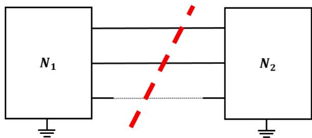  
Fig. 1. Cutting through wires (dashed line) of two networks using the compensation method.

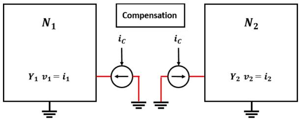  
Fig. 2. Ideal current sources to replace the compensation branch.

In Step $^ { 3 , }$ it is now possible to compute the branch currents $i _ { C }$ using:

$$
Z _ {C} i _ {C} = v _ {t h 2} - v _ {t h 1} \tag {4}
$$

where ${ \bf Z } _ { C } = { \bf Z } _ { t h 1 } + { \bf Z } _ { t h 2 } + { \bf Z } _ { B } . { \bf Z } _ { B }$ is the connecting component impedance matrix and it is zero when the connecting components are wires.

In Step 4, the set of currents $i _ { C }$ is used to apply compensation as shown in Fig. 2, using Eq. (1) and with all independent sources killed. The found final voltage vectors are

$$
\begin{array}{l} v _ {n 1} ^ {\text {f i n a l}} = v _ {n 1} + v _ {1 C} \tag {5} \\ \mathbf {v} _ {n 2} ^ {\text {f i n a l}} = \mathbf {v} _ {n 2} + \mathbf {v} _ {2 C} \\ \end{array}
$$

Where $\nu _ { 1 C }$ and $\nu _ { 2 C }$ result from the contributions of $i _ { C } .$

Steps 1, 2 and 4 can be run in parallel whereas Step 3 is computed sequentially. The classical nodal formulation has been used in this paper in network equation formulation due to initially available setup in [6]. Sparse LU decomposition is used to solve nodal equations.

For switching subnetworks, the compensation impedance matrix is updated and then re-factorized. It occurs each time a Thevenin equivalent impedance changes.

# 2.2. Parallelism mechanisms

The above CM is a decoupling method that can be combined with the classical solution based on natural delays of transmission lines. First, the network is split into several sub-networks according to the line-delays. Second, the CM can be applied to the subnetworks. Then, a task is created for each subnetwork for which Steps 1–2–4 are performed in parallel. The compensation task is dedicated to Step 4. The barrier mechanism handles data exchanges between compensation and subnetworks tasks. It is a common mechanism to synchronize threads in parallel. Two barriers are used: one to obtain all Thevenin equivalents (from each subnetwork), and another to broadcast the results of the compensation solution. Fig. 3 illustrates the case of three tasks compensation method with two barriers. It can be reduced to two tasks if the compensation computation is done within a subnetwork task.

After the splitting process, each task is mapped to a thread: one thread for each subnetwork and one thread for the compensation. The

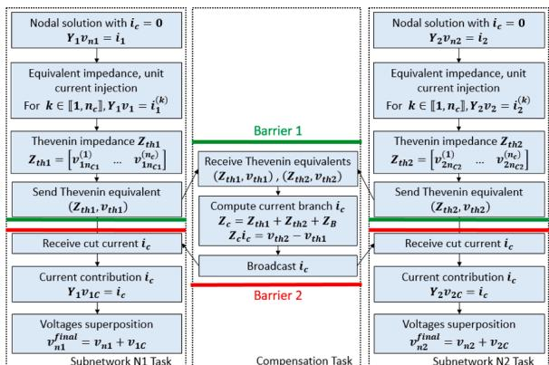  
Fig. 3. Overview of a three tasks compensation algorithm.

nodal solution and the computation of history currents of subnetworks is done in the same task. Each thread is executed in one simulation core. An automatic task mapping [16] can be run over this first mapping to allocate tasks from control systems or subnetwork split during line-delay analysis.

The compensation split is done manually in this paper. In most cases, it is a convenient method when the user knows where to cut the simulated for best performance gains. For very large networks, it can be automated using the BBD approach, see also [15].

# 3. Validation and performance

# 3.1. Distribuntion network

Very large distribution networks strongly benefit from the compensation decoupling used in this paper, as power lines have propagation delays smaller than the simulation time-step. The test network illustrated in Fig. 4 is a 20 kV distribution grid composed of 600 nodes connected to a 63 kV grid. It is a benchmark model from [6] with the same complexity as a national distribution grid [2]. Power lines are modeled with R-L impedances. According to EMT studies standard recommendations [3], this simplistic modeling can be used for studies which involve slow control response. It has the downside to slow down the simulation as no line-delays are available for decoupling. Loads are represented by a dynamic load model from [17] using controlled voltage sources. The tearing is feeder-cluster oriented and done manually as illustrated in Fig. 4. The test scenario is a 1 s simulation at 50 μs time step with a single-phase-to-ground fault of 1 mΩ located at the 20 kV side of the 63 kV/20 kV power transformer (Fig. 5). The 100 ms fault is initiated at t = 0.2 s. This test case can be considered as linear: the nodal admittance matrix is re-factorized at t = 0.2 s when the fault is initiated.

Two architectures are used. Arch1 is a laptop computer with Intel i7–6820HQ CPU @ 2.70GH. Arch2 is an OP5031 target 64 bits Linux with 32 cores (2 CPU Intel Xeon E5 3,2 GHz - 16 cores). Arch2 can be run in offline or real-time mode, Arch1 is only for the offline mode. For offline cases, the average realized time-step is measured. For real-time case, only SIL (Software-In-Loop) is run. The minimum time-steps with no overruns are displayed on the last column of Table 1.

Currents at the 20 kV feeder root (Fig. 6) are compared using the following relative error formula (Fig. 7):

$$
\frac {\left| e _ {\text {c o m p e n s a t i o n}} - e _ {\text {n o r m a l}} \right|}{\max \left(\left| e _ {\text {n o r m a l}} \right|\right)} \tag {6}
$$

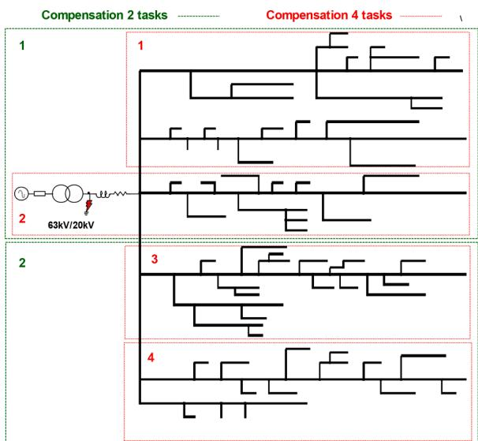  
Fig. 4. Tasks separation of a 600 nodes 20 kV feeder.

It is clear that for large linear distribution grids the compensation method is an efficient solution to parallelize network solution without compromising accuracy (as expected from theory). Only numerical noise is observed in Fig. 7. Additionally, it lowers the acceptable timestep for SIL real-time simulation.

# 3.2. HVDC test case

Networks with HVDC devices are another application for the CM as no power lines can be used to split the solution of large power converters. The test case is composed of the HVDC interconnection between France (Les Mandarins) and United Kingdom (Sellindge) called IFA2000 [18] in operation since 1986. It is composed of two LCC bipoles (Line Commutated Converter) of 1000 MW each. The operating voltage is set to +/- 272 kV. For EMT simulation, it can be considered as a switching network as the thyristors commute several times during the simulation. As depicted in Fig. 8, each DC pole is represented by two detailed 6-pulse bridges. Frequency dependent cable models [19] are used to represent the 73 km long DC cables. Filters are also modeled in detail. A model of the HVDC control system is imported from Matlab Simulink software using an EMT-Simulink interface [20]. 400 kV AC grids are modeled with a source and an impedance representing the short circuit level.

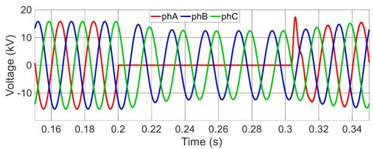  
Fig. 5. Three phase voltage at the feeder root during the mono-phase fault (normal case).

Table 1 Performance comparison between compensation and normal case.   

<table><tr><td>Test case</td><td>Nb Cores</td><td>Exec Time Arch1</td><td>Exec Time Arch2</td><td>RT Time Step</td><td>Speed up RT</td></tr><tr><td>Normal</td><td>1</td><td>221 μs</td><td>137 μs</td><td>145 μs</td><td>-</td></tr><tr><td>Parallel 1 cuts (comp2)</td><td>2</td><td>123 μs</td><td>67 us</td><td>73 μs</td><td>1,99</td></tr><tr><td>Parallel 3 cuts (comp4)</td><td>4</td><td>94 μs</td><td>38 μs</td><td>40 μs</td><td>3,63</td></tr></table>

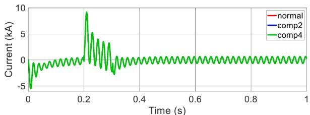  
Fig. 6. 20 kV Feeder root current superposition for the two splitting cases.

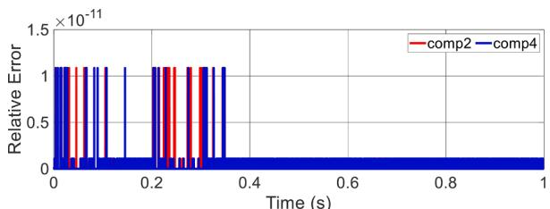  
Fig. 7. Relative error of the 20 kV feeder root current comparison.

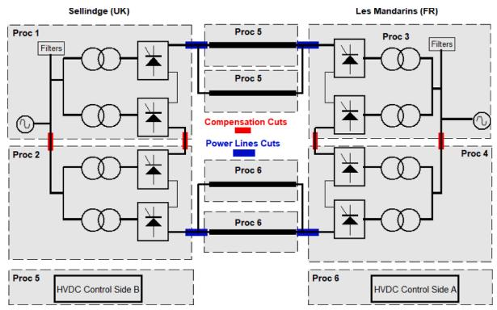  
Fig. 8. Overview of the IFA2000 modeling and task mapping for compensation method.

The natural delay of DC cables is used to decouple the solutions of the two converter stations. It results in six tasks with the solution of lines. However, the solution of converter stations is very complex and cannot be split without adding fictitious lines. The CM can be applied here to split each converter station solution in 2 subtasks as shown in Fig. 8. In detail, as network solutions of both converters are independent, two compensation tasks (Fig. 3) are created to compute compensation currents. Those tasks will be done within a substation task, respectively in Proc1 and Proc3.

When CM is not used, four cores are required. When CM is used, the entire system is solved on six cores. Performances of the solution of this system for real-time simulation are compared with a 30 μs time step. To illustrate, a 200 MW power transfer is set from Les Mandarins (France) to Sellindge (UK). Fig. 9 shows the execution time of the largest task solved for the circuit presented in Fig. 8. The real-time simulation runs on an industrial PC - OP5031 target 32 bits Linux with 32 cores (2 CPU Intel Xeon E5 3,2 GHz - 16 cores). A better computational speed is achieved with the CM. Better performance is also noticed when converters are deblocked at 6.3 s. The execution time increases when converters are deblocked because refactorization of the admittances matrices are required (thyristors are modeled with 2-value resistors). It avoids overruns observed in the normal case.

In Fig. 10, DC voltages are compared between the normal case and the compensation during the 10 s SIL simulation. The first spike is linked to transients from starting the simulation. About 6 s, the HDVC interconnection starts and thyristors commute.

Results show that the CM has improved the performance while keeping a good accuracy for a switching network. However, the relative error (Fig. 11) is higher than in the linear system presented in 3.1. This comes from several matrix re-factorizations using a constant pivot which increase the numerical errors. Moreover, if the compensation method is used to split further the network (for instance, decoupling the 6-pulse bridges), the simulation is instable. In theory, the compensation allows to cut everywhere in a network. However, application of the compensation method can result in ill-conditioned matrices (see also [14]). This can lead to higher numerical error and in some conditions to instabilities. Different pivoting strategies or scaling in the LU decomposition will be investigated in the next steps of this work to mitigate

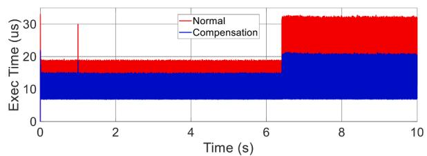  
Fig. 9. Execution time of the heaviest loaded processor for normal and compensation case SIL real-time simulation of 30 μs.

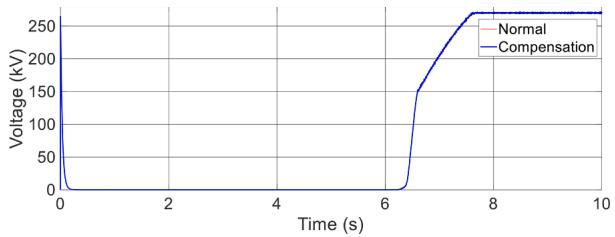  
Fig. 10. DC voltage for normal and compensation case.

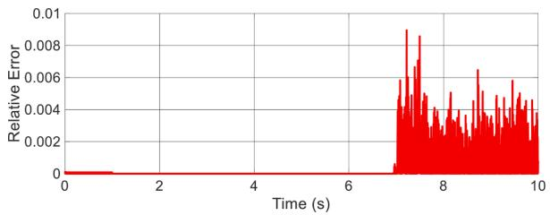  
Fig. 11. Relative error of the DC voltage between compensation and the normal case.

this issue.

# 3.3. HVDC HIL setup

# 3.3.1. AC fault

The validation in a Hardware-In-The-Loop environment is also done with the IFA2000 HVDC interconnection. modeling of the electrical system is the same than in previous section. In Fig. 12, the Simulink control system is replaced by the physical control and protection replica described in [18]. Inputs-Outputs (IOs) boards are used to interface the real-time simulator with the control replica. A 40 ms single phase to ground fault on the French side is simulated at maximum power transfer (1000 MW) from France to UK (Fig. 13). A 40 μs time step is selected and results are compared with and without compensation. The real-time simulation is run on an OP5031 target 32 bits Linux with 32 cores (2 CPU Intel Xeon E5 3,2 GHz - 8 cores). The CM needs 4 cores for the 4 substations whereas 3 cores are required for the normal case. Fig. 12 shows also the task mapping for compensation.

Fig. 14 shows the computed DC voltages with and without compensation. Moreover, the compensation offers better performances in terms of calculation speed with a gain of 40% in comparison with the classical decoupling method (Fig. 15).

# 3.3.2. Transformer energization

The same HIL setup is used to analyze the impact of a transformer energization on the French side [21]. To do so, a more detailed model of

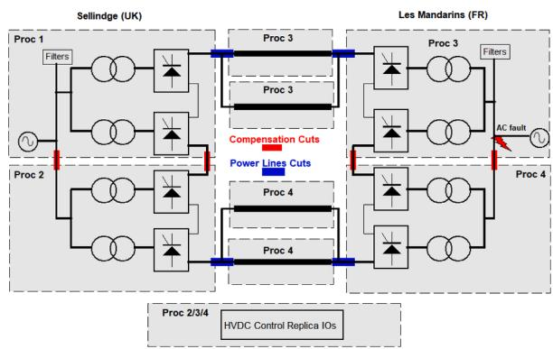  
Fig. 12. Overview of the HIL modeling step up and task mapping.

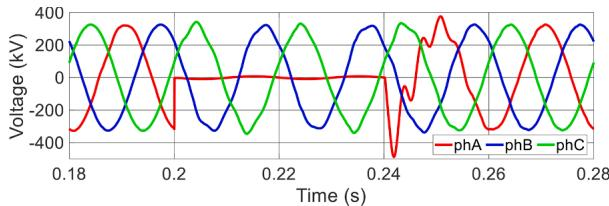  
Fig. 13. AC voltage at Les Mandarins during one phase-to-ground fault (normal case).

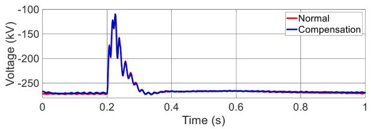  
Fig. 14. DC voltage for the one phase-to-ground fault.

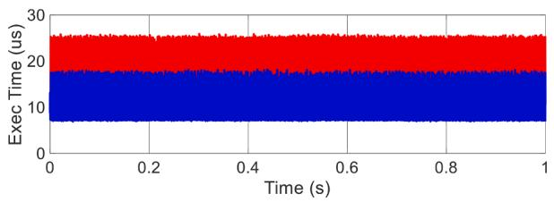  
Fig. 15. Execution of the heaviest loaded processor for normal and compensation cases.

the French AC grid is used (Fig. 16). Substations close to the IFA2000 converter station are detailed and a Frequency Dependent Network Equivalent (FDNE) [20] is used to represent the rest of the French network. Power transfer is set to 1000 MW from UK to France. Energization occurs in a t = 3 s (Fig. 17). Switching times are respectively for phase A, B, C, $\mathrm { { t } _ { A } = 1 2 8 }$ ms, t =129 ms, $\scriptstyle \mathrm { t _ { c } = } 1 1 9$ ms. This energization leads AC voltage disturbances, commutation on the French side and finally a permanent trip of the HVDC interconnection (Fig. 17). This test case runs at 40 µs. It requires 5 cores when the classical decoupling method is used. 8 cores are required when the CM is used.

For fast transients, the compensation method gives a similar response (Fig. 18). The shift observed comes from non-synchronize energization events and different replica states between the two simulations. Refactorization numerical errors in 3.2 can have an impact too. Before the whole interconnection trip, performances have still improved by 30% (Fig. 19).

# 4. Conclusions

The compensation method applied in this paper has demonstrated to be an efficient decoupling technique when there are no natural transmission line delays in the simulated system. The compensation method offers quite interesting performances in terms of computational speed while maintaining accuracy. The presented work demonstrates that this method allows to solve switching networks, such as HVDC and large distribution grids. It has been shown that the simulation time-step can be decreased for real-time EMT studies using the compensation method. To the authors best knowledge this is the first time that performances of the compensation method have been tested and documented for practical systems in a real-time environment. Some limitations have been identified. It is not always possible to cut everywhere without avoiding illconditioned matrices. Additionally, several re-factorizations can

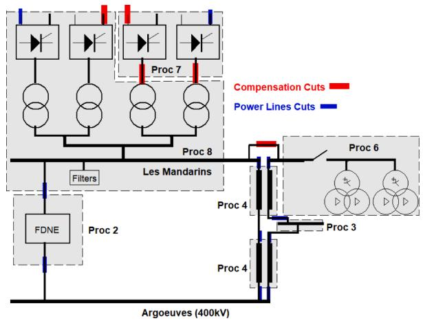  
Fig. 16. Overview of substations around Les Mandarins to study transformers energization.

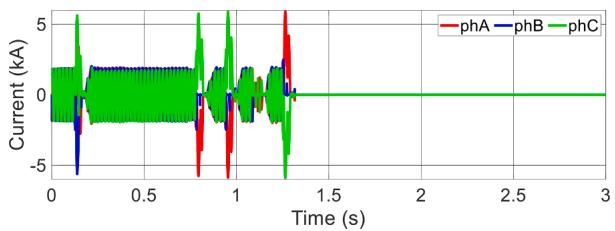  
Fig. 17. AC currents before a 6-pulse bridge (normal case).

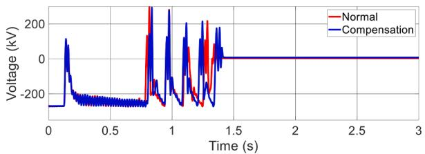  
Fig. 18. DC voltage under transformers energization and station trip for normal and compensation cases.

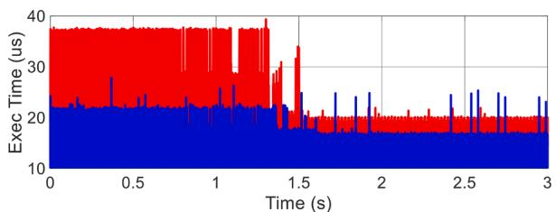  
Fig. 19. Execution time of the heaviest loaded processor for normal and compensation cases.

increase the numerical errors. Future works on the linear solver techniques are required to mitigate it.

# Credit_author_statement

Boris Bruned: Conceptualization, Investigation, Software, Validation, Visualization, Writing - Original Draft, Writing - Review & Editing.

Sebastien ´ Dennetiere ` : Supervision, Conceptualization, Validation, Writing - Original Draft, Writing - Review & Editing.

Julien Michel: Resources, Visualization, Writing - Review & Editing. Marco Schudel: Resources, Visualization, Writing - Review &

Editing.

Jean Mahseredjian: Supervision, Conceptualization, Writing - Original Draft, Writing - Review & Editing.

Nicolas Bracikowski: Supervision, Conceptualization, Writing - Review & Editing.

# Declaration of Competing Interest

The authors declare that they have no known competing financial interests or personal relationships that could have appeared to influence the work reported in this paper.

# References

[1] S. Dennetiere, H. Saad, Y. Vernay, P. Rault, C. Martin, B. Clerc, Supporting energy transition in transmission systems: an operator’s experience using electromagnetic transient simulation, IEEE Power Energy Mag. 17 (3) (May-June 2019) 48–60.   
[2] C. Dufour, G. Sapienza, Testing 750 node distribution grids and devices, in: 2015 International Symposium on Smart Electric Distribution Systems and Technologies (EDST), Vienna, 2015, pp. 572–578.   
[3] IEC 60071-4, Insulation Co-Ordination—Part4: Computational Guide to Insulation Co-Ordination and Modelling of Electrical Networks, 2004.   
[4] D.W. Durbak, Modeling Guidelines for Switching Transients, Modeling and Analysis of System Transients, IEEE Power Eng. Soc. Special Publ., New York, 1998.   
[5] S. Dennetiere, H. Saad, B. Clerc, J. Mahseredjian, Setup and performances of the real-time simulation platform connected to the INELFE control system, Electric Power Systems Research 138 (2016).   
[6] V.Q. Do, J.-.C. Soumagne, G. Sybille, G. Turmel, P. Giroux, G. Cloutier, S. Poulin, "Hypersim, an integrated real-time simulator for power networks and control systems," ICDS’99, Vasteras, Sweden, May 25-28, 1999.   
[7] A. Abusalah, O. Saad, J. Mahseredjian, U. Karaagac, L. Gerin-Lajoie, I. Kocar, CPU based parallel computation of electromagnetic transients for large scale power systems, in: Proceedings of the IPST conference 2017 (IPST 2017), Seoul, Republic of Korea, 2017.   
[8] T.F. Chan, T.P. Mathew, Domain Decomposition Algorithms, Cambridge University Press, 1994.

[9] L. Qian, D. Zhou, X. Zeng, F. Yang, S. Wang, A parallel sparse linear system solver for large-scale circuit simulation based on Schur complement, in: 2013 IEEE 10th International Conference on ASIC, Shenzhen, 2013, pp. 1–4.   
[10] S. Fan, H. Ding, A. Kariyawasam, A.M. Gole, Parallel electromagnetic transients simulation with shared memory architecture computers, IEEE Trans. Power Del. 33 (1) (Feb. 2018) 239–247.   
[11] W.F. Tinney, Compensation methods for network solutions by optimally ordered triangular factorization, IEEE Trans. Power Apparat. Syst. PAS-91 (1) (Jan. 1972) 123–127.   
[12] O. Alsac, B. Stott, W.F. Tinney, Sparsity-oriented compensation methods for modified network solutions, IEEE Trans. Power Apparat. Syst. PAS-102 (5) (1983) 1050–1060.   
[13] H.W. Dommel, Nonlinear and time-varying elements in digital simulation of electromagnetic transients, IEEE Trans. Power App. Syst. PAS–90 (6) (1971) 2561–2567.   
[14] J. Mahseredjian, S. Lefebvre, X.D. Do, A New Method for Time-domain modelling of nonlinear circuits in large linear networks, in: Power Systems Computation Conference 1993, Avignon, France, 1993.   
[15] J. Mahseredjian, A. Abusalah, O. Saad, Compensation, diakoptics, MATE and Bordered-Block-Diagonal methods for network solution parallelization, Polytech. Montreal (March 18, 2019).   
[16] B. Bruned, I.M. Martins, P. Rault, S. Denneti`ere, Use of efficient task allocation algorithm for parallel real-time EMT simulation, Electric Power Syst. Res. 189 (2020).   
[17] Load representation for dynamic performance analysis (of power systems), IEEE Trans. Power Syst. 8 (2) (May 1993) 472–482.   
[18] Y. Vernay, A. Drouet D’Aubigny, Z. Benalla, S. Denneti`ere, New HVDC LCC replica platform to improve the study and maintenance of the IFA2000 link, in: Proceedings of the IPST Conference 2017 (IPST 2017), Seoul, Republic of Korea, 2017.   
[19] B. Clerc, C. Martin, S. Denneti`ere, Implementation of accelerated models for EMT tools, in: Proceedings of the IPST Conference 2015 (IPST 2015), Cavtat, Croatia, 2015.   
[20] B. Bruned, C. Martin, S. Denneti`ere, Y. Vernay, Implementation of a unified modelling between EMT tools for Network Studies, in: Proceedings of the IPST Conference 2017 (IPST 2017), Seoul, Republic of Korea, 2017.   
[21] A. Petit, J. Michel, H. Saad, G. Torresan, C. Faure-Llorens, Y. Vernay, System studies on the French network including HVDC stations and using real-time simulation, Cigre Session, Paris (2020).