# Influence of frequency characteristics of soil parameters on ground-return transmission line parameters

Zhen Li a,∗, Jinliang He b, Bo Zhang b, Zhanqing Yub

a School of Electrical Engineering, Southeast University, Nanjing 210096, China   
b State Key Lab of Power System, Dept. of Electrical Engineering, Tsinghua University, Beijing 100084, China

# a r t i c l e i n f o

Article history:

Received 30 March 2015

Received in revised form 13 June 2015

Accepted 17 July 2015

Available online 26 September 2015

Keywords:

Electromagnetic transient analysis

Ground-return

Transmission line parameters

Frequency dependent

# a b s t r a c t

Electromagnetic transient processes are strongly related to the parameters of transmission lines. With the ground return parameters considered, the frequency dependent parameters of transmission lines are highly dependent on the soil parameters, which include resistivity and dielectric permittivity. In this paper, with the measurement results of frequency variation of soil parameters, the influence of the frequency dependent soil parameters on the frequency dependent characteristics of the transmission line parameters were studied using the complex return plane method. According to the calculation results, the frequency characteristics of soil parameters have obvious influences on the parameters of overhead transmission lines. The influences of the humidity, temperature and particle size of the soil on the groundreturn parameters were also evaluated.

© 2015 Elsevier B.V. All rights reserved.

# 1. Introduction

Ground return parameters have been considered to be very important in the evaluation of transient behavior of overhead transmission lines. In most literatures about evaluations of electromagnetic transient behavior on transmission lines, the parameters of the soil are considered to be constant. However, the parameters of the soil, including resistivity and dielectric permittivity, are significantly frequency dependent. With the frequency dependence of soil parameters considered, the ground return parameters can be quite different. Hence, the study on the frequency variation of soil parameters is very important to the electromagnetic transient analysis of power system.

The frequency dependent characteristics of the soil parameters have attracted much interest of many researchers. Many scholars had carried out researches on the frequency dependence of soil parameters [1–10]. Among these studies, Visacro et al. [5–8] used a buried electrode to get the frequency variation of the parameters of low and high resistivity soils, and the variation of soil parameters was determined in the respective frequency range of lightning currents, from the measured voltage and current waves and corresponding impedances. Based on the measurements, Visacro and Alipio [9] developed an empirical model to express the frequency

dependent soil parameters. Portela carried out a series of soil parameter measurements and evaluated the influence on the transmission line transient performance [10,11]. Moura et al. also made some researches on the impact of the frequency dependence of soil parameters on transient behavior of transmission lines [12,13].

On the other hand, a number of fundamental papers have developed expressions for line parameters with ground return [14–23]. Early researchers used a single logarithmic approximation of the integral term to express the ground return parameters [11–17]. For graphically interpreting this algorithm, Deri et al. [17] developed the concept of an ideal current return plane placed below the ground surface at a complex distance equal to the complex penetration depth for plane waves, which was first proposed by Wait in 1969 [18]. The parameter of the soil has great effect on the ground return parameters. In [19], Semlyen studied the sensitivity of the resistivity of the soil to the overhead line parameters. Actually, the dielectric permittivity also has great effect on the overhead line parameters [20]. Pizarro and Eriksson proposed a double logarithmic approximation in 1991, which can provide more accurate results of ground return parameters [21]. Similar to Deri’s single complex ground-return plane, Noda proposed a double complex ground-return plane to interpret the double logarithmic approximation [22].

In previous work [23,24], an experimental method for the measurement of the material characteristics was proposed to measure the frequency variation of the soil parameters directly. Different from Visacro and Alipio’s method, a broad band dielectric

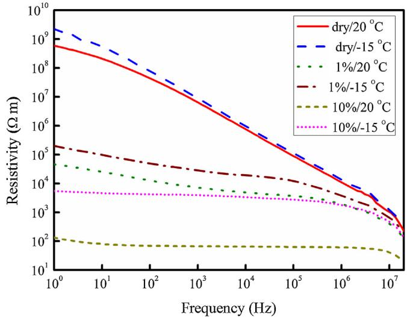  
Fig. 1. Frequency dependent characteristics of the resistivity of the soil sample.

spectrometer was used in the measurements. With the obtained frequency dependent soil parameters obtained in the previous work, this paper took the ground return into account and studied the effect of the soil parameters on the frequency dependent behavior of the overhead transmission line parameters. Furthermore, the temperature, moisture and density of soil were changed to investigate the influence of the soil parameters on the transmission line parameters.

# 2. Frequency characteristics of soil parameters

Soil is a very complicated system which usually has solid, liquid and gas compositions. The soil parameters will change with the frequency and also with the soil characteristics, such as the temperature, humidity and soil particle size.

In previous work, using a broad band dielectric spectrometer, the soil parameters in a certain frequency range were measured and the frequency variation curves of soil parameters were obtained [23,24]. The frequency variation of resistivity and relative permittivity are shown in Figs. 1.

According to Fig. 1, the soil resistivity decreases with the increase of the frequency, especially for the dry soil. The frequency dependent behavior of the soil with low humidity is more obvious.

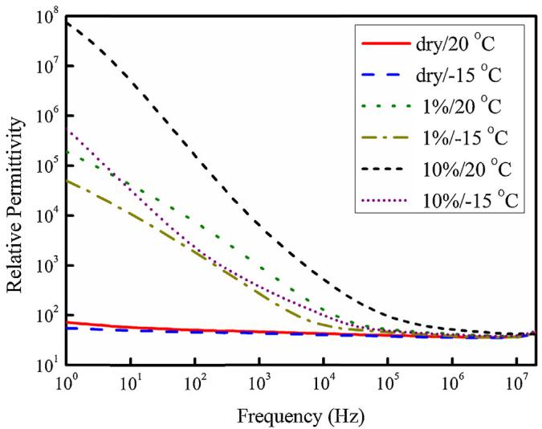  
Fig. 2. Frequency dependent characteristics of soil relative permittivity.

The temperature has little influence on the resistivity of soil with low humidity. However, with the humidity increases, this influence gets stronger. From Fig. 2, the permittivity of the soil decreases with the increase of the frequency. Along with the increase of the soil moisture content, the influence of the frequency on the soil permittivity increases. The permittivity of the soil with higher temperature is smaller. The influence of the temperature on the permittivity of wet soil is more obvious than the dry soil. The permittivity of dry soil is smaller than the soil with high humidity.

# 3. Frequency-dependent parameters of overhead transmission lines

The longitudinal impedance of the overhead transmission lines consists of internal impedance of the conductor and ground return impedance. The ground return impedance is high related to the soil parameters.

A quasi mode approach was presented by Semlyen [19] to analyze the influence of frequency-dependent soil parameters. This method is very similar to Deri’s method [17], but the value of the complex penetration depth p is different. In this paper, the value of p is calculated with (1)

$$
p = \frac {1}{\sqrt {j \omega \mu (\sigma + j \omega \varepsilon)}} \tag {1}
$$

where ω is the angular frequency of the wave;  is the permeability of the soil;  is the conductivity of the soil and ε is the permittivity of the soil. Expression (1) is the full type which is derivate from Maxwell equations. In [17], Deri neglect the permittivity and simplified the value of p as $1 / { \sqrt { j \omega \mu \sigma } }$ . However, with the frequency dependent soil parameter considered, the permittivity is unnegligible in high frequency range.

In the experiments of the previous work [23,24], the measurement results consist of real part and imaginary part:

$$
\varepsilon_ {P} = \varepsilon_ {1} - j \varepsilon_ {2} \tag {2}
$$

The real part of ε is the relative permittivity that we concerned, while from the imaginary part the resistivity can be calculated [19].

$$
\rho = \frac {1}{2 \pi f \varepsilon_ {0} \varepsilon_ {2}} \tag {3}
$$

Take the frequency characteristics of the conductivity  and the permittivity ε of the soil into account, subscribe (2) and (3) into expression (1), the complex penetration depth can be described as

$$
p = \frac {1}{\sqrt {j \omega \mu \left(\omega \varepsilon_ {0} \varepsilon_ {2} + j \omega \varepsilon_ {0} \varepsilon_ {1}\right)}} = \frac {1}{(j \omega \sqrt {\mu \varepsilon_ {0} \varepsilon_ {P}})} \tag {4}
$$

By assuming the overhead transmission lines are perfectly parallel to the ground, the ground return impedance of the lines can be evaluated with the complex penetration depth $p .$ .

$$
Z _ {i i} = j \omega \frac {\mu_ {0}}{2 \pi} \ln \frac {2 \left(h _ {i} + p\right)}{r} \tag {5}
$$

$$
Z _ {i j} = j \omega \frac {\mu_ {0}}{2 \pi} \ln \frac {\sqrt {\left(h _ {i} + h _ {j} + 2 p\right) ^ {2} + d _ {i j} ^ {2}}}{\sqrt {\left(h _ {i} - h _ {j}\right) ^ {2} + d _ {i j} ^ {2}}} \tag {6}
$$

where $h _ { i } , h _ { j }$ are the conductor height above ground; r is the conductor radius; $d _ { i j }$ is the horizontal distance between conductors i and $j .$ For most soils, the magnetic permeability $\mu$ is equal to that of vacuum, hence the relative permeability value was set as 1.

Both self impedance $Z _ { i i }$ and mutual impedance $Z _ { i j }$ consist of real part and imaginary part:

$$
Z _ {i i} = R _ {i i} + j \omega L _ {i i} \tag {7}
$$

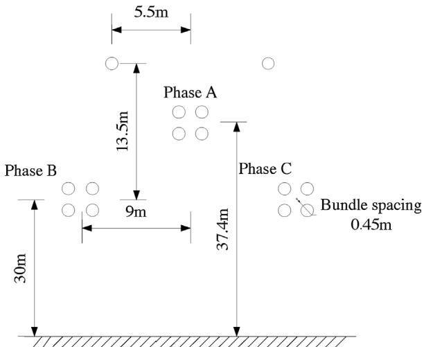  
Fig. 3. Conductor arrangement of a 500 kV overhead transmission line.

$$
Z _ {i j} = R _ {i j} + j \omega L _ {i j} \tag {8}
$$

The ground return impedance is actually the inductance of the conductors. But due to the ground return, it has both real part and imaginary part. For convenient, it was written separately as resistance and inductance as expression (7) and (8), which are actually the ohm part and Henry part of the ground return impedance.

# 3.1. Self impedance

Take a 500 kV overhead transmission line shown in Fig. 3 as the calculation example, the phase conductors have four split conductors and the bundle spacing of the conductors is 0.45 m. The soil parameters used in calculation is fine sandy soil with 10% moisture content in 20 ◦C.

The ground return impedance was calculated with frequency dependent soil parameters. Meanwhile the soil parameters measured in 50 Hz, 100 kHz, 1 MHz and 10 MHz were used to calculate the ground return impedance with frequency independent soil parameters. The self impedance of phase B is shown in Fig. 4. In the graph, the impedance was displayed with resistance and impedance separated as (7). In this example, the parameters of fine sandy soil with 10% moisture content in 20 ◦C were used.

According to Fig. 4(a), the difference between the self-resistance calculated by the constant parameter soil model and the frequency dependent parameter soil model is mainly in high frequency range above 1 kHz; while for the self-inductance, the distinction is mainly in low frequency range below 1 MHz. Among all the curves, the results of 50 Hz have the highest error, and the results of 1 MHz is the closest curve to results of the frequency dependent model.

From Fig. 4(b), it can be seen that when the frequency is higher than 10 kHz, the values of self-inductances calculated with different soil models are almost the same. In (4), the complex penetration depth is in inverse proportion to the frequency. When the frequency is higher than 1 MHz, the complex penetration is very small and expressions (7) and (8) can be simplified as:

$$
Z _ {i i} = j \omega \frac {\mu_ {0}}{2 \pi} \ln \left(\frac {2 h _ {i}}{r} + \frac {p}{h _ {i}}\right) \tag {9}
$$

$$
Z _ {i j} = j \omega \frac {\mu_ {0}}{2 \pi} \left(\ln \frac {\sqrt {\left(h _ {i} + h _ {j}\right) ^ {2} + d _ {i j} ^ {2}}}{\sqrt {\left(h _ {i} - h _ {j}\right) ^ {2} + d _ {i j} ^ {2}}} + \frac {2 p \left(h _ {i} + h _ {j}\right)}{\left(h _ {i} + h _ {j}\right) ^ {2} + d _ {i j} ^ {2}}\right) \tag {10}
$$

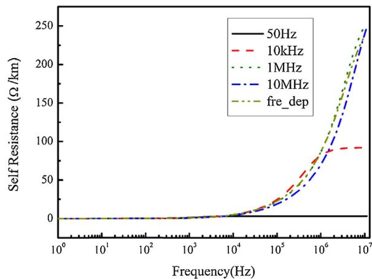  
(a)

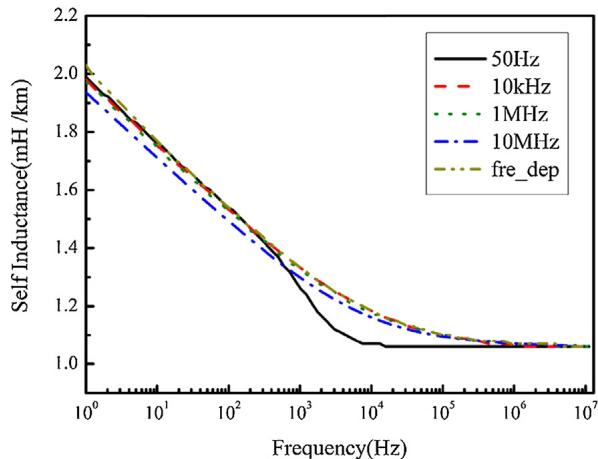  
  
Fig. 4. (a) Self-resistance and (b) self-inductance of phase B considering different frequency characteristics of fine sandy soil with 10% moisture content in 20 ◦C.

This simplification is only proper in high frequency range above 1 MHz. The expressions for inductance are:

$$
L _ {i i} = \frac {\mu_ {0}}{2 \pi} \ln \left(\frac {2 h _ {i}}{r} + R e \left(\frac {p}{h _ {i}}\right)\right) \tag {11}
$$

$$
L _ {i j} = \frac {\mu_ {0}}{2 \pi} \left(\ln \frac {\sqrt {\left(h _ {i} + h _ {j}\right) ^ {2} + d _ {i j} ^ {2}}}{\sqrt {\left(h _ {i} - h _ {j}\right) ^ {2} + d _ {i j} ^ {2}}} + R e \left(\frac {2 p \left(h _ {i} + h _ {j}\right)}{\left(h _ {i} + h _ {j}\right) ^ {2} + d _ {i j} ^ {2}}\right)\right) \tag {12}
$$

In (11) and (12), soil parameters can only affect the second term. For this reason, when the frequency is higher than 1 MHz, the influence of the soil parameters on the inductance is very small, and the inductances calculated with different soil models converge to the same value.

# 3.2. Mutual impedance

The mutual impedance between phase B and phase C conductors is shown in Fig. 5. It is also displayed with resistance (real part) and inductance (imaginary part). The curves of mutual impedance are similar to the curves of the self impedance.

# 3.3. Zero sequence and positive sequence impedances

In the simulation of transient on balance transmission lines, the phase parameters are usually transformed to mode parameters. In [25], Marti presented a method to simulate the transient

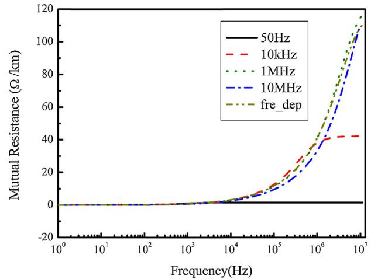  
(a)

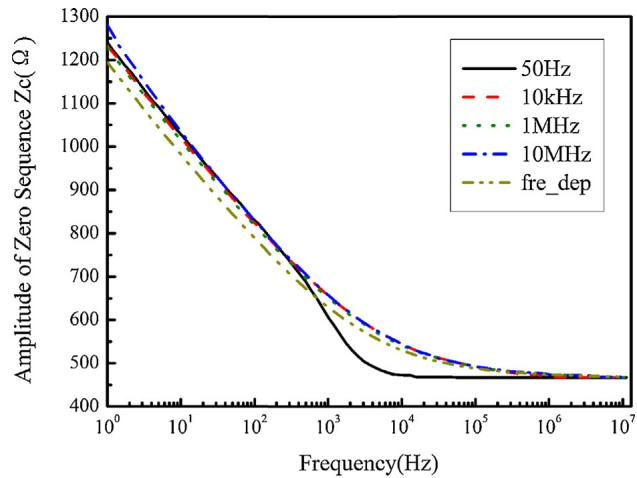  
(a)

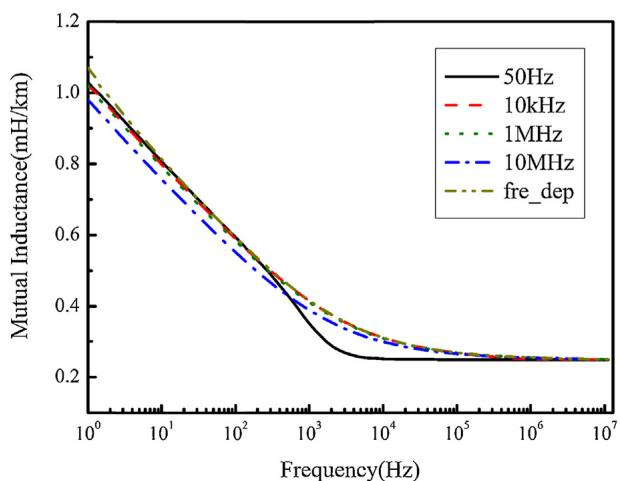

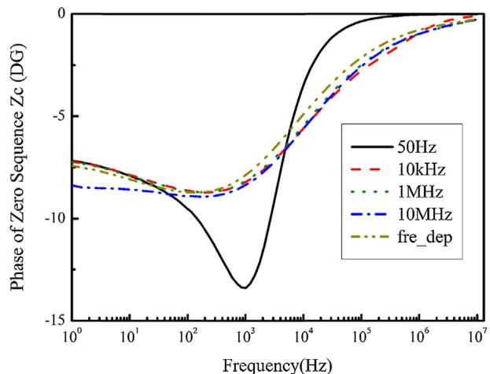  
Fig. 6. Amplitude and phase of zero sequence impedance considering different frequency characteristics of fine sandy soil with 10% moisture content in 20 ◦C.

(b)

Fig. 5. (a) Mutual resistance and (b) mutual inductance between phase B and phase C considering different frequency characteristics of fine sandy soil with 10% moisture content in 20 ◦C.

of frequency dependent transmission lines. In Marti’s method, the characteristic impedances were calculated with mode impedances and used in a rational function equivalent circuit.

Due to the complex penetration depth, the value of ground return admittance matrix Y of the lines is also frequency dependent. The capacitance matrix can be calculated with the potential coefficient matrix and the potential coefficient matrix is in proportion to the ground return impedance matrix Z.

$$
\mathbf {P} = \frac {1}{j \omega \varepsilon_ {0} \mu_ {0}} \tag {13}
$$

Ignore the conductance, the admittance matrix would be

$$
\mathbf {Y} = j \omega \mathbf {C} = j \omega \mathbf {P} ^ {- 1} = - \omega^ {2} \varepsilon_ {0} \mu_ {0} \mathbf {Z} ^ {- 1} \tag {14}
$$

Transform the impedance matrix and the admittance matrix to mode parameter matrixes. For balance lines, the model parameter matrix would be diagonal matrix.

$$
\mathbf {S Y S} ^ {- 1} = - \omega^ {2} \varepsilon_ {0} \mu_ {0} \mathbf {S Z} ^ {- 1} \mathbf {S} ^ {- 1} = - \omega^ {2} \varepsilon_ {0} \mu_ {0} (\mathbf {S Z S} ^ {- 1}) ^ {- 1} \tag {15}
$$

$$
\mathbf {Y} _ {\mathbf {m}} = - \omega^ {2} \varepsilon_ {0} \mu_ {0} \mathbf {Z} _ {\mathbf {m}} ^ {- 1} \tag {16}
$$

where S is the transform matrix; $\mathbf { Y _ { m } }$ and $\mathbf { Z _ { m } }$ are mode parameter matrixes after transformation.

In the calculation of characteristic impedance, the internal impedance of the conductors is unnegligible.

$$
Z _ {c} = \sqrt {\frac {Z _ {g} + Z _ {\mathrm {i n t}}}{Y _ {g}}} = \sqrt {\frac {Z _ {g} ^ {2} + Z _ {g} Z _ {\mathrm {i n t}}}{- \omega^ {2} \varepsilon_ {0} \mu_ {0}}} \tag {17}
$$

where $Z _ { g }$ and $Y _ { g }$ are diagonal elements of the mode ground return parameter matrixes, $Z _ { \mathrm { i n t } }$ is diagonal element of mode internal impedance matrix of the conductor. Due to the skin effect, $Z _ { \mathrm { i n t } }$ is also frequency dependent [26].

The amplitude and phase of zero sequence impedance is shown in Fig. 6. Compare the curves in Fig. 6, it can be observed that the constant parameter soil model is inaccurate in the frequency range below 1 MHz. In Fig. 6, the calculation result with parameters measured in high frequency is more close to the result of frequency dependent soil model. This conclusion is obtained by the results of fine sandy soil with 10% moisture content in 20 ◦C. However, this conclusion is not always true in all kinds of soil.

The same calculation was carried out with parameters of fine sandy soil with 0% moisture content in 20 ◦C and the results is shown in Fig. 7. In Fig. 7, it can be observed that for the soil with low humidity, the calculation results with soil parameters measured in low frequency fit better with the result of frequency dependent soil parameter.

The reason that makes the frequency characteristic of the impedance in Fig. 7 so different from Fig. 6(a) is the difference of the soil parameters. From Figs. 1 and 2, the resistivity of soil with

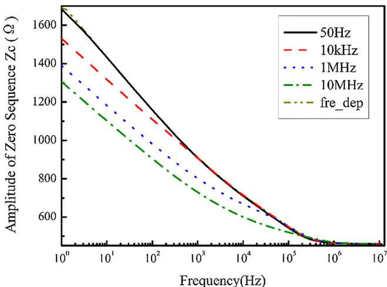  
Fig. 7. Amplitude of zero sequence impedance of transmission lines with dry soil.

10% moisture content varies very slowly with the change of frequency and the dielectric permittivity varies very fast. However, the performance of the dry soil is just contrary to the soil with 10% moisture content.

In (1), the complex penetration depth is related to both the conductivity and the dielectric permittivity of the soil. In low frequency range, compare with the conductivity, the influence of the dielectric permittivity is very small. While in the high frequency range, the influence of the conductivity is very small. As a result, in the calculation of transmission line parameters, accurate conductivity is more important in low frequency range while the dielectric permittivity is more important in high frequency range.

The soil is composed by solid particles and gaps between the particles. The gaps are filled with air and liquid (electrolyte solution). For electrolyte solution, the frequency variation of the permittivity is great and the frequency variation of the conductivity is very little. On the other hand, the air gap is just the opposite. For the soil with 10% moisture content, the gaps are filled with more liquid and less air. Thus the frequency variation of the conductivity is not obvious. The constant parameter soil model with the measured result in high frequency used can provide more accurate result. However, for dry soil, the gaps are filled with more air and less liquid. Hence frequency variation of the permittivity is not obvious and the constant parameter soil model with the measured result in low frequency range can provide more accurate result.

# 4. Influence of other factors on frequency characteristics of transmission line parameters

In the measurements of the previous work [23,24], the influence of several factors of the soil on the frequency characteristics of soil were tested, including the humidity, temperature and particle size. In this section, the transmission line parameters considering the frequency characteristics of the soil influenced by these factors were discussed.

# 4.1. Soil humidity

As discussed above, the soils with different moistures content have different frequency characteristics. This difference would certainly affect the frequency characteristics of transmission line parameters. Fig. 8 shows the influence of the soil humidity on the zero characteristic impedance of the transmission line shown in Fig. 3. The analyzed soil sample here is fine sandy soil with the temperature of 20 ◦C.

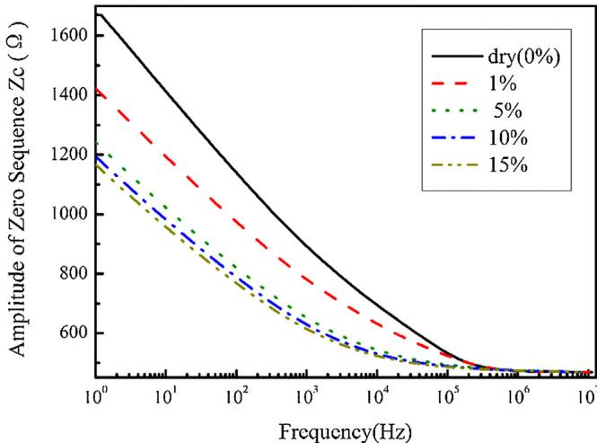  
Fig. 8. Amplitude of zero sequence impedance with different humidity of the soil.

From Fig. 8, it can be seen that the amplitude of the zero sequence impedance reduces with the increase of the soil humidity. And this implication is more obvious in low humidity soil. In the frequency range from 1 Hz to 100 kHz, the humidity has an obvious influence on the results. With the frequency rises, the influence gets smaller. When the frequency is higher than 1 MHz, the curves in different humidity converge to the same value.

# 4.2. Temperature

The temperature also affects the parameters of the soil and this influence will extend to the parameters of the transmission lines. Fig. 9 shows the influence of the temperature on the zero sequence characteristic impedance of the transmission lines. The analyzed soil sample is fine sandy soil with 10% moisture content.

The amplitude of the zero sequence impedance decreases with the increase of the soil temperature. This influence is more obvious when the temperature is below zero, in which situation the soil is frozen. When the frequency is higher than 1 MHz, then all curves on different temperatures will overlap.

# 4.3. Particle size

Different soil has different soil size distribution. As shown in Fig. 10, the frequency-variant parameters of the soils with three

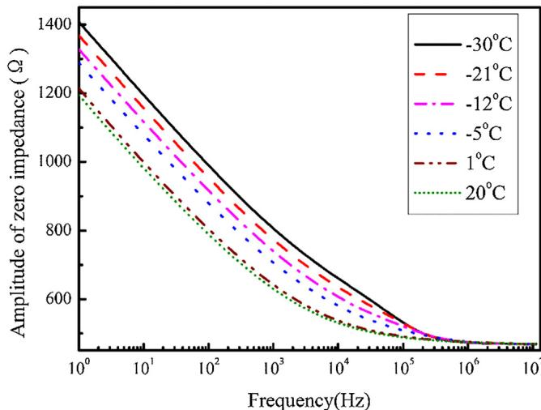  
Fig. 9. Influence of the temperature on the frequency characteristics of zero impedance.

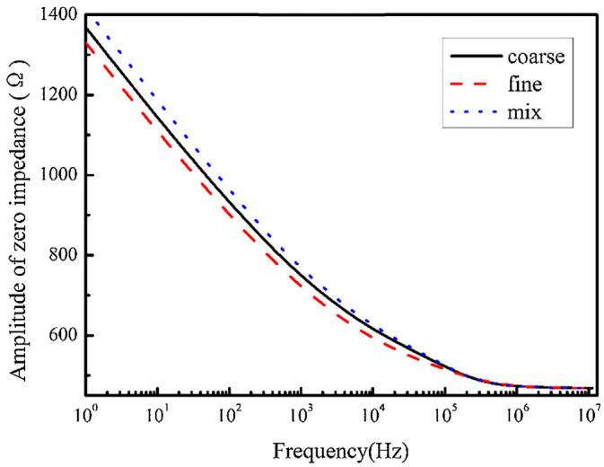  
Fig. 10. Influence of the size of soil particles on the frequency characteristics of zero impedance.

different particle sizes were adopted to calculate the frequency characteristics of the transmission line parameters. The temperature analyzed soil sample is $2 0 ^ { \circ } \mathsf C$ and the relative humidity is 10%. Compared with the influences of the water content and temperature, the influence of the soil size on the transmission line parameters is smaller. Like the other two factors, the influence of soil size is more obvious in low frequency range.

# 5. Conclusions

The ground return parameters of transmission lines are highly related to the soil parameters. In this paper, the complex return plane method was used to evaluate the ground return parameters of transmission lines. With the frequency characteristics of soil parameters considered, all parameters of overhead transmission lines are different from those under frequency independent soil parameters. The water content and temperature have strong influences on the parameters of transmission lines, while the influence of soil size distribution is relatively small.

Usually, the soil parameters in low frequency are used to calculate transmission line parameters. Seen in Fig. 4, when dealing with the soil with high humidity, the curves with 50 Hz soil parameters have huge difference with the ones considering soil frequency-dependent parameters. From the analysis, in some specified conditions, the constant parameter soil model can provide accurate results. Using the constant parameter soil model to evaluate the transmission line parameters with soil of high humidity, the soil parameters at high frequency around 1 MHz should be adopted. Then the obtained line parameters would be very close to the ones considering the frequency dependent characteristics of soil. However, for the transmission line parameters with soil of low humidity, the soil parameters at low frequency lead to more accurate results.

In most conditions, the result of constant parameter soil model is inaccurate. For the accuracy and reliability of the calculation, the frequency-dependent soil model is suggested to be adopted.

# References

[1] J.W. Yu, I. Neretnieks, Modelling of transport and reaction processes in a porous medium in an electrical field, Chem. Eng. Sci. 51 (19) (1996) 4355–4368.   
[2] E.D. Mattson, R.S. Bowman, E.R. Lindgren, Electrokinetic ion transport through unsaturated soil: 1. Theory, model development, and testing, Contam. Hydrol. 54 (2001) 99–120.   
[3] V.M. Cabrera, S. Lundquist, C. Vernon, On the physical properties of discharges in sand under lightning impulses, J. Electrostat. 30 (1993) 17–28.   
[4] H.S. Scott, Dielectric constant and electrical conductivity measurements of moist rocks: a new laboratory method, J. Geophys. Res. 72 (20) (1967) 5101–5115.   
[5] S. Visacro, C.M. Portela, Soil permittivity and conductivity behavior on frequency range of transient phenomena in electric power systems, in: Proc. Int. Symp. High Voltage Eng., n. 93.06, Germany, 1987, pp. 1–4.   
[6] S. Visacro, Experimental evaluation of soil parameter behavior in the frequency range associated to lightning currents, in: Proc. of 29th International Conference on Lightning Protection, June 2008, Uppsala, Sweden, 2008.   
[7] S. Visacro, M. Vale, M. Guimarães, R. Araújo, W. Pinto, R. Alípio, The response grounding electrodes to lightning currents: the effect of frequency-dependent resistivity and permittivity of soil, in: Proc. of 30th International Conference on Lightning Protection, Sept. 2010, Cagliari, Italy, 2010.   
[8] S. Visacro, G. Rosado, Response of grounding electrodes to impulsive currents: an experimental evaluation, IEEE Trans. Electromagn. Compat. 51 (Feb. (1)) (2009) 161–164.   
[9] S. Visacro, R. Alipio, Frequency dependence of soil parameters: experimental results, predicting formula and influence on the lightning response of grounding electrodes, IEEE Trans. Power Delivery 27 (Apr. (2)) (2012) 927–935.   
[10] C.M. Portela, J.B.<ET AL> Gertrudes, Earth conductivity and permittivity data measurements: Influence in transmission line transient performance, Electric Power Syst. Res. 76 (July (11)) (2006) 907–915.   
[11] A.C.S. de Lima, C. Portela, Inclusion of frequency-dependent soil parameters in transmission-line modeling, IEEE Trans. Power Delivery 22 (1) (2007) 492–499.   
[12] R.A.R. Moura, Macro A.O. Schroeder, et al., Influence of the soil and frequency effects to evaluate atmospheric overvoltages in overhead transmission lines Part I: The influence of the soil in the transmission lines parameters, in: XV International Conference on Atmospheric Electricity, 15–20 June 2014, Norman, USA, 2014.   
[13] Simone M.M. Lúcio, R.A.R. Moura, Macro A.O. Schroeder, Effect of variation of soil conductivity and permittivity with the frequency in longitudinal parameters of single-phase transmission lines, in: Proceeding of EX SIPDA, 2011.   
[14] J.R. Carson, Wave propagation in overhead wires with ground return, Bell Syst. Tech. J. 5 (1926) 539–554.   
[15] L.M. Wedepohl, A.E. Efthymiadis, Wave propagation in transmission lines over lossy ground: a new, complete field solution, Inst. Electr. Engnrs. Proc. 125 (6) (1978) 505–510.   
[16] L.M. Wedepohl, A.E. Efthymiadis, Propagation characteristics of infinitely-long single-conductor lines by the complete field solution method, Proc. Inst. Electr. Eng. 125 (6) (1978) 511–517.   
[17] A. Deri, G. Tevan, A. Semlyen, A. Castanheira, The complex ground return plane: a simplified model for homogeneous and multi-layer earth return, IEEE Trans. PAS100 (8)(1981)3686-3693.   
[18] J.R. Wait, K.P. Spies, On the image representation of the quasi-static fields of a line current source above the ground, Can. J. Phys. 47 (1969) 2731–2733.   
[19] A. Semlyen, Accuracy limits in the computed transients on overhead lines due to inaccurate ground return modeling, IEEE Trans. Power Delivery 17 (Jul. (3)) (2002) 872–878.   
[20] C. Portela, M. Tavares, J. Pissolato, Accurate representation of soil behavior for transient studies, Proc. Inst. Elect. Eng. Gen. Transm. Distrib. 150 (Nov. (6)) (2003) 736–744.   
[21] M. Pizarro, R. Eriksson, Modeling of the ground mode of transmission lines in time domain simulations, in: Proc. Seventh ISH, Dresden, Germany, 1991, pp. 179–182.   
[22] T. Noda, A double logarithmic approximation of Carson’s ground-return impedance, IEEE Trans. Power Delivery 21 (1) (2005).   
[23] Zhen Li, Jinliang He, Bo Zhang, Zhanqing Yu, Rong Zeng, The influence of frequency dependent soil parameters on transmission line, in: Proc. of 32nd International Conference on Lightning Protection, Oct. 2014, Shanghai, China, 2014.   
[24] Jinliang He, Rong Zeng, Bo Zhang, Methodology and Technology for Power System Grounding, Wiley, Hoboken, 2012.   
[25] J.R. Marti, Accurate modeling of frequency-dependent transmission lines in electromagnetic transient simulation, IEEE Trans. PAS 101 (1) (1982) 147–157.   
[26] Bhag Singh Guru, Huseyin R. Hiziroglu, Electromagnetic Field Theory Fundamentals, Cambridge University Press, New York, NY, 2004.