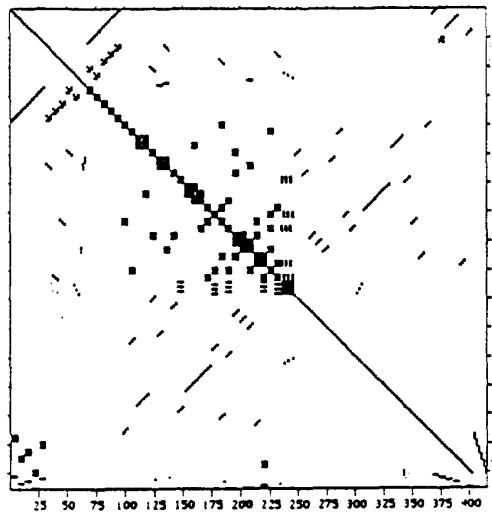
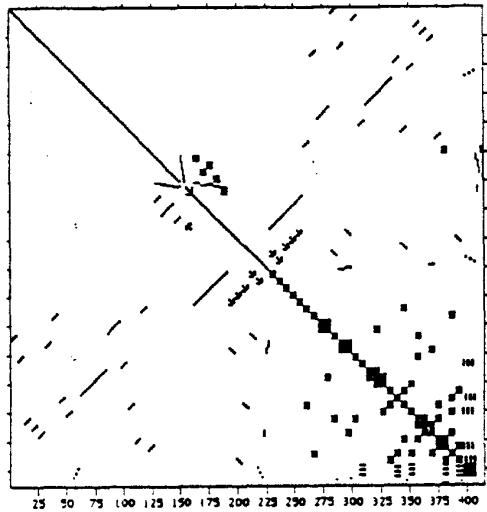
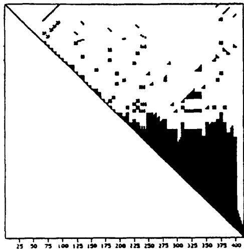
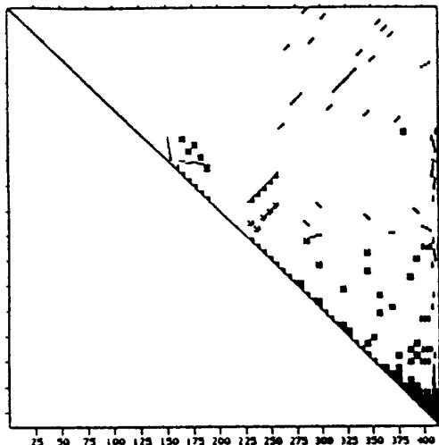
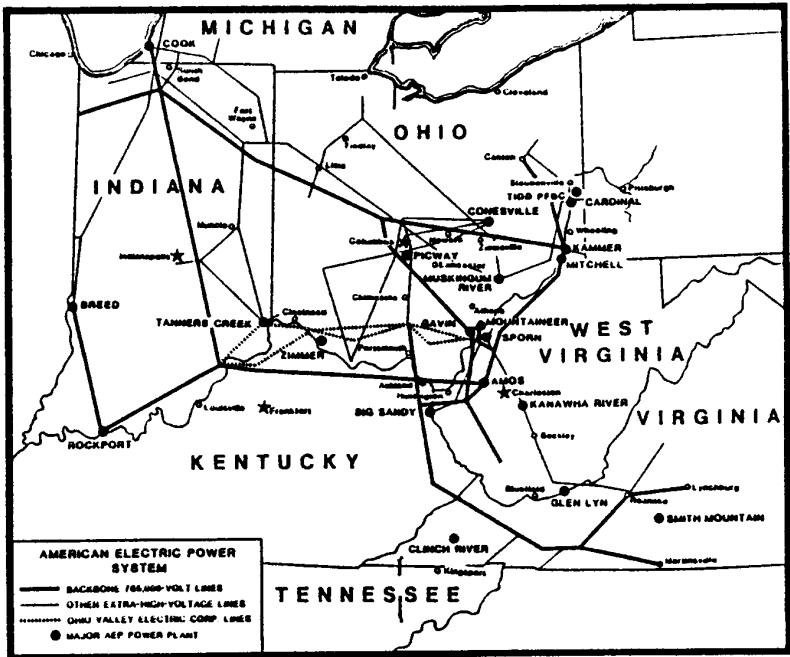
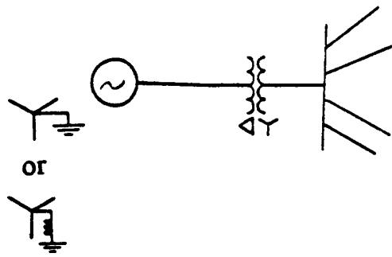

# MULTIPHASE POWER FLOW SOLUTIONS USING EMTP and NEWTONS METHOD

J.J.Allemong

R.J.Bennon

P.W.Selent

American Electric Power Service Corporation Columbus, Ohio

# ABSTRACT

This paper describes a reliable and very flexible multiphase load-flow solution process which is applicable for large transmission systems (up to 500 nodes). The process consists of an interface between the Electromagnetic Transients Program (EMTP) and a newly developed multiphase load flow algorithm that is based on the Newton-Raphson method. Subjects discussed include derivation of basic algorithm, structure of the Jacobian matrix, and convergence characteristics.

# INTRODUCTION

Well known and reliable methods exist today for solving AC single-phase power flow problems. Most of these are based on the Newton-Raphson method, which has become the method of choice. Single-phase load flows always assume balanced three-phase system operation, and are ideally suited for representing large transmission networks. Studies performed usually deal with long term area planning, bulk power transfers, or outages of a major component where the unbalance effects may not be especially significant or of concern. However, as the number of high-voltage untransposed transmission lines increases, the effects of unbalance become significant and need to be properly analyzed [1]. These effects lead to the malfunction of protective relaying and the presence of significant generator negative sequence currents.

Many of these unbalance studies, requiring three-phase analysis, have been performed at American Electric Power (AEP) over the past several years. They have been, and continue to be, conducted using the three-phase and phasor solutions of the existing Electromagnetic Transients Program (EMTP). Modeling limitations exist in this method and for future studies involving system operation under unbalanced reactor or open-pole conditions, the limitations will make this procedure quite difficult. Additional limitations include poor convergence and the inability to specify load flow constraints such as, specific bus voltage regulation, PQ output for single and three phase

93 WM 239-4 PWRS A paper recommended and approved by the IEEE Power System Engineering Committee of the IEEE Power Engineering Society for presentation at the IEEE/PES 1993 Winter Meeting, Columbus, OH, January 31 - February 5, 1993. Manuscript submitted August 10, 1992; made available for printing December 28, 1992.

generators and loads, etc. These limitations have also been recognized outside of AEP, by the EMTP EPRI/Development Coordination Group (EPRI/DCG). Consequently a project was initiated in which AEP, as an Associate member of the EMTP EPRI/DCG, would develop a full function three-phase load flow in EMTP.

A three phase load flow method was proposed in [3]. The intent of the present paper is to explore the viability of this method with respect to networks of practical size and complexity. The algorithm is based on Newton's method and addresses the previously stated limitations. The algorithm is capable of handling relatively large (practical) systems. A branch current method rather than a nodal method is used, resulting in greater flexibility for modeling loads and generators (e.g., delta connections). By integrating this into EMTP, full advantage is taken of EMTP's many network modeling routines (eg: transmission lines and transformers). Integration into EMTP also provides an accurate steady state network admittance matrix that does not need to be created by the load flow algorithm. Additionally, this integration provides a direct and more accurate steady-state initialization of dynamic and transient simulations. The multiphase load flow method is scheduled to be made available as part of the EPRI/DCG Version 3.0 EMTP.

# DERIVATION OF BASIC ALGORITHM

Modern single-phase load flow analysis uses real and reactive power mismatches to obtain a solution. Iterations are based on the relationship between power mismatches and voltage and angle mismatches. This relationship is established through the sparse Jacobian-matrix equation:

$$
\left[ \begin{array}{l} \Delta P \\ \Delta Q \end{array} \right] = \left[ \begin{array}{l l} H & N \\ & \\ J & L \end{array} \right] \left[ \begin{array}{l} \Delta \theta \\ \frac {\Delta V}{V} \end{array} \right] \tag {1}
$$

Analysis in terms of polar coordinates lends itself well to problems formulated in terms of power mismatches, and three-phase load flows have been developed based on this formulation [9]. However, as will be seen, three-phase load flows require generalized models of generators and loads. It is convenient to express the equations for these models in terms of nodal currents instead of nodal powers. This formulation largely offsets the advantages of using polar coordinates.

The multiphase load flow algorithm described in this paper is based on Newton's method. Rectangular coordinates are used along with system constraints and component models based on branch quantities [3]. By using a branch representation, components can be connected in any fashion, (delta connected loads, phase-phase voltage sources, etc.), thus allowing a greater flexibility and more accurate system representation. The network components are not difficult to model using this representation, and consist of: three-phase synchronous machines, voltage sources, current sources, single-phase PQ loads, and three-phase static PQ loads. The reader is referred to [3] for a discussion of these components and their constraint equations.

# Formulation of the Jacobian Matrix

The problem formulation consists of the expression of Kirchoff's Current Law and a set of constraint equations for the various non-linear elements. The effects of the linear elements (branches and shunts) are contained in the YBUS matrix while the non-linear elements contribute unknown currents. These currents are contained in a set of non-linear equations which define constraints that the solution is to satisfy. Equations 2-8 define the linear and non-linear equations used in the load flow algorithm, while Table 1 lists the constraints and controlling quantities used. The load-2 equations represent single-phase PQ loads, and the load-3 equations represent three-phase static loads.

$$
\text {n e t w o r k :} \left[ f _ {1} \right] = \left[ Y \right] [ V ] + \left[ I _ {s} \right] + \left[ I _ {m} \right] = 0 \tag {2}
$$

$$
\text {s o u r c e :} f _ {2} = \mathrm {V} _ {k} - \mathrm {V} _ {m} - \mathrm {E} _ {\text {s p e c f i e d}} = 0 \tag {3}
$$

$$
\text {l o a d - 2 :} f _ {3} = \mathrm {I} _ {\mathrm {k m}} ^ {H} \left(\mathrm {V} _ {\mathrm {k}} - \mathrm {V} _ {\mathrm {m}}\right) - (\mathrm {P} + j \mathrm {Q}) _ {\text {s p e c i f i e d}} = 0 \tag {4}
$$

$$
\text {m a s c h i n e :} f _ {4} = \mathrm {G} ([ \mathrm {I} _ {\text {k m}} ], [ \mathrm {V} _ {k} ], [ \mathrm {V} _ {m} ]) - \mathrm {F} _ {\text {s p e c f i e d}} = 0 \tag {5}
$$

$$
\operatorname {l o a d} - 3: f _ {5} = \left[ I _ {k m} \right] ^ {\mathrm {H}} \left(\left[ V _ {k} \right] - \left[ V _ {m} \right]\right) - (P + j Q) _ {\text {s p e c f i e l d}} = 0 \tag {6}
$$

$$
\text {m a c h i n e :} [ f _ {6} ] = = \left[ I _ {k m} \right] - \left[ Y _ {g} \right] \left[ V _ {k} \right] - \left[ V _ {m} \right] - \left[ E \right] = 0 \tag {7}
$$

$$
\operatorname {l o a d} - 3: \left[ f _ {7} \right] = \left[ I _ {k m} \right] - y [ K ] \left(\left[ V _ {k} \right] - \left[ V _ {m} \right]\right) = 0 \tag {8}
$$

# Where:

[Y] is the network node admittance matrix   
[V] is the vector of node voltages   
[Is] is the vector of known current sources   
[Iu] is the vector of unknown current sources   
[E] is the vector of machine internal voltages   
[Yg] is the machine's 3x3 internal admittance matrix   
[y] is the static load parameter y   
H means complex conjugate transposed   
[K] is the symmetric ratio matrix of ZPOS to ZZERO   
k.m are the terminal ends of the branch   
P,Q are the real and reactive power, respectively

Table 1 - Constraints and Controlling Quantities   

<table><tr><td>COMPONENT</td><td>CONSTRAINT</td><td>CONTROLLING QUANTITY</td></tr><tr><td>3-phase Loads</td><td>P, Q (3-phase)</td><td>y (equiv. admit.)</td></tr><tr><td>Swing Machine</td><td>IV+I, θ</td><td>E (internal voltage)</td></tr><tr><td>PV Machine</td><td>P 3φ, IV reg I</td><td>E (internal voltage)</td></tr><tr><td>PQ Machine</td><td>P,Q (3-phase)</td><td>E (internal voltage)</td></tr></table>

The elements comprising the Jacobian matrix are found by taking partial derivatives of the constraint equations with respect to node voltages, currents, machine internal voltages, and the static load parameter $y$ . Without any restructuring or reordering, the system of equations to be solved is:

<table><tr><td>\( \frac{\partial f_1}{\partial V} \)(y-bus)</td><td>\( \frac{\partial f_1}{\partial I\nu} \)</td><td>\( \frac{\partial f_1}{\partial I_L} \)</td><td>\( \frac{\partial f_1}{\partial I_m} \)</td><td>\( \frac{\partial f_1}{\partial I_{L3}} \)</td><td>0</td><td>0</td><td></td><td>ΔV</td><td rowspan="7">= -</td><td>\( \Delta f_1 \)</td></tr><tr><td>\( \frac{\partial f_2}{\partial V} \)</td><td>0</td><td>0</td><td>0</td><td>0</td><td>0</td><td>0</td><td></td><td>ΔIv</td><td>\( \Delta f_2 \)</td></tr><tr><td>\( \frac{\partial f_3}{\partial V} \)</td><td>0</td><td>\( \frac{\partial f_3}{\partial I_L} \)</td><td>0</td><td>0</td><td>0</td><td>0</td><td></td><td>\( \Delta I_L \)</td><td>\( \Delta f_3 \)</td></tr><tr><td>\( \frac{\partial f_4}{\partial V} \)</td><td>0</td><td>0</td><td>\( \frac{\partial f_4}{\partial I_m} \)</td><td>0</td><td>0</td><td>0</td><td></td><td>\( \Delta I_m \)</td><td>\( \Delta f_4 \)</td></tr><tr><td>\( \frac{\partial f_5}{\partial V} \)</td><td>0</td><td>0</td><td>0</td><td>\( \frac{\partial f_5}{\partial I_{L3}} \)</td><td>0</td><td>0</td><td></td><td>\( \Delta I_{L3} \)</td><td>\( \Delta f_5 \)</td></tr><tr><td>\( \frac{\partial f_6}{\partial V} \)</td><td>0</td><td>0</td><td>\( \frac{\partial f_6}{\partial I_m} \)</td><td>0</td><td>\( \frac{\partial f_6}{\partial E} \)</td><td>0</td><td></td><td>\( \Delta E \)</td><td>\( \Delta f_6 \)</td></tr><tr><td>\( \frac{\partial f_7}{\partial V} \)</td><td>0</td><td>0</td><td>0</td><td>\( \frac{\partial f_7}{\partial I_{L3}} \)</td><td>0</td><td>\( \frac{\partial f_7}{\partial y} \)</td><td></td><td>\( \Delta y \)</td><td>\( \Delta f_7 \)</td></tr></table>

Figure 1 - Jacobian Matrix

# Where:

f 1-7 correspond to branch equations 2 - 8   
V is the node voltage vector   
Iv is the vector of currents from voltage sources   
$I_L$ is the vector of currents for single-phase PQ loads   
$\mathbf{I}_{\mathrm{m}}$ is the vector of machine currents   
IL3 is the vector of three-phase static load currents   
E is the machine internal voltage vector   
$\mathbf{y}$ is the static load admittance   
$\Delta \mathbf{f}_{1-7}$ are the residual vectors (specified - calculated)

It is noted that the solution of (2) is conveniently carried out in rectangular coordinates, since it may be written as:

$$
Y _ {R} V _ {R} - Y _ {I} V _ {I} + j \left(Y _ {R} V _ {I} + Y _ {I} V _ {R}\right) + I S R + j I S I + I U R + j U I = 0 + j 0 \tag {9}
$$

# Where:

$\mathbf{Y}_{\mathbb{R}}, \mathbf{Y}_{\mathbb{I}}$ are the real and imaginary parts of the admittance matrix

$\mathbf{V}_{\mathbb{R}}$ $\mathrm{V_I}$ are the real and imaginary parts of the node voltage

ISR, ISI are the real and imaginary parts of the known currents

IUR, IUI are the real and imaginary parts of the unknown currents

The matrices $\mathbf{Y}_{\mathbb{R}}$ and $\mathbf{Y}_1$ are constructed by EMTP for the linear branches. If polar coordinates were used, the solution of (2) would be much more involved.

As in the case of the full Newton method in single-phase load flows, the elements of the coefficient matrix must be re-evaluated at each iteration. Furthermore, the rectangular formulation does not lend itself to $\mathbb{P} / \Theta$ and Q/Vdecoupling.[2]

# Characteristics of the Jacobian Matrix

The use of constraint equations at a branch level in rectangular coordinates leads to a unique form for the coefficient matrix. In the conventional single-phase load flow, the Jacobian matrix is symmetric in structure and has the same sparsity pattern as the network topology. The three-phase load flow problem formulation, as embodied in equations (2)-(8) and the nature of the three-phase constraint equations, leads to a coefficient matrix which is unsymmetric and relatively more dense than matrices encountered in single-phase load flows. In addition, zero diagonals are present and may not be "filled" during elimination, unless these rows are moved from their natural position to the bottom of the matrix. A closer look at the constraint equations for the network (2) and voltage sources (3) reveal that the partial derivatives are constant and do not need to be re-evaluated for each iteration.

# Ordering of the Equations

A characteristic of this method is that some of the equations, (voltage sources, PV and swing machines), produce zero diagonals. This affects the order in which the equations are eliminated, since the processing of rows with a zero diagonal must be delayed until the diagonal has "filled". At the same time, it is also desirable to order the processing of the rows to minimize (or reduce) the number of off-diagonal fill-ins created while also not violating the condition stated above.

If the reordering is to be determined by a conventional renumbering routine [4], the matrix structure must be made symmetric by adding zeros. Alternatively, a reordering scheme for unsymmetric matrices can be used. The authors chose to do the latter.

  
Figure 2 - LF3 Jacobian - Orig. Order Before Elimination

  
Figure 3 - Reordered LF3 Jacobian - Before Elimination   
Figure 4 - Original LF3 Jacobian - After Elimination

  
Figure 5 - Reordered LF3 Jacobian - After Elimination

The reordering is done only once, and is based on congruent permutations, that is, only diagonal elements are considered as pivots. The procedure is described below: [5]

1. For each row, $i$ , compute the product of the number of off-diagonal entries in row $i$ and the number of off-diagonal entries in column $i$ .   
2. Choose the row/column with the minimum product as the next one in the reordered system. Let this index be $i$ and simulate the Gaussian elimination of the off-diagonals in column $i$ , using the diagonal of row $i$ as the pivot. Ties are broken by choosing the lowest row number with the minimum count.   
3. Update the element counts in each row and column which are modified during the elimination. For example, suppose that element $(j,i)$ is eliminated and that a fill element is created in row $j$ at column $k$ . When the existence of this fill element is recognized, the element count of row $j$ and column $k$ are both incremented by one.   
4. Repeat steps 1-3 until all rows have been processed.

This scheme is a modest generalization of the well-known Tinney scheme 2 for symmetric matrices.[10] As a justification for the use of the product of row and column element counts as a measure for determining the ordering, the following heuristic argument is offered: When the diagonal of row $i$ is used as a pivot, the maximum number of potential fills which can be created in other rows is equal to the number of non-zero off-diagonals in row $i$ . Further, the number of rows in which these fills may be created is equal to the number of non-zero off-diagonals in column $i$ . Therefore, the product of the row $i$ count and the column $i$ count is a measure of the

number of potential fills accompanying the elimination of the non-zeros in column $i$ .

It should be noted that in the case of a symmetric matrix, the row $i$ and column $i$ element counts are equal and their product is the square of this count. Thus, choosing the next row in the ordering on the basis of the square of the count is equivalent to using the count itself; from which it follows that the unsymmetric scheme, when applied to a symmetric matrix, simplifies to Tinney's scheme 2.

Based on these heuristic arguments, one suspects that this unsymmetric reordering scheme will behave, with respect to the number of fill-ins generated, similarly to the Tinney scheme 2; however more investigation of the use of this algorithm in the three-phase load flow problem may be warranted.

During development of this scheme, it was discovered that zero-diagonals could still exist during elimination. It was found that these rows corresponded to network components with voltage constraints. (i.e., voltage sources, swing machine, and the V part of PV machines). To eliminate these occurrences, the associated rows are forced to the bottom of the matrix, and are not part of the reordering scheme. Table 2 compares the number of upper triangular elements after elimination for both original and reordered Jacobian matrices. To illustrate the results further, Figures 2-5 show a Jacobian matrix, for a 124 node case before and after elimination (original order and reordered). The "black" portions of Figures 4 and 5 represent the retained upper triangle elements after elimination. As seen in Figure 4, the matrix becomes very dense after elimination on the original ordered Jacobian matrix.

Table 2 - Comparison of Upper Triangle Sparsities   

<table><tr><td></td><td># ELEMENTS</td><td>% FULL</td></tr><tr><td>Original Order</td><td>21,321</td><td>24.82%</td></tr><tr><td>Re-ordered</td><td>3,781</td><td>4.40%</td></tr></table>

It was also discovered during the reordering, that the network admittance matrix [Y] does not change structure, rather merely shifts positions inside the Jacobian matrix. This is reasonable, since the admittance matrix is obtained in an optimal sparsity preserving order from the EMTP data assembly routines.

# Initialization

Convergence of the Newton-Raphson method has proven to be very sensitive to the starting voltages. Table 3 shows the effects that the starting voltages have on the convergence of a 443 node multiphase load flow case. As seen from the table, the conventional $1.0 \underline{0}$ per-unit voltage magnitude and angle is not usually applicable for the three phase load flow embed

ded in EMTP. This is because phase-shifting effects from wye-delta transformer connections are present in EMTP. Therefore, some special logic has been provided to calculate the initial point.

Table 3 - Starting Voltage vs. Convergence Behavior   

<table><tr><td>Starting Voltage Value</td><td>Convergence Behavior</td></tr><tr><td>1.0 ∠0°</td><td>A zero diagonal occurred during iteration process</td></tr><tr><td>Calculated from EMTP steady state solution</td><td>Diverged after 11 iterations</td></tr><tr><td>Calculated from three-phase initialization routine</td><td>Converged in 5 iterations</td></tr></table>

The initial voltages are obtained from the basic equation:

$$
[ \mathbf {Y} ] [ \mathbf {V} ] = 0 \tag {10}
$$

# Where:

[Y] is the network admittance matrix

[V] is the node voltage vector (unknown & known)

To solve this equation, at least one node to ground voltage must be known. (voltage sources or wye-connected swing machines). The matrices are rearranged such that all the known voltages are forced to the bottom. Equation (10) is then solved using Gaussian elimination, which is performed only on the nodes with unknown voltages. Back-substitution is then performed.

Ordinarily this method proves sufficient, however, there are some cases where this initial guess is not sufficiently close to the final solution. Reference [6] discusses various techniques to obtain a better starting point. A parameter perturbation technique that modifies the diagonal terms of nodes where single or three-phase PQ loads are represented is used. The modification involves the addition of an equivalent shunt admittance given by:

$$
Y = \frac {- (P - j Q) s p e c i f i e d}{V ^ {2}} \tag {11}
$$

# Where:

$\mathbf{Y}$ is the shunt admittance to be added

$\mathbf{V}$ is the node voltage

P-jQ is the specified power at the node

This leads to the following procedure for calculating the initial voltages. First, equation (10) is solved directly, resulting in a preliminary set of solved voltages. This set of voltages is then used to calculate the necessary shunt admittances given by equation (11). The appropriate diagonals in the admittance

matrix are then updated. This results in a modified admittance matrix which contains approximated PQ and PV constraints. Equation (10) is then re-solved using this modified admittance matrix. This produces a set of starting voltages to begin the Newton-Raphson method. Table 4 shows a comparison of some starting voltages for the 443 node load flow case, calculated with and without the addition of the shunt admittances. As seen in Table 3, only 5 iterations were needed for convergence using this method.

Table 4 - Starting Voltages and Solved Voltages   

<table><tr><td rowspan="2">Node Name</td><td rowspan="2">Solved Voltage (kV peak)</td><td colspan="2">Starting Voltage (kV peak)</td></tr><tr><td>w/o shunts</td><td>w/ shunts</td></tr><tr><td>Bus 765A</td><td>643.9</td><td>1295.0</td><td>541.7</td></tr><tr><td>B</td><td>640.1</td><td>1498.0</td><td>599.4</td></tr><tr><td>C</td><td>638.8</td><td>1170.0</td><td>571.4</td></tr><tr><td>Bus 345A</td><td>304.6</td><td>621.0</td><td>254.4</td></tr><tr><td>B</td><td>304.6</td><td>696.0</td><td>275.7</td></tr><tr><td>C</td><td>304.6</td><td>588.5</td><td>286.9</td></tr><tr><td>Bus 138A</td><td>119.9</td><td>191.3</td><td>90.4</td></tr><tr><td>B</td><td>119.9</td><td>246.9</td><td>103.7</td></tr><tr><td>C</td><td>119.9</td><td>208.2</td><td>101.2</td></tr></table>

# Results of Three-Phase Analysis

Two multiphase load flow test cases were used to carry out testing. The first case consisted of 75 load flow nodes, all at a nominal voltage of $765\mathrm{-kv}$ , with single-phase PQ loads and three-phase generators represented. The second case contained 443 load flow nodes with three-phase generators and three-phase PQ loads modeled. The voltages ranged in this case from $765\mathrm{-kv}$ to $13\mathrm{-kv}$ , and wye-delta transformer connections were represented.

# CASE #1

This case represented AEP's 765-kv network, and was used to compare the load flow solution to actual system conditions obtained through the AEP Data Acquisition System (DAS) and State Estimator. The voltage regulation for the three PV generators consisted of the magnitude of the positive sequence voltage at two of the generator terminals. The other regulation was at a remote bus and consisted of a phase to ground magnitude. Table 5 shows magnitudes of positive sequence bus voltages from the load flow solution and actual values. Table 6 shows calculated and actual line flows eminating from a four terminal load bus. The load flow case converged in 6 iterations with a specified PQ mismatch of $130\mathrm{kw}$ .

Table 5 - Comparison Of Positive Sequence Bus Voltages   

<table><tr><td>Bus Name</td><td>LF3 |VI</td><td>Actual |VI</td></tr><tr><td>Rockport</td><td>101.6</td><td>101.5</td></tr><tr><td>Greentown</td><td>99.8</td><td>100.1</td></tr><tr><td>Baker</td><td>97.5</td><td>97.5</td></tr><tr><td>Hanging Rock</td><td>98.1</td><td>98.2</td></tr><tr><td>Don Marquis</td><td>97.6</td><td>97.5</td></tr><tr><td>N. Proctorville</td><td>98.2</td><td>98.2</td></tr><tr><td>Marsville</td><td>99.0</td><td>99.1</td></tr><tr><td>Kammer</td><td>98.2</td><td>98.2</td></tr><tr><td>Gavin</td><td>98.5</td><td>98.5</td></tr></table>

Table 6 - Comparison of Line Flows   

<table><tr><td>Line Flow</td><td>LF3</td><td>Actual</td></tr><tr><td>HGRA - Bus 1</td><td>-338.07 - j150.68</td><td>-336.6 - j185.2</td></tr><tr><td>HGRA - Bus 2</td><td>324.52 + j145.18</td><td>324.5 + j146.2</td></tr><tr><td>HGRA - Bus 3</td><td>390.28 + j 52.33</td><td>389.0 + j100.9</td></tr><tr><td>HGRA - Bus 4</td><td>-374.87 - j 62.74</td><td>-376.3 - j 61.4</td></tr></table>

As seen from the two tables, the calculated results and actual values compare quite well. There is some mismatch in the reactive power flows which can be attributed to the representation of line charging used in the case.

# CASE #2

Case #2 was used to illustrate how the load flow algorithm performs under adverse conditions, such as low voltages or large phase angle differences. All loads were modeled as three phase loads and the PV generators regulated their positive sequence terminal voltages. To obtain low voltage conditions at a bus, one of three 765-kv transmission feeds was outaged, and real and reactive power loads were increased, at the bus in question as well as throughout the system.

Convergence of this case, from a flat start, occurred in 18 iterations to a specified PQ mismatch of $130\mathrm{kw}$ . Solved voltages ranged from $74\%$ to $93\%$ . Generator reactive power limits were enforced, resulting in generators being at their high reactive power limits and unable to maintain their scheduled voltages. Voltage unbalance, defined as the ratio of negative sequence voltage to positive sequence voltage [7], increased

from $0.33\%$ (system normal) to $1.22\%$ (outage condition). The unbalance stated was for a particular bus, but these same types of effects were seen on all buses. As seen from the number of iterations required, the alogarithm performs quite well for large systems subjected to adverse operating conditions. The relatively high number of iterations results from the algorithm checking limits on generator reactive outputs and their associated regulated voltages. This may be reduced if the case was started from a solved set of voltages rather than a flat start.

Figure 6 is a simple diagram of the system being used in these test cases. The second test case contains significantly more nodes (i.e., 443 as compared to 75 in the first case) because of a more detailed representation, including generator step-up transformers and system step-down transformers.

# Restrictions

Since the multiphase load flow algorithm interacts with EMTP, the well established EMTP rules and restrictions must be followed.[8] Two of the rules have been slightly "relaxed" for use with the multiphase load flow. They are delta connections for transformers, and the requirement for EMTP sources (type-14, etc).

The basic EMTP rule prohibiting isolated delta connection still holds true. However, connection of wye grounded three-phase synchronous generators to a delta-wye GSU can be accomplished without having to modify the corners of the delta windings by adding capacitors or resistance to ground.(see Figure 7). This type of configuration is detected for in the load flow algorithm, and applies to the steady state solution only. For transient simulations, this type of connection would have to be modified.

Also, EMTP defined sources need not exist for the load flow program provided that at least one voltage to ground is known in order to begin the solution process. This known voltage can be in the form of a SWING generator or a voltage source (EMTP or load flow). If a transient simulation is to automatically follow the load flow solution, EMTP sources would need to be defined to drive the transient solution since the load flow defined models are not present in the transient solution process.

# FUTURE EFFORTS

The intent of this paper has been to show that a multiphase load flow program has been developed with a reasonable amount of flexibility and modeling capabilities. However, as more experience is gained, other topics will need to be addressed. This includes: effects of phase-shifting and tap-changing transformers, representation of system boundary conditions, extended voltage regulation (i.e. avg. phase-phase), representation of load flow component models (PQ loads, PV genera

  
Figure 6 - System for Test Cases

tors etc.) in the transient solution. In addition, integration of this load flow and the flux-current iteration scheme [8], currently used in EMTP, needs to be investigated.

  
Figure 7 - Valid Load Flow Generator Connections

# CONCLUSIONS

This paper has reported on a three-phase load flow process which has been incorporated into EMTP. AEP performed this work in conjunction with its membership in EPRI/DCG. For the most part, the methods employed follow those reported in [3]. In addition, careful implementation has allowed practical sized systems (several hundred nodes) to be studied. Two case studies were presented. In the first, a load flow case was

formed from real-time, state estimation data and the calculated three-phase solution was seen to be very close to actual results. The second case was specifically designed to stress the algorithm. Despite low voltages, the case converged in a reasonable number of iterations, indicating that the algorithm is robust. Some discussion was also presented regarding solution initialization and modelling requirements. Future development work and user experience will undoubtedly lead to further improvements in this algorithm.

# REFERENCES

[1] R.G. Wasley and M.A. Shlash, "Newton-Raphson Algorithm for 3-phase Load Flow," IEEE Proceedings, vol. 121, No. 7, July 1974.   
[2] B. Stott and O. Alsac, "Fast Decoupled Load Flow," IEEE Trans. (Power Apparatus and Systems), vol. PAS-93, no. 3, pp. 859-869, May/June 1974.   
[3] W. Xu, J.R. Marti, and H.W. Dommel, "A Multiphase Harmonic Load Flow Solution Technique," IEEE Trans. (Power Systems), vol. 6, no. 2, pp. 174-182, Feb. 1991.   
[4] W.F. Tinney and C.E. Hart, "Power Flow Solution by Newton's Method," IEEE Trans. (Power Apparatus and Systems), vol. PAS-86, pp. 1449-1460, Nov. 1967.   
[5] H.M. Markowitz, "The Elimination Form of the Inverse and Its Application to Linear Programming," Management Science 3, 1957, pp. 255-269.

[6] H.W. Dommel, W.F. Tinney, and W.L. Powell, "Further Developments in Newton's Method for Power System Applications," Paper 70 CP 161-PWR, presented at IEEE PES Winter Meeting, New York, January 1970.   
[7] W. Xu, "A Multiphase Harmonic Load Flow Solution Technique," Dissertation submitted at The University of British Columbia, February 1990.   
[8] H.W. Dommel, "Electromagnetic Transients Program Reference Manual (EMTP Theory Book)," August 1986.   
[9] J. Arrillaga and C.P. Arnold, "Computer Modelling of Electrical Power Systems", John Wiley & Sons, 1983.   
[10] W.F. Tinney, J.W. Walker, "Direct Solutions of Sparse Network Equations by Optimally Ordered Triangular Factorization," Proc. IEEE, vol.55, No. 11, pp. 1801-1809, Nov. 1967.