# Electromagnetic modeling of inductors in EMT-type software by three circuit-based methods

Sadegh Rahimi Pordanjani a,* , Jean Mahseredjian a , Mohammed Naïdjate b , Nicolas Bracikowski b , Mircea Fratila c , Afshin Rezaei-Zare d

a Polytechnique Montr´eal, Montreal, Canada   
b University of Nantes, Nantes, France   
c EDF-R&D, ERMES Department, Paris, France   
d York University, Toronto, Canada

# A R T I C L E I N F O

Keywords:

Electromagnetic transients

Inductor modeling

Magnetic circuits

Duality

# A B S T R A C T

Three distributed circuit-based approaches based on Hopkinson analogy, Buntenbach analogy and duality principle are proposed in this paper to provide a detailed electromagnetic model of an inductor. The proposed approaches can provide several important aspects of finite element method (FEM), such as detailed geometrical representation and incorporation of magnetic saturation. In comparison to FEM, which has numerous obstacles in studying a magnetic device in a large network, the proposed approaches can be implemented in electromagnetic transient (EMT)-type software and thus can simulate the magnetic devices in a large network. The three circuit-based methods are first compared to each other, and then a 2-D finite-element method is used to validate them.

# 1. Introduction

Magnetic devices including inductors, transformers, and electric machines are key components in the power system. However, they are challenging to model due to the nonlinear behavior of magnetic core materials and the complex geometries. These devices are usually modeled using circuit simulators and field solvers.

FEM [1] can represent magnetic devices in great detail, taking into account nonlinear behavior as well as geometrical complexities. However, because they lack power system components like transmission lines and circuit breakers, they can’t be used to examine a magnetic device in a large network. To deal with this challenge, field solvers and circuit-based solutions can be coupled. Two common ways are used to provide the coupling: direct and indirect [2]. The direct method solves both the field and circuit equations simultaneously (as an example, see [3]). This method, however, is not appropriate for large power networks because it lacks sufficient power component models. The indirect technique solves field and circuit equations separately while keeping them connected via coupling coefficients (see [4] as an example). Because indirect methods use circuit simulators, they are able to consider the influence of large networks with various types of power

components on the magnetic device, which is not possible with direct methods. However, since indirect methods require numerous iterations between the field and circuit equations, they take a long time to compute and also have numerical delays. Both coupling-based systems can be extremely accurate, but they have significant drawbacks when it comes to implementation, such as long computation times and a variety of numerical problems. Additionally, when studying the magnetic devices in power systems, analysts prefer circuit-based models that are compatible with circuit simulation software like EMT-type tools. However, as discussed below, existing circuit-based techniques are not as accurate as FEM.

Circuit simulation software currently uses lumped models, which have a limited number of circuit components to account for the flux paths of magnetic devices. These models have the advantage of being computationally efficient, and they are sufficiently accurate for some analyses when full representation of magnetic flux paths and internal behaviors are not required. In these models, the equivalent components corresponding to the magnetic flux paths are estimated using analytical formulas by considering design data as input. These analytical formulas are nearly accurate in representing flux paths in the core, but not in representing the flux paths in the air, which are difficult to define. Thus,

they are incapable of accurately accounting for leakage fluxes between winding turns or fluxes that flow outside the core during saturation or fringing fluxes in cases with air gaps. Two general approaches have been used in the literature to increase the accuracy in portraying flux paths. First, some studies have improved the analytical formulas by estimating the overall picture of flux paths and even defining new elements for more detailed consideration of fluxes. For example, in [5], the magnetic equivalent circuit (MEC) has been improved to account for fringing and leakage fluxes. While these studies have improved accuracy, they are not general and are based on assumptions that are only valid in specific situations. Second, in some magnetic device modeling approaches, test data is used to estimate the components. Topological transformer models [6, 7] are one type of such models, in which the leakage inductances are estimated using short-circuit test data. However, accessing test data for devices with multiple windings is difficult and such data is not usable for specific studies, such as internal winding faults.

The lumped circuit-based models derive the equivalent circuits based on three different approaches: Hopkinson analogy [8], Buntenbach analogy [9], and the duality principle [10] named hereinafter, HBD-circuits. The Hopkinson analogy, often known as the reluctance-resistance analogy, is the oldest and most widely used approach. However, in some cases, this method has limitations, and the Buntenbach analogy and duality principle are favored. For example, the duality principle, which employs more standard electric elements to implement magnetic devices, is the method of choice in topological transformer models [6, 7] used in EMT-type software. Also, the Buntenbach analogy, or permeance-capacitance analogy, has lately been utilized to model magnetic devices in power electronic circuits [11, 12].

This paper proposes a distributed form of circuit-based methods for detailed modeling of magnetic devices. Our approach uses meshing in a way that it discretizes space into electric/magnetic circuits. This paper is trying to bridge the gap between the circuit-based techniques and FEM. In fact, the proposed models, like FEM, can give a full geometrical representation of magnetic flux paths, including leakage and fringing flux paths, as well as modeling non-homogeneous materials with magnetic saturation. Because each HBD-circuit has its own set of advantages and disadvantages, the proposed distributed method is developed using all three approaches. In [13], a distributed model based on the Hopkinson analogy was proposed to model transformers. The approach proposed in [13] enables the distribution of magnetomotive and electromotive force sources, which results in the distribution of magnetic flux across the device and also the distribution of voltage along the windings. They accomplished this by adding two additional virtual circuits, which necessitated the definition of new elements in EMT-type software. The addition of new elements to EMT-type software and the complexity of the model proposed in [13] are two obstacles that may discourage power system analysts from utilizing them. However, the approach described in our study does not need the establishment of virtual circuits or the definition of new elements in EMT-type software tools, and can be implemented using already available elements. Additionally, in [13], the distributed model was implemented solely using the Hopkinson analogy, not the Buntenbach analogy or duality principle; and in order to derive the Buntenbach and duality models from [13], new virtual circuits and elements must be defined, which not only complicates the models, but also contradicts the reason for the emergence of those rules. For instance, as explained in this paper, power system analysts chose duality because it allowed for the coupling of the magnetic and electric components of the model using ideal transformers without the need for additional complex elements. In this paper, it is demonstrated that all three of the proposed models can be implemented in EMT-type software using already available elements, similar to the work done in [14] where the lumped HBD-circuits were implemented in EMTP [15]. This allows to study the internal behavior of a magnetic device in a large network. Finally, the approach presented in this paper can be used to model the majority of low- and mid-frequency transients associated with magnetic devices (transformers and inductors), as it

accurately represents leakage inductances (short-circuit impedances) and saturation. However, in order to make the model capable of representing a wide range of frequency transients, including high-frequency ones, additional parameters such as eddy current losses, iron core losses, and capacitive coupling can be incorporated into the model, which will be discussed in more detail in later publications.

In this paper, we present a general methodology that, starting from the geometry mesh, allows obtaining the equivalent circuits for all three HBD-circuits. An inductor with and without air-gap is used as case of study. This paper explains how to build all circuits using already available elements in EMTP. The obtained results are compared to each other, and they are validated with a FEM solver [16].

# 2. Methodology

In this section, a single-phase shell-type inductor is investigated. It is supposed that the inductor is connected to a voltage source $U _ { i n }$ through a resistance $R _ { i n } .$ . The schematic of the studied inductor is presented in Fig. 1. The inductor has been subdivided into 18 identical cells where each cell is represented using an equivalent circuit. In this study, the flux paths were only assumed in the horizontal and vertical axes.

# 2.1. Electromagnetic modeling by Hopkinson analogy

The oldest circuit-based approach is the Hopkinson analogy. In this circuit analogy, reluctances, magnetomotive forces, and magnetic fluxes are represented by resistors, controlled voltage sources, and currents, respectively [15, 16]. As can be seen in Fig. 1, the circuits of the Hopkinson cells are composed of reluctances and magnetomotive force sources. In this circuit the flux paths are represented by the reluctances which are derived by analytical formula. To derive the values of magnetomotive force sources, Ampere’s law and the boundary conditions are applied. The Neumann boundary condition [17], is imposed at the external sides of the inductor. The Neumann boundary condition can be fulfilled by eliminating the reluctances perpendicular to the exterior sides of the inductor. In Fig. 1, dashed blue reluctances are used to show eliminated reluctances. To apply Ampere’s law, the values of magnetomotive force sources are chosen in a way that the sum of them in a closed loop should be equal with the ampere-turn passing through it (the total enclosed current for the loop). For instance, for the green loop shown in Fig. 1(a), which encloses three turns of the winding, the sum of the magnetomotive forces is three times the current, which is equal to the ampere-turns passing through it. To take the coupling between the electric circuit and the magnetic circuit into account, Faraday’s law should be applied in distributed form. Fig. 1(b) demonstrates the schematic diagram for illustrating the total magnetic fluxes enclosed by each turn. From Fig. 1(a) and (b), and based on Faraday’s law, the voltages induced in each turn are given by

$$
\left[ \begin{array}{l} E _ {A B} \\ E _ {C D} \\ E _ {E F} \\ E _ {G H} \end{array} \right] = - \frac {d}{d t} \left[ \begin{array}{c c c c c c c c} 0 & 0 & 0 & 0 & 0 & 1 & 1 & 0 \\ 0 & 1 & 1 & 0 & 0 & 0 & 0 & 0 \\ 0 & 0 & 0 & 0 & 1 & 1 & 1 & 1 \\ 1 & 1 & 1 & 1 & 0 & 0 & 0 & 0 \end{array} \right] \left[ \begin{array}{l} \phi_ {1} \\ \phi_ {2} \\ \phi_ {3} \\ \phi_ {4} \\ \phi_ {5} \\ \phi_ {6} \\ \phi_ {7} \\ \phi_ {8} \end{array} \right] \tag {1}
$$

where $E _ { A B } , E _ { C D } , E _ { E F }$ and $E _ { G H }$ are the induced voltages in the turns AB, CD, EF, and GH, respectively. Moreover $\phi _ { 1 } , \phi _ { 2 } , \phi _ { 3 } , . . . , \phi _ { 8 }$ are the magnetic fluxes for the magnetomotive forces displayed in Fig. 1(a). The total induced voltage $E _ { t o t }$ is found from the sum of loop voltages

$$
E _ {t o t} = - \frac {d}{d t} \left(\phi_ {1} + 2 \phi_ {2} + 2 \phi_ {3} + \phi_ {4} + \phi_ {5} + 2 \phi_ {6} + 2 \phi_ {7} + \phi_ {8}\right) \tag {2}
$$

Finally, by considering the relations and laws mentioned above, the interface between the magnetic and electric circuits is derived as

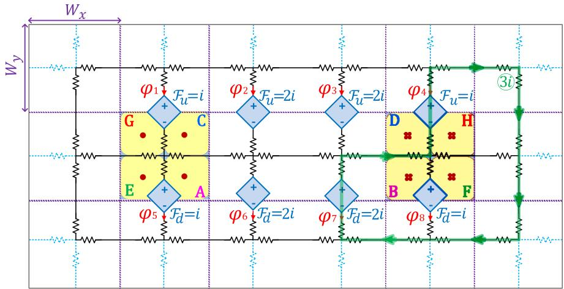

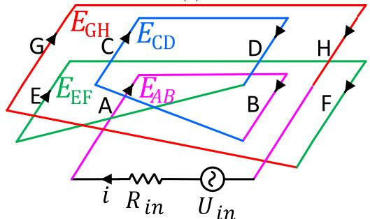  
(a)   
(b)   
Fig. 1. (a) Distributed magnetic circuit with magnetomotive forces, (b) schematic of inductor winding turns and external circuit.

illustrated in Fig. 2. The magnetic and electric circuits have been shown in black and blue, respectively. It is obvious that the sum of electromotive force sources distributed in the electric circuit is equal to $E _ { t o t } ,$ . The resistance $R _ { t o t }$ is equal to the sum of winding resistance $R _ { w }$ and external circuit resistance $R _ { i n } .$ . The current-controlled voltage sources have been applied to provide coupling between the magnetic and electric circuits. Each pair of current-controlled voltage sources in the equivalent circuit $\cot \operatorname { F i g } . 2 ,$ , is a specific type of mutator element: Type-2 L-R mutator [18]. The schematic of the Type-2 L-R mutator is illustrated in Fig. 3(a). Two coupled series R-L branches can be used to implement this type of mutator in EMT-type programs [14]. The values of self and mutual resistances and inductances associated with the two branches, are specified as follows:

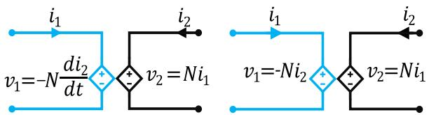  
(a)   
(b)   
Fig. 3. (a) Type-2 L-R mutator, (b) Type-1 L-C mutator.

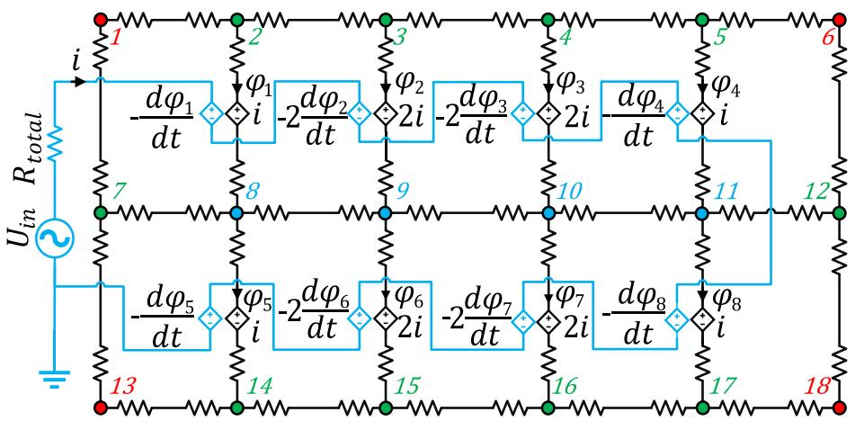  
Fig. 2. Distributed inductor model using Hopkinson analogy.

$$
\left[ \begin{array}{l} v _ {1} \\ v _ {2} \end{array} \right] = \left[ \begin{array}{l l} 0 & 0 \\ N & 0 \end{array} \right] \left[ \begin{array}{l} i _ {1} \\ i _ {2} \end{array} \right] + \left[ \begin{array}{c c} 0 & - N \\ 0 & 0 \end{array} \right] \frac {d}{d t} \left[ \begin{array}{l} i _ {1} \\ i _ {2} \end{array} \right] \tag {3}
$$

where N is the coupling factor of the mutator. The left part of the circuit shown in Fig. 3(a), denotes the electric circuit and the right part denotes the magnetic circuit.

The Hopkinson analogy has drawbacks in representing the physical behaviors of magnetic devices. The first drawback is associated with energy. The electric resistance is an energy dissipative component and not a proper analog of magnetic reluctance, an energy-storing component [10, 19]. Furthermore, inductors (energy-storing components) must be utilized to represent energy dissipation in the core. Finally, the resistance does not allow defining an initial value condition for inductor current. To consider the initial condition, a series DC voltage source must be added to the resistance. But the added DC source should be connected only at $t = 0$ and should be disconnected at t>0 [14] which raises complexities in EMT-type simulations.

# 2.2. Electromagnetic modeling by Buntenbach analogy

The Buntenbach analogy can overcome the mentioned problems arising from Hopkinson analogy. In this approach, the capacitors are applied as substitutes for resistors. The capacitor plays the role of permeance Λ. In this method, the electric flux ψ and electromotive force E are the counterparts of the magnetic flux ϕ and magnetomotive force ${ \mathcal { F } } ,$ respectively. In addition, the electric current i in the electric domain, represents time-derivative of magnetic flux $d \phi / d t$ in the magnetic domain. The unit of i is Coulombs/second (C/s) and the unit of dϕ /dt is Webers/second (Wb/s). Both these variables represent time rate of changes [9]. But in Hopkinson analogy, the electric current i as a time rate of change variable is used to represent the magnetic flux ϕ which is not a time rate of change variable. Because of the aforementioned reasons, the Buntenbach analogy is preferred over Hopkinson in modeling transformers and inductors in some power system [20] or power electronic applications [12]. To derive the equivalent circuit for the distributed Buntenbach analogy, the meshes and the nodes are the same as the meshes and the nodes for the equivalent circuit derived for Hopkinson analogy, but the resistances in Hopkinson analogy are replaced with capacitances. Additionally, for the coupling of the magnetic circuit with the electric circuit, another mutator termed Type-1 L-C mutator is employed [21] which is displayed in Fig. 3(b). In the equations of Type-1 L-C mutator, the values for resistors and inductors are set differently from (3) as

$$
\left[ \begin{array}{l} v _ {1} \\ v _ {2} \end{array} \right] = \left[ \begin{array}{l l} 0 & 0 \\ N & 0 \end{array} \right] \left[ \begin{array}{l} i _ {1} \\ i _ {2} \end{array} \right] + \left[ \begin{array}{l l} 0 & - N \\ 0 & 0 \end{array} \right] \frac {d}{d t} \left[ \begin{array}{l} i _ {1} \\ i _ {2} \end{array} \right] \tag {4}
$$

The complete Buntenbach circuit is now shown in Fig. 4.

# 2.3. Electromagnetic modeling by Duality pricniple

Another commonly used approach is duality. Duality converts a magnetic circuit to an equivalent electric circuit. The duality principle uses inductance to model reluctance [9, 22]. Accordingly, this approach has the advantage of Buntenbach analogy for supporting a physically correct model. It is used in modeling transformers $[ 6 , 7 ]$ since it couples the circuit’s magnetic and electric sections with ideal transformers, which are available in some circuit simulation software. Based on mathematical analysis from [9] and [22], these rules are employed to derive the electric dual circuit of the magnetic circuit. The mesh and node equations in the magnetic circuit are respectively converted to node and mesh equations in the electric circuit. Furthermore, the parallel and series elements in the magnetic circuit become the series and parallel elements in the electric circuit, respectively. The dual of the voltage source is the current source and vice versa. Furthermore, the current i is now the representative of the magnetomotive force F , and the electromotive force E is the representative of the time-derivative of magnetic flux dϕ/dt [9, 22].

It can be observed that the graph of the magnetic circuit in Fig. 2 is a planar graph, and a dual circuit can be obtained for it [22]. Therefore, by considering all the rules mentioned above, the dual circuits for various cells (sections) of the magnetic circuit are derived. As illustrated in Fig. 5 and Fig. 6, the cells, comprised of resistors that have a common node, are converted to dual cells, comprised of inductances enclosed in a mesh. Besides, as demonstrated in Fig. 6 the controlled voltage source of the magnetic side in the Type 2 L-R mutator, the circuit of Fig. 6(a), is converted to the controlled current source, the circuit of Fig. 6(b). The relations between the two sides of the derived circuit, in Fig. 6(b), are given by

$$
\left[ \begin{array}{l} i _ {1} \\ v _ {1} \end{array} \right] = \left[ \begin{array}{c c} 1 / N & 0 \\ 0 & N \end{array} \right] \left[ \begin{array}{l} i _ {2} \\ v _ {2} \end{array} \right] \tag {5}
$$

It is apparent that (5) describes the equations of an ideal transformer with ratio N:1. Accordingly, for deriving the duality circuit, the coupling element is modeled using an ideal transformer, as displayed in Fig. 6(c). Fig. 10 presents the distributed duality-based circuit resulted from the distributed resistive circuit shown in Fig. 2.

# 3. Validation

In this section, the HBD-circuits introduced in the previous section are improved and studied for an inductor. Its winding includes 100 turns. Two different core designs are considered: without air gap (gapless core) and with an air gap (gapped core). The dimensions of the core and the winding are shown in Fig. 11. The winding material is copper, and the core material is soft iron. The two main goals of this section are

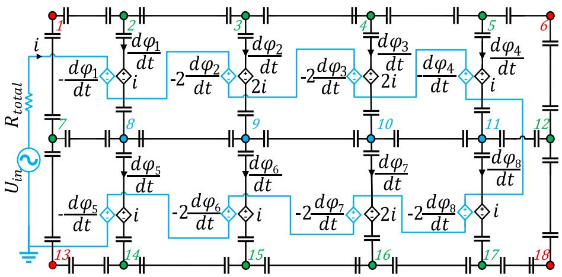  
Fig. 4. Distributed inductor model using Buntenbach analogy.

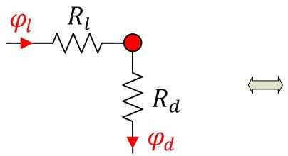

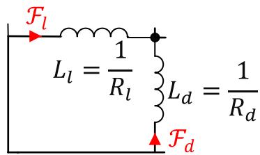

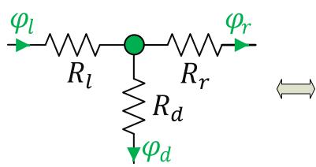  
(a)

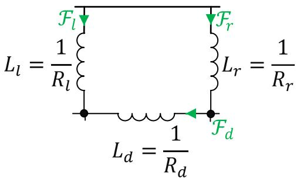  
(b)

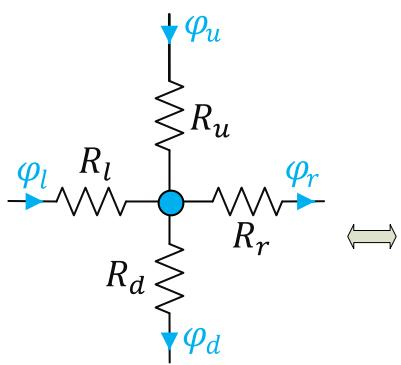

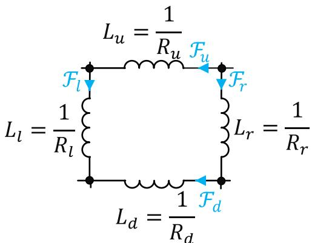  
（c）  
Fig. 5. Graphical derivation of the dual circuit of the magnetic circuit for three types of cells, excluding coupling elements.

to compare the results of HBD-circuits to one another and to FEM results. In this paper, the EMTP 4.1.3 [15] is employed to implement HBD-circuits and the COMSOL Multiphysics 5.4 [16] is employed to solve FEM. For both gapless core and gapped core inductors, the results of HBD-circuits are obtained for 1152 number of meshes. In FEM, the complete mesh of a gapless core inductor consists of 1102 domain elements and 122 boundary elements, whereas the complete mesh of a gapped core inductor consists of 1150 domain elements and 148 boundary elements. In addition, the mesh type used in FEM for both inductors is free triangular. To obtain the results, for both gapless and gapped core inductors, a 60 Hz sinusoidal voltage source is directly applied across the inductor, and the steady-state voltage and current waveforms of the inductor are derived. For both inductors, the dc resistance of the winding is equal to 0.032 Ω. Additionally, for both EMTP and COMOL simulations, the simulation time step is 10 μs and the simulation period is 32 ms.

In the previous section, the number of meshes was selected small to simplify explanations. But, in FEM, the number of meshes can be varied and adjusted according to the frequency of the phenomena, and the dimensions of the device. Since the distributed circuit-based approaches must have a strong resemblance to FEM, they must be flexible to mesh sizing and numbering. Here, an adjustable meshing procedure is explained. In this case study, since there is a vertical symmetry, the size of the problem can be reduced to half, as illustrated in Fig. 7. Besides, HBD-circuits are constituted of three different types of cells called type-A, type-B, and type-C, displayed in Fig. 7. Type-A cells are only

comprised of the nonlinear RLC elements. Type-B cells are comprised of the linear RLC elements and the coupling elements. For gapless inductor, Type-C cells are formed of the nonlinear RLC elements and the coupling elements. But, for the gapped core inductor, based on the meshing, Type-C cells can be formed of the linear or nonlinear RLC elements and the coupling elements. Fig. 8 shows the circuits regarding to the three mentioned types.

We will go over how the parameters of these circuits are determined. First, the linear and nonlinear RLC elements are calculated. The values of the RLC linear elements are determined and calculated by

$$
R = \frac {1}{C} = \frac {1}{L} = \frac {l}{\mu_ {0} S} \tag {6}
$$

where l and S are the mean length and cross-section regarding the flux path represented by the element, and $\mu _ { 0 }$ is the magnetic permeability of air.

To represent the nonlinear RLC elements of type-A and type-C cells, the magnetizing curve is represented by a piecewise linear function with 15 linear segments which is the characteristic of the material (soft iron) defined in the materials library in COMSOL Multiphysics [16]. The incremental magnetic relative permeability $\mu _ { p }$ of each segment of the piecewise linear curve is characterized as the slope between change points p and p − 1

$$
\mu_ {p} = \frac {1}{\mu_ {0}} \frac {B _ {p} - B _ {p - 1}}{H _ {p} - H _ {p - 1}} \tag {7}
$$

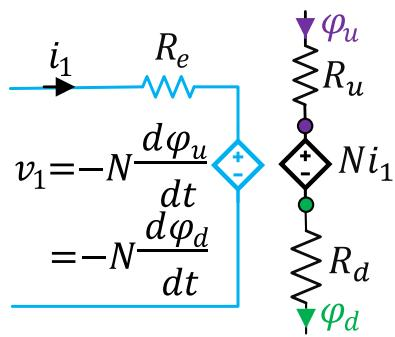  
(a)

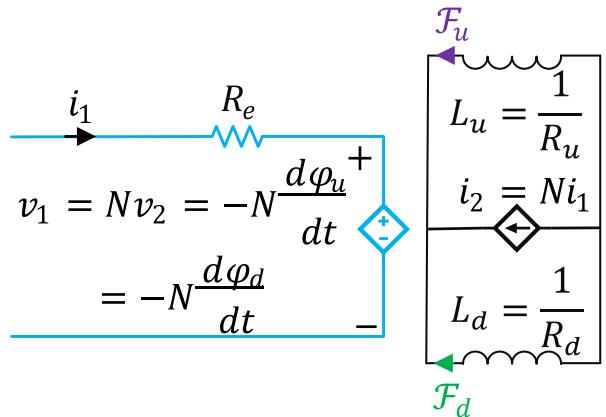

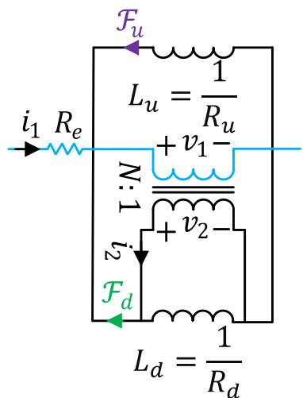  
(c）  
Fig. 6. Graphical derivation of the dual circuit of the magnetic circuit for one type of cell, including coupling elements.

for p = 1, 2, …, 15. As a result, nonlinear resistance curves, nonlinear capacitance curves, and nonlinear inductance curves are modeled using piecewise linear representation with 15 segments. The incremental resistance $R _ { p } ,$ capacitance $C _ { p } ,$ , and inductance $L _ { p }$ of segment p of the piecewise-linear curve are specified as the slopes between changepoints p and p − 1

$$
R _ {p} = \frac {v _ {p} - v _ {p - 1}}{i _ {p} - i _ {p - 1}} \tag {8}
$$

$$
C _ {p} = \frac {q _ {p} - q _ {p - 1}}{v _ {p} - v _ {p - 1}} \tag {9}
$$

$$
L _ {p} = \frac {\phi_ {p} - \phi_ {p - 1}}{i _ {p} - i _ {p - 1}} \tag {10}
$$

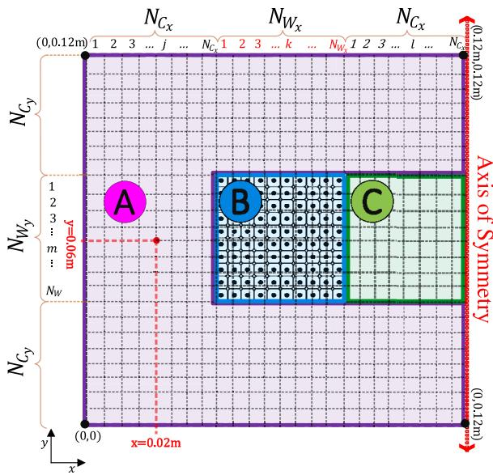  
Fig. 7. Cross-section of left half of the inductor.

Where $R _ { p } , C _ { p }$ and $L _ { p }$ are given by (6), except that the value of the permeability $\mu ,$ , is set equal to $\mu _ { p }$ .

So far, it has been assumed that each mesh has been constituted of one material. But based on the size and position of mesh, it is possible to use different materials with different relative permeability values. An example of a nonuniform cell using two different materials with relative permeabilities of $\mu _ { 1 }$ and $\mu _ { 2 }$ is presented in Fig. 9. The lengthwise averages of permeability regarding this type of cell in horizontal and vertical directions respectively named $\overline { { \mu _ { h } } }$ and $\overline { { \mu _ { \nu } } }$ are given by

$$
\overline {{H _ {h}}} = H _ {h _ {1}} = H _ {h _ {2}} \tag {11}
$$

$$
\phi_ {h} = \phi_ {h _ {1}} + \phi_ {h _ {2}} \tag {12}
$$

$$
\bar {B} _ {h} \left(S _ {h _ {1}} + S _ {h _ {2}}\right) = B _ {h _ {1}} S _ {h _ {1}} + B _ {h _ {1 2}} S _ {h _ {2}} \tag {13}
$$

$$
\overline {{\mu_ {h}}} = \overline {{B _ {h}}} / \overline {{H _ {h}}} = \mu_ {1} \left(\frac {h _ {1}}{h _ {1} + h _ {2}}\right) + \mu_ {2} \left(\frac {h _ {2}}{h _ {1} + h _ {2}}\right) \tag {14}
$$

$$
\overline {{B _ {v}}} = B _ {v _ {1}} = B _ {v _ {2}} \tag {15}
$$

$$
F _ {v} = F _ {v _ {1}} + F _ {v _ {2}} \tag {16}
$$

$$
\overline {{H _ {v}}} \left(h _ {1} + h _ {2}\right) = H _ {v _ {1}} h _ {1} + H _ {v _ {2}} h _ {2} \tag {17}
$$

$$
\overline {{\mu_ {v}}} = \overline {{B _ {v}}} / \overline {{H _ {v}}} = 1 /. \left(\frac {1}{\mu_ {1}} \left(\frac {h _ {1}}{h _ {1} + h _ {2}}\right) + \frac {1}{\mu_ {2}} \left(\frac {h _ {2}}{h _ {1} + h _ {2}}\right)\right) \tag {18}
$$

The parameters $\beta _ { k }$ and γ associated with the coupling elements (Type-2 L-R mutator, Type-1 L-C mutator, and ideal transformer), for the circuits presented Fig. 8(b) and (c), are given by

$$
\beta_ {k} = \frac {5 0 k - 2 5}{N _ {W _ {y}} N _ {W _ {x}}} \tag {19}
$$

$$
\gamma = \frac {5 0}{N _ {W _ {\mathrm {y}}}} \tag {20}
$$

As validation, the HBD-circuit results were compared to each other and to the FEM results, and they were found to be very similar. First, Fig. 12 shows the similarity of the inductor current results from HBDcircuits and FEM, with the voltage source is set to 130 Vs for gapless core inductor and 200 Vs for gapped core inductor. Second, as noted in the introduction, HBD-circuits can represent the internal behavior of magnetic devices with a great accuracy. For instance, as an advantage

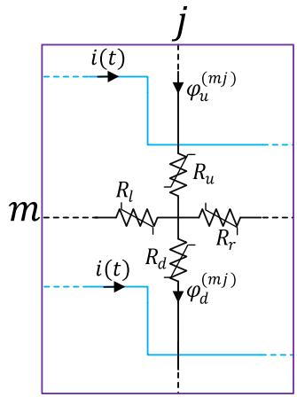

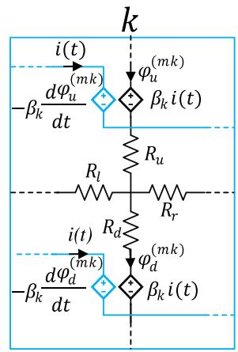

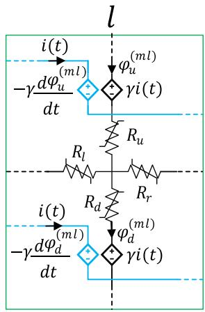

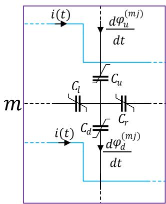

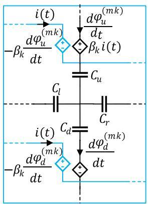

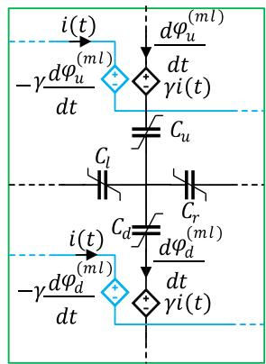

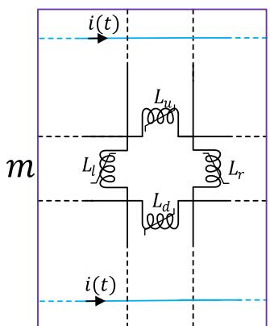  
(a)Part A

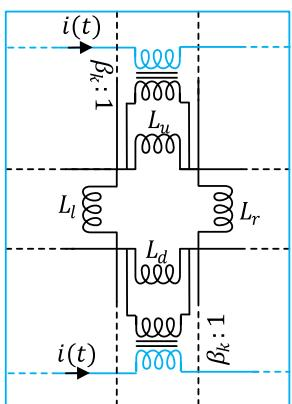  
(b) Part B

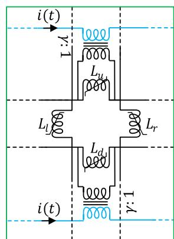  
(c) Part C

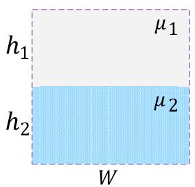  
Fig. 8. Distributed resistive, capacitive, and inductive circuits regarding three sample cells of the meshed inductor model shown in Fig. 7.

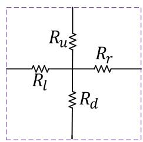  
Fig. 9. Nonuniform cell.

over lumped circuit-based models, the HBD-circuits can present local magnetic saturation in a way that is quite close to FEM. Look at Fig. 13 for an example of this capability, which illustrates the magnetic field intensity regarding a local point which has been obtained for HBD-

circuits and FEM. These results are derived for a point in the middle of the left column which has coordinates (0.02m,0.06m), as illustrated in Fig. 7. Finally, voltage-current characteristics, viewed from the terminals of both inductors, obtained from HBD-circuits, are compared to those obtained from FEM. The results have been shown in Fig. 14.

To provide validation for the accuracy of HBD-circuits, the normalized root mean square error (nRMSE) is applied on the voltage-current characteristic derived by each method. The nRMSE results for both gapless and gapped core cases are presented in Table 1, it can be concluded that HBD-circuits give accurate results in comparison with FEM. This is a significant achievement given the very large-scale nonlinear circuits solved in EMT mode.

The key advantage of HBD-circuits over FEM is their computing speed, which is attributable to the fact that they require fewer elements and solve equations that are fundamentally less complicated. In fact, they are faster even when the number of elements is the same, as demonstrated in Fig. 15, where the number of elements in FEM is 1102

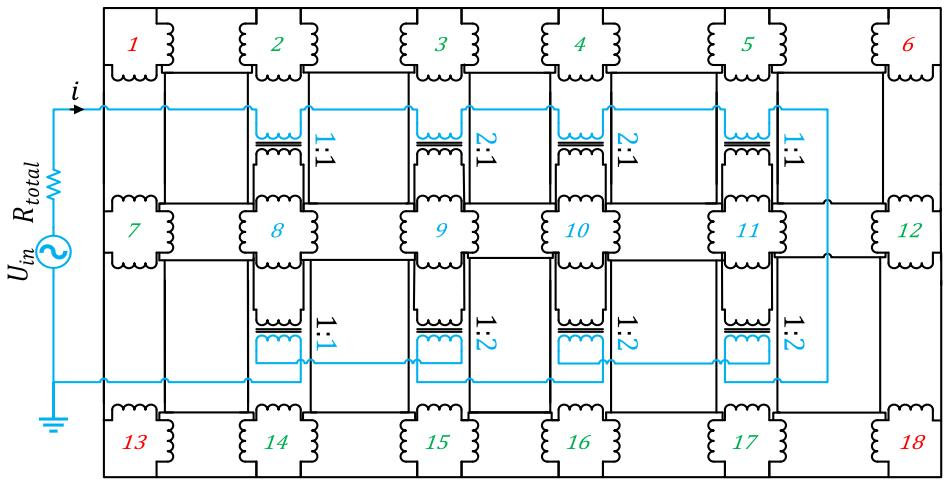  
Fig. 10. Distributed duality-based inductor model.

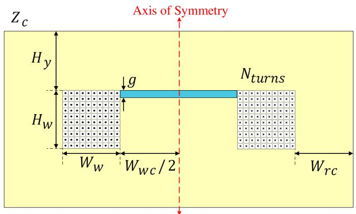

<table><tr><td>g</td><td>0.5 cm</td></tr><tr><td>Wrc</td><td>4 cm</td></tr><tr><td>Ww</td><td>4 cm</td></tr><tr><td>Zc</td><td>4 cm</td></tr><tr><td>Wwc</td><td>8 cm</td></tr><tr><td>Hy</td><td>4 cm</td></tr><tr><td>HW</td><td>4 cm</td></tr><tr><td>Nturns</td><td>100</td></tr></table>

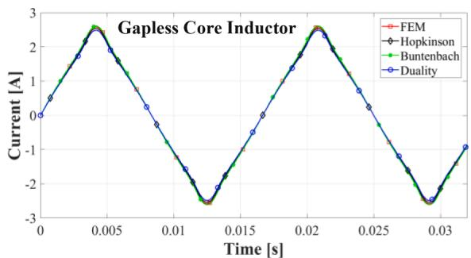  
Fig. 11. Cross-section of the gapped inductor.

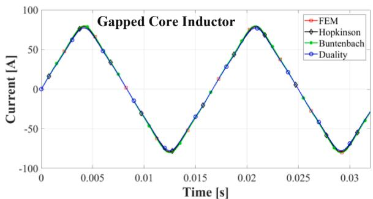  
Fig. 12. Inductor current i for HBD-circuits and FEM, during the nonlinear condition.

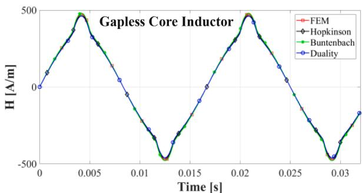

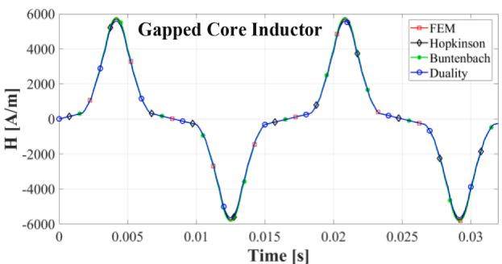  
Fig. 13. Magnetic field intensity H regarding a point in Fig. 7 with coordinates (0.02 m,0.06 m).

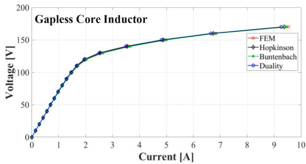

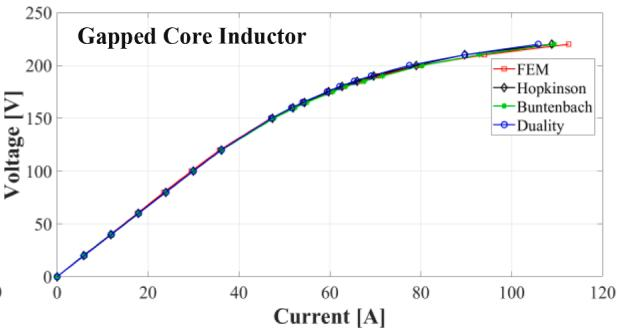  
Fig. 14. Voltage-current characteristics viewed from the terminals of the inductor.

Table 1 Accuracy analysis (FEM results are reference.).   

<table><tr><td></td><td colspan="3">nRMSE (%)</td></tr><tr><td>Core type</td><td>Hopkinson</td><td>Buntenbach</td><td>Duality</td></tr><tr><td>Gapless Core</td><td>1.13</td><td>1.19</td><td>1.16</td></tr><tr><td>Gapped Core</td><td>1.52</td><td>1.59</td><td>1.67</td></tr></table>

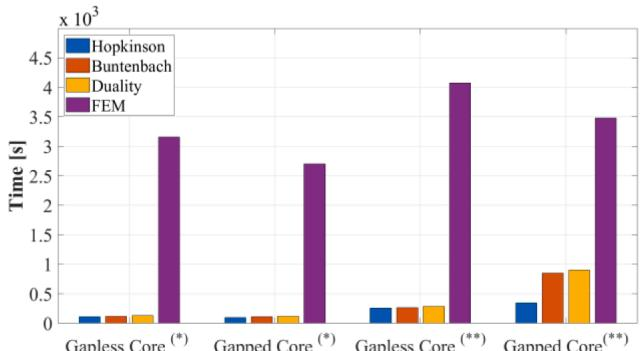  
$( ^ { * } ) ^ { \mathbf { \alpha } }$ :Linear operating condition   
(**）:Saturated operating condition

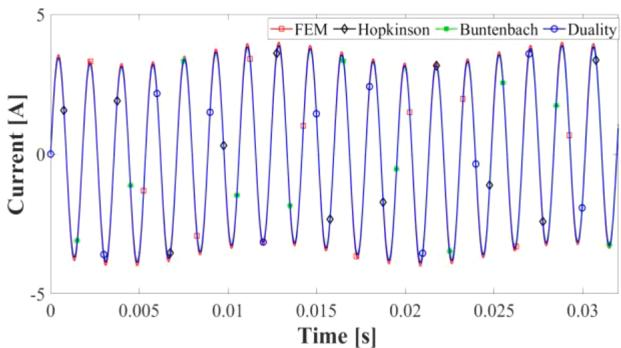  
Fig. 15. HBD-circuits vs. FEM in terms of computation time.   
Fig. 16. Inductor Current for HBD-circuits and FEM.

and 1150 for gapped core and gapless core cases, respectively, and HBD circuits have 1152 elements in both cases. Simulations were run for 32 ms with a 1 μs time step for both linear and saturated operation conditions. For linear operation condition, HBD-circuits are around 30 times faster than FEMs. And for saturated condition with a high degree of nonlinearity, HBD circuits are around 15 times faster than FEM. However, for gapped core inductor in saturated condition, Hopkinson is about 10 times faster and Buntenbach and Duality are about 4 times

faster than FEM. HBD-circuits outperform FEM in all circumstances, with Hopkinson being the fastest of the three. This is due to the fact that Buntenbach and Duality have more differential equations than Hopkinson. It is worth noting that the number of elements in FEM and HBDcircuits are considered to be the same in Fig. 15, only to compare the methods. However, to achieve a certain degree of accuracy, the number of elements in FEM must typically be set larger than the number of HBD elements, causing FEM to run much slower. In addition, as noted in the introduction, to applying FEM to model magnetic devices in the power system, the indirect coupling method is commonly used, which slows them down even more. HBD-circuits, on the other hand, do not have these limits, and their speed advantages reveal themselves in these cases better.

As a final validation example, ferroresonance (nonlinear phenomena) is modelled using HBD-circuits to demonstrate the capability of HBD-circuits in modeling electromagnetic transients. A ferroresonance circuit consisting of the gapped core inductor connected in series with a capacitance $( C = 9 . 8 2 \mu F )$ and a voltage source $( U _ { i n } = 1 0 0 \mathrm { c o s } ( \omega t ) )$ , is studied with HBD-circuits and FEM. The results of HBD-circuits and FEM are extremely close, as seen in Fig. 16, with only a 2% difference.

# 4. Conclusion

In this paper, three circuit-based methods, namely Hopkinson analogy, Buntenbach analogy and duality principle, are developed in a distributed form for accurately modeling magnetic devices in an EMTtype software. In terms of accuracy and calculation times, HBDcircuits were compared to each other as well as FEM. High levels of accuracy were achieved in representing both the external and internal behaviors of magnetic devices using HBD-circuits. The results obtained with all three HBD-circuits were extremely similar, and when compared to the FEM results, an error of less than 2% was observed in all cases, indicating a high level of accuracy for modeling purposes. Additionally, in terms of computation time, HBD-circuits were approximately 30 times faster than FEM in linear cases and around 10 times faster in nonlinear cases. When the inductor is coupled to a large and complex external circuit, the computational advantage of HBD over FEM becomes more apparent.

# CRediT authorship contribution statement

Sadegh Rahimi Pordanjani: Conceptualization, Methodology, Software, Writing – original draft. Jean Mahseredjian: Project administration, Investigation, Supervision, Writing – review & editing. Mohammed Naïdjate: Conceptualization, Software, Writing – review & editing. Nicolas Bracikowski: Conceptualization, Software, Investigation, Supervision, Writing – review & editing. Mircea Fratila: Validation, Writing – review & editing. Afshin Rezaei-Zare: Validation, Writing – review & editing.

# Declaration of Competing Interest

The authors declare that they have no known competing financial interests or personal relationships that could have appeared to influence the work reported in this paper.

# References

[1] P. Silvester, R. Ferrari, Finite Elements for Electrical Engineers, 2nd ed., Cambridge Univ. Press, Cambridge, U.K., 1990.   
[2] B. Asghari, V. Dinavahi, M. Rioual, J.A. Martinez, R. Iravani, Interfacing techniques for electromagnetic field and circuit simulation programs IEEE task force on interfacing techniques for simulation tools, IEEE Trans. Power Delivery 24 (2) (April 2009) 939–950.   
[3] F. Meng, D. Wang, Z. Liu, W. Su, Fast Circuit-Field Coupling Analysis for Skewed Induction Motor, in: IEEE Transactions on Industrial Electronics, 68, June 2021, pp. 5088–5099.   
[4] S. Denneti`ere, Y. Guillot, J. Mahseredjian, M. Rioual, A link between EMTP-RV and FLUX3D for transformer energization studies, in: Proc. Int. Conf. Power Systems Transients (IPST 2007), Lyon, France, Jun. 4–7, 2007.   
[5] J. Cale, S.D. Sudhoff, L.-.Q. Tan, Accurately modeling EI core inductor using a highfidelity magnetic equivalent circuit approach, IEEE Trans. Magn. 42 (1) (Jan. 2006) 40–46.   
[6] J.A. Martinez, B.A. Mork, Transformer modeling for low- and mid-frequency transients - a review, IEEE Trans. Power Delivery 20 (2) (April 2005) 1625–1632.   
[7] S. Jazebi, et al., Duality derived transformer models for low-frequency electromagnetic transients—part I: topological models, IEEE Trans. Power Delivery 31 (5) (Oct. 2016) 2410–2419.   
[8] H.A. Rowland, On magnetic permeability, and the maximum of magnetism of iron, steel, and nickel, Phil. Mag. XLVI (IV) (1873) 140–159.   
[9] R.W. Buntenbach, Improved circuit models for inductors wound on dissipative magnetic cores, in: Proc. 2nd Asilomar Conf. Circuits Syst, Pacific Grove, GA, USA, Oct. 1968, pp. 229–236.

[10] E.C. Cherry, The duality between interlinked electric and magnetic circuits and the formation of transformer equivalent circuits, Proc. Phys. Soc., Sec. B 62 (2) (1949) 101–111.   
[11] J. Allmeling, W. Hammer, J. Schonberger, Transient simulation of magnetic circuits using the permeance-capacitance analogy, in: Proc. IEEE 13th Workshop Control Model. Power Electron, Jun. 2012.   
[12] M. Luo, D. Dujic, J. Allmeling, Leakage flux modeling of medium-voltage phaseshift transformers for system-level simulations, IEEE Trans. Power Electron. 34 (3) (Mar. 2019) 2635–2654.   
[13] M. Naïdjate, N. Bracikowski, M. Hecquet, An intelligent reluctance network model for the study of large power and distribution transformers, in: ARWtr2019: The 6th International Advanced Research Workshop on transformers, At C´ordoba, Spain, Oct. 2019.   
[14] M. Lambert, J. Mahseredjian, M.M. Duro, ´ F. Sirois, Magnetic circuits within electric circuits: critical review of existing methods and new mutator implementations, IEEE Trans. Power Delivery 30 (6) (Dec. 2015) 2427–2434.   
[15] J. Mahseredjian, S. Denneti`ere, L. Dub´e, B. Khodabakhchian, L. G´erin-Lajoie, On a new approach for the simulation of transients in power systems, Elect. Pow. Syst. Res. 77 (11) (2007) 1514–1520.   
[16] Comsol, 2014. Comsol Multiphysics User’s Guide. Comsol AB, Stockholm, Sweden, Version 5.0.   
[17] A. Cheng, D. Cheng, Heritage and early history of the boundary element method, Eng. Anal. Bound. Elem. 29 (3) (Mar. 2005) 268–302.   
[18] L.O. Chua, Memristor-the missing circuit element, IEEE Trans. Circuits. Syst. 18 (5) (Sep. 1971) 507–519. CAS.   
[19] G. Kron, Steady-state equivalent circuits of synchronous and induction machines, Trans. Am. Inst. Electr. Eng. 67 (1) (Jan. 1948) 175–181.   
[20] M. Young, A. Dimitrovski, Z. Li, Y. Liu, Gyrator-capacitor approach to modeling a continuously variable series reactor, IEEE Trans. Power Delivery 31 (3) (2016) 1223–1232.   
[21] B.D.H. Tellegen, The gyrator, a new electric network element, Philips Res. Rep. 3 (Apr. 1948) 81–101.   
[22] H. Sire de Vilar, La dualit´e en ´electrotechnique, L’´eclairage ´electrique XXVII (20) (1901) 252–259. H. Whitney, “Non-separable and planar graphs,” Trans. Amer. Math. Soc., vol. 34, pp. 339–362, 1932.