# 频变输电线路模型中的低阶拟合方法

刘俊 1，郭瑾程 2，魏占宏 1，方万良 1，侯俊贤 3，项祖涛

（1．电力设备电气绝缘国家重点实验室(西安交通大学)，陕西省 西安市 710049；

2．国网陕西省电力公司经济技术研究院，陕西省 西安市 710065；

3．中国电力科学研究院，北京市 海淀区 100192）

Low-Order Approximation Method for Frequency-Dependent Transmission Line Model

LIU Jun1, GUO Jincheng2, WEI Zhanhong1, FANG Wanliang1, HOU Junxian3, XIANG Zutao3

(1. State Key Laboratory of Electrical Insulation and Power Equipment(Xi’an Jiaotong University), Xi’an 710049,

Shaanxi Province, China; 2. State Grid Shaanxi Electric Power Company Economic Research Institute, Xi’an 710065, Shaanxi

Province, China; 3. China Electric Power Research Institute, Haidian District, Beijing 100192, China)

ABSTRACT: Rational function approximations of characteristic impedance and propagation coefficient are crucial in modeling of frequency-dependent transmission line. Traditional Bode asymptotic method produces lots of pole-zeros. Some of them have no contribution to fitting accuracy and cause unnecessary calculation in electromagnetic transient simulation. To avoid appearance of redundant pole-zeros, a low-order approximation method of frequency-dependent transmission line model is proposed. Firstly, low-order pole-zeros are located for characteristic impedance and propagation coefficient. Then approximation accuracy is improved with nonlinear least square method. Thus low-order rational function approximations of characteristic impedance and propagation coefficient are achieved consequently. Case studies show that compared to Bode asymptotic method, fitting with low-order approximation method is more accurate and rational function order is reduced, therefore electromagnetic transient simulation is accelerated.

KEY WORDS: transmission line; frequency-dependent parameter; electromagnetic transient; rational function approximation

摘要：对特征阻抗和传播系数的有理函数拟合是考虑参数频变的输电线路建模中的关键步骤。传统的模域输电线路模型采用的 Bode 渐近线拟合法会产生大量零极点，其中一部分对提高模型精度没有作用并会导致电磁暂态仿真中产生不必要的计算。为避免冗余零极点的产生，提出了一种应用于频变输电线路模型中的低阶有理函数拟合方法。首先对线路

特征阻抗和传播系数进行低阶零极点定位，然后用非线性最小二乘法提高拟合精度，从而实现对特征阻抗和传播系数的低阶有理函数拟合。对比 Bode渐近线法的拟合结果，低阶拟合方法能够在保证拟合精度的同时降低拟合函数的阶数，从而提高电磁暂态计算效率。

关键词：输电线路；频变参数；电磁暂态；有理函数拟合

DOI：10.13335/j.1000-3673.pst.2016.1860

# 0 引言

随着灵活交流输电技术、高压直流输电技术为代表的先进电力电子技术的广泛应用[1-3]，我国电网将发展成为超大规模的超、特高压交直流混联的复杂电网[4-6]。电力系统的发展对电力系统仿真技术提出了新的挑战。考虑网络中所有元件电磁暂态过程的系统级全电磁暂态仿真，理论上将更接近系统的实际运行情况。

输电线路作为系统中的一个重要元件，对其建立合理的数学模型在电磁暂态仿真中十分关键。由于输电线路是典型的分布参数元件[7]，并且由于集肤效应线路参数成为频率的函数，因此描述输电线路上电压电流动态过程的方程是与频率有关的微分方程。在潮流计算和机电暂态计算的准稳态假设下，一般使用以“π 型等值电路”为代表的集中参数线路稳态模型[8]。然而，这类模型是在正弦稳态下推导得出的，因此理论上并不适用于电磁暂态计算。有的文献中对线路采用级联模型来模拟线路的分布特性[9-14]，但是级联模型将增加系统的节点数，并且易引发系统的虚假数值振荡[15]。Bergeron 使用行波法建立了无损输电线路的常参数模型[16]，Dommel 在其基础上进一步考虑电阻的影响，将线

路电阻集中起来接入线路[17]。这2种模型都属于常参数输电线路模型，计算经验表明常参数输电线路模型会造成高次谐波的放大从而使波形产生畸变[18]。频变输电线路模型由于考虑了输电线路参数的频变特性，其理论比常参数输电线路模型更加严密[18-22]。这类模型根据是否使用相模变换矩阵分为相域模型和模域模型 2 大类，其代表分别是 Noda模型和 J. R. Marti 模型。

频变输电线路模型需要对线路参数进行有理函数拟合。本文以模域频变输电线路模型为基础，研究了传统模型中的 Bode 渐近线法造成冗余零极点的问题，并通过低阶零极点初始定位和最小二乘方法改进了对特征阻抗和传播系数的有理函数拟合方法，在保证拟合精度的同时降低拟合阶数。最后通过算例仿真验证该方法的正确性及其在提高电磁暂态计算效率方面的有效性。

# 频变输电线路模型

频变输电线路的数学模型建立在求解电报方程的基础上[18]，不难得到单相输电线路两端的电压、电流在频域的关系式如下：

$$
\begin{array}{l} \left[ U _ {\mathrm {m}} (\omega) + I _ {\mathrm {m}} (\omega) Z _ {\mathrm {C}} (\omega) \right] A (\omega) = (1) \\ U _ {\mathrm {k}} (\omega) - I _ {\mathrm {k}} (\omega) Z _ {\mathrm {C}} (\omega) \\ \left[ U _ {\mathrm {k}} (\omega) + I _ {\mathrm {k}} (\omega) Z _ {\mathrm {C}} (\omega) \right] A (\omega) = (2) \\ U _ {\mathrm {m}} (\omega) - I _ {\mathrm {m}} (\omega) Z _ {\mathrm {C}} (\omega) \\ \end{array}
$$

式中：k、m 分别代表线路的首端和末端； $Z _ { \mathrm { { C } } } ( \omega )$ 表示线路的特征阻抗；A(ω)表示长度为 l 时的线路传播系数。其中 $\scriptstyle { \omega = 2 \pi f , }$ ，f为频率。由于本文主要讨论输电线路的频域模型，因此下文如无特殊说明，为描述方便均以 ω 指代频率。 $Z _ { \mathrm { { C } } } ( \omega )$ 和 A(ω)分别由下式计算：

$$
Z _ {\mathrm {C}} (\omega) = \sqrt {\frac {R (\omega) + \mathrm {j} \omega L (\omega)}{G + \mathrm {j} \omega C}} \tag {3}
$$

$$
A (\omega) = \exp (- \sqrt {\left[ R (\omega) + \mathrm {j} \omega L (\omega) \right] \left[ G + \mathrm {j} \omega C \right] l}) \tag {4}
$$

由于集肤效应，单位长度输电线路的电阻R(ω)和电感 $L ( \omega )$ 为频率的函数，而在电磁暂态计算频率范围内，可认为电导 G 和电容 C 为常数[23]。

为方便处理电力系统暂态仿真中的非线性元件及开关动作等，仿真计算一般需在时域进行。若直接将式(1)(2)变换到时域，不仅需要对特征阻抗和传播系数做反傅里叶变换，而且会引入卷积计算，这将加大计算负担并且很难获得理想的精度[22]。为解决这一困难，J. R. Marti对特征阻抗和传播系数进行了有理函数拟合，再通过递归卷积[24-26]进一步建立时域下线路两端的电压、电流关系。递归卷积定

理可描述如下。

定理 1 (递归卷积)若 f(t)在 t≤0 的值已知，$g ( t ) { = } \mathsf { e } ^ { - \alpha ( t - T ) \varepsilon ( t - T ) }$ ，其中 α、ε、T 是常数，则卷积$s ( t ) { = } f ( t ) ^ { * } g ( t )$ 可由历史值计算得到，即

$$
s (t) = m s (t - \Delta t) + p f (t - T) + q f (t - \Delta t - T) \tag {5}
$$

式中 m、p、q 均为常数。

在建立时域线路两端电压、电流关系的基础上，得到单相输电线路等值电路如图 1 所示。频变输电线路模型具有和常参数输电线路模型同样的拓扑结构：线路两端解耦，每端各由一个等效电阻和一个历史电流源并联而成，而且单相频变输电线路模型可通过相模变换推广至多相输电线路。

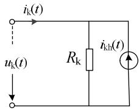

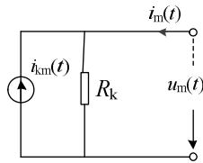  
图 1 单相输电线路等值电路  
Fig. 1 Equivalent circuit of single phase line model

# 2 有理函数拟合问题

# 2.1 有理函数拟合概述

在频变输电线路模型中，为应用递归卷积定理，需将特征阻抗和传播系数拟合为有理函数的形式，即

$$
F (s) = H \frac {(s - z _ {1}) (s - z _ {2}) \cdots (s - z _ {m})}{(s - p _ {1}) (s - p _ {2}) \cdots (s - p _ {n})} \tag {6}
$$

式中： $z _ { i }$ 表示拟合的零点； $p _ { i }$ 表示拟合的极点；H为常数。对于特征阻抗： $n { = } m$ ；对于传播系数：$n { \neq } m$ 。

由于线路特征阻抗和传播系数都是复函数，因此理论上这是一个复函数拟合问题。然而不难发现，特征阻抗属于最小相位系统，而传播系数在提取出延迟环节 e-jωτ后也成为最小相位系统[18]，其中τ 为线路中最快波的传播时间。由于最小相位系统的幅频特性由相频特性唯一确定[27]，因此，若找到一个符合最小相位系统要求的有理拟合函数，使其幅频特性曲线与特征阻抗或传播系数的幅频特性曲线相同，则有理拟合函数的相频特性曲线与特征阻抗或传播系数的相频特性曲线必然相同。综上所述，若有理拟合函数满足最小相位系统要求，则只需拟合特征阻抗和传播系数的幅频特性曲线，而无需拟合其相频特性曲线。

# 2.2 Bode 渐近线拟合法

为了使有理拟合函数满足最小相位系统要求，J.R. Marti引入了Bode对惯性环节和一阶微分环节

采用的对数幅频渐近特性曲线近似的思想，建立了一种有效的拟合方法，称为Bode渐近线法。

Bode 渐近线法使用对数坐标：频率用 log 表示，幅值用20倍log表示，单位为分贝(dB)。拟合的基本流程可以描述为：首先设定拟合的容许误差区间，然后围绕着被拟合的幅频特性曲线作逼近折线段，若逼近折线段高于容许误差区间，则增加极点使折线段斜率减小20 dB/dec，反之，若逼近折线段低于容许误差区间，则增加零点使折线段斜率增加20 dB/dec。当围绕被拟合曲线绘制出这样一条逼近折线段后，即可得到式(6)中的有理函数拟合系数。

# 2.3 冗余零极点

为了得到拟合有理函数的精度和阶数随折线段逼近程度变化的规律，本文计算了在不同容许误差区间下的特征阻抗拟合平均相对误差和零极点个数，分别如图2—3所示。

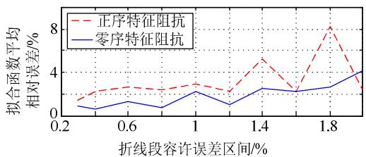  
图 2 不同折线段容许误差区间的拟合平均相对误差

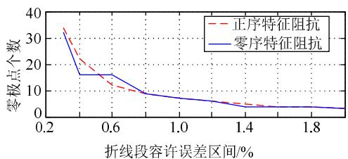  
Fig. 2 Average relative errors under different tolerance errors of the polyline   
图 3 不同折线段容许误差区间的拟合零极点个数  
Fig. 3 Poles and zeros number under different tolerance errors of the polyline

由图2可知，随着折线段容许误差区间的减小，拟合函数的平均相对误差在总体趋势上略有减小，但并不是单调下降的，在小范围内拟合的平均相对误差呈现一定的随机性，特别是正序特征阻抗，其拟合平均相对误差在容许误差区间分别为 0.4%、0.8%、1.2%、1.6%和 2.0%时几乎不变。由图 3 可知，容许误差区间越小，即折线段逼近待拟合函数的程度越高，拟合所需的零极点个数越多，且零极点数目基本随容许误差区间的增大而单调下降。

因此，若仅以折线段容许误差区间来控制拟合的精度，可能会产生部分“冗余”的零极点，这部分零极点对于拟合精度的提高没有明显作用，其根本原因是：拟合过程中确定的逼近折线段并不是实

际的拟合曲线，而只是对待拟合函数的渐近线近似，这种近似本身存在一定误差，折线段的逼近程度不能完全代表拟合的精确程度。一方面，幅频曲线的变化趋势要比折线的变化趋势更缓，这是由Bode渐近线本身性质决定的；另一方面，在拟合特征阻抗或传播系数时，围绕待拟合函数作出的各部分折线段之间会相互影响。当零点和极点分布较密集时，实际拟合曲线来不及趋于和折线段一致便被下一个零极点改变了趋势。这种邻近零极点之间的相互影响使实际拟合函数的变化趋势比折线段的变化趋势更缓。当增加折线段逼近精度时，零极点数目增加，相邻零极点之间的影响会进一步增加，因此实际拟合曲线和待拟合曲线之间存在误差，且该误差并不随折线段逼近程度的增加而减小。

而在 Bode 渐近线法中，很难直接确定出一个容许误差区间，使由这个容许误差区间确定出的零极点既能够满足精度要求又恰好是不“冗余”的。也就是说，Bode渐近线法虽然可以完成拟合并保证零极点都是实数，但它并不是一种最有效的方法。当仿真计算规模不大时，由 Bode 渐近线法拟合得到的冗余零极点对计算并没有明显影响。但是当仿真规模较大，如进行大系统的全电磁暂态仿真时，冗余零极点对系统将造成不必要的计算负担。

# 3 改进的低阶拟合方法

目前对 Bode 渐近线法的相关研究不多。J. R.Marti指出由Bode渐近线拟合得到的零极点位置需要通过进一步调整以提高拟合的精度[22]。文献[28]在 Bode 渐近线拟合的基础上通过优化方法提高精度，但没有改变拟合的阶数。文献[29-31]给出了一种固定零极点个数的拟合方式，降低了有理函数拟合的阶数，但这种方法严格限定传播系数的极点个数比零点个数多 1 个，可能会降低拟合的精度。

本文针对 Bode 渐近线法可能产生冗余零极点的问题，提出了一种新的拟合方法：首先根据幅频特性曲线变化较快的部分确定零极点的初始位置，实现低阶的粗略拟合，再通过最小二乘法进一步调整前一步得到的零极点位置，减小拟合误差，从而得到保证拟合精度的低阶有理函数拟合结果。

# 3.1 初始零极点定位

特征阻抗和传播系数幅频特性曲线的主要区别在于二者随频率变化的速度不同。传播系数幅值随频率的变化要快得多。针对特征阻抗和传播系数幅频曲线的不同特征，本文对于二者使用不同的方法确定零极点的初始位置。

# 3.1.1 特征阻抗

由于特征阻抗随频率变化的趋势一般都较为平缓，因此假设特征阻抗幅频特性曲线的“下降”或“上升”部分是均匀变化的。基于该假设，首先将特征阻抗幅频特性曲线划分为若干区间，每个区间内曲线随频率单调变化。一般情况下，正序特征阻抗幅频特性曲线随频率单调递减，而零序特征阻抗幅频特性曲线可从最大幅值对应的频率为界划分为左右 2 部分：第 1 部分随频率单调递增；第 2部分随频率单调递减。对一般的单回架空输电线而言，特征阻抗幅频特性曲线是类似的，只在曲线具体数值和变化速度上有区别。因此一般将正序特征阻抗幅频特性曲线划为1个单调区间，将零序特征阻抗幅频特性曲线划为2个单调区间，如图4所示。

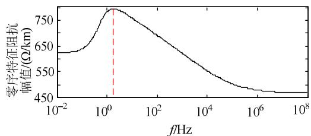  
图 4 零序特征阻抗划分示意图  
Fig. 4 Monotone interval division of the zero sequence characteristic impedance

假设零极点个数N已知。将每个单调区间用水平线等分为N份，每一份用一组零极点构成的“Z”字形折线段去逼近，并假设Z字形中的斜线段部分与原曲线的交点正好位于斜线段中心位置。如图 5所示是一条随频率单调递减的曲线用2组零极点构成的2个“Z”字形去逼近的示意图。

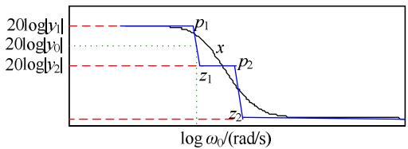  
图 5 特征阻抗零极点初始定位示意图  
Fig. 5 Characteristic impedance initial location of zeros and poles

显然，线段 $p _ { 1 } { - } z _ { 1 } .$ 、线段 $p _ { 2 } \ – z _ { 2 }$ 的斜率均为-20 dB/dec。设某段-20dB/dec 线段与被拟合曲线交于x点(图5中用线段 $p _ { 1 } { - } z _ { 1 }$ 为例)，为了计算该线段首末两端确定的极点和零点对应的频率，可列出方程

$$
2 0 \log | y _ {1} | - 2 0 \log | y _ {0} | = - 2 0 (\log \omega_ {\mathrm {P}} - \log \omega_ {0}) \tag {7}
$$

$$
2 0 \log | y _ {0} | - 2 0 \log | y _ {2} | = - 2 0 (\log \omega_ {0} - \log \omega_ {Z}) \tag {8}
$$

由式(7)(8)不难解得

$$
\omega_ {\mathrm {P}} = \left| y _ {0} \right| / \left| y _ {1} \right| \omega_ {0} \tag {9}
$$

$$
\omega_ {Z} = \left| y _ {0} \right| / \left| y _ {2} \right| \omega_ {0} \tag {10}
$$

对于任一区间，由以上两式即可得到零点和极点的

值。类似地，对于单调增区间，可用同样的方法求出确定极点和零点的初始位置，即

$$
\omega_ {\mathrm {P}} = \left| y _ {1} \right| / \left| y _ {0} \right| \omega_ {0} \tag {11}
$$

$$
\omega_ {Z} = \left| y _ {2} \right| / \left| y _ {0} \right| \omega_ {0} \tag {12}
$$

对于每个单调区间，N的值可以从1开始实验，当拟合精度过低时，可增加 N重新定位零极点。

# 3.1.2 传播系数

传播系数的“下降段”的下降速度随频率增大而变快。对于传播系数，本文采用分段误差区间的方式确定零极点初始位置。如图6 所示，将传播系数幅频特性曲线划分为①②③3 部分：第①部分传播系数幅值介于 1和 $A _ { \mathrm { l } }$ 之间，本文取 $A _ { \mathrm { l } }$ 为 0.9，其对应频率范围为 $\omega _ { \mathrm { m i n } }$ 至 $\omega _ { \mathrm { L } }$ ，其中 $\omega _ { \mathrm { m i n } }$ 为计算频率下限，在这一部分的传播系数幅频曲线较为平缓；第②部分传播系数幅值介于 $A _ { 1 }$ 和 $A _ { \mathrm { h } }$ 之间，本文取$A _ { \mathrm { h } }$ 为 $1 0 ^ { - 3 }$ ，其对应频率范围为 $\omega _ { \mathrm { L } }$ 至 $\omega _ { \mathrm { H } } ,$ ，这一部分传播系数幅频曲线随频率变化较为显著；第③部分传播系数幅值介于 $A _ { \mathrm { h } }$ 和 0之间，其对应频率范围为$\omega _ { \mathrm { H } }$ 至 $\omega _ { \mathrm { m a x } }$ ，其中 $\omega _ { \mathrm { m a x } }$ 为计算频率上限，由于 $A _ { \mathrm { h } }$ 的值很小，在这一部分传播系数的幅值接近 0，其对数幅频曲线将急剧变化，因此这部分曲线很难准确拟合。由于第③部分的幅值较小且对应频率段较高，对于一般的电磁暂态计算来说影响不大，因此只对①②部分进行拟合。

本文对于第①部分和第②部分采用不同的误差区间，然后用Bode渐近线拟合的方法分别对这 2部分进行拟合。与 Bode 渐近线拟合中不同的是，这里的误差区间为绝对值而不是相对值。取第①部分的拟合误差区间为 | x $_ 1 \ast 2 0 \log \vert A _ { 1 } \vert \vert$ ，第②部分的拟合误差区间为 |x $^ { \ast } 2 0 \log | A _ { \mathrm { h } } | |$ ，本文中取 $\xi _ { 1 } = 0 . 2$ ，$ \xi _ { 2 } \mathrm { = } 0 . 0 3 .$ 。取绝对误差区间的意义在于，随着频率的增大，传播系数幅值的下降速度变快，在误差区间取固定绝对值的情况下，传播系数对数幅值绝对值的增加等价于相对误差区间的减小，因此可以将大部分零极点定位在每一部分对数幅频特性变化相对剧烈的部分，而在变化较缓的部分避免定位过多的零极点。研究过程中发现，若对①②部分采用统一的绝对误差区间，则对于①区间来说误差区间过大，导致在传播系数幅值曲线刚开始下降的频段内拟合误差过大，这部分误差很难通过最小二乘方法进一步降低，因此将传播系数曲线分段，并对第①部分采用较小的绝对误差区间值。

# 3.2 最小二乘法调整零极点位置

在前一步确定初始零极点位置后，由于零极点的个数已知，拟合函数的形式便可以确定。为了提

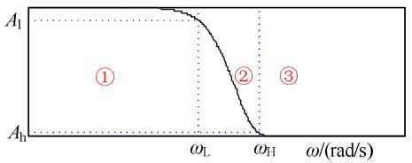  
图 6 传播系数分段误差区间示意图  
Fig. 6 Error range division of propagation coefficient

高拟合的精度，本文采用最小二乘的方法对拟合有理函数的系数进行优化，以提高拟合的精度。

设待拟合曲线是由 N 个离散数据点 $( x _ { 1 } , y _ { 1 } )$ 、$( x _ { 2 } , y _ { 2 } ) \setminus \cdots \setminus ( x _ { N } , y _ { N } )$ 组成的，用函数 $\scriptstyle { y = f ( x , \pmb { \beta } ) }$ 对其进行拟合，其中 $\pmb { \beta } \mathrm { = } ( \beta _ { 1 } , \beta _ { 2 } , \cdots , \beta _ { K } ) ^ { \operatorname { T } }$ 是待定系数。在本文中使用频域有理函数进行拟合，即

$$
f (x, \boldsymbol {\beta}) = F (s) = H \frac {(s - z _ {1}) (s - z _ {2}) \cdots (s - z _ {m})}{(s - p _ {1}) (s - p _ {2}) \cdots (s - p _ {n})} \tag {13}
$$

式中： $\pmb { \beta } \mathrm { = } ( H , p _ { 1 } , p _ { 2 } , \cdots , p _ { n } , z _ { 1 } , z _ { 2 } , \cdots , z _ { m } ) ^ { \mathrm { T } } ; x \mathrm { = } s \mathrm { = } \mathrm { j } \omega$ 。系数列向量 $\beta$ 的维数为 $K { = } 1 { + } n { + } m$ 。

在前一步中确定的有理函数拟合系数一般不是局部最优的。寻找拟合系数在局部的最优解的问题可以转化为调整零点 $z _ { i } ~ ( i { = } 1 , 2 , \cdots m )$ 、极点 $p _ { i }$ $( i { = } 1 , 2 , \cdots n )$ 和H的值，使平方和

$$
S = \sum_ {i = 1} ^ {N} r _ {i} ^ {2} \tag {14}
$$

的值最小的问题，其中 $r _ { i }$ 称为在点x的残量，即

$$
r _ {i} = y _ {i} - f \left(x _ {i}, \boldsymbol {\beta}\right) \tag {15}
$$

式中： $i { = } 1 , 2 , \cdots , N _ { \circ }$ 。

本文中，由于 $f ( x , \pmb { \beta } )$ 是关于 β 的非线性函数，因此这是一个非线性最小二乘问题，属于优化问题的一种。理论上可以使用各种最优化方法求解，然而由于最小二乘问题结构的特殊性，可以利用其结构特征构造出一些有效算法，比如 Guass-Newton法、Levenberg-Marquardt 法等。

# 4 算例仿真

本文采用图 7 所示的 500 kV 三相换位线路进行算例验证分析[22]，土壤电阻率取为 100 Ω·m。输电导线三分裂，其中每条管状导体的外径为40.69 mm，厚径比为 0.363 6，导线直流电阻为 0.034 8 Ω；架空地线为实心导芯，外径为9.8 mm，地线直流电阻为1.62 Ω，地线是分段接地的。

分别用 Bode 渐近线法和低阶拟合法对该条输电线路的正序、零序特征阻抗曲线及传播系数曲线进行有理函数拟合。拟合相对误差分别如图 8—11所示。2种拟合方法拟合阶数如表1所示。

由图 11 和表 1 中数据可以看出：对于正序特征阻抗，低阶拟合法拟合所用的阶数仅为Bode渐

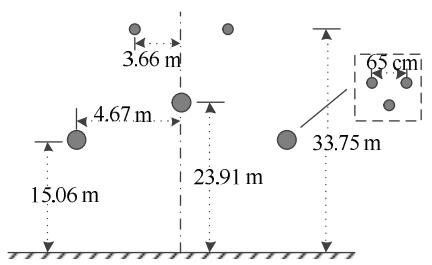  
图 7 线路架设结构示意图  
Fig. 7 Structure of a transmission line

表 1 2种拟合方法拟合阶数对比  
Tab. 1 Comparison of two approximation methods   

<table><tr><td>参数</td><td>Bode渐近线法</td><td>改进低阶法</td></tr><tr><td>正序特征阻抗</td><td>15</td><td>3</td></tr><tr><td>零序特征阻抗</td><td>16</td><td>7</td></tr><tr><td>正序传播系数</td><td>20</td><td>8</td></tr><tr><td>零序传播系数</td><td>19</td><td>7</td></tr></table>

近线法的 20%，而平均相对误差和最大相对误差仅为传统方法的十分之一；对于零序特征阻抗，低阶拟合法拟合阶数仅为 Bode 渐近线法的一半，相对误差虽比传统方法略大，但这种误差已经很小，可认为拟合是足够精确的。对于正序传播系数，低阶拟合法拟合所用的阶数仅为Bode渐近线法的35%，相对误差略大，但这种误差也已足够小，可以认为拟合是精确的；而对于零序特征阻抗，低阶拟合法拟合阶数仅为Bode渐近线法的 36.84%，且平均相对误差和最大相对误差仅为传统方法的一半。图 12—15 分别为正序、零序特征阻抗和传播系数的相频特性曲线与其对应的拟合函数相频特性曲线。可见二者基本吻合，而拟合过程中并未用到相频特性曲线数据。验证了“在对特征阻抗和传播系数的拟合中，若拟合有理函数满足最小相位系统要求，则只需拟合其幅频特性曲线”。

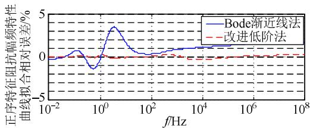  
图 8 正序特征阻抗拟合相对误差

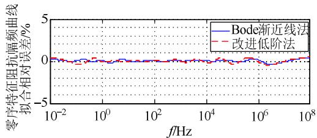  
Fig. 8 Relative errors of positive sequence characteristic impedance   
图 9 零序特征阻抗拟合相对误差  
Fig. 9 Relative errors of zero sequence characteristic impedance

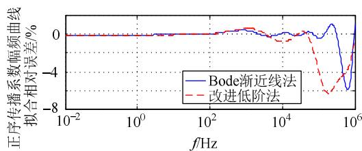  
图 10 正序传播系数拟合相对误差

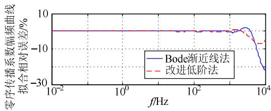  
Fig. 10 Relative errors of positive sequence propagation coefficient   
图 11 零序传播系数拟合相对误差

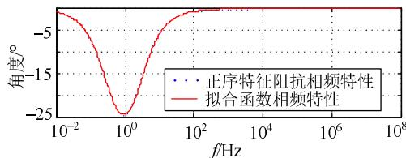  
Fig. 11 Relative errors of zero sequence propagation coefficient   
图 12 正序特征阻抗拟合相频特性拟合

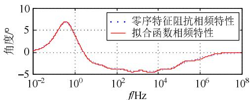  
Fig. 12 Phase-frequency characteristic approximation of positive sequence characteristic impedance   
图 13 零序特征阻抗拟合相频特性拟合

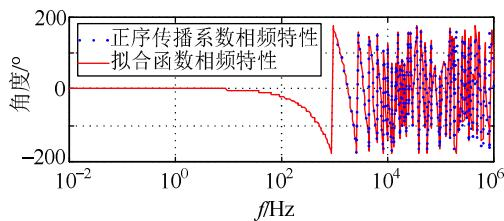  
Fig. 13 Phase-frequency characteristic approximation of zero sequence characteristic impedance   
图 14 正序传播系数拟合相频特性拟合

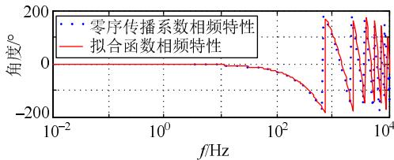  
Fig. 14 Phase-frequency characteristic approximation of positive sequence propagation coefficient   
图 15 零序传播系数拟合相频特性拟合  
Fig. 15 Phase-frequency characteristic approximation of zero sequence propagation coefficient

综上所述，在特征阻抗和传播系数幅频特性的拟合过程中，Bode渐近线法会造成有理函数拟合中出现冗余的零极点，这部分零极点基本不会提升拟合的精度，甚至可能导致拟合精度下降。而本文提出的低阶拟合法能够有效克服 Bode 渐近线法的缺点，在实现低阶的有理函数拟合同时保证足够的拟合精度。

另外，线路参数拟合的阶数对计算效率的影响主要发生在每一仿真时步的更新历史电流源部分，与拟合阶数相关的加乘计算次数约是拟合阶数的 8倍。本文中，低阶拟合法在每步更新历史值计算中与拟合相关的加乘计算量只有 Bode 渐近线法相应计算量的 34.29%。证明了本文的改进低阶法相对于Bode渐近线法有更高的计算效率。

# 5 结论

本文对现有的模域频变输电线路模型中特征阻抗和传播系数的有理函数拟合方法展开了研究，提出了一种低阶拟合方法，通过少量零极点进行初始定位并用非线性最小二乘方法减小拟合误差，实现了用低阶有理函数进行特征阻抗和传播系数的精确拟合。算例仿真验证了该拟合方法在输电线路电磁暂态计算中的适用性。主要结论如下：

1）用传统的 Bode渐近线法得到的有理拟合函数可能存在部分“冗余”的零极点，这些零极点对拟合精度的提高几乎没有帮助，且会给暂态仿真带来不必要的计算；  
2）同 Bode渐近线法相比，本文的低阶拟合法能够在保证计算精度的前提下用较低阶的有理函数实现特征阻抗和传播系数的精确拟合，并且该方法能够有效降低在每时步更新线路历史值时的计算时间。

本文是针对模域输电线路模型中的拟合方法开展的研究。在相域输电线路模型中，一般需要对系数矩阵进行有理函数拟合，模域的拟合方法在相域模型中并不适用。而相域输电线路模型中拟合方法还有待进一步研究。

# 参考文献

[1] 张文亮，汤广福，查鲲鹏，等．先进电力电子技术在智能电网中的应用[J]．中国电机工程学报，2010，30(4)：1-7  
Zhang Wenliang，Tang Guangfu，Zha Kunpeng，et al．Application of advanced power electronics in smart grid[J]．Proceedings of the CSEE， 2010，30(4)：1-7(in Chinese)   
[2] 赵争鸣，袁立强，鲁挺，等．我国大容量电力电子技术与应用发展综述[J]．电气工程学报，2015，10(4)：26-34  
Zhao Zhengming，Yuan Liqiang，Lu Ting，et al．Overview of the developments on high power electronic technologies and applications

in China[J]．Journal of Electrical Engineering，2015，10(4)：26-34(inChinese)  
[3] Liu J，Wei Z H，Fang W L，et al．Modified quasi-steady state model of DC system for transient stability simulation under asymmetric faults[J]．Mathematical Problems in Engineering，2015，(5)：1-12   
[4] 周孝信，鲁宗相，刘应梅，等．中国未来电网的发展模式和关键技术[J]．中国电机工程学报，2014，34(29)：4999-5008Zhou Xiaoxin，Lu Zongxiang，Liu Yingmei，et al．Developmentmodels and key technologies of future grid in China[J]．Proceedingsof the CSEE，2014，34(29)：4999-5008(in Chinese)  
[5] 刘振亚．中国特高压交流输电技术创新[J]．电网技术，2013，37(3)：566-574．Liu Zhenya ． Innovation of UHVAC transmission technology inChina[J]．Power System Technology，2013，37(3)：566-574(inChinese)  
[6] 曾庆禹．特高压交直流输电系统技术经济分析[J]．电网技术，2015，39(2)：341-348Zeng Qingyu．Techno-economic analysis of UHVAC and UHVDCpower transmission systems[J]．Power System Technology，2015，39(2)：341-348(in Chinese)．  
[7] 邓军，肖遥，范毅，等．基于两相电源的高压直流输电线路分布参数计算方法及直流工程的应用研究[J] ．高电压技术，2015，41(7)：2451-2456Deng Jun，Xiao Yao，Fan Yi，et al．Calculation method of distributedparameters and application of DC projects in HVDC transmissionlines based on two phase power resource[J] ． High VoltageEngineering，2015，41(7)：2451-2456(in Chinese)  
[8] 王锡凡，方万良，杜正春．现代电力系统分析[M]．北京：科学出版社，2003：311-321  
[9] Dhaene T，De Zutter D．Selection of lumped element models for coupled lossy transmission lines[J] ． IEEE Transactions on Computer-Aided Design of Integrated Circuits and Systems，1992， 11(7)：805-815．   
[10] Araújo A，Silva R，Kurokawa S．Comparing lumped and distributed parameters models in transmission lines during transient conditions[C]//IEEE/PES Transmission & Distribution Conference & Exposition，Chicago，IL，USA：IEEE，2014：1-5   
[11] 王晓彤，班连庚，林集明，等．1000kV紧凑型输电线路的电气参数及电磁暂态分析[J]．电网技术，2012，36(3)：9-14Wang Xiaotong，Ban Liangeng，Lin Jiming，et al．Analysis onelectrical parameters and eletromagnetic transient of 1000 kVcompact transmission line[J]．Power System Technology，2012，36(3)：9-14(in Chinese)．  
[12] 戴仁昶，Kevin K W C，Laurence A S．DTS 中长距离输电线路的电磁暂态仿真[J]．电网技术，2002，26(7)：7-10Dai Yongchang，Kevin K W C，Laurence A S，et al. Electromagnetictransient stability simulation of long distance transmission line inDTS[J]．Power System Technology，2002，26(7)：7-10(in Chinese)．  
[13] 陈葛松．输电线路沿线暂态特性多步长计算方法的研究[J]．电网技术，1995，19(12)：34-37Chen Gesong． The Multi-time-step-size solution of voltage andcurrent profiles along a transmission line with frequency dependantparameters[J]．Power System Technology，1995，19(12)：34-37(inChinese)  
[14] Zhang X P，Chen H．Analysis and selection of transmission line models used in power system transient simulations[J]．International Journal of Electrical Power & Energy Systems，1995，17(4)：239-246   
[15] Dommel H W．Electro-magnetic transients program theory book[M] Portland，Oregon：Bonneville Power Administration，1996   
[16] Bergeron L J B．Water hammer in hydraulics and wave surges in electricity[M]．New York：Wiley，1961．   
[17] Dommel H W．Digital computer solution of electromagnetic transients in single and multiphase[J]．Networks IEEE，1969，88(4)：388-399   
[18] Marti J R．Accurate modeling of frequency-dependent transmission lines in electromagnetic transient simulations[J]．IEEE Transactions on Power Apparatus & Systems，1982，2(1)：29-30

[19] Budner A．Introduction of frequency-dependent line parameters into an electromagnetic transients program[J] ． IEEE Transactions on Power Apparatus and Systems，1970，(1)：88-97   
[20] Snelson J ． Propagation of travelling waves on transmission lines-frequency dependent parameters[J] ． IEEE Transactions on Power Apparatus and Systems，1972，1(91)：85-91．   
[21] Meyer W，Dommel H．Numerical modelling of frequency-dependent transmission-line parameters in an electromagnetic transients program[J]．IEEE Transactions on Power Apparatus and Systems， 1974，5(93)：1401-1409   
[22] Marti J R．The problem of frequency dependence in transmission line modelling[D]．University of British Columbia，1981．   
[23] 吴维韩，张芳榴．电力系统过电压数值计算[M]．北京：科学出版社，1989：1-18  
[24] Semlyen A，Dabuleanu A．Fast and accurate switching calculations on transmission lines with ground return using recursive Convolutions[J] IEEE Transactions on Power Apparatus & Systems，1975，94(2)： 561-571   
[25] Semlyen A，Roth A．Calculation of exponential propagation step responses-accurately for three base frequencies[J]．IEEE Transactions on Power Apparatus and Systems，1977，96(2)：667-672   
[26] Semlyen A ． Contributions to the theory of calculation of electromagnetic transients on transmission lines with frequency dependent parameters[J]．IEEE Transactions on Power Apparatus and Systems，1981，100(2)：848-856   
[27] 王建辉．自动控制原理[M]．北京：清华大学出版社，2007  
[28] Bañuelos-Cabral ES，Gutiérrez-Robles JA，Gustavsen B，et al． Enhancing the accuracy of rational function-based models using optimization[J]．Electric Power Systems Research，2015，125：83-90．   
[29] Marti L．Low-order approximation of transmission line parameters for frequency-dependent models[J] ． IEEE Transactions on Power Apparatus & Systems，1983，102(11)：35   
[30] Marti L．Voltage and current profiles and low-order approximation of frequency-dependent transmission line parameters[M]．1984   
[31] 伍双喜，吴文传，张伯明，等．电力系统仿真不确定度评估中拟合多项式阶次的确定[J]．电网技术，2012，36(10)：125-130Wu Shuangxi，Wu Wenchuan，Zhang Boming，et al．Order selectionfor polynomial fitting in uncertainty evaluation of power systemsimulation by probability collocation method[J] ． Power SystemTechnology，2012，36(10)：125-130(in Chinese)

  
刘俊

收稿日期：2016-07-19。

作者简介：

刘俊(1982)，男，工学博士，副教授，研究方向为电力系统仿真、电力系统稳定性与控制等，E-mail：eeliujun@mail.xjtu.eud.cn；

郭瑾程(1992)，女，工程师，研究方向为电力系 统 暂 态 稳 定 性 仿 真 计 算 ， E-mail ： gjcxjtu@163.com；

魏占宏(1987)，男，博士研究生，研究方向为电 力 系 统 暂 态 稳 定 性 仿 真 计 算 ， E-mail ：weizhanhong1220@163.com；

方万良(1958)，男，哲学博士，教授，博士生导师，研究方向为电力系统运行分析与控制，E-mail：eewlfang@mail.xjtu.edu.cn；

侯俊贤(1978)，男，工学硕士，高级工程师，研究方向为电力系统分析、控制和软件开发，E-mail：houjx@epri.sgcc.com.cn；

项祖涛(1976)，男，工学博士，高级工程师，研究方向为电力系统电磁暂态分析和仿真，E-mail：xzt@epri.sgcc.com.cn。