# 半隐式延迟解耦电磁暂态仿真方法(二)：单端口子模块 MMC 通用解耦与快速仿真

姚蜀军，庞博涵，曾子文，许明旺，刘晋* ，姚逸凡，吴梦童(华北电力大学，北京市 昌平区 102206)

# Semi-implicit Latency Decoupling Technology Based Electromagnetic Transient Simulation (Part II): General Decoupling and Fast Simulation for Single-port Sub-module MMC

YAO Shujun, PANG Bohan, ZENG Ziwen, XU Mingwang, LIU Jin* , YAO Yifan, WU Mengtong (North China Electric Power University, Changping District, Beijing 102206, China)

ABSTRACT: Due to the large number of modular multilevel converter (MMC) submodules (SM), as well as the complexity and time-varying of the submodule topology, it is difficult to balance accuracy and efficiency of the solution. In this paper, the semi-implicit latency decoupling and paralleling technology (SILDP) was applied to the research of MMC high-efficiency electromagnetic transient simulation modeling. The obtained model has the characteristics of constant admittance matrix of conventional topological SMs, simple decoupling circuit, high computational efficiency, and general applicability. Starting from the state equation of MMC single-port SM, using matrix splitting and latency technology, a general semi-implicit delay decoupling model of MMC single-port SM was constructed and applied to half-bridge, full-bridge, and double half-bridge SMs. Furthermore, based on the simplification of model parameters, a general decoupling and simulation framework for any single-port sub-modular MMC was proposed. The characteristics of the model were analyzed, and the solution process was presented. The simulation results can verify the accuracy and effectiveness of the proposed method.

KEY WORDS: modular multilevel converter (MMC); electromagnetic transient simulation; semi-implicit latency decoupling; constant system conductance matrix; parallel computing

摘要：由于模块化多电平换流器子模块数众多及子模块拓扑的复杂性和时变性，导致仿真精度与效率难以兼顾。该文将半隐式延迟解耦原理用于模块化多电平换流器(modularmultilevel converter，MMC)高效电磁暂态仿真建模研究，所得模型具有常规子模块拓扑导纳矩阵恒定、解耦电路简单、计算效率高、方法通用性强等特点。该文首先从MMC单端

口子模块状态方程出发，利用矩阵分裂和延迟技术，构建MMC单端口子模块通用半隐式延迟解耦模型，并应用于半桥、全桥和双半桥子模块。然后，基于对模型参数的简化，进一步提出适用于任意单端口子模块拓扑的 MMC 通用仿真框架，并分析模型的特点，给出计算流程，最后通过算例验证该文方法的准确性和有效性。

关键词：模块化多电平换流器；电磁暂态仿真；半隐式延迟 解耦；导纳矩阵恒定；并行计算

# 0 引言

模 块 化 多 电 平 换 流 器 (modular multilevelconverter，MMC)具有开关损耗低、输出波形谐波含量少、方便模块化结构设计等优点，在柔性直流输电和直流电网中正日益得到广泛应用[1-3]。随着直流电压等级和传输功率的不断提升，MMC 子模块(submodule，SM)的数目快速增长，满足不同场景需求的新拓扑也不断出现[4-7]。然而，基于详细模型的电磁暂态仿真在仿真高电平数MMC时，一方面，需要采用小步长识别开关动作时刻；另一方面，高电平数导致需要求解超高阶线性方程组。因此，MMC 详细模型计算量大，仿真速度慢，需要研究高效的 MMC 电磁暂态仿真模型。

文献[1]介绍了 MMC 的平均值模型、开关函数模型。平均值模型利用受控源实现交、直流侧的电气解耦，主要关注 MMC的外部特性，计算速度快，但忽略了 MMC 的内部拓扑，无法模拟子模块充放电特性，也不能计及开关损耗，精度低，适用范围有限。开关函数等值模型，忽略了各子模块电容的特性差别，用一个统一的等值电容和开关函数来等值整个桥臂，不能用来分析子模块电容电压均衡算

法。文献[8]建立了 MMC 动态相量模型，文献[9]基于动态相量及函数矩阵实现 MMC 阻抗建模，文献[10]提出 MMC 多频段–动态相量模型，文献[11-12]提出频率偏移法，文献[13]提出 MMC 的时间尺度变换模型。这些方法同样忽略 MMC内部特性而只关注外部特性。但在实际应用时，受限于计算平台硬件能力，通常只能计及少数阶次谐波或假定信号为工频窄带信号，模型精度较低。

文献[14-15]通过对电路中的单个电容、电感两端的电压和流经电流的计算采用一步延时，实现复杂电力电子设备不同变换级之间的计算解耦。文献[16]采用类似思想，提出基于受控源的 MMC提速模型，实现系统与子模块的计算解耦。然而，仅对单个元件电气量间的解耦，由于存在开关动作时的非状态量突变问题，易引起数值振荡。此外，单个元件电气量间的一步时延，本质上是前向欧拉法，因此上述方法还存在仿真精度低，数值稳定性差的缺点。

基于戴维南等值和嵌套快速求解，文献[17-19]提出一种 MMC 高效模型的通用建立方法，可适用于不同子模块拓扑。该方法采用系统和设备分层仿真策略。在系统级，将换流器进行多端口等值，作为整体参与全系统的仿真。在系统级仿真结束并获得端口特性后，再进行设备层级的反解以计算换流器内部特性、更新历史电流源以及新的端口等值参数。然而，对子模块的等值、合并以及反解，其计算效率与内部拓扑复杂度紧密相关，当拓扑复杂时，计算效率较低。文献[20-21]针对戴维南等值中存在的非状态变量突变问题进行了改进，但仍存在上述方法中的相同问题。

文献[22]提出半隐式延迟解耦电磁暂态仿真方法(semi-implicit latency decoupling and parallelingtechnology，SILDP)并将其应用于交流电网的分网与并行。本文作为半隐式延迟解耦仿真算法系列文章的第二篇，将其应用于 MMC 通用高效电磁暂态仿真模型的研究。基于该方法建立的 MMC 解耦模型，一方面，精度高、数字稳定性好，解耦后常用子模块拓扑的导纳矩阵恒定。另一方面，由于是状态变量之间的解耦，因此当开关动作时，不存在为消除非状态变量突变引起的数值振荡而切换解耦变量积分算法的问题(中心积分切换为后退欧拉)，能够始终保持状态变量之间解耦形式的一致性和仿真计算的高效性。

本文首先根据半隐式延迟解耦原理，对单端口子模块状态方程进行分裂和延迟，建立通用的子模块解耦模型和桥臂等值模型，并给出应用于半桥(half-bridge submodule，HBSM)、全桥(full-bridgesubmodule，FBSM)以及双半桥(double-half bridgesubmodule，D-HBSM)等不同子模块拓扑时模型参数的解析形式。然后，根据开关的关断特点，结合开关状态的组合，简化解耦模型参数的求取，进而构建单端口子模块 MMC 的通用仿真框架，给出计算流程，并分析其特点；最后通过算例验证本文方法的准确性和有效性。

# 1 MMC 拓扑结构

MMC 主电路拓扑及其子模块结构[23]如图 1 所示。O 点为零电位参考点， $L _ { \mathrm { a r m } }$ 为桥臂电抗器，每个桥臂串联 N 个子模块，C 为子模块电容， $u _ { r j }$ 为同一桥臂所有子模块构成的桥臂输出总电压 $( r = { \tt p } , { \tt n }$ ，分别为上、下桥臂；ja,b,c，表示 abc三相。下同)，$i _ { \mathfrak { p } j }$ 和 $i _ { \mathrm { n } j }$ 分别为上、下桥臂电流， $U _ { j }$ 和 $i _ { j }$ 分别为 MMC三相交流出口处输出电压和输出电流， $U _ { \mathrm { d c } }$ 为直流电压。

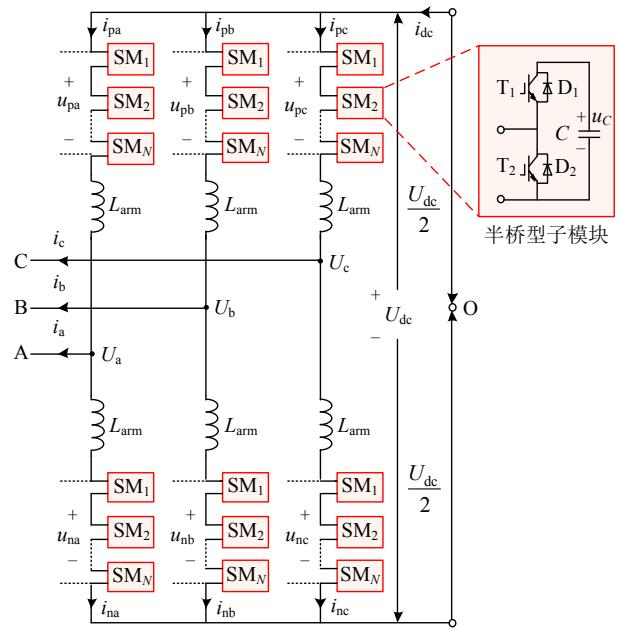  
图1 MMC 拓扑结构图  
Fig. 1 Diagram of MMC

# 2 单端口子模块MMC通用解耦方法

半隐式延迟解耦法从系统状态空间方程出发，应用矩阵分裂技术，对系统状态变量进行分组，然后通过对不同变量组采用不同的积分形式，构建变量组之间的半步时延格式，实现状态变量组之间的半隐式解耦。该方法的原理、特性及在交流电网中

的应用已在文献[22]中给出。基于该方法，下面提出一种单端口子模块 MMC 的通用解耦方法，并将其应用于几种具体类型的子模块(HSBM、FBSM和D-HBSM)。

# 2.1 半隐式延迟解耦

图 2(a)表示任意单端口子模块的拓扑。 $i _ { \mathrm { a r m } }$ 为桥臂电流，等于子模块注入电流， $u _ { \mathrm { s m } }$ 为子模块端口电压。考虑到模型的通用性，假定每个子模块内部包含 m 个电容 $C _ { 1 } , C _ { 2 } , \cdots , C _ { m } ;$ ，且为便于分析，将桥臂电感均分至每个子模块端口，即： $L _ { \mathrm { s m } } { = } L _ { \mathrm { a r m } } / N$ 。

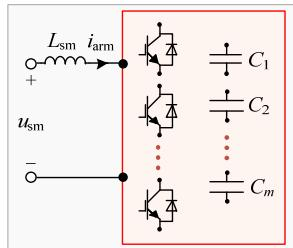  
(a)电路结构

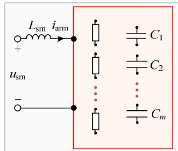  
(b)等效电路   
图2 任意单端口子模块  
Fig. 2 Single-port SM

对图 2(a)中每个 IGBT//VD 开关组(即一个IGBT与一个VD反并联)采用二值电阻模型(导通时阻值为 $R _ { \mathrm { o n } } { = } 0 . 0 1 \Omega$ ，关断时阻值为 $R _ { \mathrm { o f f } } = 1 \mathrm { M } \Omega \mathrm { \Omega } )$ ，得到图 2(b)等效电路。

对图 2(b)等效电路列写状态方程，可得：

$$
\left[ \begin{array}{c c} \boldsymbol {C} & \\ & L _ {\mathrm {s m}} \end{array} \right] \left[ \begin{array}{l} \frac {\mathrm {d} \boldsymbol {u} _ {C}}{\mathrm {d} t} \\ \frac {\mathrm {d} i _ {\mathrm {a r m}}}{\mathrm {d} t} \end{array} \right] = \left[ \begin{array}{c c} - \boldsymbol {G} _ {\mathrm {e q}} & \boldsymbol {K} _ {i} \\ \hline - \boldsymbol {K} _ {u} & - R _ {\mathrm {e q}} \end{array} \right] \left[ \begin{array}{c} \boldsymbol {u} _ {C} \\ i _ {\mathrm {a r m}} \end{array} \right] + \left[ \begin{array}{c} \boldsymbol {0} \\ u _ {\mathrm {s m}} \end{array} \right] \tag {1}
$$

式中： $\pmb { C } \mathrm { = d i a g } [ C _ { 1 } , C _ { 2 } , \cdots , C _ { m } ]$ ，为 mm 维对角阵；$\pmb { u } _ { C } \mathrm { = } [ u _ { C 1 } , u _ { C 2 } , \cdots , u _ { C m } ] ^ { \mathrm { T } }$ 为 m1 维列矢量； ${ \cal K } _ { u } , \ { \cal K } _ { i }$ 分别为与电容电压、电感电流相关的系数矩阵。由于$C \mathrm { d } u _ { C } / \mathrm { d } t$ 反映的是关于电流的 KCL 关系，因此 $G _ { \mathrm { e q } }$ 可看作是与电容并联的导纳。类似的， $L { \mathrm { d } } i _ { \mathrm { a r m } } / { \mathrm { d } } t$ 反映的是关于电压的 KVL 关系， $R _ { \mathrm { e q } }$ 可看作与电感串联的电阻。

HBSM、FBSM 状态方程列写相对简单，但对于结构复杂的子模块(如 D-HBSM)，因内部包含多个电容，则不易列写。由于子模块在某个确定的开关组合下是线性电路，满足替代定理和叠加定理，据此可给出一种通用列写方法，适用于任意类型的单端口子模块。

1）将图2(b)中的端口电感用电流源替代，内部电容用电压源替代，可得到替代电路，如图3所示。  
2）利用改进节点电压法[24-25]列出替代电路的

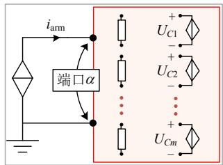  
图3 子模块纯电阻等效电路

Fig. 3 SM pure resistance equivalent circuit增广节点电压方程 $Y U { = } I$ ，如式(2)所示。

$$
\left[ \begin{array}{c c} \boldsymbol {Y} & \boldsymbol {A} _ {C} \\ \hline \boldsymbol {A} _ {C} ^ {\mathrm {T}} & \boldsymbol {0} \end{array} \right] \left[ \begin{array}{l} \boldsymbol {U} \\ \boldsymbol {I} _ {C} \end{array} \right] = \left[ \begin{array}{l} \boldsymbol {I} _ {L} \\ \boldsymbol {U} _ {C} \end{array} \right] \tag {2}
$$

式中：Y 为图 3 子模块等效电路的节点导纳矩阵；$A _ { C }$ 为增广系数矩阵；U为节点电压列矢量； $I _ { C }$ 为电容等效电压源中的电流矢量； $I _ { L }$ 为电感等效电流源矢量； $U _ { C }$ 为电容等效电压源矢量。

3）根据式(2)，由电网络的基本理论[25-26]可求得式(1)中的相关参数，即：

$$
\left\{\begin{array}{l}\boldsymbol {G} _ {\mathrm {e q}} = \left(\boldsymbol {M} _ {G} ^ {\mathrm {T}} \boldsymbol {Y} ^ {- 1} \boldsymbol {M} _ {G}\right) ^ {- 1}\\R _ {\mathrm {e q}} = \boldsymbol {M} _ {R} ^ {\mathrm {T}} \boldsymbol {Y} ^ {\prime - 1} \boldsymbol {M} _ {R}\\\boldsymbol {K} ^ {\mathrm {T}} \boldsymbol {u} _ {C} = \boldsymbol {M} _ {K} ^ {\mathrm {T}} \left( \right.\boldsymbol {Y} ^ {\prime - 1} \left[\begin{array}{c c c c c c c c c c c c c c c c c c c c c c c c c c c c c c c c c c c c c c c c c c c c c c c c c c c c c}&&&&&&&&&&&&&&&&&&&&&&&&&&&&&&&&&&&&&&&&&&&&&&&&&&&&&&&&&&&&&&&&&&&&&&&&&&&&&&&&&&&&&&&&&&&&&&&&&&&\end{array}\right]\\\text {(3)}\end{array}\right.
$$

式中： $( M _ { G } ) _ { N \times m } \setminus ( M _ { R } ) _ { ( N + m ) \times 1 } \setminus ( M _ { K } ) _ { ( N + m ) \times 1 }$ 为节点–端口关联矩阵， $M _ { G 1 } , M _ { G 2 } , \cdots , M _ { G m }$ 分别对应 1~m 号等效电压源的节点–端口关联矢量；N 为子模块等效电路节点数目(不含参考节点)。 $\pmb { M } _ { R } { = } \pmb { M } _ { K }$ ，对应子模块输出端口的节点–端口关联矢量。

假设每个 IGBT 开关组在关断状态时电阻近似为无穷大，则有 $\mathbf { \Pi } _ { G _ { \mathrm { q } } } \approx \mathbf { 0 }$ (证明见附录 A)，进而式(1)中子模块内部各电容间可解耦。由此，根据半隐式延迟解耦法，对式(1)可得如式(4)所示分裂形式。

$$
\begin{array}{l} \left[ \begin{array}{c} C \frac {\mathrm {d} u _ {C}}{\mathrm {d} t} \\ \hline L _ {\mathrm {s m}} \frac {\mathrm {d} i _ {\mathrm {a r m}}}{\mathrm {d} t} \end{array} \right] = \left[ \begin{array}{c c} \mathbf {0} & \\ \hline & - R _ {\mathrm {e q}} \end{array} \right] \left[ \begin{array}{c} u _ {C} \\ i _ {\mathrm {a r m}} \end{array} \right] + \\ \left[ \begin{array}{c c} & \boldsymbol {K} _ {i} \\ - \boldsymbol {K} _ {u} & \end{array} \right] \left[ \begin{array}{c} \boldsymbol {u} _ {C} \\ i _ {\text {a r m}} \end{array} \right] + \left[ \begin{array}{c} 0 \\ u _ {\mathrm {s m}} \end{array} \right] \tag {4} \\ \end{array}
$$

将式(4)按电容和电感分为两个状态变量组，可得到单个子模块半步时延的半隐式差分方程：

$$
\begin{array}{l} \left[ \begin{array}{c} C \left(\boldsymbol {u} _ {C} ^ {n + 1} - \boldsymbol {u} _ {C} ^ {n}\right) \\ \hline L _ {\mathrm {s m}} \left(i _ {\mathrm {a r m}} ^ {n + 1 / 2} - i _ {\mathrm {a r m}} ^ {n - 1 / 2}\right) \end{array} \right] = \left[ \begin{array}{c c} \mathbf {0} & \\ \hline & - R _ {\mathrm {e q}} \end{array} \right] \left[ \begin{array}{c} \boldsymbol {u} _ {C} ^ {n + 1} + \boldsymbol {u} _ {C} ^ {n} \\ \hline i _ {\mathrm {a r m}} ^ {n + 1 / 2} + i _ {\mathrm {a r m}} ^ {n - 1 / 2} \end{array} \right] \frac {\Delta t}{2} + \\ \left[ \begin{array}{c c} & \boldsymbol {K} _ {i} \\ \hline - \boldsymbol {K} _ {u} & \end{array} \right] \left[ \begin{array}{c} \boldsymbol {u} _ {C} ^ {n} \\ i _ {\mathrm {a r m}} ^ {n + 1 / 2} \end{array} \right] \Delta t + \left[ \begin{array}{c} 0 \\ \frac {}{u _ {\mathrm {s m}} ^ {n}} \end{array} \right] \Delta t (5) \\ \end{array}
$$

由式(5)可得电容电压、电感电流的递推格式：

$$
u _ {C j} ^ {n + 1} = u _ {C j} ^ {n} + \frac {J _ {\mathrm {e q} , j} ^ {n + 1 / 2} \Delta t}{C _ {j}}, j = 1, \dots , m \tag {6}
$$

$$
i _ {\mathrm {a r m}} ^ {n + 1 / 2} = \frac {\left(\frac {L _ {\mathrm {s m}}}{\Delta t} - \frac {R _ {\mathrm {e q}}}{2}\right) i _ {\mathrm {a r m}} ^ {n - 1 / 2} - U _ {\mathrm {e q}} ^ {n} + u _ {\mathrm {s m}} ^ {n}}{\left(\frac {L _ {\mathrm {s m}}}{\Delta t} + \frac {R _ {\mathrm {e q}}}{2}\right)} \tag {7}
$$

子模块的半隐式延迟解耦模型，如图 4 所示。

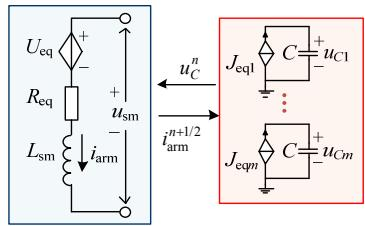  
图4 子模块解耦电路  
Fig. 4 Decoupling circuit of SM

图 4 中：等值电压源 ${ \cal U } _ { \mathrm { e q } } { = } { \cal K } _ { u } { \pmb { u } } _ { C } ,$ ，等值电流源$\scriptstyle J _ { \mathrm { e q } } = K _ { i } i _ { \mathrm { a r m } }$ ，解耦变量组为电容电压 $\pmb { u } _ { C }$ 和电感电流$i _ { \mathrm { a r m } ^ { \mathrm { c } } }$ 。

在得到单个子模块的解耦电路后，将每个子模块的桥臂侧解耦电路进行串联即可得到整个桥臂的等值电路。MMC 上下桥臂对称，以图 1 所示HBSM-MMC 任意一相桥臂为例，MMC 桥臂解耦电路如图 5所示。

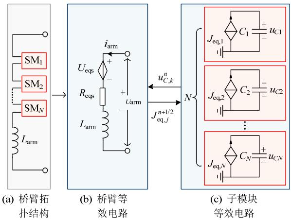  
图 5 MMC 桥臂解耦电路图  
Fig. 5 MMC arm decoupling circuit diagram其中：

$$
\left\{ \begin{array}{l} R _ {\mathrm {e q s}} = \sum_ {k = 1} ^ {N} R _ {\mathrm {e q}, k} \\ U _ {\mathrm {e q s}} = \sum_ {k = 1} ^ {N} \sum_ {j = 1} ^ {m} K _ {u, j, k} u _ {C, j, k} \\ J _ {\mathrm {e q}, j, k} = K _ {i, j, k} i _ {\text {a r m}}, j = 1, \dots , m; k = 1, \dots , N \end{array} \right. \tag {8}
$$

# 2.2 并行求解

上述模型中，根据半隐式延迟解耦原理，桥臂

电流与子模块电容电压可交替求解并相差半个时步，如图 6所示。同一个桥臂的子模块之间串联，因此在求得桥臂电流后，可并行求取各子模块电容电压。

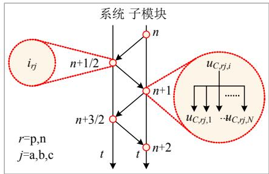  
图 6 并行计算原理示意图  
Fig. 6 Schematic diagram of parallel computing

# 2.3 多类型子模块的解耦模型参数

根据单端口子模块通用解耦方法，对不同类型子模块，修改相应的 $G _ { \mathrm { e q } } , \ R _ { \mathrm { e q } } , \ K _ { u }$ 和 $\pmb { K } _ { i }$ 表达式，即可得到其对应的半隐式延迟解耦模型。下面给出3 种类型子模块的解耦模型参数。

# 2.3.1 半桥型子模块

半桥型子模块结构及等效电路如图 7 所示。 $R _ { 1 }$ 和 $R _ { 2 }$ 分别表示子模块中上、下两个开关组的等效电阻，它们均根据自身开关状态决定阻值为 $R _ { \mathrm { o n } }$ 或$R _ { \mathrm { o f f } } ,$ ，开关状态在仿真中由均压排序控制算法决定。

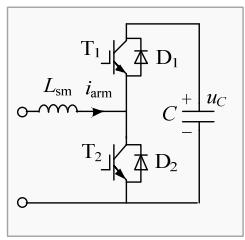  
(a)电路结构

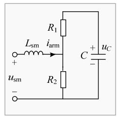  
(b)等效电路   
图7 半桥型子模块  
Fig. 7 Diagram of HBSM

根据常用开关状态组合，其解耦模型相关参数如式(9)所示。

$$
\left\{ \begin{array}{l} G _ {\mathrm {e q}} = \frac {1}{R _ {1} + R _ {2}} = \frac {1}{R _ {\mathrm {o n}} + R _ {\mathrm {o f f}}} \\ R _ {\mathrm {e q}} = \frac {R _ {1} R _ {2}}{R _ {1} + R _ {2}} = \frac {R _ {\mathrm {o n}} R _ {\mathrm {o f f}}}{R _ {\mathrm {o n}} + R _ {\mathrm {o f f}}} \\ K _ {i} = K _ {u} ^ {\mathrm {T}} = \frac {R _ {2}}{R _ {1} + R _ {2}} = \frac {R _ {2}}{R _ {\mathrm {o n}} + R _ {\mathrm {o f f}}} \end{array} \right. \tag {9}
$$

式中 $R _ { \mathrm { o f f } }  \infty$ 时， $G _ { \mathrm { e q } } \approx 0 , ~ R _ { \mathrm { e q } } \approx R _ { \mathrm { o n } } ,$ 。

# 2.3.2 全桥型子模块

类似的，全桥型子模块结构及等效电路如图 8所示，常用开关状态组合下，其解耦模型相关参数如式(10)所示。

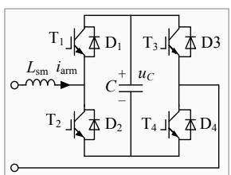  
(a) 电路结构

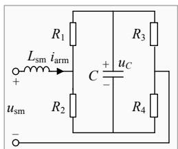  
(b) 等效电路  
图8 全桥型子模块  
Fig. 8 Diagram of FBSM

$$
\left\{ \begin{array}{l} G _ {\mathrm {e q}} = \frac {1}{\left(R _ {1} + R _ {2}\right)} + \frac {1}{\left(R _ {3} + R _ {4}\right)} = \frac {2}{R _ {\mathrm {o n}} + R _ {\mathrm {o f f}}} \approx 0 \\ R _ {\mathrm {e q}} = \frac {R _ {1} R _ {2}}{R _ {1} + R _ {2}} + \frac {R _ {3} R _ {4}}{R _ {3} + R _ {4}} = \frac {2 R _ {\mathrm {o n}} R _ {\mathrm {o f f}}}{R _ {\mathrm {o n}} + R _ {\mathrm {o f f}}} \approx 2 R _ {\mathrm {o n}} \\ K _ {i} = K _ {u} ^ {\mathrm {T}} = \frac {R _ {2}}{R _ {1} + R _ {2}} - \frac {R _ {4}}{R _ {3} + R _ {4}} = \frac {R _ {2} - R _ {4}}{R _ {\mathrm {o n}} + R _ {\mathrm {o f f}}} \end{array} \right. \tag {10}
$$

# 2.3.3 双半桥型子模块

类似的，双半桥型子模块[17]结构及等效电路如图 9 所示，常用开关状态组合下[17]，其解耦模型相关参数如式(11)所示。

$$
\left\{ \begin{array}{l} \boldsymbol {G} _ {\mathrm {e q}} = \left[ \begin{array}{l l} G _ {\mathrm {e q} 1 1} & G _ {\mathrm {e q} 1 2} \\ G _ {\mathrm {e q} 2 1} & G _ {\mathrm {e q} 2 2} \end{array} \right] \approx \boldsymbol {0} \\ G _ {\mathrm {e q} 1 1} = G _ {\mathrm {e q} 2 2} = \frac {6 R _ {\mathrm {m u l}} - R _ {6} \left(2 R _ {8} - R _ {\mathrm {s u m}}\right) + R _ {8} R _ {\mathrm {s u m}}}{4 R _ {\mathrm {m u l}} R _ {\mathrm {s u m}}} \\ G _ {\mathrm {e q} 1 2} = G _ {\mathrm {e q} 2 1} = \frac {2 R _ {\mathrm {m u l}} + R _ {6} \left(2 R _ {8} - R _ {\mathrm {s u m}}\right) - R _ {8} R _ {\mathrm {s u m}}}{4 R _ {\mathrm {m u l}} R _ {\mathrm {s u m}}} \\ R _ {\mathrm {e q}} = \frac {R _ {\mathrm {m u l}}}{R _ {\mathrm {s u m}}} \approx R _ {\mathrm {o n}}, \boldsymbol {K} _ {i} = \boldsymbol {K} _ {u} ^ {\mathrm {T}} = \left[ \frac {R _ {6} + R _ {8}}{2 R _ {\mathrm {s u m}}} \quad \frac {R _ {6} + R _ {8}}{2 R _ {\mathrm {s u m}}} \right] ^ {\mathrm {T}} \end{array} \right. \tag {11}
$$

式中 $R _ { \mathrm { s u m } } { = } R _ { \mathrm { o n } } { + } R _ { \mathrm { o f f } } , R _ { \mathrm { m u l } } { = } R _ { \mathrm { o n } } R _ { \mathrm { o f f } } { \circ }$

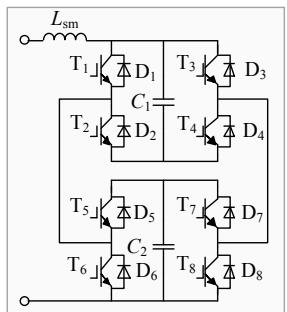  
(a) 电路结构

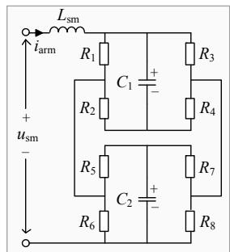  
(b) 等效电路  
图 9 双半桥子模块  
Fig. 9 Diagram of D-HBSM

# 2.4 解耦模型闭锁模式实现方法

在闭锁模式下，全部子模块的 IGBT 关断，MMC 进入不控整流模式，子模块运行状态取决于流过子模块的电流方向。

一般的，当在 PSCAD 等电磁暂态仿真软件中通过自定义方式建立 MMC 等值模型时，由于自定义模型无法通过插值获取二极管元件关断的准确

时刻，常借助二极管和自定义模块的组合电路来处理闭锁。不同类型子模块闭锁拓扑电路一般不相同，但处理方式均与文献[17,20]类似。

如果自己编程开发电磁暂态仿真程序，由于可方便的通过插值获取二极管关断时刻，因此不同类型子模块的闭锁处理方式相对简单且处理流程可统一，即：在程序“状态机”中增加一个闭锁状态(见附录 B)，在“闭锁状态机”中按二极管状态和电流方向，进行闭锁处理。

本文采取第二种方式，使用 C编程实现。

# 3 单端口子模块 MMC 通用仿真框架

# 3.1 解耦模型的参数化简

如果认为 $R _ { \mathrm { o f f } } { \longrightarrow } \infty ,$ ，并将其应用于子模块解耦模型参数的解析式中，则可对 $R _ { \mathrm { e q } } , \ U _ { \mathrm { e q } } , \ U _ { \mathrm { e q } }$ 的求取按开关状态组合进行简化，从而进一步提高计算效率。表1—3 分别给出了HBSM、FBSM 和D-HBSM在常用开关组合状态下解耦模型的简化参数。其中， $\mathrm { T } _ { k }$ 为第k个IGBT//VD开关组。正常状态时，“1”表示IGBT或VD导通，闭锁时，“1”表示仅VD导通。

表1 半桥子模块开关状态与模型参数  
Table 1 Switching states and model parameters of HBSM   
表 2 全桥子模块开关状态与模型参数  

<table><tr><td></td><td>T1</td><td>T2</td><td>iarm</td><td>Req</td><td>Ueq</td><td>Jeq</td></tr><tr><td rowspan="2">正常</td><td>1</td><td>0</td><td>—</td><td>Ron</td><td>uC</td><td>iarm</td></tr><tr><td>0</td><td>1</td><td>—</td><td>Ron</td><td>0</td><td>0</td></tr><tr><td rowspan="2">闭锁</td><td>1</td><td>0</td><td>&gt;0</td><td>Ron</td><td>uC</td><td>iarm</td></tr><tr><td>0</td><td>1</td><td>&lt;0</td><td>Ron</td><td>0</td><td>0</td></tr></table>

Table 2 Switching states and model parameters of FBSM   
表3 双半桥子模块开关状态与模型参数  

<table><tr><td></td><td>T1</td><td>T2</td><td>T3</td><td>T4</td><td>iarm</td><td>Req</td><td>Ueq</td><td>Jeq</td></tr><tr><td rowspan="4">正常</td><td>1</td><td>0</td><td>0</td><td>1</td><td>—</td><td>2Ron</td><td>uC</td><td>iarm</td></tr><tr><td>0</td><td>1</td><td>1</td><td>0</td><td>—</td><td>2Ron</td><td>-UC</td><td>-iarm</td></tr><tr><td>1</td><td>0</td><td>1</td><td>0</td><td>—</td><td>2Ron</td><td>0</td><td>0</td></tr><tr><td>0</td><td>1</td><td>0</td><td>1</td><td>—</td><td>2Ron</td><td>0</td><td>0</td></tr><tr><td rowspan="2">闭锁</td><td>1</td><td>0</td><td>0</td><td>1</td><td>&gt;0</td><td>2Ron</td><td>uC</td><td>iarm</td></tr><tr><td>0</td><td>1</td><td>1</td><td>0</td><td>&lt;0</td><td>2Ron</td><td>-UC</td><td>-iarm</td></tr></table>

Table 3 Switching states and model parameters of D-HBSM   

<table><tr><td></td><td>T1</td><td>T2</td><td>T3</td><td>T4</td><td>T5</td><td>T6</td><td>T7</td><td>T8</td><td>iarm</td><td>Req</td><td>Ueq</td><td>Jeq1</td><td>Jeq2</td></tr><tr><td rowspan="4">正常</td><td>1</td><td>0</td><td>1</td><td>0</td><td>0</td><td>1</td><td>0</td><td>1</td><td>—</td><td>Ron</td><td>0</td><td>0</td><td>0</td></tr><tr><td>1</td><td>0</td><td>0</td><td>1</td><td>1</td><td>0</td><td>0</td><td>1</td><td>—</td><td>Ron</td><td>uC1//uC2</td><td>iarm/2</td><td>iarm/2</td></tr><tr><td>0</td><td>1</td><td>1</td><td>0</td><td>0</td><td>1</td><td>1</td><td>0</td><td>—</td><td>Ron</td><td>uC1//uC2</td><td>iarm/2</td><td>iarm/2</td></tr><tr><td>0</td><td>1</td><td>0</td><td>1</td><td>1</td><td>0</td><td>1</td><td>0</td><td>—</td><td>Ron</td><td>uC1+UC2</td><td>iarm</td><td>iarm</td></tr><tr><td rowspan="2">闭锁</td><td>0</td><td>1</td><td>0</td><td>1</td><td>1</td><td>0</td><td>1</td><td>0</td><td>&gt;0</td><td>Ron</td><td>uC1+UC2</td><td>iarm</td><td>iarm</td></tr><tr><td>1</td><td>0</td><td>1</td><td>0</td><td>0</td><td>1</td><td>0</td><td>1</td><td>&lt;0</td><td>Ron</td><td>0</td><td>0</td><td>0</td></tr></table>

# 3.2 通用仿真框架

观察表 1—3 可以发现，参数化简的结果，使得解耦模型中，受控源的系数 $\pmb { K _ { u } }$ 、 $\pmb { K } _ { i }$ 可根据开关状态的组合直接给出，而等值电阻 $R _ { \mathrm { e q } } ,$ ，则可根据子模块导通路径中的开关数目与 $R _ { \mathrm { o n } }$ 相乘而得，即：可以不用列写子模块的状态方程而只关注子模块的导通路径就可按照开关状态组合方便的得到解耦电路中受控电源和导通等值电阻的参数。将其进一步拓展，则可得到一种适用于任意子模块拓扑的MMC 通用解耦与仿真计算框架，具体步骤如下：

# 1）建立图5的解耦等值电路。

对于具有自均压功能的子模块拓扑，当不考虑并联均压的极短过渡过程时，各子模块内部电容间相互解耦。此时，流过子模块各均压电容的电流为：$\dot { l } _ { s \mathrm { { m } } } { = } \dot { l } _ { \mathrm { { a r m } } } / m$ 。其中 m为子模块内部均压电容数。

# 2）确定解耦模型的参数 $R _ { \mathrm { e q } } \cdot$ 、 $\pmb { K _ { u } }$ 、 $K _ { i } ,$ 。

根据子模块开关状态组合，将子模块按工作状态分为投入、旁路和闭锁 3 组，然后分别按开关状态组合和桥臂电流方向，计算各状态下对应的 $R _ { \mathrm { e q } } \mathrm { , }$ 、$\pmb { K _ { u } }$ 、 $K _ { i } { _ { \mathrm { c } } }$ 。一般的，各状态的相关参数只需分别计算一次，不需要对每个子模块都计算。

# 3）仿真计算。

基于半隐式延迟解耦原理，以桥臂电感电流和子模块电容电压作为两组状态变量进行分裂和解耦，然后结合第 2 步所得模型参数，变量组之间可交替求解并相差半个时步，而各子模块电容电压可采取并行方式求解以提高计算效率。

# 3.3 计算流程

MMC正常状态时的快速解耦算法流程如图10所示。图中，系统的初始化包括读输入系统数据，存储子模块开关状态组合与受控源对应系数等。如果子模块解耦后导纳恒定，则还可在进入仿真之前形成系统导纳矩阵并进行 LU 分解。

# 4 解耦模型特点分析

根据前述分析，本文的解耦模型和方法具有如下特点：

1）相比于平均值、开关函数以及动态相量等模型，本文模型既可计及子模块内部动态特性，又可计及开关器件的导通损耗，具有与详细模型近似的精细度。  
2）反解子模块电容电压时的计算效率高，与子模块内部拓扑的复杂度无关。观察图 5 可知，不

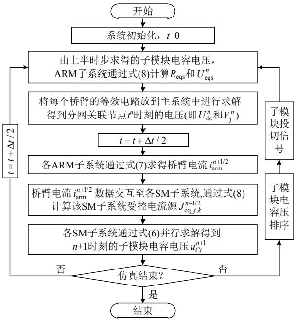  
图 10 MMC 快速解耦算法流程图  
Fig. 10 MMC fast decoupling algorithm flow chart同于文献[17-19]中基于戴维南和嵌套快速求解法的复杂反解过程，本文模型的子模块内部等值电路仅由受控电流源和电容并联构成，且含有多个电容时，各电容的等值电路之间也相互解耦(忽略自均压拓扑中的极短过渡过程)，因此电路简单，计算量少，仿真效率高。

3）常用子模块拓扑的端口等值导纳恒定。观察表 1—3 中 HBSM、FBSM 和 D-HBSM 三种模型的 $R _ { \mathrm { e q } }$ 参数，子模块在投入、旁路以及闭锁非高阻态时的阻值均相同，因此桥臂和 MMC 的导纳矩阵恒定，从而可避免传统方法中，因开关动作导致导纳矩阵变化而不得不频繁 LU 重分解带来的巨大计算量，可极大地提高计算效率。  
4）利用中心积分与隐式梯形积分的近似等效，实现状态变量组(桥臂电感电流和子模块电容电压)间的半步时延和半隐式解耦，既可提高计算精度和数值稳定性，又无需在开关动作时切换解耦变量组的积分算法(由中心积分切换为后退欧拉)，从而能始终保持解耦形式的一致性和仿真计算的高效性。  
5）按照解耦和仿真框架，只需根据开关组合状态简单求得解耦模型的参数 $R _ { \mathrm { e q } } , K _ { u } , K _ { i } $ ，即可适用于新型拓扑(如文献[27]的自阻自均压拓扑)。模型的通用性强，扩展性好，可有效提高仿真程序的开发效率。

# 5 算例验证

在 Visual Studio 2019 中采用 C语言编程实现

本文所提方法，程序结果与 PSCAD/EMTDC 内置的戴维南等值模型串行仿真结果进行对比，验证本文算法的精度和效率。硬件配置为 PC机，Intel Corei7-9700K CPU (8 核心，8 线程)，16GB RAM。系统拓扑如图 11 所示，算例采用单端 201 电平半桥子模块 MMC，系统参数如表 4 所示。仿真的时间节点设置如下：初始时刻，断路器 B处于断开状态，MMC 处于闭锁模式；系统从 0 时刻开始启动，电源上升时间为 0.05s；0.2s MMC 解除闭锁；0.5s 时闭合断路器 B，切断限流电阻；1s 时整流侧发生直流双极短路故障，故障持续时间为 50ms；故障发生 5ms 后换流站闭锁，故障结束 5ms 后解除闭锁模式，运行总时间为 2s。

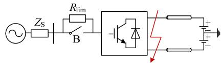  
图 11 系统拓扑  
Fig. 11 Topology of test circuit

# 5.1 仿真精度验证

本节以 PSCAD/EMTDC 戴维南等值模型(PSCAD-TEM)仿真结果作为参考波形，将本文所提方法结果(SILDP)与之比较，并计算本文方法与参考波形的均方根相对误差。

仿真步长设置为 $5 \mu \mathrm { s }$ ，仿真对比结果如图 12所示。其中，图 12(a)—(f)中的 3 个子图自上而下分别为：整体波形、局部放大、相对误差。

表 4 单端 201 电平 HBSM-MMC 系统参数  
Table 4 Parameters of the 201-level single HBSM-MMC system   

<table><tr><td>设备</td><td>参数</td><td>数值</td></tr><tr><td rowspan="7">系统</td><td>交流电压有效值/kV</td><td>230</td></tr><tr><td>交流系统频率/Hz</td><td>50</td></tr><tr><td>交流系统电阻/Ω</td><td>0.88</td></tr><tr><td>交流系统电感/mH</td><td>45</td></tr><tr><td>直流电压/kV</td><td>400</td></tr><tr><td>直流线路电阻/Ω</td><td>1</td></tr><tr><td>限流电阻/Ω</td><td>3</td></tr><tr><td rowspan="3">MMC</td><td>桥臂子模块数量</td><td>200</td></tr><tr><td>子模块电容/mF</td><td>10</td></tr><tr><td>桥臂电感/mH</td><td>50</td></tr></table>

由图 12 可以看出，各个波形都与参考波形吻合，误差基本都在 1%以内，满足仿真精度的要求，也验证所提模型的准确性。

# 5.2 仿真效率验证

本节对比 PSCAD 戴维南等值模型串行方法和本文方法的仿真效率，测试算例采用图 11 单端MMC 系统，在不同子模块数量和不同仿真步长下对比戴维南等效模型与本文所提解耦模型的 CPU用时和加速比。解耦模型串行方式通过常规 $\mathrm { C } { + } { + }$ 代码实现，解耦模型并行方式通过在 $\mathrm { C } { + + }$ 使用OpenMP 实现。将单端 MMC 的桥臂电流 $i _ { \mathrm { a r m } }$ 和子模块电容电压 $u _ { C }$ 的求解任务分配至 8 个核心，分别验证本文模型采用串行和并行方式时的计算效率。

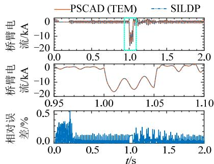  
(a)A相桥臂电流

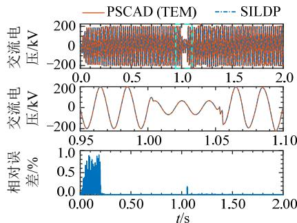  
(b)A相交流端口电压

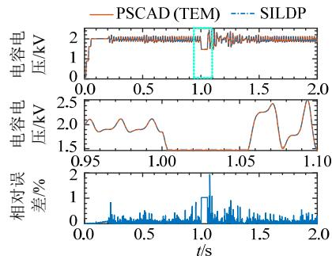  
(c)子模块电容电压

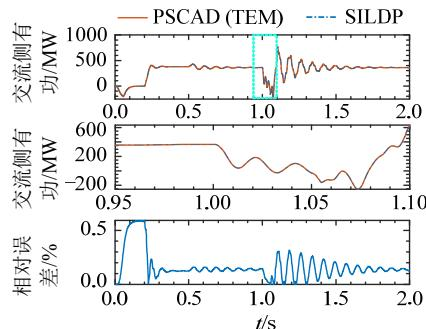  
(d)交流侧有功功率

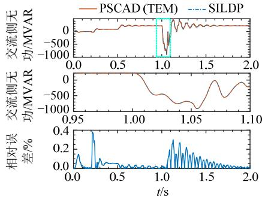  
(e)交流侧无功功率

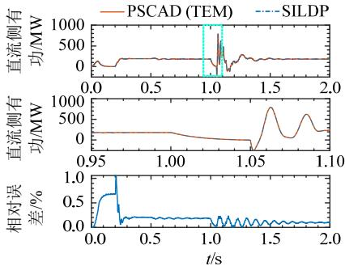  
(f直流侧有功功率   
图 12 仿真结果波形对比和相对误差  
Fig. 12 Simulation result waveform comparison and relative error

表 5 为不同电平数下，PSCAD 戴维南等值串行方法和本文方法的仿真时间对比。其中，运行时间设置为 2s，仿真步长设置为 $5 \mu \mathrm { s }$ 。加速比 1 为PSCAD 串行耗时与解耦模型串行耗时之比，加速比2为PSCAD串行耗时与解耦模型并行耗时之比。

表5 不同电平数MMC CPU时间对比  
Table 5 Total CPU time comparison of different levels MMC   

<table><tr><td rowspan="2">电平数</td><td colspan="3">仿真耗时/s</td><td rowspan="2">加速比1</td><td rowspan="2">加速比2</td></tr><tr><td>PSCAD(戴维南等值)</td><td>解耦模型串行</td><td>解耦模型并行</td></tr><tr><td>11</td><td>9.19</td><td>2.78</td><td>2.52</td><td>3.31</td><td>3.65</td></tr><tr><td>51</td><td>19.58</td><td>6.31</td><td>3.28</td><td>3.10</td><td>5.97</td></tr><tr><td>101</td><td>34.83</td><td>11.72</td><td>4.17</td><td>2.97</td><td>8.35</td></tr><tr><td>201</td><td>80.98</td><td>26.98</td><td>6.90</td><td>3.00</td><td>11.74</td></tr><tr><td>401</td><td>286.92</td><td>94.56</td><td>19.54</td><td>3.03</td><td>14.68</td></tr><tr><td>801</td><td>1644.19</td><td>540.73</td><td>102.39</td><td>3.04</td><td>16.06</td></tr></table>

表 6 为不同仿真步长下，PSCAD 戴维南等值串行方法和本文方法的仿真时间对比。

表6 不同步长CPU 时间对比  
Table 6 Total CPU time comparison between different time steps   

<table><tr><td rowspan="2">仿真步长</td><td colspan="3">仿真耗时/s</td><td rowspan="2">加速比1</td><td rowspan="2">加速比2</td></tr><tr><td>PSCAD(戴维南等值)</td><td>解耦模型串行</td><td>解耦模型并行</td></tr><tr><td>20μs</td><td>38.17</td><td>12.59</td><td>4.69</td><td>3.03</td><td>8.14</td></tr><tr><td>10μs</td><td>49.53</td><td>17.26</td><td>5.53</td><td>2.87</td><td>8.96</td></tr><tr><td>5μs</td><td>80.98</td><td>26.98</td><td>6.90</td><td>3.00</td><td>11.74</td></tr><tr><td>1μs</td><td>283.89</td><td>96.39</td><td>18.92</td><td>2.95</td><td>15.00</td></tr><tr><td>0.5μs</td><td>541.83</td><td>184.03</td><td>34.71</td><td>2.94</td><td>15.61</td></tr></table>

对比表5、6中的仿真耗时和加速比，可以看出，本文模型加速效果明显，可以有效地提升 MMC 的仿真效率。由于测试所用 CPU 为 8 核，测试算例 201电平单端MMC共有1200个子模块，处理器核心数远小于子模块数，限制了解耦模型并行的加速比。若使用核心数更高的 CPU 或 GPU 计算，将子模块的求解任务分配至更多核心，理论上可以获得更高的加速比。此外，当子模块拓扑的复杂性增加，系统的规模增大时，本文模型子模块反解计算效率高、常规拓扑下系统导纳恒定的优势将更为凸显。

# 6 结论

本文从 MMC 单端口子模块状态方程出发，利用矩阵分裂和延迟技术，首先构建了 MMC 单端口子模块通用半隐式延迟解耦方法，并应用于半桥、

全桥和双半桥子模块。然后，基于对模型参数的简化，进一步提出了适用于任意单端口子模块拓扑的MMC 通用仿真框架，并分析模型的特点，给出计算流程，最后通过算例验证本文方法的准确性和有效性，取得如下结论：

1）通过子模块解耦和桥臂等值，本文方法能极大的降低系统线性方程组的维数，可有效解决MMC因高电平数而带来的超高阶线性方程组求解难题。  
2）本文建立的解耦模型，一方面，子模块内部等值电路简单且相互解耦可并行；另一方面，由常规子模块拓扑构成的 MMC 和系统，导纳矩阵恒定。两者均可极大地提高仿真效率。  
3）状态变量组间的解耦，没有非状态量突变问题，因而桥臂电流和子模块电容电压的解耦形式不受开关动作的影响，可始终保持解耦的一致性和计算的高效性。  
4）本文建立的解耦模型与仿真框架，既具有与详细模型近似的精细度，又具有比现有戴维南等值模型更高计的算效率。而模型参数计算的简便性，使得模型的通用性强，扩展性好，有助于仿真程序开发效率的提高。

# 参考文献

[1] 许建中，李承昱，熊岩，等．模块化多电平换流器高效建模方法研究综述[J]．中国电机工程学报，2015，35(13)：3381-3392  
XU Jianzhong，LI Chengyu，XIONG Yan，et al．A review of efficient modeling methods for modular multilevel converters[J]．Proceedings of the CSEE，2015，35(13)： 3381-3392(in Chinese)   
[2] 董毅峰，王彦良，韩佶，等．电力系统高效电磁暂态仿真技术综述[J]．中国电机工程学报，2018，38(8)：2213-2231  
DONG Yifeng，WANG Yanliang，HAN Ji，et al．Review of high efficiency digital electromagnetic transient simulation technology in power system[J]．Proceedings of the CSEE 2018，38(8)：2213-2231(in Chinese)   
[3] 陈武晖，吴明哲，张军，等．模块化多电平换流器电磁暂态模型研究综述[J]．电网技术，2020，44(12)：4755-4765  
CHEN Wuhui，WU Mingzhe，ZHANG Jun，et al．Reviewof electromagnetic transient modeling of modularmultilevel converters[J]．Power System Technology，2020，44(12)：4755-4765(in Chinese)  
[4] GOETZ S M，PETERCHEV A V，WEYH T．Modular multilevel converter with series and parallel module connectivity：topology and control[J]．IEEE Transactions

on Power Electronics，2015，30(1)：203-215  
[5] XU Jianzhong，ZHANG Jiyuan，LI Jialong，et al Series-parallel HBSM and two-port FBSM based hybrid MMC with local capacitor voltage self-balancing capability[J]．International Journal of Electrical Power & Energy Systems，2018，103：203-211   
[6] NAMI A，LIANG Jiaqi，DIJKHUIZEN F，et al．Modular multilevel converters for HVDC applications：review on converter cells and functionalities[J]．IEEE Transactions on Power Electronics，2015，30(1)：18-36   
[7] PRIYA M，PONNAMBALAM P，MURALIKUMAR KModular-multilevel converter topologies and applications– a review[J]．IET Power Electronics，2019，12(2)：170-183  
[8] 鲁晓军，林卫星，安婷，等．MMC电气系统动态相量模型统一建模方法及运行特性分析[J]．中国电机工程学报，2016，36(20)：5479-5491  
LU Xiaojun，LIN Weixing，AN Ting，et al．A unified dynamic phasor modeling and operating characteristic analysis of electrical system of MMC[J]．Proceedings of the CSEE，2016，36(20)：5479-5491(in Chinese)   
[9] 朱蜀，刘开培，李彧野，等．基于动态相量及传递函数矩阵的模块化多电平换流器交直流侧阻抗建模方法[J]中国电机工程学报，2020，40(15)：4791-4804  
ZHU Shu，LIU Kaipei，LI Yuye，et al．AC/DC-side impedance modeling method for modular multilevel converter based on dynamic phasors and transfer function matrix[J]．Proceedings of the CSEE，2020，40(15)： 4791-4804(in Chinese)   
[10] 姚蜀军，屈秋梦，蔡焱蒙，等．基于多频段动态相量法的MMC换流器建模方法[J]．中国电机工程学报，2020，40(18)：5932-5941  
YAO Shujun，QU Qiumeng，CAI Yanmeng，et al Research of modeling method of modular multilevel converter based on multi-frequency bands dynamic phasor[J]．Proceedings of the CSEE，2020，40(18)： 5932-5941(in Chinese)   
[11] SHU Dewu，DINAVAHI V，XIE Xiaorong，et al．Shifted frequency modeling of hybrid modular multilevel converters for simulation of MTDC grid[J] ． IEEE Transactions on Power Delivery，2018，33(3)：1288-1298   
[12] 潘尔生，杨惠文，宋钊，等．适用于大步长情形下基于模块化多电平拓扑的直流电网高效仿真建模方法[J]．中国电机工程学报，2020，40(19)：6142-6149  
PAN Ersheng，YANG Huiwen，SONG Zhao，et al．An efficient modeling of modular multi-level converter based dc grids by using larger time-steps[J]．Proceedings of the CSEE，2020，40(19)：6142-6149(in Chinese)   
[13] 姚蜀军，黄闻而达，韩民晓，等．模块化多电平换流器时间尺度变换建模和仿真[J]．电网技术，2018，42(12)：3880-3887  
YAO Shujun，HUANG Wenerda，HAN Minxiao，et al

Modular multilevel converter modeling based on time-scale-frame transformation[J] ． Power System Technology，2018，42(12)：3880-3887(in Chinese)   
[14] KATO T，INOUE K，FUKUTANI T，et al．Multirate analysis method for a power electronic system by circuit partitioning[J]．IEEE Transactions on Power Electronics， 2009，24(12)：2791-2802   
[15] LIN Ning，DINAVAHI V．Variable time-stepping modular multilevel converter model for fast and parallel transient simulation of multiterminal DC grid[J]．IEEE Transactions on Industrial Electronics，2019，66(9)：6661-6670   
[16] 许建中，赵成勇，刘文静．超大规模 MMC 电磁暂态仿真提速模型[J]．中国电机工程学报，2013，33(10)：114-120．  
XU Jianzhong ， ZHAO Chengyong ， LIU WenjingAccelerated model of ultra-large scale mmc inelectromagnetic transient simulations[J]．Proceedings ofthe CSEE，2013，33(10)：114-120(in Chinese)  
[17] 赵禹辰，徐义良，赵成勇，等．单端口子模块 MMC 电磁暂态通用等效建模方法[J]．中国电机工程学报，2018，38(16)：4658-4667  
ZHAO Yuchen，XU Yiliang，ZHAO Chengyong，et al Generalized electromagnetic transient (EMT) equivalent modeling of MMCs with arbitrary single-port sub-module structures[J]．Proceedings of the CSEE，2018，38(16)： 4658-4667(in Chinese)   
[18] 徐义良，赵成勇，赵禹辰，等．双端口子模块MMC通用电磁暂态等效建模方法[J]．中国电机工程学报，2018，38(20)：6079-6090  
XU Yiliang，ZHAO Chengyong，ZHAO Yuchen，et al Generalized electromagnetic transient (EMT) equivalent modeling of MMCs with arbitrary two-port sub-module structures[J]．Proceedings of the CSEE，2018，38(20)： 6079-6090(in Chinese)   
[19] 许建中，徐义良，赵禹辰，等．多类型子模块MMC电磁暂态通用建模和实现方法[J]．电网技术，2019，43(6)：2039-2048  
XU Jianzhong，XU Yiliang，ZHAO Yuchen，et al Generalized electromagnetic transient equivalent modeling and implementation of MMC with arbitrary multi-type submodule structures[J] ． Power System Technology，2019，43(6)：2039-2048(in Chinese)   
[20] 王洁聪，刘崇茹，徐东旭，等．基于RTDS 的模块化多电平换流器闭锁状态仿真建模方法[J]．电工技术学报，2018，33(16)：3686-3696  
WANG Jiecong，LIU Chongru，XU Dongxu，et al Simulation method of modular multilevel converter blocking state based on RTDS[J]．Transactions of China Electrotechnical Society，2018，33(16)：3686-3696(in Chinese)   
[21] 连攀杰，刘文焯，汤涌，等．模块化多电平换流器的高

效电磁暂态仿真方法研究[J]．中国电机工程学报，2020，40(24)：7980-7989  
LIAN Panjie，LIU Wenzhuo，TANG Yong，et al．Research on efficient electromagnetic transient simulation method of modular multilevel converter[J]．Proceedings of the CSEE，2020，40(24)：7980-7989(in Chinese)   
[22] 姚蜀军，庞博涵，吴国旸，等．半隐式延迟解耦电磁暂态并行仿真方法(一)：原理及交流分网与并行[J]．中国电机工程学报，2022，42(7)：2486-2496  
YAO Shujun，PANG Bohan，WU Guoyang，et al．A method of parallel computing for electromagnetic transient simulation based on semi-implicit latency decoupling technology (Part I)：theory and AC network partitioning and parallel[J]．Proceedings of the CSEE， 2022，42(7)：2486-2496(in Chinese)   
[23] 徐政，屠卿瑞，管敏渊，等．柔性直流输电系统[M]北京：机械工业出版社，2013：14-19  
XU Zheng，TU Qingrui，GUAN Minyuan，et al．FlexibleDC power transmission system[M] ． Beijing ： ChinaMachine Press，2013：14-19(in Chinese)  
[24] LI Feng，WOO P Y．A new method for establishing stateequations ： the branch replacement and augmentednode-voltage equation approach[J]．Circuits，Systems andSignal Processing，2002，21(2)：149-161．  
[25] RIAZA R，TORRES-RAMÍREZ J．Non-linear circuit modelling via nodal methods[J]．International Journal of Circuit Theory and Applications，2005，33(4)：281-305   
[26] 张伯明，陈寿孙，严正．高等电力网络分析[M]．2版北京：清华大学出版社，2007：139-145  
ZHANG Boming ， CHEN Shousun ， YAN Zheng ．Advanced power network analysis[M]．2nd ed．Beijing：Tsinghua University Press，2007：139-145(in Chinese)  
[27] 张建坡，崔涤穹，田新成，等．自阻自均压模块化多电平换流器子模块拓扑及控制[J]．电工技术学报，2020，35(18)：3917-3926  
ZHANG Jianpo，CUI Diqiong，TIAN Xincheng，et al Self-block and voltage balance modular multilevel converter sub module topology and control[J] Transactions of China Electrotechnical Society，2020， 35(18)：3917-3926(in Chinese)

# 附录 A 等值电导近似为0 的推导过程

由叠加定理， $G _ { \mathrm { e q } }$ 中的对角元素，可看作是子模块内部各电容单独作用时所构成回路的导纳。如果回路中的开关都是导通的，由于导通阻值很小，则构成的回路可认为对电容短路。显然，正常情况下这是不允许的(比如为了避免桥臂直通，必须设置死区)。因此，回路中必然存在关断状态的开关。由于关断阻值很大，从而回路所对应的导纳可近似为0，也即 $G _ { \mathrm { e q } }$ 中的对角元素可近似为 0。

$G _ { \mathrm { e q } }$ 中的非对角元素体现的是子模块含有多个电容时的相互作用。当多个电容与开关构成串联回路时，显然，回路

所对应的导纳也可近似为0。而当电容之间并联形成自均压回路时，一方面，可忽略极短的均压过渡过程，另一方面，均压后并联的电容之间不会有电流环流，可认为环流回路导纳为 0。因此，串联或并联情况下 $G _ { \mathrm { e q } }$ 中的非对角元素都可近似为 0。

综上， $G _ { \mathrm { e q } }$ 可近似为0。图A1 是上述分析过程的示意。

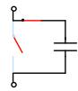

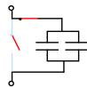

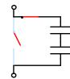

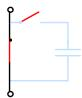

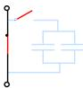

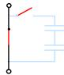  
  
(b)   
(c）  
图 A1 子模块电容接入/旁路示意图  
Fig. A1 SM capacitor inserted/bypassed

# 附录 B 子模块状态机

图 B1 中，(1)—(4)表示两种状态间的一种转换关系，当特定开关状态组合条件满足时，处于某状态(源状态)的子模块将执行某一动作并进入另一状态(目标状态)。

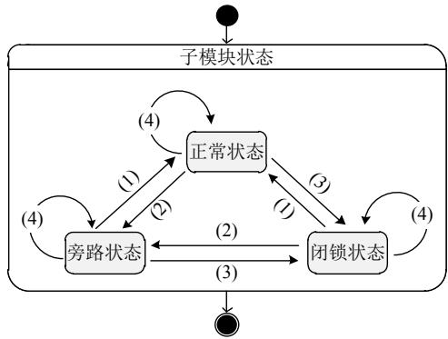  
图B1 子模块状态机图  
Fig. B1 SM state machine diagram

  
姚蜀军

在线出版日期：2021-05-24。

收稿日期：2021-01-12。

作者简介：

姚蜀军(1973)，男，副教授，主要从事电力系统运行与控制、直流输电、电磁暂态仿真和建模等方面的研究工作，yaoshujun@ncepu.edu.cn；

庞博涵(1997)，男，硕士研究生，主要从事电磁暂态建模与仿真方面的研究工作，pang_bohan@163.com；

曾子文(1997)，男，硕士研究生，主要从事风电场建模与仿真方面的研究工作；

许明旺(1996)，男，硕士研究生，主要从事电磁暂态建模与仿真方面的研究工作；

* 通信作者：刘晋(1974)，男，讲师，主要从事柔性交直流输电、电力电子技术研究，liujin@ncepu.edu.cn。

(编辑 邱丽萍，张文鑫)

# Semi-implicit Latency Decoupling Technology Based Electromagnetic Transient Simulation (Part II): General Decoupling and Fast Simulation for Single-port Sub-module MMC

YAO Shujun, PANG Bohan, ZENG Ziwen, XU Mingwang, LIU Jin*, YAO Yifan, WU Mengtong (North China Electric Power University)

KEY WORDS: modular multilevel converter; electromagnetic transient simulation; semi-implicit latency decoupling; constant system conductance matrix; parallel computing

Since there is a large number of submodules (SM) in the modular multilevel converter (MMC), as well as the complexity and time-varying nature of the submodule topology, it is difficult to balance the solution accuracy and efficiency.

In this paper, the semi-implicit latency decoupling and paralleling technology (SILDP) is applied to the research of single-port MMC high-efficiency electromagnetic transient simulation modeling. The obtained model has the characteristics of constant admittance matrix of conventional topological SMs, simple decoupling circuit, high computational efficiency, and general applicability.

The single-port MMC and its equivalent circuit are shown in Fig.1. Starting from the state equation of MMC single-port SM, using matrix splitting and latency technology, a general SILDP model of MMC single-port SM is constructed and applied to half-bridge, full-bridge, and double half-bridge SMs.

Furthermore, based on the simplification of model parameters, a general decoupling and simulation framework for any single-port submodules MMC is proposed. The decoupling circuit of the MMC arm is shown in Fig. 1. Equations (1) and (2) are the recursive formula of capacitor voltage and arm current.

$$
u _ {C j} ^ {n + 1} = u _ {C j} ^ {n} + \frac {J _ {\mathrm {e q} , j} ^ {n + 1 / 2} \Delta t}{C _ {j}}, j = 1, \dots , m \tag {1}
$$

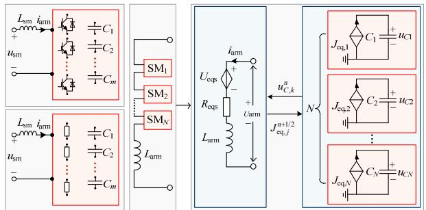  
Fig. 1 Single-port SM decoupling circuit

$$
i _ {\mathrm {a r m}} ^ {n + 1 / 2} = \frac {\left(\frac {L _ {\mathrm {s m}}}{\Delta t} - \frac {R _ {\mathrm {e q}}}{2}\right) i _ {\mathrm {a r m}} ^ {n - 1 / 2} - U _ {\mathrm {e q}} ^ {n} + u _ {\mathrm {s m}} ^ {n}}{\left(\frac {L _ {\mathrm {s m}}}{\Delta t} + \frac {R _ {\mathrm {e q}}}{2}\right)} \tag {2}
$$

The accuracy and efficacy of the proposed method are demonstrated by simulating a 201-levels MMCbased HVDC system. The proposed method (SILDP) is compared to PSCAD/EMTDC Thevenin equivalent model (TEM) of MMC to verify the accuracy. CPU serial and CPU parallel (8 Cores/8 Threads) computational efficiency of the proposed model is tested. The simulation results (Fig. 2 and Table 1) show that SILDP has an accuracy similar to the TEM and high efficiency is achieved.

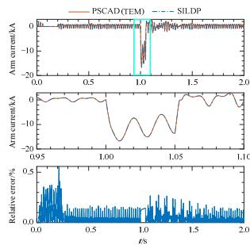

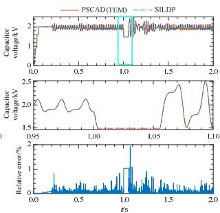  
Fig. 2 Simulation result waveform comparison and relative error

Table 1 Total CPU time comparison of different levels MMC (Solution time step: 5s)   

<table><tr><td rowspan="2">Levels</td><td colspan="3">CPU Time/s</td><td rowspan="2">Speedup Factor 1</td><td rowspan="2">Speedup Factor 2</td></tr><tr><td>PSCAD (TEM)</td><td>SILDP (Serial)</td><td>SILDP (Parallel)</td></tr><tr><td>11</td><td>9.19</td><td>2.78</td><td>2.52</td><td>3.31</td><td>3.65</td></tr><tr><td>51</td><td>19.58</td><td>6.31</td><td>3.28</td><td>3.10</td><td>5.97</td></tr><tr><td>101</td><td>34.83</td><td>11.72</td><td>4.17</td><td>2.97</td><td>8.35</td></tr><tr><td>201</td><td>80.98</td><td>26.98</td><td>6.90</td><td>3.00</td><td>11.74</td></tr><tr><td>401</td><td>286.92</td><td>94.56</td><td>19.54</td><td>3.03</td><td>14.68</td></tr><tr><td>801</td><td>1644.19</td><td>540.73</td><td>102.39</td><td>3.04</td><td>16.06</td></tr></table>