Received April 20, 2022, accepted May 15, 2022, date of publication May 18, 2022, date of current version May 23, 2022.

Digital Object Identifier 10.1109/ACCESS.2022.3176006

# An Equivalent Hybrid Model for a Large-Scale Modular Multilevel Converter and Control Simulations

MOHAMMED ALHARB I 1, SEMIH ISIK 2, (Graduate Student Member, IEEE), AND SUBHASHISH BHATTACHARYA 2, (Fellow, IEEE)

1Department of Electrical Engineering, College of Engineering, King Saud University, Riyadh 11421, Saudi Arabia

2Department of Electrical and Computer Engineering, North Carolina State University, Raleigh, NC 27606, USA

Corresponding author: Mohammed Alharbi (mohalharbi@ksu.edu.sa)

This work was supported by the King Saud University, Riyadh, Saudi Arabia, through the Researchers Supporting, under Project RSP2022R467.

ABSTRACT Modular multilevel converter (MMC) is adopted mainly for high voltage applications with many power blocks per arm. Before commissioning a large-scale MMC application, it is vital to simulate and study internal and system-level dynamics. However, it is challenging to simulate an MMC with many SMs in EMT simulation tools due to simulation time and computation burden. Therefore, several simplified modeling techniques are proposed to reduce the challenges. Even though the existing models reasonably reduce the computation complexity and simulation time, there are still challenges as the internal dynamics of an MMC cannot be fully captured. On the other hand, the detailed equivalent models capture the internal dynamics, but the simulation complexity and the time increase. Therefore, it is still a need for better, faster, and more accurate simulation models to study the system-level and internal dynamics of an MMC. Therefore, this paper proposes a hybrid simulation model for a large-scale MMC application using a scale-up control structure method. The proposed method is verified in the MATLAB/Simulink simulation tool. Besides, the proposed model is tested and verified at the Real-Time Digital Simulator (RTDS) in a Hardware-in-Loop (HIL) environment.

INDEX TERMS EMT, hybrid model, MMC, HVDC, simulation, RTDS.

# I. INTRODUCTION

Voltage Source Converter (VSC) based High Voltage Direct Current (HVDC) applications is witnessed a global rise in the last two decades. Significantly, the technical developments in the VSC topology and the invention of the Modular Multilevel Converter (MMC) in the early 2000s helped increase the number of HVDC projects worldwide. Besides, it is expected that it will grow by around 11% between 2020 to 2025 based on the compound annual growth rate [1]. One reason for this increase is to integrate more renewable energy sources. Besides, VSC-based HVDC provides several benefits to the existing AC grids, such as grid stability and black-start capability under abnormal conditions. Furthermore, the MMC topology helps reduce the cost of HVDC applications cost by reducing the component sizing and reducing the total land area by requiring a much smaller filter.

The associate editor coordinating the review of this manuscript and approving it for publication was Rui Li

The MMC topology is flexible to increase the capacity based on the demand due to its modular and scalable features. The MMC structure can be built by several hundreds of power blocks called Sub-Module (SM), as seen in Fig. 1. Different SM structures are available for MMC applications, but Half-Bridge SM (HBSM) or Full-Bridge SM (FBSM) is the most used type. The HBSM includes two switching elements, such as Insulated Gate Bipolar Transistors (IGBTs), and an energy storage element such as a capacitor. In contrast, the FBSM includes four IGBTs and a capacitor, as seen in Fig. 2(a) and 2(b). The HBSM causes fewer losses, and it is more economical than the FBSM. However, unlike the HBSM, the FBSM can block a DC fault from the AC grid. The scope of this paper does not include DC side fault analysis, hence HBSM is adopted throughout the paper.

Regardless of the SM type, each phase of an MMC consists of positive and negative arms with the same number of SMs. The number of SMs can be increased or decreased based on the desired capacity. The higher number of SM results

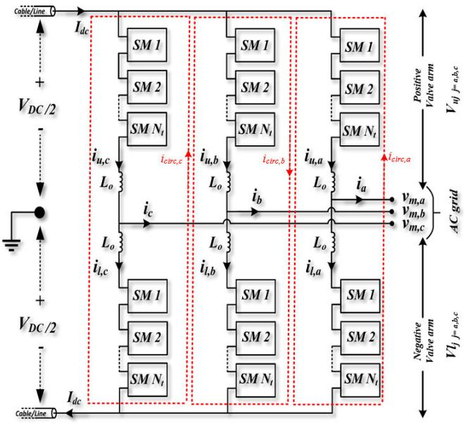  
FIGURE 1. Illustration of the conventional three-phase MMC system.

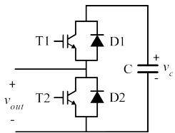  
(a)

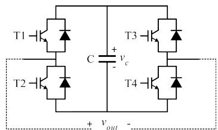  
(b)   
FIGURE 2. (a) HBSM and (b) FBSM circuits.

in higher losses as each SM consists of switching elements and the energy storage element. Besides, it is challenging for simulation tools to analyze the dynamic operation of an MMC-based HVDC system with many SMs. An MMC with hundreds of SMs creates a large number of nodes, resulting in an extensive network admittance matrix. The generated network admittance matrix needs to be recalculated for every switching event. Hence, repeating this process at every switching action may be incredibly challenging and time-consuming. Therefore, the real-time digital simulators are proposed to simulate an extensive MMC system of up to10,000 nodes per outer core with a time step of 1-20 µs in a short amount of time. Besides, the real-time digital simulators allow Hardware-in-Loop (HIL) testing to connect an external controller and an emulator [2]–[4]. Even though the computational burden and time dramatically decrease with the real-time digital simulators, the cost of the digital simulators is expensive. Therefore, based on the need for an accurate offline simulation tool, several equivalent detailed and averaging models for MMC applications are proposed in small-time steps with adequate accuracy. The authors of [5] proposed a Thevenin-based detailed equivalent MMC model. The proposed method shows a better performance with enough accuracy than the traditional electromagnetic

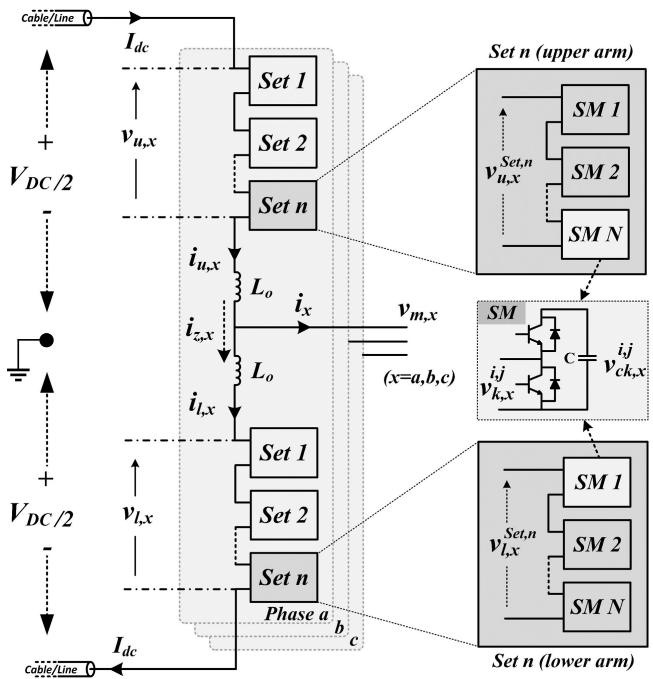  
FIGURE 3. MMC scale-up structure.

Transient (EMT) model. However, performance degradation still occurs, especially with many MMC applications. Averaging-based models for MMC are proposed in [5]–[8], resulting in less computational and simulation time. Even though the system-level accuracy is enough in these models, the user does not have the flexibility to test the internal dynamic of the MMC, such as SM voltage balancing control. The authors [9], [10] proposed a co-simulation model where a part of the system is modeled based on a detailed equivalent model, and the rest of the system is modeled with a less detailed orientation. Although faster simulation time is achieved in this work, implementing parallel processing at different time steps and synchronization of the different control structures such as MMC internal current control, the system-level control can be highly challenging. Researchers in [11]–[15] adopted the dynamic phasors approach to MMC modeling. The algorithm of this type of model is simple as the magnitude of the phase of the measured time-domain signals is represented in the phasor domain as a complex conjugate pair. Hence, this allows the user to include or eliminate specific harmonics in the model. The dynamic phasor approach MMC model can be considered an alternative at the lowest frequency component, but it might be inefficient when the number of harmonics increases.

As one can see, averaging models are not well suited for internal dynamics studies for MMC as the modeling of the MMC is not as detailed. On the other hand, detailed equivalent models can be used with better accuracy for system-level and internal dynamic studies. However, computational burden and the simulation time are the main challenges, especially for the MMC applications with a high number of SMs. As MMC simulation models are incredibly critical for many

reasons, there is still a need for well-performed, fast, and accurate simulation models.

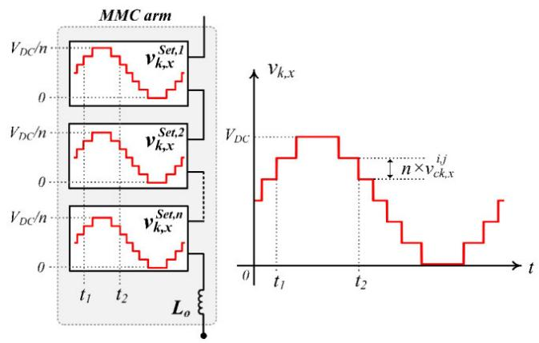  
FIGURE 4. Arm voltage generation with the scale-up MMC structure.

Thus, this paper proposes a simplified, detailed MMC simulation model based on the scale-up control method proposed in [16], [17]. The scale-up control methodology is proposed for MMC applications to increase or decrease the MMC capacity without significant system modification. The proposed hybrid simulation model works based on the scale-up control principle to represent accurate MMC models at a fast simulation pace with enough accuracy.

All SMs in an MMC arm are divided into smaller groups in the proposed method. One of the sets in each arm is modeled using an equivalent detailed model and called a master set. The rest of the sets in the arm is controlled by the master set as a dependent voltage source. For instance, if there are 400SMs in an MMC arm, the SMs can be grouped into 20 sets where each sets includes 20SMs. The master set is modeled using the equivalent detailed model based on the proposed methodology regardless of the set location. The rest of the 19 sets will behave as a dependent voltage source managed by the master set. The proposed method is tested and verified using the real-time digital simulator (RTDS) and MATLAB/Simulink. The results validate that the proposed method performs faster than the traditional detailed equivalent EMT models with a similar accuracy rate. The computational burden does not drastically increase even the number of sets/SM increases. The proposed method allows changing the capacity of the MMC without any significant modification. Besides, the proposed method can be used for internal dynamic and system-level MMC studies. The rest of the paper is organized in MMC operation and control with the scale-up control structure in section II. The proposed hybrid simulation model is explained in section III. The proposed method’s results and the comparison with the conventional methods are presented in section IV.

# II. MMC OPERATION AND CONTROL WITH THESCALE-UPMETHODOLOGY

As seen in Fig. 1, the conventional three-phase MMC includes six identical MMC arms: upper and lower. Each arm

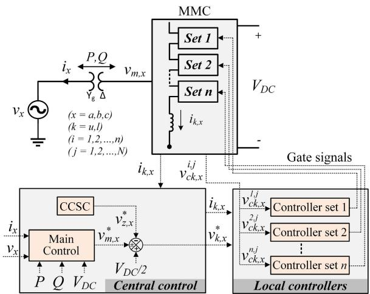  
FIGURE 5. The MMC scale-up control structure.

has the same total number of SMs N . The SMs are connected in series with an arm inductor $L _ { o } .$ The HBSM circuit is mainly preferred as it is more straightforward, cost-effective, and causes less losses than the other SM types such as the FBSM circuit. Each SM capacitor is either inserted into the circuit or bypassed based on the switch configuration. The total number of series-connected SMs determines the voltage of an MMC arm.

# A. MMC SCALE-UP STRUCTURE

The MMC scale-up structure is illustrated in Fig. 3. The total number of SMs per arm is distributed into n sets. Each set consists of N SMs. Each set produces an AC output voltage independently as shown in Fig. 4. Yet, the scale-up architecture is better suited for decentralized controllers, whereas the conventional method is mainly controlled with a centralized control structure. The sets are controlled independently with identical local controllers [16]. The voltage of the upper arm $\nu _ { u , x }$ and lower arm $\nu _ { l , x } ~ ( x ~ \in ~ a , b , c )$ are represented as follows:

$$
v _ {u, x} = \frac {V _ {D C}}{2} - L _ {o} \frac {d i _ {u , x}}{d t} - v _ {m, x} = \sum_ {i = 1} ^ {n} v _ {u, x} ^ {\text {s e t}, i} \tag {1}
$$

$$
v _ {l, x} = \frac {V _ {D C}}{2} - L _ {o} \frac {d i _ {l , x}}{d t} + v _ {m, x} = \sum_ {i = 1} ^ {n} v _ {l, x} ^ {\text {s e t}, i} \tag {2}
$$

$$
v _ {m, x} = \frac {v _ {l , x} - v _ {u , x}}{2} \tag {3}
$$

where $i _ { u , x }$ and $i _ { l , x }$ are the upper and the lower arm current, respectively. $V _ { D C }$ represents the DC bus voltage. $\nu _ { m , x }$ is the AC output voltage of the MMC.

The arm currents can be expressed based on Kirchoff’s current law for the upper arm and the lower arm as follows:

$$
i _ {u, x} = i _ {z, x} + \frac {i _ {x}}{2} \tag {4}
$$

$$
i _ {l, x} = i _ {z, x} - \frac {i _ {x}}{2} \tag {5}
$$

$$
i _ {z, x} = \frac {i _ {u , x} + i _ {l , x}}{2} = i _ {d c, x} + i _ {c i r c, x} \tag {6}
$$

where $i _ { x }$ represents the AC side current. $i _ { z , x }$ represents the differential current, consisting of one-third of the DC current, and the second harmonic dominated AC current under steady-state.

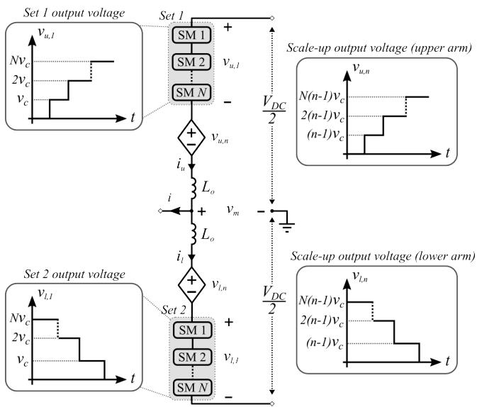  
FIGURE 6. Proposed hybrid simulation model.

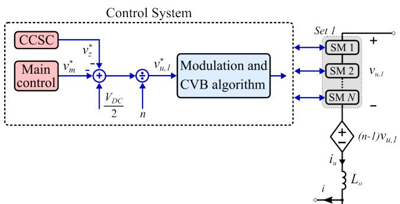  
FIGURE 7. Control structure of the proposed hybrid simulation model.

# B. CONTROL STRUCTURE OF MMC

The MMC control structure consists of a central controller and a local controller for each set as shown in Fig. 5. The central controller is assigned for the main control (e.g., power and voltage controls), and circulating current control. The main control, which is developed based on the synchronous dq reference frame, provides the reference command of the MMC AC side voltage $\nu _ { m , x } ^ { * }$ to control active, reactive power and DC voltage [17]. The circulating current suppression control (CCSC) method presented in [18] is implemented in this paper to provide the reference voltage command $\nu _ { z , x } ^ { * }$ .

As seen in Fig. 5, each set has a dedicated local controller. Each local controller primarily has two essential tasks. The first is to communicate with the central controller to receive

the required information, such as commanded generated voltage $\nu _ { k , x } ^ { * } \left( k \in u , l \right)$ . The second is always to keep the set voltage at the desired level. Sorting-algorithm-based balancing voltage and the nearest level modulation (NLM) technique are used in each local controller to regulate the corresponding set SMs voltage. The local controller’s capacitor Voltage Balancing (CVB) algorithm determines which of the SMs in the sets will be inserted or bypassed based on the current arm direction. The SM capacitor voltage is desired to stay at the nominal value $\nu _ { c } .$ . The nominal value is chosen as (7) where $N _ { t }$ is the total number of SMs per arm. The number of sets is chosen based on (8) in the scale-up structure.

$$
v _ {c} = \frac {V _ {d c}}{N _ {t}} \tag {7}
$$

$$
n = \frac {N _ {t}}{N} \tag {8}
$$

# III. PROPOSED HYBRID SIMULATION MODEL

Fig. 6 depicts the proposed hybrid simulation model for large-scale MMC applications. A single-phase is taken as an example to illustrate the operation and control principles. The MMC phase has an upper and lower arm. Each MMC arm utilizes a master set of SMs (e.g., Set 1 and Set 2) and a dependent voltage source $( \mathrm { e } . \mathrm { g } . , \nu _ { u , n }$ and $\nu _ { l , n } )$ . The master set contains N SMs with a detailed switching model. Thus, each SM in the set requires a control gate signal for output voltage generation and SM voltage balancing. The output voltage total harmonic distortion (THD) mainly relies on the number of SMs in the set [16]. The dependent voltage source is the key point to scaling up the output voltage as required without changing the number of SMs in the master set. The output voltage of an arm can be increased by increasing the number of sets n. The dependent voltage source is scaled up to satisfy the required arm output voltage. The voltages of the upper arm $\nu _ { u }$ and lower arm vl are represented as follows:

$$
v _ {u} = \frac {V _ {D C}}{2} - L _ {o} \frac {d i _ {u}}{d t} - v _ {m} \tag {9}
$$

$$
v _ {l} = \frac {V _ {D C}}{2} - L _ {o} \frac {d i _ {l}}{d t} + v _ {m} \tag {10}
$$

The output voltage of the master set $( \mathrm { e } . \mathrm { g } . , \nu _ { u , 1 } )$ is represented by dividing the arm voltage $( \mathrm { e } . \mathrm { g } . , \nu _ { u } )$ over the number of sets:

$$
v _ {u, 1} = \frac {V _ {D C}}{2 n} - \frac {L _ {o}}{n} \frac {d i _ {u}}{d t} - \frac {v _ {m}}{n} \tag {11}
$$

$$
v _ {l, 1} = \frac {V _ {D C}}{2 n} - \frac {L _ {o}}{n} \frac {d i _ {l}}{d t} + \frac {v _ {m}}{n} \tag {12}
$$

The voltages $\nu _ { u , 1 }$ and $\nu _ { l , 1 }$ represent the output voltage of the master set in the upper arm and lower arm, respectively. The dependent voltage source models the output voltage of the remaining sets $( \boldsymbol { \mathrm { e } } . \boldsymbol { \mathrm { g } } . , \nu _ { u , n }$ and $\nu _ { l , n } )$ , which is defined as follows:

$$
v _ {u, n} = (n - 1) v _ {u, 1} \tag {13}
$$

$$
v _ {l, n} = (n - 1) v _ {l, 1} \tag {14}
$$

Thus, $\nu _ { u , n }$ and $\nu _ { l , n }$ rely on the output voltage of the master set, which is developed using the equivalent detailed model. The voltage reference to control the SMs in Set 1 and Set 2 are obtained as follows:

$$
v _ {u, 1} ^ {*} = \frac {V _ {D C}}{2 n} - v _ {z} ^ {*} - \frac {v _ {m} ^ {*}}{n} \tag {15}
$$

$$
v _ {l, 1} ^ {*} = \frac {V _ {D C}}{2 n} - v _ {z} ^ {*} + \frac {v _ {m} ^ {*}}{n} \tag {16}
$$

where $\nu _ { z } ^ { * }$ represents the reference of internal arm voltage to control circulating current. $\nu _ { m } ^ { * }$ is the AC side voltage reference to control the amount of required power and voltage.

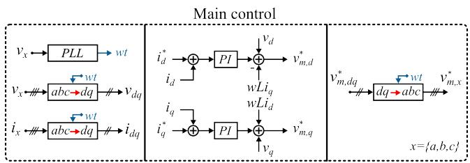  
(a)

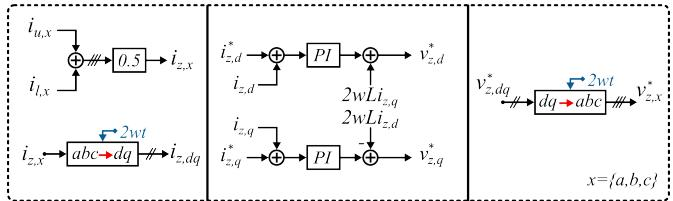  
Circulating current suppresson control (CCSC)   
(b)   
FIGURE 8. MMC control system. (a) main control, and (b) CCSC.

Fig. 7 shows the control structure of the upper arm proposed MMC model. The control structure is developed for upper and lower arms based on (15) and (16). The control system contains the central control, CCSC, modulation technique, and CVB technique. This paper develops the central control using the synchronous dq reference frame technique as shown in Fig. 8(a). The central control system provides the reference voltage command $\nu _ { m } ^ { * } .$ which controls systemlevel parameters such as active power, reactive power, and DC voltage [17]. The circulating current is controlled using the CCSC technique presented in [18] to give the reference command $\nu _ { z } ^ { * } .$ . The CCSC block diagram is illustrated in Fig. 8(b). the sorting-algorithm-based balancing voltage and NLM technique are applied to regulate the master set voltages.

# IV. VALIDATION RESULTS

# A. PERFORMANCE VALIDATION USING MATLAB

To verify the feasibility of the proposed model, the threephase MMC system shown in Fig. 9 is carried out in the MATLAB/Simulink with a sampling time of 5 µs. Table 1 tabulates the MMC system specifications. The MMC system is investigated using the conventional model (shown in Fig. 1), scale-up structure (shown in Fig. 3), and proposed hybrid model (shown in Fig. 6).

For the conventional MMC system, the number of SMs per arm is 48 and developed in the detailed model, in which each switching device requires a control gate signal (e.g., 48 signals per MMC arm). For the scale-up model, the number of SMs per arm is divided into three groups, of which each group contains 16 SMs. All SMs are also developed using the equivalent detailed model. The master set, which contains 16 SMs, is only developed using the detailed model for the proposed hybrid model, while 32 SMs are emulated using the arm-dependent voltage source.

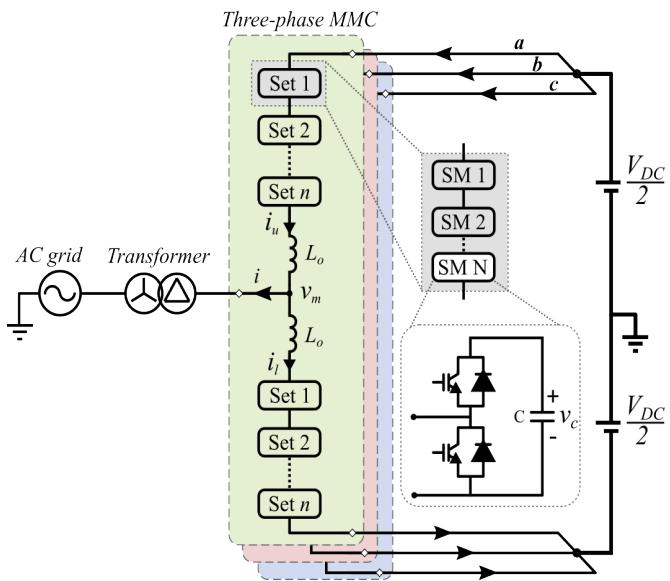  
FIGURE 9. MMC study system for hybrid model validation.

TABLE 1. Specifications of the MMC simulation system.   

<table><tr><td>Parameter</td><td>Value</td></tr><tr><td>Rated Power</td><td>100 MVA</td></tr><tr><td>Rated DC Voltage</td><td>100 kV</td></tr><tr><td>AC grid voltage</td><td>55 kV</td></tr><tr><td>Fundamental frequency</td><td>60 Hz</td></tr><tr><td>Number of SMs per arm (N × n)</td><td>16 × 3 = 48</td></tr><tr><td>SM capacitance</td><td>6.8 mF</td></tr><tr><td>SM capacitor voltage</td><td>2.083 kV</td></tr><tr><td>Arm inductance</td><td>10 mH (12.5%)</td></tr></table>

TABLE 2. Time required for two seconds simulation results.   

<table><tr><td>Conventional Model</td><td>Scale-up Model</td><td>Proposed Model</td></tr><tr><td>33.6 minutes</td><td>33.2 minutes</td><td>8.1 minutes</td></tr></table>

The MMC system shown in Fig. 9 is simulated in the MAT-LAB/Simulink using a computer with Intel(R) Core (TM) i7-10700 CPU, 2.9 GHz, and 16 GB RAM. The time required for two seconds simulation results using the conventional scale-up and proposed hybrid models is shown in Table 2. Because the conventional and scale-up models are utilized using an equivalent detailed model, the computational load

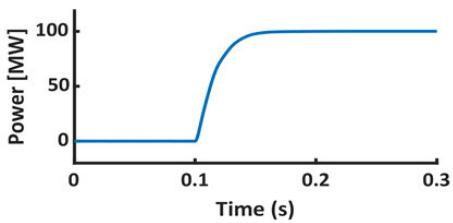

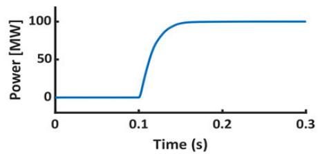

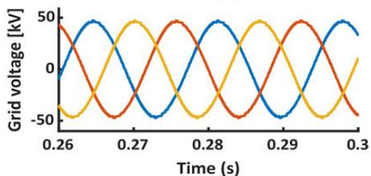

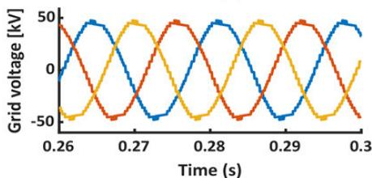

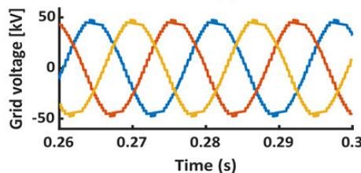

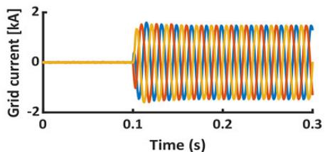

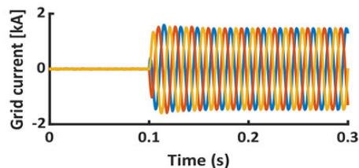

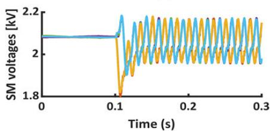

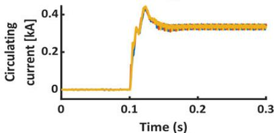

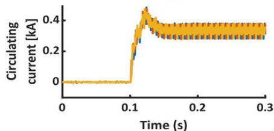

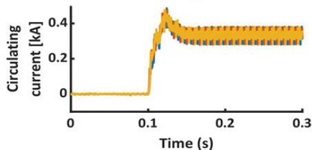

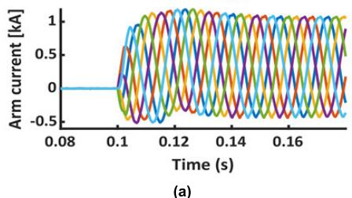

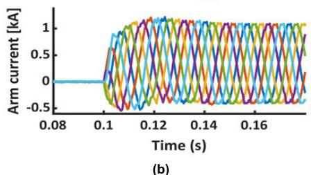

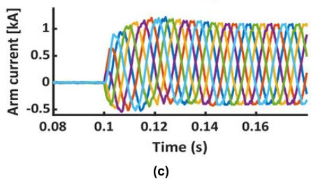  
FIGURE 10. MMC simulation results under transient conditions, (a) conventional model, (b) scale-up model, and (c) proposed hybrid model.

is heavy and thus, they require about 33 minutes to generate two seconds of simulation results. However, the proposed hybrid model takes about 8 minutes to simulate two seconds on MATLAB.

To verify the feasibility of the proposed model under transient conditions, the active power is changed from 0 to 100 MW at 0.1 s. Fig. 10 shows the responses of the conventional, scale-up, and proposed hybrid models. The MMC models have almost similar dynamic responses under the power change condition. The SM capacitor voltages are maintained at the reference command 2.083 kV. In general, the proposed MMC hybrid model shows satisfactory

responses compared to the detailed models. The THD of the output grid voltage for the conventional MMC model is 1.5%, while the grid voltage for both the scale-up and hybrid model is 4.1%. The number of stepped voltage waveforms in the conventional MMC model is more significant (e.g., up to 48+1 levels) than in the scale-up and hybrid models (e.g., up to 16+1 levels). Thus, the output voltage quality and the circulating current in the conventional MMC is improved. However, the THD of the scale-up and hybrid model is still under the minimum THD requirements for medium voltage (MV) and HVDC applications [19].

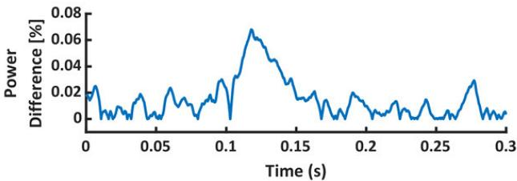

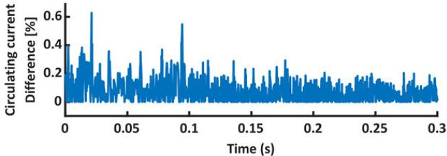

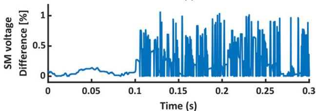  
FIGURE 11. Comparison between MMC models during transient conditions.

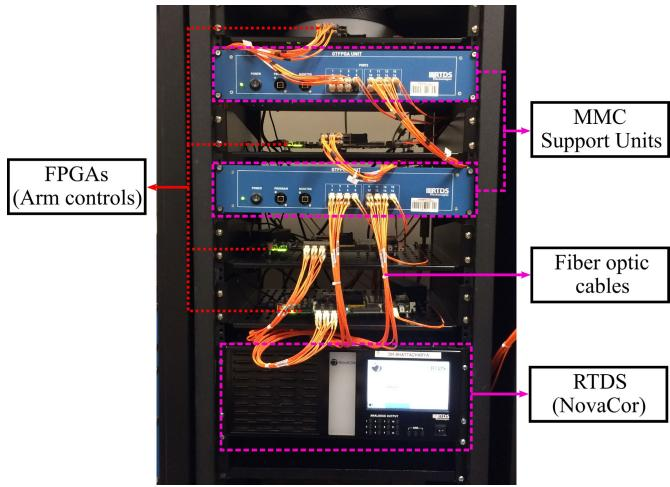  
FIGURE 12. RTDS and HIL testing system.

Fig. 11 compares the detailed model and proposed hybrid model under the power change. The active power in the hybrid model has a maximum error of 0.07% of the rated power during the transient condition. Besides, the internal dynamic of the MMC, which is represented by the SM capacitor voltage and the circulating current, is compared with the detailed model. The maximum error in the SM capacitor voltage and the circulating current is still within a reasonable limit during the transient and steady-state conditions. The overall dynamic response of the hybrid model is reasonable compared to the detailed MMC model. The proposed model can control power, circulating current, and SM capacitor voltages. Thus, a large-scale MMC system (i.e., hundreds of SMs) can easily be simulated in an offline simulation software without significant control and MMC structure modifications.

# B. PERFORMANCE VALIDATION USING RTDS SYSTEM

Medium or high voltage MMC applications may include extremely high nodes in a simulation. Therefore, capturing the internal dynamics accurately requires very small simulation steps. The MMC based HVDC system shown in Fig. 9 is modeled in the RTDS and HIL environment to validate the proposed hybrid MMC model. The detailed switching model of an MMC is emulated on a Xilinx Virtex 7 Field Gate Programmable Array (FPGA) with a time-step of $2 \mu \mathrm { s } .$ . Two other FPGAs are also adopted for capacitor voltage balancing and the gate firing pulse control of the MMC as seen in Fig. 12. The FPGA boards are connected to the RTDS through fiber cables. The AC grid, converter transformer, and the system-level controls (e.g., main control and circulating current control) are implemented in the RTDS simulator.

The conventional stand-alone MMC system with 400 SM per arm is modeled and compared with the proposed hybrid model. The proposed model is designed with only one set, including 40SMs, per MMC arm. Detailed modeling of the 40SMs is implemented in the FPGA and the average arm voltage of each set is assigned as the governor of the dedicated voltage source in the same arm as seen in Fig. 6. Both systems’ parameters are identical and listed in Table 3.

Both models are compared under power step change. The active power reference command is changed from 0 to 1 GW at 0.2 s. Grid currents and the capacitor voltages of the MMC are regulated accordingly as seen in the top and the bottom plot of Fig. 13. Both the systems’ capacitor voltages vary within the boundaries. The circulating current in the hybrid model contains lower-order harmonics than in the conventional model. As the most prominent second-harmonic is suppressed with the circulating current control, the effects of the lower harmonics are negligible.

TABLE 3. Specifications of the MMC simulated in the RTDS system.   

<table><tr><td>Parameter</td><td>Value</td></tr><tr><td>Rated power</td><td>1000 MVA</td></tr><tr><td>Rated DC voltage</td><td>640 kV</td></tr><tr><td>AC grid voltage</td><td>400 kV</td></tr><tr><td>Rated frequency</td><td>60 Hz</td></tr><tr><td>Transformer ratio (Yg - Δ)</td><td>400/333 kV</td></tr><tr><td>Number of SMs per arm (N × n)</td><td>40 × 10 = 400</td></tr><tr><td>SM Capacitance</td><td>15 mF</td></tr><tr><td>SM capacitor voltage</td><td>1.6 kV</td></tr><tr><td>Arm inductance</td><td>40 mH</td></tr></table>

The same systems are tested under a Single Line to Ground (SLG) fault. The SLG fault is applied at the transformer high voltage side for 100ms. The fault occurs at 0.05 s and is cleared at 0.15 s as seen in Fig. 14. As seen, both the models give almost the same dynamic response under the SLG fault. Therefore, the RTDS results confirm that the proposed hybrid model achieves the same performance as the detailed MMC switching model under a steady-state, rapid power change, and grid fault conditions.

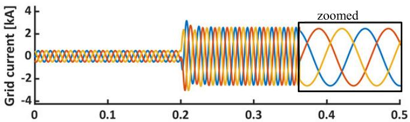

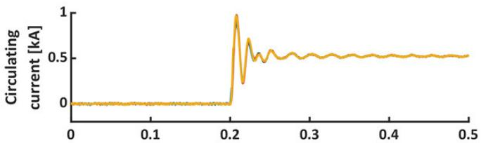

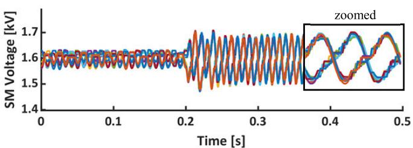  
(a)

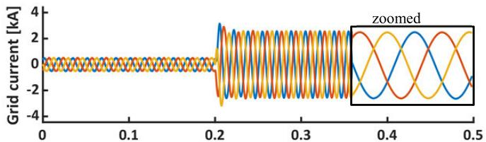

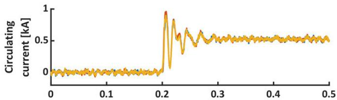

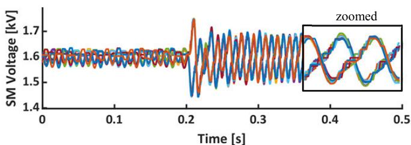  
(b)

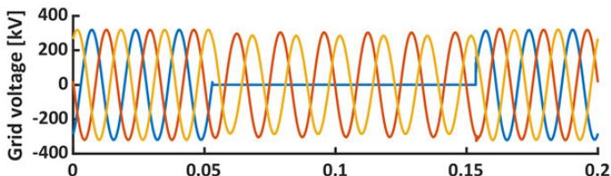  
FIGURE 13. RTDS results of MMC under power step change, (a) conventional model, and (b) proposed hybrid model.

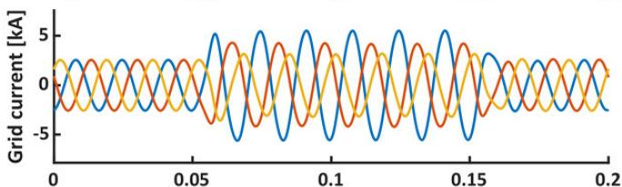

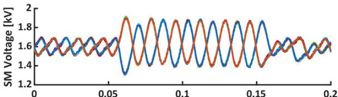

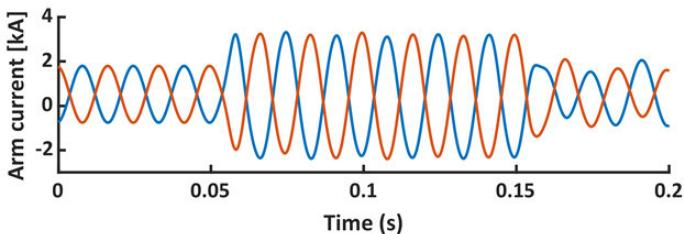

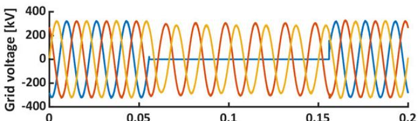

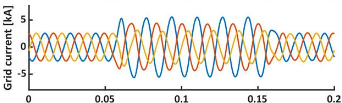

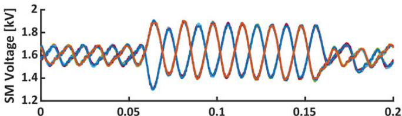

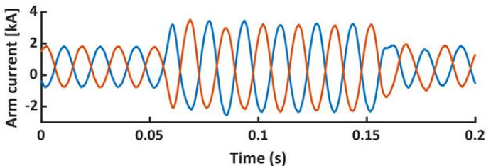  
  
FIGURE 14. RTDS results of MMC under SLG fault, (a) conventional model, and (b) proposed hybrid simulation model.

# V. CONCLUSION

The proposed hybrid MMC model has a faster pace with an equal accuracy rate than a conventional detailed MMC

modeling method. Unlike the average MMC models, the proposed method also allows users to study MMC internal dynamics such as SM capacitor voltage balancing.

Besides, the number of SM per arm can be easily modified without significant effort. The proposed model has been validated in the real-time digital simulator and MAT-LAB/Simulink environment. The results show that the proposed MMC model is efficient for control validations and internal and external MMC dynamic performance studies.

# ACKNOWLEDGMENT

This work was supported by the Researchers Supporting Project number (RSP2022R467), King Saud University, Riyadh, Saudi Arabia.

# REFERENCES

[1] A. Nishioka, F. Alvarez, and T. Omori, ‘‘Global innovation report-global rise of HVDC and its background,’’ Hitachi Rev., vol. 69, pp. 462–463, Jul. 2020.   
[2] S. Isik, M. Alharbi, and S. Bhattacharya, ‘‘An optimized circulating current control method based on PR and PI controller for MMC applications,’’ IEEE Trans. Ind. Appl., vol. 57, no. 5, pp. 5074–5085, Sep. 2021, doi: 10.1109/TIA.2021.3092298.   
[3] I. Jayawardana, C. N. M. Ho, and Y. Zhang, ‘‘A comprehensive study and validation of a power-HIL testbed for evaluating grid-connected EV chargers,’’ IEEE J. Emerg. Sel. Topics Power Electron., vol. 10, no. 2, pp. 2395–2410, Apr. 2022, doi: 10.1109/JESTPE.2021.3093303.   
[4] M. Alharbi, S. Isik, and S. Bhattacharya, ‘‘Control of circulating current to minimize the rating of the energy storage device in modular multilevel converters,’’ in Proc. IEEE Energy Convers. Congr. Expo. (ECCE), Sep. 2019, pp. 6041–6045, doi: 10.1109/ECCE.2019.8912773.   
[5] U. N. Gnanarathna, A. M. Gole, and R. P. Jayasinghe, ‘‘Efficient modeling of modular multilevel HVDC converters (MMC) on electromagnetic transient simulation programs,’’ IEEE Trans. Power Del., vol. 26, no. 1, pp. 316–324, Jan. 2011.   
[6] H. Saad, S. Dennetière, J. Mahseredjian, P. Delarue, X. Guillaud, J. Peralta, and S. Nguefeu, ‘‘Modular multilevel converter models for electromagnetic transients,’’ IEEE Trans. Power Del., vol. 29, no. 3, pp. 1481–1489, Jun. 2014.   
[7] J. Xu, A. M. Gole, and C. Zhao, ‘‘The use of averaged-value model of modular multilevel converter in DC grid,’’ IEEE Trans. Power Del., vol. 30, no. 2, pp. 519–528, Apr. 2015.   
[8] H. Saad, J. Peralta, S. Dennetière, J. Mahseredjian, J. Jatskevich, J. A. Martinez, A. Davoudi, M. Saeedifard, V. Sood, X. Wang, J. Cano, and A. Mehrizi-Sani, ‘‘Dynamic averaged and simplified models for MMCbased HVDC transmission systems,’’ IEEE Trans. Power Del., vol. 28, no. 3, pp. 1723–1730, Jul. 2013.   
[9] D. Shu, X. Xie, Q. Jiang, G. Guo, and K. Wang, ‘‘A multirate EMT cosimulation of large AC and MMC-based MTDC systems,’’ IEEE Trans. Power Syst., vol. 33, no. 2, pp. 1252–1263, Mar. 2018.   
[10] X. Meng and L. Wang, ‘‘Interfacing an EMT-type modular multilevel converter HVDC model in transient stability simulation,’’ IET Gener., Transmiss. Distrib., vol. 11, no. 12, pp. 3002–3008, Aug. 2017.   
[11] J. Rupasinghe, S. Filizadeh, and D. Muthumuni, ‘‘A co-simulation platform for modeling and testing modular multilevel converters and their controls in large networks,’’ in Proc. IEEE 21st Workshop Control Modeling Power Electron. (COMPEL), Nov. 2020, pp. 1–8, doi: 10.1109/COM-PEL49091.2020.9265844.   
[12] J. Rupasinghe, S. Filizadeh, and L. Wang, ‘‘A dynamic phasor model of an MMC with extended frequency range for EMT simulations,’’ IEEE J. Emerg. Sel. Topics Power Electron., vol. 7, no. 1, pp. 30–40, Mar. 2019, doi: 10.1109/JESTPE.2018.2886698.   
[13] S. R. Sanders, J. M. Noworolski, X. Z. Liu, and G. C. Verghese, ‘‘Generalized averaging method for power conversion circuits,’’ IEEE Trans. Power Electron., vol. 6, no. 2, pp. 251–259, Apr. 1991.   
[14] S. Chiniforoosh, J. Jatskevich, A. Yazdani, V. Sood, V. Dinavahi, J. A. Martinez, and A. Ramirez, ‘‘Definitions and applications of dynamic average models for analysis of power systems,’’ IEEE Trans. Power Del., vol. 25, no. 4, pp. 2655–2669, Oct. 2010.   
[15] M. Daryabak, S. Filizadeh, J. Jatskevich, A. Davoudi, M. Saeedifard, V. K. Sood, J. A. Martinez, D. Aliprantis, J. Cano, and A. Mehrizi-Sani, ‘‘Modeling of LCC-HVDC systems using dynamic phasors,’’ IEEE Trans. Power Del., vol. 29, no. 4, pp. 1989–1998, Aug. 2014.

[16] M. Alharbi and S. Bhattacharya, ‘‘Scale-up methodology of a modular multilevel converter for HVDC applications,’’ IEEE Trans. Ind. Appl., vol. 55, no. 5, pp. 4974–4983, Sep. 2019, doi: 10.1109/TIA.2019.2925055.   
[17] M. Alharbi, S. Isik, and S. Bhattacharya, ‘‘A novel submodule level faulttolerant approach for MMC with integrated scale-up architecture,’’ IEEE J. Emerg. Sel. Topics Ind. Electron., vol. 2, no. 3, pp. 343–352, Jul. 2021, doi: 10.1109/JESTIE.2021.3061954.   
[18] Q. Tu, Z. Xu, and L. Xu, ‘‘Reduced switching-frequency modulation and circulating current suppression for modular multilevel converters,’’ IEEE Trans. Power Del., vol. 26, no. 3, pp. 2009–2017, Jul. 2011.   
[19] IEEE Recommended Practice and Requirements for Harmonic Control in Electric Power Systems, IEEE Standard 519-2014 (Revision of IEEE Std 519-1992), IEEE Standards Association, 2014, pp. 1–2.

MOHAMMED ALHARBI received the B.S. degree in electrical engineering from King Saud University, Riyadh, Saudi Arabia, in 2010, the M.S. degree in electrical engineering from the Missouri University of Science and Technology, Rolla, MO, USA, in 2014, and the Ph.D. degree in electrical engineering from North Carolina State University, Raleigh, NC, USA, in 2020.

He was a Project Engineer at the FREEDM Systems Center, North Carolina State University,

from January 2016 to December 2019, where he was involved in designing and constructing a modular multilevel converter for control validations. He is currently an Assistant Professor at the Department of Electrical Engineering, King Saud University. His research interests include power converters, modular multilevel converter (MMC) controls, multiterminal dc systems, and grid integration of renewable energy systems.

SEMIH ISIK (Graduate Student Member, IEEE) received the M.Sc. degree in electrical engineering from North Carolina State University, Raleigh, USA, in 2018, where he is currently pursuing the Ph.D. degree.

His research interests include grid connected ac/dc converters, VSC-based HVDC and MTDC systems, electromagnetic transient simulation of flexible ac transmission systems (FACTS), realtime simulation of power electronics and complex

power systems, and reliability of power converters.

SUBHASHISH BHATTACHARYA (Fellow, IEEE) received the B.E. degree in electrical engineering from the Indian Institute of Technology Roorkee, Roorkee, India, in 1986, the M.E. degree in electrical engineering from the Indian Institute of Science, Bengaluru, India, in 1988, and the Ph.D. degree in electrical engineering from the University of Wisconsin–Madison, Madison, WI, USA, in 2003.

He worked with FACTS and Power Qual-

ity Group, Westinghouse Research and Development Center, Pittsburgh, from 1998 to 2005, which later became part of Siemens Power Transmission and Distribution. In August 2005, he joined the Department of Electrical and Computer Engineering, North Carolina State University (NCSU), where he is the Duke Energy Distinguished Professor and a Founding Faculty Member of NSF ERC FREEDM Systems Center, Advanced Transportation Energy Center (ATEC), and the U.S. DOE initiative on WBG-based Manufacturing Innovation Institute PowerAmerica at NCSU. He has authored/coauthored over 500 publications and several patents. His research interests include solidstate transformers, integration of renewable energy resources, MV power converters enabled by HV SiC devices, FACTS, utility applications of power electronics and power quality issues, dc microgrids, high-frequency magnetics, active filters, and application of new power semiconductor devices, such as SiC and GaN for converter topologies.