# 直驱式风电机组机电暂态建模及仿真

高峰，周孝信，朱宁辉，苏峰，安宁

（中国电力科学研究院，北京市 海淀区 100192）

# Electromechanical Transient Modeling and Simulation of Direct-Drive Wind Turbine System With Permanent Magnet Synchronous Generator

GAO Feng, ZHOU Xiaoxin, ZHU Ninghui, SU Feng, AN Ning

(China Electric Power Research Institute, Haidian District, Beijing 100192, China)

ABSTRACT: Based on vector decoupling control strategy, an electromechanical transient model of direct drive permanent magnet synchronous generator (PMSG) system, in which the structure of twin back-to-back converters is utilized and the most common space vector decoupling control scheme is adopted, is built. The built model is suitable for power system transient stability analysis. Two reasonable hypotheses for the built model are made: active power and reactive power are fully decoupled during the transient process and the measured electrical quantities are accurate and fully equal to actual ones. According to the hypotheses and based on real physical facility, the electromechanical transient model of direct drive PMSG is simplified, meanwhile dynamic process of PWM converter’s DC voltage and the operating characteristic of low voltage ride through are taken into account. Simulation results show that dynamic response of the built model is basically consistent with that of electromagnetic transient model, thus owing to the reasonability and accuracy of the built model it can be used to analyze the impact of grid-connected large-scale direct drive permanent magnet synchronous generator (PMSG) system on security and stability of power grid.

KEY WORDS: direct-drive wind turbine system; electromechanical transient model; low voltage ride through; power system analysis

摘要：基于矢量解耦控制策略，建立了适用于电力系统暂态稳定分析的直驱式风力发电机组机电暂态模型。为模型做了2点合理假设：有功功率和无功功率在暂态过程中完全解耦；测量的电气量准确，和实际的电气量完全相等。基于这些条件，从实际的物理装置出发，对直驱式风电机组的电磁暂态模型进行简化。考虑了变频器直流电压的动态过程和低电压穿越的运行特性。仿真结果表明，该模型和电磁暂态模型动态响应曲线一致，结果准确、可靠，可以用于分析大规模直驱式风电场接入对电力系统安全稳定性的影响。

关键词：直驱式风电系统；机电暂态模型；低电压穿越；电力系统分析

# 0 引言

目前，我国应用最广泛的 2 种类型的风机为双馈式风机和直驱式风机。较双馈式风机，直驱式风机具有更能适应低风速、噪声小、结构简单、运行效率高、后续维护成本低等优点，直驱式风机在全国风电场中所占的比重越来越高[1-2]。由于不控整流加 Boost 升压变流器再接并网逆变器结构难以实现对永磁同步发电机(permanent magnet synchronousgenerator，PMSG)的控制，影响发电机的使用寿命，目前直驱式风机广泛采用背靠背双脉宽调制(pulsewidth modulation，PWM)变流器结构[3]。文献[4-8]研究了直驱式风电系统的数学模型，对空气动力学模型、轴系模型、永磁同步电机模型、变频器及控制模型等进行了分别建模，并仿真研究了整个系统的运行特性。上述模型均是基于电磁暂态模型进行建模仿真，用于大规模风电场接入系统影响分析计算时，其较为复杂，计算速度慢，数值收敛性差。文献[9-12]研究了直驱式风电系统的控制策略及运行特性，文献[13]研究了直驱式风电系统在故障情况下的运行特性，文献[14-16]对直驱式风电系统低电压穿越特性进行了研究，文献[17-18]研究了三电平背靠背变流器结构的直驱式风电系统控制策略。

目前，在国内广泛使用的电力系统分析软件中使用的直驱式风电系统模型均是基于风电机组的外特性建立，简化为暂态电抗后的可控电流源模型。该模型不能够完全反映风电机组的运行特性，仿真结果较为保守。

本文建立适于电力系统暂态稳定分析计算[19-23]的直驱式风力发电机组机电暂态模型。直驱式风电系统为背靠背双 PWM 变流器结构，采用最为普遍

的矢量控制策略。从实际的物理装置出发，通过合理的假设，对直驱式风电系统的电磁暂态模型进行简化，同时考虑变频器直流电压的动态过程和低电压穿越特性。仿真结果表明，该模型和电磁暂态模型动态响应曲线一致，结果准确、可靠，可以用于分析大规模直驱式风电场接入对电力系统暂态稳定性的影响。

# 1 直驱式风电机组的数学模型

# 1.1 风力机的数学模型

采用背靠背双 PWM 变流器的直驱式风电系统整体结构[4-8]如图 1 所示，主要包括风力机、永磁同步发电机、全功率变流器等。风力机通过轴系与永磁同步发电机直接耦合，永磁同步发电机通过全功率变流器与电网相连。

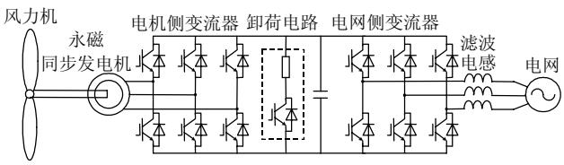  
图1 直驱式风电系统整体结构  
Fig. 1 Structure of direct-drive wind turbine system

风力机的风功率转换模型可以用下式表示：

$$
T _ {\mathrm {m}} = \frac {1}{2} \rho \pi R ^ {3} \frac {C _ {\mathrm {p}} (\lambda , \beta)}{\lambda} v _ {\mathrm {w}} ^ {2} \tag {1}
$$

式中： $T _ { \mathrm { m } }$ 为风力机的机械转矩；ρ 为空气密度；R为风轮叶片半径； $\nu _ { \mathrm { w } }$ 为风速；λ 为风力机的叶尖速比； $C _ { \mathfrak { p } }$ 为风能利用系数，表达式为

$$
C _ {\mathrm {p}} (\lambda , \beta) = 0. 2 2 \left(\frac {1 1 6}{\lambda_ {\mathrm {i}}} - 0. 4 \beta - 5\right) \mathrm {e} ^ {\frac {- 1 2 . 5}{\lambda_ {\mathrm {i}}}} \tag {2}
$$

$$
\lambda_ {\mathrm {i}} = \frac {1}{\frac {1}{\lambda + 0 . 0 8 \beta} - \frac {0 . 0 3 5}{\beta^ {3} + 1}} \tag {3}
$$

# 1.2 发电机及变流器数学模型

永磁同步发电机的参考方向采用电动机惯例，q 轴方向和发电机转子磁链方向一致，此时，$\psi _ { \mathrm { d s } } = 0$ ， $\psi _ { \mathrm { d s } } = \psi _ { \mathrm { f } }$ ，其数学模型如下：

$$
u _ {\mathrm {d s}} = R _ {\mathrm {s}} i _ {\mathrm {d s}} + L _ {\mathrm {d}} \frac {\mathrm {d} i _ {\mathrm {d s}}}{\mathrm {d} t} - L _ {\mathrm {q}} \omega_ {\mathrm {e}} i _ {\mathrm {q s}} \tag {4}
$$

$$
u _ {\mathrm {q s}} = R _ {\mathrm {s}} i _ {\mathrm {q s}} + L _ {\mathrm {q}} \frac {\mathrm {d} i _ {\mathrm {q s}}}{\mathrm {d} t} + L _ {\mathrm {d}} \omega_ {\mathrm {e}} i _ {\mathrm {d s}} + \omega_ {\mathrm {e}} \psi_ {\mathrm {f}} \tag {5}
$$

$$
T _ {\mathrm {e}} = 1. 5 p \left[ \left(L _ {\mathrm {d}} - L _ {\mathrm {q}}\right) i _ {\mathrm {d s}} i _ {\mathrm {q s}} + \psi_ {\mathrm {f}} i _ {\mathrm {q s}} \right] \tag {6}
$$

$$
P _ {\mathrm {s}} = - T _ {\mathrm {e}} \omega \tag {7}
$$

式中：ω为风轮机机械转速； $u _ { \mathrm { d s } } .$ 、 $i _ { \mathrm { d s } } .$ 、 $u _ { \mathrm { q s } } .$ 、 $i _ { \mathrm { q s } }$ 分别为发电机 d轴和 q 轴的电压、电流分量； $\omega _ { \mathrm { e } }$ 为发电

机的电气转速； $L _ { \mathrm { d } } .$ 、 $L _ { \mathfrak { q } } .$ 、 $R _ { \mathrm { s } }$ 分别为永磁发电机的直轴和交轴电感、定子电阻； $\psi _ { \mathrm { f } }$ 为永磁磁链； $P _ { \mathrm { ~ s ~ } }$ 为发电机发出功率。

发电机的机械运动方程为

$$
\frac {J}{p} \frac {\mathrm {d} \omega_ {\mathrm {e}}}{\mathrm {d} t} = T _ {\mathrm {m}} - T _ {\mathrm {e}} \tag {8}
$$

式中 J 为转动惯量。

电流方向为电网流向变流器，电网侧变流器的模型如下：

$$
u _ {\mathrm {d g}} = u _ {\mathrm {d g}} - R i _ {\mathrm {d g}} - L \frac {\mathrm {d} i _ {\mathrm {d g}}}{\mathrm {d} t} + \omega_ {\mathrm {s}} L i _ {\mathrm {q g}} \tag {9}
$$

$$
u _ {\mathrm {q g}} = u _ {\mathrm {q g}} - R i _ {\mathrm {q g}} - L \frac {\mathrm {d} i _ {\mathrm {q g}}}{\mathrm {d} t} - \omega_ {\mathrm {s}} L i _ {\mathrm {d g}} \tag {10}
$$

变流器注入电网功率为

$$
P _ {\mathrm {g}} = - 1. 5 \left(u _ {\mathrm {d g}} i _ {\mathrm {d g}} + u _ {\mathrm {q g}} i _ {\mathrm {q g}}\right) \tag {11}
$$

$$
Q _ {\mathrm {g}} = - 1. 5 \left(- u _ {\mathrm {d g}} i _ {\mathrm {q g}} + u _ {\mathrm {q g}} i _ {\mathrm {d g}}\right) \tag {12}
$$

直流侧电压动态方程为

$$
C u _ {\mathrm {d c}} \frac {\mathrm {d} u _ {\mathrm {d c}}}{\mathrm {d} t} = P _ {\mathrm {s}} - P _ {\mathrm {g}} \tag {13}
$$

# 1.3 发电机及变流器控制策略

发电机侧变流器采用发电机转子磁链矢量控制 。 控 制 目 标 为 通 过 比 例 – 积 分 (proportionalintegral，PI)控制器，调节发电机输出电磁转矩来调节发电机转速，从而达到最大功率追踪(maximumpower point tracking，MPPT)的目的。在广泛采用的表贴式和凸极率很低的永磁发电机中，通常采用无功电流 $ { i _ { \mathrm { d s } } } { = } 0$ 控制，能以最小电流实现最大风能捕获区的最大转矩输出。

电网侧变流器采用电网电压定向矢量控制$u _ { \mathrm { d g } } { = } 0$ 。通过 PI 控制器控制无功电流来控制变流器与电网功率交换，通过 PI调节器调节有功电流来控制直流电容电压恒定和跟踪发电机侧输出功率。总体控制框图如图 2 所示。

# 1.4 低电压穿越模型

在直流侧增加卸荷电路[3]是一种常见的提高低电压穿越能力的方法，卸荷电路通常由功率器件和卸荷电阻构成。图 1 中的卸荷电路在直驱式风电产品中已有应用。该电路的基本原理为控制功率器件的开断，投入和切出卸荷电路，从而抑制直流过电压。文献[3]采用直流侧电压作为判断条件，当直流侧电压超过设定上限时，投入卸荷电路，当直流电压低于设定下限时，切出卸荷电路。这种方法虽然容易造成直流电压较大波动，但是控制简单，反应速度快。本文采用这种方法计算。

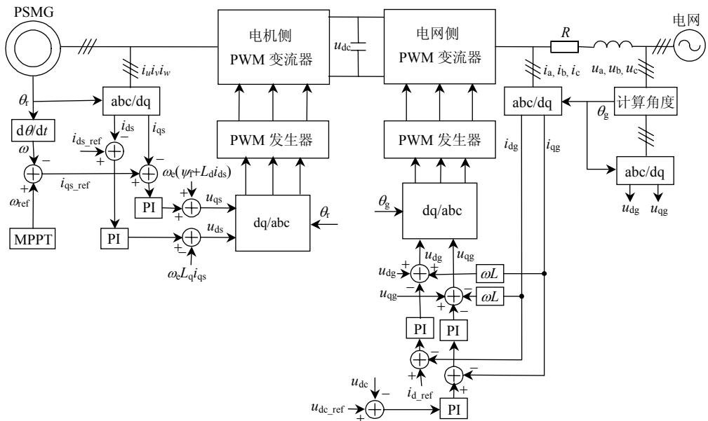  
图2 直驱式风电系统控制框图  
Fig. 2 Control frame of direct-drive wind turbine system

# 2 直驱式风电机组机电暂态模型

# 2.1 发电机、变流器及其控制策略简化模型

在 1.2 和 1.3 节中分别讨论了永磁发电机、全功率变频器的数学模型及其控制策略。本文对上述方程作如下假设：

1）在暂态过程中，认为发电机有功功率和无功功率能够完全解耦。  
2）认为测量参数和电气量完全准确，即认为测量参数、电气量和实际参数、电气量完全一致。

在以上假设条件下，永磁发电机控制策略的解耦合项和永磁发电机数学模型中的耦合项抵消，电网侧变流器控制策略中的解耦合项和电网侧变流器数学模型中的耦合项抵消，发电机及控制简化模型和电网侧变流器及控制简化模型分别见图 3、4。

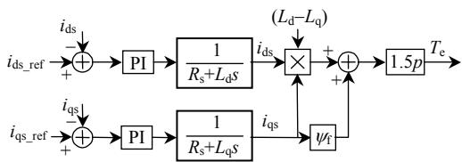  
图3 发电机及控制简化框图

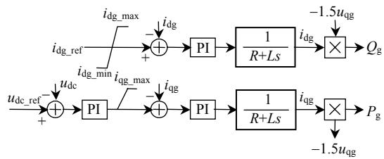  
Fig. 3 Simplified frame of PMSG and its control strategy   
图4 电网侧变流器及控制简化框图  
Fig. 4 Simplified frame of   
grid side converter and its control strategy

# 2.2 直流电压动态及卸荷电路模型

本文用图5来模拟1.2节得出的直流动态模型。采用低电压限制电机侧变频器输出有功功率来模拟直流卸荷模型，电压功率曲线如图 5 左下方部分所示。

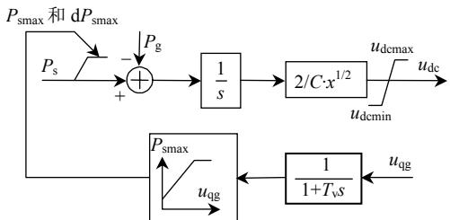  
图5 直流侧电压动态及卸荷电路模型  
Fig. 5 Dynamic model of DC side voltage and crowbar protection

# 3 仿真结果与分析

为了验证本文提出的直驱式风电系统机电暂态模型和电磁暂态模型响应一致，在 Matlab/Simulink 下搭建了仿真模型。模型参数如下：额定功率 $P _ { \mathrm { N } } { = } 1 . 5 ~ \mathrm { M W }$ ，额定转速 $\omega _ { \mathrm { N } } { = } 9 2 \ \mathrm { r a d / s }$ ，极对数$\scriptstyle p = 4 6$ ，永磁体磁链 $\psi _ { \mathrm { f } } { = } 6 ~ \mathrm { W b }$ ，永磁电磁直轴和交轴电感 $L _ { \mathrm { d } } { = } L _ { \mathrm { q } } { = } 1 ~ \mathrm { m H }$ ，电阻 $R { = } 0 . 0 1 8 \ \Omega ;$ ；母线电压 $U { = }$ 690 V，直流电容 $C { = } 6 . 8 { \times } 1 0 ^ { - 3 } \mathrm { F }$ ，直流侧电压 $U _ { \mathrm { d c } } { = } 1$ 200 V，变流器开关频率 2.1 kHz，电网侧滤波器等效滤波电感 $L { = } 0 . 5 \mathrm { m H }$ 。

考察在发电机转速恒定，浆距角变化引起发电机输出功率变化时，系统的响应特性，将初始转矩由 7.5×105 N·m 在 0.5 s 阶跃为 $5 { \times } 1 0 5 \mathrm { N } { \cdot } \mathrm { m }$ 。图 6 分别给出了发电机电磁转矩、发电机转速、直流侧电压、注入电网有功功率响应的对比曲线。从曲线可

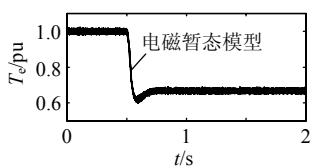

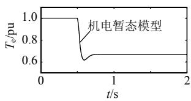

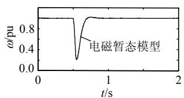  
(a) 电磁转矩响应曲线对比

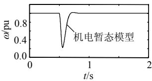

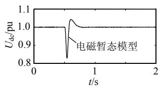  
(b) 发电机转速响应曲线对比

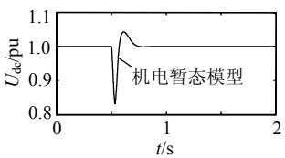

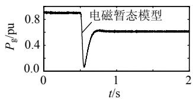  
(c) 直流侧电压响应曲线对比

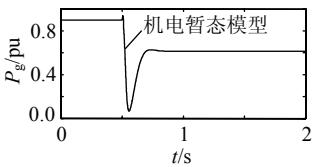  
(d) 注入电网有功功率响应曲线对比   
图6 转矩阶跃响应  
Fig. 6 Step response of torque

看出，本文提出的机电暂态模型的响应曲线和电磁暂态模型完全一致，这验证了本文假设条件的合理性，模型响应准确。

模拟风速变化引起发电机转速变化时实际转速的跟踪能力，将转速由 92 rad/s 在 0.5 s 阶跃为80rad/s。图7 给出了发电机转速和注入电网有功功率的阶跃响应曲线。从图 7 可以看出，本文所提模型和电磁暂态模型动态过程完全一致，模型准确。

为了研究电网侧输出无功能力的响应特性，电网侧无功电流初始值为 0A，在 0.3s阶跃至 300A，在 0.5s 阶跃至 0A，在 0.8s 阶跃至−300A。无功电流为正，发电机向电网注入无功功率；无功电流为

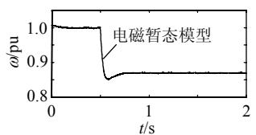

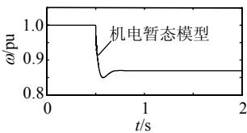

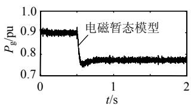  
(a) 转速响应曲线对比

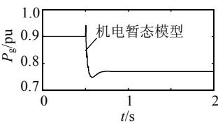  
(b) 注入电网有功功率曲线对比  
图 7 转速阶跃响应  
Fig. 7 Speed step response of rotate speed

0，发电机和电网没有无功功率交换；无功电流为负，发电机从电网吸收无功功率。由此来考察发电机无功功率的动态响应过程。图 8为电网侧无功的动态响应曲线。从仿真结果来看，本文模型和电磁暂态模型响应曲线一致，无功功率响应正确。

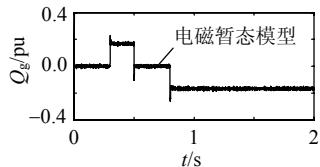

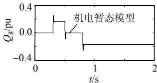  
图 8 电网侧无功功率响应曲线  
Fig. 8 Step response of reactive power of grid side

本文分 2 种情况模拟低电压穿越响应：一种为直流侧卸荷电路不满足启动条件，由风电系统自身控制系统来调节；二为电压跌落较深，直流侧卸荷电路满足启动条件，由卸荷电路来消耗积累在直流侧的多余能量。下面对上述 2 种情况进行介绍。

对与电网电压跌落 20%且持续 0.5s的情况，由于变流器电流没有超过额定电流的 1.2 倍，直流侧卸荷模型没用启动。由于发电机功率恒定，为了网侧变流器输出功率不变，有功电流在电压跌落期间经过调节到稍高于正常值的一个稳定值，直流侧电压通过调节能够保持恒定。仿真结果如图 9 所示。本文模型的响应波形和电磁模型基本一致，响应曲线与上述分析情况相同。

对于电网电压跌落 50%且持续 0.5 s 的情况，由于变流器电流超过额定电流的 1.2 倍，直流侧卸荷模型启动。由于发电机功率恒定，为了使网侧变流

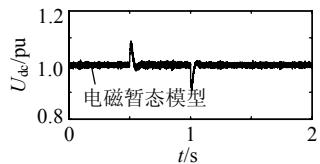

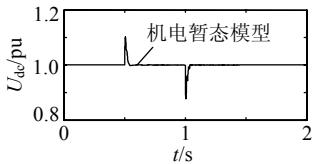  
(a) 直流侧电压曲线对比

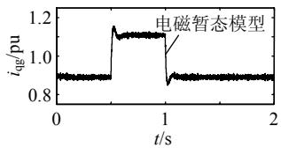

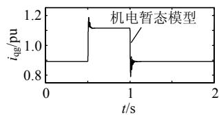

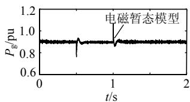  
(b) 注入电网有功电流曲线对比

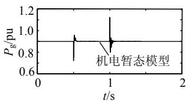  
(c) 注入电网有功功率曲线对比   
图9 电压跌落20%且持续 0.5 s 时本文模型与电磁模型的响应波形对比  
Fig. 9 Response wareforms of 20%, 0.5 s voltage sag by the above madel and electromechanidal transient model

器输出功率和发电机功率匹配，卸荷电路消耗掉发电机侧多余的功率。这时，直流电压能够保持恒定，电网侧有功电流被限制到额定电流的 1.2 倍。由于卸荷电路消耗掉一部分能量，电网侧输出有功功率在电压跌落期间波形有一个下陷。仿真结果如图 10所示。通过对比，本文模型的响应波形和电磁模型基本一致，响应曲线与上述分析情况相同。

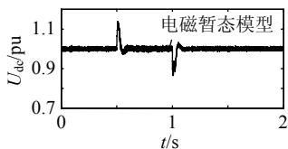

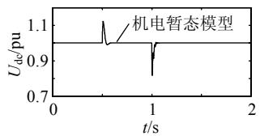

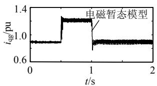  
(a) 直流侧电压曲线对比

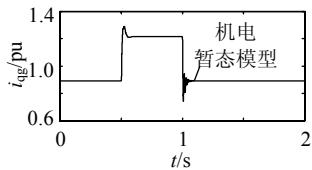

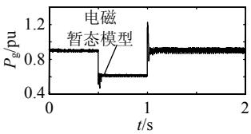  
(b) 注入电网有功电流曲线对比

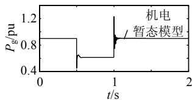  
(c) 注入电网有功功率曲线对比   
图 10 电压跌落 50%且持续 0.5 s 时本文模型与电磁模型的响应波形对比  
Fig. 10 Response waveforms of 50%,0.5s voltage sag by the above model and electromechanical transient model

# 4 结论

本文建立了直驱式风电机组的机电暂态模型，考虑了直流侧电压的动态特性，用低电压限制发电机侧变流器输出有功功率来模拟直流侧的卸荷电路。在 Matlab/simulink 仿真环境下，本文建立了直驱式风电机组的电磁暂态模型及机电暂态模型，对比分析了大量仿真结果，验证了本文建立的机电暂态模型的合理性和准确性，表明该模型能够用于大规模直驱式风电场接入电力系统安全和稳定性分析。

# 参考文献

[1] 雷亚洲，Lightbody G．国外风力发电导则及动态模型简介[J]．电网技术，2005，29(12)：27-32  
Lei Yazhou，Lightbody G．An introduction on wind power grid code and dynamic simulation[J]．Power System Technology，2005，29(12)： 27-32(in Chinese)   
[2] 薛玉石，韩力，李辉．直驱永磁同步风力发电机组研究现状与发展前景[J]．电机与控制应用，2008，35(4)：1-5  
Xue Yushi，Han Li，Li Hui．Overview on direct-drive permanent

magnet synchronous generator for wind power system[J]．ElectricMachines & Control Application，2008，35(4)：1-5(in Chinese)  
[3] 李建林，许洪华，等．风力发电系统低电压运行技术[M]．北京：机械工业出版社，2009：1-15  
[4] 付勋波，郭金东，赵栋利，等．直驱式风力发电系统的仿真建模与运行特性研究[J]．电力自动化设备，2009，29(2)：1-5  
Fu Xunbo，Guo Jindong，Zhao Dongli，et al．Characteristics and simulation model of direct-drive wind power system[J]．Electric Power Automation Equipment，2009，29(2)：1-5(in Chinese)   
[5] 尹明，李庚银，张建成，等．直驱式永磁同步风力发电机组建模及其控制策略[J]．电网技术，2007，31(15)：61-65  
Yin Ming，Li Gengyin，Zhang Jiancheng，et al．Modeling and control strategies of directly driven wind turbine with permanent magnet synchronous generator[J]．Power System Technology， 2007，31(15)： 61-65(in Chinese)   
[6] 严干贵，魏治成，穆钢，等．直驱式永磁同步风电机组的动态建模与运行控制[J]．电力系统及其自动化学报，2009，21(6)：34-39  
Yan Gangui，Wei Zhicheng，Mu Gang，et al．Dynamic modeling and control of directly-driven permanent magnet synchronous generator wind turbine[J]．Proceedings of the CSU-EPSA，2009，21(6)：34-39(in Chinese)   
[7] 杨勇，阮毅，任志斌，等．直驱式风力发电系统中的并网逆变器[J]．电网技术，2009，33(17)：157-161  
Yang Yong，Ruan Yi，Ren Zhibin，et al．Grid-connected inverter in direct-drive wind power generation system[J] ． Power System Technology，2009，33(17)：157-161(in Chinese)   
[8] 耿华，许德伟，吴斌，等．永磁直驱变速风电系统的控制及稳定性分析[J]．中国电机工程学报，2009，29(33)：68-75  
Geng Hua，Xu Dewei，Wu Bin，et al．Control and stability analysis for the permanent magnetic synchronous generator based direct driven variable speed wind energy conversion system[J]．Proceeding of the CSEE，2009，29(33)：68-75(in Chinese)   
[9] Chinchilla M，Arnaltes S，Burgos J C．Control of permanent magnetgenerators applied to variable-speed wind-energy systems connectedto the grid[J]．IEEE Trans on Energy Conversion，2006，21(1)：130-135．  
[10] Hansen A D，Michalke G．Modeling and control of variable-speed multi-pole permanent magnet synchronous generator wind turbine [J]．Wind Energy，2008，11(5)：537-554   
[11] 姚兴佳，鲍洁秋，厉伟，等．直驱式风电机组变速恒频的控制策略[J]．沈阳工业大学学报，2008，30(4)：399-403  
Yao Xingjia，Bao Jieqiu，Li Wei，et al．Control strategy and system development of direct drive VSCF wind turbine[J] ． Journal of Shenyang University of Technology ， 2008 ， 30(4) ： 399-403(in Chinese)．   
[12] 姚骏，廖勇，翟兴鸿，等．直驱永磁同步风力发电机的最佳风能跟踪控制[J]．电网技术，2008，32(10)：11-15  
Yao Jun，Liao Yong，Zhai Xinghong，et al．Optimal wind-energytracking control of direct-driven permanent magnet synchronousgenerators for wind turbines[J]．Power System Technology，2008，32(10)：11-15(in Chinese)  
[13] Fatu M，Lascu C，Andreescu G D，et al．Voltage sags ride-through of motion sensor controlled PMSG for wind turbines[C]//Proceedings of 42nd IAS Annual Meeting：Industry Applications Conference．New Orleans，LA，USA：IEEE，2007：171-178   
[14] 胡书举，李建林，许洪华．直驱风电系统变流器建模和跌落特性

仿真[J]．高电压技术，2008，34(5)：949-954  
Hu Shuju，Li Jianlin，Xu Honghua．Modeling on converters of direct-driven wind power system and its performance during voltage sags[J]．High Voltage Technology，2008，34(5)：949-954(in Chinese)   
[15] 李建林，胡书举，孔德国，等．全功率变流器永磁直驱风电系统低电压穿越特性研究[J]．电力系统自动化，2008，32(19)：92-95Li Jianlin，Hu Shuju，Kong Deguo，et al．Studies on the low voltageride through capability of fully converted wind turbine with PMSG[J]．Automation of Electric Power Systems，2008，32(19)：92-95(inChinese)  
[16] 姚骏，廖勇，庄凯．电网故障时永磁直驱风电机组的低电压穿越控制策略[J]．电力系统自动化，2009，33(12)：91-96Yao Jun，Liao Yong，Zhuang Kai．A low voltage ride-through controlstrategy of permanent magnet direct-driven wind turbine under gridfaults[J]．Automation of Electric Power Systems，2009，33(12)：91-96(in Chinese)  
[17] 廖勇，庄凯，姚骏，等．直驱式永磁同步风力发电机双模功率控制策略的仿真研究[J]．中国电机工程学报，2009，29(33)：76-82Liao Yong，Zhuang Kai，Yao Jun，et al．Dual-mode power controlstrategy simulation study of direct-driven permanent magnetsynchronous generator for wind turbine[J]．Proceedings of the CSEE，2009，29(33)：76-82(in Chinese)  
[18] 尹忠刚，钟彦儒，刘静．适用于直驱风力发电系统的三电平两桥臂 PWM 整流器控制策略[J]．电网技术，2009，33(19)：169-174Yin Zhonggang ， Zhong Yanru ， Liu Jing ． Control strategy ofthree-phase two arm three level PWM rectifier suitable fordirect-driving wind power system[J]．Power System Technology，2009，33(19)：169-174(in Chinese)  
[19] 刘辉，闵勇．电力系统暂态稳定域边界二维特征不变流形计算[J]．电网技术，2009，33(1)：5-10Liu Hui，Min Yong．Calculation of two-dimensional characteristicinvariant manifolds on the boundary of transient stability region inpower system[J]．Power System Technology，2009，33(1)：5-10(inChinese)  
[20] 叶圣永，王晓茹，刘志刚，等．电力系统暂态稳定概率评估方法[J]．电网技术，2009，33(6)：19-23．

Ye Shengyong，Wang Xiaoru，Liu Zhigang，et al．Approach to assess power system transient stability probability[J] ． Power System Technology，2009，33(6)：19-23(in Chinese)   
[21] 刘有为，李忠晶，鞠登峰，等．电力系统暂态电压波形压缩记录技术[J]．电网技术，2009，33(7)：90-93Liu Youwei，Li Zhongjing，Ju Dengfeng，et al．Compressed recordingtechnique for power system transient voltage waveform[J]．PowerSystem Technology，2009，33(7)：90-93(in Chinese)  
[22] 贾旭东，李庚银，赵成勇，等．基于RTDS/C Builder的电磁–机电 暂态混合实时仿真方法[J]．电网技术，2009，33(11)：33-38 Jia Xudong，Li Gengyin，Zhao Chengyong，et al．Electromagnetic transient and electromechanical transient hybrid real-time simulation method based on RTDS/C Builder[J]．Power System Technology， 2009，33(11)：33-38(in Chinese)   
[23] 朱艺颖，呙虎，李新年，等．锦屏-苏南特高压直流输电工程直流线路电磁暂态仿真[J]．电网技术，2009，33(6)：1-4Zhu Yiying，Guo Hu，Li Xinnian，et al．Simulation on electromagnetictransient process in DC transmission line of ±800 kV powertransmission project from Jinping to south Jiangsu[J]．Power SystemTechnology，2009，33(6)：1-4(in Chinese)

  
高峰

收稿日期：2011-07-25。

作者简介：

高峰(1982)，男，博士研究生，研究方向为电力系统数字仿真，E-mail：gaofeng@epri.sgcc.com.cn；

周孝信(1940)，男，中国科学院院士，博士生导师，中国科学院院士，研究方向为电力系统实时数字仿真、电力系统稳定与分析；

朱宁辉(1982)，男，博士研究生，研究方向为

智能电网；

苏峰(1983)，男，博士研究生，研究方向为电力系统安全稳定评估；安宁(1979)，男，博士，高级工程师，研究方向为电力系统数字仿真。

（责任编辑 杜宁）