# RATIONAL APPROXIMATION OF FREQUENCY DOMAIN RESPONSES BY VECTOR FITTING

Bjørn Gustavsen (M)

EFI, Trondheim, Norway

Email: bjorn.gustavsen@efi.sintef.no

Adam Semlyen (LF)

University of Toronto, Toronto, Canada

Email: semlyen@ecf.toronto.edu

Abstract - The paper describes a general methodology for the fitting of measured or calculated frequency domain responses with rational function approximations. This is achieved by replacing a set of starting poles with an improved set of poles via a scaling procedure. A previous paper [5] has described the application of the method to smooth functions using real starting poles. This paper extends the method to functions with a high number of resonance peaks by allowing complex starting poles. Fundamental properties of the method are discussed and details of its practical implementation are described. The method is demonstrated to be very suitable for fitting network equivalents and transformer responses. The computer code is in the public domain, available from the first author.

# 1 INTRODUCTION

One of the problems encountered in power system transients modeling is the accurate inclusion of frequency dependent effects in a time domain simulation. Such effects arise from eddy currents in conducting materials and sometimes from relaxation phenomena in dielectrics. These effects materialize as a frequency domain variation in the resistance, inductance and capacitance matrices used in the formulation of the model. In practice, the frequency dependent responses are obtained via calculations or measurements as discrete functions of frequency.

A linear model of a power system component can in general be included in a time domain simulation via convolutions between terminal quantities (e.g. node voltages) and impulse responses characterizing the dynamics of the model. A full numerical convolution is always possible, but this becomes computationally inefficient because of the many time steps in a simulation. A much more efficient implementation is achieved if the frequency domain responses are replaced with low order rational function approximations, as the convolutions can then be given a recursive formulation [1]. The ability of finding a good rational function approximation is therefore important in power system modeling.

In principle, an approximation of a given order can be found by fitting a ratio of two polynomials to the data [2]:

$$
f (s) \approx \frac {a _ {0} + a _ {1} s + a _ {2} s ^ {2} + \dots + a _ {N} s ^ {N}}{b _ {0} + b _ {1} s + b _ {2} s ^ {2} + \dots + b _ {N} s ^ {N}} \tag {1}
$$

Equation (1) is nonlinear in terms of the unknown coefficients but can be rewritten as a linear problem of the type $Ax = b$ by multiplying both sides with the denominator. However, the resulting problem is badly scaled and conditioned as the columns in $A$ are multiplied with different powers of $s$ . This limits the method to approximations of very low order, particularly if the fitting is over a wide frequency range.

PE-194-PWRD-0-11-1997 A paper recommended and approved by the IEEE Transmission and Distribution Committee of the IEEE Power Engineering Society for publication in the IEEE Transactions on Power Delivery. Manuscript submitted July 2, 1997; made available for printing December 3, 1997.

The difficulty in formulating a general fitting methodology has resulted in many methods which are tailored for particular problems. For instance, Bode type fitting restricted to real poles and zeros has been successfully applied to transmission line modeling based on modal characteristics [3]. Transformer models and network equivalents need complex poles to represent resonance peaks. Such responses have been approximated by fitting partial fractions to the data in an optimization procedure, with precalculated poles [4].

An attempt at formulating a general fitting methodology was introduced in [5]. This method—vector fitting—was based on doing the approximation in two stages, both with known poles. The first stage was carried out with real poles distributed over the frequency range of interest. In addition, an unknown frequency dependent scaling parameter was introduced which permitted the scaled function to be accurately fitted with the prescribed poles. From the fitted function a new set of poles were obtained and then used in the second stage in the fitting of the unscaled function. This procedure was very successful in fitting the smooth functions occurring in transmission line modeling [5-6]. However, later investigations by the authors have shown that the method fails when there are many resonance peaks in the response to be fitted.

This paper shows that the above mentioned limitations can easily be overcome by using complex starting poles. This result is demonstrated by numerical examples involving artificially created frequency responses, a measured transformer response, and a network equivalent. The paper also provides details on the practical implementation of vector fitting.

# 2 VECTOR FITTING BY POLE RELOCATION

Consider the rational function approximation

$$
f (s) \approx \sum_ {n = 1} ^ {N} \frac {- c _ {n}}{s - a _ {n}} + d + s h \tag {2}
$$

The residues $c_{n}$ and poles $a_{n}$ are either real quantities or come in complex conjugate pairs, while $d$ and $h$ are real. The problem at hand is to estimate all coefficients in (2) so that a least squares approximation of $f(s)$ is obtained over a given frequency interval. We note that (2) is a nonlinear problem in terms of the unknowns, because the unknowns $a_{n}$ appear in the denominator.

Vector fitting solves the problem (2) sequentially as a linear problem in two stages, both times with known poles.

# Stage #1 : pole identification

Specify a set of starting poles $\overline{a}_n$ in (2), and multiply $f(s)$ with an unknown function $\sigma(s)$ . In addition, we introduce a rational approximation for $\sigma(s)$ . This gives the augmented problem:

$$
\left[ \begin{array}{c} \sigma (s) f (s) \\ \sigma (s) \end{array} \right] = \left[ \begin{array}{l} \sum_ {n = 1} ^ {N} \frac {c _ {n}}{s - \bar {a} _ {n}} + d + s h \\ \sum_ {n = 1} ^ {N} \frac {\tilde {c} _ {n}}{s - \bar {a} _ {n}} + 1 \end{array} \right] \tag {3}
$$

Note that in (3) the rational approximation for $\sigma(s)$ has the same poles as the approximation for $\sigma(s)f(s)$ . Also, note that the

ambiguity in the solution for $\sigma(s)$ has been removed by forcing $\sigma(s)$ to approach unity at very high frequencies.

Multiplying the second row in (3) with $f(s)$ yields the following relation:

$$
\left(\sum_ {n = 1} ^ {N} \frac {c _ {n}}{s - \bar {a} _ {n}} + d + s h\right) \approx \left(\sum_ {n = 1} ^ {N} \frac {\tilde {c} _ {n}}{s - \bar {a} _ {n}} + 1\right) f (s) \tag {4}
$$

or

$$
\left(\sigma f\right) _ {f i t} (s) \approx \sigma_ {f i t} (s) f (s) \tag {5}
$$

Equation (4) is linear in its unknowns $c_{n}, d, h, \widetilde{c}_{n}$ . Writing (4) for several frequency points gives the overdetermined linear problem

$$
A x = b \tag {6}
$$

where the unknowns are in the solution vector $\pmb{x}$ . Equation (6) is solved as a least squares problem. Details about the formulation of the linear equations is shown in Appendix A.

A rational function approximation for $f(s)$ can now be readily obtained from (4). This becomes evident if each sum of partial fractions in (4) is written as a fraction:

$$
\left(\sigma f\right) _ {f i t} (s) = h \frac {\prod_ {n = 1} ^ {N + 1} \left(s - z _ {n}\right)}{\prod_ {n = 1} ^ {N} \left(s - \bar {a} _ {n}\right)}, \quad \sigma_ {f i t} (s) = \frac {\prod_ {n = 1} ^ {N} \left(s - \tilde {z} _ {n}\right)}{\prod_ {n = 1} ^ {N} \left(s - \bar {a} _ {n}\right)} \tag {7}
$$

From (7) we get

$$
f (s) = \frac {(\sigma f) _ {\text {f i t}} (s)}{\sigma_ {\text {f i t}} (s)} = h \frac {\prod_ {n = 1} ^ {N + 1} \left(s - z _ {n}\right)}{\prod_ {n = 1} ^ {N} \left(s - \widetilde {z} _ {n}\right)} \tag {8}
$$

Equation (8) shows that the poles of $f(s)$ become equal to the zeros of $\sigma_{fit}(s)!$ (Note that the starting poles cancel in the division process because we use the same starting poles for $(\sigma f)_{fit}$ and for $\sigma_{fit}(s)$ ). Thus, by calculating the zeros of $\sigma_{fit}(s)$ we get a good set of poles for fitting the original function $f(s)$ . The calculation of zeros from the representation by partial fractions (4) is straightforward, as shown in Appendix B.

On occasion, some of the new poles may be unstable. This problem is overcome by inverting the sign of their real parts.

# Stage #2: residue identification

In principle we could now calculate the residues for $f(s)$ directly from (8). However, a more accurate result is in general obtained by solving the original problem in (2) with the zeros of $\sigma(s)$ as new poles $a_n$ for $f(s)$ . This again gives an overdetermined linear problem of form $Ax = b$ where the solution vector $x$ contains the unknowns $c_n$ , $d$ and $h$ . It is solved as (A.2) of Appendix A (without the negative term).

# General remarks

Note that the numerator and denominator of $\sigma_{fit}$ have been specified in (7) to be of the same order. This has the implication that if the starting poles are correct, then the new poles (zeros of $\sigma_{fit}$ ) become equal to the starting poles $(\sigma_{fit}(s) = 1)$ . In practical applications, this has the consequence that the rational approximation will converge if the new poles are used as starting poles in an iterative procedure.

In (2) an unknown constant term and an unknown proportional term are included. It is straightforward to modify the method to handle cases where these quantities are known.

Vector fitting is equally well suited for fitting vectors as it is for scalars (hence its name). It is done by replacing the scalar $f(s)$

in (2) by a vector. This will result in all elements of the fitted vector sharing the same poles. The advantage of using the same poles for all elements in a vector is that the time domain convolutions for the vector become about twice as fast (see the closure to [5]).

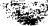

# 3 STARTING POLES

# 3.1 Significance of starting poles

Successful application of vector fitting requires that the linear problem (6) can be solved with sufficient accuracy. In our experience, difficulties may arise due to poor starting poles in the following ways:

1) The linear problem (6) becomes ill-conditioned if the starting poles are real. This may result in an inaccurate solution.   
2) A large difference between the starting poles and the correct poles may result in large variations in $\sigma(s)$ and $\sigma(s)f(s)$ . Because a least squares approach is used when solving (6), a poor fitting may result where these functions are small.

The first problem is overcome by usage of complex starting poles. The second problem is overcome by sensible location of the starting poles, and by using the new poles as starting poles in an iterative procedure.

# 3.2 Recommended procedure for selection of starting poles

# Functions with distinct resonance peaks

The starting poles should be complex conjugate with imaginary parts $\beta$ linearly distributed over the frequency range of interest. Each pair is chosen as follows:

$$
a _ {n} = - \alpha + j \beta , a _ {n + 1} = - \alpha - j \beta \tag {9}
$$

where

$$
\alpha = \beta / 1 0 0 \tag {10}
$$

This simple procedure produces starting poles with sufficiently small real parts, thus avoiding the ill-conditioning problem as is explained in section 6.

# Smooth functions

Use real poles, linearly or logarithmically spaced as function of frequency. (The ill-conditioning problem associated with real poles will not lead to an inaccurate fitting when $f(s)$ is smooth.)

# 4 FITTING NON-SMOOTH FUNCTIONS

# 4.1 Frequency response

In what follows we consider an artificially created frequency response of order 18, defined by (2). The assumed poles, residues, constant term and proportional term are given below.

Table 1 Coefficients of frequency response defined by (2)   

<table><tr><td colspan="2">Poles [Hz]</td><td colspan="2">Residues [Hz]</td></tr><tr><td>-4500</td><td></td><td>-3000</td><td></td></tr><tr><td>-41000</td><td></td><td>-83000</td><td></td></tr><tr><td colspan="2">-100 ± j5000</td><td colspan="2">-5 ± j7000</td></tr><tr><td colspan="2">-120 ± j15000</td><td colspan="2">-20 ± j18000</td></tr><tr><td colspan="2">-3000 ± j35000</td><td colspan="2">6000 ± j45000</td></tr><tr><td colspan="2">-200 ± j45000</td><td colspan="2">40 ± j60000</td></tr><tr><td colspan="2">-1500 ± j45000</td><td colspan="2">90 ± j10000</td></tr><tr><td colspan="2">-500 ± j70000</td><td colspan="2">50000 ± j80000</td></tr><tr><td colspan="2">-1000 ± j73000</td><td colspan="2">1000 ± j45000</td></tr><tr><td colspan="2">-2000 ± j90000</td><td colspan="2">-5000 ± 92000</td></tr></table>

$d = 0.2$ ， $h = 2E - 5$

This response contains 2 real poles and 16 complex poles. Note that two complex pairs have poles with identical imaginary parts $(45000\mathrm{Hz})$ but different real parts. The magnitude of the resulting function is shown in figure 1.

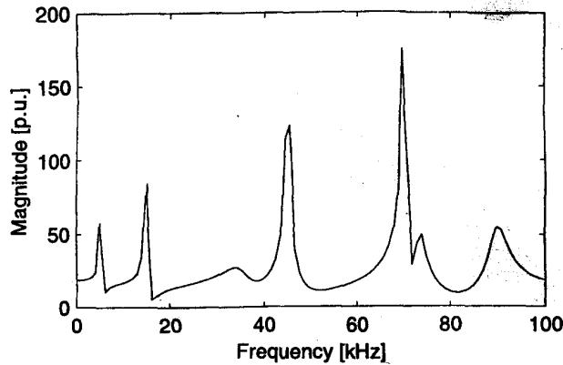  
Fig. 1 18th order frequency response $f(s)$

# 4.2 Fitting with complex poles

10 pairs of complex starting poles were linearly distributed over the frequency range, as explained in section 3.2. The starting poles are listed below:

Table 2 Starting poles   

<table><tr><td>-1.00E-02 ± j1.00E+00</td><td>-5.55E+02 ± j5.55E+04</td></tr><tr><td>-1.11E+02 ± j1.11E+04</td><td>-6.66E+02 ± j6.66E+04</td></tr><tr><td>-2.22E+02 ± j2.22E+04</td><td>-7.77E+02 ± j7.77E+04</td></tr><tr><td>-3.33E+02 ± j3.33E+04</td><td>-8.88E+02 ± j8.88E+04</td></tr><tr><td>-4.44E+02 ± j4.44E+04</td><td>-1.00E+03 ± j1.00E+05</td></tr></table>

Using the starting poles in table 2, the first stage in vector fitting was carried out. This produced rational approximations $\sigma_{fit}(s)$ and $(\sigma f)_{fit}(s)$ . The magnitude of the responses is shown in figure 2. Also is shown the magnitude of the difference between $\sigma_{fit}(s)f(s)$ and $(\sigma f)_{fit}(s)$ which corresponds to the error in (4). The difference is seen to be smaller than 1E-10.

In the second stage in vector fitting, the zeros of $\sigma_{fit}(s)$ were calculated and used as new poles for the fitting of the original function $f(s)$ . Figure 3 shows that the resulting approximation for $f(s)$ is extremely accurate! The root-mean-square (RMS) error was found to be 3.8E-12. Table 3 lists the errors of the values obtained for the individual coefficients in table 1. They are all very small.

Table 3 Error in estimate of coefficients in table 1.   

<table><tr><td>Poles</td><td colspan="2">Residues</td></tr><tr><td>1E-07</td><td>1E-07</td><td></td></tr><tr><td>-3E-08</td><td>1E-07</td><td></td></tr><tr><td>1E-11 ± j3E-11</td><td>-2E-09 ± j5E-10</td><td></td></tr><tr><td>4E-11 ± j4E-11</td><td>2E-10 ± j5E-09</td><td></td></tr><tr><td>1E-11 ± j1E-10</td><td>-1E-08 ± j1E-09</td><td></td></tr><tr><td>-4E-11 ± j3E-11</td><td>5E-09 ± j3E-09</td><td></td></tr><tr><td>4E-10 ± j2E-10</td><td>-1E-08 ± j1E-08</td><td></td></tr><tr><td>-4E-11 ± j1E-10</td><td>-1E-08 ± j1E-08</td><td></td></tr><tr><td>2E-11 ± j5E-11</td><td>-5E-09 ± j1E-08</td><td></td></tr><tr><td>7E-12 ± j1E-10</td><td>-9E-09 ± j1E-09</td><td></td></tr><tr><td>d: -2E-12</td><td>h: -5E-18</td><td></td></tr></table>

In this case we fitted an 18th order function with a 20th order approximation. The two "surplus" poles came out with very small residues:

<table><tr><td>Poles</td><td>Residues</td></tr><tr><td>-1.03E-02</td><td>3.78E-14</td></tr><tr><td>-1.50E+04</td><td>-4.23E-07</td></tr></table>

The magnitude of the two corresponding partial fractions have both a maximum value less than 1E-11. They do in practice not contribute to the response and may therefore be removed.

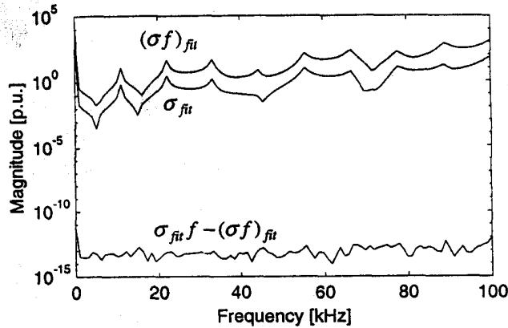  
Fig. 2 Rational approximations $\sigma_{fit}(s)$ and $(\sigma f)_{fit}(s)$

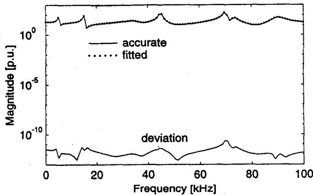  
Fig. 3 Fitted function $f(s)$ (20th order approximation)

A very attractive feature of the fitting methodology is that it will not fail if one attempts to use a very high order approximation. For instance, if one increased the number of linearly spaced complex starting poles in table 2 from 20 to 40, the RMS-error became 1.6E-12.

# 4.3 Fitting with real starting poles

As was pointed out in section 3.2, frequency responses with resonance peaks should be fitted using complex starting poles. However, we now attempt at fitting $f(s)$ with 20 real poles, linearly spaced over the given frequency interval.

The error of (4) became large, indicating that $\sigma_{fit}(s)$ is inaccurate. This resulted in the new poles to be incorrect and so the fitting of $f(s)$ became poor, with an RMS-error of 7.1. However, several of the new poles were complex. After a few iterations with the new poles as starting poles, a very accurate approximation was achieved! Table 4 shows how the error in the fitting of $f(s)$ decreased during the iterations.

Table 4 Reduction in error by iteration   

<table><tr><td>Iteration</td><td>RMS-erro</td></tr><tr><td>1</td><td>7.1</td></tr><tr><td>2</td><td>1.0E-11</td></tr><tr><td>3</td><td>4.2E-13</td></tr></table>

# 4.4 Reduced order fitting

In practical applications one often wants to find a low order approximation to a high order function. 7 peaks can readily be observed in figure 1, so at least 14 poles should be used. Figure 4 shows the resulting approximation after 3 iterations when using 7 pairs of complex starting poles. The deviation is seen to have its maximum around $45\mathrm{kHz}$ , where $f(s)$ has two complex pairs (see table 1).

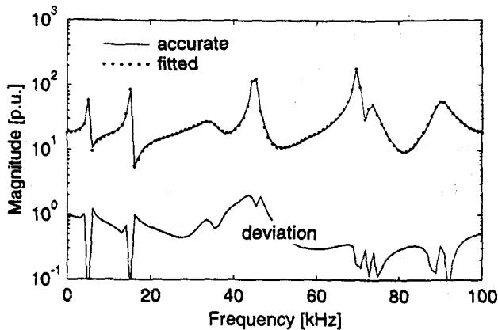  
Fig. 4 14th order approximation of $f(s)$ after 3 iterations

# 4.5 Effect of poles outside considered frequency interval

In some applications $f(s)$ will contain poles outside the frequency interval considered in the fitting process. To investigate the effect of this we attempt at fitting the response $f(s)$ in the range 1Hz-60kHz, so that several poles lie at higher frequencies than the frequency interval considered in the fitting.

Starting poles were obtained by linearly distributing 8 complex pairs between $1\mathrm{Hz}$ and $60\mathrm{kHz}$ . Figure 5 shows the resulting fitting for $f(s)$ in the range $1\mathrm{Hz} - 100\mathrm{kHz}$ , after 3 iterations. The RMS-error for this interval was 3.3E-6, which is still very small.

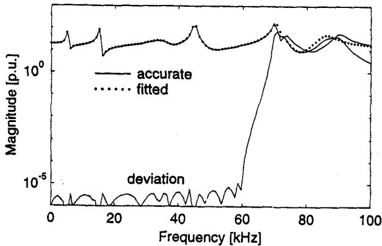  
Fig. 5 Fitting $f(s)$ between $1\mathrm{Hz}$ and $60\mathrm{kHz}$ (16th order approx.)

The error further decreased to 3.2E-13 when increasing the number of poles to 20.

# 4.6 Effect of noise

We have found that the ability of shifting the starting poles is reduced if a significant amount of noise is added to the response. Thus, convergence is slow and several iterations may be needed. In the following we add to $f(s)$ noise which varies randomly between -10 and +10.

For starting poles we used 10 linearly spaced complex pairs. Figure 6 shows the resulting fitting for $f(s)$ after 4 iterations. It is seen that a fair approximation has been achieved.

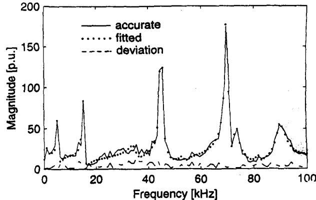  
Fig. 6 Adding random noise to $f(s)$ (20th order approximation)

The resulting RMS-error between the fitting function and $f(s)$ (including noise) was 5.0. For comparison, the RMS-value of the noise alone was 5.3. Table 5 lists how the deviation decreased during the iterations.

Table 5 Reduction in error by iteration   

<table><tr><td>Iteration</td><td>RMS-error</td></tr><tr><td>1</td><td>18.2</td></tr><tr><td>2</td><td>9.5</td></tr><tr><td>3</td><td>5.3</td></tr><tr><td>4</td><td>5.0</td></tr></table>

# 4.7 Significance of starting pole location

In general, the starting poles should be distributed so that the considered frequency range is covered. If, for instance, the starting poles are confined to a small part of the frequency interval, the poles will have to be shifted over a large distance during the fitting process.

Figure 7 shows the resulting approximations $\sigma_{fit}(s)$ and $(\sigma f)_{fit}(s)$ when using complex starting poles, linearly distributed between $1\mathrm{Hz}$ and $20\mathrm{kHz}$ . The functions are seen to have a very large variation, and (4) is not well satisfied at high frequencies.

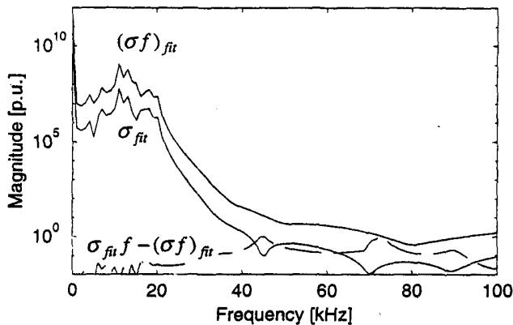  
Fig. 7 Approximation of $\sigma_{fit}(s)$ and $(\sigma f)_{fit}(s)$ using starting 20 complex starting poles in frequency interval $1\mathrm{Hz} - 20\mathrm{kHz}$

The resulting fitting for $f(s)$ was poor at high frequencies. However, one more iteration with the new poles as starting poles reduced the RMS-error from 9.2 to 3.48E-10. (The variation in $\sigma_{fit}(s)$ and $(\sigma f)_{fit}(s)$ was greatly reduced by each iteration as more poles were shifted towards higher frequencies.)

On the other hand, the iteration was much less successful if noise was added to $f(s)$ . When adding the same noise as in figure 6, no poles were produced for the fitting of the highest frequency resonance peak, even after 50 iterations.

# 4.8 Optimality of method

In general, the method of vector fitting will not lead to an optimal fitting, as the resulting approximation may depend on the selection of starting poles. To explain this, we attempt at fitting $f(s)$ in figure 1 with only one complex pair. This resulted in one of the resonance peaks being fitted. As to which of the peaks was fitted depended on the location of the two starting poles.

However, in the case of smooth functions, we have found experimentally that the fitting will (by iteration) converge to a result which is independent of the starting pole locations.

# 5 FITTING SMOOTH FUNCTIONS

In some applications the frequency responses are very smooth functions, without resonance peaks. Examples of this are the modal responses for characteristic admittance and propagation encountered in transmission line modeling.

In the following we consider an artificially created 18th order function, defined by (2) with parameters as shown below:

Table 6 Coefficients of frequency response   

<table><tr><td>Pole</td><td>Residue</td><td>Pole</td><td>Residue</td></tr><tr><td>- 2000</td><td>1000</td><td>-34000</td><td>-12000</td></tr><tr><td>- 4000</td><td>-1000</td><td>-44000</td><td>20000</td></tr><tr><td>- 9000</td><td>7000</td><td>-48000</td><td>41000</td></tr><tr><td>-15000</td><td>12000</td><td>-56000</td><td>8000</td></tr><tr><td>-18000</td><td>5000</td><td>-64000</td><td>15600</td></tr><tr><td>-21000</td><td>-12000</td><td>-72000</td><td>-10000</td></tr><tr><td>-23000</td><td>-2000</td><td>-79000</td><td>-12000</td></tr><tr><td>-29500</td><td>1500</td><td>-88000</td><td>50000</td></tr><tr><td>-33000</td><td>31000</td><td>-93000</td><td>-2000</td></tr><tr><td colspan="4">d=0, h=0</td></tr></table>

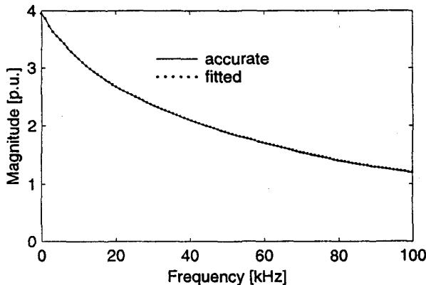  
Figure 8 shows the resulting fitting for $f(s)$ , when using 20 real starting poles, linearly distributed between $1\mathrm{Hz}$ and $100\mathrm{kHz}$ . The root-mean-square error was 5.9E-11, which is very small.   
Fig. 8 Fitted function $f(s)$

However, the parameters in table 6 were not accurately reproduced. Table 7 lists the calculated poles. It is seen that the poles differ from those in table 6. The reason why an accurate fitting was achieved despite an inaccurate solution is related to the solution not being well-defined, as will be explained in section 6.

Table 7 New poles produced by stage #1 in vector fitting.   

<table><tr><td>-2000</td><td>-36843</td><td>-58405</td><td>-91297</td></tr><tr><td>-4000</td><td>-38736</td><td>-63158</td><td>-94737</td></tr><tr><td>-9001</td><td>-47369</td><td>-68421</td><td>-99146</td></tr><tr><td>-15128</td><td>-49859</td><td>-73684</td><td>-24393 ± j10589</td></tr><tr><td>-30341</td><td>-52632</td><td>-84211</td><td></td></tr></table>

Smooth functions can often be fitted quite accurately with a very low order approximation. Table 8 shows the accuracy, dependent on how many real starting poles have been used (single iteration).

Table 8 Root-mean-square error in approximation of $f(s)$   

<table><tr><td>Order</td><td>Error</td></tr><tr><td>2</td><td>5.1E-2</td></tr><tr><td>4</td><td>7.1E-4</td></tr><tr><td>6</td><td>3.1E-5</td></tr><tr><td>8</td><td>6.2E-6</td></tr><tr><td>20</td><td>5.9E-11</td></tr></table>

It should be noted that complex poles may also be used as starting poles for smooth functions. The function $f(s)$ was fitted using 10 pairs of complex starting poles linearly distributed between $1\mathrm{Hz}$ and $100\mathrm{kHz}$ . This gave an approximation having an RMS-error of 1.1E-7, which is somewhat less accurate than the result obtained with real starting poles (5.9E-11). Also, several of the new poles (5 pairs) were complex.

# 6 ANALYSIS BY SINGULAR VALUE DECOMPOSITION

In the first stage of vector fitting we have to solve the linear problem

$$
A x = b \tag {11}
$$

where each row $k$ in $A$ is built from the starting poles $\overline{a}$ as follows:

$$
A _ {k} = \left[ \frac {1}{s _ {k} - \bar {a} _ {1}} \quad \dots \quad \frac {1}{s _ {k} - \bar {a} _ {N}} \quad 1 \quad s _ {k} \quad \frac {- f (s _ {k})}{s _ {k} - \bar {a} _ {1}} \quad \dots \quad \frac {- f (s _ {k})}{s _ {k} - \bar {a} _ {N}} \right] \tag {12}
$$

The accuracy to which (11) can be solved is best analyzed using singular value decomposition. This allows $A$ to be factorized:

$$
\boldsymbol {A} = \boldsymbol {U S V} ^ {T} \tag {13}
$$

$S$ is a diagonal matrix containing the singular values of $A$ , and $U$ is a matrix with orthogonal columns. Thus, the columns of $U$ may be considered as basis functions in the representation of $A$ . There are as many singular values as there are columns in $A$ .

Figure 9 shows the singular values for some of the previous examples:

1) Fitting a response with resonance peaks using 20 complex poles (section 4.2).   
2) Fitting a response with resonance peaks using 20 real poles (section 4.3).   
3) Fitting a smooth response using 20 complex poles (section 5).   
4) Fitting a smooth response using 20 real poles (section 5).

From numerical mathematics it is known that the contribution to $A$ associated with a small singular value is inaccurately handled in the solution process of (11), if its ratio to the largest singular value approaches the machine precision, e.g. below 1E-12.

The pattern of the singular values in figure 9 implies that accurate results would be obtained for problem 1). This is exactly what we found in section 4.2: all poles were estimated with very high accuracy.

In problem 2) several of the singular values are very small. This implies inaccurate solution of (11). This is detrimental because the

new poles (which are calculated from the solution) must be accurately identified for a function with resonance peaks. This is in accordance with the results obtained in section 4.3.

In both problems 3) and 4) there are many small singular values which implies inaccurate solution to (12). It was found in section 5 that the poles were inaccurately estimated in both cases. However, a very accurate fitting was still obtained because smooth functions can be approximated quite accurately using slightly incorrect poles.

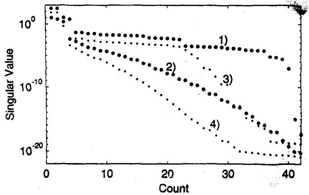  
Fig.9 Singular values of A 7 APPLICATIONS

In the following we demonstrate vector fitting for a few applications involving frequency responses with resonance peaks.

# 7.1 Network equivalent for a complex network

We first consider the positive sequence admittance for a highly complex distribution network. In this case, all lines were modeled as distributed parameter lines evaluated at $50\mathrm{Hz}$ . Thus, the frequency dependent effects are not fully represented.

Figure 10 shows the resulting fitting after 20 iterations, when using 60 pairs of complex starting poles, linearly spaced over the given frequency interval. It is seen that a very good approximation has been achieved. The RMS-error was 3.8E-3. The error was further reduced to 6.0E-4 when increasing the order to 240.

# 7.2 Transformer response

Figure 11 shows the fitted zero sequence admittance of a $11\mathrm{kV} / 230\mathrm{V}$ transformer, seen from the low voltage terminals with

a resistive network connected to the high voltage terminals. Three complex pairs of starting poles were linearly distributed over the frequency range in figure 11. The resulting fitting is seen to be quite good (5 iterations were used).

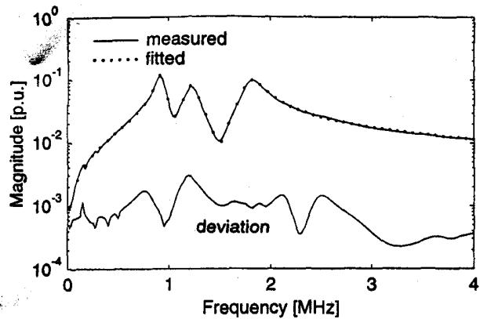  
Fig. 11 Zero sequence transformer admittance (6th order approx.)

However, the phase angle was not fitted very accurately at low frequencies. Therefore, the number of complex starting poles was increased from 6 to 30, and 15 iterations were carried out. Figure 12 shows that a significant improvement has been achieved for the phase angle at low frequencies. (The RMS-error for the entire frequency interval decreased from 1.0E-3 to 5.4E-5.)

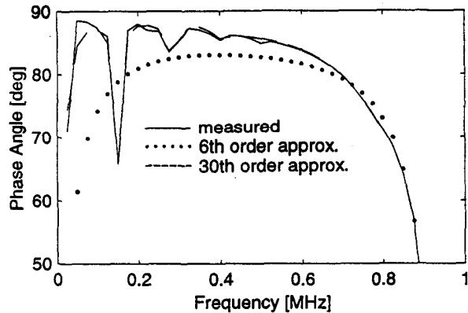  
Fig. 12 Fitted phase angle at low frequencies

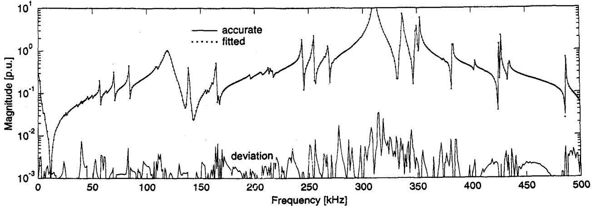  
Fig. 10 Positive sequence admittance (120th order approximation)

# 7.3 Network equivalent for a transmission line

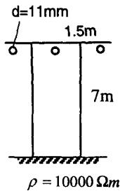

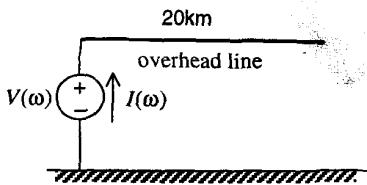  
Fig. 13 Transmission line system

The open circuit line admittance $Y(\omega) = I(\omega) / V(\omega)$ was calculated for the overhead line in figure 13, taking frequency dependent effects in conductors and earth into account.

Figures 14 and 15 show the fitted positive- and zero sequence admittances, using 36 and 44 complex starting poles, respectively. (Two iterations were carried out). The resulting fitting is seen to be very accurate. The deviation was further reduced when increasing the order.

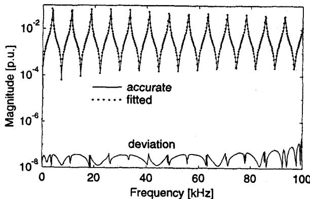  
Fig. 14 Positive sequence admittance (36th order approximation)

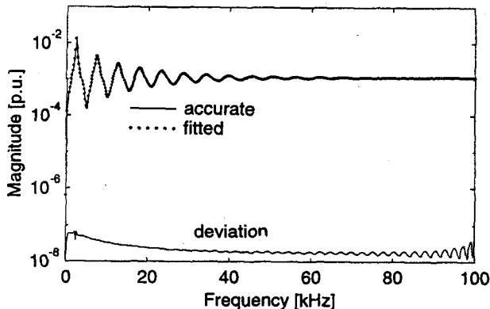  
Fig. 15 Zero sequence admittance (44th order approximation)   
8 DISCUSSION

# Methodology

Although the method of vector fitting is very easy to implement in a computer program, it may at first glance be difficult to see how and why it works so well. To see this we go back to equation (5), which is repeated below for convenience:

$$
\left(\sigma f\right) _ {f i t} - \sigma_ {f i t} f \approx 0 \tag {14}
$$

$f$ is a given rational function with unknown poles $a_{n}$ , while $(\sigma f)_{fit}$ and $\sigma_{fit}$ are unknown rational functions with given poles $\overline{a}_{n}$ . The poles $\overline{a}_{n}$ are specified (starting poles). In order to satisfy (14), $\sigma_{fit}$ must have zeros which equal the poles of $f$ , and poles which equal the zeros of $f$ . Thus, in the product $\sigma_{fit}f$ the original poles $a_{n}$ of $f$ become replaced by the starting poles $\overline{a}_{n}$ . Consequently, both $(\sigma f)_{fit}$ and $\sigma_{fit}f$ get the same poles $\overline{a}_{n}$ , and an accurate solution of (14) exists! After solving (14), the original poles $a_{n}$ of $f$ are calculated as the zeros of $\sigma_{fit}$ .

Of course, accurate solution of (14) requires that the number of starting poles $\overline{a}_n$ equals or exceeds the number of poles $a_n$ . If a too low order is used, the replacement of poles in $f$ will be incomplete, and the solution of (14) will be only an approximation.

# Accuracy

In principle, a perfectly accurate approximation should be obtained for the response of a rational function when a sufficiently high order is used in the fitting process. The results in section 4 for an artificially created response showed that extremely accurate results were achieved, provided that the starting poles were sensibly selected.

Starting poles should in general be complex with weak attenuation, and should cover the frequency range of interest. It was shown that even if starting poles were poorly selected, a very accurate result was still achieved by reusing the new poles as starting poles in an iterative procedure. However, the speed of convergence was reduced if the order of the approximation was reduced, or noise was added to the response.

If the considered response $f(s)$ is rational, then vector fitting will (with a sufficiently high order) give a rational approximation whose frequency response almost perfectly matches the original one. If in addition the poles of the considered frequency response are complex with fairly weak attenuation, then vector fitting is capable of recovering the unknown poles and residues with a very high accuracy (section 4.2). This in not possible if $f(s)$ has dense real poles (section 5) as the solution is ill-defined. Nevertheless, the poles and residues produced by vector fitting will still give a very accurate approximation for the given frequency response.

It was further shown that the accuracy will not be reduced if one tries to use an excessive number of poles.

In section 7 it was shown that vector fitting gave a good approximation for a measured transformer response. Increasing the order of the fitting gave a substantial increase in the accuracy for the phase angle. This accuracy property may be very useful because the passive circuit behavior of an admittance representation could be lost in some frequency interval if the admittance is not well fitted. Vector fitting was also shown to give very good results for the admittance of a highly complex distribution network, and for the open circuit admittance of an overhead line.

# Efficiency

Consider the fitting of a scalar $f(s)$ using $N_{\omega}$ frequency points and $N$ poles. This leads to the following operations:   
1) Calculation of new poles : Solving linear system $Ax = b$ where $A$ has dimension $2N_{\omega} \times (2N + 2)$ .   
2) Calculation of zeros : Calculate eigenvalues of matrix of dimension $N \times N$ .   
3) Calculation of residues : Solving linear system $Ax = b$ , where $A$ has dimension $2N_{\omega} \times (N + 2)$ .

For the example in section 4 we had $N_{\omega} = 100$ , $N = 20$ . Using Matlab running on Windows NT on a Pentium PC, the above problems were solved in 0.04, 0.01 and 0.01 seconds, respectively.

# 9 CONCLUSIONS

The paper has extended the method of vector fitting to applications involving frequency domain responses with resonance peaks. This has been achieved by introduction of complex starting poles. Important features of the improved vector fitting are:

1) The method is very accurate. In the case of an artificially created response with known poles and residues, these parameters were estimated with extreme accuracy. The method was demonstrated to give very accurate results for a measured transformer response and a network equivalent with a large number of resonance peaks.   
2) Sensible selection of starting poles will in many cases obviate the need for iteration. Starting poles should be complex with weak attenuation, distributed over the considered frequency interval. A recommended procedure for the selection of starting poles is given in section 3.2.   
3) The method is very robust. It will not fail if attempting to use a fitting of very high order, or poorly selected starting poles.   
4) The method is very easy to implement in a computer program. It essentially consists of building matrices from simple fractions. The resulting matrix problems are solved using standard software packages.   
5) The method is very efficient. Application involves the solving of two overdetermined linear matrix equations $Ax = b$ of moderate size.   
6) The method permits matrix elements to be fitted simultaneously with identical poles. This permits increased efficiency of the time domain convolutions [5].

# 10 ACKNOWLEDGMENTS

The authors would in particular thank Dr. T. Henriksen (EFI) for suggesting to use the compact formulation (4) instead of using (3) directly. Financial support by EFI and the Natural Sciences and Engineering Research Council of Canada is gratefully acknowledged. The authors thank Mr. H.K. Hoidalen (NTH) and Dr. T. Henriksen (EFI) for providing the frequency responses for the transformer and the complex network equivalent, respectively.

# 11 REFERENCES

[1] A. Semlyen and A. Dabuleanu, "Fast and Accurate Switching Transient Calculations on Transmission Lines With Ground Return Using Recursive Convolutions", IEEE Trans. PAS, vol. 94, March/April 1975, pp. 561-571.   
[2] A.O. Soysal and A. Semlyen, "Practical Transfer Function Estimation and its Application to Transformers", IEEE Trans. PWRD, vol. 8, no. 3, July 1993, pp. 1627-1637.   
[3] J.R. Marti, "Accurate Modelling of Frequency-Dependent Transmission Lines in Electromagnetic Transient Simulations", IEEE Trans. PAS, vol. 101, no. 1, January 1982, pp. 147-157.   
[4] A. Morched, L. Marti and J. Ottevangers, "A High Frequency Transformer Model for the EMTP", IEEE Trans. PWRD, vol. 8, no. 3, July 1993, pp. 1615-1626.   
[5] B. Gustavsen and A. Semlyen, "Simulation of Transmission Line Transients Using Vector Fitting and Modal Decomposition", paper PE-347-PWRD-0-01-1997, presented at the 1997 IEEE/PEs Winter Meeting, New York.   
[6] B. Gustavsen and A. Semlyen, "Combined Phase and Modal Domain Calculation of Transmission Line Transients Based on Vector Fitting", paper PE-346-PWRD-0-01-1997, presented at the 1997 IEEE/PES Winter Meeting, New York.

# 12 APPENDICES

# A-Pole Identification

To simplify notation we will in the following use $a$ instead of $\overline{a}$ for starting poles. Equation (4) can be rewritten as

$$
\left(\sum_ {n = 1} ^ {N} \frac {c _ {n}}{s - a _ {n}} + d + s h\right) - \left(\sum_ {n = 1} ^ {N} \frac {\tilde {c} _ {n}}{s - a _ {n}}\right) \approx f (s) \tag {A.1}
$$

For a given frequency point $s_k$ we get

$$
A _ {k} x = b _ {k} \tag {A.2}
$$

where

$$
A _ {k} = \left[ \begin{array}{l l l l l l l l} 1 & \dots & \frac {1}{s _ {k} - a _ {N}} & 1 & s _ {k} & \frac {- f (s _ {k})}{s _ {k} - a _ {1}} & \dots & \frac {- f (s _ {k})}{s _ {k} - a _ {N}} \end{array} \right] \tag {A.3}
$$

$$
x = \left[ \begin{array}{l l l l l l l} c _ {1} & \dots & c _ {N} & d & h & \widetilde {c} _ {1} & \dots & \widetilde {c} _ {N} \end{array} \right] ^ {\mathrm {T}}, b _ {k} = f (s _ {k}) \tag {A.4}
$$

Note that $A_{k}$ and $\pmb{x}$ are row and column vectors, respectively.

In the case of complex poles, a modification is introduced to ensure that the residues come in perfect conjugate pairs. Assume that the partial fractions $i$ and $i + 1$ constitute a complex pair, i.e.,

$$
a _ {i} = a ^ {\prime} + j a ^ {\prime \prime}, a _ {i + 1} = a ^ {\prime} - j a ^ {\prime \prime}, c _ {i} = c ^ {\prime} + j c ^ {\prime \prime}, c _ {i + 1} = c ^ {\prime} - j c ^ {\prime \prime} (A. 5)
$$

The two corresponding elements $A_{k,i}$ and $A_{k,i+1}$ are modified as follows:

$$
A _ {k, i} = \frac {1}{s _ {k} - a _ {i}} + \frac {1}{s _ {k} - a _ {i} ^ {*}}, A _ {k, i + 1} = \frac {j}{s _ {k} - a _ {i}} - \frac {j}{s _ {k} - a _ {i} ^ {*}} \tag {A.6}
$$

This has the effect that the corresponding residues in the solution vector $x$ become equal to $c'$ and $c''$ , respectively.

Writing (A.2) for several frequency points gives an overdetermined linear matrix equation:

$$
A x = b \tag {A.7}
$$

In the fitting process we use only positive frequencies. In order to preserve the conjugacy property we have to formulate (A.7) in terms of real quantities:

$$
\left[ \begin{array}{l} A ^ {\prime} \\ A ^ {\prime \prime} \end{array} \right] x = \left[ \begin{array}{l} b ^ {\prime} \\ b ^ {\prime \prime} \end{array} \right] \tag {A.8}
$$

# B — Calculation of zeros

After solving (A.8), the zeros are calculated as the eigenvalues of the matrix

$$
H = A - b \tilde {c} ^ {T} \tag {B.1}
$$

where $A$ is a diagonal matrix containing the starting poles and $b$ is a column vector of ones. $\tilde{c}^T$ is a row-vector containing the residues for $\sigma$ . In the case of a complex pair of poles, the corresponding submatrices in (B.1) are modified (via a similarity transformation) as follows:

$$
\hat {A} = \left[ \begin{array}{l l} a ^ {\prime} & a ^ {\prime \prime} \\ - a ^ {\prime \prime} & a ^ {\prime} \end{array} \right], \hat {b} = \left[ \begin{array}{l} 2 \\ 0 \end{array} \right], \hat {c} = \left[ \begin{array}{l l} \tilde {c} ^ {\prime} & \tilde {c} ^ {\prime \prime} \end{array} \right] \tag {B.2}
$$

This modification has the effect that $H$ becomes a real matrix and so its complex eigenvalues come out as perfect complex conjugate pairs.

# 13 BIOGRAPHIES

For authors' biographies, see [5].

# Discussion

N. R. Watson (Department of Electrical & Electronic Engineering, University of Canterbury, Private Bag 4800, Christchurch, New Zealand): The Authors have made a very valuable contribution to rational approximation of frequency responses. Stability of the rational approximation is an important issue. Our experience has been that unstable rational approximation results when a higher order than necessary is used. Would the authors comment on their method of ensuring stability by inverting the sign of the real part of unstable poles, and the effect this has on the accuracy of the fit. How does this compare to simply removing the unstable poles?

Maria Sabrina Sarto (Univ. of Rome "La Sapienza", Rome, Italy). The authors should be commended for their interesting paper, which gives an important contribution to the long-lasting issue concerning the rational approximation of transcendent functions. The vector fitting method proposed by the authors is particularly useful not only in the modeling of power system transients, but in general in the time-domain analysis of electromagnetic problems. It can be also considered as a general approach to compute numerically the inverse Fourier transform of functions describing electromagnetic systems in the frequency domain. In fact, these functions are often characterized by very broad frequency spectra; they can be either smooth functions or can have many resonance peaks, so that the calculation of their discrete inverse Fourier transform can be expensive and inefficient.

For these reasons, some extra-information concerning the practical use of the vector fitting procedure and a few theoretical aspects is requested.

A key point in the iterative procedure seems to be the choice of the starting poles. In particular, it is said that "the computed approximation may depend on the selection of the starting poles". In other words, this means that the iterative procedure described in the paper can stop in local minima. Have the author investigated about this point? Have they experienced the efficiency of a different approach to solve this problem?

An other point concerns the approximation of smooth functions having very broad frequency spectra. It is observed, as it is said in the paper, that such functions, without resonance peaks can be fitted rather accurately with low order approximations, by using real poles preferably. However, if the approximation is required in a wide frequency range and the order of the rational fitting function is increased, high-frequency complex poles appear. Comments of the authors above this point would be greatly appreciated.

The last point that is addressed to the authors is the following. It seems that often the order of the rational fitting is merely related to the desired accuracy of the approximation: the higher is the order of the rational

approximation, the higher is the accuracy. It would be useful if the authors can give any guideline concerning the maximum number of poles to consider in the fitting and the best choice of the number of the exact function samples to use in the iterative procedure.

Finally, the authors are asked to provide more specific information about the formulation of the method for vectors.

Manuscript received April 9, 1998.

Bjørn Gustavsen and Adam Semlyen: We wish to thank Drs. Watson and Sarto for their valuable comments and useful contributions. We offer the following clarifications.

# In reply to Dr. Watson:

In Vector Fitting, unstable poles may occur incidentally during the first iteration(s) because the new set of poles is generally very different from the previous one. The unstable poles vanish as the method converges. Thus, if unstable poles were to be deleted in each iteration, the order of the fitting could become lower than intended. This problem can be overcome in at least two different ways:

1) In each iteration, flip unstable poles into the left half plane (used in this paper)   
2) Accept unstable poles in the iterations. Then make a final iteration in which any unstable poles are deleted.

The two procedures work equally well, and our implementation of Vector Fitting allows both. In the normal situation (where the final result does not contain unstable poles) the two approaches will arrive at practically the same result.

Unstable poles in the final result may indeed occur when using a very high order fitting. Regarding the accuracy, we find there is little difference between the two approaches. We have previously used the pole deleting technique in [5].

# In reply to Dr. Sarto:

# Choice of starting poles

It is correct that the computed approximation may depend on the selected starting poles. However, this is of concern only for functions with resonance peaks when we use a too low order. For instance, if there are $n$ dominant resonance peaks in the considered frequency interval, then at least $2n$ poles should be used for the approximation. If we use a lower order, it will not be possible to fit all of the peaks. In such situations we have found that the choice of starting poles may have an influence on which of the resonance peaks will be fitted. In practice this will not be a problem as one will require a reasonably good approximation and thus a sufficiently high order.

The main reason why we talk about the selection of starting poles is that a good choice reduces the number of iterations that are needed for the method to converge. At some time we tried to scan the frequency response, followed by an assignment of starting poles to each resonance peak. In addition, a few extra poles were distributed over the considered frequency range. This procedure gave a very fast convergence. However, we found that by simply distributing the poles as described in this paper, we achieved an acceptable speed of convergence. We chose the latter method for its simplicity.

# Smooth functions with broad frequency spectrum

Even though real poles are eminently suited for the fitting of smooth functions, they are sometimes complemented with complex poles having strong attenuation. We often encounter such poles when fitting modal propagation functions for transmission lines. The complex poles then occur at high frequencies near the "toe portion" of the response. It appears that the complex poles are more suited than real poles in producing the strong attenuation required at high frequencies.

# Application to vectors

The paper shows the formulation of Vector Fitting for scalar

functions. However, Vector Fitting can also be applied directly to vector functions, with the assumption that all elements in the vector have identical poles. The vector formulation is shown below for the case that the vector consists of two elements. (The generalization to vectors with more elements is straightforward.)

$$
\underline {{f}} = \left[ \begin{array}{l} f _ {1} \\ f _ {2} \end{array} \right] \tag {15}
$$

Using the same starting poles for both vector elements, and a common scaling function $\sigma$ , equation (A.1) now becomes:

$$
\left[ \begin{array}{l} \sum_ {n = 1} ^ {N} \frac {c ^ {1} _ {n}}{s - a _ {n}} \\ \sum_ {n = 1} ^ {N} \frac {c ^ {2} _ {n}}{s - a _ {n}} \end{array} \right] - \left[ \begin{array}{l} f _ {1} \sum_ {n = 1} ^ {N} \frac {\tilde {c} _ {n}}{s - a _ {n}} \\ f _ {2} \sum_ {n = 1} ^ {N} \frac {\tilde {c} _ {n}}{s - a _ {n}} \end{array} \right] = \left[ \begin{array}{l} f _ {1} \\ f _ {2} \end{array} \right] \tag {16}
$$

where superscripts 1 and 2 for the residues refer to element 1 and 2, respectively. (The $d$ and $h$ terms in (A.1) have been neglected for simplicity.)

For a given frequency point $s_k$ we get:

$$
A _ {k} x = b _ {k} \tag {17}
$$

where

$$
A _ {k} = \left[ \begin{array}{c c c} \frac {1}{s _ {k} - a _ {1}} \dots \frac {1}{s _ {k} - a _ {N}} & 0 & \frac {- f _ {1} \left(s _ {k}\right)}{s _ {k} - a _ {1}} \dots \frac {- f _ {1} \left(s _ {k}\right)}{s _ {k} - a _ {N}} \\ 0 & \frac {1}{s _ {k} - a _ {1}} \dots \frac {1}{s _ {k} - a _ {N}} & \frac {- f _ {2} \left(s _ {k}\right)}{s _ {k} - a _ {1}} \dots \frac {- f _ {2} \left(s _ {k}\right)}{s _ {k} - a _ {N}} \end{array} \right] \tag {18}
$$

$$
b _ {k} = \left[ \begin{array}{l} f _ {1} \left(s _ {k}\right) \\ f _ {2} \left(s _ {k}\right) \end{array} \right] \tag {19}
$$

$$
x = \left[ c ^ {1} _ {1} \dots c ^ {1} _ {N} c ^ {2} _ {1} \dots c ^ {2} _ {N} \widetilde {c} _ {1} \dots \widetilde {c} _ {N} \right] \tag {20}
$$

After solving the resulting system of equations, the new poles are calculated as the zeros of

$$
\sigma = \sum_ {n = 1} ^ {N} \frac {\widetilde {c} _ {n}}{s - a _ {n}} + 1 \tag {21}
$$

Finally, the elements of the original function (15) are fitted independently using the new poles as known quantities.

Thus, application of Vector Fitting to a vector function results in that all elements in the vector get identical poles. For matrix problems, where the elements in each matrix column are multiplied with the same input, usage of identical poles will for a given order lead to a twofold increase in efficiency of the time domain convolutions (see closure to [5]).

As an example we consider the 8 conductor overhead line system shown in figure 16. The line length is $35\mathrm{km}$ . Figure 17 shows a $10^{\mathrm{th}}$ order approximation of the elements of the first column of the propagation matrix $H$ , and the magnitude of the complex deviation.

An alternative approach is to fit the elements in the column independently (element-by-element). In order to achieve the same efficiency of the time domain convolutions it would then be necessary to use only half the order as in columnwise fitting. Table 9 compares the root-mean-square (RMS) error of the two approaches. It is seen that for a given efficiency, columnwise fitting gives higher accuracy, particularly when the order is high.

Table 9 Comparison of fitting approaches   

<table><tr><td colspan="2">Element-by-element</td><td colspan="2">Columnwise</td><td rowspan="2">RMS2 / RMS1</td></tr><tr><td>Order</td><td>RMS1</td><td>Order</td><td>RMS2</td></tr><tr><td>2</td><td>1.75E-2</td><td>4</td><td>6.22E-3</td><td>0.35</td></tr><tr><td>4</td><td>2.56E-3</td><td>8</td><td>3.34E-4</td><td>0.13</td></tr><tr><td>8</td><td>1.15E-4</td><td>16</td><td>9.90E-6</td><td>0.08</td></tr><tr><td>16</td><td>1.79E-6</td><td>32</td><td>1.03E-8</td><td>0.005</td></tr></table>

Selection of approximation order and frequency samples

The samples should be chosen so densely that the frequency response is fully resolved. In addition, one should always use at least as many frequency samples as there are poles, in order to get an overdetermined problem. Otherwise, spurious poles may arise which leads to highly inaccurate behaviour between frequency samples.

Sometimes one may want to achieve high accuracy at certain frequency points or frequency intervals. This can easily be achieved by weighting the rows of the least squares problem $(A_{k}$ and $b_{k}$ in (18) and (19)). For instance, in figure 17 one may consider to increase the accuracy at low frequencies at the expense of the accuracy at high frequencies. Figure 18 shows the same result as in figure 17, when the rows have been multiplied with the inverse of the magnitude of one of the off-diagonal elements.

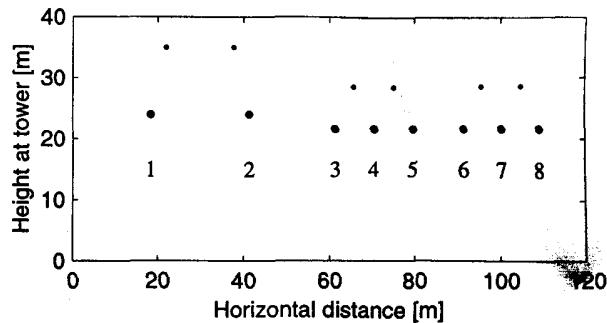  
Fig. 16 $500\mathrm{kV}$ DC line in parallel with two $300\mathrm{kV}$ lines.

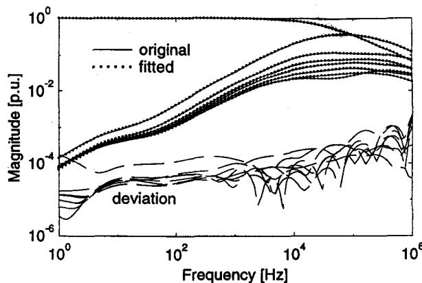  
Fig. 17 First column of $H$ fitted using 10 poles. $(\rho_{\text{soil}} = 100\Omega \mathrm{m})$

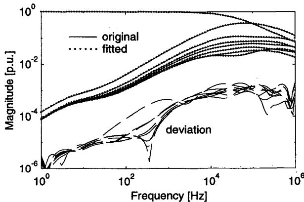  
Fig. 18 Effect of weighting