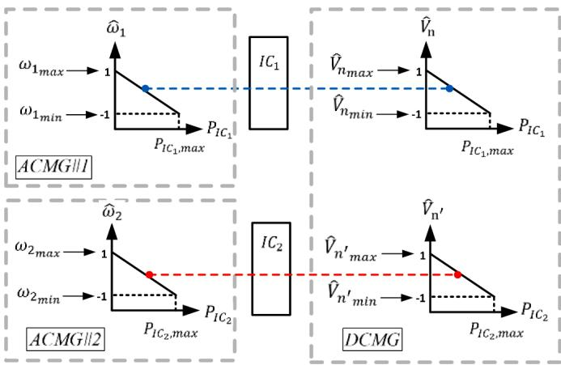
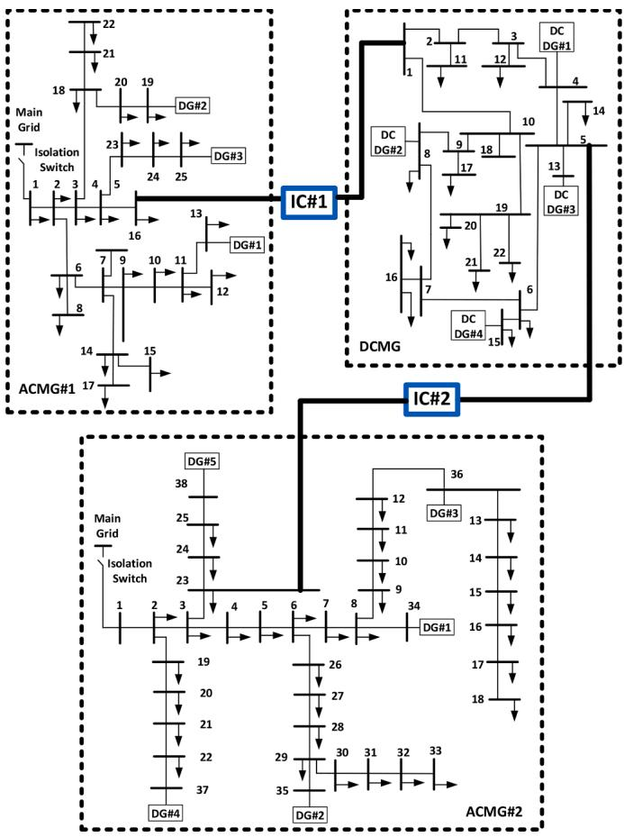
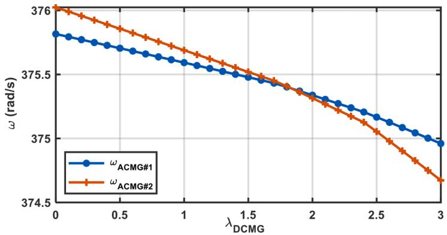
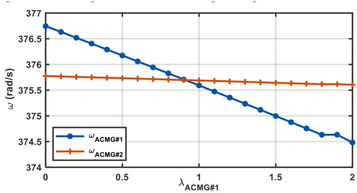
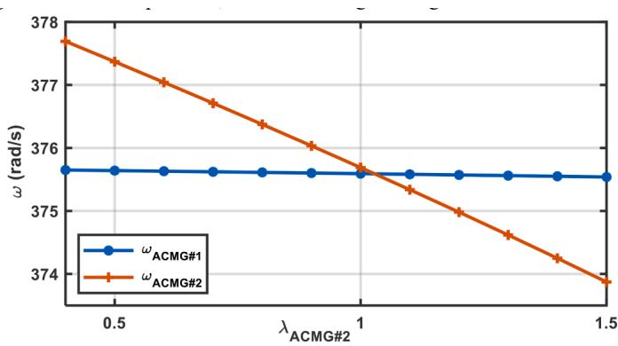
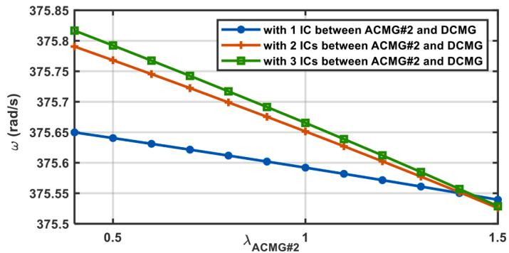

# Unified MANA-based load-flow for multi-frequency hybrid AC/DC multi-microgrids

Nasim Rashidirad a,* , Jean Mahseredjian b , Ilhan Kocar c , U. Karaagac c

a Hydro-Quebec/IREQ, Varennes, QC, Canada   
b Polytechnique Montr´eal, Montr´eal, H3T 1J4, QC Canada   
c Hong Kong Polytechnic University, Hong Kong

# A R T I C L E I N F O

# Keywords:

Coordinated droop controller

Load-flow

MANA formulation

Multi-frequency

Multi-microgrid

# A B S T R A C T

In islanded hybrid AC/DC multi-microgrids (MMGs), interconnected AC microgrids (ACMGs) can operate with their own frequency and power sharing strategy. Hence, to formulate the load-flow problem of multi-frequency islanded MMGs, conventional single-frequency load-flow approaches are not applicable. To this aim, in this paper a novel unified load-flow framework for AC/DC hybrid MMGs, is proposed. The principles of the proposed method are based on the modified augmented nodal analysis (MANA) formulation, which can be utilized for an arbitrary number of interconnected multiphase MGs. Then, an unbalanced MMG, which includes two ACMGs, one DC MG (DCMG), and two interlink converters (ICs), is used to verify the validity of the proposed MANAbased formulation.

# 1. Introduction

DIRECT integration of renewables, due to their intermittent nature, can raise several problems in reliability, power quality and energy efficiency of power grids. MGs can be considered as a solution [1,2]. The most basic duty of MGs is to maintain the economic balance of supply and demand by energy management systems. However, due to the uncertainties in supply and demand sides, the balancing task becomes challenging [3]. An interesting solution is based on the integration of MGs to create multi-microgrid (MMGs), which can address the uncertainties, optimize power sharing, and improve system resiliency [3–5]. In fact, MMGs, due to their high number of MGs, are able to satisfy their power demand by their own distributed generators (DGs) [5]. They are also able to exhibit high self-healing features, in presence of faults or outages [6]. To best integrate multiple MGs, understanding the benefits, needs, and challenges of networking the MGs is an important topic of research and development [7,8].

Load-flow solutions are used to find the steady-state conditions of MMGs for design, control, and operation needs. It is possible to find fundamental frequency and harmonic steady-state solutions. The fundamental frequency load-flow solution using frequency domain equations is a fast approach for establishing the initial network conditions with various constraints related to conventional generators and

converters. The aim of this paper is on fundamental frequency load-flow solutions of MMGs, that are essential for the initialization [9] of the simulation of electromagnetic transients. Once the fast load-flow solution is found, the operational conditions are established, and it can be used to start the time-domain simulations and support various other initialization methods (see [10] and its references, and [11]) for converters, controls and nonlinearities, to force the fastest establishment of full harmonic steady-state conditions.

The currently existing load-flow studies of MMGs can be divided into two groups. The first group is for MGs connected to the main grid as a cluster [12], in which there is not any challenge in the load-flow solution. The second group is for AC/DC hybrid MGs (HMGs) [13], in which there is only one islanded AC subgrid, and hence only one frequency is considered as a load-flow variable. In the case of MMGs, each islanded AC MG, can have its own frequency and power sharing strategy, and depending on the operation modes of interlinking converters ICs, there is coupling among their load-flow variables. Hence, proposing MMG load-flow solutions, which can model multiple interconnected islanded MGs, is an important contribution. For HMGs, there are two approaches for load-flow solutions: sequential and unified. For the sequential approaches [14], the load-flow solutions of all HMG subsystems, including ICs, AC and DC subgrids are found separately, and then additional loops are utilized to achieve convergence. Hence, their implementation is

complicated for MMGs, which have a high number of subsystems. While in unified approaches [15], the entire system is modeled and solved simultaneously. Hence, the system formulation is of great importance to decrease computational complexity. To the best of our knowledge, so $\mathbf { f a r } ,$ for interconnected islanded MMGs, no specific load-flow solution has been proposed in the literature. To fill this research gap, in this paper, a unified multiphase load-flow solution, which is based on modified augmented nodal analysis (MANA) formulation [16–19] is presented for multi-frequency islanded MMGs. MANA modeling is component-based, and each component has its own variables and constraints. Hence, it is conceptually much simpler to assemble MANA equations as compared to traditional mismatch equations. Moreover, MANA formulation can directly account for circuit-based models such as switches and transformers, which is another significant advantage.

It can in fact easily include arbitrary and complex models of lines/ cables, rotating machines and else. It can be directly used for the initialization of transients [9,18]. The principles of MANA-based load-flow solutions of islanded MGs, have been presented in [19]. These principles are based on adding frequency as a new load-flow variable, and adding new droop-controlled constraints of grid-forming DGs to the MANA-based Jacobian matrix. However, in [19], only one MG has been considered, and networking the MGs to create MMGs, has not been considered. In MMGs case, there is a network of AC and DC MGs, which are interconnected through ICs. Hence, each AC MG would have its own frequency considered as a load-flow variable. However, due to the presence of ICs, load-flow variables of MGs, would not be independent, and need to be solved as a unified load-flow problem. This increased complexity adds new challenges. The focus of this paper is on MANA-based load-flow solution of MMGs and demonstration of new capabilities. The paper also contributes a new MMG test system.

The proposed unified MANA-based load-flow solution of MMGs in this paper, can model multiple interconnected islanded MGs. It is multiphase and can be utilized for unbalanced MMGs. It can be used directly for the initialization of transients. It contributes an algorithm with reduced number of iterations. It is shown that due to the presence of $\operatorname { I C } s ,$ there is coupling among load-flow variables of the directly and even indirectly connected MGs. It is shown that the number of ICs, can affect coupling among load-flow variables of different MGs.

This paper is organized as follows. Section 2 presents the proposed formulation and explains how to create the MMG Jacobian matrix with its sub-Jacobians. Operation modes of ICs and DGs are discussed in Section 3. Numerical results and comparisons are presented in Section 4.

# 2. Proposed formulation

The proposed MANA formulation of MMGs, is presented as:

$$
J _ {M M G} \Delta X _ {M M G} = - f _ {M M G} \tag {1}
$$

where $J _ { M M G }$ is the Jacobian matrix of MMG, $\Delta X _ { M M G }$ includes all loadflow variables of MMGs, and f is the vector of MANA functions (to be minimized) for MMG. Each MMG is divided into three types of subsystems: ACMGs, DCMGs, and the ICs, and each of them has its own load-flow variables and mismatch equations. Hence, (1) can be expanded as:

$$
\left[ \begin{array}{c c c} J _ {A C M G} & 0 & J _ {A C M G - I C} \\ 0 & J _ {D C M G} & J _ {D C M G - I C} \\ J _ {I C - A C M G} & J _ {I C - D C M G} & J _ {I C} \end{array} \right] \left[ \begin{array}{l} \Delta X _ {A C M G} \\ \Delta X _ {D C M G} \\ \Delta X _ {I C} \end{array} \right] = \left[ \begin{array}{l} f _ {A C M G} \\ f _ {D C M G} \\ f _ {I C} \end{array} \right] \tag {2}
$$

where $\Delta X _ { A C M G } ,$ , $\Delta X _ { D C M G }$ and $\Delta X _ { I C }$ include load-flow variables for $\mathbf { A C M G s } ,$ DCMGs and $\operatorname { I C } s ,$ respectively. fACMG, fDCMG, and $f _ { I C }$ represent the minimized functions of ACMGs, DCMGs and $\operatorname { I C } s ,$ respectively. As seen in $( 2 ) , J _ { M M G }$ is composed of several block-diagonal sub-Jacobians: $J _ { A C M G } ,$ , JDCMG and $J _ { I C } ,$ . These are the Jacobians of assembled subsystems. The JACMG− IC, JDCMG− IC, $J _ { I C - A C M G }$ and $J _ { I C - D C M G }$ , are non-diagonal sub-Jacobians, which represent Jacobian terms of one subsystem, with respect to

another subsystem.

# 2.1. ACMG formulation

Each ACMG has its own MANA-based nodal and component constraints $\left[ 1 6 \mathrm { - } 1 9 \right]$ . For ACMG nodal constraints, the AC-side currents of ICs need to be considered. Hence, the corresponding Jacobian terms are included in $J _ { A C M G }$ and JACMG− $^ { - I C , }$ which respectively represent derivative terms of AC constraints, with respect to $\Delta X _ { A C M G }$ and $\Delta X _ { I C } .$ The ACMG variables are defined as:

$$
\Delta X _ {A C M G _ {i}} = \left[ \begin{array}{l} \Delta V _ {n _ {i}} \\ \Delta I _ {L _ {i}} \\ \Delta I _ {G _ {i}} \\ \Delta E _ {G _ {i}} \\ \Delta \omega_ {i} \end{array} \right] \tag {3}
$$

where for ACMGi, ΔVn , $\Delta I _ { L _ { i } }$ , $\Delta I _ { G _ { i } } ,$ $\Delta E _ { G _ { i } }$ and $\Delta \omega _ { i }$ are AC nodal voltages, currents of AC loads, currents of AC generators, internal voltages of AC generators and frequency, respectively. It is noted that each islanded ACMG, has its own frequency variable. Hence, MMGs with multiple islanded ACMGs are supposed to be considered as multi-frequency power systems. The Jacobian matrix $J _ { A C M G _ { i } }$ for block i is given by:

$$
J _ {A C M G _ {i}} = \left[ \begin{array}{c c c c c} Y _ {n _ {i}} & A _ {I L _ {i}} & A _ {I G _ {i}} & 0 & 0 \\ C _ {L _ {i}} & D _ {L _ {i}} & 0 & 0 & A _ {L \omega_ {i}} \\ C _ {G _ {i}} & 0 & D _ {G _ {i}} & 0 & A _ {G \omega_ {i}} \\ Y _ {G _ {i}} & 0 & B _ {G _ {i}} & Y _ {G E _ {i}} & 0 \end{array} \right] \tag {4}
$$

where, the first-row elements represent the AC nodal constraints. Assuming exponential and frequency dependent load models, their nonlinear power constraints are included in the second row of $J _ { A C M G _ { i } }$ . Constraints of different operation modes of generators are included in the third row of $J _ { A C M G _ { i } }$ . Internal-voltage constraints of AC generators are included in the fourth row. The above coefficient sub-matrices are selfexplanatory (see also [16–19]) and include nodal equations with nodal admittance matrix $Y _ { n _ { i } }$ interconnected to load $( A _ { I L _ { i } } )$ and generator currents $\left( A _ { I G _ { i } } \right)$ . The remaining coefficient sub-matrices present the constraints related to loads and generators.

# 2.2. DCMG formulation

As above, each DCMG has its own MANA-based nodal and component constraints. For DCMG nodal constraints, the DC-side currents of ICs need to be considered. Hence, their corresponding Jacobian terms are included in $J _ { D C M G }$ and $J _ { D C M G - I C _ { \it \mathrm { ~  ~ } } }$ , which respectively represent derivative terms of DC constraints, with respect to $\Delta X _ { D C M G }$ and $\Delta X _ { I C } .$ . The DCMG variables are:

$$
\Delta X _ {D C M G _ {j}} = \left[ \begin{array}{l} \Delta V _ {n _ {j}} \\ \Delta I _ {L _ {j}} \\ \Delta I _ {G _ {j}} \\ \Delta E _ {G _ {j}} \end{array} \right] \tag {5}
$$

where for $\mathrm { D C M G } _ { j } ,$ , $\Delta V _ { n _ { j } }$ , $\Delta I _ { L _ { j } } ,$ , $\Delta I _ { G _ { j } }$ and $\Delta E _ { G _ { j } }$ are DC nodal voltages, currents of DC loads, currents of DC converters, and internal voltages of DC converters, respectively. The sub-Jacobian $J _ { D C M G _ { j } }$ represents the derivative terms of DCMG constraints. Hence, for block j:

$$
J _ {D C M G _ {j}} = \left[ \begin{array}{c c c c} Y _ {n, d c _ {j}} & A _ {I L, d c _ {j}} & A _ {I G, d c _ {j}} & 0 \\ C _ {L, d c _ {j}} & D _ {L, d c _ {j}} & 0 & 0 \\ C _ {G, d c _ {j}} & 0 & D _ {G, d c _ {j}} & 0 \\ Y _ {G, d c _ {j}} & 0 & B _ {G, d c _ {j}} & Y _ {G E, d c _ {j}} \end{array} \right] \tag {6}
$$

where, the first-row elements, represent DC nodal constraints. Assuming exponential load models, their nonlinear power constraints are included in the second row of $J _ { D C M G _ { i } }$ . The constraints of different operation modes of DC converters are included in the third row of $J _ { D C M G _ { j } }$ . Internal-voltage constraints of DC converters are included in the fourth row. The coef-

ficient submatrices of (6) are self-explanatory (see also [16]).

# 2.3. IC formulation

ICs, due to their AC-side and DC-side currents, play a role in both nodal constraints of ACMGs and DCMGs, which are interconnected through them. Hence, their corresponding Jacobian terms are included in J − and J − . The remaining of IC constraints, depending on IC operation modes, are affected by their own variables and the variables of their neighboring ACMG and DCMG. The IC variables are presented as:

$$
\Delta X _ {I C _ {k}} = \left[ \begin{array}{l} \Delta I _ {I C _ {k}} \\ \Delta E _ {I C _ {k}} \\ \Delta I _ {I C, d c _ {k}} \\ \Delta E _ {I C, d c _ {k}} \end{array} \right] \tag {7}
$$

where for $\mathrm { I C } _ { k } , \Delta I _ { I C _ { k } }$ and $\Delta E _ { I C _ { k } }$ are AC-side currents and internal-voltages, and $\Delta I _ { I C , d c _ { k } }$ and $\Delta E _ { I C , d c _ { k } }$ are DC-side currents and internal-voltages.

The $J _ { I C _ { k } }$ for block k is given by:

$$
J _ {I C _ {k}} = \left[ \begin{array}{c c c c} D _ {I C _ {k}} & 0 & D _ {I C, d c _ {k}} & 0 \\ B _ {I C _ {k}} & Y _ {I C _ {k}} & 0 & 0 \\ 0 & 0 & B _ {I C, d c _ {k}} & G _ {I C _ {k}} \end{array} \right] \tag {8}
$$

where, the first-row elements, including $D _ { I C _ { k } }$ and $D _ { I C , d c _ { k } }$ represent derivation of constraints with respect to $\Delta I _ { I C _ { k } }$ and $\Delta I _ { I C , d c _ { k } } ,$ , respectively. Second row elements, including $B _ { I C _ { k } }$ and $Y _ { I C _ { k } }$ are the derivations of $_ \mathrm { A C } .$ - side internal-voltage constraints, with respect to $\Delta I _ { I C _ { k } }$ and $\Delta E _ { I C _ { k } }$ , respectively, and the third row elements, including $B _ { I C , d c _ { k } }$ and $G _ { I C _ { k } }$ are the derivations of DC-side internal-voltage constraints, with respect to $\Delta I _ { I C , d c _ { k } }$ and $\Delta E _ { I C , d c _ { k } }$ , respectively.

# 2.4. JACMG− IC sub-Jacobian

This sub-Jacobian represents derivative terms of ACMG constraints, with respect to IC variables. It is presented as follows:

$$
J _ {A C M G _ {i} - I C _ {k}} = \left[ \begin{array}{c c c c} A _ {I C _ {i, k}} & 0 & 0 & 0 \\ 0 & 0 & 0 & 0 \\ 0 & 0 & 0 & 0 \\ 0 & 0 & 0 & 0 \end{array} \right] \tag {9}
$$

where, there is only one non-zero sub-matrix $A _ { I C _ { i , k } }$ , which represents the role of AC-side currents of $\mathrm { I C } _ { k } \left( \Delta I _ { I C _ { k } } \right)$ in ACMG nodal constraints. The remaining rows are zero since the rest of IC variables do not play any role in ACMG constraints.

# 2.5. JDCMG− IC sub-Jacobian

This sub-Jacobian represents derivative terms of DCMG constraints, with respect to IC variables. Hence, the related block of each interconnected DCMG and $\mathrm { I C } _ { k } ,$ is represented by:

$$
J _ {D C M G _ {j} - I C _ {k}} = \left[ \begin{array}{c c c c} 0 & 0 & A _ {I C, d c _ {j, k}} & 0 \\ 0 & 0 & 0 & 0 \\ 0 & 0 & 0 & 0 \end{array} \right] \tag {10}
$$

where, there is only one non-zero element $A _ { I C , d c _ { j , k } } .$ , which represents the role of DC-side currents of $\mathrm { I C } _ { k } \left( \Delta I _ { I C , d c _ { k } } \right)$ ) in DCMGj nodal constraints. As seen, the rest of rows are zero since the rest of IC variables do not play any role in DCMG constraints.

# 2.6. JIC− ACMG sub-Jacobian

This sub-Jacobian represents derivative terms of IC constraints, with respect to ACMG variables. Hence, the related block of each interconnected $\mathrm { I C } _ { k }$ and $\mathrm { A C M G } _ { i } ,$ is represented by:

$$
J _ {I C _ {k} - A C M G _ {i}} = \left[ \begin{array}{c c c c c} C _ {I C _ {k, i}} & 0 & 0 & 0 & A _ {I C \omega_ {k, i}} \\ Y _ {I C _ {k, i}} & 0 & 0 & 0 & 0 \\ 0 & 0 & 0 & 0 & 0 \end{array} \right] \tag {11}
$$

where, the first-row elements, including $C _ { I C _ { k , i } }$ and $A _ { I C \omega _ { k , i } }$ represent derivation of constraints of different operations modes of $\mathrm { I C } _ { k } ,$ , with respect to $\Delta V _ { n _ { i } }$ and $\Delta \omega _ { i } ,$ and the second-row element $Y _ { I C _ { k , } }$ represents derivation of AC-side internal-voltage constraint of ICs with respect to $\Delta V _ { n _ { i } }$ . As seen, the third row has no non-zero elements, since there is no dependency among DC-side constraints of ICs and ACMGs variables.

# 2.7. JIC− DCMG sub-Jacobian

This sub-Jacobian represents derivative terms of IC constraints, with respect to DCMG variables. Hence, the related block of each interconnected $\mathrm { I C } _ { k }$ and $\mathrm { D C M G } _ { j } ,$ is represented by:

$$
J _ {I C _ {k} - D C M G _ {j}} = \left[ \begin{array}{c c c c} C _ {I C, d c _ {k, j}} & 0 & 0 & 0 \\ 0 & 0 & 0 & 0 \\ G _ {I C, d c _ {k, j}} & 0 & 0 & 0 \end{array} \right] \tag {12}
$$

where, the first-row element, $C _ { I C , d c _ { k , j } }$ represents derivation of constraints of $\mathrm { I C } _ { k }$ operations modes, with respect to $\Delta V _ { n _ { j } }$ , and the third-row element, $G _ { I C , d c _ { k , j } } ,$ represents derivation of DC-side internal-voltage constraint of ICs with respect to $\Delta V _ { n _ { j } }$ . As seen, the second row has no non-zero elements, since there is no dependency among AC-side constraints of IC and DCMG variables.

# 3. Operation modes of ICs and generators

Multi-frequency behavior of ${ \bf M G } { \bf s } ,$ is due to the islanded operation modes of ACMGs. However, operation modes of $\operatorname { I C } s ,$ , can also affect the coupling among MGs variables. Hence, in this paper, for the sake of simplicity, the focus is only on coordinated droop control [20] of ICs. This mode is only responsible for exchanging the active power, which is a function of frequency and DC voltage of respectively AC and DC MGs. To make comparisons between frequency and DC voltages, which have different scales, they need to be equalized using their normalized values. To this aim, both frequency and DC voltages are mapped to a common per-unit range. Then, to have an equalized power sharing between MGs, the difference between the normalized frequency of $\mathbf { A C M G } _ { i } \left( \widehat { \omega } _ { i } \right)$ and DC voltages of DCMGj $( \widehat { V } _ { n _ { j } } )$ , known as $\Delta e _ { i , j } = \widehat { \omega } _ { i } - \widehat { V } _ { n _ { j } } ,$ is fed to a PI controller, which minimizes this difference. Fig. 1 shows the coordinated droop controller of ICs in a MMG, including two ACMGs and one DCMG, in which n and n′ are respectively DC buses which are interconnected to $\mathbf { A C M G } _ { 1 }$ and $\begin{array} { r } { \mathsf { A C M G } _ { 2 } , } \end{array}$ through $\mathrm { I C } _ { 1 }$ and $\mathrm { I C _ { 2 } } .$ . As seen, each

  
Fig. 1. Illustration of coordinated droop controller of ICs in an MMG including two ACMGs and one DCMG.

ACMG has its own frequency, which is tuned through the coordinated controller of the corresponding ICs. Hence, each IC is responsible for coordinated load-flow management of its interconnected ACMG and DCMG, and for $\mathrm { I C } _ { k }$ which interconnects $\mathbf { A C M G } _ { i }$ and $\mathrm { D C M G } _ { j } ,$ , we have:

$$
P _ {I C _ {k}} = k _ {\text {a c d c - d r o o p}} \left(\widehat {\omega} _ {i} - \widehat {V} _ {n _ {j}}\right) \tag {13}
$$

where, $P _ { I C _ { k } }$ , for a given $\mathrm { I C } _ { k } ,$ is the injected active power from AC-side to the DC-side, and $k _ { a c d c - d r o o p }$ is the droop coefficient of the coordinated controller. It is noted that this figure can easily be extended to an arbitrary number of MGs.

In this paper, AC and DC generators are all assumed to be in their droop-controlled modes. However, PV and PQ operation modes can also be included in component constraints of MGs. For AC generators of $\mathbf { A C M G } _ { i } , P$ − ω and Q − V functions, are presented as:

$$
P _ {G} ^ {+} - P _ {0} = \alpha_ {d r p} \left(\omega_ {0} - \omega_ {i}\right) \tag {14}
$$

$$
Q _ {G} ^ {+} - Q _ {0} = \beta_ {d r p} (| V _ {0} | - | V _ {G} ^ {+} |) \tag {15}
$$

where, $P { { \cal { G } } } ^ { + }$ and ${ Q _ { G } } ^ { + }$ are respectively positive-sequence active and reactive powers of generators, $P _ { 0 }$ and $Q _ { 0 }$ are active and reactive power set points, which are normally set to zero $[ 2 1 , 2 2 ] , \alpha _ { d p }$ and $\beta _ { d r p }$ are active and reactive power coefficients of the droop controller, ω0 and $V _ { 0 }$ are no-load frequency and voltage of droop-controlled generators, which are the nominal frequency and voltage of the ACMGi [23,24], and ωi and ${ V _ { G } } ^ { + }$ are also system frequency and output positive-sequence voltage of generator of ACMGi.

For DC generators, there are two linear V − I or nonlinear $V ~ { - } P$ droop functions:

$$
V _ {C d r p} = V _ {0, d c} - \gamma_ {C d r p} ^ {- 1} I _ {G, d c}, \tag {16}
$$

$$
V _ {P d r p} = V _ {0, d c} - \gamma_ {P d r p} ^ {- 1} P _ {G, d c}, \tag {17}
$$

where, $V _ { C d r p }$ and $V _ { P d r p }$ are output voltages of droop-controlled generators, for respectively current and power DC droop functions, $V _ { 0 , d c }$ is the no-load voltage, which is considered as nominal voltage of the DCMG, $\gamma _ { C d r p }$ and $\gamma _ { P d r p }$ are coefficients of respectively current and power droop functions, and $I _ { G , d c }$ and $P _ { G , d c }$ are output current and power of droopcontrolled generators [25], respectively. In this paper, for DCMG, the focus is on nonlinear V − P droop function.

# 4. Results and discussions

In this section, the load-flow results of the proposed MANA formulation, are presented for the MMG shown in Fig. 2. This MMG includes:

1. ACMG#1: an unbalanced 25-bus ACMG [26,27];   
2. DCMG: a 22-bus DCMG [13,28];   
3. ACMG#2: an unbalanced 38-bus ACMG [26,29].

ACMG#1 is a 4.16 kV MG, with three droop-controlled DGs located on buses 13, 19 and 25. DCMG is a 7.5 kV MG, with four droopcontrolled DC generators, located on buses 4, 8, 13 and 15. ACMG#2 is a 12.66 kV MG, with five droop-controlled DGs, located on buses 34, 35, 36, 37 and 38. There are also two ICs: IC#1 which interconnects bus 5 of the ACMG#1 to bus 1 of the DCMG, and IC#2 which interconnects bus 23 of ACMG#2 to bus 5 of DCMG. Both ICs are also assumed to operate in their coordinated droop-controlled mode. Details of droop coefficients and ratings of generators of ACMG#1, DCMG and ACMG#2, and the ICs are summarized in Tables 1-4. With the proposed MANAbased solution, the load-flow problem converges in only 5 iterations.

To validate the proposed load-flow formulation, its results are verified with the AC/DC hybrid formulation of Newton-Raphson, with traditional mismatch equations $[ 1 5 , 1 9 ]$ . To this aim, the MMG needs to

  
Fig. 2. The MMG test system, including ACMG#1, ACMG#2, and DCMG, and ICs#1 and 2.

Table 1 Droop data of ACMG#1.   

<table><tr><td></td><td>Smax(MVA)</td><td>Qmax(MVAr)</td><td>αdrp(W/(rad.s-1))</td><td>βdrp(var/V)</td></tr><tr><td>DG#1</td><td>4.0</td><td>2.4</td><td>1.06 × 10^6</td><td>2.88 × 10^4</td></tr><tr><td>DG#2</td><td>2.0</td><td>1.2</td><td>5.30 × 10^5</td><td>1.44 × 10^4</td></tr><tr><td>DG#3</td><td>4.0</td><td>2.4</td><td>1.06 × 10^6</td><td>2.88 × 10^4</td></tr></table>

Table 2 Droop data of ACMG#2.   

<table><tr><td></td><td>Smax(MVA)</td><td>Qmax(MVAr)</td><td>αdrp(W/(rad.s-1))</td><td>βdrp(var/V)</td></tr><tr><td>DG#1</td><td>3.0</td><td>1.8</td><td>7.96 × 105</td><td>7.11 × 103</td></tr><tr><td>DG#2</td><td>1.5</td><td>0.9</td><td>3.98 × 105</td><td>3.55 × 103</td></tr><tr><td>DG#3</td><td>0.5</td><td>0.3</td><td>1.33 × 105</td><td>1.18 × 103</td></tr><tr><td>DG#4</td><td>1.0</td><td>0.6</td><td>2.65 × 105</td><td>2.37 × 103</td></tr><tr><td>DG#5</td><td>0.5</td><td>0.3</td><td>1.33 × 105</td><td>1.18 × 103</td></tr></table>

Table 3 Droop data of DCMG.   

<table><tr><td></td><td>DC DG#1</td><td>DC DG#2</td><td>DC DG#3</td><td>DC DG#4</td></tr><tr><td>Pmax(MVA)</td><td>0.50</td><td>1.00</td><td>0.50</td><td>1.00</td></tr><tr><td>γPdp(W/V)</td><td>3.33 × 103</td><td>6.66 × 103</td><td>3.33 × 103</td><td>6.66 × 103</td></tr></table>

be simplified in two steps:

- For the first step, ACMG#1, and IC#1, seen from bus#1 of DCMG, depending on their power direction, are modeled as constant power

Table 4 Droop data of the ICs.   

<table><tr><td></td><td>Smax(MVA)</td><td>Qmax(MVAr)</td><td>kacid-droop(W)</td></tr><tr><td>ICs</td><td>3.0</td><td>1.8</td><td>1.5 × 10^6</td></tr></table>

load or generator; and the MMG is simplified into a Hybrid AC/DC MG. Hence, its load-flow can be calculated by the AC/DC hybrid formulation, with traditional mismatch equations. This step will converge in 8 iterations.

- For the second step, ACMG#2, and IC#2, seen from bus#5 of DCMG, depending on their power direction, are modeled as constant power load or generator; and the MMG is simplified into a Hybrid AC/DC MG, for the second time. Hence, similarly, its load-flow can be calculated by the AC/DC hybrid formulation, with traditional mismatch equations. This step will also converge in 8 iterations.

It is noted that this two-step validation is valid, only when the operating point is known. Both methods have the same results, hence only MANA-based results are shown in Table 5. Output power and operation modes of ICs (from AC-side to DC-side), and all the DGs of ACMG#1, ACMG#2 and DCMG are summarized in Table 6. It is noted that output powers of DGs and ICs are not allowed to exceed $\mathrm { Q } _ { \mathrm { m a x } }$ and $\operatorname { S } _ { \mathrm { m a x } }$ (for AC DGs and ICs), and $\mathrm { P } _ { \mathrm { m a x } }$ (for DC DGs), and when approaching the powers to these constraints, auxiliary modes are activated. Hence, as seen in Table $^ { 6 , }$ some DGs are operated in their PQ modes. In the following, more details are presented on how ACMG frequencies are affected by different MG loading factors and the number of ICs.

# 4.1. MG loading factors

Figs. 3, 4 and 5 show the frequency changes of ACMGs, versus loading factors of DCMG, ACMG#1, and ACMG#2. To this aim, all the loads of each MG are multiplied by λ, which is the MG loading factor. Obviously, loading factor of each MG, affects its own load-flow variables. Hence, as seen in Fig. 4 (blue curve) and Fig. 5 (red curve), by increasing the loading factors of each ACMG, their frequencies decrease. Loading factors of directly connected MGs to the ACMGs, can also affect the ACMG frequencies. Fig. 3 verifies that by increasing loading factor of DCMG, both ACMGs frequencies decrease. However, as shown in Fig. 4 (red curve) and Fig. 5 (blue curve), by increasing the loading factors of indirectly connected MGs, the ACMG frequency is not highly affected. Hence, the frequency of ACMG#1 is not highly affected by the loading factor of ACMG#2, and vice versa.

Table 6 Output power of DGs and ICs of the studied MMG.   

<table><tr><td></td><td></td><td>Output power</td><td>Mode</td></tr><tr><td rowspan="3">ACMG#1</td><td>DG#1</td><td>1.4831 × 10^6 + 1.0013 × 10^6j</td><td>droop</td></tr><tr><td>DG#2</td><td>7.4293 × 10^5 + 8.7703 × 10^5j</td><td>droop</td></tr><tr><td>DG#3</td><td>1.4831 × 10^6 + 5.7061 × 10^5j</td><td>droop</td></tr><tr><td rowspan="5">ACMG#2</td><td>DG#1</td><td>1.0368 × 10^6 + 2.6928 × 10^5j</td><td>droop</td></tr><tr><td>DG#2</td><td>1.2000 × 10^6 + 9.0000 × 10^5j</td><td>PQ</td></tr><tr><td>DG#3</td><td>4.0000 × 10^5 + 3.0000 × 10^5j</td><td>PQ</td></tr><tr><td>DG#4</td><td>8.0000 × 10^5 + 6.0000 × 10^5j</td><td>PQ</td></tr><tr><td>DG#5</td><td>4.0000 × 10^5 + 3.0000 × 10^5j</td><td>PQ</td></tr><tr><td rowspan="4">DCMG</td><td>DCDG#1</td><td>1.8520 × 10^5</td><td>droop</td></tr><tr><td>DCDG#2</td><td>6.2335 × 10^5</td><td>droop</td></tr><tr><td>DCDG#3</td><td>1.7654 × 10^5</td><td>droop</td></tr><tr><td>DCDG#4</td><td>4.2912 × 10^5</td><td>droop</td></tr><tr><td rowspan="2">ICs</td><td>IC#1</td><td>3.8986 × 10^5</td><td>droop</td></tr><tr><td>IC#2</td><td>5.1192 × 10^4</td><td>droop</td></tr></table>

# 4.2. Iterations of different loading factors

In the following, it is shown that for the proposed approach, changing loading factors of different MGs does not affect the number of iterations. As seen in Table 7, for the four considered scenarios, the iterations remain at 5.

# 4.3. Higher number of ICs

As discussed, indirectly connected MGs, compared to the directly connected MGs, have less effect on ACMG frequencies. However, there are some factors which can increase coupling among load-flow variables of the indirectly connected MGs. One of these factors is the number of ICs among the indirectly connected MGs. To this aim, in one scenario, an IC is added on bus 2 of ACMG#2 and bus#10 of DCMG (red curve of Fig. 6), and in another scenario, the second IC is added on bus#29 of ACMG#2 and bus#19 of DCMG (green curve of Fig. 6). As shown, by increasing the number of ICs connected between the ACMG#2 and DCMG, coupling among ACMGs increases, and hence the sensitivity of frequency of ACMG#1 to the loading factor of ACMG#2 increases.

# 4.4. Large-scale case-study

To verify the performance of the proposed load-flow solution, a

Table 5 Load-flow results of the proposed MANA-based formulation for the studied MMG.   

<table><tr><td colspan="7">ACMG#1</td><td colspan="2">DCMG</td></tr><tr><td rowspan="2">Bus No.</td><td colspan="2">Phase a</td><td colspan="2">Phase b</td><td colspan="2">Phase c</td><td>Bus No</td><td>Mag. (p.u.)</td></tr><tr><td>Mag. (p.u.)</td><td>Angle (°)</td><td>Mag. (p.u.)</td><td>Angle (°)</td><td>Mag. (p.u.)</td><td>Angle (°)</td><td>1</td><td>0.9900</td></tr><tr><td>1</td><td>0.9679</td><td>-0.1290</td><td>0.9676</td><td>-120.1013</td><td>0.9683</td><td>119.8457</td><td>4</td><td>0.9926</td></tr><tr><td>5</td><td>0.9670</td><td>-0.1472</td><td>0.9670</td><td>-120.1472</td><td>0.9670</td><td>119.8528</td><td>8</td><td>0.9875</td></tr><tr><td>10</td><td>0.9782</td><td>-0.0190</td><td>0.9782</td><td>-120.0018</td><td>0.9782</td><td>119.9715</td><td>10</td><td>0.9863</td></tr><tr><td>13</td><td>0.9917</td><td>0.0000</td><td>0.9917</td><td>-120.0000</td><td>0.9917</td><td>120.0000</td><td>12</td><td>0.9912</td></tr><tr><td>19</td><td>0.9854</td><td>-0.5090</td><td>0.9854</td><td>-120.5090</td><td>0.9854</td><td>119.4910</td><td>13</td><td>0.9929</td></tr><tr><td>25</td><td>0.9953</td><td>0.4071</td><td>0.9953</td><td>-119.5929</td><td>0.9953</td><td>120.4071</td><td>14</td><td>0.9926</td></tr><tr><td colspan="7">ACMG#2</td><td>15</td><td>0.9914</td></tr><tr><td rowspan="2">Bus No.</td><td colspan="2">Phase a</td><td colspan="2">Phase b</td><td colspan="2">Phase c</td><td>16</td><td>0.9862</td></tr><tr><td>Mag. (p.u.)</td><td>Angle (°)</td><td>Mag. (p.u.)</td><td>Angle (°)</td><td>Mag. (p.u.)</td><td>Angle (°)</td><td>17</td><td>0.9854</td></tr><tr><td>1</td><td>0.9751</td><td>-0.9428</td><td>0.9751</td><td>-120.9455</td><td>0.9751</td><td>119.0540</td><td>18</td><td>0.9863</td></tr><tr><td>10</td><td>0.9776</td><td>-0.6895</td><td>0.9775</td><td>-120.6943</td><td>0.9771</td><td>119.3069</td><td>19</td><td>0.9850</td></tr><tr><td>23</td><td>0.9715</td><td>-0.9493</td><td>0.9715</td><td>-120.9493</td><td>0.9715</td><td>119.0507</td><td>20</td><td>0.9847</td></tr><tr><td>34</td><td>0.9970</td><td>0.0000</td><td>0.9970</td><td>-120.0000</td><td>0.9970</td><td>120.0000</td><td>21</td><td>0.9846</td></tr><tr><td>35</td><td>1.0086</td><td>-0.1392</td><td>1.0086</td><td>-120.1392</td><td>1.0086</td><td>119.8608</td><td>22</td><td>0.9846</td></tr><tr><td>36</td><td>0.9858</td><td>-0.6371</td><td>0.9858</td><td>-120.6371</td><td>0.9858</td><td>119.3629</td><td colspan="2">ACMGs Frequencies</td></tr><tr><td>37</td><td>0.9989</td><td>-0.7830</td><td>0.9989</td><td>-120.7830</td><td>0.9989</td><td>119.2170</td><td>ω1</td><td>ω2</td></tr><tr><td>38</td><td>0.9711</td><td>-1.0539</td><td>0.9711</td><td>-121.0539</td><td>0.9711</td><td>118.9461</td><td>375.5920</td><td>375.6886</td></tr></table>

  
Fig. 3. ACMGs frequencies, with increasing loading factor of DCMG.

  
Fig. 4. ACMGs frequencies, with increasing loading factor of ACMG#1.

  
Fig. 5. ACMGs frequencies, with increasing loading factor of ACMG#2.

Table 7 Number of Iterations for Different Loading Scenarios.   

<table><tr><td>Scenario</td><td>λACMG#1</td><td>λDCMG</td><td>λACMG#2</td><td>Iterations</td></tr><tr><td>1</td><td>2</td><td>1</td><td>1</td><td>5</td></tr><tr><td>2</td><td>1</td><td>3</td><td>1</td><td>5</td></tr><tr><td>3</td><td>1</td><td>1</td><td>1.5</td><td>5</td></tr><tr><td>4</td><td>1.4</td><td>1.4</td><td>1.4</td><td>5</td></tr></table>

much larger case has been also tested. The large case (LC) study was made by substituting the ACMGs in Fig. 2 with the IEEE-906 bus test feeder. Details of this test feeder and its added droop-controlled DGs are given in [19] and [30]. With the method proposed in this paper, the LC converges in only 6 iterations, which further demonstrates its performance.

  
Fig. 6. ACMG#1 frequency, with increasing loading factor of ACMG#2, in presence of different number of ICs, between ACMG#2 and DCMG.

# 5. Conclusions

In this paper, a new load-flow solution method for MMGs is proposed. The principles of the proposed solution are based on multiphase MANA formulation with new developments for different structures of MMGs, and their different operating modes. The contributed new solution is unified, and hence all the MGs formulations are included in one Jacobian matrix, which simultaneously solves all equations at each iteration.

In the proposed method, for each islanded ACMG, one separate frequency is considered as a load-flow variable. Hence, multi-frequency load-flow is achieved for MMGs with multiple islanded ACMGs. In this paper, it is shown that for the proposed load-flow solution, the number of iterations is not greatly affected by loading factor or the scale of different MGs. Then it is demonstrated that ACMG frequencies are more affected by loading factors of directly connected MGs, compared to those of indirectly connected MGs. It has also been shown that a higher number of ICs can increase coupling, even among indirectly connected MGs.

The presented load-flow solution method can be used directly for initializing EMT simulations.

# Declaration of Competing Interest

The authors declare that they have no known competing financial interests or personal relationships that could have appeared to influence the work reported in this paper.

# Data availability

The authors are unable or have chosen not to specify which data has been used.

# References

[1] A. Hirsch, Y. Parag, J. Guerrero, Microgrids: a review of technologies, key drivers, and outstanding issues, Renew. Sustain. Energy Rev. 90 (2018) 402–411.   
[2] IRENA and IEA-ETSAP, "Renewable energy integration in power grids," https ://www.irena.org/Publications, 2015.   
[3] X. Yang, H. He, Y. Zhang, Y. Chen, G. Weng, Interactive energy management for enhancing power balances in multi-microgrids, EEE Trans. Smart Grid 10 (6) (2019) 6055–6069.   
[4] B. Zhou, J. Zou, C.Y. Chung, H. Wang, N. Liu, N. Voropai, D. Xu, Multi-microgrid energy management systems: architecture, communication, and scheduling strategies, J. Mod. Power Syst. Clean Energy 9 (3) (2021) 463–476.   
[5] H. Zou, S. Mao, Y. Wang, F. Zhang, X. Chen, L. Cheng, A survey of energy management in interconnected multi-microgridsin, IEEE Access 7 (2019) 72158–72169.   
[6] Z. Wang, B. Chen, J. Wang, C. Chen, Networked microgrids for self-healing power systems, IEEE Trans. Smart Grid 7 (1) (2016) 310–319.   
[7] G. Liu, M.R. Starke, B. Ollis, Y. Xue, Networked Microgrids Scoping Study, Oak Ridge National Laboratory, 2016.   
[8] M. Tao, Z. Wang, S. Qu, Research on multi-microgrids scheduling strategy considering dynamic electricity price based on blockchain, IEEE Access 9 (2021) 52825–52838.   
[9] J. Mahseredjian, S. Dennetiere, B.K.L. Dube, L. Gerin-Lajoie, On a new approach for the simulation of transients power systems, Electric Power Syst. Res. 77 (2007) 1514–1520.   
[10] K.L. Lian, T. Noda, A time-domain harmonic power-flow algorithm for obtaining nonsinusoidal steady-state solutions, IEEE Trans. Power Deliv. 25 (3) (2010) 1888–1898.   
[11] A. Medina, N. Garcia, Fast time domain computation of the periodic steady-state of systems with nonlinear and time-varying components, Electr. Power Energy Syst. 26 (2004) 637–643.   
[12] H.-.M. Shamina, R.J. Matthew, E. John, S.P. Kevin, Sandia Report, 2019.   
[13] M.A. Allam, A.A. Hamad, M. Kazerani, A sequence-component-based power-flow analysis for unbalanced droop-controlled hybrid AC/DC microgrids, Trans. Sustain. Energy 10 (3) (2019) 1248–1261.   
[14] A.A. Hamad, M.A. Azzouz, E.F.E. Saadany, A sequential power flow algorithm for islanded hybrid AC/DC microgrids, IEEE Trans. Power Syst. 31 (5) (2016) 3961–3970.   
[15] E. Aprilia, K. Meng, M.A. Hosani, H.H. Zeineldin, Z.Y. Dong, Unified power flow algorithm for standalone AC/DC hybrid microgrids, IEEE Trans. Smart Grid 10 (1) (2019) 639–649.

[16] I. Kocar, J. Mahseredjian, U. Karaagac, G. Soykan, O. Saad, Multiphase load-flow solution for large-scale distribution systems using MANA, IEEE Trans. Power Deliv. 29 (2) (2014) 908–915.   
[17] J. Mahseredjian, "Simulation des transitoires ´electromagn´etiques dans les r´eseaux ´electriques," Edition ´ ‘Les Techniques de l’Ing´enieur’, vol. Dossier D4130, 2008.   
[18] I. Kocar, U. Karaagac, J. Mahseredjian, B. Cetindag, Multiphase load-flow solution and initialization of induction machines, IEEE Trans. Power Syst. 33 (2) (2018) 1650–1658.   
[19] N. Rashidirad, J. Mahseredjian, I. Kocar, U. Karaagac, O. Saad, MANA-based loadflow solution for islanded AC microgrids, IEEE Trans. Smart Grid (2022), https:// doi.org/10.1109/TSG.2022.3199762.   
[20] P.C. Loh, D. Li, Y.K. Chai, F. Blaabjerg, Autonomous operation of hybrid microgrid with AC and DC subgrids, IEEE Trans. Power Electron. 28 (5) (2013) 2214–2223.   
[21] J.C. Vasquez, J.M. Guerrero, M. Savaghebi, J. Eloy-Garcia, R. Teodorescu, Modeling, analysis, and design of stationary-reference-frame droop-controlled parallel three-phase voltage source inverters, IEEE Trans. Ind. Electron. 60 (4) (2012) 1271–1280.   
[22] A. Aderibole, H.H. Zeineldin, M.A. Hosani, A critical assessment of oscillatory modes in multi-microgrids comprising of synchronous and inverter-based distributed generation, IEEE Trans. Smart Grid 10 (3) (2019) 3320–3330.   
[23] H. Han, X. Hou, J. Yang, J. Wu, M. Su, J.M. Guerrero, Review of power sharing control strategies for islanding operation of AC microgrids, IEEE Trans. Smart Grid 7 (1) (2015) 200–215.   
[24] Y.A.-R.I. Mohamed, E.F. El-Saadany, Adaptive decentralized droop controller to preserve power sharing stability of paralleled inverters in distributed generation microgrids, IEEE Trans. Power Electron. 23 (6) (2008) 2806–2816.   
[25] N. Rashidirad, M. Hamzeh, K. Sheshyekani, E. Afjei, A simplified equivalent model for the analysis of low-frequency stability of multi-bus DC microgrids, IEEE Trans. Smart Grid 9 (6) (2018) 6170–6182.   
[26] M.M.A. Abdelaziz, H.E. Farag, E.F. El-Saadany, Y.A.-R.I. Mohamed, A novel and generalized three-phase power flow algorithm for islanded microgrids using a newton trust region method, IEEE Trans. Power Syst. 28 (1) (2012) 190–201.   
[27] G.V. Raju, P.R. Bijwe, Efficient reconfiguration of balanced and unbalanced distribution systems for loss minimisation, IET Gener., Transm. Distrib. 2 (1) (2008) 7–12.   
[28] J. Ma, G. Geng, Q. Jiang, Two-time-scale coordinated energy management for medium-voltage DC systems, IEEE Trans. Power Syst. 31 (5) (2016) 3971–3983.   
[29] M.M.A. Abdelaziz, PhD Thesis, University of Waterloo, 2014.   
[30] "The IEEE european low voltage test feeder," IEEE PES. Distribution test feeders, [Online]. Available: https://site.ieee.org/pestestfeeders/.