# Co-simulation of electrical networks by interfacing EMT and dynamicphasor simulators☆,☆☆

K. Mudunkotuwaa , S. Filizadehb,⁎

a Electranix Corp., Winnipeg, MB R3Y 1P6, Canada   
b Department of Electrical and Computer Engineering, University of Manitoba, Winnipeg, MB, R3T 5V6, Canada

# A R T I C L E I N F O

Keywords:

Co-simulation

Electromagnetic transient simulation

Dynamic phasors

Interfacing

# A B S T R A C T

The paper presents a hybrid co-simulator comprising EMT and dynamic phasor-based simulators. The EMT simulator models portion(s) of the network wherein fast transients are prevalent and detailed modeling is necessary. The dynamic phasor solver models the rest of the network using extended-frequency Fourier components. Specialized algorithms are developed and presented to accurately map instantaneous EMT and counterpart dynamic phasor samples. Interfacing requirements for co-simulation using different time-steps in the two solvers are also discussed along with implications on accuracy and numerical stability. The paper demonstrates the developed co-simulation algorithm using an example of the IEEE three-phase 118-bus network in which a wind farm is included. The wind farm and the network in its vicinity are modeled in the PSCAD/EMTDC electromagnetic transient simulator, and are interfaced to the rest of the system modeled in a dynamic phasorbased solver. The paper demonstrates the accuracy of the proposed co-simulation for a range of time-step ratios of the two solvers, and also reports the substantial computational time savings obtained using the hybrid simulator.

# 1. Introduction

Electromagnetic transient (EMT) simulation of large electrical networks is a challenging task due to the inherent computational intensity of EMT models and solution methods. EMT simulation of fast transients, e.g., switching events of high-power electronic converters, is particularly cumbersome as it needs small simulation time-steps to accurately capture high-frequency components. This leads to large computational burden. In a conventional EMT simulator the entire network is simulated with a small time-step, even though fast transients may only be confined to small portions where faults occur or fast-acting systems such as power-electronic converters exist. This limitation has led to the use of EMT solvers primarily for studies of moderately small networks. With the proliferation of switching converters in modern power systems, it is increasingly necessary to use EMT simulations for larger systems to the extent that the required computational resources have nearly always outpaced the computing power of contemporary computers.

Several methods have been proposed to extend the applicability of EMT simulators in the study of large and complex power systems.

Simplifications to individual component models and systems, which is widely applied to high-frequency power electronic converters and is referred to as averaging, is one such method [1,2,3]. Alternatively, dynamic equivalents represent a portion of a large network by aggregating several components in a reduced-order model to relieve the computational intensity of simulation of the whole network [4–6]. Dynamic equivalents often yield substantial reduction in the number of nodes to be included in the system’s equivalent admittance matrix, which in turn relieves matrix inversion and computation tasks. In both the averaged-value and dynamic equivalent modeling approaches, a single EMT simulator will solve the entire network containing regular EMT-type and averaged or dynamic equivalent models.

Co-simulation is another approach to enable EMT-type simulation of a large network. Co-simulation is based upon an interface established between an EMT simulator and another solver. The two simulators will each solve a distinct portion of the large network under consideration concurrently. The core benefit of co-simulation is that it allows better matching between the constituent simulators and the properties of the network subsections they simulate. For example, portions of the network wherein fast transients may be reasonably ignored will be

assigned to and solved by a simulator with less computational demand than an EMT solver.

Since constituent simulators may not necessarily simulate networks in the same domain $( \mathrm { i . e . , }$ time or frequency), simulated waveform samples need to be properly transferred from one simulator to another; this requires specific mapping algorithms to ensure that critical information and accuracy are preserved. Examples of co-simulation have been reported by interfacing EMT simulation with transient-stability (TS) programs [7–9], finite-element simulation [10], and software- and processor-in-loop simulation [11,12]. Real-time EMT simulation with control and power hardware-in-loop interfaces are reported and reviewed in Ref. [13].

This paper proposes a co-simulation environment by interfacing an EMT simulator with an extended-frequency dynamic phasor-based solver. Although previous studies have alluded to and shown the benefits of a hybrid EMT and dynamic phasor simulator [14,15], the present work is the first hybrid simulator with robust numerical stability, and the ability to include an arbitrarily large number of harmonics in the network solution. The EMT simulator is used to simulate parts of the network where fast transients are present, e.g., in the electrical vicinity of fast-acting controllers and switching power-electronic converters. Such portions of the network require detailed modeling and small simulation time-steps. The dynamic-phasor solver represents the rest of the network, where fast transients are less pronounced or their representation is not necessary and can be avoided for computational gains. Segmentation of a large network into EMT and dynamic-phasor portions enables use of simulation algorithms that are best suited for each individual portion without having to incur either large computational burdens or large inaccuracies. The work presented in this paper is an extension of Ref. [16]. Factors limiting multi-rate simulations are identified and methods for ensuring numerical accuracy and stability are introduced.

Following a detailed description of the developed interface, an algorithm is proposed to provide mapping between EMT and dynamic phasor samples across the interface. Interfacing requirements to accommodate large time-step ratios are also described and implications on numerical accuracy and stability are outlined. The efficacy of the proposed interface is demonstrated via co-simulation of the IEEE 118- bus system wherein a wind farm is embedded.

# 2. Mathematical principles of dynamic phasors

A dynamic phasor represents a harmonic component of the Fourier spectrum of a waveform. Consider a real-valued waveform x (⋅) over the interval $( t - T , T )$ . The length of the interval T may be selected arbitrarily, although in the study of power-electronic converters it is normally chosen to be the converter’s switching period [17]. The waveform x (⋅) is represented over the considered interval using the following Fourier series:

$$
x (t - T + s) = \sum_ {h = - \infty} ^ {+ \infty} \langle x \rangle_ {h} (t) e ^ {j h \frac {2 \pi}{T} (t - T + s)} \quad s \in (0, T) \tag {1}
$$

where $\langle x \rangle _ { h } ( t )$ is the Fourier coefficient corresponding to the h-th harmonic; $\langle x \rangle _ { h } ( t )$ is shown as an explicit function of time to emphasize the fact that the waveform’s harmonics may indeed change with time as the sliding window moves along the time axis. These Fourier coefficients are determined using conventional Fourier formulation shown below.

$$
\langle x \rangle_ {h} (t) = \frac {1}{T} \int_ {0} ^ {T} x (t - T + s) e ^ {- j h \frac {2 \pi}{T} (t - T + s)} d s
$$

$$
\langle x \rangle_ {- h} (t) = (\langle x \rangle_ {h} (t)) ^ {*} \tag {2}
$$

where * denotes complex conjugate.

It is straightforward to note that Eq. (1) can be re-written as an explicitly real-valued infinite series as follows.

$$
x (t - T + s) = \langle x \rangle_ {0} (t) + 2 \operatorname {R e} \left(\sum_ {h = 1} ^ {+ \infty} \langle x \rangle_ {k} (t) e ^ {j h \frac {2 \pi}{T} (t - T + s)}\right) \tag {3}
$$

Therefore, it is seen that the dynamic phasor corresponding to the hth harmonic component is $2 \langle x \rangle _ { h } ( t )$ , which shows the time-varying magnitude and phase of a single harmonic that has an angular frequency of $h \frac { 2 \pi } { T }$ . Note that once the waveform $x ( \cdot )$ settles into full periodicity, its harmonic components will be of constant magnitude and phase angle and the time-dependence of $2 \langle x \rangle _ { h } ( t )$ will disappear, as is expected from conventional Fourier components.

Basic circuit components $( \mathrm { i . e . , }$ resistors, inductors, and capacitors) can be readily expressed using extended-frequency dynamic phasors by applying the above formulae to their characteristic time-domain equations as shown in Ref. [18]. Once obtained, elements’ characteristic equations can be discretized using a suitable integration method, such as the trapezoidal method, for discrete-time simulations on a digital computer. Using this method, each element will have a unique dynamic-phasor domain equivalent for every harmonic component. This implies that solution of a network will involve solving several networks each representing a certain harmonic component.

Other circuit components, such as machines and converters, may also be similarly modeled using dynamic phasors [19,20] and connected to the rest of the network as dynamic current-injecting sources similar to a conventional EMT solver, which is based upon an admittance matrix formulation.

It is important to note that the formulations in Eqs. (1) and (3) are based upon individual harmonic components (denoted by h); alternatively, one may re-formulate Eq. (3) into an equivalent form shown in Eq. (4), which effectively represents all harmonic components as contributors to a single harmonic component at the base angular frequency of 2π/T [16].

$$
x (t - T + s) = \operatorname {R e} \left(\left( \begin{array}{l} \langle x \rangle_ {0} (t) e ^ {- j \frac {2 \pi}{T} (t - T + s)} + \dots \\ 2 \sum_ {h = 1} ^ {+ \infty} \langle x \rangle_ {h} (t) e ^ {j (h - 1) \frac {2 \pi}{T} (t - T + s)} \end{array} \right) e ^ {j \frac {2 \pi}{T} (t - T + s)}\right) \tag {4}
$$

Using Eq. (4) one can define a base-frequency dynamic phasor involving all harmonic components (including dc) as follows.

$$
\boldsymbol {X} (t) = \langle x \rangle_ {0} (t) e ^ {- j \frac {2 \pi}{T} (t - T + s)} + 2 \sum_ {k = 1} ^ {+ \infty} \langle x \rangle_ {h} (t) e ^ {j (h - 1) \frac {2 \pi}{T} (t - T + s)} \tag {5}
$$

A direct benefit of the new base-frequency dynamic phasor in Eq. (5) is that it combines the effect of all harmonic components of the original waveform in to a single complex number at the base frequency. Therefore, network elements, such as inductors and capacitors, that have a different model for every harmonic component are only modeled once for the base frequency, instead of several models for several frequency components. Unlike Ref. [18] this will allow solution of a single equivalent network (at the base frequency) to obtain the entire frequency spectrum of the circuit’s response. This offers significant time savings in the simulation of large networks.

It is straightforward to see that a reasonable approximation of a waveform may be obtained by considering only a subset of constituent harmonics in its Fourier expansion in Eq. (1) [17]. For example, 0-th (h = 0) and 1-st (h = 1) components may be adequate to represent dc and ac quantities in a power-electronic converter, respectively. Additional accuracy is obtained merely by including higher frequency components, thus the notion of extended-frequency dynamic phasors [18]. For example, a 12-pulse line-commutated converter may be represented on its ac side using 1-st, 11-th, and 13-th harmonic components. This observation can be readily extended to Eq. (5) as well. In other words, one may include only a small subset or as many harmonic components as desired in Eq. (5) to represent the base-frequency composite dynamic phasor of a waveform. Naturally, inclusion of a larger number of harmonics will yield a more accurate representation of

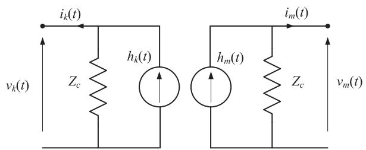  
Fig. 1. A lossless transmission line segment model.

# a waveform.

Full harmonic preservation is adopted in the following section where an interface between a dynamic-phasor solver and an EMT solver (hereinafter called a DP-EMT simulator) is described. All dynamic phasor quantities in the following sections are similar to Eq. (5) and include the entire simulated harmonic spectrum, which is determined by the bandwidth of the underlying component models and also the simulation time-step.

# 3. DP-EMT interface: layout and algorithm

# 3.1. Interface layout

The functional form of the established DP-EMT interface is a transmission line with EMT and dynamic-phasor quantities at its two ends. EMT-type programs conventionally use traveling wave models to represent transmission lines. Traveling wave models introduce natural decoupling to the nodal equations of an EMT simulator [21]. More specifically, the two networks at the sending and receiving ends of a transmission line are isolated due to the line’s finite travel-time or transportation-time delay, also known as transmission line latency. Fig. 1 shows the equivalent impedance representation of a Bergeron lossless line model. This model is used to establish an interface between EMT and dynamic phasor solvers.

Current-source injections at the two ends are as follows.

$$
h _ {k} (t) = \frac {2 v _ {m} (t - \tau)}{Z _ {c}} - h _ {m} (t - \tau) \tag {6}
$$

$$
h _ {m} (t) = \frac {2 v _ {k} (t - \tau)}{Z _ {c}} - h _ {k} (t - \tau) \tag {7}
$$

where τ is the travel-time delay, and $Z _ { c }$ is the line’s characteristic impedance. According to Eqs. (6) and (7), current injections at nodes k and m at time t are calculated using quantities at the other node at time $t - \tau .$ This natural latency allows that the two sides of the line to be simulated using different modeling approaches such as EMT and dynamic phasor solvers.

Consider a situation where the nodes k and m represent the dynamic-phasor and EMT network segments, respectively. The equivalent impedance model of such a DP-EMT model is similar to Fig. 1; however, the corresponding quantities on the node-k side are dynamic phasors and quantities on the node-m side are EMT samples.

The DP form of Eq. (6) is as follows:

$$
H _ {k} (t) = \left[ \frac {2 V _ {m} (t - \tau)}{Z _ {c}} - H _ {m} (t - \tau) \right] e ^ {- j \tau \frac {2 \pi}{T}} \tag {8}
$$

According to Eq. (8), in order to calculate the current injection at node k, instantaneous quantities at the EMT side (i.e., nd need to be converted to equivalent DP quantities. Similarly, to determine the current injection at node m using Eq. (7), the DP quantities at node k need to be converted to instantaneous time-domain quantities. Therefore, bi-directional signal conversion is required to realize the proposed DP-EMT hybrid transmission line.

It must be noted that the two networks on the EMT and DP sides are modeled using conventional admittance matrix (nodal analysis)

formulations. The components at both sides are replaced with companion models that are obtained using integration routines such as trapezoidal method (see Ref. [16] for companion models of basic circuit elements). Use of companion models for DP-based simulation is also reported in Refs. [22,23]. The transmission-line format of the proposed interface also avoids having to deal with network equivalents as in Ref. [24] wherein iterative intermediate steps need to be taken to attain convergence of DP-side and EMT-side equivalents before co-simulation can proceed.

# 3.2. Sample conversion (DP to EMT and EMT to DP)

Conversion of a dynamic phasor X(t) to time-domain is simply done using the following formula, which directly results from Eq. (4).

$$
x (t) = \operatorname {R e} \left(\boldsymbol {X} (t) e ^ {j \frac {2 \pi}{T} t}\right) \tag {9}
$$

Conversion of EMT simulation samples, however, is more challenging. Note that Eq. (5) shows how a fully-augmented dynamic phasor at the base frequency can be obtained. It is, however, noted that calculation of X(t) requires that all individual Fourier components, $\langle x \rangle _ { h } ( t )$ be available in order to calculate the summation term in Eq. (5). Although calculation of these components is possible, it is not desirable to do so as it entails firstly numerical integration using Eq. (2) for each component and secondly their summation in Eq. (5). This will create a large and inconvenient computational burden, which is undesirable. Alternatively, it is noted that the following equality holds.

$$
x (t - T + s) = \underbrace {2 \operatorname {R e} \left(\langle x \rangle_ {1} (t) e ^ {j \frac {2 \pi}{T} (t - T + s)}\right)} _ {\text {f u n d a m e n t a l c o m p o n e n t}} + \dots
$$

$$
\underbrace {\left(\sum_ {h = - \infty} ^ {+ \infty} \langle x \rangle_ {h} (t) e ^ {- j \left(h - 1\right) \frac {2 \pi}{T} (t - T + s)}\right) e ^ {j \frac {2 \pi}{T} (t - T + s)}} _ {\mathrm {d c} + \text {h a r m o n i c s}} \tag {10}
$$

Eq. (10) describes the waveform in terms of two complex numbers (both at the fundamental frequency): the first is the actual fundamentalfrequency component of the waveform and the second is a term that combines all other harmonic components (including the dc component) into a single complex number. Therefore, if $\langle x \rangle _ { 1 } ( t )$ is calculated using Eq. (2), then the first term on the right-hand side of $\operatorname { E q . }$ . (10) can be readily calculated and then subtracted from the already available lefthand side. Doing so yields the second term on the right-hand side of Eq. (10), which includes all dc and harmonic contents of the EMT waveform. Once obtained, the corresponding fully-augmented fundamentalfrequency dynamic phasor can be readily calculated as per Eq. (5). This method circumvents direct calculation of Eq. (5) using individual harmonic components and yields the same fully augmented fundamentalfrequency dynamic phasor with much reduced complexity.

# 3.3. Two time-step co-simulation

In order to achieve significant simulation speed gain using the proposed DP-EMT co-simulation approach, it is desirable to simulate the DP subsystem using larger time-steps than that of the EMT subsystem. This is also motivated by the fact that the DP side of the network is likely to manifest slower dynamics than the EMT part, if network segmentation is done at an appropriate location. In general there is no universal rule as to where segmentation must occur. However, it is recommended that a network be split into EMT and DP subsystems at a point that is electrically far from high-frequency transients (for example far from power-electronic converters) so that the inductive nature of system lines and loads introduces damping to high-frequency contents. If segmented in this manner, the voltages and currents at the point of segmentation will be largely devoid of excessive amounts of high-

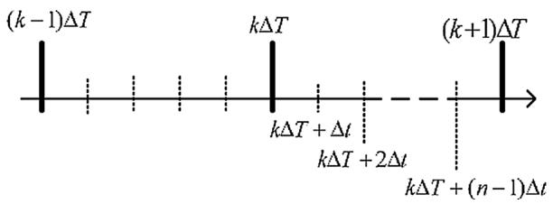  
Fig. 2. Time line of a two time-step DP-EMT simulation.

frequency contents and as such high levels of accuracy will be retained even if the DP side of the network is simulated with a large time-step. It must, however, be noted that the location of segmentation in the proposed method does not have any implications on its numerical stability, and it only manifests itself in the retention of high-frequency contents in the DP side of the network for multi-rate co-simulations.

A two time-step simulation approach using the latency of the transmission line was first proposed in Ref. [25]. Assume that the DP and EMT sides of the network are simulated using time-steps of ΔT and $\Delta t ,$ respectively. Without significant practical limitation, it is further assumed that ΔT is an integer multiple of Δt. The time-step ratio, n, is defined as follows.

$$
\Delta T = n \Delta t \tag {11}
$$

If the two subsystems are connected via a transmission line that has a travel time delay of $\tau ,$ then a two time-step simulation strategy can be implemented if the condition is satisfied. Fig. 2 shows the time line of a two time-step DP-EMT simulation.

The DP subsystem is only solved at every integer multiple of the large time-step, ΔT, and EMT subsystem is solved at every integer multiple of the small time-step, Δt. As a result of (11), DP and EMT solutions are synchronized at kΔT, where k is an integer. Furthermore, between two consecutive complete DP solutions, there are n-1 instants of the small time-steps where only the EMT solution is calculated. To calculate the DP solution at kΔT, past information from the EMT side calculated at $k \Delta T - \tau$ is required. Similarly, to calculate the EMT solution at $k \Delta T + \Delta t ,$ DP-side information at $k \Delta T + \Delta t - \tau$ is required. This information may not be readily available as the DP solution at $k \Delta T + \Delta t - \tau$ is not necessarily ‘calculated’. The required intermediate data points, however, can be estimated by linearly interpolating the DP solutions at kΔT and $( k \mathrm { ~ - ~ } 1 ) \Delta T .$ in this scheme, interpolation is done for the dynamic phasor quantities; as a result, the error is less for lowfrequency transients around the base frequency.

The maximum DP-side time-step of the DP-EMT co-simulation approach discussed in this paper is dependent on the transmission line delay. In order to have large traveling delays, long transmission lines need to be considered. For instance, a transmission line of 300 km (minimum) must be available to simulate the DP-side network at a $1 0 0 0 – \mu s$ time-step. This limits the flexibility of choosing time-steps due to the fact that long transmission lines are not always available at the location of the interface. Further, the transmission line models found in the literature that enable use of larger time-steps than the travel time delay do not provide decoupling between their two ends. Therefore such transmission line models are not suitable for use in this approach to achieve large time-step ratios.

Consider the speed of light at $3 \times 1 0 ^ { 5 }$ km/s; then the approximate minimum length $( l _ { \mathrm { m i n } } )$ of the transmission line to satisfy the condition $\Delta T \le \tau$ is as follows:

$$
l _ {\min } \approx 3 \times 1 0 ^ {5} \times \Delta T \tag {12}
$$

For example, this implies that in order to run the DP-side of cosimulator at a 500-μs time-step, a 150-km (minimum) transmission line must be available. Obviously, larger time-step ratios require longer transmission lines. A simple way to circumvent this limitation, at least in part, is to ‘borrow’ line inductance and capacitance from neighboring transmission lines in order to artificially elongate a short transmission

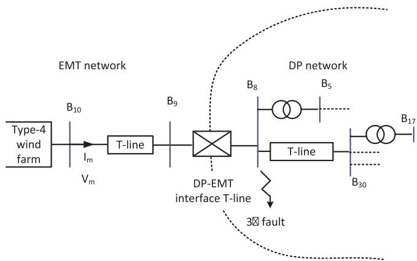  
Fig. 3. Segmented IEE118-bus test system with a wind farm.

line where segmentation occurs. This method produces accurate results [16], as long as adequate inductance and capacitance is available through neighboring lines.

In the following section, a case study of co-simulation using the developed DP-EMT interface is shown. The example demonstrates the accuracy and computational advantages of the proposed co-simulation method.

# 4. Co-simulation example case

The IEEE 118-bus test system [26] is used to illustrate the accuracy and efficacy of the proposed DP-EMT co-simulator. As shown schematically in Fig. 3 a small portion (3 buses) of the system containing a Type-4 wind farm of 75 turbines (6 MW each) [27] is modeled in an EMT simulator (PSCAD/EMTDC) including detailed switching-level models of power electronic converters. An aggregate representation is used to model the wind farm, where only one wind turbine is simulated and is then scaled up to represent the concurrent operation of several wind turbines in the farm. The total capacity of the wind farm is 450 MW. Fig. 4 shows the block diagram representation of the Type-4 aggregated windfarm in an EMT platform. All power-electronic controller feedback signals are retained within the EMT portion of the network to avoid unrealistic conversions between DP and EMT signals for feeding controllers.

The remaining 115 buses of the system are modeled in the dynamic phasor domain in a custom simulation environment and the proposed DP-EMT interface is used to connect the two simulators. The existing 150-km transmission line between buses 9 and 8 is used as the DP-EMT interface. The positive-sequence parameters of this line are shown in Table 1. Communication between the two simulators is established using the control network interface (TCP/IP-based) of PSCAD/EMTDC.

Three sets of simulations are conducted: (1) a DP-EMT co-simulation with a 20-μs time step for both simulators; (2) a DP-EMT co-simulation with 500-μs and 20-μs time-steps for the DP and EMT segments, respectively; and (3) a full EMT simulation with a 20-μs time step. The full EMT simulation is used to validate the results of the DP-EMT co-simulations.

The first co-simulation with equal 20-μs time-steps for both

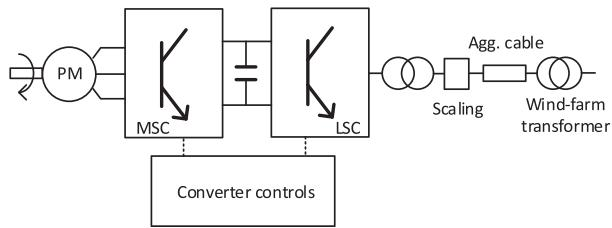  
Fig. 4. Type-4 wind farm model.

Table 1 Transmission line (B8–B9). Positive-sequence parameters.   

<table><tr><td>Parameter</td><td>Value [pu] on a 138 kV/100 MVA base</td></tr><tr><td>R (series resistance)</td><td>0.0025</td></tr><tr><td>X (series reactance)</td><td>0.0305</td></tr><tr><td>B (shunt admittance)</td><td>1.1620</td></tr></table>

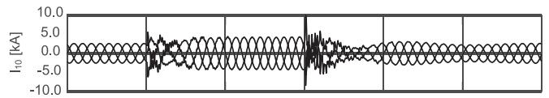

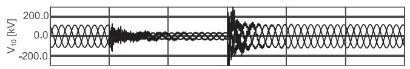

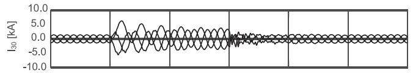

Fig. 5. Instantaneous current and voltage waveforms at bus 10 (top two plots) and bus 30 (bottom two plots) for EMT (20-μs) and DP-EMT (20-μs:20-μs) simulations.   
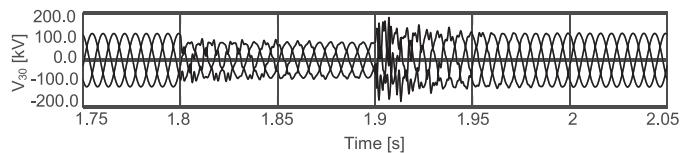  
EMT (20 μs) DP-EMT (20 μs:20 μs)

simulators is meant to verify that the co-simulator is able to replicate full EMT results. The second co-simulation with a 25:1 time-step ratio is meant to show that significant acceleration will be achieved with the use of a larger time step for the dynamic phasor segment while maintaining the accuracy of representation of low-frequency oscillations.

In all simulations, a three-phase-to-ground fault is applied at bus 8 (see Fig. 3) at t = 1.8 s and cleared 6 cycles later. Current and voltage measurements are captured at bus 10 (within the EMT segment) and bus 30 (within the DP segment).

Fig. 5 shows a comparison between the results of the hybrid DP-EMT (20-μs:20-μs) co-simulation and the fully detailed EMT model of the whole network. The plots show that the DP-EMT simulator has complete conformity with the full EMT simulator when equal time-steps are used. This is due to the fact that fully-augmented fundamentalcomponent dynamic phasors of EMT waveforms at the interface boundary are calculated and transferred to the dynamic phasor segment, thereby preserving the entire simulated harmonic spectrum. This illustrates a clear advantage of the developed extended-frequency dynamic phasor notion as conventional DP-based simulators, in which only the fundamental component is considered, are not able to achieve EMT-grade accuracy even if small simulation time-steps are used.

Fig. 6 shows a comparison between the results of the hybrid DP-EMT (500-μs:20-μs) and the fully detailed EMT model of the whole network. These plots show that the DP-EMT simulator is able to capture the low-frequency contents of the waveforms before, during, and after the fault; some high-frequency transients are not observed in the DP-EMT results due to the fact that use of a larger time-step to gain simulation speed results in less harmonic bandwidth in the simulated waveforms.

Fig. 7 shows a comparison of the per-unit (positive sequence, fundamental frequency only) rms voltage as well as real and reactive power at the wind farm terminal for the DP-EMT (500-μs:20-μs) cosimulation. These traces clearly show the DP-EMT co-simulator closely

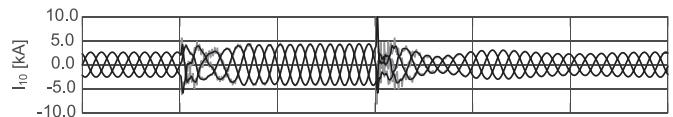

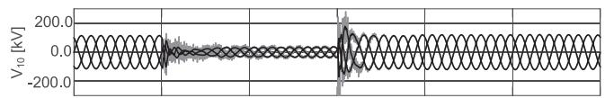

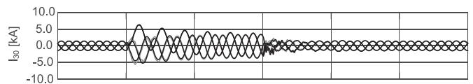

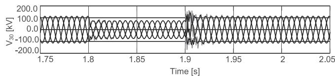  
EMT (20 us) DP-EMT (500 μs:20 μs)

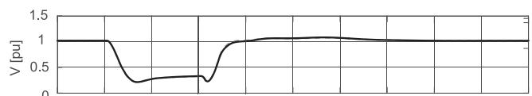  
Fig. 6. Instantaneous current and voltage waveforms at bus 10 (top two plots) and bus 30 (bottom two plots) for EMT (20-μs) and DP-EMT (500-μs:20-μs) simulations.

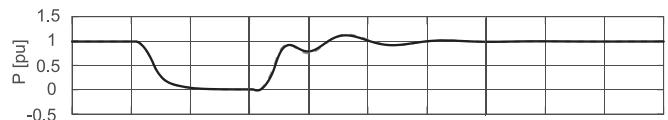

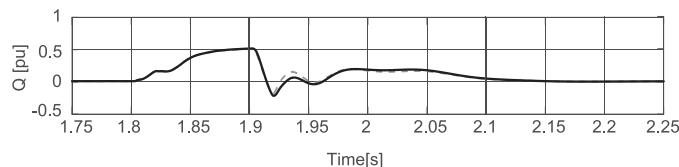  
Fig. 7. Terminal voltage (rms, fundamental), and real and reactive power at the wind farm terminal for EMT (20-μs) and DP-EMT (500-μs:20-μs) simulations.

Table 2 Simulation time comparison.   

<table><tr><td>Simulator</td><td>Time taken for a 3-s simulation</td></tr><tr><td>EMT for the whole network</td><td>694 s</td></tr><tr><td>DP-EMT</td><td>132 s</td></tr><tr><td>Simulation time gain</td><td>694/132 = 5.26</td></tr><tr><td>DP-EMT (voltage source)</td><td>32 s</td></tr><tr><td>Simulation time gain</td><td>694/32 = 21.69</td></tr></table>

replicates the results obtained using the full EMT model of the whole network for these slowly varying quantities.

Table 2 shows the simulation time comparison between the full EMT (the entire network at 20 μs) and the DP-EMT (500 μs:20 μs) simulations for a simulation duration of 3 s. As seen, the DP-EMT co-simulation is more than 5 times faster than the EMT solver, thereby offering significant computational relief. This reduction in simulation time is while maintaining the accuracy of simulated results in terms of lowfrequency dynamics, as is shown in Figs. 5 and 6. The results in this section show that the developed simulator offers the user the ability to control the accuracy and computational burden of the co-simulation depending on the time-step ratio of the EMT and DP-based solvers.

It must be noted that the speed-up gain shown in Table 2 is due to the reduction of the number of floating point operations required to

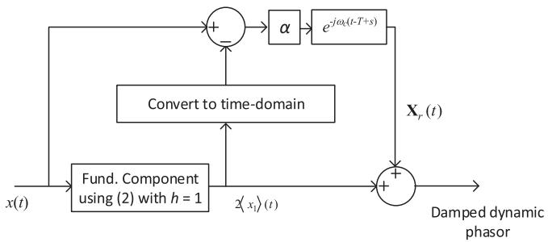  
Fig. 8. DP extraction method with damping.

simulate the external subsystem (i.e., the DP side). The overall speed is still heavily contributed to by the EMT side, where detailed representation of power electronic switching events in the wind farm converters consumes considerable time. In fact, replacement of the wind farm in the considered network with a controlled and dynamically-adjusted voltage source resulted in a speed-gain of more than 22, which is due the simplified switching converter model (simulation traces are not shown for brevity).

# 5. Stability and damping

The signal conversion method used in the paper has shown numerical stability in all DP-EMT simulation scenarios considered, which is an important quality. In multi-rate co-simulations in this paper, interpolation is used to determine intermediate points, and as such datapoint granularity between the two sides of the interface is different. In rare cases this may lead to numerical instability. For instance, the EMT side of a simulation running at a small time-step can capture high-frequency transients that may not be represented at the non-EMT side

running at a much larger time-step. These high-frequency transients have to be absorbed by some means such as additional filters at the EMT side of the interface. The signal conversion method in Ref. [16], which is used in this paper, offers flexibility to introduce damping to the dynamic phasor extraction process, thereby controlling the level of high-frequency contents of the waveform to be converted to a dynamic phasor. Fig. 8 shows a damping factor, ${ \mathfrak { a } } ,$ introduced to perform this task. As seen α controls the magnitude of the high-frequency components of signal x(t) that are superimposed onto the fundamental component. For $\alpha = 1$ , high-frequency components are included with no attenuation; for $\alpha = 0 ,$ they are completely ignored.

The need for damping is mostly present in TS-EMT interfacing, which is a special case of DP-EMT co-simulation wherein network dynamics in the non-EMT part of the network is entirely ignored. Fig. 9 shows simulation results of a radial system (see Ref. [16] for details) wherein part of the network is simulated in EMT and part of is simulated in TS. At the point where TS and EMT subnetworks are interfaced, high-frequency components are prevalent, and as such instabilities may occur due to the fact that the TS portion of the network is unable to absorb high-frequency components in its fundamental-frequency (only) representation. As a result of this, when EMT and TS simulators are interfaced there will be a large mismatch between two solutions due to the differences in modeling between two simulators. Hence, the TS-EMT interface has to absorb high-frequency components of the EMT signals to maintain numerical stability and accuracy of the simulation. As seen in Fig. 9 traces, small levels of damping are able to rectify the problem and result in high levels of accuracy in the co-simulated traces.

Note that the need for damping arises when TS-EMT interfacing is done at a point where high-frequency components are significant. In general segmentation of a network at such a point is not a proper practice. Segmentation is best achieved, without any damping, a point

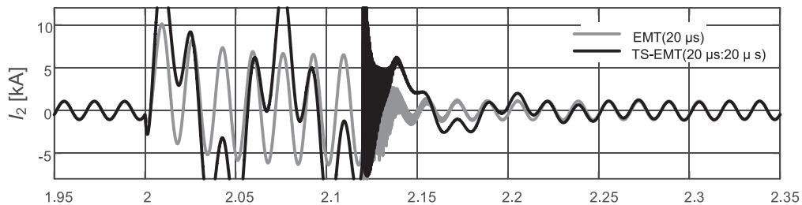

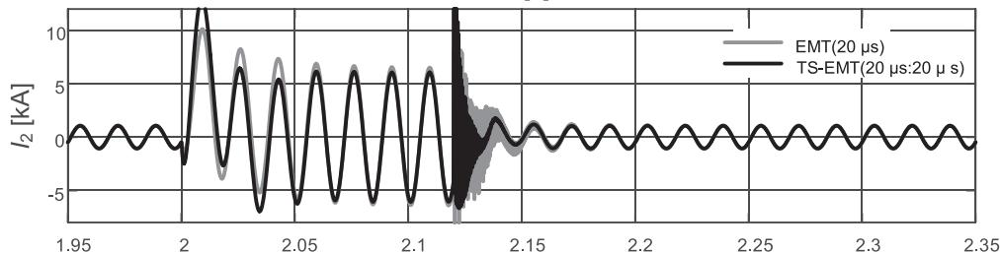  
Time [s]

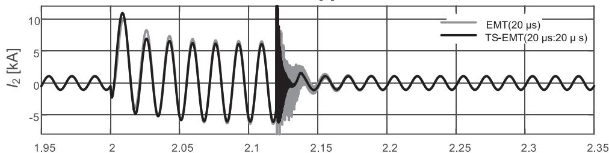  
Time [s]   
Time [s]   
Fig. 9. Current through line-segment $\pi _ { 2 } ~ [ 1 6 ]$ in TS-EMT co-simulation. (a) TS-EMT interface with α = 0.97, (b) TS-EMT interface with $\alpha = 0 . 9 5 ,$ , and (c) TS-EMT interface with $\alpha = 0 . 9 3$ .

where high-frequency contents have been naturally attenuated. DP-EMT co-simulation, on the other hand, does not need damping for virtually all cases due to the ability of dynamic phasors to absorb highfrequency contents.

# 6. Conclusions

The paper proposed and implemented an interface between an EMT and a dynamic-phasor based solver for co-simulation of electrical networks. The rationale for development of such a co-simulator is to enable and expedite EMT-type simulation of large electrical networks wherein fast-acting controllers and switching power-electronic converters are embedded. By taking advantage of the harmonic selectivity of dynamic phasor-based modeling, the proposed co-simulator can offer significant computational relief and selectivity compared with an EMT simulator.

The paper described how simulated samples are converted from the EMT domain to counterpart dynamic phasors and vice versa, and transmitted across the transmission line interface. In particular, a computationally efficient method was described for conversion of EMT samples to dynamic phasors, which retained the full harmonic spectrum of the EMT waveform and represented it as a dynamic phasor at fundamental frequency. The implications of two time-step co-simulation on the length of the interfacing transmission line were described.

The paper showed co-simulation results of a representative network in which a large wind farm was embedded. It was shown that depending on the simulation time-steps used, the developed DP-EMT cosimulator is able to capture both the low- and the high-frequency contents of waveforms in both the EMT and dynamic phasor segments of the network, and offer significant computational relief; a speed gain of larger than 5 was obtained in the shown example.

The implications of ignoring network dynamics in the non-EMT part of the network (i.e., TS-EMT interfacing) were discussed and a damping factor to absorb small amounts of high-frequency contents to ensure accuracy and prevent numerical instability was introduced.

# References

[1] S. Chiniforoosh, J. Jatskevich, A. Yazdani, V. Sood, V. Dinavahi, J.A. Martinez, A. Ramirez, Definitions and applications of dynamic average models for analysis of power systems, IEEE Trans. Power Deliv. 25 (October (4)) (2010) 2655–2669.   
[2] H. Ouquelle, L.A. Dessaint, S. Casoria, An average value model-based design of a deadbeat controller for VSC-HVDC transmission link, Proc. 2009 IEEE Power & Energy Society General Meeting (2018) 1–6.   
[3] H. Saad, S. Dennetiere, J. Mahseredjian, P. Delarue, X. Guillaud, J. Peralta, S. Nguefeu, Modular multilevel converter models for electromagnetic transients, IEEE Trans. Power Deliv. 29 (June (3)) (2014) 1481–1489.   
[4] S.E.M. de Oliveira, A.G. Massaud, Modal dynamic equivalent for electric power systems I: theory, IEEE Trans. Power Syst. 3 (November (4)) (1988) 1731–1737.   
[5] U.D. Annakkage, N.K.C. Nair, Y. Liang, A.M. Gole, V. Dinavahi, B. Gustavsen,

T. Noda, H. Ghasemi, A. Monti, M. Matar, R. Iravani, J.A. Martinez, Dynamic system equivalents: a survey of available techniques, IEEE Trans. Power Deliv. 27 (January (1)) (2012) 411–420.   
[6] F. Ma, V. Vittal, Right-sized power system dynamic equivalents for power system operation, IEEE Trans. Power Syst. 26 (November (4)) (2011) 1998–2005.   
[7] J.M. Zavahir, J. Arrillaga, N.R. Watson, Hybrid electromagnetic transient simulation with the state variable representation of HVDC converter plant, IEEE Trans. Power Deliv. 8 (July (3)) (1993) 1591–1598.   
[8] V.J. Marandi, V. Dinavahi, K. Strunz, J.A. Martinez, A. Ramirez, Interfacing techniques for transient stability and electromagnetic transient programs, IEEE Trans. Power Deliv. 24 (October (4)) (2009) 2385–2395.   
[9] X. Wang, P. Zhang, Z. Wang, V. Dinavahi, G. Chang, J.A. Martinez, A. Davoudi, A. Mehrizi-Sani, S. Abhyankar, Interfacing issues in multiagent simulation for smart grid applications, IEEE Trans. Power Deliv. 28 (July (3)) (2013) 1918–1927.   
[10] B. Asghari, V. Dinavahi, M. Rioual, J.A. Martinez, R. Iravani, Interfacing techniques for electromagnetic field and circuit simulation programs, IEEE Trans. Power Deliv. 24 (April (2)) (2009) 939–950.   
[11] H. Vardhan, B. Akin, H. Jin, A low-cost, high-fidelity processor-in-the-loop platform, IEEE Power Electron. Mag. 3 (June (2)) (2016) 18–28.   
[12] G. Chongva, S. Filizadeh, Non-real-time hardware-in-loop electromagnetic transient simulation of microcontroller-based power electronic control systems, Proc. 2013 IEEE Power Engineering Society General Meeting (2018) 1–5.   
[13] W. Ren, M. Sloderbeck, V. Dinavahi, S. Filizadeh, A.R. Chevrefils, M. Matar, R. Iravani, C. Dufour, J. Belanger, M.O. Faruque, K. Strunz, J.A. Martinez, Interfacing issues in real-time digital simulators, IEEE Trans. Power Deliv. 26 (April (2)) (2011) 1221–1230.   
[14] F. Plumier, Co-simulation of Electromagnetic Transients and Phasor Models of Electric Power Systems. Ph.D. Dissertation, University of Liège, 2015.   
[15] K.M.H.K. Konara, Interfacing Dynamic Phasor Based System Equivalents to an Electromagnetic Transient Simulation. M.Sc. Thesis, University of Manitoba, 2014.   
[16] S. Mudunkotuwa, Development of a hybrid simulator by interfacing dynamic phasors with electromagnetic transient simulation, IET Gener. Transm. Distrib. 11 (12) (2017) 2991–3001.   
[17] S.R. Sanders, J.M. Noworolski, X.Z. Liu, G.C. Verghese, Generalized averaging method for power conversion circuits, IEEE Trans. Power Electron. 6 (April (2)) (1991) 251–259.   
[18] M.A. Kulasza, Generalized Dynamic Phasor-Based Simulation for Power Systems. M.Sc. Thesis, Department of Electrical & Computer Engineering. Engineering University of Manitoba, 2014.   
[19] S. Henschel, Analysis of Electromagnetic and Electromechanical Power System Transient with Dynamic Phasors. Ph.D. dissertation, University of British Colombia, 1999.   
[20] P. Zhang, J.R. Martí, H.W. Dommel, Synchronous machine modeling based on shifted frequency analysis, IEEE Trans. Power Syst. 22 (3) (2007) 1139–1147.   
[21] D.M. Falcao, E. Kaszkurewicz, H.L.S. Almeida, Application of parallel processing techniques to the simulation of power system electromagnetic transients, IEEE Trans. Power Syst. 8 (February (1)) (1993) 90–96.   
[22] K. Strunz, R. Shintaku, F. Gao, Frequency-adaptive network modeling for integrative simulation of natural and envelope waveforms in power systems and circuits, IEEE Trans. Circuits Syst. I: Regul. Pap. 53 (12) (2006) 2788–2803.   
[23] F. Gao, K. Strunz, Frequency-adaptive power system modeling for multiscale simulation of transients, IEEE Trans. Power Syst. 24 (May (2)) (2009) 561–571.   
[24] F.J. Plumier, P. Aristidou, C. Geuzaine, T. Van Cutsem, A relaxation scheme to combine phasor-mode and electromagnetic transients simulations, Proc. Power Systems Computation Conference, Wroclaw, Poland, 2014.   
[25] A. Semlyen, F. de Leon, Computation of electro-magnetic transients using dual or multiple time steps, IEEE Trans. Power Syst. 8 (August (3)) (1993) 1274–1281.   
[26] IEEE 118-Bus System, Available: http://icseg.iti.illinois.edu/ieee-118-bus-system/.   
[27] Wind Turbines—Part 27-1: Electrical Simulation Models—Wind Turbines, IEC Standard 61400-27-1, ed. 1, February 2015.