# Efficient steady state analysis of the grid using electromagnetic transient models✰

Aayushya Agarwal * , Larry Pileggi

Electrical and Computer Engineering Department, Carnegie Mellon University, Pittsburgh, United States of America

# A R T I C L E I N F O

Keywords:

Electromagnetic transient analysis

Harmonic balance

Steady state

Ordinary differential equation

Waveform

# A B S T R A C T

Modern grids contain an increasing number of non-linear grid devices that are accurately modeled only in the time domain. Performing an accurate steady-state analysis with such models requires a transient simulation to infinite (sufficiently long) time, which can be computationally prohibitive. Power flow provides an efficient, but approximate steady state analysis using models based on a single nominal frequency, which fails to represent the true steady-state. We present a new method for efficiently analyzing the steady state response using traditional transient models that is inspired by harmonic balance methods. Rather than solving the underlying ODE by discretizing time, our method iterates on the entire waveform to find an accurate time domain waveform that captures the steady-state dynamics for all three phases. This presents a novel, efficient methodology for accurately studying the steady-state of the power grid. We introduce the concept by studying the steady state of a 14- bus system under various scenarios and highlight the difference between the steady-states achieved through power-flow and our method that uses EMT models.

# 1. Introduction

Steady-state analysis is the backbone of operating and planning the power grid. It mainly offers an insight into the state the grid settles into after an event in the network. Determining the true steady-state is often computationally difficult since it involves taking the electromagnetic transient (EMT) response to infinite time in theory, which is until steadystate convergence in practice. Most steady state analyses of the grid are based on an approximate frequency-domain based method known as power flow. However, with the addition of newer nonlinear devices that are accurately modeled in the time domain and capable of injecting harmonics, the assumptions made in power-flow cannot be justified and that solution is diverging from reality.

One of the biggest discrepancies in modern power system analysis is the inconsistency between power flow and transient models. Power flow was intended to represent the steady-state at the nominal frequency; however, device models in power flow are incompatible with their transient counterpart. Many complex devices with numerous controls are distilled into two valued models in power flow (often PQ or PV models) and taken only at the single nominal frequency. While the assumptions are justifiable for simple devices, today, with the advent of

new control schemes such as frequency-based control and inverterbased devices, we see discrepancies between power flow solutions and the true steady-state. Additionally, control systems based on frequency or balancing the three-phases are often ignored in power-flow due to the shortcomings in the analysis. Previous works have developed realistic power flow models by either incorporating frequency as a variable [1], defining all three-phases [2], or creating high-level models to capture control schemes [3,4]. However, there remains an underlying inconsistency with reality.

It’s generally regarded that for a more accurate analysis, power systems engineers turn to electromagnetic transient simulations (EMT) [5]. EMT uses dynamic models to accurately determine behavior incurred from the nonlinear devices and, unlike power flow, captures the effect of all control schemes. However, EMT uses a multistep integration method that is inefficient in larger systems where a wide range of time-constants constricts the simulation to take small time-steps for many iterations [5]. This becomes especially computationally prohibitive in simulating the steady-state when required to take small time-steps.

For this reason, power flow is more often used to simulate the steadystate since it can be efficiently solved within operational time limits.

There has been a lot of effort in improving EMT simulation speed by creating adaptive time-steps [6], using dedicated hardware systems with RTDS $[ 7 ] ,$ or decoupling the system to facilitate solving in parallel [8]. While these methods have improved transient analysis, they have not shown significant enough improvement to replace power-flow. As a compromise, engineers have developed transient stability analysis tools (or dynamic analysis) that simulate transient effects while making similar assumptions to power-flow, such as assuming a balanced, constant impedance transmission network [9].

In this work, we develop a new methodology for time domain steady state (TDSS) to efficiently solve for the steady-state using EMT models. The time-domain steady-state method solves for an accurate steady-state consistent with EMT (as it uses EMT device models) using an efficient decoupling methodology that is shown to be faster at reaching the steady-state. This allows for operation engineers to accurately study the steady-state behavior of the grid in operational time. In this work, we introduce a new time-domain analysis, inspired by harmonic balance [10] and waveform relaxation [11], that iterates on a complete time-domain waveform and can enable a time-domain decoupling of the linear transmission system from the non-linear sources. This decoupling allows us to avoid any large non-linear analysis or any matrix inversion, which further provides a straightforward path to parallelization to further improve simulation efficiency. Rather than solving the ODE using discrete time-steps, we achieve fast convergence to steady-state by progressing the entire waveform through time until convergence. Compared to traditional EMT, we efficiently converge to the steady-state while being unhindered by the size of the system. Compared to power flow, we are able to reach the true steady-state using EMT models and illustrate a wide difference in steady-state solutions due to power-flow’s inherent assumptions. We demonstrate the efficacy of our approach on a 14-bus system and provide a theoretical analysis of its scalability relative to a traditional transient simulation approach.

# 2. System decoupling

The efficacy of the new method arises from the conceptualization that a network can be represented as a linear transmission network with ports that are connected to the non-linear elements, as shown in Fig. 1. These non-linear sources can represent devices with non-linear differential equations such as synchronous condensers or devices represented by algebraic equations such as non-linear loads. The linear transmission

network, represented now as a linear N-port model, is a collection of transmission lines and transformers that are modeled either using lumped parameter models (such as pi model) [5], or distributed models [5].

For example, we can consider a 2-bus network with a generator on bus 1 and load on bus 2 as shown in Fig. 2. We can visualize the network as the linear transmission elements in the blue box and each non-linear device in a red box as shown. Importantly, we have not modified the network, but are just visualizing it in this way.

# 2.1. Traditional EMT analysis

The network in Fig. 1 can be mathematically represented using a stiff ordinary differential equation (ODE) with a state vector, x(t), multiplied by an impedance matrix, C(x(t), t), along with a non-linear function, $f ( { \boldsymbol { x } } ( t ) , t )$ as shown below:

$$
C (x (t), t) \dot {x} (t) = f (x (t), t) \tag {1}
$$

$$
x (0) = x _ {0} \tag {2}
$$

To solve the stiff ODE above, EMT marches through discrete time intervals, Δt, to determine the state at each time point. This process first converts the non-linear differential equations into non-linear algebraic equations using a numerical integration method (e.g. Runge Kutta) to approximate the integration of capacitor currents and inductor voltages from the previous time point, t to the current t + Δt. The result is a nonlinear algebraic equation to determine the state, x(t + Δt):

$$
g (x (t + \Delta t), x (t), t) = 0 \tag {3}
$$

Traditional EMT solves this non-linear problem at each time-step using an iterative Newton-Raphson (NR) method. At each iteration of NR, the algorithm solves a linear equation with a Jacobian matrix, J and a right-hand side vector, b and solves for the state at each iteration, $x ^ { k } ( t +$ Δt):

$$
J \cdot x ^ {k} (t + \Delta t) = b \tag {4}
$$

Solving Newton-Raphson (NR) at each iteration is a bottleneck for simulating large systems, where the computational cost for constructing the Jacobian as well as repeatedly solving the linearized set of equations in (4) can be prohibitive. Constructing the Jacobian requires linearizing each non-linear device instance, which is computationally expensive for

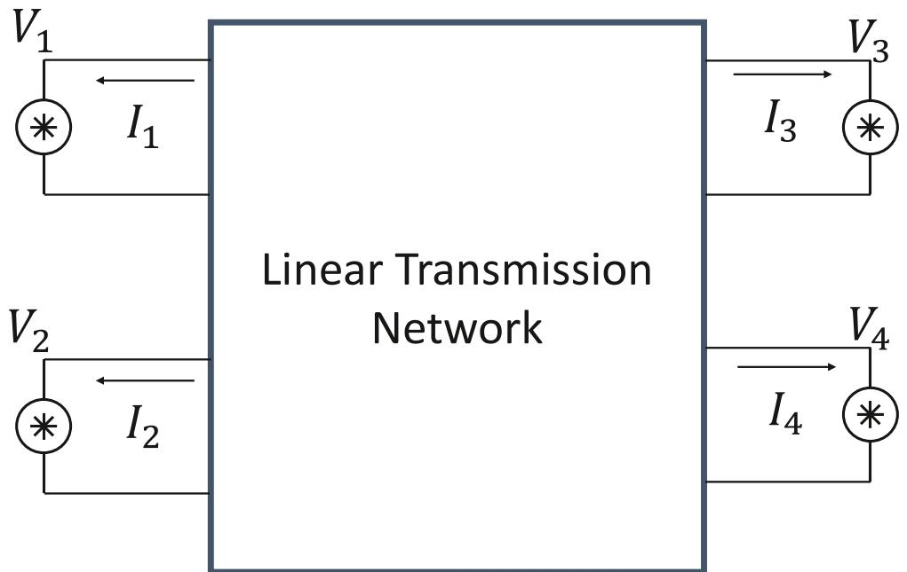  
Fig. 1. Power grid abstracted as linear network and non-linear sources.

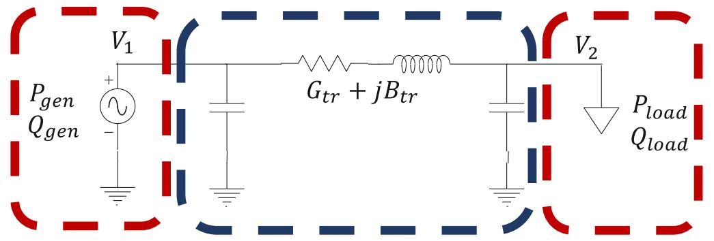  
Fig. 2. A 2-bus Network grouped into the linear transmission elements (shown in blue) and the non-linear devices (shown in red).

large systems. In addition, the complexity for solving (4) is at an order of $O ( n ^ { 1 . 8 } )$ [12], where n is the number of buses, which also becomes a bottleneck for larger systems. These issues are further exacerbated when simulating for the steady-state of a power grid, since many time-steps are needed to reach a time that represents an approximate steady state condition.

# 2.2. Isolating the system with substitution theorem

Alternatively, there is a class of iterative timing methods developed for circuit simulation [11] that exploits certain circuit couplings to avoid solving large Newton-Raphson problems for the entire circuit. In a similar manner, the iterative timing method we propose next relies on isolating the coupling between the linear transmission network and non-linear devices to solve them separately, then combine them in a subsequent step. This facilitates solution of large-scale systems and provides parallelism that can exploit modern computer hardware for speedup. Our approach starts with use of the substitution theorem [12]:

Theorem 1. If an element in a circuit is replaced by a voltage source (or current source) whose voltage equals the voltage across the element (or current equals the current flowing through the element), then the state of the system is unaffected.

In the context of power grids, we utilize this theorem by first isolating the non-linear sources from the linear transmission network. According to the theorem, we can replace the non-linear devices at the ports of the linear transmission with current sources with current values equal to the non-linear device currents, as shown in Fig. 3. Similarly, the non-linear devices are isolated from the linear transmission network and

coupled to the linear transmission network by a voltage source equal to the voltage at the port of the linear transmission network. In this coupling, the voltage at the ports of the linear transmission network are denoted by $V _ { p }$ while the port currents from the non-linear devices are described by $I _ { p } .$ Importantly, we have not modified the circuit response or its behavior. Although the figure does not explicitly show all three phases, it is assumed that all phases are expressed, thereby removing any restrictions of the network having to be balanced.

This conceptualization can be applied to any non-linear device including non-linear transformers or generator. In the case of shunt devices such as generators, one of the port connections is assumed to be ground. If the device is in a series connection, then both port connections will have associated states. Importantly, we notice that many grid connected devices are local and only contribute to either one or two ports at a time. This sparsity will be exploited in our method. Mathematically, we can describe this isolation in the form of two ODEs:

$$
C _ {\text {l i n}} (x (t), t) \dot {x} _ {\text {l i n}} = Y _ {\text {l i n}} x _ {\text {l i n}} + J _ {\text {l i n}} + I _ {p} \tag {5}
$$

$$
\dot {x} _ {n l i n} = f _ {n l i n} \left(x _ {n l i n}, V _ {p}\right) \tag {6}
$$

where $Y _ { l i n }$ and $J _ { l i n }$ are the constant Jacobian and constant current source vector corresponding to the linear transmission network, and $f _ { n l i n }$ is the function describing the response of non-linear devices due to a voltage at the port, $V _ { p }$ as shown in Fig. 3. Also $C _ { l i n } ( \boldsymbol { x } ( t ) , t )$ is the impedance matrix for the linear transmission network, which includes capacitances and inductances. These two ODEs are coupled using the port currents, $I _ { p }$ and port voltages, $V _ { p } .$ We will need to solve the ODE for a large simulation period to solve for a steady-state, making the traditional EMT approach

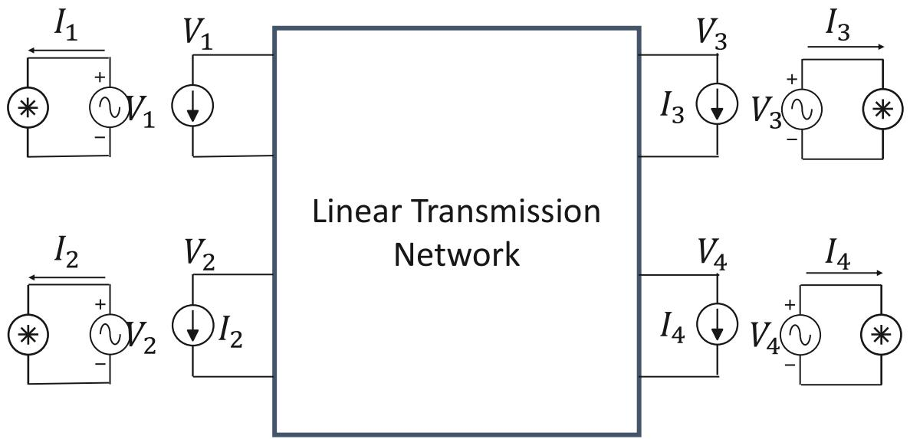  
Fig. 3. Decoupled network with linear transmission network and decoupled non-linear sources.

# inefficient.

As an example, we isolate the 2-bus network in Fig. 2 into the linear transmission network and separate non-linear device networks following the substitution theorem, resulting in Fig. 4. Importantly, this circuit is no different than the original 2 bus network in Fig. 1 and would result in the same set of nonlinear equations if we considered them in aggregate. This depiction does, however, allow us to better conceptualize the separated nonlinear analyses that we describe next.

# 3. Time-domain steady-state (TDSS)

With this isolation, we now introduce a new iterative timing method, called Time-Domain Steady-State (TDSS), that leverages the coupled networks by decoupling the sub-networks to solve for the steady-state. The linear network and each single non-linear device are decoupled and simulated independently without knowledge of any of the interactions. The values of the port-voltages and port currents for each network are fixed from a previous iteration. After each iteration of TDSS, we update the port-voltages and port-currents for the following iteration and repeat the process of independently solving the circuit, which implicitly merges the updated port values until we reach a consistent solution among all ports. By decoupling the grid into smaller device networks and a fixed linear transmission network, we avoid any large Newton-Raphson problems, since each device network is reasonably small while the linear transmission network has a fixed Jacobian that can be precomputed. This feature avoids one of the bottlenecks for scaling EMT to larger systems. Iterating between the decoupled the linear transmission network and the non-linear devices is commonly used in harmonic-balance [10], which has provably scaled well to large systems. Algorithm 1, below, describes the steps in each iteration of the TDSS method.

# 3.1. Initializing the waveform vector

Our TDSS method further deviates from traditional EMT approaches by introduction of a waveform state vector. The waveform vector defines the state of the grid over a period of time $t \in [ t _ { 0 } , t _ { f } ] .$ , as shown below:

$$
x = x (t) \in \mathbb {R} ^ {n} \forall t \in [ t _ {0}, t _ {f} ] \tag {7}
$$

For our purposes, the time-period, [t , t ] will be discussed later when

# Algorithm 1

Time domain steady-state.

$$
\text {I n t i t} \colon \text {I n i t i a l v o l t a g e w a y f o r m :} x ^ {0} = \{x (t) \forall t [ t _ {0}, t _ {f} ] \}
$$

Minimum time-step: $\Delta t _ { m i n }$

1 Initialize $x _ { k } = x ^ { 0 }$   
1 while (not reached steadystate) :   
1 Simulate non-linear decoupled circuits using xk as port voltage   
1 Extract port currents, $I _ { p } = \{ I _ { p } ( t ) , \forall t \in [ t _ { 0 } , t _ { f } ] \}$   
1 Solve for linear transmission network stages and port voltages, $V _ { p } = \{ V _ { p } ( t ) \forall t \in [$ [t0 , tf ]}   
1 Increase t0 and tf by one period   
1 end while

we address convergence to steady-state. Nonetheless, the waveform differs from the traditional EMT state vector, as it includes the state for the entire time-period. Importantly, unlike frequency-domain methods, this steady-state waveform will reflect all possible harmonics of the fundamental frequency without knowledge of dominant harmonics or any additional work.

Our goal in this steady-state analysis is to find the steady-state waveform-vector, ̃x with a period of $[ t _ { 0 } , t _ { 0 } + T ] _ { : }$ , where T is the period corresponding to the fundamental frequency.

$$
\widetilde {x} = \widetilde {x} (t) \in \mathbb {R} ^ {n} \forall t \in \left[ t _ {0}, t _ {f 0} + T \right] \tag {8}
$$

To begin the Time-Domain Steady-State method, we require an initial waveform, similar to how power flow requires an initial condition. As we will discuss later, an initial waveform that better resembles the final steady-state will achieve faster convergence. In practice, we can use the previous dispatch or previously known steady-state as an initial waveform to initiate the TDSS method. This also exploits nodes that do not change from their initial condition, as they remain dormant and can avoid parts of simulation. The waveform must include all capacitor instantaneous voltages and inductor instantaneous currents in the linear transmission network for at least a single period (of the fundamental frequency). In step 2 of Algorithm 1, this initial waveform is denoted as our current iteration waveform for the linear transmission, $x _ { l i n } ^ { k }$ .

# 3.2. Simulating non-linear device response

Using the current iteration of the linear network waveform, $x _ { l i n } ^ { k }$ , we

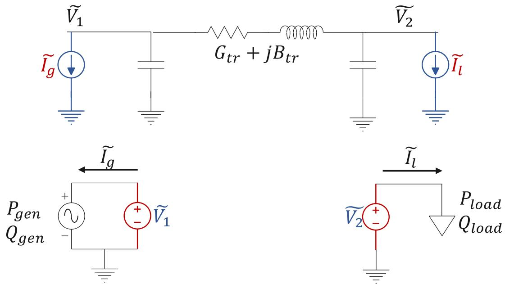  
Fig. 4. Decoupled 2-bus network with linear transmission network circuit and two non-linear device circuits. The port connections are replaced with current sources (shown in blue) at the transmission side, and with voltage sources (shown in red) on the device side.

extract the voltage waveforms at the ports of the non-linear devices, $V _ { p } .$ . The port voltage waveforms are now used to simulate the response due to each non-linear device. Essentially, we are simulating multiple small single-bus, single-device network as shown in Fig. 5. In this network, we connect the non-linear device with a 3-phase voltage source (as shown in the blue box in Fig. 5), with the voltage equal to the port-voltage waveform from the previous iteration. We can simulate each of these non-linear sources using traditional EMT solvers such as Simulink [13]. Importantly, since we have decoupled every non-linear device, we are able to take specific time-steps to capture each device’s natural response. This time-step value can be obtained from each manufacturer’s device models, such as PSCAD libraries [14]. This proves to be an advantage over traditional EMT analysis, where simulation time-steps are often limited by the fastest device.

Since each device can be simulated independently, given the port voltages, we are able to easily parallelize the simulation across multiple cores. Programs such as Simulink can batch simulate multiple instances in parallel [13], essentially making this simulation step independent of the size of the system. As the number of non-linear devices grows, we can concurrently increase the parallelism to avoid scalability issues. In addition, since each device is simulated independently, the time-step can be chosen independently as well. However, to synchronize all the port current waveform, which are the response of each non-linear device, we interpolate between time-steps to get a continuous curve using a linear interpolation scheme as defined by [10]. In this scheme, the voltage value at a time-point between two predefined time-points $( \overline { { t } } \in [ t _ { a } , t _ { b } ] )$ is solved as $\begin{array} { r } { V ( \overline { { t } } ) \ = { \frac { V ( t _ { b } ) - V ( t _ { a } ) } { t _ { b } - t _ { a } } } \left( \overline { { t } } - t _ { a } \right) } \end{array}$ .

We can further improve simulation efficiency at this step by realizing that if the port voltage does not change from the previous iteration, we can avoid re-simulating the non-linear device response at that port and simply use the previous port current waveform. This becomes beneficial in larger systems where many nodes are unaffected by changes happening at other parts of the grid. These methods to efficiently simulate the non-linear device response is shown in Algorithm 2.

Importantly, the complexity of simulating the EMT response of a single device is far less than solving the complete grid response. We leverage this fact by parallelizing each decoupled system to avoid the large NR solve done in EMT.

Since TDSS iterates over the grid waveform, the initial values for the device model are updated at the end of each iteration of TDSS in Algorithm 1. Specifically, the initial values of the device model are updated to equal the final values of the device at t = t from the previous iteration.

# Algorithm 2

Simulating non-linear device response.

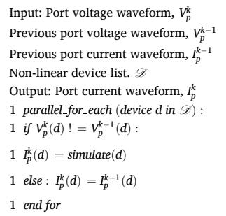

# 3.3. Solving linear transmission network

After calculating the response of each non-linear device, we can solve for the state of the linear transmission network knowing the port current waveforms. This takes advantage of the substitution theorem by replacing the non-linear device response with a current source as shown by Fig. 3. Simulating the linear transmission network over the timeperiod [t0, t ] now becomes a linear network simulation with known current source values as described by (5). To solve the linear ODE (5), we integrate over a single time-step, Δtmin, and define a constant companion matrix for the entire time-period [12] using a choice of numerical integration (usually an implicit discretization such as trapezoidal or Runge-Kutta):

$$
\begin{array}{l} x _ {l i n} (t + \Delta t _ {m i n}) = x _ {l i n} (t) + k _ {1} \Delta t _ {m i n} C _ {l i n} ^ {- 1} Y _ {l i n} x _ {l i n} (t + \Delta t _ {m i n}) + k _ {2} \Delta t _ {m i n} C _ {l i n} ^ {- 1} Y _ {l i n} x _ {l i n} (t) \\ + \Delta t _ {\min } C _ {l i n} ^ {- 1} \left(k _ {1} I _ {p} (t + \Delta t _ {\min }) + k _ {2} I _ {p} (t)\right) \tag {9} \\ \end{array}
$$

$k _ { 1 } , k _ { 2 }$ are constants determined by the choice of discretization (e.g., trapezoidal integration uses $k _ { 1 } = k _ { 2 } = 0 . 5 )$ . Since the equation is linear, we can solve for the state at t + Δt:

$$
\begin{array}{l} x _ {l i n} (t + \Delta t _ {m i n}) = \left(1 - k _ {1} \Delta t _ {m i n} C _ {l i n} ^ {- 1} Y _ {l i n}\right) ^ {- 1} \left(x _ {l i n} (t) + k _ {2} \Delta t _ {m i n} C _ {l i n} ^ {- 1} Y _ {l i n} x _ {l i n} (t) \right. \\ + \Delta t _ {\min } C _ {l i n} ^ {- 1} \left(k _ {1} I _ {p} (t + \Delta t _ {\min }) + k _ {2} I _ {p} (t)\right) \tag {10} \\ \end{array}
$$

Importantly, we can see that for a constant time-step, determining the state of the linear transmission network at each time-step corresponds to a constant matrix $( 1 - k _ { 1 } \Delta t _ { m i n } Y _ { l i n } ) ^ { - 1 }$ multiplied by the sum of the historical component plus the port-current value at the respected time. As a note, 1 in (10) is a diagonal identity matrix. Now, since we have already solved for the port-current waveform over the entire time-

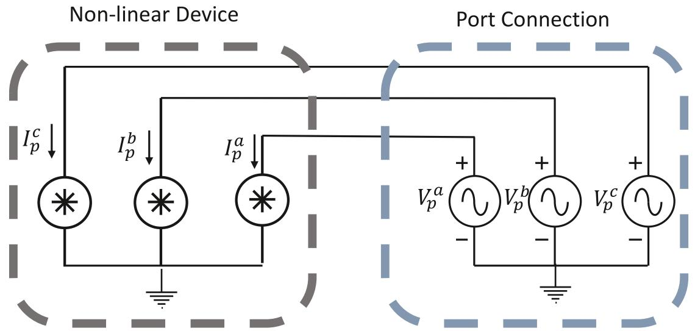  
Fig. 5. Decoupled non-linear source port model.

period, the value for $I _ { p } ( t + \Delta t _ { m i n } )$ and $I _ { p } ( t )$ are known from step 4 of Algorithm 1, and unlike EMT, we do not need to compute the Jacobian.

To further reduce computation, we can pre-compute the LU factor of constant matrix $( 1 - k _ { 1 } \Delta t _ { m i n } Y _ { l i n } )$ before starting the TDSS method and use a forward-backward substation to solve (10) [12]. This becomes very efficient, especially for large systems since we only need to compute the LU factor once, unlike traditional EMT analyses. This means, by decoupling the linear transmission network from the non-linear sources, we are able to avoid any large matrix computation to solve for the state of the system.

The time-step, $\Delta t _ { m i n } ,$ however, should ideally follow the minimum non-linear device time-step to capture all harmonics.

# 3.4. Convergence to steady-state

It is important to note that a single iteration of TDSS method will likely not determine an accurate transient solution. To properly determine the transient response during the time-period, [t0, tf ], we would need to repeatedly iterate on the linear transmission and non-linear device waveforms. However, our intention is to determine the steadystate rather than determining transient response. As a result, we can avoid iterating on the solution between [t0, tf ] and instead progress through time until we converge to a steady-state solution.

After completing a single iteration of Algorithm 1 for the time-period of $[ t _ { 0 } , t _ { f } ] ,$ we progress through the next period of time, $[ t _ { f } , t _ { f } + T ] ,$ , where T is an approximation of the fundamental period. Unlike in power flow, we do not assume the grid is at its nominal frequency (or 50 Hz or 60 Hz) but instead approximate the fundamental frequency by looking at the zero-crossings. We then use the voltage waveform from the previous time-period, [t , t ] to initiate the current iteration of TDSS method in order to solve for the response during $[ t _ { f } , t _ { f } + T ] .$ . By repeating this process, we are progressing through time towards a steady-state solution.

After reaching a steady-state waveform, $\widetilde { x } _ { l i n }$ and $\widetilde { x } _ { n l i n _ { \perp } }$ , the Time-Domain Steady-State procedure in Algorithm 1 will reach a stationary point at which $\widetilde { x } _ { l i n } ^ { k } = \widetilde { x } _ { l i n } ^ { k - 1 }$ and $\widetilde { x } _ { n l i n } ^ { k } = \widetilde { x } _ { n l i n } ^ { k - 1 }$ . This is illustrated by a

mapping, $\Lambda : x ^ { k } { \to } x ^ { k + 1 }$ , that describes the state after each iteration of Time-Domain Steady-State method. At a steady-state solution, we notice

$$
\widetilde {x} = \Lambda (\widetilde {x}) \tag {11}
$$

This is because when inserting the steady-state waveform for the linear transmission network into the non-linear devices, we will receive the non-linear device response, $\widetilde { x } _ { n l i n } .$ . Then, solving for the linear transmission waveform given the non-linear device waveform, ${ \widetilde { I _ { p } } } ,$ we will recover the steady-state linear transmission waveform, $\widetilde { x } _ { l i n }$ .

# 1) Calculating the Fundamental Frequency

Calculating the fundamental frequency is crucial to determine the period required to progress time at each iteration. We use similar methods used in shooting methods [12], where they look at the zero-crossings to determine the steady-state period. The figure below shows the voltage waveform at bus 2 in the IEEE 14 bus testcase.

As shown by the markers, we can use a linear interpolation between the data points to estimate the time at the zero-crossings. By counting 4 sequential zero-crossings, we take the time difference between the first and last (t and t in Fig. 6) as an estimate of the fundamental period. This exploits the nature of the grid which has a single fundamental frequency and harmonics that are multiples of the fundamentals. To determine if we have reached steady-state, we can compare the waveform from the prior fundamental period, T. If the two waveforms for all the states are identical within tolerance, then this indicates that we have reached steady-state.

$$
x ^ {k} = x ^ {k - 1} \equiv \widetilde {x} \forall t \in \left[ t _ {i}, t _ {i} + T \right] \tag {12}
$$

# 1) Convergence Analysis

A convergence analysis for TDSS method follows the convergence proof for waveform relaxation [11], with the decoupling at the transmission and non-linear device boundary. The successive displacement at the ports in TDSS is similar to a Gauss-Seidel approach. Waveform

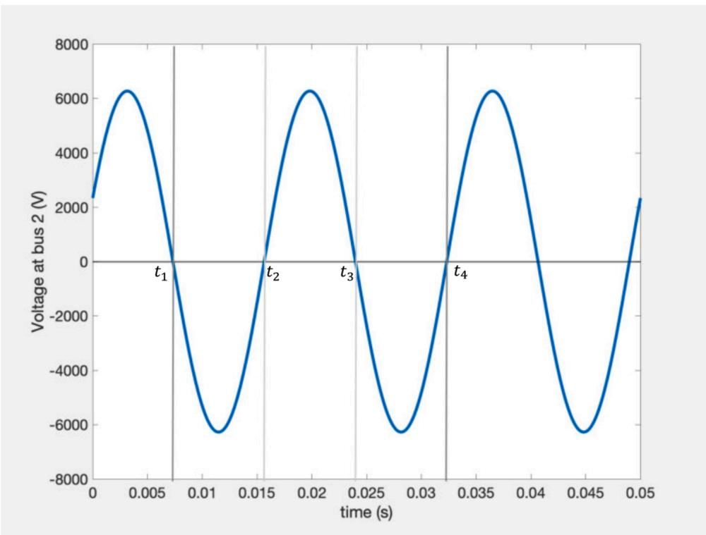  
Fig. 6. Steady-state waveform at bus 2 of modified IEEE-14 testcase with markers at zero-crossings.

relaxation methods in circuits [11] and power systems [15] uses similar Gauss-Seidel decoupling for weakly coupled regions of the network and is shown to converge super-linearly for any initial waveform given one of the following criteria:

1) We must have a diagonally dominant matrix, $C ( { \boldsymbol { x } } ( t ) , t )$ . Physically, this means we must have a shunt capacitor at each node or inductor current [11].   
2) A less strict criteria is that each node must have a path to ground through a sequence of capacitors [11]   
3) If each sub-system is represented by the ODE shown in (6) with nonlinear function, $\mathbf { \nabla } _ { f ( x ( t ) , t ) }$ the matrix, $\textstyle { \frac { d f } { d x } }$ is diagonally dominant with negative diagonal entries, i.e. be a stable system. [15]

The proof of convergence relies on defining a contraction mapping where the difference between two initial waveforms decay exponentially over the number of iterations, thus settling to the true transient response [11]. Similar to waveform relaxation, TDSS decouples a network and passes current and voltage waveforms between the decoupled ports. We attempt to satisfy the criteria above to prove convergence for TDSS.

We notice that the linear transmission network for the grid is composed of transmission lines and transformers. Using a distributed pi model to model the transmission line, as shown in Fig. 7, we notice that each node has a capacitor on each phase connected to another capacitor to ground. In addition, the inductor in the transmission line will now introduce the inductor current, I into the state variables, and the inductance on the diagonal of the impedance matrix, $C ( { \boldsymbol { x } } ( t ) , t )$ . Assuming each bus is connected to at least one transmission line, this property ensures that the impedance matrix is diagonally dominant, and each node has a path of capacitors to ground, which therefore satisfies criterion 1 and 2.

For each non-linear device need to ensure that it remains operating

in its stable region to be able to ensure diagonal dominance of the impedance matrix. Previous work has shown that power grid devices that are in a stable operating region are able to ensure convergence for waveform relaxation by providing a stable Jacobian matrix, $\textstyle { \frac { d f } { d x } }$ and $\frac { d g } { d x }$ [15].

# 4. Results and comparisons

After demonstrating that the Time-Domain Steady-State method converges super-linearly given necessary conditions described in Section $^ { 3 , }$ we demonstrate the improvements of determining a steady state compared to power flow and EMT. This approach efficiently solves for the steady-state of the grid while retaining the accuracy of EMT analysis.

We study the steady-state of a low-inertia 14-bus network, shown in Fig. 8, modified from [16] by removing generators at bus 3 and bus 8 and include a solar PV array (developed by [17]) at bus 8. We run the EMT using Simulink [13], and the power flow using MatPower [18]. The TDSS method is developed using Matlab and Simulink to simulate each the non-linear device sub-network.

# 4.1. Comparison with EMT

To validate that TDSS converges to the true steady-state, we simulate the network using EMT to steady-state. The EMT solver in Simulink uses a multistep integration (ode45 [13]) with a small time-step of $5 * 1 0 ^ { - 6 } \ s$ s for an accurate state of the grid. This requires at least a single iteration of NR at each time-step, which becomes computationally expensive as we scale the system size or simulation time. The EMT simulation converged to a steady-state at $t = 0 . 1$ , and required 20,000 time-steps, each with a NR step. Importantly, we notice that low-inertia system has a fundamental frequency of 58 Hz.

The TDSS method is developed in Matlab to simulate the decoupled linear transmission network and avoid repetitive matrix inversion

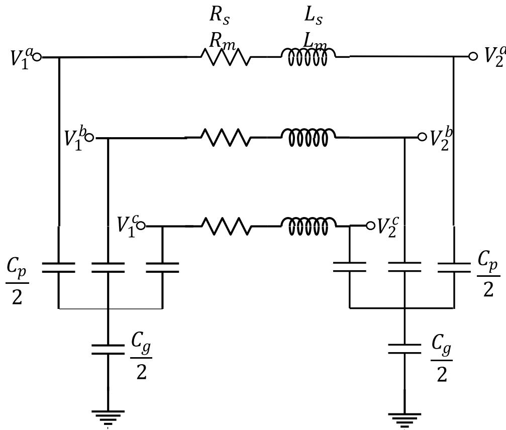  
Fig. 7. Transmission line Pi model with capacitances and inductors ensure diagonal dominance of impedance matrix.

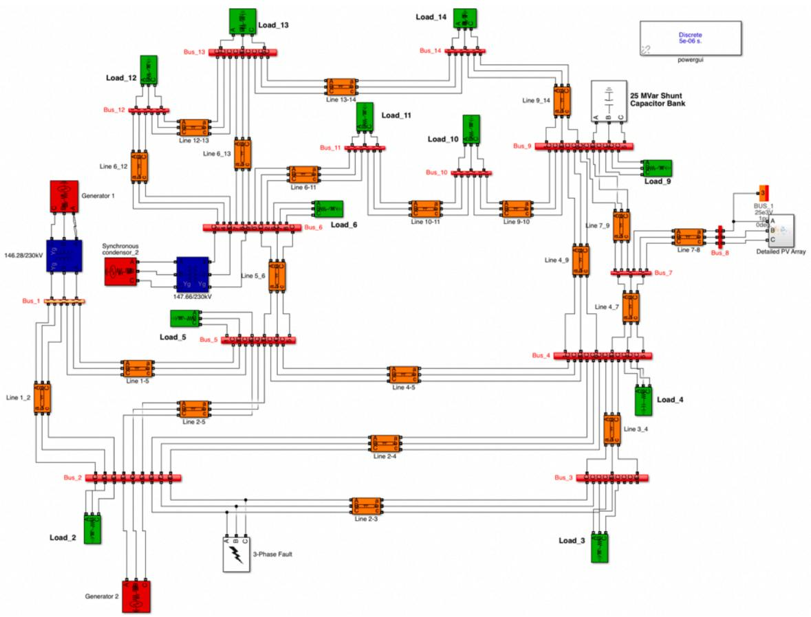  
Fig. 8. Modified IEEE 14-bus network with PV array at bus 8 and no generators at bus 3 and bus 8.

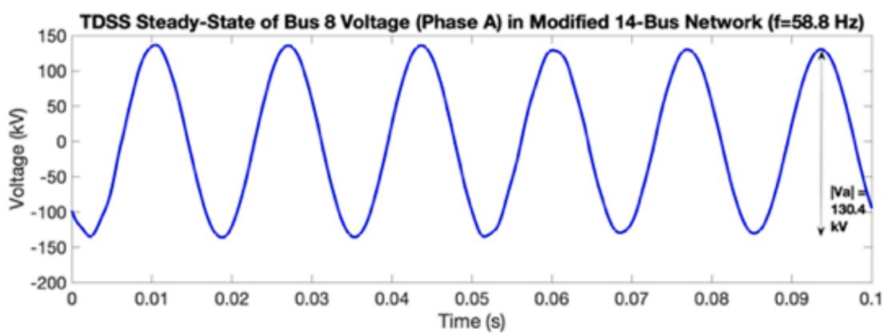

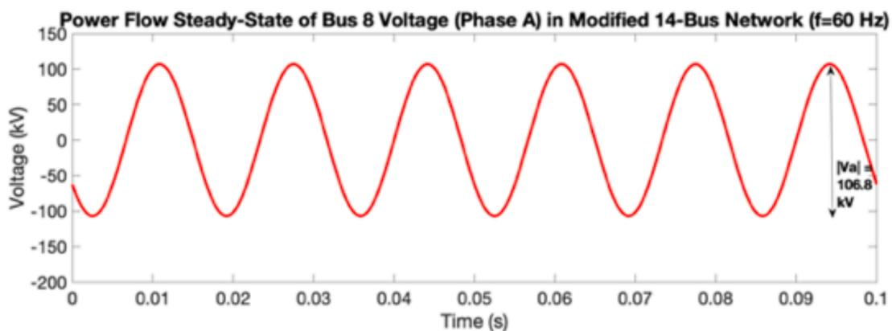  
Fig. 9. Steady-state voltage of bus 8 in modified 14-bus system using TDSS (above) and power flow (bottom)

(described in Section II.C), as well as Simulink to simulate the non-linear devices response in parallel. TDSS converges to the steady-state in 3 epochs, shown in Fig. 9, at which each epoch requires simulation of the non-linear devices as well as the linear transmission network. Since each non-linear device is independently simulated in parallel, we avoid having to invert any large matrices. The linear network is simulated using a time step of $5 * 1 0 ^ { - 6 } s$ . TDSS takes a total of 10,000 iterations (number of epochs multiplied by the simulation period in each epoch) . While this is comparable to the number of iterations performed in EMT, it is worth noting that we only had to do matrix multiplications, rather than performing multiple iterations of Newton-Raphson at each time step. This greatly improves scalability as we can now simulate larger networks without the bottleneck of Newton-Raphson.

# 4.2. Comparison with power flow

The power flow simulation efficiently solves for the steady-state assuming a balanced network at the nominal frequency (60 Hz). By replacing the PV array with a PQ model (with P and Q values determined by Simulink’s load flow tool), we converge to a power flow solution in 4 iterations, which highlights the efficiency of the methodology. The runtime for solving for the steady-state using the power-flow tools in MatPower was 0.28 s. While the runtime for power-flow was shorter than TDSS, it uses approximate models for loads as well as the PV array.

Importantly, this solution does not capture the low-inertia state of the system since power flow does not simulate frequency responses. Instead, power flow assumes an infinite slack generator on bus 1 that fixes the voltage at the bus and absorbs any mismatch due to frequency change. However, real generators do not abide by these assumptions and consequently, the magnitudes and phases of the states from the power flow solution are different from true EMT steady-state. This is evident from using TDSS which converges to a true steady-state solution, set at 58.8 Hz. We see this in Fig. 9, where the steady state voltage at bus 8 is solved using TDSS method and power flow. Not only do the frequencies differ, but the magnitude of the bus voltage is drastically different (130.4 kV using TDSS and 106.8 kV using power-flow).

# 5. Conclusion

In this paper, we introduce a new methodology to simulate an accurate steady-state of the power grid using EMT device models. Our methodology, called Time-Domain Steady-State, efficiently solves for the steady state by decoupling the network into a linear transmission network and several non-linear device circuits, and solves them independently. This procedure avoids solving large Newton-Raphson problems, which is a bottleneck for large-scale EMT. We discuss the efficiency improvements compared to EMT, and also the improvements in steady-state accuracy over traditional steady-state analysis, power flow. While our method is shown for a 14-bus system, it is designed to be scalable to larger systems. We believe this method is crucial as the grid is rapidly integrating renewable sources and new inverter-based devices, which have steady-states that cannot be fully captured using traditional methods.

# CRediT authorship contribution statement

Aayushya Agarwal: Conceptualization, Methodology, Software, Writing – original draft. Larry Pileggi: Conceptualization, Supervision.

# Declaration of Competing Interest

The authors declare that they have no known competing financial interests or personal relationships that could have appeared to influence the work reported in this paper.

# References

[1] A. Agarwal, A. Pandey, M. Jereminov, L. Pileggi, Implicitly modeling frequency control within power flow. 2019 IEEE PES Innovative Smart Grid Technologies Europe, ISGT-Europe, 2019, pp. 1–5, https://doi.org/10.1109/ ISGTEurope.2019.8905490.   
[2] A. Khodaei, N.M. Abdullah, A. Paaso, S. Bahramirad, Performance analysis of unbalanced three-phase linear distribution power flow model, in: 2020 IEEE/PES Transmission and Distribution Conference and Exposition (T&D), 2020, pp. 1–5.   
[3] J. Hu, J. Wang, X. Xiong, J. Chen, A post-contingency power flow control strategy for AC/DC hybrid power grid considering the dynamic electrothermal effects of transmission lines, IEEE Access 7 (2019) 65288–65302.   
[4] X. Dong, et al., Power flow analysis considering automatic generation control for multi-area interconnection power networks. IEEE Transactions on Industry Applications, 2017.   
[5] Hermann W. Dommel, EMTP Theory Book, Microtran Power System Analysis Corporation, 1996.   
[6] J.C.G. de Siqueira, B.D. Bonatto, J.R. Martí, J.A. Hollman, H.W. Dommel, Optimum time step size and maximum simulation time in EMTP-based programs. 2014 Power Systems Computation Conference, 2014, pp. 1–7, https://doi.org/10.1109/ PSCC.2014.7038485.   
[7] C. Yang, Y. Xue, X.-P. Zhang, Y. Zhang, Y. Chen, Real-time FPGA-RTDS cosimulator for power systems, IEEE Access 6 (2018) 44917–44926, https://doi.org/ 10.1109/ACCESS.2018.2862893.   
[8] Z. Zhou, V. Dinavahi, Parallel massive-thread electromagnetic transient simulation on GPU, in: 2015 IEEE Power & Energy Society General Meeting, 2015, https:// doi.org/10.1109/PESGM.2015.7285591, 1-1.   
[9] Q. Tao, Y. Xue, C. Li, Transient stability analysis of AC/DC system considering electromagnetic transient model. 2019 IEEE Innovative Smart Grid Technologies - Asia (ISGT Asia), 2019.   
[10] Kenneth S. Kundert, Jacob K. White, Alberto L. Sangiovanni-Vincentelli, Steady-State Methods for Simulating Analog and Microwave Circuits, 94, Springer Science & Business Media, 2013.   
[11] J.K. White, A. Sangiovanni-Vincentelli, Relaxation Techniques for the Simulation of VLSI Circuits, Kluwer Academic Publishers, USA, 1987.   
[12] (Pileggi) L. Pillage, R. Rohrer, C. Visweswariah, Electronic Circuit & System Simulation Methods, McGraw-Hill, Inc., New York, NY, USA, 1995.   
[13] Documentation, S., Simulation and model-based design, MathWorks (2020). Available at: https://www.mathworks.com/products/simulink.html.   
[14] Manitoba HVDC Center, “PSCAD/EMTDC user’s manual,” Manitoba HVDC Center, Winnipeg, Canada, 1998.   
[15] M.L. Crow, M.D. Ilic, J.K. White, Convergence properties of the waveform relaxation method as applied to electric power systems, in: IEEE International Symposium on Circuits and Systems, 1989.   
[16] Bharath Yk (2021). IEEE 14 bus system simulink model (https://www.mathworks. com/matlabcentral/fileexchange/46067-ieee-14-bus-system-simulink-model), MATLAB Central File Exchange. Retrieved October 1, 2021.   
[17] Niranjan Bhujel (2021). Grid connected PV inverter (https://www.mathworks.co m/matlabcentral/fileexchange/66600-grid-connected-pv-inverter), MATLAB Central File Exchange. Retrieved October 1, 2021.   
[18] R.D. Zimmerman, C.E. Murillo-Sanchez, R.J. Thomas, MATPOWER: steady-state operations, planning and analysis tools for power systems research and education, IEEE Trans. Power Syst. 26 (1) (2011) 12–19. Feb.