# Multi-scale and Frequency-dependent Modeling of Electric Power Transmission Lines

Hua Ye and Kai Strunz

Abstract—A frequency-dependent transmission line model for multi-scale simulation of diverse transients over a wide range of frequencies is developed, implemented, and validated. It makes use of the concept of frequency-adaptive simulation of transients in which the Fourier spectra are adaptively shifted in the frequency domain to reduce the discretization time-steps in the time domain. The transients are modeled through dynamic phasors comprising the real and imaginary parts of analytic signals to facilitate the frequency-shifting. In the proposed line model, all mathematical operations such as numerical recursive convolutions are therefore expressed in terms of analytic signals. A modal decomposition is performed to attain decoupled modes for the multi-phase case. The transition from the representation of electromagnetic traveling waves with time-steps below the wave propagation time to the tracking of slower electromechanical transients at time-steps above the wave propagation time is achieved by the automatic insertion of a π-segment to represent the galvanic coupling within one time-step. Accurate and efficient simulation of both electromagnetic and electromechanical transients within a simulation run is so supported. The validation is verified through comparison with a staged field test covering the diverse transients of line energization, transient recovery voltage, and steady state.

Index Terms—Analytic signal, dynamic phasor, electromagnetic transients, electromagnetic transients program (EMTP), electromechanical transients, frequency dependence, multi-scale modeling, power system modeling, power system simulation, transmission line modeling.

# I. INTRODUCTION

IMULATION algorithms of the electromagnetic transients program (EMTP) [1] process instantaneous signals to sample natural waveforms at small time-step sizes that are typically of the order of microseconds [2]. The theoretically possible maximum time step size is given by the Nyquist step size $\tau _ { \mathrm { N y } } = 1 / ( 2 f )$ with f giving the maximum frequency of interest in the simulation. Taking into account the accuracy of numerical integration, a maximum time step size of $\tau _ { \operatorname* { m a x } } ~ = ~ 1 / ( 1 0 f )$ was recommended in [3], thus generally $f \tau \ll 1$ is necessary to accurately compute electromagnetic transients. The computational efficiency of the simulation can be improved if the Fourier spectra of the natural waveforms are concentrated around the carrier frequency $f _ { \mathrm { c } }$ of either 50 Hz or 60 Hz in power systems and if dynamic phasor calculus is applied [4]. The carrier frequency component at $f _ { \mathrm { c } }$ is so eliminated and the above condition for the time step size is modified to $| \textit { f } - \textit { f } _ { \mathrm { s } } ~ | ~ \tau \ll 1$ , where $f _ { \mathrm { s } } = f _ { \mathrm { c } }$ is called the shift frequency in [5]. Thus, a significantly larger time step

H. Ye and Professor K. Strunz are with the SENSE Laboratory, Department of Electrical Engineering and Computer Sciences, Technische Universität Berlin, Berlin, Germany. (e-mail: kai.strunz@tu-berlin.de).

Manuscript received April 30, 2016; revised August 8, 2016.

size in tracking of waveforms with Fourier spectra closely centered about $f _ { \mathrm { c } }$ is possible, making the simulation more efficient. The derivations of [5] demonstrate that the error made in approximating capacitances and inductances is even equal to zero at the carrier frequency $f _ { \mathrm { c } } .$ .

Multi-scale modeling combines the virtues of simulation in the time domain as in EMTP and dynamic phasor calculus [5], [6]. When high-frequency transients are of interest, then the multi-scale simulation processes instantaneous signals just like EMTP. For low-frequency transients, however, the multi-scale simulation processes dynamic phasors. It is this flexibility that allows to cover diverse transients with just one set of models that makes multi-scale modeling relevant. The efficiency of the multi-scale modeling also makes it an interesting candidate for real-time simulation [7]. Multiscale models of power system components covering lumpedparameter elements, transformers, synchronous machinery, and transmission lines were developed in [8]–[10]. Recent research has turned to the development of advanced machine models [11], [12].

A transmission line model for multi-scale simulation was developed in [8], but the latter does not account for frequency dependence of parameters [13]. While the improvement of frequency-dependent line modeling for EMTP simulation is still an active topic of research [14]–[18], the work performed for this paper resulted in the first frequency-dependent line model for multi-scale simulation of an overhead transmission line. It supports the integrative simulation of diverse transients from the steady state to high frequencies with the potential of varying discretization time step sizes over a wide range of frequencies. The contributions made in this context are threefold. Firstly, shiftable analytic signals are proposed for processing the numerical recursive calculations that are essential for developing frequency-dependent line models in the time domain. Secondly, a multi-scale and frequency-dependent multi-phase line model is created to support accurate and efficient simulation of both electromagnetic and electromechanical transients as well as seamless transitions between both. Thirdly, the developed line model was implemented and validated.

Section II provides relevant background information on the frequency shifting and frequency-dependent line modeling. In Section III, a multi-scale and frequency-dependent model of a single-phase line is developed. Section IV extends the singlephase line model to the multi-phase form. The new line model is validated against a field test in Section V. Conclusions are drawn in Section VI.

# II. STATE OF THE ART

# A. Frequency Shifting

An ac signal $s ( t )$ with a Fourier spectrum that is narrowly concentrated on the angular carrier frequency $\omega _ { \mathrm { c } } = 2 \pi f _ { \mathrm { c } }$ is depicted on the left of Fig. 1 [5]. In an ac electric power grid, $f _ { \mathrm { c } } = 5 0 \mathrm { H z }$ or $f _ { \mathrm { c } } = 6 0 \mathrm { H z }$ . By adding the Hilbert transform of $s ( t )$ as imaginary part, an analytic signal $\underline { { s } } ( t )$ is created as follows [19]:

$$
\underline {{s}} (t) = s (t) + \mathrm {j} \mathcal {H} [ s (t) ]. \tag {1}
$$

The effect of the creation of the analytic signal is shown from the left to the center of Fig. 1. While the spectrum of $s ( t )$ extends to negative frequencies, this is not the case for the corresponding analytic signal $\underline { { s } } ( t )$ . Therefore, the analytic signal can be shifted by the so-called shift angular frequency $\omega _ { \mathrm { s } } \mathrm { : }$

$$
\mathcal {S} [ \underline {{s}} (t) ] = \underline {{s}} (t) \mathrm {e} ^ {- \mathrm {j} \omega_ {\mathrm {s}} t}. \tag {2}
$$

For $\omega _ { \mathrm { s } } = \omega _ { \mathrm { c } }$ , the complex envelope $\mathcal { E } [ \underline { { s } } ( t ) ]$ [20] is obtained. Through this operation, the spectrum is shifted by the carrier frequency $\omega _ { \mathrm { c } }$ as shown on the right of Fig. 1. The complex envelope is a low-pass signal whose maximum frequency is lower than the one of the original bandpass signal. In accordance with Shannon’s sampling theory [20], a lower sampling rate can therefore be chosen for tracking the complex envelope, which corresponds to a dynamic phasor. If $\omega _ { \mathrm { s } }$ is set to zero, then the real part of the analytic signal allows for tracking natural waveforms as in EMTP-type simulation. For multiscale simulation, the shift frequency is set adaptively through Frequency Adaptive Simulation of Transients (FAST) [8].

# B. Frequency-Dependent Transmission Line

Fig. 2 depicts the current and voltage conventions for a single-phase line that takes into account the frequency dependence of line parameters. The quantities $\underline { { Z } } ^ { \prime } ( \omega )$ and $\underline { { Y } } ^ { \prime } ( \omega )$ are the per-unit-length series impedance and shunt admittance, respectively, and both parameters are functions of the angular frequency $\omega = 2 \pi f .$ . In the frequency domain, the relationship of currents and voltages at both ends 1 and 2 of the line can be expressed as follows [2], [21]:

$$
\underline {{I}} _ {1} (\omega) = \underline {{Y}} _ {\mathrm {c h}} (\omega) \underline {{V}} _ {1} (\omega) - \underline {{H}} (\omega) \left(\underline {{Y}} _ {\mathrm {c h}} (\omega) \underline {{V}} _ {2} (\omega) + \underline {{I}} _ {2} (\omega)\right) \tag {3}
$$

$$
\underline {{I}} _ {2} (\omega) = \underline {{Y}} _ {\mathrm {c h}} (\omega) \underline {{V}} _ {2} (\omega) - \underline {{H}} (\omega) \left(\underline {{Y}} _ {\mathrm {c h}} (\omega) \underline {{V}} _ {1} (\omega) + \underline {{I}} _ {1} (\omega)\right) \tag {4}
$$

with

$$
\underline {{Y}} _ {\mathrm {c h}} (\omega) = \sqrt {\frac {\underline {{Y}} ^ {\prime} (\omega)}{\underline {{Z}} ^ {\prime} (\omega)}} \tag {5}
$$

$$
\underline {{H}} (\omega) = \mathrm {e} ^ {- \sqrt {\underline {{Y}} ^ {\prime} (\omega) \underline {{Z}} ^ {\prime} (\omega)} \ell} \tag {6}
$$

where I and V are the current and voltage at the terminals, respectively; $\underline { { Y } } _ { \mathrm { c h } } ( \omega )$ and $\underline { { H } } ( \omega )$ are the characteristic admittance and propagation function, respectively; and ℓ is the length of the line.

Transforming (3) and (4) into the time domain gives

$$
i _ {1} (t) = y _ {\mathrm {c}} (t) * v _ {1} (t) - h (t) * \left(y _ {\mathrm {c}} (t) * v _ {2} (t) + i _ {2} (t)\right) \tag {7}
$$

$$
i _ {2} (t) = y _ {\mathrm {c}} (t) * v _ {2} (t) - h (t) * \left(y _ {\mathrm {c}} (t) * v _ {1} (t) + i _ {1} (t)\right) \tag {8}
$$

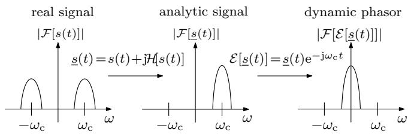

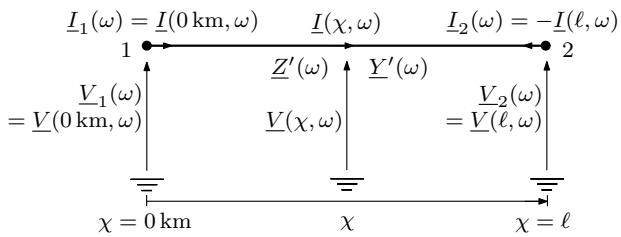  
Fig. 1. Application of Hilbert transform and frequency shift.   
Fig. 2. Current and voltage conventions for single-phase line in frequency domain.

where the lowercase variables represent the time-domain version of their uppercase counterparts, and the symbol ∗ indicates convolution.

Direct calculation of the convolutions in (7) and (8) would be time-consuming. To overcome the limitation, it is common practice to approximate $\underline { { Y } } _ { \mathrm { c h } } ( \omega )$ and $\underline { { H } } ( \omega )$ with partial fraction expansions (PFEs) based on the fitting technique in [22]. The fitting of $\underline { { Y } } _ { \mathrm { c h } } ( \omega )$ gives the poles $p _ { \mathrm { y } n }$ and residues $y _ { n }$ of the PFEs as well as a constant $y _ { 0 }$ , while the fitting of $\underline { { H } } ( \omega )$ yields the poles $p _ { \mathrm { h } n }$ and residues $h _ { n }$ of the corresponding PFEs. Through application of the inverse Laplace transform, the PFEs of approximating $\underline { { Y } } _ { \mathrm { c h } } ( \omega )$ and $\underline { { H } } ( \omega )$ are converted into the time domain as follows:

$$
y _ {\mathrm {c}} (t) = y _ {0} \delta (t) + \sum_ {n = 1} ^ {N _ {\mathrm {y}}} y _ {n} \mathrm {e} ^ {p _ {\mathrm {y n}} t} \tag {9}
$$

$$
h (t) = \sum_ {n = 1} ^ {N _ {\mathrm {h}}} h _ {n} \mathrm {e} ^ {p _ {\mathrm {h} n} \left(t - T _ {\mathrm {w p}}\right)} \tag {10}
$$

where $\delta ( t )$ is the Dirac delta function and $T _ { \mathrm { w p } }$ is the time the fastest traveling wave needs to proceed from one end to the other end of the line. Herein, $h ( t ) = 0$ when $t \leq T _ { \mathrm { w p } }$ .

In (9) and (10), $y _ { \mathrm { c } } ( t )$ and $h ( t )$ are expressed in terms of a sum of exponential functions; their convolutions with the currents and voltages can be calculated recursively [23]. Using the recursive solution, an efficient and accurate frequencydependent line model for electromagnetic transient studies was developed in [13]. For the case of $N _ { \mathrm { c } }$ phases, the modal domain analysis allows for the formulation through decoupled single-phase line models using a transformation matrix described in Appendix A [24].

# III. MULTI-SCALE MODELING FOR SINGLE-PHASETRANSMISSION LINE WITH FREQUENCY DEPENDENCE

The multi-scale modeling starts by extending (7) and (8) to process analytic rather than real signals to allow for frequency shifting as reviewed in Section II-A. The right-hand sides of

(7) and (8) are then decomposed into two terms, respectively:

$$
\underline {{\dot {l}}} _ {1} (t) = \underline {{\dot {l}}} _ {\mathrm {s} 1} (t) - \underline {{\dot {l}}} _ {\mathrm {r} 1} (t) \tag {11}
$$

$$
\underline {{i}} _ {2} (t) = \underline {{i}} _ {\mathrm {s} 2} (t) - \underline {{i}} _ {\mathrm {r} 2} (t) \tag {12}
$$

with

$$
\dot {y} _ {\mathrm {s} 1} (t) = y _ {\mathrm {c}} (t) * \underline {{v}} _ {1} (t) \tag {13}
$$

$$
\underline {{i}} _ {\mathrm {r} 1} (t) = h (t) * \left(y _ {\mathrm {c}} (t) * \underline {{v}} _ {2} (t) + \underline {{\dot {i}}} _ {2} (t)\right) \tag {14}
$$

$$
\dot {y} _ {\mathrm {s} 2} (t) = y _ {\mathrm {c}} (t) * \underline {{v}} _ {2} (t) \tag {15}
$$

$$
\underline {{i}} _ {\mathrm {r} 2} (t) = h (t) * \left(y _ {\mathrm {c}} (t) * \underline {{v}} _ {1} (t) + \underline {{i}} _ {1} (t)\right). \tag {16}
$$

where $\underline { { i } } _ { \mathrm { s 1 } } ( t )$ and $\underline { { i } } _ { \mathrm { s 2 } } ( t )$ are defined as the surge currents, which are solely functions of the local terminal voltages; $\underline { { i } } _ { \mathrm { r 1 } } ( t )$ and $\underline { { i } } _ { \mathrm { r 2 } } ( t )$ can be considered as the return currents being functions of voltages and currents of the opposite line ends. The calculations of the surge and return currents are derived in Sections III-A and III-B, respectively. In Section III-C, a multiscale model of a single-phase line with frequency dependence is then formulated.

# A. Calculation of Surge Current

Equation (9) is used to calculate the surge current $\underline { { i } } _ { \mathrm { s 1 } } ( t )$ defined in (13). Inserting (9) into (13) yields

$$
\dot {i} _ {\mathrm {s} 1} (t) = y _ {0} \underline {{v}} _ {1} (t) + \sum_ {n = 1} ^ {N _ {\mathrm {y}}} y _ {n} \underline {{\phi}} _ {1 n} (t) \tag {17}
$$

with

$$
\underline {{\phi}} _ {1 n} (t) = \mathrm {e} ^ {p _ {\mathrm {y} n} t} * \underline {{v}} _ {1} (t) = \int_ {0} ^ {t} \mathrm {e} ^ {p _ {\mathrm {y} n} u} \underline {{v}} _ {1} (t - u) \mathrm {d} u. \tag {18}
$$

As opposed to the simulation of electromagnetic transients, the convolution integral involves analytic rather than real signals. In digital simulation at a time-step size τ , the convolution result $\underline { { \phi } } _ { 1 n } ( t - \tau )$ from the preceding time-step is known as

$$
\begin{array}{l} \underline {{\phi}} _ {1 n} (t - \tau) = \int_ {0} ^ {t - \tau} \mathrm {e} ^ {p _ {\mathrm {y n}} u} \underline {{v}} _ {1} (t - \tau - u) \mathrm {d} u \\ = \int_ {\tau} ^ {t} \mathrm {e} ^ {p _ {\mathrm {y n}} (u - \tau)} \underline {{v}} _ {1} (t - u) \mathrm {d} u. \tag {19} \\ \end{array}
$$

Furthermore, the integration in (18) may be decomposed into two parts

$$
\underline {{\phi}} _ {1 n} (t) = \int_ {0} ^ {\tau} \mathrm {e} ^ {p _ {\mathrm {y n}} u} \underline {{v}} _ {1} (t - u) \mathrm {d} u + \int_ {\tau} ^ {t} \mathrm {e} ^ {p _ {\mathrm {y n}} u} \underline {{v}} _ {1} (t - u) \mathrm {d} u. \tag {20}
$$

From (19) and (20) and in analogy to the procedure used for electromagnetic transients in [23], a recursive formulation is obtained to calculate $\underline { { \phi } } _ { 1 n } ( t )$ from $\underline { { \phi } } _ { 1 n } ( t - \tau )$ as follows:

$$
\underline {{\phi}} _ {1 n} (t) = \mathrm {e} ^ {p _ {\mathrm {y} n} \tau} \underline {{\phi}} _ {1 n} (t - \tau) + \int_ {0} ^ {\tau} \mathrm {e} ^ {p _ {\mathrm {y} n} u} \underline {{v}} _ {1} (t - u) \mathrm {d} u. \tag {21}
$$

In accordance with (2), frequency shifting of the Fourier spectrum of the voltage $\underline { { v } } _ { 1 } ( t - u )$ in (21) is given by

$$
\mathcal {S} \left[ \underline {{v}} _ {1} (t - u) \right] = \underline {{v}} _ {1} (t - u) \mathrm {e} ^ {- \mathrm {j} \omega_ {\mathrm {s}} (t - u)}. \tag {22}
$$

Insertion of (22) into (21) yields

$$
\begin{array}{l} \underline {{\phi}} _ {1 n} (t) = \mathrm {e} ^ {p _ {\mathrm {y n}} \tau} \underline {{\phi}} _ {1 n} (t - \tau) \\ + \mathrm {e} ^ {\mathrm {j} \omega_ {\mathrm {s}} t} \int_ {0} ^ {\tau} \mathrm {e} ^ {\left(p _ {\mathrm {y n}} - \mathrm {j} \omega_ {\mathrm {s}}\right) u} \mathcal {S} [ \underline {{v}} _ {1} (t - u) ] \mathrm {d} u. \tag {23} \\ \end{array}
$$

Performing the integration by parts, (23) is expanded and recast as follows:

$$
\begin{array}{l} \underline {{\phi}} _ {1 n} (t) = \mathrm {e} ^ {p _ {\mathrm {y n}} \tau} \underline {{\phi}} _ {1 n} (t - \tau) + \frac {\mathrm {e} ^ {p _ {\mathrm {y n}} \tau} \underline {{v}} _ {1} (t - \tau) - \underline {{v}} _ {1} (t)}{p _ {\mathrm {y n}} - \mathrm {j} \omega_ {\mathrm {s}}} \\ - \frac {\mathrm {e} ^ {\mathrm {j} \omega_ {\mathrm {s}} t}}{p _ {\mathrm {y n}} - \mathrm {j} \omega_ {\mathrm {s}}} \int_ {0} ^ {\tau} \mathrm {e} ^ {(p _ {\mathrm {y n}} - \mathrm {j} \omega_ {\mathrm {s}}) u} \frac {\mathrm {d} S [ \underline {{v}} _ {1} (t - u) ]}{\mathrm {d} u} \mathrm {d} u. \tag {24} \\ \end{array}
$$

By using the linear interpolation as given in Appendix B, the shifted analytic signal $S [ \underline { { v } } _ { 1 } ( t - u ) ]$ ] in (24) becomes

$$
\mathcal {S} [ \underline {{v}} _ {1} (t - u) ] = (1 - \frac {u}{\tau}) \mathcal {S} [ \underline {{v}} _ {1} (t) ] + \frac {u}{\tau} \mathcal {S} [ \underline {{v}} _ {1} (t - \tau) ] \tag {25}
$$

for τ ≥ u, κ = ceil $( u / \tau ) = 1$ as defined in Appendix B. Differentiating (25) with respect to u gives a difference equation

$$
\begin{array}{l} \frac {\mathrm {d} \mathcal {S} [ \underline {{v}} _ {1} (t - u) ]}{\mathrm {d} u} = \frac {\mathcal {S} [ \underline {{v}} _ {1} (t - \tau) ] - \mathcal {S} [ \underline {{v}} _ {1} (t) ]}{\tau} \\ = \frac {\mathrm {e} ^ {- \mathrm {j} \omega_ {\mathrm {s}} t}}{\tau} \left(\mathrm {e} ^ {\mathrm {j} \omega_ {\mathrm {s}} \tau} \underline {{v}} _ {1} (t - \tau) - \underline {{v}} _ {1} (t)\right). \tag {26} \\ \end{array}
$$

The difference term in (26) is expressed in terms of the shifted analytic signal. Since the frequency shifting is performed to reduce the maximum frequency in the Fourier spectrum, the shifted signal changes at a lower rate compared with the unshifted counterpart. Thus, for $\omega _ { \mathrm { s } } ~ > ~ 0$ rad/s, a larger time-step size can be used compared with the case where the difference $v _ { 1 } ( t - \tau ) - v _ { 1 } ( t )$ is considered. This results in an increase of computational speed without sacrificing accuracy. In a special case of $\omega _ { \mathrm { s } } = 0$ rad/s, the difference term performs as in EMTP-type simulation.

Substituting (26) in (24), rearrangement and simplification lead to

$$
\begin{array}{l} \underline {{\phi}} _ {1 n} (t) = \mathrm {e} ^ {p _ {\mathrm {y n}} \tau} \underline {{\phi}} _ {1 n} (t - \tau) + \frac {\mathrm {e} ^ {p _ {\mathrm {y n}} \tau} \underline {{v}} _ {1} (t - \tau) - \underline {{v}} _ {1} (t)}{p _ {\mathrm {y n}} - \mathrm {j} \omega_ {\mathrm {s}}} \\ - \frac {\mathrm {e} ^ {\mathrm {j} \omega_ {\mathrm {s}} \tau} \underline {{v}} _ {1} (t - \tau) - \underline {{v}} _ {1} (t)}{\left(p _ {\mathrm {y n}} - \mathrm {j} \omega_ {\mathrm {s}}\right) \tau} \int_ {0} ^ {\tau} \mathrm {e} ^ {\left(p _ {\mathrm {y n}} - \mathrm {j} \omega_ {\mathrm {s}}\right) u} \mathrm {d} u \\ = \mathrm {e} ^ {p _ {\mathrm {y n}} \tau} \underline {{\phi}} _ {1 n} (t - \tau) + \underline {{\alpha}} _ {\mathrm {s n}} v _ {1} (t) + \underline {{\beta}} _ {\mathrm {s n}} v _ {1} (t - \tau) \tag {27} \\ \end{array}
$$

with

$$
\begin{array}{l} \underline {{\alpha}} _ {s n} = \frac {\mathrm {e} ^ {(p _ {\mathrm {y n}} - \mathrm {j} \omega_ {\mathrm {s}}) \tau} - 1 - (p _ {\mathrm {y n}} - \mathrm {j} \omega_ {\mathrm {s}}) \tau}{(p _ {\mathrm {y n}} - \mathrm {j} \omega_ {\mathrm {s}}) ^ {2} \tau} \\ \underline {{\beta}} _ {s n} = \frac {\mathrm {e} ^ {\mathrm {j} \omega_ {\mathrm {s}} \tau} - \mathrm {e} ^ {p _ {\mathrm {y n}} \tau} + \mathrm {e} ^ {p _ {\mathrm {y n}} \tau} (p _ {\mathrm {y n}} - \mathrm {j} \omega_ {\mathrm {s}}) \tau}{(p _ {\mathrm {y n}} - \mathrm {j} \omega_ {\mathrm {s}}) ^ {2} \tau} \\ \end{array}
$$

where $\underline { { \alpha } } _ { \mathrm s n }$ and $\underline { { \beta } } _ { \mathrm { s } n }$ sn are coefficients that now contain two simulation parameters $\omega _ { \mathrm { s } }$ and τ .

By introducing $\underline { { \phi } } _ { 1 n } ( t )$ of (27) into (17), the surge current $\underline { { i } } _ { \mathrm { s 1 } } ( t )$ is resolved. Defining conductance G and history source $\underline { { \eta } } _ { \mathrm { s 1 } } .$ , the solution of $\underline { { i } } _ { \mathrm { s 1 } } ( t )$ simplifies to (28). In a similar manner as for ${ \underline { { i } } _ { \mathrm { s 1 } } } ( t )$ , the calculation of $\underline { { i } } _ { \mathrm { s 2 } } ( t )$ in (15) is given by (29). Therefore,

$$
\underline {{\dot {i}}} _ {\mathrm {s} 1} (t) = \underline {{G}} \underline {{v}} _ {1} (t) + \underline {{\eta}} _ {\mathrm {s} 1} (t) \tag {28}
$$

$$
\dot {i} _ {\mathrm {s} 2} (t) = \underline {{G}} \underline {{v}} _ {2} (t) + \underline {{\eta}} _ {\mathrm {s} 2} (t) \tag {29}
$$

with

$$
\underline {{G}} = y _ {0} + \sum_ {n = 1} ^ {N _ {\mathrm {y}}} y _ {n} \underline {{\alpha}} _ {\mathrm {s n}} \tag {30}
$$

and

$$
\begin{array}{l} \underline {{\eta}} _ {\mathrm {s} 1} (t) = \left(\sum_ {n = 1} ^ {N _ {\mathrm {y}}} y _ {n} \underline {{\beta}} _ {\mathrm {s} n}\right) \underline {{v}} _ {1} (t - \tau) + \sum_ {n = 1} ^ {N _ {\mathrm {y}}} y _ {n} \mathrm {e} ^ {p _ {\mathrm {y} n} \tau} \underline {{\phi}} _ {1 n} (t - \tau) \\ \underline {{\eta}} _ {\mathrm {s 2}} (t) = \left(\sum_ {n = 1} ^ {N _ {\mathrm {y}}} y _ {n} \underline {{\beta}} _ {\mathrm {s n}}\right) \underline {{v}} _ {2} (t - \tau) + \sum_ {n = 1} ^ {N _ {\mathrm {y}}} y _ {n} \mathrm {e} ^ {p _ {\mathrm {y n}} \tau} \underline {{\phi}} _ {2 n} (t - \tau). \\ \end{array}
$$

# B. Calculation of Return Current

To calculate the reflected current $\underline { { i } } _ { \mathrm { r 1 } } ( t )$ in (14), it is possible to use the definition of the forward function in [13], but defining it with the analytic signal

$$
\underline {{i}} _ {\mathrm {f} 2} (t) = y _ {\mathrm {c}} (t) * \underline {{v}} _ {2} (t) + \underline {{i}} _ {2} (t) = \underline {{i}} _ {\mathrm {s} 2} (t) + \underline {{i}} _ {2} (t). \tag {31}
$$

Insertion of (31) and (10) into (14) yields

$$
\dot {\underline {{\mathrm {r}}}} _ {1} (t) = h (t) * \dot {\underline {{\mathrm {f}}}} _ {2} (t) = \sum_ {n = 1} ^ {N _ {\mathrm {h}}} h _ {n} \underline {{q}} _ {1 n} (t) \tag {32}
$$

with

$$
\begin{array}{l} \underline {{q}} _ {1 n} (t) = \mathrm {e} ^ {p _ {\mathrm {h} n} (t - T _ {\mathrm {w p}})} * \underline {{i}} _ {\mathrm {f} 2} (t) \\ = \int_ {T _ {\mathrm {w p}}} ^ {t} \mathrm {e} ^ {p _ {\mathrm {h n}} (u - T _ {\mathrm {w p}})} \underline {{i}} _ {\mathrm {f} 2} (t - u) \mathrm {d} u \tag {33} \\ \end{array}
$$

where the lower limit of the convolution integral is equal to $T _ { \mathrm { w p } }$ because $h ( t ) ~ = ~ 0$ for $t ~ \leq ~ T _ { \mathrm { w p } }$ as mentioned in Section II-B. Eq. (33) may be solved recursively in a manner done in (21) and becomes

$$
\underline {{q}} _ {1 n} (t) = \mathrm {e} ^ {p _ {\mathrm {h} n} \tau} \underline {{q}} _ {1 n} (t - \tau) + \int_ {0} ^ {\tau} \mathrm {e} ^ {p _ {\mathrm {h} n} u} \dot {u} _ {\mathrm {f} 2} (t - u - T _ {\mathrm {w p}}) \mathrm {d} u. \tag {34}
$$

Following the solution procedure used for (22) to (27), ${ \underline { { q } } } _ { 1 n } ( t )$ is resolved as follows:

$$
\begin{array}{l} \underline {{q}} _ {1 n} (t) = \mathrm {e} ^ {p _ {\mathrm {h} n} \tau} \underline {{q}} _ {1 n} (t - \tau) \\ + \underline {{\alpha}} _ {\mathrm {r n}} \underline {{i}} _ {\mathrm {f} 2} (t - T _ {\mathrm {w p}}) + \underline {{\beta}} _ {\mathrm {r n}} \underline {{i}} _ {\mathrm {f} 2} (t - T _ {\mathrm {w p}} - \tau) \tag {35} \\ \end{array}
$$

with

$$
\underline {{\alpha}} _ {\mathrm {r} n} = \frac {\mathrm {e} ^ {(p _ {\mathrm {h} n} - \mathrm {j} \omega_ {\mathrm {s}}) \tau} - 1 - (p _ {\mathrm {h} n} - \mathrm {j} \omega_ {\mathrm {s}}) \tau}{(p _ {\mathrm {h} n} - \mathrm {j} \omega_ {\mathrm {s}}) ^ {2} \tau}
$$

$$
\underline {{\beta}} _ {\mathrm {r n}} = \frac {\mathrm {e} ^ {\mathrm {j} \omega_ {\mathrm {s}} \tau} - \mathrm {e} ^ {p _ {\mathrm {h n}} \tau} + \mathrm {e} ^ {p _ {\mathrm {h n}} \tau} (p _ {\mathrm {h n}} - \mathrm {j} \omega_ {\mathrm {s}}) \tau}{(p _ {\mathrm {h n}} - \mathrm {j} \omega_ {\mathrm {s}}) ^ {2} \tau}
$$

where the shift frequency $\omega _ { \mathrm { s } }$ is made available as an adjustable simulation parameter in addition to the time-step size.

In order to calculate $\underline { { i } } _ { \mathrm { f 2 } } ( t - T _ { \mathrm { w p } } )$ and $\underline { { i } } _ { \mathrm { f 2 } } ( t - T _ { \mathrm { w p } } - \tau )$ a t instants that are usually not an integer multiple of the timestep size $\tau ,$ the interpolation applied to analytic signals as shown in Appendix B is used in (35). Expressing (35) with the interpolation results, $\underline { { q } } _ { 1 n } ( t )$ becomes

$$
\begin{array}{l} \underline {{q}} _ {1 n} (t) = \mathrm {e} ^ {p _ {\mathrm {h} n} \tau} \underline {{q}} _ {1 n} (t - \tau) + \underline {{\alpha}} _ {\mathrm {r} n} \underline {{\rho}} \dot {i} _ {\mathrm {f} 2} (t - \kappa \tau + \tau) \\ + \left(\underline {{\alpha}} _ {r n} \underline {{\sigma}} + \underline {{\beta}} _ {r n} \underline {{\rho}}\right) \underline {{i}} _ {\mathrm {f} 2} (t - \kappa \tau) \\ + \underline {{\beta}} _ {\mathrm {r n}} \underline {{\sigma}} i _ {\mathrm {f} 2} (t - \kappa \tau - \tau) \tag {36} \\ \end{array}
$$

where $\kappa ~ = ~ \mathrm { c e i l } \left( T _ { \mathrm { w p } } / \tau \right)$ , and $\underline { { \rho } }$ and $\underline { { \sigma } }$ are calculated in accordance with the definition in Appendix B.

Inserting (36) into (32) allows for the formulation of (37), where a history term $\underline { { \eta } } _ { \mathrm { r 1 } }$ is defined. The return current $\underline { { i } } _ { \mathrm { r 2 } } ( t )$ in (16) can be calculated with a similar derivation. Therefore,

$$
\underline {{i}} _ {\mathrm {r} 1} (t) = \underline {{K}} _ {1} \underline {{i}} _ {\mathrm {f} 2} (t - \kappa \tau + \tau) + \underline {{\eta}} _ {\mathrm {r} 1} (t) \tag {37}
$$

$$
\underline {{i}} _ {\mathrm {r} 2} (t) = \underline {{K}} _ {1} \underline {{i}} _ {\mathrm {f} 1} (t - \kappa \tau + \tau) + \underline {{\eta}} _ {\mathrm {r} 2} (t) \tag {38}
$$

with

$$
\underline {{K}} _ {1} = \underline {{\rho}} \sum_ {n = 1} ^ {N _ {\mathrm {h}}} h _ {n} \underline {{\alpha}} _ {\mathrm {r} n}
$$

and

$$
\underline {{\eta}} _ {\mathrm {r} 1} (t) = \underline {{K}} _ {2} \dot {i} _ {\mathrm {f} 2} (t - \kappa \tau) + \underline {{K}} _ {3} \dot {i} _ {\mathrm {f} 2} (t - \kappa \tau - \tau) + \underline {{h}} _ {\mathrm {r} 1} (t - \tau) \tag {39}
$$

$$
\underline {{\eta}} _ {\mathrm {r} 2} (t) = \underline {{K}} _ {2} \dot {i} _ {\mathrm {f} 1} (t - \kappa \tau) + \underline {{K}} _ {3} \dot {i} _ {\mathrm {f} 1} (t - \kappa \tau - \tau) + \underline {{h}} _ {\mathrm {r} 2} (t - \tau) \tag {40}
$$

where $\underline { { \eta } } _ { \mathrm { r 1 } } ( t )$ and $\underline { { \eta } } _ { \mathrm { r 2 } } ( t )$ represent history terms referring to past time-steps. This is not the case for the first terms of the right hand sides in (37) and (38), which may represent current terms when $\tau \geq T _ { \mathrm { w p } } ,$ , i.e. $\kappa = 1$ . The definitions of $\underline { { K } } _ { 2 } , \underline { { K } } _ { 3 }$ , $\underline { { h } } _ { \mathrm { r 1 } } ,$ and $\underline { { h } } _ { \mathrm { r 2 } }$ are given in Appendix C.

# C. Synthesis of Single-phase Line Model

The insertion of (28) and (37) into (11) yields (41) below. Likewise, inserting (29) and (38) into (12) leads to (42). Therefore, the following single-phase line equations are obtained in the continuous time domain:

$$
\underline {{i}} _ {1} (t) = \underline {{G}} \underline {{v}} _ {1} (t) - \underline {{K}} _ {1} \underline {{i}} _ {\mathrm {r} 2} (t - \kappa \tau + \tau) + \underline {{\eta}} _ {\mathrm {s} 1} (t) - \underline {{\eta}} _ {\mathrm {r} 1} (t) \tag {41}
$$

$$
\underline {{i}} _ {2} (t) = \underline {{G}} \underline {{v}} _ {2} (t) - \underline {{K}} _ {1} \dot {i} _ {\mathrm {r} 1} (t - \kappa \tau + \tau) + \underline {{\eta}} _ {\mathrm {s} 2} (t) - \underline {{\eta}} _ {\mathrm {r} 2} (t). \tag {42}
$$

After discretization using time step counter k for implementation in a digital simulator, (41) and (42) are now expressed in the following form by using vector-matrix notation:

$$
\underline {{\boldsymbol {i}}} _ {\mathrm {L}} (k) = \underline {{\boldsymbol {Y}}} \underline {{\boldsymbol {v}}} _ {\mathrm {L}} (k) + \underline {{\boldsymbol {\eta}}} _ {\mathrm {L}} (k) \tag {43}
$$

where $\underline { { i } } _ { \mathrm { L } } ( k ) = [ \underline { { i } } _ { 1 } ( k ) , \underline { { i } } _ { 2 } ( k ) ] ^ { \mathrm { T } }$ , and $\underline { { v } } _ { \mathrm { L } } ( k ) = [ \underline { { v } } _ { 1 } ( k ) , \underline { { v } } _ { 2 } ( k ) ] ^ { \mathrm { T } }$ . The nodal admittance matrix Y is of size $2 \times 2$ and given by

$$
\underline {{\boldsymbol {Y}}} = \left\{ \begin{array}{l l} \underline {{\boldsymbol {Y}}} _ {\mathrm {D}}, & \text {i f} \kappa > 1 \\ \underline {{\boldsymbol {Y}}} _ {\mathrm {D}} + \underline {{\boldsymbol {Y}}} _ {\mathrm {P i}}, & \text {i f} \kappa = 1 \end{array} \right. \tag {44}
$$

with

$$
\underline {{\mathbf {Y}}} _ {\mathrm {D}} = \underline {{G}} \left[ \begin{array}{l l} 1 & 0 \\ 0 & 1 \end{array} \right] \tag {45}
$$

$$
\underline {{\mathbf {Y}}} _ {\mathrm {P i}} = \underline {{G}} \left[ \begin{array}{l l} \frac {2 \underline {{K}} _ {1} {} ^ {2}}{1 - \underline {{K}} _ {1} {} ^ {2}} & \frac {- 2 \underline {{K}} _ {1}}{1 - \underline {{K}} _ {1} {} ^ {2}} \\ \frac {- 2 \underline {{K}} _ {1}}{1 - \underline {{K}} _ {1} {} ^ {2}} & \frac {2 \underline {{K}} _ {1} {} ^ {2}}{1 - \underline {{K}} _ {1} {} ^ {2}} \end{array} \right]. \tag {46}
$$

The vector of history current sources, $\underline { { \eta } } _ { \mathrm { L } } ( k ) = [ \underline { { \eta } } _ { 1 } ( k ) , \underline { { \eta } } _ { 2 } ( k ) ] ^ { \mathrm { T } }$ , is derived as follows:

$$
\underline {{\boldsymbol {\eta}}} _ {\mathrm {L}} (k) = \left\{ \begin{array}{l l} \underline {{\boldsymbol {\eta}}} _ {\mathrm {s}} (k) - \underline {{\boldsymbol {\eta}}} _ {\mathrm {r}} (k) - \underline {{K}} _ {1} \left[ \begin{array}{l} \underline {{i}} _ {\mathrm {f} 2} (k - \kappa + 1) \\ \underline {{i}} _ {\mathrm {f} 1} (k - \kappa + 1) \end{array} \right], & \text {i f} \kappa > 1 \\ \frac {\boldsymbol {K}}{1 - \underline {{K}} _ {1} ^ {2}} \left(\underline {{\boldsymbol {K}}} \underline {{\boldsymbol {\eta}}} _ {\mathrm {s}} (k) - \underline {{\boldsymbol {\eta}}} _ {\mathrm {r}} (k)\right), & \text {i f} \kappa = 1 \end{array} \right. \tag {47}
$$

with

$$
\underline {{\boldsymbol {K}}} = \left( \begin{array}{c c} 1 & - \underline {{\boldsymbol {K}}} _ {1} \\ - \underline {{\boldsymbol {K}}} _ {1} & 1 \end{array} \right) \tag {48}
$$

where $\underline { { \eta } } _ { \mathrm { s } } ( k ) = [ \underline { { \eta } } _ { \mathrm { s } 1 } ( k ) , \underline { { \eta } } _ { \mathrm { s } 2 } ( k ) ] ^ { \mathrm { T } }$ and $\underline { { \eta } } _ { \mathrm { r } } ( k ) = [ \underline { { \eta } } _ { \mathrm { r } 1 } ( k ) , \underline { { \eta } } _ { \mathrm { r } 2 } ( k ) ] ^ { \mathrm { T } }$ . The forward current $\underline { { i } } _ { \mathrm { f 2 } } ( \bar { k } )$ can be calculated with the definition of (31) in discretized form, and $\underline { { i } } _ { \mathrm { f 1 } } ( k )$ is obtained in an analogous way.

The equivalent circuit of the resulting companion model is depicted in Fig. 3. In the corresponding mathematical equation of (43), all variable quantities are represented by analytic signals whose Fourier spectra can be adaptively shifted through the shift frequency $\omega _ { \mathrm { s } }$ introduced before. Through flexible adjustments of both shift frequency and time-step size, multiscale simulation of transients can be achieved depending on the types of transients to be studied.

• When simulating fast electromagnetic transients at a small time-step size $\tau < T _ { \mathrm { w p } }$ , it follows that $\kappa > 1$ . In this case, there is no topological coupling between both ends of the line, so all switches in Fig. 3 are open. The tracking of natural waveforms as known in EMTP-type simulation is supported.   
• In the representation of slow transients, as for example triggered by electromechanical oscillations, and steady state, the shift frequency $\omega _ { \mathrm { s } }$ may be set equal to the carrier frequency. A larger time-step size τ can thus be chosen for tracking envelopes of ac voltages and currents given by the magnitudes of the dynamic phasors. In this case, $\tau \geq T _ { \mathrm { w p } } , \mathrm { i } . \mathrm { e } . \kappa = 1$ , and a topological coupling is introduced by closing the switches in Fig. 3.

Transitions between the tracking of the different types of transients are given through the appropriate setting of the shift frequencies and time-step sizes as well as insertion or removal of the π-circuit in Fig. 3.

# IV. MULTI-SCALE MODELING FOR MULTIPHASE LINEWITH FREQUENCY DEPENDENCE

In this section, the single-phase multi-scale line model is extended to a multi-scale model of a multi-phase line by using the modal decomposition technique [24]. For an M -phase line as depicted in Fig. 4, the decomposition into decoupled modes is achieved through transformation matrix T . The latter is used for currents and voltages at both ends of the line as follows:

$$
\dot {\underline {{\boldsymbol {l}}}} ^ {\mathrm {m}} (t) = \boldsymbol {T} ^ {- 1} \dot {\underline {{\boldsymbol {l}}}} ^ {\mathrm {p}} (t), \quad \dot {\underline {{\boldsymbol {l}}}} ^ {\mathrm {m}} (t) = \boldsymbol {T} ^ {- 1} \dot {\underline {{\boldsymbol {l}}}} ^ {\mathrm {p}} (t) \tag {49}
$$

$$
\underline {{\boldsymbol {v}}} _ {1} ^ {\mathrm {m}} (t) = \boldsymbol {T} ^ {\mathrm {T}} \underline {{\boldsymbol {v}}} _ {1} ^ {\mathrm {P}} (t), \quad \underline {{\boldsymbol {v}}} _ {2} ^ {\mathrm {m}} (t) = \boldsymbol {T} ^ {\mathrm {T}} \underline {{\boldsymbol {v}}} _ {2} ^ {\mathrm {P}} (t) \tag {50}
$$

where superscripts m and p indicate the modal and phase quantities, respectively. The modal current $\underline { { i } } _ { 1 } ^ { \mathrm { m } }$ , which is described as an analytic signal, is a vector of dimension M ; its entries are ${ \underline { { i } } _ { 1 n } } ^ { \mathrm { m } }$ with $n = 1 , 2 , \cdots , M$ . This notation is also applicable to other modal and phase quantities in (49) and (50).

Transformation matrix T is calculated depending on the types of transients studied. For slower electromechanical transients and steady state, it is proposed to calculate $_ { \mathbf { \delta T } }$ at the carrier frequency $f _ { \mathrm { c } }$ since the Fourier spectra of the analytic signals that describe the transients are narrowly concentrated

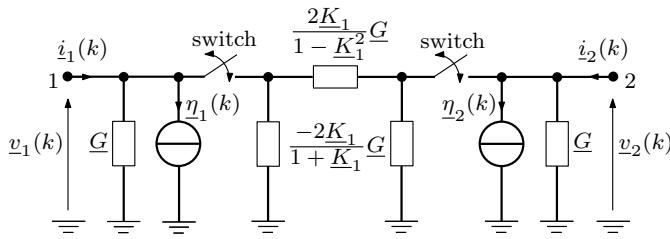  
switches closed when κ = 1

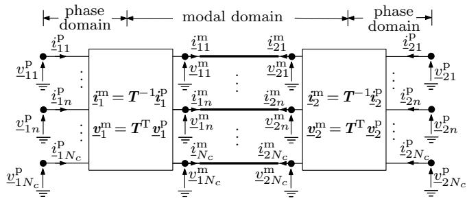  
Fig. 3. Multi-scale frequency-dependent model of single-phase line.   
Fig. 4. Decoupling of M-phase line based on modal decomposition.

around $f _ { \mathrm { c } }$ as shown in Fig. 1. When simulating electromagnetic transients, a higher frequency is used to calculate T as explained in Appendix A [24].

Through the decoupling scheme in Fig. 4, the M decoupled modes are dealt with in the same way as it is done for the single-phase model, and thus M companion models can be formulated as follows:

$$
\underline {{\boldsymbol {i}}} _ {\mathrm {L} n} ^ {\mathrm {m}} (k) = \underline {{\boldsymbol {Y}}} _ {n} ^ {\mathrm {m}} \underline {{\boldsymbol {v}}} _ {\mathrm {L} n} ^ {\mathrm {m}} (k) + \underline {{\boldsymbol {\eta}}} _ {\mathrm {L} n} ^ {\mathrm {m}} (k) \quad n = 1, 2, \dots , M. \tag {51}
$$

For mode n in (51), $\begin{array} { r } { \underline { { i } } _ { \mathrm { L } n } ^ { \mathrm { m } } = [ \underline { { i } } _ { 1 n } ^ { \mathrm { m } } , \underline { { i } } _ { 2 n } ^ { \mathrm { m } } ] ^ { \mathrm { T } } , \underline { { v } } _ { \mathrm { L } n } ^ { \mathrm { m } } = [ \underline { { v } } _ { 1 n } ^ { \mathrm { m } } , \underline { { v } } _ { 2 n } ^ { \mathrm { m } } ] ^ { \mathrm { T } } } \end{array}$ and $\underline { { \boldsymbol { Y } } } _ { n } ^ { \mathrm { m } }$ is an admittance matrix of size $2 \times 2$ as follows:

$$
\underline {{\mathbf {Y}}} _ {n} ^ {\mathrm {m}} = \left[ \begin{array}{l l} \underline {{Y}} _ {n} ^ {\mathrm {m}} (1, 1) & \underline {{Y}} _ {n} ^ {\mathrm {m}} (1, 2) \\ \underline {{Y}} _ {n} ^ {\mathrm {m}} (2, 1) & \underline {{Y}} _ {n} ^ {\mathrm {m}} (2, 2) \end{array} \right]. \tag {52}
$$

Matrix $\underline { { \boldsymbol { Y } } } _ { n } ^ { \mathrm { m } }$ is obtained in the same way as Y in (44). Thus, the shift frequency $\omega _ { \mathrm { s } }$ is available in (52) as an adjustable parameter. Moreover, as in (44) and Fig. 3, $\underline { { \boldsymbol { Y } } } _ { n } ^ { \mathrm { m } }$ allows for the insertion and removal processes of the equivalent π-circuits during the simulation run to enable multi-scale simulation of transients. By combining and rearranging the M companion models using the vector-matrix form, a modal-domain multiscale model of the multiphase line is obtained as follows:

$$
\left[ \begin{array}{l} \underline {{\boldsymbol {i}}} _ {1} ^ {\mathrm {m}} (k) \\ \underline {{\boldsymbol {i}}} _ {2} ^ {\mathrm {m}} (k) \end{array} \right] = \underline {{\boldsymbol {Y}}} ^ {\mathrm {m}} \left[ \begin{array}{l} \underline {{\boldsymbol {v}}} _ {1} ^ {\mathrm {m}} (k) \\ \underline {{\boldsymbol {v}}} _ {2} ^ {\mathrm {m}} (k) \end{array} \right] + \left[ \begin{array}{l} \underline {{\boldsymbol {\eta}}} _ {1} ^ {\mathrm {m}} (k) \\ \underline {{\boldsymbol {\eta}}} _ {2} ^ {\mathrm {m}} (k) \end{array} \right] \tag {53}
$$

where $\underline { { \boldsymbol { Y } } } ^ { \mathrm { m } }$ is detailed in Appendix D.

By introducing (49) and (50) into (53), the multi-scale line model in (53) is re-transformed into the phase domain to facilitate integration with the multi-scale simulation of [8]:

$$
\left[ \begin{array}{l} \underline {{\boldsymbol {i}}} _ {1} ^ {\mathrm {p}} (k) \\ \underline {{\boldsymbol {i}}} _ {2} ^ {\mathrm {p}} (k) \end{array} \right] = \underline {{\boldsymbol {Y}}} ^ {\mathrm {p}} \left[ \begin{array}{l} \underline {{\boldsymbol {v}}} _ {1} ^ {\mathrm {p}} (k) \\ \underline {{\boldsymbol {v}}} _ {2} ^ {\mathrm {p}} (k) \end{array} \right] + \left[ \begin{array}{l} \underline {{\boldsymbol {\eta}}} _ {1} ^ {\mathrm {p}} (k) \\ \underline {{\boldsymbol {\eta}}} _ {2} ^ {\mathrm {p}} (k) \end{array} \right] \tag {54}
$$

where $\underline { { \eta } } _ { 1 } ^ { \mathrm { p } } ~ = ~ T \underline { { \eta } } _ { 1 } ^ { \mathrm { m } } , ~ \underline { { \eta } } _ { 2 } ^ { \mathrm { p } } ~ = ~ T \underline { { \eta } } _ { 2 } ^ { \mathrm { m } }$ , and $\underline { { \mathbf { Y } } } ^ { \mathrm { p } }$ is as given in Appendix D.

# V. APPLICATION AND VALIDATION

In order to validate the proposed line model, the multi-scale transients simulation is compared with the results of a field test performed on a network section of the 525 kV system of the Bonneville Power Administration (BPA). The test system is illustrated by means of the one-line diagram of Fig. 5. The substations Raver and Schultz are linked by one double-circuit line, lines 1 and 2, and two single-circuit lines, line 3 and line 4. Line 1 at the substation Raver was initally grounded for the test. The circuit breaker (CB) was used to energize and then disconnect line 1 in order to observe the transient recovery voltage (TRV). The transposition structures of lines 1 and 2 are depicted in Fig. 6 in which the phase orders for each section are listed as bottom-middle-top. Fig. 7 shows the tower configuration of lines 1 and 2 and associated geometries.

For the purpose of comparison, the following three alternatives of representing the test system are included.

• Case 1: The system was simulated with the methodology FAST [8] in which lines 1 and 2 are modeled using the multi-scale and frequency-dependent line model as presented in Section IV. Parameters of (9) and (10) are obtained through the curve fitting technique of [22].   
• Case 2: The simulation of the system was performed in the alternative transients program (ATP), which belongs to the family of EMTP-type simulators. Lines 1 and 2 are represented through the frequency-dependent line model of [13].   
• Case 3: A field test was conducted [5], and the test results were used as a reference for the comparisons.

The modeling of the networks connected to the substations Raver and Schultz and of lines 3 and 4 follows the parameters described in Appendix E. The results for phase B of line voltage vℓ of Fig. 5 are depicted in Figs. 8(a) to 8(c), respectively. Initially, the circuit breaker CB is open. From t = 4.7 ms, the CB is closed to energize line 1, and a three-phase-to-ground short circuit occurs at the substation Raver where the closed ground switch in Fig. 5 is represented by a fault resistance with the small value of $1 \cdot 1 0 ^ { - 4 } \Omega \ [ 2 5 ] . \mathrm { A t } \ t = 4 6 . 2 \mathrm { m s }$ , phase B of CB is opened to study the TRV. At this point, phases A and C are still connected and carry short circuit currents. The electromagnetic interphase coupling during this unbalance influences the TRV of phase B.

As visible in Fig. 8(a), the proposed multi-scale line model supports the tracking of both natural and envelope waveforms within the same simulation run. The simulation starts out from a de-energized state at $t ~ = ~ 0 \mathrm { { m s } }$ . From t = 4.7 ms, electromagnetic transients do appear due to the closing of CB, and thus natural waveforms need to be tracked. A timestep size $\tau = 5 \mu \mathrm { s }$ that is small enough to simulate the fast transients of line energization is chosen. The switches of the multi-scale line model in Fig. 3 are opened due to $\tau < T _ { \mathrm { w p } }$ . As the energization transients damp out, an increasingly clean sine waveform appears. From t = 21.4 ms, the envelope is simulated by setting $f _ { \mathrm { s } } ~ = ~ 6 0 \mathrm { { H z } ~ t o }$ eliminate the carrier, and a larger time-step size of τ = 2 ms is chosen. Since $\tau > T _ { \mathrm { w p } }$ , the switches of the multi-scale line model of Fig. 3 are closed. At t = 46.2 ms, the opening of phase B of CB

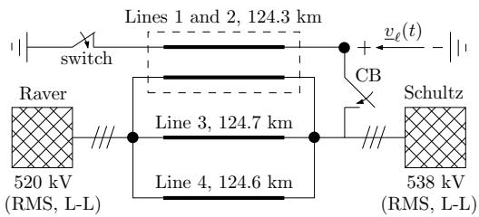

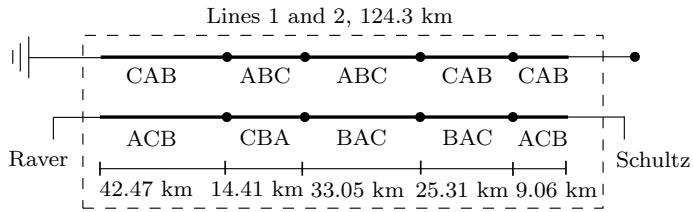  
Fig. 5. Test system of 525 kV for comparison of simulation and field test results.

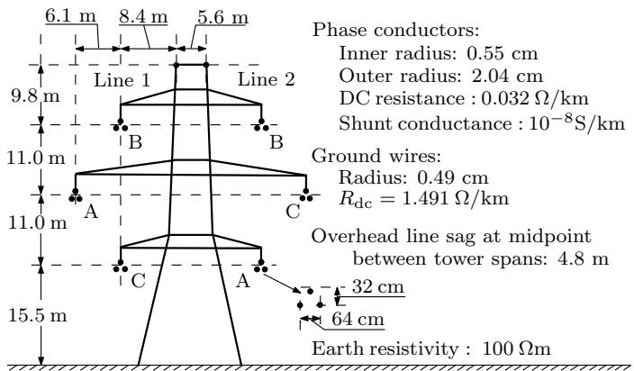  
Fig. 6. Transposition structure of lines 1 and 2.   
Fig. 7. Tower configuration of lines 1 and 2.

gives rise to a transient recovery voltage of triangular shape. Correspondingly, τ is reset to 5 µs. The switches of the multiscale line model in Fig. 3 are opened again.

Fig. 8(b) shows the results obtained with the simulator ATP. The simulation tracks natural waveforms, and a small timestep size of $\tau \ : = \ : 5 \mu \mathrm { s }$ is chosen throughout the simulation. The field measurement is depicted in Fig. 8(c).

A zoomed-in view of the TRV for the above three alternatives is shown in Fig. 9. It can be seen that the natural waveforms obtained with FAST are in close agreement with those of the ATP simulation. Of particular interest in the field test are the initial rate of rise and the first peak of the TRV. Regarding the first triangular section, the results of both FAST and ATP in Fig. 9 show a close matching with the field measurement.

To further demonstrate the quality of the modeling, the short circuit current energizing phase B of line 1 is also measured and shown in Fig. 10. It is visible that the natural waveforms obtained with the FAST simulation match those of the field measurement very closely during the energization following the closing of CB. Since the settling to steady-state and the transient recovery voltage are also closely matched, the model shows to accurately simulate very diverse transients including the tracking of both natural and envelope waveforms.

In order to further investigate the performance, the compu-

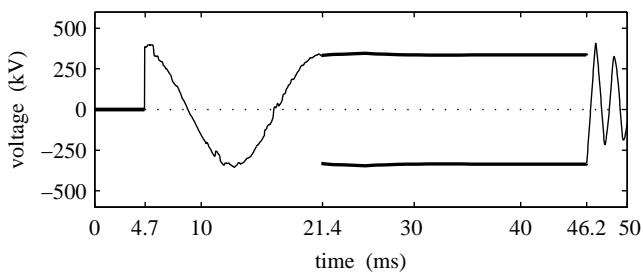

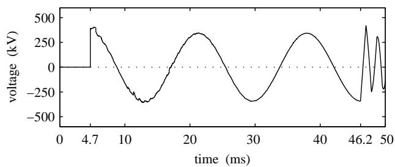  
(a) FAST simulation using proposed multi-scale frequency-dependent line model.   
(b) ATP simulation.

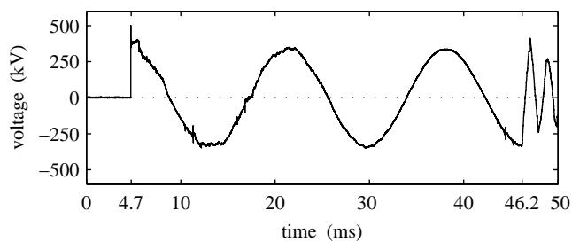  
(c) Field measurement.   
Fig. 8. Comparison of phase B of voltage vℓ obtained through simulation with various models and field measurement; solid light: natural waveform; solid bold: envelope.

tational efficiency is compared with that of a corresponding EMTP-type implementation. The latter processes real signals, while the proposed line model processes analytic signals. In the simulation of electromagnetic transients, both implementations require the same time-step size. Then, the processing of analytic versus real signals has shown to increase the computational cost by a factor of about 1.35. During the period of slow transients and steady state, the proposed line model may use a significantly larger time-step. In the above example, the timestep size increased by a factor of $( 2 \mathrm { m s } ) / ( 5 \mu \mathrm { s } ) = 4 0 0$ . Taking into account that analytic signals are processed, the speed-up of computation is still at a factor of about 300. Thus, for the simulation over longer time intervals, the computational gain is mainly given by the speed-up valid for the period of slow transients.

# VI. CONCLUSIONS

A multi-scale and frequency-dependent line model was developed, implemented, and validated. Three contributions were made in this context. Firstly, the essential mathematical steps of recursive convolution and interpolation used for line modeling in EMTP-type simulation were reformulated using analytic instead of real signals. A major distinguishing feature is given by the fact that time-step sizes below or above the

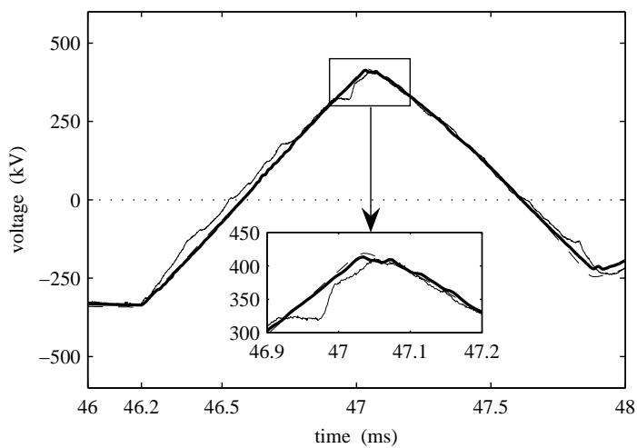  
Fig. 9. Transient recovery voltage of phase B; solid light: field test; solid bold: FAST simulation with proposed multi-scale line model; dash dot light: ATP simulation.

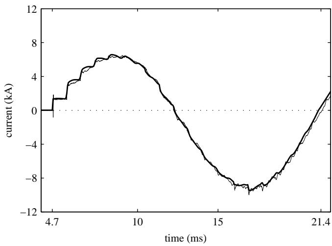  
Fig. 10. Energization current of phase B; solid light: field test; solid bold: FAST simulation with proposed multi-scale line model.

wave propagation time may be used within one simulation run. This allows both for the tracking of natural waveforms and the tracking of the envelopes given by dynamic phasors. Secondly, it was shown that the modal transformation for representing multi-phase lines is also a practical method for the multi-scale case. In the case when the wave propagation time is larger than the time-step size, the traveling wave effects pertaining to the modes are emulated involving a galvanic decoupling of both line ends within one time-step. When the wave propagation time is smaller than the time-step size, a π-segment is switched in automatically. Thirdly, the model was tested by comparison with the EMTP-type simulation and the results of a staged field test. The tests have validated the methodology in terms of accuracy and efficiency, showing that both slow transients as well as the fast transients of energization and transient recovery can be tracked.

# APPENDIX A TRANSFORMATION MATRIX IN MULTI-PHASE LINE MODELING

An M -phase line model with frequency-dependent parameters can be formulated in the modal domain by using the modal decomposition, which is obtained via a transformation matrix $\underline { { \mathbf { \delta T } } } ( \omega )$ . The latter can be derived from the eigenvalueeigenvector theory to diagonalize the products $\underline { { Y } } ^ { \prime } ( \omega ) \underline { { Z } } ^ { \prime } ( \omega )$ and $\underline { { Z } } ^ { \prime } ( \omega ) \underline { { Y } } ^ { \prime } ( \omega )$ as follows [24], [26]:

$$
\underline {{\boldsymbol {\Lambda}}} (\omega) = \underline {{\boldsymbol {T}}} ^ {- 1} (\omega) \underline {{\boldsymbol {Y}}} ^ {\prime} (\omega) \underline {{\boldsymbol {Z}}} ^ {\prime} (\omega) \underline {{\boldsymbol {T}}} (\omega) \tag {55}
$$

$$
\underline {{\boldsymbol {\Lambda}}} (\omega) = \underline {{\boldsymbol {T}}} ^ {\mathrm {T}} (\omega) \underline {{\boldsymbol {Z}}} ^ {\prime} (\omega) \underline {{\boldsymbol {Y}}} ^ {\prime} (\omega) \left(\underline {{\boldsymbol {T}}} ^ {\mathrm {T}}\right) ^ {- 1} (\omega) \tag {56}
$$

where $\underline { { Z ^ { \prime } } } ( \omega )$ and $\underline { { \boldsymbol { Y } } } ^ { \prime } ( \omega )$ are the per-unit-length series impedance and shunt admittance matrices of dimension $M \times$ $M ,$ , respectively; $\underline { { \mathbf { \Pi } } } ( \omega )$ contains the eigenvalues as the diagonal elements. The frequency used for the transformation is found in accordance with the algorithm in [8] where the frequencies with significant contributions to the Fourier spectrum are determined. The transformation matrices for diverse frequencies can be precalculated using the fitting procedure before the simulation starts. Recent research on the modal transform has proven the accuracy of the technique for modeling transmission lines [14]. In many practical cases, a real and constant transformation matrix $_ { \mathbf { \delta T } }$ is preferred for the study of specific electromagnetic phenomena on overhead lines [24], and it is computed here in the test at 5 kHz.

# APPENDIX B LINEAR INTERPOLATION IN MULTI-SCALE LINE MODELING

In order to calculate the shifted analytic signals ${ \mathcal { S } } [ { \underline { { s } } } ( t - T _ { \mathrm { w p } } ) ]$ at instant $( t \mathrm { ~ - ~ } T _ { \mathrm { w p } } )$ , the usage of linear interpolation in [8] is appropriate whenever $T _ { \mathrm { w p } }$ is not an integer multiple of time-step size τ :

$$
\begin{array}{l} \mathcal {S} [ \underline {{s}} (t - T _ {\mathrm {w p}}) ] = \left(\kappa - \frac {T _ {\mathrm {w p}}}{\tau}\right) \mathcal {S} [ \underline {{s}} (t - (\kappa - 1) \tau) ] \\ + \left(1 - \kappa + \frac {T _ {\mathrm {w p}}}{\tau}\right) \mathcal {S} [ \underline {{s}} (t - \kappa \tau) ] \tag {57} \\ \end{array}
$$

where κ = ceil $( T _ { \mathrm { w p } } / \tau )$ , and ceil is a function that rounds a real number to the nearest integer greater than or equal to itself. Setting $\kappa = 1$ corresponds to the case when $\tau \geq T _ { \mathrm { w p } } ,$ , and $\kappa > 1$ corresponds to the case when $\tau < T _ { \mathrm { w p } }$ . Multiplication of both sides of (57) by $\mathrm { e } ^ { \mathrm { j } \omega _ { \mathrm { s } } ( t - T _ { \mathrm { w p } } ) }$ yields

$$
\underline {{s}} (t - T _ {\mathrm {w p}}) = \underline {{\rho}} \underline {{s}} (t - (\kappa - 1) \tau) + \underline {{\sigma}} \underline {{s}} (t - \kappa \tau) \tag {58}
$$

with

$$
\begin{array}{l} \underline {{\rho}} = \left(\kappa - \frac {T _ {\mathrm {w p}}}{\tau}\right) \mathrm {e} ^ {\mathrm {j} \omega_ {\mathrm {s}} (\kappa \tau - \tau - T _ {\mathrm {w p}})} \\ \underline {{\sigma}} = \left(1 - \kappa + \frac {T _ {\mathrm {w p}}}{\tau}\right) \mathrm {e} ^ {\mathrm {j} \omega_ {\mathrm {s}} (\kappa \tau - T _ {\mathrm {w p}})}. \\ \end{array}
$$

# APPENDIX CDETAILS OF LINE MODEL PARAMETERS

Variables $\underline { { K } } _ { 2 } , \ \underline { { K } } _ { 3 } , \ \underline { { h } } _ { \mathrm { r 1 } }$ , and $\underline { { h } } _ { \mathrm { r 2 } }$ in (39) and (40) are expressed as

$$
\begin{array}{l} \underline {{K}} _ {2} = \underline {{\sigma}} \sum_ {n = 1} ^ {N _ {\mathrm {h}}} h _ {n} \underline {{\alpha}} _ {\mathrm {r n}} + \underline {{\rho}} \sum_ {n = 1} ^ {N _ {\mathrm {h}}} h _ {n} \underline {{\beta}} _ {\mathrm {r n}}, \quad \underline {{K}} _ {3} = \underline {{\sigma}} \sum_ {n = 1} ^ {N _ {\mathrm {h}}} h _ {n} \underline {{\beta}} _ {\mathrm {r n}}, \\ \underline {{h}} _ {\mathrm {r} 1} (t - \tau) = \sum_ {n = 1} ^ {N _ {\mathrm {h}}} h _ {n} \mathrm {e} ^ {p _ {\mathrm {h} n} \tau} \underline {{q}} _ {1 n} (t - \tau), \\ \underline {{h}} _ {\mathrm {r} 2} (t - \tau) = \sum_ {n = 1} ^ {N _ {\mathrm {h}}} h _ {n} \mathrm {e} ^ {p _ {\mathrm {h n}} \tau} \underline {{q}} _ {2 n} (t - \tau). \\ \end{array}
$$

# APPENDIX D ADMITTANCE MATRICES IN MULTI-PHASE LINE MODELS

The definition of $\underline { { \boldsymbol { Y } } } ^ { \mathrm { m } }$ in (53) is

$$
\underline {{\boldsymbol {Y}}} ^ {\mathrm {m}} = \left[ \begin{array}{c c} \underline {{\boldsymbol {Y}}} _ {1 1} ^ {\mathrm {m}} & \underline {{\boldsymbol {Y}}} _ {1 2} ^ {\mathrm {m}} \\ \underline {{\boldsymbol {Y}}} _ {2 1} ^ {\mathrm {m}} & \underline {{\boldsymbol {Y}}} _ {2 2} ^ {\mathrm {m}} \end{array} \right]
$$

with

$$
\begin{array}{l} \underline {{Y}} _ {1 1} ^ {\mathrm {m}} = \operatorname {d i a g} [ \underline {{Y}} _ {1} ^ {\mathrm {m}} (1, 1), \underline {{Y}} _ {2} ^ {\mathrm {m}} (1, 1), \dots , \underline {{Y}} _ {M} ^ {\mathrm {m}} (1, 1) ] \\ \underline {{Y}} _ {1 2} ^ {\mathrm {m}} = \operatorname {d i a g} [ \underline {{Y}} _ {1} ^ {\mathrm {m}} (1, 2), \underline {{Y}} _ {2} ^ {\mathrm {m}} (1, 2), \dots , \underline {{Y}} _ {M} ^ {\mathrm {m}} (1, 2) ] \\ \underline {{Y}} _ {2 1} ^ {\mathrm {m}} = \operatorname {d i a g} [ \underline {{Y}} _ {1} ^ {\mathrm {m}} (2, 1), \underline {{Y}} _ {2} ^ {\mathrm {m}} (2, 1), \dots , \underline {{Y}} _ {M} ^ {\mathrm {m}} (2, 1) ] \\ \underline {{Y}} _ {2 2} ^ {\mathrm {m}} = \operatorname {d i a g} \left[ \underline {{Y}} _ {1} ^ {\mathrm {m}} (2, 2), \underline {{Y}} _ {2} ^ {\mathrm {m}} (2, 2), \dots , \underline {{Y}} _ {M} ^ {\mathrm {m}} (2, 2) \right]. \\ \end{array}
$$

The definition of $\underline { { \mathbf { Y } } } ^ { \mathrm { p } }$ in (54) is

$$
\underline {{\boldsymbol {Y}}} ^ {\mathrm {p}} = \left[ \begin{array}{c c} \boldsymbol {T} & 0 \\ 0 & \boldsymbol {T} \end{array} \right] \underline {{\boldsymbol {Y}}} ^ {\mathrm {m}} \left[ \begin{array}{c c} \boldsymbol {T} ^ {\mathrm {T}} & 0 \\ 0 & \boldsymbol {T} ^ {\mathrm {T}} \end{array} \right].
$$

# APPENDIX E

# ADDITIONAL PARAMETERS OF FIELD TEST SYSTEM

The electric power networks connected to the substations Raver and Schultz in Fig. 5 are represented by the equivalent circuit as shown in Fig. 11. The elements $R _ { \mathrm { c } }$ and $L _ { \mathrm { c } }$ model lumped parameters, and $Z _ { \mathrm { s } }$ models the equivalent surge impedance of external transmission networks. The parameters of the networks are given in Table I, where subscripts 0 and 1 indicate zero and positive sequences, respectively. To focus on the frequency-dependent phenomena on lines 1 and 2, a constant distributed parameter model is used for lines 3 and 4. The per unit length resistances $R ^ { \prime } ,$ , inductances $L ^ { \prime } ,$ , and capacitances $C ^ { \prime }$ of lines 1, 2, 3, and 4 are given in Table II for zero and positive sequences as denoted respectively by subscripts 0 and 1. For reference purposes, constant distributed parameters are also given for lines 1 and $^ { 2 , }$ although those are not used in simulations performed for this paper. Tables I and II modify and replace data given in [5], [8].

# ACKNOWLEDGMENT

The authors would like to thank Dr. Feng Gao of Tsinghua University for his valuable discussions and suggestions. From 2008 to 2010, Dr. Feng Gao worked as a research fellow at the Technische Universität Berlin, Berlin, Germany.

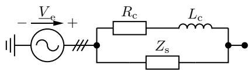  
Fig. 11. Structure of equivalent networks connected to Raver and Schultz substations.

TABLE IPARAMETERS OF EQUIVALENT NETWORKS.  
TABLE II FREQUENCY-INDEPENDENT PARAMETERS OF TRANSMISSION LINES.   

<table><tr><td>Net-work</td><td>Ve(kV)</td><td>∠Ve(°)</td><td>Rc0(Ω)</td><td>Rc1(Ω)</td><td>Lc0(mH)</td><td>Lc1(mH)</td><td>Zs0(Ω)</td><td>Zs1(Ω)</td></tr><tr><td>Raver</td><td>425.0</td><td>50.7</td><td>2.59</td><td>1.38</td><td>77.9</td><td>69.4</td><td>86.0</td><td>56.0</td></tr><tr><td>Schultz</td><td>437.4</td><td>55.0</td><td>4.88</td><td>0.77</td><td>124.9</td><td>50.4</td><td>107.5</td><td>86.0</td></tr></table>

<table><tr><td>Line no.</td><td>10R0(Ω/km)</td><td>100R1(Ω/km)</td><td>L0(mH/km)</td><td>L1(mH/km)</td><td>C0(nF/km)</td><td>C1(nF/km)</td></tr><tr><td>1&amp;2</td><td>1.90</td><td>1.26</td><td>3.35</td><td>0.89</td><td>6.77</td><td>12.61</td></tr><tr><td>3</td><td>2.02</td><td>2.39</td><td>3.73</td><td>1.23</td><td>5.46</td><td>9.26</td></tr><tr><td>4</td><td>1.98</td><td>2.06</td><td>3.62</td><td>1.07</td><td>6.77</td><td>10.81</td></tr></table>

# REFERENCES

[1] H. W. Dommel, “Digital computer solution of electromagnetic transients in single- and multiphase networks,” IEEE Trans. Power App. Syst., vol. PAS-88, no. 4, pp. 388–399, Apr. 1969.   
[2] N. Watson and J. Arrillaga, Power Systems Electromagnetic Transients Simulation. London, U.K.: Institution of Electrical Engineers, 2003.   
[3] K. Strunz, “Position-dependent control of numerical integration in circuit simulation,” IEEE Trans. Circuits Syst. II, Exp. Briefs, vol. 51, no. 10, pp. 561–565, Oct. 2004.   
[4] A. M. Stankovic and T. Aydin, “Analysis of asymmetrical faults in power ´ systems using dynamic phasors,” IEEE Trans. Power Syst., vol. 15, no. 3, pp. 1062–1068, Aug. 2000.   
[5] K. Strunz, R. Shintaku, and F. Gao, “Frequency-adaptive network modeling for integrative simulation of natural and envelope waveforms in power systems and circuits,” IEEE Trans. Circuits Syst. I, vol. 53, no. 12, pp. 2788–2803, Dec. 2006.   
[6] P. Zhang, J. R. Martí, and H. W. Dommel, “Shifted-frequency analysis for EMTP simulation of power-system dynamics,” IEEE Trans. Circuits Syst. I, vol. 57, no. 9, pp. 2564–2574, 2010.   
[7] X. Guillaud, M. O. Faruque, A. Teninge, A. H. Hariri, L. Vanfretti, M. Paolone, V. Dinavahi, P. Mitra, G. Lauss, C. Dufour, P. Forsyth, A. K. Srivastava, K. Strunz, T. Strasser, and A. Davoudi, “Applications of real-time simulation technologies in power and energy systems,” IEEE Power Energy Technol. Syst. J., vol. 2, no. 3, pp. 103–115, Sep. 2015.   
[8] F. Gao and K. Strunz, “Frequency-adaptive power system modeling for multi-scale simulation of transients,” IEEE Trans. Power Syst., vol. 24, no. 2, pp. 561–571, May 2009.   
[9] P. Zhang, J. R. Martí, and H. W. Dommel, “Synchronous machine modeling based on shifted frequency analysis,” IEEE Trans. Power Syst., vol. 22, no. 3, pp. 1139–1147, 2007.   
[10] F. Gao and K. Strunz, “Multi-scale simulation of multi-machine power systems,” Int. J. Elect. Power & Energy Syst., vol. 31, no. 9, pp. 538–545, Oct. 2009.   
[11] Y. Huang, M. Chapariha, F. Therrien, J. Jatskevich, and J. R. Martí, “A constant-parameter voltage-behind-reactance synchronous machine model based on shifted-frequency analysis,” IEEE Trans. Energy Convers., vol. 30, no. 2, pp. 761–771, June 2015.   
[12] Y. Huang, F. Therrien, J. Jatskevich, and L. Dong, “State-space voltagebehind-reactance modeling of induction machines based on shiftedfrequency analysis,” in Proc. IEEE PES Gen. Meeting, Denver, CO, USA, Jul. 2015, pp. 1–5.   
[13] J. R. Martí, “Accurate modeling of frequency-dependent transmission lines in electromagnetic transient simulations,” IEEE Trans. Power App. Syst., vol. PAS-101, no. 1, pp. 147–157, Jan. 1982.

[14] B. Gustavsen, “Modal domain-based modeling of parallel transmission lines with emphasis on accurate representation of mutual coupling effects,” IEEE Trans. Power Del., vol. 27, no. 4, pp. 2159–2167, Oct. 2012.   
[15] ——, “Avoiding numerical instabilities in the universal line model by a two-segment interpolation scheme,” IEEE Trans. Power Del., vol. 28, no. 3, pp. 1643–1651, Jul. 2013.   
[16] T. Noda, “Application of frequency-partitioning fitting to the phasedomain frequency-dependent modeling of overhead transmission lines,” IEEE Trans. Power Del., vol. 30, no. 1, pp. 174–183, Feb. 2015.   
[17] A. Lima and M. Y. Tomasevich, “Numerical issues in line models based on a thin wire above a lossy ground,” IEEE Trans. Electromagn. Compat., vol. 57, no. 3, pp. 555–564, Jun. 2015.   
[18] M. Y. Tomasevich and A. Lima, “Impact of frequency-dependent soil parameters in the numerical stability of image approximation-based line models,” IEEE Trans. Electromagn. Compat., vol. 58, no. 1, pp. 323– 326, Feb. 2016.   
[19] S. K. Mitra, Digital Signal Processing: A Computer-Based Approach, 2nd ed. New York: McGraw-Hill, 2001.   
[20] H. D. Lüke, Signalübertragung, 4th ed. Berlin, Germany: Springer-Verlag, 1990.   
[21] J. A. Martinez-Velasco, Power System Transients: Parameter Determination. Boca Raton: CRC Press, 2010.   
[22] B. Gustavsen and A. Semlyen, “Rational approximation of frequency domain responses by vector fitting,” IEEE Trans. Power Del., vol. 14, no. 3, pp. 1052–1061, Jul. 1999.   
[23] A. Semlyen and A. Dabuleanu, “Fast and accurate switching transient calculations on transmission lines with ground return using recursive convolutions,” IEEE Trans. Power App. Syst., vol. PAS-94, no. 2, pp. 561–571, Mar./Apr. 1975.   
[24] H. W. Dommel, EMTP Theory Book, 2nd ed. Vancouver, BC, Canada: Microtran Power System Analysis Corporation, 1992.   
[25] A. L. Johnson, “Analysis of circuit breaker transient recovery voltages resulting from transmission line faults,” Master’s thesis, Univ. of Washington, Seattle, 2003.   
[26] L. M. Wedepohl, H. V. Nguyen, and G. D. Irwin, “Frequency-dependent phase-domain transformation matrices for untransposed transmission lines using Newton-Raphson method,” IEEE Trans. Power Syst., vol. 11, no. 3, pp. 1538–1546, Aug. 1996.

Hua Ye received the B.S. and M.S. degrees in electrical engineering from the China Agricultural University, Beijing, China, in 2006 and 2008, respectively. He received his Ph.D. degree in electrical engineering from the Technische Universität Berlin, Germany, in 2013.

Currently, he is an Assistant Professor at the Institute of Electrical Engineering, Chinese Academy of Sciences, Beijing, China. His research interests include modeling of power system transients, computational methods, integration of wind power, and

  
HVDC grids.

Kai Strunz graduated with the Dipl.-Ing. degree from the University of Saarland in Saarbrücken, Germany, in 1996, and he was awarded the Dr.-Ing. degree with summa cum laude from the same university in 2001. From 1995 to 1997, he pursued research at Brunel University in London. From 1997 to 2002, Dr. Strunz worked at the Division Recherche et Développement of Electricité de France (EDF) in the Paris area. From 2002 to 2007, he was Assistant Professor of Electrical Engineering at the University of Washington in Seattle. Since September 2007, he

has been Professor for Sustainable Electric Networks and Sources of Energy at Technische Universität Berlin.

Dr. Strunz is Chairman of the IEEE PES Subcommittee on Distributed Energy Resources. He is recipient of the IEEE PES Prize Paper Award 2015 and the IEEE Journal of Emerging and Selected Topics in Power Electronics First Prize Paper Award 2015. Dr. Strunz was the chairman of the conference IEEE PES Innovative Smart Grid Technologies held at TU Berlin from 14 to 17 October 2012. On behalf of the Intergovernmental Panel on Climate Change (IPCC), Dr. Strunz acted as Review Editor for the Special Report on Renewable Energy Sources and Climate Change Mitigation.