# Improvement of Numerical Stability for the Computation of Transients in Lines and Cables

Ilhan Kocar, Student Member, IEEE, Jean Mahseredjian, Senior Member, IEEE, and Guy Olivier, Senior Member, IEEE

Abstract—This paper discusses numerical stability problems of a frequency-dependent transmission-line and cable modeling approach used for electromagnetic transient analysis. Time-domain numerical errors due to the discrete computation of convolution integrals can be estimated in terms of transfer function parameters for a given line or cable model. Based on this estimation, a methodology for the improvement of numerical stability is presented. The numerical advantages of the new method are supported by demonstrations and comparisons with existing models. The method presented in this paper is applicable to power cables and transmission lines.

Index Terms—Electromagnetic transients, Electromagnetic Transients Program (EMTP), fitting, wideband line and cable model.

# I. INTRODUCTION

I N the simulation of electromagnetic transients with themethod of characteristics (MoC), transmission lines and cables can be characterized by two matrix functions in the frequency domain: for the propagation function and ${ \bf Y _ { c } }$ for characteristic admittance. Although many works are related to the meticulous fitting and modeling of transmission line and cable functions in the frequency domain, numerical stability problems of existing models in the time domain remain complex and require further research.

Existing frequency-dependent line and cable models in the Electromagnetic Transients Program (EMTP) approximate transmission system functions with rational transfer functions over a range of frequencies in order to properly assess electromagnetic transients [1]–[3]. Rational function approximations are preferred as they allow an efficient computation of convolution integrals in the time domain with a recursive scheme [4]. Convolution integrals are, in general, computed via numerical integration techniques in the time domain in accordance with the discrete timestep of the EMTP simulation.

The numerical computation of convolution integrals, including terms, is associated with two error conditions. The first error is due to the conversion of the integral to difference equations (truncation error) and the second is due to the interpolation on input as a result of modal time delays of . These

delays are not, in general, integer multiples of the simulation step in EMTP. In the modeling approach presented in [3] for the universal line model (ULM), every modal time delay is present in each element of ; therefore, the interpolation error may have an important effect.

In this paper, and ${ \bf Y _ { c } }$ are identified by using partial fraction expansions (PFE) in the frequency domain, in conformity with [3]. Then, the convolution integrals expressed with state-space equations are used to estimate local numerical errors in terms of PFE variables. Based on this relation between errors and PFE variables, constraints are determined for residue/pole ratios so that time-domain errors are confined within a safe boundary. In the proposed approach, the identification in phase domain becomes a constrained linear least-squares problem.

# II. BACKGROUND

# A. General Description of the Transient-Line Equations

The voltage and current relations of an arbitrary transmission line or cable (transmission device) connected between arbitrary ends and can be written in the frequency domain as (see [5])

$$
\mathbf {I} _ {k} = \mathbf {Y} _ {\mathbf {c}} \mathbf {V} _ {k} - \mathbf {H} \left(\mathbf {Y} _ {\mathbf {c}} \mathbf {V} _ {m} + \mathbf {I} _ {m}\right) \tag {1}
$$

where and represent current and voltage column vectors of dimension $N _ { c }$ standing for the number of conductors. Matrices and vectors are denoted with bold characters. The $N _ { c }$ by $N _ { c }$ matrices for propagation and characteristic admittance are given by

$$
\mathbf {H} = e ^ {(- \sqrt {\mathbf {Y} _ {\mathrm {s}} \mathbf {Z} _ {\mathrm {s}}} \ell)} \tag {2}
$$

$$
\mathbf {Y} _ {\mathrm {c}} = \sqrt {\mathbf {Y} _ {\mathrm {s}} \mathbf {Z} _ {\mathrm {s}} ^ {- 1}} \tag {3}
$$

where is the length of the transmission device, ${ \bf Y _ { s } }$ is the shunt admittance matrix per-unit length, and $\mathbf { Z _ { s } }$ is the series impedance matrix per-unit length. Both matrices are numerically available from the geometry and electrical parameters of the line or cable [6], [7].

The time-domain solution of (1) is obtained by applying convolution

$$
\mathbf {i} _ {k} = \mathbf {y} _ {\mathbf {c}} * \mathbf {v} _ {k} - \mathbf {h} * \mathbf {u} _ {m} \tag {4}
$$

where

$$
\mathbf {u} _ {m} = \mathbf {y} _ {\mathbf {c}} * \mathbf {v} _ {m} + \mathbf {i} _ {m}. \tag {5}
$$

A widely accepted approach in EMTP-type computations is to use rational transfer function approximations for and ${ \bf Y _ { c } }$ in order to solve (4). The convolution integrals of (4) are computed at each discrete solution timepoint.

Manuscript received November 06, 2008; revised February 20, 2009, May 24, 2009. First published February 02, 2010; current version published March 24, 2010. Paper no. TPWRD-00833-2008.

The authors are with École Polytechnique de Montréal, Montréal H3T 1J4 QC, Canada (e-mail: jeanm@polymtl.ca).

Color versions of one or more of the figures in this paper are available online at http://ieeexplore.ieee.org.

Digital Object Identifier 10.1109/TPWRD.2009.2037633

# B. Adopted Frequency-Domain Model

This paper is based on the ULM formulation [3]. For a multiphase transmission system, contains different propagation modes with different velocities. As explained in [3], is first decomposed into modes, then a proper time delay is assigned to each mode. Finally, these modes are used for the identification of . The more detailed procedure for obtaining a phase-domain model is summarized below for setting the stage for the following sections.

First, propagation modes are determined by using a frequency-dependent transformation matrix for a predefined range of frequencies at discrete frequency samples

$$
\mathbf {H} = e ^ {\left(\mathbf {T} \boldsymbol {\Lambda} \mathbf {T} ^ {- 1}\right)} = \mathbf {T} e ^ {\boldsymbol {\Lambda}} \mathbf {T} ^ {- 1} \tag {6}
$$

where the modal version of is

$$
\mathbf {H} _ {m} = e ^ {\boldsymbol {\Lambda}}. \tag {7}
$$

is a diagonal matrix containing the eigenvalues of the exponentiated term in (2), and is the matrix of eigenvectors. Then, each distinct propagation mode can be fitted with a PFE [8], [9] using the least-squares method

$$
H _ {m} \cong e ^ {- (s \tau_ {m})} \sum_ {n = 1} ^ {N} \frac {\hat {c} _ {m n}}{s + p _ {m n}} \tag {8}
$$

where is the complex angular frequency and $\tau _ { m }$ is a constant time delay attributed to mode . Some propagation modes may be identical or may become very close to each other. In this case, these propagation modes can be lumped as one delay group before proceeding to the PFE approximation (8).

As the mathematical description of in (6) suggests, all modes are present in all elements of as their poles given in (8). Thus, keeping the poles of propagation modes as known variables, the residues for phase-domain fitting of each matrix element $i j$ of can be calculated by

$$
H _ {i j} (s) \cong \sum_ {m = 1} ^ {M} \left(\sum_ {n = 1} ^ {N _ {m}} \frac {c _ {i j _ {m n}}}{s + p _ {m n}}\right) e ^ {- (s \tau_ {m})} \tag {9}
$$

where is the number of propagation modes and $N _ { m }$ is the order of PFE corresponding to propagation mode . In this paper, this model is called the wideband (WB) model due to its implementation in software used in the numerical examples section.

The fitting problems related to the characteristic admittance matrix ${ \bf Y _ { c } }$ are less stringent. It is recalled here that in the WB model [3], the poles of ${ \bf Y _ { c } }$ are obtained by fitting the matrix trace and then residues are identified again with the least-squares technique. Therefore, each element of ${ \bf Y _ { c } }$ has the same set of poles

$$
Y _ {c _ {i j}} (s) \cong \sum_ {n = 1} ^ {N} \frac {\tilde {c} _ {i j n}}{s + \tilde {p} _ {n}} + d _ {i j} \tag {10}
$$

where $d _ { i j }$ is the value at the infinite frequency.

# C. Pitfalls in the Adopted Model

Equation (9) assumes that the frequency-dependent contribution of modes to each matrix element can be adjusted with

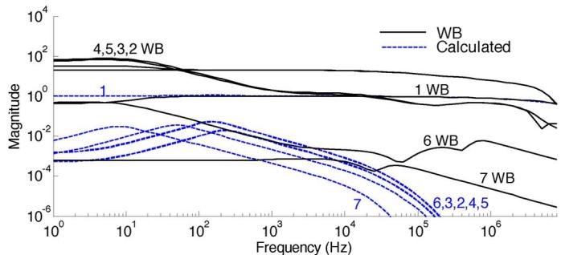  
Fig. 1. Magnitude of PFE of delay groups forming $H _ { 1 1 } ,$ the solid line is WB fitting, and the dashed line is from calculated contributions.

residues. In other words, the influence of the transformation matrix can be compensated with residues. Moreover, the presence of some modes may be weak in certain elements of and residue/pole pairs of these modes may also improve the phase-domain fitting. In general, the aforementioned assumption gives high-quality fitting results. It has been observed, however, that in some cases, the WB model may encounter numerical instabilities in the time-domain solution.

Equation (9) is an overdetermined problem containing multiple delay groups, and the problem is solved by using the leastsquares method. The only criterion is the minimization of the difference between fitted and calculated responses. Even though the combination of delay groups fits H perfectly, the PFE of separate delay groups in (9) does not necessarily match the isolated contribution of each mode which can be calculated through (6)

$$
H _ {i j, m} = \left[ \mathbf {T} e ^ {\boldsymbol {\Lambda} _ {m}} \mathbf {T} ^ {- 1} \right] _ {i j} \neq \left(\sum_ {n = 1} ^ {N _ {m}} \frac {c _ {i j m n}}{s + p _ {m n}}\right) e ^ {- (s \tau_ {m})} \tag {11}
$$

where $e ^ { \boldsymbol { \Lambda } _ { m } }$ is a matrix containing only one nonzero diagonal element for mode . Consequently, the solution may come up with delay groups having unexpectedly high magnitude curves with high residue pole ratios. This may lead to numerically unstable models in the time-domain solution. It is noticed that it is usually the case when the time delays are not significantly apart from each other, such as in short-length cables.

Consider, for example, a 1-km cable with six phases for a total of 12 conductors as detailed in [8]. The WB model accurately fits the and ${ \bf Y _ { c } }$ matrices for this system, but as demonstrated later in this paper, it generates an unstable time-domain model. In this case, there are seven distinct delay groups. The magnitude curves (right-hand side of inequality in (11)) of these delay groups present in $H _ { 1 1 }$ are shown in Fig. 1, together with the calculated contributions of each delay group (left-hand side of inequality in (11)). It is noticed that there is a magnification effect when using the WB approach. Although the magnitude curves are significantly different, the final result obtained from the summations of the groups in each case provides a very close match with an rms error of $1 . 4 9 \times 1 0 ^ { - 3 }$ for the given frequency range as seen in Fig. 2. Similar results are obtained for other elements of . Fitting results for diagonal elements are shown in Fig. 3. A perfect match is also obtained for phase angles.

It will be shown in this paper that the numerical instability problem in the time-domain solution can be eliminated by scaling residues in terms of corresponding pole values. Then, (9) is solved as a constrained linear least-squares problem for

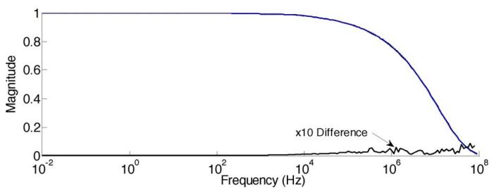  
Fig. 2. Magnitude of $H _ { 1 1 }$ , the solid line is the WB solution, the dashed line is calculated solution (overlapped), and the difference (error) is magnified by 10.

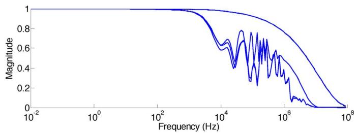  
Fig. 3. Fitting performance for diagonal elements of , the solid line is the WB solution and the dashed line (overlapped) is the calculated solution.

unknown residues and abnormal fitting schemes, such as in Fig. 1, are avoided.

# D. Passivity Verification

It has been verified that for the system described before, there are no unstable poles in the synthesized and ${ \bf Y _ { c } }$ matrices. However, merely using unstable poles may not entail a stable time-domain simulation. Passivity should be also preserved since passivity violations may induce unreal numerical oscillations. Transmission devices are passive by definition. However, it is the time-domain model that may introduce passivity violations due to improper selection of the frequency band for fitting and/or poor fitting. It is shown in [10] that the ULM formulation can lead to large out-of-band passivity violations. The approach in [10] is considered in this paper in order to avoid out-of-band passivity violations.

The passivity of the MoC model of a transmission device requires that the resulting nodal admittance matrix be positive definite. The nodal admittance matrix $\mathbf { Y _ { n } } ,$ in terms of the MoC model parameters, is given by [10] and [11], as shown in (12), at the bottom of the page, where $\mathbf { Y _ { n } }$ is positive definite if and only if its Hermitian part ${ \bf Y } _ { { \bf n } _ { H } }$ has only positive eigenvalues

$$
\operatorname {e i g} \left(\mathbf {Y} _ {\mathbf {n} _ {H}}\right) = \operatorname {e i g} \left[ \frac {1}{2} \left(\mathbf {Y} _ {\mathbf {n}} + \mathbf {Y} _ {\mathbf {n}} ^ {H}\right) \right] > 0 \tag {13}
$$

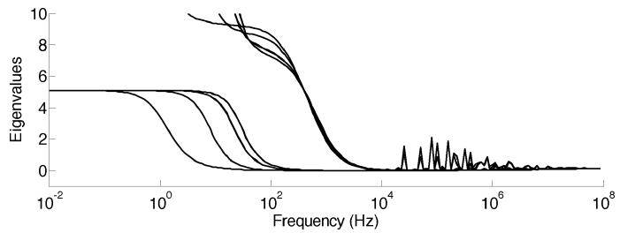  
Fig. 4. Eigenvalues of $\mathbf { Y } _ { \mathbf { n } _ { H } }$

where $\mathbf { Y } _ { \mathbf { n } } ^ { H }$ is the conjugate transpose of ${ \bf Y _ { n } }$ . The eigenvalues of ${ \bf Y } _ { { \bf n } _ { H } }$ are plotted in Fig. 4 and no passivity violation is observed. Therefore, in this case, passivity is discarded as the cause of numerical instabilities in the time-domain solution.

# E. Alternative Frequency-Domain Models

In the interest of justification of the selected frequency-domain model (9), alternative models currently used in EMTP are discussed here.

If the transformation matrix is approximated as a constant and real matrix, the convolution of (4) can be efficiently calculated in the modal domain as accomplished in the frequency-dependent (FD) line model in [1]. However, this approach does not provide an accurate solution if there is a strong variation of with frequency.

The full frequency-dependent FDQ cable model [2] solves the problem of a strongly frequency-dependent by fitting the elements of this matrix with rational functions in the frequency domain. The result is a large number of multiple recursive convolutions in the time domain which may induce numerical instabilities due to computational errors. Also, it is not always possible to fit the elements of with stable poles.

# III. STATE-SPACE REPRESENTATION OF CONVOLUTIONS

To present the method proposed in this paper, it is necessary to recall the solution process for (1) and then perform error analysis.

# A. Definition of the Problem

The frequency-domain multiplication of in (1) with a generic excitation at the arbitrary end can be written as

$$
\mathbf {Y} = \mathbf {H U} \tag {14}
$$

where is the term between parenthesis in (1)

$$
\mathbf {U} = \mathbf {Y} _ {\mathbf {c}} \mathbf {V} _ {m} + \mathbf {I} _ {m}. \tag {15}
$$

$$
\mathbf {Y} _ {\mathrm {n}} = \left[ \begin{array}{c c} (\mathbf {I} - \mathbf {H} ^ {2}) ^ {- 1} (\mathbf {I} + \mathbf {H} ^ {2}) \mathbf {Y} _ {\mathrm {c}} & - 2 (\mathbf {I} - \mathbf {H} ^ {2}) ^ {- 1} \mathbf {H} \mathbf {Y} _ {\mathrm {c}} \\ - 2 (\mathbf {I} - \mathbf {H} ^ {2}) ^ {- 1} \mathbf {H} \mathbf {Y} _ {\mathrm {c}} & (\mathbf {I} - \mathbf {H} ^ {2}) ^ {- 1} (\mathbf {I} + \mathbf {H} ^ {2}) \mathbf {Y} _ {\mathrm {c}} \end{array} \right]. \tag {12}
$$

The phase-domain approximation of in (9) can be introduced into (14), then the th element of can be written as

$$
Y _ {i} \cong \sum_ {j = 1} ^ {N _ {c}} \left[ \sum_ {m = 1} ^ {M} \left(\sum_ {n = 1} ^ {N _ {m}} \frac {c _ {i j m n}}{s + p _ {m n}}\right) e ^ {(- s, \tau_ {m})} U _ {j} \right]. \tag {16}
$$

# B. Error Analysis

For the sake of error analysis, it is useful to show the statespace representation for each group of residues and poles corresponding to a distinct delay group. In the first inner sum of (16)

$$
Y _ {i, j m} = \left(\sum_ {n = 1} ^ {N _ {m}} \frac {c _ {i j m n}}{s + p _ {m n}}\right) e ^ {(- s \cdot \tau_ {m})} U _ {j}. \tag {17}
$$

Equation (17) can be interpreted as the contribution of modal delay group , present in the element of to $Y _ { i } .$ . The following version of (17) is written to simplify notation:

$$
Y = \sum_ {n = 1} ^ {N _ {m}} \frac {\hat {c} _ {n}}{s + \hat {p} _ {n}} e ^ {- (s \tau)} U. \tag {18}
$$

The state-space representation of (18) is now given as

$$
\dot {\mathbf {x}} (t) = \mathbf {A} \mathbf {x} (t) + \mathbf {B} u (t - \tau) \tag {19}
$$

$$
y (t) = \mathbf {C} \mathbf {x} (t) \tag {20}
$$

where $y ( t )$ is the scalar output variable and

$$
\mathbf {x} = \left[ \begin{array}{c c c c} x _ {1} & x _ {2} & \ldots & x _ {N _ {m}} \end{array} \right] ^ {T}
$$

$$
\mathbf {A} = \operatorname {d i a g} [ \begin{array}{c c c c} - \hat {p} _ {1} & - \hat {p} _ {2} & \ldots & - \hat {p} _ {N _ {m}} \end{array} ]
$$

$$
\mathbf {B} = \left[ \begin{array}{c c c c} 1 & 1 & \ldots & 1 \end{array} \right] ^ {T}
$$

$$
\mathbf {C} = \left[ \begin{array}{l l l l} \hat {c} _ {1} & \hat {c} _ {2} & \dots & \hat {c} _ {N _ {m}} \end{array} \right]. \tag {21}
$$

The analytical solution of (19) at the timepoint $t _ { n + 1 }$ is given by

$$
\mathbf {x} _ {n + 1} = \mathrm {e} ^ {\mathbf {A} \left(t _ {n + 1} - t _ {n}\right)} \mathbf {x} _ {n} + \mathrm {e} ^ {\mathbf {A} t _ {n + 1}} \int_ {t _ {n}} ^ {t _ {n + 1}} \mathrm {e} ^ {- \mathbf {A} t} u (t - \tau) d t \tag {22}
$$

where ${ \bf x } _ { n } = { \bf x } ( t _ { n } )$ . It is noticed that in EMTP computations with fixed timestep , the solution samples are separated by $\Delta t = t _ { n + 1 } - t _ { n }$ . The input is only available at some discrete values of time. Since the time delay is not usually an integer multiple of the timestep, it is necessary to apply interpolation. The error term present in due to interpolation on input can be written as

$$
\varepsilon_ {1} = \mathbf {C} \int_ {0} ^ {\Delta t} \mathrm {e} ^ {\mathbf {A} t} R (t) \mathrm {d t} \tag {23}
$$

where $R ( t )$ is the remainder term. Although the term interpolation is used here, this is actually a generic error estimate from the computation of based on the assumption that the previous solution ${ \bf x } _ { n }$ was exact.

In EMTP, the state-space equations are solved by using the trapezoidal integration method

$$
\mathbf {x} _ {n + 1} \cong \frac {\mathbf {I} + \mathbf {A} \frac {\Delta t}{2}}{\mathbf {I} - \mathbf {A} \frac {\Delta t}{2}} \mathbf {x} _ {n} + \frac {\mathbf {I} \frac {\Delta t}{2}}{\mathbf {I} - \mathbf {A} \frac {\Delta t}{2}} \mathbf {B} \left(u _ {n + 1} + u _ {n}\right) \tag {24}
$$

where $u _ { n } = u ( t _ { n } - \tau )$ . The notation in (24) can be simplified by using for the coefficient of ${ \bf x } _ { n }$ and for the coefficient of inputs. The numerical solution given by (24) has a local truncation error (LTE). The LTE generated by a state variable due to the trapezoidal integration method is given by [12]

$$
\varepsilon_ {2} = \frac {\Delta t ^ {3}}{1 2} x ^ {(3)} (\xi) \tag {25}
$$

where $t _ { n } ~ \le ~ \xi ~ \le ~ t _ { n + 1 }$ . The third derivative of $x ( \xi )$ can be approximated by using [12]

$$
x ^ {(3)} (\xi) = 3! \frac {1}{6 \Delta t ^ {3}} \left(x _ {n + 1} - x _ {n - 2} + 3 x _ {n - 1} - 3 x _ {n}\right). \tag {26}
$$

If previous timepoint state variables are considered to be exact, then the local truncation error for the calculation of $x _ { n + 1 }$ will be

$$
\varepsilon_ {2} = \frac {1}{1 2} \left[ \alpha (x _ {n} - x _ {n - 3}) + 3 \alpha (x _ {n - 2} - x _ {n - 1}) + \lambda (u _ {n + 1} + u _ {n} - u _ {n - 2} - u _ {n - 1}) \right]. \quad (2 7)
$$

The LTE is timestep dependent. It is also related to the input variable and implicitly to the interpolation error estimate given in (23). It is complicated to derive a method for estimating and controlling the error from the LTE equation, but as will be shown in the following section, it is possible to use (23) in a limiting criterion.

# IV. SCALING RESIDUES WITH CONVEX PROGRAMMING

This section shows that it is possible to calculate an estimate of the local interpolation error for the given model (9). If the interpolation error is considered to be problematic, the residues are recalculated so that a certain limit of residue/pole ratio is satisfied and the error between the calculated frequency response and model’s frequency response is minimized. This is accomplished by solving a constrained linear least-squares problem. Since the objective function and constraints are convex functions of the optimization variables (i.e., residues), efficient programming algorithms can be applied, and failure due to convergence is not a concern. In this paper, the Matlab function “lsqlin” is used [13]–[15] for the solution of the constrained linear least-squares problem.

If it is assumed that the remainder term in (23) is piecewise constant for a given delay group , then the local interpolation error present in (20) is given by

$$
\varepsilon_ {1} \cong \mathbf {C} \int_ {0} ^ {\Delta t} \mathbf {e} ^ {\mathbf {A} t} R _ {m} d t = \mathbf {C} \frac {\left(\mathbf {e} ^ {\mathbf {A} \Delta t} - 1\right)}{\mathbf {A}} R _ {m} \tag {28}
$$

or more explicitly

$$
\varepsilon_ {1, i j, m} \cong \left(\sum_ {n = 1} ^ {N _ {m}} \frac {c _ {i j _ {m n}}}{p _ {m n}} \left(1 - e ^ {- p _ {m n} \Delta t}\right)\right) R _ {m}. \tag {29}
$$

The term between the parenthesis is a weighting term $W _ { i j _ { m } }$ of the interpolation error due to mode in $H _ { i j }$ . Therefore, minimizing the weighting terms will reduce the total interpolation error due to the convolution of $H _ { i j }$ .

It can be demonstrated by using (29) with (22) and (20) that the previous timepoint $R _ { m }$ effects are minimized and the local error is the most important.

Since estimating $R _ { m }$ is too complicated, it is preferable to limit the weighting term

$$
\operatorname {a b s} \left(W _ {i j _ {m}}\right) \leq K _ {w} \tag {30}
$$

where $K _ { w }$ is a positive real constraint. While generating a transmission line or cable model, the simulation timestep is not determined; therefore, it is preferable to choose the worst-case condition in (29)

$$
e ^ {- p _ {m n} \Delta t} = 0. \tag {31}
$$

Equation (30) becomes

$$
\left| \sum_ {n = 1} ^ {N _ {m}} \frac {c _ {i j _ {m n}}}{p _ {m n}} \right| \leq K _ {w}. \tag {32}
$$

In order to find a reasonable estimate of $K _ { w } ,$ , applying the asymptotic behavior $( s ~  ~ 0 )$ in the right-hand side of the inequality in (11) is proposed

$$
H _ {i j, m} (s \rightarrow 0) \cong \sum_ {n = 1} ^ {N _ {m}} \frac {c _ {i j _ {m n}}}{p _ {m n}}. \tag {33}
$$

If the contribution of this approximated mode should asymptotically match the calculated contribution, then

$$
\sum_ {n = 1} ^ {N _ {m}} \frac {c _ {i j _ {m n}}}{p _ {m n}} \cong [ \mathbf {T} e ^ {\boldsymbol {\Lambda} _ {m}} \mathbf {T} ^ {- 1} ] _ {i j} \quad \text {f o r s \to 0}. \tag {34}
$$

Considering the asymptotic behavior of the calculated modal contributions, setting an upper bound of 1 for $K _ { w }$ has been decided.

The purpose here is to fit the elements of using suitable residue/pole pairs rather than separately fitting the contributions of modes to elements. Asymptotic matching of the contribution of modes can ensure numerical stability since high weighting terms will be automatically avoided, which leads to the reduction of numerical errors.

In addition, it is also possible to define a lower and upper boundary for each residue in terms of corresponding poles. This is to avoid high and negative weighting terms. Finally, (9) becomes a constrained linear least-squares problem

$$
\begin{array}{l} \min  _ {c} \left\| H _ {i j} (s) - \tilde {H} _ {i j} (s) \right\| _ {2} ^ {2} \text {s u c h t h a t} \\ \left[ \sum_ {n = 1} ^ {N _ {m}} \frac {c _ {i j _ {m n}}}{p _ {m n}} \right] \leq 1 \\ - K p _ {m n} \leq c _ {i j _ {m n}} \leq K p _ {m n}. \tag {35} \\ \end{array}
$$

A straightforward method can be used to define for each residue. In (8), each propagation mode is identified as a rational transfer function and (11) gives the contribution of a mode to an element of . By combining these equations, parameters can be estimated for the phase-domain residues by

$$
K \left(c _ {i j _ {m n}}\right) \leq \max  \left| \left[ T _ {i m} \frac {\hat {c} _ {n}}{p _ {m n}} T _ {m j} ^ {\prime} \right] \right| \tag {36}
$$

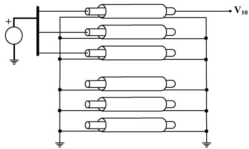  
Fig. 5. Step voltage excitation, core of cable 1.

TABLE IINTERPOLATION ERROR WEIGHTING TERMS FOR $H _ { 1 1 }$   

<table><tr><td>Mode</td><td>WB Model</td><td>CWB/CBEWB Models</td><td>Time Delay μs</td><td>Order</td></tr><tr><td>1</td><td>0.9198</td><td>0.9177</td><td>6.235</td><td>8</td></tr><tr><td>2</td><td>-144.4404</td><td>-0.0188</td><td>19.835</td><td>14</td></tr><tr><td>3</td><td>146.4668</td><td>0.0192</td><td>19.861</td><td>13</td></tr><tr><td>4</td><td>-9.4665</td><td>-0.0080</td><td>23.778</td><td>13</td></tr><tr><td>5</td><td>10.9791</td><td>0.0080</td><td>23.958</td><td>13</td></tr><tr><td>6</td><td>-4.7895x10-4</td><td>2.4219x10-4</td><td>40.391</td><td>8</td></tr><tr><td>7</td><td>2.4537x10-4</td><td>1.3113x10-4</td><td>60.959</td><td>4</td></tr></table>

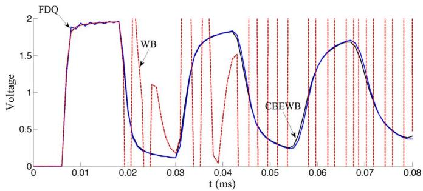  
Fig. 6. Voltage $\mathtt { V } _ { 1 0 }$ for CBEWB, FDQ, and WB, for $\Delta t = 1 \mu \mathrm { s } .$ .

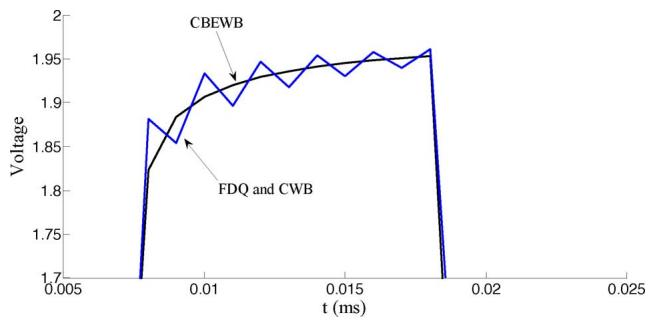  
Fig. 7. Ringing problem for FDQ and CWB (overlapped), for $\Delta t = 1 \mu \mathrm { s }$ .

where $T ^ { \prime } \in \mathbf { T } ^ { - 1 }$ . Choosing the maximum value provides some flexibility for the constrained least-squares solution. In the cases presented below, setting to 1 provided correct results.

The fitting error may slightly increase due to the imposition of the aforementioned constraints, but this is a reasonable compromise as long as the transient response stability of the model is of concern. Optionally, the parameter can be increased within a predefined tolerance in order to reduce the fitting error. In the following numerical examples, the decision was made to use a single constraint for each residue pole.

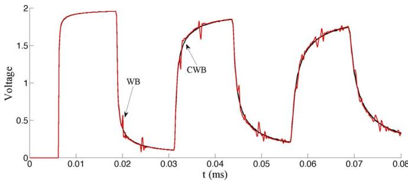  
Fig. 8. Voltage $\mathtt { V } _ { 1 0 }$ for CWB, FDQ, and WB $\Delta t = 0 . 1 \ \mu \mathrm { s }$ .

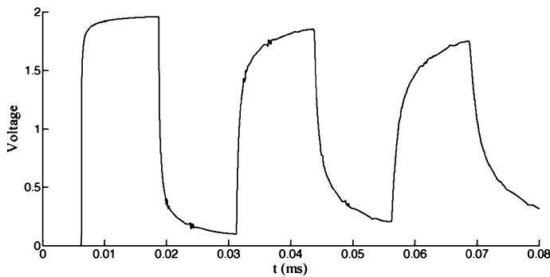  
Fig. 9. Voltage $\mathtt { V } _ { 1 0 }$ for WB at $\Delta t = 0 . 0 1 \mu \mathrm { s }$ .

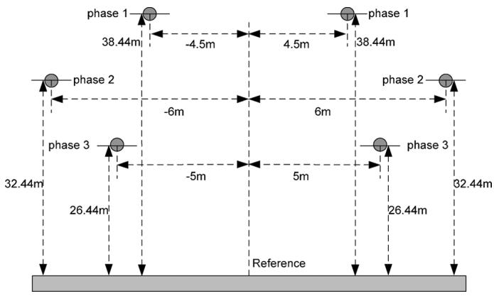  
Fig. 10. Double-circuit transmission-line physical layout.

For complex conjugate poles, the boundary condition is applied separately for real and imaginary parts.

# V. NUMERICAL EXAMPLES

In this section, five different models will be compared in terms of numerical stability in time-domain simulations. Three models are currently available in EMTP-RV [16]: 1) frequency-dependent transmission-line model (FD) [1]; 2) full frequency-dependent (FDQ) [2] cable model; and 3) wideband model (WB) [3]. The other two models, which are applicable to transmission lines and cables, are based on the methodology developed in this paper. The first is the convex wideband model (CWB). In this model, residue, pole, and time delay estimates of the WB model for a given test case are taken from EMTP-RV and residues are recalculated with convex programming using (35). The second model is the convex backward Euler wideband model (CBEWB), where,

TABLE IILINE AND LIGHTNING STROKE DATA FOR THE DOUBLE CIRCUIT  

<table><tr><td>Outside Diameter of the Conductors</td><td>2.86 cm</td></tr><tr><td>DC Resistance</td><td>0.068 Ω / km</td></tr><tr><td>Fundamental frequency</td><td>50 Hz</td></tr><tr><td>Tower footing resistance</td><td>300 Ω</td></tr><tr><td>Insulator chain length</td><td>2.16 m</td></tr><tr><td colspan="2">Lightning current source (negative polarity)</td></tr><tr><td>Start Time</td><td>10 μs</td></tr><tr><td>Maximum current</td><td>30 kA</td></tr><tr><td>Rise time t_f</td><td>3 μs</td></tr><tr><td>Maximum slope in the rising part Sm</td><td>40 kA / μs</td></tr><tr><td>Tail time (half value of maximum current) th</td><td>50 μs</td></tr></table>

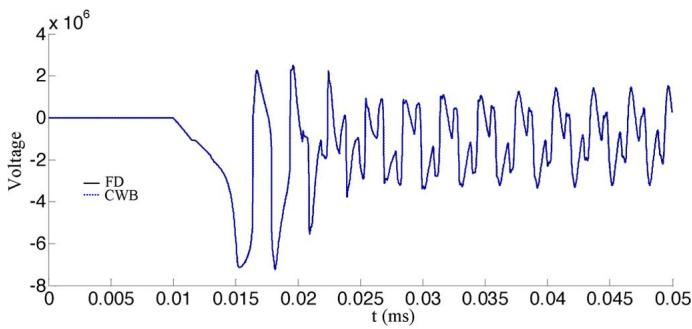  
Fig. 11. Transient response comparison with FD (100 kHz) and CWB (overlapped).

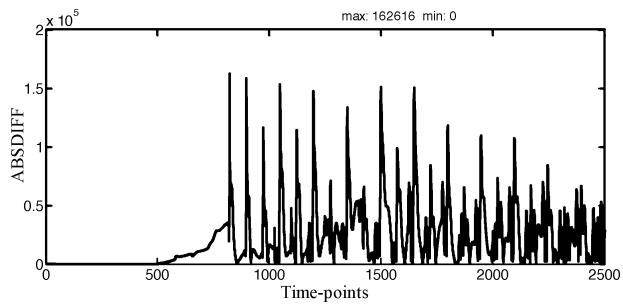  
Fig. 12. Transient response difference between FD (50 Hz) and CWB.

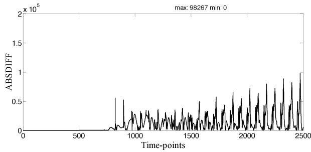  
Fig. 13. Transient response difference between FD (100 kHz) and CWB.

in addition to CWB, the backward Euler integration scheme is used for the solution of (22) during the entire time-domain simulation interval. Both CWB and CBEWB models use the same frequency-domain modeling but CBEWB has a different time- domain computation algorithm.

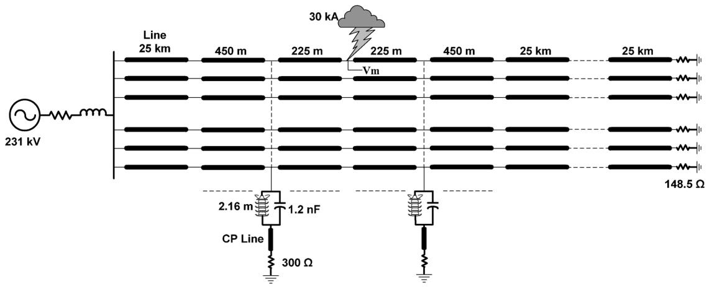  
Fig. 14. Modeling circuit for a double-circuit transmission line subjected to a lightning stroke.

# A. Twelve-Conductor Cable System

The transient response of a 1-km, 6-phase, and 12-conductor cable system is analyzed by using the setup given in Fig. 5. Detailed cable data and a description can be found in [8].

Table I shows the interpolation error weighting terms of $H _ { 1 1 }$ for WB and CWB/CBEWB models. There are seven distinct propagation modes identified for this cable and it is apparent that the least-squares technique used in the WB model without boundary conditions, results in high error weighting terms for some of the modes. The opposite signs of the terms do not imply cancellation of interpolation errors. Different modes have different delays and result in different $R _ { m }$ terms. Consequently, either cancellation or catastrophic accumulation of errors can occur at each timestep for different modes. This can be observed in Fig. 6 where modes 2 and 3 cause an explosion before 20 s in the WB model. These are supposed to have little effect on core voltages of the cable. On the other hand, these modes cannot be discarded since they are very important for the precise calculation of sheath voltages.

In this case, the maximum rms error between the calculated frequency samples and the approximated rational function is $1 . 5 \times 1 0 ^ { - 3 }$ for WB and $3 . 5 \times 1 0 ^ { - 3 }$ for CWB/CBEWB. The difference is not significant and the CWB/CBEWB model is capable of preserving its numerical stability as shown in Fig. 6.

Fig. 6 also presents the transient voltage at the receiving end of the first cable core conductor by using the FDQ model. Both the FDQ and CWB models give almost the same answer. It is observed, however, that FDQ and CWB produce ringing (numerical oscillations) when the step voltage reaches the receiving end. This ringing (see the zoomed version in Fig. 7) is observed despite the fact that EMTP-RV uses two halved timestep backward Euler steps to eliminate the discontinuity triggered by the step voltage application. The reason is the numerical sensitivity of (24) where the initial discontinuity causes numerical oscillations which decay only after a few timepoints. In the CBEWB model, it was chosen to replace (24) by its full timestep backward Euler version for the entire simulation interval. The halved timestep version for standard discontinuity treatment was also maintained. It was observed that it does not have a significant effect on the simulation results especially for sufficiently small timesteps.

In Fig. 6, the simulation is 1 s and the minimum time delay of the cable system is 6.23 s. Reducing the timestep to 0.1 s prevents the WB model from explosion, but the result remains extremely noisy as shown in Fig. 8. Now, the CWB version does not have a ringing problem. Reducing the timestep even further to 0.01 s does not completely cure the numerical problems of the WB model. This is shown in Fig. 9, where some ringing still persists. It is emphasized that for a given timestep, the computational complexity of the solution in the time-domain remains the same for the proposed methods (CWB and CBEWB) and the existing WB model. Each model has the same number of poles, delays, and residues, and the number of convolution operations remains the same. To verify this fact, the CPU timings for the simulations shown in Figs. 8 and 9 are compared as follows. For the 0.1 s timestep: FDQ takes 0.2969 s, WB takes 0.2438 s, and CWB takes 0.2390 s. For the 0.01 s timestep, FDQ takes 2.4531 s, WB takes 2.0156 s, and CWB takes 2.0031 s. It is apparent that these numbers are very close and more important when comparing WB and CWB.

# B. Double-Circuit Line With Lightning Case

This case uses a double-circuit transmission line as shown in Fig. 10 with simulation parameters given in Table II. Phase 1 is submitted to a direct lightning stroke as shown in Fig. 14. The lightning current is the CIGRE concave lightning current source as defined in [17]. The tower at each span is modeled by using six insulator chains connected from phase wires to the constant parameter (CP) transmission-line model of the tower. The CP model has a characteristic impedance of 90 with a length of 15.5 m. The insulator chains are represented with the leader propagation model [17]. The key objective of this case is to demonstrate that the developments of this paper are generic and also applicable to transmission-line cases.

Fig. 11 shows the transient voltages calculated with the CWB and FD models for phase 1 at the location of lightning. The integration timestep is $0 . 0 2 \mu \mathrm { s }$ . There is a sufficiently good match between FD and CWB results. It is noticed that for the FD model, the transformation matrix is approximated by a constant and real matrix at 100 kHz. This is a manual selection for analyzing lightning cases. Selecting 50 Hz increases the deviation between CWB and WB results. A visual appreciation of absolute difference can be seen in Figs. 12 and 13.

The objective here was to validate CWB results compared to FD. The CWB model remains as the most precise and automatically applicable for a wide band of frequencies.

# VI. CONCLUSION

This paper presented the improvement of numerical stability for a wideband transmission line and cable model based on partial fraction expansion. Mathematical relations between numerical errors in the time-domain and modeling parameters were used for the derivation of a constrained linear least-squares method in order to confine errors within a safe boundary.

The proposed solution method does not introduce any extra solution steps or burden the time-domain computations and enables preserving numerical stability in practical line and cable circuits where the existing wideband modeling approach was failing.

# REFERENCES

[1] J. R. Marti, “Accurate modeling of frequency dependent transmission lines in electromagnetic transient simulations,” IEEE Trans. Power App. Syst., vol. PAS-101, no. 1, pp. 147–155, Jan. 1982.   
[2] L. Marti, “Simulation of transients in underground cables with frequency dependent modal transformation matrices,” IEEE Trans. Power Del., vol. 3, no. 3, pp. 1099–1110, Jul. 1988.   
[3] A. Morched, B. Gustavsen, and M. Tartibi, “A universal model for accurate calculation of electromagnetic transients on overhead lines and underground cables,” IEEE Trans. Power Del., vol. 14, no. 3, pp. 1032–1038, Jul. 1999.   
[4] A. Semlyen and A. Dabuleanu, “Fast and accurate switching transient calculations on transmission lines with ground return using recursive convolutions,” IEEE Trans. Power App. Syst., vol. PAS-94, no. 2, pt. 1, pp. 561–571, Mar./Apr. 1975.   
[5] H. V. Nguyen, H. W. Dommel, and J. R. Marti, “Direct phase domain modeling of frequency dependent overhead transmission lines,” IEEE Trans. Power Del., vol. 12, no. 3, pp. 1335–1342, Jul. 1997.   
[6] A. Ametani, “A general formulation of impedance and admittance of cables,” IEEE Trans. Power Syst., vol. PAS-99, no. 3, pp. 902–910, May/Jun. 1980.   
[7] H. W. Dommel, EMTP Theory Book. Vancouver, BC, Canada, Microtran Power System Analysis Corp., Apr. 1996.   
[8] I. Kocar, J. Mahseredjian, and G. Olivier, “Weighting method for transient analysis of underground cables,” IEEE Trans. Power Del., vol. 23, no. 3, pp. 1629–1635, Jul. 2008.   
[9] B. Gustavsen and A. Semlyen, “Rational approximation of frequency domain responses by vector fitting,” IEEE Trans. Power Del., vol. 14, no. 3, pp. 1052–1061, Jul. 1999.   
[10] B. Gustavsen, “Passivity enforcement for transmission line models based on the method of characteristics,” IEEE Trans. Power Del., vol. 23, no. 4, pp. 2286–2293, Oct. 2008.

[11] C. Changzhong, E. Gad, M. Nakhla, and R. Achar, “Passivity verification in delay-based macromodels of multiconductor electrical interconnects,” IEEE Trans. Adv. Packag., vol. 30, no. 2, pp. 246–256, May 2007.   
[12] M. Crow, Computational Methods for Electric Power Systems. New York: Taylor & Francis, 2002.   
[13] “Optimization Toolbox 4, Users Guide,” 2009. [Online]. Available: http://www.mathworks.com   
[14] T. F. Coleman and Y. Li, “A reflective newton method for minimizing a quadratic function subject to bounds on some of the variables,” SIAM J. Optim., vol. 6, no. 4, pp. 1040–1058, 1996.   
[15] P. E. Gill, W. Murray, and M. H. Wright, Practical Optimization. London, U.K.: Academic Press, 1981.   
[16] J. Mahseredjian, S. Dennetière, L. Dubé, B. Khodabakhchian, and L. Gérin-Lajoie, “On a new approach for the simulation of transients in power systems,” in Proc. Int. Conf. Power Systems Transients, Montréal, QC, Canada, Jun. 19–23, 2005.   
[17] “Guide to procedures for estimating the lightning performance of transmission lines,” Working Group 01 (Lightning) of Study Committee 33 (Overvoltages and Insulation Co-ordination) Oct. 1991, CIGRÉ.

Ilhan Kocar (S’04) received the M.S. and B.S. degrees in electrical and electronic engineering from Middle East Technical University, Ankara, Turkey, in 1998 and 2003, respectively, and is currently pursuing the Ph.D. degree in electrical engineering at École Polytechnique de Montréal, Montréal, QC, Canada.

He provided custom-designed power conversion system solutions to the railway industry as a Project Engineer at Aselsan Electronics, Inc., between 1998 and 2004. His research areas include Electromagnetic Transient Analysis (EMTP-RV methods) and macromodeling of power system components for a wideband frequency range.

Jean Mahseredjian (SM’08) received the M.A.Sc. and Ph.D. degrees from École Polytechnique de Montréal, Montréal, QC, Canada, in 1985 and 1991, respectively.

From 1987 to 2004, he was with IREQ (Hydro-Québec), working on research-and-development activities related to the simulation and analysis of electromagnetic transients. In 2004, he joined the faculty of electrical engineering at École Polytechnique de Montréal, Montréal, QC, Canada. He is the creator and main developer of EMTP-RV.

Dr. Mahseredjian was Chairman of the International Conference on Power Systems Transients (IPST 2005) in Montreal and was the Technical Co-Chairman of IPST 2007 in Lyon, France.

Guy Olivier (SM’84) received the B.Sc.A. and M.Sc.A. degrees in electrical engineering from École Polytechnique de Montréal, Montréal, QC, Canada, in 1975 and 1977, respectively, and the Ph.D. degree in power electronics from Concordia University, Montréal, in 1982.

Currently, he is a Professor at École Polytechnique de Montréal. His research interests include power transformers, harmonic pollution, and large converters. He is a registered Professional Engineer in the Province of Québec.

Prof. Olivier was awarded the IEEE Third Millennium Medal. He is a Fellow of the Engineering Institute of Canada.