# A Testing Tool for Converter-Dominated Power System: Stochastic Electromagnetic Transient Simulation

Pengwei Chen , Member, IEEE, Liang Lu, Xinbo Ruan , Fellow, IEEE, and Nian $\operatorname { L i u } ^ { \mathbb { \oplus } }$ , Member, IEEE

Abstract— To investigate the impact of uncertain variability and provide a rigorous testing environment for converter-dominated power systems, this article develops a testing tool called stochastic electromagnetic transient simulation. The tool is derived from the stochastic differential equation (SDE) representing the stochastic process of parameter migration. By inheriting the principle of companion circuit, the dynamic companion circuits of the lumped elements with parameter migration are further established. Combined with the analysis of the numerical stability in discrete simulation as well as the stability of the continuous system with parameter migration, a numerical algorithm that is compatible with the electromagnetic transients program (EMTP) framework is designed, as well as a C program package. The verification results on a grid-connected three-phase two-level rectifier and a two-terminal dc distribution system demonstrate that the developed tool can simulate the parameter migrations and the stimulated system dynamic process simultaneously, which can also be used to efficiently reflect the real performance of various control subsystems and their coordination in extreme cases.

Index Terms— Converter-dominated power system, electromagnetic transient (EMT) simulation, numerical algorithm, stochastic differential equation (SDE), stochastic dynamic.

# NOMENCLATURE

$W ( t )$ Wiener process, and $W ( t ) - W ( 0 )$ satisfies the normal distribution $N ( 0 , t )$ .

$\xi$ White noise and $\xi = d W ( t ) / d t$ .

$\alpha ( \cdot )$ Drift process of the stochastic perturbation.

$\beta ( \cdot )$ Diffusion process of the stochastic perturbation.

$R ( t )$ Resistance of an element with parameter migration at time t .

Manuscript received 4 October 2021; revised 3 December 2021 and 7 January 2022; accepted 22 January 2022. Date of publication 25 January 2022; date of current version 3 October 2022. This work was supported in part by the National Natural Science Foundation of China under Grant 52007080, in part by the China Postdoctoral Science Foundation under Grant 2020TQ0142 and Grant 2020M681583, and in part by the Opening Foundation of State Key Laboratory of Alternate Electrical Power System with Renewable Energy Sources under Grant LAPS21008. Recommended for publication by Associate Editor Firuz Zare. (Corresponding author: Pengwei Chen.)

Pengwei Chen, Liang Lu, and Xinbo Ruan are with the Jiangsu Key Laboratory of New Energy Generation and Power Conversion, College of Automation Engineering, Nanjing University of Aeronautics and Astronautics, Nanjing 210016, China (e-mail: chenpw2019@nuaa.edu.cn; sx2003088@nuaa.edu.cn; ruanxb@nuaa.edu.cn).

Nian Liu is with the State Key Laboratory for Alternate Electrical Power System with Renewable Energy Sources, North China Electric Power University, Beijing 102206, China (e-mail: nianliu@ncepu.edu.cn).

Color versions of one or more figures in this article are available at https://doi.org/10.1109/JESTPE.2022.3146231.

Digital Object Identifier 10.1109/JESTPE.2022.3146231

L (t ) Inductance of an element with parameter migration at time t .

$\Psi _ { L } ( t )$ Magnetic flux through inductance at time t .

$C ( t )$ Capacitance of an element with parameter migration at time t .

$Q _ { C } ( t )$ Energy stored in capacitance at time t.

$\Delta t$ Discretization time step in a simulation.

$\tau _ { n }$ $\tau _ { n } = n \Delta t .$ .

$R _ { n }$ Numerical approximation to $R ( \tau _ { n } )$ in stochastic electromagnetic transient simulation.

$L _ { n }$ Numerical approximation to $L ( \tau _ { n } )$ in stochastic electromagnetic transient simulation.

$C _ { n }$ Numerical approximation to $C ( \tau _ { n } )$ in stochastic electromagnetic transient simulation.

$\upsilon _ { i , n } , \upsilon _ { j , n }$ Voltages of two terminal nodes i and j in numerical simulation at time $\tau _ { n } .$

i R,n $i _ { R , n }$ Current through resistance in numerical simulation at time $\tau _ { n }$ .

i L ,n $i _ { L , n }$ Current through inductance in numerical simulation at time $\tau _ { n } .$ .

iC,n $i _ { C , n }$ Current injected into capacitance in numerical simulation at time $\tau _ { n } .$ .

$W _ { n }$ Sampling value of $W ( t )$ at time $\tau _ { n } = n \Delta t$

${ \bf \Xi } _ { G , G _ { T } }$ Nodal admittance matrices used in stochastic electromagnetic transient simulation.

Besides, the subscripts R, L, and C are used for resistance, inductance, and capacitance, respectively, while the superscript ∗ is used for the controller reference values or the exact value of simulation, and other symbols are defined as required.

# I. INTRODUCTION

D RIVEN by the rapid development of power electronics and control technologies in the past decades, converter- and control technologies in the past decades,converterdominated power systems are becoming important components of electrical grids to facilitate the integration of renewable energy sources and the power supply of high quality, such as renewable power plants [1], microgrids [2], dc distribution systems [3], and high-voltage dc transmission systems [4]. Although these converter-dominated systems possess superior features of full controllability and high efficiency, the inter-

actions between various converters and passive networks will increase the complexity of the system dynamics in the different frequency ranges [5].

To analyze the system dynamics accurately, electromagnetic transient (EMT) simulation is often used [6], but limited by the selection of step size, and the challenges from efficiency have emerged with the increased penetration of converters and scale of the system. In this situation, boundary subsystems and complicated converters are usually modeled by equivalent circuits [7], such as the main grid represented by the Thevenin equivalent circuit, the photovoltaic panels represented by the controlled source, and the load represented by the RLC parallel branch. However, against the background of renewable energy integration and load deregulation, the converter-dominated power system is currently operating under more stressed conditions with much more uncertainties compared with the traditional one, which also leads to the complexity of system dynamic analysis, including the random excitation on stability [8] and the fault transient and relay protection under different conditions [9].

To investigate the impact of uncertain variability on power system dynamics, various models and methods have been proposed from different perspectives [10]–[18]. At an early stage, the uncertain variability in a system is assumed to be subject to a certain probability distribution, and the impact on system dynamic was studied using the Monte Carlo-based approaches [10]. Considering the deficiency of deterministic model and huge computational burden, the theory of stochastic differential equations (SDEs) that is well applicable in describing the stochastic changes of system parameters has been gradually introduced into the field of electrical engineering [11], which prompts the system dynamics under uncertain variability modeled by a set of stochastic differential-algebraic equations (SDAEs). Within this frame, a systematic method to model stochastic dynamic systems is proposed in [12], where the modeling object involves load, generator, and bus voltage phasor. Based on linear SDEs with additive noise of nodal voltage, a transmission line model is derived in [13] to simulate respective stochastic trajectories and determine the variances of responses. In [14], an SDE-based model of the single-machine infinite-bus system is investigated, and in [15], the model of a grid-connected wind turbine is further focused on. With loads modeled as random variables that appear in algebraic equations, Wang and Crow [16] presented the firstorder backward Euler method for SDAEs in power system transient simulation. In [17], an SDAE-based framework of numerical simulation is proposed to assess the stochastic transients of large-scale systems, and in [18], the initialization problem of power systems modeled as SDAEs is addressed, as well as the efficient initialization method.

Obviously, the above models and numerical methods are mainly aimed at traditional ac power systems, where the dynamics concerning electromechanical transient are dominant. Therefore, it is understandable that electromagnetic power is given priority to be modeled as a stochastic process and power-flow equations are used mostly, but such a formulation does not apply to a converter-dominated power system. The reasons include: 1) the wide timescale con-

trol of converters can result in cross couplings with both the electromechanical dynamics of electrical machines and the EMTs of networks, such that the EMT simulation with small step size is the premise, and 2) the EMT simulation is based on state variables of branches, such as the current through an inductor and the voltage across a capacitor, which makes the stochastic perturbation of branch parameter the root to stimulate the stochastic dynamics of systems. No matter how the system parameters change, it is worth emphasizing that any control system of converter for regulating the current and power exchanged with the network should coordinate with each other well to ensure satisfying dynamics. If the EMT simulation has the function of simulating the stochastic perturbations of parameters, then the diversified operating scenarios can be generated continuously to verify the performance of various control subsystems and their coordination, which also essentially increases the severity of disturbances.

Motivated by the requirements of investigating the impact of uncertain variability and providing a rigorous testing environment for converter-dominated power systems, a testing tool named the stochastic EMT simulation is developed in this article. The main contributions are given as follows.

1) Based on the problem formulation of stochastic EMT simulation, the SDE-based models to describe the parameter migration of linear lumped elements and stochastic dynamics of state variables are established, and then, by using the principle of companion circuit in electromagnetic transients program (EMTP) and the typical numerical methods of SDE, the dynamic companion circuits of the elements with parameter migration are derived to facilitate the integration of multiple elements during the simulation.   
2) Taking an RL series branch as the theoretical analysis object, the numerical stability characteristics of stochastic EMT simulation using the backward and trapezoidal Milstein schemes are analyzed, where the necessary conditions to ensure stable simulation are indicated. The stability of the continuous system with stochastic perturbation of parameter is also derived, which shows that the deterministic simulation can be employed as a reference in case of the stochastic perturbation within a reasonable distribution.   
3) For the easy application of stochastic EMT simulation in large-scale systems, the main process of numerical algorithm that is compatible with EMTP framework is designed, and an acceleration technique based on node reassignment and matrix decomposition is further proposed for network solution, which is all implemented in a C program package.

The remainder of this article is organized as follows. Section II introduces the problem formulation of stochastic EMT simulation. Section III summarizes the SDE-based model and dynamic companion circuit for the linear lumped elements with parameter migration. Section IV presents the numerical stability of stochastic EMT simulation, as well as the stability of the continuous system with parameter migration. The main

process of numerical algorithm and the acceleration technique used in network solution are shown in Section V, and the case studies are discussed in Section VI, followed by Section VII, which concludes this article.

# II. PROBLEM FORMULATION OF STOCHASTIC EMT SIMULATION

The transient behavior of a converter-dominated power system is usually described by a set of differential-algebraic equations as follows:

$$
\left\{ \begin{array}{l} \dot {x} = f (x, y, u, t) \\ \mathbf {0} = g (x, y, u, t) \\ x \left(t _ {0}\right) = x _ {0}, y \left(t _ {0}\right) = y _ {0}, u \left(t _ {0}\right) = u _ {0} \end{array} \right. \tag {1}
$$

where $f ( \cdot )$ and $g ( \cdot )$ are the differential equations and algebraic equations, respectively; x is the vectors of state variables, e.g., node voltages, branch currents, rotor speeds of generators, and dynamic states of controllers; y represents the algebraic variables involved in measurement and control; u represents the variables modeling event of switching operation, faults, command change, and so on; $t \in [ t _ { 0 } , + \infty )$ is the time; and $x _ { 0 } , y _ { 0 } ,$ , and $\pmb { u } _ { 0 }$ correspond to the initial values at t0.

Although the above deterministic formulation has become the foundation of various power system simulation software packages, it is well accepted that the stochastic perturbations in many aspects are neglected, such as the load variations, measurement errors, device parameters, and even the renewable power generation. As noted, these stochastic perturbations are dependent on system states and parameters, which can be modeled as follows by using the general formulation used for SDEs [11]:

$$
\left\{ \begin{array}{l} \dot {\eta} = \alpha (x, y, u, \eta , t) + \beta (x, y, u, \eta , t) \xi \\ \eta \left(t _ {0}\right) = \eta_ {0} \end{array} \right. \tag {2}
$$

where ${ \pmb \alpha } ( \cdot )$ and $\beta ( \cdot )$ represent multiple drift and diffusion processes of the stochastic perturbations, respectively, $\xi \ =$ $d W ( t ) / d t$ is a set of white noises with $W ( t )$ denoting the multidimensional independent Wiener processes, and $\pmb { \eta } _ { 0 }$ is the initial vector at $t _ { 0 } .$

By introducing (2) into (1), the transient behaviors of the converter dominated system are determined by solving SDAEs, where

$$
\dot {\boldsymbol {x}} = \boldsymbol {f} (\boldsymbol {x}, \boldsymbol {y}, \boldsymbol {u}, \dot {\eta}, \eta , t). \tag {3}
$$

According to the participation form of stochastic perturbations in (3), there are two cases that can be particularized as follows.

1) Additive Stochastic Perturbation: In this case, (3) can be rewritten as $\dot { x } ~ = ~ f ( x , y , u , t ) + b \dot { \eta }$ with b being the constant coefficients, and thus, the system described by SDAEs can be rigidly compartmentalized in the deterministic and stochastic subsystems, which also means that the original EMT simulation algorithm can be mostly inherited and utilized.

2) Multiplicative Stochastic Perturbation: Affected by the nonlinear operation with other states, the term only containing stochastic perturbations no longer exists. Such a phenomenon is significant when the stochastic perturbations are involved in system parameters, such as the equivalent circuits of timevarying load, renewable energy, and main grid. Limited by the coupling between the deterministic and stochastic subsystems, it is required that the simulation algorithm can deal with the various solution constraints of SDAEs at the same time, namely, the exclusive numerical algorithm of stochastic EMT simulation.

# III. ELEMENT MODELING FOR STOCHASTIC EMT SIMULATION

As the component modeling based on the linear lumped elements is the premise of the EMT simulation, the intuitive representation of stochastic perturbations is that elements are accompanied by parameter migration. By using the principle of companion circuit in EMTP [19], the modeling process of the commonly used elements with parameter migration is introduced in this section.

# A. Element With Parameter Migration

Linear lumped elements are resistance, inductance, and capacitance, which usually appear as parts of circuits. As a property of a circuit, any alteration to the circuit which changes the opposition, magnetic flux, and stored electric charge through the circuit produced by a given current will also change the values of resistance, inductance, and capacitance. Without loss of generality, their stochastic parameter migration can be described by the following SDEs:

$$
\left\{ \begin{array}{l} d R (t) = \alpha (R, t) d t + \beta (R, t) d W _ {R} (t) \\ d L (t) = \alpha (L, t) d t + \beta (L, t) d W _ {L} (t) \\ d C (t) = \alpha (C, t) d t + \beta (C, t) d W _ {C} (t) \end{array} \right. \tag {4}
$$

where $W _ { R } ( t ) , W _ { L } ( t )$ , and $W _ { C } ( t )$ are independent Wiener processes corresponding to the parameter migrations of resistance, inductance, and capacitance, respectively. If not particularly indicated, the subscripts in later discussion are omitted for brevity.

The commonly used numerical methods for solving SDEs found in (4), including the Euler–Maruyama (EM) method, the Milstein method, and the Runge–Kutta method [20]. To achieve high accuracy, their implicit schemes are given priority. Taking the resistance branch as an example, $\tau _ { n } ~ =$ $n \Delta t$ . If the backward Milstein method is applied to (4), then the numerical approximation to $R ( \tau _ { n } )$ is expressed as

$$
\begin{array}{l} R _ {n} = R _ {n - 1} + \alpha (\tilde {R} _ {n}) \Delta t + \beta (R _ {n - 1}) \Delta W _ {n - 1} \\ + \frac {\beta \left(R _ {n - 1}\right) \beta^ {\prime} \left(R _ {n - 1}\right)}{2} \Delta D _ {n - 1} \tag {5} \\ \end{array}
$$

where $\Delta W _ { n - 1 } = W _ { n } - W _ { n - 1 }$ satisfies the normal distribution $( \Delta t ) ^ { 1 / 2 } N ( 0 , 1 ) , \Delta D _ { n - 1 } = \Delta W _ { n - 1 } ^ { 2 } - \Delta t$ n 1 , and ${ \tilde { R } } _ { n }$ is the predicted value of $R _ { n }$ , which can be obtained by using the EM scheme $\tilde { R } _ { n } = R _ { n - 1 } + \alpha ( R _ { n - 1 } ) \Delta t + \beta ( R _ { n - 1 } ) \Delta W _ { n - 1 }$ .

Like in the case of resistance, the approximate expressions of $L ( \tau _ { n } )$ and $C ( \tau _ { n } )$ can also take the discrete formulation

similar to (5). Given that the branch is represented by each of these three elements, where the nodes on both terminals are denoted as $( i , j )$ and the corresponding voltage are $( v _ { i } , v _ { j } )$ . The stochastic dynamics caused by parameter migration are summarized as follows.

1) Resistance: According to the definition of resistance, the voltage across it is directly proportional to the current through it. After $R _ { n }$ obtained, the current through the branch is given discretely by

$$
i _ {R, n} = \frac {1}{R _ {n}} \left(v _ {i, n} - v _ {j, n}\right) = G _ {R, n} \left(v _ {i, n} - v _ {j, n}\right). \tag {6}
$$

2) Inductance: By Faraday’s law of inductance, the change in magnetic flux $\Psi _ { L } ( t )$ will induce a voltage drop across $L ( t )$

$$
\frac {d \Psi_ {L} (t)}{d t} = i _ {L} (t) \frac {d L (t)}{d t} + L (t) \frac {d i _ {L} (t)}{d t} = v _ {i} (t) - v _ {j} (t). \tag {7}
$$

Substituting (4) into (7), thus, the dynamic of the current through $L ( t )$ can be expressed as

$$
d i _ {L} (t) = \frac {v _ {i} (t) - v _ {j} (t) - i _ {L} (t) \alpha (L , t)}{L (t)} d t - \frac {i _ {L} (t) \beta (L , t)}{L (t)} d W (t). \tag {8}
$$

When the backward Milstein scheme is applied to (8), the current has the following iterative form:

$$
\begin{array}{l} i _ {L, n} = i _ {L, n - 1} + \frac {\Delta t}{L _ {n}} \left(v _ {i, n} - v _ {j, n} - i _ {L, n} \alpha (\tilde {L} _ {n})\right) \\ - \frac {i _ {L , n - 1} \beta (L _ {n - 1})}{L _ {n - 1}} \left(\Delta W _ {n - 1} + \frac {\beta (L _ {n - 1})}{2 L _ {n - 1}} \Delta D _ {n - 1}\right) \tag {9} \\ \end{array}
$$

where $L _ { n }$ is the numerical approximation to $L ( \tau _ { n } )$ ,

3) Capacitance: The current is generally represented as the rate at which charge flows through a given surface. Using the definition of capacitance, namely $Q _ { C } ( t ) = C ( t ) \upsilon _ { C } ( t )$ , then

$$
\frac {d Q _ {C} (t)}{d t} = C (t) \frac {d v _ {C} (t)}{d t} + \frac {d C (t)}{d t} v _ {C} (t) = i _ {C} (t) \tag {10}
$$

where $\upsilon _ { C } ( t ) = \upsilon _ { i } ( t ) - \upsilon _ { j } ( t )$ .

Using the description of parameter migration found in (4), the dynamic of the voltage across the capacitance is given by

$$
d v _ {C} (t) = \frac {i _ {C} (t) - v _ {C} (t) \alpha (C (t))}{C (t)} d t - \frac {v _ {C} (t) \beta (C (t))}{C (t)} d W (t). \tag {11}
$$

Carrying out the discretization by the backward Milstein scheme, we have

$$
\begin{array}{l} v _ {C, n} = v _ {C, n - 1} + \frac {i _ {C , n} - v _ {C , n} \alpha (\tilde {C} _ {n})}{C _ {n}} \Delta t \\ - \frac {v _ {C , n - 1} \beta \left(C _ {n - 1}\right)}{C _ {n - 1}} \left(\Delta W _ {n - 1} + \frac {\beta \left(C _ {n - 1}\right)}{2 C _ {n - 1}} \Delta D _ {n - 1}\right) \tag {12} \\ \end{array}
$$

where $C _ { n }$ is the numerical approximation to $C ( \tau _ { n } )$ and ${ \tilde { C } } _ { n } =$ $C _ { n - 1 } + \alpha ( C _ { n - 1 } ) \Delta t + \beta ( C _ { n - 1 } ) \Delta W _ { n - 1 }$ .

Remark 1: Observe that the branch dynamics caused by parameter migration are more complicated than that of deterministic one, especially for the branches composed of inductance and capacitance. When other more accurate numerical schemes with higher orders, such as the trapezoidal scheme, are employed, the conflict between efficiency and accuracy will be more significant.

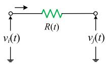

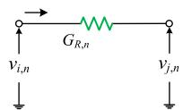  
a)

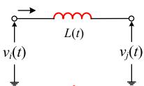

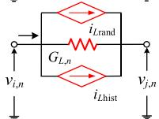  
b)

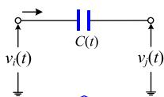

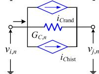  
c)   
Fig. 1. Elements with parameter migration and dynamic companion circuits. (a) Resistance. (b) Inductance. (c) Capacitance.

# B. Dynamic Companion Circuit

To facilitate the integration of various components with parameter migration from a system perspective, the EMTP framework is inherited in this section, and the iterative equations found in (9) and (12) can be rewritten as

$$
\left\{ \begin{array}{l} i _ {L, n} = G _ {L, n} \left(v _ {i, n} - v _ {j, n}\right) + I _ {L \text {h i s t}} + I _ {L \text {r a n d}} \\ i _ {C, n} = G _ {C, n} \left(v _ {i, n} - v _ {j, n}\right) + I _ {C \text {h i s t}} + I _ {C \text {r a n d}} \end{array} \right. \tag {13}
$$

with

$$
\left\{ \begin{array}{l} G _ {L, n} = \frac {\Delta t}{L _ {n} + \alpha (\tilde {L} _ {n}) \Delta t} \\ I _ {L \text {h i s t}} = \frac {L _ {n}}{L _ {n} + \alpha (\tilde {L} _ {n}) \Delta t} i _ {L, n - 1} \\ I _ {L \text {r a n d}} = - \frac {L _ {n} i _ {L , n - 1} \beta (L _ {n - 1})}{(L _ {n} + \alpha (\tilde {L} _ {n}) \Delta t) L _ {n - 1}} \\ \left(\Delta W _ {n - 1} + \frac {\beta (L _ {n - 1})}{2 L _ {n - 1}} \Delta D _ {n - 1}\right) \end{array} \right. \tag {14}
$$

$$
\left\{ \begin{array}{l} G _ {C, n} = \frac {C _ {n}}{\Delta t} + a \left(\tilde {C} _ {n}\right) \\ I _ {\text {C h i s t}} = - \frac {C _ {n}}{\Delta t} v _ {C, n - 1} \\ I _ {\text {C r a n d}} = \frac {C _ {n} v _ {C , n - 1} \beta \left(C _ {n - 1}\right)}{C _ {n - 1} \Delta t} \left(\Delta W _ {n - 1} + \frac {\beta \left(C _ {n - 1}\right)}{2 C _ {n - 1}} \Delta D _ {n - 1}\right) \end{array} \right. \tag {15}
$$

where $G _ { L , n }$ and $G _ { C , n }$ can be regarded as the equivalent conductance between two nodes, $I _ { L \mathrm { { h i s t } } }$ and $I _ { C \mathrm { { h i s t } } }$ that calculated from the states at the previous time step are called history current terms, and $I _ { L \mathrm { r a n d } }$ and $I _ { C \mathrm { r a n d } }$ that rely on the diffusion processes of the parameter can be seen as the random current terms.

Equations (13) and (14) indicate that the inductance or capacitance with parameter migration can be represented as a time-varying equivalent conductance in parallel with two known current sources, as shown in Fig. 1. To distinguish it from the companion circuit in EMTP that corresponds to the deterministic inductance or capacitance, such a representation is called the dynamic companion circuit in this article. Once the node voltages have been found at a particular time step, the equivalent conductance is calculated first, and then, the current sources corresponding to the history and rand terms are updated for use in the next time step.

In addition to the backward Milstein scheme, we can use other numerical schemes to generate the dynamic companion

TABLE I DYNAMIC COMPANION CIRCUITS OBTAINED BY DIFFERENT NUMERICAL METHODS   

<table><tr><td colspan="2">Parameter</td><td>Backward EM scheme</td><td>Heun scheme</td><td>Trapezoidal Milstein scheme</td></tr><tr><td rowspan="3">L(t)</td><td>GL,n</td><td>Δt/Ln+α(˜Ln)Δt</td><td>Δt/2Ln+α(˜Ln)Δt</td><td>Δt/2Ln+α(˜Ln)Δt</td></tr><tr><td>ILhist</td><td>LN/Ln+α(˜Ln)Δt iL,n-1</td><td>2LN/2Ln+α(˜Ln)Δt iL,n-1+LNG,L,n/Ln-1(vL,n-1-iL,n-1α(Ln-1))</td><td>2LN/2Ln+α(˜Ln)Δt iL,n-1+LNGL,n/Ln-1(vL,n-1-iL,n-1α(Ln-1))</td></tr><tr><td>ILrand</td><td>-Lnβ(Ln-1)iL,n-1/Ln-1(Ln+α(˜Ln)Δt)ΔWn-1</td><td>-2LNβ(Ln-1)iL,n-1/(2Ln+α(˜Ln)Δt)Ln-1ΔWn-1</td><td>-2LNβ(Ln-1)iL,n-1/(2Ln+α(˜Ln)Δt)Ln-1ΔDn-1</td></tr><tr><td rowspan="3">C(t)</td><td>GC,n</td><td>Cn/Δt+α(˜Cn)</td><td>2Cn/Δt+α(˜Cn)</td><td>2Cn/Δt+α(˜Cn)</td></tr><tr><td>IChist</td><td>-Cn/ΔtvC,n-1</td><td>-Cn/Cn-1iC,n-1-(2Cn/Δt-Cn/Cn-1α(Cn-1))vC,n-1</td><td>-Cn/Cn-1iC,n-1-(2Cn/Δt-Cn/Cn-1α(Cn-1))vC,n-1</td></tr><tr><td>ICrand</td><td>Cnβ(Cn-1)vC,n-1/Cn-1ΔtΔWn-1</td><td>2CnvC,n-1β(Cn-1)/Cn-1ΔtΔWn-1</td><td>2Cnβ(Cn-1)vC,n-1/Cn-1ΔtΔWn-1+β(Cn-1)/2Cn-1ΔDn-1</td></tr></table>

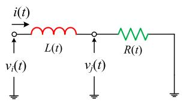  
a)

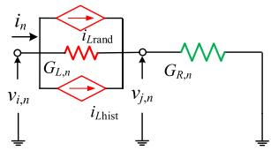  
b)   
Fig. 2. (a) Equivalent circuit of load and (b) its dynamic companion circuit.

circuits with the various tradeoffs between efficiency and accuracy. Table I summarizes the circuit expressions of other numerical schemes obtained from the Itô–Taylor expansion.

For demonstration purposes, a typical load equivalent circuit, namely, the RL series branch shown in Fig. 2, is selected as the application object of the dynamic companion circuits. After considering the stochastic perturbations represented by parameter migration, the stochastic dynamics of the equivalent circuit can be given by

$$
\left[ \begin{array}{c c} G _ {L, n} & - G _ {L, n} \\ - G _ {L, n} & G _ {R, n} + G _ {L, n} \end{array} \right] \left[ \begin{array}{l} v _ {i, n} \\ v _ {j, n} \end{array} \right] = \left[ \begin{array}{c} i _ {n} - i _ {L \text {r a n d}} - i _ {L \text {h i s t}} \\ i _ {L \text {r a n d}} + i _ {L \text {h i s t}} \end{array} \right]. \tag {16}
$$

Remark 2: As shown in (16), the dynamic companion circuit not only keeps the ability to describe stochastic perturbation but also inherits the advantages of the EMTP framework, which facilitates the integration of various elements in a system. It is worth noting that the inductance or capacitance with parameter migration essentially produces the injection or absorption of extra energy due to its nature of energy storage and release.

# IV. STABILITY ANALYSIS OF STOCHASTIC EMT SIMULATION

Numerical stability is the essential qualification for a satisfactory EMT simulation algorithm, especially when the stochastic perturbations represented by parameter migration are modeled as SDEs and the corresponding numerical methods have to be employed. Therefore, the numerical stability analysis for the stochastic EMT simulation is presented in this

section, as well as the theoretical stability characteristic of the system under the stochastic perturbation of parameters.

# A. Numerical Stability of Discrete Simulation

To make the analysis more concrete, the RL series branch as a typical component in the converter dominated power system is further investigated, of which the stochastic dynamic of current against parameter migration can be represented by

$$
\begin{array}{l} d i _ {L} (t) = \frac {v _ {i} (t) - i _ {L} (t) R (t) - i _ {L} (t) \alpha (L , t)}{L (t)} d t \\ - \frac {i _ {L} (t) \beta (L , t)}{L (t)} d W (t). \tag {17} \\ \end{array}
$$

Apply the backward Milstein scheme to (17), we can have

$$
\begin{array}{l} i _ {L, n} = i _ {L, n - 1} + \frac {\Delta t}{L _ {n}} \left(v _ {i, n} - i _ {L, n} R _ {n} - i _ {L, n} \alpha (\tilde {L} _ {n})\right) \\ - \frac {i _ {L , n - 1} \beta \left(L _ {n - 1}\right)}{L _ {n - 1}} \left(\Delta W _ {n - 1} + \frac {\beta \left(L _ {n - 1}\right)}{2 L _ {n - 1}} \Delta D _ {n - 1}\right). \tag {18} \\ \end{array}
$$

To determine whether the approximation error (e.g., rounding error and input data error) is magnified or not in the process of simulation, (18) can be rewritten as

$$
i _ {L, n} = \frac {H _ {B , n}}{E _ {B , n}} i _ {L, n - 1} + \frac {\Delta t}{E _ {B , n}} v _ {i, n} \tag {19}
$$

where $H _ { B , n } = L _ { n } - K _ { L , n } \beta ( L _ { n - 1 } ) ( \Delta W _ { n - 1 } + \beta ( L _ { n - 1 } ) \Delta D _ { n - 1 } / \ln$ $2 L _ { n - 1 } )$ with $K _ { L , n } = L _ { n } / L _ { n - 1 }$ and $E _ { B , n } = L _ { n } + \Delta t ( R _ { n } +$ $\alpha ( \tilde { L } _ { n } ) )$ .

Similarly, when the trapezoidal Milstein scheme is adopted, the iterative equation can be formed as

$$
i _ {L, n} = \frac {H _ {T , n}}{E _ {T , n}} i _ {L, n - 1} + \frac {\Delta t}{E _ {T , n}} v _ {i, n} + \frac {K _ {L , n} \Delta t}{E _ {T , n}} v _ {i, n - 1} \tag {20}
$$

where $H _ { T , n } = 2 H _ { B , n } - K _ { L , n } \Delta t ( R _ { n - 1 } + \alpha ( L _ { n - 1 } ) )$ and $E _ { T , n } =$ $E _ { B , n } + L _ { n }$ .

In essence, (19) and (20) are consistent with (16). When the RL series branch is connected to a switching device, it is well known that the action of the switching device will lead to the voltage mutation of the inductance such that the exact

value at the previous time step changes from $\upsilon _ { i , n - 1 }$ to $\upsilon _ { i , n - 1 } ^ { * } .$ If we still use $\varepsilon _ { \upsilon , n - 1 } = \upsilon _ { i , n - 1 } ^ { * } - \upsilon _ { i , n - 1 }$ $\upsilon _ { i , n - 1 }$ to update $i _ { L , n } ,$ , it will introduce an error erative process. Denote, and thus, the error at $i _ { L , n - 1 } \ \mathrm { a s } i _ { L , n - 1 } ^ { * } .$ the previous time step is $\varepsilon _ { i , n - 1 } = i _ { L , n - 1 } ^ { * } - i _ { L , n - 1 }$ . Suppose that there is no calculation error generated in (19) or (20). After the iterative process at a particular time step is finished, the error of current through inductance will change to

$$
\left\{ \begin{array}{l} \varepsilon_ {i, n} = \frac {H _ {B , n}}{E _ {B , n}} \varepsilon_ {i, n - 1} \\ \varepsilon_ {i, n} = \frac {H _ {T , n}}{E _ {T , n}} \varepsilon_ {i, n - 1} + \frac {K _ {L , n} \Delta t}{E _ {T , n}} \varepsilon_ {v, n - 1}. \end{array} \right. \tag {21}
$$

We can find that the error transfer performance of the backward Milstein scheme only depends on the error of the state variable at the previous time step, while the trapezoidal Milstein scheme is further affected by the nonstate variable.

1) Effect of Nonstate Variable: In terms of error transmission, the error introduced in the nonstate variable may cause the numerical oscillation of the state variable. Such a characteristic is not unique to the stochastic EMT simulation using the trapezoidal scheme, which is also significant in the EMTP-based deterministic EMT simulation. Given that the parameter migration of inductance is generally within a reasonable range, we can assume that there exists a real constant $K \geq 0$ such that

$$
\left| L (t) - L (t - \Delta t) \right| \leq K \Delta t. \tag {22}
$$

The constraint shown in (22) is also known as the Lipschitz continuity, and at the condition of discretization, we have

$$
1 - \frac {K \Delta t}{L _ {n - 1}} <   K _ {L, n} = \frac {L _ {n}}{L _ {n - 1}} <   1 + \frac {K \Delta t}{L _ {n - 1}}. \tag {23}
$$

No matter what value K takes, as long as $\Delta t$ is set small enough, $\forall n \Delta t \in [ 0 , T ] , K _ { L , n }$ is close to one and

$$
\left| \frac {K _ {L , n} \Delta t}{E _ {T , n}} \right| <   1. \tag {24}
$$

2) Effect of State Variable: Besides the constraint found in (24), if the following constraints are satisfied separately, it can be assumed that the iterative processes using the above two schemes are both numerically stable

$$
\left\{ \begin{array}{l} \left| \frac {H _ {B , n}}{E _ {B , n}} \right| <   1 \\ \left| \frac {H _ {T , n}}{E _ {T , n}} \right| <   1 \end{array} \quad \forall n \Delta t \in [ 0, T ]. \right. \tag {25}
$$

Taking the constraint $| H _ { B , n } / E _ { B , n } | \ < \ 1$ as an example, its necessary conditions can be summarized as follows:

$$
\left\{ \begin{array}{l l} 0 > \Delta t \left(R _ {n} + \alpha (\tilde {L} _ {n})\right) > - K _ {L, n} \beta \left(L _ {n - 1}\right) \Delta W _ {n - 1} & \text {C o n d .} 1 \\ 0 <   \left| K _ {L, n} \beta \left(L _ {n - 1}\right) \Delta W _ {n - 1} \right| <   \Delta t \left(R _ {n} + \alpha (\tilde {L} _ {n})\right) & \text {C o n d .} 2. \end{array} \right. \tag {26}
$$

Considering $\Delta W _ { n - 1 } = ( \Delta t ) ^ { 1 / 2 } N ( 0 , 1 )$ , Cond. 1 is hard to meet in practice, and Cond. 2 becomes the only valid one. As stated in Cond. 2, together the resistance and the drift process of inductance determine the ability to restrain the error transmission, which also means that the degree of change in the diffusion process of inductance should not be unlimited.

B. Stability of System With Parameter Migration

Suppose that there exists an RL series branch with parameter migration in the investigated system. By linearizing (4) and (17) at a given equilibrium point, the stochastic dynamics of the RL series branch can be approximated by

$$
\begin{array}{l} \frac {d}{d t} \left[ \begin{array}{c} \Delta i _ {L} (t) \\ \Delta R (t) \\ \Delta L (t) \end{array} \right] \\ = \left[ \begin{array}{c c c} - (R _ {0} + \alpha (L _ {0})) / L _ {0} & - i _ {L 0} & - i _ {L 0} \alpha^ {\prime} (L _ {0}) \\ 0 & \alpha^ {\prime} (R _ {0}) & 0 \\ 0 & 0 & \alpha^ {\prime} (L _ {0}) \end{array} \right] \left[ \begin{array}{c} \Delta i _ {L} (t) \\ \Delta R (t) \\ \Delta L (t) \end{array} \right] \\ + \left[ \begin{array}{c} 1 / L _ {0} \\ 0 \\ 0 \end{array} \right] \Delta v _ {i} (t) + \left[ \begin{array}{c c} 0 & i _ {L 0} \beta \left(L _ {0}\right) / L _ {0} \\ \beta \left(R _ {0}\right) & 0 \\ 0 & \beta \left(L _ {0}\right) \end{array} \right] \left[ \begin{array}{c} \xi_ {R} (t) \\ \xi_ {L} (t) \end{array} \right] \tag {27} \\ \end{array}
$$

where $\xi _ { R } ( t )$ and $\xi _ { L } ( t )$ represent the independent Wiener processes in the parameters of resistance and inductance, respectively, and subscript $ { { } ^ { 6 } }  { 0 ^ { 9 } }$ denotes the steady-state value of state variables.

Combined with other elements in the investigated system, a small-signal model in matrix notation can be formed as

$$
d \Delta \boldsymbol {x} (t) = (\boldsymbol {A} \Delta x (t) + \boldsymbol {B} \Delta \boldsymbol {u} (t)) d t + \boldsymbol {Q} d \boldsymbol {W} (t). \tag {28}
$$

As a set of linear SDEs, the exact solution of (27) is

$$
\begin{array}{l} \Delta \boldsymbol {x} (t) = e ^ {\boldsymbol {A} (t - t _ {0})} \Delta x (t _ {0}) + \int_ {t _ {0}} ^ {t} e ^ {\boldsymbol {A} (t - \tau)} \boldsymbol {B} \Delta \boldsymbol {u} (\tau) d \tau \\ + \int_ {t _ {0}} ^ {t} e ^ {\boldsymbol {A} (t - s)} \boldsymbol {Q} d \boldsymbol {W} (s). \tag {29} \\ \end{array}
$$

The last item in (29) is an Ito integral, and $e ^ { A ( t - s ) } \boldsymbol { Q }$ is an elementary function. According to the property of Ito integral, we have

$$
E \left[ \int_ {t _ {0}} ^ {t} e ^ {\boldsymbol {A} (t - s)} \boldsymbol {Q} d \boldsymbol {W} (s) \right] = 0. \tag {30}
$$

Then, the expected value of (28) is obtained as

$$
E [ \Delta \boldsymbol {x} (t) ] = e ^ {\boldsymbol {A} (t - t _ {0})} \Delta x (t _ {0}) + \int_ {t _ {0}} ^ {t} e ^ {\boldsymbol {A} (t - \tau)} \boldsymbol {B} \Delta \boldsymbol {u} (\tau) d \tau . \tag {31}
$$

The derivation in (31) essentially reflects the mean stability of the stochastic dynamic process, which also shows that the mean trajectory of a state variable obtained by multiple simulations is the same as that of the simulation result without considering the diffusion processes of parameters. However, the premise to achieve the above conclusion is that the intensity of stochastic perturbation in the parameter is not very significant, and thus, the small-signal model is highly consistent with the original one. Although simulation is generally used to observe the response of large disturbance, the above conclusion can be still utilized to verify the developed stochastic EMT simulation tool in case of the stochastic perturbation within a reasonable distribution.

Remark 3: The drift processes of parameters are recommended set up to constant during verification, namely, $\alpha ^ { \prime } ( R _ { 0 } ) = \alpha ^ { \prime } ( L _ { 0 } ) = 0 \quad$ , such that the existing EMT simulation tools can be fully utilized and the corresponding state trajectories can be directly employed as a reference.

# V. NUMERICAL ALGORITHM OF STOCHASTIC EMT SIMULATION

To achieve the stochastic EMT simulation of a complicated converter-dominated power system, a numerical algorithm that is compatible with the EMTP framework is introduced in the following.

# A. Main Process of Numerical Algorithm

Similar to the companion circuit model in deterministic EMT simulation, the dynamic companion circuit model of the element with parameter migration is also derived to satisfy Kirchhoff’s current law, and therefore, the stochastic EMT simulation can be realized directly by inheriting the solution framework of EMTP. Considering the tradeoff between the efficiency and accuracy of simulation, the dynamic companion circuits obtained by the backward and trapezoidal Milstein schemes are employed in this section. The trapezoidal Milstein scheme is used in element modeling during the steady-state of switching devices, together with the implicit trapezoidal integration method, whereas the backward Milstein scheme is combined with the backward Euler method to obtain the dynamic or deterministic companion circuits of elements during the ON–OFF process. The complete flowchart of the numerical algorithm is shown in Fig. 3, which mainly contains five calculation modules as follows.

1) Initialization: Set the initial states based on the input system data, and establish the nodal admittance matrices using the derived dynamic companion circuit model and the deterministic, where $G _ { T }$ is used in the solution of steady state and $G _ { E }$ corresponds to an ON–OFF process of switching devices.   
2) Switch Check: According to the measured data of converter, breaker, and other equipment, calculate the trigger signal of each control subsystem, and then check the operating state of switching devices.   
3) Steady-State Update: Use the trapezoidal Milstein scheme to generate the time-varying parameters that are in accordance with the preset stochastic process, and update the corresponding dynamic companion circuit. Modify the nodal admittance matrix $G _ { T }$ , and for all deterministic elements, update the history current term in the companion circuit obtained by the implicit trapezoidal integration method.   
4) On–Off Process Update: Update the dynamic companion circuit, as well as all history current terms of deterministic elements, and then modify nodal admittance matrix $G _ { E }$ , which is similar to the above module except that the dynamic or deterministic companion circuit used is obtained from the backward scheme or integration method.   
5) Network Solution: Integrate the rand and history current terms at each node to form the current injection vector I , and solve the nodal voltage equations $G _ { T } V = I$ or $G _ { E } V = I$ to obtain the node voltages V and even other observations.

# B. Acceleration of Network Solution

In the deterministic EMT simulation, the triangularization of the nodal admittance matrix with static storage is usually

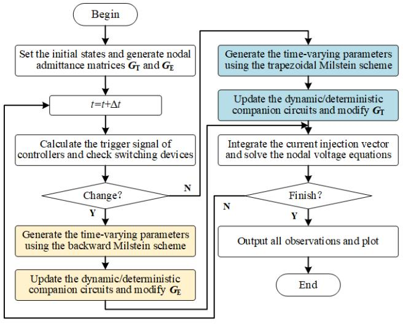  
Fig. 3. Main process of numerical algorithm used in the stochastic EMT simulation.

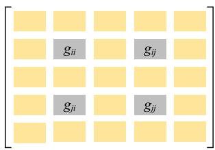  
a)

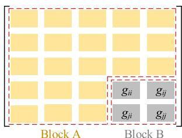  
b)

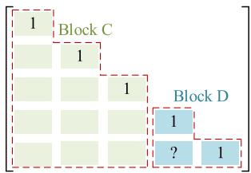  
c)

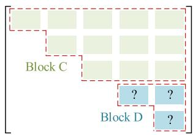  
d)   
Fig. 4. Reassignment of nodal admittance matrix and its decomposition. (a) Nodal admittance matrix. (b) Reassigned nodal admittance matrix. (c) Lower triangular matrix. (d) Upper triangular matrix.

employed to improve the efficiency of solving the nodal voltage equations. Once the parameter migration of the element is modeled by a dynamic companion circuit, the nodal admittance matrix has to be modified at each time step. Even if only one element has parameter perturbation, it will cause four entries of $G _ { T }$ or $G _ { E }$ to change. Taking the branch $( i , j )$ as an example, if the equivalent conductance of branch $( i , j )$ exists a change $\Delta g _ { i j }$ , the entries $g _ { i i } , g _ { i j } , g _ { j i }$ , and $g _ { j i }$ all need to be modified for the solution of the current time, as shown in Fig. 4(a). Such a change essentially increases the time cost of each step, and it will continue until the end of the simulation, which also means that the inversion and even triangularization of nodal admittance matrix with static storage are no longer applicable.

To accelerate computing, the technique called nodes ordering that is usually used in EMTP-based EMT simulation is inherited in the proposed stochastic EMT simulation, namely that number the nodes of the deterministic element first.

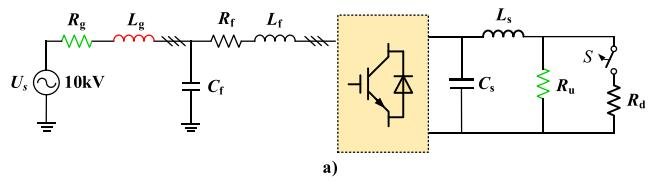

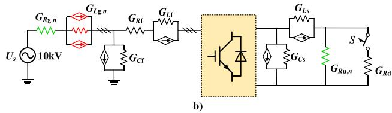  
Fig. 5. (a) Three-phase rectifier circuit and (b) its companion circuit used in the stochastic EMT simulation.

Then, the branch of the element with parameter migration is automatically assigned at the bottom right side of the nodal admittance matrix, as shown in Fig. 4(b), where Block A corresponds to the deterministic subsystem and Block B corresponds to the stochastic subsystem. Suppose that there are N nodes in the investigated system and m nodes belonging to the stochastic subsystem. By the Doolittle decomposition algorithm, the reassigned nodal admittance matrix can be factored into a lower triangular matrix and an upper triangular matrix, whose entries are given by

$$
\left\{ \begin{array}{l} u _ {i j} = g _ {i j} - \sum_ {k = 1} ^ {i - 1} l _ {i k} u _ {k j}, j = i, i + 1, \dots , N \\ l _ {j i} = \left(g _ {j i} - \sum_ {k = 1} ^ {i - 1} l _ {j k} u _ {k i}\right) / u _ {i i}, j = i + 1, \dots , N \end{array} \right. \tag {32}
$$

where $l _ { j i }$ is the entry ( j, i ) of lower triangular matrix, $u _ { i j }$ is the entry (i, j ) of upper triangular matrix, and $g _ { i j }$ is the entry (i, j ) of $G _ { T }$ or $G _ { E }$ .

It can be seen in Fig. 4(c) and (d) that Block C in both lower and upper triangular matrices is only calculated from Block A of nodal admittance matrix. After reassignment, Block A is deterministic such that Block C can be stored statically and used repeatedly. Combined with node ordering that makes lower and upper triangular matrices sparse, the efficiency of solving the nodal voltage equations can be enhanced, thus reaching a level close to that of deterministic EMT simulation.

# VI. CASE STUDIES

The developed stochastic EMT simulation tool is implemented in a C program package, and it is called SEMTP. To illustrate the performance of the tool, a grid-connected three-phase two-level rectifier and a two-terminal dc distribution system are both used on an Intel Core i7-8770 3.20-GHz machine with 16-GB RAM. If not specified, the time step is generally set to 10 μs.

# A. Three-Phase Rectifier Circuit

The three-phase two-level rectifier circuit is shown in Fig. 5(a), where $R _ { g }$ and $L _ { g }$ are the equivalent resistance and inductance of the main grid, respectively, and $R _ { u }$ and $R _ { d }$ represent dc loads. The stochastic processes of the main

TABLE II PARAMETERS OF THREE-PHASE RECTIFIER   

<table><tr><td>Parameter</td><td>Value</td><td>Parameter</td><td>Value</td><td>Parameter</td><td>Value</td></tr><tr><td>Rg0</td><td>1.0 mΩ</td><td>Rf</td><td>3.0 mΩ</td><td>Cs</td><td>2.0 mF</td></tr><tr><td>Lg0</td><td>0.05 mH</td><td>Lf</td><td>3.5 mH</td><td>Ls</td><td>0.1 mH</td></tr><tr><td>Ru0</td><td>40.0 Ω</td><td>Cf</td><td>10.0 μF</td><td>Rd</td><td>20.0 Ω</td></tr></table>

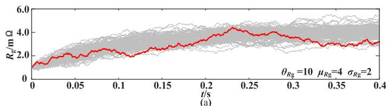

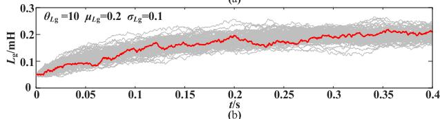

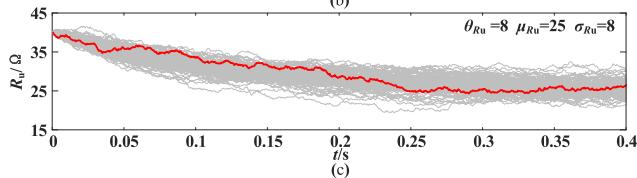  
Fig. 6. Time evolution of the parameters following O-U process. (a) $R _ { g } .$ (b) L g . (c) $R _ { u }$ .

grid and dc loads are generally aggregated from wide areas, of which the cumulative effect will significantly increase the strength of uncertain variability. To demonstrate their impacts, $R _ { g } , L _ { g } ,$ and $R _ { u }$ , as basic units, are modeled with parameter migrations, and thus, the companion circuit of the whole system used in the stochastic EMT simulation can be obtained, as shown in Fig. 5(b).

Regarding the specific stochastic processes involved in $R _ { g } , L _ { g } ,$ , and $R _ { u } ,$ we use Ornstein–Uhlenbeck’s (O-U) process, also known as the mean-reverting process, whose general form and expressions for the mean and variance are

$$
\left\{ \begin{array}{l} d \eta (t) = \theta (\mu - \eta (t)) d t + \sigma d W (t) \\ E [ \eta (t) ] = \mu + (\eta \left(t _ {0}\right) - \mu) e ^ {- \theta t} \\ \operatorname {V a r} [ \eta (t) ]) = \sigma^ {2} \left(1 - e ^ {- 2 \theta t}\right) / (2 \theta) \end{array} \right. \tag {33}
$$

where θ is the mean-reversion speed, namely, the rate at which the stochastic variable is pulled toward the mean value $\mu ,$ , and ι is the diffusion intensity, which can be adjusted to obtain the desired variance. It is worth noting that the procedure described in Section V does not rely on a specific stochastic process. One can choose other functions for the drift and the diffusion terms of the SDE to define parameter migrations with the given statistical properties.

The simulation parameters are given in Table II in which $R _ { g 0 } , L _ { g 0 }$ , and $R _ { u 0 }$ are the corresponding initial values. For a set of O-U process parameters, Fig. 6 shows the time evolution of $R _ { g } , L _ { g }$ , and $R _ { u }$ for 50 simulations, where the red line is one of the stochastic trajectories. The initial and final

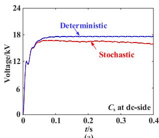

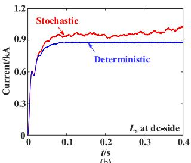

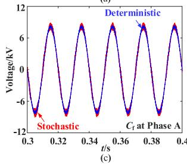

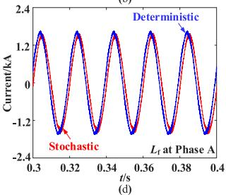  
Fig. 7. Trajectories of four state variables in the rectifier circuit. (a) Voltage across $C _ { s } .$ . (b) Current through $L _ { s } , \mathrm { ( c ) }$ Voltage across $C _ { f } .$ (d) Current through $L _ { f } .$

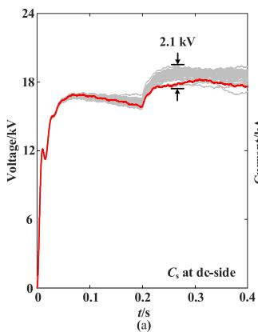

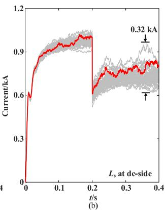  
Fig. 8. Stochastic trajectories of dc-side voltage and current obtained by SEMTP. (a) Voltage across $C _ { s }$ . (b) Current through $L _ { s }$ .

mean values of the O-U process can be set up by different extreme conditions, whereas the mean-reversion speed θ is recommended to be set large enough to complete the reversion before the end of the simulation, and the confidence interval of parameters at each step determined by diffusion intensity ι should be controlled within a reasonable range. In essence, these presuppositions concentrate the long-term evolutions of system parameters in a short term, thus providing a more rigorous testing environment that contains various extreme operating conditions to the system.

To clearly illustrate the impacts of parameter migrations at the main grid and dc load, the rectifier circuit uses the openloop control with the carrier frequency of 3000 Hz, and the switching components are represented by the $R _ { \mathrm { o n } } / R _ { \mathrm { o f f } }$ model.

Compared with the deterministic EMT simulation using the initial values $R _ { g 0 } , L _ { g 0 }$ , and $R _ { u 0 } .$ trajectories of four stochastic state variables in the rectifier circuit are presented in Fig. 7, including the voltages on $C _ { s }$ and $C _ { f }$ , as well as the currents through $L _ { s }$ and $L _ { g } ,$ where the stochastic processes of $R _ { g }$ and $L _ { g }$ at each phase are independent. The switch breaks at

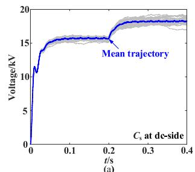

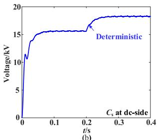

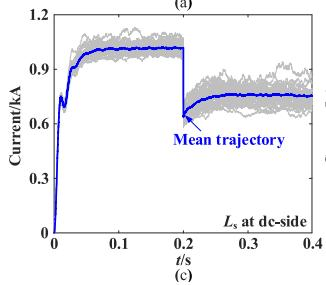

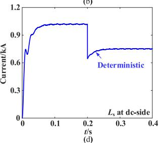  
Fig. 9. Comparison between deterministic trajectories by EMT simulation and mean trajectories by SEMTP. (a) Mean trajectory of voltage across $C _ { s } .$ (b) Deterministic trajectory of voltage across $C _ { s } . \left( \mathrm { c } \right)$ Mean trajectory of current across through $L _ { s } .$ (d) Deterministic trajectory of current through $L _ { s }$ .

TABLE III AVERAGE TIME COST OF SEMTP AND EMTP   

<table><tr><td rowspan="2"></td><td rowspan="2">Main subprocess</td><td colspan="2">Average time cost/s</td></tr><tr><td>EMTP</td><td>SEMTP</td></tr><tr><td>1</td><td>Initialization</td><td>0.103</td><td>0.116</td></tr><tr><td>2</td><td>Parameter update</td><td>0.000</td><td>1.042</td></tr><tr><td>3</td><td>Companion circuit update</td><td>1.481</td><td>2.154</td></tr><tr><td>4</td><td>G matrix modification</td><td>0.327</td><td>2.221</td></tr><tr><td>5</td><td>Network solution</td><td>2.655</td><td>2.740</td></tr><tr><td></td><td>Total</td><td>9.510</td><td>13.295</td></tr></table>

$t = 0 . 2 \ : \mathrm { s } ,$ and 50 trajectories of voltage across $C _ { s }$ obtained by SEMTP are shown in Fig. 8(a) and 50 trajectories of current through Ls are shown in Fig. 8(b). The stochastic perturbations of $R _ { g } , L _ { g }$ , and $R _ { u }$ are simulated continuously and simultaneously, thus stimulating the various responses of the system. Such a setting essentially realizes the multiple changes of operating scenarios in one simulation, including from strong grid to weak grid and from light load to heavy load. Note that different stochastic processes for an element can be used in series and different elements with parameter migrations can be used in combination. Therefore, if there is no special requirement, the stochastic EMT simulation only needs to be performed once.

By setting $R _ { g 0 } = \mu _ { R g } = 4$ m, $L _ { g 0 } = \mu _ { L g } = 0 . 2$ mH, and $R _ { u 0 } = \mu _ { R u } = 2 5 \Omega$ , the mean trajectories obtained by 50 simulations using SEMTP are shown in Fig. 9(a) and (b), whereas Fig. 9(c) and (d) corresponds to the deterministic EMT simulation using the initial values. The mean trajectories are highly consistent with the deterministic ones, which demonstrates the inference derived in Section IV and also validates the developed SEMTP simulation tool.

Table III compares the average time costs of 50 simulations using SEMTP and EMTP. Considering that the developed

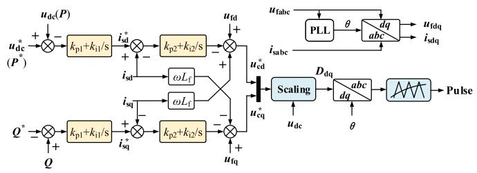  
Fig. 10. Control scheme of two VSC stations.

TABLE IV PARAMETERS OF CONTROL SUBSYSTEMS AND DC CABLES   

<table><tr><td>Parameter</td><td>Value</td></tr><tr><td>Outer &amp; inner loop PI in Station 1</td><td>[0.3 16], [1 20]</td></tr><tr><td>Outer &amp; inner loop PI in Station 2</td><td>[0.1 20], [1 20]</td></tr><tr><td>PI in PLL</td><td>[60 1400]</td></tr><tr><td>Sample time of controller</td><td>0.1 ms</td></tr><tr><td>DC cable resistance &amp; inductance</td><td>0.194 Ω, 0.125 mH</td></tr></table>

SEMTP tool is not yet a mature commercial simulation software, the underlying implementation will greatly affect the computing time, and thus, we also implemented EMTP in a C program package for straight comparing their efficiency performances.

As shown in Table III, the major difference of efficiency between SEMTP and EMTP is found in Subprocesses 2–4, which is principally because the elements with parameter migration, the corresponding dynamic companion circuits, and nodal admittance matrices should be updated or modified at each time step. The data storage is frequently called in these subprocesses such that the time spent on data transmission is significant. It is worth emphasizing that the computational performance of SEMTP can be further improved through sparse matrix technique and code optimization, thus reaching a level close to EMTP.

# B. Two-Terminal DC Distribution System

To illustrate the testing function of SEMTP, a dc distribution system consisting of two VSC stations is configured in this section. The two stations are both connected to the active network same as the above three-phase rectifier circuit, and their control scheme defined in SEMTP is shown in Fig. 10, where Station 1 uses the classical vector control strategy with dc voltage control and Station 2 employs the power control.

Table IV summarizes the parameters of control subsystems and dc cables. The steady operating point is set to $U _ { \mathrm { V S C 1 } } ^ { * } =$ 20 kV, $P _ { \mathrm { V S C } 2 } ^ { * } ~ = ~ 1 0$ MW, and $Q _ { \mathrm { V S C 1 } } ^ { * } ~ = ~ { \cal Q } _ { \mathrm { V S C 2 } } ^ { * } ~ = ~ 0$ . Applying the initial values $R _ { g 0 }$ and $L _ { g 0 }$ to the equivalent resistance and inductance of the two-side active networks, the deterministic trajectories of states obtained by EMTP are shown in Fig. 11, where Fig. 11(a) is the dc-side voltage of Station 1 and Fig. 11(a) is the ac-side current. After introducing O-U processes to $R _ { g }$ and $L _ { g } ,$ the corresponding stochastic trajectories are shown in Fig. 12.

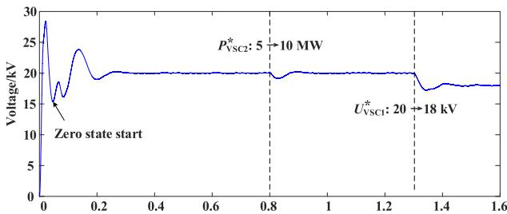

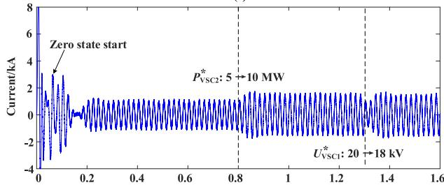  
t/s （a)   
t/s (b)   
Fig. 11. Deterministic trajectories of states subject to Station 1 obtained by EMTP. (a) DC-side voltage. (b) AC-side current.

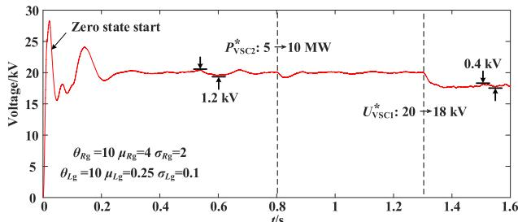

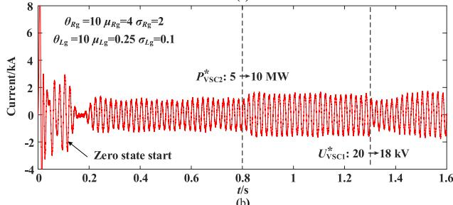  
Fig. 12. Stochastic trajectories of states subject to Station 1 obtained by SEMTP. (a) DC-side voltage. (b) AC-side current.

Compared with the deterministic trajectories, the parameter migration at $R _ { g }$ and $L _ { g }$ essentially completes the change from strong grid to weak grid, which also produces continuous disturbances so that the performance of the control subsystems is no longer satisfactory. In Fig. 13, 20 trajectories of dc-side voltage and ac-side current corresponding to another set of O-U process parameters of $L _ { g }$ are further presented. We can find that the greater the degree of parameter migration is, the more difficult the system is to stabilize, whereas the stochastic EMT simulation can reflect the real performance of the control subsystems and their coordination in this case.

In terms of efficiency, the average time cost to complete the deterministic EMT simulation shown in Fig. 11 (for 50 times)

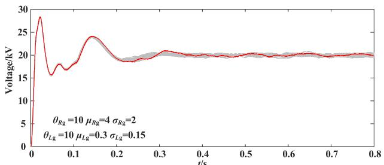

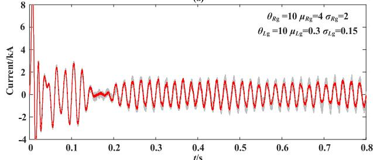  
(a)   
(b)

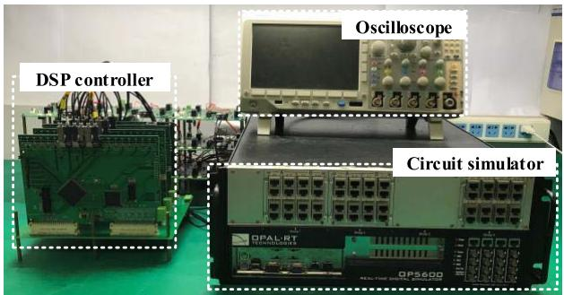  
Fig. 13. Multiple stochastic trajectories of states subject to Station 1 obtained by SEMTP. (a) DC-side voltage. (b) AC-side current.   
Fig. 14. Experimental platform of HIL.

is about 189.168 s, and the average time cost that corresponds to Fig. 12 is about 171.349 s. Obviously, we have to admit that the self-defined control subsystem is not as efficient as that in commercial software. However, no matter how the control subsystem is implemented, the closed-loop control will lead to more time cost in compiling and computing compared to openloop control. The time cost of this part exists in both EMT simulation and stochastic EMT simulation, thus making the relative difference of efficiency between EMTP and SEMTP further reduced. In other words, if the simulation efficiency of EMTP-based EMT simulation is still acceptable, then the efficiency of SEMTP-based stochastic EMT simulation will not far exceed the user’s tolerance.

# C. Hardware-in-the-Loop and Physical Experiments

To demonstrate the simulation capability of the proposed tool and its consistency with actual cases, the hardware-inthe-loop (HIL) and scaled-down physical experiments are both employed as references, which are conducted as follows.

1) HIL Experiment: The HIL experimental platform based on the DSP control board and circuit simulator (RT-Lab) is shown in Fig. 14, which is still essentially a deterministic

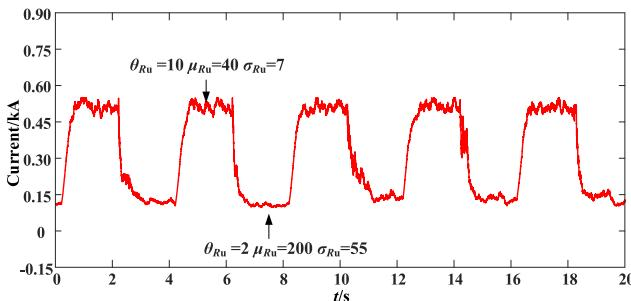

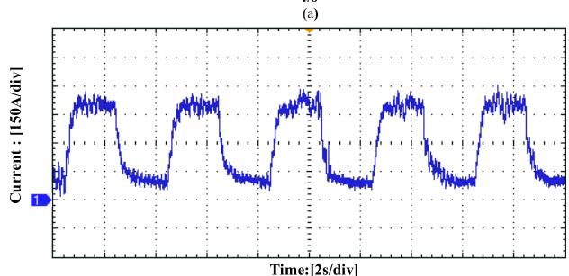  
(b)   
Fig. 15. Trajectories of dc-side current subject to Station 1. (a) SEMTP. (b) HIL experiment.

experimental platform for given system parameters. To produce a series of stochastic perturbations in a certain parameter, such as the power supply and loads, we can implement it indirectly by modifying the reference value of a converter controller in real-time. For clarity, we still use the two-terminal dc distribution system studied in Section VI–B as the test object, where Station 1 is controlled by the DSP control board and Station 2 is with adding a time-varying increment to the reference value of active power.

From the perspective of dc-side external characteristic, Station 2 as well as its ac-side grid can be equivalent to a time-varying dc load, namely, a resistance with parameter migration connected to Station 1. Therefore, when using SEMTP to realize the stochastic EMT simulation, the original main circuit can be regarded as a one-terminal system with a load resistance, which is similar to the configuration shown in Fig. 5.

To ensure comparability between the simulation and HIL experimental result, it is recommended to preset the stochastic process of load resistance first and then utilize the same stochastic process and power-flow calculation to generate the reference values of Station 2 active power used in the HIL experiment. Due to the switching ripples and signal noises of the DSP controller, additional diffusion processes will also be introduced into the transmission power of Station 2 in the HIL experiment, and therefore, the diffusion process of load resistance used in SEMTP should be enhanced according to the maximum power distribution at steady state. Limited by the computing ability of the circuit simulator and DSP control board, the simulation time step of the main circuit is set up to 20 μs, whereas the sampling interval of the controller is 30 μs.

Let the load resistance in SEMTP follow two groups of O-U processes periodicity, Fig. 15 compares the trajectories of the dc-side current subject to Station 1, and Fig. 16 corresponds

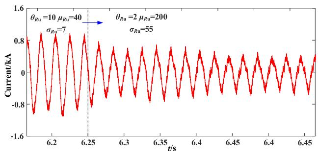

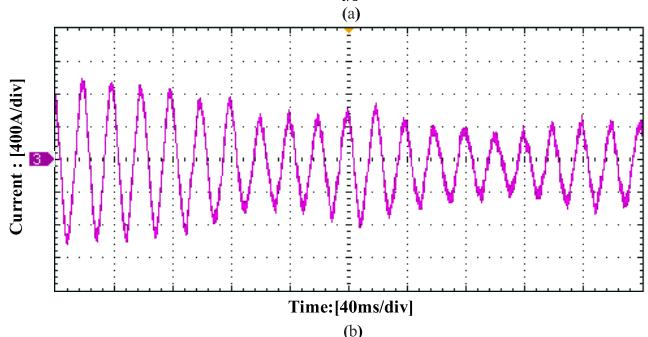  
Fig. 16. Trajectories of ac-side current subject to Station 1. (a) SEMTP. (b) HIL experiment.

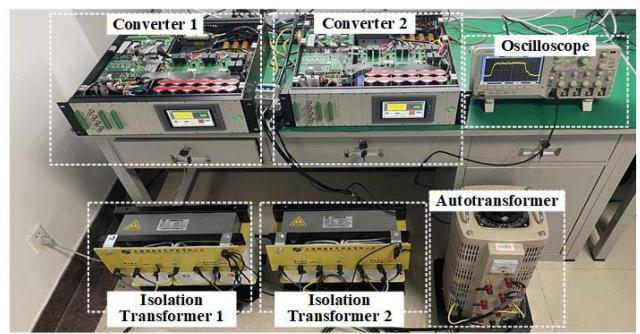

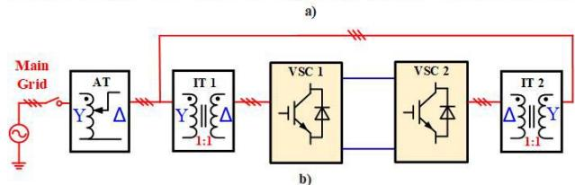  
Fig. 17. Experimental platform of back-to-back dc distribution system. (a) Picture of the hardware setup. (b) System configuration.

to the ac-side current. Note that the stochastic processes in SEMTP and HIL experiments are simulated independently, and the HIL experiment involves the switching process of two stations. Therefore, the trajectories of the two will not completely coincide at every moment, but the consistency between the two is significant, which is still enough to show the resistance with parameter migration has a good performance in simulating the stochastic perturbations of a converter station.   
2) Scaled-Down Physical Experiment: The physical experiment is based on a scaled-down back-to-back dc distribution system, of which configuration is shown in Fig. 17. The key parameters are summarized in Table V, where Converter 1 controls the dc-side voltage at 600 V and Converter 2

TABLE V PARAMETERS OF EXPERIMENTAL PLATFORM   

<table><tr><td></td><td>Parameter</td><td>Value</td></tr><tr><td>Autotransformer</td><td>RMS of output voltage</td><td>380V</td></tr><tr><td rowspan="3">Isolation transformer</td><td>Turns ratio</td><td>440V/440V</td></tr><tr><td>Rated capacity</td><td>20 kVA</td></tr><tr><td>Equivalent impedance</td><td>0.016+j0.095Ω</td></tr><tr><td rowspan="5">Two-level three-phase VSC</td><td>DC-link capacitor</td><td>1.41 mF</td></tr><tr><td>Bridge-side inductor</td><td>2.4 mH</td></tr><tr><td>Rated dc-side voltage</td><td>600 V</td></tr><tr><td>Switching frequency</td><td>10 kHz</td></tr><tr><td>Infineon IGBT</td><td>FF225R12ME4</td></tr><tr><td rowspan="4">Controller</td><td>Inner loop PI in Converter 1</td><td>[10, 70]</td></tr><tr><td>Outer loop PI in Converter 1</td><td>[0.3, 0.6]</td></tr><tr><td>Inner loop PI in Converter 2</td><td>[11, 80]</td></tr><tr><td>TI DSP</td><td>TMS320F28335</td></tr></table>

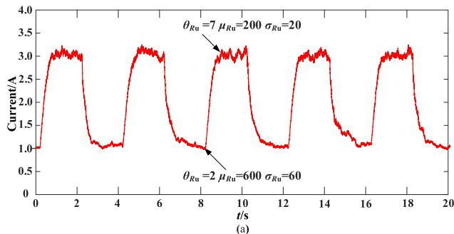

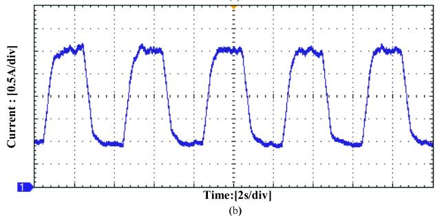  
Fig. 18. Trajectories of Converter 1 dc-side current in Case 1. (a) SEMTP. (b) Scaled-down physical experiment.

employs power control with single inner loop. Using the same verification scheme as the HIL experiment, namely Converter 2 providing a series of stochastic perturbations, Figs. 18–20 show the trajectories of the dc-side currents in three cases of stochastic process settings. The first two cases are the periodic execution of two stochastic processes, and the third changes only once.

In the above verification, the time-varying load subsystem consisted of converter and main grid is simplified as resistance with parameter migration, which greatly minimizes the scale of the system to be simulated. While reducing the time cost of simulation, the various operating conditions are retained as much as possible. These are the distinct advantages of the developed stochastic EMT simulation.

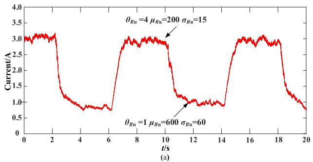

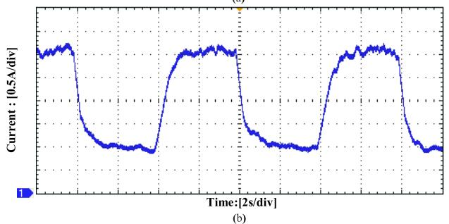  
Fig. 19. Trajectories of Converter 1 dc-side current in Case 2. (a) SEMTP. (b) Scaled-down physical experiment.

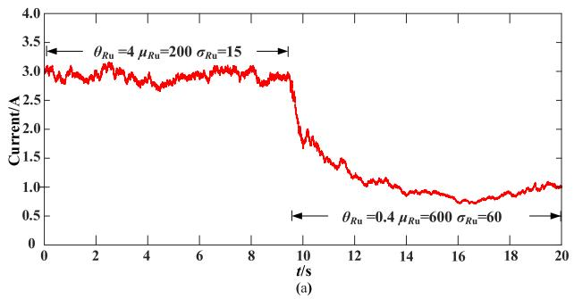

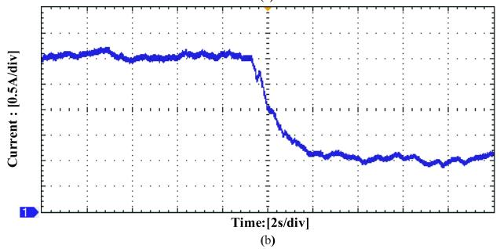  
Fig. 20. Trajectories of Converter 1 dc-side current in Case 3. (a) SEMTP. (b) Scaled-down physical experiment.

# VII. CONCLUSION

To investigate the impact of uncertain variability and provide a rigorous testing environment for converter-dominated power systems, this article develops a testing tool called stochastic EMT simulation. The case studies tested a gridconnected three-phase two-level rectifier and a two-terminal dc distribution system demonstrate the effectiveness of the modeling method and numerical algorithm, which allows deriving the following conclusions.

1) The dynamic companion circuit model of the element with parameter migration inherits the principle

of companion circuit for deterministic elements, which also promotes the proposed numerical algorithm to be compatible with the framework of EMTP.

2) Although the proposed numerical algorithm is verified through the lab- and demo-level programs, the efficiency performance of SEMTP-based stochastic EMT simulation is almost consistent with EMTP-based EMT simulation.   
3) The stochastic EMT simulation can simulate the parameter migrations, as well as the system dynamic process they stimulate, which can also be used to reflect the real performance of the control subsystems and their coordination in extreme cases.

Further development on this testing tool will be dedicated to the modeling of the element with parameter perturbation or parallel processing to further improve the efficiency of the stochastic EMT simulation, as well as the hardware implementation on field-programmable gate array to enhance its testing function.

# REFERENCES

[1] F. M. Alhuwaishel, A. K. Allehyani, S. A. S. Al-Obaidi, and P. N. Enjeti, “A medium-voltage DC-collection grid for large-scale PV power plants with interleaved modular multilevel converter,” IEEE J. Emerg. Sel. Topics Power Electron., vol. 8, no. 4, pp. 3434–3443, Dec. 2020.   
[2] Z. Zhao, P. Yang, J. M. Guerrero, Z. Xu, and T. C. Green, “Multipletime-scales hierarchical frequency stability control strategy of mediumvoltage isolated microgrid,” IEEE Trans. Power Electron., vol. 31, no. 8, pp. 5974–5991, Aug. 2016.   
[3] P. Chen and X. Chen, “Error estimation method of reduced-order smallsignal model for multiterminal DC distribution network,” IEEE J. Emerg. Sel. Topics Power Electron., vol. 9, no. 6, pp. 7212–7222, Dec. 2021.   
[4] L. Zhang et al., “Modeling, control, and protection of modular multilevel converter-based multi-terminal HVDC systems: A review,” CSEE J. Power Energy Syst., vol. 3, no. 4, pp. 340–352, Dec. 2017.   
[5] X. Wang, F. Blaabjerg, and W. Wu, “Modeling and analysis of harmonic stability in an AC power-electronics-based power system,” IEEE Trans. Power Electron., vol. 29, no. 12, pp. 6421–6432, Dec. 2014.   
[6] B. D. Kelper, L. A. Dessaint, K. Al-Haddad, and H. Nakra, “A comprehensive approach to fixed-step simulation of switched circuits,” IEEE Trans. Power Electron., vol. 17, no. 2, pp. 216–224, Mar. 2002.   
[7] J. Xu et al., “High-speed electromagnetic transient (EMT) equivalent modelling of power electronic transformers,” IEEE Trans. Power Del., vol. 36, no. 2, pp. 975–986, Apr. 2021.   
[8] P. Ju, H. Li, X. Pan, C. Gan, Y. Liu, and Y. Liu, “Stochastic dynamic analysis for power systems under uncertain variability,” IEEE Trans. Power Syst., vol. 33, no. 4, pp. 3789–3799, Jul. 2018.   
[9] N. Lin and V. Dinavahi, “Detailed device-level electrothermal modeling of the proactive hybrid HVDC breaker for real-time hardware-in-theloop simulation of DC grids,” IEEE Trans. Power Electron., vol. 33, no. 2, pp. 1118–1134, Feb. 2018.   
[10] H. Huang, C. Y. Chung, K. W. Chan, and H. Chen, “Quasi-Monte Carlo based probabilistic small signal stability analysis for power systems with plug-in electric vehicle and wind power integration,” IEEE Trans. Power Syst., vol. 28, no. 3, pp. 3335–3343, Aug. 2013.   
[11] L. Arnold, Stochastic Differential Equations: Theory and Applications. New York, NY, USA: Wiley, 1973.   
[12] F. Milan and R. Zárate-Miñano, “A systematic method to model power systems as stochastic differential algebraic equations,” IEEE Trans. Power Syst., vol. 28, no. 4, pp. 4537–4544, Nov. 2013.   
[13] L. Branˇcík, E. Koláˇrová, and N. Al-Zubaidi R-Smith, “SDE-based variance simulation in transmission line models with random excitations,” in Proc. 25th Int. Conf. Radioelektronika (RADIOELEKTRONIKA), Apr. 2015, pp. 85–88.   
[14] J. Zhang, P. Ju, Y. Yu, and F. Wu, “Responses and stability of power system under small Gauss type random excitation,” Sci. China Technol. Sci., vol. 55, no. 7, pp. 1873–1880, Jul. 2012.   
[15] B. Yuan, M. Zhou, G. Li, and X.-P. Zhang, “Stochastic small-signal stability of power systems with wind power generation,” IEEE Trans. Power Syst., vol. 30, no. 4, pp. 1680–1689, Jul. 2015.

[16] K. Wang and M. L. Crow, “Numerical simulation of stochastic differential algebraic equations for power system transient stability with random loads,” in Proc. IEEE Power Energy Soc. Gen. Meeting, Jul. 2011, pp. 1–8.   
[17] Z. Y. Dong, J. H. Zhao, and D. J. Hill, “Numerical simulation for stochastic transient stability assessment,” IEEE Trans. Power Syst., vol. 27, no. 4, pp. 1741–1749, Nov. 2012.   
[18] G. M. Jónsdóttir, M. A. A. Murad, and F. Milano, “On the initialization of transient stability models of power systems with the inclusion of stochastic processes,” IEEE Trans. Power Syst., vol. 35, no. 5, pp. 4112–4115, Sep. 2020.   
[19] H. W. Dommel, “Digital computer solution of electromagnetic transients in single-and multiphase networks,” IEEE Trans. Power App. Syst., vol. PAS-88, no. 4, pp. 388–399, Apr. 1969.   
[20] P. E. Kloeden and E. Platen, Numerical Solution of Stochastic Differential Equations. Berlin, Germany: Springer, 2013.

Pengwei Chen (Member, IEEE) received the B.S. and Ph.D. degrees in electric power engineering from North China Electric Power University, Beijing, China, in 2014 and 2019, respectively.

From 2017 to 2018, he was a Visiting Scholar at the Future Renewable Electric Energy Delivery and Management (FREEDM) Systems Center, North Carolina State University, Raleigh, NC, USA. He is currently a Lecturer at the Nanjing University of Aeronautics and Astronautics, Nanjing, China. His research interests include dc distribution network

simulation, stability, and power quality control.

Liang Lu received the B.S. degree in electric power engineering from the Chongqing University of Technology, Chongqing, China, in 2020. He is currently pursuing the M.S. degree in electrical engineering with the Nanjing University of Aeronautics and Astronautics, Nanjing, China.

His research interests include the modeling, simulation, and stability of dc distribution systems.

Xinbo Ruan (Fellow, IEEE) received the B.S. and Ph.D. degrees in electrical engineering from the Nanjing University of Aeronautics and Astronautics (NUAA), Nanjing, China, in 1991 and 1996, respectively.

In 1996, he joined the Faculty of Electrical Engineering Teaching and the Research Division, NUAA, where he became a Professor at the College of Automation Engineering in 2002 and has been engaged in teaching and research in the field of power electronics. From August to October 2007,

he was a Research Fellow with the Department of Electronic and Information Engineering, The Hong Kong Polytechnic University, Hong Kong, China. From March 2008 to September 2011, he was with the School of Electrical and Electronic Engineering, Huazhong University of Science and Technology, Wuhan, China. He is currently a Guest Professor with Beijing Jiaotong University, Beijing, China, the Hefei University of Technology, Hefei, China, and Wuhan University, Wuhan. He is the author or the coauthor of nine books and more than 200 technical papers published in journals and conferences. His main research interests include soft-switching dc–dc converters, soft-switching inverters, power factor correction converters, modeling the converters, power electronics system integration, and renewable energy generation systems.

Dr. Ruan has been a member of the Technical Committee on Renewable Energy Systems, IEEE Industrial Electronics Society, since 2008. He was a recipient of the Delta Scholarship by the Delta Environment and Education Fund in 2003 and the Special Appointed Professor of the Chang Jiang Scholars Program by the Ministry of Education, China, in 2007. From 2005 to 2013, he was the Vice President of the China Power Supply Society (CPSS) (since 2017 again). He serves as an Associate Editor for the IEEE TRANSACTIONS ON INDUSTRIAL ELECTRONICS, the IEEE TRANSACTIONS ON POWER ELECTRONICS, the IEEE JOURNAL OF EMERGING AND SELECTED TOPICS ON POWER ELECTRONICS, the IEEE TRANSACTIONS ON CIRCUITS AND SYSTEMS—II: EXPRESS BRIEFS, and the IEEE OPEN JOURNAL OF THE INDUSTRIAL ELECTRONICS SOCIETY.

Nian Liu (Member, IEEE) received the B.S. and M.S. degrees in electric engineering from Xiangtan University, Xiangtan, Hunan, China, in 2003 and 2006, respectively, and the Ph.D. degree in electrical engineering from North China Electric Power University, Beijing, China, in 2009.

He was a Visiting Research Fellow with the Royal Melbourne Institute of Technology University (RMIT), Melbourne, VIC, Australia, from 2015 to 2016. He is currently a Professor and the Vice Dean of the School of Electrical and

Electronic Engineering, North China Electric Power University. He is also the Director of the Research Section for Multi-Information Fusion and Integrated Energy System Optimization, State Key Laboratory of Alternate Electrical Power System With Renewable Energy Sources. He has authored or coauthored more than 180 journal and conference publications and has been granted more than 20 Chinese patents. His major research interests include multienergy system integration, microgrids, cyber-physical energy systems, and renewable energy integration.

Dr. Liu is a member of the Standardization Committee of Power Supply and Consumption in the Power Industry of China. He was the Highly Cited Chinese Researcher of Elsevier in 2020. He is an Editor of IEEE TRANSACTIONS ON SMART GRID, IEEE TRANSACTIONS ON SUSTAINABLE ENERGY, IEEE POWER ENGINEERING LETTERS, and Journal of Modern Power Systems and Clean Energy (MPCE).