# Multi-Conductor Cable Modeling With Inclusion of Measured Coaxial Wave Propagation Characteristics

Bjørn Gustavsen , Fellow, IEEE

Abstract—The prediction of voltage stresses in transformer and machine windings requires the ability to calculate pulse propagation effects on the feeding cable with sufficient accuracy. The use of commonly available cable models in electromagnetic transient (EMT) programs can lead to voltage wave fronts with too weak damping at very high frequencies. This work shows a method for improving the accuracy of such models by usage of measured coaxial mode propagation characteristics. The information is introduced into a wide-band multi-conductor cable model at high frequencies by a merging procedure, with only a minor impact on the non-coaxial modes of propagation. The application of the developed model is demonstrated for cases where the metallic sheaths are grounded at one end only, or are cross-bonded.

Index Terms—Cable, modeling, pulse propagation, simulation, very fast transients.

# I. INTRODUCTION

C OMMONLY applied electromagnetic transient (EMT)programs have the capability of simulating wave propfrequency-dependent traveling wave models [1], [2]. The input parameters are the per-unit-length (p.u.l.) series impedance $\mathbf { Z } ( \omega )$ and shunt admittance $\mathbf Y ( \omega )$ . These parameters can be calculated for systems of coaxially arranged, tubular conductors with inclusion of skin effect in conductors and earth [3], [4], while proximity effects are normally ignored. The insulation layers are assumed to be lossless. Using Z and Y as input parameters, the matrices of propagation H and characteristic admittance $\mathbf { Y } _ { \mathrm { C } }$ are calculated as a function of frequency [5] and fitted with low-order, delayed rational functions [1], [2]. The resulting model is usually considered adequate for general transient simulation studies, but it can sometimes be unsatisfactory for steep-fronted voltage pulses, e.g., as shown in [6]. The inaccuracies can be a result of additional losses in conductors and sheaths by e.g., stranding effects, or be a result of high-frequency losses in insulating layers and semiconductive screens.

The accuracy limitation can be overcome by a measurementbased approach where the cable multi-port behavior is characterized using S-parameter frequency sweep measurements,

Manuscript received 14 February 2023; accepted 12 April 2023. Date of publication 21 April 2023; date of current version 25 September 2023. This work was supported by the consortium participants of the SINTEF-led Project FastTrans under Project294508/E20. Paper no. TPWRD-00170-2023.

The author is with the SINTEF Energy Research, N-7465 Trondheim, Norway (e-mail: bjorn.gustavsen@sintef.no).

Color versions of one or more figures in this article are available at https://doi.org/10.1109/TPWRD.2023.3269143.

Digital Object Identifier 10.1109/TPWRD.2023.3269143

leading to a lumped-parameter terminal equivalent for the cable [7]. The approach requires access to both cable ends, usually implying on-drum measurements. In the case of cables with certain geometry symmetries, the parameters for a traveling wave model can be calculated [8].

High-voltage cables are normally designed with a separate metallic sheath for each phase (core) that is grounded at both cable ends. High-frequency transients will in such case propagate mainly as uncoupled, coaxial waves through the cable system. An alternative measurement approach was introduced in [6] where one-sided voltage transfer measurements were performed on a single core cable, leading to a single-conductor representation of coaxial wave propagation. Following a similar approach as in [7], the p.u.l. parameters of series impedance $z _ { \mathrm { c o a x } }$ and shunt admittance $y _ { \mathrm { c o a x } }$ were extracted, enabling the calculation of parameters of a traveling wave model defined by propagation function $h _ { \mathrm { c o a x } }$ and characteristic admittance yC coax. The resulting model is suitable for EMT simulation of fast-front wave propagation on cables. The accuracy will, however, deteriorate towards lower frequencies because the magnetic field penetrates the sheaths, thereby violating the assumption of uncoupled coaxial propagation. The proposed model in [6] is therefore not suitable when slow frequency phenomena must be accurately represented in the simulation, in addition to high-frequency phenomena. It is also not suitable if other modes of propagation exist, e.g., when the cable sheaths are cross-bonded or grounded at one end only.

This paper proposes a method for alleviating the limitations of the measurement-based single-conductor model [6] by combining it with a multi-conductor traveling wave model of the complete cable system. The parameters of the multi-conductor model are in this work calculated by the classical procedure [3], [4] which includes skin effect. Section III gives an introduction to transmission line modeling, defining phase domain traveling wave parameters by matrices H (propagation) and $\mathbf { Y } _ { C }$ (characteristic admittance), and the decomposition of waves Cinto modes of propagation. Section IV shows a procedure for introducing the measured $h _ { \mathrm { c o a x } }$ and $y _ { \mathrm { C \ c o a x } }$ in H and $\mathbf { Y } _ { C } ,$ re-Cspectively. An optional filtering method is used such that the modification takes place at high frequencies only. The modified matrices H˜ and $\tilde { \mathbf { Y } } _ { C }$ are fitted with rational functions by a Cstandard method to give parameters for the Universal Line Model (ULM) [2]. Section VII demonstrates the ability of the model to produce accurate results at both low and high frequencies, with the classical model as reference for low-frequency behavior and the measured coaxial behavior as reference for high-frequency

behavior. Sections VIII and IX show simulation examples in EMTP where the cable model is applied in fast front transient studies with alternative grounding schemes for the sheaths; open or grounded far end, and use of cross-bonding. Section X discusses various aspects of the modeling, including choice of filter parameter, modal behavior, and accuracy.

# II. PROBLEM STATEMENT

Consider a system of parallel cables where each cable core has its own metallic sheath. This will typically be a set of single-core cables, or the cores within a three-core cable. The following information is assumed to be available.

1) The parameters for coaxial wave propagation between conductor and sheath, $h _ { \mathrm { c o a x } } ( \omega )$ and $y _ { \mathrm { C \ c o a x } } ( \omega )$ , obtained by measurements on a cable core.   
2) The calculated matrices of series impedance ${ \bf Z } ^ { n \times n } ( \omega )$ and shunt admittance $\mathbf { Y } ^ { n \times n } ( \omega )$ of the complete cable system with n conductors, obtained by calculations from geometry information.

The two data sets are to be combined into a single set from which a multi-conductor frequency-dependent traveling wave model can be extracted, for use in general EMT simulation programs. The combination is to be done in such way that the final model inherits the high-frequency accuracy of $h _ { \mathrm { c o a x } } ( \omega )$ and $y _ { \mathrm { C \ c o a x } } ( \omega )$ , without corrupting the overall model accuracy defined by ${ \bf Z } ^ { n \times n } ( \omega )$ and $\mathbf { Y } ^ { n \times n } ( \omega )$ .

# III. TRAVELING WAVES

The following gives an introduction to transmission line modeling. For detailed information, see e.g., [3], [4] and [5].

# A. Telegrapher’s Equation

Consider an n-conductor homogenous system of parallel conductors buried in a lossy earth. The change to voltage and current along an infinitesimal short length dx is given by (1a) and (1b) where v and i are voltage and current vectors of length n. Z and Y are the per-unit-length series impedance and shunt admittance, which are $n \times n$ complex-valued, symmetrical matrices.

$$
- \frac {d \mathbf {v} (\omega)}{d x} = \mathbf {Z} (\omega) \mathbf {i} (\omega) \tag {1a}
$$

$$
- \frac {d \mathbf {i} (\omega)}{d x} = \mathbf {Y} (\omega) \mathbf {v} (\omega) \tag {1b}
$$

From (1a) and (1b) are derived the Telegrapher’s wave equations for voltage and current,

$$
\frac {d ^ {2} \mathbf {v}}{d x ^ {2}} = \mathbf {Z Y} \mathbf {Y} \tag {2a}
$$

$$
\frac {d ^ {2} \mathbf {i}}{d x ^ {2}} = \mathbf {Y Z i} \tag {2b}
$$

The solving of (2a) and (2b) is achieved by application of suitable boundary conditions. At line ends 1 and 2, the terminal behavior is defined by (3a) and (3b) where the right side is two

times the incident current wave [9].

$$
\mathbf {i} _ {1} - \mathbf {Y} _ {C} \mathbf {v} _ {1} = - \mathbf {H} (\mathbf {i} _ {2} + \mathbf {Y} _ {C} \mathbf {v} _ {2}) \tag {3a}
$$

$$
\mathbf {i} _ {2} - \mathbf {Y} _ {C} \mathbf {v} _ {2} = - \mathbf {H} \left(\mathbf {i} _ {1} + \mathbf {Y} _ {C} \mathbf {v} _ {1}\right) \tag {3b}
$$

H and $\mathbf { Y } _ { C }$ are the $n \times n$ matrices of propagation and charac-Cteristic admittance. For a cable with length l, these parameters are related to Z and Y by (4a) and (4b).

$$
\mathbf {H} = e ^ {- \sqrt {\mathbf {Y Z}} l} \tag {4a}
$$

$$
\mathbf {Y} _ {C} = \mathbf {Z} ^ {- 1} \sqrt {\mathbf {Z Y}} = \sqrt {(\mathbf {Y Z}) ^ {- 1}} \mathbf {Y} \tag {4b}
$$

# B. Modal Decomposition

The matrix product YZ can be diagonalized by a frequencydependent eigenvector matrix $\mathbf { T } _ { I }$ [5],

$$
\mathbf {Y} \mathbf {Z} = \mathbf {T} _ {I} \boldsymbol {\Gamma} ^ {2} \mathbf {T} _ {I} ^ {- 1} = \mathbf {T} _ {I} \operatorname {d i a g} \left(\left[ \begin{array}{l l l l} \gamma_ {1} ^ {2} & \gamma_ {2} ^ {2} & \dots & \gamma_ {n} ^ {2} \end{array} \right]\right) \mathbf {T} _ {I} ^ {- 1} (5)
$$

where $\gamma _ { 1 } ^ { 2 } , \gamma _ { 2 } ^ { 2 } \ldots \gamma _ { n } ^ { 2 }$ are the matrix eigenvalues. From these neigenvalues, H can be expressed as

$$
\mathbf {H} = \mathbf {T} _ {I} \operatorname {d i a g} \left(\left[ \begin{array}{l l l l} e ^ {- \gamma_ {1} l} & e ^ {- \gamma_ {2} l} & \dots & e ^ {- \gamma_ {n} l} \end{array} \right]\right) \mathbf {T} _ {I} ^ {- 1} \tag {6}
$$

It is assumed that the system consists of cable cores where each core has one conductor and one sheath. In such cases, the modal decomposition (5) will at high frequencies have as many coaxial modes as there are cables, with identical eigenvalues if the cores are identical. The coaxial modes involve currents in conductors that return in the associated sheaths. These (coaxial) modes are observable in the eigen-decompositions of YZ and of H (5) by corresponding eigenvectors and eigenvalues.

Eigenvector decomposition $\{ \mathbf { T } _ { Y _ { C } } , \pmb { \Lambda } _ { Y _ { C } } \}$ of $\mathbf { Y } _ { C }$ does not re-YC YC Csult in pure coaxial modes at high frequencies, unlike H. The coaxial wave information can, however, be directly related to a sub-set of elements of $\mathbf { Y } _ { C } .$ , as shown in the Section below.

# IV. INTRODUCING MEASURED COAXIAL BEHAVIOR IN SYSTEM PROPAGATION FUNCTION AND CHARACTERISTIC ADMITTANCE

The performed measurements giving $z _ { \mathrm { c o a x } }$ and $y _ { \mathrm { c o a x } }$ are for one single core cable where the conductor current at high frequencies returns in the associated sheath. The product $y _ { \mathrm { c o a x } } z _ { \mathrm { c o a x } }$ is therefore equal to the coaxial mode eigenvalues of YZ at high frequencies. This implies that the coaxial eigenvalues of the system propagation function H can at high frequencies be replaced with

$$
h _ {\mathrm {c o a x}} = e ^ {- \sqrt {y _ {\mathrm {c o a x}} z _ {\mathrm {c o a x}}} l} \tag {7}
$$

In the case of $\mathbf { Y } _ { C } .$ , the sub-matrix associated with a conductor Cand associated sheath will at high frequencies approximately have the structure (8)

$$
\left[ \begin{array}{c c} y _ {c - s} & - y _ {c - s} \\ - y _ {c - s} & y _ {c - s} + y _ {s - e x t} \end{array} \right] \tag {8}
$$

where element (1,1) represents the conductor and element (2,2) the associated sheath. The contribution $y _ { c - s }$ can be viewed as the c scharacteristic admittance of a coaxial wave propagating between the conductor with return in sheath, while $y _ { s - e x t }$ is that of a wave s extpropagating between the sheath and conductors/earth externally

to the cable. It follows that the measurement can be introduced in (8) by replacing the four elements by (9a) where $y _ { \mathrm { C \ c o a x } }$ is given by (9b). Such replacement must be done for all conductor-sheath submatrices of $\mathbf { Y } _ { C }$ .

$$
\left[ \begin{array}{c c} y _ {c - s} & - y _ {c - s} \\ - y _ {c - s} & \left(y _ {c - s} + y _ {s - e x t}\right) \end{array} \right] \approx \left[ \begin{array}{c c} y _ {\mathrm {C}} \text {c o a x} & - y _ {\mathrm {C}} \text {c o a x} \\ - y _ {\mathrm {C}} \text {c o a x} & \left(y _ {\mathrm {C}} \text {c o a x} + y _ {s - e x t}\right) \end{array} \right] \tag {9a}
$$

$$
y _ {\mathrm {C} \text {c o a x}} = \sqrt {\frac {y _ {\mathrm {c o a x}}}{z _ {\mathrm {c o a x}}}} \tag {9b}
$$

# V. FREQUENCY-DEPENDENT MERGING

The following shows a procedure for introducing the measured propagation characteristics at high frequencies only.

# A. Converting Measurement Data to New Frequency Base

The measurements in [6] were performed at frequency samples that were mostly linearly spaced. Traveling wave models usually require logarithmically spaced samples. The data representing $h _ { \mathrm { c o a x } }$ and $y _ { \mathrm { C \ c o a x } }$ are therefore fitted by low-order rational function approximations (10a) and (10b) [10], [11] from which logarithmically spaced samples are calculated.

$$
h _ {\text {c o a x}} \approx \sum_ {i = 1} ^ {N _ {h}} \frac {r _ {i} ^ {h}}{j \omega - a _ {i}} e ^ {- j \omega \tau} \tag {10a}
$$

$$
y _ {\mathrm {C} \text {c o a x}} \approx r _ {0} ^ {Y _ {C}} + \sum_ {i = 1} ^ {N _ {Y _ {C}}} \frac {r _ {i} ^ {Y _ {C}}}{j \omega - a _ {i}} \tag {10b}
$$

# B. Merging by Low-Pass and High-Pass Filters

The correction to H and $\mathbf { Y } _ { C }$ by the coaxial data (10a) and C(10b) is achieved by a merging procedure using first-order lowpass and high-pass filters (11a) and (11b). The filter frequency $\omega _ { 0 }$ is selected at an intermediate frequency so that the lowfrequency behaviors of the original data H and $\mathbf { Y } _ { C }$ are preserved Cwhile at the same time the high-frequency behaviors of $h _ { \mathrm { c o a x } }$ and $y _ { \mathrm { C \ c o a x } }$ are included in the final model. More about this in Section X-B.

$$
L P (\omega) = \frac {\omega_ {0}}{j \omega + \omega_ {0}} \tag {11a}
$$

$$
H P (\omega) = 1 - L P (\omega) = \frac {j \omega}{j \omega + \omega_ {0}} \tag {11b}
$$

The merging is performed for the coaxial modes of H by (12). The elements of vector $\mathbf { h } _ { \mathrm { c o a x } }$ are equal to $h _ { \mathrm { c o a x } } ( \omega )$ from the measurements, while h contains the non-coaxial eigenvalues of H. $\mathbf { T } _ { I } ( \omega )$ and $\mathbf { h } ( \omega )$ are calculated as smooth functions of frequency, which requires to remove any “artificial” switchovers among the eigenvectors when moving from one frequency sample to the next. The removal of switchovers is achieved by a procedure described in Section VI in [12].

$$
\tilde {\mathbf {H}} = L P \cdot \mathbf {H} + H P \cdot \mathbf {T} _ {I} \operatorname {d i a g} \left(\left[ \begin{array}{l l} \mathbf {h} _ {\text {c o a x}} ^ {T} & \mathbf {h} ^ {T} \end{array} \right]\right) \mathbf {T} _ {I} ^ {- 1} \tag {12}
$$

For each phase conductor with associated sheath, a modification is made to the four associated elements in $\mathbf { Y } _ { C }$ by (13).

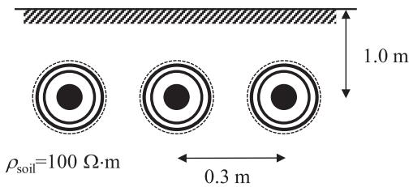  
Fig. 1. System of three underground coaxial cables. (Not to scale).

TABLE ISINGLE-CORE CABLE DATA IN CLASSICAL MODEL  

<table><tr><td>Item</td><td>Property</td></tr><tr><td>Conductor</td><td>d=14.7 mm, σ=58·106S/m</td></tr><tr><td>Insulation</td><td>t=5.2 mm, εr=4.78</td></tr><tr><td>Inner wire sheath</td><td>t=0.6 mm, σ=9.6·106S/m</td></tr><tr><td>Insulation</td><td>t=5.0 mm, εr=2.3</td></tr><tr><td>Outer wire sheath</td><td>t=0.6 mm, σ=6.7·106S/m</td></tr><tr><td>Insulating jacket</td><td>t=2.5 mm, εr=2.3</td></tr></table>

The elements of $\mathbf { h } _ { \mathrm { c o a x } }$ and the sub-blocks (13) are identical if the cable cores are identical.

$$
\begin{array}{l} \left[ \begin{array}{c c} \tilde {Y} _ {C, 1 1} & \tilde {Y} _ {C, 1 2} \\ \tilde {Y} _ {C, 2 1} & \tilde {Y} _ {C, 2 2} \end{array} \right] = L P \cdot \left[ \begin{array}{c c} Y _ {C, 1 1} & Y _ {C, 1 2} \\ Y _ {C, 2 1} & Y _ {C, 2 2} \end{array} \right] + H P \\ \cdot \left[ \begin{array}{c c} y _ {\mathrm {C} \text {c o a x}} & - y _ {\mathrm {C} \text {c o a x}} \\ - y _ {\mathrm {C} \text {c o a x}} & \left(y _ {\mathrm {C} \text {c o a x}} + y _ {s - e x t}\right) \end{array} \right] \tag {13} \\ \end{array}
$$

# C. Traveling Wave Modeling by Universal Line Model

The above merging using rational functions allows the resulting frequency responses H˜ and $\tilde { \mathbf { Y } } _ { C }$ to be fitted with rational Cfunctions. The approximations (14a) and (14b) are calculated for use with ULM [2].

$$
\tilde {\mathbf {H}} \approx \sum_ {g = 1} ^ {G} \left(\sum_ {i = 1} ^ {N _ {g}} \frac {\mathbf {R} _ {g , i}}{j \omega - a _ {g , i}}\right) e ^ {- j \omega \tau_ {g}} \tag {14a}
$$

$$
\tilde {\mathbf {Y}} _ {C} \approx \mathbf {R} _ {0} + \sum_ {i = 1} ^ {N _ {Y C}} \frac {\mathbf {R} _ {i}}{j \omega - a _ {i}} \tag {14b}
$$

# VI. EXAMPLE: MODELING THREE PARALLEL SC CABLES

# A. Cable System

Measurement-based p.u.l. parameters $z _ { \mathrm { c o a x } } ( \omega )$ and $y _ { \mathrm { c o a x } } ( \omega )$ have been extracted for a 6 kV 150 mm2 SC cable of 252 m length [6] from which the propagation characteristics $h _ { \mathrm { c o a x } }$ and $y _ { \mathrm { C } }$ coax have been calculated. The following considers that three cables are buried underground as shown in Fig. 1. The two sheaths are bundled into an equivalent conductor, reducing the $9 \times 9$ matrices of $\mathbf { Z } ( \omega )$ and $\mathbf Y ( \omega )$ to $6 \times 6$ matrices, before calculating H and $\mathbf { Y } _ { C }$ by (4a) and (4b). The cable parameters used in the Ccalculation are defined in Fig. 1 and Table I. The insulation thickness includes that of the inner- and outer semiconductive layer, and the permittivity is chosen such that the (coaxial) time delay agrees well with that observed in the measurement in [6].

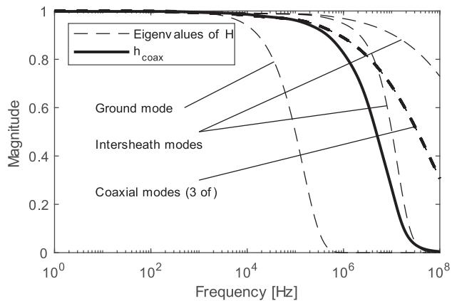  
Fig. 2. Eigenvalues h and $h _ { \mathrm { c o a x } }$ .

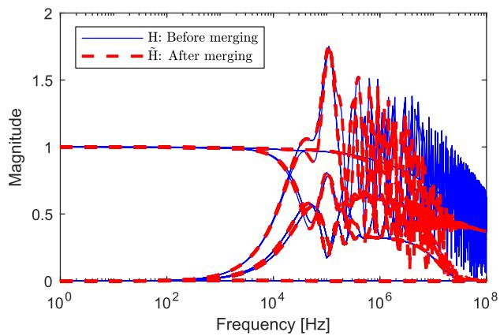  
Fig. 3. Elements of H, before and after merging.

# B. Data Samples

The p.u.l. parameters of the $6 \times 6 \ \mathbf { Z }$ and Y are calculated using a combination of 201 logarithmically spaced and 201 linearly spaced frequency samples, between 1 Hz and 100 MHz. From these 402 samples are calculated the $6 \times 6$ matrices H and $\mathbf { Y } _ { C } ,$ along with the eigen-decomposition (5) with a frequency-Cdependent $\mathbf { T } _ { I } .$ . Sample values for $h _ { \mathrm { c o a x } }$ and $y _ { \mathrm { C \ c o a x } }$ are calculated Iat the same frequencies, using the rational function approximations (10a) and (10b).

# C. Propagation Function

Fig. 2 shows the six eigenvalues of H along with $h _ { \mathrm { c o a x } }$ . It is observed that $h _ { \mathrm { c o a x } }$ is much more damped than the three coaxial eigenvalues of H.

The three coaxial mode eigenvalues are merged with $h _ { \mathrm { c o a x } }$ using (12) with filter pole $\omega _ { 0 } = 2 \pi \cdot 3 \cdot 1 0 ^ { 4 }$ , giving a modified propagation function H˜ . Fig. 3 shows the impact of the merging on the elements of H˜ . It is observed that several elements of the modified matrix H˜ are more damped at high frequencies than the ditto elements of H.

# D. Characteristic Admittance

Fig. 4 shows the elements of the $2 \times 2$ submatrix of $\mathbf { Y } _ { C }$ that Cis associated with the conductor and sheath of the left SC cable

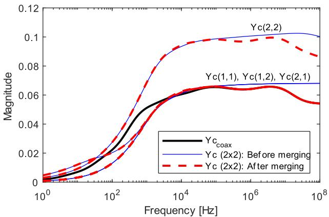  
Fig. 4. Elements of 2×2 sub-block of $\mathbf { Y } _ { C } ,$ and $y _ { C }$ coax.

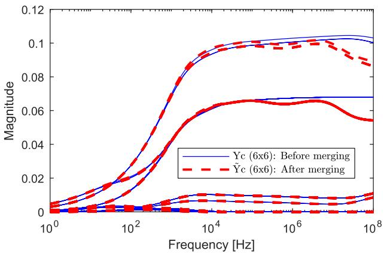  
Fig. 5. Elements of $\mathbf { Y } _ { C } ,$ before and after merging.

in Fig. 1. The plot also shows the element $y _ { \mathrm { C \ c o a x } }$ obtained via measurements, and the effect of merging $y _ { \mathrm { C \ c o a x } }$ with the subblock using (13). It is observed that the high-frequency behavior of the submatrix becomes modified.

Fig. 5 shows the effect of substituting the three $2 \times 2$ submatrices of the $6 { \times } 6 ~ \mathbf { Y } _ { C }$ . The resulting $\tilde { \mathbf { Y } } _ { C }$ gets $3 { \cdot } 4 = 1 2$ of its Celements modified at high frequencies.

# E. Traveling Wave Modeling By ULM

From the matrices of merged propagation H˜ and characteristic admittance $\tilde { \mathbf { Y } } _ { C } .$ , parameters for ULM are calculated by rational function approximations (14a) and (14b). The model parameters are exported to file for use with EMTP.

Figs. 6 and 7 show the rational approximations of H˜ and $\tilde { \mathbf { Y } } _ { C }$ Calong with the data used for the fitting process. The accuracy is considered satisfactory. The fitting used 8–10 poles for the modes of H˜ and 20 poles for the fitting of $\tilde { \mathbf { Y } } _ { C }$ .

# VII. MODEL VALIDATION

# A. High Frequencies

Validating measurements were presented in [6] where a steepfronted voltage $U _ { \mathrm { m e a s } }$ was applied between conductor and sheath for the 252-m cable on drum (Table I). The far end voltage response was measured and used for validation of the coaxial

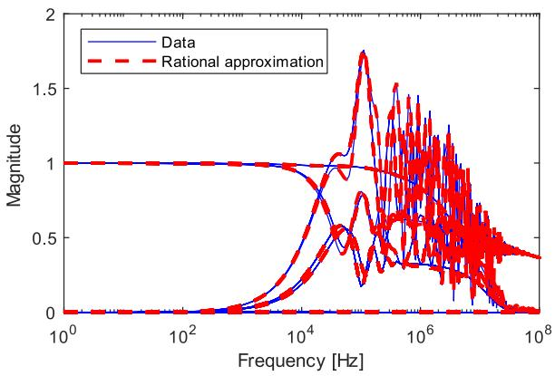  
Fig. 6. Rational approximation of H˜ .

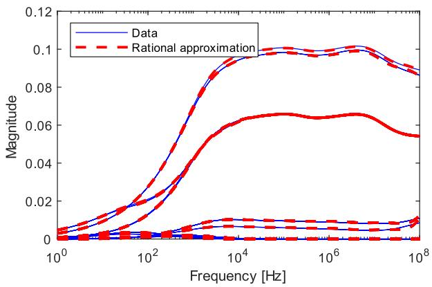

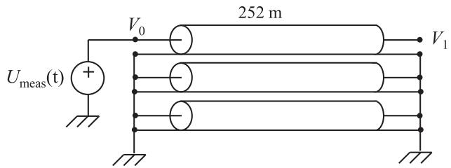  
Fig. 7. Rational approximation of $\tilde { \mathbf { Y } } _ { C }$ .   
Fig. 8. Applying measured voltage to cable near end.

mode modeling. The same applied voltage $U _ { \mathrm { m e a s } }$ is now used for the six-conductor system as shown in Fig. 8. The voltage excitation produces a wave which at very high frequencies propagates between the conductor and the associated sheath.

Fig. 9 compares the measured voltage response $V _ { 1 }$ on the (single) cable with the simulation result by the two alternative 6×6 models: with and without the merging approach. It is observed that the merged model is capable of representing the high-frequency coaxial-mode behavior of the measurement with high accuracy, including the wave front damping. The classical (unmerged) model gives much too weak damping of the wavefront.

# B. Low Frequencies

It is important that the merged model behaves correctly also with operation at 50/60 Hz and at harmonic frequencies. At

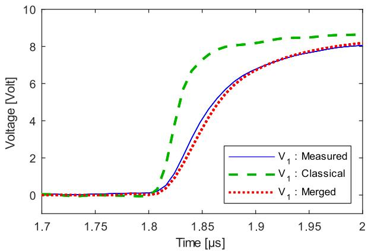  
Fig. 9. Voltage wave front arrival at far end.

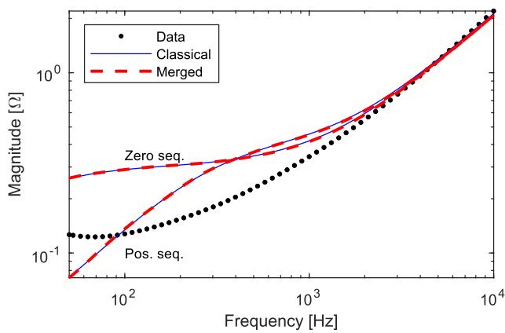  
Fig. 10. Short-circuit impedance.

these frequencies, it will be assumed that the classical model is accurate. The positive and zero sequence behavior derived from the measurement-based model alone is here incorrect because there exists a coupling between phases which is not taken into account.

Fig. 10 shows the positive and zero sequence components of the short-circuit impedance, from 50 Hz to 10 kHz. “Data” denotes the result by three single-conductor (1×1) ULM models in parallel, represented by the rational functions of $h _ { \mathrm { c o a x } }$ and yC coax via (10a) and (10b). “Classical” and “Merged” denote the result calculated from the two alternative 6×6 ULM models, with all cable sheaths grounded at both ends. It can be observed that the merged model closely reproduces the behavior of the classical model in the entire frequency range. The result by the “Data” model deviates significantly from that by the “Classical” and “Merged” models.

Fig. 11 shows the same comparison for the open circuit impedance. The merging is seen to give a substantial improvement in accuracy, also in this case.

# VIII. EXAMPLE: CABLE WITH GROUNDED OR OPEN SHEATHS

Sometimes, the cable sheaths are grounded at only one end to block the flow of induced sheath currents. Fig. 12 shows an example where the cable system is connected to a transformer at the far (right) end. The transformer is represented by a

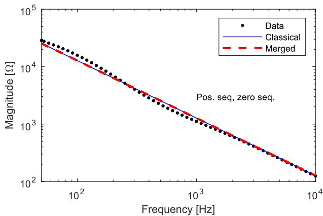  
Fig. 11. Open-circuit impedance.

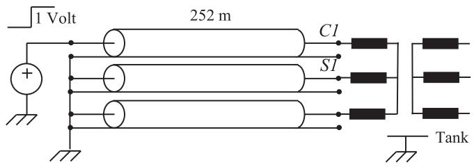  
Fig. 12. Cable connected to a transformer.

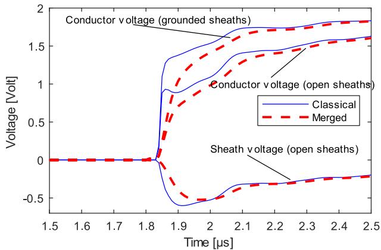  
Fig. 13. Far end voltage response on energized cable. Sheaths open or grounded at far end.

wide-band, measurement-based model of a 300 kVA distribution transformer, developed in [14]. A unit step voltage is applied at the sending (left) end. The voltage response at the far end is calculated when the sheaths are either grounded or open at that end.

Fig. 13 shows the initial response on the energized cable. It is observed that the initial wave front on the transformer terminal (C1) is reduced from about 1.3 Volt to 1 Volt when the sheath groundings are removed. Therefore, the sheaths must in such case be included as an additional conductor to obtain the correct voltage on the transformer terminals. It is also seen that the merged model gives a stronger attenuation of the wavefront than the classical model, consistent with the coaxial mode result in Fig. 9. Fig. 14 shows the result for an expanded (10 µs) time span.

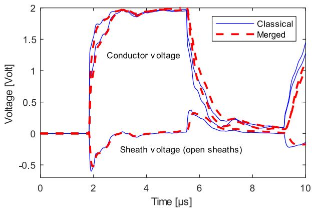  
Fig. 14. Extended view of Fig. 13.

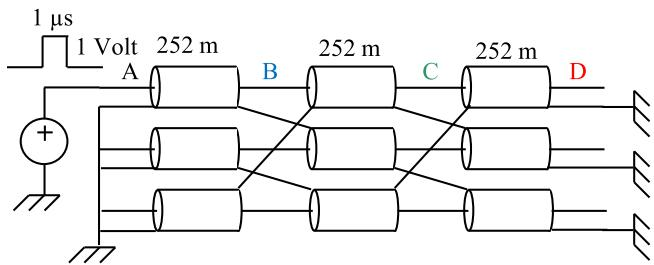  
Fig. 15. Cross-bonded cable system.

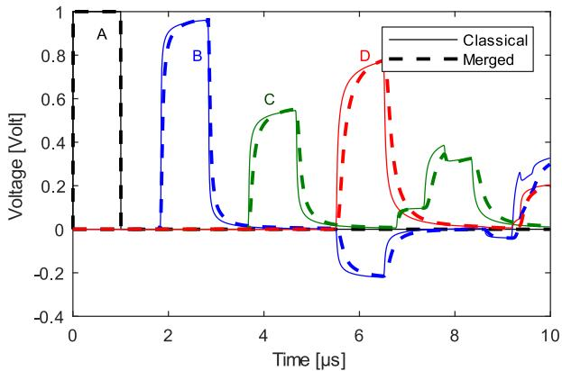  
Fig. 16. Voltage pulse response along energized conductor.

# IX. EXAMPLE: CROSS-BONDED CABLE SHEATHS

Another way of reducing sheath currents is by cross-bonding the cable sheaths. A coaxial wave which meets a cross-bonding point will generate new waves that propagate externally to the sheaths (inter-sheath waves, ground wave), in addition to the coaxial wave. It follows that a simulation of such case requires the use of a model with explicit representation of the cable sheaths.

Fig. 15 shows a calculation example of one major section, with cross-bonding of the sheaths. Each minor section is represented by the 6×6 cable model used in the preceding sections. One of the phase conductors is energized with a square voltage pulse of 1 µs duration.

Fig. 16 shows the voltage along the energized conductor at points A, B, C and D. It is observed that the cross-bonding

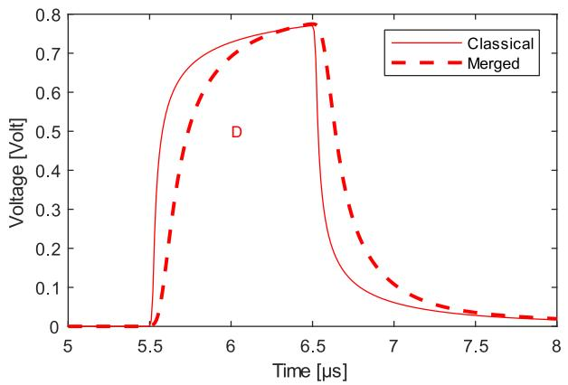  
Fig. 17. Far end voltage on energized conductor.

TABLE II ELEMENTS IN COAXIAL MODE EIGENVECTOR, $\mathbf { t } _ { I , 1 }$   

<table><tr><td>Cable</td><td>Item</td><td>50 Hz</td><td>100 kHz</td></tr><tr><td>1</td><td>C</td><td>0.406 - 0.121i</td><td>0.402 - 0.001i</td></tr><tr><td>1</td><td>S</td><td>-0.361 - 0.135i</td><td>-0.402 + 0.001i</td></tr><tr><td>2</td><td>C</td><td>0.417 - 0.123i</td><td>0.420 + 0.002i</td></tr><tr><td>2</td><td>S</td><td>-0.369 - 0.140i</td><td>-0.420 - 0.002i</td></tr><tr><td>3</td><td>C</td><td>0.406 - 0.121i</td><td>0.402 - 0.001i</td></tr><tr><td>3</td><td>S</td><td>-0.361 - 0.135i</td><td>-0.402 + 0.001i</td></tr></table>

causes a strong reduction in the peak value at D, compared to the expected 2 Volt response for a cable without cross-bonding. It is further seen that the merged model gives a substantial reduction in the front steepness at D, compared to the classical model. This is more clearly seen in the zoomed view in Fig. 17. It follows that simulation of fast front pulse propagation on such cable system requires correct representation of the coaxial mode high-frequency behavior, in addition to explicit representation of the sheath conductors.

# X. DISCUSSION

# A. Modal Behavior at Low Frequencies

Each eigenvector $\mathbf { t } _ { I }$ of $\mathbf { T } _ { I }$ defines the current distribution I Iof modes on individual conductors. At lower frequencies, the eigenvector decomposition degenerates into mixed modes. To see this, consider the eigenvector $\mathbf { t } _ { I }$ that is associated with Ithe first coaxial mode. Table II lists the eigenvector elements at 50 Hz and 100 kHz, with labels C and S denoting phase conductor and sheath, respectively. Clearly, the current in a given phase conductor does not completely return in the associated sheath at lower frequencies (50 Hz). Therefore, the measured coaxial modes are not compliant with the coaxial modes of the full $6 \times 6$ system, and the use of a merging procedure is justified. Fig. 18 shows sums of element pairs in $\mathbf { t } _ { I , 1 } ,$ , with each pair associated with one cable, $I _ { t o t } = I _ { c } + I _ { s }$ I,. Clearly, the three sums approach zero as the frequency is increased. A similar result is found for the other two coaxial eigenvectors.

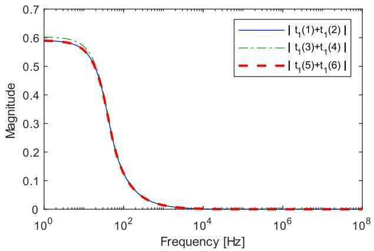  
Fig. 18. Sum of current pairs in coaxial mode eigenvector.

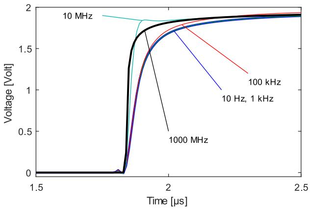  
Fig. 19. Far end step voltage response. Parameter: Filter frequency $f _ { 0 } .$

# B. Choice of Filter Parameter

The proposed method includes filtering to retain the accuracy of the classical model at lower frequencies. The filtering is performed by a first order low-pass filter and a high-pass filter, which are defined by a common filter frequency value $\omega _ { 0 }$ in (11a) and (11b). The magnitude contribution from the HP filter is 9.95% at $\omega = 0 . 1 \omega _ { 0 }$ while the magnitude contribution from the LP filter is 9.95% at $\omega = 1 0 \omega _ { 0 }$ . Therefore, the coaxial mode behavior of the resulting model will (in the range $\omega \in [ 0 . 1 \omega _ { 0 } \ 1 0 \omega _ { 0 } ] )$ be a mix of both data sets $( \{ \mathbf { Z } ^ { n \times n } ( \omega )$ , $\mathbf { Y } ^ { n \times n } ( \omega ) \}$ and $\{ z _ { \mathrm { c o a x } } ( \omega ) , y _ { \mathrm { c o a x } } ( \omega ) \} )$ . The filter value $\omega _ { 0 } =$ 2π $f _ { 0 }$ was in the example chosen with $f _ { 0 } = 3 \cdot 1 0 ^ { 4 } \mathrm { H z }$ , implying that the coaxial behavior of the merged model obeys that of the initial data set at frequencies well below 3 kHz, and that of the measured data set at frequencies well above 300 kHz. At intermediate frequencies, the response will be a mix of two contributions and the resulting accuracy can suffer if transient waveform involves frequency components in this range.

Fig. 19 demonstrates the significance of choosing an appropriate $f _ { 0 } . \mathrm { A }$ unit step voltage is applied between the conductor and sheath on the sending end with the far cable end open (Fig. 8). The figure shows the far end voltage response with five alternative filter frequencies. Usage of a low value for $f _ { 0 }$ (10 Hz, 1 kHz, 10 kHz) gives a voltage response which is similar

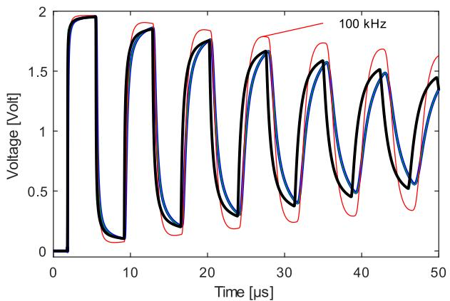  
Fig. 20. Extended view of Fig. 20.

to the measured one, while usage of a very high value for $f _ { 0 }$ (1000 MHz) gives a voltage response close to that by the classical model. Usage of 10 MHz results in a mixed frequency response for the coaxial propagation (see Fig. 2), giving a distorted wave front with an overshoot.

Fig. 20 shows the same response in a 50 µs time window. The dominating oscillation component has a frequency of about 136 kHz. The use of 100 kHz filtering now gives a mixed response that has too small damping. Clearly, it is a requirement that the frequency components of interest are sufficiently far away from the filter frequency $f _ { 0 }$ . Otherwise, incorrect transient responses may result.

The potential errors caused by the filtering in Figs. 19 and 20 suggests that the filtering procedure should be used only when necessary, i.e., when high accuracy is required also at low frequencies. Otherwise, the merging should be applied at all frequencies with $L P ( \omega ) = 0 , H P ( \omega ) = 1$ .

# C. Scope of Application

The combination of measured coaxial mode behavior with a classical model permits the model to be applied in cases where the sheaths cannot be assumed to be ideally grounded. The case studies in Section VIII (cable with far end sheaths open) and Section IX (cross-bonded cables) showed that the fast front voltage response is strongly affected by the sheath grounding condition. These examples demonstrate the usefulness of the modeling extension proposed in this work. Further calculations (not shown) have demonstrated that the combined model retains with only small deviations the behavior of the classical model for the non-coaxial modes, i.e., ground mode and inter-sheath modes.

# D. Accuracy of Classical Modeling

It is in this work assumed that the “Classical” method can represent the non-coaxial modes of propagation with sufficient accuracy, also at very high frequencies. This is not always the case, and improvements are necessary. The classical method is the one that has traditionally been used in EMT programs since early 1980s. Z and Y are calculated based on Schelkunoff’s surface and transfer impedances for tubular conductors with

coaxially symmetrical fields, and Pollaczek’s earth (or some simplification thereof) is used for ground representation. These methods are systematically combined as shown in [3] and [4] for establishing full matrices for Z and Y. The resulting approach is generally considered suitable for the modeling of transient waveforms of high-voltage cables up to at least 100 kHz, in particular when proximity effects are included using FEM [15] or MoM-SO [16]. Recent works [17], [18], [19] have extended the earth-return impedance and admittance formulae to be valid up to much higher frequencies, and these results should be adopted in the modeling for analyses that involve high-frequency inter-sheath and ground mode propagation. Such modifications will be inconsequential for the method proposed in this work.

# E. Accuracy Improvements in Computational Modeling

If measurements on the full-length cable are not available, one may still be able to improve the accuracy of the model’s high-frequency coaxial mode propagation characteristics. Using a sample of the considered cable with polished cross-section surface, one can measure the thickness of the various layers in the cable quite accurately. Such cross-sectional information also permits to represent the conductor surface in more detail using a FEM model for impedance calculation, thereby more accurately representing the actual current distribution on the conductor and sheath surface at very high frequencies [20]. The effect of the semiconducting layers can also be included as shown in [21], provided that its electric parameters are known. The insulation material may also lead to attenuation and dispersion of the wave front due to relaxation phenomena [22]. Such effect can be included in the model by representing a measurement of the permittivity frequency dependency by a rational function [23].

# XI. CONCLUSION

A method is presented for replacing the high-frequency coaxial mode behavior of a classical wide-band cable model with a measured coaxial behavior. The replacement is shown to increase the accuracy of the high-frequency coaxial mode propagation, without affecting the non-coaxial modes of propagation. Assuming that the non-coaxial modes of propagation are represented with sufficient accuracy in the classical model, the proposed model can be applied in simulations with alternative grounding conditions for the sheaths, including open ends and cross-bondings. The model should be suitable for simulations involving repetitive fast pulses from power electronic converters, as well as switching transients emerging from vacuum circuit breakers and switching in gas-insulated substations (GIS). Such applications are topics for future work.

# REFERENCES

[1] L. Marti, “Simulation of transients in underground cables with frequencydependent modal transformation matrices,” IEEE Trans. Power Del., vol. 3, no. 3, pp. 1099–1110, Jul. 1988.   
[2] A. Morched, B. Gustavsen, and M. Tartibi, “A universal model for accurate calculation of electromagnetic transients on overhead lines and underground cables,” IEEE Trans. Power Del., vol. 14, no. 3, pp. 1032–1038, Jul. 1999.

[3] A. Ametani, “A general formulation of impedance and admittance of cables,” IEEE Trans. Power App. Syst., vol. PAS-99, no. 3, pp. 902–910, May 1980.   
[4] L. M. Wedepohl and D. J. Wilcox, “Transient analysis of underground power-transmission systems. System-model and wave-propagation characteristics,” Proc. IEEE, vol. 120, no. 2, pp. 253–260, Feb. 1973.   
[5] H. W. Dommel, Electromagnetic Transients Program Reference Manual:(EMTP) Theory Book. Portland, OR, USA: Bonneville Power Administration, 1986.   
[6] B. Gustavsen, “Cable modeling for very fast transient simulation studies using one-sided voltage transfer function measurements,” IEEE Trans. Power Del., vol. 38, no. 2, pp. 1129–1137, Apr. 2023.   
[7] I. Stevanovi´c, B. Wunsch, G. L. Madonna, and S. Skibin, “High-frequency behavioral multiconductor cable modeling for EMI simulations in power electronics,” IEEE Trans. Ind. Inform., vol. 10, no. 2, pp. 1392–1400, May 2014.   
[8] B. Wunsch, I. Stevanovi´c, and S. Skibin, “Length-scalable multiconductor cable modeling for EMI simulations in power electronics,” IEEE Trans. Power Electron., vol. 32, no. 3, pp. 1908–1916, Mar. 2017.   
[9] A. Semlyen and B. Gustavsen, “Phase domain transmission line modeling with enforcement of symmetry via the propagated characteristic admittance matrix,” IEEE Trans. Power Del., vol. 27, no. 2, pp. 626–631, Apr. 2012.   
[10] B. Gustavsen and A. Semlyen, “Rational approximation of frequency domain responses by vector fitting,” IEEE Trans. Power Del., vol. 14, no. 3, pp. 1052–1061, Jul. 1999.   
[11] B. Gustavsen, “Optimal time delay extraction for transmission line modeling,” IEEE Trans. Power Del., vol. 32, no. 1, pp. 45–54, Feb. 2017.   
[12] L. M. Wedepohl, H. V. Nguyen, and G. D. Irwin, “Frequencydependent transformation matrices for untransposed transmission lines using Newton-Raphson method,” IEEE Trans. Power Syst., vol. 11, no. 3, pp. 1538–1546, Aug. 1996.   
[13] CIGRE Technical Brochure 577A, “Electrical transient interaction between transformers and the power system. Part 1 – Expertise,” CIGRE JWG A2/C4.39, Apr. 2014.   
[14] B. Gustavsen, “Inclusion of neutral points in measurement-based frequency-dependent transformer model,” IEEE Trans. Power Del., vol. 37, no. 3, pp. 1785–1794, Jun. 2022.   
[15] Y. Yin and H. W. Dommel, “Calculation of frequency-dependent impedances of underground power cables with finite element method,” IEEE Trans. Magn., vol. 25, no. 4, pp. 3025–3027, Jul. 1989.

[16] U. R. Patel and P. Triverio, “Accurate impedance calculation for underground and submarine power cables using MoM-SO and a multilayer ground model,” IEEE Trans. Power Del., vol. 31, no. 3, pp. 1233–1241, Jun. 2016.   
[17] T. A. Papadopoulos, D. A. Tsiamitros, and G. K. Papagiannis, “Impedances and admittance of underground cables for the homogeneous earth case,” IEEE Trans. Power Del., vol. 25, no. 2, pp. 961–969, Apr. 2010.   
[18] A. P. C. Magalhães, M. T. C. de Barros, and A. C. S. Lima, “Earth return admittance effect on underground cable system modeling,” IEEE Trans. Power Del., vol. 33, no. 2, pp. 662–670, Apr. 2018.   
[19] H. Xue, A. Ametani, J. Mahseredjian, and I. Kocar, “Generalized formulation of earth-return impedance/admittance and surge analysis on underground cables,” IEEE Trans. Power Del., vol. 33, no. 6, pp. 2654–2663, Dec. 2018.   
[20] R. Papazyan, P. Pettersson, and D. Pommerenke, “Wave propagation on power cables with special regard to metallic screen design,” IEEE Trans. Dielectrics Elect. Insul., vol. 14, no. 2, pp. 409–416, Apr. 2007.   
[21] A. Ametani, Y. Miyamoto, and N. Nagaoka, “Semiconducting layer impedance and its effect on cable wave-propagation and transient Characteristics,” IEEE Trans. Power Del., vol. 19, no. 4, pp. 1523–1531, Oct. 2004.   
[22] L.-M. Zhou and S. Boggs, “Effect of shielded distribution cable on very fast transients,” IEEE Trans. Power Del., vol. 15, no. 3, pp. 857–863, Jul. 2000.   
[23] B. Gustavsen, H. K. Høidalen, and T. Ohnstad, “Field measurement and simulation of electromagnetic transients on 132 kV oil-filled submarine cables,” Electric Power Syst. Res., vol. 115, pp. 43–49, 2014.

Bjørn Gustavsen (Fellow, IEEE) was born in Norway in 1965. He received the M.Sc. and Dr. Ing. degrees in electrical engineering from the Norwegian Institute of Technology, Trondheim, Norway, in 1989 and 1993, respectively. Since 1994, he has been with SINTEF Energy Research, and is currently as a Chief Research Scientist. Since 2020, he has been an Adjunct Professor with NTNU. His research interests include simulation of electromagnetic transients and modeling of frequency dependent effects. He spent 1996 as a Visiting Researcher with the University of Toronto, Toronto, ON, Canada, and the summer of 1998 with the Manitoba HVDC Research Centre, Winnipeg, AB, Canada. During August 2001–August 2002, he was a Marie Curie Fellow with the University of Stuttgart, Stuttgart, Germany.