# Real-time simulation with an industrial DCCB controller in a HVDC grid

P. Raulta,⁎ , S. Dennetièrea , H. Saada , M. Yazdanib , C. Wikströmb , N. Johannessonb

a Réseau de Transport d'Electricité (RTE), Lyon, France   
b Hitachi-ABB power grids, Ludvika, Sweden

# A R T I C L E I N F O

Keywords:

HVDC

MMC

DCCBs

HIL

# A B S T R A C T

DC breakers and their associated control are seen as important lever for the DC grid expansion. In complement to dynamic studies, as intermediate step towards on-site implementation, factory tests using real control and protection hardware enable to fine tune control sequences, to check the software implementation and then test the coordination and interaction between different devices connected to the same grid.

This article presents a hardware-in-the-loop setup for testing industrial DCCB controllers and their interoperability with converter controllers. A hybrid DCCB model suitable for real-time simulation has been developed and then validated against offline model. Industrial DCCB controller functions are described. A set-up of three-terminal DC grid with physical controllers for one MMC converter station and 12 DCCBs is described. The results of two application cases including cable energization and fault clearance are presented and discussed.

# 1. Introduction

DC networks are seen as an important solution for increasing renewable generation in the energy mix as they increase the capacity of the transmission system and its flexibility. Currently, point to point HVDC links are already common for both onshore and offshore projects, converter stations are provided by one single manufacturer and in case of DC fault the whole system trips. However, looking forward, dealing with DC grid to exchange more energy, two additional aspects have to be considered: the VSC-HVDC multivendor interoperability and handling DC faults [1]. Clearing a DC fault in a DC grid is challenging, since the faulty part must be isolated in a few milliseconds to avoid the whole DC grid collapsing. Due to recent innovation in DC circuit breaker (DCCB) technology, Hybrid HVDC Breaker (HHB) makes isolation of faulty parts in a DC grid possible, since this device is able to interrupt DC current in less than 5 ms with acceptable losses [2]. This kind of DCCB is a good trade-off between loss efficiency which are too large with pure semiconductor based DCCB and speed which are two slow with pure mechanical DCCB. Other similar technologies which are currently at the prototype stage, like VARC circuit breaker [3], should also be evaluated in the near future.

A fast circuit breaking device is an important aspect of the fault handling in DC grids but will be useless without efficient detection of faults with DC protections. In fact, the protection system, is utmost importance since it must selectively detect the eventual fault and then send triggering signal to relevant DCCBs within few milliseconds. In

literature a lot of attention where put in one of these aspects, for instance, Wang et al. [4] discusses the fault current limiting, Augustin et al. [5] exhibits the pole to ground DC fault characteristics in monopolar and bipolar configurations, while Descloux et al. [6] and Johannesson et al. [7] investigate different fault detection strategies.

In addition, most of the studies dealing with simulation of DC grid protection raise the attention on the DC system modelling, some general recommendations are providing in [8], some other discussed DC breaker modelling [9]. Descloux [10] justifies the need of frequency dependant cable model to get relevant results.

Some relevant works which include the full chain of protection system using offline simulation are available in literature [11]. In real HVDC projects, such EMT offline studies constitute the first step, to perform control tuning and preliminary studies of the upcoming project. After such preliminary study, the second step involves real time simulation using Hardware In the Loop (HIL) setup with the physical control cubicles. The aim of such HIL simulation are:

• to validate and/or correct initial control tuning   
• to validate the full process chain of the control and protection cubicles (i.e. acquisition, processing time, coordination of actions from independent controllers etc.)   
to cover a wider range of dynamic performance that are not possible to perform in EMT offline study: either due to the long computation time either due to the simplification made in the control system of the offline model

The aim of this work is to perform a HIL simulation of a threeterminal DC grid including DCCBs, which is an essential stage in an innovative industrial context. Physical Control and Protection (C&P) cubicles for ABB DCCBs and converter station are used in this project. High Voltage equipment data and topology come from actual manufacturer design. C&P hardware and software, for converter station and DCCB, have been provided by the manufacturer and correspond to their latest technology. This set-up was first developed to test VSCeHVDC multivendor interoperability in the European founded project called Best Paths DEMO#2 [12]. More information about this multivendor HIL set-up and manufacturers equipment description can be found in [13]. To the authors’ best knowledge this final setup is one of the most detailed platforms ever that has been setup to analyse industrial interoperability issues and coordination between HVDC converters and DCCB controls. This paper contributes in the description of the test setup for HIL simulation. The objective of the paper is also to illustrate the behaviour of DCCB in various applications.

This paper is organized as follow: in part 2 the modelling of Hybrid HVDC breaker for real time purpose is discussed. In part 3 the embedded functionalities of the Hybrid DCCB control are described. In part 4, the HIL set-up used for the test is described. In part 5, two different DCCB applications are illustrated by performing DC cable energization and DC fault clearance. Finally, some conclusions are drawn in part 6.

# 2. DCCB modelling for EMT simulation

# 2.1. Hybrid DCCB topology

The hybrid DCCB shown in Fig. 1, consists in Residual Current Disconnecting Circuit Breaker (RCDCB), an inductor to limit fault current rate of rise, an auxiliary branch for normal operation, a main branch to extinguish DC current. The auxiliary branch has lower conduction losses, it includes an Ultra-Fast Disconnector (UFD) to sustain the DC voltage insulation during the current breaking time and the Load Commutation Switch (LCS) to make the current commute to the main branch. The main branch (MB) is composed by a series of MB cells which are a semiconductor bidirectional switch which commutes the DC current through their parallel varistor in order to decrease the DC current. More information about the hybrid DCCBs design and its operation can be found in [2].

# 2.2. Detailed model for offline simulation

Because of complexity of hybrid DCCBs, and the significance of DC grid protection, DC grid developers are looking for sufficiently detailed

Load Commutation Switch

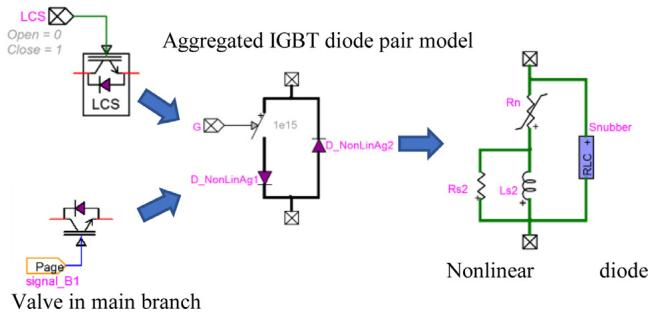  
Fig. 2. Detailed valve model in EMTP-RV for offline simulation.

and accurate DCCB models. The models should be able to represent internal components and control system to enable study of failure modes, opening/closing operation limits, repeated operations, exposure to operating conditions beyond design limits, and failures in high-level protection system. The fault current limiting operation is important for grid operators but requires detailed component-level studies in order to understand design trade-offs for DCCBs.

In [9], a hybrid DCCB model is presented. It is suitable for system study of DC grid protection and transient studies involving DC faults. In this paper, the aforementioned model is extended to cope with ABB specific technology: number of cells, varistor data and disconnector as defined in part 3.2 and Table 3.2 of [14]. A detailed valve model has been developed to accurately represent switching transients within DCCB. This model takes into account nonlinear characteristics of semiconductors and stray inductances/capacitances as described in Fig. 2.

Varistors have been modelled with their V/I curve in order to accurately represent their nonlinear characteristic (data are defined in Table 3.1 in [14]). The model has been implemented in EMTP-RV and has been used as a reference to validate the model developed for realtime simulation.

# 2.3. Detailed model for real-time simulation

The detailed DCCB model developed for offline simulation is presented in the previous section. It is composed of many nonlinear models (varistor and nonlinear diode/IGBT) and many electrical nodes. This section describes optimizations that have been implemented to get a detailed DCCB model that is suitable for real-time simulation.

First, all devices embedded in the DCCB are modelled with resistors and Norton equivalents. IGBT/diodes and disconnectors are modelled with two-value resistors. Semi-conductor arrangement (number of IGBT

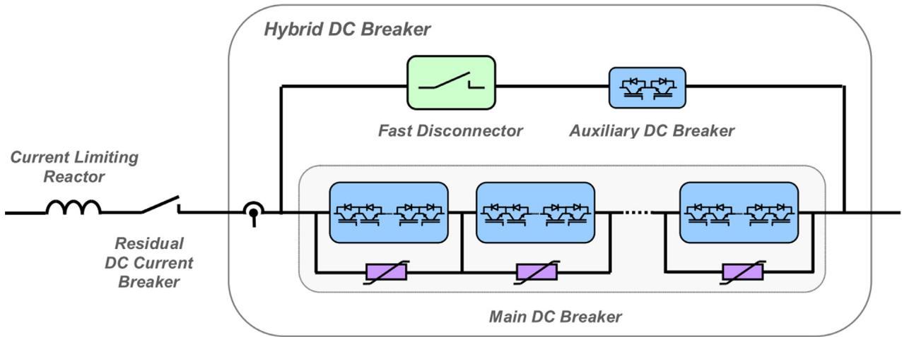  
Fig. 1. Hybrid DCCB.

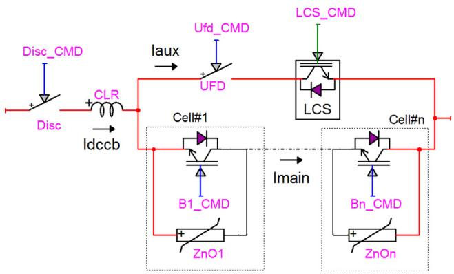  
Fig. 3. DCCB model overview.

in series and in parallel) is used to calculate equivalent resistance of each valve. Varistors are modelled with nonlinear resistor (piecewise nonlinear characteristic). It is assumed that the main branch is composed of n cells that have identical characteristics (semiconductors, valve arrangement, varistor characteristics…). The DCCB model overview is presented in Fig. 3.

The discretized version of this circuit is provided in Fig. 4. Resistances R_Ufd, R_LCS, R_Disc, R_B1..n are the equivalent switching devices resistance. They are calculated from command signals. As cells are connected in series, the following logic is implemented in order to calculate Norton equivalent of varistors: for each cell which valve is closed, the varistor is represented by a resistor which resistance corresponds to the first segment of the nonlinear characteristic; for each cell which valve is open, the Norton equivalent is calculated from Imain current and the nonlinear characteristic. The Norton equivalent are calculated based on the methodology presented in [15]. This logic is very efficient to limit the calculation time of the DCCB model and to keep the execution time practically independent from the number of cells and number of segments of the varistor (ZnO) nonlinear characteristic. The same approach is applicable to bi-directional DCCB.

To validate the DCCB model implemented for real-time simulation, 2 test cases shown in Fig. 5, are illustrated in this section. Simulation results obtained with the offline model described in Section 2.2 are compared with the results obtained with the real-time simulation model. The difference between Test case#1 and #2 is the insertion of a 70 km long DC cable. A frequency dependant cable model [16] is used in Test case#2.

DCCB current (Idccb) from offline and real-time simulations are superimposed in Fig. 6. Simulation results match very well. Several other test cases have been used to validate the real-time implementation. Time step for offline and real-time simulation is 30 µs.

# 3. DCCB station control functions

# 3.1. DCCB control

The control interface of the modular Hybrid DCCB sections allows fault breaking, current limitation, normal load current transfer and

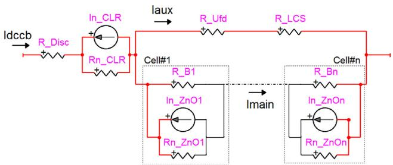  
Fig. 4. Discretized version of the DCCB model.

back-up breaker functionality. Several sub sequences are the building blocks of different control functions, and operating sequences. The block/deblock subsequences of main branch prioritize switching of individual cell based on the stored energy of corresponding varistor. And blocking of individual cell is inhibited if corresponding varistor is overloaded.

The sequence to open the DCCB is as below:

1 The LCS is blocked.   
2 The UFD is ordered to open when the auxiliary current is low enough.   
3 Wait for UFD to reach mid position to ensure that it can withstand the expected voltage.   
4 The MB cells are blocked.

The sequence to close the DCCB is as below:

1 The RCDCBs, Residual Current Disconnecting Circuit Breaker, are ordered to close.   
2 Receiving the close indication of RCDCB, the MB cells are deblocked.   
3 The UFD is ordered to close.   
4 Receiving the close indication of UFD, the LCS is deblocked.

# 3.2. Soft start

The soft start is a function that is used to energize part of the main circuit. The function can be used for testing of the insulation of a cable or overhead line with reduced voltage. The soft start procedure is simply an individual deblocking of the MB cells with delays in between, which will slow down the build-up of voltage and reducing the inrush current.

During the procedure a switch on to fault protection is active while the other protection configurations are the same as in normal operation.

# 3.3. Current limiting functionality

The current limitation function is normally used in a DC grid when there is an earth fault and a need of current limitation until the fault is disconnected. The hybrid DCCB can start the current limiting functionality for self-protection to avoid damage caused by fault current if no breaking order is received from the external control system.

When initiating current limitation, the load commutation switch is blocked and the UFD is opened, commutating the current to the main branch. Thereafter, tuning off the MB cell switches (IGBTs or BIGTs), the current is commutated to the MB cell varistors.

The current limitation continues as long as the fault current persists when the main branch is deblocked. The thermal capacity of the varistors allow for a predefined number of successive blockings of the MB cells before the DCCB is opened and the current interrupted.

# 3.4. DC chopper controls

In some topologies such as bipolar configurations pole to ground faults in one pole will not generate overvoltage in the healthy pole. However, this is not the case with a symmetric monopole configuration where a pole to ground fault will lead to overvoltage in the healthy pole because of lack of strong earth reference on the DC side.

Since long term overvoltage in the healthy pole might lead to breakdown of that pole, a DC voltage chopper is used to quickly reduce the overvoltage. A chopper is a semiconductor device that will ground the pole through a resistor when it is turned on.

The control of the chopper is designed to balance the DC voltages by reducing individual pole to ground overvoltage or pole to pole overvoltage.

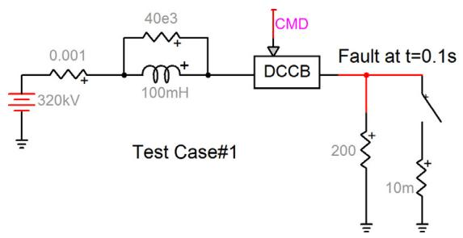

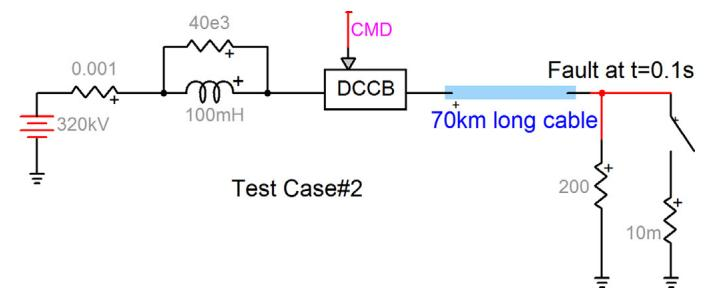  
Fig. 5. DCCB model test cases.

# 3.5. HVDC grid protection algorithm

Because the DC grid is equipped with multiple DCCBs, multiple protection zones exist throughout the grid and the fault detection must therefore be able to differentiate between different fault locations to achieve selectivity. As the DC grid consist of three stations, the DC line protections are implemented on three separate pieces of hardware, each one receiving the simulated voltages and currents belonging to that particular station (as seen in Fig. 7).

In each station, each of the two incoming feeders have the same set of protections. However, because the three stations are connected by two sets of cables with different lengths and one overhead line, different settings are used for each of these.

The DC line protection consist of two different algorithms operating in parallel, one based solely on local measurements and one using telecommunication. The locally based protection measure and compare the steepness of the incident wave to achieve selective detection. Because the principle is insensitive to the network conditions in the backward direction, the same settings can be used for both ends of the same cable or overhead line. The principle is thoroughly described in [7].

The telecommunication-based protection algorithm is the travelling wave differential protection as described in [17]. The communication between the stations occur via a pair of optical fibres. For simulating the additional telecommunication delay due to the geographical distance in a real application, the transmitted data is delayed by an amount of time equal to the propagation delay plus an additional 0.5 ms for representation of other equipment that might be required in a long-distance communication channel, e.g. power boosters or multiplexing equipment. For synchronization of the data being transmitted between stations, the method based on signal-processing from [18] is used, thereby not requiring an absolute time reference such as GPS.

Another feature of the DC line protection system is that it also uses the proactive mode of the hybrid DCCB. The incident wave protection is very fast and react to the very first transient of a fault. Therefore, it is used for ordering the DCCB to prepare for current interruption. The protection system takes advantage of the additional time while the DCCB is preparing for interruption in order to confirm the existence of a fault within the network, and only then will order a trip of the DCCB.

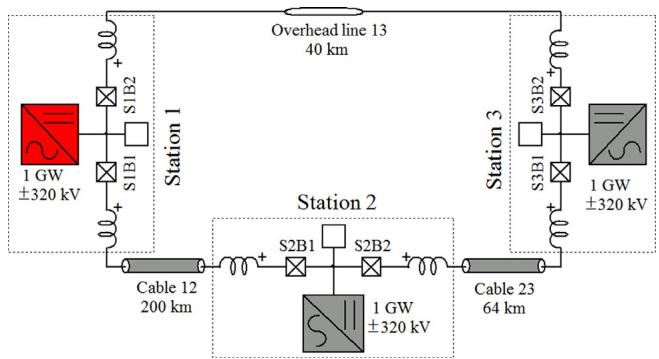  
Fig. 7. Overview of the three-terminal DC grid.

Furthermore, by the time the breaker is ready to interrupt the current, the telecommunication-based differential protection has also had enough time to detect the fault. This approach increases the security of the protection as it does not trip solely due to transients.

# 4. HVDC grid test system

# 4.1. Description of the DC grid benchmark

The DC grid benchmark presented in Fig. 7 is considered as a test case to assess performances of DCCB. It consists of a three-terminal HVDC grid composed of converters in symmetrical monopolar configuration. AC/DC converter stations are Half Bridge Modular Multilevel (HB-MMC) type, with a rating of 1000 MW each and a ± 320 kV DC voltage. On DC side, each AC/DC converter station is connected by two conductor pairs, which are either underground/undersea cables (200 km and 64 km) or overhead line (40 km). DCCBs with their associated current rising limiting inductor are installed at each conductor end, for both positive and negative pole, to isolate the cable/line from the network, in case of DC fault.

Since converter stations were originally designed to operate on a DC grid without DCCB, converter DC voltage protection setting were adapted to ride through DC fault, while the valve overcurrent or submodule overvoltage protections remain unchanged.

All DCCBs are bidirectional, they include a 70 mH inductor and four

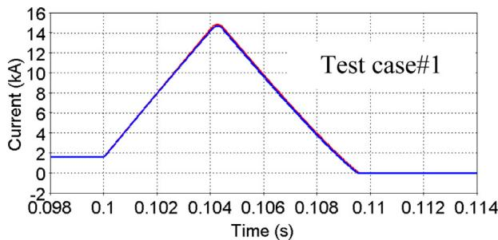

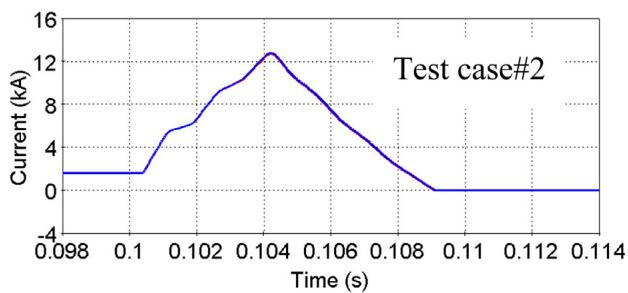  
Fig. 6. Comparison between offline (red) and real-time (blue) simulation. (For interpretation of the references to color in this figure legend, the reader is referred to the web version of this article.)

main breakers (MB) cells with a rated voltage of 80 kV each, data are derived from [14].

Since this DC grid is based on symmetrical monopolar configuration with no strong reference to ground, there is inherent large DC voltage deviation in the healthy pole in case of pole to ground faults. To quickly balance DC voltages after fault clearing, DC choppers have been integrated to the test case.

In Fig. 7 all DCCBs, all choppers and the converter in Station 1 are ABB system while Station 2&3 converters are generic. All ABB equipment are controlled by ABB control hardware.

# 4.2. HIL test platform

# 4.2.1. Overview of the set-up

The set-up is composed of four ABB MACH3 industrial C&P cubicles and an HYPERSIM real time simulator. The four C&P cubicles include:

• PCP – Pole Control and Protection:

○ High level controls,   
○ Converter protection (harmonics, balancing, Umax, Imax)

• SCM – Station Control and Monitoring:

○ Operator workstation (OWS),   
○ Engineering network server (ENS),   
○ Antivirus server, Firewall,   
○ GPS, TFR, debugging tools, compilers

• MCP – Multiterminal Control and Protection:

○ Control for 12 Hybrid HVDC Breakers,   
○ DC grid line protections   
○ DC voltage choppers

• SI – Simulator Interface:

○ Virtual I/O interface,   
○ Valve control interface (firing pulses), including valve control algorithm

# 4.2.2. Real-time MMC models

The hardware and software setup of the HIL simulation are shown in Fig. 8. The same principle is used for the modelling of the 3 converter stations.

The only difference is the interface with the physical control that are only included for the ABB converter station. The valve model of this MMC runs on an FPGA board with a smaller time step of 1 µs to represent each sub-module (SM) individually [19]. They are directly commanded by a valve controller which receives arm currents and all SM voltages through 6 optical fibres. Other information exchanged between the converter controllers and the simulated hardware equipment are directly transferred through a digital interface [20] instead of analogue signal.

# 4.3. DC grid simulation and network modelling

DC cables and DC overhead lines are represented by frequency dependant cable models optimized for real time simulation [16]. Electrical and geometrical data have been used to derive the time domain model. AC grids are represented by Thevenin equivalent.

The interface between DCCB real time models and their controllers is achieved through the same digital IO channel as the converter, which is very convenient for this kind of R&D activities since it provides flexibility and save a lot a wiring connection. In total, 220 analogue outputs, 128 digital outputs, and 224 digital inputs are transferred in the same cable.

The DC grid simulation takes the opportunity of the inherent propagation delays through the DC cables/OHL to split the station and cables tasks on different CPUs. However, the four DCCBs and their associated converter station must be in the same task. A lot of efforts were put in the task mapping strategy to make the full system, including the IOs, running with a 30 µs time step without overrun [21]. The simulation real time performance of was duly tested for many possible configurations and fault situations, which make the authors confident

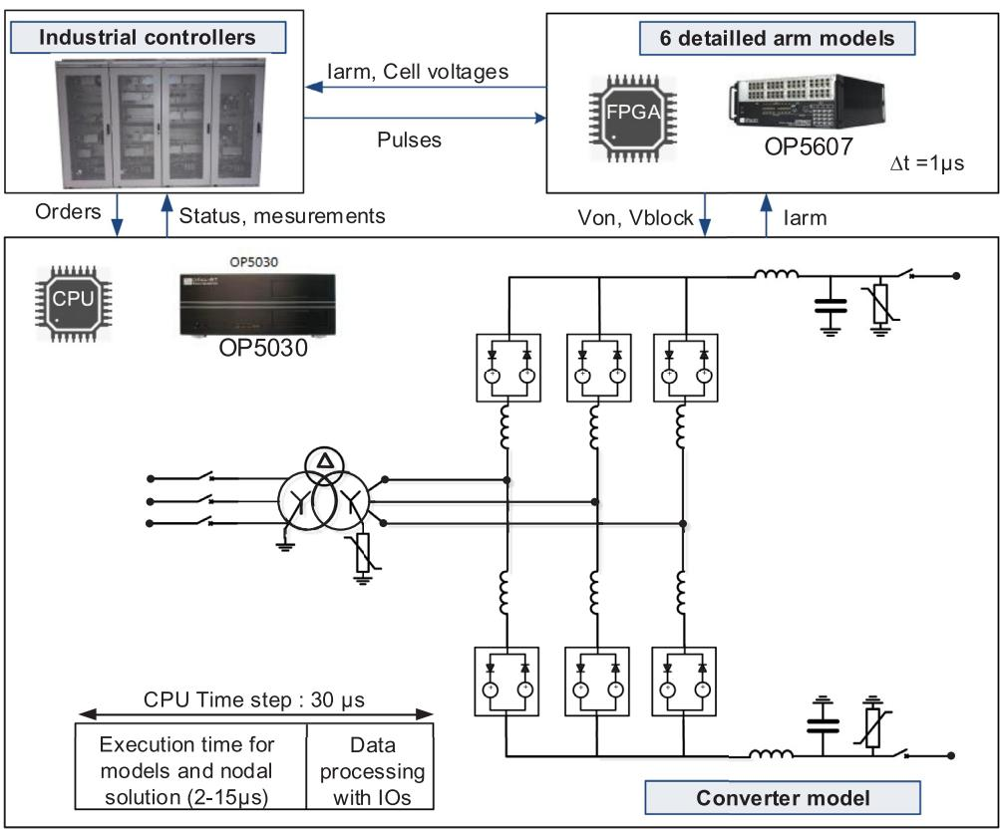  
Fig. 8. Hardware setup for the HIL simulation.

in the relevance of the results.

# 5. HVDC grid system performances with DCCB

All results presented in this section come from the HIL set-up presented in the previous section. Two different types of application regarding DCCB are presented: the first example illustrates, a non-commonly studied function of DCCB, the capability of DCCBs to limit the inrush current during the cable energization while the DC bus are already energised, the second example, shows the performance of the industrial controller under test to selectively clear a DC fault and recover the voltage.. Results are recorded from the ABB TFR (Transient Fault Recorder) or directly from the real time simulator during event acquisition.

# 5.1. DC cable energization

In a DC grid, DC cable or overhead line can be connected to a system which is already energized. Energization of long DC cables is expected to induce large inrush currents because of their inherent capacitance. In order to limit inrush current, DC pre-insertion resistor can be considered. Alternative solutions can be proposed when DCCB are used. In this subsection, two possible connection of cable energization are presented, one with basic procedure of hybrid DCCB closing called “hard start” and another more advanced which is called “soft start”. The first procedure is similar to the solution used to energize AC cables with 3 poles of ACCB simultaneously closed and without insertion resistor. The second procedure is similar to energization of AC cables with ACCB and insertion resistor.

In this test case, the ABB converter station is energized and operated in STATCOM mode. The scenario consists in energizing the 200 km long DC cable (cable 12) by closing both positive and negative DCCBs at DC station S1 (S1.B2).

The results with the “hard start” and “soft start” solutions are presented in Fig. 9. First plot corresponds to the DC voltage on the positive cable at its point of connection, second corresponds to DCCB current (I_T1 is DCCB current and I_T3 is the current in auxiliary branch), third plot displays the deblock commands of the four MB cells (CE1_DEBL, …), the LCS cell (LCS_DEBL), as well as the UFD closed status (UFD_- CLOSED). Results are similar for the negative cable.

For hard start, the closing command of UFD and the deblock command of main breaker cells are sent at the same time. Due to the mechanical action of the UFD, MB cells are deblocked first and then few millisecond later LCS is deblocked as soon as the UFD closed status is

received. When main breaker cells are deblocked, cable voltage starts rising and inrush currents can be noticed. Important transients on voltage and current are experienced: 432 kV (1.35 pu) overvoltage and 5380 A (3.4 pu) peak current are recorded. Such transients can reduce life expectancy of DC cables as recommended by [22]. In this case, inrush current is only limited by the 70 mH inductor, the cable inherent inductance and the converter station.

The soft start solution consists in deblocking the MB cells one by one to limit inrush current. The first cells (CE1) is deblocked first. The second one is deblocked quickly just after since there is no significant charging current. The cable starts charging but with a slower voltage ramp and lower charging current. Then, when the DC current is below a pre-defined threshold, the third cell is deblocked. Same principle is applied for the last cell. Just after deblocking the last cell, UFD is closed and LCS is deblocked. With this solution the transients are quite more limited. DC voltage peak is 337 kV (1.05 pu) and the maximum peak current is 1840 A (1.18 pu). It should be noted that with this method, varistors in the MB cells conduct. Therefore, energy absorbed by these components are closely monitored to make sure there is no overload.

# 5.2. DC fault

The following test case aims to demonstrate the capability of a DC grid to ride through a DC fault thanks to DCCBs using industrial C&P systems. Initial conditions considered in this example are shown in Fig. 10. Converter station 1 and 2 are in Power-Voltage droop control mode with a dead-band of 10 kV while the converter station 3 is in DC voltage control mode. In the figure, the DCCBs status are represented by a filled black box, when there are closed and white when there are opened. The cable 12 and cable 23 are connected, while the overhead line is disconnected. Setpoints of all converter stations are set to get the power flow displayed in Fig. 10. A pole to ground fault on the positive pole of cable 23 at station 2 terminal is applied.

Fault location is identified by the travelling wave protection algorithms and trip signals are sent to DCCB on both sides of cable 23 (S2B2 and S3B1). When fault is cleared by the DCCBs, Station 3 is isolated from the DC grid and is in STATCOM mode. Thanks to the droop control station 1 and 2 remain operating, exchanging almost 500 MW between each other.

Fig. 11 shows the transient waveforms recorded by the S2B1 DCCB located in station 2 which opens due to the DC fault. The first plot corresponds to DCCB current (I_T1) and auxiliary branch current (I_T3), the second plot corresponds to varistor currents of the MB cells, the third plot is the varistor energies. The last plot is the deblock command

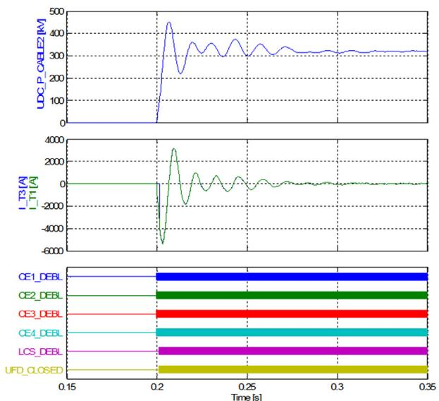

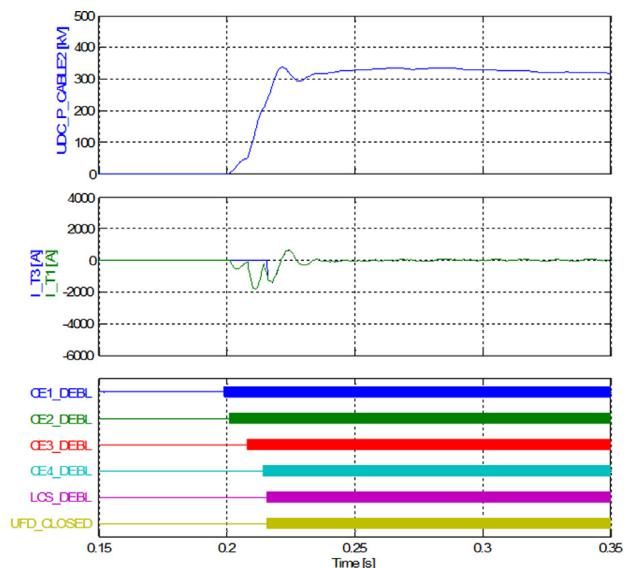  
Fig. 9. DC cable energisation with hard start (left) and soft start (right).

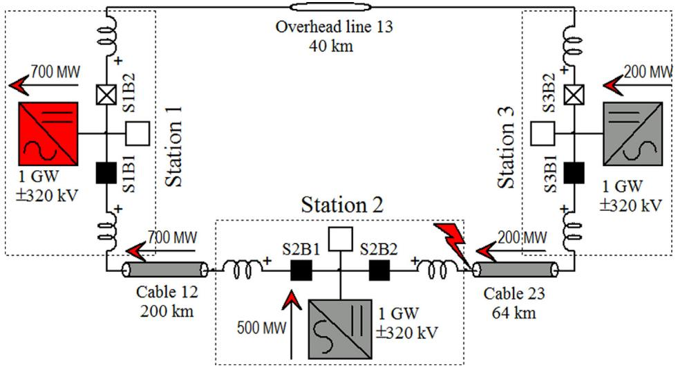  
Fig.. 10. Scenario considered for the DC fault test case.

of MB LCS cells and command and status of the UFD (open order, midposition, and open indication). First stage corresponds to the current rise due to the fault limited by the DCCB inductor, then the second stage is the current extinction by the MB cells. During the first stage, the LCS is blocked in order to commute the fault current to the main branch which explains the auxiliary branch current (I_T3) is going to 0 A. Once this current is zero, UFD open command is released and after few milliseconds the status mid-position and then open position are recorded by the controller. During the second stage, MB cells are blocked one after each other, at that time the fault current is flowing through their parallel varistor. Varistors enable to quickly reduce the DC current

amplitude. A 300 µs delay between the command sent by the controller and the effect on the measurements can be noticed. This delay is mainly due to the communication to send the command and then receive feedback status.

Fig. 12 shows the station 2 measurements. The first and second plot displays respectively positive and negative DC voltages at the cable 12 terminals, at converter station 2 bus bar and the cable 23 terminal. The third plot displays the command of the positive and negative DC chopper. The last plot shows the cable current of both cables for the positive pole. The cable 23 DC voltage on the positive pole is clamped to zero due to the fault, the converter bus and the voltage of cable 12

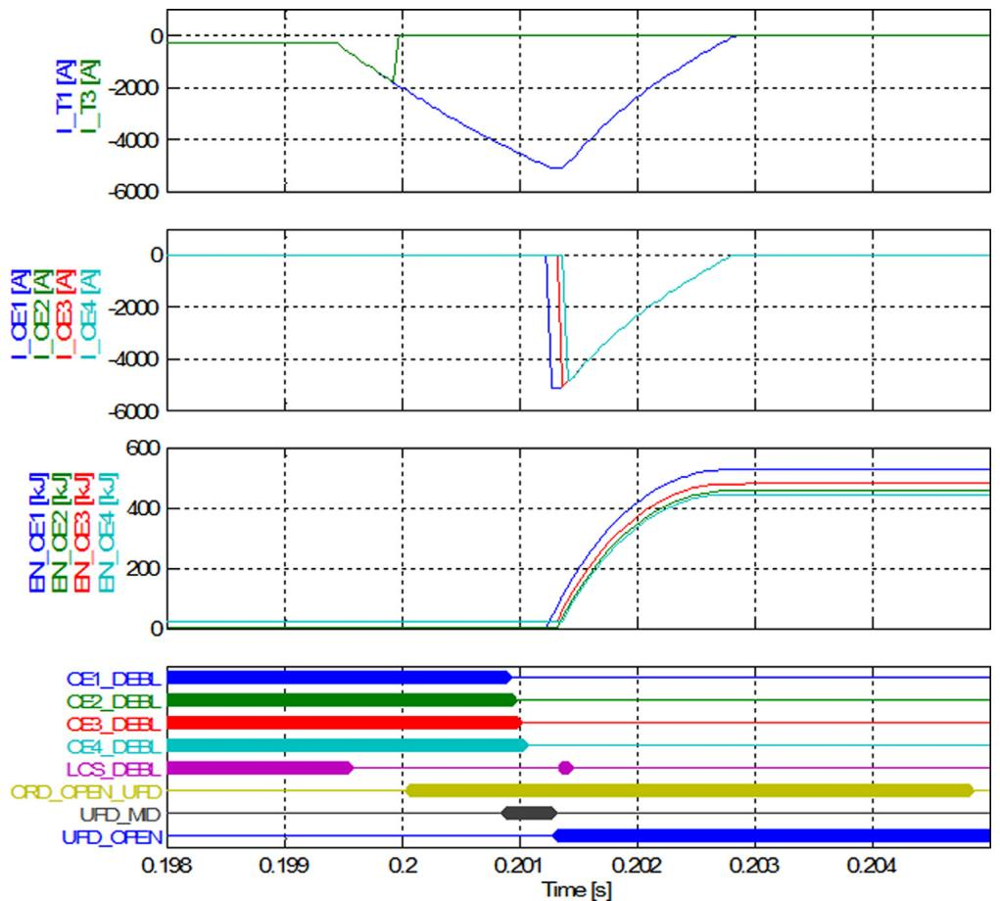  
Fig. 11. Station 2 – DCCB 2 positive pole (S2B1) – Fault clearing.

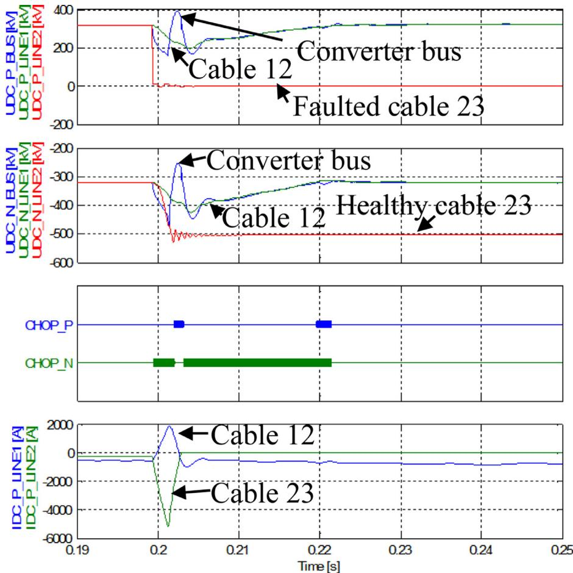  
Fig. 12. Station 2 – DC voltages measured at station 2.

decreases as well but are slowed down by the DCCB inductor. This explains why voltage of cable 12 decreases two time slower than DC bus voltage. At the fault instant, pole to pole voltage is maintained by the converter station. But pole to ground voltage on the healthy pole is limited by the converter station DC surge arresters. Between the fault ignition and the fault clearing, the current rise (i.e. di/dt) change direction which influence the converter bus voltage. When DC voltage on healthy pole is below a threshold, DC chopper is automatically triggered to balance voltage of both poles. If the negative pole voltage is too low, negative DC chopper is activated and if the positive pole voltage is too high positive DC chopper is activated. Thanks to this solution, the healthy part of the DC grid is balanced much faster than if no DC chopper were used. A stable current is flowing through cable 12 after transients is observed.

# 6. Conclusions

This article describes an example of test facility, very close to an actual DC grid, able to test manufacturer equipment. The main interest of such system is to test the interoperability of standalone controllers which are operating on the same system over a long period of time and which are subject to several disturbances such as normal operating changes or severe events like DC fault.

A special attention has been paid on the Hybrid DCCB modelling for real time to avoid simplifications to get the similar accuracy as if it was offline EMT models. Comparison of offline and real time simulation results assess the performance of the modelling methodology. The transient waveforms obtained on a three-terminal system with a time step of 30µs provide good fidelity with regards to expected results, even for DC faults and DC voltage restoration. Therefore, MMC and Hybrid DCCB controllers connected to the real time simulators observe similar

waveforms as if they were connected to an actual system.

This article presents one test case with DC fault ride through capability. This example brings out the good coordination between all hybrid DCCBs located at each transmission line end and MMC stations. The different hybrid DCCB controllers find the fault location, selectively clear the fault by properly controlling the hybrid DCCBs and then balance again the DC voltages with DC choppers. Since the fault is quickly cleared (in less than 4 ms) the MMC valve overcurrent protective level is never exceeded, and therefore, the MMCs do not trip and can proceed transmitting power again.

In addition, this article illustrates the benefit of using hybrid DCCB to softly energise DC cables when DC bus are already energised.

This article brings the evidence that, with careful modelling, it is feasible to simulate in real time a three terminal DC grid, including detailed hybrid DCCB and MMC station models, with connection industrial controllers. It already demonstrates the effective operation of hybrid DCCB, which is available in manufacturers’ shelve. Eventually, this set-up provides more confidence for installation of DC breakers for future DC grid development.

# CRediT authorship contribution statement

P. Rault: Methodology, Validation, Investigation, Writing - original draft, Writing - review & editing. S. Dennetière: Conceptualization, Methodology, Software, Validation, Writing - original draft. H. Saad: Methodology, Validation. M. Yazdani: Methodology, Software, Investigation, Writing - original draft. C. Wikström: Conceptualization, Validation. N. Johannesson: Conceptualization, Methodology.

# Declaration of Competing Interest

The authors declare that they have no known competing financial interests or personal relationships that could have appeared to influence the work reported in this paper.

# Acknowledgements

Best Paths project is co-funded by the European Union's Seventh Framework Program for Research, Technological Development and Demonstration under the grant agreement no. 612748.

# References

[1] J. Dragon, L.-F. Beites, M. Callavik, D. Eichhoff. J. Hanson, A.-K. Marten, A. Morales, S. Sanz, F. Schettler, D. Westermann. S. Wietzel, R. Whitehouse, M. Zeller, “Development of functional specifications for HVDC grid systems,” AC and DC Power Transmission Conference, London, UK, 2015.   
[2] J. Häfner, B. Jacobson, Proactive hybrid HVDC breakers - a key innovation for reliable HVDC grids, Cigre Bologna, Paper 0264, 2011.   
[3] S. Liu, Modeling, experimental validation, and application of VARC HVDC circuit breakers, IEEE Trans. Power Delivery 35 (3) (June 2020) 1515–1526.   
[4] M. Wang, W. Leterme, J. Beerten, D. Van Hertem, Using fault current limiting mode of a hybrid DC breaker, The 14th International Conference on Developments in Power System Protection, Belfast, UK, 2018.   
[5] T. Augustin, I. Jahn, S. Norrga, H.-P. Nee, Transient behaviour of VSC-HVDC links with DC breakers under faults, EPE'17 ECCE Europe, Warsaw, Poland, 2017.   
[6] J. Descloux, J.-B. Curis, B. Raison, Protection algorithm based on differential voltage measurement for MTDC grids, 12th IET International Conference on Developments in Power System Protection (DPSP), 2014.   
[7] N. Johannesson, S. Norrga, C. Wikström, Selective wave-front based protection algorithm for MTDC systems, Proceeding of the DPSP conference, Edinburgh, UK, 2016.   
[8] N. Ahmed, L. Ängquist, S. Mahmood, A. Antonopoulos, L. Harnefors, S. Norrga, H.- P. Nee, Efficient modeling of an MMC based multiterminal DC System employing

hybrid HVDC breakers, IEEE Trans. Power Delivery 30 (4) (2015) 1792–1801.   
[9] W. Lin, D. Jovcic, S. Nguefeu, H. Saad, Modelling of High Power Hybrid DC Circuit Breaker for Grid Level Studies, IET Power Electronics, 2016 special issue on DC grids.   
[10] J. Descloux, Protection contre les courts-circuits des réseaux à courant continu de forte puissance, University of Grenoble, France, 2013.   
[11] Weixing Lin, D. Jovcic, S. Nguefeu, H. Saad, Coordination of MMC converter protection and DC line protection in DC grids, 2016 IEEE Power and Energy Society General Meeting (PESGM), Boston, MA, 2016, pp. 1–5.   
[12] Best Paths project online. http://www.bestpaths-project.eu/.   
[13] P. Rault, O. Despouys, H. Saad, S. Dennetière, C. Wikström, M. Yazdani, A. Burgos, D. Vozikis, X. Guillaud, J. Rimez, BEST PATHS DEMO#2: final recommendations for interoperability of multivendor HVDC systems, EU Co-Funded Project Best Paths Deliverable D9.3, 2018.   
[14] D. Jovcic, A. Hassanpoor, B. Luscan, C. Plet, Task 6.1. Develop system level model for hybrid DC CB, PROMOTION Project Deliverable, 2016 https://www.promotionoffshore.net.   
[15] J. Mahseredjian, S. Dennetière, L. Dubé, B. Khodabakhchian, L. Gérin-Lajoie, On a new approach for the simulation of transients in power systems, Electr. Power Syst. Res. 77 (11) (2007) 1514–1520 September.   
[16] B. Clerc, C. Martin, S. Dennetière, Implementation of accelerated models for EMT tools, Proceedings of the IPST Conference IPST2015, Cavtat, Croatia, 2015.   
[17] N. Johannesson, S. Norrga, Longitudinal differential protection based on the Universal Line Model, 41st Annual Conf. IEEE Ind. Electron. Soc. (IECON), Yokohama, 2015, pp. 1091–1096.   
[18] N. Johannesson, S. Norrga, Estimation of travelling wave arrival time in longitudinal differential protections for multi-terminal HVDC systems, J. Eng. 2018 (15) (2018) 1007–1011 October.   
[19] W. Li, J. Bélanger, An equivalent circuit method for modelling and simulation of modular multilevel converters in real-time HIL test bench, IEEE Trans. Power Delivery 31 (5) (2016) 2401–2409 October.   
[20] F. Guay, P.-A. Chiasson, N. Verville, S. Tremblay, P. Askvid, New Hydro-Québec Real-Time Simulation Interface for HVDC Commissioning Studies, Proceedings of the IPST conference IPST2017, Seoul, Korea, 2017.   
[21] B. Bruned, I.M. Martins, P. Rault, S. Dennetière, Efficient task allocation algorithm for parallel real-time EMT simulation, Proceedings of the IPST conference IPST2019, Perpignan, France, 2019.   
[22] ENTSO-E, EUROPACABLE, “Recommendations to improve HVDC cable systems reliability,” 13 June 2019.