# 基于FPGA的电力电子恒导纳开关模型修正算法及实时仿真架构

王钦盛，王 灿，潘学伟，梁 亮

（哈尔滨工业大学（深圳）机电工程与自动化学院，广东省深圳市 518055）

摘要：电力电子实时仿真是目前电力电子系统研究过程中的重要工具。为设计一套经济、可靠的电力电子实时仿真系统，文中搭建了一个以现场可编程门阵列(FPGA)为计算核心的硬件平台，并提出了配套的电磁仿真算法和FPGA架构设计。首先，推导了一种简洁电磁暂态程序(EMTP)算法，用于提高传统离线算法的并行度。其次，从数值算法的角度分析恒导纳开关模型的虚拟功率损耗问题，提出了一种初始误差修正算法，消除了功率损耗。再次，串联以上算法，设计了一种基于状态机框架的数字信号处理(DSP)硬核资源复用FPGA架构，以硬件资源复用的方式实现了资源的高效利用，在不损失速度的同时提高了FPGA的利用效率。最后，通过多个实时仿真算例验证了所提方法的有效性和正确性。

关键词：电磁暂态仿真；实时仿真；电力电子开关；虚拟功率损耗；现场可编程门阵列；资源复用

# 0 引 言

近年来，中国传统电力系统正在向以新能源为主体的新型电力系统转型。随着新能源发电接入比例的不断提高，电力系统中的电力电子设备也在不断增加［1］ 。在电力电子设备的研究中，电磁暂态实时仿真是电力电子系统设计和测试的安全可靠工具［2-3］，可 以 减 少 硬 件 实 验 的 开 销 并 缩 短 研 发周期［4］ 。

实时仿真的严格时序要求使得其难以兼容离线仿真中的插值算法，原因是插值算法会使仿真算法的复杂度急剧增加，增大仿真的步长［5］ 。在没有插值算法的修正时，为了保证电力电子系统中开关元件换向的准确性，仿真的时间步长要比离线仿真小得多，一般要求在微秒级甚至亚微秒级［6］ 。现场可编 程 门 阵 列（field programmable gate array，FPGA）因具有天然的高度并行性、出色的计算能力和极低延迟的特点，已经成为实时仿真以及硬件在环测试的常用计算加速硬件［7-10］ 。

目前，为实现基于 FPGA 的电力电子实时仿真，需要解决以下3个技术要点：

1）电磁暂态仿真算法。为了满足电力电子系统

仿真测试的需求，实时仿真中所使用的算法一般不能太复杂。因此，以节点分析法为基础的电磁暂态程 序（electro-magnetic transient program，EMTP）算法成为了应用和研究的主流算法。为了充分发挥FPGA的计算加速优势，需要对传统的离线EMTP进行改进［11］ 。文献［6］针对固态变压器的实时仿真应用提出了一种紧凑型节点分析法，实现了50 kHz固态变压器的实时仿真。然而，为了适配定点数运算，电路元件采用混合建模方式，增加了建模复杂度。

2）开关模型的虚拟功率损耗。在上述算法中，电力电子开关通常采用伴随离散电路（associateddiscrete circuit，ADC）模 型 中 的 恒 定 导 纳 模 型［12］。该模型不仅可以很好地模拟出理想开关的稳态特性，同时使得实时仿真过程中无须更新电路的计算导纳矩阵，极大地降低了实时仿真过程中的计算负担。但恒导纳开关模型也存在理想开关不存在的暂态振荡，在仿真过程中引入了由模型所导致的功率损耗，而不是电力电子设备产生的实际功率损耗，称为虚拟功率损耗。为了减小虚拟功率损耗对仿真准确性的影响，相关学者根据不同的数值方法和拓扑提出了改进的恒导纳开关模型，但开关动作时的暂态振荡仍然存在，不能完全消除虚拟功率损耗［13-14］ 。此外，也有研究人员通过在该模型中加入补偿电压源和电流源的方式来补偿由原模型引入的虚拟功率损耗［15］ ，或引入重新初始化算法来抑制开关暂态振

荡［16］。然而，补偿源的求解依赖外电路参数，初始化算法的设计不够简单高效，都增大了FPGA逻辑和存储资源的负担。

3）FPGA的实现方法。不同于运行在个人计算机上的离线仿真，基于FPGA的实时仿真需要将模型和算法硬件编程后下载到 FPGA 硬件中进行布局布线实现。文献［17］提出了一套基于 FPGA 的有源配电网实时仿真方法论，详细介绍了算法在FPGA中的实现过程。但其使用的传统开发工具门槛较高，同时缺少对资源利用规划的研究。受益于高级语言综合（high-level synthesis，HLS）工具的发展，FPGA实现上的门槛降低，同时开发者对其的利用能力提高［18］ 。因此，通过 HLS 工具设计合理高效的FPGA算法架构是可行且有必要的。

以上3个方面是基于FPGA的电力电子实时仿真中的技术要点以及挑战。本文首先基于传统的离线仿真算法改进，推导了一种简洁EMTP算法。其次，根据所设计的算法流程，从数值算法的角度讨论了开关模型虚拟功率损耗的来源，以此为基础提出了一种初始误差修正算法，可以基本消除由开关模型引入的功率损耗，算法流程简单高效，无须依赖外电路参数，具有普适性且几乎不消耗额外的FPGA资源。最后，设计了一种 FPGA 的实现架构，在基于 FPGA 实现所提算法的基础上提高了 FPGA 的资源利用效率，同时并不影响仿真速度。

# 1 基于EMTP的实时仿真算法

# 1. 1　电路元件建模

在以EMTP为基础的实时仿真算法中，电路中的动态元件以及开关器件通常需要根据不同的数值方法离散化，建立为ADC模型的形式［12］ 。如图1所示，电路各动态元件被建模为等效支路导纳 $Y _ { \mathrm { b } }$ 和伴随电流源 $j _ { \mathrm { a } }$ 。

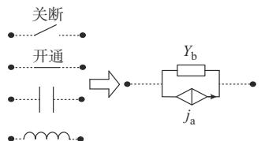  
图1 电路元件的ADC模型  
Fig. 1 ADC model of circuit components

文献［16］将ADC模型中的伴随电流源参数化，不同的元件表达式可以整理为统一的参数化形式：

$$
j _ {\mathrm {a}} (t) = \alpha Y _ {\mathrm {b}} v _ {\mathrm {b}} (t - \Delta t) + \beta i _ {\mathrm {b}} (t - \Delta t) \tag {1}
$$

式中： $; \mathcal { V } _ { \mathrm { b } }$ 为支路电压 $\ ; i _ { \mathrm { b } }$ 为支路电流； $\Delta t$ 为仿真步长；α和 $\beta$ 为元件系数。

式（1）中各参数的取值与元件类型和数值离散方法相关。其中，后向欧拉法具有极强的数值稳定性和高收敛性，已被广泛应用于电磁仿真算法中，现有开关模型的研究大多都来自二值LC等效模型的改进。采用以上方法的不同元件表达式系数如表1所示。表中：L为电感元件自感量；C为电容元件电容量； $L _ { \mathrm { s w i t c h } }$ 为模拟开关导通的电感元件自感量；$C _ { \mathrm { s w i t c h } }$ 为模拟开关关断的电容元件电容量。

表1 不同元件表达式系数  
Table 1 Expression coeffients of different elements   

<table><tr><td>元件类型</td><td>Yb</td><td>α</td><td>β</td></tr><tr><td>电感</td><td>Δt/L</td><td>0</td><td>1</td></tr><tr><td>电容</td><td>C/Δt</td><td>-1</td><td>0</td></tr><tr><td>开关导通</td><td>Δt/Lswitch</td><td>0</td><td>1</td></tr><tr><td>开关关断</td><td>Cswitch/Δt</td><td>-1</td><td>0</td></tr></table>

文献［13-14］所提出的改进型恒导纳开关模型都可以通过改变表1中开关元件的系数来实现。

上述元件转换为ADC模型后，还需要将电路中的电压源转换为诺顿等效形式，即可通过EMTP算法进行电路的时域仿真求解。

# 1. 2　简洁 EMTP算法

传统的EMTP是基于节点分析法设计的，根据节点分析法，节点电压计算方法如下：

$$
\boldsymbol {v} _ {\mathrm {n}} (t) = \boldsymbol {Y} _ {\mathrm {n}} ^ {- 1} \boldsymbol {i} _ {\mathrm {n}} (t) \tag {2}
$$

式中： $\scriptstyle \mathcal { V } _ { \mathrm { n } }$ 为节点电压向量； $Y _ { \mathrm { n } }$ 为电路的节点导纳矩阵，当开关使用恒定导纳模型时保持不变；i 为节点注入电流源向量。

根据电路理论中的网络图论［19］ ，可以引入节点-支路关联矩阵A来帮助 $i _ { \mathrm { n } }$ 的矩阵化计算，有

$$
A = \left[ \begin{array}{c c c c} a _ {1 1} & a _ {1 2} & \dots & a _ {1 b} \\ a _ {2 1} & a _ {2 2} & \dots & a _ {2 b} \\ \vdots & \vdots & & \vdots \\ a _ {n 1} & a _ {n 2} & \dots & a _ {n b} \end{array} \right] \tag {3}
$$

式中 $: n$ 为电路节点数；b为支路数。当支路电流流出节点时， $a _ { i l } | = 1 ( i { = } 1 , 2 , \cdots , n ; l { = } 1 , 2 , \cdots , b )$ ；当支路电流流入节点时， $a _ { i l } { = } - 1$ ；当节点与支路无关联时， $a _ { i l } { = } 0 ,$ 。

此时有：

$$
\boldsymbol {i} _ {\mathrm {n}} (t) = - \boldsymbol {A} [ \boldsymbol {j} _ {\mathrm {a}} (t) + \boldsymbol {j} _ {\mathrm {s}} (t) ] \tag {4}
$$

式中 $: j _ { \mathrm { a } }$ 为支路伴随电流源向量 $; j _ { \mathrm { s } }$ 为独立电流源或电压源支路的诺顿等效注入电流源向量。

传统EMTP的计算程序可整理为下列算式：

$$
\boldsymbol {i} _ {\text {t e m p}} (t) = \boldsymbol {j} _ {\mathrm {a}} (t) + \boldsymbol {j} _ {\mathrm {s}} (t) \tag {5}
$$

$$
\boldsymbol {i} _ {\mathrm {n}} (t) = - \boldsymbol {A} \boldsymbol {i} _ {\text {t e m p}} (t) \tag {6}
$$

$$
\left\{ \begin{array}{l} \boldsymbol {v} _ {\mathrm {n}} (t) = Y _ {\mathrm {n}} ^ {- 1} \boldsymbol {i} _ {\mathrm {n}} (t) \\ \boldsymbol {v} _ {\mathrm {b}} (t) = A ^ {\mathrm {T}} \boldsymbol {v} _ {\mathrm {n}} (t) \end{array} \right. \tag {7}
$$

$$
\dot {\boldsymbol {i}} _ {\mathrm {b}} (t) = Y _ {\mathrm {b}} \boldsymbol {v} _ {\mathrm {b}} (t) + \dot {\boldsymbol {i}} _ {\text {t e m p}} (t) \tag {8}
$$

$$
\boldsymbol {j} _ {\mathrm {a}} (t + \Delta t) = \boldsymbol {\alpha} \boldsymbol {Y} _ {\mathrm {b}} \boldsymbol {v} _ {\mathrm {b}} (t) + \boldsymbol {\beta} \boldsymbol {i} _ {\mathrm {b}} (t) \tag {9}
$$

式中： $i _ { \mathrm { t e m p } }$ 为临时电流向量，用于储存各支路的电流源之和以便后续计算； $Y _ { \mathrm { { b } } }$ 为支路导纳矩阵； $; v _ { \mathrm { b } }$ 为支路电压向量； $; i _ { \mathrm { b } }$ 为支路电流向量；α和 $\beta$ 为元件系数对角矩阵。

式（5）—式（9）中的各个算式相互串联，具有高度串行性，不适用于基于FPGA的并行化实时仿真计算。因此，需要推导一种可并行化的计算流程。

在电磁仿真中，更需要电路的电气量输出，如$\smash { \mathcal { V } _ { \mathrm { h } } } \setminus \mathcal { V } _ { \mathrm { b } }$ 和 $\pmb { i } _ { \mathrm { b } \odot }$ 。因此，中间计算过程可以合并，得到：

$$
\boldsymbol {v} _ {\mathrm {n}} (t) = - \boldsymbol {Y} _ {\mathrm {n}} ^ {- 1} \boldsymbol {A} \boldsymbol {i} _ {\text {t e m p}} (t) \tag {10}
$$

$$
\boldsymbol {v} _ {\mathrm {b}} (t) = - \boldsymbol {A} ^ {\mathrm {T}} \boldsymbol {Y} _ {\mathrm {n}} ^ {- 1} \boldsymbol {A} \boldsymbol {i} _ {\text {t e m p}} (t) \tag {11}
$$

$$
\boldsymbol {i} _ {\mathrm {b}} (t) = - Y _ {\mathrm {b}} \boldsymbol {A} ^ {\mathrm {T}} Y _ {\mathrm {n}} ^ {- 1} \boldsymbol {A} \boldsymbol {i} _ {\text {t e m p}} (t) + \boldsymbol {i} _ {\text {t e m p}} (t) \tag {12}
$$

合并后，式（10）—式（12）中各系数矩阵均为常系数矩阵，可预先计算，故其中各电气量相互解耦，可独立计算。

将式（11）、式（12）代入式（9）中化简整理可得：

$$
\boldsymbol {j} _ {\mathrm {a}} (t + \Delta t) = (\boldsymbol {\alpha} + \boldsymbol {\beta}) \boldsymbol {i} _ {\mathrm {b}} (t) - \boldsymbol {\alpha} \boldsymbol {i} _ {\text {t e m p}} (t) \tag {13}
$$

支路电流向量 $i _ { \mathrm { b } }$ 包含了仿真电路中全部支路的电流信息，通常情况下已经能够满足用户的观测需求，且与式（13）串联，需要在仿真计算过程中保留。

实际应用中，用户通常需要通过添加电压表或电压测点等测量元件来获取所需电压量。因此，仅输出 $\scriptstyle \mathcal { V } _ { \mathrm { n } }$ 和 $\mathbf { \mathcal { V } } _ { \mathrm { b } }$ 无法直接满足用户需求，且其中包含了无须观测和仿真计算过程中非必要的量，浪费了计算资源。在仿真建模时，通常选择接地节点为参考电压节点，此时用户观测电压可直接为节点电压或两节点电压之差：

$$
\left\{ \begin{array}{l} v _ {\mathrm {m}, 1} = v _ {\mathrm {n}, i} \\ v _ {\mathrm {m}, 2} = v _ {\mathrm {n}, j} \\ \vdots \\ v _ {\mathrm {m}, m} = v _ {\mathrm {n}, i} - v _ {\mathrm {n}, j} \end{array} \right. \tag {14}
$$

式中： $ { v _ { \mathrm { m } } }$ 表示观测电压； $\bullet \mathcal { V } _ { \mathrm { n } }$ 表示节点电压；i和 j为节点编号 $; m$ 为电压测量点数量。

整理可得：

$$
\boldsymbol {v} _ {\mathrm {m}} (t) = \boldsymbol {M} \boldsymbol {v} _ {\mathrm {n}} (t) = - \boldsymbol {M} \boldsymbol {Y} _ {\mathrm {n}} ^ {- 1} \boldsymbol {A} \boldsymbol {i} _ {\text {t e m p}} (t) \tag {15}
$$

式中： $v _ { \mathrm { m } }$ 为观测电压向量；M为 $m \times n$ 观测矩阵。根据式（11），当 $M { = } A ^ { \mathrm { T } }$ 时， ${ \boldsymbol { v } } _ { \mathrm { m } } { = } { \boldsymbol { v } } _ { \mathrm { b } } \circ$ 。通过式（15）可直接输出电压测量点结果，满足用户需求。

合并式（12）和式（15）中的常系数矩阵为中间矩阵：

$$
\left\{ \begin{array}{l} B = - M Y _ {\mathrm {n}} ^ {- 1} A \\ C = - Y _ {\mathrm {b}} A ^ {\mathrm {T}} Y _ {\mathrm {n}} ^ {- 1} A + E \end{array} \right. \tag {16}
$$

式中：B为 $m \times b$ 矩阵；C为 $b \times b$ 矩阵；E为 $b \times b$ 单位矩阵。

根据式（5）和式（12）—式（16），可整理得新仿真计算步骤：

$$
\left\{ \begin{array}{l} \boldsymbol {i} _ {\text {t e m p}} (t) = \boldsymbol {j} _ {\mathrm {a}} (t) + \boldsymbol {j} _ {\mathrm {s}} (t) \\ \boldsymbol {v} _ {\mathrm {m}} (t) = \boldsymbol {B} \boldsymbol {i} _ {\text {t e m p}} (t) \\ \boldsymbol {i} _ {\mathrm {b}} (t) = \boldsymbol {C} \boldsymbol {i} _ {\text {t e m p}} (t) \\ \boldsymbol {j} _ {\mathrm {a}} (t + \Delta t) = (\alpha + \beta) \boldsymbol {i} _ {\mathrm {b}} (t) - \alpha \boldsymbol {i} _ {\text {t e m p}} (t) \end{array} \right. \tag {17}
$$

式（17）中各算式的串行度降低， $v _ { \mathrm { m } }$ 和 $i _ { \mathrm { b } }$ 可以并行计算，舍去了非必要的计算量和步骤，提高了算法流程的简洁性，更加适用于基于 FPGA 的实时仿真。

# 2 恒导纳开关模型损耗消除

目前，相关研究认为恒导纳开关模型的损耗是由储能元件产生的，只要准确计算储能元件的能量变化，就可以测量开关的损耗，并通过优化模型参数的方式降低损耗［20］ 。

由于本文引入了参数化ADC模型，现有的优化恒导纳开关模型大都可以通过调整模型中的系数实现，淡化了模型的物理特性。因此，本文从数值算法的角度出发，分析损耗的来源。

# 2. 1　虚拟功率损耗来源分析

随着新能源的发展，电压源型换流器（voltagesource converter，VSC）在新型电网中得到了越来越广泛的应用。为了提高普遍性，本文以VSC为对象展开分析，其桥臂恒导纳开关模型如图2所示，其系数采用表1中的二值LC模型系数。

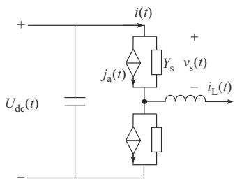  
图2 VSC桥臂恒导纳开关模型  
Fig. 2 Fixed-admittance switch model of VSC bridge arm

假设上桥臂开关处于关断稳态，在 t时刻收到导通信号切换。关断稳态时，桥臂开关电流（i t）为0，电压 $ { \boldsymbol { v } } _ { \mathrm { s } } ( t )$ 为直流电压 $U _ { \mathrm { d c } } ( t )$ ，因此有：

$$
j _ {\mathrm {a}} (t - \Delta t) = - Y _ {\mathrm {s}} U _ {\mathrm {d c}} (t - \Delta t) \tag {18}
$$

式中：Y 为开关支路的导纳。

在 t时刻 $\mathbf { \nabla } , j _ { \mathrm { a } }$ 根据式（13）中的算式更新，有：

$$
j _ {\mathrm {a}} (t) = (\alpha + \beta) i (t - \Delta t) - \alpha j _ {\mathrm {a}} (t - \Delta t) \tag {19}
$$

代入导通后的开关系数， $, j _ { \mathrm { a } } ( t ) { = } 0$ 。

导通稳态时，桥臂开关电流 $i ( t )$ 与电感电流$i _ { \mathrm { L } } ( t )$ 相等，电压 $ { \boldsymbol { v } } _ { \mathrm { s } } ( t )$ 为0，因此有：

$$
j _ {\mathrm {a}} (t) = i _ {\mathrm {L}} (t) \tag {20}
$$

在理想开关中，开关从关断稳态到导通稳态是瞬时的，没有中间过程，t时刻即达到稳态。而该模型中，t时刻的 $j _ { \mathrm { a } }$ 与稳态有一个差值 $i _ { \mathrm { L } } ( t )$ ，称为初始误差。开关从导通切换为关断时则与上述过程相反，初始误差 ${ \mathcal { H } } - Y _ { \mathrm { s } } U _ { \mathrm { d c } } ( t )$ 。

初始误差的存在使得开关状态切换后需要一个收敛至稳态值的过程，收敛过程与初始误差的大小和数值方法有关，这也是虚拟功率损耗 $\vec { \cal J } ^ { \pm }$ 生的原因。根据式（19）可知， $, j _ { \mathrm { a } }$ 的更新与初始误差表达式并无直接关联关系，且初始误差值可能因电路工况改变而改变。因此，即使修改开关模型系数也仅能够在某些特定情况下减小初始误差的值，无法从根源上解决这一问题。

# 2. 2　初始误差修正算法

电力电子开关在电路中一般起换流的作用，根据式（18）和式（20），开关稳态电气值与特定支路的电流、电压和开关支路导纳相关。因此，若将开关切换后的 $j _ { \mathrm { a } }$ 直接替换为其稳态值则可以消除初始误差，省略收敛过程。

在仿真的算法流程式（17）中，t时刻的j 计算要优先于该时刻的电压、电流，故开关稳态值无法直接获取。如图 2所示，开关稳态值通常与滤波电容电压和滤波电感电流相关，相对于电力电子开关，滤波元件在仿真步长的时间尺度上变换缓慢，可等效为独立源［16］ 。因此，对于此类元件，可以认为t-Δt时刻与t时刻的值几乎不变，可以近似替代，有文献利用相似思想进行并行化算法的设计并验证［21］。本文基于此设计了一种初始误差修正（initial errorcorrection，IEC）算法，如图 3 所示。

对于图 2中的桥臂开关，在 t时刻开关状态切换，对应的修正公式如下：

上桥臂：

$$
j _ {\mathrm {a}} (t) = \left\{ \begin{array}{l l} - Y _ {\mathrm {s}} U _ {\mathrm {d c}} (t - \Delta t) & \text {关 断} \\ i _ {\mathrm {L}} (t - \Delta t) & \text {导 通} \end{array} \right. \tag {21}
$$

下桥臂：

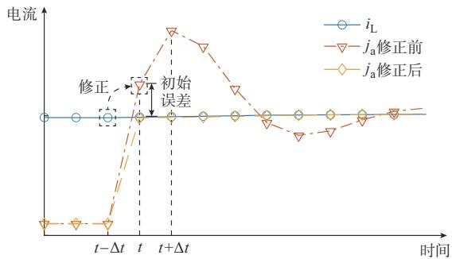  
图3 初始误差修正算法示意图  
Fig. 3 Schematic diagram of initial error correction algorithm

$$
j _ {\mathrm {a}} (t) = \left\{ \begin{array}{l l} - Y _ {\mathrm {s}} U _ {\mathrm {d c}} (t - \Delta t) & \text {关 断} \\ - i _ {\mathrm {L}} (t - \Delta t) & \text {导 通} \end{array} \right. \tag {22}
$$

为了具有普适性，将式（21）和式（22）整理为：

$$
j _ {\mathrm {a}} (t) = \left\{ \begin{array}{l l} h _ {\text {o f f}} v _ {\mathrm {b}, \text {c o r r e c t}} (t - \Delta t) & \text {关 断} \\ h _ {\text {o n}} i _ {\mathrm {b}, \text {c o r r e c t}} (t - \Delta t) & \text {导 通} \end{array} \right. \tag {23}
$$

式中： $\mathrm { : \ { \mathcal { V } } b , c o r r e c t }$ 为开关关断后等效并联支路的电压；$i _ { \mathrm { b , c o r r e c t } }$ 为开关导通后等效串联支路的电流； $\mathsf { \Omega } _ { \mathsf { j } } h _ { \mathsf { o r } }$ 为导通修正系数，其取值与电路建模时 $i _ { \mathrm { b , c o r r e c t } }$ 支路的参考方向相关； $h _ { \mathrm { o f f } }$ 为关断修正系数，其取值与 $\mathcal { V } _ { \mathrm { b , c o r r e c t } }$ t 的 参考方向和开关支路导纳相关。其中，等效串联支路一般为电感元件，等效并联支路一般为电容元件。

在导通时，通过 $t - \Delta t$ 时刻的电感电流值经式（23）计算后来修正t时刻开关支路的 $j _ { \mathrm { a } }$ ，有效地减小了开关切换时刻的初始误差，抑制了暂态振荡过程。同理，在关断时可通过 t-Δt时刻的电容电压值来修正t时刻开关支路的 $j _ { \mathrm { a } }$ 。

初始误差修正算法中，不同开关的 $h _ { \mathrm { o n } }$ 和 $h _ { \mathrm { o f f } }$ 可在仿真建模时确定，整理为向量 $h _ { \mathrm { o l } }$ 和 $h _ { \mathrm { o f f o } } \quad \boldsymbol { v } _ { \mathrm { b , c o r r e c t } }$ 对应的支路也可在仿真建模时确定，将算法所需电压作为观测电压加入 $v _ { \mathrm { m } }$ 的计算中。 $i _ { \mathrm { b , c o r r e c t } }$ 可直接在仿真计算过程的 $i _ { \mathrm { b } }$ 中获取。

类似地，在文献［16］中，历史电流源重初始化（history current reinitialization，HCRI）算法通过储存开关上一开关周期中切换后的稳态值（文献中取导通或关断后的第 5个仿真步）来修正本次切换时的初始误差。初始误差修正算法通过上一仿真步中的相关电压和电流来修正初始误差，省略了稳态判断和存储的步骤，在基于FPGA实现时能够节约硬件资源。同时，与上一开关周期的稳态值相比，上一仿真步的稳态值与本次仿真步的稳态值误差更小，提高了修正精度。

# 3 FPGA 实现架构

传统的FPGA开发基于硬件描述语言，入门门槛 高 ，项 目 周 期 长 ，限 制 了 研 究 工 作 的 开 展 。Labview FPGA 是一种基于图形化编程语言的 HLS工具，基于顶层设计、底层调用的原则实现高效可靠的 FPGA 开发，具有编程、仿真、调试一体化功能。本文基于该环境开发了一套基于 FPGA 的实时仿真平台。其中，硬件架构如附录A图A1所示，该平台包含了 FPGA开发板、PC主机和 DA转换模块、显示器等外部设备。FPGA 主芯片为 Xilinx Kintex-7 XC7K325T，逻辑资源量如附录A表A1所示。

FPGA基于硬件电路实现自定义功能，最终的功能模块都会被映射成芯片中的实际电路。尽管HLS工具可以帮助研究人员利用高层次语言，从而省去底层开发，然而编译器并不能自动实现资源的高效利用。为了充分发挥FPGA的优势，提高逻辑资源的利用效率，需要在程序设计时便考虑这一特性。根据简洁EMTP算法可知，电磁暂态仿真过程中包含了大量的矩阵-向量点积运算。为了发挥FPGA硬件加速的优势，通常需要使用专用硬核资源DSP48来进行数值计算，其成为了基于FPGA的实时仿真中的关键硬件资源和仿真规模的制约因素。本文基于状态机框架设计了一种数字信号处理（digital signal processing，DSP）资 源 复 用 的 FPGA实现架构，如图4所示，其中，PWM表示脉宽调制。

状态 到 的一轮循环即为一个仿真步计算。其中，输入量为开关的驱动信号和电路中的独立源，在每个仿真步 k开始时通过交互接口进入状态机中。固定量为整个仿真过程都固定不变的量，一般在 仿 真 开 始 前 预 存 储 于 FPGA 的 随 机 存 储 器（random access memory，RAM）块中。变化量为在仿真前给定或在仿真后输出，又需要在仿真过程中不断更新的量，一般通过FPGA的寄存器存取。过程量为仅存在于仿真过程、既不需要输入也不输出的量，也通过寄存器实现。算术运算通过调用运算IP（intellectual property）核实现，为减少通用逻辑资源消耗，提高计算速度，运算 核一般通过硬核资源实现。

状态机中，对角矩阵 α和 $\beta$ 采用向量的方式存储，状态机中的向量相乘即为其对应位置元素相乘，故仅需要一个周期即可完成。状态3的矩阵向量乘法是算法的核心计算步骤，为了保证计算速度，发挥FPGA优势，该状态需要最大化的并行度，采用文献［6］中的非对角矩阵-向量乘法流水线设计结构。由

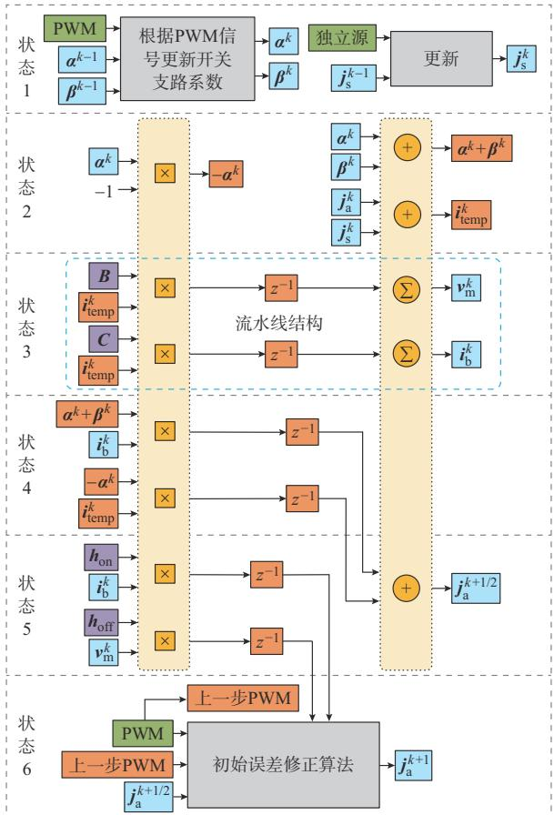

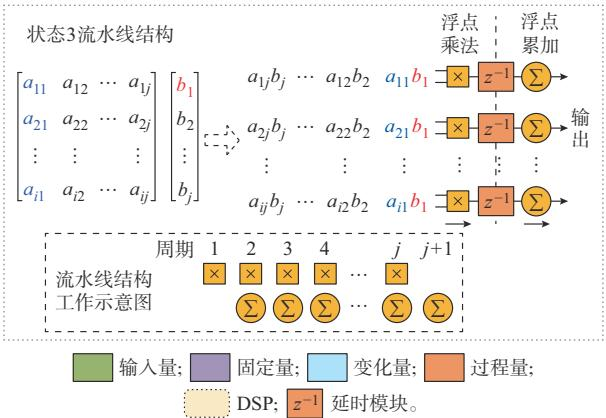  
图4 基于状态机框架的DSP资源复用FPGA实现架构  
Fig. 4 FPGA implementation architecture with DSP resource reuse based on state machine framework

图 4可见，在点积运算的每个单元中加入一级流水线，虽然使得累加运算滞后了一个周期，整个矩阵-向量点积运算增加了一个时钟周期，但是流水线结构打断了乘法和累加的串行逻辑转为并行，缩短了最大路径延时，提高了时钟频率。累加运算可通过加法运算IP实现。

在保证状态 3并行速度的基础上，将其他计算步骤分解后设置于其前后，与状态 3共用为其分配的乘法和加法运算 IP，实现 DSP48硬件资源复用。分解后的算术运算对减法进行分步处理，节省了运

算IP，仅剩下浮点数加法和乘法运算。在整个状态机中两种运算并行独立，复合运算通过流水线结构打断，用两个或更多周期实现，如式（13）中j 的更新式通过状态4和状态5组合实现。因此，该架构中最长逻辑路径仅为一个算术运算单元，提高了FPGA的时钟频率。

FPGA中为提高速度一般采用定点数数据类型进行计算。然而，在电力电子系统的实时仿真中使用定点数不可避免地增加了建模难度。如各元件参数及电气量字长的选择［22］ ，选择不当时易增大和累积数值误差，通常需要预先离线仿真来确定各电气量的数值量级。为了获得更好的精度和降低建模难度，本文采用单精度浮点数据格式。数值计算通过NI FPGA Floating-point 库中的单精度浮点数乘法和加法运算 IP 实现［23］ ，每个运算 IP 消耗 2 个 DSP48和若干查找表资源，IP核内部无流水线结构可在一个周期内输出结果。该场景下图4各个状态需要消耗的时钟周期个数如附录 A表 A2所示。因此，在可编译的FPGA时钟下，该架构可执行的最小仿真步长 $\Delta t _ { \mathrm { m i n } }$ 为：

$$
\Delta t _ {\min } = (6 + b) T _ {\text {c l o c k}} \tag {24}
$$

式 中 ： $T _ { \mathrm { c l o c k } }$ 为 FPGA 时 钟 周 期 。 本 文 所 使 用 的FPGA在50 MHz时钟频率下进行编译，一个FPGA时钟周期为20 ns。由式（24）可知，使用性能更强大的FPGA主芯片时，可以提高FPGA时钟的可编译频率，进而缩短可执行的最小仿真步长。

为验证该架构的优越性，使用相同算法不同架

构进行两电平VSC的实时仿真时，资源消耗对比如附录A图A2所示。

在实时仿真中，DSP48是FPGA算数运算的珍贵硬核资源，该架构相比于无特殊设计的情况下几乎节省了一半的DSP48资源，故能够在相同的资源数下实现更大规模的仿真运算。由于该架构是基于复用空闲资源的思想，经过图 4中合理的分解布局后，并不会因增加额外的时延而损失速度，同时还具备通用性和一定的扩展性。

# 4 实时仿真验证

# 4. 1　初始误差修正算法验证

# 4. 1. 1　不同变换器的输出波形

在本文搭建的FPGA实时仿真平台上对Boost变换器、两电平 VSC［13］ 、三电平 VSC［24］ 进行实时仿真 验 证 。 采 用 MATLAB/Simulink 平 台 中SimPower System 工具箱的相同离线仿真模型作为参考基准，其中，电力电子开关采用理想开关模型。

图 所示是两电平 在离线仿真、含修正算法的实时仿真和不含修正算法的实时仿真下的开关电压 $\mathcal { V } _ { \mathrm { s } }$ 、电流i 波形。对比图5（a）、（d）和（b）、（e）可以看出，在初始误差修正算法的作用下，实时仿真中基于恒导纳开关模型的电压和电流波形已经接近于离线仿真中理想开关的波形。需要注意的是，实时仿真中基于恒导纳开关模型已经试凑到较优的参数，但从图 5（c）、（f）中可以看出，开关振荡仍然明显。

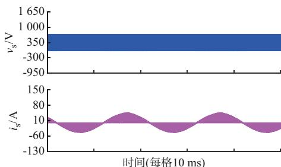  
(a) )+"

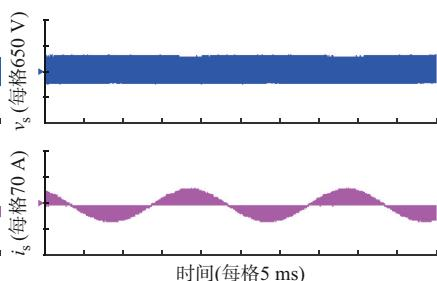  
(b) 3(	IEC0")+"

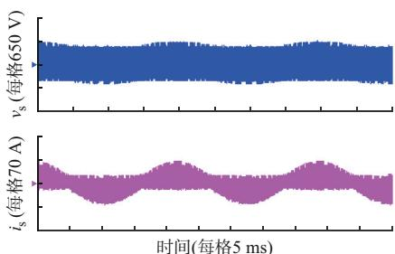  
(c) 3(	IEC0")+"

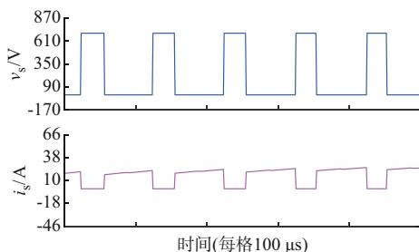  
(d) )+"

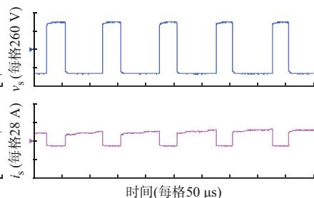  
(e) 3(	IEC0") +"

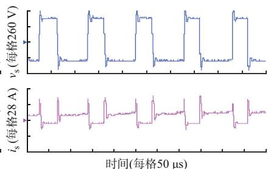  
(f ) 3(	IEC0") +"   
图5 两电平VSC开关电压、电流波形  
Fig. 5 Waveforms of switch voltage and current of two-level VSC

三电平 VSC和 Boost变换器的开关电压、电流波形如附录A图A3和图A4所示，与上述所讨论的两电平 VSC相似。通过图 2桥臂模型所提出的修正算法同样适用于以Boost变换器为例的直流斩波变换器和三电平VSC。对于任何变换器而言，电力电子开关在接通时都具有等效串联电路，在关断时具有等效并联电路，可应用于修正算法中。因此，初始误差修正算法不受拓扑结构限制，具有一定的通用性。

# 4. 1. 2　虚拟功率损耗测试和分析

图6（a）中展示了Boost变换器、两电平VSC和三电平 VSC在不同载波频率下的虚拟功率损耗占比。基于恒导纳开关模型的虚拟功率损耗随载波频率的增加而增加。即使选择了较优的支路导纳，它也会在高载波频率下增加到极高的水平，严重影响仿真的准确度。加入修正算法后，恒导纳开关模型已经十分接近理想开关。因此，在所有被测载波频率下，虚拟功率损耗都保持在极低的水平，基本可以忽略。在修正算法的作用下，此时的损耗更多来源于数值算法的误差。

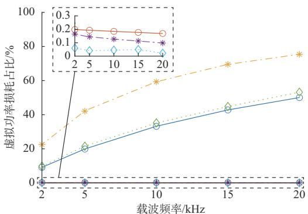  
(a) 	D"M(+;(5

图6 不同条件下的虚拟功率损耗  
Fig. 6 Virtual power loss under different conditions   
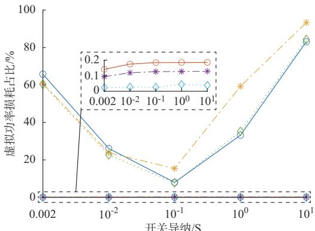  
Boost	 Boost	(	IEC0")   
*	 *	(	IEC0")   
*	 *	(	IEC0")

(b) 	3+;(5

如图6（b）所示，修正算法使得恒导纳开关模型不受支路导纳参数的影响，在较大的可选参数范围内，其虚拟功率损耗都基本可以忽略。因此，使用恒导纳开关模型时无须再进行参数的试凑优化，提高了实时仿真的建模效率。

减小仿真步长是降低恒导纳开关模型虚拟功率损耗的有效途径。然而，为了确保实时性能，所有计算必须在单个仿真步长时间内完成。因此，最小仿真步长受到FPGA硬件资源瓶颈的限制，不能无限减小。表2给出了不同仿真步长下的虚拟功率损耗占比。结果显示，从小步长到大步长，引入修正算法后的虚拟功率损耗都几乎为零。因此，修正算法不受仿真步长的影响，即使在较大的步长下也能够保证其有效性，可以减小硬件负担。

表2 不同步长下的虚拟功率损耗占比  
Table 2 Percentage of virtual power loss with different step sizes   

<table><tr><td rowspan="2">仿真步长</td><td colspan="2">虚拟功率损耗/%</td></tr><tr><td>无修正算法</td><td>有修正算法</td></tr><tr><td>500 ns</td><td>19.84</td><td>0.10</td></tr><tr><td>1 μs</td><td>33.21</td><td>0.19</td></tr><tr><td>1.5 μs</td><td>42.84</td><td>0.27</td></tr></table>

IEC算法由于从数值算法本身出发，通过数值修正的方式使开关切换过程更加贴近理想开关，能从根源上消除功率损耗。该算法不受拓扑、模型参数和仿真步长的限制，具有普适性。同时，该算法流程简单高效，在基于状态机框架的 DSP 资源复用FPGA架构下，仅增加了图4中状态6的一个时钟周期。从表 3可知，修正算法的加入不会增加额外的DSP48资源的消耗，仅因额外的逻辑判断增加了少量的查找表资源。

表3 两电平VSC实时仿真中有无修正算法的FPGA资源消耗比例  
Table 3 FPGA resource consumption ratio with and without correction algorithm in real-time simulation of two-level VSC   

<table><tr><td rowspan="2">资源类型</td><td colspan="2">FPGA资源消耗比例/%</td></tr><tr><td>无修正算法</td><td>有修正算法</td></tr><tr><td>寄存器</td><td>3.90</td><td>3.90</td></tr><tr><td>查找表</td><td>11.60</td><td>12.00</td></tr><tr><td>RAM块</td><td>7.00</td><td>7.00</td></tr><tr><td>DSP48</td><td>15.20</td><td>15.20</td></tr></table>

# 4. 2　混合微电网算例验证

如附录 A 图 A5所示，本文搭建了一个含互联变 流 器（interlinking converter，IC）的 交 直 流 混 合 微

电网系统，系统采用文献［25］的模型参数和控制方法，主要参数如附录A表A3所示。

本文在所开发的 FPGA 实时仿真平台中实现了以上系统的自闭环实时仿真，其中，FPGA中控制系统的实现参考文献［17］中的方法。同时，基于Simulink/SimPowerSystem 平台搭建了相同的离线仿真模型作为参考基准。该系统能够在本文的FPGA实时仿真平台中实现1 μs步长的时域仿真。

如附录 A 图 A6所示，互联变流器的目标是均衡两侧子网的功率，使两侧子网共同分担负荷，实时仿真结果显示在所设定工况下均能实现控制目标，与实际结果相符。图A7给出了该系统中直流母线电压、交流母线电压和互联变流器传输电流的输出波形，结果均与离线参考值基本吻合。

该混合微电网算例的实时仿真结果表明IEC算法和基于状态机框架的 DSP资源复用 FPGA架构能够保证电磁暂态实时仿真结果的正确性。

# 5 结语

针对电力电子实时仿真领域中的3个技术点和问题，本文逐一分析并进行改进，主要工作和结论如下：

1）推导了简洁EMTP算法，将传统EMTP算法解耦压缩，提高了算法的并行度。在FPGA实现上采用浮点数据格式，免去了文献［6］中的 CompactEMTP算法因定点数的数值差异进行的混合建模过程。同时，将用户的观测需求合并到算法过程中，舍弃非必要的输出量，FPGA实现时无须因测量元件增加额外的步骤和资源消耗，提高了算法的计算效率和简洁性。  
2）从数值算法的角度分析虚拟功率损耗的来源，得出其主要原因在于恒导纳开关模型在开关切换时刻产生的初始误差。提出了一种初始误差修正算法，可以基本消除由开关模型引入的功率损耗。该算法具有普适性，可应用于多种拓扑且不受仿真步长和模型参数的影响。  
3）自主搭建了一套基于 FPGA 的电力电子仿真平台，在考虑FPGA的硬件特性基础上进行本文算法的实现，提出了一种基于状态机框架的DSP资源复用 FPGA 架构。该架构可以提高 FPGA 资源的利用效率，同时减小加入 算法对硬件资源消耗的影响。  
综上，本文解决了基于FPGA的电力电子系统

实时仿真中的虚拟功率损耗问题，提高了硬件资源利用效率。随着微电网规模和容量的增加，需要仿真和测试的电力电子系统规模也随之扩大。针对更大规模电力电子系统的实时仿真算法优化方法和FPGA架构是下一阶段研究的重点方向。

附录见本刊网络版（http：//www.aeps-info.com/aeps/ch/index.aspx），扫英文摘要后二维码可以阅读网络全文。

# 参 考 文 献

［1］徐晋，汪可友，李国杰.电力电子设备及含电力电子设备电力系统实时仿真研究综述［J］.电力系统自动化，2022，46（10）：3-17.XU Jin， WANG Keyou， LI Guojie. Review of real-timesimulation of power electronic devices and power systemsintegrated with power electronic devices ［J］. Automation ofElectric Power Systems，2022，46（10）：3-17.  
［ ］孙鹏琨，葛琼璇，王晓新，等 基于硬件在环实时仿真平台的高速磁悬浮列车牵引控制策略［J］.电工技术学报，2020，35（16）：3426-3435.SUN Pengkun， GE Qiongxuan， WANG Xiaoxin， et al. Tractioncontrol strategy of high-speed maglev train based on hardware-in-the-loop real-time simulation platform［J］. Transactions of ChinaElectrotechnical Society，2020，35(16)：3426-3435  
［ ］颜新洋，么莉，张炳达，等 采用模块组多样性等效的模块化多电平换流器实时仿真［J］. 电力系统自动化，2021，45（12）：142-150.YAN Xinyang， YAO Li， ZHANG Bingda， et al. Real-timesimulation of modular multilevel converter based on diversityequivalent of module group［J］. Automation of Electric PowerSystems，2021，45（12）：142-150.  
［4］李子润，徐晋，汪可友，等 .电力电子换流器离散小步合成实时仿真模型［J］. 电工技术学报，2022，37（20）：5267-5277.LI Zirun， XU Jin， WANG Keyou， et al. A discrete small-stepsynthesis real-time simulation model for power converters［J］.Transactions of China Electrotechnical Society，2022，37（20）：5267-5277.  
［5］ZHANG Y，INC R T，DING H， et al. Key techniques in realtime digital simulation for closed-loop testing of HVDC systems［J］. CSEE Journal of Power and Energy Systems， 2017， 3（2）：125-130.  
［6］XU J， WANG K Y， WU P， et al. FPGA-based submicrosecond-level real-time simulation of solid-state transformer with a switching frequency of 50 kHz［J］. IEEE Journal of Emerging and Selected Topics in Power Electronics， 2021，9（4）：4212-4224.   
［ ］汪然，苏建徽，施永 基于 的电力电子系统实时仿真算法［J］. 电力电子技术，2021，55（5）：87-89.WANG Ran， SU Jianhui， SHI Yong. An algorithm of powerelectronic system based on FPGA for real-time simulation［J］.

Power Electronics，2021，55（5）：87-89.  
［8］李珂，顾伟，柳伟，等 .基于 FPGA的变流器并行多速率电磁暂态实时仿真方法［J］.电力系统自动化，2022，46（13）：151-158.  
LI Ke， GU Wei， LIU Wei， et al. Real-time parallel multi-rateelectromagnetic transient simulation method for converters basedon field programmable gate array［J］. Automation of ElectricPower Systems，2022，46（13）：151-158.  
［9］李鹏，王智颖，王成山，等 .基于多 FPGA的有源配电网实时仿真器并行架构设计［J］.电力系统自动化，2019，43（8）：174-182.  
LI Peng， WANG Zhiying， WANG Chengshan， et al. Design of parallel architecture for multi-FPGA based real-time simulator of active distribution network［J］. Automation of Electric Power Systems，2019，43（8）：174-182.   
［10］郑荣波，郝正航，陈卓 .基于 FPGA的分布式发电系统混合步长实时仿真算法［J］.南方电网技术，2022，16（10）：12-19.  
ZHENG Rongbo， HAO Zhenghang， CHEN Zhuo. Real-timesimulation algorithm with hybrid step size for distributedgeneration system based on FPGA［J］. Southern Power SystemTechnology，2022，16（10）：12-19.  
［11］CHEN Y A，DINAVAHI V. FPGA-based real-time EMTP［J］. IEEE Transactions on Power Delivery，2009，24（2）：892-902.  
［12］HUI S Y R， MORRALL S. Generalized associated discretecircuit model for switching devices ［J］. IEE Proceedings-Science， Measurement and Technology， 1994， 141（1） ：57-64.  
［ ］侯延琦，刘崇茹，郑乐，等 基于负电阻补偿的 恒导纳建模方法［J］. 中国电机工程学报，2022，42（19）：6985-6995.  
HOU Yanqi， LIU Chongru， ZHENG Le， et al. Fixed-admittance modeling method of voltage source converter basedon compensation of negative resistance［J］. Proceedings of theCSEE，2022，42（19）：6985-6995.  
［14］龚文明，王灿，朱喆，等 .基于 LC二值等效开关模型的电力电子系统高效电磁暂态仿真方法［］南方电网技术， ，（11）：37-43.  
GONG Wenming， WANG Can， ZHU Zhe， et al. Highefficient EMT simulation method of power electronic systembased on LC binary equivalent switch model［J］. SouthernPower System Technology，2018，12（11）：37-43.  
［15］MU Q，LIANG J，ZHOU X X， et al. Improved ADC modelof voltage-source converters in DC grids ［J］. IEEETransactions on Power Electronics， 2014， 29（11）： 5738-5748.  
［16］WANG K Y，XU J，LI G J， et al. A generalized associateddiscrete circuit model of power converters in real-time simulation［J］. IEEE Transactions on Power Electronics，2019，34（3）：2220-2233.  
［17］丁承第 .基于 FPGA的有源配电网实时仿真方法研究［D］.天津：天津大学，  
DING Chengdi. FPGA-based real-time simulation for active distribution system［D］. Tianjin： Tianjin University，2014.

［18］MONTANO F， OULD-BACHIR T， DAVID J P. Anevaluation of a high-level synthesis approach to the FPGA-basedsubmicrosecond real-time simulation of power converters［J］.IEEE Transactions on Industrial Electronics，2018，65（1）：636-644.  
［19］孙立山，陈希有.电路理论基础［M］.4版.北京：高等教育出版社，2013：309-311.  
SUN Lishan， CHEN Xiyou. Fundamentals of circuit theory［M］. 4th ed. Beijing： Higher Education Press，2013：309-311.  
［20］穆清，周孝信，王祥旭，等.面向实时仿真的小步长开关误差分析和参数设置［J］.中国电机工程学报，2013，33（31）：120-129.  
MU Qing， ZHOU Xiaoxin， WANG Xiangxu， et al. Erroranalysis and parameters of switches in small step simulation forreal-time simulation［J］. Proceedings of the CSEE，2013，33（31）：120-129.  
［21］LIU C，BAI H，ZHUO S R， et al. Real-time simulation of power electronic systems based on predictive behavior ［J］. IEEE Transactions on Industrial Electronics，2020，67（9）： 8044-8053.   
［ ］郭希铮，袁佳琦，游小杰，等 电力电子实时仿真建模的资源优化方法研究［J］.电机与控制学报，2020，24（7）：12-19.  
GUO Xizheng， YUAN Jiaqi， YOU Xiaojie， et al. Research onFPGA optimization approach of power electronics real-timesimulation modeling［J］. Electric Machines and Control，2020，24（7）：12-19.  
［23］NI LabVIEW FPGA Floating-Point Library［EB/OL］.［2022- 09-07］. https：//forums. ni. com/t5/Reference-Design-Content/   
profile.language=en.   
［24］SCHWEIZER M，KOLAR J W. High efficiency drive system with 3-level T-type inverter［C］// Proceedings of the 2011 14th European Conference on Power Electronics and   
Applications， August 30-September 1， 2011， Birmingham，UK：1-10.  
［25］邓灿.交直流混合微网互联变流器控制策略研究［D］.哈尔滨：哈尔滨工业大学，2021.  
DENG Can. Research on control strategy of interlinking converter in hybrid AC/DC microgrid［D］. Harbin： Harbin Institute of Technology，2021.

（编辑 蔡静雯）

# Fixed-admittance Switch Model Correction Algorithm and Real-time Simulation Architecture of Power Electronics Based on Field Programmable Gate Array

WANG Qinsheng， WANG Can， PAN Xuewei， LIANG Liang

(School of Mechanical Engineering and Automation, Harbin Institute of Technology, Shenzhen 518055, China)

Abstract: Real-time simulation of power electronics is currently an important tool in the research process of power electronic systems. In order to design an economical and reliable real-time simulation system of power electronics, this paper builds a hardware platform with the field-programmable gate array (FPGA) as the computing core and proposes a supporting electromagnetic simulation algorithm and the FPGA architecture design. Firstly, a simplified electromagnetic transient programs (EMTP) algorithm is derived to improve the parallelism of traditional off-line algorithms. Secondly, the virtual power loss problem of the fixed-admittance switch model is analyzed from the perspective of the numerical algorithm, and an initial error correction algorithm is proposed to eliminate the power loss. Thirdly, in tandem with the above algorithms, an FPGA architecture with digital signal processing (DSP) hardcore resource reuse based on the state machine framework is designed to realize the efficient utilization of resources in the way of hardware resource reuse, which improves the utilization efficiency of the FPGA without loss of speed. Finally, the effectiveness and correctness of the proposed method are verified by several real-time simulation cases.

This work is supported by National Natural Science Foundation of China (No. 52077045) and Guangdong Provincial Basic and Applied Basic Research Foundation (No. 2022A1515240078).

Key words: electromagnetic transient simulation; real-time simulation; power electronic switch; virtual power loss; fieldprogrammable gate array (FPGA); resource reuse

