# Time-Domain Coupling Model for Nonparallel Frequency-Dependent Overhead Multiconductor Transmission Lines Above Lossy Ground

Manuja Gunawardana , Student Member, IEEE, Ashley Ng , and Behzad Kordi , Senior Member, IEEE

Abstract—Expansion of power grids has resulted in the construction of multiple transmission lines within constrained spaces inevitably making them nonuniform in nature. Existing transmission line models available in electromagnetic transient (EMT) simulators are based on classical multiconductor transmission line (MTL) theory with the assumption that the transmission lines are infinitely long and have uniform cross-sectional dimensions. This paper develops a time-domain model, namely dispersive scattered field transmission line (DSFTL) model, for multiconductor dispersive nonuniform overhead transmission lines above lossy, frequency-dependent ground. The proposed model which consists of closed-form equations in the time-domain has been implemented using a modified finite-difference time-domain (MFDTD) algorithm and integrated into an EMT simulator (PSCAD/EMTDC). Results have been compared with and verified by those obtained using a full-wave approach and measured data available in the literature. Simulations of nonuniform structures that include nonlinear components (such as breakers) have also been carried out under fault conditions.

Index Terms—Transmission line modelling, electromagnetic transient analysis, electromagnetic scattering, time-domain analysis, non-uniform lines.

# I. INTRODUCTION

O VERHEAD transmission lines serve as the primarymethod for transmitting electrical energy over large dis- method for transmitting electrical energy over large distances. Overvoltage transients may originate in transmission lines due to disturbances such as lightning or switching and reach other components in a power system [1]–[3]. Consequently, electrical insulation breakdown and equipment failure may occur if countermeasures are not sufficiently taken. Therefore, accurate electromagnetic transient (EMT) modelling of transmission lines is an essential requirement in designing and analysing power systems.

Manuscript received May 25, 2021; revised August 18, 2021; accepted October 6, 2021. Date of publication October 19, 2021; date of current version July 25, 2022. The work was supported by the Faculty of Graduate Studies, University of Manitoba and Natural Sciences and Engineering Research Council of Canada (NSERC). Paper no. TPWRD-00773-2021. (Corresponding author: Behzad Kordi.)

The authors are with the Department of Electrical and Computer Engineering, University of Manitoba, Winnipeg, Manitoba R3T5V6, Canada (e-mail: sdmsgunawardana@gmail.com; nga34@myumanitoba.ca; behzad.kordi@ umanitoba.ca).

Color versions of one or more figures in this article are available at https://doi.org/10.1109/TPWRD.2021.3121194.

Digital Object Identifier 10.1109/TPWRD.2021.3121194

With the expansion of power networks and due to spacial constraints, transmission lines that come into close proximity of each other have become an inevitable occurrence. This has resulted in nonuniformities such as non-parallel lines in close proximity, ultra high voltage (UHV) lines crossing above lower voltage lines or communication lines, and lines undergoing sharp bends to be increasingly prevalent in transmission line networks. During these close encounters both transient and power-frequency voltages on one line have been found causing induced interference on other nearby lines [4]–[7].

Electromagnetic transient (EMT) simulators, employed to analyze the transient behavior of power networks, model transmission lines using the multiconductor transmission line (MTL) theory [8]–[10]. Frequency-dependent ground losses are typically incorporated into these models using Carson-Pollaczek formula [11]. However, these models are only applicable to infinitely long uniform transmission lines, which is typically not fulfilled in physical implementation [8]. Therefore, there is a need to incorporate the effects of nonuniformities of finite length transmission lines in EMT simulators in-order to accurately model the transient behavior of modern transmission networks [12], [13].

Non-uniform structures can be accurately modeled using full-wave techniques but this is often associated with high computational costs and typically requires iterative methods to obtain solutions [13]–[15]. This makes them not very suitable for circuit-based time-domain simulations. Electromagnetic scattering models for single-conductor nonuniform transmission lines over perfectly conducting ground have been developed by Tkachenko et al. in [16], [17]. A time-domain model for multiconductor frequency-independent lines utilizing finite-elementmethod (FEM) has been introduced in [18]. However, this model involves a numerical integration at each time step. A frequency-dependent non-uniform model based on an iterative and adaptive perturbation technique is proposed in [19]. In [20], the per-unit-length (PUL) parameters for lossy and nonuniform multiconductor transmission lines have been formulated assuming the currents are parallel at every cross section, and therefore, the model is valid for only small angles of inclination.

Finite-difference methods have been used to model lossy nonuniform transmission lines in [21]–[23]. In these models losses are assumed to be frequency-independent and the nonuniformity is conductors being exponentially and linearly tapered or

twisted which is not the case with overhead lines. However, this suggests that finite-difference methods are a suitable candidate for solving nonuniform structures in general. An approach for modelling uniform frequency-dependent transmission lines using a modified finite-difference time-domain (FDTD) algorithm within a circuit simulator has been developed in [24].

In a recent publication by the authors [25], an EMTcompatible simulation model for lossless, crossing singleconductor (i.e. nonuniform) overhead transmission lines of finite length was proposed based on electromagnetic scattering theory. This model was later extended to a lossless multiconductor structure over perfect electric conductor (PEC) ground in [26]. In both [25], [26], a simplifying assumption was made where the conductors and ground were assumed to be lossless.

In this paper, a dispersive, frequency-dependent, nonuniform multiconductor transmission line model based on electromagnetic scattering theory is proposed. The proposed model, the so-called dispersive scattered field transmission line (DSFTL) model, is able to incorporate the frequency-dependent losses of both the conductors and ground as in real power transmission networks. The proposed DSFTL model consists of closed-form equations in transmission line format which is essential for an efficient implementation in the time-domain. Compared to lossless models, time-domain implementation of frequency dependent models is well known to be challenging [27]. Time-domain implementation of the DSFTL model has been achieved using a modified FDTD algorithm [24] originally introduced for uniform lines which handles the frequency dependency using recursive convolution. The developed model has been implemented in EMTDC/PSCAD (an EMT simulator). The results obtained for transients using the DSFTL model have been compared with those calculated using a commercial full-wave electromagnetic solver. Power frequency results have been compared with field measurements of induced voltages at a power transmission line crossing obtained by other researchers [6]. A case study has also been performed to analyze the effects of typical power line faults and breaker operations on other lines which cross paths with the faulty line.

# II. FORMULATION OF THE DSFTL MODEL

This section derives closed-form transmission line equations based on electromagnetic scattering theory for a lossy, frequency-dependent, nonuniform wire structure over finitelyconducting ground. For clarity, the derivation is performed on two single-conductor lines crossing each other. Extension to multiconductor cases and other nonuniform structures containing non-parallel wires can be conveniently performed similar to the method explained in [26] for the frequency-independent case.

# A. Transmission Line Equations for Crossing Conductors Over Finitely-Conducting Ground

Let’s consider two single-conductor transmission lines crossing each other at an angle of α over a finitely-conducting ground, as shown in Fig. 1(a). The constitutive parameters of the ground are $\mu _ { 0 } , \varepsilon _ { g }$ , and $\sigma _ { g }$ , that are the permeability of free

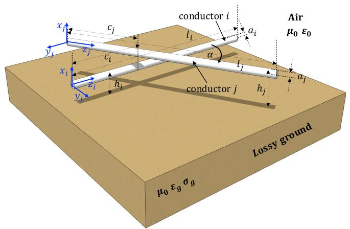

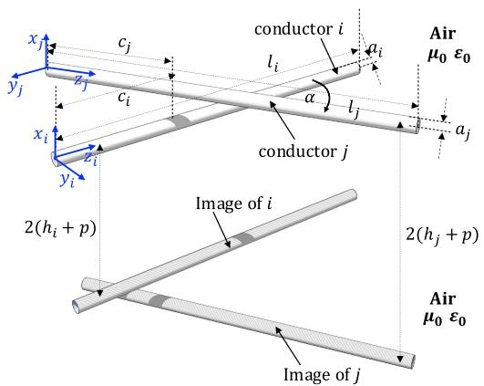  
(a)   
(b)   
Fig. 1. Single-conductor transmission lines crossing each other above (a) finitely-conducting ground and (b) complex image representation of conductors above ground.

space, permittivity, and conductivity of the ground, respectively. Electromagnetic field distribution of such structures is commonly determined using complex image theory [28] as shown in Fig. 1(b). According to the complex image theory, the ground half-space is replaced with air and an image of conductor i at height $h _ { i }$ is placed at a complex depth of $h _ { i } + 2 p$ where [28]

$$
p = \frac {1}{\sqrt {j \omega \mu_ {0} \left(\sigma_ {g} + j \omega \varepsilon_ {g}\right)}}. \tag {1}
$$

The scattered electric field $E ^ { s }$ generated by this structure, as detailed in [12], can be expressed in the frequency-domain as

$$
\boldsymbol {E} ^ {s} = - j \omega \boldsymbol {A} - \nabla \Phi \tag {2a}
$$

where, A and Φ are the magnetic vector potential and electric scalar potential, respectively. For a field point on the conductor i in the geometry shown in Fig. 1 we can write

$$
\begin{array}{l} A _ {z _ {i}} (z _ {i}, j \omega) = \frac {\mu_ {0}}{4 \pi} \int_ {0} ^ {\ell_ {i}} g \left(z _ {i}, z _ {i} ^ {\prime}\right) I _ {i} \left(z _ {i} ^ {\prime}, j \omega\right) d z _ {i} ^ {\prime} \\ + \cos \alpha \frac {\mu_ {0}}{4 \pi} \int_ {0} ^ {\ell_ {j}} g (z _ {i}, z _ {j}) I _ {j} (z _ {j}, j \omega) d z _ {j} \tag {2b} \\ \end{array}
$$

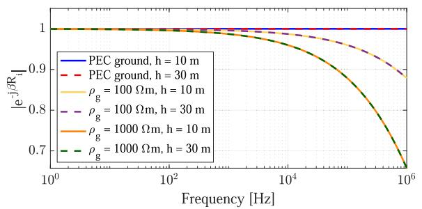

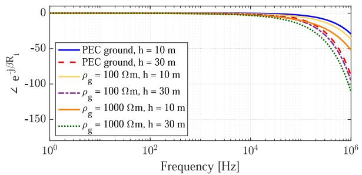  
(b)   
Fig. 2. (a) Magnitude and (b) phase of $g ( z _ { i } , z _ { i } ^ { \prime } )$ vs frequency.

and,

$$
\begin{array}{l} \Phi (z _ {i}, j \omega) = \frac {1}{4 \pi \varepsilon_ {0}} \int_ {0} ^ {\ell_ {i}} g (z _ {i}, z _ {i} ^ {\prime}) \rho_ {i} (z _ {i} ^ {\prime}, j \omega) d z _ {i} ^ {\prime} \\ + \frac {1}{4 \pi \varepsilon_ {0}} \int_ {0} ^ {\ell_ {j}} g (z _ {i}, z _ {j}) \rho_ {j} (z _ {j}, j \omega) d z _ {j}. \tag {2c} \\ \end{array}
$$

where α is the crossing angle, $\ell _ { i }$ and $\ell _ { j }$ are the lengths of the conductors, $I _ { i }$ and $I _ { j }$ are the currents, $\rho _ { i }$ and $\rho _ { j }$ are the electric charge densities at a field point on the surface of the wires i and $j ,$ , and $\omega$ is the angular frequency, respectively. The Green’s function which defines the distribution of the scattered field is given by [29]

$$
g \left(z, z ^ {\prime}\right) = \left(\frac {e ^ {- j \beta R _ {s}}}{R _ {s}} - \frac {e ^ {- j \beta R _ {i}}}{R _ {i}}\right) \tag {3}
$$

where $R _ { s }$ and $R _ { i }$ are the distances to an observation point z from s ithe current element and the image current element at a source point $z ^ { \prime } .$ , respectively, and $\beta = \omega \sqrt { \mu _ { 0 } \varepsilon _ { 0 } }$ is the phase constant. Equation (2) looks similar to the scattered electric field of a wire structure above PEC ground given in [25]. However, the Green’s functions, given in (3), are quite different from the lossless case since they are now frequency dependent. In [16], it is explained that for lossless structures $( i . e .$ , real $R _ { s }$ and $R _ { i } )$ , when the maximum cross-sectional dimension of the structure h is very small compared to the smallest wavelength of interest $\left( i . e . , h \ll \lambda _ { \operatorname* { m i n } } \right)$ , the exponential terms in (3) can be approximated as unity. For finitely-conducting ground, $R _ { i }$ in (3) is frequency-dependent and complex.

The variation of $e ^ { - j \beta R _ { i } }$ in the Green’s function $g ( z _ { i } , z _ { i } ^ { \prime } )$ as a i ifunction of frequency for different ground resistivities is shown in Fig. 2 for two heights (h = 10 and 30 m). It can be seen

that $e ^ { - j \beta R _ { i } }$ for a lossy ground can also be approximated as 1 upto a certain frequency which depends on the cross-sectional dimensions and resistivity of the ground. For example, for a 10-m high line above a ground with a resistivity of 100 Ωm, this approximation is valid up to around 100 kHz and so would be the proposed model. Also, for the frequency range of power system transients, since $\sigma _ { g } \gg \omega \varepsilon _ { g } ,$ , the complex depth p in (1) can be approximated as [30]

$$
p \approx \frac {1}{\sqrt {j \omega \mu_ {0} \sigma_ {g}}}. \tag {4}
$$

In this paper, the ground is assumed to be homogeneous. However, the proposed formulation is applicable to multilayer earth using the complex image depth $" p '$ as calculated in [30].

Assuming the exponential terms in (3) are approximately equal to 1 and $h \ll \lambda _ { \operatorname* { m i n } }$ , a closed-form expression can be obtained for the integral terms of (2) as [29]

$$
\begin{array}{l} \int_ {0} ^ {\ell} \left(\frac {e ^ {- j \beta R _ {s}}}{R _ {s}} - \frac {e ^ {- j \beta R _ {i}}}{R _ {i}}\right) I (z ^ {\prime}, j \omega) d z ^ {\prime} \\ = \int_ {0} ^ {\ell} \left(\frac {1}{R _ {s}} - \frac {1}{R _ {i}}\right) d z ^ {\prime} I (z, j \omega) = \xi (z, j \omega) I (z, j \omega) \tag {5} \\ \end{array}
$$

where ξ is the analytical solution for the integral term. This result is important as it eliminates the need of performing a numerical integration at each time step of the upcoming timedomain implementation. Assuming a transverse field structure and a thin-wire geometry, (2) can be rearranged into two closedform transmission-line-like equations as explained in [25] as

$$
\begin{array}{l} \frac {\mathrm {d} V (z _ {i} , j \omega)}{\mathrm {d} z _ {i}} = - Z _ {\mathrm {c}} (j \omega) I (z _ {i}, j \omega) \\ - \frac {j \omega \mu_ {0}}{4 \pi} \Big [ \xi_ {i i} (z _ {i}, j \omega) I _ {i} (z _ {i}, j \omega) \\ \left. + \cos \alpha \xi_ {i j} (z _ {i}, j \omega) I _ {j} (z _ {j}, j \omega) \right] \tag {6a} \\ \end{array}
$$

$$
\begin{array}{l} V (z _ {i}, j \omega) = - \frac {1}{j \omega 4 \pi \varepsilon_ {0}} \bigg [ \xi_ {i i} ^ {\prime} (z _ {i}) \frac {\mathrm {d} I _ {i} (z _ {i} , j \omega)}{\mathrm {d} z _ {i}} \\ \left. + \xi_ {i j} ^ {\prime} \left(z _ {i}\right) \frac {\mathrm {d} I _ {j} \left(z _ {j} , j \omega\right)}{\mathrm {d} z _ {j}} \right]. \tag {6b} \\ \end{array}
$$

ξ functions are elaborated in (7) (shown at the bottom of the next page). $Z _ { \mathrm { c } }$ is the conductor resistive loss including skin effect that can be calculated using the formula given in [31]. Since capacitance is considered to be frequency independent in overhead lines [12] and the conductance of air is negligible, $\xi ^ { \prime }$ terms in the current equation (6b) can be assumed to be those of a frequency-independent line given by [25]

$$
\begin{array}{l} \xi_ {i i} ^ {\prime} = \sinh^ {- 1} \left(\frac {\ell_ {i} - z _ {i}}{a _ {i}}\right) - \sinh^ {- 1} \left(\frac {- z _ {i}}{a _ {i}}\right) \\ - \sinh^ {- 1} \left(\frac {\ell_ {i} - z _ {i}}{2 h _ {i}}\right) + \sinh^ {- 1} \left(\frac {- z _ {i}}{2 h _ {i}}\right) \tag {8a} \\ \end{array}
$$

$$
\begin{array}{l} \xi_ {i j} ^ {\prime} = \sinh^ {- 1} \left(\frac {\ell_ {j} - c _ {j} + (c _ {i} - z _ {i}) \cos \alpha}{\sqrt {\left((c _ {i} - z _ {i}) \sin (\alpha)\right) ^ {2} + (h _ {i} - h _ {j}) ^ {2}}}\right) \\ - \sinh^ {- 1} \left(\frac {- c _ {j} + (c _ {i} - z _ {i}) \cos \alpha}{\sqrt {\left((c _ {i} - z _ {i}) \sin (\alpha)\right) ^ {2} + (h _ {i} - h _ {j}) ^ {2}}}\right) \\ - \sinh^ {- 1} \left(\frac {\ell_ {j} - c _ {j} + (c _ {i} - z _ {i}) \cos \alpha}{\sqrt {\left((c _ {i} - z _ {i}) \sin (\alpha)\right) ^ {2} + (h _ {i} + h _ {j}) ^ {2}}}\right) \\ + \sinh^ {- 1} \left(\frac {- c _ {j} + \left(c _ {i} - z _ {i}\right) \cos \alpha}{\sqrt {\left(\left(c _ {i} - z _ {i}\right) \sin (\alpha)\right) ^ {2} + \left(h _ {i} + h _ {j}\right) ^ {2}}}\right). \tag {8b} \\ \end{array}
$$

Similar equations can be derived for the other conductor (j) and the system of equations can be rearranged into the classical transmission line format of

$$
\frac {\mathrm {d}}{\mathrm {d} z} \left[ \begin{array}{l} \boldsymbol {V} (z, j \omega) \\ \boldsymbol {I} (z, j \omega) \end{array} \right] = - \left[ \begin{array}{c c} 0 & \boldsymbol {Z} (z, j \omega) \\ \boldsymbol {Y} (z, j \omega) & 0 \end{array} \right] \left[ \begin{array}{l} \boldsymbol {V} (z, j \omega) \\ \boldsymbol {I} (z, j \omega) \end{array} \right] \tag {9a}
$$

where

$$
\boldsymbol {Z} (z, j \omega) = \left[ \begin{array}{l l} Z _ {\mathrm {c}} + \frac {j \omega \mu_ {0}}{4 \pi} \xi_ {i i} (z, j \omega) & \frac {j \omega \mu_ {0} \cos (\alpha)}{4 \pi} \xi_ {i j} (z, j \omega) \\ \frac {j \omega \mu_ {0} \cos (\alpha)}{4 \pi} \xi_ {j i} (z, j \omega) & Z _ {\mathrm {c}} + \frac {j \omega \mu_ {0}}{4 \pi} \xi_ {j j} (z, j \omega) \end{array} \right] \tag {9b}
$$

and

$$
\mathbf {Y} (z, j \omega) = 4 \pi \varepsilon_ {0} j \omega \left[ \begin{array}{l l} \xi_ {i i} ^ {\prime} (z) & \xi_ {i j} ^ {\prime} (z) \\ \vdots \\ \xi_ {j i} ^ {\prime} (z) & \xi_ {j j} ^ {\prime} (z) \end{array} \right] ^ {- 1}. \tag {9c}
$$

Equation (9) is extended into multiconductor lines and other nonuniform geometries such as bends as explained in [26].

B. Time-Domain Implementation of Dispersive SFTL Model

When an equation like (9) is converted into time-domain, multiplications between frequency dependent terms become convolutions. Therefore time-domain implementation is not as straight forward as for lossless lines in [25]. A method to solve single-conductor uniform dispersive transmission lines has been introduced in [24] where the frequency-dependent PUL impedance matrix is first fitted into a rational function using a sum of first-order poles with corresponding residues, a proportional term, and a constant term [27]. The frequency dependency is then handled using recursive convolutions. This approach has been extended to non-uniform multiconductor structures in this work. The impedance matrix $Z ( z , j \omega )$ at location z can be fitted into a matrix function of the format

$$
\boldsymbol {Z} (z, j \omega) = \boldsymbol {R} (z) + j \omega \boldsymbol {L} (z) + \boldsymbol {Z} ^ {\prime} (z, j \omega) \tag {10a}
$$

where

$$
\boldsymbol {Z} ^ {\prime} (z, j \omega) = \sum_ {k = 1} ^ {M} \frac {\boldsymbol {a} _ {z , k}}{j \omega - \alpha_ {z , k}}. \tag {10b}
$$

In (10), $\mathbf { \alpha } _ { a _ { z , k } }$ is the residue matrix corresponding to each pole $\alpha _ { z , k }$ z,k. Note that the set of poles has to be common for all elements zof $\mathbf { \alpha } _ { \mathbf { \alpha } _ { a , k } }$ . In contrast to uniform MTL systems which involves the z,ksame fitted function for all space locations, a nonuniform system will require unique fitted functions for each location in space. Finally, time-domain implementation of (9a) can be written as

$$
\begin{array}{l} \frac {\partial}{\partial z} \boldsymbol {V} (z, t) = - \boldsymbol {R} (z) \boldsymbol {I} (z, t) - \boldsymbol {L} (z) \frac {\partial}{\partial t} \boldsymbol {I} (z, t) \\ - \boldsymbol {Z} ^ {\prime} (z, t) * \boldsymbol {I} (z, t) \tag {11a} \\ \end{array}
$$

and

$$
\frac {\partial}{\partial z} \boldsymbol {I} (z, t) = - \boldsymbol {C} \frac {\partial}{\partial t} \boldsymbol {V} (z, t). \tag {11b}
$$

Equations in (11) are solved using the modified finite-difference time-domain (MFDTD) algorithm [24] that has been extended to multiconductor lines in this work. The proposed model is implemented in a commercial power system EMT simulator (PSCAD/EMTDC) and the ability to simulate non-uniform

$$
\begin{array}{l} \xi_ {i i} = \ln \left(\ell_ {i} + \sqrt {\left(\ell_ {i} - z _ {i}\right) ^ {2} + a _ {i} ^ {2}} - z _ {i}\right) - \ln \left(\sqrt {\left(\ell_ {i} - z _ {i}\right) ^ {2} + a _ {i} ^ {2}} - z _ {i}\right) \\ - \ln \left(\ell_ {i} + \sqrt {\left(\ell_ {i} - z _ {i}\right) ^ {2} + (2 h _ {i} + 2 p) ^ {2}} - z _ {i}\right) + \ln \left(\sqrt {\left(\ell_ {i} - z _ {i}\right) ^ {2} + (2 h _ {i} + 2 p) ^ {2}} - z _ {i}\right) \tag {7a} \\ \end{array}
$$

$$
\begin{array}{l} \xi_ {i j} = \ln \left(\ell_ {j} + \sqrt {\left[ (\ell_ {j} - c _ {j}) + (z _ {i} - c _ {i}) \cos \alpha \right] ^ {2} + \left[ (z _ {i} - c _ {i}) \sin \alpha \right] ^ {2} + (h _ {i} - h _ {j}) ^ {2}} - c _ {j} + (z _ {i} - c _ {i}) \cos \alpha\right) \\ - \ln \left(\sqrt {\left[ (\ell_ {j} - c _ {j}) + (z _ {i} - c _ {i}) \cos \alpha \right] ^ {2} + \left[ (z _ {i} - c _ {i}) \sin \alpha \right] ^ {2} + (h _ {i} - h _ {j}) ^ {2}} - c _ {j} + (z _ {i} - c _ {i}) \cos \alpha\right) \\ - \ln \left(\ell_ {j} + \sqrt {\left[ \ell_ {j} - c _ {j} + (z _ {i} - c _ {i}) \cos \alpha \right] ^ {2} + \left[ (z _ {i} - c _ {i}) \sin \alpha \right] ^ {2} + (h _ {i} + h _ {j} + 2 p) ^ {2}} - c _ {j} + (z _ {i} - c _ {i}) \cos \alpha\right) \\ + \ln \left(\sqrt {\left[ \left(\ell_ {j} - c _ {j}\right) + \left(z _ {i} - c _ {i}\right) \cos \alpha \right] ^ {2} + \left[ \left(z _ {i} - c _ {i}\right) \sin \alpha \right] ^ {2} + \left(h _ {i} + h _ {j} + 2 p\right) ^ {2}} - c _ {j} + \left(z _ {i} - c _ {i}\right) \cos \alpha\right) \tag {7b} \\ \end{array}
$$

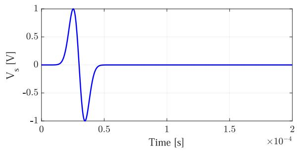  
Fig. 3. Derivative of a Gaussian waveform applied on conductor .

structures along with other power system elements including non-linear elements is demonstrated in the following results section.

# III. RESULTS AND DISCUSSION

Results obtained using the DSFTL model for two single conductor transmission lines crossing at an angle of α are compared against those obtained from a commercial thin-wire full-wave solver, Numerical Electromagnetic Code (NEC4). Induced voltages at power-frequency on an AC transmission line crossing under a UHV AC line are also compared with measurements obtained by other researchers. A case study on the effect from power system fault currents on nearby lines is also presented.

# A. Verification of the DSFTL Model Using a Full-Wave Solver

Two conductors crossing each other at a variable angle α are modelled. The dimensions of the lines (see Fig. 1) are $\ell _ { 1 } = \ell _ { 2 } = 1 0$ km, $c _ { 1 } = c _ { 2 } = 4$ km, $h _ { 1 } = 1 0 \mathrm { m } , h _ { 2 } = 1 2 \mathrm { m }$ , and $a _ { 1 } = a _ { 2 } = 2 0$ mm. Ground resistivity is taken as 100 Ωm. A derivative of a Gaussian pulse with a full-width at half maximum (FWHM) of 22 kHz as shown in Fig. 3 is used to excite conductor 1 at the sending end. An excitation which does not contain a DC component is purposely used here since the full-wave solver (NEC4) used to generate reference waveforms doesn’t compute DC response [32]. All terminals of the transmission line structure are connected to 100 Ω resistive loads. Since NEC4 is a frequency-domain solver, FFT-IFFT method is used to obtain time-domain results. It is worth noting that the DSFTL method, being inherently a time-domain method, does not have the limitation of approaches that employ the FFT-IFFT methods.

The current waveform generated in the excited conductor is shown in Fig. 4 and the current induced in the victim conductor for different crossing angles are shown in Fig. 5 compared with those obtained using NEC4. It can be seen that the DSFTL model has been able to produce the same results as the full-wave technique. Current waveforms under a lossless approximation [25] is plotted in the same figure to demonstrate the wave distortion occurring due to frequency-dependent losses.

Fig. 5 also suggests that when the crossing angle increases the magnitude of the induced current on the victim conductor decreases. It is interesting to see that even at an orthogonal crossing $( i . e . ~ \alpha = 9 0 ^ { \circ } )$ , a current is still induced in the victim line. This is because when the crossing angle is 90◦, even though

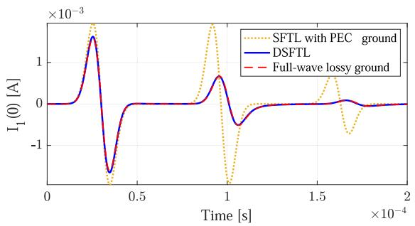  
Fig. 4. Current generated at the sending end in the excited conductor.

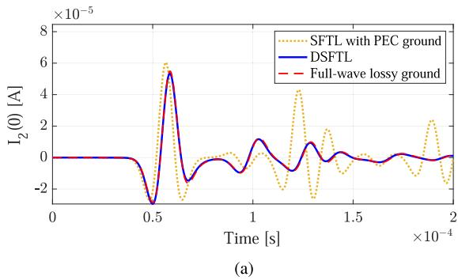

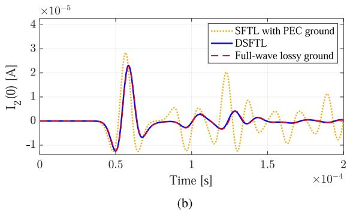

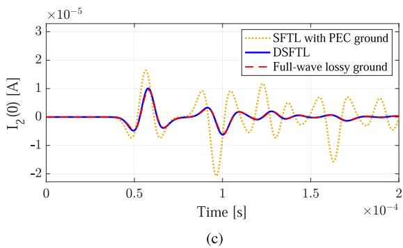  
Fig. 5. Sending end current on the victim conductor for crossing angles of (a) 30◦ (b) 60◦ and (c) 90◦.

the mutual inductive coupling in (9b) becomes zero, the mutual capacitive coupling in (9c) still remains.

# B. Verification of the DSFTL Model Using Power Frequency Measurements

In [6], field measurement data is provided for induced voltage on a 110 kV HVAC line passing under a double circuit 1000 kV

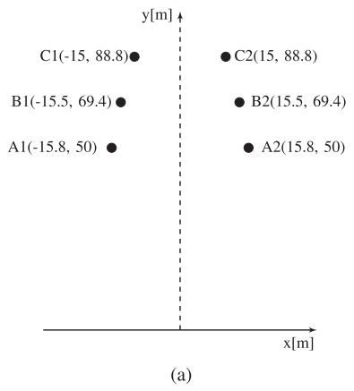

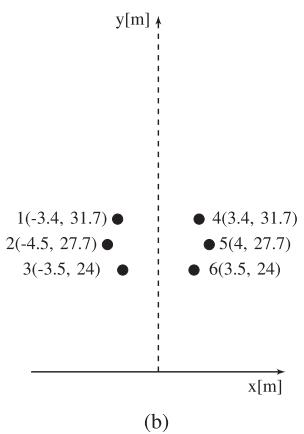  
Fig. 6. Conductor arrangements of (a) 1000 kV UHVAC line and (b) 110 kV HVAC line [6].

TABLE IMEASUREMENT DATA FROM [6] AND SIMULATED RESULTS USING DSFTLMODEL OF INDUCED VOLTAGES (PEAK) ON THE UNGROUNDED LV LINE WHENTHE HV LINE IS ENERGIZED WITH A 50 HZ VOLTAGE OF 816.5 KV (PEAK)  

<table><tr><td>Phase</td><td>Measured Voltage (V)</td><td>Simulated Voltage (V)</td><td>% Difference</td></tr><tr><td>1</td><td>17.45</td><td>17.00</td><td>2.6</td></tr><tr><td>2</td><td>14.91</td><td>14.04</td><td>5.8</td></tr><tr><td>3</td><td>12.49</td><td>11.50</td><td>7.9</td></tr></table>

TABLE II MEASUREMENT DATA FROM [6] AND SIMULATED RESULTS USING DSFTL MODEL OF INDUCED VOLTAGES (PEAK) ON THE GROUNDED LV LINE WHEN THE HV LINE IS ENERGIZED WITH A 50 HZ VOLTAGE OF 816.5 KV (PEAK)   

<table><tr><td rowspan="2">Phase</td><td rowspan="2">Measured Voltage (V)</td><td colspan="6">Simulated Voltage (V) for different Zg</td></tr><tr><td>1 Ω</td><td>5 Ω</td><td>10 Ω</td><td>25 Ω</td><td>35 Ω</td><td>50 Ω</td></tr><tr><td>1</td><td>3.3</td><td>1.6</td><td>2.0</td><td>2.2</td><td>2.6</td><td>2.9</td><td>3.3</td></tr><tr><td>2</td><td>3.1</td><td>1.5</td><td>1.8</td><td>1.9</td><td>2.2</td><td>2.3</td><td>2.6</td></tr><tr><td>3</td><td>3.1</td><td>1.3</td><td>1.6</td><td>1.7</td><td>1.9</td><td>2.1</td><td>2.2</td></tr></table>

UHVAC line at a crossing angle of 60◦. Conductor arrangments on the two lines are shown in Fig. 6. The two circuits of the UHVAC line are supplying loads of 275 MW, 416 MVar and 271 MW, 21 MVar respectively. Field measurements from [6] of the induced voltage on the victim line at the point of crossing when its terminals are ungrounded and grounded are given in Tables I and II, respectively.

The same structure is modelled using the DSFTL in PSCAD/EMTDC with similar energization and loading. Lines are modelled up to 1 km along each direction from the crossing to be consistent with [6]. The following parameters have to be assumed as they are not mentioned in [6]. Conductor radius is assumed to be 20 mm [33]. Power frequency and ground resistivity are assumed as 50 Hz and 100 Ωm based on the location where field measurements were obtained [34]. When obtaining voltages on a grounded line, grounding impedance is a key factor. Since no information on the value of the grounding resistance is provided in [6], grounding resistance values in the

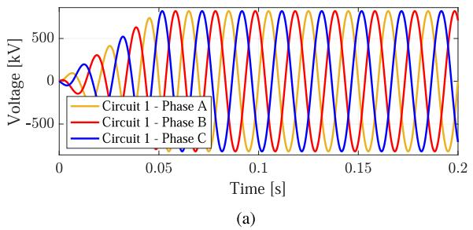

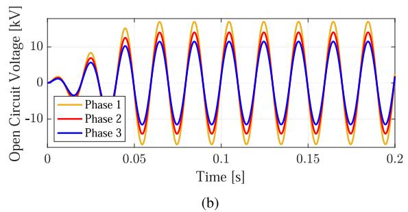

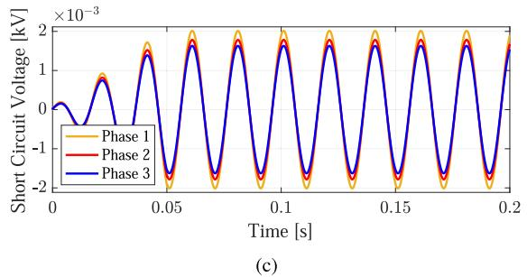  
Fig. 7. Voltage waveforms at the crossing points of (a) energized 1000 kV line (b) 110 kV line with ungrounded ends and (c) 110 kV line with grounded ends obtained using DSFTL model on PSCAD/EMTDC.

range of 1 – 25 Ω, as recommended in [35], as well as higher values of 35 and 50 Ω are used to simulate the grounded LV case.

Voltage waveforms at the point of crossing on the energized line and the victim line under the grounded and ungrounded conditions are shown in Fig. 7, and their peak values are presented in Tables I and II, respectively. By comparing measured and simulated voltage values given in Table I, it can be seen that for the case where the LV line is ungrounded the voltage values match closely. For the case of grounded LV line (see Table II) the induced voltages are very small in magnitude (below 5 V) and are seen to be in the same order. By aforementioned comparisons with results from full-wave techniques and field measurement data both the transient and power-frequency performance of DSFTL method have been demonstrated.

# C. Case Study on the Effect of Faults on Nearby Lines

A case study is performed to analyze the transient behavior of the lower voltage line due to a fault in the high voltage line simulated in Section III-B. The schematic of the simulated circuit is shown in Fig. 8. From an EMT simulator perspective, the simulation model consists of three cascaded multiport networks of which the middle one is the DSFTL model for the region of the crossing and the other two are conventional models for the rest of

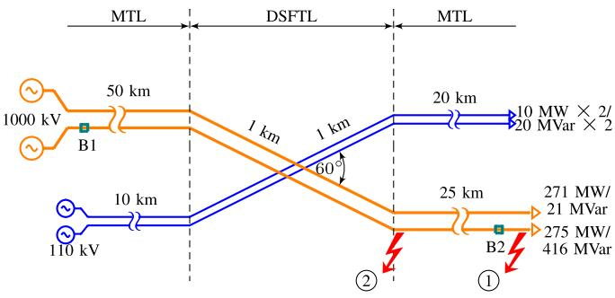

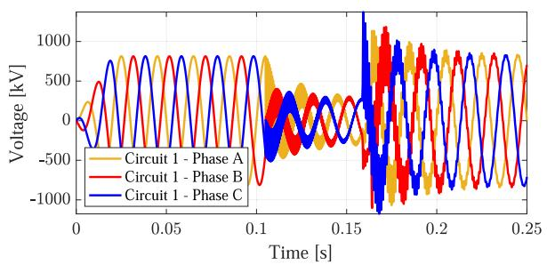  
Fig. 8. Schematic of double circuit 1000 kV and 110 kV transmission lines along with locations where faults were applied.

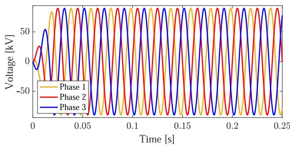  
(b)   
Fig. 9. Voltage waveforms at the point of crossing on (a) energized 1000 kV line having a 3-phase fault and (b) energized 110 kV line obtained using DSFTL model on PSCAD/EMTDC.

the transmission line. A fault can be applied at any terminal of the multiport networks. Faults are created at the farthest (location 1 ) and closest (location 
2 ) nodes to the point of crossing towards the load side on one of the circuits in the UHV AC line as shown in Fig. 8. However, a fault can be applied at any arbitrary location on the transmission line as long as it is divided into cascaded multiport network sections and the fault is applied to the terminal of the multiport network. Loads connected to the 1000 kV line is kept the same as in Section III-B and the induced voltage in the 110 kV is analysed under both energized and grounded conditions.

First, transient behavior of the energized 110 kV line is studied when a three phase (L-L-L) fault occurs in one of the circuits of the 1000 kV line at the load end (location 1 in Fig. 8). Voltage drop in the faulty phases is given a fall-time of 250 μs in accordance with the standard switching impulse waveform [36]. Each fault is followed by a breaker operation at locations B1 or B2 triggered by an over-current relay to isolate the fault. Voltage waveforms on both lines at the point of crossing are

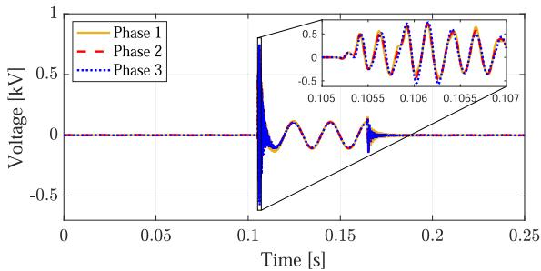  
(a)

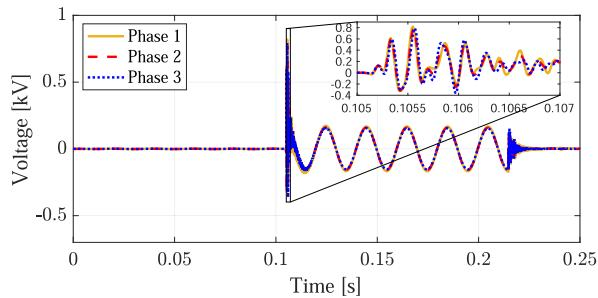  
(b)

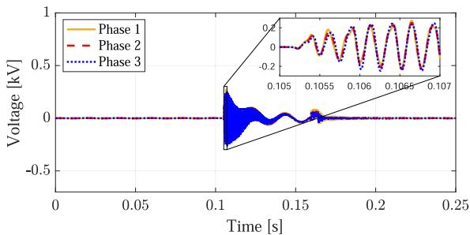  
（c）  
Fig. 10. Voltage waveforms at the crossing point of the grounded 110 kV line when the 1000 kV line undergoes a (a) L-G fault at load end (location 
1 ) cleared by breaker B2, (b) L-G fault at location 
2 cleared by breaker B1, and (c) L-L-L fault at load end cleared by breaker B2 obtained using DSFTL model incorporated in PSCAD/EMTDC.

shown in Fig. 9. As evident from the figure, the disturbance in the 1000 kV line does not create a significant interference in the 110 kV line. Faults occurring at other locations shown in Fig. 8 produced similar results. Therefore it can be concluded that the set clearances between lines in this case study are sufficient to avoid interference under normal operation.

Next, a situation where a fault occurs in the 1000 kV line while the 110 kV line is grounded, simulating the line maintenance procedure, is studied. The voltage induced in the point of crossing under different fault configurations is shown in Fig. 10. Before the occurrence of a fault, the induced voltage in the 110 kV line is around 2  3 V. However, when a fault occurs at the load end of the energized line a transient of around 1 kV is generated in the grounded line. The power-frequency induced voltage which follows is also much higher than the safe voltage for humans according to [37] which states that voltages as low as 50 V can cause fibrillation. If a failure happens in the protection system of the 1000 kV line, this voltage will remain until the

fault is cleared. When the fault happens closer to the crossing the induced voltages are higher as shown in Fig. 10(b). When a three-phase fault occurs at the load end the induced voltage as shown in Fig. 10(c) is much less than that induced during an unbalanced fault.

Magnitude of the transients in the victim line is proportional to the rate of change of the original transients in the energized (faulty) line. Therefore, the magnitude of the initial high-frequency transient is highly dependent on the fall-time of the voltage in the faulty line. Results shown in Fig. 10 are for a fall-time of 250 μs in accordance with the standard switching waveform. Faster fall-times can produce transients with higher magnitudes in the victim line. The magnitude of the power-frequency transient, which is induced during the time between the occurrence of the fault and the operation of the breaker, is not expected to change with the fall-time of the fault and is contributed mainly by the unbalance between phases in the faulty line which remains until breakers operate. This explains why the magnitude of the transients during a L-G fault is much larger compared to that of a L-L-L fault.

# IV. CONCLUSION

With the expansion of power networks, more transmission lines have to be constructed in a limited space often causing them to be placed in close proximity with each other or have discontinuities such as sharp bends along their span. Induced interference from one line to nearby lines and wave distortions such as reflections at abrupt discontinuities has become a growing concern. Classical transmission line theory is only applicable to parallel wires which typically is not fulfilled in such situations. Therefore, time-domain methods with the ability to solve nonuniform structures have to be developed.

This paper proposed an approach, namely dispersive scattered field transmission line (DSFTL) model, to simulate nonuniformities, such as crossing, in frequency-dependent transmission lines above lossy, frequency-dependent ground. The initial mathematical model was developed using electromagnetic scattering equations under the thin-wire approximation. Then it was simplified into a transmission-line-like form considering the geometrical characteristics and frequencies of interest in typical power transmission lines. Resulting nonuniform transmission line equations were solved using a modified FDTD algorithm. The proposed model was successfully implemented in a power system EMT simulator and used to model a real world scenario of two transmission lines crossing each other. The accuracy of the transient waveforms obtained using the DSFTL model were verified with those calculated using a commercial full-wave electromagnetic solver. The comparison demonstrated that DSFTL can correctly model the transient behavior at a transmission line crossing. The DSFTL model was also able to regenerate power-frequency measurements of induced voltages obtained by other researchers. A case study on induced transients on power lines passing under faulty higher voltage lines was also performed with non-linear and time-dependent elements included in the circuit. Based on these results, it is advisable to use temporary grounding during maintenance of such structures.

It can be concluded that this work demonstrates the capabilities of DSFTL model as a suitable candidate for a nonuniform frequency-dependent transmission line model for power system EMT simulators.

# REFERENCES

[1] A. J. Martinez-Velasco, Power System Transients: Parameter Determination. Boca Raton, FL, USA: CRC Press/Taylor & Francis Group, 2010.   
[2] J. Guo, Y. Xie, and F. Rachidi, “A semi-analytical method to evaluate lightning-induced overvoltages on overhead lines using the matrix pencil method,” IEEE Trans. Power Del., vol. 33, no. 6, pp. 2837–2848, Dec. 2018.   
[3] M. Cervantes et al., “Simulation of switching overvoltages and validation with field tests,” IEEE Trans. Power Del., vol. 33, no. 6, pp. 2884–2893, Dec. 2018.   
[4] J. Tang et al., “Analysis of electromagnetic interference on DC line from parallel ac line in close proximity,” IEEE Trans. Power Del., vol. 22, no. 4, pp. 2401–2408, Oct. 2007.   
[5] D. M. McNamara, J. P. Majo, and A. K. Ziarani, “Elimination of power line interference on telephone cables under frequency-varying conditions,” IEEE Trans. Instrum. Meas., vol. 57, no. 2, pp. 321–331, Feb. 2008.   
[6] L. Yuze, K. Xiaofeng, and Z. Bo, “Calculation of induced voltage and current on a crossing transmission line under UHV AC transmission lines,” in Proc. IEEE Asia Power Energy Eng. Conf., 2019, pp. 132–136.   
[7] F. Huo, W. Lu, Z. Qiu, D. Huang, and C. Huang, “Study on electric field distribution characteristics of the maintenance area when UHV AC transmission line crossing 220 kV tower,” J. Eng., vol. 2019, no. 16, pp. 2986–2990, Apr. 2019.   
[8] C. R. Paul, Analysis of Multiconductor Transmission Lines, 2nd ed. Hoboken, NJ, USA: Wiley, 2007.   
[9] EMTDC-Transient Analysis for PSCAD Power System Simulations: User’s Guide. Manitoba, Canada: Manitoba HVDC Research Centre, 2005.   
[10] H. W. Dommel, EMTP Theory Book. Protland, OR, USA: Bonneville Power Administration, 1986.   
[11] J. R. Carson, “Wave propagation in overhead wires with ground return,” Bell Syst. Tech. J., vol. 5, no. 4, pp. 539–554, 1926.   
[12] CIGRE, “Guideline for numerical electromagnetic analysis method and its application to surge phenomena,” CIGRE, Tech. Brochure 543, Jun. 2013.   
[13] T. Asada, A. Ametani, Y. Baba, and N. Nagaoka, “A study of transient responses on nonuniform conductors by FDTD simulations,” IEEJ Trans. Elect. Electron. Eng., vol. 11, no. 4, pp. 435–441, 2016.   
[14] F. de Paulis, M. Cracraft, C. Olivieri, S. Connor, A. Orlandi, and B. Archambeault, “EBG-based common-mode stripline filters: Experimental investigation on interlayer crosstalk,” IEEE Trans. Electromagn. Compat., vol. 57, no. 6, pp. 1416–1424, Dec. 2015.   
[15] H. A. Diawuo and Y. Jung, “Waveguide-to-stripline transition design in millimeter-wave band for 5G mobile communication,” IEEE Trans. Antennas Propag., vol. 66, no. 10, pp. 5586–5589, Oct. 2018.   
[16] S. Tkatchenko, F. Rachidi, and M. Ianoz, “Electromagnetic field coupling to a line of finite length: Theory and fast iterative solutions in frequency and time domains,” IEEE Trans. Electromagn. Compat., vol. 37, no. 4, pp. 509–518, Nov. 1995.   
[17] S. Tkachenko, F. Rachidi, and J. Nitsch, “Analytical characterization of a line bend,” WIT Trans. Model. Simualation, vol. 39, no. 1, pp. 599–608, 2005.   
[18] I. Juri´c-Grgi´c, R. Luci´c, and A. Bernadi´c, “Transient analysis of coupled non-uniform transmission line using finite element method,” Int. J. Circuit Theory Appl., vol. 43, no. 9, pp. 1167–1174, 2015.   
[19] P. Manfredi, D. De Zutter, and D. V. Ginste, “Analysis of nonuniform transmission lines with an iterative and adaptive perturbation technique,” IEEE Trans. Electromagn. Compat., vol. 58, no. 3, pp. 859–867, Jun. 2016.   
[20] S. Südekum and M. Leone, “Improved per-unit-length parameter definition for non-uniform and lossy multiconductor transmission lines,” in Proc. Int. Symp. Electromagn. Compat., 2018, pp. 1–6.   
[21] Q. Liu, Y. Zhao, W. Yan, C. Huang, A. Mueed, and Z. Meng, “A novel crosstalk estimation method for twist non-uniformity in twisted-wire pairs,” IEEE Access, vol. 8, pp. 38 318–38 326, 2020.   
[22] K. Afrooz and A. Abdipour, “Efficient method for time-domain analysis of lossy nonuniform multiconductor transmission line driven by a modulated signal using FDTD technique,” IEEE Trans. Electromagn. Compat., vol. 54, no. 2, pp. 482–494, Apr. 2012.

[23] J. Jeong and R. Nevels, “Time-domain analysis of a lossy nonuniform transmission line,” IEEE Trans. Circuits Syst.II, Exp. Briefs, vol. 56, no. 2, pp. 157–161, Feb. 2009.   
[24] B. Kordi, J. LoVetri, and G. E. Bridges, “Finite-difference analysis of dispersive transmission lines within a circuit simulator,” IEEE Trans. Power Del., vol. 21, no. 1, pp. 234–242, Jan. 2006.   
[25] M. Gunawardana and B. Kordi, “Time-domain modeling of transmission line crossing using electromagnetic scattering theory,” IEEE Trans. Power Del., vol. 35, no. 2, pp. 1020–1027, Apr. 2020.   
[26] A. Ng, M. Gunawardana, and B. Kordi, “Simulation of transmission line bend using a non-uniform transmission line model based on scattering theory,” in Proc. IEEE Power Energy Soc. Gen. Meeting, 2020, pp. 1–5.   
[27] B. Gustavsen and A. Semlyen, “Rational approximation of frequency domain responses by vector fitting,” IEEE Trans. Power Del., vol. 14, no. 3, pp. 1052–1061, Jul. 1999.   
[28] P. R. Bannister, “Applications of complex image theory,” Radio Sci., vol. 21, no. 4, pp. 605–616, 1986.   
[29] S. V. Tkachenko, F. Rachidi, and J. B. Nitsch, “High-frequency electromagnetic coupling to transmission lines: Electrodynamics correction to the TL approximation,” in Electromagnetic Field Interaction with Transmission Lines: From Classical Theory to HF Radiation Effects, F. Rachidi and S. V. Tkachenko, Eds. Boston, MA, USA: WIT Press, 2008, pp. 123–158.   
[30] A. Deri, G. Tevan, A. Semlyen, and A. Castanheira, “The complex ground return plane a simplified model for homogeneous and multi-layer earth return,” IEEE Trans. Power App. Syst., vol. PAS- 100, no. 8, pp. 3686–3693, Aug. 1981.   
[31] L. Wedepohl and D. Wilcox, “Transient analysis of underground powertransmission systems. system-model and wave-propagation characteristics,” Proc. Inst. Elect. Eng., vol. 120, no. 2, pp. 253–260, Feb. 1973.   
[32] G. Burke, A. Poggio, J. Logan, and J. Rockway, “NEC- Numerical electromagnetics code for antennas and scattering,” in Proc. Antennas Propag. Soc. Int. Symp., Jun. 1979, vol. 17, pp. 147–150.   
[33] J. Chan, EPRI AC Transmission Line Reference Book - 200 kV and Above, Palo Alto, CA, USA: EPRI, 2012.   
[34] International Telecommunications Union, “World atlas of ground conductivities,” Geneva, Switzerland, ITU-R P.832-4, Jul. 2015.   
[35] National Electrical Code (NEC), “National fire protection association,” Quincy, MA, USA, NFPA 70, Jun. 2020.   
[36] S. Okabe, G. Ueta, T. Tsuboi, and J. Takami, “Study on switching impulse test waveform for UHV-class electric power equipment,” IEEE Trans. Dielectr. Electr. Insul., vol. 19, no. 3, pp. 793–802, Jun. 2012.   
[37] IEEE Guide for Maintenance, Operation, and Safety of Industrial and Commercial Power Systems (Yellow Book), IEEE Standard 902-1998, pp. 1–160, Dec. 1998.

Manuja Gunawardana (Student Member, IEEE) was born in Colombo, Sri Lanka, in 1991. He received the B.Sc. degree in electrical engineering from the University of Moratuwa, Sri Lanka, in 2016 and the M.Sc. degree in electrical engineering from the University of Manitoba, Winnipeg, MB, Canada, in 2019. He is currently a Ph.D. Candidate with the University of Manitoba, Canada. His research interests include in transient simulation models of power transformers and time-domain modeling of non-uniform transmission lines.

Ashley Ng received the B.Sc. in electrical engineering from the University of Manitoba, Winnipeg, MB, Canada, in 2020. She is currently working toward the M.Sc. degree in electrical engineering with the University of Manitoba. Her research interest focuses on modelling and simulation of power systems.

Behzad Kordi (Senior Member, IEEE) received the B.Sc. (with distinction), M.Sc., and Ph.D. degrees all in electrical engineering from the Amirkabir University of Technology (Tehran Polytechnic), Tehran, Iran, in 1992, 1995, and 2000, respectively. During 1998 and 1999, he was with the Lightning Studies Group with the University of Toronto, Toronto, ON, Canada. In 2002, he joined the Electrical and Computer Engineering Department, University of Manitoba, Canada, where he is currently a Full Professor and the Director of McMath High Voltage Labora-

tory. His research interests include high voltage engineering, electromagnetic compatibility, simulation models of power transformers and transmission lines, and condition monitoring of high voltage apparatus. Dr. Kordi was the Chair of URSI Canada Commission E in 2012-13. He is a Member of a number of Cigré working groups pertinent to transient modeling of power system apparatus. He is also an Associate Editor for IEEE TRANSACTIONS ON DIELECTRICS AND ELECTRICAL INSULATION and IET High Voltage. Dr. Kordi is a Registered Professional Engineer with the province of Manitoba and was the recipient of 2012 IEEE EMC Richard B. Schulz Best Transactions Paper Award.