# $\pm 800 \mathrm{~kV}$ 云广特高压直流控制方式的动态特性分析

刘可真 $^{1,2}$ ，束洪春 $^{1,2}$ ，孙士云 $^{1,2}$ ，司大军 $^{3}$ ，张广斌 $^{2}$ ，朱子钊 $^{2}$

(1.哈尔滨工业大学电气工程系,哈尔滨 150001;2. 昆明理工大学电力工程学院,昆明 650051;

3.云南电力科学研究院，昆明650051)

摘要：云广 $\pm 800\mathrm{kV}$ 特高压直流输电系统建成之后，将形成远距离和大容量交、直流输电并列运行的电网格局，特高压直流的控制方式对电网的稳定性有重要影响。为此在电磁暂态仿真软件EMTDC中对 $\pm 800\mathrm{kV}$ 云广直流双极运行下，整流侧分别采用定电流和定功率控制时，交流系统整流侧与逆变侧故障对直流系统的影响，直流控制系统与交流系统的响应过程进行了详细的计算分析，对两种控制方式下系统的动态特性进行了对比分析。结果表明，与整流侧采用定电流控制相比，定功率控制时，交流系统故障期间系统各电气量的变化较缓慢，故障清除后系统恢复过程中，直流电流的突增会导致短时换相失败，且故障后直流系统的恢复时间较长。

关键词：特高压直流；定电流控制；定功率控制；动态特性；电磁暂态；换相失败

中图分类号：TM743 文献标志码：A 文章编号：1003-6520(2010)01-0190-06

# Analysis on Dynamic Characteristic of Control Mode for ±800 kV Yun-Guang UHVDC

LIU Ke-zhen $^{1,2}$ , SHU Hong-chun $^{1,2}$ , SUN Shi-yun $^{1,2}$ , SI Da-jun $^{3}$ , ZHANG Guang-bin $^{2}$ , ZHU Zi-zhao $^{2}$

(1. Department of Electrical Engineering, Harbin Institute of Technology, Harbin 150001, China;   
2. Faculty of Electric Power Engineering, Kunming University of Science and Technology, Kunming 650051, China; 3. Yunnan Electric Power Research Institute, Kunming 650051, China)

Abstract: When Yun-Guang $\pm 800\mathrm{kV}$ ultra high voltage direct current (UHVDC) project is completed, a parallel AC/DC power system with long distance and heavy capacity will come out. And the UHVDC control mode has important influence on the power system stability. Consequently, Yun-Guang $\pm 800\mathrm{kV}$ UHVDC bipolar model was established in EMTDC. The effect of AC system faults on the UHVDC transmission system in both constant current and constant power control modes and the response of UHVDC control system were computed and analyzed, respectively. Moreover, the dynamic characteristic of the AC/DC system in two control strategies was comparatively analyzed. The results show that, compared with the constant current mode, all the electrical variables change more slowly than in constant power mode during the power system fault. After the fault is cleared, a sudden increase of DC current may cause short time commutation failure. And the system needs more time to come back to normal operation.

Key words: UHVDC; constant current control; constant power control; dynamic characteristic; electromagnetic transient; commutation failure

# 0 引言

南方电网规划 $2009\sim 2010$ 年采用 $\pm 800\mathrm{kV}$ 、输送功率 $5000\mathrm{MW}$ 的特高压直流将云南水电送往

分地计算和研究, 但还存在一定的局限: 由于在一系列假设条件下将直流系统作了简化与线性化, 受其采用的直流模型限制, 当需要考虑交流不对称故障对高压直流换相过程的影响及与直流控制系统性能密切相关的交流扰动后直流系统恢复等问题时, 机电暂态仿真就不能给出足够准确的结果, 因其不能描述换流阀的开通与关断的动态过程, 不能真正反映直流输电控制系统的调节过程, 不能确定什么故障可以造成直流闭锁, 什么情况可以引起换相失败[8-11]。因此, 在研究交直流的相互作用问题时, 需要考虑直流换流器的详细模型, 采用更精确的电磁暂态仿真模型是十分必要的[12-16]。

本文在电磁暂态仿真软件EMTDC中对 $\pm 800$ kV云广直流双极运行下，整流侧分别采用定电流和定功率控制，交流系统整流侧与逆变侧故障对直流系统的影响以及直流输电线路故障时，直流控制系统与交流系统的响应过程进行了详细的计算分析。整流侧与逆变侧交流线路在不同位置发生不同类型故障时，计算了交流系统换流母线的电压、电流响应，直流系统电压、电流以及相关直流控制量的变化情况。

# 1 云广直流电磁暂态计算的模型

# 1.1 系统模型

云广直流输电工程西起云南楚雄州禄丰县，东至广东增城东部，电压等级为 $\pm 800\mathrm{kV}$ ，输电线路长度约 $1438\mathrm{km}$ ，输电功率为5GW，额定电流3125kA，2009-06建成 $\pm 400\mathrm{kV}$ 或单极，2010年建成 $\pm 800\mathrm{kV}$ 。送端楚雄换流站通过2回 $500\mathrm{kV}$ 交流线路与云南主网 $500\mathrm{kV}$ 厂口变电站相连，小湾水电站和金桥水电站分别通过2回和2回 $500\mathrm{kV}$ 线路向楚雄站送电；受端换流站分别以2回 $500\mathrm{kV}$ 交流出线接入增城、横沥和水乡变电站。

根据典型的直流输电模型，建立了如图1所示的云广直流双极电磁暂态模型。其包含的设备有：换流变压器、12脉换流器、交流侧滤波器、直流滤波器、平波电抗器、分布参数的直流输电线路等一次设备以及整流与逆变侧的二次直流系统的额定电压为 $800\mathrm{kV}$ ，每极直流线路的额定功率为 $2.5\mathrm{GW}$ 。

# 1.2 控制策略及参数

整流侧采用定电流控制和最小触发角 $\alpha_{\mathrm{min}}$ 限制两部分组成，逆变侧采用定关断角 $\gamma$ 、定电流控制。正常情况下，整流侧通过快速调节触发角控制直流电流，逆变侧通过调节触发角控制直流电压。逆变侧也配备电流控制，以便当直流电压由整流侧决定时，保持稳定的直流输送功率。当整流侧交流母线

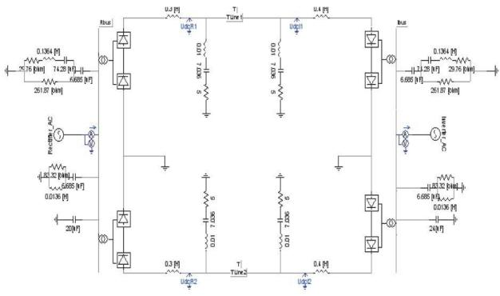  
图1 云广直流电磁暂态模型

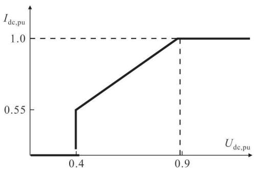  
Fig.1 Electromagnetic transient model of Yun-Guang UHVDC system   
图2 VDCOL特性曲线  
Fig.2 Characteristic curve of VDCOL

电压下降到一定程度时，转为定最小触发角运行，逆变侧采用定电流调节。当逆变侧交流母线电压下降到一定程度时，为防止换相失败，逆变侧采用定最小关断角 $\gamma_{\mathrm{min}} = 5^{\circ}$ 调节，而整流侧仍采用定电流调节。当逆变侧交流系统严重故障时，为防止连续换相失败，逆变侧迅速转为低压限流控制方式，同时整流侧也相应地转为低压限流控制方式。

整流侧定电流控制采用PI控制模式，比例增益为1.0989，积分时间常数为 $0.01092\mathrm{s}$ 。逆变侧定电流控制比例增益为0.63，积分时间常数为 $0.01524\mathrm{s}$ 。定关断角控制比例增益为0.7506，积分时间常数为 $0.0544\mathrm{s}$ 。低压限流环节(VDCOL)特性参数如图2所示。图中， $I_{\mathrm{dc.pu}}$ 、 $U_{\mathrm{dc.pu}}$ 分别为一极直流电流、电压的标么值（ $I_{\mathrm{dc.pu}}$ 的基准电流值为 $3125\mathrm{kA},U_{\mathrm{dc.pu}}$ 的基准电压值为 $800\mathrm{kV})$ 。当 $0.4< U_{\mathrm{dc.pu}} < 0.9$ 时， $I_{\mathrm{dc.pu}}$ 与 $U_{\mathrm{dc.pu}}$ 呈0.9倍比例关系。

# 2 不同控制方式下的系统的动态响应

# 2.1 整流侧采用定电流控制

# 2.1.1 整流侧交流母线三相短路

整流侧交流母线 $0.8\mathrm{s}$ 发生三相短路故障，0.9s将故障清除，各电气量的变化情况如图3所示，图中， $U_{\mathrm{R,pu}}$ 、 $U_{\mathrm{I,pu}}$ 分别为整流侧、逆变侧交流母线电压

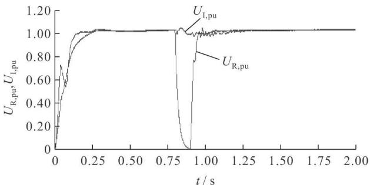  
(a)整流侧和逆变侧交流母线电压有效值

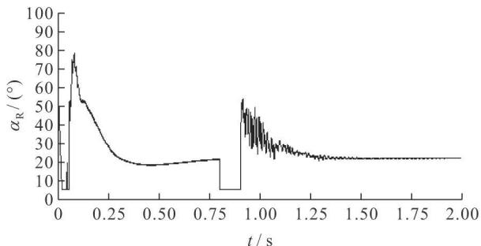  
(b)双极直流线路整流侧触发角

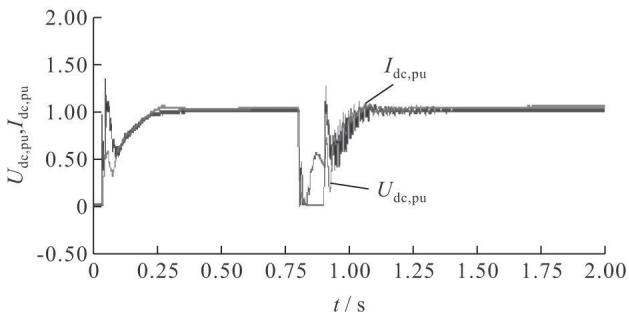  
(c)一极直流电压、电流

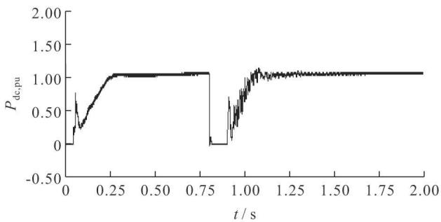  
(d) 一极直流功率   
图3 整流侧换流母线三相短路  
Fig.3 Three-phase short circuit of rectifier bus

有效值的标么值 $(U_{\mathrm{R,pu}}, U_{\mathrm{I,pu}}$ 的基准电压值为525kV); $\alpha_{\mathrm{R}}$ 为整流侧触发角; $P_{\mathrm{dc,pu}}$ 为一极直流功率的标么值 $(P_{\mathrm{dc,pu}}$ 的基准功率值为2500MVA)。故障期间，整流侧交流电压完全消失，定电流调节器减小触发角，以期增大直流电流，触发角受到最小触发角限制，保持在 $5^{\circ}$ 。直流电压和功率将降为0，直流送电暂时中断，大约在故障清除后0.3s逐渐恢复到故障前的水平。

# 2.1.2 逆变侧交流母线单相接地故障

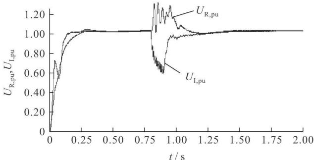  
(a)整流侧和逆变侧交流母线电压有效值

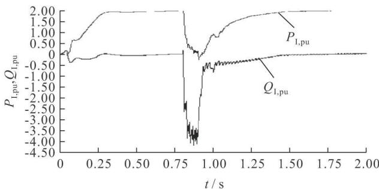  
(b)逆变侧有功、无功功率

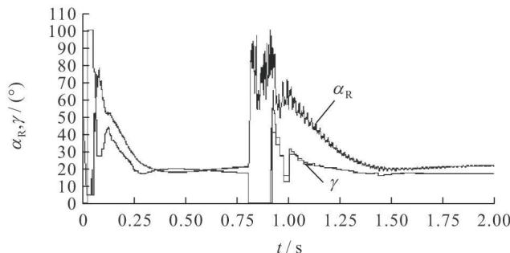  
(c)双极直流路整流侧触发角、逆变侧关断角

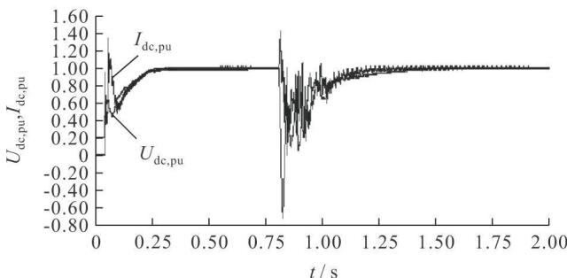  
(d)一极直流电压、电流

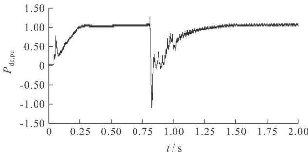  
(e) 一极直流线路功率  
图4 逆变侧交流母线单相金属性接地  
Fig.4 Single-phase metallic short circuit of inverter bus 障, 0.9s 故障清除, 系统相关电气量变化情况如图 4 所示, 图中, $P_{\mathrm{I.pu}}$ 、 $Q_{\mathrm{I.pu}}$ 分别为逆变侧有功、无功功

率标么值 $(P_{\mathrm{I,pu}}, Q_{\mathrm{I,pu}}$ 的基准功率值为 $2500 \mathrm{MVA}$ ）。逆变侧发生短路后，换流母线电压下降，直流电流标么值上升至1.5，换相角增大，关断角 $r^{[8]}$ 的大小可用下列公式计算：

$$
\gamma = \arccos  \left(\frac {\sqrt {2} I _ {\mathrm {d}} X _ {\mathrm {c}} k}{U _ {\mathrm {L}}} + \cos \beta\right); \tag {1}
$$

$$
\beta = \pi - \alpha 。 \tag {2}
$$

式中， $U_{\mathrm{L}}$ 为换流母线电压； $I_{\mathrm{d}}$ 为直流电流； $X_{\mathrm{c}}$ 为换相电抗； $k$ 为换流变压器变比； $\beta$ 为逆变器触发超前角； $\alpha$ 为逆变器触发角。

随着直流电流的增大和换相电压的下降，关断角减小到0，当 $\gamma < \gamma_{\mathrm{min}} = 5^{\circ}$ 时，判定为逆变侧发生换相失败，直流功率输送暂时中断。故障发生后，直流控制系统紧急移相，使整流侧的触发角迅速跨越 $90^{\circ}$ 以抑制过大的短路电流，直流电流随之下降，无功消耗增大。

# 2)经过渡电阻接地

逆变侧交流母线 $0.8\mathrm{s}$ 发生单相金属性接地故障， $0.9\mathrm{s}$ 故障清除，系统相关电气量变化情况如图5所示。逆变侧交流母线单相经过渡电阻接地故障后，逆变侧交流母线电压不对称程度减弱，换相电压过零点偏移不严重，逆变侧未发生换相失败，直流线路上仍有功率输送，只比正常稳态值略有降低。较之金属性接地，逆变侧消耗的无功功率也较小。

# 2.1.3 逆变侧交流母线两相相间金属性短路

逆变侧交流母线 $0.8\mathrm{s}$ 发生两相相间金属性短路， $0.9\mathrm{s}$ 故障清除，系统相关电气量变化情况如图6所示，图中， $U_{\mathrm{a.pu}}$ 、 $U_{\mathrm{b.pu}}$ 、 $U_{\mathrm{c.pu}}$ 为逆变侧交流母线三相电压标么值（其基准电压值为 $300\mathrm{kV}$ ）。故障后，逆变侧三相交流电压不平衡严重，换相电压过零点严重偏移，换相电压有效值下降，直流电流标么值增大到1.6，过大的直流电流使逆变侧换相角增大，相应的关断角 $\gamma$ 下降到0，发生换相失败，直流电压和直流输送功率下降为零。整流侧触发角增大以降低直流电流，使整流站在故障期间从系统吸收大量无功。故障清除后 $0.2\mathrm{s}$ 系统能恢复到正常稳态值。

# 2.2 整流侧采用定功率控制

# 2.2.1 整流侧交流母线三相短路

当整流侧交流母线 $0.8\mathrm{s}$ 发生三相短路故障，持续时间 $0.1\mathrm{s}$ ，各电气量的变化情况如图7所示。故障期间，整流侧交流母线三相电压下降为0，而逆变侧交流母线电压三相对称，故障期间双极直流线路没有发生换相失败，但双极直流线路功率将降为零。故障清除后系统恢复过程中，双极直流电流突增导致发生短时换相失败，大约在故障清除后 $0.3\mathrm{s}$ 才能逐渐恢复到故障前的水平。

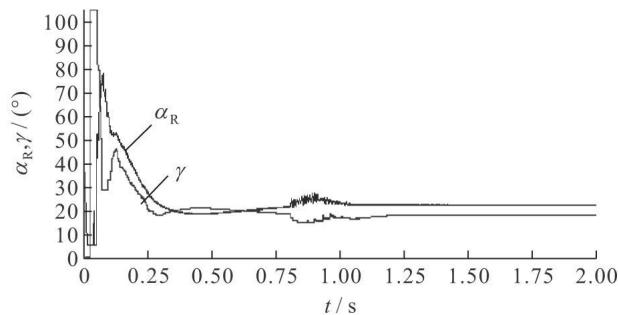  
(a)双极直流路整流侧触发角、逆变侧关断角

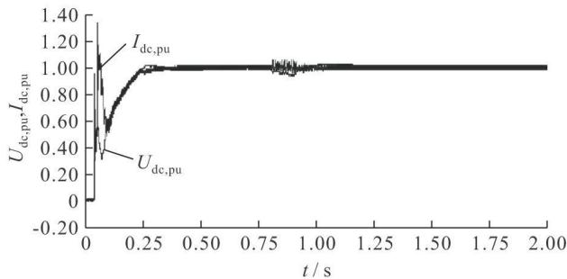  
(b)一极直流电压、电流

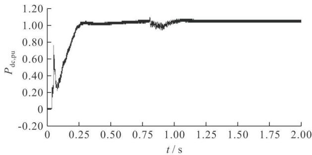  
(c) 一极直流线路功率  
图5 逆变侧交流母线经过渡电阻接地  
Fig.5 Single-phase short circuit by transition resistance of inverter bus

# 2.2.2 逆变侧交流母线单相金属性接地

当逆变侧交流母线 $0.8\mathrm{s}$ 发生单相金属性接地故障，持续时间 $0.1\mathrm{s}$ 后清除，系统相关电气量变化情况如图8所示。由于逆变侧交流母线故障后，逆变站交流母线电压严重不对称，导致双极直流线路发生换相失败。对比定电流控制方式下逆变侧交流母线单相金属性短路时的仿真波形发现，在定功率控制方式下，双极直流线路仍能传输一定的直流功率，但故障清除后系统恢复时间较长，故障清除0.4s后才能逐渐恢复到正常稳态值。

# 3 结论

本文利用PSCAD/EMTDC电磁暂态仿真软件构建了 $\pm 800\mathrm{kV}$ 云广直流输电双极电磁暂态仿真模型，并对整流侧采用定电流控制和定功率控制方式下，交直流系统不同故障类型、不同位置、不同过渡电阻时交流和直流系统的动态响应过程进行了仿真分析，结果表明：

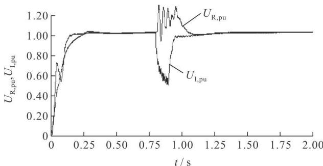

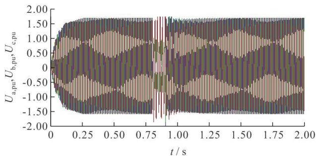  
(a) 整流侧和逆变侧交流母线电压有效值

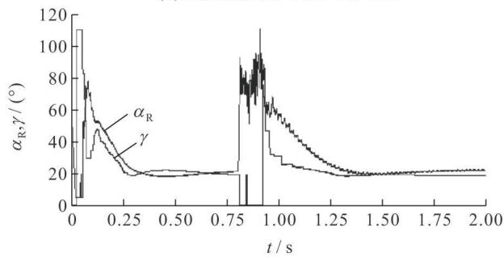  
(b)逆变侧交流母线三相电压   
(c) 双极直流线路整流侧触发角、逆变侧关断角

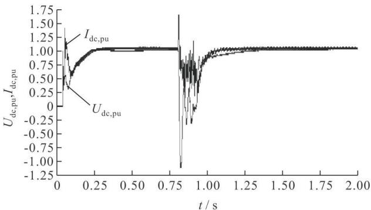

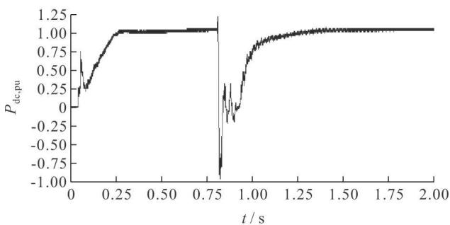  
(d)一极直流线路电压、电流   
(e) 一极直流线路功率  
图6 逆变侧交流母线相间金属性接地  
Fig.6 Single-phase metallic short circuit of inverter bus

a)在整流侧采用定电流控制方式时，当整流侧交流系统发生不同类型的短路故障时，直流输送功

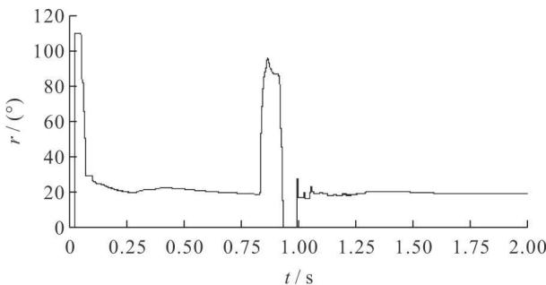  
(a)双极直流逆变侧关断角

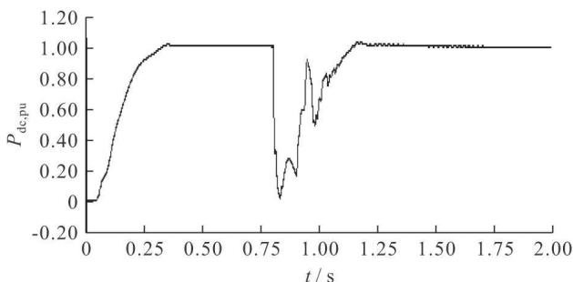  
(b) 一极直流线路功率  
图7 整流侧定功率控制下整流侧三相短路

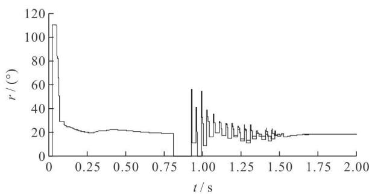  
Fig.7 Three-phase short circuit of rectifier bus under constant power control of rectifier   
(a)双极直流逆变侧关断角

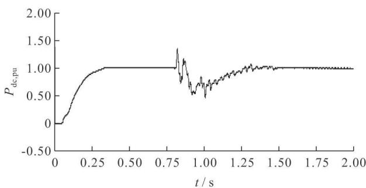  
(b) 一极直流线路功率  
图8 整流侧定功率控制下逆变侧单相金属性接地  
Fig.8 Single-phase metallic short circuit of inverter bus under constant power control of rectifier

率会有不同程度的降低，但直流仍维持运行，不会发生换相失败。故障清除后直流迅速恢复正常运行。

b)在整流侧采用定电流控制方式时，当逆变侧交流系统发生不同类型的金属性短路故障时，故障时交流电压下降比较严重，会导致直流系统换相失败，但故障清除后，直流系统均能够恢复正常运行。

c)在整流侧采用定功率控制时，当整流侧交流母线发生不同类型的短路故障时，系统各电气量的变化都比整流侧采用定电流控制时缓慢。故障清除后系统恢复过程中，直流电流的突增会导致短时换相失败，但仍能逐渐恢复到正常水平。  
d)在整流侧采用定功率控制时，当逆变侧交流系统发生不同类型的短路故障时，故障期间会导致换相失败，但故障清除后系统仍会逐渐恢复到正常水平。

# 参考文献

[1] 潘丽珠, 韩民晓, 文 俊, 等. 基于 EMTDC 的 HVDC 极控制的建模与仿真[J]. 高电压技术, 2006, 32(9): 22-24, 28.  
PAN Li-zhu, HAN Min-xiao, WEN Jun, et al. Modeling and simulation of HVDC control system based on EMTDC[J]. High Voltage Engineering, 2006, 32(9): 22-24, 28.   
[2] 董 俊, 束洪春, 唐 岚, 等. 2010 年云南电网的稳定运行和控制问题[J]. 电网技术, 2005, 29(10): 20-24, 29.  
DONG Jun, SHU Hong-chun, TANG Lan, et al. Stable operation and control of Yunnan power grid in 2010[J]. Power System Technology, 2005, 29(10): 20-24, 29.   
[3] 朱韬析, 武诚, 王超. 交流系统故障对直流系统的影响及改进建议[J]. 电力系统自动化, 2009, 33(1): 93-98.  
ZHU Tao-xi, WU Cheng, WANG Chao. Influence of AC system fault on HVDC system and improvement suggestions[J]. Automation of Electric Power Systems, 2009, 33(1): 93-98.   
[4]齐旭，曾德文，史大军，等.特高压直流输电对系统安全稳定影响研究[J].电网技术，2006,30(2)：1-6.  
QI Xu, ZENG De-wen, SHI Da-jun, et al. Study on impacts of UHVDC transmission on power system stability[J].Power System Technology, 2006, 30(2): 1-6.   
[5] 李爱民, 蔡泽祥, 任达勇, 等. 高压直流输电的控制与保护对线路故障的动态响应特性分析分析[J]. 电力系统自动化, 2009, 33(1):72-75, 93.  
LI Ai-min, CAI Ze-xiang, REN Da-yong, et al. Analysis on the dynamic performance characteristics of HVDC control and protections for the HVDC line faults [J]. Automation of Electric Power Systems, 2009, 33(1): 72-75, 93.   
[6] 马为民. $\pm 800\mathrm{kV}$ 特高压直流系统换流器控制[J].高电压技术，2006，32(9)：71-74.  
MA Wei-min. Converter control in $\pm 800\mathrm{kV}$ UHVDC transmission system[J]. High Voltage Engineering, 2006, 32 (9): 71-74.   
[7] 陶瑜, 龙英, 韩伟. 高压直流输电控制保护技术的发展与现状[J]. 高电压技术, 2004, 30 (11): 8-10.  
TAO Yu, LONG Ying, HAN Wei. Status and development of HVDC control and protection[J]. High Voltage Engineering, 2004, 30 (11): 8-10.   
[8] 徐政. 交直流电力系统动态行为分析[M]. 北京：机械工业出版社，2004.  
[9]周长春，徐政.直流输电准稳态模型有效性的仿真验证[J].中国电机工程学报，2003，23(12)：33-36.  
ZHOU Chang-chun, XU Zheng. Simulation validity test of the CSEE.   
2003, 23(12): 33-36.

[10] Szechman M, Wess T, Thio C V. First benchmark model for HVDC control studies[J]. Electra, 1991, 135(4): 54-67.   
[11] 李兴源. 高压直流输电系统的运行和控制[M]. 北京：科学技术出版社，1998.  
[12] 黄志岭，田杰. 基于详细直流控制系统模型的EMTDC仿真[J].电力系统自动化，2008,32(2)：45-48.  
HUANG Zhi-ling, TIAN Jie. EMTDC simulation of based on detailed control model of HVDC system[J]. Automation of E-electric Power Systems, 2008, 32(2): 45-48.   
[13] 任震，欧开健，荆勇，等. 基于PSCAD/EMTDC软件的直流输电系统数字仿真[J].电力自动化设备，2002，22（9）：11-12.  
REN Zhen, OU Kai-jian, JING Yong, et al. Digital simulation of HVDC transmission system based on PSCAD/EMTDC[J]. Electric Power Automation Equipment, 2002, 22(9): 11-12.   
[14] 董 俊, 束洪春, 司大军, 等. 特高压远距离大容量云电送粤中的稳定问题研究[J]. 电网技术, 2006, 30(24): 10-15.  
DONG Jun, SHU Hong-chun, SI Da-jun, et al. Study on several stability problems in UHVDC long distance bulk power transmission from Yunnan province to Guangdong province [J]. Power System Technology, 2006, 30(24): 10-15.   
[15] 林良真，叶林. 电磁暂态分析软件包 PSCAD/EMTDC[J]. 电网技术, 2000, 24(1):65-66.  
LIN Liang zhen, YE Lin. An introduction to PSCAD/EMTDC [J]. Power System Technology, 2000, 24(1): 65-66.   
[16] Manitoba HVDC Research Centre Inc. PSCAD user's guide [R]. Winnipeg, Canada: Manitoba HVDC Research Centre Inc, 2003.

  
LIU Ke-zhen

  
Ph-D candidate   
Associate professor

  
SHU Hong-chun Ph.D. Professor   
SUN Shi-yun Ph.DCandidate

刘可真

1974一，女，博士生，副教授

研究方向为特高压直流输电的保护与控制

E-mail: liukzh@sina.com.cn

束洪春(通讯作者)

1961一，男，博士，教授，博导

主要研究新型继电保护与故障测距、电力工程信号处理应用、电力系统保护和控制等

E-mail: kmshe@sina.com

孙士云

1981一，女，博士生，讲师

研究方向为交直流电力系统动态分析

E-mail: sunshiyun81@yahoo.com.cn