# Efficient modeling of parallel counterpoise wires using an FDTD-based transmission line approach

Naiara Duarte a,* , Rafael Alipio a , Felipe Vasconcellos b , Farhad Rachidi c

a Department of Electrical Engineering, Federal Center of Technological Education of Minas Gerais (CEFET-MG), Belo Horizonte, Brazil   
b Department of Electrical and Computer Engineering, Federal University of Bahia, Salvador, Brazil   
c EMC Laboratory, Swiss Federal Inst. Of Technology (EPFL), Lausanne, Switzerland

# A R T I C L E I N F O

# Keywords:

Counterpoise wires

Grounding modeling

Finite difference time domain (FDTD)

Transmission line theory

Buried bare coupled conductors

Lightning performance

# A B S T R A C T

This paper presents an efficient modeling approach for parallel counterpoise wires used in the tower-footing grounding systems of high-voltage transmission lines. The proposed method is based on transmission line theory, with the governing equations solved using the Finite Difference Time Domain (FDTD) technique. The formulation incorporates frequency-dependent effects in both longitudinal impedance and shunt admittance, and its accuracy is validated through comparison with a rigorous electromagnetic model. The results show excellent agreement between the models, with deviations below 5 % across all analyzed cases, becoming negligible as soil resistivity increases. It was also observed that increasing the separation distance between the counterpoise wires leads to a reduction in both the Ground Potential Rise (GPR) and impulse impedance, although this reduction is not particularly significant, ranging from approximately 10 % to 13 % for the analyzed soil resistivities when the separation distance is increased fourfold. A novel finding of this study is that the effective length of counterpoise wires is independent of the separation distance between them, which simplifies the design process for transmission lines with varying right-of-way widths. Additionally, the developed formulation allows for the future incorporation of nonlinear effects, such as soil ionization, providing an accurate and computationally efficient tool for analyzing and designing the lightning response of grounding systems in high-voltage transmission lines.

# 1. Introduction

The performance of high-voltage transmission lines (TLs) due to direct lightning strikes to the tower or shield wires is markedly influenced by the tower-footing grounding system, which impacts the amplitude and steepness of the resulting overvoltages across line insulators [1]. The tower-footing grounding system may consist of parallel grounding rods in low-resistivity soils [2] or linear counterpoise wires in moderate or high-resistivity soils [3]. As shown in Fig. 1, the counterpoise wires originate from the tower base and run in parallel, with a separation distance D that typically depends on the right-of-way width of the TL. Accurate modeling of the tower-footing grounding electrodes is essential not only for obtaining key parameters, such as grounding resistance and impulse impedance, to simulate the line’s response to lightning currents using electromagnetic transient (EMT) platforms—such as ATP, EMTP, and PSCAD/EMTDC [4]—but also during the design stage to determine critical quantities, such as the effective length.

Different approaches are found in the literature for modeling grounding electrodes, based on circuit theory [5,6], transmission line theory [7,8], and electromagnetic field theory [9–11]. A review of the literature reveals a limited number of studies focusing specifically on realistic configurations of parallel counterpoise wires, such as that shown in Fig. 1. Most of these studies rely on electromagnetic field-based methods, which involve higher computational costs and greater implementation complexity, especially when modeling long counterpoise wires [12–14].

Transmission line theory is a widely adopted approach for modeling single horizontal grounding electrodes, offering a balance between accuracy and computational efficiency compared to full-wave modeling techniques. In this paper, the use of transmission line theory is extended to model electromagnetically coupled buried bare wires, reflecting realistic configurations of tower-footing grounding systems composed of counterpoise wires. The resulting equations are solved using the Finite Difference Time Domain (FDTD) technique, which allows the transient response to be obtained directly in the time domain, capturing both

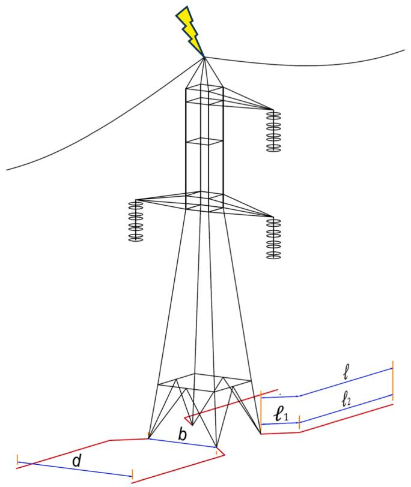  
Fig. 1. Tower-footing grounding system of a high-voltage transmission line composed of parallel counterpoise wires.

spatial and temporal variations. This approach enables a wideband characterization of the grounding system and avoids the need for domain transformations, making it particularly suitable for the analysis presented in this work.

This paper presents two main contributions compared to previously published studies. First, it introduces a formulation based on the FDTD approach for solving the transmission line equations applied to electromagnetically coupled buried bare conductors, incorporating frequency-dependent effects in both longitudinal impedance and shunt admittance. To the best of the authors’ knowledge, this is the first time such a formulation has been presented in the literature. Second, using the proposed approach, a sensitivity analysis is conducted for configurations composed of parallel counterpoise wires, leading to novel findings, such as the independence of the effective length from the separation distance between the counterpoise wires.

It is worth noting that this paper is an extended version of the study presented at the ICLPS-SIPDA 2023 Conference [15], expanding the proposed formulation from a single horizontal buried bare conductor to multi-conductor systems.

This paper is organized as follows. Section 2 presents the main assumptions adopted for applying transmission line theory to model parallel buried bare conductors, along with the details of the computation of the line parameters. Section 3 describes the modeling of the frequency dependence of the soil’s electrical parameters through a rational approximation. Section 4 outlines the implementation of the FDTD technique for solving the transmission line equations, addressing the electromagnetic coupling between buried conductors and incorporating frequency-dependent effects in both longitudinal impedance and shunt admittance. Section 5 describes the geometries analyzed in this study. In Section $^ { 6 , }$ the obtained results are presented in terms of Ground Potential Rise (GPR), impulse impedance $\left( Z _ { P } \right)$ , impulse coefficient $\left( I _ { C } \right)$ , and effective length $( \ell _ { E F } ) _ { i }$ , along with a comparison between the results obtained using the proposed approach and those from an electromagnetic field-based method. Finally, Section 7 summarizes the paper and

highlights the main findings.

# 2. Modeling of parallel counterpoise wires based on the transmission line theory

Transmission line theory, commonly used for modeling single horizontal grounding electrodes, can also be extended to the electrode arrangement of TL tower grounding systems, such as the one shown in Fig. 1, provided that certain assumptions are made. First, due to the problem’s symmetry, only a pair of counterpoise wires on one side of the tower needs to be considered. Second, this pair of wires is assumed to be parallel to each other, effectively representing a two-conductor line of bare conductors buried in the ground. Finally, this two-conductor line is modeled using an equivalent uniform transmission line representation, governed by the following equations [16]:

$$
\frac {d \boldsymbol {V}}{d x} = - \left(\boldsymbol {Z} _ {i} + j \omega \boldsymbol {L}\right) \boldsymbol {I} = - \boldsymbol {Z} \boldsymbol {I} \tag {1}
$$

$$
\frac {d \boldsymbol {I}}{d x} = - (\boldsymbol {G} + j \omega \boldsymbol {C}) \boldsymbol {V} = - \boldsymbol {Y} \boldsymbol {V} \tag {2}
$$

where V and I are voltage and current vectors of size $2 \times 1 , Z _ { i }$ and L are 2 $\times 2$ matrices representing the per-unit-length internal impedance of the conductors and the per-unit-length external inductance, respectively, G and C are $2 \ \times \ 2$ matrices representing the per-unit-length shunt conductance and capacitance, and ω is the angular frequency. Z and Y correspond to the longitudinal impedance and shunt admittance matrices per unit length, respectively.

In the following, the computation of the matrices G, C, L and $\mathbf { \delta } _ { Z _ { i } }$ is detailed. In this process, two parallel straight wires separated by an equivalent distance D are assumed. To apply this methodology to the configuration shown in Fig. 1— where each counterpoise includes a slanted segment from the tower footing to the edge of the right-of-way, followed by a straight section — the approximation proposed in [17] can be adopted. Considering the distance between the tower feet $^ { b , }$ the separation between the counterpoise wires in the right-of-way region d, and the lengths $\ell _ { 1 }$ and $\boldsymbol { \mathscr { l } } _ { 2 }$ shown in Fig. 1, an equivalent average distance between the two conductors can be defined as $\begin{array} { r } { D = \frac { d _ { 1 } \ell _ { 1 } + d _ { 2 } \ell _ { 2 } } { \ell } . } \end{array}$ . This approximation was shown in [17] to provide excellent accuracy when modeling tower-footing grounding arrangements such as the one depicted in Fig. 1.

Matrix G is the inverse of the shunt resistance matrix R whose main diagonal elements, $R _ { S } ,$ correspond to the shunt resistance of each counterpoise wire with respect to remote earth, while the off-diagonal elements, $R _ { M } ,$ , are the mutual resistance between the two wires. The diagonal elements are computed using Sunde’s equation for determining the grounding resistance of a buried bare wire parallel to the Earth’s surface, given by [18]:

$$
R _ {S} = \frac {1}{\pi \sigma_ {g}} \left[ \ln \left(\frac {2 \ell}{\sqrt {2 h r}}\right) - 1 \right] \tag {3}
$$

where $\sigma _ { g }$ is the ground conductivity, l is the total counterpoise length, h is the burial depth, and r is the counterpoise radius.

The mutual shunt resistance $R _ { M }$ is computed using a formulation also proposed by Sunde, which considers two parallel wires buried at depth h and separated by a distance D, given by:

$$
R _ {M} = \frac {1}{\pi \sigma_ {g}} \left[ \ln \left(\frac {2 \ell}{\sqrt {D \cdot D ^ {\prime}}}\right) - 1 \right] \tag {4}
$$

where D is the separation between the wires, $D ^ { \prime } = \sqrt { 4 h ^ { 2 } + D ^ { 2 } }$ is the distance from one wire to the image of the other, and $\sqrt { D \cdot D }$ is referred to as the effective separation. Once R is determined with (3) and (4), the shunt conductance and shunt capacitance matrices per-unit-length are simply calculated as ${ \pmb G } = { \pmb R } ^ { - 1 }$ and ${ \pmb { C } } = \left( \varepsilon _ { g } / \sigma _ { g } \right) { \pmb { G } }$ [16]. The shunt

admittance matrix is thus given by:

$$
\boldsymbol {Y} = \boldsymbol {G} + j \omega \boldsymbol {C} \tag {5}
$$

Eq. (5) can be expressed in terms of the soil immittance, $\kappa ,$ as shown in (6), and the geometrical matrix, ${ \pmb { K } } _ { g e o ; }$ , as defined in (7).

$$
\boldsymbol {Y} = \left(\sigma_ {\mathrm {g}} + j \omega \varepsilon_ {\mathrm {g}}\right) \boldsymbol {K} _ {\text {g e o}} = \kappa \times \boldsymbol {K} _ {\text {g e o}} \tag {6}
$$

$$
\boldsymbol {K} _ {\text {g e o}} = \left[ \begin{array}{l l} \frac {1}{\pi} \left[ \ln \left(\frac {2 /}{\sqrt {2 h r}}\right) - 1 \right] & \frac {1}{\pi} \left[ \ln \left(\frac {2 /}{\sqrt {D \cdot D}}\right) - 1 \right] \\ \frac {1}{\pi} \left[ \ln \left(\frac {2 /}{\sqrt {D \cdot D}}\right) - 1 \right] & \frac {1}{\pi} \left[ \ln \left(\frac {2 /}{\sqrt {2 h r}}\right) - 1 \right] \end{array} \right] ^ {- 1} \tag {7}
$$

There are a few expressions available to compute the external (selfpartial) inductance, ${ \cal L } _ { S } ,$ of a buried horizontal bare conductor [19]. In this paper, the expression derived by King [20], which applies image theory to account for the effects of the earth’s surface, is adopted. This expression has been shown to produce results that align more closely with a full-wave EM model when modeling horizontal grounding electrodes [21] and is given by:

$$
L _ {S} = \frac {\mu_ {0}}{2 \pi} \left[ \ln \left(\frac {2 \ell}{\sqrt {2 h r}}\right) - 1 \right] \tag {8}
$$

where $\mu _ { 0 }$ is the vacuum permeability. To compute the mutual inductance, ${ \cal L } _ { M } ,$ , between the counterpoise wires, a similar approach to that used for computing the mutual resistance is adopted, leading to:

$$
L _ {M} = \frac {\mu_ {0}}{2 \pi} \left[ \ln \left(\frac {2 \ell}{\sqrt {D \cdot D ^ {\prime}}}\right) - 1 \right] \tag {9}
$$

Finally, the internal impedance $\mathbf { \delta } _ { Z _ { i } }$ in (1) is a diagonal matrix whose elements are computed using the exact solution for the internal impedance of a solid cylindrical conductor [22]. The longitudinal impedance matrix is then obtained as $\begin{array} { r } { \begin{array} { r } { \pmb { Z } = \pmb { Z } _ { i } + \pmb { j } \omega \pmb { L } } \end{array} } \end{array}$ . Once the per-unit-length matrices of the two-conductor buried line are calculated, the next step is to solve the transmission line Eqs. (1) and (2). This is accomplished using an FDTD approach, which is detailed in Section 4 and constitutes the main contribution of this work.

# 3. Modeling of the soil frequency dependence of electrical parameters through rational approximation

To account for the dispersive characteristics of the soil’s electrical parameters employing the FDTD solution method, obtaining an accurate representation of the soil immittance is essential. Based on the Alipio-Visacro model [23], the frequency dependence of soil conductivity and permittivity can be described by the following general relations

$$
\sigma_ {g} (f) = \sigma_ {D C} + K _ {\sigma} f ^ {\xi} \tag {10}
$$

$$
\varepsilon_ {g} (f) = \varepsilon_ {\infty} ^ {\prime} + K _ {\varepsilon} f ^ {\xi - 1} \tag {11}
$$

where $\sigma _ { D C }$ is the DC soil conductivity, $\varepsilon _ { \infty } ^ { ' }$ is the soil permittivity at high frequency and f is the frequency. The constants $K _ { \sigma } , K _ { \varepsilon }$ and ξ are related to each other through the Kramers-Kronig’s relationships as detailed in [23]. In this context, the soil immittance, κ, can be calculated in terms of (10) and (11) as follows [24]

$$
\kappa (j \omega) = \sigma_ {D C} + j \omega \varepsilon_ {\infty} ^ {\prime} + j \omega \left(\frac {K _ {\sigma} f ^ {\xi}}{j \omega} + K _ {\varepsilon} f ^ {\xi - 1}\right) \tag {12}
$$

As presented in [25], the soil immittance, as given in (12), can be approximated by a pole-residue representation. Hence, κ(jω) can be expressed in the Laplace domain as

$$
\kappa (s) = \sigma_ {D C} + s \varepsilon_ {\infty} ^ {\prime} + s \sum_ {j = 1} ^ {N} \frac {r _ {j}}{s - p _ {j}} = \sigma_ {D C} + s \varepsilon_ {\infty} ^ {\prime} + s \eta_ {g} (s) \tag {13}
$$

where s is the Laplace transform variable, and $\eta _ { g } ( s )$ accounts for the frequency dependence of the soil immittance.

Based on the Alipio-Visacro soil model, it was demonstrated in [25] that $\eta _ { g } ( s )$ can be expressed through a universal set of poles, independent of the DC soil conductivity. The corresponding residues are a straightforward function of $\sigma _ { D C } .$ . Moreover, Eq. (13) has a suitable inverse Laplace transform, allowing for its straightforward incorporation into the FDTD formulation, as presented in the following section.

# 4. FDTD solutions for transmission line equations for multiconductor buried bare wire systems considering soil dispersive effects

The application of the FDTD method to solve the transmission line equations for a buried bare wire was previously presented in [15], where the dispersive soil was accurately modeled using the Alipio-Visacro model [23]. In this section, we extend this approach to a more general case, considering multiconductor systems of buried bare wires.

The FDTD numerical method for solving the telegrapher’s equations for frequency-dependent, lossy multiconductor systems of buried bare wires closely follows the approach used for the case of a single-wire buried line, with the main difference being the use of matrix notation [16]. We also incorporate in our approach the recursive convolution technique to enhance computational efficiency, avoiding the need to store previous values in the convolution process [26].

Considering the frequency-dependent internal losses of the line conductor and the dispersive nature of the soil’s electrical parameters, the transmission line equations in the time domain can be expressed as follows:

$$
\frac {\partial \boldsymbol {V} (\boldsymbol {x} , t)}{\partial \boldsymbol {x}} = - \boldsymbol {L} \frac {\partial \boldsymbol {I} (\boldsymbol {x} , t)}{\partial t} - \boldsymbol {\xi} _ {i} (t) * \frac {\partial \boldsymbol {I} (\boldsymbol {x} , t)}{\partial t} \tag {14}
$$

$$
\frac {\partial \boldsymbol {I} (\boldsymbol {x} , t)}{\partial x} = - \boldsymbol {K} _ {\text {g e o}} \sigma_ {D C} \boldsymbol {V} (\boldsymbol {x}, t) - \boldsymbol {K} _ {\text {g e o}} c _ {\infty} ^ {\prime} \frac {\partial \boldsymbol {V} (\boldsymbol {x} , t)}{\partial t} - \boldsymbol {K} _ {\text {g e o}} \eta_ {g} (t) * \frac {\partial \boldsymbol {V} (\boldsymbol {x} , t)}{\partial t} \tag {15}
$$

where V and I are $n \times 1$ column vectors representing the n conductor voltages and currents in the time domain, respectively, and L is the perunit-length inductance matrix. $\zeta _ { i } ( t )$ is the so-called transient internal impedance matrix, whose main diagonal elements, $\zeta _ { i _ { S } } ( t ) ,$ , are defined as in (16). This impedance function can be approximated as a sum of exponentials, using the vector fitting technique [27]. In this approach, $\beta _ { j }$ and $b _ { j }$ correspond to the $j { \cdot } \mathrm { t h }$ pole and residue, respectively, while N represents the approximation order. Finally, $\eta _ { g } ( t )$ is the transient soil immittance, fitted as a sum of $N = 1 9$ exponentials using the vector fitting technique [25,27], where $p _ { j }$ and $r _ { j }$ are, respectively, the j-th pole and residue of the rational approximation of $\eta _ { g } ( s )$ , as detailed in (17).

$$
\zeta_ {i _ {S}} (t) = \sum_ {j = 1} ^ {N} b _ {j} e ^ {\beta_ {j} t} \tag {16}
$$

$$
\eta_ {g} (t) = \sum_ {j = 1} ^ {N} r _ {j} e ^ {p _ {j} t} \tag {17}
$$

Considering Eqs. (18–20), the second transmission line $\operatorname { E q } .$ . (15) in the time domain can be rewritten in terms of the per-unit-length conductance, ${ \bf { \cal G } } _ { 0 } ,$ , capacitance, $c _ { \infty } ,$ , and transient ground admittance, ${ \pmb Y } _ { F D } ( t )$ , matrices, as given in (21).

$$
\boldsymbol {G} _ {0} = \boldsymbol {K} _ {\text {g e o}} \sigma_ {D C} \tag {18}
$$

$$
C _ {\infty} = K _ {g e o} \epsilon_ {\infty} ^ {\prime} \tag {19}
$$

$$
\mathbf {Y} _ {F D} (t) = \mathbf {K} _ {\text {g e o}} \eta_ {g} (t) \tag {20}
$$

$$
\frac {\partial \boldsymbol {I} (\boldsymbol {x} , t)}{\partial x} = - \boldsymbol {G} _ {0} \boldsymbol {V} (\boldsymbol {x}, t) - \boldsymbol {C} _ {\infty} \frac {\partial \boldsymbol {V} (\boldsymbol {x} , t)}{\partial t} - \boldsymbol {Y} _ {F D} (t) * \frac {\partial \boldsymbol {V} (\boldsymbol {x} , t)}{\partial t} \tag {21}
$$

The transient ground admittance matrix represents the frequency dependence of the soil’s electrical parameters in the calculation of the transverse admittance. Therefore, by neglecting it, the dispersive nature of the soil is also disregarded.

By applying the FDTD method to solve Eqs. (14) and (21), the update equations for currents and voltages along the conductors of the multiconductor system are as follows

$$
\begin{array}{l} \boldsymbol {I} _ {k} ^ {n + 3 / 2} = \boldsymbol {I} _ {k} ^ {n + 1 / 2} - \left[ \boldsymbol {L} + \sum_ {j = 1} ^ {N} \left(\frac {\boldsymbol {b} _ {j}}{\beta_ {j}}\right) \left(e ^ {\beta_ {j} \Delta t} - \mathbf {1} _ {n}\right) \right] ^ {- 1} \\ \times \left[ \frac {\Delta t}{\Delta x} \left(\mathbf {V} _ {k + 1} ^ {n + 1} - \mathbf {V} _ {k} ^ {n + 1}\right) + \sum_ {j = 1} ^ {N} \boldsymbol {\Phi} _ {k j} ^ {n + 1 / 2} \right] \tag {22} \\ \end{array}
$$

$$
\boldsymbol {\Phi} _ {k, j} ^ {n + 1 / 2} = \left(\frac {\boldsymbol {b} _ {j}}{\beta_ {j}}\right) e ^ {\beta_ {j} \Delta t} \left(e ^ {\beta_ {j} \Delta t} - \mathbf {1} _ {n}\right) \left(\boldsymbol {I} _ {k} ^ {n + 1 / 2} - \boldsymbol {I} _ {k} ^ {n - 1 / 2}\right) + e ^ {\beta_ {j} \Delta t} \boldsymbol {\Phi} _ {k, j} ^ {n - 1 / 2} \tag {23}
$$

for $k = 1 , \cdots , N D X . \ \mathbf { 1 } _ { n }$ denotes the $n \times n$ identity matrix.

$$
\begin{array}{l} \boldsymbol {V} _ {k} ^ {n + 1} = \left[ \boldsymbol {G} _ {0} \Delta t + 2 \boldsymbol {C} _ {\infty} + 2 \boldsymbol {K} _ {g e o} \sum_ {j = 1} ^ {N} \left(\frac {r _ {j}}{p _ {j}}\right) \left(e ^ {p _ {j} \Delta t} - 1\right) \right] ^ {- 1} \\ \times \left\{\left[ - \boldsymbol {G} _ {0} \Delta t + 2 \boldsymbol {C} _ {\infty} + 2 \boldsymbol {K} _ {\text {g e o}} \sum_ {j = 1} ^ {N} \left(\frac {r _ {j}}{p _ {j}}\right) \left(e ^ {p _ {j} \Delta t} - 1\right) \right] \right. \tag {24} \\ \boldsymbol {V} _ {k} ^ {n} - 2 \frac {\Delta t}{\Delta x} \left(\boldsymbol {I} _ {k} ^ {n + 1 / 2} - \boldsymbol {I} _ {k - 1} ^ {n + 1 / 2}\right) - 2 \boldsymbol {K} _ {g e o} \sum_ {j = 1} ^ {N} \boldsymbol {\psi} _ {k j} ^ {n + 1 / 2} \Biggr \} \\ \end{array}
$$

$$
\boldsymbol {\psi} _ {k, j} ^ {n} = \left(\frac {r _ {j}}{p _ {j}}\right) e ^ {p _ {j} \Delta t} \left(e ^ {p _ {j} \Delta t} - 1\right) \left(\boldsymbol {V} _ {k} ^ {n} - \boldsymbol {V} _ {k} ^ {n - 1}\right) + e ^ {p _ {j} \Delta t} \boldsymbol {\psi} _ {k, j} ^ {n - 1} \tag {25}
$$

for $k = 2 , \cdots , N D X .$

Considering resistive terminations, the terminal conditions of buried bare wires in multiconductor systems are modeled using Thevenin equivalents [16]. The terminal voltage update equations can be readily derived as follows:

$$
\begin{array}{l} \boldsymbol {V} _ {1} ^ {n + 1} = \left[ \boldsymbol {G} _ {0} \Delta t + 2 \boldsymbol {C} _ {\infty} + 2 \boldsymbol {K} _ {g e o} \sum_ {j = 1} ^ {N} \left(\frac {r _ {j}}{p _ {j}}\right) \left(e ^ {p _ {j} \Delta t} - 1\right) + 2 \frac {\Delta t}{\Delta x} \boldsymbol {R} _ {S} ^ {- 1} \right] ^ {- 1} \\ \times \left\{\left[ - \boldsymbol {G} _ {0} \Delta t + 2 \boldsymbol {C} _ {\infty} + 2 \boldsymbol {K} _ {\text {g e o}} \sum_ {j = 1} ^ {N} \left(\frac {r _ {j}}{p _ {j}}\right) \left(e ^ {p _ {j} \Delta t} - 1\right) - 2 \frac {\Delta t}{\Delta x} \boldsymbol {R} _ {S} ^ {- 1} \right] \right. \tag {26} \\ \left. \boldsymbol {V} _ {1} ^ {n} - 4 \frac {\Delta t}{\Delta x} \boldsymbol {I} _ {1} ^ {n + 1 / 2} + 2 \frac {\Delta t}{\Delta x} \boldsymbol {R} _ {S} ^ {- 1} \left(\boldsymbol {V} _ {S} ^ {n + 1} + \boldsymbol {V} _ {S} ^ {n}\right) - 2 \boldsymbol {K} _ {\text {g e o}} \sum_ {j = 1} ^ {N} \boldsymbol {\psi} _ {k, j} ^ {n} \right\} \\ \end{array}
$$

$$
\begin{array}{l} \boldsymbol {V} _ {N D X + 1} ^ {n + 1} = \left[ \boldsymbol {G} _ {0} \Delta t + 2 \boldsymbol {C} _ {\infty} + 2 \boldsymbol {K} _ {g e o} \sum_ {j = 1} ^ {N} \left(\frac {r _ {j}}{p _ {j}}\right) \left(e ^ {p _ {j} \Delta t} - 1\right) + 2 \frac {\Delta t}{\Delta x} \boldsymbol {R} _ {L} ^ {- 1} \right] ^ {- 1} \\ \times \left\{\left[ - \boldsymbol {G} _ {0} \Delta t + 2 \boldsymbol {C} _ {\infty} + 2 \boldsymbol {K} _ {\text {g e o}} \sum_ {j = 1} ^ {N} \left(\frac {r _ {j}}{p _ {j}}\right) \left(e ^ {p _ {j} \Delta t} - 1\right) - 2 \frac {\Delta t}{\Delta x} \boldsymbol {R} _ {L} ^ {- 1} \right] \right. \tag {27} \\ \left. \boldsymbol {V} _ {N D X + 1} ^ {n} + 4 \frac {\Delta t}{\Delta x} \boldsymbol {I} _ {N D X} ^ {n + 1 / 2} - 2 \boldsymbol {K} _ {g e o} \sum_ {j = 1} ^ {N} \boldsymbol {\psi} _ {k, j} ^ {n} \right\} \\ \end{array}
$$

where $\pmb { R } _ { S }$ and $\pmb { R } _ { L }$ are the source and load resistance matrices, respectively, and $\pmb { V _ { S } }$ is the voltage source matrix. Given Eqs. (26) and (27), we can use (25) and substitute $\psi _ { k , j } ^ { n } = \psi _ { 1 , j } ^ { n }$ j and $\psi _ { k , j } ^ { n } = \psi _ { N D X + 1 , j } ^ { n } ,$ respectively.

In applications such as grounding systems, where a current source is typically injected at the sending end of the conductor instead of a voltage source, the equation for $\pmb { V } _ { 1 } ^ { n + 1 }$ in terms of the current source

matrix ${ \cal I } _ { S } ,$ is given by

$$
\begin{array}{l} \boldsymbol {V} _ {1} ^ {n + 1} = \left[ \boldsymbol {G} _ {0} \Delta t + 2 \boldsymbol {C} _ {\infty} + 2 \boldsymbol {K} _ {g e o} \sum_ {j = 1} ^ {N} \left(\frac {\boldsymbol {r} _ {j}}{p _ {j}}\right) \left(e ^ {p _ {j} \Delta t} - 1\right) \right] ^ {- 1} \\ \times \left\{\left[ - \boldsymbol {G} _ {0} \Delta t + 2 \boldsymbol {C} _ {\infty} + 2 \boldsymbol {K} _ {\text {g e o}} \sum_ {j = 1} ^ {N} \left(\frac {r _ {j}}{p _ {j}}\right) \left(e ^ {p _ {j} \Delta t} - 1\right) \right] \right. \tag {28} \\ \pmb {V} _ {1} ^ {n} - 4 \frac {\Delta t}{\Delta x} \left(\pmb {I} _ {1} ^ {n + 1 / 2} - \pmb {I} _ {S} ^ {n + 1 / 2}\right) - 2 \pmb {K} _ {g e o} \sum_ {j = 1} ^ {N} \pmb {\psi} _ {k, j} ^ {n} \Biggr \} \\ \end{array}
$$

# 5. Case studies

In this study, a grounding arrangement consisting of two parallel counterpoise wires, each buried at a depth of 0.8 m with a diameter of 9.525 mm, is evaluated. The wire length (l ) varies from 10 m to 100 m, while three distinct separations (D) between the counterpoise wires, 10 m, 20 m, and 40 ${ \mathfrak { m } } ,$ are considered. These separation distances reflect a range of right-of-way widths commonly associated with high-voltage transmission lines, which typically increase with the line voltage level.

In assessing the lightning performance of overhead transmission lines, the response to first return stroke currents from downward negative flashes is particularly relevant [28]. The simulations in this study employ the current waveform shown in Fig. 2, which is modeled as a combination of Heidler’s functions, as detailed in [29]. This approach closely replicates the median parameters of first return strokes measured at Mount San Salvatore station [30]. The waveform is characterized by a peak amplitude of 31 kA and a virtual front time of $3 . 8 \mu \mathrm { s } ,$ , defined as the interval between 30 % and 90 % of the peak amplitude, divided by 0.6.

The simulations focus on key quantities that characterize the impulse response of grounding electrodes, which are essential for evaluating the lightning performance of transmission lines. These quantities include the Ground Potential Rise (GPR), the impulse impedance $( Z _ { P } ) _ { i }$ , and the effective length $( \ell _ { E F } ) .$ . The GPR represents the voltage rise at the grounding electrodes caused by the injected current, and is transmitted to the tower and its arms, potentially leading to overvoltages across the insulator strings. The impulse impedance, defined as the ratio of the peak values of the GPR and the injected current, serves as a compact yet accurate parameter for representing tower-grounding systems in timedomain EMT simulators [31,32]. Lastly, the effective length is a key design parameter for counterpoise wires. Lengths exceeding the effective length do not further reduce the impulse impedance and, as a result, provide no additional improvement in the grounding system’s lightning performance.

To assess the accuracy of the proposed FDTD-based approach to model parallel counterpoise wires, its results are compared with those obtained using the accurate Hybrid Electromagnetic Model (HEM) [10, 33]. HEM relies on the thin-wire approximation, discretizing the grounding electrodes into elements and computing the electromagnetic coupling between them through the scalar electric potential and the

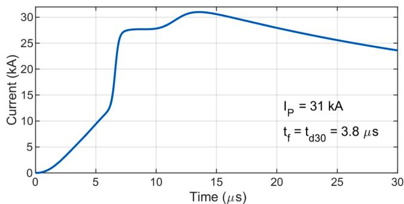  
Fig. 2. Considered lightning current waveform, representative of first strokes measured at Mount San Salvatore.

magnetic vector potential. Experimental validations of the HEM model for various grounding electrode configurations can be found in [34,35].

All simulations presented in the next section, including both the FDTD-based approach and the HEM, assume two parallel straight wires.

# 6. Results

# 6.1. Ground potential rise (GPR)

Fig. 3 shows the computed GPR for a configuration with 20-m long counterpoise wires, buried in soil with a DC resistivity of 250 Ωm. The analysis considers separation distances of 10 m, 20 m, and 40 m between the counterpoise wires. Similar results are presented in Figs. 4 and $^ { 5 , }$ assuming DC soil resistivities of 1000 Ωm and 4000 Ωm, and counterpoise lengths of 40 m and 80 m, respectively. The curves obtained using the FDTD methodology to solve the transmission line equations are labeled as “FDTD-TL model”, while those obtained using the electromagnetic model are labeled as “EM model”.

The results show a very good agreement between the results obtained using the FDTD-TL and EM models, demonstrating the accuracy and reliability of the proposed approach. Although the FDTD-TL model estimates slightly higher GPR peak values—particularly for the 250-Ωm soil—the deviations remain within 5 % and decrease as soil resistivity increases, becoming negligible at the highest resistivity considered. This agreement is consistently observed for the three separation distances between the counterpoise wires. It is also important to note that this agreement holds for both the peak value and the waveform of the GPR, which is particularly significant for assessing the stress imposed on the transmission line insulator strings.

The results also show that, for a given soil resistivity, increasing the separation distance between the counterpoise wires leads to a reduction in the GPR peak. This reduction is due to the decrease in the mutual coupling effect between the wires as the distance between them increases. Table 1 summarizes the GPR peak values and the corresponding percentage decreases for each soil resistivity as the separation distance between the counterpoise wires increases. It can be seen that increasing D from 10 m to 20 m and 40 m results in percentage decreases of approximately 5.9 % and 9.6 % for the 250-Ωm soil, 6.8 % and 11.8 % for the 1000-Ωm soil, and 6.8 % and 12.6 % for the 4000-Ωm soil, respectively. The reduction in the GPR peak with increasing separation between the counterpoise wires is moderate, suggesting that while the mutual coupling effect between electrodes influences the results, its impact becomes less pronounced at the considered separation distances.

# 6.2. Impulse impedance (ZP)

GPR curves similar to those in Figs. 3–5 were obtained for the three considered soil resistivities, with the counterpoise length varying between 10 m and 100 m. For each simulated length and soil resistivity, the impulse impedance was computed as the ratio between the peak values of the GPR and the injected current, $\begin{array} { r } { Z _ { P } = { V } _ { P } / I _ { P } . } \end{array}$ . The resulting curves for the impulse impedance as a function of the counterpoise

length, considering separation distances of 10 m, 20 m, and 40 m between the counterpoises, are shown in Figs. 6–8, respectively, for DC soil resistivities of 250 Ωm, 1000 Ωm, and 4000 Ωm.

Once again, a very good agreement is observed between the results obtained using the FDTD-TL and EM models. This further validates the proposed FDTD-TL approach and reinforces its applicability by demonstrating its reliability across a wide range of counterpoise lengths and soil resistivities.

It is also observed that increasing the separation between the wires leads to a reduction in the impulse impedance, as expected, due to the corresponding decrease in the GPR peak. Aditionally, the impulse impedance decreases with increasing wire length until it reaches a critical value, known as the effective length, beyond which no further reduction occurs. The use of the proposed FDTD-TL approach to compute the effective length of parallel counterpoise wires is further explored in Section 6.3.

# 6.3. Impulse coefficient (IC)

The impulse coefficient is defined as the ratio between the impulse impedance and the low-frequency grounding resistance, $I _ { C } = Z _ { P } / R _ { L F } .$ This parameter is particularly significant for the grounding systems of overhead transmission lines. First, given the value of $I _ { C }$ for a given counterpoise wire configuration, the impulse impedance— a more appropriate representation of tower-footing grounding systems for lightning-related studies—can be readily obtained from the measured or simulated low-frequency resistance. Second, the inflection point of the I -versus- l curve identifies the effective length, that is, the critical counterpoise wire length beyond which the impulse impedance ceases to decrease, even though the low-frequency resistance continues to decrease.

Fig. 9 shows the impulse coefficient as a function of counterpoise length, assuming DC soil resistivities of 300, 600, 1000, and 2000 Ωm, and considering separation distances between the counterpoise wires of D = 10, 20 and 40 m. Since the accuracy of the FDTD-TL model for computing $Z _ { P }$ over a wide range of counterpoise lengths was demonstrated in the previous section, and given that the impulse coefficient is obtained as the ratio between $Z _ { P }$ and $R _ { L F } ,$ , only the curves obtained using the proposed FDTD-TL approach are presented in this section.

According to the results, before the effective length is reached – marked by the inflection point of the $I _ { C } .$ versus- l curve – the impulse coefficient remains below unity, i.e., $Z _ { P } < R _ { L F }$ . This well-known result arises from the frequency dependence of soil resistivity and permittivity, with $I _ { C }$ decreasing further below unity as soil resistivity increases [36]. It is worth noting that, for a given soil resistivity, the impulse coefficient curves corresponding to different separation distances between the counterpoise wires are essentially coincident.

An interesting finding of the results is that, for a given soil resistivity, the effective length remains independent of the separation between the counterpoise wires. To the best of the authors’ knowledge, this is the first time such a result has been reported in the literature. This finding suggests that, when designing counterpoise lengths for tower-footing

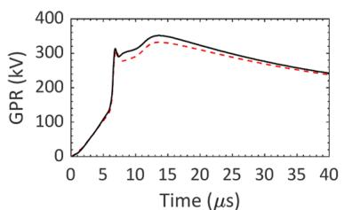

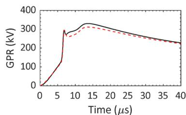

Fig. 3. GPR developed by two parallel counterpoise wires subjected to a representative first-stroke current, considering a DC soil resistivity of 250 Ωm and separation distances between the wires of (a) 10 m, (b) 20 m, and (c) 40 m.   
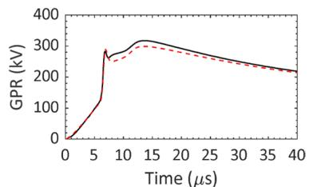

（c）

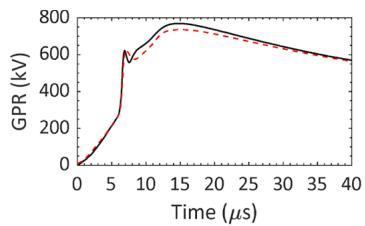  
(a)

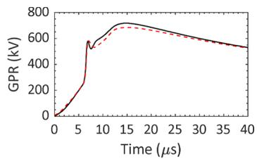

（c）  
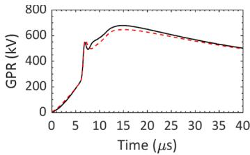  
-FDTD-TL model ----- EM model

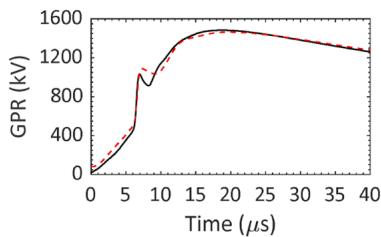  
Fig. 4. Same as in Fig. 3, but for a DC soil resistivity of 1000 Ωm.

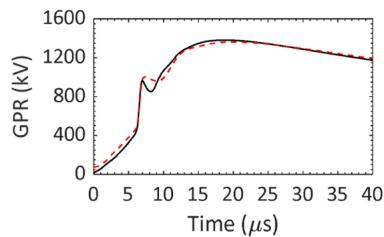  
(b)

Fig. 5. Same as in Fig. 3, but for a DC soil resistivity of 4000 Ωm.   
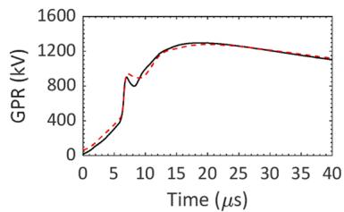  
-FDTD-TLmodel EM model

（c）

Table 1 Peak value of the GPRs and the corresponding percentage decreases with increasing separation between the counterpoise wires (indicated in parentheses).   

<table><tr><td rowspan="2">Soil resistivity (Ωm)</td><td colspan="3">D (m)</td></tr><tr><td>10</td><td>20</td><td>40</td></tr><tr><td rowspan="2">250</td><td rowspan="2">351 kV</td><td>331 kV</td><td>318 kV</td></tr><tr><td>(5.9 %)</td><td>(9.6 %)</td></tr><tr><td rowspan="2">1000</td><td rowspan="2">769 kV</td><td>717 kV</td><td>679 kV</td></tr><tr><td>(6.8 %)</td><td>(11.8 %)</td></tr><tr><td rowspan="2">4000</td><td rowspan="2">1484.1 kV</td><td>1382.6 kV</td><td>1296.6 kV</td></tr><tr><td>(6.8 %)</td><td>(12.6 %)</td></tr></table>

grounding systems of high-voltage transmission lines, the reference effective length— for a given soil resistivity and assuming first-stroke currents—remains the same regardless of the right-of-way width, which ultimately determines the separation between the counterpoise wires.

Finally, according to Fig. 9, the effective lengths for soil resistivities of 300, 600, 1000, and 2000 Ωm are approximately 30 m, 40 m, 60 m, and 90 m, respectively. These values match exactly those reported in Table 1 of [12], which were obtained under the same soil resistivity conditions using an accurate electromagnetic model and considering a tower-footing grounding arrangement composed of four counterpoise

wires. This consistency further reinforces the applicability of the proposed FDTD-TL approach for modeling parallel counterpoise wires. It also highlights its effectiveness in deriving key parameters for characterizing the lightning response of real tower-footing grounding system configurations of high-voltage transmission lines.

For the sake of completeness, Fig. 10 presents impulse coefficient results obtained by injecting a current waveform representative of typical downward negative subsequent strokes, as measured at Mount San Salvatore. This waveform features a peak of 12 kA and a zero-topeak time of 0.8 µs [30]. The results indicate that the effective lengths associated with each soil resistivity are shorter than those obtained for first-stroke currents, due to the higher frequency content of the subsequent strokes. Furthermore, the previously observed independence of the effective length from the separation distance between the counterpoise wires is also confirmed for subsequent strokes.

# 7. Discussion and conclusions

The results presented in this paper demonstrate that the proposed FDTD-TL model provides excellent agreement with a more rigorous electromagnetic model in calculating key quantities, including the GPR, impulse impedance, and effective length. The deviations between the models remain below 5 % for all analyzed cases and become negligible as soil resistivity increases. This high level of accuracy, combined with the significantly lower computational cost, highlights the potential of

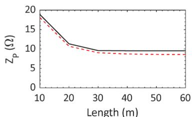

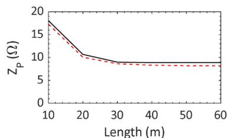

Fig. 6. Impulse impedance of a grounding arrangement composed of two parallel counterpoise wires as a function of their length, considering a DC soil resistivity of 250 Ωm and separation distances of (a) 10 m, (b) 20 m, and (c) 40 m.   
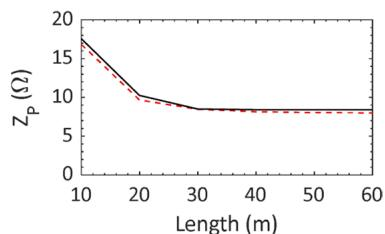  
-FDTD-TL model ----- EM model

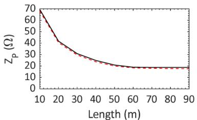

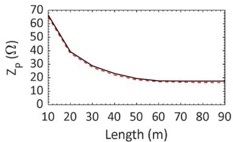  
(b)

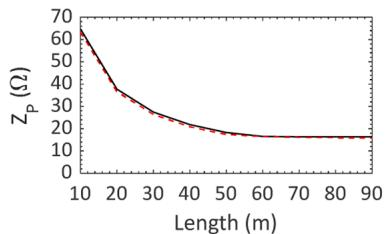  
（c）

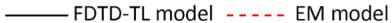  
Fig. 7. Same as in Fig. 6, but for a DC soil resistivity of 1000 Ωm.

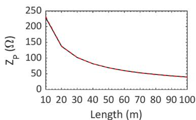  
(a)

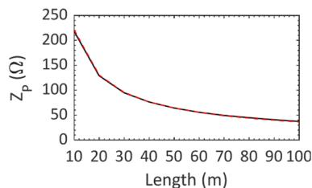

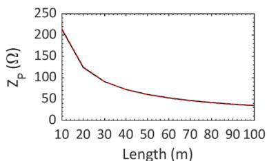  
（c）

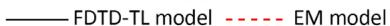  
Fig. 8. Same as in Fig. 6, but for a DC soil resistivity of 4000 Ωm.

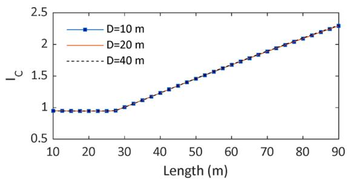

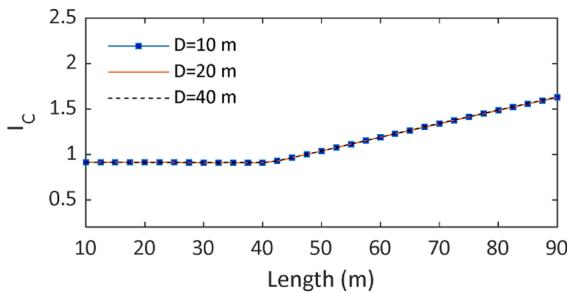  
(b)

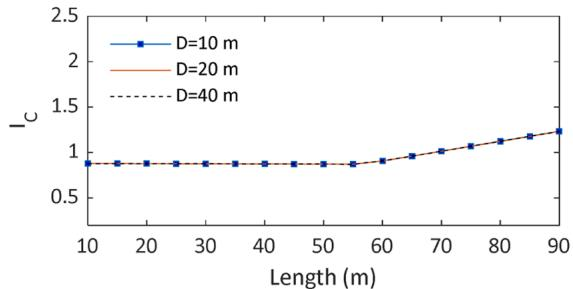

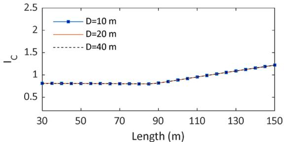  
(d)   
Fig. 9. Impulse coefficient of a grounding arrangement composed of two parallel counterpoise wires as a function of their length, considering separation distances of 10 m, 20 m, and 40 m, and DC soil resistivities of (a) 300 Ωm, (b) 600 Ωm, (c) 1000 Ωm, and (d) 2000 Ωm.

the FDTD-TL model for practical applications, especially in scenarios that demand extensive parametric studies or optimization of grounding system designs. In particular, the results show that the effective lengths obtained using the FDTD-TL model match exactly those reported in the literature for similar conditions using a more complex EM model. This reinforces the reliability of the proposed approach and highlights its potential as an accurate and computationally efficient tool for both the analysis and design of the lightning performance of grounding systems in high-voltage transmission lines composed of counterpoise wires.

A comprehensive discussion on the computational efficiency of the HEM applied to grounding modeling can be found in [13,37]. As expected, the simulation time increases with the overall dimensions of the

grounding system, since the number of segments into which the electrodes are discretized also increases, along with the order of the linear system to be solved. In [37], reported computational times using HEM are on the order of 100 s and 10,000 s for grounding arrangements with dimensions comparable to the shortest and longest counterpoise wire configurations evaluated in this study. These values refer to simulations performed on different computational platforms, including: an Intel i7 (2.5 GHz, 16 GB RAM, macOS), an Intel i5 (3.4 GHz, 16 GB RAM, macOS), and an Intel i7 (2.8 GHz, 32 GB RAM, Windows). In comparison, simulations using the FDTD-TL methodology presented in this paper—performed on an Intel i7 (1.8 GHz, 16 GB RAM, Windows)— required no more than 1 min to simulate the most demanding case,

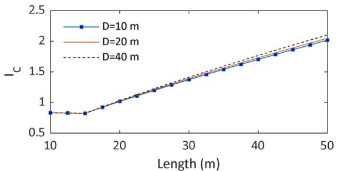

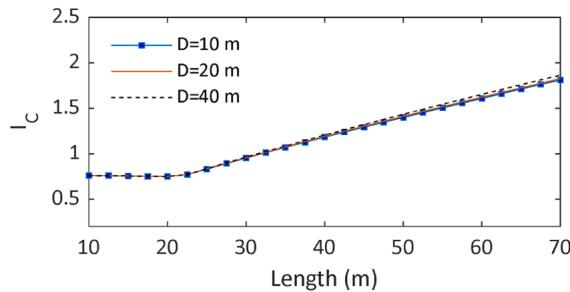  
(b)

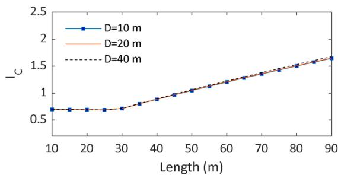

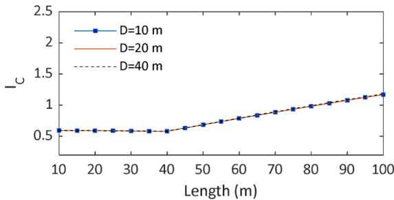  
(d)   
Fig. 10. Same as Fig. 9, but considering the injection of a current waveform representative of subsequent return strokes.

consisting of two pairs of parallel counterpoise wires, each 150 m long.

Although the proposed methodology is formulated for two parallel counterpoise wires, its application can be straightforwardly extended to configurations with four wires—two on each side of the tower—as commonly adopted in high-voltage transmission lines. Due to the symmetry of the geometry and the application of transmission line theory, the four-wire configuration can be treated as two independent twoconductor lines. Assuming that the injected current at the tower base divides equally among the four wires, the resulting values of GPR and impulse impedance computed with the proposed method can be divided by two to represent the response of the complete arrangement. The effective length, being a property of each individual wire, remains unchanged. Moreover, the time-domain GPR waveform obtained with the FDTD-TL approach can be used to extract the wideband frequency response of the grounding system. By computing the frequency-domain grounding impedance as $\begin{array} { r } { Z ( j \omega ) = \frac { \mathcal { T } \{ G P R ( t ) \} } { \mathcal { T } \{ i ( t ) \} } } \end{array}$ }, where F denotes the Fourier transform, the resulting grounding impedance can be fitted using poleresidue techniques and incorporated into electromagnetic transients (EMT) simulators through equivalent circuits or state-space models [2, 3]. This enables the proposed methodology to be incorporated into full power line simulations, allowing the assessment of lightning overvoltages across insulator strings and transmission line performance.

An interesting finding of this study is that the effective length of counterpoise wires is independent of the separation distance between them. This implies that, for transmission lines with different voltage levels—which typically have varying right-of-way widths and, consequently, different separation distances between the counterpoise wires—the same reference effective length can be assumed, for a given soil resistivity and assuming first-stroke currents. It was also shown that increasing the separation distance between the counterpoise wires leads to a reduction in both the GPR peak and the impulse impedance, due to the decrease in mutual coupling effects. However, this reduction is not particularly significant, ranging from approximately 10 % to 13 % for the analyzed soil resistivities when the separation distance is increased from 10 m to 40 m.

Finally, an additional contribution of this work is the presentation of a detailed FDTD-based formulation for solving the transmission line equations applied to electromagnetically coupled buried bare conductors, incorporating frequency-dependent effects in both longitudinal

impedance and shunt admittance. The resulting equations are discretized in both space and time, allowing for the straightforward inclusion of nonlinear phenomena that may affect grounding system performance, such as soil ionization. Future studies can build upon the proposed formulation to accurately and efficiently model counterpoise wires, simultaneously accounting for frequency-dependent and nonlinear time-dependent effects.

# CRediT authorship contribution statement

Naiara Duarte: Writing – original draft, Validation, Methodology, Investigation, Formal analysis, Data curation, Conceptualization. Rafael Alipio: Writing – original draft, Visualization, Validation, Supervision, Project administration, Methodology, Investigation, Formal analysis, Data curation, Conceptualization. Felipe Vasconcellos: Conceptualization, Methodology, Writing – review & editing. Farhad Rachidi: Supervision, Project administration, Formal analysis, Conceptualization.

# Declaration of competing interest

The authors declare that they have no known competing financial interests or personal relationships that could have appeared to influence the work reported in this paper.

# Acknowledgements

The authors would like to thank the Conselho Nacional de Desenvolvimento Científico e Tecnologico ´ (CNPq), grant number 406177/ 2021–0. Rafael Alipio would also like to acknowledge the Conselho Nacional de Desenvolvimento Científico e Tecnologico ´ (CNPq), grant number 314849/2021–1.

# Data availability

The data that has been used is confidential.

# References

[1] Z.G. Datsios, P.N. Mikropoulos, T.E. Tsovilis, Closed-form expressions for the estimation of the minimum backflashover current of overhead transmission lines, IEEE Trans. Power Delivery 36 (2) (2021) 522–532, https://doi.org/10.1109/ TPWRD.2020.2984423.   
[2] M.R. Alemi, K. Sheshyekani, Wide-band modeling of tower-footing grounding systems for the evaluation of lightning performance of transmission lines, IEEE Trans. Electromagn. Compat. 57 (6) (2015) 1627–1636, https://doi.org/10.1109/ TEMC.2015.2453512.   
[3] F. Vasconcellos, R. Alípio, F. Moreira, Evaluation of the impact of including the frequency-dependent behavior of grounding systems on the lightning performance of transmission lines and on grounding systems design, J. Control, Automat. Elect. Syst. 33 (2) (2022) 531–540, https://doi.org/10.1007/s40313-021-00833-7.   
[4] J.A. Martinez-Velasco, Transient Analysis of Power Systems: Solution Techniques, Tools and Applications, Wiley-IEEE Press, 2015.   
[5] A.F. Otero, J. Cidras, J.L. del Alamo, Frequency-dependent grounding system calculation by means of a conventional nodal analysis technique, IEEE Trans. Power Delivery 14 (3) (1999) 873–878, https://doi.org/10.1109/61.772327.   
[6] F.M. Gatta, A. Geri, S. Lauria, M. Maccioni, Simplified HV tower grounding system model for backflashover simulation, Elect. Power Syst. Res. 85 (2012) 16–23, https://doi.org/10.1016/j.epsr.2011.07.003.   
[7] Y. Liu, N. Theethayi, R. Thottappillil, An engineering model for transient analysis of grounding system under lightning strikes: nonuniform transmission-line approach, IEEE Trans. Power Delivery 20 (2) (2005) 722–730, https://doi.org/ 10.1109/TPWRD.2004.843437.   
[8] J. He, et al., Effective length of counterpoise wire under lightning current, IEEE Trans. Power Delivery 20 (2) (2005) 1585–1591, https://doi.org/10.1109/ TPWRD.2004.838457.   
[9] L.D. Grcev, Computer analysis of transient voltages in large grounding systems, IEEE Trans. Power Delivery 11 (2) (1996) 815–823, https://doi.org/10.1109/ 61.489339.   
[10] S. Visacro, A. Soares, HEM: a model for simulation of lightning-related engineering problems, IEEE Trans. Power Delivery 20 (2) (2005) 1206–1208, https://doi.org/ 10.1109/TPWRD.2004.839743.   
[11] M. Tsumura, Y. Baba, N. Nagaoka, A. Ametani, FDTD simulation of a horizontal grounding electrode and modeling of its equivalent circuit, IEEE Trans. Electromagn. Compat. 48 (4) (2006) 817–825, https://doi.org/10.1109/ TEMC.2006.884448.   
[12] S. Visacro, F.H. Silveira, Lightning performance of transmission lines: requirements of tower-footing electrodes consisting of long counterpoise wires, IEEE Trans. Power Delivery 31 (4) (2016) 1524–1532, https://doi.org/10.1109/ TPWRD.2015.2494520.   
[13] M.A. de, O. Schroeder, R.A.R. de Moura, V.M. Machado, A discussion on practical limits for segmentation procedures of tower-footing grounding modeling for lightning responses, IEEE Trans. Electromagn. Compat. 62 (6) (2020) 2520–2527, https://doi.org/10.1109/TEMC.2020.2982358.   
[14] L. Grcev, B. Markovski, M. Todorovski, Lightning efficient counterpoise configurations for transmission line grounding, IEEE Trans. Power Delivery 38 (2) (2023) 877–888, https://doi.org/10.1109/TPWRD.2022.3200579.   
[15] N. Duarte, R. Alipio, F. Rachidi, An FDTD-based formulation for solving the transmission line equations for a bare wire buried in a dispersive soil. CIGRE Int. Colloquium on Lightning and Power Systems and XVII Int. Symposium on Lightning Protection (CIGRE ICLPS – SIPDA 2023), Suzhou, China, 2023, pp. 1–6.   
[16] C.R. Paul, Analysis of Multiconductor Transmission Lines, 2nd ed., John Wiley & Sons, Inc., 2008.   
[17] R. Alipio, A. De Conti, F. Vasconcellos, F. Moreira, N. Duarte, J. Martí, Tower-foot grounding model for EMT programs based on transmission line theory and Marti’s model, Elect. Power Syst. Res. 223 (Oct. 2023) 109584, https://doi.org/10.1016/j. epsr.2023.109584.

[18] E.D. Sunde, Earth Conduction Effects in Transmission Systems, Dover Publications, New York, 1968.   
[19] L. Grcev, B. Markovski, S. Grceva, On inductance of buried horizontal bare conductors, IEEE Trans. Electromagn. Compat. 53 (4) (2011) 1083–1087, https:// doi.org/10.1109/TEMC.2011.2165340.   
[20] R. King, Antennas in material media near boundaries with application to communication and geophysical exploration, part I: the bare metal dipole, IEEE Trans. Antennas Propag. 34 (4) (1986) 483–489, https://doi.org/10.1109/ TAP.1986.1143848.   
[21] L. Grcev, S. Grceva, On HF circuit models of horizontal grounding electrodes, IEEE Trans. Electromagn. Compat. 51 (3) (2009) 873–875, https://doi.org/10.1109/ TEMC.2009.2023330.   
[22] S.A. Schelkunoff, The electromagnetic theory of coaxial transmission lines and cylindrical shields, Bell Syst. Tech. J. 13 (4) (1934) 532–579, https://doi.org/ 10.1002/j.1538-7305.1934.tb00679.x.   
[23] R. Alipio, S. Visacro, Modeling the frequency dependence of electrical parameters of soil, IEEE Trans. Electromagn. Compat. 56 (5) (2014) 1163–1171, https://doi. org/10.1109/TEMC.2014.2313977.   
[24] R. Alipio, S. Visacro, Time-domain analysis of frequency-dependent electrical parameters of soil, IEEE Trans. Electromagn. Compat. 59 (3) (2017) 873–878, https://doi.org/10.1109/TEMC.2016.2631892.   
[25] J.P.L. Salvador, R. Alipio, A.C.S. Lima, M.T. Correia de Barros, A concise approach of soil models for time-domain analysis, IEEE Trans. Electromagn. Compat. 62 (5) (2020) 1772–1779, https://doi.org/10.1109/TEMC.2019.2927273.   
[26] A. Semlyen, A. Dabuleanu, Fast and accurate switching transient calculations on transmission lines with ground return using recursive convolutions, IEEE Trans. Power Appar. Syst. 94 (2) (1975) 561–571, https://doi.org/10.1109/T-PAS.1975.31884.   
[27] B. Gustavsen, A. Semlyen, Rational approximation of frequency domain responses by vector fitting, IEEE Trans. Power Delivery 14 (3) (1999) 1052–1061, https:// doi.org/10.1109/61.772353.   
[28] Working Group C4.23, “CIGRE TB 839: procedures for estimating the lightning performance of transmission lines – New aspects,” Paris, 2021.   
[29] A. De Conti, S. Visacro, Analytical representation of single- and double-peaked lightning current waveforms, IEEE Trans. Electromagn. Compat. 49 (2) (2007) 448–451, https://doi.org/10.1109/TEMC.2007.897153.   
[30] K. Berger, R.B. Anderson, H. Kroninger, Parameters of lightning flashes, Electra (80) (1975) 223–237.   
[31] K. Costa, R. Alipio, M. Duarte, G. Matoso, R. Dias, Evaluation of the statistical characteristics of grounding impulse impedance of transmission line towers, in: 2019 International Symposium on Lightning Protection (XV SIPDA), IEEE, 2019, pp. 1–7, https://doi.org/10.1109/SIPDA47030.2019.8951612.   
[32] S. Visacro, The use of the impulse impedance as a concise representation of grounding electrodes in lightning protection applications, IEEE Trans. Electromagn. Compat. 60 (5) (2018) 1602–1605, https://doi.org/10.1109/ TEMC.2017.2788565.   
[33] Working Group C4.37, “CIGRE TB 785: electromagnetic computation methods for lightning surge studies with emphasis on the FDTD method,” Paris, 2019.   
[34] R. Alipio, S. Visacro, Impulse efficiency of grounding electrodes: effect of frequency-dependent soil parameters, IEEE Trans. Power Delivery 29 (2) (2014) 716–723, https://doi.org/10.1109/TPWRD.2013.2278817.   
[35] R. Alipio, V.L. Coelho, G.L. Canever, Experimental analysis of horizontal grounding wires buried in high-resistivity soils subjected to impulse currents, Elect. Power Syst. Res. 214 (2023) 108761, https://doi.org/10.1016/j.epsr.2022.108761.   
[36] R. Alipio, S. Visacro, Frequency dependence of soil parameters: effect on the lightning response of grounding electrodes, IEEE Trans. Electromagn. Compat. 55 (1) (2013) 132–139, https://doi.org/10.1109/TEMC.2012.2210227.   
[37] A.C.S. Lima, R.A.R. Moura, P.H.N. Vieira, M.A.O. Schroeder, M.T. Correia de Barros, A computational improvement in grounding systems transient analysis, IEEE Trans. Electromagn. Compat. 62 (3) (2020) 765–773, https://doi.org/ 10.1109/TEMC.2019.2918621.