# 电磁-机电暂态混合仿真中的频率相关网络等值

张怡1, 吴文传1, 张伯明1, Aniruddha M. Gole2

(1. 电力系统及发电设备控制和仿真国家重点实验室(清华大学电机系), 北京市海淀区 100084;  
2. 曼尼托巴大学电气与计算机工程系, 加拿大 温尼伯 R3T 5V6)

# Frequency Dependent Network Equivalent for Electromagnetic and Electromechanical Hybrid Simulation

ZHANG Yi $^{1}$ , WU Wenchuan $^{1}$ , ZHANG Boming $^{1}$ , Aniruddha M. Gole $^{2}$

(1. State Key Lab of Control and Simulation of Power Systems and Generation Equipments (Dept. of Electrical Engineering,

Tsinghua University), Haidian District, Beijing 100084, China;

2. Department of Electrical and Computer Engineering, University of Manitoba, Winnipeg R3T 5V6, Canada)

ABSTRACT: The frequency dependent network equivalent (FDNE) can represent not only property of the fundamental frequency response but also that of the high frequency response of the network. Thus, it can accommodate the waveform distortion at the interface in electromagnetic and electromechanical transient hybrid simulation. Firstly, the method of acquiring the network frequency response samples was presented which was based on simplified models of power system elements. Secondly, a revised vector fitting method was used to calculate the FDNE and a perturbation based corrective control method was also proposed to guarantee the passivity of the FDNE. Finally, several examples were given to prove the accuracy and advantage of the FDNE based hybrid simulation method.

KEY WORDS: electromagnetic transient; electromechanical transient; frequency dependent network equivalent; passive; vector fitting

摘要：频率相关网络等值(frequency dependent network equivalent，FDNE)不仅可以表示网络的基频响应特性，而且还可以表示网络的高频响应特性，从而能够应对电磁暂态、机电暂态混合仿真中的接口波形畸变问题。基于简化元件模型介绍FDNE的频率特性采样值的求取方法；应用矢量拟合法将上述频率特性采样值整体拟合成一个FDNE，并采用摄动法保证了此FDNE的无源性。最后，用多个算例

说明基于 FDNE 的电磁-机电暂态混合仿真方法的精度及其优势。

关键词：电磁暂态；机电暂态；频率相关网络等值；无源性；矢量拟合法

# 0 引言

由于计算量太大，电磁暂态(electromagnetic transient，EMT)仿真不能用于大规模电力系统的仿真，其中相对不重要的网络部分常常用等值网络来表征。但是，常规的网络等值方法会改变或者丧失原始网络的高频特性频率相关网络等值(frequency dependent network equivalent，FDNE)与频率相关，可以较精确地表示原始网络在各个频率下的频率特性。FDNE目前已应用于网络等值[1]、谐波[2]、传输线模型[3]和电磁-机电暂态混合仿真[4-5]等研究中。

在电磁暂态程序与机电暂态稳定分析(transient stability analysis，TSA)程序的混合仿真中，对机电暂态侧的等值电路往往采用诺顿(Norton)等值法生成。常规诺顿等值电路不能精确表示机电暂态侧的高频响应，因而不能模拟接口处的波形畸变对电磁暂态侧直流输电系统产生的影响。Morched 最先讨论了用 FDNE 来表示机电暂态侧谐波对电磁暂态侧影响的必要性[4]；Anderson 的研究表明由于 FDNE 考虑了机电侧网络的高频率特性，所以能提高仿真的精度[5]；加拿大 Lin 等人采用矢量拟合法[6]来获取机电暂态侧网络的 FDNE，有效地模拟了高压直流输电系统(high-voltage direct current, HVDC)

换流器母线处谐波对电磁暂态侧的影响，取得了较精确的仿真结果[7-8]；中国电力科学研究院[9-10]、清华大学[11-12]、华北电力大学[13]、天津大学[14]、四川大学[15]和东南大学[16]也对混合仿真进行了不同深度的研究，取得许多很好的成果，但均没有考虑机电暂态侧谐波对电磁暂态侧的影响。

本文在文献[7]的基础上，改善适用于电磁-机电暂态混合仿真的FDNE的求取和应用的方法，包括网络频率特性采样值的精细化求取方法、FDNE的整体矢量拟合法和消除FDNE无源越界的摄动法。

# 1 FDNE简介

如图1所示，不同频率下，节点导纳矩阵是不同的。网络的频率特性由这些节点导纳矩阵决定。传统的诺顿等值电路中的导纳矩阵是在基频下形成的，只能表示网络在基频下的频率特性。

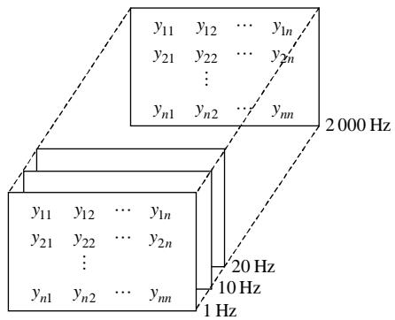  
图1 离散的节点导纳矩阵  
Fig. 1 Discrete node admittance matrices

网络的频率特性是频率的函数，是连续的。但是，采用图1所示的有限个离散节点导纳矩阵不能表示连续的频率特性。FDNE的实质是一个以频率为函数的节点导纳矩阵，它可以表示频率变化情况下的节点导纳矩阵。因此， $N \times N$ 维FDNE可以表示为一个频域矩阵：

$$
\boldsymbol {Y} (s) = \left[ \begin{array}{c c c c} y _ {1 1} (s) & y _ {1 2} (s) & \dots & y _ {1 N} (s) \\ y _ {2 1} (s) & y _ {2 1} (s) & \dots & y _ {2 N} (s) \\ & \vdots & & \\ y _ {N 1} (s) & y _ {N 2} (s) & \dots & y _ {N N} (s) \end{array} \right] \tag {1}
$$

式中 $s = \mathrm{j}2\pi f$ ， $f$ 为频率。

FDNE 矩阵中的每个元素都可以表示连续的频率特性。在实际应用中，FDNE 中的任一元素都可以用 RLC 元件组合电路或有理函数来表示。但是，RLC 元件组合电路的形式及其求取方法[2]都过于复杂。

目前常用的办法是用矢量拟合法将FDNE矩阵的每个元素在一系列频率下的采样值拟合成一个连续的有理函数。通过矢量拟合法求出的FDNE矩阵中的每个元素可以表示为一个频域函数：

$$
y (s) = \sum_ {i = 1} ^ {n} \frac {c _ {i}}{s - a _ {i}} + d + s h \tag {2}
$$

式中：极点 $a_{i}$ 和留数 $c_{i}$ 或是实数，或分别以复数共轭对出现； $d$ 和 $h$ 为实数； $n$ 为极点个数。FDNE矩阵中不同元素的 $a_{i} \setminus c_{i} \setminus d$ 和 $h$ 是不相同的。矢量拟合法根据 FDNE 频率特性采样值，形成一组超越方程，运用最小二乘法求取式(2)中的未知参数。

# 2 FDNE的求取

# 2.1 概述

本文的 FDNE 用于电磁-机电暂态混合仿真中对机电暂态侧网络的等值。求取 FDNE 矩阵的步骤可分为 3 步：1）求取机电暂态侧原始网络的频率特性采样值；2）根据这些频率特性采样值，运用矢量拟合法求取式(2)中的 $a_{i} \cdot c_{i} \cdot d$ 和 $h$ ；3）运用摄动校正保证 FDNE 的无源性。

# 2.2 频率特性采样值的获取

本文求取机电暂态侧网络频率特性采样值的步骤可分为4步。

1）选取频率范围。大规模交直流系统中产生的谐波的频率比较固定。对于 12 脉冲的高压直流输电系统，交流侧的谐波次数一般为 $12m \pm 1$ ，其中 $m = 1,2,\dots$ ；另外，随着谐波频率的升高，这些频率的谐波所占的分量将会减小。一般而言，选取频率范围为 $1 \sim 2\mathrm{kHz}$ 即可保证仿真的精度。  
2）选取频率采样点。为了保证结果的精确性，需要选取足够多的频率采样点。本文的做法是，将步骤1）中给出的频率范围划分成 $N_{0} - 1$ 个等间距。一般来说，对于频率范围为 $1\sim 2\mathrm{kHz}$ ， $N_{0}$ 取500。  
3）计算单个网络元件的幅频特性。为了保证矢量拟合法拟合的有理函数能够符合原始网络的频率特性，需要保证矢量拟合法所采用的导纳幅值(相角)频率特性采样值尽可能接近于原始网络的导纳幅值(相角)频率特性。电力元件的频率特性一般是非线性的，很难求取其完全精确的频率特性。因此，在求取各元件的频率特性时，应对各元件模型进行简化。本文的元件模型简化涉及到发电机、负荷、线路和变压器。在频率 $f$ 下，各元件频率特性的求取方法如下 $(f_0$ 为基频频率)：

(1) 发电机。由电压源和次暂态阻抗 $R_{\mathrm{g}} + \mathrm{j} X_{\mathrm{g}}$ 组成的串联电路表示; 因此, 考虑频率特性的发电机导纳为

$$
y (f) = \frac {1}{R _ {\mathrm {g}} + \mathrm {j} X _ {\mathrm {g}} \frac {f}{f _ {0}}} \tag {3}
$$

②负荷。是ZIP负荷，先将负荷中的恒电流和恒功率分量分别转化为等值阻抗，并和恒阻抗分量相加得到其基频等值阻抗 $R_{\mathrm{d}} + \mathrm{j}X_{\mathrm{d}}$ ；因此，考虑频率特性的负荷等值导纳为

$$
y (f) = \frac {1}{R _ {\mathrm {d}} + \mathrm {j} X _ {\mathrm {d}} \frac {f}{f _ {0}}} \tag {4}
$$

③线路。是 $\pi$ 型准稳态模型，其基频下的线路阻抗和充电电纳分别为 $R_{1} + \mathrm{j}X_{1}$ 和 $\mathrm{j}b_{\mathrm{c}}$ ；因此，考虑频率特性的线路导纳矩阵为

$$
\mathbf {y} (f) = \left[ \begin{array}{c c} y _ {1} + y _ {\mathrm {c}} & - y _ {1} \\ - y _ {1} & y _ {1} + y _ {\mathrm {c}} \end{array} \right] \tag {5}
$$

式中： $y_{1} = 1 / (R_{1} + \mathrm{j}X_{\mathrm{L}}f / f_{0})$ ； $y_{\mathrm{c}} = -\mathrm{j}b_{\mathrm{c}}f / f_{0}$ 。

④ 变压器。变压器模型如图2所示，考虑频率特性的变压器导纳矩阵为

$$
\mathbf {y} (f) = y _ {\mathrm {t}} \left[ \begin{array}{c c} \frac {1}{t ^ {2}} & - \frac {\exp (- \mathrm {j} \theta)}{t} \\ - \frac {\exp (\mathrm {j} \theta)}{t} & 1 \end{array} \right] \tag {6}
$$

式中: $y_{\mathrm{t}} = 1 / (R_{\mathrm{t}} + \mathrm{j}X_{\mathrm{t}}f / f_{0})$ , 而 $R_{\mathrm{t}} + \mathrm{j}X_{\mathrm{t}}$ 为变压器的漏阻抗; $\theta$ 为变压器 $i$ 端与 $j$ 端的相位差, 一般为 $0^{\circ} \sim 30^{\circ}$ 和 $-30^{\circ}$ , 具体由变压器绕组接法和正负序决定。

$$
i \cdot \begin{array}{c c} t: 1 & R _ {\mathrm {t}} + \mathrm {j} X _ {\mathrm {t}} \\ \text {①} & \square \end{array} \cdot j
$$

图2 变压器电路图

Fig. 2 Circuit of the transformer

4）计算网络的频率特性。根据单个网络元件的频率特性，可计算出各个频率下的网络节点导纳矩阵，即网络的频率特性在某个频率下的采样值。本文的FDNE是对机电暂态侧网络的等值，因此，首先计算机电暂态侧网络的节点导纳矩阵，对其进行高斯消去，得到收缩到边界节点的节点导纳矩阵。

$$
\bar {Y} _ {\mathrm {B B}} = Y _ {\mathrm {B B}} - Y _ {\mathrm {B E}} Y _ {\mathrm {E E}} ^ {- 1} Y _ {\mathrm {E B}} \tag {7}
$$

式中：下标 B 表示边界节点；下标 E 表示机电暂态侧网络中的其他节点。根据式(7)可得正负零序节点导纳矩阵 $\bar{Y}_{\mathrm{BB}}^{012}$ ，对其进行序相变化，得到三相节点

导纳矩阵 $\overline{Y}_{\mathrm{BB}}^{\mathrm{abc}}$

$$
\bar {Y} _ {\mathrm {B B}} ^ {\mathrm {a b c}} = S \bar {Y} _ {\mathrm {B B}} ^ {0 1 2} S ^ {- 1} \tag {8}
$$

其中

$$
\boldsymbol {S} = \left[ \begin{array}{c c c} \boldsymbol {S} _ {v} & & \\ & \boldsymbol {S} _ {v} & \\ & & \boldsymbol {S} _ {v} \end{array} \right], \quad \boldsymbol {S} _ {v} = \left[ \begin{array}{c c c} 1 & 1 & 1 \\ 1 & \alpha^ {2} & \alpha \\ 1 & \alpha & \alpha^ {2} \end{array} \right] \tag {9}
$$

式中 $\alpha = \angle 120^{\circ}$ ，为复数算子。

将不同频率下的 $\overline{Y}_{\mathrm{BB}}^{\mathrm{abc}}$ 作为机电暂态侧网络的FDNE频率特性采样值。这个FDNE是三相的，可以应用到电磁暂态仿真程序中。

# 2.3 FDNE 矩阵的整体矢量拟合

矢量拟合法实质就是根据FDNE频率特性采样值，形成一组超越方程，运用最小二乘法求取式(2)中的未知参数。文献[7]中的矢量拟合法只是针对单个有理函数进行拟合，在拟合过程中，每个有理函数对应的极点的值和数目都是不同的。对于式(1)，当 $N^2$ 个有理函数的极点不同时，把FDNE矩阵中的 $N^2$ 个元素逐个应用到时域仿真，其计算量会急剧增加，同时其时域实现也不方便。本文采用了新的方法：

1）先为这 $N^2$ 个元素求取一组相同的初始公共极点。若采样点数为 $N_0$ ，则可求取 $N_0$ 个 $N \times N$ 维的采样值矩阵。将各个采样值矩阵中 $N^2$ 个元素值依次相加，对于 $N_0$ 个采样值矩阵则可得到一个 $N_0 \times 1$ 的“采样值向量”。将这个“采样值向量”进行矢量拟合，可以得到一个如式(2)的有理函数。将这个有理函数的极点设为原始 FDNE 矩阵的初始公共极点。  
2）基于步骤1）中的初始公共极点，对这个FDNE矩阵中的各个元素逐个进行矢量拟合，以保证FDNE矩阵各个元素的极点及其个数相同。  
3）由矢量拟合法可知，当极点未收敛时，矢量拟合法结束后可求出一组新极点。可将这组新极点重新作为步骤2）的初始公共极点，重新进行矢量拟合，直到初始公共节点与算法结束后新极点的差值在一定门槛值内。一般来说，迭代3~4次即可收敛并求得具有公共极点的FDNE矩阵。

在矢量拟合的过程中，采取如下实用化处理方法：

1）在实际求取过程中，一般可令 $h$ 为0。这主要是因为对实际网络而言，在无限大的频率下，实

际网络的节点导纳不可能为无穷大;

2）为了保证拟合的有理函数在基频和谐波频率下都呈现精确的频率特性，一般在拟合时对基频和谐波频率下的采样值设置相对较大的权重。

这种方法能够保证 $Y(s)$ 各元素的极点是相同的，只是留数项和常数项不相同，则 $N \times N$ 维FDNE矩阵 $Y(s)$ 可表示为

$$
\boldsymbol {Y} (s) = \left[ \begin{array}{c c c c} d _ {1 1} + \sum_ {i = 1} ^ {n} \frac {c _ {i} ^ {1 1}}{s - a _ {i}} & d _ {1 2} + \sum_ {i = 1} ^ {n} \frac {c _ {i} ^ {1 2}}{s - a _ {i}} & \dots & d _ {1 1} + \sum_ {i = 1} ^ {n} \frac {c _ {i} ^ {1 N}}{s - a _ {i}} \\ d _ {2 1} + \sum_ {i = 1} ^ {n} \frac {c _ {i} ^ {2 1}}{s - a _ {i}} & d _ {2 2} + \sum_ {i = 1} ^ {n} \frac {c _ {i} ^ {2 2}}{s - a _ {i}} & \dots & d _ {2 N} + \sum_ {i = 1} ^ {n} \frac {c _ {i} ^ {2 N}}{s - a _ {i}} \\ & \vdots & & \\ d _ {N 1} + \sum_ {i = 1} ^ {n} \frac {c _ {i} ^ {N 1}}{s - a _ {i}} & d _ {N 2} + \sum_ {i = 1} ^ {n} \frac {c _ {i} ^ {N 2}}{s - a _ {i}} & \dots & d _ {N N} + \sum_ {i = 1} ^ {n} \frac {c _ {i} ^ {N N}}{s - a _ {i}} \end{array} \right] \tag {10}
$$

将式(10)写成传递函数的形式：

$$
\boldsymbol {Y} (s) = \boldsymbol {C} (s \boldsymbol {E} - \boldsymbol {A}) ^ {- 1} \boldsymbol {B} + \boldsymbol {D} \tag {11}
$$

式中 $\pmb{E}$ 为单位矩阵，其维数与矩阵 $\mathbf{A}$ 相同。

$$
\boldsymbol {A} = \operatorname {d i a g} (\boldsymbol {A} _ {1} \quad \dots \quad \boldsymbol {A} _ {k} \quad \dots \quad \boldsymbol {A} _ {N})
$$

$$
\boldsymbol {A} _ {k} = \operatorname {d i a g} \left(\frac {1}{s - a _ {1}} \quad \frac {1}{s - a _ {2}} \quad \dots \quad \frac {1}{s - a _ {n}}\right)
$$

$$
\boldsymbol {B} = \operatorname {d i a g} (\boldsymbol {B} _ {1} \quad \dots \quad \boldsymbol {B} _ {k} \quad \dots \quad \boldsymbol {B} _ {N})
$$

$$
\boldsymbol {B} _ {k} = \left[ \begin{array}{l l l l} (1 & 1 & \dots & 1) _ {(1 \times n)} \end{array} \right] ^ {\mathrm {T}}
$$

$$
\boldsymbol {C} = \left[ \begin{array}{c c c c c c c} \boldsymbol {C} _ {1 1} & \dots & \boldsymbol {C} _ {1 k} & \dots & \boldsymbol {C} _ {1 m} & \dots & \boldsymbol {C} _ {1 N} \\ & & & \vdots & & & \\ \boldsymbol {C} _ {k 1} & \dots & \boldsymbol {C} _ {k k} & \dots & \boldsymbol {C} _ {k m} & \dots & \boldsymbol {C} _ {k N} \\ & & & \vdots & & & \\ \boldsymbol {C} _ {m 1} & \dots & \boldsymbol {C} _ {m k} & \dots & \boldsymbol {C} _ {m m} & \dots & \boldsymbol {C} _ {m N} \\ & & & \vdots & & & \\ \boldsymbol {C} _ {N 1} & \dots & \boldsymbol {C} _ {N k} & \dots & \boldsymbol {C} _ {N m} & \dots & \boldsymbol {C} _ {N N} \end{array} \right]
$$

$$
\boldsymbol {C} _ {k n} = \left[ \begin{array}{c c c c} c _ {1} ^ {k m} & c _ {2} ^ {k m} & \dots & c _ {n} ^ {k m} \end{array} \right]
$$

$$
\boldsymbol {D} = \left[ \begin{array}{c c c c c c c} d _ {1 1} & \dots & d _ {1 k} & \dots & d _ {1 m} & \dots & d _ {1 N} \\ & & & \vdots & & \\ d _ {k 1} & \dots & d _ {k k} & \dots & d _ {k m} & \dots & d _ {k N} \\ & & & \vdots & & \\ d _ {m 1} & \dots & d _ {m k} & \dots & d _ {m m} & \dots & d _ {m N} \\ & & & \vdots & & \\ d _ {N 1} & \dots & d _ {N k} & \dots & d _ {N m} & \dots & d _ {N N} \end{array} \right]
$$

$$
k, m = 1, 2, \dots , N
$$

# 2.4 FDNE的无源性校正

FDNE代表的实际网络是无源的，只吸收能量，其吸收的能量 $P(s)$ 可表示为

$$
\boldsymbol {P} (s) = \boldsymbol {u} \boldsymbol {G} (s) \boldsymbol {u} \tag {12}
$$

式中： $\pmb{u}$ 为原始网络中的节点电压； $G(s)$ 为 $Y(s)$ 的实部。但是，矢量拟合法求出的 FDNE 矩阵 $\pmb{Y}(s)$ 在某些频率 $s$ 下 $P(s) < 0$ ，即在频率 $s$ 下有可能是有源的，有源的 FDNE 会导致时域仿真发散。为了保证原始网络只吸收能量，即要求 $P(s) > 0$ ，则矩阵 $G(s)$ 必须是正定的，即其所有的特征值必须为正值。

本文的无源性校正方法不同于文献[7]。文献[7]的无源性校正方法是建立在多次矢量拟合的基础上。即，当FDNE在某频率下无源越界时，增加该频率附近采样点的数目，对该频率附近进行精细拟合，通过反复多次拟合直至FDNE达到无源性。相对于文献[7]所提方法，本文的方法直接保证矩阵 $\pmb{G}(s)$ 正定，可以自动保证FDNE的无源性。本文的无源性校正分为2个步骤：

1）评估FDNE的无源性。本文采用文献[17]中的奇异测试矩阵来判断式(11)对应的FDNE的无源越界。若矩阵 $\pmb{R}$ 出现负特征值，则负特征值的平方根 $\pm j\omega$ 的虚部 $\omega$ 即是无源越限的频率。

$$
\boldsymbol {R} = [ \boldsymbol {A} - \boldsymbol {B} (\boldsymbol {D} - \boldsymbol {E}) ^ {- 1} \boldsymbol {C} ] [ \boldsymbol {A} - \boldsymbol {B} (\boldsymbol {D} + \boldsymbol {E}) ^ {- 1} \boldsymbol {C} ] \tag {13}
$$

式中单位矩阵 $\pmb{E}$ 的维数与矩阵 $\pmb{D}$ 相同。

2）消除FDNE中的无源越界。一般而言，拟合的FDNE矩阵 $Y(s)$ 的精度比较高，因此可以通过摄动 $Y(s)$ 的留数项 $c_{i}$ 和常数项 $d$ 以消除其实部矩阵 $G(s)$ 在某些频率下的负特征值·本文采用文献[18]中的方法,将式(10)中的所有留数项 $c_{i}^{km}$ 写成矢量 $\pmb{x}$ 并将矩阵 $Y(s)$ 各个元素写成矢量 $\mathbf{y}_{\mathrm{fit}}$ ，对其线性化，得二次优化问题：

$$
\left\{\begin{array}{l}A _ {m} \Delta x - b _ {m} \rightarrow 0\\B _ {m} \Delta x - c _ {m} \leqslant 0\end{array}\right. \tag {14}
$$

通过求解上述二次优化问题，可以求得摄动项 $\Delta x$ ，并进而求取摄动后的留数项和常数项。式(14)的具体推导见文献[18]。

# 3 算例分析

# 3.1 RLC电路

将FDNE应用到图3所示的普通单相RLC电路中。

电压源 $u$ 是一个阶跃信号。将虚线右侧的网络分别用 FDNE 和诺顿等值电路表示，计算其端口处的电流 $i_{\mathrm{a}}$ 。将 PSCAD/EMTDC 计算的结果用 EMT 标识；将 FDNE 计算的结果用 FDNE 标识；将诺顿等值电路计算的结果用 Norton 标识，计算结果如

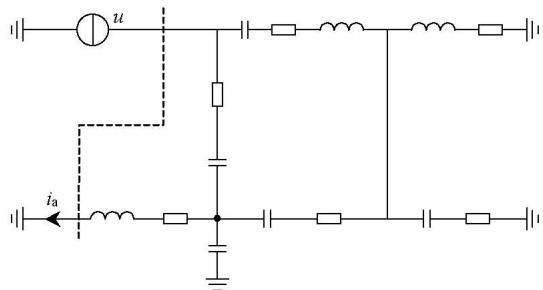  
图3 RLC电路  
Fig.3 RLC circuit

图4所示。可见FDNE与EMT的结果几乎一致，而Norton与EMT存在差别，尤其在扰动开始阶段误差更大。这是因为阶跃信号 $u$ 包括基波与高次谐波，普通诺顿等值电路不能精确模拟这些谐波的影响，而FDNE则能精确模拟这种影响。

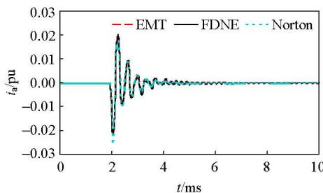  
图4 电流精度对比  
Fig. 4 Current accuracy comparison

# 3.2 IEEE 39节点系统

将FDNE应用到电磁-机电暂态混合仿真中。本文的算例系统基于新英格兰IEEE39节点系统修改而来，如图5所示。

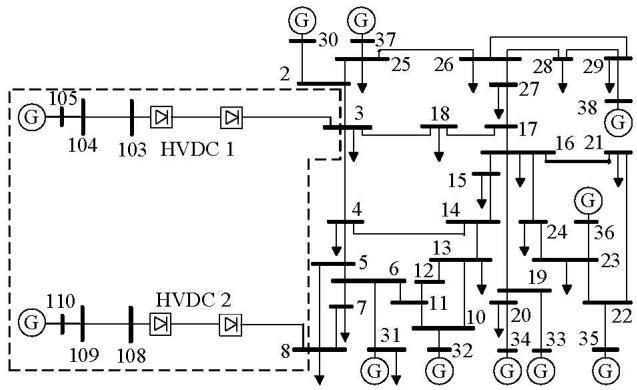  
图5 修改后的新英格兰IEEE39节点系统  
Fig. 5 Modified New England IEEE 39-bus system

接口位置选在母线3和母线8处。虚线框里的网络在电磁暂态模块中建模，剩余网络在机电暂态模块中建模。本文中的发电机、励磁器、调速器和负荷的动态模型均来来自于 $\mathrm{PSS / E}^{[19]}$ ，具体如表1所示。而电磁暂态仿真中的直流模型采用CIGRE

表 1 动态元件模型  
Tab. 1 Dynamic models   

<table><tr><td>元件</td><td>发电机</td><td>励磁器</td><td>调速器</td><td>负荷</td></tr><tr><td>模型</td><td>GENROU</td><td>IEEET1</td><td>IEEEEG1</td><td>ZIP</td></tr></table>

标准测试模型[20]。

下文中，全模型PSCAD/EMTDC仿真方法用符号EMT表示，本文的电磁-机电暂态混合仿真方法用符号 $\mathrm{EMT + TSA + FDNE}$ 表示。

# 1）曲线拟合精度。

对上述机电暂态侧网络求取对应的FDNE矩阵，其中某元素的幅值 $(M)$ -频率 $(f)$ 、相角 $(\delta)$ -频率(f)特性与原始频率特性对比如图6所示。由图可见其差别很小，说明矢量拟合法求取的有理函数可以精确表示原始网络的频率特性。如图所示无源校正前后的频率特性的差别也比较小，这说明基于摄动法的无源校正并没有改变FDNE的频率特性。

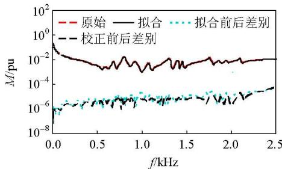  
(a) 幅频特性

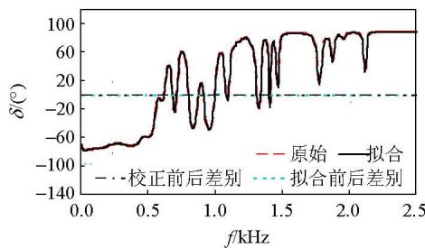  
(b) 相频特性  
图6FDNE与原始频率特性对比  
Fig. 6 Comparison between FDNE and original frequency characteristic

# 2）无源性。

图7(a)给出无源校正前后上述FDNE矩阵 $Y(s)$ 实部矩阵 $G(s)$ 在各个频率下的特征值 $\lambda$ 。原始矩阵 $G(s)$ 在频率 $2400\mathrm{Hz}$ 附近存在一个小于0的特征值，而无源校正后矩阵 $G(s)$ 的特征值全部大于0。分别将无源校正前后的FDNE矩阵应用到时域仿真中，观察初始化阶段线路104-103的母线103侧有功功率 $P$ 的变化过程。如图7(b)所示，原始模型在仿真初期是稳定的，但是随着仿真时间的增加仿真失

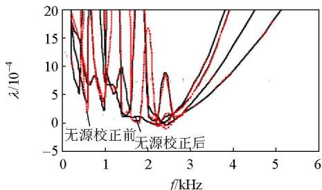  
(a) 无源校正前后矩阵 $G$ 特征值对比

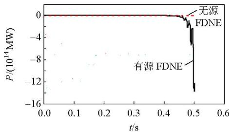  
(b) 无源校正前后仿真初始化对比  
图7 无源和有源FDNE对比  
Fig. 7 Comparison between passive FDNE and impulsive FDNE

而无源校正后模型的仿真过程一直是稳定的。由此可见摄动后的FDNE保证了电磁-机电暂态仿真中的稳定性。

3）基于FDNE的混合仿真。

为了说明基于FDNE的混合仿真的优势，本文设计了3种方式用于对比：

① 基于诺顿等值的混合仿真。

FDNE在基频 $(50\mathrm{Hz})$ 下的等值导纳就是传统诺顿等值电路中的等值导纳。将FDNE采样的频率范围限定至 $50\mathrm{Hz}$ ，该FDNE能准确表示 $50\mathrm{Hz}$ 下的频率特性，但不能准确表示其他频率下的频率特性。传统诺顿等值电路中的等值导纳采用不同的RLC元件组合电路表示，其在非基频下的频率响应也不同。因此，可以用上述方法模拟传统诺顿等值电路中的等值导纳在其他频率下的频率特性。将采用此FDNE进行电磁机电暂态混合仿真的方法标识为EMT+TSA+FDNE(50Hz)。

② 基于FDNE等值的混合仿真。

将FDNE采样的频率范围限定至 $1\sim 2\mathrm{kHz}$ ，所求出的FDNE在 $1\sim 2\mathrm{kHz}$ 可以准确地模拟原始网络的高频响应，将采用此FDNE进行电磁机电暂态混合仿真的方法标识为EMT+TSA+FDNE(1~2kHz)。

③全模型仿真。

不做等值，这种方法标识为EMT。

在母线3处发生三相金属短路故障，持续时间

为 $100\mathrm{ms}$ 。HVDC1注入交流系统的有功功率 $P$ 、HVDC2的关断角 $\theta$ 、电磁侧直流线路HVDC1逆变器交流侧母线3的A相电压 $u_{\mathrm{a}}$ 和直流线路HVDC2注入交流侧母线8的A相电流 $i_{\mathrm{a}}$ ，如图8所示。

由图8(a)、(b)可看出，方法EMT+TSA+FDNE $(1\sim 2\mathrm{kHz})$ 下的HVDC1向交流系统注入的有功功率和HVDC2的关断角在故障中和故障后更好地吻合全系统仿真结果；由图8(c)、(d)可看出，相对于方

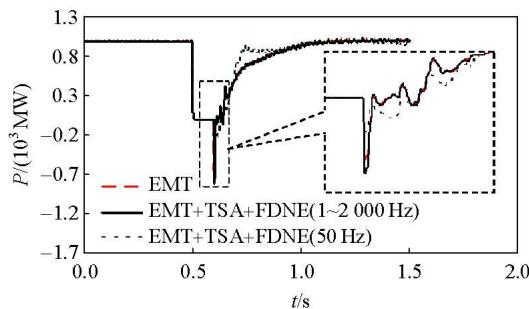  
(a) HVDC1注入交流系统的有功功率

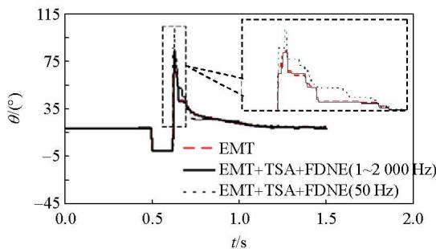  
(b) HVDC2 关断角

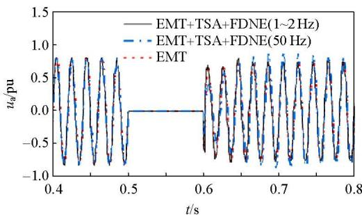  
(c) 直流线路 HVDC1 逆变器交流侧母线 3 的 A 相电压

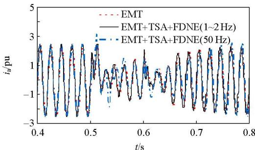  
(d) 直流线路 HVDC2 注入交流侧母线 8 的 A 相电流  
图8 FDNE的优势   
Fig. 8 Advantage of FDNE

法 EMT+TSA+FDNE(50 Hz)，方法 EMT+TSA+FDNE(1~2 kHz)能更好仿真出接口处的交流电压和交流电流。

# 4 结论

本文采用简单元件模型方法近似求取在指定频率点下网络中各元件的频率特性采样值，并对上述频率特性采样值运用整体矢量拟合法求取FDNE矩阵，最后通过无源校正法保证FDNE的无源性，进而保证了FDNE在仿真过程中的稳定性。仿真算例表明本文的FDNE求取方法能够准确反映原始网络的网络频率特性，将此FDNE应用到电磁-机电暂态混合仿真中，可以显著提高仿真精度。

# 致谢

感谢加拿大RTDS Technologies公司梁峰和Powertech Labs公司林曦等人对本文的贡献。

# 参考文献

[1] Reeve J, Adapa K. A new approach to dynamic analysis of AC networks incorporating detailed modeling of DC systems: parts I and II[J]. IEEE Transactions on Power Delivery, 1988, 3(4): 2005-2019.   
[2] Watson N R, Arrillaga J. Frequency-dependent AC system equivalents for harmonic studies and transient converter simulation[J]. IEEE Transactions on Power Delivery, 1988, 3(3): 1196-1203.   
[3] Morched A S, Gustavsen B, Tartibi M. A universal model for accurate calculation of electromagnetic transients on overhead lines and underground cables[J]. IEEE Transactions on Power Delivery, 1999, 14(3): 1032-1038.   
[4] Morched A S, Ottevangers J H, Marti L. Multi port frequency dependent network equivalents for the EMTP[J]. IEEE Transactions on Power Delivery, 1993, 8(3): 2005-2018.   
[5] Anderson G W J, Watson N R, Arnold C P, et al. A new hybrid algorithm for analysis of HVDC and FACTS systems[C]/The 1995 IEEE International Conference Energy on Management and Power Delivery. New York: The Institute of Electrical and Electronics Engineers INC., 1995: 8-16.   
[6] Gustavsen B, Semlysen A. Rational approximation of frequency domain responses by vector fitting[J]. IEEE Transactions on Power Delivery, 1999, 14(3): 1052-1061.   
[7] Lin X, Gole AM, Yu M. A wide-band multi-port system equivalent for real-time digital power system simulators[J]. IEEE Transactions on Power Systems, 2009, 24(1): 237-249.

[8] Liang Y, Lin X, Gole A M, et al. Improved coherency-based wide-band equivalents for real-time digital simulators[J]. IEEE Transactions on Power Systems, 2011, 26(3): 1410-1417.   
[9] 岳程燕.电力系统电磁暂态和机电暂态混合实时仿真的研究[D].北京：中国电力科学研究院，2004.YueChengyan．Study of power system electromagnetic transient and electromechanical transient real-time hybrid simulation[D].Beijing:China Electric Power Research Institute，2004(in Chinese).  
[10] 刘文焯，侯俊贤，汤涌，等．考虑不对称故障的机电暂态-电磁暂态混合仿真方法[J]. 中国电机工程学报，2010，30(13)：8-17. Liu Wenzhuo，Hou Junxian，Tang Yong，et al. Electromechanical transient/electromagnetic transient hybrid considering asymmetric faults[J]. Proceedings of the CSEE，2010，30(13)：8-17(in Chinese).  
[11] 柳勇军.电力系统机电暂态和电磁暂态混合仿真技术的研究[D].北京：清华大学，2005.Liu Yongjun. Study of power system electromagnetic transient and electromechanical transient hybrid simulation[D]. Beijing: Tsinghua University, 2005(in Chinese).   
[12] 张树卿．交直流系统电磁/机电暂态混合实时仿真关键技术的研究[D]. 北京：清华大学，2010. Zhang Shuqing. Research on key techniques of electromagnetic/electromechanical hybrid real-time simulation of AC-DC transmission system[D]. Beijing: Tsinghua University, 2010(in Chinese).   
[13] 贾旭东. 基于 RTDS 的交直流系统实时数字仿真方法研究与实现[D]. 北京：华北电力大学，2009.  
Jia Xudong. Research and implementation of real-time digital simulation method of AC-DC power system based on RTDS[D]. Beijing: North China Electric Power University, 2009(in Chinese).   
[14] Wang L W, Fang D Z, Chung T S. New techniques for enhancing accuracy of EMTP/TSP hybrid simulation algorithm[C]//The 2004 IEEE International Conference on Electric Utility Deregulation Restructuring and Power Technologies. Hong Kong: IEEE Joint Chapter of Power Engineering, Industry Applications, Power Electronics, and Industrial Electronics Societies, 2004: 734-739.   
[15] 王路，李兴源，颜泉，等．交直流混联系统的多速率混合仿真技术研究[J]. 电网技术，2005，29(15)：23-27. Wang Lu, Li Xingyuan, Yan Quan, et al. Study on multi-rate hybrid simulation technology for AC/DC power system[J]. Power System Technology, 2005, 29(15): 23-27(in Chinese).

[16] 刘浩明，朱浩骏，严正，等. 含统一潮流控制器装置的电力系统动态混合仿真接口算法研究[J]. 中国电机工程学报，2005，25(16)：1-7.  
Liu Haoming, Zhu Haojun, Yan Zheng, et al. Study on interface algorithm for power system transient stability hybrid-model simulation with UPFC device[J]. Proceedings of the CSEE, 2005, 25(16): 1-7(in Chinese).   
[17] Gustavsen B, Semlyen A. Fast passivity assessment for S-parameter rational models via a half-size test matrix[J]. IEEE Transactions on Microwave Theory and Techniques, 2008, 56(12): 2701-2708.   
[18] Gustavsen B. Enforcing passivity for admittance matrices approximated by rational functions[J]. IEEE Transactions on Power Systems, 2001, 16(1): 97-104.   
[19] Siemens Energy Inc. PSS/E 32 program operation manual[R]. New York, USA: Siemens Energy Inc., 2009.   
[20] Szechtman M, Wess T, Thio C V. A benchmark model for HVDC system studies[C]//The International Conference on AC and DC Power Transmission. London: Power Division of the Institution of Electrical Engineers, 1991: 374-378.

  
张怡

收稿日期：2011-12-10。

作者简介：

张怡(1985)，男，博士研究生，主要从事电力系统机电暂态与电磁暂态混合仿真、暂态稳定及其安全分析方面的研究工作，veriasea@gmail.com;

吴文传(1973)，男，博士，副教授，博士生导师，主要从事电力系统调度自动化和配电自动化方面的研究工作，wuwench@tsinghua.edu.cn;

张伯明(1948)，男，博士，教授，博士生导师，IEEE Fellow，主要从事电力系统分析和调度自动化方面的研究工作，zhangbm@tsinghua.edu.cn;

Aniruddha M. Gole(1955), 男, 博士, 教授, 加拿大工程院院士, IEEE Fellow, 主要从事电力系统电磁暂态仿真、HVDC 稳定性分析等方面的研究工作, gole@ee.umanitoba.ca。

(责任编辑 谷子)

# Frequency Dependent Network Equivalent for Electromagnetic and Electromechanical Hybrid Simulation

ZHANG Yi $^{1}$ , WU Wenchuan $^{1}$ , ZHANG Boming $^{1}$ , Aniruddha M. Gole $^{2}$

(1. Tsinghua University; 2. University of Manitoba)

KEY WORDS: electromagnetic transient; electromechanical transient; frequency dependent network equivalent; passive; vector fitting

The frequency dependent network equivalent (FDNE) can represent not only the fundamental frequency response but also the high frequency response of the network. Thus, it can accommodate the waveform distortion at the interface located in electromagnetic and electromechanical transient hybrid simulation. The FDNE can be described by a mathematical form including $s$ -domain rational functions shown in

$$
y (s) = \sum_ {i = 1} ^ {n} \frac {c _ {i}}{s - a _ {i}} + d + s h \tag {1}
$$

Where, poles $a_{i}$ and residues $c_{i}$ are the real quantities or come in conjugate pair, $d$ and $h$ are the real number, and $n$ is the number of poles.

In this paper, the FDNE is obtained through the following procedures:

1) Acquiring network frequency response samples.

Different types of power system elements are first simplified to obtain the positive, negative, and zero sequence of the node admittance matrices at different frequencies. The three matrices are then converted into a three-phase node admittance matrix, and then reduced to the boundary buses by using standard Gauss elimination.

2) Fitting the FDNE samples into rational functions.

After the samples of the FDNE are obtained, the sum of the element is first fitted to obtain a set of common poles instead of fitting the elements individually by vector fitting and then the common poles are used to fit the elements one by one to make sure all the elements share the same set of poles.

3) Perturbation based passivity enforcement.

The fitted rational functions should be passive to guarantee the stability of simulations. The general

concept is to first detect the frequency boundary of the passivity violations by using a half-size passivity test matrix and then perturb the parameters in Equ. (1) to guarantee its passivity.

The New England IEEE 39-bus system is used to prove the accuracy and merits of the FDNE. The errors ('Error 1' is the error between the original frequency response and the one obtained by vector fitting, and 'Error 2' is the error between the fitted frequency response and one obtained after passivity enforcement) are very small, as shown in Fig. 1(a). Electromagnetic transient (EMT)+transient stability analysis (TSA)+ FDNE $(1\sim 2\mathrm{kHz})$ is much closer to the full EMT simulation than EMT+TSA+FDNE $(50~\mathrm{Hz})$ , which is used to approximate the traditional Norton admittance method as illustrated in Fig. 1(b).

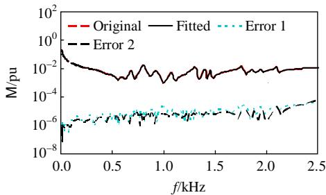  
(a) Frequency response comparison

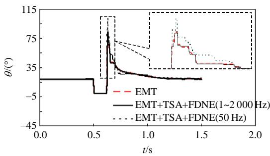  
(b) Advantage of the FDNE   
Fig.1 Results comparison