# Interpolation for power electronic circuit simulation revisited with matrix exponential and dense outputs

Peng Li, Zixiang Meng, Xiaopeng Fu⁎ , Hao Yu, Chengshan Wang

Key Laboratory of Smart Grid of Ministry of Education, Tianjin University, Tianjin, China

# A R T I C L E I N F O

Keywords:

Electromagnetic transients

Power electronic

Exponential integrator

Dense output formula

# A B S T R A C T

With a high penetration of power electronic equipment, transient simulation for power electronic circuit has been a main challenge for performance improvement of the electromagnetic transient simulation tools. In this paper, two new solvers for the matrix exponential-based simulation method are proposed based on the dense output formula and Padé approximation of different orders. The proposed solvers are implemented with the optimal combination of numerical integration method and interpolation method. Both solvers are L-stable. One has 3rd-order accuracy which is more accurate than existing simulation tools in power electronic simulation. The other solver achieves 1st-order accuracy with a lower precision numerical integration method than the sameorder algorithms and is appealing from computation speed perspective. Numerical studies including TCR circuit and two types of VSC-HVDC systems are conducted to demonstrate the effectiveness of the proposed solvers.

# 1. Introduction

With large-scale application of power electronic equipment, the power system is facing unprecedented challenges in its operation and control. Considering the interaction between the high frequency power electronic circuits and control systems, the electromagnetic transient (EMT) simulation programs become the preferred choice among system dynamic analysis tools [1]. The increasing system scale and complexity has attracted more and more attention on the computational efficiency and accuracy of EMT simulation. Facing these challenges, traditional EMT simulation methods may experience reduced accuracy level and smaller step sizes with more computational burden. All of these have pushed the research on a more accurate and efficient EMT simulation method.

The current mainstream EMT simulation tools are the Electro-Magnetic Transient Program (EMTP)-type programs, which are based on the nodal analysis framework [2]. Among them, EMTP [3], PSCAD [4], and ATP [2,5] are commonly used. The trapezoidal integration formula is adopted as the numerical integration method for simulation calculation in most of the tools with a few exceptions such as XTAP [6]. The trapezoidal method has the characteristics of A-stability and 3rdorder local truncation error (LTE), while the 2s-DIRK formula adopted in XTAP has also L-stability. The modified-augmented-nodal analysis is

proposed in [3] and applied in EMTP, which eliminates various limitations of the classical nodal and modified nodal analysis. For the switch events, PSCAD uses linear interpolation for the switching event localization and a half-step linear interpolation to suppress oscillations [4,7]. The difficulty of using higher-order interpolation formulas lies in the lack of extra points for the one-stage methods. EMTP implements Backward Euler integration for the steps after switch events to avoid numerical oscillation. The power switches are optionally modeled as nonlinear elements and solved in an iterative solution process for the accurate calculation of switch status. These 2nd-order accurate approaches, however, are reported to experience accuracy degradation for the simulation of power electronic converter studies [8].

State space formulation is an alternative framework for EMT simulation with the advantage of flexible choice of various integration methods. It can be used in combination with the nodal analysis formulation through SSN (state-space nodal) method [9]. An example in this category is the ARTEMiS art5 solver of RT-LAB, which is based on the Padé [2/3] approximation of the matrix exponential and achieves 5th-order accuracy [10]. However, the standard ARTEMiS solver does not locate switch events, which leads to similar problems as the above tools. Recently, an improved transient simulation algorithm combining TR-BDF2 method and quadratic interpolation formula was proposed [11]. TR-BDF2 is a two-stage implicit method, which enables the

adoption of quadratic interpolation and keeps the $2 ^ { \mathrm { n d } }$ -order accuracy at switch events. However, two-stage methods require more computation per step than the one-stage methods.

The matrix exponential-based integration method, originated from the applied mathematics community [12], is recently proposed to be used in power system EMT simulations [13]. Case studies have shown that compared to existing algorithms, matrix exponential method is competitive in accuracy and efficiency aspects [14], despite of the same linear interpolation approach being used which limits the overall accuracy. It is noted that a salient advantage of the matrix exponentialbased methods is the existence of very efficient yet accurate dense output formulas, meaning that state variables at fractional step sizes are cheaply available in comparison to the multi-stage methods. This is achieved through unique properties of the exponential function and implemented with a modified scaling and squaring method [15]. The mentioned dense output formula opens the door to efficient combination of matrix exponential-based integration and high-order interpolations.

In this paper, rational function approximation of flexible order of the matrix exponential is used to control the accuracy of time-integration. Dense output formula associated with the integration method is utilized for the extra internal points so that higher-order interpolations can be combined with matrix exponential-based method. A matching strategy is proposed to guide this combination aiming for the best computation cost-effectiveness. Two new solvers for matrix exponential-based method that are both L-stable and suitable for power electronic circuit simulations are proposed as examples of this matching strategy and discussed in details. One of them have $3 ^ { \mathrm { r d } }$ -order accuracy and provides improved accuracy than the currently available simulation tools. Appropriate combination of integration methods and interpolation methods improves the reduction of precision at switch events.

Section II briefly reviews the matrix exponential-based simulation formulation and proposes high order interpolation method based on dense output points. Section III discusses the accuracy of several methods and articulates two new solvers based on the proposed matching strategy. Section IV presents case studies to demonstrate the performance of the proposed algorithms. The conclusions are summarized in Section V.

# 2. Matrix exponential-based transient simulation and high order interpolation

# 2.1. Transient simulation based on matrix exponential

In the state space formulation of EMT simulations, the power system models are described by a system of ordinary differential equations. Since non-autonomous systems can be easily transformed into autonomous form by introducing time as an auxiliary state, the presentation of this paper is focus on the latter case. A system with p independent switch groups has a general form as (1).

$$
\begin{array}{l} \dot {\mathbf {x}} (t) = \mathbf {A} \mathbf {x} (t) + \mathbf {B} \mathbf {u} (t) \\ \textbf {A} = \textbf {A} _ {0} + \sum_ {i = 1} ^ {P} \mathbf {A} _ {i} S _ {i} \\ \mathbf {B} = \mathbf {A} _ {0} + \sum_ {i = 1} ^ {p} \mathbf {B} _ {i} S _ {i} \tag {1} \\ \end{array}
$$

where x(t), u(t) are state variables, input variables, respectively, and $A _ { 0 } , B _ { 0 } , A _ { i } , B _ { i } ( i { = } 1 , 2 , . . . , p )$ are coefficient matrices. S represents the state of the i-th independent switch group, which is of binary value, corresponding to on and off, respectively. For a linear system, the simplest exponential integration formula is derived assuming a constant u(t) over the interval $[ t _ { 0 } , t _ { 0 } + h ]$ , which is

$$
\begin{array}{l} \mathbf {x} (t _ {0} + h) \approx [ \mathbf {I} _ {n} \quad \mathbf {0} ] \cdot \mathbf {e} ^ {h \widetilde {\mathbf {A}}} \widetilde {\mathbf {x}} _ {0} \\ \widetilde {\mathbf {A}} = \left[ \begin{array}{c c} \mathbf {A} & \mathbf {B u} (t _ {0}) \\ \mathbf {0} & 0 \end{array} \right] \\ \widetilde {\mathbf {x}} _ {0} = \left[ \begin{array}{l l} \mathbf {x} (t _ {0}) & 1 \end{array} \right] ^ {\mathrm {T}} \tag {2} \\ \end{array}
$$

where h is the simulation step size and $I _ { n }$ is the identity matrix. It turns out this formula is sufficiently accurate for a large portion of power system simulation studies and is especially attractive due to its high computation speed. A discussion of the nonlinear system solution is referred to [16].

Practical application of formula (2) requires efficient computation of the matrix exponential function $\boldsymbol { \mathrm { e } } ^ { h A }$ . A viable option is the Padé function approximated $\mathrm { e } ^ { h A } \approx r _ { k m } ( h A ) ,$ where k is the order of the numerator and m is the order of the denominator [17]. The local error introduced by the Padé [k/m] approximation is of order of $O ( h ^ { k + m + 1 } )$ [18].

$$
e ^ {h \boldsymbol {A}} - r _ {k m} (h \boldsymbol {A}) = O \left(\left(h \boldsymbol {A}\right) ^ {k + m + 1}\right) = O \left(h ^ {k + m + 1}\right) \tag {3}
$$

Eq. (3) illustrates that the matrix exponential operator of particular accuracy can be obtained by adjusting parameter k and m in Padé approximation. In other words, the accuracy of matrix exponential-based integration can be controlled by adjusting the Padé approximation coefficients. This variable-order integration formula is referred as MEXP hereinafter.

# 2.2. Dense output formulas

Accurate dense output formula is based on the scaling and squaring method [19], and returns 2s -1 internal outputs where s is the scaling parameter of the method. The first s outputs located at $t _ { 0 } + h / 2 ^ { s - i }$ , $i = 0 , . . . , s - 1$ are as follows.

$$
\mathbf {x} \left(t _ {0} + \frac {h}{2 ^ {s - i}}\right) \approx \left[ \mathbf {I} _ {\mathrm {n}} \quad \mathbf {0} \right] \cdot \mathbf {e} _ {2 ^ {\frac {h \widetilde {\mathbf {A}}}{s - i}}} \cdot \widetilde {\mathbf {x}} _ {0}, i = 0, 1, \dots , s - 1 \tag {4}
$$

The above formula reuses the intermediate results of the scaling and squaring method and has no additional cost. This efficiency is achieved by exploiting the matrix calculation results of the large exponential integration steps. Considerable computation savings are realized compared to a smaller step simulation which generates the same number of output points. In addition, because these dense outputs amount to simulation results of repeatedly halved step sizes, their accuracy is no worse than that of the original ${ \pmb x } ( t _ { 0 } + h )$ . The full dense output formula for the complete $2 ^ { s } - 1$ outputs are available in [19].

# 2.3. High order interpolation

For many existing simulation tools including the matrix exponential-based simulation program, the low precision treatment of the switch events is the bottleneck of the overall simulation accuracy. The key to improve is to simply use more accurate interpolation formulas. For one-stage methods, e.g. the widely used trapezoidal method, the difficulty of using higher-order interpolation formulas lies in the lack of efficient yet accurate extra points. Using previous step points leads to complication in the solution process. In order to apply second or higherorder interpolation formulas, it is necessary to have other inner output points. At least one extra accurate point is necessary for using quadratic interpolation. For this purpose, the accuracy and efficiency of dense output formulas satisfy this requirement. With a very conservative scaling of $s = 1 ,$ , formula (4) is able to provide the internal point that quadratic interpolation needs and increase the accuracy order by one. Intermediate points can be also found using variable time-step in nodal analysis methods, $\mathbf { e . g . , }$ through the proposed methods in [20].

The process of quadratic interpolation with multiple switching is shown in Fig. 1. Step ①②④⑥ are numerical integration steps and step ③⑤⑦ are interpolation steps. The first time-step from $t _ { 0 } \mathrm { - } h$ to $t _ { 0 }$ is a

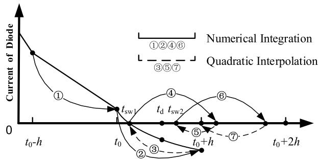  
Fig. 1. Quadratic interpolation with multiple switch events.

normal step without switching events. Then starting from $t _ { 0 } ,$ an integration step of matrix exponential is performed. If a switching event occurs, the trigger of the switch event, e.g., the change of current direction, would be detected. And the points at $t _ { 0 } , t _ { \mathrm { d } } , t _ { 0 } { + } h$ would be used in quadratic interpolation to locate the first switch event. Next, another numerical integration step would be performed to look for other switching events in the time step from $t _ { 0 }$ to $t _ { 0 } + h$ if they exist. Until all switching events have been located, the last interpolation is used to makes time return to the integer step point for the following simulation computation. The process of solving multiple switching events shown in Fig. 1 is one of the most accurate methods among the various options proposed in [21]. Quadratic Lagrange interpolation formula is used in the process of switch localization and in resynchronization to control the error introduced by the interpolation method.

# 3. Matching strategy of integration and interpolation errors and solver design

# 3.1. Approximation errors from different stages in switch events handling

MEXP is based on the state space formulation and there is no reinitialization step in the algorithm flow in contrast to nodal analysis algorithms with interpolation. L-stable integration is free from oscillations resulting in no need for additional elimination of the numerical oscillations. The error sources of MEXP are primarily integration and interpolation. As mentioned previously the matrix exponential is calculated with variable-order rational function approximation in previous research, where the Padé approximation parameters k and m range from 3 to 13, leading to an $ { \bar { O ( } } h ^ { 7 }  { \sim } h ^ { 2 7 } )$ integration error. Linear interpolation introduces an $O ( h ^ { 2 } )$ local error in steps with switch events. Local error sources of MEXP are summarized in Table 1. alongside with two commonly used EMT simulation tools EMTP and PSCAD, as reported in [8]. Unsynchronized switch refers to that EMTP does not locate the time when switch events occur.

Assuming that the local errors will not be magnified by system dynamics, the global error can be predicted by studying the mechanism of local error accumulation in the simulation process. The effect of local error accumulation on global error is summarized in [8], where the relative rms error is used as global error to assess the accuracy of the algorithms:

Table 1 Local approximation errors at switch events.   

<table><tr><td>Error sources</td><td>MEXP</td><td>EMTP</td><td>PSCAD</td></tr><tr><td>Integration error</td><td>O(h7~h27)</td><td>O(h3)</td><td>O(h3)</td></tr><tr><td>Unsynchronized switch</td><td>/</td><td>O(h)</td><td>/</td></tr><tr><td>Interpolation</td><td>O(h2)</td><td>/</td><td>O(h2)</td></tr><tr><td>Suppression of Oscillations</td><td>/</td><td>O(h2)</td><td>O(h)</td></tr></table>

a) Assuming the local errors at each step satisfy $\begin{array} { r } { | e _ { k } | \le M h ^ { q } , } \end{array}$ , in which M is a constant, the global error is proved to be of $( q { - } 1 ) ^ { \mathrm { t h } }$ -order.

b) Assuming the local error introduced at a finite number of switch events satisfies $| e _ { k } | \le M h ^ { q }$ |and dominates, we have $q ^ { \mathrm { t h } }$ -order global error.

Taking error sources and error accumulation into account, the performance in different scenarios of EMT simulation tools can be assessed. When there is no switching event in the simulation, the integration error is the dominant error and determines the global error. Under this circumstance, EMTP and PSCAD can achieve $2 ^ { \mathrm { n d } }$ -order accuracy, while MEXP can achieve at least $6 ^ { \mathrm { t h } }$ -order accuracy. However, for high-frequency power electronic circuit simulations, unsynchronized switches lead to an O(h) local error for EMTP and a halfstep linear interpolation leads to an O(h) local error for PSCAD. The accuracy of EMTP and PSCAD reduce from $O ( h ^ { 2 } )$ to O(h). Similarly, MEXP suffers loss of accuracy and retains only $O ( h ^ { 2 } )$ global accuracy, measured with the relative rms error.

The common point of the three methods is that they all have higher accuracy in simulation without switch events and will face the problem of precision reduction when switch events occur. Linear interpolation is obviously not accurate enough for matrix exponential-based methods. It is straightforward to apply higher-order interpolation methods and improve the error of matrix exponential-based integration method.

# 3.2. A matching strategy of integration and interpolation method and solver proposition

When choosing numerical integration method and method of locating switch events like interpolation, we should pay attention to the matching between them, otherwise it may face loss of accuracy and waste of computing resources in power electronic simulation. It is preferable to use L-stable integration method to avoid numerical oscillations.

Assuming the errors are introduced only by numerical integration method and interpolation method, which are $q ^ { \mathrm { t h } } ,$ -order and $p ^ { \mathrm { t h } } .$ -order, respectively, the reasonable matching strategy can be described as:

a) When $p { = } q { - } 1$ , the global error determined by both methods is $( q \cdot$ $1 ) ^ { \mathrm { t h } } .$ -order, so the algorithm is economical in this combination.

b) When $p { = } q ,$ , the global error determined by numerical integration method is $( q { - } 1 ) ^ { \mathrm { t h } }$ -order, while the global error determined by interpolation method is $q ^ { \mathrm { t h } }$ -order. The $q ^ { \mathrm { t h } }$ -order accurate interpolation method puts no barrier on the accuracy of the integration and practically achieves better results. It makes sense to use a slightly more accurate interpolation when the added cost is only marginal.

In short, the matching strategy of numerical integration and interpolation methods is to combine numerical integration methods with $q ^ { \mathrm { t h } } .$ - order LTE with $q ^ { \mathrm { t h } }$ -order or $( q { - } 1 ) ^ { \mathrm { t h } }$ -order interpolation method.

On the basis of this matching strategy, more economical solver options can be found for the matrix exponential-based method. Under the conservative scaling parameter $s = 1$ , which means at least one dense output is available upon request, two solver options are proposed naturally to make full use of the advantage of matrix exponential. If linear interpolation with $2 ^ { \mathrm { n d } }$ -order accuracy is used to locate switch events, according to the matching strategy, the numerical integration method with $2 ^ { \mathrm { n d } }$ -order or $3 ^ { \mathrm { r d } }$ -order accuracy should be chosen. The numerical integration method with $3 ^ { \mathrm { r d } }$ -order or $4 ^ { \mathrm { t h } }$ -order accuracy is another choice if quadratic interpolation is used.

Table 2 lists the potential options for matrix exponential approximation from $2 ^ { \mathrm { n d } }$ order to $4 ^ { \mathrm { t h } }$ order to combine with different interpolation methods. Among them, the first row has the same form as the

Table 2 Options for matrix exponential approximation.   

<table><tr><td>Padé [k/m] Approximation</td><td>Local error</td><td>ez≈ km(z)</td></tr><tr><td>[1/0]</td><td>O(h2)</td><td>r10(z) = 1 + z</td></tr><tr><td>[0/1]</td><td>O(h2)</td><td>r01(z) = 1/1-z</td></tr><tr><td>[1/1]</td><td>O(h3)</td><td>r11(z) = 2+z/2-z</td></tr><tr><td>[1/2]</td><td>O(h4)</td><td>r12(z) = 6+2z/z2-4z+6</td></tr></table>

forward Euler method which is not A-stable, and the third row has the same form as the implicit trapezoid method and may face the problem of numerical oscillation, and is therefore eliminated. Padé [0/1] exponential formula combined with linear interpolation and Padé [1/2] exponential formula combined with quadratic interpolation are more reasonable choices. For easy reference, these two options are abbreviated as ExP01-L and ExP12-Q, respectively.

ExP01-L combines formula (2) and Padé [0/1] exponential operator, when it is used to calculate a step from $t _ { k }$ to $t _ { k } + h ,$ the formula is given by

$$
\mathbf {x} \left(t _ {k} + h\right) \approx \left[ \mathbf {I} _ {n} \quad \mathbf {0} \right] \cdot \left(\frac {1}{1 - h \widetilde {\mathbf {A}}}\right) \cdot \overline {{\mathbf {x}}} _ {k} \tag {5}
$$

Linear interpolation would be used to control the error introduced by switches if switch events occur. Padé [0/1] exponential operator has the same form as the integral operator of backward Euler method which is L-stable, and ExP01-L does not have the problem of numerical oscillation. The local error at every step is $O ( h ^ { 2 } ) ,$ so ExP01-L has O(h) global accuracy when there exists high-frequency switches in system, the same with PSCAD and EMTP.

When Exp12-Q is used to calculate a step from t to $t _ { k } + h ,$ , the formula is given by

$$
\mathbf {x} \left(t _ {k} + h\right) \approx \left[ \mathbf {I} _ {n} \quad \mathbf {0} \right] \cdot \left(\frac {6 + 2 h \widetilde {\mathbf {A}}}{\left(h \widetilde {\mathbf {A}}\right) ^ {2} - 4 h \widetilde {\mathbf {A}} + 6}\right) \cdot \widetilde {\mathbf {x}} _ {k} \tag {6}
$$

Padé [1/2] exponential operator has ${ \cal O } ( h ^ { 4 } )$ local error, which make ExP12-Q can achieve $3 ^ { \mathrm { r d } } .$ order accuracy at steps without switches. The quadratic interpolation formula preserves $3 ^ { \mathrm { r d } } .$ -order accuracy when switch events occur, which makes ExP12-Q have the highest accuracy among all the mentioned methods in power electronic circuits simulation.

# 4. Case studies

This section presents a series of case studies to demonstrate the proposed solvers and compare with widely used EMT simulation tools including EMTP, PSCAD and ARTEMiS. The cases are intentionally made to have manageable complexity so that the action of each solver is clear. Because PSCAD cannot solve the ideal switches, the binary on/off resistance model of power electronic devices are adopted the first two cases to maintain a common reference result. And ideal switch model is used in the last case to prove that the analysis and models are also effective under this model. The EMTP simulations are performed with the simultaneous switching option enabled. The interpolation option of ARTEMiS solvers, available separately from the standard package, is not used in these comparisons. The matrix exponential-based algorithms ExP01-L and ExP12-Q are implemented in an experimental MATLAB code.

# 4.1. Thyristor controlled reactor

In order to verify that ExP01-L and ExP12-Q have the expected accuracy and the correctness of the matching strategy, a small case of thyristor controlled reactor (TCR) circuit shown in Fig. 2 is simulated.

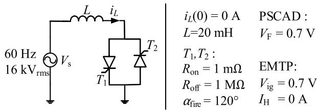  
Fig. 2. Single-phase TCR circuit.

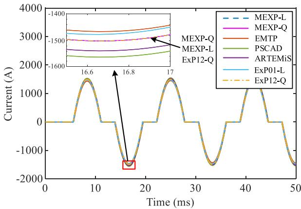  
Fig. 3. Simulation results of TCR circuit with 50μs step size.

Analytic solution is used as the reference result thanks to the simplicity of this case. To illustrate the matching strategy of the paper, matrix exponential-based methods proposed in previous research is also added to the comparison, referred as MEXP-L and MEXP-Q, which stands for the matrix exponential-based method with linear and quadratic interpolation, respectively.

As Fig. 3 shows, the overall shape of simulation waveforms from different methods is close. However, a deviation between the waveforms are in the range of $1 0 ^ { 1 }$ to 102 , roughly 3% of the maximum current value. Fig. 4 shows the absolute errors between these methods from the analytic solution. The errors all rapidly increase when the switches close and then decrease when the switches open, so the larger errors during the closing of the switches have a major impact on accuracy. The maximum errors of the $1 ^ { \mathrm { s t } } .$ -order accuracy methods, EMTP, PSCAD, ARTEMiS and $\operatorname { E x P 0 1 - L } ,$ are in the range of $1 0 ^ { 1 } .$ . Although ExP01-L uses the lowest precision numerical integration method and ARTEMiS uses the highest, their global accuracy orders measured from relative rms errors are the same. The choice of the Padé [0/1] approximation is acceptable for this case as it has the same level of relative error with the widely used PSCAD and EMTP. As a $2 ^ { \mathrm { n d } }$ -order

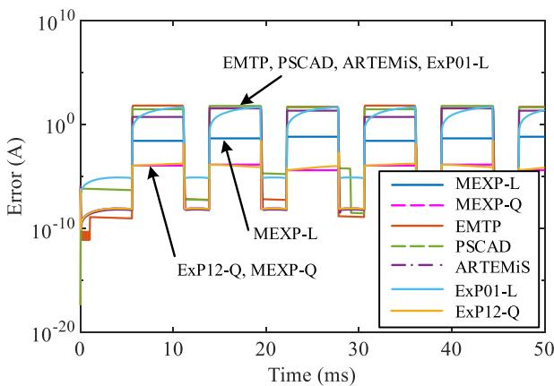  
Fig. 4. Absolute error of different methods with 50μs step size.

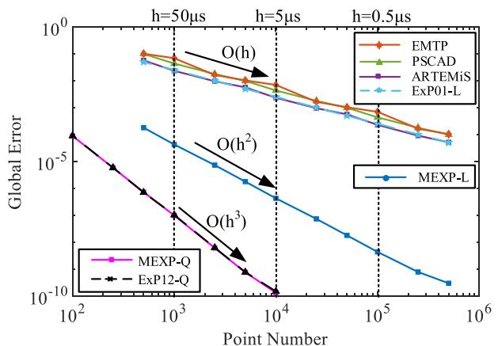  
Fig. 5. Global error of different methods in TCR case.

accurate method, MEXP-L has three order of magnitude smaller maximum error compared to these 1st-order methods. As 3rd-order accuracy methods, MEXP-Q and ExP12-Q has additional three order of magnitude smaller maximum error than MEXP-L. Although ExP12-Q uses lower precision numerical integration method than MEXP-Q, it has minor effect on overall accuracy of the algorithm, strengthening the importance of the matching between integration and interpolation.

Fig. 5 shows the step size versus global error chart to show clearly the order of each compared solvers. The computation of global error excludes the first point after each switch event, as indicated in [8]. ExP01-L has the same O(h) global accuracy with EMTP, PSCAD and ARTEMiS, confirming the previous analysis. Furthermore, for this case the error of ExP01-L is smaller than EMTP and PSCAD under all step sizes and achieves similar accuracy as ARTEMiS. The deviation is likely from the difference between state space formulation and nodal analysis formulation.

ExP12-Q has O(h3 ) global error, which is the highest among all mentioned methods. It can be seen that the global error of ExP12-Q is six orders of magnitude smaller than that of PSCAD, EMTP and ARTEMiS, and three orders smaller than that of the MEXP-L at 50μs step size. Moreover, because of the $3 ^ { \mathrm { r d } }$ -order global error property, the accuracy advantage will be more obvious when smaller step sizes are used. The curves of ExP12-Q and MEXP-Q almost coincide, which indicates that although Exp12-Q uses a lower order matrix exponential approximation than that of MEXP-Q, the accuracy reduction is limited and the impact on accuracy is not obvious.

ExP01-L and ExP12-Q solvers both achieve the expected accuracy in this example. Comparisons with the same-order algorithms show that we can get the same or better accuracy by applying the proper combination between numerical integration and interpolation methods and uses lower precision numerical integration schemes than previous research, achieving lower computational cost with reasonable accuracy loss.

# 4.2. 2-level VSC AC-DC System

A VSC-HVDC system is simulated to validate the solver performance in high-frequency converter systems. The system structure is shown in

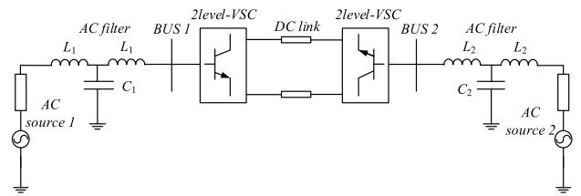  
Fig. 6. 2-level VSC AC-DC system.

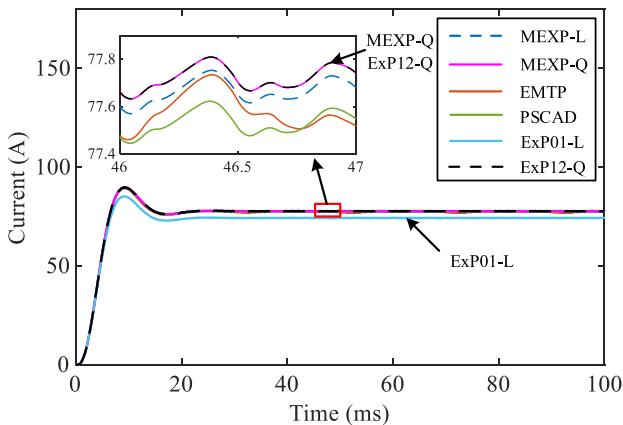  
Fig. 7. DC current of different methods in 2-level VSC system.

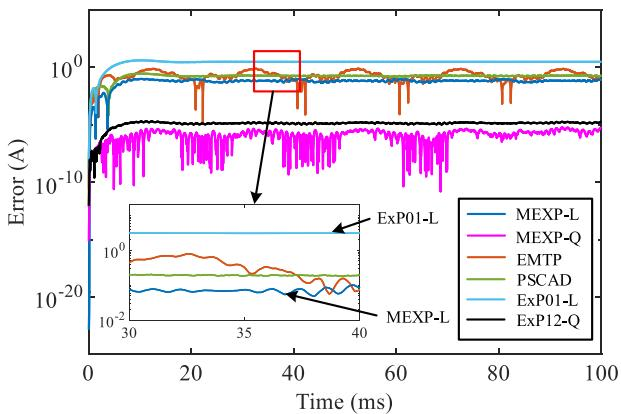  
Fig. 8. Absolute error comparison in 2-level VSC system.

Fig. 6. Detailed system parameters are listed in Appendix A [22]. Openloop PWM modulation is used in this case. This simulation is started from zero states and the time span is 0.1 seconds with step size of 5μs adopted. Analytic solution is difficult to derive for this case due to the complexity of the system. In this example, the results of each method with ten times smaller step size are used for their respective reference.

Fig. 7 displays the DC current waveforms, where the results simulated by these methods stay close. The error comparison in Fig. 8 shows that the absolute errors of ExP01-L is larger than those of other 1st-order accurate solvers. This reveals the issue that solvers with the same global accuracy order can deliver qualitatively different simulation results, and it is not fixed which error is greater, for both of the global error dominated by numerical integration method and interpolation are $1 ^ { \mathrm { s t } } \mathrm { . }$ order accuracy. In TCR case, ExP01-L is more accurate than EMTP and PSCAD, while the global error of ExP01-L is greater in the simulation of VSC- HVDC system. ExP12-Q and MEXP-Q have the highest accuracy than other methods, which is the same as the conclusion of TCR example. Compared with other methods, the errors of the two methods are 4-5 orders of magnitude smaller with the step size of 5μs. The error of ExP12-Q is less than one order of magnitude larger than that of MEXP-Q, which states that the loss of accuracy is limited, although the numerical integration method with lower accuracy is used.

# 4.3. Single-phase MMC-HVDC

The third test case is an open-loop nearest level controlled one phase of a modular multilevel converter (MMC) system containing 8 MMC sub modules. The structure of test case is illustrated in Fig. 9 and detailed system parameters are listed in Appendix B. As mentioned before, the ideal switching model is used in this case. MEXP-L, MEXP-Q and EMTP are used to compare with the proposed methods. The simulation time span is 0.1 second with a step size of 20μs adopted. The

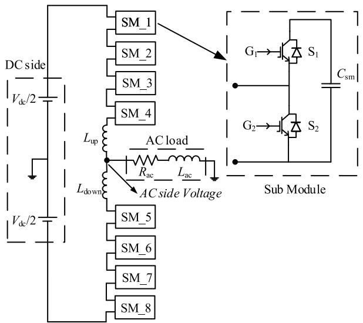  
Fig. 9. MMC-HVDC system and the structure of MMC.

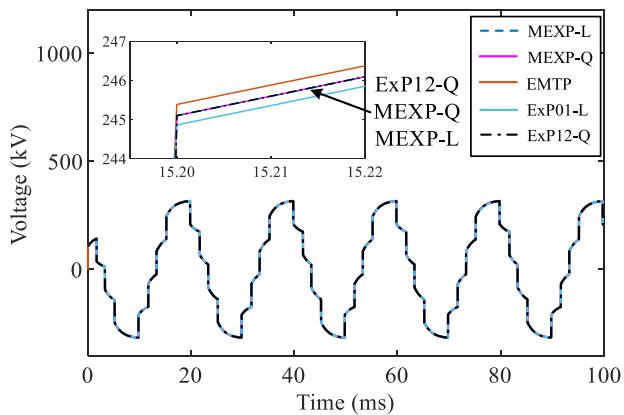  
Fig. 10. AC side Voltage of different methods in MMC-HVDC system.

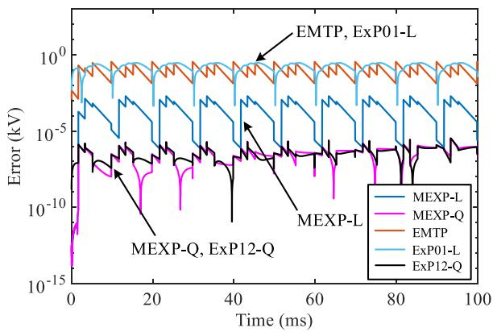  
Fig. 11. Absolute error comparison in MMC-HVDC system.

results of each method with 0.1μs step size are used for their respective reference. The simulation results computed by different methods are shown in Fig. 10 and Fig. 11.

As Fig. 10 shows, the curves calculated by different methods are basically the same. Absolute errors of different methods are specifically shown in Fig. 11: EMTP has the largest error, and Exp01-L has the same order of magnitude error. Compared with 1st-order methods, MEXP-L has three orders of magnitude smaller error; while Exp12-Q and MEXP-

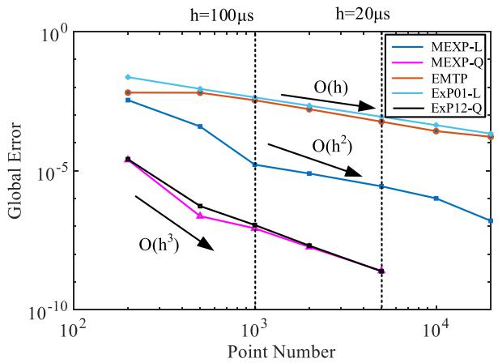  
Fig. 12. Global error of different methods in Single-phase MMC case.

Q have almost coincident error curves and three more orders of magnitude smaller error than MEXP-L. It must be noted that the errors from all methods remain negligible from a practical point of view, as the relative errors are all below 0.1%.

After that, the global errors of various methods are tested and shown in Fig. 12. From this case with ideal switching model, we can reach the same conclusion as the cases with binary on/off resistance model. Exp01-L has 1st-order global accuracy and Exp12-Q has $3 ^ { \mathrm { r d } } -$ order global accuracy. Exp12-Q still has almost the same accuracy as MEXP-Q, so lower precision integration methods have a limited impact on accuracy because of the reasonable matching strategy of numerical integration method and interpolation method. These case studies confirm the accuracy analysis and that the proposed methods are applicable to different switch models.

The simulation results of the last two cases show that the ExP12-Q solver has good performance and applicability in high frequency complex power electronic systems and has the highest accuracy in the methods compared. The computing time of different solvers are summarized in Appendix C for reference.

# 5. Conclusion

In this paper, high order interpolation methods which have good applicability to the matrix exponential-based method are proposed based on dense output points. A matching strategy is proposed to guide the combination of numerical integration method and interpolation method. This paper provides two new solvers for matrix exponentialbased method, which are stable and one of them is more accurate than existing electromagnetic transient simulation tools in power electronic simulation. The proposed methods utilize Padé approximation to get the integral operator of the most suitable order, and higher order interpolation formulas enable the proposed methods to preserve accuracy, so that they can get better accuracy with lower consumption of computational cost. The numerical case studies verify that ExP01-L has $1 ^ { \mathsf { s t } }$ -order accuracy and ExP12-Q has $3 ^ { \mathrm { r d } }$ -order accuracy. In addition, more algorithms with different precisions can be obtained through the matching strategy proposed in this paper. The accuracy of multiple switching is another important issue, and it will be studied next.

# Declaration of Competing Interest

The authors declare that they have no known competing financial interests or personal relationships that could have appeared to influence the work reported in this paper.

# Appendix A

Parameters of 2-level VSC AC-DC system:

AC source: source voltage: $V _ { \mathrm { a c 1 } } { = } V _ { \mathrm { a c 2 } } { = } 1 \mathrm { k V }$ , source frequency: $f = 5 0 \mathrm { H z } ,$ source impedance: $L _ { \mathrm { g 1 } } = L _ { \mathrm { g 2 } } = 7$ .8mH, $R _ { { \mathrm { g } } 1 } = R _ { { \mathrm { g } } 2 } = 4 \Omega$

AC filter:

$$
L _ {1} = L _ {2} = 0. 1 2 \mathrm {m H}, C _ {1} = C _ {2} = 3 0 0 \mu \mathrm {F}.
$$

DC link:

length=10km, C=1500μF (account for both the line capacitance and converter DC capacitor value).

RL-series cable equivalent:

$$
R _ {\text {c a b l e}} = 2. 9 8 7 2 \Omega , L _ {\text {c a b l e}} = 6. 4 1 0 1 \mathrm {m H}.
$$

2-level VSC:

$R _ { \mathrm { o f f } } = 1 \mathrm { M } \Omega , R _ { \mathrm { o n } } = 1 \mathrm { m } \Omega ,$ switching frequency: $f _ { \mathrm { s w } } { = } 2 0 0 0 \mathrm { H z }$ .

# Appendix B

Parameters of MMC-HVDC system:

DC side:

$$
V _ {\mathrm {d c}} / 2 = 3 2 0 \mathrm {k V}, L _ {\mathrm {u p}} = L _ {\mathrm {d o w n}} = 1 0 0 \mathrm {m H}.
$$

Sub module:

$$
C _ {\mathrm {s m}} = 5 0 0 \mathrm {m F}, V _ {\mathrm {C s m} \text {i n i t}} = 1 6 0 \mathrm {k V} (\text {i n i t a l v o l t a g e} C _ {\mathrm {s m}}).
$$

AC side:

$$
L _ {\mathrm {a c}} = 1 0 0 \mathrm {m H}, R _ {\mathrm {a c}} = 1 0 0 \Omega .
$$

# Appendix C

Computing time of different solvers for the three cases are in Table 3. The computing time of the matrix exponential-based solvers include the time of generating the state-space matrices, which consumes in average 0.0207, 0.0799, 0.061 seconds for the three cases, respectively.

Table 3   
Computing time summary.   

<table><tr><td>Cases</td><td>TCR</td><td>2 level-VSC</td><td>MMC</td></tr><tr><td>Step size</td><td>50μs</td><td>5μs</td><td>20μs</td></tr><tr><td>Simulation interval</td><td>50ms</td><td>100ms</td><td>100ms</td></tr><tr><td>Number of steps</td><td>103</td><td>2 × 104</td><td>5 × 103</td></tr><tr><td>Computing Time</td><td></td><td></td><td></td></tr><tr><td>Solvers</td><td>Overall / Matrix Exponentials (s)</td><td></td><td></td></tr><tr><td>MEXP-L</td><td>0.2824 / 0.057</td><td>3.951 / 0.038</td><td>0.7077 / 0.023</td></tr><tr><td>ExP01-L</td><td>0.2038 / 0.001</td><td>3.915 / 0.002</td><td>0.6867 / 0.002</td></tr><tr><td>MEXP-Q</td><td>0.3235 / 0.043</td><td>5.747 / 0.024</td><td>0.9540 / 0.022</td></tr><tr><td>ExP12-Q</td><td>0.2825 / 0.002</td><td>5.726 / 0.003</td><td>0.9340 / 0.002</td></tr><tr><td>EMTP</td><td>0.141</td><td>0.578</td><td>0.250</td></tr></table>

# References

[1] U. Karaagac, J. Mahseredjian, S. Jensen, R. Gagnon, M. Fecteau, I. Kocar, Safe operation of DFIG-based wind parks in series-compensated systems, IEEE Trans. Power Del. 33 (2) (Apr. 2018) 709–718.   
[2] H.W. Dommel, Digital computer solution of electromagnetic transients in single-and multiphase networks, IEEE Trans. Power App. Syst. PAS-88 (4) (Apr. 1969) 388–399.   
[3] J. Mahserdjian, S. Dennetiere, L. Dube, On a new approach for the simulation of transients in power systems, Electric Power Syst. Res. 77 (11) (Sep. 2007) 1514–1520.   
[4] N. Watson, J. Arrillaga, Power systems electromagnetic transients simulation, London: IET Power Energy Ser. (2003) 1–4.   
[5] M. Kizilcay, H.K. Hoidalen, Numerical analysis of power system transients and dynamics, London: IET Power and Energy Series 47-101 (2015) 169–211.   
[6] T. Noda, K. Takenaka, T. Inoue, Numerical integration by the 2-stage diagonally implicit Runge-Kutta method for electromagnetic transient simulations, IEEE Trans. Power Del. 24 (1) (Jan. 2009) 390–399.   
[7] P. Kuffel, K. Kent, G. Irwin, The implementation and effectiveness of linear interpolation within digital simulation, Int. J. Elect. Power Energy Syst. 19 (4) (May 1997) 221–227.   
[8] J. Tant, J. Driesen, On the numerical accuracy of electromagnetic transient simulation with power electronics, IEEE Trans. Power Del. 33 (5) (Oct. 2018) 2492–2501.   
[9] C. Dufour, J. Mahseredjian, J. Bélanger, A combined state-space nodal method for

the simulation of power system transients, IEEE Trans. Power Del. 26 (2) (Apr. 2011) 928–935.   
[10] C. Dufour, H. Saad, J. Mahseredjian, J. Bélanger, Custom-coded models in the state space nodal solver of ARTEMiS, Proceeding of the 2013 International Conference on Power System Transients (IPST-2013), Vancouver, Canada, 2013, pp. 1–6.   
[11] J. Tant, J. Driesen, Accurate second-order interpolation for power electronic circuit simulation, 2017 IEEE 18th Workshop on Control and Modeling for Power Electronics (COMPEL), Stanford, CA, USA, 2017, pp. 1–8.   
[12] M. Hochbruck, A. Ostermann, Exponential integrators, Acta Numerica 19 (1) (2010) 209–286.   
[13] C. Wang, X. Fu, P. Li, J. Wu, Multiscale simulation of power system transients based on the matrix exponential function, IEEE Trans. Power Syst. 32 (3) (May 2017) 1913–1926.   
[14] X. Fu, S.M. Seye, J. Mahseredjian, M. Cai, C. Dufour, A comparison of numerical integration methods and discontinuity treatment for EMT simulations, Power Systems Computation Conference (PSCC), Dublin, Ireland, 2018, pp. 1–7.   
[15] A.H. Al-Mohy, N.J. Higham, Computing the action of the matrix exponential, with 488–511.   
[16] X. Fu, C. Wang, P. Li, L. Wang, ''Exponential integration algorithm for large-scale wind farm simulation with Krylov subspace acceleration,', Applied Energy 254 (Nov. 2019) 113692.   
[17] C. Brezinski, I. Ufr, I.J. Van, A taste of padé approximation, Acta Numerica 4 (1995) 53–103.   
[18] N.J. Higham, The scaling and squaring method for the matrix exponential revisited, SIAM Review 51 (4) (2009) 747–764.

[19] C. Wang, X. Fu, P. Li, J. Wu, Accurate dense output formula for exponential integrators using the scaling and squaring method, Appl. Math. Lett. 43 (May 2015) 101–107.   
[20] W. Nzale, J. Mahseredjian, I. Kocar, X. Fu, C. Dufour, Two variable time-step algorithms for simulation of transients, in 2019 IEEE Milan PowerTech, Milan, Italy, 2019, pp. 1–6.

[21] M.O. Faruque, V. Dinavahi, W. Xu, ''Algorithms for the accounting of multiple switching events in digital simulation of power-electronic systems,', IEEE Trans. Power Deliv. 20 (2) (April 2005) 1157–1167.   
[22] U. Vargas, A. Ramirez, M.A. Abdel-Rahman, ''Practical frequency-domain characterization of switching converters under PWM via Floquet theory,', Electric Power Syst. Res. 175 (October 2019).