# 含电池储能的直流配电网振荡抑制有源阻尼控制及参数计算方法

罗华伟1，王立娜1，吴昌龙1，徐志强1，陈霖华1，

龚岸榕 1，李云丰 2，陈星 3，谭鑫 1

（1．规模化电池储能应用技术湖南省工程研究中心(湖南经研电力设计有限公司)，湖南省 长沙市 410007；

2．长沙理工大学电气与信息工程学院，湖南省 长沙市 410114；

3．国家电投集团湖南娄底新能源有限公司，湖南省 娄底市 417000）

# Active Damping Control and Parameter Calculation for Resonance Suppression in DC Distribution Network

LUO Huawei1, WANG Lina1, WU Changlong1, XU Zhiqiang1, CHEN Linhua1, GONG Anrong1, LI Yunfeng2, CHEN Xing3, TAN Xin1

(1. Hunan Engineering Research Center of Large-scale Battery Energy Storage Application Technology (Hunan Economic Institute Electric Power Design Co., Ltd.), Changsha 410007, Hunan Province, China;   
2. School of Electrical & Information Engineering, Changsha University of Science and Technology, Changsha 410114, Hunan Province, China; 3. SPIC Hunan Loudi New Energy Co., Ltd., Loudi 417000, Hunan Province, China)

ABSTRACT: The bidirectional DC-DC converter operating in the buck mode is one of the main factors causing the resonant instability in the DC distribution network. Firstly, the impedance model of the three-phase VSC considering the dynamic process of the AC system and the one of the bidirectional DC-DC converter are established in this paper through a simple case of a DC distribution network. The influence of the main circuit parameters, the control system parameters and the steady-state operation points on their impedance models has been analyzed. The mechanism of the resonant instability in the DC distribution network induced by the DC network equivalent inductance and the bidirectional DC-DC converter is therefore revealed. Secondly, an active damping control strategy of the DC current feedback of the bidirectional DC-DC converter is proposed by considering the impedance characteristics required for the DC distribution network resonance suppression. After that, the influence of the damping controller parameters on its impedance characteristics is studied. Thirdly, taking the parallel resonance suppression of the battery energy storage device and the series resonance suppression of the DC network as the two constraints, the

expression of the parameter selection range of the damping controller is presented. Finally, the correctness of the calculation formula is verified by the electromagnetic transient simulation.

KEY WORDS: DC distribution network; battery energy storage; bidirectional DC-DC converter; resonance stability; damping control; parameters calculation

摘要：运行于 Buck 模式的双向 DC-DC 变换器是引起直流配电网发生振荡失稳的主要因素之一。首先，该文通过简单的直流配电网案例，建立了三相 VSC 考虑交流系统动态过程的阻抗模型和双向DC-DC变换器的阻抗模型，分析了主电路参数、控制系统参数以及稳态运行点对两者阻抗模型的影响程度与规律，并揭示了直流网络等效电感和双向DC-DC 变换器相互作用诱发直流配电网振荡失稳的机理。其次，从直流配电网振荡抑制所需的阻抗特性角度考虑，提出了一种双向DC-DC变换器反馈直流电流的有源阻尼控制策略，并研究了阻尼控制器参数对其阻抗特性的影响规律。再次，以电池储能装置并联谐振抑制和直流网络串联谐振抑制为约束条件，解析了阻尼控制器的参数选择范围表达式。最后，采用电磁暂态仿真验证所给计算公式的正确性。

关键词：直流配电网；电池储能；双向 DC-DC变换器；谐振稳定性；阻尼控制；参数计算

DOI：10.13335/j.1000-3673.pst.2022.0199

# 0 引言

随着我国提出了“碳达峰、碳中和”发展战略

的要求，大力发展风电、光伏等可再生能源成为不可阻挡的历史趋势[1-3]。在新能源、直流负荷的渗透率不断提高的情况下，作为今后电力系统的重要组成部分，融合电池储能装置的直流配电网在中小规模可再生能源接入与送出以及工业园区供电能力提升方面已经逐渐显示出其独有的优势，具有广阔的发展空间，当前国内外已有多个直流配电网工程投入运行[4-5]。

三相电压源换流器(voltage source converter，VSC)和双向 DC-DC 变换器通常作为直流配电网的功率接口装置[6-7]，前者用于连接交流系统和直流系统，后者多用于连接直流网络和其他不同类型的直流系统，例如电池储能装置。相比于交流系统来说，含有三相VSC和双向DC-DC变换器的直流配电网是典型的电力电子化系统，具有更加快速的灵活可控特性以及短路故障电流发展特性[8-10]。为了抑制短路故障电流的发展与传播以及为保护系统和直流开断装置争取更多时间，在各个装置出口配置一定大小的直流限流电抗器是一种经济可行的方案[5,11]。然而，直流限流电抗器也带来了不利影响，例如与快速控制的双向 DC-DC 变换器相互作用恶化了直流配电网的谐振稳定性，可能诱发振荡失稳，威胁直流配电网的可靠与安全运行[12-14]。直流配电网谐振振荡的本质是各个装置控制不协调所产生的瞬时功率振荡现象。若是采用阻抗理论解释，则是某些个装置的呈现出“负电阻”效应[15]。

针对含有电池储能装置的直流配电网谐振稳定性和振荡抑制问题，相关文献从模型构建、机理分析、振荡抑制等方面做了大量的理论研究工作[7,14-20]。文献[16]以全局下垂控制策略为基础，在考虑 VSC 交直流瞬时功率、系统损耗以及不确定性因素之后，建立了系统阻抗模型并采用 2自由度方法设计了鲁棒控制器。文献[18]推导了孤网运行模式下含有恒功率负荷的直流微电网小干扰线性化状态方程，提出了以直流电压和直流电流为状态反馈变量的阻尼控制策略。文献[19]提出了直流微电网下垂控制的 DC-DC 变换器阻容输出阻抗设计方法，给出了电容的选择准则和下垂阻抗设计准则，能够实现负载可变的情况下的直流电压稳定。文献[21]针对直流微电网惯性和阻尼特性等问题，提出一种用于直流微电网多端口变换器的类虚拟同步发电机虚拟惯性控制策略，同时实现了下垂、虚拟惯性和阻尼特性的功能。文献[22]采用同步电机转子运动方程和电气转矩法建立了直流电压时间尺度的动态模型，推导了直流配电网惯量、阻尼和同步系数的表达式，并分析相关环节对系统稳定性的影响。文献[23]针对直流传动应用方面的稳定

问题，采用简单的级联结构，分析了负载特性和控制器参数对直流微电网的稳定性影响，指出电源的快速控制有利于提升稳定性，而负载的快速控制则会恶化稳定性。文献[24]以直流微电网中各装置的阻抗匹配为目标，提出了 VSC 的串联虚拟阻抗控制方法，并利用 Middlebrook 稳定判据对串联虚拟阻抗后的系统进行了稳定性分析。上述文献在直流配(微)电网建模和稳定控制方面做了非常充足的工作，但均是以系统高阶模型为基础对阻尼控制器参数进行设计，并没有给出相关参数选择范围的解析表达式。

本文以级联的三相VSC和含有双向DC-DC变换器的电池储能装置为案例，在揭示直流配电网振荡失稳机理之后，提出了在双向 DC-DC 变换器中反馈直流电流的有源阻尼控制策略，并对阻尼控制器参数的选择范围进行了解析计算与验证。

# 直流配电网主电路结构

本文重点是反馈双向 DC-DC 变换器直流电流进行有源阻尼控制，为方便参数解析计算，将以图 1 所示的 VSC 和电池储能模型为例开展理论研究。图 1(a)中： $u _ { \mathrm { g a b c } }$ 和 $i _ { \mathrm { g a b c } }$ 为交流系统等效三相电源和电流； $u _ { \mathrm { s a b c } }$ 和 $i _ { \mathrm { s a b c } }$ 为接入点三相电压和电流；$u _ { \mathrm { c a b c } }$ 为 VSC 交流侧输出的三相电压； $u _ { \mathrm { d c } }$ 和 $i _ { \mathrm { d c l } }$ 为直流侧电压和电流； $L _ { \mathrm { d c 1 } }$ 为 VSC 直流侧出口的直流限流电抗器。图 1(b)中：储能电池用理想电压源$E _ { \mathrm { b e } }$ 代替，经过功率双向 DC-DC 变换器与直流配电网连接； $L _ { \mathrm { d c } 2 }$ 为电池储能装置出口的直流限流电抗器； $u _ { \mathrm { d c c b } }$ 为支撑电容电压； $i _ { \mathrm { l b } }$ 为缓冲电感电流；$i _ { \mathrm { d c } 2 }$ 为 DC-DC 变换器的直流电流；滤波电感 $L _ { \mathrm { f } }$ 和滤波电容 $C _ { \mathrm { f } }$ 平抑双向DC-DC变换器产生的高频脉动电流。储能电池放电时 DC-DC 变换器工作于升压模式，充电时工作于降压模式；各个元器件的电压和电流方向如图 1 所示。系统相关参数如表 1、2 所示。

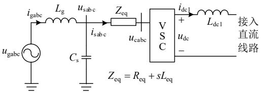

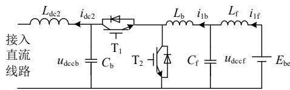  
(a) VSC及其交流系统简化主电路  
(b) 功率双向电池储能简化主电路  
图1 直流配电网系统简化案例  
Fig. 1 Simplified case of DC distribution network system

表 1 VSC 主参数  
Table 1 Main parameters of VSC   
表2 电池储能装置主参数  

<table><tr><td>参数名称</td><td>取值及单位</td><td>参数名称</td><td>取值及单位</td></tr><tr><td>额定直流电压</td><td>20kV</td><td>交流系统电压</td><td>10kV</td></tr><tr><td>额定功率</td><td>10MW</td><td>隔离变阻抗</td><td>0.04pu</td></tr><tr><td>支撑电容</td><td>1mF</td><td>交流侧电阻Req</td><td>0Ω</td></tr><tr><td>直流电抗器Ldc1</td><td>10mH</td><td>交流侧电感Leq</td><td>1mH</td></tr><tr><td>滤波电容Cs</td><td>5μF</td><td>电网电感Lg</td><td>1mH</td></tr><tr><td>外环比例系数kpdc</td><td>0.1</td><td>外环积分系数ki dc</td><td>2</td></tr><tr><td>内环比例系数kpi</td><td>200</td><td>内环积分系数kii</td><td>4000</td></tr></table>

Table 2 Main parameters of battery energy storage   

<table><tr><td>参数名称</td><td>取值及单位</td><td>参数名称</td><td>取值及单位</td></tr><tr><td>电池电压 \( E_{\text{be}} \)</td><td>10kV</td><td>支撑电容 \( C_{\text{b}} \)</td><td>0.1mF</td></tr><tr><td>缓冲电感 \( L_{\text{b}} \)</td><td>5mH</td><td>直流电抗器 \( L_{\text{dc2}} \)</td><td>10mH</td></tr><tr><td>滤波电容 \( C_{\text{f}} \)</td><td>0.1mF</td><td>滤波电感 \( L_{\text{f}} \)</td><td>2mH</td></tr><tr><td>内环比例系数 \( k_{\text{pbe}} \)</td><td>0.005</td><td>内环积分系数 \( k_{\text{ibe}} \)</td><td>0.1</td></tr></table>

# 2 直流配电网理论建模

# 2.1 VSC 描述与建模

在 dq 坐标系上，选择电源电流 $i _ { \mathrm { g } d }$ 和 $i _ { \mathrm { g } q } .$ 、接入点电压 $u _ { \mathrm s d }$ 和 $u _ { \mathrm { s } q }$ 以及 VSC 交流侧电流 $i _ { s d }$ 和 $i _ { \mathrm s q }$ 为状态变量，即 $\pmb { x } _ { \mathrm { a c } } = [ i _ { \mathrm { g } d } ; \ i _ { \mathrm { g } q } \} \ u _ { \mathrm { s } d } ; \ u _ { \mathrm { s } q } ; \ i _ { \mathrm { s } d } ; \ i _ { \mathrm { s } q } ] ^ { \mathrm { T } }$ 。锁相环采用常规的方式，其传递函数为二阶，其状态变量为$\scriptstyle { x _ { \mathrm { { P L L } } } = [ x _ { \mathrm { { P L L 1 } } } ; x _ { \mathrm { { P L L 2 } } } ] ^ { \mathrm { { T } } } }$ 。VSC 采用单位功率因数的定直流电压控制方式，直流电压反馈环节经二阶低通滤波 器 (low pass filter, LPF) 之 后 送 至 控 制 器$G _ { \mathrm { u d c } } { = } k _ { \mathrm { p d c } } { + } k _ { \mathrm { i d c } } / s$ 产生 d 轴参考电流，其中 $k _ { \mathrm { p d c } }$ 和 $k _ { \mathrm { i d c } }$ 分别为比例系数和积分系数；外环状态变量为$\boldsymbol { x } _ { \mathrm { o l } } \mathrm { = } \left[ \boldsymbol { x } _ { \mathrm { u d c } } ; \boldsymbol { x } _ { \mathrm { u d c f i l l } } ; \boldsymbol { x } _ { \mathrm { u d c f i l 2 } } \right] ^ { \mathrm { T } }$ ， $x _ { \mathrm { u d c } }$ 为直流电压积分控制器的状态变量， $x _ { \mathrm { u d c f i l 1 } }$ 和 $x _ { \mathrm { u d c f i l } 2 }$ 为二阶低通滤波器的状态变量。电流内环中 $d$ 轴电压和 $q$ 轴电压也经二阶LPF 前馈至方程中，电流内环控制器为 $G _ { \mathrm { i } } { = } k _ { \mathrm { p i } } { + } k _ { \mathrm { i i } } / s ,$ ，其中 $k _ { \mathrm { p i } }$ 和 $k _ { \mathrm { i i } }$ 分别为比例系数和积分系数；内环状态变量为 $\pmb { x } _ { \mathrm { c l } } \mathrm { = } [ x _ { \mathrm { i s } d } ; x _ { \mathrm { i s } q } ; x _ { \mathrm { u s } d \mathrm { f i l 1 } } ; x _ { \mathrm { u s } d \mathrm { f i l 2 } } ; x _ { \mathrm { u s } q \mathrm { f i l 1 } } ; x _ { \mathrm { u s } q \mathrm { f i l 2 } } ] ^ { \mathrm { T } }$ ，$x _ { \mathrm { i s } d }$ 和 $x _ { \mathrm { i s } q }$ 为 $d$ 轴和 $q$ 轴电流积分控制器的状态变量，$x _ { \mathrm { u s d f i l l } }$ 与 $x _ { \mathrm { u s } d \mathrm { f i l } 2 }$ 和 $x _ { \mathrm { u s } q \mathrm { f i l } 1 }$ 与 $x _ { { \mathrm { u s } } q \mathrm { f i l } 2 }$ 为 $d$ 轴和 q 轴前馈电压的二阶低通滤波器的状态变量。可得到，VSC状态空间模型为

$$
\left\{ \begin{array}{l} \frac {\mathrm {d} \Delta \boldsymbol {x} _ {\mathrm {v s c}}}{\mathrm {d} t} = \boldsymbol {A} _ {\mathrm {v s c}} \Delta \boldsymbol {x} _ {\mathrm {v s c}} + \boldsymbol {B} _ {\mathrm {v s c} 1} \Delta i _ {\mathrm {d c} 1} + \boldsymbol {B} _ {\mathrm {v s c} 2} \Delta U _ {\mathrm {d c}} ^ {*} \\ \Delta u _ {\mathrm {d c}} = \boldsymbol {C} _ {\mathrm {v s c}} \Delta \boldsymbol {x} _ {\mathrm {v s c}} \end{array} \right. \tag {1}
$$

式中： $\boldsymbol { x } _ { \mathrm { v s c } } { = } [ \boldsymbol { x } _ { \mathrm { a c } } ; \boldsymbol { x } _ { \mathrm { P L L } } ; \boldsymbol { x } _ { \mathrm { o l } } ; \boldsymbol { x } _ { \mathrm { c l } } ] ^ { \mathrm { T } } ;$ ；“Δ”表示相关变量的小信号符号； $\boldsymbol { U } _ { \mathrm { ~ d c ~ } } ^ { * }$ 为 VSC 直流电压参考值； $u _ { \mathrm { d c } }$ 为 VSC 的直流电压。

考虑到 VSC 建模不是本文研究重点，关于状态变量和矩阵 $A _ { \mathrm { v s c } } \setminus B _ { \mathrm { v s c 1 } } \setminus B _ { \mathrm { v s c 2 } } \setminus C _ { \mathrm { v s c } }$ 的形式不再给出。根据式(1)，VSC 直流侧阻抗 $Z _ { \mathrm { v s c } }$ 的表达式为

$$
Z _ {\mathrm {v s c}} = - \frac {\Delta u _ {\mathrm {d c}}}{\Delta i _ {\mathrm {d c} 1}} = - C _ {\mathrm {v s c}} \left(s I _ {\mathrm {i m}} - A _ {\mathrm {v s c}}\right) ^ {- 1} B _ {\mathrm {v s c} 1} \tag {2}
$$

式中： $I _ { \mathrm { i m } }$ 为单位矩阵； $i _ { \mathrm { d c l } }$ 为 VSC 的直流电流。

# 2.2 电池储能装置建模

电池储能装置采用的是功率双向 DC-DC 变换器连接直流配电网和电池装置本体，电流方向如图 1(b)所示。本文以恒电流为例，考虑充放电过程，开关管 T1和或 T2 的占空比表达式可统一表述为

$$
\Delta d _ {\mathrm {c}} = G _ {\mathrm {i b e}} \left(\Delta I _ {\mathrm {l b}} ^ {*} - \Delta i _ {\mathrm {l b}}\right) \operatorname {s i g n} \left(I _ {\mathrm {l b}} ^ {*}\right) \tag {3}
$$

式中： $\boldsymbol { I } _ { \mathrm { ~ l b ~ } } ^ { * }$ 为缓冲电感电流参考值； $i _ { \mathrm { l b } }$ 为缓冲电感电流；缓冲电感电流控制器 $G _ { \mathrm { i b e } } { = } k _ { \mathrm { p b e } } { + } k _ { \mathrm { i b e } } / { \mathrm { s } } , ~ k _ { \mathrm { p b e } }$ 和 $k _ { \mathrm { i b e } }$ 为比例和积分系数；sign(x)为符号函数，由充放电方向决定。当双向 DC-DC 变换器运行于 Boost 模式时，即参考电流 $I _ { \mathrm { 1 b } } ^ { \ast } { \geqslant } 0$ 时， $\mathrm { s i g n } ( I _ { \mathrm { ~ l b } } ^ { \ast } ) { = } 1$ ，相反运行于 Buck 模式时 $\mathrm { s i g n } ( I _ { \mathrm { ~ l b } } ^ { \ast } ) { = } { - } 1$ 。 $E _ { \mathrm { b e } }$ 为储能电池端口直流电压，可推导出 2 种模式下直流端口电压$u _ { \mathrm { d c c b } }$ 的小信号表达式为

$$
\Delta u _ {\mathrm {d c c b}} = H _ {\mathrm {b e} 1} \Delta E _ {\mathrm {b e}} - H _ {\mathrm {b e} 2} \Delta I _ {\mathrm {l b}} ^ {*} - Z _ {\mathrm {b e}} \Delta i _ {\mathrm {d c} 2} \tag {4}
$$

式(4)中， $E _ { \mathrm { b e } }$ 为储能电池端口直流电压，本文用直流电压源表示，相关表达式如下

$$
\left\{ \begin{array}{l} H _ {\mathrm {b e l}} = \frac {G _ {\mathrm {b e l}} + G _ {\mathrm {i b e}} G _ {\mathrm {b e l}} G _ {\mathrm {b e 5}} + G _ {\mathrm {i b e}} G _ {\mathrm {b e 2}} G _ {\mathrm {b e 4}}}{1 + G _ {\mathrm {i b e}} G _ {\mathrm {b e 5}} + G _ {\mathrm {i b e}} G _ {\mathrm {b e 2}} G _ {\mathrm {b e 6}}} \\ H _ {\mathrm {b e 2}} = \frac {G _ {\mathrm {i b e}} G _ {\mathrm {b e 2}}}{1 + G _ {\mathrm {i b e}} G _ {\mathrm {b e 5}} + G _ {\mathrm {i b e}} G _ {\mathrm {b e 2}} G _ {\mathrm {b e 6}}} \\ Z _ {\mathrm {b e}} = \frac {G _ {\mathrm {b e 3}} \left(1 + G _ {\mathrm {i b e}} G _ {\mathrm {b e 5}}\right)}{1 + G _ {\mathrm {i b e}} G _ {\mathrm {b e 5}} + G _ {\mathrm {i b e}} G _ {\mathrm {b e 2}} G _ {\mathrm {b e 6}}} \end{array} \right. \tag {5}
$$

忽略直流线路的压降，则 $G _ { \mathrm { b e l } } { = } E _ { \mathrm { b e 0 } } / ( U _ { \mathrm { d c N } } G _ { \mathrm { d e n 1 } } )$ ， $G _ { \mathrm { b e 2 } } { = } ( L _ { \mathrm { f } } L _ { \mathrm { b } } C _ { \mathrm { f } } I _ { \mathrm { l b 0 } } s ^ { 3 } { - } L _ { \mathrm { f } } C _ { \mathrm { f } } E _ { \mathrm { b e 0 } } s ^ { 2 } { + } L _ { \mathrm { b } } I _ { \mathrm { l b 0 } } s { + } L _ { \mathrm { f } } I _ { \mathrm { l b 0 } } s { - } E _ { \mathrm { b e 0 } } ) /$ $G _ { \mathrm { d e n l } } , G _ { \mathrm { b e 3 } } = ( L _ { \mathrm { f } } L _ { \mathrm { b } } C _ { \mathrm { f } } s ^ { 3 } + L _ { \mathrm { f } } s + L _ { \mathrm { b } } s ) / G _ { \mathrm { d e n l } } , G _ { \mathrm { b e 4 } } = 1 / G _ { \mathrm { d e n 2 } } ,$ ， $G _ { \mathrm { b e } 5 } { = } ( L _ { \mathrm { f } } C _ { \mathrm { f } } U _ { \mathrm { d e N } } s ^ { 2 } { + } U _ { \mathrm { d e N } } ) / G _ { \mathrm { d e n } 2 } , G _ { \mathrm { b e } 6 } { = } ( L _ { \mathrm { f } } C _ { \mathrm { f } } E _ { \mathrm { b e } 0 } s ^ { 2 } { + } E _ { \mathrm { b e } 0 } ) /$ $( U _ { \mathrm { d c N } } G _ { \mathrm { d e n } 2 } )$ ，且有

$$
\left\{ \begin{array}{l} G _ {\mathrm {d e n} 1} = L _ {\mathrm {f}} L _ {\mathrm {b}} C _ {\mathrm {f}} C _ {\mathrm {b}} s ^ {4} + L _ {\mathrm {b}} C _ {\mathrm {b}} s ^ {2} + L _ {\mathrm {f}} C _ {\mathrm {b}} s ^ {2} + \\ \left(L _ {\mathrm {f}} C _ {\mathrm {f}} E _ {\mathrm {b e} 0} ^ {2} s ^ {2} + E _ {\mathrm {b e} 0} ^ {2}\right) / U _ {\mathrm {d c N}} ^ {2} \\ G _ {\mathrm {d e n} 2} = L _ {\mathrm {f}} L _ {\mathrm {b}} C _ {\mathrm {f}} s ^ {3} + \left(L _ {\mathrm {f}} + L _ {\mathrm {b}}\right) s \end{array} \right. \tag {6}
$$

由式(4)—(6)可知，直流电压 $u _ { \mathrm { d c c b } }$ 的表达式没有占空比，只是由电池电压稳态值 $E _ { \mathrm { b e 0 } }$ 、电流稳态值 $I _ { \mathrm { l b 0 } }$ 以及直流配电网电压 $U _ { \mathrm { d c N } }$ (理论上是 $U _ { \mathrm { d c 0 } } )$ 表示，其中 $I _ { \mathrm { l b 0 } }$ 的方向和大小由其运行模式和功率大小决定。

假设直流线路的等效电阻和电感为 $R _ { \mathrm { l i n e } }$ 和 $L _ { \mathrm { l i n e } }$ ，则直流线路的动态方程为

$$
\Delta i _ {\mathrm {d c l}} = \frac {1}{L _ {\mathrm {d c e q}} s + R _ {\mathrm {d c e q}}} \left(\Delta u _ {\mathrm {d c}} - \Delta u _ {\mathrm {d c c b}}\right) \tag {7}
$$

式中： $L _ { \mathrm { d c e q } } { = } L _ { \mathrm { d c l } } { + } L _ { \mathrm { l i n e } } { + } L _ { \mathrm { d c 2 } }$ 为直流侧等效电感； $R _ { \mathrm { d c e q } }$ 为等效电阻，考虑严重工况可忽略 $R _ { \mathrm { d c e q } }$ 。

此外，从图 1(b)所示的拓扑结构来看，出现了LCL 型拓扑，因此该拓扑存在一个自然并联谐振点，其谐振(角)频率为

$$
f _ {\text {b e} - \text {r e s l}} = \frac {1}{2 \pi \sqrt {L _ {\mathrm {f}} C _ {\mathrm {f}}}} \tag {8}
$$

也存在一个串联谐振点，其谐振(角)频率为

$$
f _ {\text {b e} - \text {r e s} 2} = \frac {1}{2 \pi} \sqrt {\frac {L _ {\mathrm {f}} + L _ {\mathrm {b}}}{L _ {\mathrm {f}} L _ {\mathrm {b}} C _ {\mathrm {f}}}} \tag {9}
$$

对于并联谐振来说，在自然谐振频率附近的阻抗幅值很大，当频率小于 $f _ { \mathrm { b e \_ r e s l } }$ 时阻抗呈现电感特性，当频率大于 $f _ { \mathrm { b e \_ r e s l } }$ 时阻抗呈现电容特性，容易与直流配电网直流侧的等效电感阻抗相互作用诱发谐振振荡。对于串联谐振来说，系统的阻抗非常小，与外部系统具有阻抗幅值交点的概率非常小，发生谐振的风险也就小。

# 2.3 模型正确性验证

2.1 和 2.2 节建立了 VSC 装置和电池储能装置的阻抗模型，需要对其正确性进行验证之后才可以采用理论模型分析影响因素以及后续相关研究。电池储能装置在阻抗测量时需要在直流端口并联理想电压源，此时支撑电容 $C _ { \boldsymbol { \mathrm { b } } }$ 无效，再考虑功率开关器件的开关过程，测量的直流电流含有非常大的脉冲扰动，在傅里叶分析时影响了精度，对此本文不给予验证。根据表 1 所示参数，搭建了 VSC 阻抗扫描模型，图2绘制了VSC在±1pu功率下的VSC直流侧阻抗理论计算与扫描结果，很显然，扫描值几乎完美地与计算值对上，进而说明了本文所建立的模型具有非常高的精度。

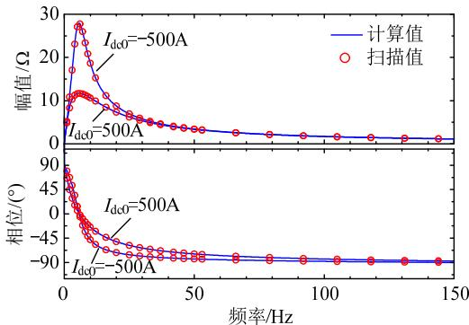  
图2 模型正确性验证  
Fig. 2 Validation of model

# 3 直流阻抗特性及稳定性分析

从阻抗模型表达式可知，各个装置的稳态运行点、主电路参数以及控制器参数均在阻抗模型中体现，因此它们对阻抗的特性均有影响。为了探究上

述因素对阻抗特性的影响程度，本部分先进行阻抗特性分析，之后对直流配电网的稳定性进行分析，揭示发生振荡失稳的机理。

# 3.1 VSC 直流侧阻抗特性分析

关于稳态运行点对 VSC 直流侧自身阻抗特性的影响将在后续给出，本小节只给出主电路参数和控制系统参数对阻抗幅值的影响，如图 3 和图 4所示，其相位特性是随着频率的逐渐增大而趋近于90°且没有出现负阻尼效应频段，因此没有给出。

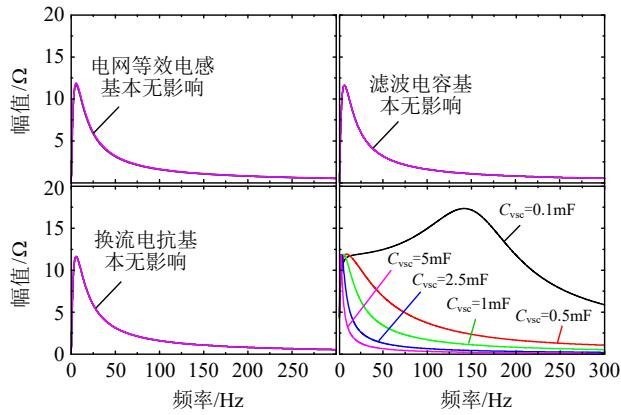  
图 3 主电路参数对 VSC 直流侧阻抗的影响

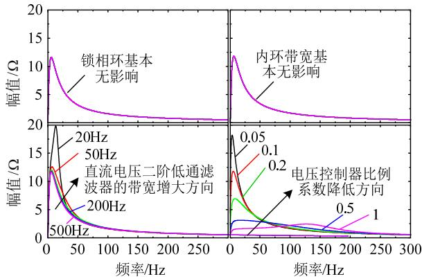  
Fig. 3 Influence of main circuit parameters on VSC’s impedance at DC side   
图 4 控制器参数对 VSC 直流侧阻抗幅值的影响  
Fig. 4 Influence of controllers’ parameters on amplitude of VSC’s impedance at DC side

从图 3 可以看出，交流系统侧的等效电感、滤波电容以及换流电抗器对VSC阻抗的影响非常小，完全可以忽略不计；然而，直流侧的支撑电容 $C _ { \mathrm { v s c } }$ 对阻抗影响非常大。这不难想象，VSC 交流侧影响直流配电网是通过传递的有功功率，只要交流系统稳定且有功功率响应及时，则可以忽略交流系统主电路参数的影响。支撑电容 $C _ { \mathrm { v s c } }$ 直接参与了 VSC阻抗的形成，当其大于 0.5mF 之后，在 100Hz 以上也基本呈现出无源电容性质，该结论对于后续阻尼控制器参数解析计算具有很大帮助。

从图 4 可知，只要交流系统稳定，锁相环参数和电流内环的带宽(带宽足够大)，它们对 VSC 直流

侧自身阻抗的影响可忽略不计。然而，参与直流电压控制环节的二阶低通滤波器和直流电压控制器对 VSC 自身阻抗的影响非常大，其中二阶低通滤波器的带宽越大，对阻抗的影响越小且只影响低频段，对 100Hz 以上的频段影响非常小。定直流电压控制器对 200Hz 以内的阻抗特性影响较大，尤其是低频段，增大控制器参数能降低阻抗幅值，相当于在一定程度上增加了 VSC 的电容效应。

综上，在忽略交流系统动态响应过程和 PLL 的前提下，VSC 自身的阻抗模型可简化为

$$
Z _ {\mathrm {v s c}} = \frac {U _ {\mathrm {d c N}}}{C _ {\mathrm {v s c}} U _ {\mathrm {d c N}} s + 1 . 5 U _ {\mathrm {s N}} G _ {\mathrm {u d c}} G _ {\mathrm {l p f u d c}} + I _ {\mathrm {d c 0}}} \tag {10}
$$

式中： $U _ { \mathrm { d c N } }$ 为直流电压额定值； $I _ { \mathrm { d c 0 } }$ 为直流电流稳态分量； $U _ { \mathrm { s N } }$ 为 VSC 交流侧相电压额定幅值； $G _ { \mathrm { l p f u d c } }$ 为直流电压二阶低通滤波器传递函数。

# 3.2 电池储能装置侧阻抗特性分析

图 5 给出了支撑电容 $C _ { \mathsf { b } } \mathbf { . }$ 、缓冲电感 $L _ { \mathfrak { b } } .$ 、滤波电容 Cf和滤波电感 $L _ { \mathrm { f } }$ 在 $I _ { \mathrm { l b } } ^ { \ast } { = } { - } 1 0 0 0 \mathrm { A }$ (Buck 模式)情况下对阻抗的影响。图 6给出了电池储能电流控制器的比例系数和积分系数分别对阻抗的影响。

从图 5 可知，4 个主电路中只有支撑电容 $C _ { \boldsymbol { \mathrm { b } } }$ 对阻抗的影响非常大， $C _ { \boldsymbol { \mathrm { b } } }$ 值越大，则幅值越低且相位越接近 $- 9 0 ^ { \circ }$ ；缓冲电感 $L _ { \mathrm { b } }$ 基本不影响幅值和相位；滤波电容 $C _ { \mathrm { f } }$ 和滤波电感 $L _ { \mathrm { f } }$ 对幅值影响很小，只影响并联谐振频率附近的相位，对其他频段的阻抗影响非常小；显而易见的是滤波参数值越大，并联谐振频率越小。从相位特性可知，电池储能装置的阻抗相位始终小于或等于90°，只有在并联谐振频率处等 $\yen 90^ { \circ }$ 。因此，双向 DC-DC变换器在 Buck 模式下的阻抗特性为“负电阻”电容效应。

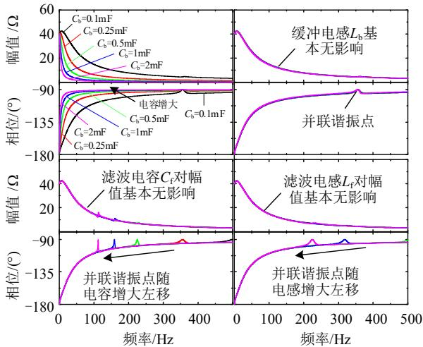  
图5 主电路参数对电池储能系统阻抗的影响  
Fig. 5 Influence of main circuit parameters on impedance of energy storage system

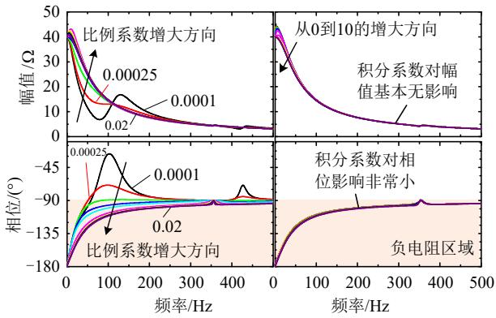  
图6 控制器参数对电池储能系统阻抗的影响  
Fig. 6 Influence of controller parameters on impedance of energy storage system

从图 6 可知，比例系数在较宽范围内影响双向DC-DC 变换器的阻抗特性，然而积分系数仅影响低频段幅值，当频率大于 50Hz 之后对阻抗幅值和相位的影响基本可以忽略，该结论有利于后续阻尼控制器的参数解析计算。此外，比例系数越小，相位特性就有可能大于90°而呈现正电阻特性，也就是有利于提升稳定性，但是过小的比例参数可能导致电池装置的动态响应速度不能满足要求。

考虑到 VSC 自身阻抗呈现“正电阻”电容特性，如果不考虑直流线路和出口配置的限流电抗器，两者直接接入直流配电网不会发生失稳振荡。但是，一旦考虑直流网络的电感，就有可能发生振荡。

# 3.3 直流配电网振荡失稳机理分析

3.1—3.2 节主要从主电路参数和控制系统角度，分析了阻抗特性，但未分析稳态运行点对阻抗特性及稳定性的影响。从图 1所给的直流配电网结构来看，存在 3 个部分的阻抗，即 VSC 自身阻抗$Z _ { \mathrm { v s c } } .$ 、限流电抗器和直流线路构成的网络阻抗 $Z _ { \mathrm { d c e q } } .$ 、电池储能装置(双向DC-DC变换器)本身的阻抗 $Z _ { \mathrm { b e } }$ 。在采用阻抗法分析直流配电网内部装置之间交互的稳定性时，需要确定 2个能独立稳定运行的子系统。显然，VSC 和电池储能装置自身接入独立电源时均可以稳定性运行； $Z _ { \mathrm { v s c } }$ 呈现正阻尼，在与 $Z _ { \mathrm { d c e q } }$ 组成一个子系统之后也可以独立稳定运行。然而，由于 $Z _ { \mathrm { b e } }$ 呈现“负电阻”电容特性，在与 $Z _ { \mathrm { d c e q } }$ 组成一个子系统之后不能独立稳定运行。因此，本文将$\scriptstyle { Z _ { \mathrm { v s c l } } = Z _ { \mathrm { v s c } } + Z _ { \mathrm { d c e q } } }$ 看成是一个子系统，电池储能装置$Z _ { \mathrm { b e } }$ 本身看成一个子系统。此外，在没有控制过程的前提下，该直流配电网存在一个自然串联谐振点，其频率为

$$
f _ {\mathrm {d c} - \text {r e s}} = \frac {1}{2 \pi} \sqrt {\frac {C _ {\mathrm {v s c}} + C _ {\mathrm {b}}}{\left(L _ {\mathrm {d c} 1} + L _ {\mathrm {l i n e}} + L _ {\mathrm {d c} 2}\right) C _ {\mathrm {v s c}} C _ {\mathrm {b}}}} \tag {11}
$$

根据上述子系统的划分，图 7绘制了电池储能装置在不同功率等级下的 2 个子系统阻抗特性曲线。从幅值图可知，在±1pu 功率范围内，2 个子系统的阻抗幅值只有一个交点，其频率约为 115.5Hz，与式(11)所示的自然串联谐振频率 118Hz 非常接近。在该交点频率下 $Z _ { \mathrm { v s c l } }$ 的相位约等于 $9 0 ^ { \circ }$ ，因此只要该频率下 $Z _ { \mathrm { b e } }$ 的相位在 $- 9 0 ^ { \circ }$ 范围内就能保证稳定性。从相位可知，当 $I _ { \mathrm { l b } } ^ { \ast } { < } 0 \mathrm { p u } ( \mathrm { B u c k }$ 模式)时，交点的相位大概率超过 $- 9 0 ^ { \circ }$ 且电流值 $I _ { \mathrm { l b } } ^ { \ast }$ |越大，相位越远离 $- 9 0 ^ { \circ }$ ，这就导致负阻尼效应越来越强且稳定性越来越差。当 $I _ { \mathrm { { l b } } } ^ { \ast } { > } 0 \mathrm { { p u } }$ (Boost 模式)时，交点的相位在 $\cdot 9 0 ^ { \circ }$ 范围内，电流值 $I _ { \mathrm { l b } } ^ { \ast }$ 越大，则阻尼特性越强且稳定性增强。

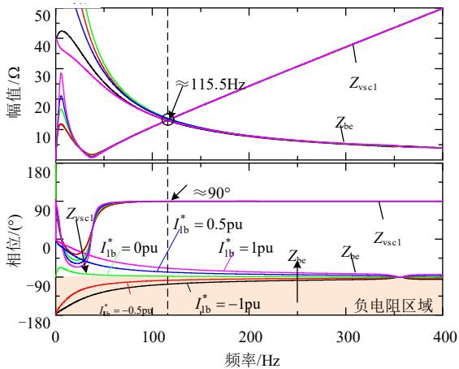  
图7 直流配电网失稳机理  
Fig. 7 Instability mechanism of DC distribution network

综上所述，双向 DC-DC 变换器运行于 Buck模式且在较大的电流控制器比例系数情况下，其阻抗呈现出的“负电阻”电容特性，容易与直流配电网的等效电感相互作用，构成具有负电阻特性的串联型 RLC 振荡电路，诱发直流配电网谐振振荡，这就是直流配电网发生振荡失稳的机理。因此，可从改进控制策略方面，提升双向 DC-DC 变换器运行于 Buck 模式下的阻尼特性，达到抑制振荡的目的。

# 4 阻尼控制策略及其参数设计

# 4.1 阻尼控制策略原理

直流配电网振荡发生的物理本质是所有装置注入或从网络消耗的瞬时有功功率不平衡导致的功率振荡现象。当直流配电网发生振荡时，直流电压和直流电流也表现出同频率的振荡。为了抑制直流配电网的振荡，可以从其物理本质进行考虑，例如当直流配电网能量振荡增加时，需要降低注入或者提升消耗的瞬时功率；反之，当直流配电网能量振荡降低时，则需要提升注入或降低消耗的功率。

考虑到直流配电网阻抗较小且是串联型谐振，

反馈直流电流相比于反馈直流电压来说更加容易抑制振荡。直流配电网的振荡失稳主要是由双向DC-DC 变换器运行于 Buck 模式导致，为提升该模式下的阻尼特性，本文将反馈直流电流至电流环构成有源阻尼控制策略。根据其物理本质，阻尼控制策略的实现方式如图 8 所示。

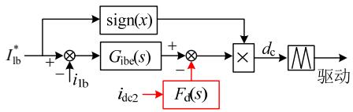  
图8 阻尼控制策略原理  
Fig. 8 Principle of damping control

其中阻尼控制器可采用增益为 $k _ { \mathrm { d } }$ 和带宽为 $\omega _ { \mathrm { d } }$ 的一阶高通滤波器，其传递函数为

$$
F _ {\mathrm {d}} = k _ {\mathrm {d}} s / \left(s + \omega_ {\mathrm {d}}\right) \tag {12}
$$

当双向DC-DC变换器考虑阻尼控制策略之后，式(5)所示的阻抗表达式需要更新为

$$
Z _ {\mathrm {b e} \_ \text {d a m p}} = \frac {G _ {\mathrm {b e} 3} \left(1 + G _ {\mathrm {i b e}} G _ {\mathrm {b e} 5}\right) - F _ {\mathrm {d}} G _ {\mathrm {b e} 2}}{1 + G _ {\mathrm {i b e}} G _ {\mathrm {b e} 5} + G _ {\mathrm {i b e}} G _ {\mathrm {b e} 2} G _ {\mathrm {b e} 6}} \tag {13}
$$

# 4.2 阻尼控制策略对阻抗特性的影响

传统通用解析方法分析考虑阻尼控制策略之后的影响是将 sj代入式(5)和式(13)中，通过求解幅值比和相位差开展研究。然而，电池储能装置的阻抗模型阶数较高，上述通用解析方法难以实现定量分析。本文摒弃上述方法，从另一个方面开展解析研究，该方法是充分利用电池侧的并联谐振频率$f _ { \mathrm { b e \_ r e s l } } \left( \overleftrightarrow { \boldsymbol { \sharp } } \overleftrightarrow { \boldsymbol { \chi } } \omega _ { \mathrm { b e \_ r e s l } } \right)$ ，可以大大简化模型的复杂程度。在该频率下，定义阻抗比为

$$
M _ {\text {i n f l u}} = \frac {Z _ {\text {b e} \_ \text {d a m p}}}{Z _ {\text {b e}}} = \frac {G _ {\text {b e} 3} \left(1 + G _ {\text {i b e}} G _ {\text {b e} 5}\right) - F _ {\mathrm {d}} G _ {\text {b e} 2}}{G _ {\text {b e} 3} \left(1 + G _ {\text {i b e}} G _ {\text {b e} 5}\right)} \tag {14}
$$

将 $s { = } \mathrm { j } \omega _ { \mathrm { b e \_ r e s l } }$ 代入式(14)，可得影响表达式为

$$
M _ {\text {i n f l u}} = \frac {\left(1 - I _ {\mathrm {l b} 0} k _ {\mathrm {d}}\right) \omega_ {\mathrm {b e} \text {r e s} 1} - \mathrm {j} \omega_ {\mathrm {d}}}{\omega_ {\mathrm {b e} \text {r e s} 1} - \mathrm {j} \omega_ {\mathrm {d}}} \tag {15}
$$

进而，可得在该并联谐振频率下的幅值和相位影响为

$$
\left| M _ {\text {i n f l u}} \right| = \sqrt {1 + \frac {\omega_ {\mathrm {b e} \text {r e s} 1} ^ {2} k _ {\mathrm {d}} \left(I _ {\mathrm {l b} 0} ^ {2} k _ {\mathrm {d}} - 2 I _ {\mathrm {l b} 0}\right)}{\omega_ {\mathrm {b e} \text {r e s} 1} ^ {2} + \omega_ {\mathrm {d}} ^ {2}}} \tag {16}
$$

$$
P _ {\mathrm {h a} _ {\text {i n f l u}}} = \arctan \frac {- I _ {\mathrm {l b 0}} \omega_ {\mathrm {b e} _ {\text {r e s l}}} k _ {\mathrm {d}} \omega_ {\mathrm {d}}}{\left(1 - I _ {\mathrm {l b 0}} k _ {\mathrm {d}}\right) \omega_ {\mathrm {b e} _ {\text {r e s l}}} ^ {2} + \omega_ {\mathrm {d}} ^ {2}} \tag {17}
$$

从式(16)可知，如果 $I _ { \mathrm { l b 0 } } { < } 0$ (Buck 模式)，则$| M _ { \mathrm { i n f l u } } | { > } 1$ 恒成立，说明该模式下只要采用了阻尼控制策略，一定会导致该并联谐振频率点的阻抗幅值增加，且增益系数 $k _ { \mathrm { d } }$ 越大，则幅值增加程度也就越大。当且仅当 $I _ { \mathrm { l b 0 } } { > } 0 ( \mathrm { B o o s t }$ 模式)和 $k _ { \mathrm { d } } { \leq } 2 / I _ { \mathrm { l b N } } { \leq } 2 / I _ { \mathrm { l b 0 } }$ 时，才能使得 $| M _ { \mathrm { i n f l u } } | { \leq } 1$ 成立。然而，过小的 $k _ { \mathrm { d } }$ 可能抑制

不住失稳。此外，增大带宽 $\omega _ { \mathrm { d } }$ 可以降低对幅值的影响，但是过大的 $\omega _ { \mathrm { d } }$ 将使得阻尼控制器不起作用。上述虽然只是对并联谐振频率点 $\omega _ { \mathrm { b e \_ r e s l } }$ 进行的分析，但也适合其他频率段。

从式(17)可知，如果 $I _ { \mathrm { l b 0 } } { < } 0$ ，则反正切函数的分子和分母都大于零，则将导致相位增加；反之$I _ { \mathrm { l b 0 } } { > } 0$ ，反正切函数的分子小于零，只有当 $k _ { \mathrm { d } } { \leq } ( 1 +$ $\omega _ { \mathrm { d } } ^ { 2 } / \omega _ { \mathrm { b e } _ { \mathrm { - } } \mathrm { r e s } 1 } ^ { 2 } ) / I _ { \mathrm { l b N } } \leq ( 1 + \omega _ { \mathrm { d } } ^ { 2 } / \omega _ { \mathrm { b e } _ { \mathrm { - } } \mathrm { r e s } 1 } ^ { 2 } ) / I _ { \mathrm { l b 0 } }$ 时，分母才大于零，此时将导致相位降低，进入负阻尼效应区域。以上分析结果将为控制器参数解析计算提供必要的约束条件，即该频率点的幅值 $| Z _ { \mathrm { b e \_ d a m p } } | \mathcal { V } \Delta$ 须小于 $| Z _ { \mathrm { v s c l } } |$ 。

为了验证上述表述的正确性，图 9给出增益和带宽变化时的阻抗特性曲线。从图 $9 ( \mathrm { a } )$ 可知，当$I _ { \mathrm { l b 0 } } { < } 0$ (Buck 模式)时，阻抗幅值在 50Hz 以上频段是增益 $k _ { \mathrm { d } }$ 的单调增函数，是带宽 $\omega _ { \mathrm { d } }$ 的单调减函数；然而，相位在不同频段呈现出多变特性，对于一组确定的参数，其相位在 $5 0 { \sim } f _ { \mathrm { b e \_ r e s 1 } }$ Hz 范围内是角频率的单调增函数，该特性也为控制器参数计算提供了有利条件。图 9(b)的幅值特性与图 $9 ( \mathrm { a } )$ 类似，只是相位特性在 $5 0 { \sim } f _ { \mathrm { b e \_ r e s 1 } } \ \mathrm { H z }$ 范围内是角频率的单调减函数。此外，需要注意的是，原本稳定的系统在不合适的阻尼控制器参数下降引入额外频率的失

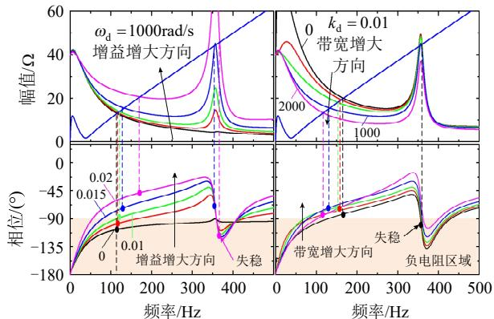

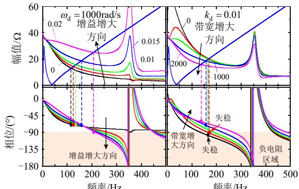  
(a) Ilb0<0 (Buck模式)   
(b) Ilb0>0 (Boost模式)   
图9 阻尼控制器参数对电池储能装置阻抗的影响  
Fig. 9 Influence of damping controller parameters on impedance of energy storage system

稳，并且还产生了多段“负电阻”区域。这就表明，双向 DC-DC 变换器在 Boost 模式下无需加入阻尼控制策略，即使是加入了阻尼控制策略，也要设计出适应于 Boost 模式下的参数。

# 4.3 电池储能装置并联谐振约束条件下的参数范围解析计算

考虑到双向DC-DC变换器运行于Buck模式下才有失稳问题，本小节将从该模式下进行参数的解析计算。根据式(16)所呈现出的结果，只要加入了阻尼控制器，一定会增加并联谐振频率点 $f _ { \mathrm { b e \_ r e s l } }$ 的阻抗幅值，且增加的程度一定大于相同功率大小下Boost 模式增加的幅值。根据阻抗理论，如果 2 个子系统没有幅值交点，则系统一定稳定。因此，本小节的目标是计算合适的参数，使得阻抗幅值$| Z _ { \mathrm { b e \_ d a m p } } |$ 小于并联谐振频率处的 $| Z _ { \mathrm { v s c l } } |$ 。再考虑到幅值 $| Z _ { \mathrm { b e \_ d a m p } } |$ 是带宽 $\omega _ { \mathrm { d } }$ 的单调减函数，可以先令带宽$\omega _ { \mathrm { d } }$ 为零，从而求解出一定满足约束条件的最大增益系数 $k _ { \mathrm { d } }$ 。根据该理论，则有

$$
| Z _ {\text {b e} \_ \text {d a m p}} (\mathrm {j} \omega_ {\text {b e} \_ \text {r e s 1}}) | \leqslant | Z _ {\text {v s c}} (\mathrm {j} \omega_ {\text {b e} \_ \text {r e s 1}}) + \mathrm {j} \omega_ {\text {b e} \_ \text {r e s 1}} L _ {\text {d c e q}} | \tag {18}
$$

即

$$
\frac {\omega_ {\mathrm {b e} \text {r e s} 1}}{C _ {\mathrm {b}}} \left| I _ {\mathrm {l b} 0} k _ {\mathrm {d}} - 1 \right| \leqslant Z _ {\mathrm {v s c}} \left(\mathrm {j} \omega_ {\mathrm {b e} \text {r e s} 1}\right) + \mathrm {j} \omega_ {\mathrm {b e} \text {r e s} 1} L _ {\mathrm {d c e q}} \mid (1 9)
$$

在不等式(19)两边同时乘以电池储能额定电压$E _ { \mathrm { b e N } }$ 并进行缩放，就可以得到不考虑带宽 $\omega _ { \mathrm { d } }$ 的情况下增益 $k _ { \mathrm { d } }$ 的取值范围为

$$
k _ {\mathrm {d}} \leq \frac {\left[ \omega_ {\text {b e} - \text {r e s} 1} C _ {\mathrm {b}} \left(\omega_ {\text {b e} - \text {r e s} 1} L _ {\text {d c e q}} - \left| Z _ {\text {v s c}} \right|\right) - 1 \right] E _ {\text {b e N}}}{P _ {\text {b e N}}} \tag {20}
$$

式中 $P _ { \mathrm { b e N } }$ 为电池的额定容量。

显然，不等式(20)对于增益系数的上限选择过于严苛，为了扩大参数的选择范围，在考虑带宽的影响 $\omega _ { \mathrm { d } }$ 之后，可以得到以下不等式

$$
\begin{array}{l} \left| P _ {\mathrm {b e N}} \omega_ {\mathrm {b e} - \mathrm {r e s} 1} k _ {\mathrm {d}} \omega_ {\mathrm {d}} - \mathrm {j} \left[ \left(P _ {\mathrm {b e N}} k _ {\mathrm {d}} + 1\right) \omega_ {\mathrm {b e} - \mathrm {r e s} 1} ^ {2} + \omega_ {\mathrm {d}} ^ {2} \right] \right| \leq \\ N \left(\omega_ {\mathrm {b e} _ {\mathrm {r e s l}}} ^ {2} + \omega_ {\mathrm {d}} ^ {2}\right) \tag {21} \\ \end{array}
$$

该不等式是增益和带宽必须满足的条件，其中

$$
\begin{array}{l} N = E _ {\mathrm {b e N}} \omega_ {\mathrm {b e} \text {r e s l}} C _ {\mathrm {b}} | Z _ {\mathrm {v s c}} + \mathrm {j} \omega_ {\mathrm {b e} \text {r e s l}} L _ {\mathrm {d c e q}} | \approx \\ E _ {\text {b e N}} \omega_ {\text {b e} \text {r e s} 1} C _ {\mathrm {b}} \left(\omega_ {\text {b e} \text {r e s} 1} L _ {\text {d c e q}} - | Z _ {\text {v s c}} |\right) \tag {22} \\ \end{array}
$$

由于在该频率 $f _ { \mathrm { b e \_ r e s l } }$ 附近，VSC 基本是无源电容性质，因此 N 也可以进一步简化为

$$
N \approx E _ {\mathrm {b e N}} C _ {\mathrm {b}} \left(\omega_ {\mathrm {b e} \text {r e s l}} ^ {2} L _ {\mathrm {d c e q}} - 1 / C _ {\mathrm {v s c}}\right) \tag {23}
$$

求解不等式(21)，可得

$$
k _ {\mathrm {d}} \leq \frac {\sqrt {N ^ {2} \omega_ {\mathrm {b e} - \mathrm {r e s} 1} ^ {2} + \left(N ^ {2} - E _ {\mathrm {b e N}} ^ {2}\right) \omega_ {\mathrm {d}} ^ {2}} - E _ {\mathrm {b e N}} \omega_ {\mathrm {b e} - \mathrm {r e s} 1}}{P _ {\mathrm {b e N}} \omega_ {\mathrm {b e} - \mathrm {r e s} 1}} \tag {24}
$$

$$
\omega_ {\mathrm {d}} \geq \sqrt {\frac {\left(k _ {\mathrm {d}} P _ {\mathrm {b e N}} \omega_ {\mathrm {b e} _ {\text {r e s l}}} + E _ {\mathrm {b e N}} \omega_ {\mathrm {b e} _ {\text {r e s l}}}\right) ^ {2} - N ^ {2} \omega_ {\mathrm {b e} _ {\text {r e s l}}} ^ {2}}{\left(N ^ {2} - E _ {\mathrm {b e N}} ^ {2}\right)}} \tag {25}
$$

不等式(24)(25)取等号时两者等价，它们充分考虑了带宽 $\omega _ { \mathrm { d } }$ 和增益 $k _ { \mathrm { d } }$ 的影响，由于对 N 的真实值进行了压缩，因此只要确定了带宽 $\omega _ { \mathrm { d } }$ 和增益 $k _ { \mathrm { d } }$ 的范围，就一定能满足阻抗的幅值 $| Z _ { \mathrm { b e \_ d a m p } } |$ 必须小于 $| Z _ { \mathrm { v s c 1 } }$ |的要求。该部分的约束条件是针对电池储能装置不发生并联谐振，但是所给出的参数范围还必须要满足不发生直流配电网的网络谐振。

# 4.4 直流网络振荡抑制约束条件下的参数范围解析计算

不等式(24)仅仅只是给出了增益的选择上限，为了有效抑制直流配电网直流网络的串联型振荡，还需要确定其下限值以及带宽的选择范围。由图 9(a)可知带宽 $\omega _ { \mathrm { d } }$ 的增加使得阻抗相位曲线上移，但是过大的带宽 $\omega _ { \mathrm { d } }$ 相当于没有引入阻尼控制策略，因此带宽 $\omega _ { \mathrm { d } }$ 的取值范围也有限定。

尽管 $Z _ { \mathrm { v s c l } }$ 在直流侧自然谐振频率 $f _ { \mathrm { d c \_ r e s } }$ 以上可以等效为一个单独的电感，但是 $Z _ { \mathrm { b e } }$ 的阶数已经超过 2阶，解析两者的幅值交点几乎不可能，需要从此外的角度考虑通过阻抗特性以及参数范围的压缩求解阻尼控制器的参数选择范围。考虑到阻尼控制器的引入将导致相同频率点幅值增大，同时相位在 $f _ { \mathrm { d c \_ r e s } }$ 及以上一段频率范围内也是单调增函数；此外， $| Z _ { \mathrm { v s c l } }$ |在 50Hz 以上也是单调增函数。因此，直流配电网振荡抑制的约束条件是考虑阻尼控制之后的 $Z _ { \mathrm { b e \_ d a m p } }$ 在自然谐振频率点 $f _ { \mathrm { d c \_ r e s } }$ (或 $\omega _ { \mathrm { d c \_ r e s } } )$ 以上一段频率范围内具有正阻尼特性，即 $Z _ { \mathrm { b e \_ d a m p } }$ 的实部需要大于零。忽略 $C _ { \mathrm { f } }$ 的影响，并令 $\boldsymbol { L } _ { \mathrm { d c d c } } { = } \boldsymbol { L } _ { \mathrm { b } } { + } \boldsymbol { L } _ { \mathrm { f } } ,$ ，将 sj代入 $Z _ { \mathrm { b e \_ d a m p } }$ ，可得

$$
Z _ {\text {b e} \_ \text {d a m p}} \approx \frac {a + \mathrm {j} b}{c + \mathrm {j} d} \tag {26}
$$

其中，

$$
\left\{ \begin{array}{r l} a & = k _ {\mathrm {i b e}} \omega_ {\mathrm {d}} U _ {\mathrm {d c N}} - \omega^ {2} \left(k _ {\mathrm {d}} E _ {\mathrm {b e N}} + k _ {\mathrm {p b e}} U _ {\mathrm {d c N}} + \omega_ {\mathrm {d}} L _ {\mathrm {d c d c}}\right) \\ b & = \omega U _ {\mathrm {d c N}} \left(k _ {\mathrm {i b e}} + \omega_ {\mathrm {d}} k _ {\mathrm {p b e}}\right) + \omega^ {3} L _ {\mathrm {d c d c}} \left(I _ {\mathrm {l b 0}} k _ {\mathrm {d}} - 1\right) \\ c & = C _ {\mathrm {b}} L _ {\mathrm {d c d c}} \omega^ {4} + \omega_ {\mathrm {d}} D _ {\mathrm {c 0}} k _ {\mathrm {i b e}} I _ {\mathrm {l b 0}} - \omega^ {2} D _ {\mathrm {c 0}} k _ {\mathrm {p b e}} I _ {\mathrm {l b 0}} - \\ & \quad \omega^ {2} D _ {\mathrm {c 0}} ^ {2} - \omega^ {2} k _ {\mathrm {i b e}} C _ {\mathrm {b}} U _ {\mathrm {d c N}} - \omega^ {2} k _ {\mathrm {p b e}} C _ {\mathrm {b}} U _ {\mathrm {d c N}} \omega_ {\mathrm {d}} \\ d & = \omega D _ {\mathrm {c 0}} k _ {\mathrm {i b e}} I _ {\mathrm {l b 0}} + \omega \omega_ {\mathrm {d}} D _ {\mathrm {c 0}} ^ {2} + \omega \omega_ {\mathrm {d}} D _ {\mathrm {c 0}} k _ {\mathrm {p b e}} I _ {\mathrm {l b 0}} + \\ & \quad \omega \omega_ {\mathrm {d}} k _ {\mathrm {i b e}} C _ {\mathrm {b}} U _ {\mathrm {d c N}} - \omega^ {3} k _ {\mathrm {p b e}} C _ {\mathrm {b}} U _ {\mathrm {d c N}} - \omega^ {3} \omega_ {\mathrm {d}} C _ {\mathrm {b}} L _ {\mathrm {d c d c}} \end{array} \right. \tag {27}
$$

根据式(26)可知，阻抗实部的符号就是 $( a c { + } b d )$ 的符号，其表达式异常复杂。为简单化计算，根据图 6 所得到的结论，即双向 DC-DC 变换器电流控制器积分系数对阻抗影响较小，本文令其等于零，则可进一步降低表达式的复杂程度。此时，阻抗实部大于零就简化为以下不等式

$$
k _ {\mathrm {d}} > \left[ k _ {\mathrm {p b e}} \left(U _ {\mathrm {d c N}} P _ {\mathrm {b e N}} k _ {\mathrm {p b e}} - E _ {\mathrm {b e N}} ^ {2}\right) \left(1 + \omega_ {\mathrm {d}} ^ {2} / \omega^ {2}\right) \right] /
$$

$$
[ (\omega^ {2} L _ {\mathrm {d c d c}} C _ {\mathrm {b}} - E _ {\mathrm {b e N}} ^ {2} / U _ {\mathrm {d c N}} ^ {2}) (U _ {\mathrm {d c N}} I _ {\mathrm {b e N}} k _ {\mathrm {p b e}} - E _ {\mathrm {b e N}}) +
$$

$$
P _ {\mathrm {b e N}} L _ {\mathrm {d c d c}} \left(I _ {\mathrm {b e N}} k _ {\mathrm {p b e}} - E _ {\mathrm {b e N}} / U _ {\mathrm {d c N}}\right) \omega_ {\mathrm {d}} +
$$

$$
\left. U _ {\mathrm {d c N}} C _ {\mathrm {b}} \left(k _ {\mathrm {p b e}} U _ {\mathrm {d c N}} E _ {\mathrm {b e N}} + I _ {\mathrm {b e N}} L _ {\mathrm {d c d c}} ^ {2} \omega^ {2}\right) \omega_ {\mathrm {d}} \right] \tag {28}
$$

式中： $\omega { = } \omega _ { \mathrm { d c } { \mathrm { \scriptsize ~ r e s } } } ; I _ { \mathrm { b e N } }$ 为电池额定电流。至此，增益系数的上下限均已经初步确定。

再将式(26)的实部进行变形，写成 $\omega _ { \mathrm { d } }$ 带宽的多项式，并忽略对系数影响很小的量，进而可得

$$
m _ {2} \omega_ {\mathrm {d}} ^ {2} - m _ {1} \omega_ {\mathrm {d}} + m _ {0} <   0 \tag {29}
$$

其中，

$$
\left\{ \begin{array}{l} m _ {2} \approx P _ {\mathrm {b e N}} k _ {\mathrm {p b e}} ^ {2} \\ m _ {1} \approx \omega_ {\mathrm {d c} _ {-} \text {r e s}} ^ {2} C _ {\mathrm {b}} E _ {\mathrm {b e N}} U _ {\mathrm {d c N}} k _ {\mathrm {p b e}} k _ {\mathrm {d}} \\ m _ {0} \approx \omega_ {\mathrm {d c} _ {-} \text {r e s}} ^ {2} E _ {\mathrm {b e N}} P _ {\mathrm {b e N}} k _ {\mathrm {p b e}} k _ {\mathrm {d}} / U _ {\mathrm {d c N}} \end{array} \right. \tag {30}
$$

式(30)中，各个参数都忽略一些较小的物理量，有正也有负，从而会影响参数的边界值。当计算出参数范围之后，建议选择中间的值，用于提升鲁棒性。

以带宽实数解为前提条件，可得带宽的初步选择范围为

$$
\frac {m _ {1} - \sqrt {m _ {1} ^ {2} - 4 m _ {2} m _ {0}}}{2 m _ {2}} \leq \omega_ {\mathrm {d}} \leq \frac {m _ {1} + \sqrt {m _ {1} ^ {2} - 4 m _ {2} m _ {0}}}{2 m _ {2}} \tag {31}
$$

对于上限有，则有

$$
\operatorname {s i g n} \left(\frac {\mathrm {d} \omega_ {\mathrm {d} \text {m a x}}}{\mathrm {d} k _ {\mathrm {d}}}\right) = \operatorname {s i g n} \left(\omega_ {\mathrm {d} \text {m a x}} C _ {\mathrm {b}} U _ {\mathrm {d c N}} - I _ {\mathrm {d c N}}\right) > 0 \tag {32}
$$

一般情况下 $\omega _ { \mathrm { d \ m a x } } { > } 0 . 5 m _ { 1 } / m _ { 2 } { > } 2 5 0$ ，说明带宽的上限取值与增益系数之间是增函数关系。同理，对于下限有

$$
\operatorname {s i g n} \left(\frac {\mathrm {d} \omega_ {\mathrm {d} _ {\text {m i n}}}}{\mathrm {d} k _ {\mathrm {d}}}\right) = \operatorname {s i g n} \left(I _ {\mathrm {d c N}} - \omega_ {\mathrm {d} _ {\text {m i n}}} C _ {\mathrm {b}} U _ {\mathrm {d c N}}\right) \tag {33}
$$

其表达式符号不是非常明确，如果 $\omega _ { \mathrm { d } \_ \mathrm { m i n } } <$ $I _ { \mathrm { d c N } } / ( C _ { \mathrm { b } } U _ { \mathrm { d c N } } ) { = } 2 5 0$ ，则说明带宽下限也是增益的增函数；否则，就可以认为是增益的减函数。考虑到下限值是可以取零，则初步认为带宽下限是增益的增函数，以压缩参数的解析计算范围。

至此，参数选择范围解析计算完成。由 4个不等式(24)(25)(28)(31)可以看出，参数的选择存在耦合情况，因此在计算或设计时候可采取以下步骤：

1）在 $\omega _ { \mathrm { d } } { = } 0$ 的情况下，根据不等式(24)，初步确定增益系数的临时最大值 $k _ { \mathrm { d \_ m a x \_ t e m p } }$ ，同时该值也可以作为最大值以方便参数计算与设计。  
2）将 $k _ { \mathrm { d \_ m a x \_ t e m p } }$ 代入不等式(31)确定带宽的选择范围 $[ \omega _ { \mathrm { d \_ m i n } 1 } , \omega _ { \mathrm { d \_ m a x } } ]$ 。  
3）将 $\omega _ { \mathrm { d \_ m i n 1 } }$ 和 $\omega _ { \mathrm { d \_ m a x } }$ 分别代入不等式(28)，选择两者中的最大值作为增益的最小值 $k _ { \mathrm { d } \mathrm { \ m i n ^ { \prime } } }$ 。  
4）将 $\omega _ { \mathrm { d \_ m i n 1 } }$ 代入不等式(24)，确定增益系数的临时最大值 $k _ { \mathrm { d \_ m a x } }$ 。  
5）将 $k _ { \mathrm { d \_ m a x } }$ 代入不等式(25)确定带宽的临时最小值 $\omega _ { \mathrm { d } \_ \mathrm { m i n } 2 }$ ，并与取 $\omega _ { \mathrm { d \_ m i n 1 } }$ 和 $| \omega _ { \mathrm { d } \_ \mathrm { m i n } 2 }$ 中的最大值作为带宽的最小值 $\omega _ { \mathrm { d \_ m i n } }$ 。

上述步骤只需要迭代一次即可初步确定增益的范围 $[ k _ { \mathrm { d } \_ { \mathrm { m i n } } } , k _ { \mathrm { d } \_ { \mathrm { m a x } } } ]$ 和带宽的范围 $\cdot \omega _ { \mathrm { d \_ m i n } } , \omega _ { \mathrm { d \_ m a x } } ]$ 。由于不等式(28)(31)忽略了一些较小的影响因素，会影响参数的选择边界。因此，在确定的范围内选择中间的值以补偿可能出现的误差以及系统主电路参数变化所带来的扰动，提升阻尼控制器的鲁棒性。上述参数只是在 $I _ { \mathrm { { l b } 0 } } ^ { \ast } = - \mathrm { { l p } u }$ 前提条件下得到的参数，如果双向 $\mathrm { D C - D C }$ 变换器在 Boost 模式下也投入阻尼控制策略，则还需要校验 $I _ { \mathrm { { l b } 0 } } ^ { \ast } = \mathrm { { l p } u }$ 下的稳定性。

# 4.5 阻尼控制器参数选择范围

根据上述计算公式和迭代步骤，在 $C _ { \mathrm { b } } { = } 0 . 1 \mathrm { m F }$ 情况下，本文所给公式计算的范围：增益的范围为[0.00748, 0.00899]，带宽的范围为[295, 1663]rad/s，从而仿真可取增益的范围为[0.0078, 0.0085]，带宽的范围为[500, 1500]rad/s。在 $C _ { \mathrm { b } } { = } 0 . 3 \mathrm { m F }$ 情况下，本文所给公式计算的范围：增益的范围为[0.0242,0.0288]，带宽的范围为[85, 7377]rad/s，从而仿真可取增益的范围为[0.025, 0.028]，带宽的范围为[500,7000]rad/s。

图 10 给了理论模型和计算公式的可行区域，由于直流配电网谐振频率点的计算忽略了一些因素，使得 A 点计算结果更加靠近上限值。因此，在选择参数时，应尽可能的选择带宽在中间时所对应的增益系数，以抵御主电路参数变化所带来的不良影响。

从图 10 可知，参数计算范围内的 4 个临界点均能使得双向DC-DC变换器在Buck模式下满功率稳定运行，从而验证了公式计算的正确性。理论上，双向 DC-DC 变换器工作于 Boost 模式时，由于阻抗呈现正阻尼特性，无需阻尼控制器。然而，本文也给出了其工作于 $I _ { \mathrm { 1 b 0 } } ^ { \ast } = \mathrm { 1 p u }$ 时靠近阻尼控制器参数边界的相关验证，即 A 点的验证。

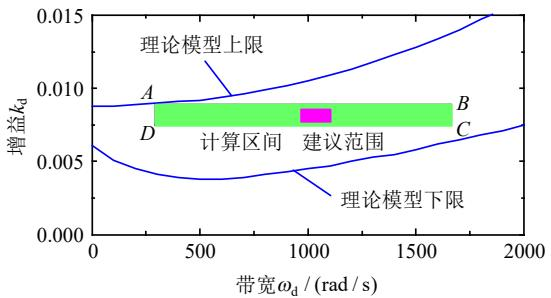

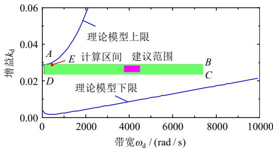  
(a) $C _ { \flat } = 0 . \mathrm { { l m F } } ( I _ { 1 \flat 0 } ^ { \ast } = - \mathrm { { l p u } ) }$   
(b) $C _ { \mathsf { b } } = 0 . 3 \mathrm { m F } ( I _ { 1 \mathsf { b } 0 } ^ { \ast } = - 1 \mathrm { p } \mathrm { u } )$   
图10 阻尼控制器参数的选择范围  
Fig. 10 Ranges of damping controller parameters

# 5 仿真分析

基于表 1、2 所示参数，根据 4.5 节参数计算范围，选择矩形方框 4 个点进行电磁暂态仿真验证，仿真结果图 11、12 所示。

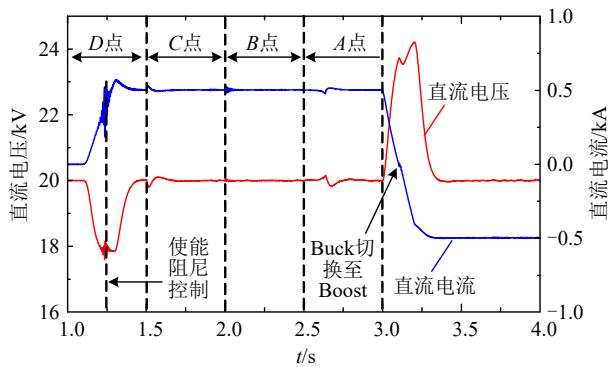  
图 11 $C _ { \mathrm { b } } { = } 0 . 1 \mathrm { m F }$ 时的仿真结果

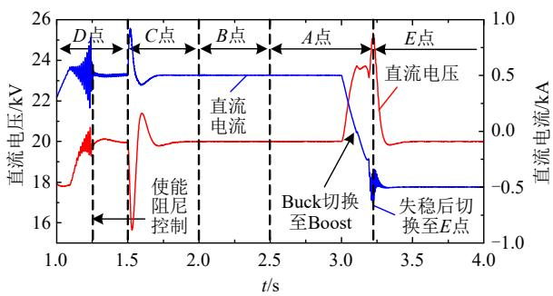  
Fig. 11 Simulation results of $C _ { \mathrm { b } } { = } 0 . 1 \mathrm { m F }$   
图 12 Cb0.3mF 时的仿真结果  
Fig. 12 Simulation results of Cb0.3mF

从图 12 可知，在 $C _ { \mathrm { b } } { = } 0 . 3 \mathrm { m F }$ 的情况下，D点、C 点、B 点、A 点也能使得双向 DC-DC变换器工作于 $I _ { \mathrm { { l b } 0 } } ^ { \ast } = - \mathrm { { l p } u }$ 时保持稳定，但是 A 点在 Boost 模式下不能使得系统稳定运行，这是因为幅值交点频率

处的相位超过了90°。当 A 点切换至 E 点(500,0.0288)后，系统恢复稳定运行。以上分析说明，在Buck 模式下计算的参数只是给出了参数的可能稳定边界，具体参数的选择应取范围的中间值，且需要在 Boost 模式下进行校验。由于 Boost 模式下，不投入阻尼控制器策略时无负阻尼效应频段，而投入阻尼控制策略之后会产生负阻尼效应频段。因此，为了保持系统的可靠运行，不建议双向 DC-DC变换器在 Boost 模式下投入阻尼控制策略。

# 6 结论

本文针对直流配电网可能存在的振荡失稳问题，通过建立理论模型，揭示了振荡失稳的机理，提出了在双向 DC-DC 变换器侧反馈直流电流的阻尼控制策略，并对参数选择范围进行了解析计算，结论如下：

1）与直流配电网直流侧物理环节无关的交流系统主电路参数和 PLL 控制器参数对三相 VSC 的阻抗影响非常小，即对直流配电网的振荡失稳影响非常小，研究直流侧的稳定性可将交流系统看成是理想电压源。  
2）双向 DC-DC变换器运行于 Boost 模式下，其阻抗呈现正阻尼特性，然而运行于 Buck 模式下则产生负阻尼特性，其与直流侧电感相互作用将产生串联型谐振振荡。  
3）阻尼控制器参数的选择受直流配电网振荡抑制和电池储能装置系统并联谐振抑制的约束。增大阻尼控制器参数将导致并联谐振频率处的幅值增大，增大带宽可以降低该处的幅值。双向 DC-DC运行于 Boost 模式下不建议投入阻尼控制策略，以防止直流配电网网络的变换使得幅值交点频率处的相位超过90°，使得系统失稳。

# 参考文献

[1] KOTRA S，MISHRA M K．Design and stability analysis of DC microgrid with hybrid energy storage system[J]．IEEE Transactions on Sustainable Energy，2019，10(3)：1603-1612   
[2] 董旭柱，华祝虎，尚磊，等．新型配电系统形态特征与技术展望[J]．高电压技术，2021，47(9)：3021-3035DONG Xuzhu，HUA Zhuhu，SHANG Lei，et al．Morphologicalcharacteristics and technology prospect of new distribution system[J]High Voltage Engineering，2021，47(9)：3021-3035(in Chinese)  
[3] 刘闯，张艳，朱帝，等．中低压直流配电系统：关键装备阻抗建 模与稳定性分析[J]．高电压技术，2021，47(11)：3968-3980 LIU Chuang，ZHANG Yan，ZHU Di，et al．Medium and low-voltage DC distribution system：impedance modeling and stability analysis of the key equipment[J]．High Voltage Engineering，2021，47(11)： 3968-3980(in Chinese)   
[4] 万千，夏成军，管霖，等．含高渗透率分布式电源的独立微网的

稳定性研究综述[J]．电网技术，2019，43(2)：598-612  
WAN Qian，XIA Chengjun，GUAN Lin，et al．Review on stabilityof isolated microgrid with highly penetrated distributedgenerations[J]．Power System Technology，2019，43(2)：598-612(inChinese)．  
[5] 熊雄，季宇，李蕊，等．直流配用电系统关键技术及应用示范综述[J]．中国电机工程学报，2018，38(23)：6802-6813  
XIONG Xiong，JI Yu，LI Rui，et al．An overview of key technology and demonstration application of DC distribution and consumption system[J]．Proceedings of the CSEE，2018，38(23)：6802-6813(in Chinese)．   
[6] 赵文梦，陈鹏伟，陈新，等．多端直流配电系统 VSC 换流站交流电流反馈阻尼控制策略[J]．中国电机工程学报，2021，41(10)：3505-3517  
ZHAO Wenmeng，CHEN Pengwei，CHEN Xin，et al．AC current feedback damping control strategy for VSC converter station in Multi-terminal DC distribution system[J]．Proceedings of the CSEE， 2021，41(10)：3505-3517(in Chinese)   
[7] 谢小荣，贺静波，毛航银，等．“双高”电力系统稳定性的新问题及分类探讨[J]．中国电机工程学报，2021，41(2)：461-475  
XIE Xiaorong，HE Jingbo，MAO Hangyin，et al．New issues and classification of power system stability with high shares of renewables and power electronics[J]．Proceedings of the CSEE，2021，41(2)： 461-475(in Chinese)   
[8] WANG Yufeng ， DONG Run ， XU Zixiao ， et al ． Acoupled-inductor-based bidirectional circuit breaker for DCmicrogrid[J]．IEEE Journal of Emerging and Selected Topics in PowerElectronics，2021，9(3)：2489-2499  
[9] 唐欣，海帆，湛若水．直流配电网中送端换流器的故障限流控制策略[J]．高电压技术，2021，47(10)：3424-3429  
TANG Xin，HAI Fan，ZHAN Ruoshui．Fault current limiting control strategy of feeder converter in DC distribution network[J]．High Voltage Engineering，2021，47(10)：3424-3429(in Chinese)   
[10] 公铮，赵思涵，朱荣伍，等．基于 MMC 主动限流的柔性直流配电网优化配合保护策略[J]．电网技术，2021，45(11)：4277-4285  
GONG Zheng，ZHAO Sihan，ZHU Rongwu，et al．Optimized coordination protection strategy based on active current limiting for MMC-based flexible DC distribution network[J] ． Power System Technology，2021，45(11)：4277-4285(in Chinese)   
[11] CORZINE K A．A New-Coupled-Inductor circuit breaker for DCapplications[J]．IEEE Transactions on Power Electronics，2017，32(2)：1411-1418  
[12] WANG Bowen ， VERBIČ G ． Stability analysis of low-voltagedistribution feeders operated as islanded microgrids[J] ． IEEETransactions on Smart Grid，2021，12(6)：4681-4689  
[13] 朱晓荣，孟欣欣．直流微电网的稳定性分析及有源阻尼控制研究[J]．高电压技术，2020，46(5)：1675-1686  
ZHU Xiaorong，MENG Xinxin．Stability analysis and research of active damping control method for DC microgrids[J]．High Voltage Engineering，2020，46(5)：1675-1686(in Chinese)   
[14] HOSSEINIPOUR A，HOJABRI H．Small-Signal stability analysis and active damping control of DC microgrids integrated with distributed electric springs[J]．IEEE Transactions on Smart Grid，2020，11(5)： 3737-3747   
[15] BABAIAHGARI B，JEONG Y，PARK J D．Dynamic control of region of attraction using variable inductor for stabilizing DC microgrids with constant power loads[J] ． IEEE Transactions on Industrial Electronics，2021，68(10)：10218-10228

[16] 林莉，马明辉，金鑫，等．考虑 VSC 交直流侧瞬时功率的直流配网母线电压鲁棒控制策略[J]．中国电机工程学报，2021，41(17)：5827-5841．  
LIN Li，MA Minghui，JIN Xin，et al．DC-bus voltage robust control of VSC considering the instantaneous power of AC-and DC-side in DC distribution network[J]．Proceedings of the CSEE，2021，41(17)： 5827-5841(in Chinese)   
[17] 郑凯元，杜文娟，王海风．混联多微电网系统动态交互作用及稳定性分析[J]．中国电机工程学报，2021，41(16)：5552-5568  
ZHENG Kaiyuan，DU Wenjuan，WANG Haifeng．Analysis ondynamic interactions and stability of hybrid Multi-microgrids[J]Proceedings of the CSEE，2021，41(16)：5552-5568(in Chinese)  
[18] 付媛，李浩，张祥宇．基于振荡状态反馈的直流微网储能换流器的有源阻尼控制技术[J]．高电压技术，2021，47(3)：927-936  
FU Yuan，LI Hao，ZHANG Xiangyu．Active damping control of energy storage converter in DC microgrid based on oscillatory state feedback[J]．High Voltage Engineering，2021，47(3)：927-936(in Chinese)．   
[19] LIU Guangyuan ， MATTAVELLI P ， SAGGINI S Resistive-Capacitive output impedance shaping for Droop-Controlled converters in DC microgrids with reduced output capacitance[J]   
IEEE Transactions on Power Electronics，2020，35(6)：6501-6511  
[20] 李峰，秦文萍，任春光，等．混合微电网交直流母线接口变换器虚拟同步电机控制策略[J]．中国电机工程学报，2019，39(13)：3776-3787．  
LI Feng，QIN Wenping，REN Chunguang，et al．Virtual synchronous motor control strategy for interfacing converter in hybrid AC/DC Micro-grid[J]．Proceedings of the CSEE，2019，39(13)：3776-3787(in Chinese)．   
[21] 曹建博，王林，黄辉，等．直流微电网多端口变换器虚拟惯性控制策略[J]．电网技术，2021，45(7)：2604-2615  
CAO Jianbo，WANG Lin，HUANG Hui，et al．Virtual inertia controlstrategy of Multi-port converter used in DC Micro-grid[J]．PowerSystem Technology，2021，45(7)：2604-2615(in Chinese)  
[22] 农仁飚，杨晓峰，周兵凯，等．基于低压直流母线系统的惯量阻尼特性研究[J]．电网技术，2021，45(11)：4512-4522

NONG Renbiao，YANG Xiaofeng，ZHOU Bingkai，et al．Inertia and damping characteristics of LVDC system[J] ． Power System Technology，2021，45(11)：4512-4522(in Chinese)．   
[23] ZADEH M K，GAVAGSAZ-GHOACHANI R，PIERFEDERICI S， et al．Stability analysis and dynamic performance evaluation of a power Electronics-Based DC distribution system with active stabilizer[J]．IEEE Journal of Emerging and Selected Topics in Power Electronics，2016，4(1)：93-102   
[24] 朱晓荣，韩丹慧，孟凡奇，等．提高直流微电网稳定性的并网换流器串联虚拟阻抗方法[J]．电网技术，2019，43(12)：4523-4531ZHU Xiaorong，HAN Danhui，MENG Fanqi，et al．Grid converterseries virtual impedance method for improving DC microgridstability[J]．Power System Technology，2019，43(12)：4523-4531(inChinese)．

  
罗华伟

在线出版日期：2022-06-24。

收稿日期：2022-02-17。

作者简介：

罗华伟(1983)，男，硕士，高级工程师，研究方向为电力系统规划设计；

王立娜(1988)，女，硕士，通信作者，工程师，研究 方 向 为 微 电 网 运 行 与 控 制 ， E-mail ：wln759@yeah.net；

吴昌龙(1988)，男，本科，工程师，研究方向为电力系统规划设计；

徐志强(1975)，男，博士，教授级高工，研究方向为储能与新能源技术；

陈霖华(1971)，男，本科，教授级高工，研究方向为储能与新能源技术；

龚岸榕(1996)，女，硕士，工程师，研究方向为电力系统规划与设计；

李云丰(1988)，男，博士，讲师，高级工程师，研究方向为柔性直流输电技术、新能源发电与储能技术，E-mail：liyunfeng@csust.edu.cn；

陈星(1978)，男，本科，高级工程师，研究方向为应用化学。

（责任编辑 徐梅）

# Active Damping Control and Parameter Calculation for Resonance Suppression in DC Distribution Network

LUO Huawei1, WANG Lina1, WU Changlong1, XU Zhiqiang1, CHEN Linhua1, GONG Anrong1, LI Yunfeng2, CHEN Xing3, TAN Xin1

(1. Hunan Engineering Research Center of Large-scale Battery Energy Storage Application Technology (Hunan Economic Institute Electric Power Design Co., Ltd.), Changsha 410007, Hunan Province, China; 2. School of Electrical & Information Engineering, Changsha University of Science and Technology, Changsha 410114, Hunan Province, China; 3. SPIC Hunan Loudi New Energy Co., Ltd., Loudi 417000, Hunan Province, China)

KEY WORDS: DC distribution network, battery energy storage, bidirectional DC-DC converter, resonance stability, damping control, parameters calculation

DC distribution network contains many types of power supplies and loads, which are connected through power electronic devices resulting in multi-terminals. Voltage source converter (VSC) and power DC-DC converter are the most important ones among those. To simplify reveal the resonant mechanism of the DC distribution network, the most simplified cases of the two terminals are shown in Fig.1.

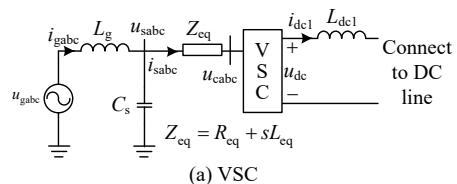

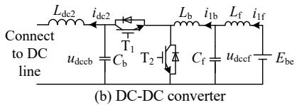  
Fig. 1 Simplified case of DC distribution network

This paper focuses on the feedback of DC current of DC-DC converter for active damping control. The control structure of DC-DC converter is shown in Fig.2 , the damping controller is expressed as

$$
F _ {\mathrm {d}} = \frac {k _ {\mathrm {d}} s}{s + \omega_ {\mathrm {d}}} \tag {1}
$$

where, $k _ { \mathrm { d } }$ is gain and $\omega _ { \mathrm { d } }$ is the bandwidth.

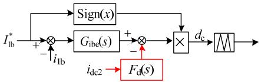  
Fig. 2 Principle of damping control

Taking Buck operating mode of DC-DC converter as an example, the influence of damping controller parameters on the impedance of DC-DC converter is shown in Fig.3. In order to suppress the resonant instability of DC distribution network, the ranges of damping controller parameters are presented in Fig.4

using the detailed model and simplified model. The recommended selection range of parameters is also given.

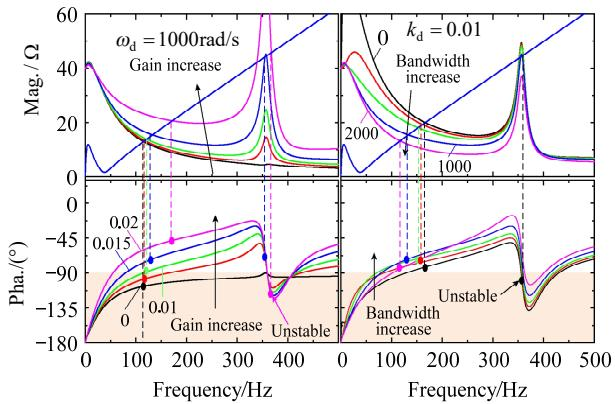  
Fig. 3 Influence of damping controller parameters on impedance of DC-DC converter

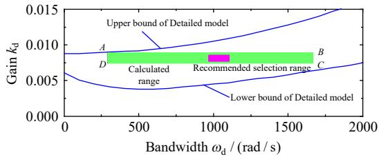  
Fig. 4 Ranges of damping controller parameters

The points A, B, $\mathrm { C } ,$ and D shown in the corner of calculated range in Fig.4 are selected for verification. The simulation results are shown in Fig.5. It’s shown that the resonant instability is suppressed when the damping controller enabled which validate the effectiveness of the proposed control method.

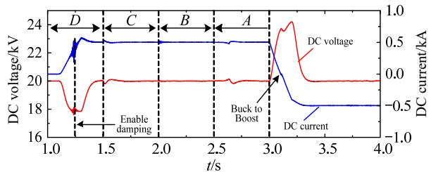  
Fig. 5 Simulation results