# 基于平均化理论的PWM 变流器电磁暂态快速仿真方法

# PS20130724001（三）适用于图像处理器的改进 并行仿真算法

高海翔 陈 颖 于智同 许 寅 陈来军

（ 清华大学电机工程与应用电子技术系 北京市 ；

2. School of Electrical Enginering and Computer Science，Washington State University，Pullman WA 99163，美国)

EMTP摘要 智能电网技术的发展需要快速电磁暂态程序 （ ） 而日益广泛应用的图像处理器1． 100084（ ）为电磁暂态仿真提供了高效的仿真环境和平台 文中首先提出了细粒度并行算法的运算．SchoolofElectricalEngineeringandComputerScience WashingtonStateUniversity PullmanWA99163级并行策略 ，即基于单指令多数据流 （ ） 的运算级并行策略和基于共享内存的运算级并行策略 随后 设计了应用这两种并行策略的改进电磁暂态细粒度并行算法 三相脉宽调制（ ）变流器仿真测试表明 适用于 的细粒度并行算法能够在保证仿真正确性的同时 显著提高仿真效率 从而验证了基于 的细粒度并行仿真算法适用于带有开关过程和复杂控制的大规模电力系统快速电磁暂态仿真应用的可行性

关键词 ： 脉宽调制变流器； 电磁暂态； 细粒度并行； 图像处理器（ ）

# 0 引言

随着智能电网技术的发展 新的发电 用电和储能设备逐渐接入 新的控制策略也越来越多地应用于电网 这些设备和策略一方面改善了电网的运行性能，另一方面也产生了新的故障形式和相应的动态过程 为此 有必要研究并发展准确 快速的电磁暂态仿真工具 提升智能电网设计和分析能力［ ］

－为满足不断增长的仿真计算需求 需利用先进12的计算机技术不断改善电磁暂态仿真工具［ ］ 近－年来 高性能并行计算技术有了长足的进步 特别是图像处理器 （ ） 在通用科学计算领域的成功应用［ ］ 为实现大规模系统的高效仿真提供了新的解－决思路 是计算机显示卡的核心处理单元 其57开发初衷是为了实现高速的图像渲染 在通用计算领域 最适合求解数据密集 计算量大且并行度高的计算问题 而电磁暂态仿真正属于此范畴利用 强大的计算能力有望大幅度提升电磁暂态仿真的效率 目前 已有研究通过调用 ［ ］等商业软件包并行求解节点电压方程 实现了最简单的电磁暂态 仿真［ ］ 但其并未提出适用于－的电磁暂态并行仿真算法

现有电磁暂态并行仿真算法采用“分解—协调”

策略实现系统级并行［ ］ 称为粗粒度并行算法－由于粗粒度并行算法只能在系统层面分解计算量可并发运行的线程和计算核心数目十分有限［ ］ 因此 其并不适合在 中运行 要求将求解17过程分解为大量可并行的简单运算 实现运算级并行 因此 实现适用于 电磁暂态仿真算法的难点在于 如何将带有开关过程和复杂控制的电磁暂态仿真求解分解为大量可并行的简单运算 以增加可并发运行的线程和计算核心数目 ， 实现算法的细粒度并行化 针对 高性能计算环境的特性 本文在文献 ［ ］ 提出的改进电磁暂态程序（ ）算法基础上 设计并实现了适用于 的电磁 暂 态 细 粒 度 并 行 算 法 文 中 介 绍 了 改 进算法的总体流程 指出其适用于并行求解并设计了适用于 的运算级并行算法 ， 包括基于单指令多数据流（ ）和基于共享内存的运算级并行 针对改进 算法中各求解步骤的特点 采用两种运算级并行算法 实现了改进算法的细粒度并行 并通过算例验证了此细粒度并行仿真算法的正确性和高效性

# EMTP1 改进EMTP算法流程

算法是电磁暂态仿真的常用方法 具有原理简单 仿真结果准确 效率较高等特点 但开关动作和控制系统求解会造成仿真流程碎片化 不适用于 并行求解 文献［ ］提出了改进算法（主要流程见图 ） 其将 算法中复杂的

开关处理逻辑转化为开关周期的迭代求解 在每个开关周期内，求解流程是一致的 ，这便有利于采用运算级并行策略，实现仿真流程的细粒度并行求解。

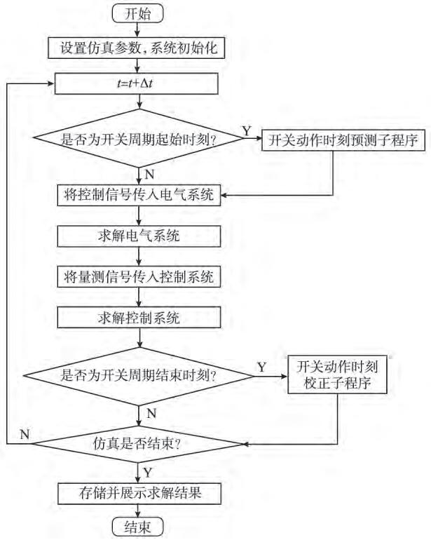  
图1 改进EMTP算法流程  
Fig．1 FlowchartofimprovedEMTPalgorithm

# 2 适用于GPU的细粒度运算级并行策略

本节设计了两种细粒度运算级并行策略 一是脱离仿真对象的物理背景 将主要计算转化为的向量计算模式［ ］ 该转化过程称为“向量化” ；二是根据仿真对象的物理属性分解计算 ， 使用共享内存处理各线程之间的耦合关系

# 2．1 基于SIMD的运算级并行策略

当一组 线程访问连续存储于设备内存中的数据并执行相同操作时 其具有较高的计算效率如图 所示

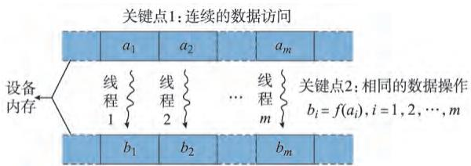  
图2 SIMD模式示意图  
Fig．2 SchematicdiagramofSIMDmode

从图 可见 的本质是向量运算 实现的一个方法是将计算转化为如下向量形式

$$
z = x * y \tag {1}
$$

式中 $\mathbf { \Psi } : { \boldsymbol { x } } \prime , { \boldsymbol { y } } \prime , z \in \mathbf { R } ^ { n }$ ； ＊ 表示任意向量运算符。

简单且常见的向量运算有向量加法和向量Hadamard 积，即

$$
z = x + y \tag {2}
$$

$$
\boldsymbol {z} = \boldsymbol {x} \circ \boldsymbol {y} \tag {3}
$$

向量 积的定义如下 ： 设 $x , y , z \in$ Rn ， 若 $z = x \circ y$ ， 则有 $z _ { i } = x _ { i } y _ { i } ( i = 1 , 2 , \cdots , n )$ 其中 $x _ { i } \cdot y _ { i } \cdot z _ { i }$ i 分别为 x ，y ，z 的对应元素

由于向量加法和 积运算中 各元素的操作相互独立 故可在 上启动大量线程并行求解，其中每个线程计算向量的一个元素

# 2．2 基于共享内存的运算级并行策略

对于无法转化为向量运算的求解步骤 可根据仿真对象的物理属性分解计算 例如 在执行与元件有关的操作时 ，可并发与元件个数等量的线程 ，其中每个线程负责完成一个元件的计算过程 但是该计算过程中可能存在耦合 导致各线程无法完全独立执行 主要有以下两种情况

）不同元件的计算过程存在先后顺序 ， 如元件的输出是元件 的输入 这种情况在控制系统求解中十分普遍 此时 必须在元件 求解完成后再求解元件 否则将导致计算结果错误  
）两个元件需对同一块内存执行写操作 例如在形成节点注入电流向量时 需要将连接在同一个节点上不同电气元件的诺顿等值电流加到等值电流向量的同一个元素上 此时 需要避免两个线程同时写同一块内存 否则可能导致累加结果不正确

对于以上两种情况 均可使用 共享内存实现线程间通信和原子操作来正确求解［ ］ 故称这类细粒度并行方法为基于共享内存的运算级并行

# 193 适用于GPU的电磁暂态细粒度并行算法

改进 算法各环节的计算特征 以及据此可采用的细粒度并行求解策略总结如表 所示

表1 改进EMTP算法主要计算环节的计算特征及其所属的细粒度并行层次  
Table1 Featuresandfinegrainedparallellevelsfor EMTPmainproceduresofimprovedEMTPalgorithm   

<table><tr><td>计算环节</td><td>计算特征</td><td>并行策略</td></tr><tr><td>计算电气元件诺顿等值电流</td><td>元件差异较大的向量运算</td><td>分组SIMD并行</td></tr><tr><td>形成节点注入电流向量</td><td>累加运算</td><td>共享内存并行</td></tr><tr><td>求解节点电压方程</td><td>线性方程组求解</td><td>并行数学库</td></tr><tr><td>计算电气元件内部变量</td><td>元件差异较大的向量运算</td><td>分组SIMD并行</td></tr><tr><td>求解控制系统</td><td>大量简单但耦合的运算</td><td>共享内存并行</td></tr><tr><td>开关动作时刻预测和校正</td><td>向量运算</td><td>SIMD并行</td></tr></table>

# 3．1 计算电气元件诺顿等值电流

由于不同端口数目元件的诺顿等值方程维数不同，因此在求解前，需要对电气元件按端口数分组

对于一般的电气元件 设端口数为 l 则其诺顿等值电流向量通常可以表示为上一时步端口电压和电流的线性组合［ ］ ，即

$$
\boldsymbol {i} _ {\mathrm {n e}} (t) = \boldsymbol {p} \boldsymbol {i} _ {\mathrm {b}} (t - \Delta t) + \boldsymbol {q} \boldsymbol {u} _ {\mathrm {b}} (t - \Delta t) \tag {4}
$$

式中 $\mathbf { \Gamma } _ { : } i _ { \mathrm { n e } } \mathbf { \Gamma } , i _ { \mathrm { b } } \mathbf { \Gamma } , \pmb { u } _ { \mathrm { b } } \in \mathbf { R } ^ { l }$ ， 分别为诺顿等值电流向量 支路电流向量和端口电压向量 ； $\pmb { p } , \pmb { q } \in \mathbf { R } ^ { l \times l }$ ， 为系数矩阵 。

设系统中存在 s 个端口数为 l 的电气元件 令

$$
\left\{ \begin{array}{l} \boldsymbol {I} _ {\mathrm {b}} = \left[ \boldsymbol {i} _ {\mathrm {b}, 1} ^ {\mathrm {T}} \quad \boldsymbol {i} _ {\mathrm {b}, 2} ^ {\mathrm {T}} \quad \dots \quad \boldsymbol {i} _ {\mathrm {b}, s} ^ {\mathrm {T}} \right] ^ {\mathrm {T}} \\ \boldsymbol {U} _ {\mathrm {b}} = \left[ \boldsymbol {u} _ {\mathrm {b}, 1} ^ {\mathrm {T}} \quad \boldsymbol {u} _ {\mathrm {b}, 2} ^ {\mathrm {T}} \quad \dots \quad \boldsymbol {u} _ {\mathrm {b}, s} ^ {\mathrm {T}} \right] ^ {\mathrm {T}} \\ \boldsymbol {I} _ {\mathrm {n e}} = \left[ \boldsymbol {i} _ {\mathrm {n e}, 1} ^ {\mathrm {T}} \quad \boldsymbol {i} _ {\mathrm {n e}, 2} ^ {\mathrm {T}} \quad \dots \quad \boldsymbol {i} _ {\mathrm {n e}, s} ^ {\mathrm {T}} \right] ^ {\mathrm {T}} \\ \boldsymbol {P} = \left[ \boldsymbol {p} _ {1} ^ {\mathrm {T}} \quad \boldsymbol {p} _ {2} ^ {\mathrm {T}} \quad \dots \quad \boldsymbol {p} _ {s} ^ {\mathrm {T}} \right] ^ {\mathrm {T}} \\ \boldsymbol {Q} = \left[ \boldsymbol {q} _ {1} ^ {\mathrm {T}} \quad \boldsymbol {q} _ {2} ^ {\mathrm {T}} \quad \dots \quad \boldsymbol {q} _ {s} ^ {\mathrm {T}} \right] ^ {\mathrm {T}} \\ \boldsymbol {Y} _ {\mathrm {n e}} = \left[ \boldsymbol {y} _ {\mathrm {n e}, 1} ^ {\mathrm {T}} \quad \boldsymbol {y} _ {\mathrm {n e}, 2} ^ {\mathrm {T}} \quad \dots \quad \boldsymbol {y} _ {\mathrm {n e}, s} ^ {\mathrm {T}} \right] ^ {\mathrm {T}} \end{array} \right. \tag {5}
$$

式中 ： I U ${ \cal I } _ { \mathrm { n e } } \in { \sf R } ^ { s l }$ T； P Q $\pmb { Y } _ { \mathrm { n e } } \in { \textbf { R } ^ { s l \times l } }$ ； 下 标… s 为元件编号

设 P ，Q 的第 k 列分别为 $P ^ { ( k ) } , Q ^ { ( k ) }$ ， 则有 ：

$$
\begin{array}{l} \boldsymbol {I} _ {\mathrm {n e}} (t) = \sum_ {k = 1} ^ {l} \left(\boldsymbol {P} ^ {(k)} \circ \boldsymbol {I} _ {\mathrm {b}} (t - \Delta t) + \right. \\ \boldsymbol {Q} ^ {(k)} \circ \boldsymbol {U} _ {\mathrm {b}} (t - \Delta t)) \tag {6} \\ \end{array}
$$

ne b这便实现了电气元件诺顿等值电流计算的分组1向量化 可在 上并行求解

# 3．2 形成节点注入电流向量

在形成节点注入电流向量时 需要将每个电气元件的诺顿等值电流值加到注入电流向量的对应元素上 因此在求解时， 只需并发与电气元件数目相同的线程 每个线程对应一个电气元件 线程之间通过共享内存通信 其具体实现为 ： 在共享内存中建立一个数组 用于存储节点注入电流向量 每个线程将其对应元件的诺顿等值电流值加到相应的向量元素上 使用原子操作以避免不同线程同时对同一块内存进行操作

# 3．3 求解节点电压方程

节点电压方程为线性方程组 ，由于每个开关周期内系统导纳矩阵不变 因而可采取先求逆矩阵 每时步计算矩阵向量乘法的求解策略 其中 后者可以利用 并行求解以提高效率 具体来说，分别采用以下两个并行数学库调用 进行求解利用 对导纳矩阵求逆［ ］ 利用 程序库实现矩阵向量乘法［ ］

# 3．4 计算电气元件内部变量

对于端口数为 l 的电气元件 其支路电流计算方程为［ ］

$$
\boldsymbol {i} _ {\mathrm {b}} (t) = \boldsymbol {y} _ {\mathrm {n e}} \boldsymbol {u} _ {\mathrm {b}} (t) + \boldsymbol {i} _ {\mathrm {n e}} (t) \tag {7}
$$

式中PW $\mathbf { \mathbf { \mathbf { \mathbf { \mathbf { \mathbf { \mathbf { \mathbf { y } } } } } } } } _ { \mathbf { \mathbf { \mathbf { \mathbf { \mathbf { \mathbf { \mathbf { \mathbf { \mathbf { \mathbf \mathbf { \mathbf { \mathbf \Theta } } } } } } } } } } } } \in \mathbf { \mathbf { \mathbf { \mathbf { \mathbf { R } } } } } ^ { l \times l }$ ，为诺顿等值导纳矩阵

在按照端口数分组之后 ，类似 节，端口电流EMTP的求解也可统一为 ：

$$
\boldsymbol {I} _ {\mathrm {b}} (t) = \sum_ {k = 1} ^ {l} \boldsymbol {Y} _ {\mathrm {n e}} ^ {(k)} \circ \boldsymbol {U} _ {\mathrm {b}} (t) + \boldsymbol {I} _ {\mathrm {n e}} (t) \tag {8}
$$

式中 $: \mathbf { Y } _ { \mathrm { n e } } ^ { ( k ) }$ 为 $\mathbf { Y } _ { \mathrm { n e } }$ 的第 k 列

需要说明的是 部分复杂元件可能需要求解支1路电流以外的内部变量 例如发电机需要求解机械8方程以获得转子角和角速度 这些计算亦可通过类似方式实现向量化 ，在此不再赘述

# 3．5 求解控制系统

基于共享内存的控制系统求解流程见图

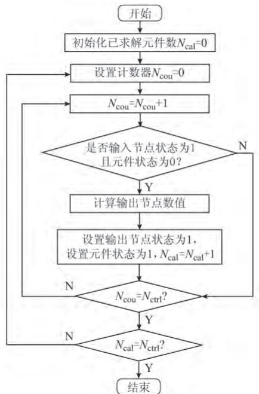  
图3 EMTP控制系统求解流程  
Fig．3 SolutionprocessofEMTPcontrolsystem

图中 $: N _ { \mathrm { c t r l } }$ 为控制元件总数 $N _ { \mathrm { \ c o u } }$ 为检测控制元件是否可以求解的计数器 在每次求解时 循环检测每个控制元件的输入节点值是否已知 若已知便求解此控制元件 并将其输出节点标记为已知状态 当所有元件均求解后 便完成了控制系统求解在求解时，需并发 $N _ { \mathrm { c t r l } }$ 个线程， 每个线程求解一个控制元件 不同线程间通过共享内存通信 以满足不同控制元件间的依赖关系 具体实现如下

）在共享内存中建立一个长度等于控制节点数的一维标志位数组 用于标记节点的状态 ：若节点已求解 则相应位置标记为“ ” 否则标记为“ ”  
）每个线程在求解控制元件前 首先检测该元件所有输入节点的标志位是否都为“ ” 若是则可读取输入节点信号 执行求解 并将输出节点的标志位

设为“ ” ；否则继续检测

# 3．6 开关动作时刻预测和校正

根据文献［ ］ ， 采用开关动作时刻的线性预测和校正方法 ：

$$
\tau_ {\mathrm {f}} (m) = 2 \tau (m - 1) - \tau (m - 2) \tag {9}
$$

$$
\boldsymbol {\tau} ^ {(j)} = \boldsymbol {\tau} ^ {(j - 1)} + _ {\alpha} (\mathbf {G} (\boldsymbol {\tau} ^ {(j - 1)}) - \boldsymbol {\tau} ^ {(j - 1)}) \tag {10}
$$

式中 $: \alpha$ 为迭代阻尼系数；G（ · ）为系统求解占空比的等效多项式 τ 为开关动作时刻向量 下标 表示预测值；上标 j 表示第 j 次迭代值；m 表示第 m 个开关周期

式（ ）和式（ ）所示运算均为向量运算 因此可直接采用 并行求解策略

# 4 算例测试与分析

# 4．1 算例及仿真环境设置

采用三相脉宽调制（ ） 变流器系统对细粒度并行仿真算法的正确性和效率进行测试其电气 拓扑如 图 所示 参数如下 直流电容为 $3 2 ~ 0 0 0 ~ \mu \mathrm { F }$ 滤 波 电 阻 为 Ω 滤 波 电 感为 ，载波频率为 ，电源频率为 ，电源幅值为 ，电源初相角为 ，直流负载为 Ω 控制系统采用VQ 控制模式 仿真所用硬件系统的主要参数如下 型号为 ? ?， 核 心 数 为 个， 主 频 为 ， 内 存为 24 GB;GPU 型号为 nVIDIA TeslaTM C2070,核心数为 （分为 个流处理器） 主频为GHz,内存为6 GB。

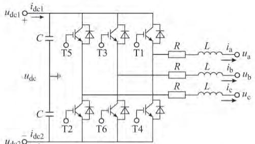  
（a）变流器电气拓扑

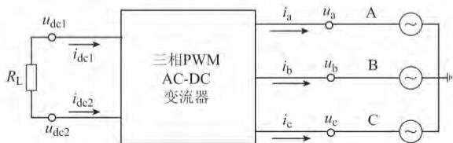  
（b）测试系统拓扑  
图4 三相PWMACDC变流器测试系统拓扑图  
Fig．4 TopologyofthreephasePWMACDC convertertestingsystem

# 4．2 正确性测试

设置仿真积分步长为 测试变流器系统在以下两种情景中的动态响应 ①交流电压跌落故

障 电 源 幅 值 于 时 从 跌 落到 ，并在 时恢复； ②直流侧短路故障，变流器直流侧于 时发生电阻性短路故障 短路电阻为 Ω 并在 时恢复

分别采用 种方式对测试系统进行仿真 ①利用 ／ 作为标准参照系统； ②在上采用 改 进 串 行仿 真 算 法［ ］ （以 下简 称串行程序） ③在 上采用细粒度并行仿真算法（以下简称 并行程序）

选取交流 相电流和直流电压 在两种情景下，对比 种方式的仿真波形 ，得到结果分别如图和图 所示 可见 并行程序可准确模拟变流器在交流电压跌落以及直流侧短路时交流电流与直流电压的变化过程 其仿真结果与串行程序和 ／ 高度吻合 对于其他仿真结果，三者也有类似的吻合关系 ， 在此不再赘述

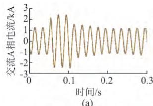

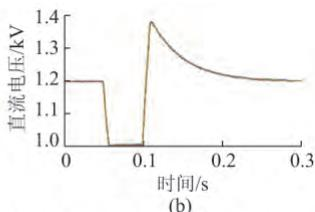  
-PSCAD/EMTDC；—CPU串行程序；—CPU并行程序  
图5 交流侧电压跌落故障仿真结果

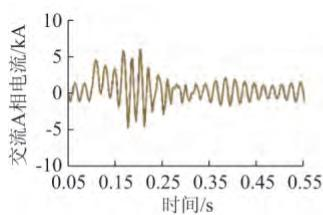  
Fig．5 SimulationresultsofACsidevoltagedropfault   
（a）

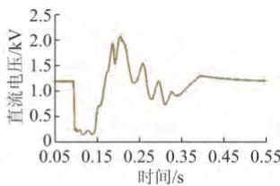  
-PSCAD/EMTDC：—CPU串行程序；—CPU并行程序  
图6 直流侧短路故障仿真结果  
Fig．6 SimulationresultsofDCsideshortcircuitfault

# 4．3 效率测试

在图 所示测试系统的基础上 通过增加并联变流器（及其控制系统）的数目以构造不同规模的仿真算例 测试交流侧电压跌落故障下系统规模不同时并行算法的仿真效率 由此得到 串行程序和 并行程序的单时步仿真平均耗时如表 和图 所示

可见 当 变流器数量为 个时 并行程序的效率已超过 串行程序 随着系统规模增加 并行程序相对于 串行程序的加速比增大 当 变流器数量为 个时 得到最

大加速比为 可以预计 在不超过 线程分配数目情况下 ，增加系统规模将获得更大加速比

表2 PWM 变流器算例单时步仿真平均耗时与加速比 Table2 Singlestepaveragingconsumingtimeand accelerationrateofPWMconvertertestingcase   

<table><tr><td>PWM变流器数量/个</td><td>CPU仿真耗时/μs</td><td>GPU仿真耗时/μs</td><td>加速比</td></tr><tr><td>1</td><td>13.18</td><td>144.97</td><td>0.0909</td></tr><tr><td>5</td><td>72.53</td><td>156.59</td><td>0.4632</td></tr><tr><td>10</td><td>149.88</td><td>169.92</td><td>0.8821</td></tr><tr><td>15</td><td>217.69</td><td>183.44</td><td>1.1867</td></tr><tr><td>30</td><td>548.71</td><td>272.27</td><td>2.0153</td></tr><tr><td>45</td><td>1175.41</td><td>359.57</td><td>3.2689</td></tr><tr><td>60</td><td>2103.34</td><td>475.93</td><td>4.4194</td></tr><tr><td>75</td><td>3350.07</td><td>608.45</td><td>5.5059</td></tr><tr><td>90</td><td>5231.55</td><td>776.10</td><td>6.7408</td></tr></table>

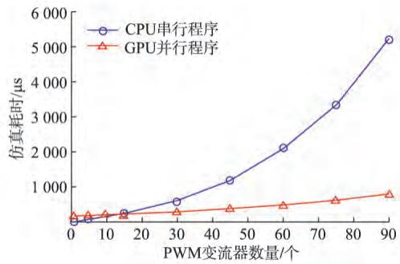  
图7 PWM 变流器算例仿真耗时  
Fig．7 ConsumingtimeofPWMconvertertestingcase

进一步 分别测试电气系统和控制系统的仿真耗时 得到如表 图 和图 所示测试结果

表3 PWM 变流器算例电气系统与控制系统仿真耗时Table3 ConsumingtimeofelectricandcontrolsystemofPWMconvertertestingcase  

<table><tr><td rowspan="2">PWM
变流器
数量/个</td><td colspan="2">电气系统仿真
耗时/μs</td><td rowspan="2">电气系
统仿真
加速比</td><td colspan="2">控制系统仿真
耗时/μs</td><td rowspan="2">控制系
统仿真
加速比</td></tr><tr><td>CPU</td><td>GPU</td><td>CPU</td><td>GPU</td></tr><tr><td>1</td><td>2.11</td><td>61.33</td><td>0.03</td><td>7.88</td><td>72.39</td><td>0.11</td></tr><tr><td>5</td><td>12.11</td><td>67.38</td><td>0.18</td><td>40.56</td><td>72.74</td><td>0.56</td></tr><tr><td>10</td><td>25.17</td><td>73.55</td><td>0.34</td><td>79.92</td><td>72.82</td><td>1.10</td></tr><tr><td>15</td><td>35.80</td><td>80.02</td><td>0.45</td><td>105.85</td><td>72.83</td><td>1.45</td></tr><tr><td>30</td><td>85.34</td><td>99.72</td><td>0.86</td><td>216.20</td><td>73.76</td><td>2.93</td></tr><tr><td>45</td><td>160.34</td><td>122.96</td><td>1.30</td><td>344.46</td><td>77.95</td><td>4.42</td></tr><tr><td>60</td><td>236.95</td><td>157.88</td><td>1.50</td><td>451.50</td><td>81.80</td><td>5.52</td></tr><tr><td>75</td><td>317.71</td><td>182.07</td><td>1.74</td><td>541.20</td><td>84.30</td><td>6.42</td></tr><tr><td>90</td><td>422.26</td><td>208.73</td><td>2.02</td><td>643.78</td><td>88.72</td><td>7.26</td></tr></table>

236．95 157．88 1．50 451．50 81．分析以上结果 ， 可以得到如下结论

317．71 182．07 1．74 541．20 84．30 6．42） 由于 变流器算例的电气系统规模较小 故并行计算加速效果并不明显 但在测试中已可以看出 并行算法的求解时间仅仅随电气系统规模增加而稍有增加 在变流器数量为 个时 已经

低于快速增加的串行程序仿真耗时

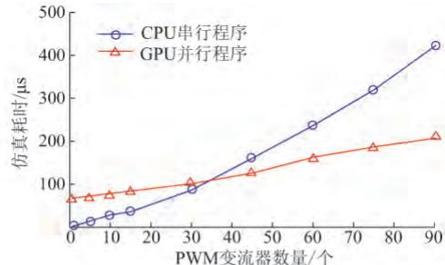

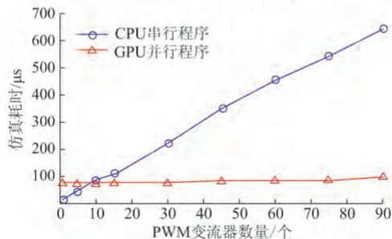  
(b)控制系统仿真耗时  
图8 PWM 变流器算例电气系统与控制系统仿真耗时Fig．8 ConsumingtimeofelectricandcontrolsystemofPWMconvertertestingcase

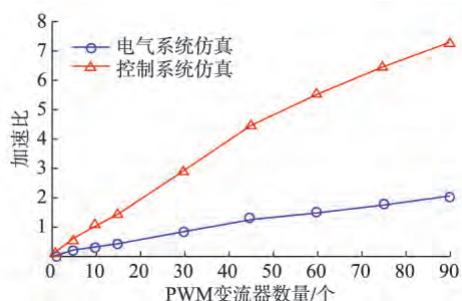  
图9 PWM 变流器各环节加速比相对系统规模的变化曲线  
Fig．9 Variationcurveofaccelerationrateand systemscaleofelectricsystemsolutionstepsof PWMconvertertestingcase

）由于不同变流器的控制系统具有很好的并行度 随着控制系统规模增大 细粒度并行仿真耗时基本不变 从而获得了较为明显的加速效果

由表 可知，系统规模较大时，并行程序求解电气与控制系统耗时不到总体耗时的一半 进一步测试可知 开关动作时刻预测与校正环节 特别是其中的系统导纳矩阵求逆环节占用了将近 的求解时间 其显著影响并行仿真算法的效率 由于在节所示细粒度并行仿真算法中 并未对导纳矩阵求逆做任何细粒度处理 只是调用数学库并行求解 因此 在进一步研究中需考虑如何提高这一步骤的求解速度 如对 进行优化配置 或换用更加高效 专门性的数学库 此外 也可以尝试在此环节中仅对导纳矩阵做简单分解 将部分计算

转移到求解节点电压方程环节中 以达到总体计算量最小的目的。

# 5 结语

结合 并行计算平台的特点 ， 本文在改进算法的基础上设计并实现了适用于 的电磁暂态细粒度并行算法 仿真测试表明 ， 此细粒度并行算法能够在保持仿真正确性的同时 提高仿真效率 本文对使用 进行带有开关过程和复杂控制的大规模电力系统快速电磁暂态仿真进行了有益探索 并指出算法的改进方向为求解节点电压方程中导纳矩阵的细粒度处理

# GPU参 考 文 献

［ ］ 郭力 ，王成山 含多种分布式电源的微电网动态仿真［ ］ 电力系统自动化 （ ）  
GUO Li，WANG Chengshan. Dynamical simulationonmicrogrid with different types of distributed generations[J].． J ．， ， （ ） ：  
［ ］ 李鹏 王成山 黄碧斌 等 分布式发电微网系统暂态时域仿真方GUO Li WANG Chenshan． Dnamical simulation on法研究 （一）基本框架与仿真算法［ ］ 电力系统自动化microgridwit（ ） ：  
AutomationofElectricPowerSystems 2009 332 8286．， ， ，Methodology of transient simulation in time domain for DG andJ ． 2013： ［ ］Automation of Electric Power Systems，2013，33(2)：33-39.  
［ ］ 田芳 周孝信 交直流电力系统分割并行电磁暂态数字仿真方法Methodolo oftransientsimulationintim［ ］ 中国电机工程学报 （ ）  
microgrid Partone basicframeworkandalgorithm J ．AutomationofElectricPowerSystems 2013 332 3339．／．［ ］ ， ， （ ） ：  
J ． 20113122 17．［ ］ 贺仁睦 周庆捷 郝玉国 电力系统机 网暂态仿真的并行算法TIANFan ZHOUXiaoxin．Partitionand［ ］ 中国电机工程学报 （ ）  
diitalelectromanetictransientsimulationofAC DC owersystemJ ．ProceedingsoftheCSEE 2011 3122 17．［ ］．， ， （ ） ：  
J ． 1995153 179184．［ ］HERenmu ZHOU Qingjie HAO Yuguo．Parallelalgorithm［ ］ ， ， （ ） ：for  
「6]夏俊峰，杨帆，李静，等,基于GPU的电力系统并行潮流计算的实现［ ］ 电力系统保护与控制 （ ）  
thefutureof arallelcom utin J ．IEEEMicro 2011 315 parallel power flow calculation based on GPU[J].Power System Protection and Control，2010，38(18)：100-103.   
[7]JALILI-MARANDI V,DINAVAHI V. SIMD-based large-scaleXIAJunfeng YANGFan LIJing etal．Implementationof－ ［ ］parallelpowerflowcalculationbasedonGPUJ ．PowerS（ ） ：  
ProtectionandControl 2010 3818 100103．［ ］ ［ ／ ］ ［ ］ ： ／／  
「9]陈来军，陈颖，许寅，等，基于GPU的电磁暂态仿真可行性研究transientstabilitysimulationonthegraphicsproc［ ］ 电力系统保护与控制 （ ） ：  
IEEETransonPowerSstems 2010 253 15891599．CULA EB OL ．20130510 ．http www．culatools．com．［ ］System Protection and Control，2013，41(2)：107-112.  
J ． 2013412 107112．［ ］ ， ， ，CHENLaijun CHENYing XUYin etal．Feasibilitystudyof－GPU basedelectromagnetictransientsimulation J ．Power［ ］／／

Conference，October 3-5，2011，Winnipeg，Canada：199-204.  
[11]DEBNATH J K， FUNG W，GOLE A M，et al. Electromagnetic transient simulation of large-scale electrical power networks using graphics processing units [C]// Conference October35 2011 Winnipeg Canada 199204．－ DEBNATH J K FUNG W GOLE A M et al Electromagne：   
power networks using graphics processing units C［ ］ 张伯明 ，陈寿孙 ，严正 高等电力网络分析［ ］ 版 北京 ：清华Proceedinsof25thIEEE大学出版社  
Com uterEnineerin Aril29Ma 2 2012 Montreal［ ］ 岳程燕 周孝信 李若梅 电力系统电磁暂态实时仿真中并行算Canada 14．法的研究［ ］ 中国电机工程学报 （ ）  
． M ．2 ．， ，2007144165．．［ ］ ， ， （ ） ：  
J ． 20042412 17．［ ］ 李永庄 林集明 曾昭华 电力系统电磁暂态计算理论［ ］ 北YUEChen an ZHOUX京 水利电力出版社  
approachestopowersystemelectromagnetictransientrealtime［ ］ ， ，simulationJ ．ProceedingsoftheCSEE 2004 2412 17．． M ．（ ） ［ ］Electrical Power &.Energy Systems，2009，31(9)：497-503.  
15 TOMIM M A MARTIJR WANDL．Parallelsolutiono ［ ］ 陈来军 独立电力系统电磁暂态并行仿真研究［ ］ 北京 清华largepowe大学  
euivalents MATE alorithm J ．InternationalJournalof［ ］ 陈来军 陈颖 梅生伟 等 一种混合并行算法及其在多相交直ElectricalPower＆EnergySystems 2009 319 497503．流混 合 电 力 系 统 中 的 应 用 ［ ］ 中 国 电 机 工 程 学 报．， （ ） ：  
CHENLaijun，CHENYing，MEI Shengwei，etal.A hybridparallel computation algorithm and its application to multi-phase hybrid AC/DC power systems[J]．Proceedings of the20103028 3945．， ， （ ） ：  
［ ］ 许寅 陈颖 陈来军 等 基于平均化理论的 变流器电磁arallelcom utationalorithm anditsa licationto multi暂态快速仿真方法分析 （二）适用 变流器分段平均模型phasehybridAC DCpowersystemsJ ．Proceedingsofth的改进 算法［ ］ 电力系统自动化 （ ）  
CSEE 2010 3028 3945．， ， ，electromagnetic transient simulation method for PWMconverters based on averaging theory：Part twoimprovedEMTP J ． 20133712 5156．XU Yin CHEN Ying CHEN Laijun et al． Fast［ ］ ，electromagnetic tran（ ）  
convertersbasedonaveragingtheory Parttwo improved［ ］ ，EMTPalgorithm suitableforpiecewiseaveraged modelof－ ： ［ ］ ， ：PWMconvertersJ ．Aut， ：  
2013 3712 5156．［ ］ ，KIRK B HWU W． Programming massively parallel ［ ］ ， ：processors a handson approach M ．Burlington US ， ：  
ElsevierInc 2010 5060．［ ］ ［ ／ ］ ［ ］ ： ／／WATSON／

Email chen ying（编辑 万志超）

cn（下转第 页 ）

， （ ） ：  
［ ］ 翟明玉 高原 杨志宏 调度自动化系统双网卡热备冗余机制的－设计与实现［ ］ 电力系统自动化 ， ， （ ） ：  
ZHAI Mingyu，GAO Yuan，YANG Zhihong.Design and2010 3414 9699． －redundancy mechanism for power grid dispatching automationJ ． 20093320 8791．－［ ］ ， ，ZHAI Mingyu（ ） ：

彭 晖（ —） ，男 ，通信作者 ，硕士 ，高级工程师 ，主要研究方向 ：智能电网调度自动化 实时数据库 网络通信 模型管理。E-mail：penghui@ sgepri.sgcc.com.cn  
葛以踊（ —） 男 硕士 工程师 主要研究方向 ： 网络1974－通信、资源管理 ： ＠  
吴庆曦（ —） 男 硕士 工程师 主要研究方向 模型Email penghui sgepri．sgcc．com．cn管理 资源管理 实时数据库 ： ＠sgcc.com.cn

pri．sgcc．com．cn（编辑 章黎）

# 3320 8791． Email wuqingxi sgMultiregionCommunicationNetworkDivision／RecoveryMechanismforPrefectureCountyIntegrated sgcc．com．cnDispatchingAutomationSystem

－Hui ， GE Yiyong ， WU Qingxi ， XU Chunlei ， LI Yunpeng ， CHEN Guohua

(1.NARI Technology Development Co.Ltd.，Nanjing 211106，China；2. State Grid Jiangsu Electric Power Company,1 1 1 2 3， ； ， ， ）

Abstract:Inthebackgroundof“largeoperation”，the wideareadistributed prefecture-county integrateddispatchingautomation systemcan greatlyconform totheconstruction nedof prefecture-countysmart griddispatching automation.But the wide area 1．NARITechnologyDevelopmentCo．Ltd． Nanjing211106 China 2．StateGridJiangsuElectricPowerCompany－， Nanjing210024 China 3．NantongElectricPowerCompany Nantong226001 China－ Inthebackgroundoflargeoperation＂ thewideareadistributedprefecturecountyintegrateddispatchingautomation systemcangreatlyconformtotheconstructionneedofprefecturecountysmartgriddispatchingautomation．Butthewidearea， distributionofdataacquisition variousapplicationsandthecomputernodesisboundtobringabouttherisksofmorefaultsand－ lowerreliabilityaswellasthedatainconsistencycausedbythenetworkfaults．Thedesignofnetworkdivision／recovery－ mechanismisintendedtosolvetheproblemsoftheprefecturecoun

distributedprefecturecountyintegrateddispatchingautomationsystemisbrieflydescribed withemphasisonthekey－ （ ）technologyandprinciple（ ）

recoverymechanismcaneffectivelysafeguardtheoperationofthewideareadistributedprefecturecountyintegrateddispatchingKeywords： ； ； ；automationsystemascanbeseenfromfieldprojectsin； ；

powersystemdispatchingautomati（上接第 页 ）

# orkrecovery statusrecognition dataconsistencyFastElectromagneticTransientSimulationMethodforPWM ConvertersBasedonAveragingTheory PartThree ImprovedEMTPParallelAlgorithmforGraphicProcessingUnit

Haixiang ， CHEN Ying ， YU Zhitong ， XU Yin ， CHEN Laijun

continuedfrompage48（ ， ， ， ；

2. School of Electrical Engineering and Computer Science，Washington State University，Pulman WA 99163，USA)

Abstract:Development of the smart grid technology requiresfast electromagnetic transient simulation，which is provided with a highly-eficientsimulationenvironmentand platformbyeverincreasing widely-used graphic procesingunit(GPU).First,this 1．DepartmentofElectricalEngineering TsinghuaUniversity Beijing100084 China， 2．SchoolofElectricalEngineeringandComputerScience WashingtonStateUniversity PullmanWA99163 USA（ ） ， Developmentofthesmartgridtechnologyrequiresfastelectromagnetictransientsimulation whichisprovidedwitha－ －， highlyefficientsimulationenvironmentandplatformbyeverincreasingwidelyusedgraphicprocessingunit GPU ．Firstthis－ （ ） ， paperputsforwardtwofinegrainedparalleloperationallevelstrategies whichareparallelismsbasedonsingleinstruction multipledata SIMD andsharedmemory．Nextfinegrainedparallel－

designed andsimulationproceduresareimplementedbyadoptingthetwostrategiesintheimprovede（ ， ）

transientalgorithm．Testresultsofpulsewidthmodulation PWM convertersshowthat thefinegrainedparallelsimulationKeywords： （ ） ； ； ；algorithmfo（ ）