# Time-Domain Implementation of Damping Factor White-Box Transformer Model for Inclusion in EMT Simulation Programs

Bjørn Gustavsen , Fellow, IEEE, Cesar Martin, and ´ Alvaro Portillo ´ , Senior Member, IEEE

Abstract—White-box detailed transformer models are used by manufacturers for predicting internal overvoltages in transformer windings during the lightning impulse test. One such model is the d-factor model, which is based on a lumped-parameter description based on winding discretization with the inclusion of losses via an empirical, frequency-dependent damping factor. This paper shows a procedure for direct inclusion of the d-factor model in electromagnetic transients simulation programs for use in general studies of network overvoltages. Proper utilization of the model’s diagonal structure is utilized in combination with real-valued arithmetic for maximum speed in transient simulations, with optional initialization from sinusoidal steady-state conditions. The model can be used both as a terminal equivalent and for calculation of internal voltages with use of an augmented input data set. The method is demonstrated for a single-phase three-winding transformer that is applied in a simulation study of transient resonant voltage buildup in the tertiary winding.

Index Terms—Transformer, white box model, damping factor, EMT, simulation, overvoltages.

# I. INTRODUCTION

T RANSIENT overvoltages in the power system are one ofthe root causes of transformer dielectric failures [1]. The the root causes of transformer dielectric failures [1]. The analysis of such situations requires the use of a proper electromagnetic transients simulation software that can represent all relevant components with adequate accuracy, including their frequency-dependent effects. In the case of transformers, the available models in existing Electromagnetic Transients (EMT) programs lack in good transformer models for simulation of high-frequency transients. Typically, the user has to make use of a standard 50/60 Hz model with addition of a few lumped capacitive elements to capture the high frequency effects. Such

Manuscript received December 18, 2018; revised February 13, 2019; accepted February 16, 2019. Date of publication March 1, 2019; date of current version March 24, 2020. This work was supported by the consortium participants of the SINTEF-led project “ProTrafo” (project no. 207160/E20). Paper no. TPWRD-01520-2018. (Corresponding author: Bjørn Gustavsen.)

B. Gustavsen is with SINTEF Energy Research, N-7465 Trondheim, Norway (e-mail:,bjorn.gustavsen@sintef.no).

C. Martin is with RTE–Reseau Transport d’Electricit ´ e, CNER, 92 932 Paris ´ La Defense CEDEX (e-mail: ´ ,cesar.martin@rte-france.com).

A. Portillo is an Independent Consultant in Transformers, Brenda 5920, ´ 11400, Montevideo, Uruguay (e-mail:,acport18@gmail.com).

Color versions of one or more of the figures in this paper are available online at http://ieeexplore.ieee.org.

Digital Object Identifier 10.1109/TPWRD.2019.2902447

model can at best represent the first (lowest) resonance frequency in a transformer, and it does not give any information about the internal overvoltages [2]. Several works have proposed the use of wide-band transformer models based on frequency sweep measurements of the transformer’s terminal admittance, followed by a model extraction step [3]. Such models can often give excellent accuracy for the transformer’s terminal behavior. One serious limitation is that the voltage inside the windings cannot be calculated, with the exception of taps in regulating winding.

In order to simulate internal overvoltages, it has therefore been proposed to make use of the white-box detailed transformer models [4]–[10] whose topology and parameters are calculated based on detailed knowledge of the transformer design. This model category is being used by the manufacturers to predict the internal overvoltages during the lightning impulse test in factory. For use in general network studies, these models are usually not directly compatible with EMT programs and some adaptation may therefore be necessary.

Reference [10] introduced one particular white-box model that makes use of a state-space model on diagonal form with an empirical damping function. In this d-factor model, the voltages on terminals are input and currents on the terminals are output, defining an admittance representation with respect to external terminals. In addition, the model gives out voltage on the internal nodes by providing additional rows in the output matrix of the state-space model. The model was in [10] included in an EMT simulation environment by calculating frequency domain samples for a terminal admittance matrix and voltage transfer function matrix, both which were subjected to model extraction by rational fitting. These steps of rational fitting are however inconvenient as there is a computational effort involved with possible loss of accuracy.

In the current work we show how to directly include the d-factor model [10] in an EMT environment known as EMTP-RV, without the need for rational fitting. The implementation considers the reading of input data from a text file in a predefined format being recommended in the ongoing CIGRE JWG A2/C4.52. The interfacing of the model with the electrical system is achieved via a Norton equivalent with the vector of history current sources updated from a subroutine (DLL code) which in each time step calculates the current source for the next time step using the ODEs of the state-space model that

TABLE I MATRIX DIMENSIONS   

<table><tr><td>A</td><td>B</td><td>C1</td><td>C2</td><td>D1</td></tr><tr><td>N×N</td><td>N×n1</td><td>n1×N</td><td>n2×N</td><td>n1×n1</td></tr></table>

results from the method. The inherent high efficiency implied by the diagonal form of the state matrix is further enhanced by a transformation of variables that converts the complex-valued variables and coefficients into real-only quantities. The model optionally calculates the voltage at internal nodes or a subset of nodes, when the required model augmentation is part of the input file. The implementation includes automated initialization from steady-state sinusoidal initial conditions as well as frequency scan. The model is complemented by an off-line tool for assessment of internal voltage stresses. The application of the model is demonstrated for analysis of potential internal resonance overvoltages due to ground fault initiation on a feeding cable.

# II. D-FACTOR STATE SPACE MODEL

We briefly recall the admittance based state-space model formulation proposed in [10] (1). The model has $n _ { 1 }$ (external) terminals, $n _ { 2 }$ internal nodes, and $n _ { 3 }$ inductive branch currents, giving a total of $N = n _ { 1 } + n _ { 2 } + n _ { 3 }$ states. The input $\mathbf { v } _ { \mathrm { e x t } }$ is voltage at terminals. The model output is partitioned into a first part $\mathbf { i } _ { \mathrm { e x t } }$ corresponding to terminal currents and a second part $\mathbf { v } _ { \mathrm { i n t } }$ corresponding to internal node voltages.

$$
\dot {\mathbf {x}} = \mathbf {A} \mathbf {x} + \mathbf {B} \mathbf {v} _ {\text {e x t}} \tag {1a}
$$

$$
\mathbf {i} _ {\text {e x t}} = \mathbf {C} _ {1} \mathbf {x} + \mathbf {D} _ {1} \mathbf {v} _ {\text {e x t}} \tag {1b}
$$

$$
\mathbf {v} _ {\text {i n t}} = \mathbf {C} _ {2} \mathbf {x} \tag {1c}
$$

The system (1) is on diagonal form with A diagonal. The elements of A are real or come in complex conjugate pairs. Any conjugate pair in A is associated with a corresponding complex conjugate pair of rows in B and columns in $\mathbf { C } . \mathbf { D } _ { 1 }$ is real. The matrix dimensions are shown in Table I. The model can be augmented with an additional matrix $\mathbf { C } _ { 3 }$ to give the internal branch currents, but that will not be considered here as the branch currents are usually of little interest.

# III. CONVERSION TO REAL STATE-SPACE MODEL

The use of complex arithmetic leads to slower computations in a time domain simulation based on discretization of the Ordinary Differential Equations (ODEs) (1). For instance, the multiplication of two complex numbers requires four real-valued multiplications and three summations. It is therefore advantageous to convert the system of equations into one involving real-valued parameters and variables only.

Consider the state equation associated with one complex (conjugate) pair of poles, $( a , a ^ { * } )$ ,

$$
\left[ \begin{array}{l} \dot {x} _ {1} \\ \dot {x} _ {2} \end{array} \right] = \left[ \begin{array}{l l} a & 0 \\ 0 & a ^ {*} \end{array} \right] \left[ \begin{array}{l} x _ {1} \\ x _ {2} \end{array} \right] + \left[ \begin{array}{l} \mathbf {b} ^ {T} \\ \mathbf {b} ^ {H} \end{array} \right] \mathbf {v} _ {\text {e x t}} \tag {2a}
$$

$$
\mathbf {y} = \left[ \begin{array}{l l} \mathbf {c c} & \mathbf {c} ^ {*} \end{array} \right] \left[ \begin{array}{l} x _ {1} \\ x _ {2} \end{array} \right] \tag {2b}
$$

By introduction of the similarity transformation $\tilde { \mathbf { x } } = \mathbf { T x }$ with

$$
\mathbf {T} = \left[ \begin{array}{l l} 1 & 1 \\ j & - j \end{array} \right] \tag {3}
$$

we obtain [11] for (2a) and (2b) with real-valued state-space matrices and state vector,

$$
\left[ \begin{array}{l} \dot {\tilde {x}} _ {1} \\ \dot {\tilde {x}} _ {2} \end{array} \right] = \left[ \begin{array}{l l} \operatorname {R e} \{a \} & \operatorname {I m} \{a \} \\ - \operatorname {I m} \{a \} & \operatorname {R e} \{a \} \end{array} \right] \left[ \begin{array}{l} \tilde {x} _ {1} \\ \tilde {x} _ {2} \end{array} \right] + \left[ \begin{array}{l} 2 \operatorname {R e} \{\mathbf {b} ^ {T} \} \\ - 2 \operatorname {I m} \{\mathbf {b} ^ {T} \} \end{array} \right] \mathbf {v} _ {\text {e x t}} \tag {4a}
$$

$$
\mathbf {y} = \left[ \begin{array}{l l} \operatorname {R e} \{\mathbf {c} \} & \operatorname {I m} \{\mathbf {c} \} \end{array} \right] \left[ \begin{array}{l} \tilde {x} _ {1} \\ \tilde {x} _ {2} \end{array} \right] \tag {4b}
$$

It is observed that for each complex pole pair the conversion gives a $2 \times 2$ block on the diagonal of A and a modification to the associated two columns of C and two rows of B. These conversions are applied to all complex pairs in (1a), (1b) and (1c).

# IV. TIME DOMAIN IMPLEMENTATION

# A. Discretization

In the following we use the bar symbol (overline) to denote the transformed matrices and variables in (1).

Consider one submatrix $\bar { \mathbf { A } } _ { m }$ of A¯ that represents one real pole, or one $2 \times 2$ real-valued block associated with a complex pole pair after the transformation by (3). Together with associated rows(s) $\bar { \mathbf { B } } _ { m }$ of $\begin{array} { r } { \bar { \bf B } . } \end{array}$ , and column(s) $\bar { \mathbf { C } } _ { 1 , m }$ of $\bar { \mathbf { C } } _ { 1 }$ , and $\bar { \mathbf { C } } _ { 2 , m }$ of $\bar { \mathbf { C } } _ { 2 }$ we get by usage of the central difference equation the following contribution to the output y,

$$
\begin{array}{l} \frac {\bar {\mathbf {x}} _ {m , k} - \bar {\mathbf {x}} _ {m , k - 1}}{\Delta t} = \bar {\mathbf {A}} _ {m} \frac {\bar {\mathbf {x}} _ {m , k} + \bar {\mathbf {x}} _ {m , k - 1}}{2} \\ + \bar {\mathbf {B}} _ {m} \frac {\mathbf {v} _ {\text {e x t} , k} + \mathbf {v} _ {\text {e x t} , k - 1}}{2} \tag {5a} \\ \end{array}
$$

$$
\mathbf {i} _ {\text {e x t}, m, k} = \bar {\mathbf {C}} _ {1, m} \bar {\mathbf {x}} _ {m, k} \tag {5b}
$$

$$
\mathbf {v} _ {\text {i n t}, m, k} = \tilde {\mathbf {C}} _ {2, m} \bar {\mathbf {x}} _ {m, k} \tag {5c}
$$

where $\bar { \mathbf { x } } _ { m }$ ,k is a vector of one or two real-valued elements. Subscript k denotes the kth time step and $\Delta t$ is the time step length which is assumed to be fixed.

By solving (5) for $\bar { \mathbf { x } } _ { m , k }$ and introducing a change of variable for the state variable [12] we get the final result for $\mathbf { i } _ { \mathrm { e x t } , m , k }$ and $\mathbf { v } _ { \mathrm { i n t } , m , k }$ by (6)–(8) with matrix dimensions given in Table II with subscript i = 1, 2.

$$
\bar {\mathbf {x}} _ {m, k} ^ {\prime} = \boldsymbol {\alpha} _ {m} \bar {\mathbf {x}} _ {m, k - 1,} ^ {\prime} + \boldsymbol {\beta} _ {m} \mathbf {v} _ {\text {e x t}, k - 1} \tag {6a}
$$

$$
\mathbf {i} _ {\text {e x t}, m, k} = \bar {\mathbf {C}} _ {1, m} \bar {\mathbf {x}} _ {m, k} ^ {\prime} + \mathbf {G} _ {1, m} \mathbf {v} _ {\text {e x t}, k} \tag {6b}
$$

$$
\mathbf {v} _ {\text {i n t}, m, k} = \bar {\mathbf {C}} _ {2, m} \bar {\mathbf {x}} _ {m, k} ^ {\prime} + \mathbf {G} _ {2, m} \mathbf {v} _ {e x t, k} \tag {6c}
$$

TABLE IIMATRIX DIMENSIONS FOR SINGLE POLE OR COMPLEX PAIR CONTRIBUTION  

<table><tr><td></td><td>αm</td><td>βm</td><td>Cim</td><td>Gi,m</td></tr><tr><td>Real pole</td><td>1×1</td><td>1×n1</td><td>ni×1</td><td>ni×n1</td></tr><tr><td>Complex pair</td><td>2×2</td><td>2×n1</td><td>nt×2</td><td>ni×n1</td></tr></table>

where

$$
\boldsymbol {\alpha} _ {m} = \left(\mathbf {I} - \bar {\mathbf {A}} _ {m} \frac {\Delta t}{2}\right) ^ {- 1} \left(\mathbf {I} + \bar {\mathbf {A}} _ {m} \frac {\Delta t}{2}\right) \tag {7a}
$$

$$
\boldsymbol {\beta} _ {m} = \left(\boldsymbol {\alpha} _ {m} \boldsymbol {\lambda} _ {m} + \boldsymbol {\mu} _ {m}\right) \bar {\mathbf {B}} _ {m} \tag {7b}
$$

$$
\mathbf {G} _ {1, m} = \left(\bar {\mathbf {C}} _ {1, m} \boldsymbol {\lambda} _ {m} \bar {\mathbf {B}} _ {m}\right) \tag {7c}
$$

$$
\mathbf {G} _ {2, m} = \left(\tilde {\mathbf {C}} _ {2, m} \boldsymbol {\lambda} _ {m} \tilde {\mathbf {B}} _ {m}\right) \tag {7d}
$$

with

$$
\boldsymbol {\lambda} _ {m} = \boldsymbol {\mu} _ {m} = \left(\mathbf {I} - \bar {\mathbf {A}} _ {m} \frac {\Delta t}{2}\right) ^ {- 1} \frac {\Delta t}{2} \tag {8}
$$

# B. Interfacing With Host Program

In the actual implementation the vector of state variables $\overline { { \mathbf { x } } } _ { k } ^ { \prime }$ is in each time step established by including all m real and complex pair contributions (6a). The individual matrices $\mathbf { G } _ { i , m }$ in (6a) and (6b) are summed and added to the feed-through matrices ${ \bf D } _ { 1 }$ and $\mathbf { D } _ { 2 } = \mathbf { 0 }$ in (1),

$$
\mathbf {G} _ {1} = \mathbf {D} _ {1} + \sum_ {m} \mathbf {G} _ {1, m} \tag {9a}
$$

$$
\mathbf {G} _ {2} = \sum_ {m} \mathbf {G} _ {2, m} \tag {9b}
$$

The total output vectors ${ \bf y } _ { i , k }$ from the individual output contributions ${ \bf y } _ { i , m , k }$ can then be calculated as

$$
\mathbf {i} _ {\text {e x t}, k} = \bar {\mathbf {C}} _ {1} \bar {\mathbf {x}} _ {k} ^ {\prime} + \mathbf {G} _ {1} \mathbf {v} _ {\text {e x t}, k} \tag {10a}
$$

$$
\mathbf {v} _ {\text {i n t}, k} = \bar {\mathbf {C}} _ {2} \bar {\mathbf {x}} _ {k} ^ {\prime} + \mathbf {G} _ {2} \mathbf {v} _ {\text {e x t}, k} \tag {10b}
$$

For the interfacing with the electrical system, only (10a) is used. This equation defines a Norton equivalent with $\mathbf { G } _ { 1 }$ as shunt conductance matrix and with history current source

$$
\mathbf {i} _ {\mathrm {h i s}, k} = - \bar {\mathbf {C}} _ {1} \bar {\mathbf {x}} _ {k} ^ {\prime} \tag {11}
$$

The Norton source calculation is illustrated in Fig. 1. The internal node voltages are calculated using (10b).

The updating of the history current source in each time step is done by a dedicated subroutine that is linked with the host program, see Fig. 2. That subroutine also calculates the internal node voltages. The resulting voltages are written sequentially to disk file.

# V. STEADY-STATE INITIALIZATION AND FREQUENCY SCAN

The model is compatible with frequency scan and initialization from steady-state (SS) or harmonic initial conditions, as found in several EMT simulation programs.

The first step is to calculate the terminal admittance matrix ${ \bf Y } _ { n }$ at the frequency of interest, typically at 50 Hz or 60 Hz (SS

$$
\begin{array}{l} \mathbf {i} _ {\text {e x t}, k} \\ \mathbf {v} _ {\text {i n t}, k} \end{array} = \begin{array}{c} \overline {{\mathbf {x}}} _ {k} ^ {\prime} \\ \boxed {- - - - - - - - - - - - - - - - - - - - - - - - - - - - - - - - - - - - - - - - - - - - - - - - } \\ \overline {{\mathbf {C}}} _ {2} \end{array} \cdot \begin{array}{l} \mathbf {v} _ {\text {e x t}, k} \\ \boxed {- - - - - - - - - - - - - - - - - - - - - - - - - - - - - - - - } \\ \boxed {- 0. 0 p t \mathbf {G} _ {2}} \end{array} + \begin{array}{l} \mathbf {v} _ {\text {e x t}, k} \\ \boxed {- 0. 0 p t \mathbf {G} _ {2}} \end{array}
$$

$$
- \overline {{\mathbf {C}}} _ {1} \overline {{\mathbf {x}}} _ {k} ^ {\prime} \begin{array}{c c c} & & + \mathbf {i} _ {k} \\ & \mathbf {G} _ {1} & \mathbf {v} _ {\text {e x t}, k} \\ & & - \end{array}
$$

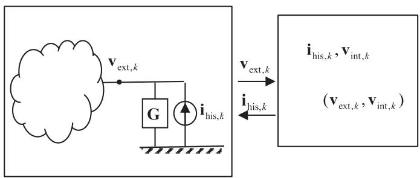  
Fig. 1. Interfacing model’s external terminals with host program electrical system via a Norton equivalent.   
Fig. 2. Time step loop with calculation of external and internal node voltages.

initialization) or at a list of frequencies (frequency scan). The robust calculation of ${ \bf Y } _ { n }$ is done using (36a) in [10] and will not be repeated here. With use of the given $\mathbf { Y } _ { n } .$ , the EMT host program will solve the entire system in the frequency domain and calculate all nodal voltages.

In the case of SS initialization for a time domain simulation, the model must in addition be able to initialize all its variables with specified voltages on its external terminals, given as complex quantities at the considered frequency.

With tilde denoting frequency domain variables, we get for (6a),

$$
\tilde {\bar {\mathbf {x}}} _ {m} ^ {\prime} = \boldsymbol {\alpha} _ {m} \tilde {\bar {\mathbf {x}}} _ {m} ^ {\prime} e ^ {- j \omega \Delta t} + \boldsymbol {\beta} _ {m} \tilde {\mathbf {v}} _ {\mathrm {e x t}} e ^ {- j \omega \Delta t} \tag {12}
$$

whose solution is

$$
\tilde {\bar {\mathbf {x}}} _ {m} ^ {\prime} = \left(\mathbf {I} - \boldsymbol {\alpha} _ {m} e ^ {- j \omega \Delta t}\right) ^ {- 1} \boldsymbol {\beta} _ {m} e ^ {- j \omega \Delta t} \tilde {\mathbf {v}} _ {\text {e x t}} \tag {13}
$$

In time step loop, the history current source is to be initialized for the next time step, implying that the frequency domain solution is associated with step k − 1. The associated variables for the time step loop therefore become

$$
\bar {\mathbf {x}} _ {m, k} ^ {\prime} = \operatorname {R e} \left\{\tilde {\bar {\mathbf {x}}} _ {m} ^ {\prime} e ^ {j \omega \Delta t} \right\} \tag {14a}
$$

$$
\bar {\mathbf {x}} _ {m, k - 1} ^ {\prime} = \operatorname {R e} \left\{\tilde {\bar {\mathbf {x}}} _ {m} ^ {\prime} \right\} \tag {14b}
$$

$$
\mathbf {v} _ {\text {e x t}, k - 1} = \operatorname {R e} \left\{\tilde {\mathbf {v}} _ {\text {e x t}} \right\} \tag {14c}
$$

From the contributions $\bar { \mathbf { x } } _ { m , k } ^ { \prime } \mathbf { t o }$ the total state $\bar { \mathbf { x } } _ { k } ^ { \prime }$ vector, (14a), we finally calculate the history current source vector using (11) and the internal node voltages using (10b). This initialization

```txt
write(n1) !n.o. external terminals  
write(n2) !n.o. internal node voltages  
write(N1) !n.o. real poles  
write(N2) !n.o. complex poles  
write('D:')  
for i=1:n1  
    for j=1:n1  
        write(D(i, j))  
    end  
end  
write('Poles:')  
for i=1:N1!real elements  
    write(A(i, i))  
end  
for i=N1+1:2:N1+N2!cmplx pairs, 1st of  
    write(real(A(i, i)))  
    write(imag(A(i, i)))  
end  
write('B:')  
for j=1:n1!columnwise  
    for i=1:N1!real elements  
        write(B(i, j))  
    end  
    for i=N1+1:2:N1+N2!cmplx pairs, 1st of  
        write(real(B(i, j)))  
    write(imag(B(i, j)))  
end  
end  
write('C:')  
for i=1:n1+n2!row-wise  
    for j=1:N1!real poles  
        write(C(i, j))  
    end  
    for j=N1+1:2:N1+N2!cmplx pairs, 1st of  
        write(real(C(i, j)))  
    write(imag(C(i, j)))  
end  
end  
write('Labels:')  
for i=1:n1+n2  
    write(labels(i));  
end 
```

Fig. 3. Writing model parameters to file in predefined format.

scheme is much simpler than the approach in [13] which makes use of complex-valued state variables in the time domain. It is remarked that the adopted implementation is in principle similar to that used for linear branch elements in existing EMT programs [14].

In the case of a frequency scan calculation, the EMT host program calculates all voltages in the system at each frequency. The transformer terminal voltages are used for calculating the internal node voltages in an off-line program using (37a) in [10]. (The need for an off-line calculation is due to a limitation in the call sequence from the EMTP-RV main program.)

# VI. MODEL TRANSFER FROM MANUFACTURER TO CUSTOMER

One of the objectives of CIGRE JWG A2/C4.52 is to facilitate the use of high-frequency transformer models in network studies. In order to transfer a model from a transformer manufacturer to the customer, the WG is proposing ASCII file formats for several transformer model formulations. One of the considered transformer models is the state-space model on diagonal form which is identical to the model in this paper. A possible file format for this model is outlined by the pseudo-code in Fig. 3 which writes the model contents sequentially to file in a

predefined format. The case with no internal node information is also covered since in that case $n _ { 2 } = 0$ . The mapping from the model’s node numbering to the manufacturer’s original numbering is held in a one-dimensional array labels.

# VII. MODEL INTERFACING WITH AN EMT PROGRAM

To demonstrate the use of white-box transformer models in overvoltage studies we implemented the considered d-factor model as a DLL plug-in for EMTP-RV, programmed in Fortran 90/95. The main features of the implementation are as follows.

- The model information is read from an ASCII file in the predefined format defined in Fig. 3. Essentially, this implies to replace all write statements with ditto read statements.   
- At t = 0, the routine initializes all coefficients and the Norton conductance matrix $\mathbf { G } _ { 1 }$ based on the time step length $\Delta t ,$ as outlined Section IV.   
- In the case that steady-state initialization is requested, the model calculates and returns the terminal admittance matrix ${ \bf Y } _ { n }$ at the steady-state frequency. From the steady-state solution of terminal voltages calculated by EMTP-RV, the routine initializes all variables as described in Section V.   
- In the ensuing time steps, the routine is called every time step where it updates the vector of history current sources.   
- The model can also be used with “frequency scan” for obtaining sweeps of terminal and internal node voltages for the transformer in the network.   
- Any number of transformer models can be used in the same simulation study.

The user interaction is handled by a dialogue window in the EMT simulation program. For maximum simulation speed, the user can specify to exclude the internal node voltage calculations. Further speed improvements are then also achieved during simulation startup as the program will read only the first portion of the C-matrix that relates to the $\left( n _ { 1 } \right)$ external terminals. The output file includes the array labels described in Section VI for node number mapping.

# VIII. EXPLORING INTERNAL VOLTAGE STRESSES

A separate GUI-type program was created in Matlab which permits to study the calculated internal node voltages in a straightforward manner. By usage of the node numbering mapping information included in the output file (“labels”), the program allows to plot both 2D and 3D (spatial) voltage distribution, as well as 2D/3D differential voltages. The program also calculates frequency sweeps of internal node voltages with the external terminal voltages obtained from “frequency scan”.

# IX. EXAMPLE: TRANSIENT SIMULATION STARTING FROM60 HZ STEADY-STATE OPERATION

# A. Transformer Design and Node Numbering

We proceed with the single-phase transformer described in [3]. This is a 50 MVA unit with rated voltage $2 3 0 / { \sqrt { 3 } } , 6 9 / { \sqrt { 3 } } .$ , 13.8 kV at 60 Hz. The primary, secondary and tertiary winding

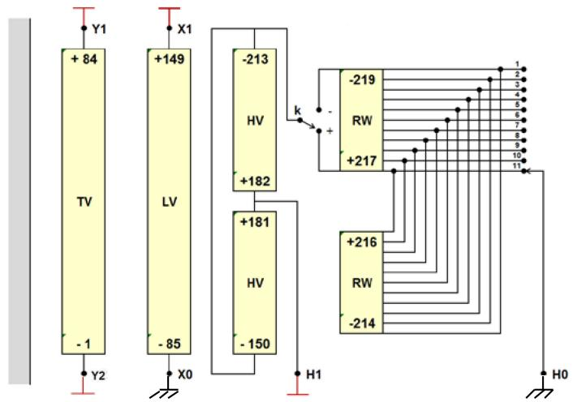  
Fig. 4. Single-phase transformer with manufacturer’s node numbering (labels).

TABLE III NUMBERING OF EXTERNAL NODES   

<table><tr><td></td><td>H1</td><td>X1</td><td>Y1</td><td>Y2</td></tr><tr><td>Model</td><td>1</td><td>2</td><td>3</td><td>4</td></tr><tr><td>Manufacturer (label)</td><td>181</td><td>149</td><td>84</td><td>1</td></tr></table>

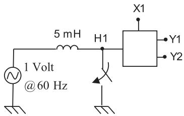  
Fig. 5. Feeding transformer from a 60 Hz voltage source.

are respectively of type interleaved disk, continued disk, and helical. The internal connections are shown in Fig. 4 along with the original node numbering (labels). The online tap changer (OLTC) has 11 tap positions and reversible polarity, giving 21 tap positions. In all ensuing calculations it is assumed that X0 and H0 are solidly grounded while H1, X1, Y1 and Y2 are external terminals with numbering as shown in Table III.

# B. Time Domain Simulation Results

We consider that the transformer is fed from an ideal 1-Volt voltage source on the HV side as shown in Fig. 5. The simulation starts from 60 Hz steady state initial conditions.

Figs. 6a–c shows the simulated result for the node-ground voltages along the primary winding when the breaker closes at $t = 2 0 ~ \mu \mathrm { s }$ , at voltage maximum. It is observed from Figs. 6a and 6b that the linear voltage distribution in the 60 Hz steadystate condition becomes non-linear after the breaker closes. The additional voltage stresses are more clearly observed in the plot of differential voltages in Fig. 6c.

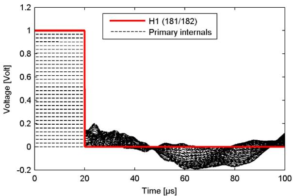

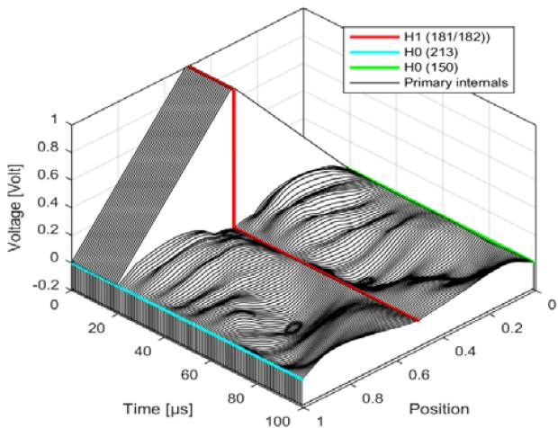  
（b）

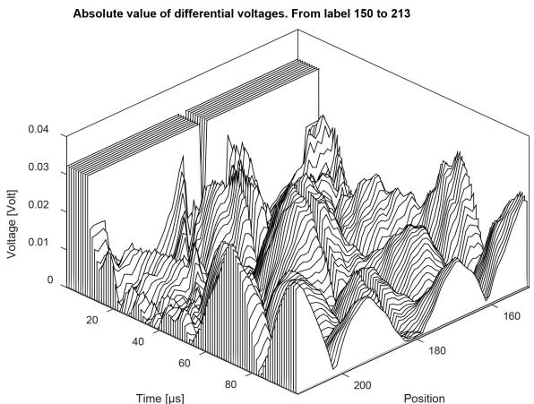  
  
Fig. 6. (a) Transient response in primary winding. (b) Spatial voltage distribution in primary winding vs. time. (c) Spatial voltage differential distribution in primary winding vs. time.

# C. CPU Time

Table IV shows the spent CPU time for the given example with 5000 time steps, including reading data from file but excluding the writing of waveforms to file. The total CPU time is seen to be less than one second even when calculating the 215 internal node voltages (nodes in primary, secondary and tertiary windings).

TABLE IV CPU TIME FOR CALCULATING 5000 TIME STEPS (EMTP-RV)   

<table><tr><td></td><td>Time [sec]</td></tr><tr><td>Calculate four terminal voltages</td><td>0.23</td></tr><tr><td>Additional for calculating 215 internal node voltages</td><td>0.40</td></tr><tr><td>Total</td><td>0.63</td></tr></table>

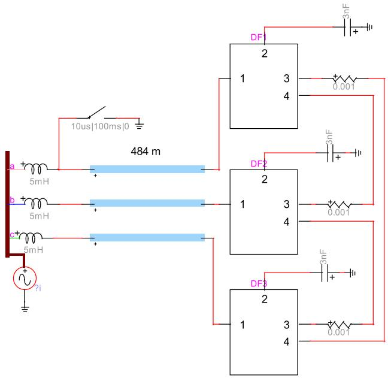  
Fig. 7. Ground fault initiation at t = 10 μs at cable feeding end. Transformer fed from 230 kV voltage source at 60 Hz behind 5 mH. Secondary terminals loaded with 3 nF capacitors, tertiary terminals connected in delta using 1 mΩ resistors.

# X. EXAMPLE: SIMULATION OF RESONANT OVERVOLTAGES

# A. Ground Fault Initiation

One of the most severe cases of transformer overvoltages are those resulting from a ground fault initiation near the entrance of a feeding cable of an unloaded transformer. In this situation, an oscillating overvoltage will occur on the HV terminal in the faulted phase which could cause a stimulation of a resonance in the transformer.

To simulate this event, three single-phase transformers were connected into a three-phase bank (YNynd) which is fed via cables from a 230 kV three-phase source behind a 5 mH shortcircuit inductance, see Fig. 7. Three small capacitors (3 nF) are connected to the LV side, representing short cables. The three feeding cables are modeled as frequency-dependent traveling wave models.

# B. Frequency Scan

To identify potential resonance voltages inside the transformer, a frequency scan was first made in EMTP-RV, without the presence of cables, voltage sources, and the 5 mH inductances. An ideal voltage source was applied directly to terminal H1 with H2 and H3 grounded, X1, X2, and X3 loaded with 3 nF capacitors and Y1, Y2, Y3 open. The frequency scan then calculates the voltage on all external terminals. The internal voltages

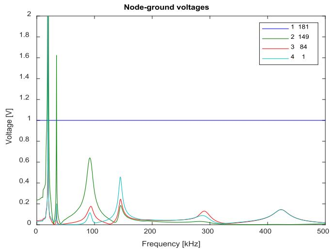  
Fig. 8. Frequency scan of terminal voltages.

TABLE V LEGENDS IN Figs. 8, 10, 12, 13   

<table><tr><td>Left side:</td><td>External node numbers of upper 1-ph transformer in Fig. 7.</td></tr><tr><td>Right side:</td><td>Labels (manufacturer&#x27;s ditto node numbers)</td></tr></table>

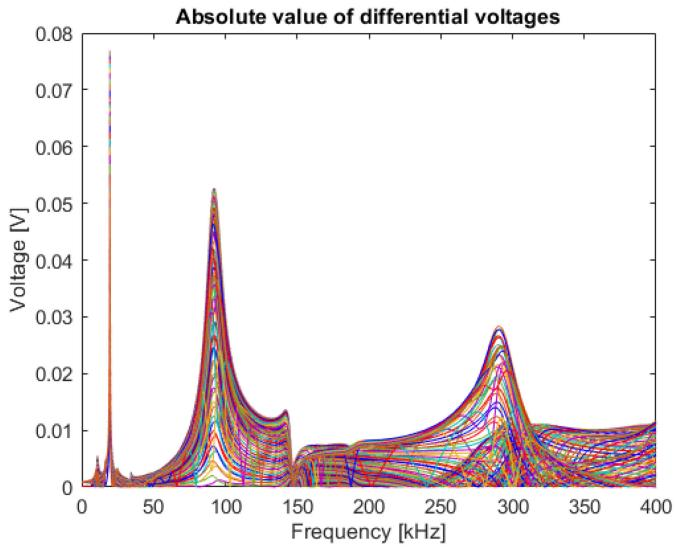  
Fig. 9. Frequency scan of tertiary internal differential node voltages.

are next calculated in a post-processing step with the external voltages applied to the model.

Fig. 8 shows the four terminal voltages of the 1-ph transformer associated with upper 1-ph transformer in Fig. 7. The legend in the plot denotes on the left side the model’s external (terminal) node numbers (Fig. 7) and on the right side the manufacturer’s node number (labels), see Table V.

In the following we will focus on overvoltages in the tertiary winding that can arise at high frequencies doe to wave reflections in the feeding cable. Fig. 9 shows that the tertiary winding differential node voltages has a strong resonance at 19.5 kHz

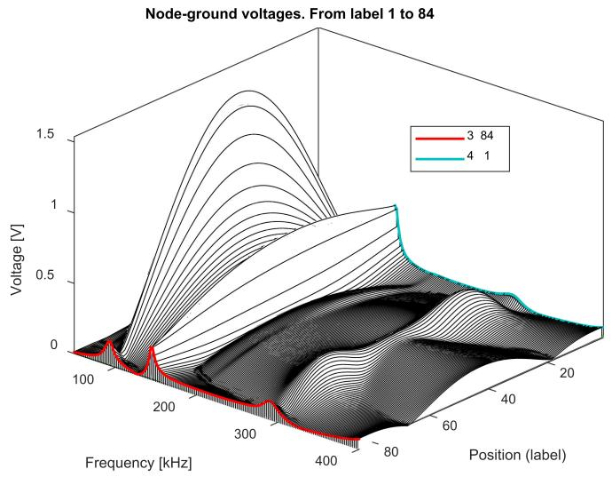  
Fig. 10. 3D Frequency scan of tertiary internal node voltages (50 kHz–400 kHz).

with peak value 0.077. This frequency corresponds to a very long cable length (excess of 2 km) which is not often found in practice. We therefore look at the resonance at 92 kHz with peak value 0.0526. This is 42 times higher than the 60 Hz differential voltage that would result with an operating voltage of 1 Volt (line-ground) on the primary side, which is given by (15).

$$
k = \frac {\sqrt {3}}{8 3} \cdot \frac {1 3 . 8}{2 3 0} = 0. 0 0 1 2 5 2 \tag {15}
$$

To get an understanding of the location of the internal stresses in the tertiary winding, a 3D plot was created as shown in Fig. 10. The plot also shows with color the voltage at the two extreme ends of the winding: Y1 (external node 3, label 84 in Fig. 4) and Y2 (external node 4, label 1 in Fig. 4). It is clearly observed that a large voltage magnification takes place inside the winding at 92 kHz that is only weakly observable from the two external terminals. The corresponding differential node voltages are shown in Fig. 11. (Note that the plots are in the range 50 kHz–400 kHz, thereby excluding the 19.5 kHz resonance in Fig. 9).

# C. Time Domain Simulation

With the 92 kHz resonance peak in mind, we turn back to the simulation example in Fig. 7 with ground fault initiation. Considering that the transformer at high frequencies represent a high impedance, the ground fault gives rise to an oscillating overvoltage at the transformer side of the cable which approximately corresponds to that of an open-end oscillation. The oscillation frequency is the quarter-wave frequency which is given by

$$
f _ {\lambda / 4} = \frac {v}{4 l} \tag {16}
$$

With the given cable, the high-frequency propagation velocity is 178 m/μs. It follows from (16) that 92 kHz corresponds to

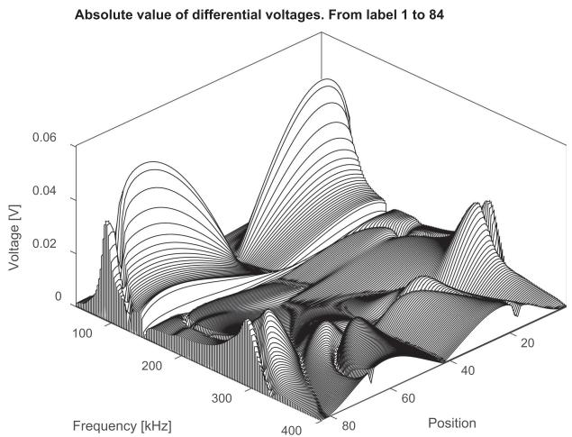  
Fig. 11. 3D frequency scan of tertiary internal differential node voltages.

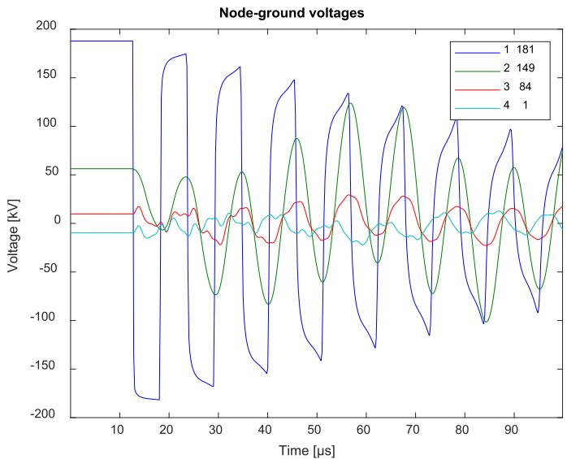  
Fig. 12. Transient waveforms on external terminals: H1 (1-181), X1(2-149), Y1 (3-84) and Y2(4-1).

a cable length of 484 m. With this length, simulated voltages result at the external terminals as shown in Fig. 12.

The resulting internal node-ground voltages in the tertiary winding are shown in Fig. 13. Clearly, the node-ground voltages increase with time due to resonance, leading to a very non-linear voltage distribution along the winding. Using a 2D plot (Fig. 14) the maximum differential voltage stress is found to be 7.0 kV. This is 30 times higher than the differential stress√ at 60 Hz which is $\sqrt { 2 } \cdot 1 3 . 8 / 8 3 = 0 . 2 3 5 \mathrm { k V }$ . The observed voltage magnification (k = 30) is less than the predicted theoretical voltage magnification of k = 42 by (15) which considers excitation by a stationary sinusoidal voltage source. The lower value is mainly a consequence of the damping of the impinging voltage (H1) in Fig. 12.

# XI. DISCUSSION

This work has advocated the use of predefined file formats (e.g., as in Fig. 3) as a practical way of transferring a white-

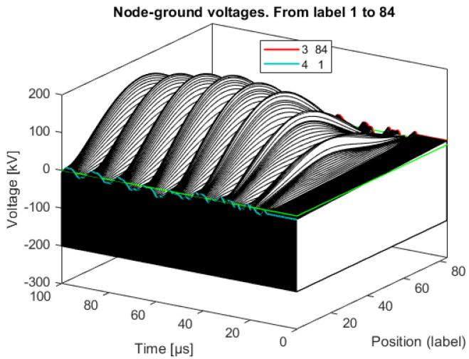  
Fig. 13. Time domain node-ground voltages in tertiary winding.

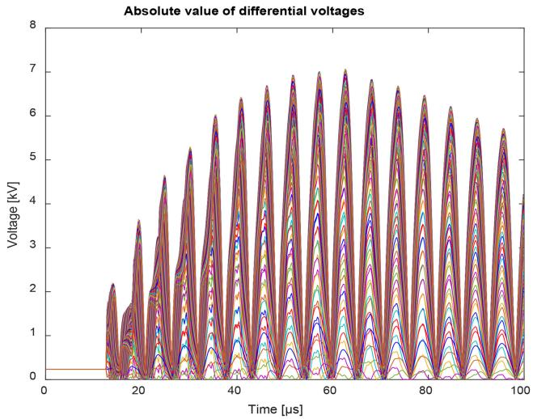  
Fig. 14. Time domain differential node voltages in tertiary winding (2D plot).

box model from the manufacturer to customer, for direct use with EMT simulation programs. We have also shown that the considered white-box model (d-factor) can be implemented in an EMT-program in a straightforward manner, leading to highly efficient calculations. The inclusion of other white-box models could follow in a similar manner, e.g., models based on rational fitting of the terminal admittance matrix and of the voltage transfer function block to internal nodes [15].

The implemented model can optionally calculate internal overvoltages as demonstrated by examples in Sections IX and X. It is however foreseen that the majority of applications will be with the model included as a terminal equivalent only. The calculation of internal voltages is more likely to be done by manufacturers and specialists that are working with transformer design and failure analysis. Postprocessing programs as the one used in this work are then very useful for determining the internal voltage stresses.

The application example in Section X considered the simulation of resonant voltage buildup inside a winding due to an oscillating overvoltage on the HV external terminal. This type

of simulation puts a lot of requirements on the model’s accuracy as the model must be able to represent both the resonance frequencies and their damping [10]. For the application with non-oscillating overvoltages, the model’s accuracy requirement is lower.

# XII. CONCLUSION

This paper describes details of a practical procedure for including a white-box transformer model in an EMT-type simulation program. The model data is read from a formatted text file which is independent of the EMT program to be applied, as proposed by CIGRE JWG A2/C4.52. The program implementation itself is done within a DLL code that is plugged into the EMT simulation platform. The model can be used as an external terminal equivalent only, and it can additionally calculate internal overvoltages if that information is provided in the model data file. The resulting program is highly efficient thanks to the use of a block-diagonal formulation with realonly cofficients and variables. It includes initialization of the simulation from sinusoidal steady state, and it provides for frequency scan as well. Internal voltage stresses are analyzed in a post-processing step by a dedicated calculation program that can consider both frequency responses (from EMT program frequency scan) and simulated time domain responses.

# REFERENCES

[1] CIGRE Technical Brochure 642, “Transformer reliability surveys,” WG A2.37, 2015.   
[2] CIGRE Technical Brochure 577A, “Electrical transient interaction between transformers and the power system. Part 1–Expertise,” CIGRE JWG A2/C4.39, Apr. 2014.   
[3] B. Gustavsen, A. Portillo, R. Ronchi, and A. Mjelve, “High-frequency resonant overvoltages in transformer regulating winding caused by ground fault initiation on feeding cable,” IEEE Trans. Power Del., vol. 33, no. 2, pp. 699–708, Apr. 2018.   
[4] R. M. Del Vecchio, B. Poulin, P. T. Feghali, D. M. Shah, and R. Ahuja, Transformer Design Principles, Boca Raton, FL, USA: CRC Press, 2010.   
[5] W. J. McNutt, T. J. Blalock, and R. A. Hinton, “Response of transformer windings to system transient voltages,” IEEE Trans. Power App. Syst., vol. PAS-93, no. 2, pp. 457–467, Mar. 1974.   
[6] A. Semlyen and F. De Leon, “Eddy current add-on frequency dependent ´ representation of winding losses in transformer models used in computing electromagnetic transients,” IEE Proc. Gener. Transm. Distrib., vol. 141, no. 3, pp. 209–214, May 1994.   
[7] E.E. Mombello and K. Moller, “New power transformer model for the calculation of electromagnetic resonant transient phenomena including frequency-dependent losses,” IEEE Trans. Power Del., vol. 15, no. 1, pp. 167–174, Jan. 2000.   
[8] M. Popov, L. V. Der Sluis, R. P. P. Smeets, J. Lopez-Roldan, and V. V. Terzija, “Modelling, simulation and measurement of fast transients in transformer windings with consideration of frequency-dependent losses,” IET Electric Power Appl., vol. 1, no. 1, pp. 29–35, Jan. 2007.   
[9] E. Bjerkan and H. K. Høidalen, “High frequency FEM-based power transformer modeling: Investigation of internal stresses due to network-initiated overvoltages,” Elect. Power Syst. Res., vol. 77, no. 11, pp. 1483–1489, 2007.   
[10] B. Gustavsen and A. Portillo, “A damping factor-based white-box transformer model for network studies,” IEEE Trans. Power Del., vol. 33, no. 6, pp. 2956–2964, Dec. 2018.   
[11] E.-P. Li, E.-X. Liu, L.-W. Li, and M.-S. Leong, “A coupled efficient and systematic full-wave time-domain macromodeling and circuit Simulation method for signal integrity analysis of high-speed interconnects,” IEEE Trans. Adv. Packag., vol. 27, no. 1, pp. 213–223, Feb. 2004.   
[12] B. Gustavsen and H. M. J. De Silva, “Inclusion of rational models in an electromagnetic transients program–Y-parameters, Z-parameters, Sparameters, transfer functions,” IEEE Trans. Power Del., vol. 28, no. 2, pp. 1164–1174, Apr. 2013.

[13] B. Gustavsen and A. Portillo, “Interfacing k-factor based white-box transformer models with electromagnetic transients programs,” IEEE Trans. Power Del., vol. 29, no. 6, pp. 2534–2542, Dec. 2014.   
[14] H.W. Dommel, EMTP Theory Book. Portland, OR, USA: Bonneville Power Admin., Aug. 1986.   
[15] B. Gustavsen and A. Portillo, “A black-box approach for interfacing whitebox transformer models with electromagnetic transients programs,” IEEE PES Gen. Meeting, Jul. 2014.

Bjørn Gustavsen (M’94–SM’03–F’14) was born in Norway, in 1965. He received the M.Sc. and Dr. Ing. degrees in electrical engineering from the Norwegian Institute of Technology, Trondheim, Norway, in 1989 and 1993, respectively. Since 1994, he has been working with SINTEF Energy Research, where he is currently a Chief Research Scientist. In 1996, he was a Visiting Researcher with the University of Toronto, Toronto, ON, Canada, and in the summer of 1998, he was with the Manitoba HVDC Research Centre, Winnipeg, MB, Canada. He was Marie Curie Fellow with the University of Stuttgart, Germany, from August 2001–August 2002. His research interests include simulation of electromagnetic transients and modeling of frequency dependent effects. He is the Convenor of CIGRE JWG A2/C4.52.

Cesar Martin ´ was born in France in 1989. He received the master’s degree in engineering from Supelec, Gif-sur-Yvette, France, in 2012. Since 2013, he´ has been working with RTE (Reseau Transport d’Electricit ´ e) as an R&D Engi- ´ neer with most activities on software development. He works closely with the Hydro-Quebec Research Institute (IREQ) following a co-development partner- ´ ship between RTE and IREQ. His current interests include programming on electromagnetic transients simulation tools, such as development of new power system models, gateways between software, and new calculation methods to speed up simulations.

Alvaro Portillo´ (M’84–SM’01) was born in Uruguay in 1954. He received the graduate degree in electrical engineering from the Uruguay University, Montevideo, Uruguay, in 1979. He was with the Uruguayan electrical utility (UTE), up to 1985, in activities related with transformers acceptance, installation and maintenance. From 1985 to 1999, he was with MAK (Uruguayan manufacturer of transformers); from 2000 to 2007, he was a Consultant with TRAFO (Brazilian manufacturer of transformers); and since 2007, he has been a Consultant in software tools development for transformer design with WEG (Brazilian manufacturer of transformers). Since 1977, he has been a Professor at the Uruguayan Republic University, Uruguay, now responsible for all postgraduation courses about transformers. He also works as a consultant of electric utilities in the elaboration of technical specifications and design review of power transformers. He is a Task Force Leader within CIGRE JWG A2/C4.52.