# Application of Electromagnetic Transient-Transient Stability Hybrid Simulation to FIDVR Study

Qiuhua Huang, Student Member, IEEE, and Vijay Vittal, Fellow, IEEE

Abstract—This paper deals with the development of a new electromagnetic transient (EMT)-transient stability (TS) hybrid simulation platform and its application to a detailed fault-induced delayed voltage recovery (FIDVR) study on the WECC system. A new EMT-TS hybrid simulation platform, which integrates PSCAD/EMTDC and the open source power system simulation software InterPSS has been developed. A combined interaction protocol with an automatic protocol switching control scheme is proposed. A multi-port three-phase Thévenin equivalent is developed for representing an external network in an EMT simulator. Correspondingly, the external network is represented in three-sequence, and a three-sequence TS simulation algorithm is developed. These techniques allow simulation of unsymmetrical faults within the internal network without the constraint of phase balance at the boundary. The effectiveness of the proposed techniques is first tested on the IEEE 9-bus system. Subsequently, the proposed hybrid simulation approach is applied to a detailed FIDVR study on a large WECC system. The study shows that a normally cleared single-line-to-ground (SLG) fault in the transmission system could lead to an FIDVR event, with compressor motors of the air conditioning units on the faulted phases stalling first, followed by a propagation of motor stalling to the unfaulted phase. Moreover, similar events are observed in simulations with a wide range of load compositions. Lastly, the effect of the point-on-wave (POW) at which a fault is applied on the occurrence of an FIVDR event is also analyzed.

Index Terms—Electromagnetic transient, fault induced delayed voltage recovery, hybrid simulation, interaction protocol, multiport three-phase Thévenin equivalent, transient stability.

# I. INTRODUCTION

W ITH the proliferation of converter based power elec-tronic devices and small single-phase induction motors tronic devices and small single-phase induction motors in power systems, the interaction of such fast responding elements with the power systems over time spans as long as 20 seconds has become a subject of significant interest [1], [2]. The fault-induced delayed voltage recovery (FIDVR) phenomenon [3]–[5] falls into this category of events. Detailed modeling and simulation of single-phase compressor motors

Manuscript received October 24, 2014; revised March 23, 2015 and July 14, 2015; accepted September 15, 2015. Date of publication September 28, 2015; date of current version May 02, 2016. This work was supported by the National Science Foundationunder Grant EEC-9908690 at the Power System Engineering Research Center. Paper no. TPWRS-01475-2014.

The authors are with the Department of Electrical, Computer and Energy Engineering, Arizona State University, Tempe, AZ 85281 USA (e-mail: qhuang24@asu.edu; vijay.vittal@asu.edu).

Color versions of one or more of the figures in this paper are available online at http://ieeexplore.ieee.org.

Digital Object Identifier 10.1109/TPWRS.2015.2479588

of air conditioners (A/Cs) and the distribution network is critical for the accuracy of FIDVR simulation results, especially under asymmetric fault conditions [5]–[7]. However, positive sequence transient stability (TS) simulators are unable to accurately model the A/C response to unbalanced faults. Simulation of large power systems with associated detailed modeling of large numbers of fast responding elements is too computationally burdensome for existing electromagnetic transient (EMT) simulators. While the scale of the system can be reduced by modeling a large portion of the system with a Norton or Thévenin equivalent, the drawback is that the nonlinear, dynamic response of the equivalenced portion of the system cannot be represented in the EMT simulation.

The EMT-TS hybrid simulation approach has been found to be practically feasible to meet such a simulation demand [1], [2], [8]–[15]. Alternative methods include dynamic phasor [16] and frequency adaptive [17] modeling approaches. The EMT-TS hybrid simulation approach is adopted in this paper, as this approach allows the flexible integration of the existing and proven EMT and TS simulators without “reinventing the wheel”. The portion of the system with a high penetration of A/C loads, referred to as the internal network, is modeled in an EMT simulator, whereas the rest of the system is regarded as the external network and represented by a phasor domain model.

Previous research on EMT-TS hybrid simulation mainly focused on interfacing techniques [11], including network equivalents on both sides [1], [12], [18] and interaction protocols [9], [13], [18]–[20] as well as the development of hybrid simulation programs [1], [2], [10], [14]- [15]. The external network equivalents used in previous research, with the exception of [12], were developed based on positive-sequence network models. Consequently, if the resulting network equivalents were used in study cases with unbalanced conditions, the internal network would have to be extended substantially in the cases with a mesh network topology, in order to comply with the three-phase balanced assumption, which would undermine the merits of hybrid simulation. For the interaction protocol, either the serial or the parallel protocol was used in previous research. The serial protocol has been found to be a limiting factor of simulation speed, whereas the parallel protocol could lead to accuracy issues. Moreover, these programs, with the exception of [2] and [10] are designed to run all simulations on only one computer, thus they are potentially limited by the local computing resources. References [2] and [10], however, did not provide implementation details of the commercial solution.

The issues identified above are addressed in this paper with the development of a new hybrid simulation platform integrating PSCAD/EMTDC [21] and an open source power

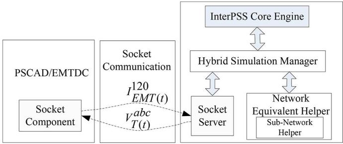  
Fig. 1. Schematic diagram of the architecture of the hybrid simulation platform.

system simulation software InterPSS [22], based on a decoupled architecture. A socket-based communication framework is developed to support this architecture. A combined interaction protocol with an automatic protocol switching scheme is proposed to increase the speed of hybrid simulation while maintaining accuracy. A multi-port three-phase Thévenin equivalent is proposed for representing the external network in PSCAD. Correspondingly, a three-sequence TS simulation algorithm is developed based on InterPSS for simulating the external network. With these techniques, any type of fault within the internal network can be analyzed without the three-phase balance constraint at the boundary.

The remainder of this paper is organized as follows. In Section II, the details of the development of the proposed hybrid simulation platform based on PSCAD/EMTDC and InterPSS are presented. Results of testing on the proposed approaches on a modified IEEE 9-bus system are given in Section III. A detailed FIDVR study on a large WECC system model is conducted based on the developed hybrid simulation platform in Section IV. The conclusions are provided in Section V.

# II. DEVELOPMENT OF A NEW HYBRID SIMULATION PLATFORM BASED ON PSCAD AND INTERPSS

# A. Architecture of the Hybrid Simulation Platform

The architecture of a hybrid simulation platform not only affects the selection of the communication method and interaction protocol, but also its extendibility in the future. A decoupled architecture for integrating an EMT and TS program is proposed and implemented using the pipe technology in [13]. A similar decoupled architecture is employed in this paper, as shown in Fig. 1, but implemented using a socket-based communication framework, which is more flexible and enables distributed simulation over a local area network (LAN).

PSCAD/EMTDC is adopted as the EMT simulator, and InterPSS is chosen for TS simulation. InterPSS not only provides models and algorithms for power flow, short circuit analysis and positive-sequence based transient stability simulation, but also defines the corresponding application programming interfaces (APIs).

The socket communication framework, consisting of a socket component developed as a user-defined model in PSCAD and a socket server on the InterPSS side, is specially developed for data exchange between the two simulators. The socket client in PSCAD is developed based on the socket component developed

in [23], which has been enhanced to realize programming-language-neutral data exchange and facilitate data export and import through the same socket.

It should be noted that with this architecture, only existing user interface functions of PSCAD and APIs of InterPSS are used for the development and no modification of the PSCAD program itself is required. Therefore, the proposed approach and algorithms discussed in the following subsections can be seamlessly extended to other similar EMT or TS simulators.

# B. A Combined Interaction Protocol

The interaction protocol relates to how the two simulators interact with each other in exchanging the necessary network equivalent parameters. There are mainly two types of interaction protocols used in previous research, i.e., the serial and parallel protocol [11]. With the serial protocol, one simulator must wait until the other completes the simulation of one interaction time step and transfers the equivalent data. To overcome this performance issue, several types of parallel protocols have been proposed [11]. The parallel protocol proposed in [9] requires data exchange for each iteration within one TS simulation time step. This requirement not only makes the data exchange process complicated, but is also impractical for most existing commercial EMT simulators as the iteration times required are unknown a priori. The parallel protocol proposed in [10] is relatively easy to implement. However, it could cause significant errors when the internal system experiences large disturbances, as the equivalents of the external network are not updated in a timely fashion to reflect the disturbances within the internal network.

In an effort to combine the advantages of both types of protocols, a combined interaction protocol is proposed based on the following observation: fast dynamics and significant system changes usually occur during the faulted period and last for up to tens of cycles after the fault is cleared; in order to reflect the fast dynamic response of the internal network in the external network, or vice versa, in a timely manner, the serial protocol should be used. For the rest of the simulation period, the parallel protocol can be used to achieve good efficiency, as the system mainly experiences slow dynamics.

First, both serial and parallel interaction protocols are implemented as shown in Figs. 2 and 3, respectively. In both figures, denotes the start time for the processing step, is TS simulation time step as well as the EMT-TS interaction time step, $I _ { \mathrm { E M T } ( t ) } ^ { 1 2 0 }$ an 1I120 $I _ { \mathrm { E M T } ( t - \Delta T ) } ^ { 1 \bar { 2 } 0 }$ are the three-sequence current injection vectors sent from the PSCAD side at the present and previous interaction time step, respectively.

If a fast transient phenomenon within the internal network is detected, the serial protocol is used for this time step. As shown in Fig. 2, the operation involved is divided into 5 steps. The first step isin step (2), $I _ { \mathrm { E M T } ( t ) } ^ { 1 2 0 }$ nsfer via a socket and pre-processing. Then,is used as the input for the three-sequence TS simbuses $V _ { \mathrm { T S } ( t + \Delta T ) } ^ { 1 2 0 }$ d the three-sequence voltages of the boundaryare updated. Subsequently, the three-phase Thévenin equivalent vwork equivalent helpstep (4). On receiving $V _ { T ( t + \Delta T ) } ^ { a b }$ are derived by the net-sent back to PSCAD inD continues to step (5), $V _ { T ( t + \Delta T ) } ^ { 1 2 0 }$

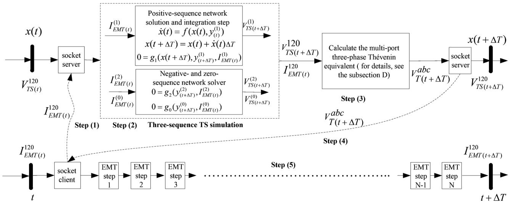  
Fig. 2. The implementation of EMT-TS hybrid simulation with the serial type of interaction protocol.

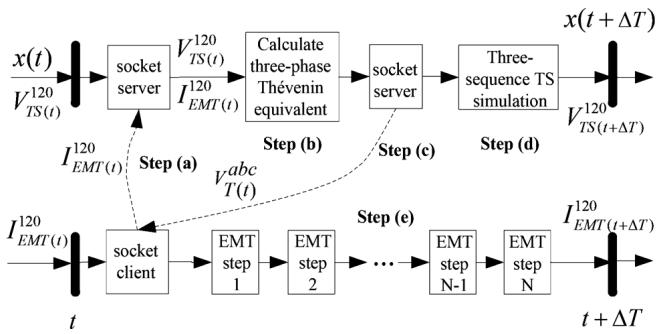  
Fig. 3. One interaction step of the developed EMT-TS hybrid simulation with the parallel type protocol.

Considering the computational complexity of each step, it is obvious that step (2) and step (5) are the two most time-consuming steps.

Otherwise, the parallel protocol shown in Fig. 3 is used. The step for calculating the Thévenin equivalent (step (b)) is executed right after step (a), while the time-consuming step (d) is the last step on the TS simulation side. With this execution sequence, the Thévenin equivalent is calculated using the voltages obtained from the previous step and sent back to PSCAD immediately, such that step (d) and step (e) can be run simultaneously.

One of the challenges in this combined protocol design is to identify an appropriate protocol switching time for general applications. To address this challenge, a protocol switching control scheme is proposed for selecting the processing step interaction protocol based on the last step protocol and detection of any large transient event within the internal network. The details of the design of the scheme are as follows:

1) Detection of Fast Dynamics Within the Internal Network: There are basically two options for detecting disturbances: one is the rate of change, the other is the change of magnitude. The change of magnitude fails to provide the information for determining whether the system is undergoing a fast transient or a slow dynamic condition. In contrast, the rate of change, or the

maximum rate of change for multiple monitored variables, can provide the necessary information. Thus the rate of change is adopted for controlling the protocol switching.

2) Variable Selection for Detecting Fast Dynamics: In principle, current, voltage and power are good candidates for detecting transient events within the internal network. Considering that the sequence current injections at the boundary have been used as the interfacing variables, reusing them for protocol switching control can reduce the communication overhead and simplify the interfacing design. Therefore, the three-sequence current injections are adopted for detecting fast dynamics.   
3) Implementation: The detection is based on the maximum rate of change of the three-sequence current injections at the boundary, which is denoted by $R I _ { \mathrm { E M T } ( t ) } ^ { 1 2 0 }$ and defined by (1).

$$
\begin{array}{l} \mathrm {R I} _ {\mathrm {E M T} (t)} ^ {1 2 0} \\ = \max  _ {i} \left(\max  _ {s \in (1, 2, 0)} \left(\left| \frac {I _ {\mathrm {E M T} (i , t)} ^ {(s)} - I _ {\mathrm {E M T} (i , t - \Delta T)} ^ {(s)}}{I _ {\mathrm {E M T} (i , t - \Delta T)} ^ {(1)}} \right|\right)\right) / \Delta T \tag {1} \\ \end{array}
$$

where denotes one of the boundary buses, represents one of the three sequences; i $I _ { \mathrm { E M T } ( i , t ) } ^ { ( s ) } \mathrm { i s }$ the current injection of sequence at the boundary bus at time .

It is observed that $\mathrm { R i _ { E M T } ^ { 1 2 0 } } _ { ( t ) }$ generally becomes smaller or settles down after reaching the peak. If only $R I _ { \mathrm { E M T } ( t ) } ^ { 1 2 0 }$ were used for decision-making, the scheme would sometimes switch the protocol back to the parallel type even during the fault period. To address thethis delay function, $\mathrm { R I _ { E M T ( } ^ { 1 2 0 } } _ { t ) }$ elay function is introduced. Withmust be consecutively less than the threshold for at least a period defined by the delay setting before switching from the serial protocol to the parallel protocol, otherwise the serial protocol is used.

The logic of the final pillustrated by Fig. 4. When $\mathrm { R I _ { E M T ( \it t ) } ^ { 1 2 0 } }$ witching control scheme isis larger than the threshold , the serial protocol is used; otherwise, the decision is made based on the protocol used in the last interaction step. When the

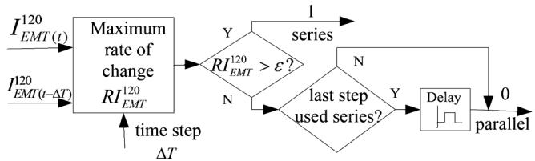  
Fig. 4. The logic of protocol switching control algorithm.

protocol is switched from the serial type to the parallel type, the delay function becomes active.

4) A Guide for Parameter Selection: The choice of the threshold is based on the characteristic of the power system cally, dyna transient, specifically the characteristic of $\mathrm { R I _ { E M T ( \it t ) } ^ { 1 2 0 } }$ is very small under a steady state or a slowion, while it becomes notably larger under the $\mathrm { R I _ { E M T ( } ^ { i 2 0 } } _ { t ) }$ . Typifast-transient condition of a fault. Thus, the threshold here, to a large extent, is analogous to the threshold setting for over-current protection. But the threshold selection in this scheme is much simpler, as the reference value is almost irrelevant to the operating conditions. Thus, a 2–10% step change for each interaction time step is recommended as the threshold. The interaction time step $\Delta T$ is usually the same as the TS time step, thus 1–10 ms can used depending on the integration method of the TS simulation and the phenomenon studied. For the delay time setting, based on the characteristics of power system transients and simulation experience, the delay time should be at least half of the fault period.

5) Potential Applications: If the study is concentrated on the fast transient period, the $\mathrm { R I _ { E M T ( \it t ) } ^ { 1 2 0 } }$ can be used to assist in the early termination of the hybrid simulation. For study cases where a longer term simulation (e.g., 5–20 is needed, it is desirable to switch from hybrid simulation to quasi-steady-state dynamic simulation after the fast transients settle [18]. With the availability of $R I _ { \mathrm { E M T } ( t ) } ^ { 1 2 0 }$ , a priori knowledge of the study case is no longer required.

# C. Extension of InterPSS for Hybrid Simulation

Within the box on the right hand side in Fig. 1, three Java classes, i.e., hybrid simulation manager, sub-network helper and network equivalent helper, are specially developed to enhance InterPSS for hybrid simulation. The core functions of the hybrid simulation manager include the protocol switching control discussed in the previous section and managing data conversion and interchange. The sub-network helper mainly defines the boundary between the internal and external networks and provides the boundary information to the network equivalent helper. The primary objective of the network equivalent helper is to calculate/update the Thévenin equivalents of the external system.

In accordance with the use of the three-phase Thévenin equivalent in the internal network, all components in the external system, including the generators, transmission elements and loads, are represented in three-sequence detail. For the generator modeling, rotor dynamics are considered only in the positive sequence, with the effects of the negative- and zero-sequence represented by sequence impedances. Correspondingly, a three-sequence based TS simulation algorithm is developed,

as depicted in Fig. 2. The algorithm is composed of the conventional positive-sequence TS algorithm and a sequence network solver for calculating the negative- and zero-sequence voltages with the sequence current injections at the buses of the external system. The equation $g _ { 2 }$ and $g _ { 0 }$ in the three-sequence TS simulation block in Fig. 2 can be described by (2) and (3).

$$
g _ {2}: \boldsymbol {I} _ {\text {e x t} (t)} ^ {(2)} = \boldsymbol {Y} _ {\text {e x t}} ^ {(2)} \boldsymbol {V} _ {\text {e x t} (t)} ^ {(2)} \tag {2}
$$

$$
g _ {0}: \boldsymbol {I} _ {\text {e x t} (t)} ^ {(0)} = \boldsymbol {Y} _ {\text {e x t}} ^ {(0)} \boldsymbol {V} _ {\text {e x t} (t)} ^ {(0)} \tag {3}
$$

where the subscript ext denotes the external network, $V _ { \mathrm { e x t } ( t ) } ^ { ( 2 ) }$ and $V _ { \mathrm { e x t } ( t ) } ^ { ( 0 ) }$ are vectors of negative and zero sequence voltages, respectively; $\pmb { Y } _ { \mathrm { e x t } } ^ { ( 2 ) }$ and $\pmb { Y } _ { \mathrm { e x t } } ^ { ( 0 ) }$ ext are the bus-admittance matrices of the negative and zero sequence network, respectively; $I _ { \mathrm { e x t } ( t ) } ^ { ( 2 ) }$ and (0） $I _ { \mathrm { e x t } ( t ) } ^ { ( 0 ) }$ are vectors of the negative- and zero-sequence current injections.

If the faults are applied within the internal network, the busadmittance matrices are constant during the whole simulation, thus the matrix factorization is required only once. In addition, only entries corresponding to boundary buses in both $I _ { \mathrm { e x t } ( t ) } ^ { ( 2 ) }$ and $I _ { \mathrm { e x t } ( t ) } ^ { ( 0 ) }$ are non-zero and are obtained from $I _ { \mathrm { E M T } ( t ) } ^ { 1 2 0 }$ . The three sequence networks are decoupled and can be solved independently.

# D. Multi-Port Three-Phase Thévenin Equivalent

A multi-port three-phase Norton equivalent is proposed in [12] in order to consider unsymmetrical faults. However, actual modeling of this equivalent in an EMT simulator could be limited by the available controllable current source components. For example, the phase of the single-phase current source in PSCAD is not adjustable, while the single-phase voltage source is controllable for both the phase and magnitude. Therefore, a three-phase Thévenin equivalent is proposed to represent the external network. The Thévenin equivalent is formed based on a three-phase Norton equivalent [12] using the following three major steps:

1) Calculate Multi-Port Three-Sequence Norton Equivalents: First, the three sequence networks of the external network are formed. The three-sequence equivalent admittance in [12]. is matrix $\pmb { Y } _ { N } ^ { 1 2 0 }$ $\dot { Y _ { N } ^ { 1 2 0 } }$ N can be calculated based on the method proposed a block matrix and the submatrix $Y _ { N i j } ^ { 1 \mathrm { { 2 0 } } }$ representing the entry at the row , column of is as follows: $Y _ { N } ^ { 1 2 0 }$

$$
Y _ {N i j} ^ {1 2 0} = \left[ \begin{array}{c c c} Y _ {N i j} ^ {(1)} & 0 & 0 \\ 0 & Y _ {N i j} ^ {(2)} & 0 \\ 0 & 0 & Y _ {N i j} ^ {(0)} \end{array} \right]. \tag {4}
$$

A three-sequence Norton equivalent can then be obtained as

$$
\boldsymbol {I} _ {N} ^ {1 2 0} = \boldsymbol {Y} _ {N} ^ {1 2 0} \boldsymbol {V} ^ {1 2 0} - \boldsymbol {I} _ {\mathrm {E M T}} ^ {1 2 0} \tag {5}
$$

where $\pmb { I } _ { N } ^ { 1 2 0 }$ and $\pmb { Y } _ { N } ^ { 1 2 0 }$ are the three-sequence Norton equivalent current source vector and admittance matrix, respectively; $V ^ { 1 2 0 }$ is a vector representing the three-sequence voltages of the boundary buses; $I _ { \mathrm { E M T } } ^ { \mathrm { i 2 0 } }$ is a vector of current injections from the internal network into the external network.

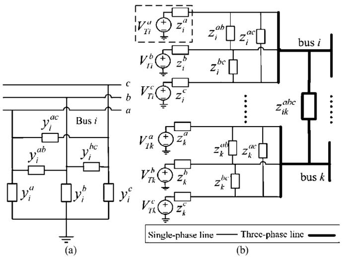  
Fig. 5. Three-phase network equivalent: (a) the primitive self-admittance of the boundary bus ; (b) three phase multi-port Thévenin equivalent.

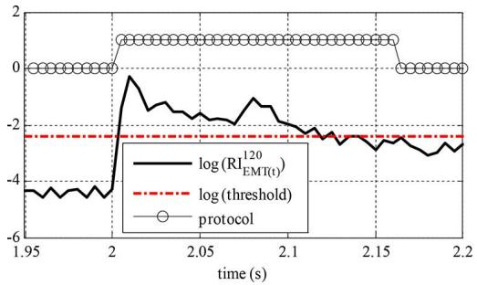  
Fig. 6. The behavior of the combined protocol $( \varepsilon = 0 . 0 0 4 )$

2) Three-Sequence to Three-Phase Transformation: The primitive self-admittances of each boundary bus and the primitive mutual admittances among the boundary buses are obtained from $Y _ { N } ^ { 1 2 0 }$ first. These admittances and the entries in $I _ { N } ^ { 1 2 0 }$ a re transformed to a three-phase form in an element-wise manner:

$$
I _ {N i} ^ {\mathrm {a b c}} = S I _ {N i} ^ {1 2 0} \tag {6}
$$

$$
y _ {i} ^ {\mathrm {a b c}} = \boldsymbol {S} y _ {i} ^ {1 2 0} \boldsymbol {S} ^ {- 1} \tag {7}
$$

$$
y _ {i k} ^ {\mathrm {a b c}} = \boldsymbol {S} y _ {i k} ^ {1 2 0} \boldsymbol {S} ^ {- 1} \tag {8}
$$

where 1Ni $I _ { N i } ^ { a b c }$ and $I _ { N i } ^ { 1 2 0 }$ denote the Norton equivalent current source of boundary bus in three-sequence and three-phase, respectively; $y _ { i } ^ { 1 2 0 }$ and $y _ { i } ^ { a b c }$ are the primitive self-admittance of the boundary bus in three-sequence and three-phase representations, respectively, and a generic topology of $y _ { i } ^ { a b c }$ is shown in Fig. 5(a); $y _ { i k } ^ { 1 2 0 }$ and $y _ { i k } ^ { a b c }$ are the three-sequence and three-phase mutual admittance between bus and , respectively; is the three-sequence to three-phase transformation matrix.   
3) Source Transformation: After the steps 1) and 2) are completed, a source transformation process for each phase of the boundary buses is performed to obtain the Thévenin equivalent,

$$
V _ {T i} ^ {p} = I _ {N i} ^ {p} / y _ {i} ^ {p} \tag {9}
$$

$$
z _ {i} ^ {p} = 1 / y _ {i} ^ {p} \tag {10}
$$

where stands for one of the three phases, $y _ { i } ^ { p }$ is the primitive self-admittance of phase of boundary bus , and $z _ { i } ^ { p }$ is the corre-

sponding impedance for the single-phase Thévenin equivalent, $I _ { N i } ^ { p }$ TP is the Norton equivalent current source of phase at bus and $V _ { T i } ^ { p }$ is the corresponding phase Thévenin voltage source.

Subsequently, the phase-to-phase primitive mutual impedances of a boundary bus and the three-phase primitive mutual impedances among the boundary buses are obtained from the corresponding admittances based on (11) and (12),

$$
z _ {i} ^ {p q} = 1 / y _ {i} ^ {p q} \tag {11}
$$

$$
z _ {i k} ^ {a b c} = y _ {i k} ^ {a b c ^ {- 1}} \tag {12}
$$

where stands for one of the three phases and $p \neq q ; z _ { i } ^ { p q }$ and $y _ { i } ^ { p q }$ are the phase-to-phase primitive mutual impedances and admittances, respectively, between the phase and of boundary bus $i ; z _ { i k } ^ { a b c }$ is the three-phase primitive mutual impedance between the boundary buses and . The desired three-phase Thévenin equivalent is shown in Fig. 5(b).

# III. TEST RESULTS

# A. Metric to Quantify the Simulation Differences

Besides visual comparison of the simulation results, the accuracy of the proposed hybrid simulation approach is also quantified by the average and maximum differences in simulation results with respect to that of the EMT simulation [19]. The maximum difference $D _ { \mathrm { m a x } }$ is defined as

$$
D _ {\max } = \max  \left(\left\| x _ {h s, i} - x _ {e m t, i} \right\|\right) \tag {13}
$$

where $x _ { h s , i }$ and $x _ { e m t , i }$ are the $i ^ { t h }$ sample of the monitored variable by the hybrid simulation and the EMT simulation, respectively. The average difference $D _ { \mathrm { a v g } }$ is calculated by (14)

$$
D _ {\text {a v g}} = \frac {1}{N} \sum_ {i = 1} ^ {N} \left(\left\| x _ {h s, i} - x _ {e m t, i} \right\|\right) \tag {14}
$$

where is the total number of the samples for comparison.

# B. Test Case

The proposed hybrid simulation approach is first tested with the IEEE 9-bus system [24], as shown in Fig. A1 in the Appendix. For hybrid simulation, the internal/external interface comprises of bus 5 and bus 7. Thus, the external network is represented by a two-port three-phase Thévenin equivalent. In addition, the load at bus 5 is replaced by the detailed model as shown in Fig. A2. The composite load model mimics the WECC composite load model [6] except for the A/C motor that is represented by the detailed single-phase induction motor model developed in [7]. The composition and parameters of the detailed load model are provided in Table A1, in the Appendix. The entire system is also modeled in PSCAD and solved to provide a benchmark result. The EMT simulation time step is set to 20 s due to the requirement of the detailed A/C model. Both the TS simulation and interaction time steps are 5 ms. A single-line-to-ground (SLG) fault is applied on phase A of the 69 kV bus at 2.0 s and cleared after 4 cycles.

# C. The Combined Interaction Protocol

The behavior of the combined protocol with $\varepsilon = 0 . 0 0 4$ and a two-cycle setting for the delay function is shown in Fig. 6. The proposed index $R I _ { \mathrm { E M T } ( t ) } ^ { 1 2 0 }$ correctly reflects the changes

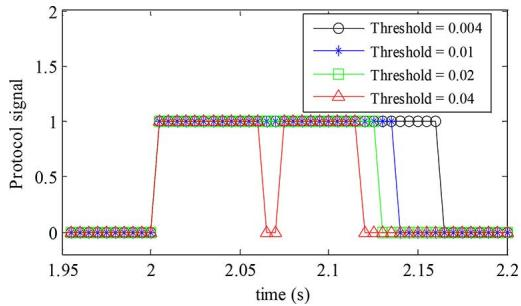  
Fig. 7. Sensitivity of the protocol switching with respect to the threshold.

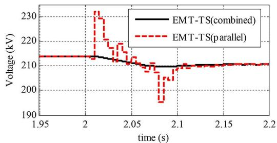  
Fig. 8. The magnitude of the phase A Thévenin voltage source of bus 5.

in the internal system and thereby the protocol switching control scheme promptly switches to a suitable protocol. The sensitivity analysis results shown in Fig. 7 illustrate that the protocol switching scheme is robust with respect to the threshold if the threshold is within the recommended range (i.e., 2%–10% change per each interaction step). The behavior of the parallel protocol under a fault condition is highlighted by large spikes in the Thévenin voltage shown in Fig. 8. The reason is that, with the parallel protocol, the TS program still uses the pre-fault voltage to calculate the Thévenin voltages for the first data exchange right after the fault, which results in erroneous (and much larger) equivalent voltages, and in turn produces a larger current injections in the subsequent steps. Moreover, the comparison results shown in Fig. 9 suggest that the performance of the proposed combined interaction protocol is more robust with respect to the interaction time step, compared to the parallel protocol.

# D. The Three-Phase Thévenin Equivalent

Phase voltages and current injections at bus 5 with hybrid simulation and full-blown EMT simulation are compared and shown in Figs. 10 and 11. A quantitative comparison of the simulation results is provided in Table I. The speed of the AC units connected to the phase C of a feeder is shown in Fig. 12 to illustrate the response of the A/C compressor motor to the SLG fault. From Fig. 10, it can be observed that the voltages obtained by the hybrid simulation deviate from the benchmark for a short period after the fault is cleared. Specifically, three-phase voltages at bus 5 in the PSCAD simulation are distorted by the harmonics generated by the fault clearing and the non-linear response of induction motor loads, while the curves obtained by the hybrid simulation are less distorted. The main reason is that the linear network equivalent is derived based on the fundamental frequency representation of the external system, while

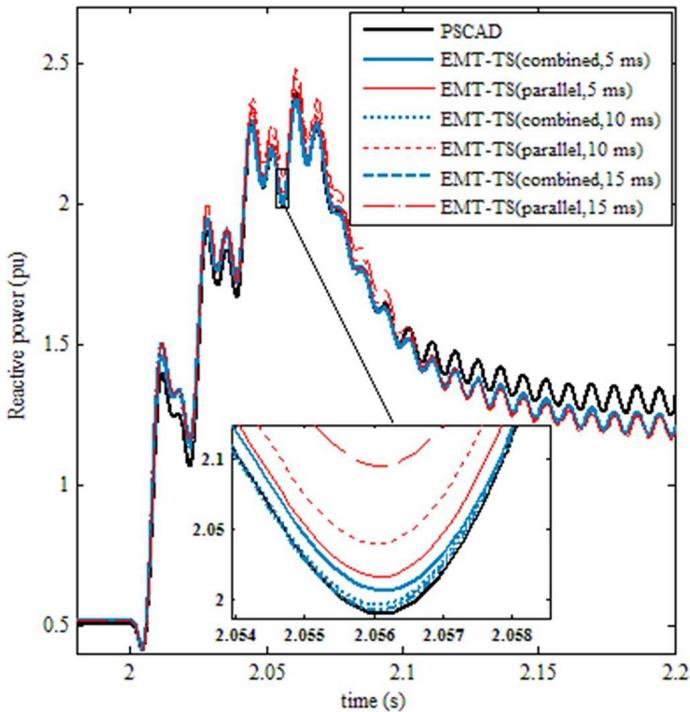  
Fig. 9. The reactive part of the total load of bus 5 with different interaction protocols and interaction time step lengths.

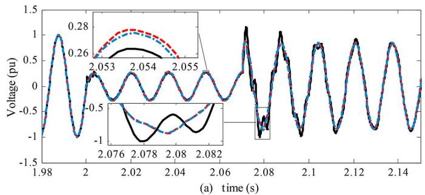

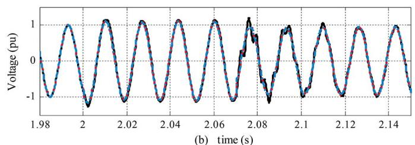

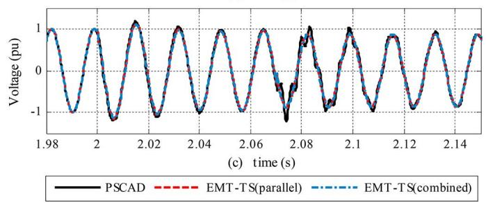  
Fig. 10. Three-phase voltages of bus 5: (a) phase A; (b) phase B; (c) phase C.

the properties of other frequencies of the external system are not adequately modeled.

Despite a severe unbalanced condition at the boundary, the average differences of the simulation results obtained with

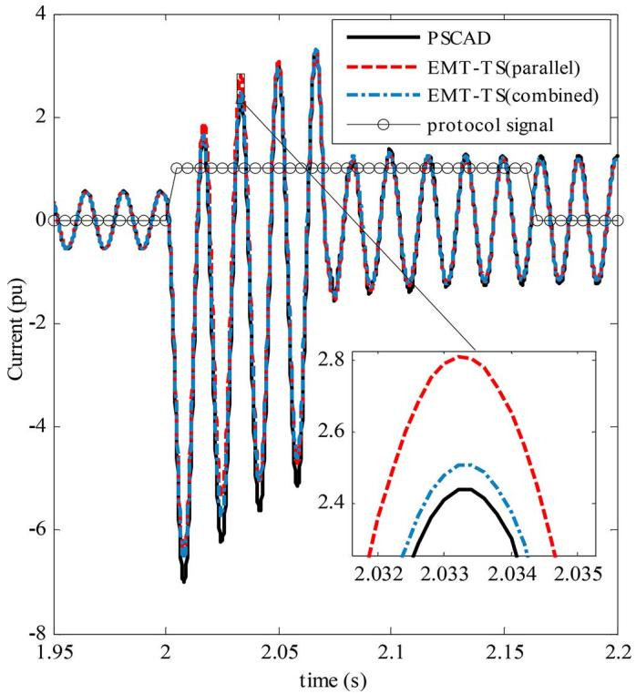  
Fig. 11. The phase A current injection at bus 5 into the external network.

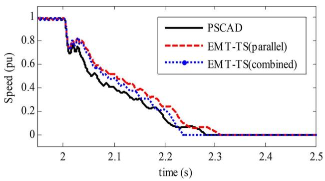  
Fig. 12. Speed of the AC units connected to the phase C of a feeder.

TABLE ISIMULATION RESULT DIFFERENCES OF THE PHASE A VOLTAGEAND CURRENT OF BUS 5 WITH DIFFERENT PROTOCOLS  

<table><tr><td>Interaction protocol</td><td>Davg(Va)/pu</td><td>Davg(Ia)/pu</td><td>Dmax(Va)/pu</td><td>Dmax(Ia)/pu</td></tr><tr><td>parallel</td><td>0.041</td><td>0.068</td><td>0.416</td><td>1.029</td></tr><tr><td>combined</td><td>0.015</td><td>0.050</td><td>0.354</td><td>0.541</td></tr></table>

the proposed hybrid simulation and combined protocol are within 0.05 pu, demonstrating the effectiveness of the proposed network equivalents and the three-sequence TS simulation. In addition, the hybrid simulation results obtained with the combined protocol are consistently closer to that obtained by PSCAD compared to the parallel protocol.

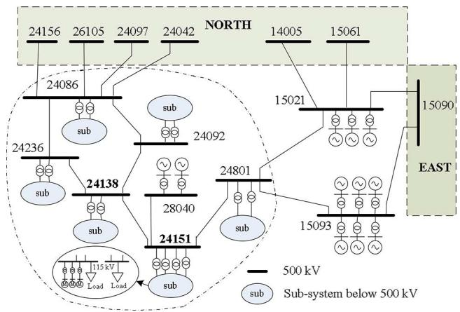  
Fig. 13. One-line diagram of the study region.

TABLE II CASE SUMMARY OF THE WECC SYSTEM   

<table><tr><td>Buses</td><td>Transmission lines</td><td>Generators</td><td>Loads</td></tr><tr><td>15750</td><td>13715</td><td>3074</td><td>7787</td></tr></table>

# IV. APPLICATION TO A DETAILED FIDVR STUDY ON THE WECC SYSTEM

# A. Overview of the WECC System

A summer peak case of the WECC system is used, and its basic information is summarized in Table II. In this study, a region which is known to experience FIDVR events in recent years is chosen for detailed study. A one-line diagram of this region and surrounding area is depicted in Fig. 13. For the sake of simplicity, the details of the sub-systems below 500 kV are not presented in Fig. 13.

# B. Scope of the Internal Network

The buses 24138 and 24151 in Fig. 13 correspond to two 500 kV substations, where a large percentage of the loads are induction motors, and a majority of them are single phase A/C induction motors, particularly, for the bus 24151. Thus both buses are of primary interest in this study. As faults of concern are applied in the internal network, the areas where credible faults could potentially cause stalling of these A/C compressor motors should be included in the internal network. A sensitivity analysis based procedure is proposed to identify the voltage dip at a transmission bus that will result in stalling of A/C motors in the underlying distribution systems. Details of the approach are provided in the Appendix. Based on the derived voltage dip threshold, a bus is included in the internal system if a SLG or three-phase fault at that bus cause a phase-to-neutral voltage at buses 24151 and 24138 to go below 0.75 pu.

SLG and faults at the 500 kV buses in this region are analyzed and the fault voltages at bus 24138 and bus 24151 are recorded and shown in Fig. 14. Based on the short circuit voltages and the threshold of 0.75 pu, the area encircled by the dashed-dot line in Fig. 13. is chosen as the internal network. Bus 26105 is excluded from the detailed system although this bus meets the criterion above, since it is relatively far from the A/C loads served by bus 24151 and including it would significantly

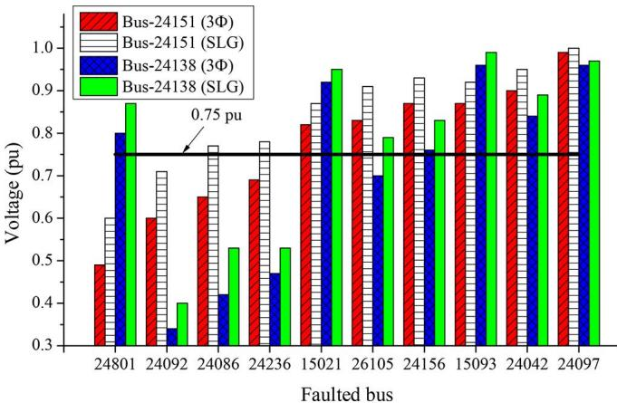  
Fig. 14. The lowest phase voltages at bus 24151 and bus 24138.

TABLE III STATISITICS OF THE INTERNAL NETWORK MODEL INCLUDING SUBTRANSMISSION BUSES NOT SHOWN IN FIG. 13   

<table><tr><td>Total number of buses</td><td colspan="2">238</td></tr><tr><td>Number of buses shown in Fig.13</td><td>500 kV</td><td>7</td></tr><tr><td rowspan="5">Number of buses of different voltage levels 
(not shown in Fig.13)</td><td>230 kV</td><td>37</td></tr><tr><td>161 kV</td><td>3</td></tr><tr><td>115 kV</td><td>68</td></tr><tr><td>92 kV</td><td>18</td></tr><tr><td>&lt;= 66 kV</td><td>105</td></tr><tr><td>Total Load</td><td colspan="2">11.9 GW</td></tr><tr><td>Number of interface buses</td><td colspan="2">8</td></tr></table>

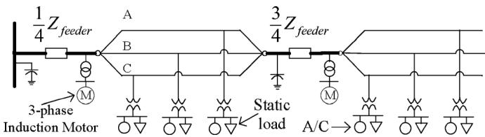  
Fig. 15. A two-section equivalent feeder model.

complicate the interface. A summary of the internal network is provided in Table III.

# C. Distribution Network and Load Modeling

The subtransmission and distribution systems that are supplied from the buses 24151 and 24138 are modeled down to the feeders where the loads are connected to. The distribution feeders are modeled in two sections, i.e., the total load is divided into two portions. Two thirds of the total loads are connected at a quarter of the distance along the line, with the rest one third of the load connected at the end of the feeder [25], as shown in Fig. 15. The parameters of the A/Cs are provided in [7] with the scale specially chosen to match the target percentage of total load. A Wye-connected, 20 horsepower, three-phase induction motor has been used to model three-phase induction motors. The mechanical load torque is proportional to the square of its speed. Under-voltage motor protection is not modeled. The motors are also scaled up to the desired fraction of the total load.

A one-line diagram and data of the substation of bus 24151 are provided in Fig. A3 in the Appendix. Buses 24160 and

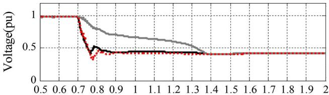

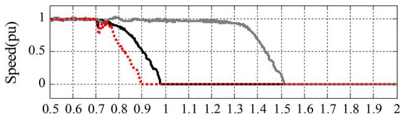  
(a）time(s)  
(b）time(s)

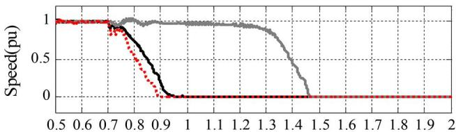  
(c）time(s)   
ig. 16. Response of A/Cs to the SLG fault in Case 1: (a) Terminal voltages f the A/Cs at the 1/4 length point of a feeder; (b) Speeds of the ACs at the 1/4 ngth point of a feeder; (c) Speeds of the ACs at the end of a feeder.

24229 are two 115 kV load-serving buses connected to bus 24151. The parameters and load models for all the equivalent feeders are identical. Thus, the response of A/Cs on one feeder will be used to illustrate the results in the following studies.

# D. Propagation of A/C Stalling Caused by a Normally Cleared Single Line to Ground Fault

In this case, 75% of total load of the buses 24138 and 24151 is assumed to be A/C loads, with the remaining load modeled by constant impedance loads. This case is referred to as Case 1 hereafter. A SLG fault is applied on the phase A of bus 24151 at 0.7 s, and cleared after 4 cycles. As shown in Fig. 16, the speeds of the A/C motors on all three phases drop when the fault is in effect, but recover partially upon clearance of the fault. The phases A and C of the distribution networks are directly affected by the fault, as the 115/12.5 kV transformers are connected in a Delta-grounded Wye manner. It is observed that the terminal voltages of phase A and C recover slightly after the fault is cleared. However, the level to which the voltages recover is lower than 0.6 pu. The speed recovery of A/C motors on both phases is not sustained under such a low voltage condition, and these motors stall within 0.1 s. Subsequently, the terminal voltages of A/Cs on both phases are further depressed to about 0.4 pu.

On phase B, the A/C motor speeds fully recover and sustain for 0.6 s. However, the voltage of phase B is also depressed due to the interaction with phase A and C through the Delta-Wye connected, 115/12.5 kV transformers. Further, reactive power consumption by the A/C motors on phase B increases as the terminal voltages decrease, which, in turn, depresses the voltage

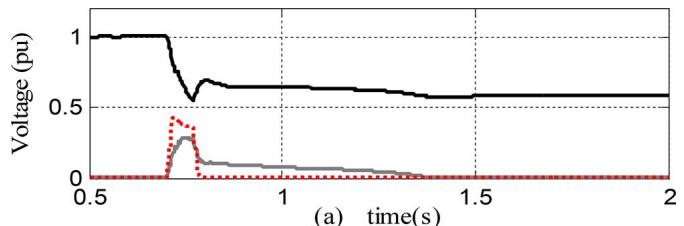

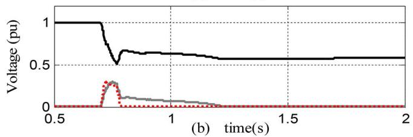

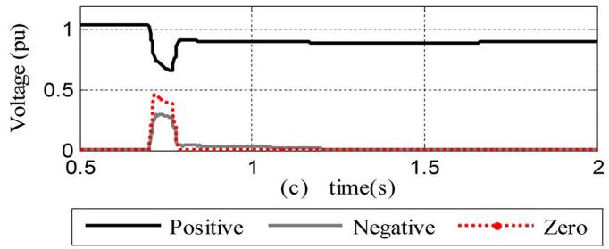  
Fig. 17. Three sequence voltages: (a) 115 kV bus 24160; (b) 115 kV bus 24229; (c) 500 kV bus 24151.

further. These combined effects eventually lead to stalling of A/C motors on phase B after 1.5 s.

It is observed from Fig. 17 that after A/Cs on all three phases are stalled, the positive-sequence voltages of the 115 kV buses 24160 and 24229 are depressed down to 0.6 pu and the positive-sequence voltage of bus 24151 is depressed down to 0.9 pu. During the simulation period, A/C remain in the stalled state, thus the voltages remain depressed. It can be expected that the transmission system bus voltages will only recover after the stalled A/Cs are tripped off by the internal thermal protection. This case demonstrates that a SLG fault close to certain locations with a high penetration of A/C loads can lead to FIDVR events and result in propagation of A/C motor stalling to an unfaulted phase.

The behavior of the proposed combined protocol, with and a two-cycle delay, is shown in Fig. 18. The fault at 0.7 is correctly detected and the protocol is promptly switched to the serial type. After the system slows down, the protocol is switched back to the parallel type at around 0.93 .

It should be noted that the impacts of unsymmetrical faults in the transmission system on the single-phase A/C units depends on the transformer configuration. The previous results show that the Delta/Wye connection of these 115/12.47 kV transformers contributes to A/C stalling propagation to other phases. However, if the SLG fault is comparatively far away from the A/C loads, a Delta/Wye connection can attenuate the impacts of the fault. On the other hand, if the transformers are connected in a Wye grounded/Wye grounded manner, only the A/Cs connected to phase A of the feeders in the distribution systems supplied by bus 24151 stall when the same SLG fault in Case 1 is applied. Thus the impacts of the configuration of these step-down transformers on A/C motor stalling under an unsymmetrical fault

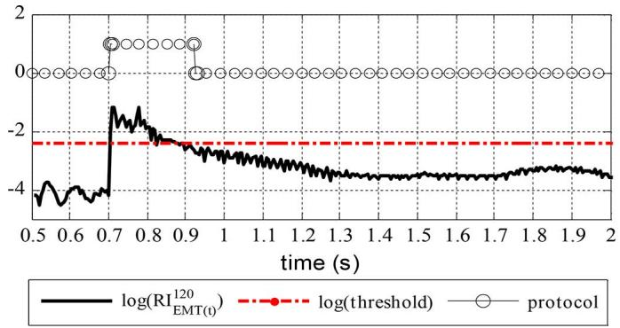  
Fig. 18. The protocol switching behavior in Case 1 (threshold ).

TABLE IV LOAD COMPOSITION DATA OF THE FIVE STUDY CASES   

<table><tr><td>Case #</td><td>Load composition</td></tr><tr><td>1</td><td>75% 1-Φ A/C compressor motor, 25% constant impedance</td></tr><tr><td>2</td><td>75% 1-Φ A/C compressor motor, 10% 3-Φ induction mo-tor, 15% constant impedance</td></tr><tr><td>3</td><td>70% 1-Φ A/C compressor motor, 15% 3-Φ induction mo-tor, 15% constant impedance</td></tr><tr><td>4</td><td>60% 1-Φ A/C compressor motor, 15% 3-Φ induction mo-tor, 25% constant impedance</td></tr><tr><td>5</td><td>50% 1-Φ A/C compressor motor, 25% 3-Φ induction mo-tor, 25% constant impedance</td></tr></table>

condition also depends on the distance of the fault from these transformers.

# E. The Effects of Load Composition on A/C Motor Stalling

In this study, the effects of the load composition on A/C motor stalling and the occurrence of FIDVR events are simulated and analyzed. Five cases in total are examined as summarized in Table IV, with different percentages of single-phase A/C compressor motor, three-phase induction motors and constant impedance loads.

It is observed from Fig. 19 that the SLG fault at bus 24151 eventually causes A/Cs on all three phases in the areas supplied from bus 24151 to stall for all the five study cases. These results indicate that propagation of A/C motor stalling to unfaulted phase is consistent across a substantial range of load compositions and that the impacts of SLG faults close to certain regions of the system with high A/C penetration could be more severe than perceived. Thus, more attention should be paid to unsymmetrical faults for FIDVR related studies.

# F. The Effects of Point-On-Wave (POW) on A/C Stalling

Research in [7] demonstrates that A/C motor stalling is sensitive to the POW at which the fault is applied. How such a characteristic affects A/C motor stalling and the evolution of an FIDVR event with unsymmetrical faults in the transmission system is an important question to be answered.

The Case 5 discussed before is used and the SLG fault is applied at $t = 0 . 7 0$ s with degree. A comparison case with POW of 45 degrees (the corresponding fault time s with the fundamental frequency as 60 Hz), referred to as Case 5A hereafter, is considered for this study. The fault is

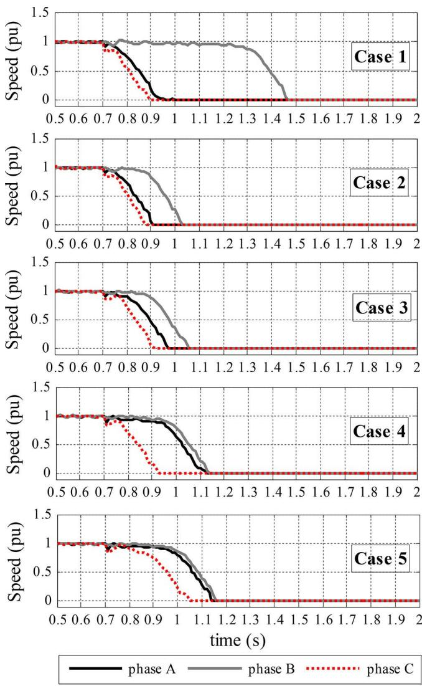  
Fig. 19. The speeds of A/Cs for the five study cases.

cleared after 4 cycles in both cases. Simulation results for both cases are compared and shown in Fig. 20.

For Case 5A, the response of A/Cs before and after 1.0 s are quite different: For the period before 1.0 s, the A/C motors supplied from bus 24160 successfully recover to normal speed after the fault is cleared and their terminal voltages recover back to 0.70 pu, which is above the A/C motor stalling voltage threshold [6]. Starting from 1.0 s, these A/C motors begin to stall, as the voltages of bus 24151 and 24160 are depressed by the stalling of A/Cs within the substation of bus 24229, as shown in Fig. 20(c1)-(e1). Eventually, all A/Cs supplied from bus 24160 stall after 1.5 s. Thus, the Case 5A can be regarded as an example of A/C stalling propagating from one substation to its neighbors. By contrast, in Case 5, the A/C terminal voltages do not recover to values above the stalling threshold and A/Cs begin to stall immediately after the fault is cleared, as shown by plots on the right-hand side in Fig. 20. It can be seen that the POW characteristic has a large impact on the dynamic response of the A/C motors. Therefore, it is recommended that, for detailed FIDVR studies, the POW characteristic should be considered in order to obtain a better understanding of potential outcomes as the POW of an actual fault is random.

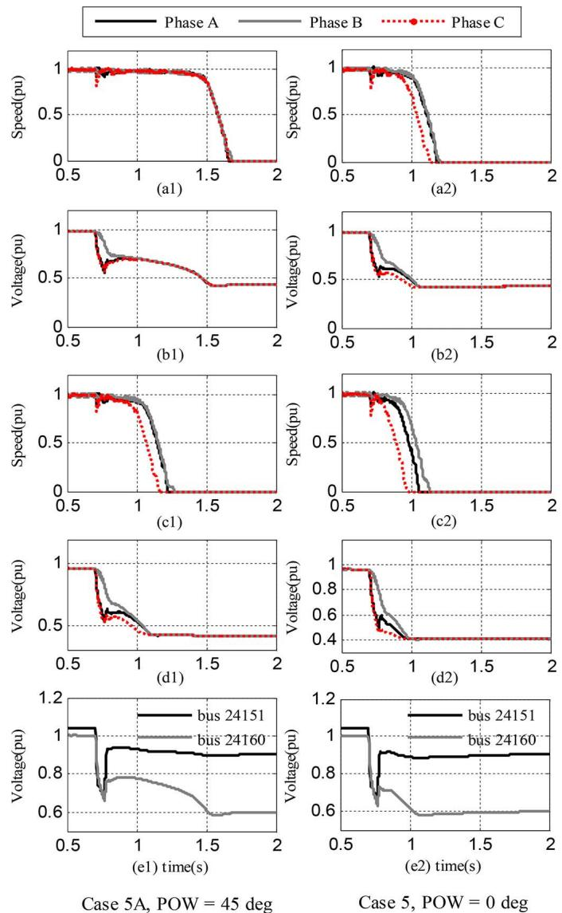  
Fig. 20. (left) Case 5A and (right) Case 5. The plots with index (a) and (b) correspond to the speeds and terminal voltages of the A/Cs, respectively, connected at 1/4 length distance along a feeder served by bus 24160. The plots with index (c) and (d) correspond to the speeds and terminal voltages of the A/Cs, respectively, connected at 1/4 length distance along a feeder served by bus 24229. The plots with index (e) are bus positive sequence voltages.

# G. Computation Times

The experiment hybrid simulation platform set up in the laboratory consists of a desktop computer (processor: 4-core, 3.4 GHz, Intel Core i7-3770) and a laptop (processor: 2-core, 2.26 GHz, Intel Core P8400). Both are on the same LAN environment, connected via a wireless network with a speed of 250 Mb/s. PSCAD is installed and run on the desktop, while the developed three-sequence TS program is run on the laptop.

For a 3-second simulation of Case 1, the computation times of different simulation approaches and interaction protocols are summarized in Table V. The multi-core parallel computing capability of PSCAD (available in version 4.6) has been utilized in all the simulation methods. EMT-TS hybrid simulation results are reported in the first three rows. In the simulation done in the last row, the internal network is represented in detail but the external network is represented in a greatly simplified manned

TABLE V PERFORMANCES OF THE HYBRID SIMULATION WITH DIFFERENT PROTOCOLS   

<table><tr><td>Simulation method</td><td>Computation time /s</td></tr><tr><td>EMT-TS (parallel)</td><td>371</td></tr><tr><td>EMT-TS (combined)</td><td>387</td></tr><tr><td>EMT-TS (serial)</td><td>692</td></tr><tr><td>EMT (internal network + fixed external network equivalent)</td><td>264</td></tr></table>

using a fixed Thévenin equivalent at the boundary buses. Correspondingly, the whole test case is simulated with PSCAD. Due to the large scale of the external network and utilization of multi-core parallel computing capability of PSCAD, the computational times used by the EMT and TS parts are comparable for this test case. In this context, compared to the serial protocol, the combined protocol reduces the computation time by 44%. The time difference between the combined and the serial protocols mainly corresponds to the time consumed by the TS part simulation and data exchange via the socket communication. Additionally, the computation time with the combined protocol is only marginally increased in comparison to that with the parallel protocol. Lastly, even compared with the pure EMT simulation of the internal network, the computation time with the proposed hybrid simulation and the combined protocol is only moderately increased, however, more accurate simulation results of internal network and the dynamic response of the external network can be achieved using the hybrid simulation approach.

It should be noted that the advantage of the combined protocol over the serial protocol would become less significant in cases where either the EMT or TS part of the hybrid simulation dominates the simulation in terms of computation time.

# V. CONCLUSION

In this paper, the EMT-TS hybrid simulation approach is adopted for detailed FIDVR studies. First, a new EMT-TS hybrid simulation platform for large scale power systems is developed by integrating the PSCAD/EMTDC and InterPSS. The developed platform has the following salient features:

1) The combination of decoupled architecture and socketbased communication facilitates both simulators to be run on either one computer or several computers to achieve more flexibility and a better performance.   
2) The proposed combined interaction protocol with auto-switching feature improves the hybrid simulation efficiency while a good accuracy is guaranteed.   
3) The combination of the proposed three-phase Thévenin equivalent and three-sequence TS simulation algorithm enables simulating unbalanced faults within the internal network while eliminating the requirement of three-phase balance at the boundary. Thus, it helps minimize the scope of the internal network model for simulations under unbalanced conditions.

Second, the proposed approach is applied to a detailed FIDVR study on a large WECC system. The study shows that the hybrid simulation method can provide specific details of the response of A/Cs on each phase to an unsymmetrical fault in transmission system and the evolution of the resulting FIDVR

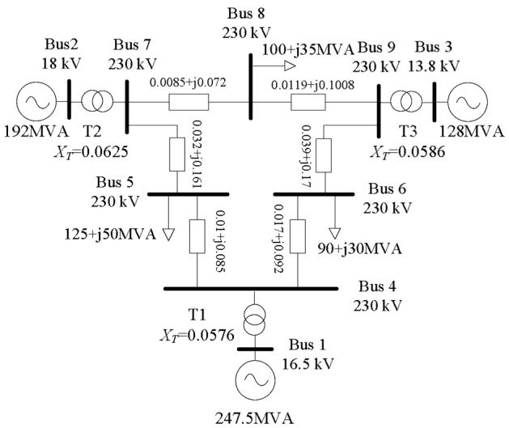  
Fig. A1. A one-line diagram of the IEEE 9-bus system.

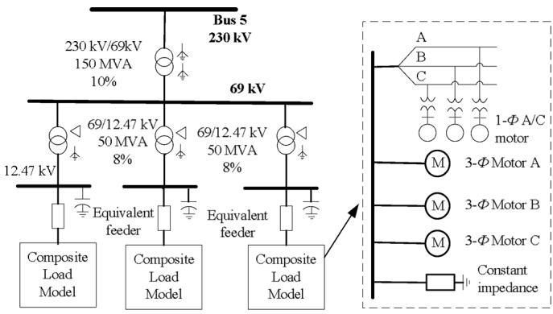  
Fig. A2. Detailed modeling of bus 5 including distribution system and detailed composite load models.

event. The results reveal that a normally cleared, SLG fault at a 500 kV bus close to the A/C loads can lead to an FIDVR event. The event begins with A/Cs stalling on two directly-impacted phases, followed by A/C stalling propagating to the unfaulted phase. Further, similar behaviors are observed in study cases with quite different load compositions. The POW effects on the A/C stalling are also analyzed. The results indicate that the POW when the fault occurs could have a significant impact on the response of the A/Cs.

Lastly, the study shows that the combined protocol reduces the computation time by 44%, compared to the serial protocol when tested on the WECC test case, while the computation times of the combined and parallel protocols are very close.

# APPENDIX

# A. Detailed Modeling of Bus 5 in the IEEE 9-Bus System

Fig. A.1 shows a one-line diagram of the IEEE 9-bus system.

The schematic diagram of the bus 5 substation is provided in Fig. A2. The impedance of the equivalent feeder is pu on a 50 MVA base. Composition of the detailed load model is provided in Table A.I. The typical data for the squirrel cage induction machine provided by PSCAD rated at 20 hp, 1000 hp and 500 hp are used for the three-phase (3- )

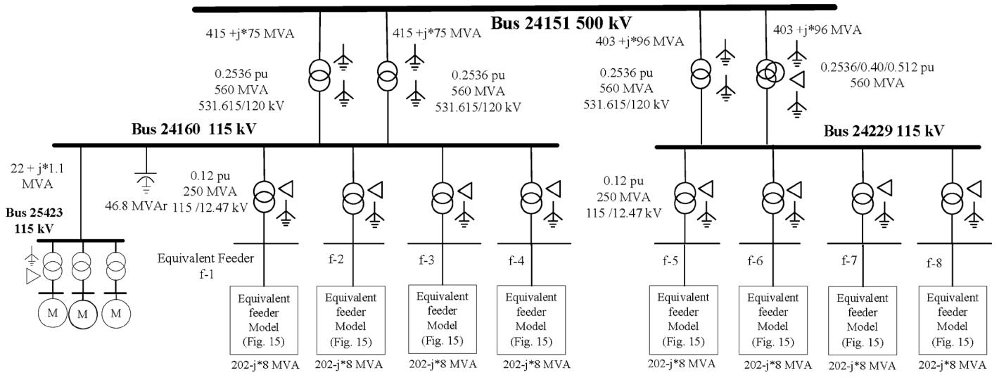  
Fig. A3. Schematic diagram of the 500 kV substation of bus 24151.

TABLE A.I COMPOSITION OF THE DETAILED LOAD MODEL   

<table><tr><td>Load component</td><td>Steady state load (MW/MVAr)</td></tr><tr><td>1-Φ A/C motor, number = 1480/phase</td><td>7.0 + j2.5 MVA / phase</td></tr><tr><td>3-Φ, constant torque motor (A), number = 275</td><td>4.1 + j2.0 MVA</td></tr><tr><td>3-Φ, variable torque and large inertia motor (B), number = 1</td><td>0.7 + j0.3 MVA</td></tr><tr><td>3-Φ, variable torque and low inertia motor (C), number = 1</td><td>0.4 + j0.2 MVA</td></tr><tr><td>Static load</td><td>14.1 + j4.2 MVA</td></tr></table>

induction motors, respectively. The modeling details and data for the single phase A/C motor are provided in [7]. The number of motors represented by each motor model is scaled to meet the target load. For example, there are 1480 A/C units represented by one 1- A/C motor model.

# B. Detailed Modeling of the Area Supplied by the 500 kV Substation of Bus 24151

Fig. A3 shows the schematic diagram of the 500 kV substation of bus 24151.

# C. Determination of A/C Stalling Voltage Magnitude Threshold at a Transmission Bus

To develop a guide to determine what transmission bus voltage dip will cause A/C motors in the underlying systems to stall, a simple model shown in Fig. A4 is considered. The total load is MVA. The 115/12.47 kV transformer reactance and the equivalent feeder impedance are based on 30 MVA. A wide range of impedances between the source and end-use point, different A/C loading percentages, and typical A/C power levels are considered. Voltage dips of different magnitudes, lasting 4 cycles were applied at bus 1 and those that caused A/C motors to stall were recorded. It is observed from Fig. A5 that the smallest voltage dip magnitude causing A/C stall is larger than 0.25 pu. Thus, 0.75 pu can be adopted as the A/C stalling voltage threshold at a transmission bus.

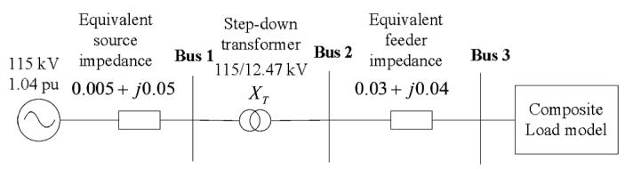  
Fig. A4. One-line diagram of the test system.

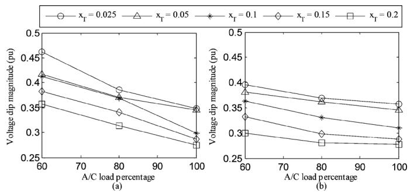  
Fig. A5. Voltage dip magnitude w.r.t. the A/C load percentage and the transformer impedance: (a) A/C kW (b) A/C kW.

# ACKNOWLEDGMENT

The authors gratefully acknowledge Dr. John Undrill for several inspiring discussions and his insightful comments. Also they would like to thank Dr. Mike Zhou of the InterPSS project (http://www.interpss.org) for his support in extending the InterPSS core engine to develop the three-sequence transient stability simulation program.

# REFERENCES

[1] M. D. Heffernan, K. S. Turner, J. Arrillaga, and C. P. Arnold, “Computation of A.C.-D.C. system disturbances—Part I, II and III,” IEEE Trans. Power App. Syst., vol. PAS-100, pp. 4341–4348, 1981.   
[2] G. D. Irwin, C. Amarasinghe, N. Kroeker, and D. Woodford, “Parallel processing and hybrid simulation for HVDC/VSC PSCAD studies,” in Proc. 10th IET Int. Conf. AC and DC Power Transmission, 2012, pp. 1–6.

[3] NERC Transmission Issues Subcommittee and System Protection and Control Subcommittee, “A technical reference paper fault-induced delayed voltage recovery,” 2009.   
[4] B. R. Williams, W. R. Schmus, and D. C. Dawson, “Transmission voltage recovery delayed by stalled air conditioner compressors,” IEEE Trans. Power Syst., vol. 7, no. 3, pp. 1173–1181, Aug. 1992.   
[5] D. N. Kosterev and A. Meklin, “Load modeling in WECC,” in Proc. 2006 Power Systems Conf. Expo., pp. 576–581.   
[6] D. N. Kosterev et al., “Load modeling in power system studies: WECC progress update,” in Proc. IEEE Power and Energy Soc. General Meeting, 2008, pp. 1–8.   
[7] Y. Liu, V. Vittal, J. Undrill, and J. H. Eto, “Transient model of airconditioner compressor single phase induction motor,” IEEE Trans. Power Syst., vol. 28, no. 4, pp. 4528–4536, Nov. 2013.   
[8] G. W. J. Anderson, N. R. Watson, C. P. Arnold, and J. Arrillaga, “A new hybrid algorithm for analysis of HVDC and FACTS systems,” in Proc. Int. Conf. Energy Management and Power Delivery, 1995, vol. 2, pp. 462–467.   
[9] H. Su, K. Chan, L. A. Snider, and T. Chung, “A parallel implementation of electromagnetic electromechanical hybrid simulation protocol,” in Proc. 2004 IEEE Int. Conf. Electric Utility Deregulation, Restructuring and Power Technologies, 2004, vol. 1, pp. 151–155.   
[10] F. Tian, C. Yue, Z. Wu, and X. Zhou, “Realization of electromechanical transient and electromagnetic transient real time hybrid simulation in power system,” in Proc. IEEE Power Eng. Soc. Transmission and Distribution Conf. Exhibit.: Asia and Pacific, 2005.   
[11] V. Jalili-Marandi, V. Dinavahi, K. Strunz, J. A. Martinez, and A. Ramirez, “Interfacing techniques for transient stability and electromagnetic transient programs,” IEEE Trans. Power Del., vol. 24, no. 4, pp. 2385–2395, Oct. 2009.   
[12] W. Liu, J. Hou, Y. Tang, L. Wan, X. Song, and S. Fan, “An electromechanical/electromagnetic transient hybrid simulation method that considers asymmetric faults in an electromechanical network,” in Proc. 2011 IEEE/PES Power Systems Conf. Expo., 2011, pp. 1–7.   
[13] Y. Zhang, W. Wang, B. Zhang, and A. M. Gole, “A decoupled interface method for electromagnetic and electromechanical simulation,” in Proc. 2011 IEEE Electrical Power and Energy Conf., 2011, pp. 187–191.   
[14] X. Wang, P. Wilson, and D. Woodford, “Interfacing transient stability program to EMTDC program,” in Proc. 2002 Int. Conf. Power System Technology, vol. 2, pp. 1264–1269.   
[15] Y. Zhang, A. M. Gole, W. Wu, B. Zhang, and H. Sun, “Development and analysis of applicability of a hybrid transient simulation platform combining TSA and EMT elements,” IEEE Trans. Power Syst., vol. 28, no. 1, pp. 357–366, Feb. 2013.   
[16] A. M. Stankovic and T. Aydin, “Analysis of asymmetrical faults in power systems using dynamic phasors,” IEEE Trans. Power Syst., vol. 15, no. 3, pp. 1062–1068, Aug. 2000.

[17] F. Gao and K. Strunz, “Frequency-adaptive power system modeling for multiscale simulation of transients,” IEEE Trans. Power Syst., vol. 24, no. 2, pp. 561–571, May 2009.   
[18] M. Sultan, J. Reeve, and R. Adapa, “Combined transient and dynamic analysis of HVDC and FACTS systems,” IEEE Trans. Power Del., vol. 13, no. 4, pp. 1271–1277, Oct. 1998.   
[19] F. Plumier, P. Aristidou, C. Geuzaine, and T. Van Cutsem, “A relaxation scheme to combine phasor-mode and electromagnetic transients simulations,” in Proc. Power Systems Computation Conf. (PSCC), Wroclaw, Poland, Aug. 18–22, 2014.   
[20] A. A. van der Meer, M. Gibescu, M. A. M. M. van der Meijden, W. L. Kling, and J. A. Ferreira, “Advanced hybrid transient stability and EMT simulation for VSC-HVDC systems,” IEEE Trans. Power Del., vol. 30, no. 3, pp. 1057–1066, Jun. 2015.   
[21] Manitoba HVDC Research Centre, PSCAD/EMTDC [Online]. Available: https://hvdc.ca/pscad/   
[22] M. Zhou and S. Zhang, “Internet, open-source and power system simulation,” in Proc. IEEE PES General Meeting, 2007, pp. 1–5.   
[23] FREEDM Distributed Grid Intelligence (DGI) Project [Online]. Available: https://github.com/FREEDM-DGI/FREEDM   
[24] P. M. Anderson and A. A. Fouad, Power System Control and Stability, 2nd ed. New York, NY, USA: Wiley-IEEE Press, 2002.   
[25] W. H. Kersting, Distribution System Modeling and Analysis, 2nd ed. Boca Raton, FL, USA: CRC Press, 2006, pp. 52–54.

Qiuhua Huang (S'14) received the B.E. and M.S. degree in electrical engineering from the South China University of Technology, Guangzhou, China, in 2009 and 2012, respectively. He is currently pursuing the Ph.D. degree in electrical engineering in Arizona State University, Tempe, AZ, USA.

His research interests include power system modeling, power system transient simulation and power system stability.

Vijay Vittal (S'78-F'97) received the B.E. degree in electrical engineering from the B.M.S. College of Engineering, Bangalore, India, in 1977, the M.Tech. degree from the Indian Institute of Technology, Kanpur, India, in 1979, and the Ph.D. degree from Iowa State University, Ames, IA, USA, in 1982.

He is the Ira A. Fulton Chair Professor in the Department of Electrical, Computer and Energy Engineering at Arizona State University, Tempe, AZ, USA. He currently is the Director of the Power System Engineering Research Center (PSERC) Headquartered at Arizona State University.

Dr. Vittal is a member of the National Academy of Engineering.