# 基于全阶模型的直驱风电机组多时间尺度等效惯量机理建模

姜继恒 1 ，鲁宗相 1 ，乔 颖 1 ，李佳明 1 ，程 艳 2 ，关逸飞 2 ，汪 挺 3

（1. 电力系统及发电设备控制和仿真国家重点实验室（清华大学），北京市 100084；

2. 国网山东省电力公司电力科学研究院，山东省济南市 250003；3. 国网山东省电力公司，山东省济南市 250000）

摘要：构建风电机组的等效惯量模型是开展风电场暂态支撑定量分析与优化控制工作的关键基础，在转动惯量降低、频率特性劣化的高比例可再生能源电网场景下尤其关键。然而，现有模型研究往往结合分析目标侧重若干环节而未能建立全环节的完整模型，也未能揭示不同时间尺度降阶模型与计算精度的关系。首先，以直驱风电机组为对象，在对比风电等效惯量与同步机惯量在机理和实现方式等方面差异的基础上，分析了机械、控制、电气等环节对风电等效惯量的动态影响，建立了风电机组的频率响应全阶模型。然后，基于奇异摄动理论推导了考虑不同时间尺度动态的等效惯量降阶模型，应用瓦西里耶娃理论推导了误差与模型时间尺度之间的关系。最后，采用电磁暂态仿真算例验证了全阶机理模型的有效性及不同降阶模型的精度水平。

关键词：风电机组；等效惯量；多时间尺度；奇异摄动；降阶模型；瓦西里耶娃理论

# 0 引 言

风、光电源等基于逆变器的资源（inverter-basedresource,IBR）大规模并网，极大改变了系统惯量、频率特性，出现了新型逆变器驱动的系统稳定问题［1］ 。另外，新能源电源对火电机组的替代效应使得系统调节资源减少，亟需新能源机组提供暂态支撑能力。中国最新风电并网标准中明确要求，以永磁直驱风电机组为代表的新能源电源应具备惯量响应和调频功能［2］ 。因此，模拟惯量资源将与同步发电机、同步调相机、异步电机等旋转惯量资源共同为系统提供“广义惯量”支撑［3］ 。构建新能源等效惯量模型成为开展其支撑特性定量分析与优化控制工作的关键基础。风电机组的等效惯量是其在系统频率变化趋势激励下对冲有功不平衡能力的量度，由设备气动、机械、电气、测控等多环节控制策略共同作用，且不同时间尺度下的动态特性迥异，如何综合全环节进行等效惯量建模并按不同时间尺度标准实现模型简化，是极具挑战的难题。

目前，新能源电源等效惯量建模已开展大量研究。研究聚焦于机械环节、有功指令环等慢时间尺

度环节，构建了低阶频率响应、惯量模型［4-5］ ，可用于风电极限功率求解［6］、机组有功环策略设计［7］和系统秒级以上的频率分析［8］ 。纳入电气、控制环节模型［9-11］后，变流器等效内电势矢量建模也被用于双馈风电机组在有功外环［12］、直流电压［13］、交流电流［14］等时间尺度上的等效惯量分析。但这些研究未计入锁相环（phase lock loop，PLL）的影响，也未考虑附加频率控制、机械动态等环节的影响，对惯量特性分析不完整。文献［15］结合内电势运动方程和附加功率控制环建立了双馈风电机组的低阶频率响应函数，但仍然忽略了PLL、电压控制环、桨距角动态，模型精度有待提高。当进行PLL主导的同步稳定分析时，可在忽略机械等环节动态的条件下得到变流器的惯量表征［16］ ，但仍然是针对特定场景的简化等效模型。可以看出，已有研究均无法给出考虑全环节的统一建模方法，在未严格论证环节、变量选择合理性的前提下直接构建简化模型，缺乏理论基础和精度保障。

IBR多时间尺度特性建模也是研究热点，主流的思路是基于奇异摄动理论进行风电、储能模型降阶［17］，并将模型用于仿真计算［18］、控制优化［19］和稳定性分析［20］。但新能源电源等效惯量的多时间尺度建模是个新问题，相关工作开展甚少。上述新能源电源惯量建模研究［10-16］大多涉及降阶简化，但降阶过程中均未给出严谨的时间尺度选择和变量简化判据，导致结果误差较大。

此外，也有研究基于实测数据辨识进行等效惯量评估［21］ 。该方法可在参数未知时求解风电惯量，较机理分析方法更适合在线快速计算，但数据辨识法面临电网扰动事件难以获取、二阶模型强假设的适用性差、低信噪比条件下计算误差大［3］等问题。而惯量机理分析方法的结果可解释性强，可从理论上揭示新能源惯量的动力学机理，且能够为数据辨识方法提供模型结构等必要信息。本文所提基于降阶的惯量建模方法可在机组特性研究阶段应用于各类扰动工况分析。

本文构建了面向电网频率分析的新能源等效惯量机理模型。首先，以直驱风电机组为对象，对机械、电气、测量、控制多环节动态完整建模，以机端频率-输出电磁功率为输入-输出量，构建开环全阶惯量机理模型。然后，通过模态分析将惯量作用路径中的状态量分为慢、混合动态、较快、快和超快 5个时间尺度，基于奇异摄动法推导不同时间尺度下的等效惯量降阶形式，并应用瓦西里耶娃定理推导了误差与模型时间尺度之间的关系。最后，基于电磁暂 态（electromagnetic transient，EMT）仿 真 算 例 验证了全阶机理模型的有效性及不同降阶模型的精度水平。

# 1 直驱风电机组等效惯量特性分析

# 1. 1　等效惯量的概念及数学表征

惯量常用于描述系统有功功率-频率动态特性，表征系统在有功功率不平衡时维持频率不变/抵抗频率变化的能力。不同惯量资源的特性和模型不同。同步机的惯量响应功率等于转子动能释放功率，若忽略调速器和汽轮机的滞后效应，其频率响应模型可表示如下：

$$
\left\{ \begin{array}{l} \frac {\mathrm {d} \Delta f _ {\mathrm {C O I}} (t)}{\mathrm {d} t} = \frac {\Delta P (t)}{2 H _ {\mathrm {s g}}} \\ \Delta P (t) = - \left[ \Delta P _ {\mathrm {L}} + \left(K _ {\mathrm {s g}} + D _ {\mathrm {s g}} + D _ {\mathrm {L}}\right) \left(f _ {\mathrm {C O I}} - f _ {\mathrm {C O I}, 0}\right) \right] \end{array} \right. \tag {1}
$$

式中：“ $" \Delta '$ ”表示变量的增量 $; f _ { \mathrm { C O I } }$ 为系统频率； $P \left( \ t \right)$ 为系统有功功率； $H _ { \mathrm { s g } }$ 为系统等效惯量时间常数； ${ \bf \nabla } ; P _ { \mathrm { ~ L ~ } }$ 为系统负荷； $K _ { \mathrm { s g } }$ 为调速器下垂系数； $D _ { \mathrm { s g } }$ 为同步机阻尼系数； $\mathbf { \nabla } _ { : } D _ { 1 }$ 为负荷阻尼系数 $; f _ { \mathrm { C O I , 0 } }$ 为频率初始值。

对于依赖PLL同步的跟网型直驱风电机组，其等效惯量可描述为单位频率变化率对应的惯量响应功率。线性化条件下，可用惯量响应功率与机端频率的频域关系表征，如式（2）所示。

$$
\Delta P _ {\mathrm {H}} (s) = - M _ {\mathrm {e q}} (s) s \Delta f (s) \tag {2}
$$

式中： $P _ { \mathrm { \scriptscriptstyle H } } ( s )$ 为惯量响应功率 $\operatorname { \mathrm { ; } } f ( s )$ 为系统频率 $\mathbf { ; } S$ 为

拉普拉斯算子； $M _ { \mathrm { e q } } \left( s \right)$ 为惯量的频域表征式，简称等效惯量模型，即本文的建模结果。

式（2）反映了惯量响应功率与机端频率的动力学关系，由附加有功控制等环节决定。风电进行惯量响应的能量来源包括转动部件动能、降载备用能量和直流电容能量等形式。其中，主轴动能是惯量响应能量的主体，降载备用能量由惯量响应阶段的快速变桨提供。本文建模过程包括快速变桨控制，直流电容能量一般可在工程计算中予以忽略。综上可知，风电等效惯量与同步机转动惯量的主要差异为：同步机的惯量可以直接表征额定状态下的转动动能，而风电的等效惯量仅表征动力学关系，无法反映机组的存储能量水平，风电的惯量响应功率与主轴等储能元件的能量变化率并不严格相等。考虑到系统频率动态与风电惯量响应功率的动态强相关，本文从动力学关系角度构建风电等效惯量模型。

为了简化分析，本文定义风电机组的频率响应总功率由惯量响应功率与恒定参数下垂环节支撑功率两部分组成。下垂环节不引入新的阶次，也可理解为风电机组对频率的阻尼作用。在风速恒定的假设下， $\Delta P _ { \mathrm { H } }$ 如式（3）所示。

$$
\Delta P _ {\mathrm {H}} = \Delta P _ {\mathrm {f r}} + K _ {\mathrm {e q}} \Delta f \tag {3}
$$

式中： $P _ { \mathrm { f r } }$ 为风电机组频率响应功率； $K _ { \mathrm { e q } }$ 为风电机组下垂系数，该值可在采用频率阶跃信号的机组快频响应测试中，通过计算机端有功增量稳定值和频差的比值获得。

式（2）中的 $M _ { \mathrm { e q } } \left( s \right)$ 描述了频率-有功功率因果系统的频域等效惯量。由卷积定理和冲激函数的性质可知，在零状态下，当机端频率为单位阶跃函数时，设备在各时刻的等效惯量水平的数值等于该时刻惯量响应功率的数值。基于该特性可进行风电机组等效惯量水平的工程化测量。在风电机组/场的快速频率响应性能测试中，当机端注入模拟的阶跃频率信号时，采集机端增发有功功率，按照式（3）计算机端惯量响应功率，完成等效惯量测量。

此外，构网型风电机组的等效惯量与同步机的有功功率-频率因果系统类似，对其进行惯量机理分析时也可按照本文的相关环节分析、物理建模、简化降阶、误差分析等步骤进行。

# 1. 2　风电机组等效惯量的相关环节分析

当同步机的原动机、发电机轴系采用单体模型时，同步机惯性矩仅由轴系质量和分布决定，其惯量是时不变定常参数。因此，惯量环节对转子电气角速度的动态具有机电时间尺度的单一模态影响，系统频率动态的时间常数T如式（4）所示。

$$
T = \frac {2 H _ {\mathrm {s g}}}{K _ {\mathrm {s g}} + D _ {\mathrm {s g}} + D _ {\mathrm {L}}} \tag {4}
$$

风电机组的等效惯量 $M _ { \mathrm { e q } } \left( s \right)$ 包含了控制、机械、电气等多时间尺度环节的特性，在“机端频率信

号-机端功率”的传递路径中，PLL、频率滤波、变流器控制、永磁同步电机、风轮桨叶等部分的动态特性均对其产生影响，如图1所示。

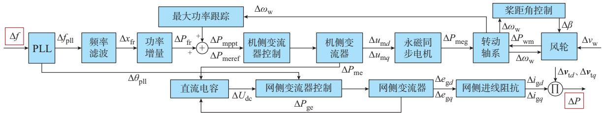  
图1 风电机组频率-有功功率回路结构示意图  
Fig. 1 Schematic diagram of frequency-active power loop structure for wind turbines

当系统出现阶跃型有功功率不平衡量时，各节点的频率过程包含多个模态的分量［22］ ，系统频率安全分析主要考虑其主模态分量（或惯性中心频率）的变化过程，传统的系统频率响应模型依然有效。频率主模态分量的时间尺度可用式（4）来近似衡量，式中的惯量、调频、阻尼系数为按照容量的加权值。下文分析中将证明风电机组大部分环节与主模态频率分量的时间尺度差异较大，可以通过降阶的方式进行模型简化。

# 2 直驱风电机组频率响应全阶建模

本文选择主流直驱风电机组进行全阶建模，推

导风电参与系统频率响应的动态模型，其基本结构、控制方式以及模型物理量正方向如图 2所示，相关控制方式、结构类型见附录A表A1。

图 2中网侧变流器的内环、外环控制部分的变量说明见附录 B。对风电机组各环节构建局部线性化模型，基于环节间的连接关系给出整机全阶模型，得到描述网侧频率-输出有功功率的传递函数。如无特殊说明，本文的电气量均在机组网侧锁相的 dq轴坐标系和标幺值系统下表示，下标“0”表示变量的初值，模型中的动态方程均以频域形式表示。

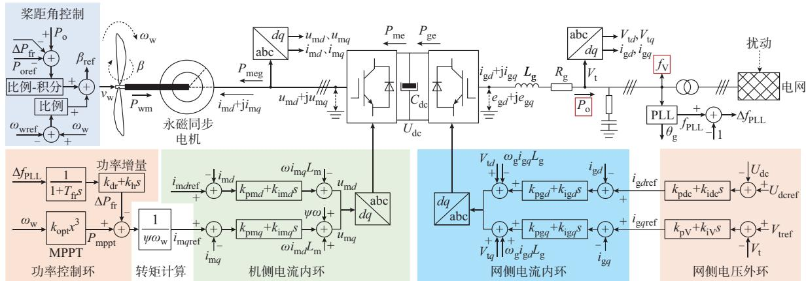  
图2 直驱风电机组结构示意图  
Fig. 2 Schematic diagram of structure of direct-drive wind turbines

由于是机理性建模，本文方法可适用于基于锁相同步的各类直驱、半直驱和双馈风电机组，应用时只需在物理建模时选择并网点频率-有功功率回路的环节，对不同环节修正动态模型即可，模型简化可直接使用本文方法。

# 2. 1 PLL 动态模型

忽略机端电压幅值变化，PLL的局部线性化模型如式（5）所示，具体推导过程见附录B。

$$
\left\{ \begin{array}{l} s \Delta x _ {\mathrm {p l l}} = k _ {\mathrm {i p}} \left(V _ {\mathrm {t 0}} \Delta f _ {\mathrm {V}} - V _ {\mathrm {t 0}} \Delta f _ {\mathrm {p l l}}\right) \\ s \Delta f _ {\mathrm {p l l}} = k _ {\mathrm {p p}} \left(V _ {\mathrm {t 0}} \Delta f _ {\mathrm {V}} - V _ {\mathrm {t 0}} \Delta f _ {\mathrm {p l l}}\right) + \Delta x _ {\mathrm {p l l}} \end{array} \right. \tag {5}
$$

式中： $: \mathcal { X } _ { \mathrm { p l l } }$ 为PLL中间积分量 $; f _ { \mathrm { V } }$ 为并网点频率，是本文全阶建模的输入量 $; f _ { \mathrm { p l l } }$ 为锁相频率，与锁相坐标系的电气角速度数值相等； $\ d _ { \mathrm { : } } k _ { \mathrm { p p } }$ 和 $k _ { \mathrm { i p } }$ 分别为PLL的比例、积分系数； $V _ { \mathrm { ~ t ~ } }$ 为机端电压幅值。

暂态过程中，风电机组并网点瞬时频率与同步机内电势频率、风电 锁相频率均不相等，本文

参考文献［23］的方法，利用式（6）计算风电并网点瞬时频率 $f _ { \mathrm { V } }$ 。

$$
f _ {\mathrm {V}} = \frac {1}{2 \pi} \left(\frac {\mathrm {d}}{\mathrm {d} t} \arctan \left(\frac {v _ {\mathrm {t q}}}{v _ {\mathrm {t d}}}\right) + \omega_ {\mathrm {g N}} \omega_ {\mathrm {p l l}}\right) \tag {6}
$$

式中 $\bullet \mathcal { V } _ { \mathrm { t } d } \setminus \mathcal { V } _ { \mathrm { t } q }$ 分别为机端电压在锁相坐标下的 $d , q$ 轴分量 $\div \omega _ { \mathrm { p l l } }$ 为锁相坐标系的电气角速度； $; \omega _ { \mathrm { g N } }$ 为系统额定电气角速度有名值。

# 2. 2　机械环节动态模型

机械环节主要由风轮叶片与发电机组成的轴系构成，单质量块模型下的轴系动态、桨距角控制动态、气动功率模型分别如式（7）—式（9）所示，限于篇幅，此处直接给出小信号模型。

$$
s \Delta \omega_ {\mathrm {w}} = \frac {1}{2 H _ {\mathrm {w}} \omega_ {\mathrm {w 0}}} \left(\Delta P _ {\mathrm {w m}} + \Delta P _ {\mathrm {m e g}}\right) -
$$

$$
\frac {P _ {\mathrm {w m} 0} + P _ {\mathrm {m e g} 0}}{\omega_ {\mathrm {w} 0} ^ {2}} \Delta \omega_ {\mathrm {w}} - K _ {\mathrm {w D}} \Delta \omega_ {\mathrm {w}} \tag {7}
$$

$$
\left\{ \begin{array}{c} s \Delta x _ {\text {b e t a 1}} = k _ {\mathrm {i l}} \left(\Delta P _ {\mathrm {o}} - \Delta P _ {\text {o r e f}} - \Delta P _ {\mathrm {f r}}\right) \\ \Delta \beta = k _ {\mathrm {p l}} \left(\Delta P _ {\mathrm {o}} - \Delta P _ {\text {o r e f}} - \Delta P _ {\mathrm {f r}}\right) + \Delta x _ {\text {b e t a 1}} + \\ k _ {\mathrm {p 2}} \left(\Delta \omega_ {\mathrm {w}} - \Delta \omega_ {\text {w r e f}}\right) \end{array} \right. \tag {8}
$$

$$
\Delta P _ {\mathrm {w m}} = \frac {\rho \pi R ^ {2} v _ {\mathrm {w 0}} ^ {2}}{2 P _ {\mathrm {b a s e}}} \left[ \omega_ {\mathrm {w N}} \frac {\partial C _ {\mathrm {P}}}{\partial \omega_ {\mathrm {w}} ^ {\mathrm {S I}}} \Delta \omega_ {\mathrm {w}} + \frac {\partial C _ {\mathrm {P}}}{\partial \beta} \Delta \beta + \right.
$$

$$
\left. \left(\frac {2 C _ {\mathrm {P} 0}}{v _ {\mathrm {w} 0}} + \frac {\partial C _ {\mathrm {P}}}{\partial v _ {\mathrm {w}}}\right) \Delta v _ {\mathrm {w}} \right] \tag {9}
$$

式中： $\omega _ { \mathrm { w } }$ 为主轴转速； $H _ { \mathrm { w } }$ 为轴系惯量时间常数；$P _ { \mathrm { w m } }$ 为风轮捕获功率； $: P _ { \mathrm { { m e g } } }$ 为永磁同步电机的电磁功率； $K _ { \mathrm { w D } }$ 为轴系阻尼系数； $\bullet x _ { \mathrm { b e t a l } }$ 为桨距角控制的积分状态量； $; \beta$ 为桨距角； $k _ { \mathrm { i 1 } } \mathrm { , } k _ { \mathrm { p 1 } } \mathrm { , } k _ { \mathrm { p 2 } }$ 为桨距角控制系数；$P _ { \mathrm { ~ o ~ } }$ 为整机输出有功功率； $P _ { \mathrm { o r e f } }$ 为整机参考有功功率，无降载时 $P _ { \mathrm { o r e f } } = 1 ; \omega _ { \mathrm { w r e f } }$ 为转速参考值； $\rho$ 为空气密度；R 为风轮叶片半径； $\boldsymbol { P } _ { \mathrm { b a s e } }$ 为机组额定功率有名值 ； $\omega _ { \mathrm { w N } }$ 为 额 定 机 械 转 速 有 名 值 ； ${ \mathcal { V } } _ { \mathrm { w } }$ 为 平 均 风 速 ；$C _ { \mathrm { P } }$ 为气动功率系数，具体形式见文献［7］； $: \omega _ { \mathrm { w } } ^ { \mathrm { s l } }$ 为主轴转速的有名值。

# 2. 3　功率控制环动态模型

功率控制环根据轴系转速、机端测量频率形成有功功率参考值，传递至机侧变流器电流内环，最大功率跟踪值、频率响应功率增量、总有功功率参考值和机侧 $q$ 轴电流参考值的小信号模型如式（10）—式（13）所示。

$$
\Delta P _ {\mathrm {m p p t}} = \left\{ \begin{array}{l l} 3 k _ {\text {o p t}} \omega_ {\mathrm {w} 0} ^ {2} \Delta \omega_ {\mathrm {w}} & \omega_ {\min } <   \omega_ {\mathrm {w}} <   \omega_ {\max } \\ 0 & \omega_ {\mathrm {w}} \geqslant \omega_ {\max } \end{array} \right. \tag {10}
$$

$$
\left\{ \begin{array}{l} s \Delta x _ {\mathrm {f r}} = \frac {1}{T _ {\mathrm {f r}}} \left(\Delta f _ {\mathrm {p l l}} - \Delta x _ {\mathrm {f r}}\right) \\ \Delta P _ {\mathrm {f r}} = - \left(k _ {\mathrm {d r}} - \frac {k _ {\mathrm {h}}}{T _ {\mathrm {f r}}}\right) \Delta x _ {\mathrm {f r}} - \frac {k _ {\mathrm {h}}}{T _ {\mathrm {f r}}} \Delta f _ {\mathrm {p l l}} \end{array} \right. \tag {11}
$$

$$
\Delta P _ {\text {m e r e f}} = \Delta P _ {\text {m p p t}} + \Delta P _ {\text {f r}} \tag {12}
$$

$$
\Delta i _ {\mathrm {m q r e f}} = \frac {P _ {\mathrm {m e r e f} 0}}{\psi \omega_ {\mathrm {w} 0} ^ {2}} \Delta \omega_ {\mathrm {w}} - \frac {1}{\psi \omega_ {\mathrm {w} 0}} \Delta P _ {\mathrm {m e r e f}} \tag {13}
$$

式中： $\omega _ { \mathrm { m a x } }$ 和 $\omega _ { \mathrm { m i n } }$ 分别为 $\omega _ { \mathrm { w } }$ 的最大、最小值； $P _ { \mathrm { m p p t } }$ 为最大功率跟踪功率 $\dag 3 C _ { \mathrm { f r } }$ 为频率滤波值； $k _ { \mathrm { o p t } }$ 为变转速运行区间的最大功率跟踪系数； $T _ { \mathrm { f r } }$ 为频率滤波系数； $\boldsymbol { \cdot } \boldsymbol { k } _ { \mathrm { d r } }$ 为下垂控制系数； $\ d _ { \mathrm { ; } } k _ { \mathrm { h } }$ 为虚拟惯量系数； $P _ { \mathrm { { m e r e f } } }$ 为机侧变流器参考功率； $i _ { \mathrm { m } q \mathrm { r e f } }$ 为机侧 $q$ 轴电流参考值；$\psi$ 为永磁体磁链。

$T _ { \mathrm { f r } }$ 包含了频率测量滤波效果和 $\Delta f _ { \mathrm { p l l } }$ 到功率增量的滤波效应，后者是为了避免机组过快释放旋转动能带来的载荷急剧变化。

# 2. 4　电气量及控制环节模型

本文的永磁同步电机、直流电容、机侧变流器控制、网侧变流器控制、网侧交流电路模型为常见形式，详见附录B。

# 2. 5　系统全阶模型

联立 节至 节模型，假设机组的有功功率参考值和转速参考值不变，省略 $\Delta P _ { \mathrm { o r e f } }$ 和 $\Delta \omega _ { \mathrm { w r e f } }$ 项 ，得到直驱风电机组的全阶模型，如式（14）所示。

$$
\left\{ \begin{array}{l} {\left[ \begin{array}{c} s \Delta X \\ 0 \end{array} \right] = \left[ \begin{array}{c c} A _ {X X} & A _ {X Z} \\ A _ {Z X} & A _ {Z Z} \end{array} \right] \left[ \begin{array}{c} \Delta X \\ \Delta Z \end{array} \right] + \left[ \begin{array}{c} B _ {X U} \\ B _ {Z U} \end{array} \right] \Delta U} \\ \Delta Y = \left[ \begin{array}{c c} C _ {Y X} & C _ {Y Z} \end{array} \right] \left[ \begin{array}{c} \Delta X \\ \Delta Z \end{array} \right] + D _ {Y U} \Delta U \end{array} \right. \tag {14}
$$

该模型包括含有16个状态变量的ΔX、含有17个中间代数量的 $\Delta Z$ 、含有4个输入量的ΔU和1个输出量 $\Delta Y$ ，可分别表示为：

$$
\left\{ \begin{array}{r l} \Delta X & = \left[ \Delta x _ {\mathrm {p l l}}, \Delta f _ {\mathrm {p l l}}, \Delta \omega_ {\mathrm {w}}, \Delta x _ {\mathrm {b e t a l}}, \Delta x _ {\mathrm {f r}}, \Delta i _ {\mathrm {m d}}, \Delta i _ {\mathrm {m q}}, \right. \\ & \left. \Delta U _ {\mathrm {d c}}, \Delta x _ {\mathrm {m 1}}, \Delta x _ {\mathrm {m 2}}, \Delta x _ {\mathrm {i g 1}}, \Delta x _ {\mathrm {i g 2}}, \right. \\ & \left. \Delta x _ {\mathrm {e g d}}, \Delta x _ {\mathrm {e g q}}, \Delta i _ {\mathrm {g d}}, \Delta i _ {\mathrm {g q}} \right] ^ {\mathrm {T}} \\ \Delta Z & = \left[ \Delta P _ {\mathrm {w m}}, \Delta P _ {\mathrm {m e g}}, \Delta P _ {\mathrm {o}}, \Delta P _ {\mathrm {f r}}, \Delta \beta , \Delta P _ {\mathrm {m p p t}}, \Delta P _ {\mathrm {m e r e f}}, \right. \\ & \left. \Delta i _ {\mathrm {m q r e f}}, \Delta P _ {\mathrm {m e}}, \Delta P _ {\mathrm {g e}}, \Delta u _ {\mathrm {m d}}, \Delta u _ {\mathrm {m q}}, \right. \\ & \left. \Delta i _ {\mathrm {g d r e f}}, \Delta i _ {\mathrm {g q r e f}}, \Delta e _ {\mathrm {g d}}, \Delta e _ {\mathrm {g q}}, \Delta V _ {\mathrm {t}} \right] ^ {\mathrm {T}} \\ \Delta U & = \left[ \Delta v _ {\mathrm {w}}, \Delta f _ {\mathrm {V}}, \Delta v _ {\mathrm {t d}}, \Delta v _ {\mathrm {t q}} \right] ^ {\mathrm {T}} \\ \Delta Y & = \Delta P _ {\mathrm {o}} \\ & (1 5) \end{array} \right.
$$

式中： $i _ { \mathrm { m } d }$ 和 $i _ { \mathrm { m } q }$ 分别为转子电流的 $d , q$ 轴分量； $U _ { \mathrm { d c } }$ 为电容电压 $\ d \mathbf { ; } x _ { \mathrm { { m 1 } } } \ d \mathbf { , } x _ { \mathrm { { m 2 } } }$ 为机侧变流器控制积分量 $\vdots x _ { \mathrm { i g l } } \cdot$ 、$\mathcal { X } _ { \mathrm { i g 2 } }$ 为网侧变流器电压外环控制积分量 $\mathbf { ; } \mathcal { X } _ { \mathrm { e g } d }$ 和 $\boldsymbol { \mathcal { X } } _ { \mathrm { e g } q }$ 分别为网侧变流器电流内环控制积分的 $d , q$ 轴分量；

$i _ { \mathrm { g } d }$ 和 $i _ { \mathrm { g } q }$ 分别为网侧交流电流的 $d , q$ 轴分量； $P _ { \mathrm { g e } }$ 和 $P _ { \mathrm { m e } }$ e分别为网侧、机侧变流器与电容间的功率； $; u _ { \mathrm { m } d }$ 和 ${ u } _ { \mathrm { m } q }$ 分别为永磁同步电机机端电压的 $d , q$ 轴分量 $; i _ { \mathrm { g } d \mathrm { r e f } }$ 和$i _ { \mathrm { g } q \mathrm { r e f } }$ 分别为网侧变流器 $d , q$ 轴电流参考值； $e _ { \mathrm { g } d }$ 和 $e _ { \mathrm { g } q }$ 分别为网侧变流器交流侧端口电压的 $d , q$ 轴分量。

对式（14）利用舒尔补消去中间代数变量，得到全阶状态空间模型，如式（16）所示。可以证明，式（14）中的 $A _ { \mathrm { Z Z } }$ 为非奇异矩阵，分析过程见附录C。

$$
\left\{ \begin{array}{l} s \Delta X = \left(A _ {X X} - A _ {X Z} A _ {Z Z} ^ {- 1} A _ {Z X}\right) \Delta X + \\ \left(B _ {X U} - A _ {X Z} A _ {Z Z} ^ {- 1} A _ {Z U}\right) \Delta U \triangleq A _ {s s} \Delta X + B _ {s s} \Delta U \\ \Delta Y = \left(C _ {Y X} - C _ {Y Z} A _ {Z Z} ^ {- 1} A _ {Z X}\right) \Delta X + \\ \left(D _ {Y U} - C _ {Y Z} A _ {Z Z} ^ {- 1} B _ {Z U}\right) \Delta U \triangleq C _ {s s} \Delta X + D _ {s s} \Delta U \end{array} \right. \tag {16}
$$

式中 $: A _ { \scriptscriptstyle { X X } \setminus } A _ { \scriptscriptstyle { X Z } \setminus } A _ { \scriptscriptstyle { Z Z } \setminus } A _ { \scriptscriptstyle { Z X } \setminus } B _ { \scriptscriptstyle { X U } \setminus } A _ { \scriptscriptstyle { Z U } \setminus } A _ { \scriptscriptstyle { s } \setminus } B _ { \scriptscriptstyle { s } \setminus } C _ { \scriptscriptstyle { Y X } \setminus } C _ { \scriptscriptstyle { Y Z } \setminus }$ 、$D _ { Y U , } B _ { Z U , } C _ { s s } \ : , D _ { s }$ s为系数矩阵，具体形式见附录 $\mathrm { D } _ { \circ }$ 。

基于状态空间模型向传递函数的转换方法，可以得到零状态和机端开环条件下的机组有功功率增量与输入量之间的关系。输入量包括机端电压在网侧PLL坐标下的 $d , q$ 轴分量，其小信号量包含外网电压幅值动态和PLL动态，并不属于严格的外部动态，但本文主要关注频率动态过程， $\Delta P _ { \mathrm { ~ o ~ } }$ 至 $\Delta v _ { { \scriptscriptstyle \mathrm { t } } d }$ 和$\Delta P _ { \mathrm { ~ o ~ } }$ 至 $\Delta v _ { \mathrm { t } q }$ 的传递路径并非本文研究重点，暂不进行过多推导。

# 3 基 于 奇 异 摄 动 的 多 时 间 尺 度 惯 量 降 阶模型

# 3. 1　模型降阶等效性论证

本文应用奇异摄动方法进行风电机组频率响应的多时间尺度降阶建模。首先，将系统变量分为快动态变量X 和慢动态变量X 两组，从而建立系统原型方程，如式（17）所示。

$$
\left\{ \begin{array}{l l} \varepsilon \frac {\mathrm {d} X _ {\mathrm {f}}}{\mathrm {d} t} = F \left(X _ {\mathrm {f}}, X _ {\mathrm {s}}, t\right) & X _ {\mathrm {f}} (0, \varepsilon) = X _ {\mathrm {f 0}} \\ \frac {\mathrm {d} X _ {\mathrm {s}}}{\mathrm {d} t} = f \left(X _ {\mathrm {f}}, X _ {\mathrm {s}}, t\right) & X _ {\mathrm {s}} (0, \varepsilon) = X _ {\mathrm {s 0}} \end{array} \right. \tag {17}
$$

式中： $F ( \cdot )$ 为快动态变量的状态方程 $; f ( \cdot )$ 为慢动态变量的状态方程；ε为摄动参数，满足 $0 \leqslant \varepsilon \ll 1$ 。

式（16）中的输入量 $\Delta U$ 可转化为时间t的函数，因此，式（16）关于 ΔX的全阶模型形式与原系统式（17）一致。

吉洪诺夫极限定理给出了式（17）存在极限解且与退化微分-代数方程组等效的条件［24］ ，全阶模型式（16）只需判断其是否满足稳定性条件即可，条件的完整形式及分析过程见附录C。

降阶判据（稳定性条件）：函数F关于快动态变

量在轨迹任一点的雅可比矩阵的所有特征值λ 满足 $\mathrm { R e } \lambda _ { i } ( t ) < 0$ 。

若 满 足 以 上 条 件，式（17）中 $\varepsilon \to 0$ 的 极 限 解$X _ { \mathrm { f } } \left( \mathrm { \Delta } t , \varepsilon \right)$ 和 $X _ { \mathrm { s } } \left( t , \varepsilon \right)$ 等于如（18）所示的降阶系统（或称退化系统）的解 $\tilde { X _ { \mathrm { f } } } \left( t \right)$ 和 $\tilde { X _ { \mathrm { s } } } \left( t \right)$ 。

$$
\left\{ \begin{array}{l} 0 = F \left(X _ {\mathrm {f}}, X _ {\mathrm {s}}, t\right) \\ \frac {\mathrm {d} X _ {\mathrm {s}}}{\mathrm {d} t} = f \left(X _ {\mathrm {f}}, X _ {\mathrm {s}}, t\right) \quad X _ {\mathrm {s}} (0, \varepsilon) = X _ {\mathrm {s} 0} \end{array} \right. \tag {18}
$$

当上述条件满足时，原系统平衡点处的小干扰稳定性与降阶系统变量稳定性一致［25-26］ 。

降阶系统中，由代数方程 $0 { = } F ( X _ { \mathrm { f } } , X _ { \mathrm { s } } , t )$ 决定的集合称为原系统（关于快动态）的约束流形。当摄动参数接近 0时，原系统的动态过程可以用约化到约束流形上的降阶系统进行近似。

# 3. 2　时域误差分析

吉洪诺夫定理给出了原系统是否可以降阶的判据。本文基于瓦西里耶娃定理［27］ ，利用范数三角不等式和Hölder不等式离散形式，推导了降阶系统式（18）计算结果的误差形式，如式（19）所示，推导过程详见附录C。

$$
\begin{array}{l} P _ {0} (t, \varepsilon) - \tilde {P} _ {0} (t) \leqslant \left\| P _ {0} (t, \varepsilon) - \tilde {P} _ {0} (t) \right\| = \\ \left\| C _ {\mathrm {s s}} ^ {\mathrm {r o}} X _ {\mathrm {f}} (t, \varepsilon) - C _ {\mathrm {s s}} ^ {\mathrm {r o}} \bar {X} _ {\mathrm {f 0}} (t) \right\| \leqslant \| C _ {\mathrm {s s}} ^ {\mathrm {r o}} \| \| X _ {\mathrm {f}} (t, \varepsilon) - \\ \bar {X} _ {\mathrm {f 0}} (t) \| \leqslant \| C _ {\mathrm {s s}} ^ {\mathrm {r o}} \| (c \varepsilon + \delta) = \\ \max  \left(\left| v _ {t d 0} \right|, \left| v _ {t q 0} \right|\right) (c \varepsilon + \delta) \quad \varepsilon \tau_ {0} (\delta) \leqslant t \leqslant T \tag {19} \\ \end{array}
$$

式中： $: P _ { \mathrm { o } } ( t , \varepsilon ) , \tilde { P } _ { \mathrm { o } } ( t )$ )分别为全阶模型和降阶模型下求解的有功功率； $C _ { \mathrm { s s } } ^ { \mathrm { r o } }$ 为输出-状态量矩阵中删除慢动态变量元素的降阶矩阵；■ $C _ { \mathrm { s s } } ^ { \mathrm { r o } }$ ■ 为取其最大绝对值元素的数值； $\bar { X } _ { \mathrm { f 0 } } \left( t \right)$ 为慢动态变量边界层函数的首项；c和 δ为误差项表达式中的系数； $\tau _ { 0 } \left( \delta \right)$ 为时间常数。

尽管瓦西里耶娃并未给出常数c和δ的具体数值，但由式（19）可以看出， $\tilde { P } _ { \mathrm { o } } ( t )$ 的最大绝对误差的数学形式是ε的一次函数形式。在进行风电机组的降阶建模时，具体阶数和ε需要人为给定，在工程分析中可结合式（19）估计不同精度要求下的ε数值和阶数。

# 3. 3　风电机组快慢动态划分

以特征根的自然频率为时间尺度标准划分分辨快、慢动态变量［18］。以直驱风电机组为例，参数见附录A表A2，计算机组的特征值和相关因子，结果如附录A表A3所示。从特征根分布可以得到各类状态变量的时间尺度分类，如表 所示。

表1 直驱风电机组状态量时间尺度分类  
Table 1 Time-scale classification of states of direct-drive wind turbines   

<table><tr><td>时间尺度分类</td><td>状态变量</td><td>主导环节</td><td>时间尺度/s</td></tr><tr><td>慢动态</td><td>xbeta1、ωw、xfr</td><td>机械环节、频率测量</td><td>0.6~4.0</td></tr><tr><td>慢-较快混合动态</td><td>xpl、fpll</td><td>PLL环节</td><td>0.02~0.28</td></tr><tr><td>较快动态</td><td>xig1、xig2、xegg、imd、xml、xegd、imq、xm2</td><td>电气、控制环节</td><td>0.017~0.027</td></tr><tr><td>快动态</td><td>Udc</td><td>电容电压</td><td>0.003</td></tr><tr><td>超快动态</td><td>igd、igq</td><td>RL交流电流</td><td>0.0005</td></tr></table>

由表1可知，桨距角控制、主轴和频率测量滤波环节的变量时间尺度大于 0.59 s，属于慢动态主导环节，PLL的积分量和锁相频率动态产生两个特征值，时间尺度分别约为0.018 s和0.23 s，引入了混合动态。剩余的状态变量均由电气环节和控制环节主导，时间尺度均在0.02 s以下，属于小时间尺度动态。

从表1可以看出，以 $i _ { \mathrm { g } d }  i _ { \mathrm { g } q }$ 为状态量的网侧电感磁场能， $U _ { \mathrm { d c } }$ 对应的电容电场能和 $i _ { \mathrm { m } d \setminus i _ { \mathrm { m } q } }$ 对应的转子等效电感磁场能的水平较小，对等效惯量的贡献较少，而 $\omega _ { \mathrm { w } }$ 对应的主轴旋转动能和桨距角相关的降载能量是支撑风电进行惯量响应的主要能量。综上所述，与同步机相比，风电等效惯量的相关物理量具有多个时间尺度，所对应的能量水平也不同，如图 3所示。

一般而言，现阶段的互联交流电网的频率主模态时间尺度按式（4）计算（如典型值 $H _ { \mathrm { s g } } = 5 \ : , K _ { \mathrm { s g } } =$ $2 0 _ { \mathrm { { s } } } D _ { \mathrm { { s g } } } = 0 . 5 , D _ { \mathrm { { L } } } = 1 ^ { [ 2 8 ] } )$ ，大约为 0.1~1 s级。风电机组中慢动态和混合动态5个状态变量的时间尺度与主模态时间尺度接近，而其他变量将在边界层内快速收敛至约束流形。该过程也说明了降阶处理不

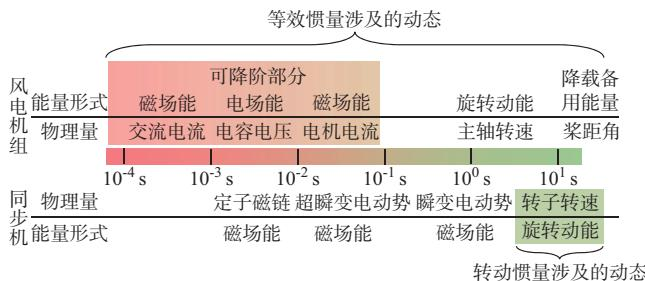  
图3 风电机组与同步机惯量时间尺度对比  
Fig. 3 Comparison of inertia time scales between wind turbine and synchronous generator

能以独立环节的时间尺度为判断依据，如 $x _ { \mathrm { p l l } }$ 和 $f _ { \mathrm { p l l } }$ 对应的独立环节时间尺度分别为1/600 s和1/60 s，远小于频率主模态时间尺度，但其却对机组频率响应功率有直接影响。

# 3. 4　多时间尺度惯量机理模型

汇总以上分析，总结不同时间尺度下需要考虑的环节和相关变量，给出对应的频率响应和等效惯量模型的基本形式，如表2所示。其中，公式中各系数形式见附录E，推导过程见附录F。

表2 不同时间尺度下的等效惯量模型  
Table 2 Equivalent inertia models of different time scales   

<table><tr><td>关注时段</td><td>主要环节</td><td>相关状态变量</td><td>频率响应模型</td><td>等效惯量模型</td><td>阶数</td></tr><tr><td>&gt;0.2s</td><td>机械、频率测量、PLL</td><td>xbeta1, ωw, xfr, xpll, fpll</td><td>Gfr-5 = D4s4 + D3s3 + D2s2 + D1s + D0 / E5s5 + E4s4 + E3s3 + E2s2 + E1s + E0</td><td>Meq-5 = F5s5 + F4s4 + F3s3 + F2s2 + F1s + F0 / E5s6 + E4s5 + E3s4 + E2s3 + E1s2 + E0s</td><td>5</td></tr><tr><td>&gt;0.6s</td><td>机械、频率测量</td><td>xbeta1, ωw, xfr</td><td>Gfr-3 = M3s3 + M2s2 + M1s + M0 / N3s3 + N2s2 + N1s + N0</td><td>Meq-3 = -O3s3 + O2s2 + O1s + O0 / N3s4 + N2s3 + N1s2 + N0s</td><td>3</td></tr><tr><td>&gt;4s</td><td>机械环节</td><td>xbeta1, ωw</td><td>Gfr-2 = M3s3 + M2s2 + M1s + M0 / R2s2 + R1s + R0</td><td>Meq-2 = -T3s3 + T2s2 + T1s + T0 / R2s3 + R1s2 + R0s</td><td>2</td></tr></table>

观察模型推导结果可知：

1）频率响应模型的阶数（极点个数）等于保留的状态变量数；  
2）仅有 5阶、3阶惯量模型为频率-有功功率因果系统，2阶系统变为超前系统；  
3）各阶模型计算均需要已知轴系转速、机侧 $q$

轴电压、q轴电流和风速的初值（见附录E）；

4）直驱风电机组的等效惯量环节对频率响应模型具有升阶作用，与同步机的定常惯量特性不同；  
5）3类简化模型的能量本质均为主轴动能和降载备用能量，磁场能和电场能均忽略不计，且3、5阶模型包含了控制环节对能量释放的影响。

# 4 仿真计算

搭建如附录 G 图 G1所示的 EMT 系统进行验证。其中，G1 和 G2 为 100 MW 煤电机组，其惯量时间常数H分别为3.4 s和3.5 s，调差系数均为5%，配置DC1A型励磁系统。风电场G3包括25台容量为2.22 MW的直驱风电机组，考虑到本文重点对单机层面的惯量机理展开研究，为简化聚合计算，本算例按照容量倍乘的方式进行场站等效，风电场中保留了一台直驱风电机组的详细模型。机组变流器短时通流能力为110%的额定电流，机组参数见附录 D表 D2，叶片入流风速为额定值 14.2 m/s，机组降载10% 运行。由于本文主要关注扰动后短时的惯量响应和一次调频性能，算例系统暂未包含二次调频环节。仿真中，系统初始负荷为母线 3处的负荷 1（160 MW），负荷-频率阻尼为16 MW/Hz，所有扰动事件均设置为母线4处负荷2的阶跃突增。EMT仿真环境为Simulink，仿真步长为100 μs，为避免器件开断引起的高频谐波，风电机组变流器模块采用平均值模型构建。

# 4. 1　系统动态过程分析

本节对扰动后系统频率和功率过程的EMT仿真结果展开初步分析。当负荷 2在 1 s发生 8 MW（5% 总负荷）有功阶跃突增时，各机组频率波形见附录G图G2。其中，风电锁相频率为直驱风电机组PLL的跟踪频率，机端频率按式（6）计算，也是本文模型的频率输入信号。

该扰动下各机组有功功率增量过程如图 4 所示。扰动发生初期的功率增量能够反映风电与同步机的惯量响应时域差异，扰动初期仅有同步机的惯量响应承担不平衡功率。扰动发生瞬间之后，同步机的惯量响应功率下降，风电机组的有功功率快速增加，在扰动发生4 s后达到有功功率峰值，随后二者均进入原动机动态或有差调节主导的阶段。另外，同步机的惯量响应功率中含有快动态振荡分量，而风电机组经滤波、斜率限制环节实现有功功率的平缓变化，不再含有系统机电振荡的快动态信息。综上，风电机组等效惯量受多个环节共同作用，时域特性与同步机差异明显，尤其是无法替代扰动初期的同步惯量作用。

# 4. 2　全阶模型有效性验证

利用风电机组频率响应全阶模型式（14），并忽略网侧 d、q轴电压的波动，求解上述扰动后风电机组内各状态量动态过程，并与仿真结果对比，如附录图 所示。

由附录 G 图 G3 可知，全阶模型在扰动发生

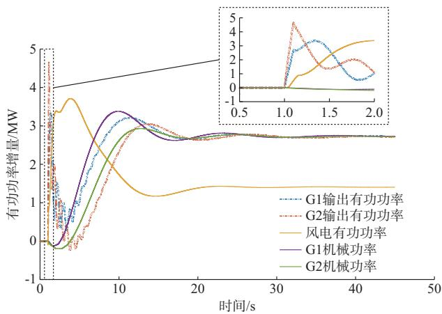  
图 4 负荷 2 发生 8 MW 扰动时有功功率增量过程  
Fig. 4 Active power increment process when 8 MW disturbance occurs in load 2

0.2 s后的时段中对于慢动态到较快动态这3类状态量的过程具有较精确的计算效果，而对电容电压、网侧交流电流的计算结果则在扰动发生 0.4 s之后与仿真结果的误差较小。同时，由于忽略了 2 000 Hz以上的动态过程，全阶模型并未反映电容电压和网侧交流电流的初期振荡过程，但这个简化并不会对有功功率-频率的分析精度产生较大影响。需要说明的是，全阶模型对风电机组主轴转速的计算结果在局部时段与仿真结果有偏差，其原因为仿真中风电机组使用三质量块模型，若需进一步提高模型精度，可在全阶模型中将单体轴改为三体轴模型，但相应的模型阶数需要增加2，计算更加复杂。综上，本文所提的全阶模型对各时间尺度动态过程的计算精度满足工程要求。

# 4. 3　各阶简化模型效果验证

按照3.4节提出的5阶、3阶、2阶模型分别推导风电机组频率响应和等效惯量模型的系数，结果如附录G表G1所示，4类模型的特征值分布情况如图5所示。

由附录 G表 G1和图 5可见，在该运行点下，全阶模型满足稳定性条件，可以降阶。3类简化模型的主导特征值均与全阶模型中靠近虚轴的特征根基本重合，3类简化模型的最慢动态对应特征根（局部放大图）相对误差为0.61%。简化模型阶数越高，所覆盖的主导特征根数量越多，能够刻画的参与惯量响应环节数量越多，模型的相位延迟越大，但其计算结果接近真实结果。同时，5阶模型包含了 PLL两个状态变量，引入一个距离虚轴较远的混合模态特征根。

采用全阶模型、各降阶简化模型和仿真对比计算风电机组的机端有功功率，如图 6所示。从扰动

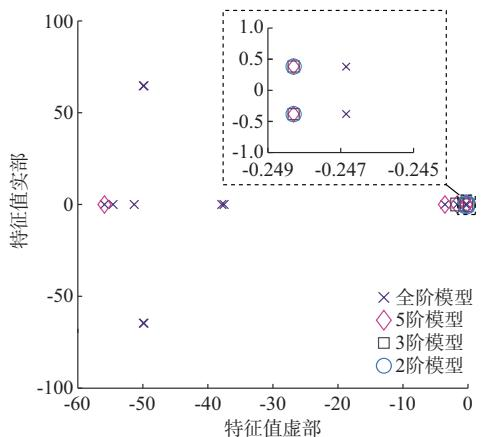  
图5 各阶模型的特征值分布  
Fig. 5 Distribution of eigenvalues of models with different orders

发生后0 s至34 s的全过程来看，全阶模型和3类简化模型均可以较好地刻画风电机组的有功功率响应过程，各模型在30 s后新稳态点下的最大相对误差一致，约为 0.30%。此误差可能由未建模的最大功率点跟踪（MPPT）控制、气动功率等非线性环节和变流器器件损耗特性引起。1.5~4.0 s时段内的最大有功功率与频率最低点时段对应，全阶模型和3类简化模型在此时段内误差增大，主要原因为模型中的单轴模型与实际的多轴动态有一定偏差，与附录G图G3（a）的分析一致。

从扰动发生初期内的有功功率曲线来看，全阶模型在 1.0~1.1 s内几乎无误差地反映有功功率的实际动态。随着模型阶数降低，有功功率计算结果误差越大，且有功功率的首个峰值点时间更短，峰值功率更高。其原因为阶数越低的模型包含的慢动态特征根越少，整体阻尼越小，功率响应更快，故带来了较大误差。

进一步分析不同幅度扰动下各模型的误差水平，设置负荷 2发生 1.6 MW 和 16 MW 阶跃突增两个扰动场景，模型计算结果如图7和图8所示，细节图分别如附录G图G4和图G5所示。

对比图7和图8可知，在系统频率最低点时刻附近，扰动越大，全阶模型和 3类简化模型的误差越大，原因为转子动能释放增加，多个轴体之间的转速差异大，导致真实有功功率曲线与单体轴模型结果不一致。而在扰动初期，扰动越大，各阶模型的首个峰值点之间差异越小，如 扰动下， 阶模型和 3阶模型的峰值几乎相等。此外，5阶和 3阶模型大约在扰动后 0.3~0.4 s与全阶模型结果重合，而 2阶模型大约在5 s左右与全阶模型结果重合，与表 1的时间尺度分类标准相吻合。因此，在研究风电频率响应的全过程特性时，考虑轴系和桨距角动

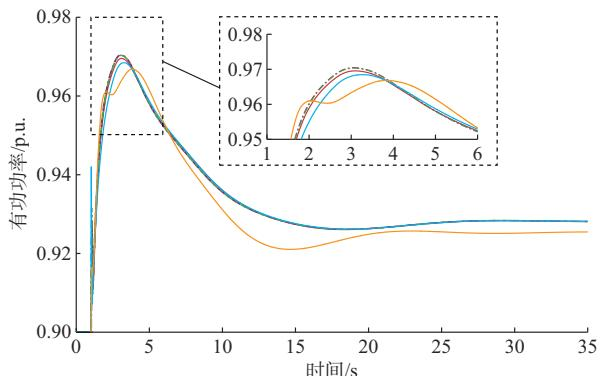  
(a) 全过程

(b) 扰动发生后初期局部放大图  
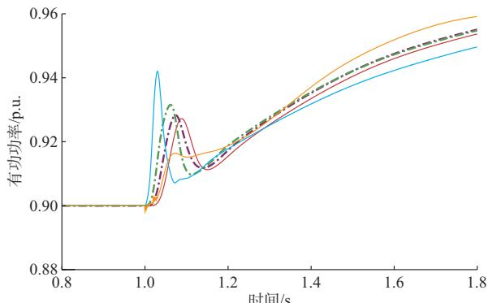  
全阶模型; EMT仿真; 2阶模型; 3阶模型; 5阶模型。

图6 8 MW扰动下各模型的风电机组有功功率

Fig. 6 Active power of wind turbines in different models under 8 MW disturbance

图7 1. 6 MW扰动下各模型的风电机组有功功率   
Fig. 7 Active power of wind turbines in different models under 1. 6 MW disturbance   
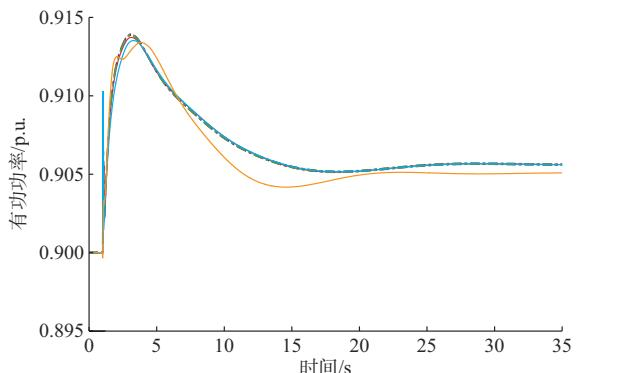  
全阶模型; EMT仿真; 2阶模型; 3阶模型; 5阶模型。

态的 2阶模型可满足要求；在研究扰动初期的惯量响应特性时，应尽可能使用高阶模型。

在16 MW扰动下，本文对比了所提模型与3个典型模型的计算精度，如图9所示。除全阶模型外，选择了计算复杂度和精度较为平衡的3阶模型参与对比，对比模型1采用文献［4］的模型Ⅰ，对比模型2和3分别为文献［8］和文献［10］的方案。显然，全阶模型和 3阶模型均比已有文献的机理模型精度更高，主要原因是 个对比模型均只纳入了部分选定

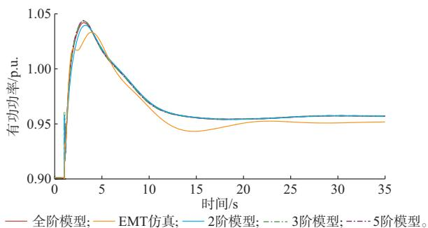  
图8 16 MW扰动下各模型的风电机组有功功率   
Fig. 8 Active power of wind turbines in different models under 16 MW disturbance

环节，对模型的降阶处理仅按独立环节的时间常数对比或工程经验进行，造成过大误差。而本文所提降阶方法遵循严格的尺度分离原则，基于奇异摄动理论进行变量简化，其计算效果明显优于其他模型。

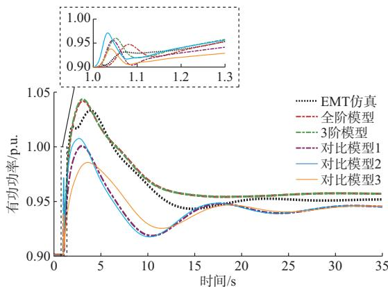  
图9 16 MW扰动下本文模型与其他模型的对比  
Fig. 9 Comparison of proposed model and other models under 16 MW disturbance

# 4. 4　时域误差分析

分别在负荷 2处设置 1.6、4、8、12、16 MW 的阶跃负荷突增扰动 ΔL，对比分析全阶模型和 3 类简化模型在不同扰动下扰动后 0~3 s内的有功功率的最大绝对误差，误差与各阶模型时间尺度之间的关系如图 10所示。全阶模型的时间尺度与网侧交流电流尺度一致，取为0.001 s。

由图10可知，模型阶次越低，误差越大；扰动越小，绝对误差与时间尺度之间越接近线性关系，与瓦西里耶娃定理一致。根据 EMT 结果，式（19）中$\operatorname* { m a x } \left( | v _ { \mathrm { t } d 0 } | , | v _ { \mathrm { t } q 0 } | \right) = v _ { \mathrm { t } d 0 } = 0 . 9 8 2$ ，线性拟合后的结果如表 3所示。该结果可在不同扰动事件下，粗略估算不同精度要求下的模型阶次。另外，各阶模型在扰动后30 s的新稳态阶段的绝对误差基本一致，具体数值如表3所示。

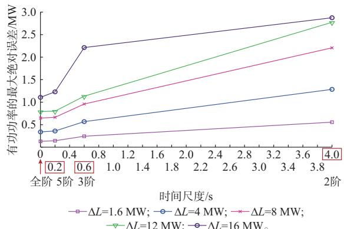  
图10 不同扰动下各模型与EMT结果的最大绝对误差随时间尺度的变化趋势（扰动后0~3 s）  
Fig. 10 Changing trend of the maximum absolute error of each model and EMT result under different disturbances over time scale (0~3 s after disturbance)

表3 不同扰动下误差与时间尺度关系  
Table 3 Relationship between error and time scale under different disturbances   

<table><tr><td>扰动功率/MW</td><td>c/(MW·s-1)</td><td>δ/MW</td><td>稳态后各阶模型绝对误差/MW</td></tr><tr><td>1.6</td><td>0.1044</td><td>0.1427</td><td>0.032</td></tr><tr><td>4.0</td><td>0.2388</td><td>0.3571</td><td>0.080</td></tr><tr><td>8.0</td><td>0.3914</td><td>0.6492</td><td>0.160</td></tr><tr><td>12.0</td><td>0.5016</td><td>0.7721</td><td>0.240</td></tr><tr><td>16.0</td><td>-</td><td>-</td><td>0.330</td></tr></table>

# 4. 5　等效惯量量化

对附录G表G1中各阶等效惯量模型注入负的单位阶跃频率（阶跃时刻为1 s），得到不同阶模型在各时刻的惯量响应功率，其数值为机组等效惯量水平的时序曲线，如图11所示。

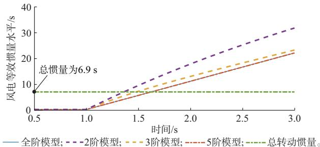  
图11 不同模型求解的风电机组等效惯量水平  
Fig. 11 Equivalent inertia levels for wind turbines derived from different models

由图11可知，全阶和5阶模型结果一致，惯量水平与时间呈线性关系。2阶、3阶模型得到的等效惯量水平随时间呈微弱的非线性变化。该结果反映了在式（2）定义下风电机组等效惯量水平的时变特性和扰动初期的弱惯量特性。需要说明的是，此处的结果与扰动大小无关，仅由风电机组的参数和初始

运行点决定。可以猜想，等效惯量主要反映机组在频率变化中的有功功率动态特性，该方法得到的等效惯量水平在扰动发生时刻附近具有较好的表征作用，下文分析也将证明该猜想。图11中的总转动惯量以 100 MW为基准容量计算获得，两台同步机的聚合惯量常数为 6.9 s，按照全阶模型计算，风电机组在扰动发生约 0.5 s后才能提供与同步机相同的惯量水平，跟网型风电机组不能替代扰动发生初期的同步机惯量作用。

进一步，利用平均频率变化率作为主要指标验证风电机组等效惯量量化方法的有效性。其中，基于 EMT 和频率响应模型的平均频率变化率 $r _ { \mathrm { E M T } } , r _ { \mathrm { f r } }$ 的计算方式如下：

$$
r _ {\mathrm {E M T}} (t) = \frac {f _ {\mathrm {C O I}} (t) - f _ {\mathrm {C O I} , 0} (t)}{t - t _ {0}} \tag {20}
$$

$$
r _ {\mathrm {f r}} (t) = \frac {\Delta P _ {\mathrm {L}}}{2 \left(H _ {\mathrm {G} 1} + H _ {\mathrm {G} 2}\right) + M _ {\mathrm {e q}} (t)} \tag {21}
$$

式中： $t _ { 0 }$ 为扰动发生时刻； $H _ { \mathrm { G 1 } }$ 和 $H _ { \mathrm { G 2 } }$ 分别为机组G1和G2的惯量常数。

在 16 MW 扰动下计算的平均频率变化率结果如图12所示。图中，“无风电惯量”指仅考虑同步机惯量作用，该变化率仅反映扰动发生时刻的频率变化率。

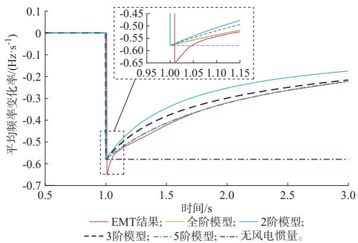  
图12 16 MW扰动下各模型得到的平均频率变化率  
Fig. 12 Average frequency change rates obtained by each model under 16 MW disturbance

由图12可见，模型阶次越低，所得到的平均频率变化率误差越大，全阶模型和 5阶模型在扰动发生0.1~2.0 s期间能够较好地计算频率变化率，而2阶模型结果误差偏大，3阶模型误差居中，且3阶模型在扰动发生2 s后与全阶模型的结果曲线重合。从结果来看，3阶模型能够实现计算复杂度和精度的平衡。此外，图 反映了在远离扰动发生时刻，等

效惯量模型计算得到的频率变化率误差明显增加，验证了图11的分析结论。

# 5 结 语

本文通过理论推导与仿真计算得到以下结论：

1）锁相型直驱风电机组的等效惯量模型刻画了机组惯量响应功率与频率变化率的动态关系，等效惯量响应由机组内多个不同时间尺度的动态环节共同参与实现，转动轴系、桨距角、PLL、频率滤波为 4 类主导慢动态环节，机组内其余环节动态在惯量与频率分析中可以忽略。  
2）当研究不同时间尺度的特性时，应当按照机组的慢动态到快动态的时间尺度分类选择合适的模型阶次；当研究对象为 100 s级的频率响应动态时，考虑轴系、桨距角动态的 2阶模型可以满足工程需要；当研究对象为扰动初期 $1 0 ^ { - 1 }$ s尺度的惯量响应动态时，考虑4类主导慢动态环节的5阶模型更为合适。本文推荐在一般研究中使用 3阶模型，可实现精度与复杂度的平衡。  
3）风电机组的频率响应由等效惯量和下垂响应组成，所提的定义与理论计算方法可以结合业界已推广的快速调频测试方法给出等效惯量水平的工程测试方法，所提惯量表征方法能够用于预测扰动发生初期的系统平均频率变化率。  
4）机理分析方法对模型、参数可知程度要求高，难以直接应用于海量机组实时建模，实际运行中可与实测数据辨识方法结合，提升精度。

本文可为电力系统频率分析提供新能源建模方法和模型选择原则，所提模型可面向场站聚合建模、等效惯量辨识和调频能力分析等诸多场景开展应用。后续研究将围绕气动捕获功率、控制死区等非线性环节的精细化建模进行，进而降低模型的线性化误差，提高模型在大扰动工况和饱和工作区中的计算精度。

附录见本刊网络版（http：//www.aeps-info.com/aeps/ch/index.aspx），扫英文摘要后二维码可以阅读网络全文。

# 参 考 文 献

[1]HATZIARGYRIOUN，MILANOVIC J，RAHMANNC，et al. Stability definitions and characterization of dynamic behavior in systems with high penetration of power electronic interfaced technologies［C］// IEEE Power & Energy Society General Meeting， August 2-6，2020， Montreal， Canada.   
［ ］国家质量监督检验检疫总局，中国国家标准化管理委员会 风电场接入电力系统技术规定： — ［ ］北京：中

国标准出版社，2012.  
General Administration of Quality Supervision， Inspection andQuarantine of the People’s Republic of China， StandardizationAdministration of the People’s Republic of China. Technical rulefor connecting wind farm to power system： GB/T 19963—2011［S］. Beijing： Standards Press of China，2012.  
［3］鲁宗相，姜继恒，乔颖，等 .新型电力系统广义惯量分析与优化研究综述［J］.中国电机工程学报，2023，43（5）：1754-1775.  
LU Zongxiang， JIANG Jiheng， QIAO Ying， et al. A review ongeneralized inertia analysis and optimization of new power systems［J］. Proceedings of the CSEE，2023，43（5）：1754-1775.  
［4］黄俊凯，杨知方，余娟，等 .面向频率稳定校核的风机快速频率响应低阶建模方法及其误差分析［J］.中国电机工程学报，2022，42（18）：6752-6765.  
HUANG Junkai， YANG Zhifang， YU Juan， et al. Low-order modeling of wind turbine-based fast frequency response and its error analysis for frequency stability assessment［J］. Proceedings of the CSEE，2022，42（18）：6752-6765.   
［5］李世春，邓长虹，龙志君，等 .风电场等效虚拟惯性时间常数计算［J］.电力系统自动化，2016，40（7）：22-29.  
LI Shichun， DENG Changhong， LONG Zhijun， et al.Calculation of equivalent virtual inertial time constant of windfarm［J］. Automation of Electric Power Systems，2016，40（7）：22-29.  
［6］李世春，唐红艳，邓长虹，等 .考虑频率约束及风电机组调频的风电穿透功率极限计算［J］. 电力系统自动化，2019，43（4）：33-39.  
LI Shichun， TANG Hongyan， DENG Changhong， et al.Calculation of wind power penetration limit considering frequencyconstraint and wind turbine frequency modulation ［J］.Automation of Electric Power Systems，2019，43（4）：33-39.  
［7］李世春，黄悦华，王凌云，等 .基于转速控制的双馈风电机组一次调频辅助控制系统建模［］ 中国电机工程学报， ，（24）：7077-7086.  
LI Shichun， HUANG Yuehua， WANG Lingyun， et al.Modeling primary frequency regulation auxiliary control system ofdoubly fed induction generator based on rotor speed control［J］.Proceedings of the CSEE，2017，37（24）：7077-7086.  
［8］RAVANJI M H， CANIZARES C A， PARNIANI M.Modeling and control of variable speed wind turbine generatorsfor frequency regulation［J］. IEEE Transactions on SustainableEnergy，2020，11（2）：916-927.  
［9］陈鹏伟，戚陈陈，陈新，等 .附加频率控制双馈风电场频率响应特性建模与参数辨识［］电工技术学报， ， （ ）： -3307.  
CHEN Pengwei， QI Chenchen， CHEN Xin， et al. Frequencyresponse modeling and parameter identification of doubly-fedwind farm with additional frequency control［J］. Transactions ofChina Electrotechnical Society，2021，36（15）：3293-3307.  
［ ］戚陈陈，陈鹏伟，陈新，等 分散式风电高渗透率接入直流受端电网频率特性建模与分析［J］.电网技术，2022，46（6）：2161-2170.  
QI Chenchen， CHEN Pengwei， CHEN Xin， et al. Modeling and analyzing for frequency characteristics of distributed wind power with high proportional participation in DC receiving

power grid［J］. Power System Technology，2022，46（6）：2161-2170.  
［11］CHEN P W， QI C C， CHEN X. Virtual inertia estimationmethod of DFIG-based wind farm with additional frequencycontrol［J］. Journal of Modern Power Systems and CleanEnergy，2021，9（5）：1076-1087.  
［12］HE W，YUAN X M，HU J B. Inertia provision and estimationof PLL-based DFIG wind turbines［J］. IEEE Transactions onPower Systems，2017，32（1）：510-521.  
［13］YUAN H，YUAN X M，HU J B. Modeling of grid-connected VSCs for power system small-signal stability analysis in DC-link voltage control timescale［J］. IEEE Transactions on Power Systems，2017，32（5）：3981-3991.   
［14］LI S，YAN Y B，YUAN X M. SISO equivalent of MIMO VSC-dominated power systems for voltage amplitude and phase dynamic analyses in current control timescale ［J］. IEEE Transactions on Energy Conversion，2019，34（3）：1454-1465.   
［15］HU J B，SUN L，YUAN X M， et al. Modeling of type 3 windturbines with df/dt inertia control for system frequency responsestudy［J］. IEEE Transactions on Power Systems，2017，32（4）：2799-2809.  
［16］TAN S L，GENG H，YANG G， et al. Modeling framework of voltage-source converters based on equivalence with synchronous generator［J］. Journal of Modern Power Systems and Clean Energy，2018，6（6）：1291-1305.   
［17］NADERI M，KHAYAT Y，SHAFIEE Q， et al. Dynamicmodeling， stability analysis and control of interconnectedmicrogrids： a review［J］. Applied Energy，2023，334：120647.  
［18］叶一达，魏林君，阮佳阳，等.电力电子接口电源的准功率特性降阶建模体系［J］. 中国电机工程学报，2017，37（14）：3993-4001.  
YE Yida， WEI Linjun， RUAN Jiayang， et al. A genericreduced-order modeling hierarchy for power-electronic interfacedgenerators with the quasi-constant-power feature ［J］.Proceedings of the CSEE，2017，37（14）：3993-4001.  
［19］MALLIK R，MAJMUNOVIC B，DUTTA S， et al. Controldesign of series-connected PV-powered grid-forming convertersvia singular perturbation［J］. IEEE Transactions on PowerElectronics，2023，38（4）：4306-4322.  
［20］MA Y M，ZHU D H，ZHANG Z Q， et al. Modeling andtransient stability analysis for type-3 wind turbines using singularperturbation and Lyapunov methods［J］. IEEE Transactions onIndustrial Electronics，2023，70（8）：8075-8086.  
［21］HEYLEN E， TENG F， STRBAC G. Challenges andopportunities of inertia estimation and forecasting in low-inertiapower systems ［J］. Renewable and Sustainable EnergyReviews，2021，147：111176.  
［22］高晖胜，辛焕海，黄林彬，等.新能源电力系统的共模频率分析及其特征量化［］中国电机工程学报， ，（ ）： -  
GAO Huisheng， XIN Huanhai， HUANG Linbin， et al.Characteristic analysis and quantification of common modefrequency in power systems with high penetration of renewableresources［J］. Proceedings of the CSEE， 2021， 41 （3） ：890-899.  
［23］MA Q Y，CHEN L，LI L Y， et al. Effect of grid-following

VSC on terminal frequency［J］. IEEE Transactions on PowerSystems，2023，38（2）：1775-1778.  
［24］周明儒，林武忠，倪明康，等.奇异摄动导论［M］.北京：科学出版社，  
ZHOU Mingru， LIN Wuzhong， NI Mingkang， et al.Introduction to singular perturbations［M］. Beijing： SciencePress，2014.  
［25］马凡，付立军，叶志浩，等.基于降阶模型的非线性系统稳定性快速评估［J］.中国电机工程学报，2013，33（19）：126-134.  
MA Fan， FU Lijun， YE Zhihao， et al. Fast assessment ofnonlinear system stability based on reduced model ［J］.Proceedings of the CSEE，2013，33（19）：126-134.  
［26］刘永强，严正，倪以信，等.双时间尺度电力系统动态模型降阶研究（二）——降阶与分析［J］.电力系统自动化，2002，26（19）：1-6.  
LIU Yongqiang， YAN Zheng， NI Yixin， et al. Study on theorder reduction of two-time scale power system dynamicmodels： Part two order reduction and analysis［J］. Automationof Electric Power Systems，2002，26（19）：1-6.

［27］VASILʹEVA A B，BORISOVNA A. Asymptotic expansions of solutions of singularly perturbed problems［M］. Mequon， USA： Wisconsin University Madison Mathematics Research Center，1969.   
［28］KUNDUR P， BALU N J， LAUBY M G. Power systemstability and control［M］. New York， USA： McGraw-Hill，1994.

姜继恒(1994—)，男，通信作者，博士研究生，主要研究方向：电力系统稳定分析与控制。E-mail：jiheng1020@163.com

鲁宗相(1974—)，男，博士，副教授，主要研究方向：风电和太阳能发电并网分析与控制、能源与电力宏观规划、电力系统可靠性、分布式电源及微电网。E-mail：luzongxiang98@tsinghua.edu.cn

乔 颖(1981—)，女，博士，副研究员，主要研究方向：新能 源 、分 布 式 发 电 、电 力 系 统 安 全 与 控 制 。 - ：qiaoying@tsinghua.edu.cn

（编辑 王梦岩）

# Multi-time-scale Equivalent Inertia Mechanism Modeling of Direct-drive Wind Turbines Based on Full-order Model

JIANG Jiheng1 ， LU Zongxiang1 ， QIAO Ying1 ， LI Jiaming1 ， CHENG Yan2 ， GUAN Yifei2 ， WANG Ting3

(1. State Key Laboratory of Control and Simulation of Power Systems and Generation Equipments (Tsinghua University),

Beijing 100084, China; 2. Electric Power Research Institute of State Grid Shandong Electric Power Company, Jinan 250003,

China; 3. State Grid Shandong Electric Power Company, Jinan 250000, China)

Abstract: Constructing the equivalent inertia model of wind turbines is a key basis for quantitative analysis and optimal control of wind farm transient support, especially in the scenario of high-proportion renewable energy power grid with reduced of inertia and degraded frequency characteristics. However, the existing model research often focuses on several links in combination with the analysis goal, but does not establish a complete model of the whole links, and does not reveal the relationship between the reducedorder model and the calculation accuracy at different time scales. Firstly, taking direct-drive wind turbine as the object, based on the comparison of the equivalent inertia of wind power and synchronous machine in mechanism and implementation mode, the dynamic influence of mechanical, control and electrical links on the equivalent inertia of wind power is analyzed, and a full-order frequency response model of the wind turbine is established. Then, based on the singular perturbation theory, the equivalent inertia reduction model considering the dynamics of different time scales is derived, and the relationship between the error and the time scale of the model is derived by applying the Vasilyeva theory. Finally, an electromagnetic transient simulation case is used to verify the effectiveness of the full-order mechanism model and the accuracy of different reduced-order models.

This work is supported by National Key R&D Program of China (No. 2021YFB2400500) and State Grid Corporation of China.

Key words: wind turbine; equivalent inertia; multi-time-scale; singular perturbation theory; reduced-order model; Vasilyeva theory

