# 多类型子模块 MMC 电磁暂态通用建模和实现方法

许建中 1 ，徐义良 2 ，赵禹辰 1 ，赵成勇 1

（1．新能源电力系统国家重点实验室(华北电力大学)，北京市 昌平区 102206；

2．直流输电技术国家重点实验室(南方电网科学研究院有限责任公司)，广东省 广州市 510080)

# Generalized Electromagnetic Transient Equivalent Modeling and Implementation of MMC With Arbitrary Multi-type Submodule Structures

XU Jianzhong1 , XU Yiliang2 , ZHAO Yuchen1 , ZHAO Chengyong1

(1. State Key Laboratory of Alternate Electrical Power System With Renewable Energy Sources (North China Electric Power University), Changping District, Beijing 102206, China;   
2. State Key Laboratory of HVDC (Electric Power Research Institute, China Southern Power Grid), Guangzhou 510080, Guangdong Province, China)

ABSTRACT: The key issue of electromagnetic transient (EMT) modelling of modular multilevel converters (MMC) is calculation of equivalent circuit of entire MMC arm containing a large number of cascaded sub-modules (SM) with identical structure. During this process, all internal information should be preserved. This paper proposes a general EMT modelling approach for arbitrary multi-port MMC topologies, also suitable for traditional single-port MMC and emerging two-port MMC. A submodule topology identification method is proposed to minimize the efforts of the model users when they have specific MMC topologies at hand. In addition, the model codes can be inherited to a large extent. Finally, the approaches are validated in PSCAD/EMTDC with results of very good applicability of the general algorithm and unified implementation method .

KEY WORDS: modular multilevel converter (MMC); electromagnetic transient (EMT); equivalent model; multi-port sub-module; submodule topology identification

摘要：模块化多电平换流器(modular multilevel converter，MMC)电磁暂态高效建模的难点，在于对桥臂中大量结构相同的级联子模块(sub-module，SM)进行等效的同时保证消去的节点信息都可以被精确反解。提出一种针对多类型MMC的电磁暂态通用建模和实现方法，它对传统的单端口 MMC和新近出现的双端口MMC 都适用。同时提出一种MMC 拓扑自动识别方法，可以大幅降低模型用户在对特定拓扑建模时候的工作量，同时绝大部分模型代码都可以继承。最后，

在 PSCAD/EMTDC 中分别以单端口和双端口 MMC 为例，对所介绍的等效建模算法进行了验证，结果表明所提出的算法具有很强的通用性。

关键词：模块化多电平换流器；电磁暂态；等效模型；多类 型子模块；子模块拓扑识别

DOI：10.13335/j.1000-3673.pst.2018.2121

# 0 引言

由半桥、全桥等单端口子模块构成的模块化多电平换流器(modular multilevel converter，MMC)，已成为国内外各大柔性直流输电工程的首选换流器拓扑[1-5]。近来，新型双端口子模块 MMC 拓扑不断涌现[9-11]，这些拓扑通常具备直流故障穿越能力和电容电压自平衡能力等优良特性。随着柔性直流电网对快速清除直流故障的需求不断增强，这些新型拓扑具有良好的应用前景。

当前柔性直流输电工程正朝着高电平、大容量、多端的方向快速发展。当电平数较高时，无论是半桥、全桥等单端口子模块还是新型双端口子模块构成的 MMC 在进行电磁暂态仿真时，都将面临仿真速度难以满足研究需求的问题。针对 MMC 模型计算效率问题，国内外学者提出了大量电磁暂态等效模型[12-20]，这些模型针对单端口子模块 MMC拓扑提出，算法适用前提是同一个桥臂内的子模块必须流过相同的桥臂电流。文献[21]提出了一种对任意单端口 MMC 拓扑通用的等效建模方法，在求解子模块戴维南等效电路时无需获得符号解析解，

可以极大提高新拓扑的建模效率。然而，文献[12-21]都要求桥臂电流流过全部子模块的正负端子，以便通过对子模块戴维南电路求和以获得桥臂的等效电路。

图 1 为本文将涉及到的双端口子模块构成的MMC 拓扑，相比于传统的单端口子模块拓扑，双端口子模块兼具隔离直流故障和自均压等功能。随着新型子模块拓扑外部端子数目的增加，相邻子模块间电流流通路径多样化，两两端子之间不一定严格的满足成为端口的条件，传统的戴维南等效方法将不再适用于该种类型的子模块的建模。

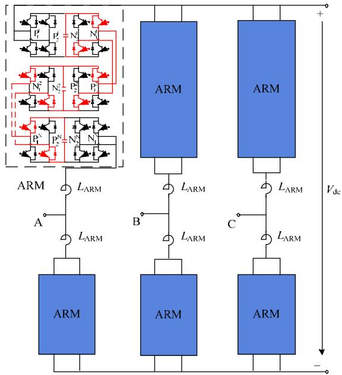  
图1 双端口子模块MMC 示意图  
Fig. 1 Schematic diagram of the two-port MMC

为解决这一问题，文献[22]针对双端口 MMC提出了一种通用等效建模方法，该方法可以在实现对外部等效的同时，完整保留消去节点的全部信息。然而，文献[22]中方法针对的是对称双端口子模块结构，不适用于子模块外部端口数量大于二的多端口 MMC 或子模块两侧结构不对称的多端口MMC 情况。同时，文献[21]和[22]中的方法都无法实现针对模型用户特定 MMC 拓扑的快速识别和通用建模，对用户的编程能力要求较高。

本文将在文献[21-22]工作的基础上，提出一种多类型 MMC 拓扑等效模型的通用实现方法，用户只需输入表征新型子模块结构的拓扑识别矩阵，就可以实现新拓扑的电磁暂态快速建模，最终实现建模算法和编程实现的双通用。同时，本文所提建模方法既可用于离线仿真，也可用于实时仿真。

# 1 多类型子模块MMC拓扑的自动识别方法

本节将介绍本文提出的不同类型子模块拓扑

的快速自动识别方法。为了不失一般性，假定任意新型子模块拓扑中最多包含 2 个电容(本文提出方法所涉及公式可以根据实际电容数量进行修改)，将电容进行积分离散化为诺顿等效形式，并使用阻值可变的电阻来代替开关器件，可得任意子模块的伴随电路如图2所示。图2共含n个节点，其中第1~2m个节点为子模块的外部连接节点，其余均为子模块内部节点，第 i~n 号节点为电容节点。

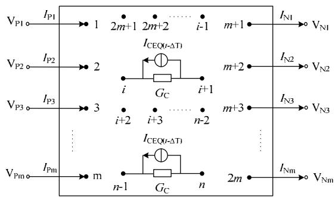  
图 2 任意拓扑子模块对应的伴随电路  
Fig. 2 Companion circuit of the arbitrary sub-module topology

在 PSCAD/EMTDC 等电磁暂态仿真软件中对任意拓扑子模块构成的 MMC 进行建模编程时，传统方法需要由图2子模块的伴随电路预先计算出子模块节点电压方程中各矩阵对应元素的解析表达式，然后编入程序中。通常一旦子模块拓扑发生改变，所编程序将不再适用，需要根据新的子模块拓扑重新求解获得等效电路的符号解析解，然后将其编程到仿真软件当中，这大大限制了所编程序的通用性。同时，当子模块拓扑较复杂时，由于涉及到矩阵求逆过程，符号解析解将非常冗长，不利于程序的实现。另外，虽然 MMC 子模块拓扑确定后用户可以容易地自行列写出节点电压方程，但是却增加了用户地编程工作量，而且节点电压方程中的电导元素是每个步长都要改变的，这样将使得用户在编程时要将控制部分给触发信号的部分输出并且整合到程序中去，这无疑大大增加了用户的编程工作量。因此，本文将探索一种通用实现方法。

# 1.1 适用任意端口 MMC子模块拓扑的识别方法

针对上述问题，本文提出一种任意拓扑 MMC等效模型通用实现方法，用户只需要在程序界面输入相应子模块对应的关联矩阵、支路导纳矩阵和支路电流源列向量，可以由仿真软件通过矩阵运算即可得到子模块对应的节点电压方程，无需预先求出节点电压方程中各矩阵对应元素的解析表达式，可以实现所编程序代码对任意拓扑子模块的通用。

以图 2 为例，假设任意拓扑子模块伴随电路中

共含 n 个节点、b 条支路(其中电容虽然被离散化为一个电导和电流源并联，但依然视为一条支路)。首先对子模块伴随电路中各节点和支路分别从 1~n、1~b 进行编号，并规定各支路方向，其中电容支路的方向取电容的正方向、其余支路方向可任意取，如此便可得到该子模块对应的有向图，进而构造子模块对应的 n 行b 列关联矩阵 $A _ { \mathrm { a } } , A _ { \mathrm { a } }$ 的行数对应有向图的节点数、列数对应有向图的支路数，关联矩阵 $A _ { \mathrm { a } }$ 的元素 $a _ { i j }$ 取值如图3 所示。

$$
A _ {\mathrm {a}}: a _ {i j} = \left\{ \begin{array}{l l} + 1, \text {表 示 支 路} j \text {与 节 点} i \text {相 连 且 支 路} j \text {的 方 向 为 远 离 节 点} i \\ - 1, \text {表 示 支 路} j \text {与 节 点} i \text {相 连 且 支 路} j \text {的 方 向 为 指 向 节 点} i \\ 0, \text {表 示 支 路} j \text {与 节 点} i \text {不 相 连} \end{array} \right.
$$

图 3 关联矩阵 $A _ { \mathbf { a } }$ 的定义

Fig. 3 Definition of the matrix Aa

除关联矩阵 $A _ { \mathrm { a } }$ 外，还需基于有向图构造任意拓扑子模块对应的支路导纳矩阵 $Y _ { b }$ 和支路电流源列向量 $I _ { S }$ ，其中 $Y _ { b }$ 为b 阶对角矩阵，其元素为全部内部电流源置零后各支路导纳值，其表达式如式(1)所示； $I _ { S }$ 为 b 维列向量，其元素为各支路诺顿等效电流源值，其表达式如式(2)所示。

$$
\mathbf {Y} _ {b} = \operatorname {d i a g} \left[ G _ {1}, G _ {2}, \dots G _ {C 1}, \dots G _ {C 2}, \dots G _ {b} \right] \tag {1}
$$

$$
\dot {I} _ {S} = \left[ \dots I _ {\mathrm {C E Q 1}} (t - \Delta T) \dots I _ {\mathrm {C E Q 2}} (t - \Delta T) \dots \right] ^ {\mathrm {T}} \tag {2}
$$

由任意拓扑子模块对应的关联矩阵 $A _ { \mathrm { a } }$ 、支路导纳矩阵 $Y _ { b }$ 和支路电流源列向量 $I _ { S }$ 根据式(3)(4)构造任意拓扑子模块对应的节点电压方程(以大地为参考节点)如公式(5)所示：

$$
\boldsymbol {Y} = \boldsymbol {A} _ {\mathrm {a}} \boldsymbol {Y} _ {b} \boldsymbol {A} _ {\mathrm {a}} ^ {\mathrm {T}} \tag {3}
$$

$$
\boldsymbol {J} = \boldsymbol {A} _ {\mathrm {a}} \boldsymbol {I} _ {S} \tag {4}
$$

$$
\boldsymbol {Y} \boldsymbol {V} = \boldsymbol {J} + \boldsymbol {I} \tag {5}
$$

最终式(5)可以写为如下分块矩阵的形式：

$$
\left[ \begin{array}{l l} Y _ {1 1} & Y _ {1 2} \\ \hline Y _ {2 1} & Y _ {2 2} \end{array} \right] \left[ \begin{array}{l} V _ {\mathrm {E X}} \\ \hline V _ {\mathrm {I N}} \end{array} \right] = \left[ \begin{array}{l} J _ {\mathrm {E X}} \\ - J _ {\mathrm {I N}} \end{array} \right] + \left[ \begin{array}{l} I _ {\mathrm {E X}} \\ I _ {\mathrm {I N}} \end{array} \right] \tag {6}
$$

式中：Y 、V 、J 、I 分别为任意拓扑子模块对应的 n阶节点导纳矩阵、n 维节点电压列向量、n 维历史电流源列向量、n 维节点注入电流列向量，其中 J 、I 正方向规定：流入节点为正。式(6)中下标 EX 表示外部节点，下标 IN表示内部节点。

当模型用户的新型拓扑通过本章所提出方法自动识别之后，就可以采用本文第 2 章提到的通用建模方法，在完全继承模型代码的前提下，实现对新拓扑的快速、精确仿真。本节将以单端口、双端口 MMC 为例，说明任意 MMC 拓扑等效模型的通

用实现方法的具体应用。

# 1.2 单端口 MMC子模块拓扑识别

任意单端口子模块只含 2 个外部节点，由图 2可知 m 的取值为 1，其对应的伴随电路示意图如图 4 所示。子模块共含有 n 个节点，其中第 1、2 个节点为子模块的外部节点，其他节点为内部节点，其中第 i、i+1 和第 n1、n 个节点分别为 2 个子模块电容对应的端点。

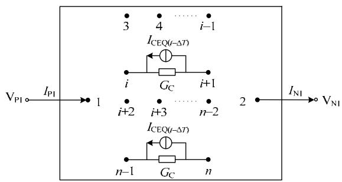  
图4 任意单端口子模块对应的伴随电路  
Fig. 4 Companion circuit of the arbitrary single-port sub-module

本节将以文献[21]中涉及的双半桥子模块(double half-bridge sub-module，D-HBSM)构成的MMC 为例，说明该拓扑识别方法对任意单端口MMC 的通用性。图 5(a)、5(b)分别为 D-HBSM 对应的伴随电路和有向图，其中 $G _ { 1 } { \sim } G _ { 8 }$ 为开关器件的等效电导。

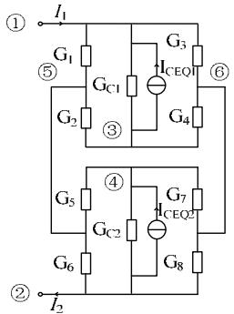  
(a)伴随电路

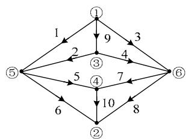  
(b)有向图  
图5 双半桥子模块  
Fig. 5 D-HBSM

由图 5(b)根据 1.1 节的相关内容，可得到D-HBSM 对应的关联矩阵、支路导纳矩阵和支路电流源列量分别如下

$$
\boldsymbol {A} _ {\mathrm {a}} = \left[ \begin{array}{c c c c c c c c c c} 1 & 0 & 1 & 0 & 0 & 0 & 0 & 0 & 1 & 0 \\ 0 & 0 & 0 & 0 & 0 & - 1 & 0 & - 1 & 0 & - 1 \\ 0 & 1 & 0 & 1 & 0 & 0 & 0 & 0 & - 1 & 0 \\ 0 & 0 & 0 & 0 & - 1 & 0 & - 1 & 0 & 0 & 1 \\ - 1 & - 1 & 0 & 0 & 1 & 1 & 0 & 0 & 0 & 0 \\ 0 & 0 & - 1 & - 1 & 0 & 0 & 1 & 1 & 0 & 0 \end{array} \right] \tag {7}
$$

$$
\mathbf {Y} _ {b} = \operatorname {d i a g} \left[ G _ {1}, G _ {2}, G _ {3}, G _ {4}, G _ {5}, G _ {6}, G _ {7}, G _ {8}, G _ {\mathrm {C} 1}, G _ {\mathrm {C} 2} \right] \tag {8}
$$

$$
\dot {\boldsymbol {I}} _ {S} = \left[ 0 0 0 0 0 0 0 0 I _ {\mathrm {C E Q} 1} (t - \Delta T) I _ {\mathrm {C E Q} 2} (t - \Delta T) \right] ^ {\mathrm {T}} (9)
$$

之后将式(7)—(9)分别代入式(3)和(4)中，从而得到 D-HBSM 对应的节点电压方程(以节点 2 为参考节点)如式(10)所示：

$$
\left[ \begin{array}{c c c c c} G _ {1} + G _ {3} + G _ {C 1} & - G _ {C 1} & 0 & - G _ {1} & - G _ {3} \\ \hline - G _ {C 1} & G _ {2} + G _ {4} + G _ {C 1} & 0 & - G _ {2} & - G _ {4} \\ 0 & 0 & G _ {5} + G _ {7} + G _ {C 2} & - G _ {5} & - G _ {7} \\ & & & G _ {1} + G _ {2} + & \\ - G _ {1} & - G _ {2} & - G _ {5} & G _ {5} + G _ {6} & 0 \\ - G _ {3} & - G _ {4} & - G _ {7} & 0 & G _ {3} + G _ {4} + G _ {7} + G _ {8} \end{array} \right].
$$

$$
\left[ \begin{array}{c} V _ {1} \\ \overline {{V _ {3}}} \\ V _ {4} \\ V _ {5} \\ V _ {6} \end{array} \right] = \left[ \begin{array}{c} I _ {\mathrm {C E Q 1}} (t - \Delta T) \\ - \overline {{I}} _ {\mathrm {C E Q 1}} (t - \Delta \overline {{T}}) \\ I _ {\mathrm {C E Q 2}} (t - \Delta T) \\ 0 \\ 0 \end{array} \right] + \left[ \begin{array}{c} \frac {I _ {1}}{0} \\ 0 \\ 0 \\ 0 \end{array} \right] \tag {10}
$$

从上式出发，采用文献[21]中的单端口 MMC拓扑通用建模方法，就可以实现由 D-HBSM 构成的MMC 的快速、精确建模。

# 1.3 双端口 MMC 子模块拓扑识别

任意双端口子模块拓扑只含 4 个外部节点，由图 2 可知 m 的取值为 2，其对应的伴随电路如图 6所示。

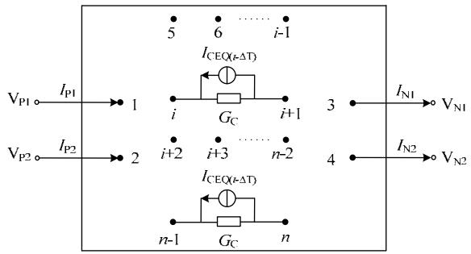  
图6 任意双端口子模块对应的伴随电路  
Fig. 6 Companion circuit of the arbitrary two-port sub-module

图 6 中子模块共包含 n个节点，其中第 1~4 节点为子模块的外部节点，其它节点为内部节点，其中第 i、i+1 和第 n1、n 个节点分别为 2 个子模块电容对应的端点。前一个子模块的 3、4 节点与后一个子模块的 1、2 节点对应相连，N个双端口子模块级联构成双端口 MMC 桥臂。

本节将以文献[22]中涉及到的并联全桥子模块(paralleled full-bridge sub-module，P-FBSM)构成的MMC 为例(见图 1)，说明本文提出的拓扑识别方法对任意双端口子模块 MMC 具备通用性。图 7(a)、7(b)分别为 P-FBSM 对应的伴随电路和有向图。

由图 7(a)可以获得图 7(b)中的有向图，进而根据 1.1 节的相关内容，可得到 P-FBSM 对应的关联矩阵、支路导纳矩阵和支路电流源列向量分别如式(11)—(13)所示：

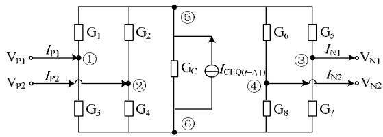

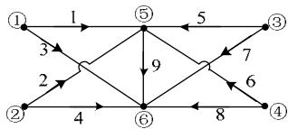  
(a)伴随电路   
(b)有向图  
图7 并联全桥子模块   
Fig. 7 P-FBSM

$$
\boldsymbol {A} _ {\mathrm {a}} = \left[ \begin{array}{c c c c c c c c c} 1 & 0 & 1 & 0 & 0 & 0 & 0 & 0 & 0 \\ 0 & 1 & 0 & 1 & 0 & 0 & 0 & 0 & 0 \\ 0 & 0 & 0 & 0 & 1 & 0 & 1 & 0 & 0 \\ 0 & 0 & 0 & 0 & 0 & 1 & 0 & 1 & 0 \\ - 1 & - 1 & 0 & 0 & - 1 & - 1 & 0 & 0 & 1 \\ 0 & 0 & - 1 & - 1 & 0 & 0 & - 1 & - 1 & - 1 \end{array} \right] \tag {11}
$$

$$
\mathbf {Y} _ {b} = \operatorname {d i a g} \left[ G _ {1}, G _ {2}, G _ {3}, G _ {4}, G _ {5}, G _ {6}, G _ {7}, G _ {8}, G _ {\mathrm {C}} \right] \tag {12}
$$

$$
\dot {\boldsymbol {I}} _ {S} = \left[ \begin{array}{l l l l l l l l l} 0 & 0 & 0 & 0 & 0 & 0 & 0 & 0 & I _ {\mathrm {C E Q}} (t - \Delta T) \end{array} \right] ^ {\mathrm {T}} \tag {13}
$$

之后将式(11)—(13)分别代入式(3)(4)中，从而得到 P-FBSM 对应的节点电压方程(以大地为参考节点)如式(14)所示：

$$
\left[ \begin{array}{c c c c c c} G _ {1} + G _ {3} & 0 & 0 & 0 & - G _ {1} & - G _ {3} \\ 0 & G _ {2} + G _ {4} & 0 & 0 & - G _ {2} & - G _ {4} \\ 0 & 0 & G _ {5} + G _ {7} & 0 & - G _ {5} & - G _ {7} \\ 0 & 0 & 0 & G _ {6} + G _ {8} & - G _ {6} & - G _ {8} \\ \hline - G _ {1} & - G _ {2} & - G _ {5} & - G _ {6} & G _ {1} + G _ {2} \\ & & & & + G _ {5} & - G _ {\mathrm {C}} \\ & & & & + G _ {6} + G _ {\mathrm {C}} \\ & & & & & G _ {3} + G _ {4} \\ - G _ {3} & - G _ {4} & - G _ {7} & - G _ {8} & - G _ {\mathrm {C}} & + G _ {7} \\ & & & & & + G _ {8} + G _ {\mathrm {C}} \end{array} \right].
$$

$$
\begin{array}{l} V _ {\mathrm {I F}} \left\{\left[ \begin{array}{c} V _ {\mathrm {P A}} \\ V _ {\mathrm {P B}} \\ V _ {\mathrm {N A}} \\ V _ {\mathrm {N B}} \\ V _ {\mathrm {C A}} \\ V _ {\mathrm {C B}} \end{array} \right] = \left[ \begin{array}{c} 0 \\ 0 \\ 0 \\ 0 \\ I _ {\mathrm {C E Q}} (t - \Delta T) \\ - I _ {\mathrm {C E Q}} (t - \Delta T) \end{array} \right] + I _ {\mathrm {I F}} \right\} \\ V _ {\mathrm {I N}} \left\{\left[ \begin{array}{c} I _ {\mathrm {P A}} \\ I _ {\mathrm {P B}} \\ - I _ {\mathrm {N A}} \\ - I _ {\mathrm {N B}} \\ 0 \\ 0 \end{array} \right] \right. \end{array} \tag {14}
$$

从上式出发，采用文献[22]中的双端口 MMC拓扑通用建模方法，就可以实现由 P-FBSM 构成的MMC 的快速、精确建模。

# 2 多类型子模块MMC通用等效建模方法

采用第 1 节方法获得新拓扑的结构信息之后，基于本节将提出的多类型子模块MMC通用建模方

法，就可以实现新型换流器拓扑的快速、精确仿真。

# 2.1 多类型 MMC通用等效模型的建模过程

针对图2所示的任意拓扑子模块构成的MMC，本文提出一种如图8所示的换流器桥臂内部节点通用消去算法，该方法在单个仿真步长内的计算步骤如下。

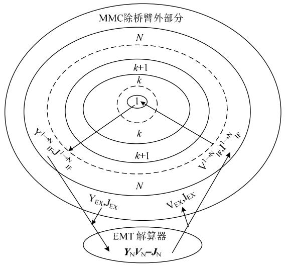  
图8 通用建模方法的计算过程  
Fig. 8 Recursive procedure of the proposed general modeling algorithm

步骤 1）采用第 1 节所述方法，系统识别子模块拓扑之后，按照式(1)—(5)可以自动获得这一时刻全部子模块各自对应的全节点电压方程。在此基础上，采用嵌套快速同时求解算法消去各子模块的全部内部节点(第 2m+1~n 节点)，此时得到的模块称为 BLOCK1，各子模块分别变成只剩 2m 个外部节点的等效电路，最终得到如下形式的矩阵方程

$$
\boldsymbol {Y} _ {\mathrm {E X}} \boldsymbol {V} _ {\mathrm {E X}} = \boldsymbol {I} _ {\mathrm {E X}} + \boldsymbol {J} _ {\mathrm {E X}} ^ {\mathrm {T s f}} \tag {15}
$$

式中： $Y _ { \mathrm { E X } }$ 为 2m 阶矩阵； $V _ { \mathrm { E X } }$ ， $\pmb { I } _ { \mathrm { E X } }$ ， $\boldsymbol { J _ { \mathrm { E X } } } ^ { \mathrm { T s f } }$ 均为 2m阶列向量。该式以大地为参考节点。快速嵌套同时求解法的本质是将计算网络分解为多个子网络，并且对每一个子网络进行单独求解，也即对模型进行分割降阶，可大幅提高仿真效率。

步骤 2）假设任意 2 个子模块 A、B 已经全部根据步骤 1）中方法消去内部节点，得到了如式(15)形式的等效节点电压方程如下

$$
\begin{array}{l} \boldsymbol {Y} _ {\mathrm {E X}} ^ {A} = \left[ \begin{array}{c c c} y _ {1 1} ^ {A} & \dots & y _ {1 2 m} ^ {A} \\ \vdots & \ddots & \vdots \\ y _ {2 m 1} ^ {A} & \dots & y _ {2 m 2 m} ^ {A} \end{array} \right], \boldsymbol {V} _ {\mathrm {E X}} ^ {A} = \left[ \begin{array}{c} v _ {1} ^ {A} \\ \vdots \\ v _ {2 m} ^ {A} \end{array} \right], \\ \boldsymbol {I} _ {\mathrm {E X}} ^ {A} = \left[ \begin{array}{c} I _ {1} ^ {A} \\ \vdots \\ I _ {2 m} ^ {A} \end{array} \right], \boldsymbol {J} _ {\mathrm {E X}} ^ {\text {T s f A}} = \left[ \begin{array}{c} J _ {1} ^ {A} \\ \vdots \\ J _ {2 m} ^ {A} \end{array} \right] \tag {16} \\ \end{array}
$$

$$
\boldsymbol {Y} _ {\mathrm {E X}} ^ {B} = \left[ \begin{array}{c c c} y _ {1 1} ^ {B} & \dots & y _ {1 2 m} ^ {B} \\ \vdots & \ddots & \vdots \\ y _ {2 m 1} ^ {B} & \dots & y _ {2 m 2 m} ^ {B} \end{array} \right], \boldsymbol {V} _ {\mathrm {E X}} ^ {A} = \left[ \begin{array}{c} v _ {1} ^ {B} \\ \vdots \\ v _ {2 m} ^ {B} \end{array} \right],
$$

$$
\boldsymbol {I} _ {\mathrm {E X}} ^ {A} = \left[ \begin{array}{c} I _ {1} ^ {B} \\ \vdots \\ I _ {2 m} ^ {B} \end{array} \right], \boldsymbol {J} _ {\mathrm {E X}} ^ {\text {T s f A}} = \left[ \begin{array}{c} J _ {1} ^ {B} \\ \vdots \\ J _ {2 m} ^ {B} \end{array} \right] \tag {17}
$$

随后应对子模块 A 和 B 进行级联消去内部节点，级联时应首先将 A、B 2 个子模块看作一个网络，得到如下所示的等式

$$
\left[ \begin{array}{c c c c c} y _ {1 1} ^ {A} & \dots & y _ {1} ^ {A} _ {2 m} & & \\ \vdots & \ddots & \vdots & & 0 \\ y _ {2 m} ^ {A} _ {1} & \dots & y _ {2 m} ^ {A} _ {2 m} & & \\ & & & y _ {1 1} ^ {B} & \dots & y _ {1} ^ {B} _ {2 m} \\ 0 & & & \vdots & \ddots & \vdots \\ & & & y _ {2 m} ^ {B} _ {1} & \dots & y _ {2 m} ^ {B} _ {2 m} \end{array} \right] \left[ \begin{array}{l} v _ {1} ^ {A} \\ \vdots \\ v _ {2 m} ^ {A} \\ v _ {1} ^ {B} \\ \vdots \\ v _ {2 m} ^ {B} \end{array} \right] = \left[ \begin{array}{l} I _ {1} ^ {A} \\ \vdots \\ I _ {2 m} ^ {A} \\ I _ {1} ^ {B} \\ \vdots \\ I _ {2 m} ^ {B} \end{array} \right] + \left[ \begin{array}{l} J _ {1} ^ {A} \\ \vdots \\ J _ {2 m} ^ {A} \\ J _ {1} ^ {B} \\ \vdots \\ J _ {2 m} ^ {B} \end{array} \right] \tag {18}
$$

利用子模块 A 的第 m+1~2m 节点与子模块 B第 1~m节点对应相连时，对应节点的电压相等且电流大小相等方向相反(以流入为正方向)这一规律，利用短路收缩的方法对式(18)进行处理，即将式(18)中导纳阵的第 2m+1~3m 行分别加到第 m+1~2m 行中，第 2m+1~3m 列分别加到第 m+1~2m 列中，分别将 $\pmb { I } _ { \mathrm { E X } }$ 和 $\boldsymbol { J _ { \mathrm { E X } } } ^ { \mathrm { T s f } } \boldsymbol { 2 }$ 个列向量各自的第 2m+1~3m 行加到各自的第 m+1~2m行中，随后将导纳阵中的第2m+1~3m行和第2m+1~3m列均划掉，将 $\pmb { I } _ { \mathrm { E X } }$ 和 $\boldsymbol { J _ { \mathrm { E X } } } ^ { \mathrm { T s f } }$ 2 个列向的第 2m+1~3m行均划掉，得到一个由 2个子模块级联构成的模块 BLOCK 2 对应的节点电压方程，如下所示：

$$
\begin{array}{l} \left[ \begin{array}{c c c c c c c c} y _ {1 1} ^ {A} & \dots & y _ {1 m + 1} ^ {A} & \dots & y _ {1 2 m} ^ {A} & 0 \\ \vdots & \ddots & \vdots & & \vdots \\ y _ {m + 1 1} ^ {A} & \dots & y _ {m + 1 m + 1} ^ {A} + y _ {1 1} ^ {B} & \dots & y _ {m + 1 2 m} ^ {A} + y _ {1 m} ^ {B} & y _ {1 m + 1} ^ {B} & \dots & y _ {1 2 m} ^ {B} \\ \vdots & & \vdots & \ddots & \vdots & \vdots & \ddots & \vdots \\ y _ {2 m 1} ^ {A} & \dots & y _ {2 m m + 1} ^ {A} + y _ {m 1} ^ {B} & \dots & y _ {2 m 2 m} ^ {A} + y _ {m m} ^ {B} & y _ {m m + 1} ^ {B} & \dots & y _ {m 2 m} ^ {B} \\ & & y _ {m + 1 1} ^ {B} & \dots & y _ {m + 1 m} ^ {B} & y _ {m + 1 m + 1} ^ {B} & \dots & y _ {m + 1 2 m} ^ {B} \\ 0 & & \vdots & \ddots & \vdots & \vdots & \ddots & \vdots \\ & & y _ {2 m 1} ^ {B} & \dots & y _ {2 m m} ^ {B} & y _ {2 m m + 1} ^ {B} & \dots & y _ {2 m 2 m} ^ {B} \end{array} \right] \\ \left[ \begin{array}{c} v _ {1} ^ {A} \\ \vdots \\ v _ {m + 1} ^ {A} \\ \vdots \\ v _ {2 m} ^ {A} \\ v _ {m + 1} ^ {B} \\ \vdots \\ v _ {2 m} ^ {B} \end{array} \right] = \left[ \begin{array}{c} I _ {1} ^ {A} \\ \vdots \\ I _ {m + 1} ^ {A} + I _ {1} ^ {B} \\ \vdots \\ I _ {2 m} ^ {A} + I _ {m} ^ {B} \\ I _ {m + 1} ^ {B} \\ \vdots \\ I _ {2 m} ^ {B} \end{array} \right] + \left[ \begin{array}{c} J _ {1} ^ {A} \\ \vdots \\ J _ {m + 1} ^ {A} + J _ {1} ^ {B} \\ \vdots \\ J _ {2 m} ^ {A} + J _ {m} ^ {B} \\ J _ {m + 1} ^ {B} \\ \vdots \\ J _ {2 m} ^ {B} \end{array} \right] \tag {19} \\ \end{array}
$$

由于互联节点的电流大小相等方向相反，因此式(19)中， $I _ { m + 1 } ^ { \mathrm { ~ \tiny ~ A ~ } } { + } I _ { 1 } ^ { \mathrm { ~ \tiny ~ B ~ } } { \sim } I _ { 2 m } ^ { \mathrm { ~ \tiny ~ A ~ } } { + } I _ { m } ^ { \mathrm { ~ \tiny ~ B ~ } }$ 均为 0。将子模块 A

的第 m+1~2m 节点与子模块 B 第 1~m 节点对应相连后，整个网络即 BLOCK2 只剩下了 3m个节点，即式(19)为 3m 阶矩阵方程，其中第 m+1~2m 号节点又变为了 BLOCK2 的内部节点，随后调整式(19)中行列的顺序，将内部节点和外部节点分块，之后再次利用嵌套快速同时求解算法将 BLOCK 2 的内部节点(2 个子模块的中间互联节点)等效消去，最终得到 BLOCK 2 只剩 2m 个外部节点的等效电路MODULE 2，其又具有了式(15)的形式。之后采用相同的方法构造 MODULE 2 与第 3 个子模块级联形成的模块—BLOCK 3 对应的节点电压方程，并将其内部节点等效消去得到 MODULE 3，以此类推最终将单个桥臂内全部N个子模块之间的中间互联节点全部等效消去得到只剩 2m 个外部节点的单个桥臂等效电路 MODULE N。上述过程中每个MODULE 模块的等效节点电压方程都具有式(15)的形式。

步骤 3）将 MMC 6 个桥臂全部用单个桥臂等效电路 MODULE N 替换，构造任意拓扑子模块MMC 电磁暂态等效模型，之后由电磁暂态仿真软件的解算器对整个任意拓扑子模块MMC电磁暂态等效模型进行求解，更新得到此时等效模型各桥臂的 2m个外部节点的电压和电流值。

步骤 4）步骤 3）中无法直接求出各个桥臂被等效消去的内部节点电压、电流值，但由步骤 3 可知可得整个桥臂等效电路(MODULE N)的外部节点的电压和电流值，也即 MODULE N 的 $V _ { \mathrm { E X } }$ 和 $\pmb { I } _ { \mathrm { E X } }$ 可以在仿真软件中直接得到，在得到形如(15)的等效节点电压过程中，其内部节点的节点电压 $V _ { \mathrm { I N } }$ 是可以通过 $V _ { \mathrm { E X } }$ 的值来表达的，即：

$$
\boldsymbol {V} _ {\mathrm {I N}} = \boldsymbol {Y} _ {2 2} ^ {- 1} \left(\boldsymbol {J} _ {\mathrm {I N}} - \boldsymbol {Y} _ {2 1} \boldsymbol {V} _ {\mathrm {E X}}\right) \tag {20}
$$

因此可以根据式(20)先求解出 MODULE N 的内部节点电压，也即 MODULE (N-1)和第 N 个子模块互联节点的电压，也即求出了 MODULE (N-1)和第 N 个子模块的外部节点的电压，随后根据此外部节点电压又可以再次利用式(20)求出第 N 个子模块所有内部节点的电压(子模块电容电压随即求出)和 MODULE(N-2)的内部节点电压。依此类推，可将各个桥臂内全部N个子模块之间的中间互联节点的电压值解出，由此可进一步反解更新出各子模块被等效消去的全部内部节点的电压值，从而实现了每个子模块电容电压的更新。之后进入下一仿真步长，重复步骤 1）。

相比于详细模型的直接对超高阶矩阵求逆，本文提出的迭代法快速消去内部节点的本质是通过

大量低阶子网络的求解来代替一个超高阶网络的求解，将模型的计算复杂度从指数增长转变为近似线性增长，可大幅提高仿真效率。

# 2.2 通用建模算法在对称多端口子模块MMC中的应用

本节将以单端口、双端口 MMC 为例，说明任意对称子模块 MMC 通用等效建模方法的具体应用。在对单端口 MMC进行建模时，可以依然沿用2.1 节中所述的建模方法，但是由于单端口子模块的特殊结构，利用 2.1 节中的方法建模略显复杂，可将建模过程进一步简化[21]。在步骤 1）消去内部节点得到等效节点电压方程的过程中，可直接以其中一个外部节点为参考节点列写节点电压方程，这样最终得到的等效节点电压方程为一阶矩阵，子模块的戴维南等效参数可以被直接求出，因此可以直接构造子模块的戴维南等效电路，在子模块互联的过程中直接对各子模块对应的戴维南等效电路叠加求和，即可得到单个桥臂的戴维南等效电路MODULE N，而无需步骤 2 中的短路收缩过程，其余步骤不变。对于 2 种不同的建模思路，其桥臂等效模型如图 9 所示。

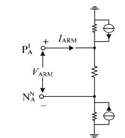  
(a)采用本文通用消去算法 时的桥臂等效电路

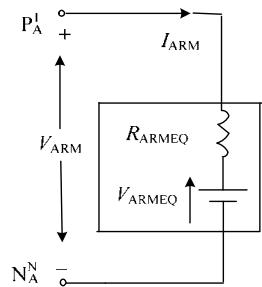  
(b)采用串联简化模型 时的桥臂等效电路   
图9 单端口 MMC 单个桥臂的等效电路  
Fig. 9 Equivalent circuits of single-port MMC arm

而对任意双端口子模块 MMC 进行建模时，本文提出的针对任意多类型MMC拓扑的建模算法对文献[22]的子模块互联过程进行了优化，使算法更加简化，其余建模过程与 2.1 节提到的过程一致，其最终的桥臂等效模型如图 10 所示。

上述桥臂等效电路用于与 EMT 解算器中的外

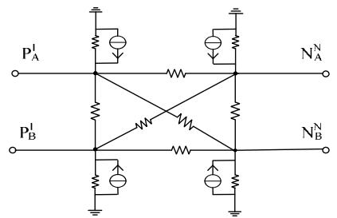  
图 10 双端口子模块 MMC 单个桥臂的等效电路  
Fig. 10 Equivalent circuit of two-port MMC arm

部电路互联，当求解得到当前步长的电路信息后，需要采用 2.1 节中方法对内部消去的节点信息进行精确反解。但由于多端口 MMC 桥臂内部节点的消去本质为相邻模块的分层迭代消去，因此其对并行计算的适用性较差，最多可以实现二分法的并行计算，下一层的消去必须依赖上一层消去的结果。

# 2.3 通用建模算法在不对称多端口子模块 MMC中的应用

目前已有的MMC的子模块拓扑结构按子模块外部端子数目的不同分为单端口(2 个外部端子)[1-5]、双端口(4 个外部端子)[9-11]2 种类型，和外部端子数目在 4 个以上的多端口子模块拓扑[23]。本文提出的多类型子模块MMC等效建模及通用实现方法能够适用全部 3 种情形。

对于子模块外部端子数为偶数的情况，如文献[23]所述，子模块的左右两侧端子结构对称，可以直接使用本文 2.1 节所述方法进行快速通用建模。如果子模块外部端子数为奇数，例如子模块左侧包含 2 个引出端子，右侧包含 3个引出端子，这种类型子模块在构造 MMC 桥臂时，需要对序号数为偶数的子模块镜像布置，以保证任意相邻子模块互联时端子数目一致。

具体而言，在对这类子模块构造的 MMC 进行等效建模时，输进程序的子模块拓扑需要人为定义为包含 2 个相邻子模块对接的拓扑，可以保证这个组合模块的两侧具有相同的端子数目，例如该模块可以为 2 端子(2-3-3-2)或为 3 端子(3-2-2-3)。后续建模过程可以参考本文第 2 章进行，除了每个步长中需要消去的模块内部节点数增多外，建模过程与对称多端口 MMC 基本相同。

而对于各种不同类型的子模块构成的MMC的闭锁过程，需要单独进行处理。在闭锁时，利用仿真软件模型库中的二极管元件来模拟搭建闭锁后桥臂等效电路，如文献[21]和[22]所述，开关器件只起到限定电流方向的作用。当正常运行时，开关器件不起作用，桥臂电路如图 9 所示。当换流阀闭锁时，如正文中文献[21]和[22]中提到的闭锁电路所示，二极管发挥限定电流流向的作用，使得闭锁后桥臂电流依据子模块拓扑按照特定的方向流动。但是对于每种不同类型的子模块只需要根据其拓扑结构处理一次，无需多次重复搭建。

# 3 仿真验证

# 3.1 仿真模型

在仿真精度测试中，为了节约详细模型的仿真

时间，本文采取了低电平代替高电平的方式用以验证模型精度，并且为了使系统级参数更贴近实际工程，本文设置直流侧电压为±200 kV。本文将在PSCAD/EMTDC 中分别搭建 11 电平双半桥 MMC-HVDC 以及 11 电平并联全桥 MMC-HVDC 的详细模型和等效模型。模型逆变站均采用定有功功率、定无功功率控制，整流站均采用定直流电压、定无功功率控制，这 2 种子模块 MMC系统的详细参数分别如表 1和 2 所示。在计算效率测试中，将分别搭建一系列电平数下的 MMC 模型，对等效模型和详细模型的仿真时间进行对比。

表 1 11 电平双端 D-HBSM MMC 系统参数  
Tab. 1 Parameters of 11-level D-HBSM MMC system   
表 2 11 电平双端 P-FBSM MMC 系统参数  

<table><tr><td></td><td>参数</td><td>数值</td></tr><tr><td rowspan="7">系统</td><td>交流电压有效值/kV</td><td>230</td></tr><tr><td>基波频率/Hz</td><td>50</td></tr><tr><td>变压器变比/kV</td><td>230/205</td></tr><tr><td>变压器额定容量/MVA</td><td>450</td></tr><tr><td>变压器漏抗/%</td><td>15</td></tr><tr><td>额定有功功率/MW</td><td>300</td></tr><tr><td>额定直流电压/kV</td><td>400</td></tr><tr><td rowspan="5">换流器</td><td>桥臂电抗/H</td><td>0.09</td></tr><tr><td>平波电抗/H</td><td>0.1</td></tr><tr><td>桥臂子模块数</td><td>10</td></tr><tr><td>子模块额定电压/kV</td><td>40</td></tr><tr><td>子模块电容/μF</td><td>600</td></tr></table>

Tab. 2 Parameters of 11-level P-FBSM MMC system   

<table><tr><td></td><td>参数</td><td>数值</td></tr><tr><td rowspan="7">系统</td><td>交流电压有效值/kV</td><td>230</td></tr><tr><td>变压器变比/kV</td><td>230/210</td></tr><tr><td>变压器额定容量/MVA</td><td>350</td></tr><tr><td>变压器漏抗/15%</td><td>15</td></tr><tr><td>额定有功功率/MW</td><td>300</td></tr><tr><td>额定直流电压/kV</td><td>400</td></tr><tr><td>线路长度/km</td><td>50</td></tr><tr><td rowspan="5">换流器</td><td>桥臂电抗/H</td><td>0.06</td></tr><tr><td>平波电抗/H</td><td>0.15</td></tr><tr><td>桥臂子模块数</td><td>10</td></tr><tr><td>子模块额定电压/kV</td><td>40</td></tr><tr><td>子模块电容/μF</td><td>600</td></tr></table>

# 3.2 仿真精度对比

本节中所有的仿真波形图纵坐标均为标幺值。

# 3.2.1 双半桥子模块 MMC

图 11(a)、11(b)、11(c)分别为稳态时整流侧 A相上桥臂电流、详细模型和等效模型的整流侧子模块电容电压。

由图 11，经计算可知稳态时 A 相上桥臂电流的最大相对误差为 3.33%。等效模型和详细模型的子模块电容电压纹波幅值是一致的，且二者的纹波脉络几乎保持一致，仿真精度很高，均压效果较好。

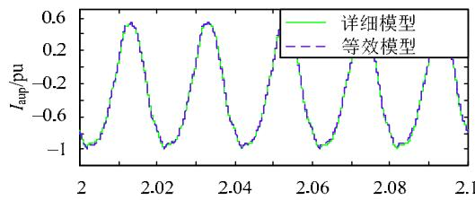

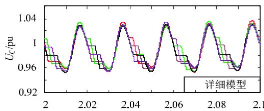  
(a)A相上桥臂电流  
(b)详细模型子模块电容电压

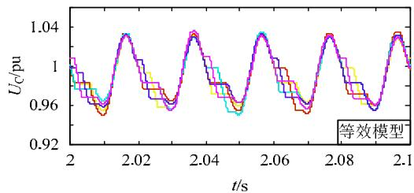  
(c)等效模型子模块电容电压   
图11 双半桥子模块MMC 整流侧稳态波形对比  
Fig. 11 Comparison of steady state waveforms of D-HBSM

# 3.2.2 并联全桥子模块 MMC

图 12(a)、12(b)、12(c)、12(d)分别为稳态时并联全桥子模块 MMC 整流侧 A 相上桥臂电压 $U _ { \mathrm { p a } }$ 、整流侧 A 相上桥臂单个 P-FBSM 电容电压 $U _ { \mathrm { C } } \cdot \mathrm {  ~ \Gamma ~ }$ 逆变侧 A 相交流电流 $I _ { \mathrm { s a } }$ 和整流侧 A 相上桥臂单个P-FBSM 电容电流 $I _ { \mathrm { C } }$ 。

由图 12 可知，在并联全桥 MMC 稳态运行期间详细模型与等效模型的桥臂电压 $U _ { \mathrm { p a } }$ 、电容电压$U _ { \mathrm { C } }$ 、交流电流 $I _ { \mathrm { s a } }$ 和电容电流 $I _ { \mathrm { C } }$ 的波形均重合得很好，仿真精度很高。

综上，采用本文提出的通用建模方法所搭建的单端口 MMC 和双端口 MMC 等效模型与各自对应的详细模型具备一致的仿真精度，从而有效地验证了本文提出的多类型MMC等效建模及通用实现方法的精确性。

# 3.3 CPU 时间对比

本节将对搭建的单桥臂含10、48、100和200个模块的单端口 MMC 以及单桥臂含 48、72、144、288 和 576 个模块的双端口 MMC 详细模型和等效模型的 CPU 用时分别进行对比。由于仅仅需要对比模型的仿真效率，因此在搭建 2种模型时仅仅搭建了不同电平数的单个桥臂的 2 种模型。仿真总时长为 1 s，仿真步长为 $2 0 \mu \mathrm { s } ^ { \circ }$ 图 13(a)、13(b)分别为

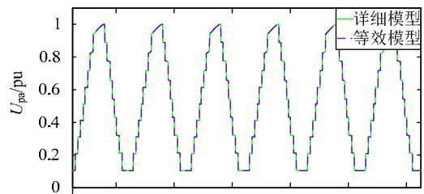

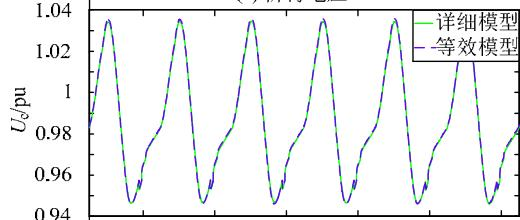  
(a)桥臂电压

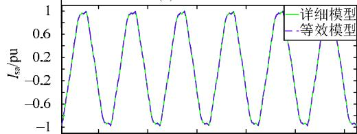  
(b)电容电压

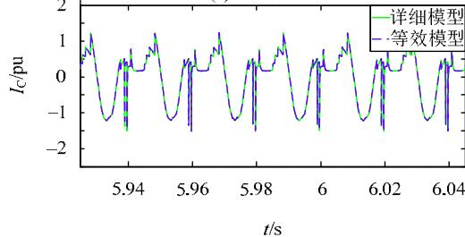  
(c)交流电流   
(d)电容电流   
图12 并联全桥子模块MMC 整流侧稳态波形对比

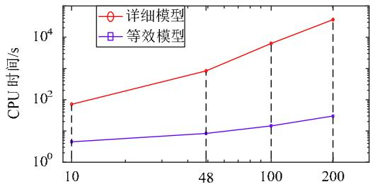  
Fig. 12 Comparison of steady state waveforms of P-FBSM   
(a)单端口MMC

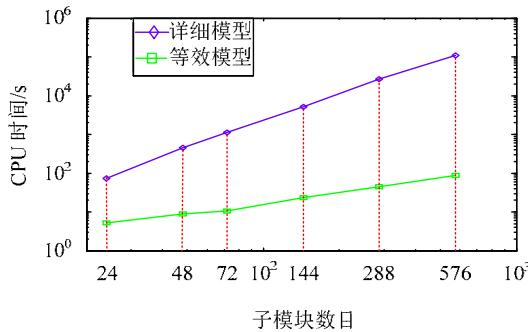  
(b)双端口MMC   
图 13 CPU 时间对比  
Fig. 13 Comparison of CPU times

双对数坐标系下，不同电平数单端口 MMC、双端口 MMC 详细模型和等效模型的仿真时间对比图。表3为双端口MMC详细模型和等效模型的仿真时间对比。表 4 为单端口MMC 详细模型和等效模型的仿真时间对比。

表 3 双端口 MMC 仿真时间对比  
Tab. 3 Simulation time comparison between detailed model and equivalent model of two-port MMC   
表4 单端口 MMC 仿真时间对比  

<table><tr><td>电平数</td><td>详细模型/s</td><td>等效模型/s</td><td>加速比</td></tr><tr><td>25</td><td>74.1</td><td>5.2</td><td>14.2</td></tr><tr><td>49</td><td>456.9</td><td>8.9</td><td>51.3</td></tr><tr><td>73</td><td>1125.1</td><td>10.6</td><td>106.1</td></tr><tr><td>145</td><td>5122.5</td><td>23.5</td><td>217.9</td></tr><tr><td>289</td><td>26722.8</td><td>45.2</td><td>591.2</td></tr><tr><td>577</td><td>110235.6</td><td>88.5</td><td>1245.6</td></tr></table>

Tab. 4 Simulation time comparison of single-port MMC   

<table><tr><td>电平数</td><td>详细模型/s</td><td>等效模型/s</td><td>加速比</td></tr><tr><td>11</td><td>71.3</td><td>4.5</td><td>15.8</td></tr><tr><td>49</td><td>8344</td><td>8.3</td><td>1005.3</td></tr><tr><td>101</td><td>63078</td><td>14.5</td><td>4350.2</td></tr><tr><td>201</td><td>364156</td><td>30.1</td><td>12098.2</td></tr></table>

由以上结果可知，不同电平数下 2种等效模型相比各自的详细模型都具有很高的加速比，并且电平数越高仿真加速效果越明显。这表明本文提出的通用建模及实现方法不仅具备很高的仿真精度，还能够大幅降低电磁暂态仿真用时，极大地提高仿真研究的效率。

# 4 结论

本文首先提出了任意新型换流器拓扑的快速自动识别，大幅简化了模型用户的编程工作量。同时，针对多类型 MMC 拓扑提出了一种 MMC 等效建模及通用实现方法，该方法对单端口和双端口子模块构成的 MMC 具有兼容性，能够在对外部等效的同时完整保留单个桥臂的内部电容电压和电流信息。所提出方法最大的创新在于实现了任意MMC 拓扑在建模算法和实现方法上的双通用。并且本文提出的算法可应用于实时仿真中，但用于多端口的算法对并行计算的适用性一般。

分别以双半桥子模块MMC(单端口MMC)和并联全桥子模块 MMC(双端口 MMC)为例，使用所提出通用建模和实现方法，搭建这 2种 MMC 拓扑的电磁暂态等效模型，仿真结果表明所提出方法具备很强的通用性，建模方法简单易用，并且所搭建模型兼具高仿真精度和加速比，非常适合于大规模柔性直流电网的仿真研究。

# 参考文献

[1] 徐政．柔性直流输电系统[M]．北京：机械工业出版社，2012：291-308．  
[2] 汤广福，庞辉，贺之渊．先进交直流输电技术在中国的发展与应用[J]．中国电机工程学报，2016，36(7)：1760-1771Tang Guangfu，Pang Hui，He Zhiyuan．R&D and application ofadvanced power transmission technology in China[J]．Proceedings ofthe CSEE，2016，36(7)：1760-1771(in Chinese)  
[3] 徐政，薛英林，张哲任．大容量架空线柔性直流输电关键技术及前景展望[J]．中国电机工程学报，2014，34(29)：5051-5062Xu Zheng，Xue Yinglin，Zhang Zheren．VSC-HVDC technologysuitable for bulk power overhead line transmission[J]．Proceedings ofthe CSEE，2014，34(29)：5051-5062(in Chinese)  
[4] Franquelo L G，Rodriguez J，Leon J I，et al．The age of multi-levelconverters arrives[J]．IEEE Industrial Electronics Magazine，2008，2(2)：28-39  
[5] 赵成勇，陈晓芳，曹春刚，等．模块化多电平换流器HVDC直流侧故障控制保护策略[J]．电力系统自动化，2011，35(23)：82-87Zhao Chengyong，Chen Xiaofang，Cao Chungang，et al．Control andprotection strategies for MMC-HVDC under DCfaults[J]．Automation of Electric Power Systems，2011，35(23)：82-87(in Chinese)  
[6] 黄强，邹贵彬，高磊，等．基于HB-MMC的直流电网直流线路保护技术研究综述[J]．电网技术，2018，42(9)：2830-2840Huang Qiang，Zou Guibin，Gao Lei，et al．Review on DC transmissionline protection technologies of HB-MMC based DC grids [J]．PowerSystem Technology，2018，42(9)：2830-2840(in Chinese)  
[7] 郭贤珊，周杨，梅念，等．张北柔直电网的构建与特性分析[J]．电网技术，2018，42(11)：3698-3707Guo Xianshan，Zhou Yang，Mei Nian，et al．Construction andcharacteristic analysis of Zhangbei flexible DC grid [J]．Power SystemTechnology，2018，42(11)：3698-3707(in Chinese)  
[8] 凌卫家，孙维真，张静，等．舟山多端柔性直流输电示范工程典型运行方式分析[J]．电网技术，2016，40(6)：1751-1758Ling Weijia，Sun Weizhen，Zhang Jing，et al．Analysis of typicaloperating modes of Zhoushan multi-terminal VSC-HVDC pilotproject [J]．Power System Technology，2016，40(6)：1751-1758(inChinese)．  
[9] Goetz S M，Peterchev A V，Weyh T．Modular multilevel converter with series and parallel module connectivity：topology and control [J]．IEEE Transactions on Power Electronics，2015，30(1)：203-215．   
[10] Goetz S M，Li Z，Liang X，et al．Control of modular multilevel converter with parallel connectivity application to battery systems[J]．IEEE Trans on Power Electron，2016，99：1-1   
[11] Gao C，Liu X，Liu J，et al．Multilevel converter with capacitor voltage actively balanced using reduced number of voltage sensors for high power applications[J]．IET Power Electron，2016，9(7)：1462-1473．   
[12] Gnanarathna U N，Gole A M，Jayasinghe R P．Efficient modeling of modular multilevel HVDC converters(MMC)on electromagnetic transient simulation programs[J] ． IEEE Transactions on Power Delivery，2011，26(1)：316-324   
[13] 许建中，赵成勇，Gole A M．模块化多电平换流器戴维南等效整体建模方法[J]．中国电机工程学报，2015，35(8)：1919-1929Xu Jianzhong，Zhao Chengyong，Gole A M．Research on the thévenin's equivalent based integral modelling method of the modularmultilevel converter[J]．Proceedings of the CSEE，2015，35(8)：1919-1929(in Chinese)

[14] 许建中，李承昱，熊岩，等．模块化多电平换流器高效建模方法研究综述[J]．中国电机工程学报，2015，35(13)：3381-3392Xu Jianzhong，Li Chengyu，Xiong Yan，et al．A review of efficientmodeling methods for modular multilevel converters[J]．Proceedingsof the CSEE，2015，35(13)：3381-3392(in Chinese)  
[15] Xu Jianzhong，Zhao Chengyong，Gole A M，et al．Enhanced high-speed electromagnetic transient simulation of MMC-MTDC grid [J]．Electrical Power and Energy Systems，2016，3：7-14   
[16] Xu Jianzhong，Zhao Chengyong，Liu Wenjing，et al．Acceleratedmodel of modular multilevel converters in PSCAD/EMTDC[J]．IEEETransactions on Power Delivery，2013，28(1)：129-136  
[17] Xu Jianzhong，Gole A M，Zhao Chengyong．The use of averagedvalue model of modular multilevel converter in DC gird[J]．IEEE Transactions on Power Delivery，2015，30(20)：519-528   
[18] Saad H，Mahseredjian S，Delarue J，et al．Modular multilevelconverter models for electromagnetic transients[J]．IEEE Transactionson Power Delivery，2014，29(3)：1481-1489  
[19] 周月宾，饶宏，许树楷，等．一种二极管箝位型 MMC 的高效等值建模方法[J]．中国电机工程学报，2016，36(7)：1925-1932zhou Yue bin，Rao Hong，Xu Shukai，et al．An equivalent efficientmodeling approach for diode clamp sub-module based MMC[J]．Proceedings of the CSEE，2016，36(7)：1925-1932(in Chinese)  
[20] Wang Xiang，Weixing Lin，Ting An，et al．Equivalent electromagnetic transient simulation model and fast recovery control of overhead VSC-HVDC based on SB-MMC[J]．IEEE Transactions on Power Delivery，2017，32(2)：778-788   
[21] 赵禹辰，徐义良，赵成勇，等．单端口子模块 MMC 电磁暂态通用等效建模方法[J]．中国电机工程学报，2018，38(16)：4658-4667Zhao Yuchen，Xu Yiliang，Zhao Chengyong，et al．Generalizedelectromagnetic transient(EMT)equivalent modeling of MMCs with

arbitrary single-port sub-module structures[J]．Proceedings of theCSEE，2018，38(16)：4658-4667(in Chinese)  
[22] 徐义良，赵成勇，赵禹辰，等．双端口子模块 MMC 电磁暂态通用等效建模方法[J]．中国电机工程学报，2018，38(20)：6079-6090Xu Yiliang，Zhao chengyong，Zhao Yuchen，et al．Generalizedelectromagnetic transient(EMT)equivalent modeling of MMCs witharbitrary two-port sub-module structures[J] ． Proceedings of theCSEE，2018，38(20)：6079-6090(in Chinese)  
[23] Goetz S M，Peterchev A V，Weyh T．Modular multilevel converter with series and parallel module connectivity：topology and control [J]．IEEE Transactions on Power Electronics，2015，30(1)：203-215

  
许建中

收稿日期：2018-08-28。

作者简介：

许建中(1987)，男，副教授，通信作者，研究方向为高压直流输电和直流电网技术，E-mail：xujianzhong@ncepu.edu.cn；

徐义良(1993)，男，硕士研究生，研究方向为柔性直流输电 MMC 电磁暂态建模，E-mail：xuyiliangdq1103@163.com；

赵禹辰(1993)，男，硕士研究生，研究方向为柔性直流输电 MMC 电磁暂态建模，E-mail：zhaoyuchen_1993@163.com；

赵成勇(1964)，男，博士，教授，博士生导师，研究方向为柔性直流输电、高压直流输电，E-mail：chengyongzhao@ncepu.edu.cn。

（责任编辑 王晔）