# Electromechanical Transient Modeling of the Low-Frequency AC System With Modular Multilevel Matrix Converter Stations

Zheyang Yu , Zheren Zhang , Member, IEEE, and Zheng Xu , Fellow, IEEE

Abstract—This paper studies the electromechanical transient modeling of a low-frequency AC (LFAC) system with modular multilevel matrix converter (M3C) stations. Firstly, the mathematical model of the M3C and its equivalent circuits are established. Then, an iterative power flow calculation algorithm for AC systems integrated with the M3C-LFAC system is developed. The dynamic model of the M3C for electromechanical transient simulation is studied and implemented in PSS/E. Based on a test system consisting of two asynchronous AC systems with an embedded M3C-LFAC system, comparisons between the electromechanical transient simulation results from PSS/E and the electromagnetic transient simulation results from PSCAD are conducted. The results from PSS/E and PSCAD coincide with each other well, and the validity of the established electromechanical transient model is proved. Lastly, a stability study of a modified New England 39-bus system with an embedded M3C-LFAC system is executed, and the characteristics of the M3C-LFAC system are presented.

Index Terms—Electromechanical transient modeling, power flow calculation, power system stability, modular multilevel matrix converter, low-frequency AC.

# I. INTRODUCTION

N THE modern electrical power system, high voltage AC I (HVAC) and high voltage DC (HVDC) are two major options for power transmission. Due to the convenience and the economic efficiency in system extension, the backbone networks of the regional power systems are mostly formed by HVAC. In the history of power transmission, many frequencies were used. However, keeping synchronous is required for all electric equipment connected in one AC system. Since the rated frequency is an important parameter in electric devices design, a unified frequency is convenient both for system operator and equipment manufacturer. Up till now, most AC systems are operated in 50 Hz or 60 Hz. However, the HVAC transmission capacity is limited by the angle stability or the capacitive current for overhead line transmission or submarine cable transmission [1]. The maximal transmission power is limited by the angle

Manuscript received 16 June 2022; revised 17 October 2022 and 7 January 2023; accepted 9 January 2023. Date of publication 13 January 2023; date of current version 26 December 2023. Paper no. TPWRS-00884-2022. (Corresponding author: Zheren Zhang.)

The authors are with the College of Electrical Engineering, Zhejiang University, Hangzhou 310027, China (e-mail: 906267954@qq.com; 3071001296- zhang@zju.edu.cn; xuzheng007@zju.edu.cn).

Color versions of one or more figures in this article are available at https://doi.org/10.1109/TPWRS.2023.3236819.

Digital Object Identifier 10.1109/TPWRS.2023.3236819

stability rather than the thermal stability of the transmission line, which influences the cost of the HVAC scheme for long-distance power transmission. The above problems can be avoided if the HVDC scheme is adopted, and the maximal transmission power of the HVDC transmission system is determined by the thermal stability of the transmission line [2]. Although the HVDC converter stations are costly, the HVDC scheme has economic benefits in long-distance power transmission. However, for multi-terminal HVDC systems or HVDC grids, the DC circuit breakers are needed, which are very costly and not technically mature.

The LFAC scheme is a compromise between the HVDC scheme and the conventional HVAC scheme. Compared to the conventional HVAC scheme, the transmission capacity and angle stability can be improved in the LFAC scheme due to the lower operation frequency [1], [3]. Compared to the HVDC scheme, the LFAC scheme has the advantages such as the convenience for multi-terminal connection, the low-cost and high-maturity AC circuit breakers. Thus, the LFAC scheme is a competitive scheme in some practical engineering scenarios, especially in long-distance bulk power transmission and offshore wind farm integration [4].

It should be noted that all electric equipment operating in LFAC systems need to be redesigned according to the operating frequency [5]. In addition, frequency converters are needed for connecting AC systems of different frequencies. In the early LFAC scheme, the operation frequency is selected as 1/3 of the power frequency (16.7/20 Hz) for the employment of cycloconverter as the AC/AC converter [3]. However, the optimal operating frequency for the LFAC system is not always 1/3 of the power frequency [6], [7]. Thus, AC/AC converters that can realize flexible frequency control of the LFAC system are required.

Because of the operation flexibility and the design scalability, the modular multilevel cascaded converter (MMCC) has been wildly used in power systems [8]. Classified from the circuit configuration, the single-star bridges cells (SSBC), the double-star bridge cells (DSBC) and the triple-star bridge cells (TSBC) can realize a three-port, five-port and nine-port circuits, respectively [9]. In the power grid application, STATCOM, back to back HVDC (BTB HVDC) and M3C can be realized by SSBC, DSBC and TSBC correspondingly. Power grid applications such as STATCOM and BTB-HVDC have been employed extensively [10], [11], [12], [13], [14].

Up till now, the application of the M3C in the transmission grid is limited. The M3C can operate as a frequency converter which realizes a direct AC/AC conversion. The AC systems operating in different frequencies can be interconnected by the M3C. Based on the fully controllable devices, the M3C can realize voltage support control and active power control, and the M3C is able to support the system frequency when operating in the grid-forming mode. Thus, the M3C is a competitive choice for the LFAC system. In China, the 35 kV Taizhou offshore wind power integration demonstrative M3C-LFAC project has just been commissioned, and the 220 kV/300 MW Hangzhou demonstrative M3C-LFAC project is under construction [15]. It can be foreseen that the M3C-LFAC will play an important role in the future power grid.

The operation characteristics and the control strategy of the M3C itself have been widely discussed in [16], [17], [18], [19], [20], [21], [22], most of which are based on electromagnetic transient simulation. The researches on the converter topology, the control scheme and the fault ride-through capability have shown the application possibility of the M3C-LFAC in power systems. The aim of the electromagnetic transient simulation is to reproduce the precise time-domain waveform of state variables at any location in the system [23]. The power system is modeled at the circuit level in phase domain, and the switchable elements such as IGBTs and diodes in each submodule of the M3C are treated as a two-state resistive device [24]. The nodal analysis method is adopted for the electromagnetic transient simulation [25]. The nodal admittance matrix which changes with time will increase the simulation time greatly.

In the electromechanical transient simulation, the electrical quantities of the AC network are represented by the positive sequence fundamental-frequency phasors. The interconnecting transmission network is described as algebraic network equation [26]. The algebraic equation will not change if no fault and manipulation occur on the power system, and the time step is chosen as a large value (typically 10 ms) irrespective of electromagnetic response. Thus, fast simulation speed can be achieved in the electromechanical transient simulation.

In the planning stage of practical projects, the steady state and transient stability analysis are necessary for the feasibility studies [8], [27], [28], [29], [30]. These studies can be completed by commercial electromechanical simulation software such as PSS/E, PSLF and PowerWorld. These commercial tools have extensive simulation models such as flexible AC transmission systems (FACTS) and HVDC systems. Normally, the variable impedance model is used to represent the FACTS devices such as the static VAR compensator (SVC) and the thyristor controlled series compensator (TCSC); a simplified steady-state model is used to simulate the HVDC converters with thyristors [31]; some injecting current models are used to simulate the voltage source converters (VSC) [32], [33]. With the user defined model function, the users can define the simulation model according to their purposes.

However, up till now, there is no standard M3C model in commercial electromechanical transient simulation software as far as the authors know. Based on the user defined model function in PSS/E, this paper will develop an electromechanical simulation model for the M3C-LFAC system.

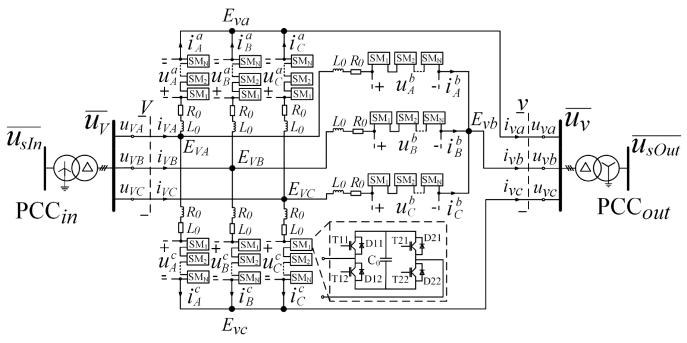  
Fig. 1. Structure of the M3C system.

The main contributions of the paper are: (1) the power flow calculation method for the power frequency AC system with embedded M3C-LFAC systems; (2) the dynamic model of the M3C suitable for electromechanical transient simulation. The proposed power flow calculation method can be applied for general power frequency AC/LFAC hybrid systems; and the established M3C electromechanical transient model can be applied to any LFAC systems with different network topologies and different M3C operation modes. The electromechanical dynamic model of M3C with virtual synchronous generator (VSG) control and its simulation results in decentralized control is useful for the system study of power electronic converters working as VSG.

This paper is organized as follows. In Section II, the basic theory about the M3C is described. In Section III, a power flow calculation method for hybrid systems with embedded M3C-LFAC systems is presented. Section IV establishes the M3C electromechanical transient model. In Section V, the validity of the proposed model is checked by the comparison with the electromagnetic transient results in PSCAD. In Section VI a stability study of a modified New England 39-bus system is implemented. Conclusions are drawn in Section VII.

# II. BASIC THEORY

# A. Topology of M3C

The structure of the M3C is shown in Fig. 1, where two AC systems are connected to an M3C. V represents the M3C input side; $u v M$ and iV M (M = A, B, C) are the M3C valve side voltage and current on the input side, respectively. Likely, v represents the M3C output side; $u _ { v m }$ and $i _ { v m } \ ( m = a , b , c )$ are the M3C valve side voltage and current on the output side. The converter transformer is used to connect the point of common coupling (PCC, also the M3C AC bus) to the M3C valve side. The M3C consists of 9 arms, each of which has an inductance $L _ { 0 } ,$ an equivalent resistance $R _ { 0 }$ and N cascaded full-bridge submodules (SMs).

For a clear presentation, subscripts ABC represent the input side of the M3C, and superscripts abc represent the output side of the M3C. $\alpha \beta 0$ and dq0 represent the variables in the $\alpha \beta 0$ and the $d q O$ coordinate frame. $\boldsymbol { u } _ { j } ^ { r }$ and $i _ { j } ^ { r } ( j = A , B , C ; r = a , b$ , c) are the voltage and the current of cascaded SMs in the arm, respectively.

Based on the Kirchhoff’s voltage law (KVL), the following equations can be derived from the arm circuits of the M3C.

Matrix form is adopted for simplicity:

$$
\begin{array}{l} L _ {0} \frac {d}{d t} \left[ \begin{array}{c c c} i _ {A} ^ {a} & i _ {A} ^ {b} & i _ {A} ^ {c} \\ i _ {B} ^ {a} & i _ {B} ^ {b} & i _ {B} ^ {c} \\ i _ {C} ^ {a} & i _ {C} ^ {b} & i _ {C} ^ {c} \end{array} \right] + R _ {0} \left[ \begin{array}{c c c} i _ {A} ^ {a} & i _ {A} ^ {b} & i _ {A} ^ {c} \\ i _ {B} ^ {a} & i _ {B} ^ {b} & i _ {B} ^ {c c c} \\ i _ {C} ^ {a} & i _ {C} ^ {b} & i _ {C} ^ {c c c} \end{array} \right] + \left[ \begin{array}{c c c} u _ {A} ^ {a} & u _ {A} ^ {b} & u _ {A} ^ {c c c} \\ u _ {B} ^ {a} & u _ {B} ^ {b} & u _ {B} ^ {c c c} \\ u _ {C} ^ {a} & u _ {C} ^ {b} & u _ {C} ^ {c c c} \end{array} \right] \\ = \left[ \begin{array}{l l l} u _ {V A} & u _ {V A} & u _ {V A} \\ u _ {V B} & u _ {V B} & u _ {V B} \\ u _ {V C} & u _ {V C} & u _ {V C} \end{array} \right] - \left[ \begin{array}{l l l} u _ {v a} & u _ {v b} & u _ {v c} \\ u _ {v a} & u _ {v b} & u _ {v c} \\ u _ {v a} & u _ {v b} & u _ {v c} \end{array} \right] + \left[ \begin{array}{l l l} u _ {o / o} & u _ {o / o} & u _ {o / o} \\ u _ {o / o} & u _ {o / o} & u _ {o / o} \\ u _ {o / o} & u _ {o / o} & u _ {o / o} \end{array} \right]. \tag {1} \\ \end{array}
$$

where $u _ { o / o }$ is the voltage between the neural point of the converter transformer valve side on the input side and on the output side.

A so-called double αβ0 transformation [34], [35] is used to simplify and decouple (1), which is given by (2):

$$
T _ {D - \alpha \beta} (M _ {\mathbf {3} \times \mathbf {3}}) = T _ {a b c - \alpha \beta 0} (M _ {\mathbf {3} \times \mathbf {3}}) T _ {a b c - \alpha \beta 0} ^ {t} \quad (2)
$$

where $T _ { a b c - \alpha \beta 0 }$ is the transformation matrix from the abc reference frame to the $\alpha \beta 0$ reference frame, and is defined as in $( 3 ) ; T _ { a b c - \alpha \beta 0 } ^ { t }$ is the transpose of $T _ { a b c - \alpha \beta 0 }$ .

$$
T _ {a b c - \alpha \beta 0} = \sqrt {\frac {2}{3}} \left[ \begin{array}{c c c} 1 & - \frac {1}{2} & - \frac {1}{2} \\ 0 & \frac {\sqrt {3}}{2} & - \frac {\sqrt {3}}{2} \\ \frac {1}{\sqrt {2}} & \frac {1}{\sqrt {2}} & \frac {1}{\sqrt {2}} \end{array} \right] \tag {3}
$$

By applying double $\alpha \beta 0$ transformation to each $3 \times 3$ matrix in (1), (4) is obtained and it can be divided into four parts: the input side equations, the output side equations, the circulating current equations and the zero sequence equations. The circulating current only flows among the 9 arms in the M3C; the zero sequence components in the M3C are always isolated by the converter transformer. Therefore, the circulating current equations and the zero sequence equations do not influence the interaction between the connected AC systems and the M3C, which are omitted in the M3C electromechanical transient model. The concerned equations in the M3C electromechanical transient model can be written as (5).

$$
\begin{array}{l} L _ {0} \frac {d}{d t} \left[ \begin{array}{l l l} i _ {\alpha} ^ {\alpha} & i _ {\alpha} ^ {\beta} & i _ {\alpha} ^ {0} \\ i _ {\beta} ^ {\alpha} & i _ {\beta} ^ {\beta} & i _ {\beta} ^ {0} \\ i _ {0} ^ {\alpha} & i _ {0} ^ {\beta} & i _ {0} ^ {0} \end{array} \right] + R _ {0} \left[ \begin{array}{l l l} i _ {\alpha} ^ {\alpha} & i _ {\alpha} ^ {\beta} & i _ {\alpha} ^ {0} \\ i _ {\beta} ^ {\alpha} & i _ {\beta} ^ {\beta} & i _ {\beta} ^ {0} \\ i _ {0} ^ {\alpha} & i _ {0} ^ {\beta} & i _ {0} ^ {- 1} \end{array} \right] + \left[ \begin{array}{l l l} u _ {\alpha} ^ {\alpha} & u _ {\alpha} ^ {\beta} & u _ {\alpha} ^ {0} \\ u _ {\beta} ^ {\alpha} & u _ {\beta} ^ {\beta} & u _ {\beta} ^ {0} \\ u _ {0} ^ {\alpha} & u _ {0} ^ {\beta} & u _ {0} ^ {0} \end{array} \right] \\ = \sqrt {3} \left[ \begin{array}{l l l} 0 & 0 & u _ {V \alpha} \\ 0 & 0 & u _ {V \beta} \\ 0 & 0 & u _ {V 0} \end{array} \right] - \sqrt {3} \left[ \begin{array}{c c c} 0 & 0 & 0 \\ 0 & 0 & 0 \\ u _ {v \alpha} & u _ {v \beta} & u _ {v 0} \end{array} \right] + 3 \left[ \begin{array}{l l l} 0 & 0 & 0 \\ 0 & 0 & 0 \\ 0 & 0 & u _ {o t o} \end{array} \right]. \tag {4} \\ \end{array}
$$

$$
\begin{array}{l} L _ {0} \frac {d}{d t} \left[ \begin{array}{c c} i _ {\alpha} ^ {0} & i _ {0} ^ {\alpha} \\ i _ {\beta} ^ {0} & i _ {0} ^ {\beta} \end{array} \right] + R _ {0} \left[ \begin{array}{c c} i _ {\alpha} ^ {0} & i _ {0} ^ {\alpha} \\ i _ {\beta} ^ {0} & i _ {0} ^ {\beta} \end{array} \right] + \left[ \begin{array}{c c} u _ {\alpha} ^ {0} & u _ {0} ^ {\alpha} \\ u _ {\beta} ^ {0} & u _ {0} ^ {\beta} \end{array} \right] \\ = \sqrt {3} \left[ \begin{array}{l l} u _ {V \alpha} & 0 \\ u _ {V \beta} & 0 \end{array} \right] - \sqrt {3} \left[ \begin{array}{l l} 0 & u _ {v \alpha} \\ 0 & u _ {v \beta} \end{array} \right] \tag {5} \\ \end{array}
$$

# B. Input Side of M3C

In the electromechanical transient simulation, the voltage and the current of the electrical network are expressed as positive sequence phasors. In corresponding with the network calculation, the interaction between the M3C and the electrical network

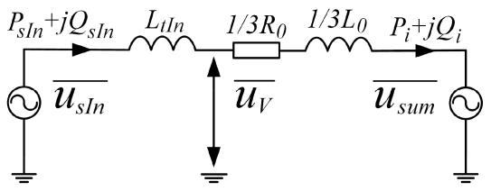  
Fig. 2. M3C AC side equivalent circuit on input side.

needs to be described under the form of the positive sequence phasors.

For the input side of the M3C, we can obtain (6) based on the relationship between the valve side current and arm current of the M3C in the $\alpha \beta 0$ reference frame:

$$
\left\{ \begin{array}{l} i _ {\alpha} ^ {0} = \frac {1}{\sqrt {3}} \left(i _ {\alpha} ^ {a} + i _ {\alpha} ^ {b} + i _ {\alpha} ^ {c}\right) = \frac {i _ {V _ {\alpha}}}{\sqrt {3}} \\ i _ {\beta} ^ {0} = \frac {1}{\sqrt {3}} \left(i _ {\beta} ^ {a} + i _ {\beta} ^ {b} + i _ {\beta} ^ {c}\right) = \frac {i _ {V _ {\beta}}}{\sqrt {3}} \end{array} \right. \tag {6}
$$

where $\begin{array} { r } { i _ { \alpha } ^ { r } = \sqrt { \frac { 2 } { 3 } } \ ( i _ { A } ^ { r } - \frac { 1 } { 2 } i _ { B } ^ { r } - \frac { 1 } { 2 } i _ { C } ^ { r } ) } \end{array}$ and $\begin{array} { r } { i _ { \beta } ^ { r } = \frac { \sqrt { 2 } } { 2 } \left( i _ { B } ^ { r } - i _ { C } ^ { r } \right) } \end{array}$ $( r = a , b , c )$ .

Therefore, substituting (6) into (5), the M3C input side equations can be rewritten as:

$$
\left(L _ {0} \frac {d}{d t} + R _ {0}\right) \left[ \begin{array}{l} i _ {V \alpha} \\ i _ {V \beta} \end{array} \right] + \sqrt {3} \left[ \begin{array}{l} u _ {\alpha} ^ {0} \\ u _ {\beta} ^ {0} \end{array} \right] = 3 \left[ \begin{array}{l} u _ {V \alpha} \\ u _ {V \beta} \end{array} \right] \tag {7}
$$

Considering the converter transformer, the relationship between the M3C valve side voltage and the PCC voltage on the input side can be derived as (8) in the $\alpha \beta 0$ reference frame:

$$
L _ {t I n} \frac {d}{d t} \left[ \begin{array}{l} i _ {V \alpha} \\ i _ {V \beta} \end{array} \right] + \left[ \begin{array}{l} u _ {V \alpha} \\ u _ {V \beta} \end{array} \right] = \left[ \begin{array}{l} u _ {s I n \alpha} \\ u _ {s I n \beta} \end{array} \right] \tag {8}
$$

where $L _ { t I n }$ is the leakage reactance of the converter transformer on the input side.

Therefore, the M3C and its connected AC system on the input side can be described as (9):

$$
\left[ \left(L _ {0} + 3 L _ {t I n}\right) \frac {d}{d t} + R _ {0} \right] \left[ \begin{array}{l} i _ {V \alpha} \\ i _ {V \beta} \end{array} \right] + \sqrt {3} \left[ \begin{array}{l} u _ {\alpha} ^ {0} \\ u _ {\beta} ^ {0} \end{array} \right] = 3 \left[ \begin{array}{l} u _ {s I n \alpha} \\ u _ {s I n \beta} \end{array} \right] \tag {9}
$$

Define the M3C arm common mode voltage on the input side:

$$
\left[ \begin{array}{l} u _ {s u m A} \\ u _ {s u m B} \\ u _ {s u m C} \end{array} \right] = \frac {1}{3} \left[ \begin{array}{l} u _ {A} ^ {a} + u _ {A} ^ {b} + u _ {A} ^ {c} \\ u _ {B} ^ {a} + u _ {B} ^ {b} + u _ {B} ^ {c} \\ u _ {C} ^ {a} + u _ {C} ^ {b} + u _ {C} ^ {c} \end{array} \right] \tag {10}
$$

Then,

$$
\left[ \begin{array}{l} u _ {s u m \alpha} \\ u _ {s u m \beta} \end{array} \right] = T _ {a b c - \alpha \beta} \left[ \begin{array}{l} u _ {s u m A} \\ u _ {s u m B} \\ u _ {s u m C} \end{array} \right] = = \frac {1}{\sqrt {3}} \left[ \begin{array}{l} u _ {\alpha} ^ {0} \\ u _ {\beta} ^ {0} \end{array} \right] \tag {11}
$$

where $\pmb { T } _ { a b c - \alpha \beta }$ is the first two rows of $T _ { a b c - \alpha \beta 0 }$

Substituting (11) in (9) gives (12):

$$
\left[ \left(L _ {t I n} + \frac {L _ {0}}{3}\right) \frac {d}{d t} + \frac {R _ {0}}{3} \right] \left[ \begin{array}{l} i _ {V \alpha} \\ i _ {V \beta} \end{array} \right] + \left[ \begin{array}{l} u _ {s u m \alpha} \\ u _ {s u m \beta} \end{array} \right] = \left[ \begin{array}{l} u _ {s I n \alpha} \\ u _ {s I n \beta} \end{array} \right] \tag {12}
$$

According to (12), the M3C AC side equivalent circuit on the input side can be derived as Fig. 2. In Fig. 2, $\overline { { u _ { s I n } } }$ is the PCC voltage of the M3C input side; $\overline { { u _ { s u m } } }$ is the synthetic voltage

defined by (10); $P _ { s I n }$ and $Q _ { s I n }$ are the injecting power from the AC system; $P _ { i }$ and $Q _ { i }$ are the injecting power of the M3C.

# C. Output Side of M3C

Similar to the input side, (13) can be obtained based on the relationship between the valve side current and arm current of the M3C output side in the $\alpha \beta 0$ reference frame:

$$
\left\{ \begin{array}{l} i _ {0} ^ {\alpha} = \frac {1}{\sqrt {3}} \left(i _ {A} ^ {\alpha} + i _ {B} ^ {\alpha} + i _ {C} ^ {\alpha}\right) = \frac {i _ {v \alpha}}{\sqrt {3}} \\ i _ {0} ^ {\beta} = \frac {1}{\sqrt {3}} \left(i _ {A} ^ {\beta} + i _ {B} ^ {\beta} + i _ {C} ^ {\beta}\right) = \frac {i _ {v \beta}}{\sqrt {3}} \end{array} \right. \tag {13}
$$

where $\begin{array} { r l } { i _ { j } ^ { \alpha } = \sqrt { \frac { 2 } { 3 } } } & { { } \big ( i _ { j } ^ { a } - \frac { 1 } { 2 } i _ { j } ^ { b } - \frac { 1 } { 2 } i _ { j } ^ { c } \big ) } \end{array}$ and $\begin{array} { r } { i _ { j } ^ { \beta } = \frac { \sqrt { 2 } } { 2 } ( i _ { j } ^ { b } - i _ { j } ^ { c } ) } \end{array}$ , $( j = A , B , C )$ .

Substituting (13) into (5), the M3C output side equations can be rewritten as:

$$
\left(L _ {0} \frac {d}{d t} + R _ {0}\right) \left[ \begin{array}{l} i _ {v \alpha} \\ i _ {v \beta} \end{array} \right] + \sqrt {3} \left[ \begin{array}{l} u _ {0} ^ {\alpha} \\ u _ {0} ^ {\beta} \end{array} \right] = - 3 \left[ \begin{array}{l} u _ {v \alpha} \\ u _ {v \beta} \end{array} \right] \tag {14}
$$

The relationship between the M3C valve side voltage and the PCC voltage on the output side can be derived as (15) in the $\alpha \beta 0$ reference frame:

$$
L _ {t O u t} \frac {d}{d t} \left[ \begin{array}{l} i _ {v \alpha} \\ i _ {v \beta} \end{array} \right] + \left[ \begin{array}{l} u _ {s O u t \alpha} \\ u _ {s O u t \beta} \end{array} \right] = \left[ \begin{array}{l} u _ {v \alpha} \\ u _ {v \beta} \end{array} \right] \tag {15}
$$

where $L _ { t O u t }$ is the leakage reactance of the converter transformer on the output side.

Therefore, the M3C and its connected AC system on the output side can be described as (16):

$$
\left[ \left(L _ {0} + 3 L _ {t O u t}\right) \frac {d}{d t} + R _ {0} \right] \left[ \begin{array}{l} i _ {v \alpha} \\ i _ {v \beta} \end{array} \right] + \sqrt {3} \left[ \begin{array}{l} u _ {0} ^ {\alpha} \\ u _ {0} ^ {\beta} \end{array} \right] = - 3 \left[ \begin{array}{l} u _ {s O u t \alpha} \\ u _ {s O u t \beta} \end{array} \right] \tag {16}
$$

Similarly, define the M3C arm common mode voltage on the output side:

$$
\left[ \begin{array}{l} u _ {c o m a} \\ u _ {c o m b} \\ u _ {c o m c} \end{array} \right] = \frac {1}{3} \left[ \begin{array}{l} u _ {A} ^ {a} + u _ {B} ^ {a} + u _ {C} ^ {a} \\ u _ {A} ^ {b} + u _ {B} ^ {b} + u _ {C} ^ {b} \\ u _ {A} ^ {c} + u _ {B} ^ {c} + u _ {C} ^ {c} \end{array} \right] \tag {17}
$$

Then,

$$
\left[ \begin{array}{l} u _ {c o m \alpha} \\ u _ {c o m \beta} \end{array} \right] = \boldsymbol {T} _ {a b c - \alpha \beta} \left[ \begin{array}{l} u _ {c o m a} \\ u _ {c o m b} \\ u _ {c o m c} \end{array} \right] = \frac {1}{\sqrt {3}} \left[ \begin{array}{l} u _ {0} ^ {\alpha} \\ u _ {0} ^ {\beta} \end{array} \right] \tag {18}
$$

Substituting (18) in (16) gives the equations describing the M3C and its connected AC system on the output side:

$$
- \left[ \begin{array}{l} u _ {c o m \alpha} \\ u _ {c o m \beta} \end{array} \right] = \left[ \begin{array}{l} u _ {s O u t \alpha} \\ u _ {s O u t \beta} \end{array} \right] + \left[ \left(L _ {t O u t} + \frac {L _ {0}}{3}\right) \frac {d}{d t} + \frac {R _ {0}}{3} \right] \left[ \begin{array}{l} i _ {v \alpha} \\ i _ {v \beta} \end{array} \right] \tag {19}
$$

The AC side steady-state equivalent circuit of the M3C output side is shown as Fig. 3. In Fig. 3, $\overline { { u _ { s O u t } } }$ is the voltage of the PCC point of the M3C output side; $\overline { { u _ { c o m } } }$ is the synthetic voltage defined by (17); $P _ { s O u t }$ and $Q _ { s O u t }$ are the injecting power to the AC system; $P _ { o }$ and $Q _ { o }$ are the output power of the M3C.

# D. Equivalent Resistance of M3C

In the electromagnetic transient simulation, the switch in the submodule is modeled as a two-state resistor whose loss is

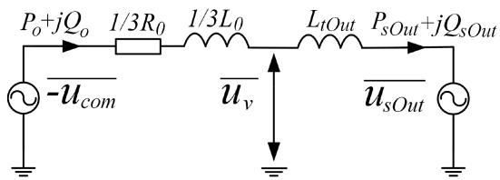  
Fig. 3. M3C AC side equivalent circuit on output side.

calculable. The on-state resistance is small and accounts for the conduction losses; the off-state resistance is large enough and can be neglected in power loss calculation. The conduction losses of the IGBTs and diodes occupy a major part of the total valve losses. The full-bridge submodule is selected to form the arm of the M3C. For the full-bridge submodule, two semiconductors are conducted in the current path for each working state. Thus, the conduction loss of M3C can be calculated by the conduction energy loss during a fundamental period as (20):

$$
\begin{array}{l} P_{loss} = \frac{1}{T}\sum_{\substack{M = A,B,C\\ m = a,b,c}}\int_{0}^{T}\frac{1}{3} (\sqrt{2} I_{VM}\cos (\omega_{i}t + \varphi_{iM}) \\ + \sqrt {2} I _ {v m} \cos (\omega_ {o} t + \varphi_ {o m})) ^ {2} 2 R _ {o n} N d t \\ = 6 \left(I _ {V M} ^ {2} + I _ {v m} ^ {2}\right) R _ {o n} N \tag {20} \\ \end{array}
$$

where $\omega _ { i }$ and $\omega _ { o }$ are the angular frequency of the input and output side system, $\varphi _ { i M }$ and $\varphi _ { o m }$ are the phase angles of the input and output side system. $R _ { \mathrm { o n } }$ is the on-state resistance of the IGBT and fast recovery diode. N is the number of submodules in each arm of the M3C. T is the lowest common multiple of the period of the input system and the output system.

The per-unit value of the equivalent resistance $R _ { 0 } ^ { * }$ can be calculated in (21):

$$
R _ {0} ^ {*} = 2 \sqrt {3} \frac {R _ {\mathrm {o n}} N}{Z _ {a c , b a s e}} \tag {21}
$$

# E. Equivalent Capacitance of M3C

The SM capacitors of the M3C are used to generate the arm voltages and serve as the energy exchange medium between the input side and the output side of the M3C. Similar to the electromechanical transient model of the MMC, an equivalent capacitor is used to represent all SM capacitors in 9 arms.

Thanks to the capacitor voltage balancing control, the capacitor voltages of all the SMs in the M3C are almost same (denoted as $U _ { S M } )$ . The voltage of the equivalent capacitor is select as $U _ { S M }$ . Therefore, the equivalent capacitor can be calculated based on the principle that the energy stored in the equivalent capacitor equals the energy stored in all SM capacitors in the M3C:

$$
9 N \left(\frac {1}{2} C _ {S M} U _ {S M} ^ {2}\right) = \frac {1}{2} C _ {e q} U _ {S M} ^ {2} \tag {22}
$$

$$
C _ {e q} = 9 N C _ {S M} \tag {23}
$$

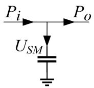  
Fig. 4. Illustration of energy exchange function of equivalent capacitor.

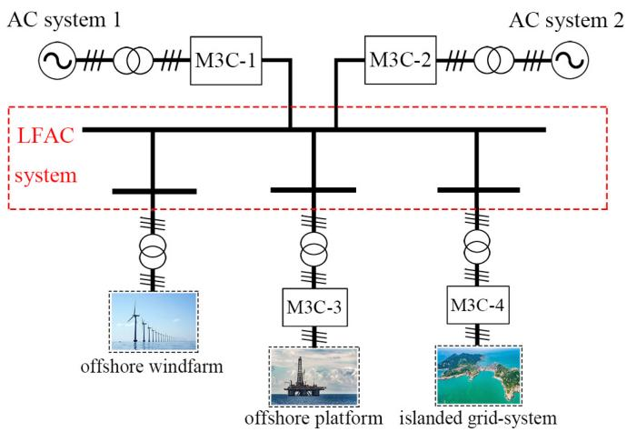  
Fig. 5. Structure of the M3C low-frequency transmission system.

The relationship among the input side, the output side and the equivalent capacitor of the M3C in the energy conservation perspective can be plotted as Fig. 4.

# III. STEADY-STATE CALCULATION

Steady-state analysis is necessary for the electromechanical transient simulation, because the initial operating point of the dynamic model is calculated by the steady-state analysis. In other words, the steady-state analysis is the precondition for the dynamic analysis. Normally, the steady-state analysis is accomplished by power flow calculation. In this section, the structure of the M3C-LFAC system and the operation modes of the M3C are discussed first; the power flow calculation method of the AC system with embedded M3C-LFAC systems is then proposed.

A typical structure of the M3C-LFAC system is shown in Fig. 5, where two power frequency AC systems are interconnected by the M3C-LFAC system. M3C-1 and M3C-2 connect the LFAC system with AC system 1 and AC system 2. M3C-3 connects the LFAC to an offshore platform and M3C-4 connects LFAC system to an island grid. A low-frequency offshore windfarm integrates into the LFAC system directly through an AC transformer.

# A. Operation Modes of M3C

As described in Section II, the mathematical model of an M3C is similar to the conventional back-to-back MMC. The M3C can connect to an active system by operating in the grid following mode. With the grid following mode, the M3C can realize decoupled active power control and reactive power control. There are two possible control targets in the active power control: the active

power at PCC or the average SM capacitor voltage. Similarly, there are also two possible control targets in the reactive power control: the reactive power at PCC or the voltage magnitude at PCC. The M3C can also connect to a passive system by operating in the grid forming mode. There are two possible control targets in the grid forming mode: one is called U-f control where the voltage magnitude and the frequency at PCC are controlled by M3C; the other is called virtual synchronous generator (VSG) control where the synchronization mechanism of the synchronous machine is imitated.

When integrated into the power system, the types of the M3C PCC buses have to be determined in steady-state analysis. PQ, PV and slack buses are used in power flow calculation. For the grid following mode, PQ and PV buses are selected for the PCC buses according to their reactive power control targets. Although the injecting active power of the constant SM capacitor voltage control side is not known, it can be calculated from the other side of the M3C based on the energy balance relationship (24):

$$
P _ {s O u t} = P _ {s I n} - P _ {l o s s} \tag {24}
$$

Defining the power loss coefficient $a _ { i }$ as:

$$
a _ {i} = \frac {P _ {\text {l o s s}}}{P _ {s I n}} \approx \frac {P _ {\text {l o s s}}}{P _ {U S M}} \approx \frac {P _ {U S M}}{S _ {M 3 C}} R _ {0} ^ {*} \tag {25}
$$

Thus, the active power of the constant SM capacitor voltage control side is calculated before each power flow calculation. The PCC bus of the constant SM capacitor voltage control side is claimed as a P-controlled bus. The power loss of the M3C is varied for different active powers according to (25).

For the centralized grid-forming control, the M3C with U-f control undertakes the task of the energy balance of the AC system, and the slack bus is chosen for its constant voltage magnitude and frequency. For the decentralized grid-forming control, the energy balance of the AC system is achieved by several M3Cs with VSG control. The node type of the M3C with VSG control changes according to its connected AC system. When the system is an active system whose voltage has been established by other converter or generator, the PQ/PV bus will be selected; when the system is a passive system, the energy balance must be fulfilled by the M3C with VSG control, and a M3C with VSG control should be set as the slack bus to satisfy the power flow calculation requirement. It should be noted that only one with VSG control is chosen as slack bus for the requirement of the power flow calculation. Additional procedure is illustrated in Section III-B for power distribution among M3Cs with VSG control. The operation modes of the M3C and their node types in power flow calculation are summarized in Table I.

Taking four M3Cs in Fig. 5 for instance, operation modes of the M3Cs are selected for the control targets and the type of the connecting AC system. The side connected to the offshore platform has to operate in the grid-forming mode for M3C-3. The other side of M3C-3 operates in the grid-following mode. Then the voltage and the frequency of the LFAC should be supported by M3C-1, M3C-2 or M3C-4. If the M3C-1 is chosen to establish the voltage and the frequency of the LFAC system, both sides of the M3C-2 and M3C-4 will connect to the active system. The Operation modes and power flow models for M3Cs are

TABLE IOPERATION MODES OF M3C AND THEIR NODE TYPES  

<table><tr><td>Control mode</td><td>Control targets</td><td>Node type in power flow calculation</td></tr><tr><td rowspan="4">Grid-following</td><td>P-Q</td><td>PQ</td></tr><tr><td>P-U</td><td>PV</td></tr><tr><td>Usm-Q</td><td>PQ</td></tr><tr><td>Usm-U</td><td>PV</td></tr><tr><td rowspan="2">Grid-forming</td><td>U-f</td><td>Vθ(slack)</td></tr><tr><td>VSG</td><td>PQ/PV/Vθ(slack)</td></tr></table>

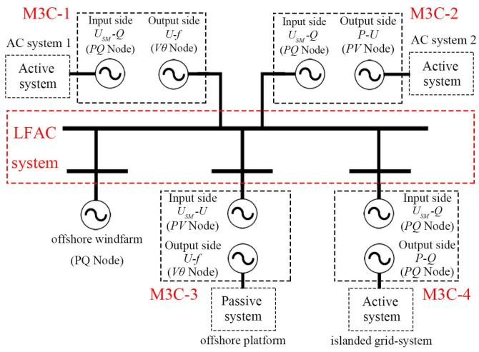  
Fig. 6. Control targets and power flow models for M3Cs.

shown in Fig. 6. The offshore windfarm is equivalented as a PQ node.

# B. Power Flow Calculation of Power System With M3C-LFAC Integration

The power flow calculation is the prerequisite of the electromechanical transient simulation. In the power flow calculation, each side of the M3C is regarded as a generator node. According to the control targets of the M3C, the node types of the M3C in power flow calculation are listed in Table I. It has to be noted that there must be one side in the M3C for controlling the average SM capacitor voltage.

Unlike the MMC-MTDC system, whose power flow calculation of the DC network is totally different from the AC network [28], the LFAC is still an AC network which can be solved by the same calculation method as the power frequency AC network. However, the cable parameters of LFAC system need to adjust with the rated frequency of the LFAC. Ignoring the penetration of ground currents and the conductor skin effect, the per-mile impedance and admittance are written as:

$$
Z _ {s} = R _ {s} + j \omega L _ {s} \tag {26}
$$

$$
Y _ {s} = j \omega C _ {s} \tag {27}
$$

where $R _ { s } , L _ { s }$ and $C _ { s }$ are the per-kilometer values of the inherent line parameters.

For the decentralized grid-forming control, the energy balance of AC system is achieved by several M3Cs with VSG control. Unlike U-f control, the operating frequency of VSG control will

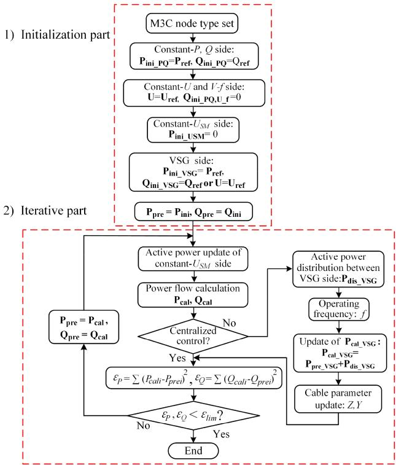  
Fig. 7. Flow chart of the iterative power flow calculation algorithm.

deviate from the reference frequency according to the active power. For the M3C with VSG control, the power synchronization loop (PSL) can be expressed as:

$$
J \frac {d \omega_ {s}}{d t} = \frac {1}{\omega_ {0}} \left(P _ {s r e f} - P _ {s}\right) - D d \omega_ {s} \tag {28}
$$

where J, D are the inertia time constant and damping coefficient, $\omega _ { \mathrm { s } }$ is the rotational speed of the VSG and $P _ { s r e f }$ is the active power reference. Thus, a steady state P-f droop relationship is obtained in VSG control.

$$
D d \omega_ {s} = \frac {1}{\omega_ {0}} \left(P _ {s r e f} - P _ {s}\right) \tag {29}
$$

Normally, only one slack bus exists in one AC system for the power flow calculation, and the unbalanced power of the AC system is compensated by the slack bus. As described in (29), the unbalanced power of the AC system is actually compensated by all VSG nodes according to the $P { \cdot } f$ droop relationship. Therefore, the unbalance power added to the slack bus should be distributed to all VSG nodes. Because of the power coupling of the M3C input side and the output side, the power flow of the AC systems with embedded M3C-LFAC systems is interrelated. An iterative power flow calculation algorithm is proposed as plotted in Fig. 7.

1) Initialization Part: Before the power flow calculation, node types of the input and the output sides of the M3Cs have to be determined based on the control targets. Then, the active powers of the M3C P-Q and P-U controlling sides (denoted as the constant P sides) are determined and can be set as the reference values. The reactive powers of the M3C $P { \mathrm { - } } Q$ and $U _ { S M ^ { - } } Q$ controlling sides (denoted as the constant Q sides) are

known and can be set as the reference values. The voltages of the M3C P-U and $U _ { S M ^ { - } } U$ controlling sides (denoted as the constant U sides) should be set as reference voltages, and their initial reactive powers are set as zero. The injecting active power of the M3C $U _ { S M ^ { - } } Q$ and $U _ { S M ^ { - } } U$ controlling sides (denoted as the constant $U _ { S M }$ sides) are set as zero. The active powers, reactive powers or voltages of the VSG nodes are initialized as their reference values. The injecting active and reactive power of the M3C U-f controlling side are initialized as zero. Then the initial injecting power $\mathbf { P _ { i n i } }$ and $\mathbf { Q _ { \mathrm { { i n i } } } }$ on both sides of M3Cs can be obtained.

2) Iterative Part: An iterative calculation method is adopted for satisfying the AC system power balance, considering the power interaction between both the M3C sides and the power distribution between the VSGs in the decentralized grid-forming control. A power flow calculation following the active power updating of the constant $U _ { S M }$ sides is performed in one loop, which obtains the renewed injecting active power by (24). $P _ { c a l }$ and $Q _ { c a l }$ of PV nodes will be updated in each loop of the iterative part, which require no other processing. For the decentralized grid-forming control, a power distribution among k VSG nodes is proceeded in each loop:

$$
P _ {m i s} = \left(P _ {\text {c a l} _ {\text {s l a c k}}} - P _ {\text {p r e} _ {\text {s l a c k}}}\right) \tag {30}
$$

$$
P _ {d i s \_ V S G i} = \frac {D _ {i}}{\sum_ {i = 1} ^ {k} D _ {i}} P _ {m i s} \tag {31}
$$

$$
f = f _ {r e f} - \frac {1}{\sum_ {i = 1} ^ {k} D _ {i}} P _ {m i s} \tag {32}
$$

where $P _ { m i s }$ is the power variation of the slack bus after one power flow calculation. Then $P _ { m i s }$ will distribute to all VSG nodes according to their damping coefficient. The operating frequency can be obtained by (32), resulting in the change of impedances and admittances by (26) and (27). Then the correct power distribution is realized by updating $\mathbf { P _ { c a l . } }$ _VSG.

Deviations of l M3C stations injecting powers $\varepsilon _ { P }$ and $\varepsilon _ { Q }$ are calculated by (33), where $\mathbf { P _ { p r e } } , \mathbf { Q _ { p r e } }$ are the one side injecting powers of l M3Cs before the power flow calculation and $\mathbf { P _ { c a l } }$ $\mathbf { Q _ { c a l } }$ are the renewed one side injecting powers of l M3Cs after the power flow calculation.

$$
\varepsilon_ {P} = \sum_ {i = 1} ^ {2 l} \left(P _ {\text {c a l i}} - P _ {\text {p r e i}}\right) ^ {2}, \varepsilon_ {Q} = \sum_ {i = 1} ^ {2 l} \left(Q _ {\text {c a l i}} - Q _ {\text {p r e i}}\right) ^ {2} \tag {33}
$$

The power balance of the AC system, the power interaction of both the M3C sides and the power distribution among VSG nodes in decentralized grid-forming control will be satisfied when εP and εQ defined by (33) are less than the preset limitation εlim.

# IV. M3C DYNAMIC MODELING

In this section, the dynamic modeling of the M3C with its controllers is described. Based on the equivalent circuit model discussed in Section II, the components of the M3C dynamic model and their relationship are shown in Fig. 8. The input side and the output side of the M3C are coupled with the equivalent capacitor for active power interaction.

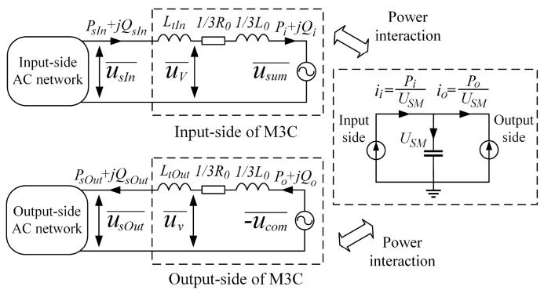

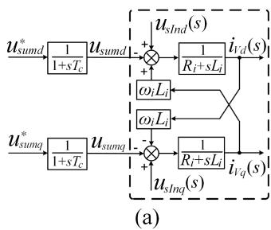  
Fig. 8. Structure of M3C electromechanical transient model.

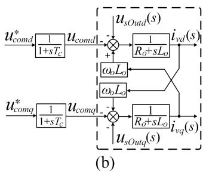  
Fig. 9. M3C dynamic model with modulation. (a) Input side. (b) Output side.

# A. M3C Model

Transforming (12) and (19) into dq reference frame gives (34) and (35), which describe the relationship of the control variables $( u _ { s u m d / q }$ and $u _ { c o m d / q } ) _ { }$ , the disturbance variable $( u _ { s I n d / q }$ and $u _ { s O u t d / q } )$ and the output variables $( i _ { V d / q }$ and $i _ { v d / q } )$ .

$$
\begin{array}{l} L _ {i} \left[ \frac {d}{d t} - \left[ \begin{array}{c c} 0 & \omega_ {i} \\ - \omega_ {i} & 0 \end{array} \right] \right] \left[ \begin{array}{c} i _ {V d} \\ i _ {V q} \end{array} \right] + R _ {i} \left[ \begin{array}{c} i _ {V d} \\ i _ {V q} \end{array} \right] + \left[ \begin{array}{c} u _ {s u m d} \\ u _ {s u m q} \end{array} \right] \\ = \left[ \begin{array}{l} u _ {s I n d} \\ u _ {s I n q} \end{array} \right] \tag {34} \\ \end{array}
$$

$$
\begin{array}{l} L _ {o} \left[ \frac {d}{d t} - \left[ \begin{array}{c c} 0 & \omega_ {o} \\ - \omega_ {o} & 0 \end{array} \right] \right] \left[ \begin{array}{c} i _ {v d} \\ i _ {v q} \end{array} \right] + R _ {o} \left[ \begin{array}{c} i _ {v d} \\ i _ {v q} \end{array} \right] + \left[ \begin{array}{c} u _ {c o m d} \\ u _ {c o m q} \end{array} \right] \\ = - \left[ \begin{array}{l} u _ {s O u t d} \\ u _ {s O u t q} \end{array} \right] \tag {35} \\ \end{array}
$$

where subscript d and q means the d- and q- axis component; the equivalent resistances $( R _ { i }$ and $R _ { o , \ - }$ ) and the equivalent inductances $( L _ { i }$ and $L _ { o } )$ can be calculated as in (36).

$$
\left\{ \begin{array}{l} R _ {i} = \frac {R _ {0}}{3}, R _ {o} = \frac {R _ {0}}{3} \\ L _ {i} = \frac {L _ {0}}{3} + L _ {t I n}, L _ {o} = \frac {L _ {0}}{3} + L _ {t O u t} \end{array} \right. \tag {36}
$$

The s-domain M3C AC side model is shown in Fig. 9 based on (34) and (35). The first order lag of time constant $T _ { c }$ stands for the time delay of the modulation and trigger process.

# B. M3C Controller

The processes to obtain the reference voltages of the input side and the output side $u _ { s u m d / q } ^ { * }$ and $u _ { c o m d / q } ^ { * }$ are the same. Here the outer loop and inner current controllers of the M3C input side are given in Fig. 10. Based on the control mode, the reference

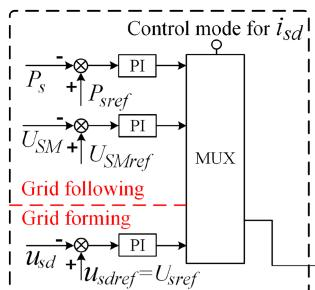

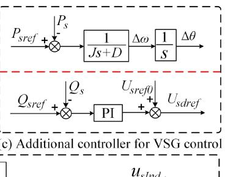

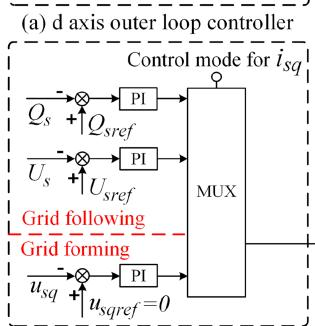  
(b) q axis outer loop controller

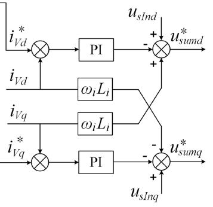  
(d) Inner current controller   
Fig. 10. Structure of M3C controller.

current i ∗V d/q $i _ { V d / q } ^ { * }$ is determined according to the deviation of the control target. Then the reference voltage $u _ { s u m d / q } ^ { * }$ is generated

In the M3C controller, all state variables are expressed in the dq reference frame. For the symmetry of three phase voltage, the phase θ for abc/dq reference frame transformation gained by the phase locked loop (PLL) is regarded as ideal in electromechanical simulation. For U-f control, the phase θ is directly determined by the converter. In these operating conditions, the dynamic of phase θ need not to be considered. However, the phase dynamic should be considered for the PSL in VSG control. An additional controller is added to the d axis outer loop controller to realize reactive power control of VSG. The additional controller of VSG is also shown in Fig. 10.

# C. Power Coupling Between Input and Output Side

The equivalent capacitor is used to represent the energy interaction between the input side and the output side of the M3C. The equivalent capacitor voltage is influenced by the active power deviation between the input side and the output side:

$$
\frac {d U _ {S M}}{d t} = \frac {1}{C _ {e q}} \frac {\left(P _ {i} - P _ {o}\right)}{U _ {S M}} \tag {37}
$$

The equivalent capacitor voltage $U _ { S M }$ also provides a signal for the average SM voltage controller in the outer loop controller.

# D. Complete M3C Electromechanical Transient Model

Combining all aforementioned parts together, a complete M3C electromechanical transient model is shown in Fig. 11. For the output of the complete M3C model, the injecting current is calculated by the AC side model of M3C. Then based on the Norton equivalent circuit, the actual injecting current corresponding to the AC system network is obtained. The injection power $P _ { i }$ and $P _ { o }$ calculated from the AC side model of M3C

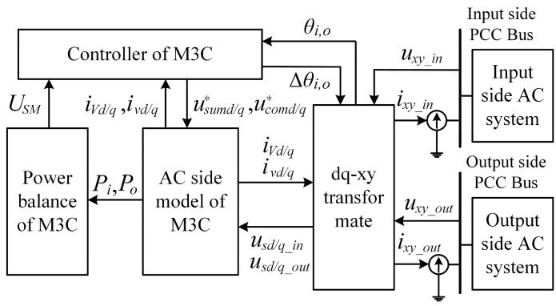  
Fig. 11. Electro-mechanical model of the M3C.

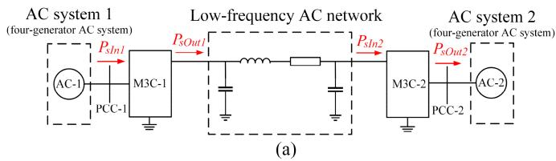

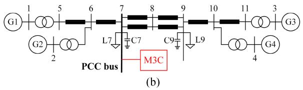  
Fig. 12. Test System based on 2-terminal M3C-LFAC system.

are transferred to the power balance part of the M3C where the voltage of the equivalent capacitor $U _ { S M }$ is calculated. In order to achieve both the fast dynamic simulation of the inner controller and the relatively slow electromechanical dynamic simulation, a multi-rate calculation method is adopted [36], [37]. Between one large time step for the electromechanical simulation that is 10 ms typically, a small time step of $5 0 \mu \mathrm { s }$ typically is chosen for the calculation of the dynamics in the AC side model of M3C, the M3C controller and the power balance of M3C.

# V. MODEL VALIDATION AND SIMULATIONS

This section will verify the validity of the M3C electromechanical transient simulation model by a two-terminal M3C-LFAC system. Two four-generator AC systems (AC system 1 and AC system 2) are connected by a two-terminal M3C-LFAC system as shown in Fig. 12. Bus 7-S1 and Bus 7-S2 in two fourgenerator AC systems are chosen as PCC bus which connects the M3C station. The electromechanical transient simulation results are compared with the electromagnetic simulation results obtained in PSCAD for model validation. The full-bridge cell in PSCAD official library forms the M3C model. The control systems of M3C are established based on [35]. The simulation time steps on PSCAD and PSS/E are $5 0 \mu \mathrm { s }$ and 10 ms, respectively.

# A. Test System

A two-terminal M3C system is simulated to check the validity of the M3C electromechanical transient model. The data of the system, control targets and set points are given in Tables II∼IV.

TABLE II MAIN PARAMETERS OF M3C STATION   

<table><tr><td>Item</td><td>Values</td></tr><tr><td>AC system rated voltage</td><td>220 kV</td></tr><tr><td>Low-frequency system rated voltage</td><td>220 kV</td></tr><tr><td>System side frequency</td><td>50Hz</td></tr><tr><td>Low-frequency side frequency</td><td>20Hz</td></tr><tr><td>Transformer ratio of input side</td><td>220 kV / 60 kV</td></tr><tr><td>Transformer ratio of output side</td><td>220 kV / 60 kV</td></tr><tr><td>Transformer rated capacity</td><td>330 MVA</td></tr><tr><td>Transformer leakage inductance</td><td>0.15 pu</td></tr><tr><td>Average submodule capacitor voltage</td><td>115 kV</td></tr><tr><td>M3C rated capacity</td><td>300 MVA</td></tr><tr><td>Number of SMs per arm</td><td>54</td></tr><tr><td>SM capacitor</td><td>16000 μF</td></tr><tr><td>Arm inductance</td><td>14 mH</td></tr><tr><td>Low frequency inductor</td><td>7mH</td></tr></table>

TABLE IIIMAIN PARAMETERS OF LFAC TRANSMISSION LINE  

<table><tr><td>Item</td><td>Values</td></tr><tr><td>LFAC line length</td><td>100 km</td></tr><tr><td>LFAC line resistance</td><td>0.0114 Ω/km</td></tr><tr><td>LFAC line inductance</td><td>0.9356 mH/km</td></tr><tr><td>LFAC line capacitance</td><td>0.0123 μF/km</td></tr></table>

TABLE IV CONTROL TARGETS AND SET POINTS OF M3CS   

<table><tr><td>Converter</td><td>Side</td><td>Control targets</td><td>Control parameter</td></tr><tr><td rowspan="2">M3C-1</td><td>Input side</td><td>P-Q</td><td>P_sref=150MW
Q_sref=0Mvar</td></tr><tr><td>Output side</td><td>U_SM-Q</td><td>U_SMref=1.0 pu
Q_sref=0Mvar</td></tr><tr><td rowspan="2">M3C-2</td><td>Input side</td><td>U-f</td><td>δ=0°
U_sref=1.0 pu</td></tr><tr><td>Output side</td><td>U_SM-Q</td><td>U_SMref=1.0 pu
Q_sref=0Mvar</td></tr></table>

From AC system 1 to AC system 2, 150 MW is transferred by the M3C-LFAC system. The input side of M3C-1 determine the active injecting power to the M3C converter, and the input side of M3C-2 with U-f control is assigned to form the voltage of the LFAC system. The output side of M3C-1 and the output side of M3C-2 are set as constant $U _ { S M }$ for energy balance.

# B. Change of Steady Operation Point

The M3C converter operation point will be regulated by the system operator for system operation optimization. Thus, the M3C dynamic characteristics for the change of the steady operation point are important. The M3C dynamic characteristics comparison of electromechanical transient simulation results with the electromagnetic transient simulation results will illustrate the validity of the M3C electromechanical transient model. Three cases are adopted for comparison. Case 1: 75 MW step increment for M3C-1 input side; Case 2: 50 Mvar step increment for M3C-1 input side and the control target change from constant Q to constant voltage for M3C-2 output side; Case 3: 300 MW step decrement and 100 Mvar step decrement for M3C-1 input side. When the system runs to 1.0 s, the changing instructions are given to the M3C stations. The active power, the reactive power and the equivalent capacitor voltage are selected for the dynamic

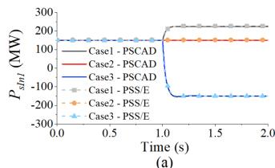

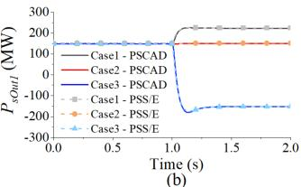

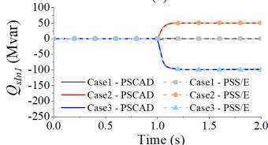

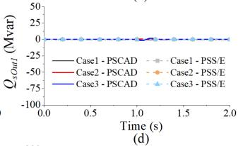

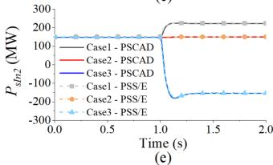

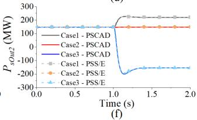

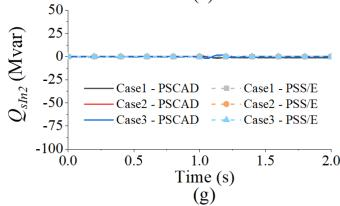

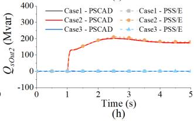

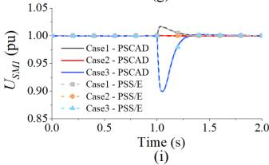

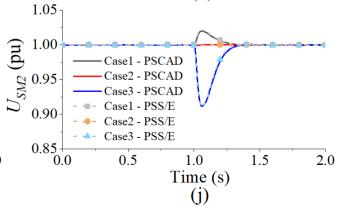  
Fig. 13. Dynamic responses of M3Cs for power step changes. (a) Active power of M3C-1 input side. (b) Active power of M3C-1 output side. (c) Reactive power of M3C-1 input side. (d) Reactive power of M3C-1 output side. (e) Active power of M3C-2 input side. (f) Active power of M3C-2 output side. (g) Reactive power of M3C-2 input side. (h) Reactive power of M3C-2 output side. (i) Average submodule capacitor voltage of M3C-1. (j) Average submodule capacitor voltage of M3C-2.

characteristic comparison. The dynamic response comparison of the three cases is shown in Fig. 13.

The selected three cases contain the active power change, the reactive power change and the control target change for the M3C station. The consistent dynamic characteristics of the M3C stations in PSS/E and PSCAD prove the accuracy of the established electromechanical transient model.

# C. Fault Applied at AC System

The transient stability under AC fault is an important consideration in electromechanical transient stability study. Thus, the dynamic characteristics of the M3C stations are compared for the AC system fault. Two cases are adopted for the comparison. Case 1: three-phase-to-ground fault with 0.01 Ω fault resistance at PCC bus of M3C-1 input side; Case 2: three-phase-to-ground fault with 50 Ω fault resistance at PCC bus of M3C-1 input side. As shown in Fig. 14, the AC fault on the M3C-1 input side influences the injecting power of M3C-1 input side. Then the

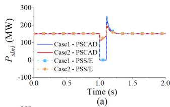

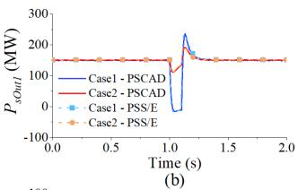

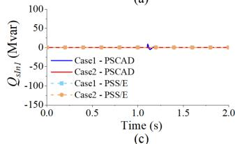

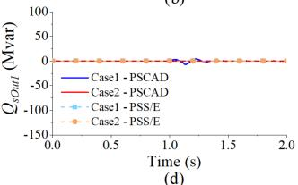

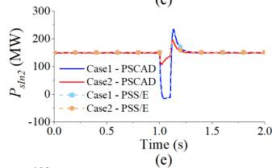

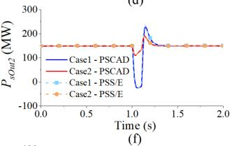

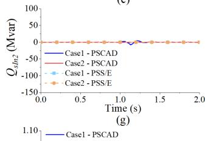

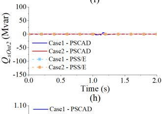

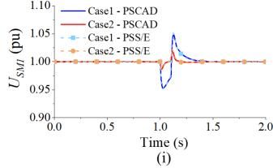

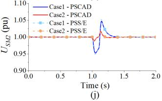  
Fig. 14. Dynamic responses of the M3Cs under the AC fault. (a) Active power of M3C-1 input side. (b) Active power of M3C-1 output side. (c) Reactive power of M3C-1 input side. (d) Reactive power of M3C-1 output side. (e) Active power of M3C-2 input side. (f) Active power of M3C-2 output side. (g) Reactive power of M3C-2 input side. (h) Reactive power of M3C-2 output side. (i) Average submodule capacitor voltage of M3C-1. (j) Average submodule capacitor voltage of M3C-2.

operation of the whole system is affected. The dynamic characteristics of the M3C stations agree well on PSCAD and PSS/E, which proves the accuracy of the proposed electromechanical model.

# VI. MODEL APPLICATION

To study the interaction between the AC system and the M3C-LFAC system, a stability study is performed on a modified New England 39-bus system which consists of three asynchronous AC systems (Fig. 15). A four-terminal 220 kV LFAC system is referred by the dashed lines. Three M3Cs are configured at bus 16, 19 and 40 respectively, and the initial power flow direction is illustrated by the red arrow. The M3C stations are interconnected by 150 km cables and an offshore windfarm is connected to the M3C-2 by 200 km cable. WT4E1 (electrical model), WT3T1 (mechanical model), WT3P1 (pitch control model) and WTARAU1 (generic aerodynamic model) are used as windfarm simulation model. The data of the M3Cs is shown

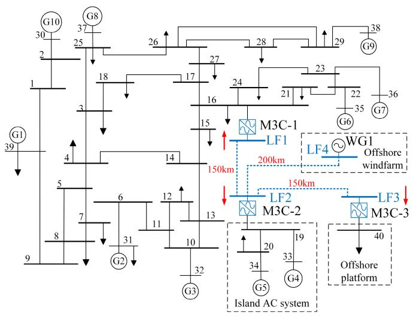  
Fig. 15. Modified IEEE 39 bus system.

TABLE V M3C DATA   

<table><tr><td>Converter</td><td colspan="2">M3C-1</td><td colspan="2">M3C-2</td><td colspan="2">M3C-3</td></tr><tr><td>Rating 
capacity(MVA)</td><td colspan="2">600</td><td colspan="2">600</td><td colspan="2">300</td></tr><tr><td>Xo(pu)</td><td colspan="2">0.3</td><td colspan="2">0.3</td><td colspan="2">0.3</td></tr><tr><td>Rθ(pu)</td><td colspan="2">0.012</td><td colspan="2">0.012</td><td colspan="2">0.011</td></tr><tr><td>Ceq(F)</td><td colspan="2">15.5</td><td colspan="2">15.5</td><td colspan="2">7.77</td></tr><tr><td>Side</td><td>Input</td><td>Output</td><td>Input</td><td>Output</td><td>Input</td><td>Output</td></tr><tr><td>Control targets</td><td>U-f</td><td>USM-Q</td><td>USM-U</td><td>P-Q</td><td>USM-U</td><td>U-f</td></tr><tr><td>Xr(pu)</td><td>0.10</td><td>0.10</td><td>0.10</td><td>0.10</td><td>0.10</td><td>0.10</td></tr></table>

TABLE VI POWER FLOW SOLUTION   

<table><tr><td>Converter</td><td>M3C-1</td><td>M3C-2</td><td>M3C-3</td></tr><tr><td>\( P_{sln} \)(MW)</td><td>86.3</td><td>303.7</td><td>202.1</td></tr><tr><td>\( Q_{sln} \)(MVar)</td><td>-6.6</td><td>-2.0</td><td>-23.2</td></tr><tr><td>\( P_{sOut} \)(MW)</td><td>85.1</td><td>300.0</td><td>200.0</td></tr><tr><td>\( Q_{sOut} \)(MVar)</td><td>34.7</td><td>29.4</td><td>60.0</td></tr></table>

in Table V. Table VI summarizes the power flow solution results of the AC system with the embedded M3C-LFAC system. For the power direction definition shown in Fig. 15, it should be noted that the negative value of reactive power of the M3C input side represents the output of reactive power to the connecting AC system. To study the transient interaction between the AC system and the LFAC system, this paper analyzes three contingencies as examples.

# A. Case 1- Output Power Change of the Offshore Windfarm

The dynamic response of the system under the offshore windfarm output power change illustrates the operation characteristics for the offshore windfarm output power uncertainty, which is essential for the system stable operating boundary analysis. When the system runs to 1.0 s, the wind speed is ramped to its rated value in about 1.5 s. The active output power of WG1 increases for the growing of captured wind power from 600 MW to 1000 MW. Fig. 16 shows the responses of the M3Cs and the AC systems. For the power unbalance of the LFAC system caused by the increase of the WG1, the active power transferred by M3C-1 is coordinated due to its U-f control on the LFAC side.

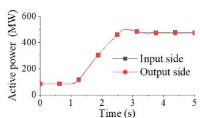

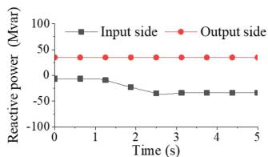

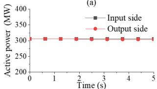  
(c）

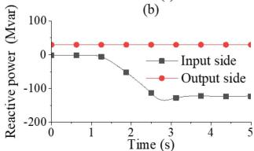

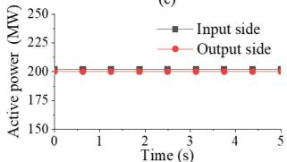  
(e)

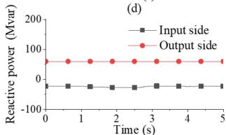  
(f)

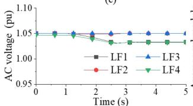  
（g）

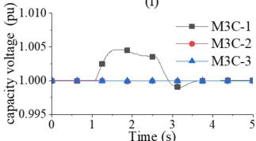  
  
Fig. 16. Dynamic responses of M3Cs under WG1 power change. (a) Active power of M3C-1. (b) Reactive power of M3C-1. (c) Active power of M3C-2. (d) Reactive power of M3C-2. (e) Active power of M3C-3. (f) Reactive power of M3C-3. (g) AC voltages of LFAC system. (h) Average submodule capacitor voltage of M3Cs.

The injecting power of the M3C-1 input side increases from 86 MW to 482 MW. The transmission power variation of the LFAC system changes the AC voltage of the LFAC buses. The reactive powers of the input side of M3C-1, M3C-2 and M3C-3 are adjusted for the constant voltage of the PCC. The average submodule capacitor voltage of M3C-1 rises for the increase of the input side active power and is regulated by the M3C-1 output side. In this contingency, the system operates stably for the uncertainty of the output power of the offshore windfarm.

# B. Case 2- Decentralized Control

For the simulation of the decentralized control, M3C-1 and M3C-2 are selected to operate with VSG control. Active power and rotor speed deviation gained from PSL loop of M3C-1, 2 input side are shown in Fig. 17.

It can be seen that the unbalanced energy of the LFAC system are distributed in M3C-1 and M3C-2 according to their damping coefficient. The rotor speed deviations gained from PSL are same in the steady state, which illustrates the synchronization between M3C-1 and M3C-2.

# C. Case 3- AC Fault in Island AC System

When the system runs to 1.0 s, a three-phase-to-ground fault with 0.01 Ω fault resistance is applied to bus 19; 0.1 s later the fault is cleared. The simulation results are shown in Fig. 18.

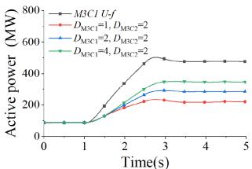

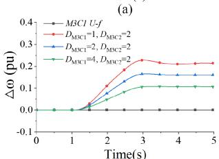  
(c)

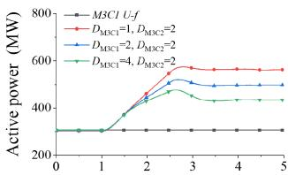  
Time(s)

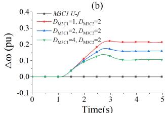  
(d)

  
Fig. 17. Dynamic responses of M3Cs with VSG control under power change. (a) Active power of M3C-1 input side. (b) Active power of M3C-2 input side. (c) Rotor speed deviation of M3C-1 input side. (d) Rotor speed deviation of M3C-2 input side.   
(a)

  
(c)

  
(e)

  
（g）

  
  
Fig. 18. Dynamic responses of M3Cs under the AC fault in island AC system (a) Active power of M3C-1. (b) Reactive power of M3C-1. (c) Active power of M3C-2. (d) Reactive power of M3C-2. (e) Active power of M3C-3. (f) Reactive power of M3C-3. (g) AC voltages of LFAC system. (h) Average submodule capacitor voltage of M3Cs.

When the fault happens, the active power of M3C-2 output side suddenly drops to about zero. The average submodule capacitor voltage of M3C-2 rises for the decrease of the output side active power. Then the active power of M3C-2 input side decreases for its average submodule capacitor voltage control. The active power of the input side of M3C-1 increases, whose active injecting power of output side increases correspondingly for the energy balance. The average submodule capacitor voltage

of M3C-1 rises for the increase of the active power of input side. In this contingency, the dynamic response of the system under the AC fault illustrates the adjustment ability of M3C-LFAC system. The AC fault occurring on one asynchronous AC system has limited influence on the other AC systems which are interconnected by the M3C-LFAC system. Therefore, the AC fault is isolated well.

# VII. CONCLUSION

In this paper, the electromechanical transient M3C model is presented which realizes the electromechanical transient simulation of AC systems with embedded M3C-LFAC systems. The M3C model is divided into the input side, the output side and the equivalent capacitor. The input side and the output side equivalent circuits of the M3C are derived from the KVL equation with the double $\alpha \beta 0$ transformation. The equivalent capacitor is used to calculate the energy stored in the M3C and the overall internal voltage level of the M3C. The proposed iterative power flow calculation algorithm can be applied for general power frequency AC/LFAC hybrid systems. The established M3C electromechanical transient model can be applied to any LFAC systems with different network topologies and different M3C operation modes.

The proposed model is implemented on PSS/E and compared with the electromagnetic transient model on PSCAD. The consistency of the simulation results in PSCAD and PSS/E validates the accuracy of the proposed electromechanical transient model. For the transient stability analysis of AC systems with an embedded M3C-LFAC system, electromechanical transient model is performed on the modified New England 39-bus system. The simulation results show the flexibility and reliability of the system. With decentralized control, the unbalanced energy will be compensated by all M3Cs operated with VSG control. The AC fault can be isolated well in an M3C-LFAC system connecting AC grid asynchronously.

# REFERENCES

[1] T. Ngo, M. Lwin, and S. Santoso, “Steady-state analysis and performance of low frequency AC transmission lines,” IEEE Trans. Power Syst., vol. 31, no. 5, pp. 3873–3880, Sep. 2016.   
[2] X. Xiang, M. M. C. Merlin, and T. C. Green, “Cost analysis and comparison of HVAC, LFAC and HVDC for offshore wind power connection,” in Proc. 12th IET Int. Conf. AC DC Power Transmiss., 2016, pp. 1–6.   
[3] W. Xifan and W. Xiuli, “Feasibility study of fractional frequency transmission system,” IEEE Trans. Power Syst., vol. 11, no. 2, pp. 962–967, May 1996.   
[4] H. Chen, M. H. Johnson, and D. C. Aliprantis, “Low-frequency AC transmission for offshore wind power,” IEEE Trans. Power Del., vol. 28, no. 4, pp. 2236–2244, Oct. 2013.   
[5] P. B. Wyllie, Y. Tang, L. Ran, T. Yang, and J. Yu, “Low frequency AC transmission - elements of a design for wind farm connection,” in Proc. 11th IET Int. Conf. AC DC Power Transmiss., 2015, pp. 1–5.   
[6] P. Qiu, X. Ni, F. Xu, C. Lu, K. Wang, and W. Pan, “Optimal transmission frequency of low frequency AC system for offshore wind farm integration,” in Proc. Int. Conf. Power Syst. Technol., 2021, pp. 1556–1560.   
[7] D. Sehloff and L. A. Roald, “Low frequency AC transmission upgrades with optimal frequency selection,” IEEE Trans. Power Syst., vol. 37, no. 2, pp. 1437–1448, Mar. 2022.   
[8] J. Renedo, A. Garcia-Cerrada, and L. Rouco, “Active power control strategies for transient stability enhancement of AC/DC grids with VSC-HVDC multi-terminal systems,” IEEE Trans. Power Syst., vol. 31, no. 6, pp. 4595–4604, Nov. 2016.

[9] H. Akagi, “Classification, terminology, and application of the modular multilevel cascade converter (MMCC),” IEEE Trans. Power Electron., vol. 26, no. 11, pp. 3119–3130, Nov. 2011.   
[10] G. A. A. Orcajo et al., “Enhancement of power quality in an actual hot rolling mill plant through a STATCOM,” IEEE Trans. Ind. Appl., vol. 56, no. 3, pp. 3238–3249, May/Jun. 2020.   
[11] A. A. A. Radwan and Y. A.-R. I. Mohamed, “Grid-connected wind-solar cogeneration using back-to-back voltage-source converters,” IEEE Trans. Sustain. Energy, vol. 11, no. 1, pp. 315–325, Jan. 2020.   
[12] Y. Shu, G. Tang, and H. Pang, “A back-to-back VSC-HVDC system of Yu-E power transmission lines to improve cross-region capacity,” CSEE J. Power Energy Syst., vol. 6, no. 1, pp. 64–71, 2020.   
[13] G. Tang, Z. Xu, and Y. Zhou, “Impacts of three MMC-HVDC configurations on AC system stability under DC line faults,” IEEE Trans. Power Syst., vol. 29, no. 6, pp. 3030–3040, Nov. 2014.   
[14] L. Wang, C.-H. Chang, B.-L. Kuan, and A. V. Prokhorov, “Stability improvement of a two-area power system connected with an integrated onshore and offshore wind farm using a STATCOM,” IEEE Trans. Ind. Appl., vol. 53, no. 2, pp. 867–877, 2017.   
[15] Z. Zhang, Y. Jin, and Z. Xu, “Design of main circuit parameters for modular multilevel matrix converter in LFAC system,” IEEE Trans. Circuits Syst. II, Exp. Briefs, vol. 69, no. 9, pp. 3864–3868, Sep. 2022.   
[16] M. Diaz et al., “Control of wind energy conversion systems based on the modular multilevel matrix converter,” IEEE Trans. Ind. Electron., vol. 64, no. 11, pp. 8799–8810, Nov. 2017.   
[17] B. Fan, K. Wang, P. Wheeler, C. Gu, and Y. Li, “An optimal full frequency control strategy for the modular multilevel matrix converter based on predictive control,” IEEE Trans. Power Electron., vol. 33, no. 8, pp. 6608–6621, Aug. 2018.   
[18] B. Fan, K. Wang, Z. Zheng, L. Xu, and Y. Li, “Optimized branch current control of modular multilevel matrix converters under branch fault conditions,” IEEE Trans. Power Electron., vol. 33, no. 6, pp. 4578–4583, Jun. 2018.   
[19] G. F. Gontijo, S. Wang, T. Kerekes, and R. Teodorescu, “Novel converter topology with reduced cost, size and weight for high-power mediumvoltage machine drives: 3x3 modular multilevel series converter,” IEEE Access, vol. 9, pp. 49082–49097, 2021.   
[20] D. Karwatzki and A. Mertens, “Generalized control approach for a class of modular multilevel converter topologies,” IEEE Trans. Power Electron., vol. 33, no. 4, pp. 2888–2900, Apr. 2018.   
[21] J. Ma, M. S. A. Dahidah, V. Pickert, and J. Yu, “A hierarchical energy balance control method for M3C based on injecting output frequency circulating currents,” IEEE Trans. Power Electron., vol. 35, no. 3, pp. 2424–2435, Mar. 2020.   
[22] M. A. Perez, J. Rodriguez, E. J. Fuentes, and F. Kammerer, “Predictive control of AC–AC modular multilevel converters,” IEEE Trans. Ind. Electron., vol. 59, no. 7, pp. 2832–2839, Jul. 2012.   
[23] J. Mahseredjian, V. Dinavahi, and J. A. Martinez, “Simulation tools for electromagnetic transients in power systems: Overview and challenges,” IEEE Trans. Power Del., vol. 24, no. 3, pp. 1657–1669, Jul. 2009.   
[24] U. N. Gnanarathna, A. M. Gole, and R. P. Jayasinghe, “Efficient modeling of modular multilevel HVDC converters (MMC) on electromagnetic transient simulation programs,” IEEE Trans. Power Del., vol. 26, no. 1, pp. 316–324, Jan. 2011.   
[25] H. W. Dommel, “Digital computer solution of electromagnetic transients in single-and multiphase networks,” IEEE Trans. Power App. Syst., vol. PAS-88, no. 4, pp. 388–399, Apr. 1969.   
[26] P. Kundur, Power System Stability and Control. New York, NY, USA: McGraw-Hill, 1994.   
[27] A. M. Khalil and R. Iravani, “Enhanced generic nonlinear and linearized models of wind power plants,” IEEE Trans. Power Syst., vol. 32, no. 5, pp. 3968–3980, Sep. 2017.   
[28] S. Liu, Z. Xu, W. Hua, G. Tang, and Y. Xue, “Electromechanical transient modeling of modular multilevel converter based multi-terminal HVDC systems,” IEEE Trans. Power Syst., vol. 29, no. 1, pp. 72–83, Jan. 2014.   
[29] V. Rampurkar, P. Pentayya, H. A. Mangalvedekar, and F. Kazi, “Cascading failure analysis for Indian power grid,” IEEE Trans. Smart Grid, vol. 7, no. 4, pp. 1951–1960, Jul. 2016.   
[30] Y. Tang, Z. Zhang, and Z. Xu, “DRU based low frequency AC transmission scheme for offshore wind farm integration,” IEEE Trans. Sustain. Energy, vol. 12, no. 3, pp. 1512–1524, Jul. 2021.   
[31] A. Lotfjou, M. Shahidehpour, F. Yong, and L. Zuyi, “Security-constrained unit commitment with AC/DC transmission systems,” IEEE Trans. Power Syst., vol. 25, no. 1, pp. 531–542, Feb. 2010.

[32] D. Ramasubramanian, Z. Yu, R. Ayyanar, V. Vittal, and J. Undrill, “Converter model for representing converter interfaced generation in large scale grid simulations,” IEEE Trans. Power Syst., vol. 32, no. 1, pp. 765–773, Jan. 2017.   
[33] K. Clark, R. A. Walling, and N. W. Miller, “Solar photovoltaic (PV) plant models in PSLF,” in Proc. IEEE Power Energy Soc. Gen. Meeting, 2011, pp. 1–5.   
[34] F. Kammerer, M. Gommeringer, J. Kolb, and M. Braun, “Energy balancing of the modular multilevel matrix converter based on a new transformed arm power analysis,” in Proc. 16th Eur. Conf. Power Electron. Appl., 2014, pp. 1–10.   
[35] W. Kawamura, M. Hagiwara, and H. Akagi, “Control and experiment of a modular multilevel cascade converter based on triple-star bridge cells,” IEEE Trans. Ind. Appl., vol. 50, no. 5, pp. 3536–3548, Sep./Oct. 2014.   
[36] L. Xiao, Z. Xu, H. Xiao, Z. Zhang, G. Wang, and Y. Xu, “Electromechanical transient modeling of MMC based multi-terminal HVDC system with DC faults considered,” Int. J. Elect. Power Energy Syst., vol. 113, pp. 1002–1013, 2019.   
[37] H. Atighechi et al., “Dynamic average-value modeling of CIGRE HVDC benchmark system,” IEEE Trans. Power Del., vol. 29, no. 5, pp. 2046–2054, Oct. 2014.

Zheyang Yu received the B.S. degree in electrical engineering from Zhejiang University, Hangzhou, China, in 2018. He is currently working toward the Ph.D. degree in electrical engineering from Zhejiang University, Hangzhou, China. His research interests include modeling and control of the HVDC transmission, and power system dynamics.

Zheren Zhang (Member, IEEE) received the B.S. and Ph.D. degrees in electrical engineering from Zhejiang University, Hangzhou, China, in 2011 and 2016, respectively. He is currently with the Department of Electrical Engineering, Zhejiang University. His research interests include HVDC, flexible ac transmission systems, and grid integration of renewable energy.

Zheng Xu (Fellow, IEEE) received the B.S., M.S., and Ph.D. degrees in electrical engineering from Zhejiang University, Zhejiang, China, in 1983, 1986, and 1993, respectively. Since 1986, he has been with the Department of Electrical Engineering, Zhejiang University, Zhejiang, China, and has been a Professor since 1998. His research interests include HVDC transmission, power system dynamics, and grid integration of renewable energy. He is the Fellow of IEEE for the contributions to control and modeling of MMC based HVDC transmission systems.