# 连接弱交流电网的柔性直流换流站外环控制器参数解析计算及其限制因素分析

李云丰 1 ，赵文广 1 ，贺之渊 2*，杨杰 2 ，周家培 2 ，许杰锋 1

(1．电网防灾减灾全国重点实验室(长沙理工大学)，湖南省 长沙市 410114；

2．先进输电技术全国重点实验室(国网智能电网研究院有限公司)，北京市 昌平区 102200)

# Analytical Calculation Method of Outer Loop Controller Parameters of

# HVDC Converter Station Connected to Weak AC Grid and Analysis of Limiting Factors

LI Yunfeng1 , ZHAO Wenguang1 , HE Zhiyuan2*, YANG Jie2 , ZHOU Jiapei2 , XU Jiefeng1

(1. State Key Laboratory of Power Grid Disaster Prevention and Reduction (Changsha University of Science and Technology),

Changsha 410114, Hunan Province, China; 2. State Key Laboratory of Advanced Power Transmission Technology

(State Grid Smart Grid Research Institute Co., Ltd.), Changping District, Beijing 102200, China)

ABSTRACT: The dynamic response speed of AC voltage of flexible high voltage direct current (HVDC) converter connected to weak AC grid is manly related to the parameters of AC voltage controller, SCR, steady state operating points and equivalent capacitance paralleled at point of common coupling (PCC). Firstly, due to the lack of analytical calculation of the parameters of AC voltage controller and analysis of their limiting factors, the key influence variables and participations of eigenvalues related to dynamic response and stability have been analyzed according to the distribution of zeros and poles based on the detailed analytical model of whole system. Secondly, based on the quasi steady state model of AC system, the analytical calculation expressions of outer loop controller parameters are derived, and their selection ranges are preliminarily analyzed. Thirdly, the effects of outer loop controller parameters, bandwidth of current inner loop, PLL parameters and SCR on stability are studied. The results show that bandwidth of PLL closed to that of AC voltage loop may not be the factor inducing resonance of system. Reducing the parameters of AC voltage controller and PLL can improve the stability of converter station running in inverter mode. Finally, the correctness of parameter calculation and stability analysis is verified by electromagnetic transient simulations.

KEY WORDS: weak AC grid; flexible high voltage direct

current (HVDC) converter; parameter analytical calculation;impedance model; stability analysis

摘要：柔直换流站连接弱交流电网的交流电压动态响应速度与交流电压控制器参数、短路比、稳态点和公共耦合接入点并联等效电容有关。针对柔直换流站连接弱交流电网外环控制器参数解析计算及其限制因素分析研究欠缺问题，该文在建立整个系统详细模型的基础之上，根据外环闭环传递函数零极点分布情况，分析影响系统动态响应速度和稳定性相关特征根的关键变量及其参与程度。其次，基于交流系统准稳态模型，推导外环控制器参数解析计算表达式，并对其选择范围进行了初步分析。再次，研究外环控制器参数、电流内环带宽、锁相环参数以及短路比对稳定性的影响，结果表明，外环带宽与锁相环带宽接近并不一定是诱导系统发生谐振失稳的因素，降低交流电压控制器和锁相环参数有利于提升柔直换流站运行于逆变状态下的稳定性。最后，通过电磁暂态仿真验证了参数计算与稳定性分析的正确性。

关键词：弱交流电网；柔直换流站；参数解析计算；阻抗模型；稳定性分析

# 0 引言

基于模块化多电平换流器(modular multilevelconverter，MMC)的柔性直流输电技术(flexible highvoltage direct current，HVDC)，采用了具有自主关断能力的电力电子器件，为有功类和无功类的解耦控制提供了坚实基础[1-2]。柔性直流输电克服了常规直流输电需要交流电源提供换相电压的根本缺陷，其优越的控制与运行性能引起了输电领域的重大

变革，为多回直流落点负荷中心、异步电网跨区互联、偏远地区弱交流电网支撑、新能源送出等应场景提供了较好的解决方案[3-5]，有利于促进我国“碳达峰、碳中和”战略目标的早日实现。

柔性直流换流站连接交流电网的控制方式与其是否有同步电源以及交流电网强度密切相关[6-7]。短路比(short circuit ration，SCR)作为衡量交流电网强度的指标[8-9]，其定义为公共耦合接入点(point ofcommon coupling，PCC)的短路容量与额定直流功率之比，当 SCR ≥ 3 时认为是强电网；当 2 ≤ SCR < 3时为弱电网；1<SCR<2 为极弱电网。上述只是从静态角度给出的参考定义，实际系统的稳定性与交直流系统主电路和控制系统多个因素相关。弱交流电网主要呈现以下特征[10-12]：1）输电线路长导致线路等效阻抗大、抗扰动能力弱、线路容性效应强；2）同步发电机数目少致使转动惯量低，交流电压和频率支撑能力弱，功角稳定性较弱；3）有功功率与无功功率之间呈现非线性强耦合关系。

柔直换流站连接弱交流电网时，控制系统一般采用交流电压控制以提升对弱交流电网的支撑能力，其主电路模型分为两种，一种是不考虑 PCC点等效电容[9]，另外一种是考虑等效电容[13-14]。尽管 MMC 型换流站无需在 PCC 点并联滤波器，但是从弱交流电网所呈现出的特征来说，考虑 PCC 点等效电容更符合实际工程情况。这是因为弱交流电网具有长交流线路特征，在 PCC 点的等效电容不能被忽略；再加上高功率水平运行时，为了维持 PCC点电压恒定，换流变压器和交流线路产生的感性无功功率需要有容性无功功率进行补偿，否则将会增加 MMC 的容量和功率损耗，降低了经济性。不管是否考虑 PCC 点等效电容以及何种控制模式，柔直换流站连接弱交流电网均有发生失稳现象的风险，特别是连接极弱交流电网情况下[15]。

针对柔直换流站连接弱交流电网存在的失稳风险，相关文献采用状态空间法[16]、动力学[17]、阻抗法[18]和频率响应解析计算[19]等形式研究了系统失稳情况下的机理及其关键影响因素，指出锁相环(phase-locked loop，PLL)和内外环交互作用是诱发谐振失稳的主要因素。为了抑制换流站连接极弱交流电网时的谐振失稳以及提升功率输送能力，文献[20]基于功率同步控制策略提出了多变量反馈控制方法，将电源电压和 PCC 电压的相位差提升至71°。文献[21-22]采用虚拟同步电机控制策略，提

出了非线性功率控制方法，通过构建的李亚普若夫能量函数验证了所提方法的正确性。文献[23]通过改进外环控制结构提出一种先进的双闭环矢量控制策略，有效提高换流站连接弱电网的功率运行范围。文献[24]利用功率同步控制提出 MMC 连接弱交流电网时的虚拟电阻控制策略，分析了虚拟电阻的作用机理并采用根轨迹方法给出了虚拟电阻的选择范围。文献[25]在分析弱交流电网 PV 曲线的基础上，提出一种功率交叉耦合补偿控制策略，并利用根轨迹方法设计了交叉补偿系数。文献[26]考虑三相并网系统连接弱交流电网时 PLL 带宽过大所导致的谐振失稳问题，提出了一种在内环输出与调制环节之间的相角补偿控制方法，并利用波特图实现了补偿参数选择范围的设计。然而，上述文献尽管在失稳机理和稳定性提升方面做了很多努力工作，但是关于柔性直流换流站连接交流弱电网的外环控制器参数解析计算方法方面所做的研究工作鲜有涉及。

针对上述问题，本文在建立详细模型的基础上，分析了影响外环动态响应速度和系统稳定性的关键环节，推导了外环控制器参数的解析计算表达式，初步给出了参数选择的限制范围，并从幅值裕度和相位裕度两个维度分析了相关环节参数如何影响系统稳定性的机理。

# 1 主电路结构与控制系统架构

柔直换流站接入弱交流电网的简化主电路如图 1 所示。图中： $U _ { \mathbf { g } }$ 和 $U _ { \mathrm { s } }$ 为等效电源和 PCC 点相电压幅值； $\delta$ 为相位差； $R _ { \mathrm { g } }$ 和 $L _ { \mathrm { g } }$ 为交流电网等效阻感， $C _ { \mathrm { p c c } }$ 为 PCC 点无功补偿和线路总等效电容； $R _ { \mathrm { t } }$ 和 $L _ { \mathrm { t } }$ 为换流变压器等效电阻和漏感； $I _ { \mathrm { g } } ,$ 、 $I _ { \mathrm { c } }$ 和 $I _ { \mathrm { s } }$ 为交流系统、等效电容和换流站电流； $P _ { \mathrm { { g } } }$ 和 $Q _ { \mathrm { g } }$ 是交流电网注入 PCC 点的有功和无功功率； $\mathcal { Q } _ { \mathrm { c } }$ 是等效电容 $C _ { \mathrm { p c c } }$ 注入 PCC 点的无功功率； $P _ { \mathrm { { s } } }$ 和 $Q _ { \mathrm { s } }$ 是交流电网注入换流变压器的有功和无功功率； $u _ { \mathrm { d c } }$ 和 $i _ { \mathrm { d c } }$

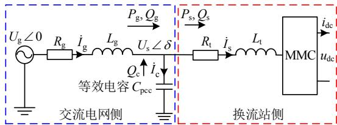  
图1 交流系统和柔直换流站简化主电路  
Fig. 1 Simplified main circuit of AC system and HVDC converter station

为直流电压和直流电流。在常规控制方式下，基于同步旋转坐标系下的柔直换流站控制系统架构如图 2 所示，该图考虑了 PLL 动态特性的影响。

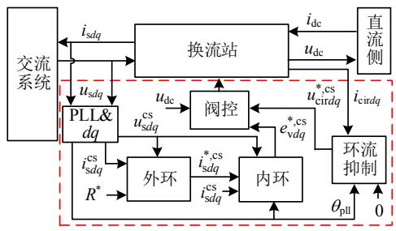  
图2 柔直换流站控制系统架构   
Fig. 2 Control structure of HVDC converter station

# 2 交流电网和柔直换流站建模

# 2.1 交流电网建模

将交流系统折算至换流变压器二次侧，同时将等效电源电压矢量方向定向为电气物理系统的同步旋转 $d q$ 坐标系方向。在电气物理系统 $d q$ 坐标系下，选择电源电流 $i _ { \mathrm { g } d }$ 和 $i _ { \mathbf { g } q }$ 、PCC 点电压 $u _ { \mathrm { s } d }$ 和 $u _ { \mathrm { s } q }$ 为交流系统的状态变量，即 $\mathbf { \boldsymbol { x } } _ { \mathrm { a c } } = [ i _ { \mathrm { g } d } , i _ { \mathrm { g } q } , u _ { \mathrm { s } d } , u _ { \mathrm { s } q } ] ^ { \mathrm { T } }$ ；控制变量 1 为换流器输出电流 $i _ { \mathrm { s } d }$ 和 $i _ { \mathrm s q } ,$ ，即 $\pmb { i } _ { s d q } = [ i _ { s d } , i _ { s q } ] ^ { \mathrm { T } }$ ，控制变量 2 为等效电源电压 ugd 和 ugq，即 ugdq = [ugd, $u _ { \mathrm { g } d }$ $u _ { \mathrm { g } q } ,$ $\pmb { u } _ { \mathrm { g } d q } = [ u _ { \mathrm { g } d } ,$ ${ u _ { \mathrm { g } q } } ] ^ { \mathrm { T } }$ ，该控制变量在电气物理系统 $d q$ 坐标系下的小扰动为零；输出变量为 $u _ { \mathrm s d }$ 和 $u _ { \mathrm { s } q } \mathrm { : }$ ，即 $\pmb { u } _ { \mathrm { s } d q } = [ u _ { \mathrm { s } d } ,$ ${ u _ { s q } } ] ^ { \mathrm { T } }$ ；则交流系统的线性化状态空间模型为

$$
\left\{ \begin{array}{l} \Delta \dot {\mathbf {x}} _ {\mathrm {a c}} = \mathbf {A} _ {\mathrm {a c}} \cdot \Delta \mathbf {x} _ {\mathrm {a c}} + \mathbf {B} _ {\mathrm {a c}} \cdot \Delta \mathbf {i} _ {\mathrm {s d q}} \\ \Delta \mathbf {u} _ {\mathrm {s d q}} = \mathbf {C} _ {\mathrm {a c}} \cdot \Delta \mathbf {x} _ {\mathrm {a c}} \end{array} \right. \tag {1}
$$

式中 $" \Delta ^ { \prime \prime }$ 表示线性化符号；考虑篇幅，状态空间相关矩阵不再给出，以下类似。

# 2.2 换流站控制系统建模

# 1）PLL 建模

电气物理系统自身有一个 $d q$ 坐标系，相关物理量不进行标识，含有大写字母并融合下标“0”的相关变量表示稳态量，以下不再赘述。PLL 具有跟踪 PCC 点电压矢量方向的功能，并为换流站 $d q$ 坐标系控制系统提供基准相位 $\theta _ { \mathrm { p l l } }$ ，采用 Park 变换后的相关电压和电流用上标“cs”进行标识，两者之间的转换关系可参考文献[27]。PLL 采用经典的二阶模型，选取状态变量 $\pmb { x } _ { \mathrm { p l l } } = [ x _ { \mathrm { p l l 1 } } , \theta _ { \mathrm { p l l } } ] ^ { \mathrm { T } }$ ，其中 $x _ { \mathrm { p l l } 1 }$ 为 PLL 控制器积分状态变量；控制变量 ${ \pmb u } _ { \mathrm { s } d q } ;$ ；输出变量 $\theta _ { \mathrm { p l l } }$ ，可得 PLL 的状态空间模型为

$$
\left\{ \begin{array}{l} \Delta \dot {\boldsymbol {x}} _ {\mathrm {p l l}} = \boldsymbol {A} _ {\mathrm {p l l}} \cdot \Delta \boldsymbol {x} _ {\mathrm {p l l}} + \boldsymbol {B} _ {\mathrm {p l l}} \cdot \Delta \boldsymbol {u} _ {\mathrm {s d q}} \\ \Delta \theta_ {\mathrm {p l l}} = \boldsymbol {C} _ {\mathrm {p l l}} \cdot \Delta \boldsymbol {x} _ {\mathrm {p l l}} \end{array} \right. \tag {2}
$$

PLL 输出相位的 s 域线性化模型为

$$
\Delta \theta_ {\mathrm {p l l}} (s) = \underbrace {F _ {\mathrm {p l l}} (s) \left[ - \sin \delta_ {0} \quad \cos \delta_ {0} \right]} _ {G _ {\mathrm {p l l}} (s)} \cdot \Delta u _ {\mathrm {s d q}} \tag {3}
$$

其中 PLL 闭环传递函数为

$$
F _ {\mathrm {p l l}} (s) = \frac {1}{U _ {\mathrm {s} 0}} \cdot \frac {k _ {\mathrm {p p l l}} U _ {\mathrm {s} 0} s + k _ {\mathrm {i p l l}} U _ {\mathrm {s} 0}}{s ^ {2} + k _ {\mathrm {p p l l}} U _ {\mathrm {s} 0} s + k _ {\mathrm {i p l l}} U _ {\mathrm {s} 0}} \tag {4}
$$

式中： $k _ { \mathrm { p p l l } }$ 和 $k _ { \mathrm { i p l l } }$ 为 PLL 控制器的比例和积分系数；$U _ { \mathrm { s 0 } }$ 为 PCC 相电压幅值，可取额定电压 $U _ { \mathrm { s N } }$ 。

# 2）换流站主电路建模

换流变压器只考虑等效电阻和漏感，换流器以MMC 为例，其建模过程可参考文献[27-28]。选取MMC 主电路(main circuit)状态变量为 $\begin{array} { r } { \pmb { x } _ { \mathrm { m c } } = \left[ u _ { \mathrm { d c } } , \right. } \end{array}$ ,uc_dc0, uc_ac1d, uc_ac1q, uc_ac2d, uc_ac2q, idc, idc_line, isd, isq,$i _ { \mathrm { c i r } d } , i _ { \mathrm { c i r } q } ] ^ { \mathrm { T } } ;$ ；控制变量 1、2、3、4 分别为 PCC 电压$\pmb { u } _ { \mathrm { s } d q } = \left[ u _ { \mathrm { s } d } , u _ { \mathrm { s } q } \right] ^ { \mathrm { T } }$ 、MMC 交流输出电压 $\pmb { e } _ { \mathrm { v } d q } = \left[ e _ { \mathrm { v } d } , e _ { \mathrm { v } q } \right] ^ { \mathrm { T } }$ ；环流抑制输出电压 $\pmb { u } _ { \mathrm { c i r } d q } = \left[ u _ { \mathrm { c i r } d } , u _ { \mathrm { c i r } q } \right] ^ { \mathrm { T } }$ 、对站直流电压 $E _ { \mathrm { s } }$ 和交流系统角频率 $\omega ,$ ，即 $\pmb { u } _ { \mathrm { m c 4 } } = \left[ E _ { \mathrm { s } } , \omega \right] ^ { \mathrm { T } }$ ；输出变量 1 为交流侧电流，即 $\pmb { i } _ { \mathrm { s } d q } = \left[ i _ { \mathrm { s } d } , \ i _ { \mathrm { s } q } \right] ^ { \mathrm { T } }$ ；输出变量2 为 MMC 环流，即 $\pmb { i } _ { \mathrm { c i r } d q } = [ i _ { \mathrm { c i r } d } , \ i _ { \mathrm { c i r } q } ] ^ { \mathrm { T } }$ ；在忽略系统频率和对站直流电压变化的情况下，主电路状态空间表达式为

$$
\left\{ \begin{array}{l} \Delta \dot {\boldsymbol {x}} _ {\mathrm {m c}} = \boldsymbol {A} _ {\mathrm {m c}} \cdot \Delta \boldsymbol {x} _ {\mathrm {m c}} + \boldsymbol {B} _ {\mathrm {m c} 1} \cdot \Delta \boldsymbol {u} _ {\mathrm {s d} q} + \\ \boldsymbol {B} _ {\mathrm {m c} 2} \cdot \Delta \boldsymbol {e} _ {\mathrm {v d} q} + \boldsymbol {B} _ {\mathrm {m c} 3} \cdot \Delta \boldsymbol {u} _ {\mathrm {c i r d} q} \\ \Delta \boldsymbol {i} _ {\mathrm {s d} q} = \boldsymbol {C} _ {\mathrm {m c} 1} \cdot \Delta \boldsymbol {x} _ {\mathrm {m c}} \\ \Delta \boldsymbol {i} _ {\mathrm {c i r d} q} = \boldsymbol {C} _ {\mathrm {m c} 2} \cdot \Delta \boldsymbol {x} _ {\mathrm {m c}} \end{array} \right. \tag {5}
$$

# 3）外环建模

外环(outer loop)采用定交流电压和定有功功率控制，其中反馈量经二阶低通滤波器(low passfilter，LPF) $G _ { \mathrm { l p f p } }$ 和 $G _ { \mathrm { l p f u a c } }$ 后送至功率控制器 $G _ { \mathfrak { p } } =$ $k _ { \mathrm { p p } } + k _ { \mathrm { i p } } / s$ 和交流电压控制器 $G _ { \mathrm { u a c } } = k _ { \mathrm { p u a c } } + k _ { \mathrm { i u a c } } / s$ ，其中 $k _ { \mathrm { p p } }$ 和 $k _ { \mathrm { p u a c } }$ 为比例系数， $k _ { \mathrm { i p } }$ 和 $k _ { \mathrm { i u a c } }$ 为积分系数。选择外环状态变量为 xol = [xpfill, xpfil2, xp, xuacfill, xuacfil2, $\begin{array} { r } { \pmb { x } _ { \mathrm { 0 l } } = [ x _ { \mathrm { p f i l l } } , x _ { \mathrm { p f i l 2 } } , x _ { \mathrm { p } } , x _ { \mathrm { u a c f i l l } } , x _ { \mathrm { u a c f i l 2 } } , } \end{array}$ $x _ { \mathrm { u a c } } ] ^ { \mathrm { T } }$ ，其中 $x _ { \mathrm { p } }$ 和 $x _ { \mathrm { u a c } }$ 分别为有功功率和交流电压控制器的积分状态变量；控制变量 1 为 $\pmb { i } _ { \mathrm { s } d q } ^ { \mathrm { c s } }$ ，控制变量 2 为 ${ \pmb u } _ { s d q } ^ { \mathrm { c s } }$ ，控制变量 3 为 $\pmb { R } ^ { * } = [ \boldsymbol { P } _ { \mathrm { s } } ^ { * } , \boldsymbol { U } _ { \mathrm { s } } ^ { * } ] ^ { \mathrm { T } }$ ；输出变量为内环电流参考值 $\pmb { i } _ { s d q } ^ { * , \mathrm { c s } } = [ i _ { \mathrm { s } d } ^ { * , \mathrm { c s } } , i _ { \mathrm { s } q } ^ { * , \mathrm { c s } } ] ^ { \mathrm { T } }$ ，可得外环状态空间模型为

$$
\left\{ \begin{array}{l} \Delta \dot {\mathbf {x}} _ {\mathrm {o l}} = \boldsymbol {A} _ {\mathrm {o l}} \cdot \Delta \boldsymbol {x} _ {\mathrm {o l}} + \boldsymbol {B} _ {\mathrm {o l} 1} \cdot \Delta \boldsymbol {i} _ {\mathrm {s d} q} ^ {\mathrm {c s}} + \boldsymbol {B} _ {\mathrm {o l} 2} \cdot \Delta \boldsymbol {u} _ {\mathrm {s d} q} ^ {\mathrm {c s}} + \boldsymbol {B} _ {\mathrm {o l} 3} \cdot \Delta \boldsymbol {R} ^ {*} \\ \Delta \boldsymbol {i} _ {\mathrm {s d} q} ^ {*}, \mathrm {c s} = \boldsymbol {C} _ {\mathrm {o l}} \cdot \Delta \boldsymbol {x} _ {\mathrm {o l}} + \boldsymbol {D} _ {\mathrm {o l} 3} \cdot \Delta \boldsymbol {R} ^ {*} \end{array} \right. \tag {6}
$$

# 4）内环建模

内环采用常规的控制方式，其中交流电压经二阶 LPF 前馈至内环控制方程，电流内环控制器为

$G _ { \mathrm { i } } { = } k _ { \mathrm { p i } } { + } k _ { \mathrm { i i } } / s$ ， $k _ { \mathrm { p i } }$ 和 $k _ { \mathrm { i i } }$ 为比例积分系数。选择状态变量 $\begin{array} { r } { \pmb { x } _ { \mathrm { 0 l } } = \left[ x _ { \mathrm { u s } d \mathrm { f f w } 1 } , x _ { \mathrm { u s } d \mathrm { f f w } 2 } , x _ { \mathrm { i s } d } , x _ { \mathrm { u s } q \mathrm { f f w } 1 } , x _ { \mathrm { u s } q \mathrm { f f w } 2 } , x _ { \mathrm { i s } q } \right] ^ { \mathrm { T } } } \end{array}$ ，其中下标 $^ { 6 6 } \mathrm { f f w } ^ { \prime \prime }$ 表示前馈环节的状态变量， $x _ { \mathrm { i s } d }$ 和 $x _ { \mathrm { i s } q }$ 为电流控制器积分状态变量；控制变量 1 为 $i _ { s d q } ^ { * , \mathrm { c s } }$ ；控制变量 2 为 $\pmb { i } _ { s d q } ^ { \mathrm { c s } }$ ；控制变量 3 为 ${ \pmb u } _ { s d q } ^ { \mathrm { c s } }$ ；输出变量为$e _ { \mathrm { v } d q } ^ { * , \mathrm { c s } }$ *,cs ，可得内环的状态空间模型为

$$
\left\{ \begin{array}{l} \Delta \dot {\boldsymbol {x}} _ {\mathrm {c l}} = \boldsymbol {A} _ {\mathrm {c l}} \cdot \Delta \boldsymbol {x} _ {\mathrm {c l}} + \boldsymbol {B} _ {\mathrm {c l 1}} \cdot \Delta \boldsymbol {i} _ {\mathrm {s d q}} ^ {*}, \\ \Delta \boldsymbol {e} _ {\mathrm {v d q}} ^ {*}, \mathrm {c s} = \boldsymbol {C} _ {\mathrm {c l}} \cdot \Delta \boldsymbol {x} _ {\mathrm {c l}} + \boldsymbol {D} _ {\mathrm {c l 1}} \cdot \Delta \boldsymbol {i} _ {\mathrm {s d q}} ^ {*}, \\ \Delta \boldsymbol {i} _ {\mathrm {s d q}} ^ {*} = \boldsymbol {D} _ {\mathrm {c l 2}} \cdot \Delta \boldsymbol {i} _ {\mathrm {s d q}} ^ {*}, \end{array} \right. \tag {7}
$$

# 5）环流抑制建模

选取状态变量 $\pmb { x } _ { \mathrm { c i r } } = [ x _ { \mathrm { i c i r } d } , x _ { \mathrm { i c i r } q } ] ^ { \mathrm { T } }$ ，控制变量$i _ { \mathrm { c i r } d q } ^ { \mathrm { c s } }$ ，输出变量 ${ \pmb u } _ { \mathrm { c i r } d q } ^ { * , \mathrm { c s } }$ ，则环流抑制的状态空间模型为

$$
\left\{ \begin{array}{l} \Delta \dot {\boldsymbol {x}} _ {\text {c i r}} = \underbrace {\boldsymbol {A} _ {\text {c i r}}} _ {= 0} \cdot \Delta \boldsymbol {x} _ {\text {c i r}} + \boldsymbol {B} _ {\text {c i r}} \cdot \Delta \boldsymbol {i} _ {\text {c i r d q}} ^ {\mathrm {c s}} \\ \Delta \boldsymbol {u} _ {\text {c i r d q}} ^ {* \mathrm {c s}} = \boldsymbol {C} _ {\text {c i r}} \cdot \Delta \boldsymbol {x} _ {\text {c i r}} + \boldsymbol {D} _ {\text {c i r}} \cdot \Delta \boldsymbol {i} _ {\text {c i r d q}} ^ {\mathrm {c s}} \end{array} \right. \tag {8}
$$

联立(2)、(5)—(8)上述各个环节，可以得到换流站的整体线性化模型为

$$
\left\{ \begin{array}{l} \Delta \dot {\mathbf {x}} _ {\mathrm {m m c}} = \mathbf {A} _ {\mathrm {m m c}} \cdot \Delta \mathbf {x} _ {\mathrm {m m c}} + \mathbf {B} _ {\mathrm {m m c} 1} \cdot \Delta \mathbf {u} _ {\mathrm {s d q}} + \mathbf {B} _ {\mathrm {m m c} 2} \cdot \Delta \mathbf {R} ^ {*} \\ \Delta \mathbf {i} _ {\mathrm {s d q}} = \mathbf {C} _ {\mathrm {m m c}} \cdot \Delta \mathbf {x} _ {\mathrm {m m c}} \end{array} \right. \tag {9}
$$

式中状态变量 $\pmb { x } _ { \mathrm { m m c } } = [ x _ { \mathrm { p l l } } ; \pmb { x } _ { \mathrm { m c } } ; \pmb { x } _ { \mathrm { o l } } ; \pmb { x } _ { \mathrm { c l } } ; \pmb { x } _ { \mathrm { c i r } } ]$ 。

联立式(1)和(9)，可得交流电网和柔直换流站构成的整个系统状态矩阵 $A _ { \mathrm { s y s } }$ 为

$$
\boldsymbol {A} _ {\text {s y s}} = \left[ \begin{array}{c c} \boldsymbol {A} _ {\mathrm {a c}} & \boldsymbol {B} _ {\mathrm {a c}} \boldsymbol {C} _ {\mathrm {m m c}} \\ \boldsymbol {B} _ {\mathrm {m m c l}} \boldsymbol {C} _ {\mathrm {a c}} & \boldsymbol {A} _ {\mathrm {m m c}} \end{array} \right] \tag {10}
$$

式(10)可用于研究单一变量如何影响整个系统的稳定性以及相关模态分析。

# 2.3 模型正确性验证

为了验证理论模型的正确性，给出了线性化模型和电磁暂态仿真模型的对比结果，如图 3 所示，

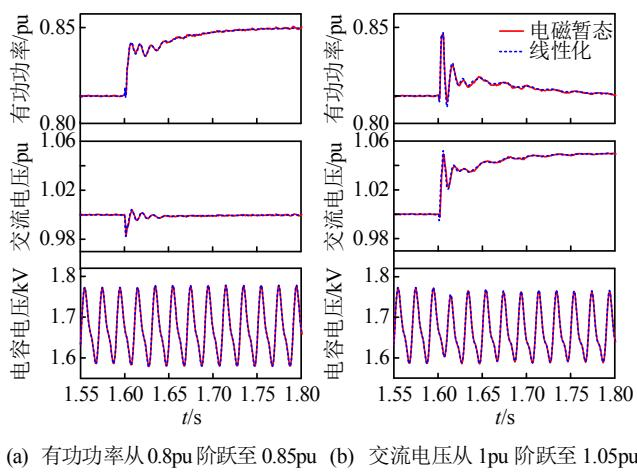  
图 3 仿真验证结果  
Fig. 3 Validation of simulation results

其中主电路和控制系统初始参数见表 1、2。

表1 系统主电路参数  
Table 1 Main circuit parameters of system   
表2 MMC 控制器初始主要参数  

<table><tr><td>参数</td><td>数值</td><td>参数</td><td>数值</td></tr><tr><td>交流电压/kV</td><td>525</td><td>额定功率/MW</td><td>1250</td></tr><tr><td>直流电压/kV</td><td>840</td><td>子模块电容/mF</td><td>11</td></tr><tr><td>桥臂子模块数/个</td><td>500/540</td><td>桥臂阻感</td><td>0.1Ω/140mH</td></tr><tr><td>换流变阻抗/pu</td><td>0.14</td><td>换流变变比</td><td>525/435</td></tr><tr><td>电网等效电感Lg/mH</td><td>160</td><td>Cpcc补偿容量/pu</td><td>0.15</td></tr></table>

Table 2 Main initial controllers’ parameters of MMC   

<table><tr><td>参数</td><td>数值</td><td>参数</td><td>数值</td></tr><tr><td>交流电压控制器kpuac</td><td>0.01</td><td>交流电压控制器kiuac</td><td>0.5</td></tr><tr><td>有功控制器kp</td><td>1×10-6</td><td>有功控制器kp</td><td>5×10-5</td></tr><tr><td>电流内环控制器kpi</td><td>137.5</td><td>电流内环控制器ki</td><td>6875</td></tr><tr><td>环流抑制控制器kpcir</td><td>50</td><td>环流抑制控制器kcir</td><td>2500</td></tr><tr><td>锁相环控制器kppll</td><td>0.001</td><td>锁相环控制器kipll</td><td>0.05</td></tr></table>

图 3(a)是有功功率参考值在 t = 1.6s 从 0.8pu 阶跃至 0.85pu 的对比结果，图 3(b)是 PCC 点交流电压参考值在 t = 1.6s 从 1pu 阶跃至 1.05pu 的对比结果。可知，线性化模型和电磁暂态仿真模型的曲线基本吻合。另外，由于交流系统较弱，有功功率和交流电压的动态变化存在瞬时同时性，即存在较强的瞬时耦合特性，2 个外环之间动态过程相互耦合影响。

# 3 外环控制器参数解析计算方法

由于式(9)所给出的柔直换流站模型具有高阶性质，不可能实现外环控制器参数的解析计算；因此，需要对换流站的模型进行降阶与简化，同时在满足动态性能的要求下还需保持系统稳定。

# 3.1 模型降阶与简化

在表 1、2 所示参数下，系统发生失稳的功率约为 -0.72pu，失稳特征根约为 1.1 ±j441.8，对应谐振频率约为 70.3Hz。对该失稳特征根进行模态分析，其中归一化后的参与变量和参与因子分析结果如图 4 所示。可知，弱交流电网情况下影响系统失稳的因素具有多方面性，除环流及其抑制控制环节的影响较小以外，交流系统强度 SCR、PCC 点电容、子模块电容、桥臂电感及与换流变组成的交流侧等效电感 $L _ { \mathrm { e q } } .$ 、PLL、外环控制环节及其二阶低通滤波器、交流电压前馈及电流内环控制器均对稳定性存在一定影响。参与因子大于 0.5 的环节分别是电网电感 $L _ { \mathrm { g } }$ 、MMC 交流侧等效电感$L _ { \mathrm { e q } }$ 、PLL，其中与 $q$ 轴相关的变量占据了影响的

主导因素，导致这种现象的原因是 PLL 利用 PCC点 q 轴电压进行锁相。

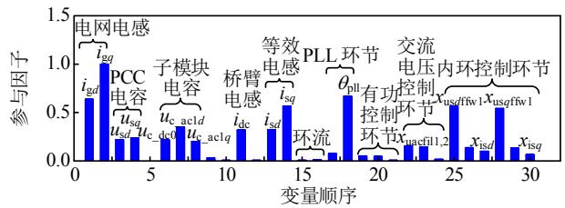  
图 4 失稳特征根模态分析  
Fig. 4 Modal analysis of unstable eigenvalues

以上分析只是为了后续给出外环控制器参数选择范围提供稳定性分析限定依据，但是为了计算符合系统特性需求的外环控制器参数，还需要依据动态响应主导特征根所涉及的参与变量进行简化。从图 3 可知，在外环参考值发生阶跃之后，系统动态响应过程是以一阶伴随振荡衰减的形式上升至参考值。该工况下，交流电压闭环传递函数的主导零极点分布如图 5 所示。由此可见，当零极点的实部小于 -30后，有多对相近零极点对，即使周围没有零点的极点，也会因实部值较大而衰减较快。然而，在[-20 -10]的实部范围内，有 3 个零点和4 个极点，其中两对零极点主要影响图 3 中的振荡衰减，影响交流电压动态特性的零点和极点放大至右边小图，在抵消一对零极点之后还剩下一个极点。综上所知，主要影响交流电压动态特性的极点是-19.6 ± j3.9，零点是 -19.8，交流电压传递函数近似于一阶模型，时间常数约为 56ms。

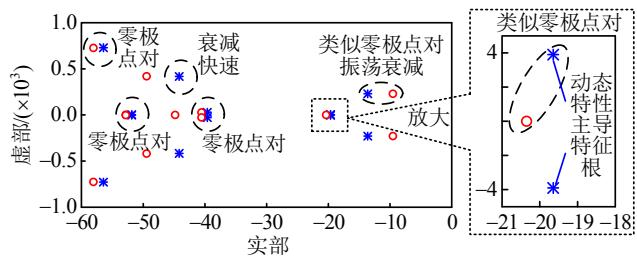  
图 5 零极点分布  
Fig. 5 Map of zeros and poles

对影响交流电压动态特性的极点 $- 1 9 . 6 \pm \mathrm { j } 3 . 9$ 进行模态分析，可以得到如图 6 所示的参与变量和参与因子。可知，外环控制器是影响系统动态响应速度的主导因素，其次是电流内环控制器和电网等效电感。另外，影响系统稳定性的 PCC 电容、子模块电容、桥臂电感、交流侧等效电感 $L _ { \mathrm { e q } } .$ 、PLL 和环流抑制对系统动态特性几乎没有影响。

图7给出了有功功率稳态运行点对稳定性的影

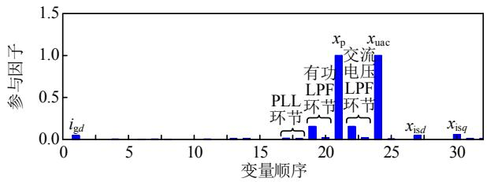  
图6 动态特性主导特征根模态分析

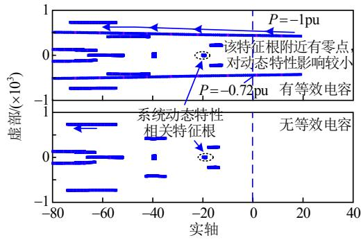  
Fig. 6 Modal analysis of dominant eigenvalues regarding dynamics   
图7 稳态运行点对稳定性的影响  
Fig. 7 Influence of steady state operating points on stability

响，在 PCC点有等效电容的情况下，系统容易发生失稳，并且柔直换流站满功率运行于逆变状态下的稳定性最弱。然而，当 PCC 点没有等效电容时，系统在全功率范围内均能保持稳定。另外，与系统动态响应速度相关的主导特征根受稳态运行点的影响发生了较小变化，也就是说稳态运行点也会较小的影响系统一阶惯性环节的动态特性。

综上所述，为了实现外环控制器参数的解析计算，可进行以下简化：忽略 MMC内部动态过程、环流及其抑制环节、PLL、电压前馈、电流内环响应、外环低通滤波器。

# 3.2 准稳态下电压扰动与功率扰动的解析关系

外环动态响应过程一般远小于电流内环的动态过程，若忽略电流内环的影响，则初步认为系统处于准稳态，即只考虑外环动态过程。以相电压幅值为例，PCC 电压和功率之间满足以下约束关系：

$$
\begin{array}{l} \left(1. 5 u _ {\mathrm {s}} ^ {2}\right) ^ {2} - 1. 5 \left[ 1. 5 u _ {\mathrm {g}} ^ {2} - 2 \left(p _ {\mathrm {g}} R _ {\mathrm {g}} + q _ {\mathrm {g}} X _ {\mathrm {g}}\right) \right] u _ {\mathrm {s}} ^ {2} + \\ (R _ {\mathrm {g}} ^ {2} + X _ {\mathrm {g}} ^ {2}) \left(p _ {\mathrm {g}} ^ {2} + q _ {\mathrm {g}} ^ {2}\right) = 0 \tag {11} \\ \end{array}
$$

在 PCC 定交流电压控制模式下，无功功率与交流电压和有功功率之间满足以下关系：

$$
\begin{array}{l} q _ {\mathrm {g}} = \left\{\left\{\left(1. 5 u _ {\mathrm {s}} ^ {2} X _ {\mathrm {g}}\right) ^ {2} - \left[ 2. 2 5 u _ {\mathrm {s}} ^ {4} - 2. 2 5 u _ {\mathrm {s}} ^ {2} u _ {\mathrm {g}} ^ {2} + 3 u _ {\mathrm {s}} ^ {2} R _ {\mathrm {g}} p _ {\mathrm {g}} + \right. \right. \right. \\ (R _ {\mathrm {g}} ^ {2} + X _ {\mathrm {g}} ^ {2}) p _ {\mathrm {g}} ^ {2} ] \left(R _ {\mathrm {g}} ^ {2} + X _ {\mathrm {g}} ^ {2}\right) \} ^ {\frac {1}{2}} - 1. 5 u _ {\mathrm {s}} ^ {2} X _ {\mathrm {g}} \} / \left(R _ {\mathrm {g}} ^ {2} + X _ {\mathrm {g}} ^ {2}\right) \tag {12} \\ \end{array}
$$

$$
q _ {\mathrm {s}} = q _ {\mathrm {g}} + 1. 5 u _ {\mathrm {s}} ^ {2} \omega_ {1} C _ {\mathrm {p c c}} \tag {13}
$$

假设 PCC 点电压被控制在额定值，电源电压也是额定值，在忽略电阻 $R _ { \mathrm { g } }$ 的基础上，对式(11)、(13)求取电压与功率的偏导数，并整理可得：

$$
\Delta u _ {\mathrm {s}} = - \left[ \left(3 X _ {\mathrm {g}} U _ {\mathrm {s N}} ^ {2} + 2 X _ {\mathrm {g}} ^ {2} Q _ {\mathrm {g 0}}\right) \Delta q _ {\mathrm {s}} + 2 X _ {\mathrm {g}} ^ {2} P _ {\mathrm {g 0}} \cdot \Delta p _ {\mathrm {s}} \right] / [ 4. 5 \cdot
$$

$$
\left. U _ {\mathrm {s N}} ^ {3} + 6 X _ {\mathrm {g}} U _ {\mathrm {s N}} Q _ {\mathrm {g 0}} - 3 U _ {\mathrm {s N}} \left(3 X _ {\mathrm {g}} U _ {\mathrm {s N}} ^ {2} + 2 X _ {\mathrm {g}} ^ {2} Q _ {\mathrm {g 0}}\right) \omega_ {1} C _ {\mathrm {p c c}} \right] \tag {14}
$$

考虑到交流系统静态短路比 $S _ { \mathrm { s c r } }$ 的定义，即：

$$
S _ {\mathrm {s c r}} = \frac {1 . 5 U _ {\mathrm {s N}} ^ {2}}{P _ {\mathrm {d c N}} X _ {\mathrm {g}}} \tag {15}
$$

根据式(15)定义，式(14)可进一步表示为

$$
\Delta u _ {\mathrm {s}} = - K _ {\mathrm {u s q s}} \cdot \Delta q _ {\mathrm {s}} - K _ {\mathrm {u s p s}} \cdot \Delta p _ {\mathrm {s}} \tag {16}
$$

其中：

$$
\left\{ \begin{array}{l} K _ {\mathrm {u s q s}} = U _ {\mathrm {s N}} \frac {\sqrt {P _ {\mathrm {d c N}} ^ {2} S _ {\mathrm {s c r}} ^ {2} - P _ {\mathrm {g 0}} ^ {2}}}{K _ {\mathrm {u s p q}}} > 0 \\ K _ {\mathrm {u s p s}} = U _ {\mathrm {s N}} \frac {P _ {\mathrm {g 0}}}{K _ {\mathrm {u s p q}}} \\ K _ {\mathrm {u s p q}} = \left(2 P _ {\mathrm {d c N}} S _ {\mathrm {s c r}} - 3 U _ {\mathrm {s N}} ^ {2} \omega_ {1} C _ {\mathrm {p c c}}\right) \sqrt {P _ {\mathrm {d c N}} ^ {2} S _ {\mathrm {s c r}} ^ {2} - P _ {\mathrm {g 0}} ^ {2}} - \\ P _ {\mathrm {d c N}} ^ {2} S _ {\mathrm {s c r}} ^ {2} > 0 \end{array} \right. \tag {17}
$$

由(16)可知，没有功率扰动时，交流电压的扰动也为零。在只考虑外环动态过程的准稳态情况下，PCC 点电压扰动程度与功率的扰动程度近似成比例关系，且该比例关系与短路比 $S _ { \mathrm { s c r } }$ 、PCC 点等效电容 $C _ { \mathrm { p c c } }$ 以及输送的有功功率 $P _ { \mathrm { g 0 } } ( P _ { \mathrm { s 0 } } )$ 有关。根据式(17)，可以得到 $K _ { \mathrm { u s } q \mathrm { s } }$ 的取值范围为

$$
\left\{ \begin{array}{l} K _ {\mathrm {u s q s}} \geq \frac {U _ {\mathrm {s N}}}{P _ {\mathrm {d c N}} S _ {\mathrm {s c r}} - 3 U _ {\mathrm {s N}} ^ {2} \omega_ {1} C _ {\mathrm {p c c}}} \\ K _ {\mathrm {u s q s}} \leq \underbrace {\frac {U _ {\mathrm {s N}} \sqrt {S _ {\mathrm {s c r}} ^ {2} - 1}}{\left(2 P _ {\mathrm {d c N}} S _ {\mathrm {s c r}} - 3 U _ {\mathrm {s N}} ^ {2} \omega_ {1} C _ {\mathrm {p c c}}\right) \sqrt {S _ {\mathrm {s c r}} ^ {2} - 1} - P _ {\mathrm {d c N}} S _ {\mathrm {s c r}} ^ {2}}} _ {K _ {\mathrm {u s q s} \text {m a x}}} \end{array} \right. \tag {18}
$$

当短路比不太小时，例如 $S _ { \mathrm { s c r } } { > } 2$ ，代入相关参数至表达式(18)，则 $K _ { \mathrm { u s } q \mathrm { s } }$ 基本 $\overleftarrow { \mathbb { E } } [ 0 . 8 \times 1 0 ^ { - 4 } , 4 \times 1 0 ^ { - }$ 4 ]范围内变化。同理， $K _ { \mathrm { u s p s } }$ 的取值范围初步在±| $K _ { \mathrm { u s p s \_ m a x } } |$ 的范围内，其中：

$$
K _ {\text {u s p s} \max } = \frac {U _ {\mathrm {s N}}}{P _ {\mathrm {d c N}} S _ {\mathrm {s c r}} \left(2 \sqrt {S _ {\mathrm {s c r}} ^ {2} - 1} - S _ {\mathrm {s c r}}\right)} \tag {19}
$$

代入相关参数， $K _ { \mathrm { u s p s } }$ 基本在 $\pm 2 \times 1 0 ^ { - 4 }$ 范围内。

# 3.3 外环控制器参数解析计算

不管是电气物理 $d q$ 坐标系还是控制系统 $d q$ 坐标系，交流电压幅值的扰动以及有功功率和无功功

率的扰动计算表达式一致。因此，外环控制器参数的解析计算将基于控制系统 $d q$ 坐标系，同时忽略 q轴电压扰动的影响以降低计算难度，此时交流电压、有功功率和无功功率的线性化模型可简化表示为

$$
\left\{ \begin{array}{l} \Delta U _ {\mathrm {s}} = \Delta u _ {\mathrm {s d}} ^ {\mathrm {c s}} \\ \Delta p _ {\mathrm {s}} = 1. 5 U _ {\mathrm {s N}} \cdot \Delta i _ {\mathrm {s d}} ^ {\mathrm {c s}} + 1. 5 I _ {\mathrm {s d} 0} ^ {\mathrm {c s}} \cdot \Delta u _ {\mathrm {s d}} ^ {\mathrm {c s}} \\ \Delta q _ {\mathrm {s}} = - 1. 5 U _ {\mathrm {s N}} \cdot \Delta i _ {\mathrm {s q}} ^ {\mathrm {c s}} - 1. 5 I _ {\mathrm {s q} 0} ^ {\mathrm {c s}} \cdot \Delta u _ {\mathrm {s d}} ^ {\mathrm {c s}} \end{array} \right. \tag {20}
$$

根据图 6 得到的结论，在只考虑主导动态过程后，可得外环闭环传递函数框图如图 8 所示。

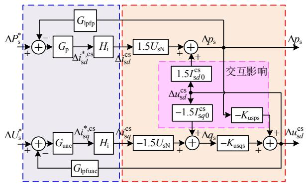  
图8 外环闭环传递函数框图  
Fig. 8 Closed-loop transfer function diagram of outer loop

根据图 8 所示框图，考虑耦合过程的双回路闭环传递函数矩阵如式(21)所示：

$$
\left[ \begin{array}{l} \Delta U _ {\mathrm {s}} \\ \Delta P _ {\mathrm {s}} \end{array} \right] = \left[ \begin{array}{l l} F _ {\mathrm {u u}} & F _ {\mathrm {u p}} \\ F _ {\mathrm {p u}} & F _ {\mathrm {p p}} \end{array} \right] \left[ \begin{array}{l} \Delta U _ {\mathrm {s}} ^ {*} \\ \Delta P _ {\mathrm {s}} ^ {*} \end{array} \right] \tag {21}
$$

式(21)中：

$$
\left\{ \begin{array}{l} F _ {\mathrm {u u}} = 1. 5 K _ {\mathrm {u s q s}} U _ {\mathrm {s N}} G _ {\mathrm {u a c}} H _ {\mathrm {i}} \frac {1 + 1 . 5 U _ {\mathrm {s N}} G _ {\mathrm {p}} G _ {\mathrm {l p f p}} H _ {\mathrm {i}}}{U _ {\mathrm {d e n}}} \\ F _ {\mathrm {p p}} = 1. 5 U _ {\mathrm {s N}} G _ {\mathrm {p}} H _ {\mathrm {i}} \cdot \\ \frac {1 - 1 . 5 K _ {\mathrm {u s q s}} I _ {\mathrm {s q 0}} ^ {\mathrm {c s}} + 1 . 5 K _ {\mathrm {u s q s}} U _ {\mathrm {s N}} G _ {\mathrm {u a c}} G _ {\mathrm {l p f u a c}} H _ {\mathrm {i}}}{U _ {\mathrm {d e n}}} \\ F _ {\mathrm {u p}} = - \frac {1 . 5 K _ {\mathrm {u s p s}} U _ {\mathrm {s N}} G _ {\mathrm {p}} H _ {\mathrm {i}}}{U _ {\mathrm {d e n}}} \\ F _ {\mathrm {p u}} = 2. 2 5 I _ {\mathrm {s d 0}} ^ {\mathrm {c s}} K _ {\mathrm {u s q s}} U _ {\mathrm {s N}} G _ {\mathrm {u a c}} H _ {\mathrm {i}} \frac {1 + 1 . 5 U _ {\mathrm {s N}} G _ {\mathrm {p}} G _ {\mathrm {l p f p}} H _ {\mathrm {i}}}{U _ {\mathrm {d e n}}} \\ U _ {\mathrm {d e n}} = (1 + 1. 5 U _ {\mathrm {s N}} G _ {\mathrm {p}} G _ {\mathrm {l p f p}} H _ {\mathrm {i}}) + (1 + 1. 5 U _ {\mathrm {s N}} G _ {\mathrm {p}} G _ {\mathrm {l p f p}} \cdot \\ H _ {\mathrm {i}}) (1. 5 K _ {\mathrm {u s q s}} U _ {\mathrm {s N}} G _ {\mathrm {u a c}} G _ {\mathrm {l p f u a c}} H _ {\mathrm {i}} - 1. 5 K _ {\mathrm {u s q s}} I _ {\mathrm {s q 0}} ^ {\mathrm {c s}}) + \\ 1. 5 K _ {\mathrm {u s p s}} I _ {\mathrm {s d 0}} ^ {\mathrm {c s}} \end{array} \right. \tag {22}
$$

式中 $U _ { \mathrm { d e n } }$ 是闭环传递函数特征多项式相关的表达式。尽管有功功率和交流电压耦合在一起，但是为了对外环控制器参数进行解析计算，仍然需要去掉耦合进行分析。考虑到外环的动态响应速度一般在百 ms 级，忽略反馈环节 LPF和电流内环响应过程，则交流电压闭环传递函数 $F _ { \mathrm { u u } } ( s )$ 和有功功率闭环传

递函数 $F _ { \mathrm { p p } } ( s )$ 可以简化为

$$
\left\{\begin{array}{r l}F _ {\mathrm {u u}}&= 1. 5 K _ {\mathrm {u s q s}} U _ {\mathrm {s N}} G _ {\mathrm {u a c}} \left(1 + 1. 5 U _ {\mathrm {s N}} G _ {\mathrm {p}}\right) / \left[ (1 + \right.\\&\left. 1. 5 U _ {\mathrm {s N}} G _ {\mathrm {p}}\right) + 1. 5 K _ {\mathrm {u s p s}} I _ {\mathrm {s d} 0} ^ {\mathrm {c s}} + \left(1 + 1. 5 U _ {\mathrm {s N}} G _ {\mathrm {p}}\right) \cdot\\&\left. \left(1. 5 K _ {\mathrm {u s q s}} U _ {\mathrm {s N}} G _ {\mathrm {u a c}} - 1. 5 K _ {\mathrm {u s q s}} I _ {\mathrm {s q} 0} ^ {\mathrm {c s}}\right) \right]\\F _ {\mathrm {p p}}&= 1. 5 U _ {\mathrm {s N}} G _ {\mathrm {p}} \left(1 - 1. 5 K _ {\mathrm {u s q s}} I _ {\mathrm {s q} 0} ^ {\mathrm {c s}} + 1. 5 K _ {\mathrm {u s q s}} U _ {\mathrm {s N}} \cdot \right.\\&\left. G _ {\mathrm {u a c}}\right) / \left[ \left(1 + 1. 5 U _ {\mathrm {s N}} G _ {\mathrm {p}}\right) + 1. 5 K _ {\mathrm {u s p s}} I _ {\mathrm {s d} 0} ^ {\mathrm {c s}} + (1 + \right.\\&\left. 1. 5 U _ {\mathrm {s N}} G _ {\mathrm {p}}\right)\left(1. 5 K _ {\mathrm {u s q s}} U _ {\mathrm {s N}} G _ {\mathrm {u a c}} - 1. 5 K _ {\mathrm {u s q s}} I _ {\mathrm {s q} 0} ^ {\mathrm {c s}}\right)\left. \right]\end{array}\right. \tag {23}
$$

将控制器 $G _ { \mathrm { p } } = k _ { \mathrm { p p } } + k _ { \mathrm { i p } } / s$ 和 $G _ { \mathrm { u a c } } = k _ { \mathrm { p u a c } } + k _ { \mathrm { i u a c } } / s$ 代入式(23)中，可以得到：

$$
\left\{ \begin{array}{l} F _ {\mathrm {u u}} = 1. 5 K _ {\mathrm {u s q s}} U _ {\mathrm {s N}} \left(k _ {\mathrm {p u a c}} s + k _ {\mathrm {i u a c}}\right) \left[ \left(1. 5 U _ {\mathrm {s N}} k _ {\mathrm {p p}} + 1\right) s + \right. \\ \left. 1. 5 U _ {\mathrm {s N}} k _ {\mathrm {i p}} \right] / \left(a _ {2} s ^ {2} + a _ {1} s + a _ {0}\right) \\ F _ {\mathrm {p p}} = 1. 5 U _ {\mathrm {s N}} \left(k _ {\mathrm {p p}} s + k _ {\mathrm {i p}}\right) \left[ \left(1 - 1. 5 K _ {\mathrm {u s q s}} I _ {\mathrm {s q 0}} ^ {\mathrm {c s}} + \right. \right. \\ \left. 1. 5 K _ {\mathrm {u s q s}} U _ {\mathrm {s N}} k _ {\mathrm {p u a c}}\right) s + 1. 5 K _ {\mathrm {u s q s}} U _ {\mathrm {s N}} k _ {\mathrm {i u a c}} ] / \\ \left(a _ {2} s ^ {2} + a _ {1} s + a _ {0}\right) \end{array} \right. \tag {24}
$$

其中：

$$
\left\{ \begin{array}{l} a _ {2} = \left(1. 5 U _ {\mathrm {s N}} k _ {\mathrm {p p}} + 1\right) \left(1. 5 K _ {\mathrm {u s q s}} U _ {\mathrm {s N}} k _ {\mathrm {p u a c}} + 1 - \right. \\ \left. 1. 5 K _ {\mathrm {u s q s}} I _ {\mathrm {s q} 0} ^ {\mathrm {c s}}\right) + 1. 5 K _ {\mathrm {u s p s}} I _ {\mathrm {s d} 0} ^ {\mathrm {c s}} \\ a _ {1} = 1. 5 U _ {\mathrm {s N}} k _ {\mathrm {i p}} \left(1. 5 K _ {\mathrm {u s q s}} U _ {\mathrm {s N}} k _ {\mathrm {p u a c}} + 1 - 1. 5 \cdot \right. \\ \left. K _ {\mathrm {u s q s}} I _ {\mathrm {s q} 0} ^ {\mathrm {c s}}\right) + 1. 5 K _ {\mathrm {u s q s}} U _ {\mathrm {s N}} k _ {\mathrm {i u a c}} \left(1. 5 U _ {\mathrm {s N}} k _ {\mathrm {p p}} + 1\right) \\ a _ {0} = 2. 2 5 K _ {\mathrm {u s q s}} U _ {\mathrm {s N}} ^ {2} k _ {\mathrm {i u a c}} k _ {\mathrm {i p}} > 0 \end{array} \right. \tag {25}
$$

显然，要使式(25)所示简化系统稳定， $a _ { 2 }$ 和 $a _ { 1 }$ 须同时大于零。由于 $K _ { \mathrm { u s p s } }$ 与 d 轴电流相乘之后大于零，则 $a _ { 2 }$ 的第二项恒大于零。柔直换流站为了维持PCC 点电压恒定，需要向交流电网注入无功功率。若 PCC 点没有等效电容且交流系统越弱，则注入的无功功率更大，进而使得 $q$ 轴无功电流更大。因此，$a _ { 2 }$ 和 $a _ { 1 }$ 中无功电流大于零是可能导致 $a _ { 2 }$ 和 $a _ { 1 }$ 小于零的根本因素。代入相关变量至 $a _ { 2 }$ ，可得：

$$
\begin{array}{l} k _ {\mathrm {p u a c}} > \left[ K _ {\mathrm {u s q s} _ {-} \max } P _ {\mathrm {d c N}} \left(S _ {\mathrm {s c r}} - \sqrt {S _ {\mathrm {s c r}} ^ {2} - 1}\right) - \right. \\ \frac {K _ {\mathrm {u s q s} \text {m a x}} P _ {\mathrm {d c N}}}{1 . 5 U _ {\mathrm {s N}} k _ {\mathrm {p p}} + 1} - U _ {\mathrm {s N}} ] \frac {1}{1 . 5 U _ {\mathrm {s N}} ^ {2} K _ {\mathrm {u s q s} \text {m a x}}} \tag {26} \\ \end{array}
$$

由此可知，为保证 $a _ { 2 } > 0$ ，定交流电压控制器的比例系数 $k _ { \mathrm { p u a c } }$ 应尽可能大；如果在因 $k _ { \mathrm { p u a c } }$ 较小可能导致 $a _ { 2 } < 0$ 的情况下，有功功率控制器的比例系数 $k _ { \mathrm { p p } }$ 应尽可能的小以降低 $a _ { 2 } < 0$ 的风险。同理，对于 $a _ { 1 }$ ，定交流电压控制器比例系数应满足：

$$
\begin{array}{l} k _ {\mathrm {p u a c}} > \left[ K _ {\mathrm {u s q s} _ {\text {m a x}}} k _ {\mathrm {i p}} P _ {\mathrm {d c N}} \left(S _ {\mathrm {s c r}} - \sqrt {S _ {\mathrm {s c r}} ^ {2} - 1}\right) - U _ {\mathrm {s N}} k _ {\mathrm {i p}} - \right. \\ K _ {\mathrm {u s q s} \text {m a x}} U _ {\mathrm {s N}} k _ {\mathrm {i u a c}} \left(1. 5 U _ {\mathrm {s N}} k _ {\mathrm {p p}} + 1\right) \left[ \frac {1}{1 . 5 U _ {\mathrm {s N}} ^ {2} k _ {\mathrm {i p}} K _ {\mathrm {u s q s} \text {m a x}}} \right. \tag {27} \\ \end{array}
$$

在一般情况下，只要交流系统短路比不是过分小，则 $q$ 轴电流就不会太大，考虑 $K _ { \mathrm { u s } q \mathrm { s } }$ 的数量级为$1 0 ^ { - 4 }$ ，也能满足 $a _ { 2 }$ 和 $a _ { 1 }$ 都大于零。当交流系统较弱，例如 $S _ { \mathrm { s c r } } { = } 1 . 2$ ，如果 $P _ { \mathrm { s 0 } } = \mathrm { 1 p u }$ 、 $k _ { \mathrm { u p a c } } { = } 0 . 0 0 1$ 、 $k _ { \mathrm { i p a c } } =$ $0 . 0 5$ 、 $k _ { \mathrm { p p } } { = } 2 \times 1 0 ^ { - } 5$ 、 $k _ { \mathrm { i p } } = 0 . 0 0 1$ 时，则有 $a _ { 2 } < 0$ ，系统失稳。

另外，在 $a _ { 2 }$ 和 $a _ { 1 }$ 都大于零的时候，式(24)是一个有零点的二阶系统，且 $F _ { \mathrm { u u } } ( s )$ 和 $F _ { \mathrm { p p } } ( s )$ 的单位阶跃响应在稳态时都等于 1。 $F _ { \mathrm { u u } } ( s )$ 和 $F _ { \mathrm { p p } } ( s )$ 都存在两个与外环控制器参数相关的左半平面零点；其中$F _ { \mathrm { u u } } ( s )$ 的零点只与外环控制器参数有关，不会随着功率变化而变化。然而， $F _ { \mathrm { p p } } ( s )$ 的一个零点只与有功功率控制器参数有关，另外一个零点不仅与交流电压控制器参数有关，还与 $K _ { \mathrm { u s } q \mathrm { s } }$ 和无功功率有关。

根据图 3 和图 5 得到的结论，外环动态响应近似为含有左半平面零点的一阶环节动态响应，于是可将式(24)写成零极点的传递函数形式：

$$
\left\{ \begin{array}{r l} F _ {\mathrm {u u}} & = \frac {\left(\frac {k _ {\mathrm {p u a c}}}{k _ {\mathrm {i u a c}}} s + 1\right) \left[ \frac {(1 . 5 U _ {\mathrm {s N}} k _ {\mathrm {p p}} + 1)}{1 . 5 U _ {\mathrm {s N}} k _ {\mathrm {i p}}} s + 1 \right]}{\left(\tau_ {\mathrm {u}} s + 1\right) \left(\tau_ {\mathrm {p}} s + 1\right)} \\ F _ {\mathrm {p p}} & = \frac {k _ {\mathrm {p p}}}{k _ {\mathrm {i p}}} s + 1) \left[ \frac {1 . 5 K _ {\mathrm {u s q s}} U _ {\mathrm {s N}} k _ {\mathrm {p u a c}} + 1 - 1 . 5 K _ {\mathrm {u s q s}} I _ {\mathrm {s q 0}} ^ {\mathrm {c s}}}{1 . 5 K _ {\mathrm {u s q s}} U _ {\mathrm {s N}} k _ {\mathrm {i u a c}}} \right. \\ & \left. \quad s + 1 \right] \frac {1}{\left(\tau_ {\mathrm {u}} s + 1\right) \cdot \left(\tau_ {\mathrm {p}} s + 1\right)} \end{array} \right. \tag {28}
$$

若忽略 $a _ { 2 }$ 中关于 $d$ 轴电流的附加项，则式(28)还可以进一步简化为

$$
\left\{ \begin{array}{l} F _ {\mathrm {u u}} = \frac {k _ {\mathrm {p u a c}} s / k _ {\mathrm {i u a c}} + 1}{\tau_ {\mathrm {u}} s + 1} \\ F _ {\mathrm {p p}} = \frac {k _ {\mathrm {p p}} s / k _ {\mathrm {i p}} + 1}{\tau_ {\mathrm {p}} s + 1} \end{array} \right. \tag {29}
$$

其中交流电压和有功功率动态响应时间常数约为

$$
\left\{ \begin{array}{l} \tau_ {\mathrm {u}} = \frac {k _ {\mathrm {p u a c}}}{k _ {\mathrm {i u a c}}} + \frac {1 - 1 . 5 K _ {\mathrm {u s q s}} I _ {\mathrm {s q 0}} ^ {\mathrm {c s}}}{1 . 5 K _ {\mathrm {u s q s}} U _ {\mathrm {s N}} k _ {\mathrm {i u a c}}} \\ \tau_ {\mathrm {p}} = \frac {k _ {\mathrm {p p}}}{k _ {\mathrm {i p}}} + \frac {1}{1 . 5 U _ {\mathrm {s N}} k _ {\mathrm {i p}}} \end{array} \right. \tag {30}
$$

由式(29)、(30)可知，交流电压和有功功率的传递函数类似于一阶环节，其中交流电压的响应时间不仅与控制器参数有关，还与 SCR和稳态点有关；然而，有功功率的响应时间只与控制器参数有关，与 SCR 和稳态点无关。由于存在左半平面零点，交流电压和有功功率在动态初始过程存在一定的跳

变，跳变值与参考阶跃值之间的比值关系约为

$$
\left\{ \begin{array}{l} K _ {\text {s t e p u}} = \frac {1 . 5 K _ {\text {u s q s}} U _ {\text {s N}} k _ {\text {p u a c}}}{1 . 5 K _ {\text {u s q s}} U _ {\text {s N}} k _ {\text {p u a c}} + 1 - 1 . 5 K _ {\text {u s q s}} I _ {\text {s q 0}} ^ {\mathrm {c s}}} \\ K _ {\text {s t e p p}} = \frac {1 . 5 k _ {\text {p p}} U _ {\text {s N}}}{1 . 5 U _ {\text {s N}} k _ {\text {p p}} + 1} \end{array} \right. \tag {31}
$$

结合外环时间常数和给定的跳变值，可以解析计算出外环控制器的参数为：

$$
\left\{ \begin{array}{l} k _ {\mathrm {p u a c}} = \frac {K _ {\mathrm {s t e p u}} \left(1 - 1 . 5 K _ {\mathrm {u s q s}} I _ {\mathrm {s q 0}} ^ {\mathrm {c s}}\right)}{1 . 5 U _ {\mathrm {s N}} \left(1 - K _ {\mathrm {s t e p u}}\right) K _ {\mathrm {u s q s}}} \\ k _ {\mathrm {i u a c}} = \frac {1 - 1 . 5 K _ {\mathrm {u s q s}} I _ {\mathrm {s q 0}} ^ {\mathrm {c s}}}{1 . 5 U _ {\mathrm {s N}} \left(1 - K _ {\mathrm {s t e p u}}\right) K _ {\mathrm {u s q s}} \tau_ {\mathrm {u}}} \end{array} \right. \tag {32}
$$

$$
\left\{ \begin{array}{l} k _ {\mathrm {p p}} = \frac {K _ {\mathrm {s t e p p}}}{1 . 5 U _ {\mathrm {s N}} \left(1 - K _ {\mathrm {s t e p p}}\right)} \\ k _ {\mathrm {i p}} = \frac {1}{1 . 5 U _ {\mathrm {s N}} \left(1 - K _ {\mathrm {s t e p p}}\right) \tau_ {\mathrm {p}}} \end{array} \right. \tag {33}
$$

一般情况下，控制器参数是以零功率运行点为基础进行设计或计算，则交流电压控制器参数的解析计算公式可表示为

$$
\left\{ \begin{array}{l} k _ {\mathrm {p u a c}} = \frac {K _ {\mathrm {s t e p u}} \left(P _ {\mathrm {d c N}} S _ {\mathrm {s c r}} - 3 U _ {\mathrm {s N}} ^ {2} \omega_ {\mathrm {l}} C _ {\mathrm {p c c}}\right)}{1 . 5 U _ {\mathrm {s N}} ^ {2} \left(1 - K _ {\mathrm {s t e p u}}\right)} \\ k _ {\mathrm {i u a c}} = \frac {P _ {\mathrm {d c N}} S _ {\mathrm {s c r}} - 3 U _ {\mathrm {s N}} ^ {2} \omega_ {\mathrm {l}} C _ {\mathrm {p c c}}}{1 . 5 U _ {\mathrm {s N}} ^ {2} \left(1 - K _ {\mathrm {s t e p u}}\right) \tau_ {\mathrm {u}}} \end{array} \right. \tag {34}
$$

由(33)、(34)可知，外环控制器中比例系数基本由阶跃比值确定，积分系数由阶跃比值和时间常数决定；另外，交流电压控制器参数与短路比 SCR基本呈现正比例关系，也就是说交流系统越弱，控制器参数越小。需要说明的是，系统在阶跃动态响应过程中，式(34)所计算出来的参数只是使得除了有功功率和交流电压按照式(29)所示传递函数变化以外，还存在其它振荡模态，因此真正的动态响应初始阶段并不一定是呈现式(31)所示的值，是该模态与其它模态的叠加，其中对实际动态特性影响最大的是与稳定性相关的特征根。

例如以表 1、2 所示的主电路和交流电压控制器参数为例，根据式(31)、(32)，在零功率情况下可计算出交流电压阶跃值和时间常数分别为 0.36pu和 56ms。本部分将在零功率状态和 PCC 点无等效电容的情况下，以交流电压阶跃值 0.36pu 和时间常数 56 与 120ms为例，分析不同交流系统 SCR 和有功功率对两者的影响，其中 SCR=3 和 $\tau _ { \mathrm { u } } = 1 2 0 \mathrm { m s }$ 时，对应的 $k _ { \mathrm { p u a c } } = 0 . 0 1$ 和 $k _ { \mathrm { i u a c } } = 0 . 2 3 2$ 。

图 9 给出 SCR 为3 和 1.5的情况下，有功功率变化对阶跃值 $K _ { \mathrm { s t e p u } }$ 和交流电压时间常数 $\tau _ { \mathrm { u } }$ 的影响。在 SCR = 3 的情况下，阶跃值 $K _ { \mathrm { s t e p u } }$ 和时间常数 $\tau _ { \mathrm { u } }$ 的影响约为 8%。在 $\mathrm { S C R } = 1 . 5$ 的情况下，阶跃值$K _ { \mathrm { s t e p u } }$ 的变化最大达到 62%，时间常数的变化约为38%。分析结果表明，功率越大或者短路比越小，则对这两个参数的影响也就越大。

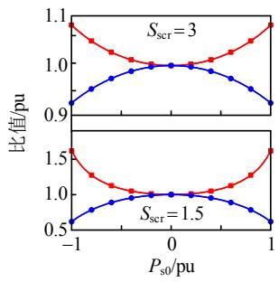  
(a) $K _ { \mathrm { s t e p u } } { = } 0 . 3 6 , ~ \tau _ { \mathrm { u } } { = } 5 6 \mathrm { m s }$

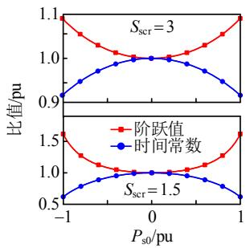  
(b) Kstepu = 0.36，τ u = 120ms   
图 9 有功功率对交流电压环阶跃值和时间常数的影响  
Fig. 9 Influence of active power on step value and time constant of AC voltage loop

# 3.4 外环控制器参数计算的上限值

3.3 节给出的参数计算公式并没有考虑外环反馈环节 LPF 和电流内环动态响应的影响。经对比研究发现，式(33)、(34)所给计算公式相当于忽略了交流电压和有功功率之间的交互影响。若考虑有功功率和稳态运行点的影响，以交流电压控制环路为例，则式(21)所示的电压环闭环传递函数可等效为

$$
\begin{array}{l} F _ {\mathrm {u u}} \approx \left(1. 5 K _ {\mathrm {u s q s}} U _ {\mathrm {s N}} G _ {\mathrm {u a c}} H _ {\mathrm {i}}\right) / \left(1 - 1. 5 K _ {\mathrm {u s q s}} I _ {\mathrm {s q 0}} ^ {\mathrm {c s}} + \right. \\ 1. 5 K _ {\mathrm {u s p s}} I _ {\mathrm {s d} 0} ^ {\mathrm {c s}} + 1. 5 K _ {\mathrm {u s q s}} U _ {\mathrm {s N}} G _ {\mathrm {u a c}} G _ {\mathrm {l p f u a c}} H _ {\mathrm {i}}) \tag {35} \\ \end{array}
$$

根据式(35)，交流电压开环传递函数可描述为

$$
H _ {\text {o p e n} \mathrm {u}} = K _ {\text {o p e n} \mathrm {u}} G _ {\text {u a c}} G _ {\text {l p f u a c}} H _ {\mathrm {i}} \tag {36}
$$

其中：

$$
K _ {\text {o p e n} \mathrm {u}} = \frac {1 . 5 K _ {\mathrm {u s q s}} U _ {\mathrm {s N}}}{1 - 1 . 5 K _ {\mathrm {u s q s}} I _ {\mathrm {s q} 0} ^ {\mathrm {c s}} + 1 . 5 K _ {\mathrm {u s p s}} I _ {\mathrm {s d} 0} ^ {\mathrm {c s}}} \tag {37}
$$

忽 略 $G _ { \mathrm { l p f u a c } } ( s )$ 和 Hi(s) 的 影 响 ， 求 解$| H _ { \mathrm { o p e n \_ u } } ( \mathrm { j } \omega ) | = | K _ { \mathrm { o p e n \_ u } } \cdot G _ { \mathrm { u a c } } ( \mathrm { j } \omega ) | = 1$ 的穿越角频率$\omega _ { \mathrm { u } } \mathrm { . }$ ，即：

$$
\omega_ {\mathrm {u}} = \frac {k _ {\mathrm {i u a c}} K _ {\mathrm {o p e n} \cdot \mathrm {u}}}{\sqrt {1 - k _ {\mathrm {p u a c}} ^ {2} K _ {\mathrm {o p e n} \cdot \mathrm {u}} ^ {2}}} \tag {38}
$$

考虑到穿越角频率 $\omega _ { \mathrm { u } }$ 大于零，则定交流电压控制器的比例系数应满足以下限制条件：

$$
k _ {\mathrm {p u a c}} <   \frac {1 - 1 . 5 K _ {\mathrm {u s q s}} I _ {\mathrm {s q} 0} ^ {\mathrm {c s}} + 1 . 5 K _ {\mathrm {u s p s}} I _ {\mathrm {s d} 0} ^ {\mathrm {c s}}}{1 . 5 K _ {\mathrm {u s q s}} U _ {\mathrm {s N}}} \tag {39}
$$

同理，针对有功功率环，定有功功率控制器的比例系数也应满足以下限制条件：

$$
k _ {\mathrm {p p}} <   \frac {1}{1 . 5 U _ {\mathrm {s N}}} \tag {40}
$$

式(40)说明，有功功率比例系数的上限值与SCR 和稳态运行点无关，但是这不代表 $k _ { \mathrm { p p } }$ 大于上限值时系统就不稳定，因为 MMC运行于整流状态时，PLL 会提供一定的正阻尼支撑，进而就能在一定程度上提升稳定性。

以表 1、2 所示的有功功率控制器参数为例，可计算出 $K _ { \mathrm { s t e p p } } { \approx } 0 . 3 4 8$ ， $\tau _ { \mathrm { p } } { \approx } 5 8 \mathrm { m s }$ ，基本与交流电压控制器参数具有相同的阶跃值和时间常数。图 10给出了交流电压控制器比例系数随 SCR 变化的上限曲线(下限曲线基本符合式(26)、(27)的限制条件)，从该图可清楚看出，SCR 越大，交流电压控制器比例系数限值就可以选择越大；当SCR>2时，上限值与SCR基本呈现正比关系。当交流系统极弱时，有功功率环和交流电压环都应该选择非常小的控制器参数以降低失稳风险，但是过小的控制器参数可能导致系统动态响应速度不满足工程设计要求。

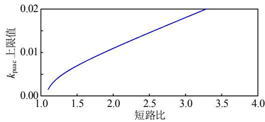  
图10 交流电压控制器比例系数限制曲线  
Fig. 10 Limiting curve of proportional coefficient of AC voltage controller

式(39)、(40)所给出的限制条件是以准稳态为基础，在没有额外稳定性提升环节的控制下，能使得系统稳定的比例系数需要限制在该范围内。然而，当考虑详细模型之后，控制器参数建议选择中间的值，这就保证了科研工作者可以根据实际系统参数，初步计算外环控制器参数的限制范围，降低参数设计试凑所花费的时间，有利于提升研究效率。

# 4 考虑稳定性影响的外环控制器参数限制因素

# 4.1 稳定性影响规律

根据图 4 可知，外环控制器参数的选择受多方面的因素限制，本小节将在不同 SCR 情况下，以式(33)、(34)为基础计算外环控制器参数，其中阶跃

值和时间常数分别为 0.35 和 60ms。外环二阶 LPF的阻尼比和截止频率基准值分别为 0.707 和20Hz，电压前馈二阶 LPF 的阻尼比和截止频率分别为0.707、200Hz，电流内环带宽基准值 1000rad/s。在SCR={3,2,1.5}的情况下，有功控制器的比例和积分系数分别为 $k _ { \mathrm { p p } } { = } 1 . 0 1 \times 1 0 ^ { - 6 }$ 和 $k _ { \mathrm { i p } } { = } 3 . 1 2 \times 1 0 ^ { - 5 } ;$ ；交流电压控制器比例系数和积分系数分别为 $k _ { \mathrm { p u a c } } =$ {0.0096, 0.006, 0.00427}和 $k _ { \mathrm { i u a c } } = \{ 0 . 4 5 7 , 0 . 2 8 8 , 0 . 2 0 3 \}$ 。在有功功率为 -1pu 的情况下，各个环节参数变化对稳定性的影响总结如表 3 所示。

表3 稳定性影响总结  
Table 3 Influence summary of stability   

<table><tr><td>PLL基准值</td><td colspan="2">kppll=10-3, kipll=5×10-2</td><td colspan="2">kppll=5×10-4, kppll=0.025</td></tr><tr><td>SCR</td><td>3</td><td>2</td><td>2</td><td>1.5</td></tr><tr><td>Glpfp/Hz</td><td>&gt;100</td><td>Null</td><td>&gt;80</td><td>Null</td></tr><tr><td>Glpfuac</td><td>Null</td><td>Null</td><td>Null</td><td>Null</td></tr><tr><td>Glpffw/Hz</td><td>&gt;270</td><td>Null</td><td>&gt;430</td><td>Null</td></tr><tr><td>电流环带宽</td><td>Null</td><td>Null</td><td>Null</td><td>Null</td></tr><tr><td>kppll</td><td>6×10-5&lt;kppll&lt;7.2×10-4</td><td>Null</td><td>Null</td><td>Null</td></tr><tr><td>kipll</td><td>Null</td><td>Null</td><td>Null</td><td>Null</td></tr><tr><td>kppll=50kppll</td><td>kppll&lt;7.5×10-4</td><td>kppll&lt;3.4×10-4</td><td>kppll&lt;1.8×10-4</td><td></td></tr></table>

注：Null 表示无显著影响，即合理单一改变参数始终不稳定。

可知，1）增大有功功率环和电压前馈环节二阶 LPF 的带宽有利于提升稳定性；2）PLL 积分系数 $k _ { \mathrm { i p l l } }$ 和比例系数 $k _ { \mathrm { p p l l } }$ 应保持一定的比值变化，且降低参数有利于提升稳定性，单一改变 $k _ { \mathrm { p p l l } }$ 或 $k _ { \mathrm { i p l l } }$ 使得两者的比值不协调时也不一定能保证稳定性；3）尽管降低交流电压环二阶 LPF 的带宽和增大电流内环带宽能提升稳定性，但是在过大的 PLL 参数情况下，其改变程度不是太大。

# 4.2 柔直换流站阻抗模型及其分析

根据式(9)，柔直换流站在电气物理 $d q$ 坐标系上的详细阻抗模型为

$$
\boldsymbol {Z} _ {\mathrm {m m c}} ^ {d q} = \left[ \begin{array}{l l} Z _ {\mathrm {m m c}} ^ {d d} & Z _ {\mathrm {m m c}} ^ {d q} \\ Z _ {\mathrm {m m c}} ^ {q d} & Z _ {\mathrm {m m c}} ^ {q q} \end{array} \right] = \boldsymbol {C} _ {\mathrm {m m c}} (s \boldsymbol {I} - \boldsymbol {A} _ {\mathrm {m m c}}) ^ {- 1} \boldsymbol {B} _ {\mathrm {m m c} 1} \tag {41}
$$

将式(41)所示的 dq 阻抗矩阵转换为正序阻抗：

$$
Z _ {\mathrm {m m c}} ^ {\mathrm {p}} = \frac {2 \left(Z _ {\mathrm {m m c}} ^ {d d} Z _ {\mathrm {m m c}} ^ {q q} - Z _ {\mathrm {m m c}} ^ {d q} Z _ {\mathrm {m m c}} ^ {q d}\right)}{Z _ {\mathrm {m m c}} ^ {d d} + Z _ {\mathrm {m m c}} ^ {q q} + \mathrm {j} \left(Z _ {\mathrm {m m c}} ^ {d q} - Z _ {\mathrm {m m c}} ^ {q d}\right)} \tag {42}
$$

同理，交流系统正序阻抗可表示为

$$
Z _ {\text {g r i d}} ^ {\mathrm {p}} = \frac {L _ {\mathrm {g}} s + \mathrm {j} \omega_ {1} L _ {\mathrm {g}}}{L _ {\mathrm {g}} C _ {\mathrm {p c c}} (s + \mathrm {j} \omega_ {1}) ^ {2} + 1} \tag {43}
$$

根据 4.1 节结论，PLL 对弱交流电网的稳定性

影响非常大，PLL 闭环传递函数的阻尼比为 $\xi _ { \mathrm { p l l } }$ ，无阻尼振荡频率为 $f _ { \mathrm { n p l l } } .$ ，对应角频率为 $\omega _ { \mathrm { n p l l } }$ ，则 PLL控制器参数如下：

$$
\left\{ \begin{array}{l} k _ {\mathrm {p p l l}} = \frac {2 \xi_ {\mathrm {p l l}} \omega_ {\mathrm {n p l l}}}{U _ {\mathrm {s N}}} \\ k _ {\mathrm {i p l l}} = \frac {\omega_ {\mathrm {n p l l}} ^ {2}}{U _ {\mathrm {s N}}} \end{array} \right. \tag {44}
$$

根据表 3 可知， $\xi _ { \mathsf { p l l } }$ 对稳定性的影响较大，以表 2 中所示参数为例，可计算出 $\omega _ { \mathrm { n p l l } } = 1 3 3 . 3 \mathrm { r a d / s }$ ，$\xi _ { \mathrm { p l l } } = 1 . 3 3$ ，显然阻尼比与二阶标准形式不协调。因此，后续分析将以阻尼比 $\xi _ { \mathrm { p l l } } = 0 . 7 0 7$ 为基础，只研究 $f _ { \mathrm { n p l l } } ( \omega _ { \mathrm { n p l l } } )$ 变化对换流站阻抗特性的影响。

在 $P _ { \mathrm { s } } = - 1 \mathrm { p u }$ 情况下，以 SCR= 2、 $k _ { \mathrm { p u a c } } = 0 . 0 0 6 .$ 、$k _ { \mathrm { i u a c } } = 0 . 3$ 、 $\omega _ { \mathrm { n p l l } } { = } 8 0 \mathrm { r a d / s }$ 、 $\xi _ { \mathrm { p l l } } = 0 . 7 0 7$ 、内环带宽1000rad/s、外环低通滤波器带宽 20Hz 为基准，改变相关环节参数(控制器的积分系数/比例系数为固定值)进行稳定性分析，如图 11 所示。

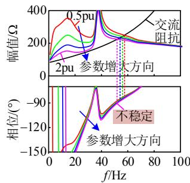  
(a) 交流电压控制器参数的影响

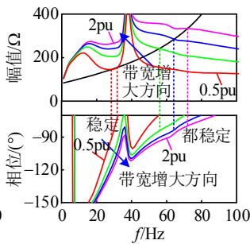  
(b) 电流环带宽的影响

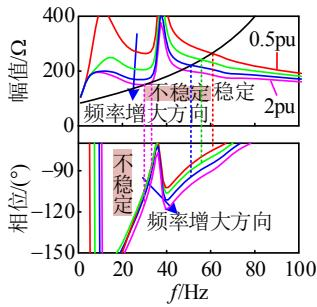  
(c) $f _ { \mathrm { n p l l } }$ l的影响

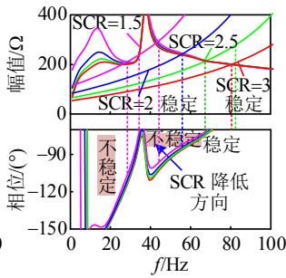  
(d) 短路比 SCR 的影响   
图11 MMC详细模型阻抗特性分析  
Fig. 11 Analysis of detailed MMC impedance

交流电压控制器参数对MMC阻抗的影响主要体现在幅值上面，基于 $d q$ 坐标系的 s域，相位特性在 50Hz 以上改变非常小。增大控制器参数会适当减弱阻尼性，同时使得阻抗幅值大大降低，导致与交流系统阻抗幅值交点的频率降低。从阻抗变化趋势可以判断，增加交流电压控制器参数将使得交点频率逐渐降低，进而交点频率处的 MMC 阻抗相位

更容易进入负阻尼区域，使得系统失稳。

电流环带宽对MMC阻抗幅值和相位均有较大的影响，增加带宽会提升阻抗幅值使得交点频率向右移动，但是会降低相位特性，也就降低了阻尼特性。该图同样说明，合理的电流环带宽虽然会影响阻尼特性，但是依然能使得系统保持稳定。如果电流环带宽继续降低，幅值交点频率将向左移动，从而会使得交点频率的相位小于 - $- 9 0 ^ { \circ }$ 诱发失稳。

PLL 闭环传递函数的无阻尼振荡频率 $f _ { \mathrm { n p l l } }$ 对MMC 阻抗幅值和相位均有较大的影响，增大 $f _ { \mathrm { n p l l } }$ 不仅会导致阻抗幅值降低，使得幅值交点频率向左移动，进入相位的负阻尼区域；而且还会大大降低相位特性，进一步诱发失稳。因此，增加 PLL 参数是从幅值和相位 2 个方面严重影响系统的稳定性。这也就解释了为什么 PLL 带宽与电流内环带宽接近时容易诱发系统失稳，其本质是 PLL 的带宽过大了，对 MMC 阻抗幅值和相位的影响过大。然而，与极弱交流电网连接的柔直换流站因 PLL 和交流电压环参数过小而诱发的失稳现象不一定是谐振稳定性问题，很有可能是有功功率值增大过程中使得无功功率的消耗过大导致交流电压降低，如果交流电压响应速度过慢，迫使交流电源电压和 PCC电压之间的相位差大于 $9 0 ^ { \circ }$ 而出现类似于“功角”稳定性的问题，该结论将在后续理论分析和电磁仿真中进行验证。

SCR 变化对 MMC 阻抗幅值在 50Hz 以上频段的影响较小，但是交流系统阻抗幅值发生了较大的变化。较小的 SCR 意味着较大的等效电抗，也就意味着较大的阻抗幅值，从而导致阻抗交点频率向左移动，使得交点频率处的 MMC 阻抗相位进入负阻尼区域，诱发振荡失稳。例如，当 SCR=1.5 时，系统产生了 2 个不稳定点。

如果外环和 PLL 参数选择过大，则越容易发生谐振失稳；如果两者参数选择适当，很有可能发生类似于同步电机的“功角”失稳。在上述两种失稳形式中，谐振失稳一般先于“功角”失稳发生，这也是相关文献在分析时并未给出“功角”失稳现象的原因。柔直换流站连接弱交流电网稳定性提升方向是改善 MMC 阻抗幅值和相位特性，该方面可以从降低交流电压控制器和 PLL 参数两个方面共同考虑。然而，从系统动/暂态运行特性考虑，过小的交流电压控制器参数可能导致系统发生非谐振振荡的类似“功角”稳定性问题。

PLL 闭环传递函数的响应速度要大于标准的二阶形式，例如在阻尼比 0.707 的情况下， $\omega _ { \mathrm { n p l l } } =$ {100, 50, 20}rad/s 时，单位阶跃响应达到 0.9 的时间 分 别 为 {9.2, 18.3, 46}ms ， 快 于 标 准 形 式 的{26.5, 53.1, 133}ms。继续以阶跃值 0.35 为基准，图 12 给出不同外环时间常数情况下，PLL 闭环传递函数无阻尼角频率 $\omega _ { \mathrm { n p l l } }$ 与 SCR 之间的限制曲线，理论上选择限制曲线以下的值就能保证不发生谐振失稳。可知，时间常数几乎不太影响 PLL参数的选择；然而，阶跃值对 PLL 参数的影响较大。较小的阶跃值对应着较小的交流电压控制器比例系数，使得 PLL 参数的选择范围更大。PLL闭环传递函数的无阻尼振荡频率 $\omega _ { \mathrm { n p l l } } { < } 5 0 \mathrm { r a d / s }$ 能保证在较宽范围内选择合适的交流电压控制器的比例参数。

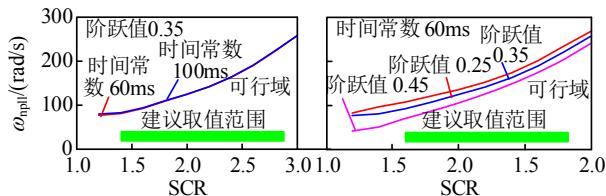  
(a) 时间常数的影响  
(b) 阶跃值的影响  
图 12 ${ \pmb \omega } _ { \bf n p l l }$ 与 SCR 限制曲线  
Fig. 12 Limit curves between ${ \pmb \omega } _ { \bf n p l l }$ and SCR

综上可知，在不考虑额外附加阻尼控制的情况下，与弱交流电网连接的柔直换流站，在 50Hz 以下低频段不可避免会引入负阻尼，且该频率范围内阻抗相位角随频率呈现递增变化趋势。因此，提升稳定性的方向是尽可能增大 MMC的阻抗幅值，进而增大与交流阻抗幅值交点的频率，使其在正阻尼范围内，达到提升稳定性的目的。为了达到上述要求，最简单的方法是降低交流电压和 PLL 控制器的比例系数，此时为了满足动态响应速度要求，则需要适当通过增大积分系数实现。

# 5 仿真验证

# 5.1 外环参数计算正确性验证

以有功功率0pu为稳态运行点且只考虑单回回路传递函数，则外环等效闭环传递函数统一为$( K _ { \mathrm { s t e p } } \tau s + 1 ) / ( \tau s + 1 ) = ( 0 . 0 2 1 s + 1 ) / ( 0 . 0 6 s + 1 )$ 。再次以阶跃值和时间常数为 0.35 和 60ms 基准，在 SCR={3,1.5}情况下，有功控制器的比例和积分系数分别为 $k _ { \mathrm { p p } } { = } 1 . 0 1 \times 1 0 ^ { - 6 }$ 和 $k _ { \mathrm { i p } } = 3 . 1 2 \times 1 0 ^ { - 5 }$ ；交流电压控制参数 $k _ { \mathrm { p u a c } } = \{ 0 . 0 0 9 6 , 0 . 0 0 4 2 7 \}$ 、 $k _ { \mathrm { i u a c } } = \{ 0 . 4 5 7 , 0 . 2 0 3 \}$ 。

本小节仿真了外环参考值阶跃变化时电磁暂态和一阶环节模型，其波形对比如图 13所示。

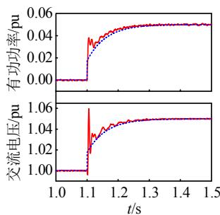  
(a) SCR = 3

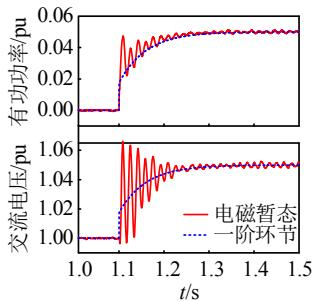  
(b) SCR = 1.5   
图 13 外环参数计算正确性验证  
Fig. 13 Validation of parameters calculation of outer loop

由图 3 可知，简化之后的一阶环节基本能表征外环的动态响应速度特性。另外，图 13 还说明，即使给定相同初始阶跃值，当 SCR极低时，系统动态过程中的振荡也会增大且极有可能产生过电压情况，其缓解方法是降低给定的阶跃值，即降低控制器的比例参数。

# 5.2 谐振稳定性验证

以绘制图 11 的参数为基准，等效电容补偿的无功功率约为0.15pu，仿真模型设置如下：在t=1.1s时刻，有功功率参考值以 10pu/s 的速度变化至±1pu，PLL闭环传递函数的无阻尼振荡角频率在1.4和 1.7s 之间为 160rad/s，其余时间为 80rad/s，具体仿真波形如图 14 所示。

由图 14 可知，在 $\omega _ { \mathrm { n p l l } } = 8 0 \mathrm { r a d / s }$ 时，整个系统没有发生谐振振荡现象；然而，当 $\omega _ { \mathrm { n p l l } } = 1 6 0 \mathrm { r a d / s }$ 且有功功率为 -1pu 时，系统发生的谐振振荡现象。以上现象说明了，运行于逆变状态的柔直换流站没有运行于整流状态时的稳定性强，整个系统的稳定

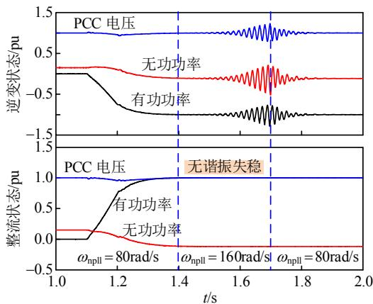  
图 14 谐振稳定性验证  
Fig. 14 Validation of resonant stability

性应受到 PLL 控制器参数的限制，电磁暂态仿真结果与理论分析一致。

# 5.3 “功角”稳定性验证

根据分析图 11、12 所得到的结论，本小节验证 PLL 带宽与外环带宽接近时所产生的稳定性问题并非一定是谐振稳定性，也有可能是类似于“功角”稳定性的问题。以外环完全简化的传递函数(0.021s + 1)/(0.06s + 1)为例，可计算出其真正的带宽约为 19rad/s。PLL 真正的带宽也选择 19rad/s，对应 $\omega _ { \mathrm { n p l l } }$ 约为 9.2rad/s。此时，外环带宽和 PLL 带宽基本相同。

仿真模型分别运行与整流和逆变状态，模型设置如下：交流系统 SCR = 1.2，在 t = {1, 2.1, 3.5, 4}s时刻，有功功率参考值以 10pu/s 的速度变化至{±0.8, ±1, ±0.5, ±1}pu；PCC 电压、功率和相位差波形如图 15 所示。在有功功率参考值从 ±0.8pu 变化至 ±1pu 后，即使外环和 PLL 的带宽一致，也没有发生谐振失稳现象，此时相位差稳态值约为 ±56°，但是在动态过程中达到了 ±78° 左右。仿真结果说明了与极弱交流电网连接的柔直换流站，只要外环带宽足够小，即使是外环和 PLL 的带宽一致，也不一定会诱发谐振失稳。然而，在有功功率参考值从±0.5pu 变化至 ±1pu 后，有功功率增大导致 PCC 点对于无功功率的需求也增加。如果交流电压环响应不够及时，使得无功功率增加不能满足系统需求，导致 PCC 点电压降低，同时增加了相位差。当 PCC电压跌落到一定程度之后，相位差大于 90°，系统

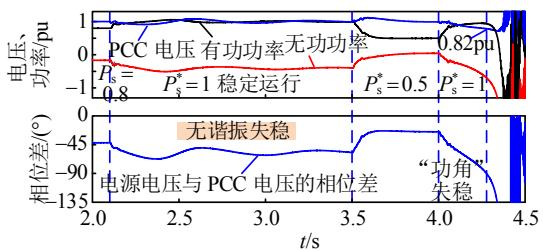  
(a) 整流模式

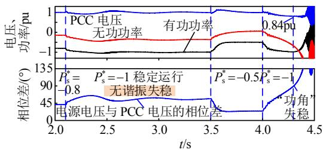  
(b) 逆变模式  
图 15 “功角”稳定性验证  
Fig. 15 Validation of power angle stability

无可行静态点而发生崩溃，此时类似于发生“功角”失稳问题。

# 6 结论

本文针对柔直换流站连接弱交流电网外环控制器参数解析计算问题，通过建立详细模型和完全简化模型，推导了参数计算解析表达式，分析了外环控制器参数选择的限制因素，得到结论如下：

1）主导动态响应速度的外环闭环传递函数可等效于含有左半平面零点的一阶环节，其中比例系数决定了初始阶跃值的大小，积分系数主导决定了时间响应常数，比例系数越大则阶跃值也越大，积分系数越大则时间响应常数越小。  
2）有功功率动态响应速度只与有功功率控制器参数有关，与 SCR 和稳态运行点等因素无关；交流电压动态响应速度主要与交流电压控制器参数、短路比、稳态点和 PCC 点等效电容有关，交流电压控制器参数越大动态响应越快，短路比越小则影响程度呈现非线性增长。  
3）交流电压控制器参数、锁相环参数和短路比是影响系统稳定性的主导因素，其中交流电压控制器参数主要影响幅值裕度，锁相环参数和短路比同时影响幅值和相位裕度；PLL 对谐振稳定性的影响与运行状态有关，其带宽和交流电压环带宽接近之后的交互影响并一定会导致谐振稳定性，其失稳机理也有可能是发生了“功角”失稳。

# 参考文献

[1] 汤广福，罗湘，魏晓光．多端直流输电与直流电网技术[J]．中国电机工程学报，2013，33(10)：8-17  
TANG Guangfu ， LUO Xiang ， WEI XiaoguangMulti-terminal HVDC and DC-grid technology[J]Proceedings of the CSEE ， 2013 ， 33(10) ： 8-17 (inChinese)．  
[2] 满九方，谢小荣，唐健，等．适用于柔直系统高频谐振分析的输电线路模型[J]．电网技术，2021，45(5)：1782-1789  
MAN Jiufang，XIE Xiaorong，TANG Jian，et al Transmission line modeling for high-frequency resonance analysis of MMC-HVDC systems[J] ． Power System Technology，2021，45(5)：1782-1789 (in Chinese)   
[3] 潘尔生，王智冬，王栋，等．基于锁相环同步控制的双馈风机弱电网接入稳定性分析[J]．高电压技术，2020，46(1)：170-177  
PAN Ersheng，WANG Zhidong，WANG Dong，et al Stability analysis of phase-locked loop synchronized

DFIGs in weak grids[J]．High Voltage Engineering，2020， 46(1)：170-177 (in Chinese)   
[4] 黄方能，韦超，周剑，等．基于谐波状态空间模型的MMC 系统高频振荡分析[J]．电网技术，2021，45(5)：1967-1975  
HUANG Fangneng，WEI Chao，ZHOU Jian，et al．MMC system high frequency resonance based on harmonic state space model[J]．Power System Technology，2021，45(5)： 1967-1975 (in Chinese)   
[5] 徐海亮，王中行，李志，等．弱电网下无刷双馈风机稳定性分析及虚拟电感控制策略[J]．电网技术，2022，46(4)：1400-1409  
XU Hailiang，WANG Zhongxing，LI Zhi，et al．Stability analysis and virtual inductance control strategy of BDFIG-based wind turbines during weak grid condition[J]．Power System Technology，2022，46(4)： 1400-1409 (in Chinese)   
[6] 郑超，张鑫，吕盼，等．VSC-HVDC 与弱交流电网混联系统大扰动行为机理及稳定控制[J]．中国电机工程学报，2019，39(3)：629-641  
ZHENG Chao，ZHANG Xin，LÜ Pan，et al．Study on the large disturbance behavior mechanism and stability control strategy for VSC-HVDC and weak AC hybrid system[J]．Proceedings of the CSEE，2019，39(3)：629-641 (in Chinese)   
[7] 王旭斌，杜文娟，王海风．弱连接条件下并网 VSC 系统稳定性分析研究综述[J]．中国电机工程学报，2018，38(6)：1593-1604  
WANG Xubin，DU Wenjuan，WANG Haifeng．Stabilityanalysis of grid-tied VSC systems under weak connectionconditions[J]．Proceedings of the CSEE，2018，38(6)：1593-1604 (in Chinese)  
[8] ZHOU J Z，DING Hui，FAN Shengtao，et al．Impact ofshort-circuit ratio and phase-locked-loop parameters onthe small-signal behavior of a VSC-HVDC converter[J]IEEE Transactions on Power Delivery，2014，29(5)：2287-2296  
[9] AGBEMUKO A J ， DOMÍNGUEZ-GARCÍA J L ，GOMIS-BELLMUNT O，et al．Passivity-based analysisand performance enhancement of a vector controlled VSCconnected to a weak AC grid[J]．IEEE Transactions onPower Delivery，2021，36(1)：156-167  
[10] 王姗姗，赵兵，吴广禄，等．弱电网下 VSC 型电力电子设备外环增强阻尼控制策略[J]．电网技术，2022，46(1)：185-194  
WANG Shanshan，ZHAO Bing，WU Guanglu，et alOuter-loop improved damping control strategy for weakgrid-tied VSC devices[J]．Power System Technology，2022，46(1)：185-194 (in Chinese)  
[11] 邵冰冰，赵书强，高本锋，等．连接弱交流电网的

VSC-HVDC 失稳机理及判据研究[J]．电工技术学报，2019，34(18)：3884-3896  
SHAO Bingbing，ZHAO Shuqiang，GAO Benfeng，et al Instability mechanism and criterion analysis of VSC-HVDC connected to the weak AC power grid[J] Transactions of China Electrotechnical Society，2019， 34(18)：3884-3896 (in Chinese)   
[12] 年珩，刘一鸣，胡彬，等．计及频率耦合特性的LCC-HVDC 送端系统阻抗建模与稳定性分析[J]．中国电机工程学报，2022，42(3)：876-885  
NIAN Hang，LIU Yiming，HU Bin，et al．Impedance modeling and stability analysis of LCC-HVDC sending terminal system considering frequency coupling characteristics[J]．Proceedings of the CSEE，2022，42(3)： 876-885 (in Chinese)   
[13] 王顺亮，孙瑞婷，马俊鹏，等．弱电网下并网逆变器正交功率同步控制策略[J]．中国电机工程学报，2022，42(23)：8475-8485  
WANG Shunliang，SUN Ruiting，MA Junpeng，et al Orthogonal power synchronization control for Gird-Connected inverters under weak grid[J]．Proceedings of the CSEE，2022，42(23)：8475-8485 (in Chinese)   
[14] 李云丰，贺之渊，孔明，等．柔性直流输电系统高频稳定性分析及抑制策略(二)：阻尼控制抑制策略[J]．中国电机工程学报，2021，41(19)：6601-6615  
LI Yunfeng，HE Zhiyuan，KONG Ming，et al．High frequency stability analysis and suppression strategy of MMC-HVDC systems (Part II) ： damping control suppression strategy[J]．Proceedings of the CSEE，2021， 41(19)：6601-6615 (in Chinese)   
[15] ARANI M F M，MOHAMED Y A R I．Analysis and performance enhancement of vector-controlled VSC in HVDC links connected to very weak grids[J]．IEEE Transactions on Power Systems，2017，32(1)：684-693   
[16] 郭春义，殷子寒，王烨，等．一种适用于MMC-HVDC联接弱受端交流电网的附加频率–电压阻尼控制方法[J]．中国电机工程学报，2018，38(17)：5020-5028  
GUO Chunyi ， YIN Zihan ， WANG Ye ， et al ． Asupplementary frequency-voltage damping control forMMC-HVDC system connected to weak AC grid[J]Proceedings of the CSEE，2018，38(17)：5020-5028 (inChinese)  
[17] 纪锋，高路，林畅．三相交流系统动力学及 VSC 接入问题研究[J]．中国电机工程学报，2022，42(6)：2286-2297  
JI Feng，GAO Lu，LIN Chang．Dynamics of three phase AC system and VSC access problem research[J] Proceedings of the CSEE，2022，42(6)：2286-2297 (in Chinese)   
[18] SONG Yipeng，WANG Xiongfei，BLAABJERG F

Impedance-based high-frequency resonance analysis of DFIG system in weak grids[J]．IEEE Transactions on Power Electronics，2017，32(5)：3536-3548   
[19] 吴广禄，王姗姗，周孝信，等．VSC 接入弱电网时外环有功控制稳定性解析[J]．中国电机工程学报，2019，39(21)：6169-6182  
WU Guanglu，WANG Shanshan，ZHOU Xiaoxin，et al Analytical analysis on the active power control stability of the weak Grids-connected VSC[J]．Proceedings of the CSEE，2019，39(21)：6169-6182 (in Chinese)   
[20] ZHANG Lidong，NEE H P，HARNEFORS L．Analysisof stability limitations of a VSC-HVDC link usingpower-synchronization control[J]．IEEE Transactions onPower Systems，2011，26(3)：1326-1337  
[21] ASHABANI M ， MOHAMED Y A R I ． Novel comprehensive control framework for incorporating VSCs to smart power grids using bidirectional Synchronous-VSC[J]．IEEE Transactions on Power Systems，2014， 29(2)：943-957   
[22] ASHABANI M，MOHAMED Y A R I．Integrating VSCs to weak grids by nonlinear power damping controller with self-synchronization capability[J]．IEEE Transactions on Power Systems，2014，29(2)：805-814．   
[23] EGEA-ALVAREZ A，FEKRIASL S，HASSAN F，et al Advanced vector control for voltage source converters connected to weak grids[J]．IEEE Transactions on Power Systems，2015，30(6)：3072-3081   
[24] 苑宾，许建中，赵成勇，等．利用虚拟电阻提高接入弱交流电网的MMC小信号稳定性控制方法[J]．中国电机工程学报，2015，35(15)：3794-3802  
YUAN Bin，XU Jianzhong，ZHAO Chengyong，et al A virtual resistor based control strategy for enhancing the small-signal stability of MMC integrated in weak AC system[J]．Proceedings of the CSEE，2015，35(15)： 3794-3802 (in Chinese)   
[25] LI Yunfeng，TANG Guangfu，AN Ting，et al．Power compensation control for interconnection of weak power systems by VSC-HVDC[J]．IEEE Transactions on Power Delivery，2017，32(4)：1964-1974   
[26] 杨苓，陈燕东，陈智勇，等．弱电网下考虑锁相环影响的三相并网系统相角补偿控制方法[J]．中国电机工程学报，2018，38(20)：6099-6109

YANG Ling，CHEN Yandong，CHEN Zhiyong，et al The phase compensation control method considering the effect of phase locked loop for three-phase grid-connected system in the weak grid[J]．Proceedings of the CSEE， 2018，38(20)：6099-6109 (in Chinese)   
[27] 郭贤珊，李云丰，谢欣涛，等．直驱风电场经柔直并网诱发的次同步振荡特性[J]．中国电机工程学报，2020，40(4)：1149-1160  
GUO Xianshan ， LI Yunfeng ， XIE Xintao ， et alSub-synchronous oscillation characteristics caused byPMSG-based wind plant farm integrated via flexibleHVDC system[J]．Proceedings of the CSEE，2020，40(4)：1149-1160 (in Chinese)  
[28] 李探，GOLE A M，赵成勇．考虑内部动态特性的模块化多电平换流器小信号模型[J]．中国电机工程学报，2016，36(11)：2890-2899  
LI Tan，GOLE A M，ZHAO Chengyong．Small-signal model of the modular multilevel converter considering the internal dynamics[J]．Proceedings of the CSEE，2016， 36(11)：2890-2899 (in Chinese)

  
李云丰

在线出版日期：2022-11-10。

收稿日期：2022-07-15。

作者简介：

李云丰(1988)，男，博士，研究方向为柔性直流输电技术、新能源与储能技术；

赵文广(2000)，男，硕士研究生，研究方向为柔性直流输电技术；

* 通信作者：贺之渊(1977)，男，博士、教授级高级工程师，博士生导师，研究方向为柔性直流输电技术，hezhiyuan@geiri.sgcc.com.cn；

杨杰(1983)，男，博士，教授级高级工程师，研究方向为柔性直流输电技术；

周家培(1993)，女，硕士，工程师，研究方向为柔性直流输电系统仿真技术；

许杰锋(1999)，男，硕士研究生，研究方向为柔性直流输电技术。

(编辑 刘雪莹)

# Analytical Calculation Method of Outer Loop Controller Parameters of HVDC Converter Station Connected to Weak AC Grid and Analysis of Limiting Factors

LI Yunfeng1 , ZHAO Wenguang1 , HE Zhiyuan2*, YANG Jie2 , ZHOU Jiapei2 , XU Jiefeng1

(1. State Key Laboratory of Power Grid Disaster Prevention and Reduction (Changsha University of Science and Technology);   
2. State Key Laboratory of Advanced Power Transmission Technology (State Grid Smart Grid Research Institute Co., Ltd.))

KEY WORDS: weak AC grid; flexible high voltage direct current (HVDC) converter; parameter analytical calculation; impedance model; stability analysis

The simplified diagram of studied system is plotted in Fig. 1 in which the MMC adopts constant AC voltage control for the connected AC system. The control structure of MMC is shown in Fig. 2.

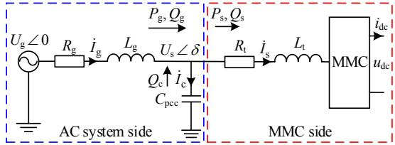  
Fig. 1 Simplified main circuit of studied system

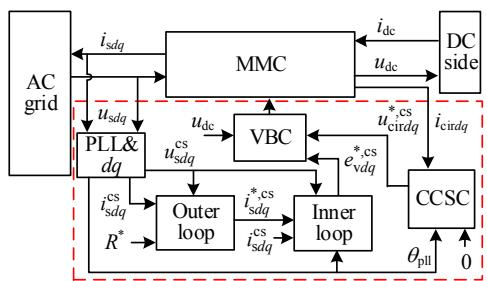  
Fig. 2 Control structure of MMC

The simplified closed-loop transfer function diagram of outer loop is shown in Fig. 3 in which the interaction between AC voltage and active power is filled with magenta.

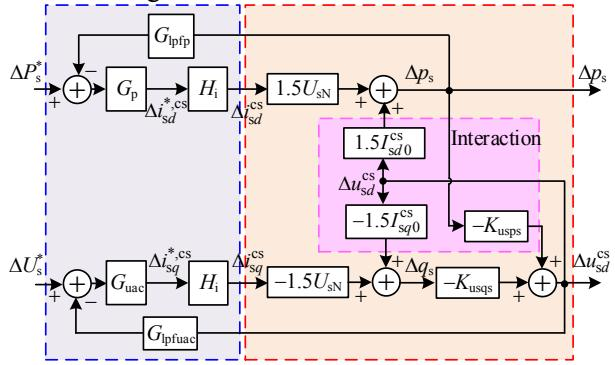  
Fig. 3 Closed-loop transfer function diagram of outer loop

By simplification, the closed-loop transfer function of active power and AC voltage can be expressed as:

$$
\left\{ \begin{array}{l} F _ {\mathrm {u u}} = \frac {k _ {\mathrm {p u a c}} s / k _ {\mathrm {i u a c}} + 1}{\tau_ {\mathrm {u}} s + 1} \\ F _ {\mathrm {p p}} = \frac {k _ {\mathrm {p p}} s / k _ {\mathrm {i p}} + 1}{\tau_ {\mathrm {p}} s + 1} \end{array} \right. \tag {1}
$$

Where, the time constants are written as:

$$
\left\{ \begin{array}{l} \tau_ {\mathrm {u}} = \frac {k _ {\mathrm {p u a c}}}{k _ {\mathrm {i u a c}}} + \frac {1 - 1 . 5 K _ {\mathrm {u s q s}} I _ {\mathrm {s q 0}} ^ {\mathrm {c s}}}{1 . 5 K _ {\mathrm {u s q s}} U _ {\mathrm {s N}} k _ {\mathrm {i u a c}}} \\ \tau_ {\mathrm {p}} = \frac {k _ {\mathrm {p p}}}{k _ {\mathrm {i p}}} + \frac {1}{1 . 5 U _ {\mathrm {s N}} k _ {\mathrm {i p}}} \end{array} \right. \tag {2}
$$

Therefore, parameters of active power and AC voltage controllers can be derived as:

$$
\left\{ \begin{array}{l} k _ {\mathrm {p p}} = \frac {K _ {\mathrm {s t e p p}}}{1 . 5 U _ {\mathrm {s N}} \left(1 - K _ {\mathrm {s t e p p}}\right)} \\ k _ {\mathrm {i p}} = \frac {1}{1 . 5 U _ {\mathrm {s N}} \left(1 - K _ {\mathrm {s t e p p}}\right) \tau_ {\mathrm {p}}} \end{array} \right. \tag {3}
$$

$$
\left\{ \begin{array}{l} k _ {\mathrm {p u a c}} = \frac {K _ {\mathrm {s t e p u}} \left(P _ {\mathrm {d c N}} S _ {\mathrm {s c r}} - 3 U _ {\mathrm {s N}} ^ {2} \omega_ {1} C _ {\mathrm {p c c}}\right)}{1 . 5 U _ {\mathrm {s N}} ^ {2} \left(1 - K _ {\mathrm {s t e p u}}\right)} \\ k _ {\mathrm {i u a c}} = \frac {P _ {\mathrm {d c N}} S _ {\mathrm {s c r}} - 3 U _ {\mathrm {s N}} ^ {2} \omega_ {1} C _ {\mathrm {p c c}}}{1 . 5 U _ {\mathrm {s N}} ^ {2} \left(1 - K _ {\mathrm {s t e p u}}\right) \tau_ {\mathrm {u}}} \end{array} \right. \tag {4}
$$

Selecting $K _ { \mathrm { s t e p } } { = } 0 . 3 5$ and time constant τ = 60ms, yields $k _ { \mathrm { p p } } = 1 . 0 1 \times 1 0 ^ { - 6 } , k _ { \mathrm { i p } } { = } 3 . 1 2 \times 1 0 ^ { - 5 } , k _ { \mathrm { p u a c } } { = } \{ 0 . 0 0 9 6 , $ , $0 . 0 0 4 2 7 \}$ and $k _ { \mathrm { i u a c } } = \{ 0 . 4 5 7 , 0 . 2 0 3 \}$ can be obtained under $\mathrm { S C R } = \{ 3 , 1 . 5 \}$ . The comparison waveforms of electromagnetic transient simulation model and ideal first model are plotted in Fig. 4. It is shown that the main dynamic performance between simulation model and ideal model is almost identical except the overshoot caused by the resonant modal which may be lead to instability. It is also implied that lower SCR should select smaller control parameters in case of instability.

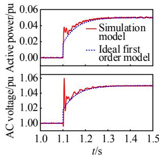  
$( \mathbf { a } ) \mathbf { S } \mathbf { C } \mathbf { R } = 3$

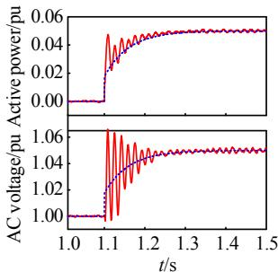  
(b) SCR = 1.5   
Fig. 4 Validation of parameters calculation of outer loop