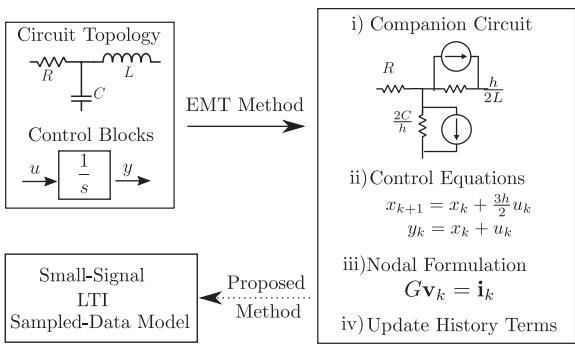
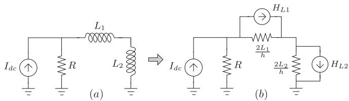
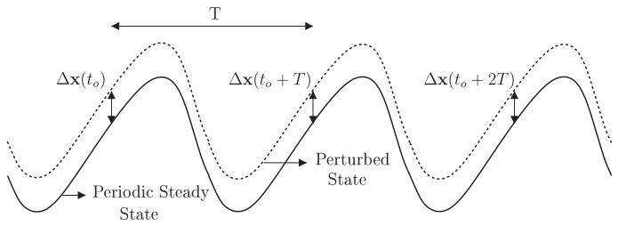
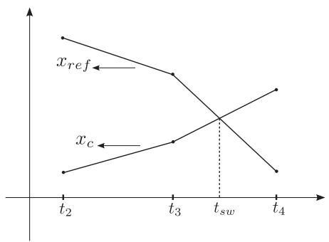
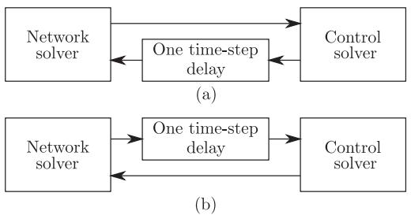
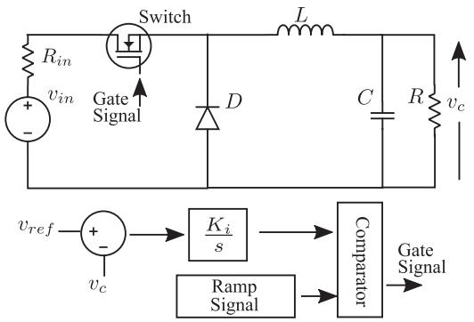
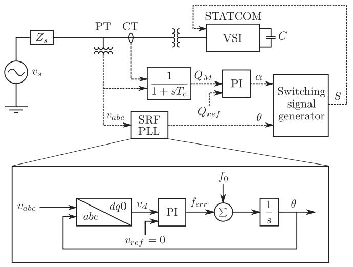
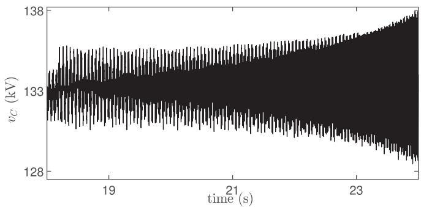
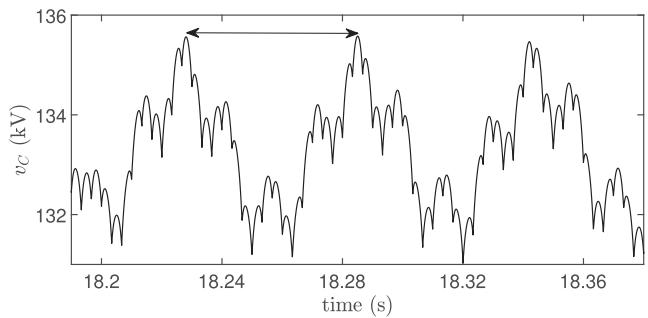

# An Automatable Approach for Small-Signal Stability Analysis of Power Electronic-Based Power Systems Using EMT Companion Circuits

Vinay Chindu and A. M. Kulkarni , Senior Member, IEEE

Abstract—The increasing presence of power electronic (PE) controlled devices in power systems has widened the bandwidth of transients to be studied for grid stability. While these transients are normally studied using time-domain simulation (TDS), wide bandwidth linear time-invariant (LTI) state-space models are a useful complement to TDS for diagnostics, controller design and parametric analysis. A general automatable method to compute an LTI sampled-data model of a PE-based circuit is presented in this paper. The proposed method is based on the techniques employed in electro-magnetic-transient (EMT) programs to perform TDS of PE-based circuits. The method uses the building blocks of EMT nodal formulation such as conductance matrix of companion circuit and its LU factors computed during TDS, interpolation and chatter elimination corrections, and EMT model of the firing angle control system. The method yields a small-signal LTI sampled-data model which is amenable to eigenanalysis and is illustrated using simple PE-based circuits such as a buck converter and a grid-connected STATCOM with closed-loop control.

Index Terms—Electro-magnetic-transient (EMT) program, small-signal analysis, state-space model, sampled-data model.

# I. INTRODUCTION

E NERGY sources in traditional power grids were predomi-nantly synchronous machine based. Grid stability analyses were primarily concerned with low frequency rotor swings (0.1– 2 Hz). With the increasing penetration of power electronic (PE) converter interfaced renewable energy sources and numerous installations of FACTS and HVDC devices, power systems have become hybrid dynamical systems with both continuoustime and switching dynamics. The PE converter controls are of multiple time-scales with fast inner control loops and slow outer control loops. Hence they can interact with slow electromechanical oscillations as well as with fast electromagnetic transients. As a result, phenomena of wider bandwidth (tens of Hz to hundreds of Hz) such as sub-synchronous torsional and control interactions (SSTI, SSCI) and harmonic instabilities such as second harmonic instability in LCC-HVDC systems are increasingly of concern for grid stability. A detailed literature survey and summary of various dynamic phenomena in PEbased power systems is provided in [1], [2]. The wider bandwidth

Manuscript received 7 July 2022; revised 2 January 2023; accepted 10 March 2023. Date of publication 4 April 2023; date of current version 25 July 2023. Paper no. TPWRD-01016-2022. (Corresponding author: Vinay Chindu.)

The authors are with the Department of Electrical Engineering, Indian Institute of Technology Bombay, Mumbai 400076, India (e-mail: vinaychindu@gmail.com; anil@ee.iitb.ac.in).

Digital Object Identifier 10.1109/TPWRD.2023.3264296

transients cannot be studied using the conventional fundamental frequency positive sequence phasor models as these models assume the electric network to be in a quasi-sinusoidal steady state. Stability studies of PE-based power systems using time domain simulation (TDS) programs is a widely used approach as it can easily include wide-bandwidth models with detailed nonlinearities and perform large-signal disturbance studies. The inferences drawn from a TDS study, however, are largely specific to the case simulated and thus a large number of disturbance cases have to be simulated to assess small-signal stability. In the small-signal linear time-invariant (LTI) state-space modelling approach, handling detailed models is generally cumbersome but the stability inferences are more nuanced with information such as eigenvalues, participation factors, observability and controllability of modes. This information is very useful for diagnostics, parametric analysis, and an informed design and tuning of controls. Hence small-signal LTI models can be a useful complement to TDS studies.

# A. Stability Analysis of Time-Periodic Systems

The wide-band models of PE-based power systems are periodically time varying and nonlinear. This is due to the presence of periodic switching in PE modules, and nonlinear mathematical modules such as phase-locked-loops (PLLs) in control system. Hence, the steady state of PE-based power systems is not a fixed fundamental frequency phasor but is periodic and non-sinusoidal in nature. The small-signal models of PE-based power systems in phase variables are linear time-periodic (LTP) and not LTI. This is because they are obtained by linearizing the dynamical equations along a periodic steady state and not about a fixed equilibrium point.

The techniques developed for stability analysis of LTI models are not directly applicable to LTP models. Many of the popular methods for stability analysis of LTP models are based on transforming the model variables. For example, in balanced threephase systems with negligible lower order harmonics, Park’s transformation can be applied to obtain an approximate LTI model in dq0 variables; however this approach may be inaccurate for systems with phase imbalance and low pulse PE modules like TCSCs [3]. Several other methods to obtain an accurate LTI model of LTP systems have been studied in literature such as dynamic phasors [4], generalised switching functions [5],

  
Fig. 1. EMT Companion Circuit based stability analysis.

harmonic state spaces [6], and sampled-data models or Poincarè maps [7].

Among these methods, the sampled-data modelling is computationally more involved and non-intuitive for control design. However, it is a straight-forward approach applicable to any general circuit topology. Most of the computational steps in sampled-data modelling are similar to those in a TDS and hence it is amenable to automation alongside a TDS program. Other methods such as dynamic phasors, although more sophisticated and intuitive, generally involve prudent simplifying approximations [4]. These approximations are based on a prior deep understanding of the working of the given circuit. Moreover, the computations involved in these sophisticated methods are significantly different from those in TDS and therefore do not easily lend themselves for automation.

# B. Contributions of This Paper

Electro-Magnetic-Transient (EMT) programs such as ATP and PSCAD/EMTDC are widely used for TDS of PE-based power systems. Based on the input circuit data, they derive a resistive circuit representation (Companion Circuit) of the discretised equations of each component [8]. EMT techniques for handling PE switches, nonlinear components, and interfacing control block solver with the electric circuit solver have been developed for a fast and efficient TDS of power systems [9]. Using these techniques, an EMT program obtains nodal formulation of the Companion Circuit model at each time step. The building blocks of the EMT model are the conductance matrix of the Companion Circuit, node-branch incidence data, history term current sources and discretised models of control blocks.

The aim of the work presented in this paper, as shown in Fig. 1, is to explore the feasibility of an add-on program to EMT programs which numerically computes the small-signal stability information based on the computations carried out by EMT programs during TDS. In this regard, the main contributions of this paper are:

1) Using the building blocks of EMT nodal formulation, a methodology to compute an LTI state-space model of an RLC circuit and an LTI sampled-data model of a PE-based circuit is detailed. The methodology assumes

the availability of the periodic steady state for the given circuit.

2) The method is general enough and uses many of the computations performed by EMT programs during TDS such as LU factorisation of conductance matrix and therefore is amenable for automation.   
3) A subset of the eigenvalues of the computed sampled-data model are not related to the dynamics of the actual circuit and are purely an artefact of simulation methods of EMT programs. The criteria for recognising such eigenvalues which have no physical significance among the computed ones are brought out.

# C. Literature Related to Presented Work

A method to compute eigenvalues of an LTI RLC circuit from its EMT Companion Circuit is given in [10]. It does not explore using the computations performed by EMT program during TDS for obtaining the state-space matrix of the Companion Circuit. Choosing state variables of EMT Companion Circuit in the presence of inductor cut-sets or capacitor loops in the original circuit is not discussed. Moreover, stability analysis of timevarying systems has been carried out by computing eigenvalues at every simulation time step. However, this approach does not necessarily give meaningful results with regard to stability of time-varying systems [11].

Algorithms which are general and automatable for smallsignal stability analysis of PE circuits are presented in [12], [13]. However, these algorithms require formulation of continuoustime domain state-space models for each switching interval which in turn requires selecting a set of linearly independent state variables. This is a computationally involved task as it requires (i) topological analysis involving searching for cutsets consisting of only inductors and current sources and searching for loops consisting of only capacitors and voltage sources [14] or (ii) matrix reduction operations to get a row echelon form [15]. It is shown in [16] that selection of a set of independent state variables is not of concern while formulating state space model of discretised circuit equations. However, the method proposed in [16] uses history terms of node voltages as state variables and hence, is not compatible with the EMT method. Also, [16] does not consider circuits with time-varying models. The method presented in this paper is not limited by the aforementioned issues and is based on well established TDS techniques of EMT programs.

The rest of the paper is organized as follows: Section II discusses using EMT computations to extract LTI models of RLC circuits along with interpreting the computed eigenvalues. Sampled-data modeling is introduced in Section III and modeling of control systems in EMT programs is briefly discussed. The method to obtain sampled-data model using EMT computations and interpreting the computed eigenvalues is detailed. The proposed method in an algorithmic form along with illustrative case studies is given in Section IV. Some of the limitations to the proposed method from becoming a full-fledged automatable one are discussed in Section V. Future work and conclusions drawn are given in Section VI.

# II. STABILITY ANALYSIS OF LTI RLC NETWORKS USING EMT NODAL ANALYSIS FORMULATION

# A. Nodal Analysis Formulation in EMT Programs

The approach employed in EMT programs is based on the Dommel’s Companion Circuits method [8]. In this approach, difference equations for each individual component of the circuit are obtained using trapezoidal method and subsequently the simulation model of the entire circuit is obtained by linking the difference equations of circuit components through nodal analysis. A Companion Circuit is an equivalent resistive circuit representation of the set of difference equations obtained for a given circuit. The voltages and currents of the previous discrete time instant, also referred to as history terms, are represented as current sources in the Companion Circuit model for the current discrete time instant. The Companion Circuit models of R, L, and C branches are detailed in [8], [9] and are not explained here for brevity.

Consider an LTI, lumped, RLC circuit with n nodes, $n _ { L }$ inductors, and $n _ { C }$ capacitors. Let $[ L ]$ and [C] of sizes $n _ { L } \times n _ { L }$ and $n _ { C } \times n _ { C }$ be diagonal matrices with inductance and capacitance values respectively, and $A _ { L }$ and $A _ { C }$ of sizes $n \times n _ { L }$ and $n \times n _ { C }$ be the node-branch incidence matrices of inductor and capacitor branches respectively. It is straightforward to obtain the conductance matrix (G) of the Companion Circuit and is given by (1), where $Y _ { R }$ is the conductance matrix of the actual circuit considering only the resistor branches and h is simulation step size.

$$
G = Y _ {R} + A _ {C} \left[ \frac {2 C}{h} \right] A _ {C} ^ {T} + A _ {L} \left[ \frac {2 L}{h} \right] ^ {- 1} A _ {L} ^ {T} \tag {1}
$$

By carrying out nodal analysis, the EMT nodal formulation for the kth step as given in (2) is obtained where $\mathbf { i } _ { h i s t , L }$ and $\mathbf { i } _ { h i s t , C }$ are the vectors of history term current sources of inductors and capacitors respectively, v is the vector of node voltages and u is the vector of external current source injections at each node.

$$
G \mathbf {v} _ {k} = \mathbf {u} _ {k} - A _ {L} \mathbf {i} _ {\text {h i s t}, L, k} - A _ {C} \mathbf {i} _ {\text {h i s t}, C, k} \tag {2}
$$

For a given circuit, EMT programs derive the nodal analysis formulation and solve it at each time step for the node voltages. The history term current sources are then updated for the next time step as given in (3) and (4).

$$
\mathbf {i} _ {h i s t, L, k + 1} = \mathbf {i} _ {h i s t, L, k} + \left[ \frac {L}{h} \right] ^ {- 1} A _ {L} ^ {T} \mathbf {v} _ {k} \tag {3}
$$

$$
\mathbf {i} _ {h i s t, C, k + 1} = - \mathbf {i} _ {h i s t, C, k} - \left[ \frac {4 C}{h} \right] A _ {C} ^ {T} \mathbf {v} _ {k} \tag {4}
$$

Remarks: Only current sources have been considered as input excitation in (2) for brevity. In the presence of ideal voltage sources, modified nodal analysis is performed instead of conventional nodal analysis and followed by simple algebraic simplifications, an equation of the form (2) can be obtained.

  
Fig. 2. EMT companion circuit representation.

# B. Formulation of Discrete-Time State-Space Model of EMT Companion Circuits

A state-variable vector of a system is the minimum information required to know at a time instant in order to completely determine the future behaviour of the system in the absence of external excitation. In continuous-time domain models, a linearly independent set of capacitor voltages and inductor currents forms the state vector of RLC circuits. For EMT Companion Circuits, based on the EMT nodal formulation discussed previously, it is apparent that the history term cuvariables. Defining the state vector as $\mathbf { x } _ { k } ^ { T } = [ \mathbf { i } _ { h i s t , L , k } ^ { T } \mathbf { i } _ { h i s t , C , k } ^ { T } ]$ and using the equations (1)–(4), a discrete-time state-space model of the EMT Companion Circuit is obtained and is of the form given in (5).

$$
\mathbf {x} _ {k + 1} = A \mathbf {x} _ {k} + B \mathbf {u} _ {k} \tag {5}
$$

The matrices A and B can be computed using (6) and (7) respectively. These matrices can be computed as a by-product of TDS performed in an EMT program as explained here. The information such as node-branch incidence matrices can be easily obtained from circuit netlist and are already used directly or indirectly during TDS by EMT programs. Moreover, the computation of A and B using (6) and (7) does not require a fresh computation of inverse of G. The LU factors of G already computed while solving (2) during TDS can be reused. Therefore, the state space model of the EMT Companion Circuit can be obtained from the TDS computations without significant additional computational burden.

$$
A = \left[ \begin{array}{c c} I _ {n L \times n L} & 0 \\ 0 & - I _ {n C \times n C} \end{array} \right] - \left[ \begin{array}{c} h L ^ {- 1} A _ {L} ^ {T} \\ - \frac {4 C}{h} A _ {C} ^ {T} \end{array} \right] G ^ {- 1} \left[ \begin{array}{l l} A _ {L} & A _ {C} \end{array} \right] \tag {6}
$$

$$
B = \left[ \begin{array}{l} h L ^ {- 1} A _ {L} ^ {T} \\ - \frac {4 C}{h} A _ {C} ^ {T} \end{array} \right] G ^ {- 1} \tag {7}
$$

A convenient feature of state-space modelling of EMT Companion Circuits is that the need to check for linear independence of state variables is not required. This avoids a significant computational burden which is present in continuous-time domain state space modelling. This can be explained as follows: Consider the circuit shown in Fig. 2. It has two inductors in series and hence only one of the inductor currents can be a state variable due to linear dependency. Therefore, the original circuit has only one dynamic mode of time constant L1+L2 . On inspecting the $\frac { L _ { 1 } + L _ { 2 } ^ { - } } { R }$ corresponding Companion Circuit shown in Fig. 2, it is clear that each history term current source has a shunt resistance across

it and therefore, it is possible to give different initial values to the two history term current sources. Thus, the Companion Circuit has two dynamic modes. This can be generalised as: a discrete-time state-space model of an EMT Companion Circuit can always be obtained using the set of all the history term current sources as the state variables.

Based on the preceding discussion, the conductance matrix G and the state matrix A of the EMT Companion Circuit model in Fig. 2 are given in (8) and (9). The eigenvalues of A are given in (10) and the way to interpret these computed eigenvalues is discussed in the following subsection.

$$
G = \left[ \begin{array}{c c} \frac {1}{R} + \frac {h}{2 L _ {1}} & - \frac {h}{2 L _ {1}} \\ - \frac {h}{2 L _ {1}} & \frac {h}{2 L _ {1}} + \frac {h}{2 L _ {2}} \end{array} \right] \tag {8}
$$

$$
A = I _ {2 \times 2} - \frac {1}{L _ {1} + L _ {2} + \frac {h R}{2}} \left[ \begin{array}{c c} 2 L _ {2} + h R & - 2 L _ {2} \\ - 2 L _ {1} & 2 L _ {1} + h R \end{array} \right] \tag {9}
$$

$$
\Omega_ {1} = \frac {L _ {1} + L _ {2} - \frac {h R}{2}}{L _ {1} + L _ {2} + \frac {h R}{2}}, \Omega_ {2} = - 1 \tag {10}
$$

# C. Relation Between Eigenvalues of an RLC Circuit and Its EMT Companion Circuit Model

As discussed previously, the EMT Companion Circuit model is obtained by trapezoidal method based discretization of the differential equations of each circuit component. As a consequence of discretization using trapezoidal method, the eigenvalues (λ) of continuous-time domain state-space model of the circuit are related to the eigenvalues (Ω) of the discrete-time domain state-space model of the EMT Companion Circuit by the bilinear transformation [10] given in (11).

$$
\Omega = \frac {1 + \frac {\lambda h}{2}}{1 - \frac {\lambda h}{2}}, \lambda = \left(\frac {2}{h}\right) \frac {\Omega - 1}{\Omega + 1} \tag {11}
$$

Using (11) and the eigenvalues of the EMT Companion Circuit obtained in (10), the continuous-time domain eigenvalues of the circuit in Fig. 2 are obtained and are given in (12).

$$
\lambda_ {1} = - \frac {R}{L _ {1} + L _ {2}}, \lambda_ {2} = \infty \tag {12}
$$

It is evident that one of the eigenvalues $( \lambda _ { 1 } )$ obtained by bilinear transformation matches exactly with the eigenvalue of the actual circuit. Moreover, if the Companion Circuit model has a −1 eigenvalue then, the bilinear transformation yields a corresponding eigenvalue of infinite magnitude. While a detailed discussion on the eigenvalues of EMT Companion Circuit models is given in [17], a few important remarks are given here.

i) The finite-valued continuous-time domain eigenvalues (λ) obtained from EMT state-space model using (11) match precisely with the actual eigenvalues of LTI RLC circuits. This property is not affected by simulation step size h.   
ii) When a PE switch in open (closed) state is modelled as a very large (small) resistance, it may introduce a continuous-time domain eigenvalue (λ) of such a large magnitude that $| \lambda h | \gg 1$ for even small values of h. In

  
Fig. 3. Perturbed periodic steady state of a system.

such cases, using (11), the corresponding eigenvalue (Ω) of EMT Companion Circuit will satisfy $\Omega \approx - 1$ .

iii) $\mathrm { { I f } } \Omega = - 1$ then, from (11), the corresponding λ will be of infinite magnitude. As circuits do not have eigenvalues of infinite magnitude, the Ω = −1 mode is purely an artefact of the EMT method.   
iv) The presence of $\Omega = - 1$ eigenvalues indicates linear dependencies among inductor currents and/or capacitor voltages of the RLC circuit. The number of repeated 1 eigenvalues indicates the number of inductors-only cutsets and capacitors-only loops in the actual circuit. This is because the dimension of state vector of a Companion Circuit is exactly $( n _ { L } + n _ { C } )$ , whereas the dimension of state vector in continuous-time domain model is the number of linearly independent inductor currents and capacitor voltages.

# III. STABILITY ANALYSIS OF PE-BASED CIRCUITS

The RLC circuit considered in the previous section is an LTI system and hence the conductance matrix (G) of its Companion Circuit does not change with time. On the other hand, a PE-based circuit is a time-varying system with its conductance matrix changing with switching events. PE-based circuits are also known as piecewise linear (PWL) systems as their dynamic models are LTI between any two successive switching instants and change into different LTI models only after a switching event. The switching events can be categorised as:

i) internally controlled events such as turn on/off of diodes and turn off of thyristors since these events are completely determined by the circuit variables only.   
ii) externally controlled events such as turn on of thyristors and turn on/off of IGBTs since these events are determined by external firing circuit controllers. The externally controlled switching instants are indirectly influenced by the circuit variables in the presence of a feedback from circuit outputs to the firing angle generation circuits.

The small-signal stability analysis of a PE-based circuit at steady state by sampled-data modelling approach involves describing the evolution of a perturbation to its periodic steady state over time-intervals which are integer multiples of the system period $T$ as shown in Fig. 3. The model is of the form given in (13), where x and φT are the state vector and small-signal state transition matrix (STM) over one period respectively. At periodic steady state, φ is independent of index k and hence the sampled-data model is an LTI model in discrete-time domain. Therefore, the conventional LTI analysis techniques can be

applied and the system is said to be small-signal stable if the magnitudes of all the eigenvalues of $\phi _ { T }$ are less than unity.

$$
\Delta \mathbf {x} (t _ {0} + T) = \phi_ {T} \Delta \mathbf {x} (t _ {0})
$$

$$
\Delta \mathbf {x} \left(t _ {0} + k T\right) = \phi_ {T} \Delta \mathbf {x} \left(t _ {0} + (k - 1) T\right) \tag {13}
$$

It is pertinent to note that the sampled-data model given by (13) is a stability model of the autonomous system, i.e., the input excitation to the circuit is assumed to be unperturbed.

# A. Computation of STM Using Analytical Approach

Consider a PWL circuit at periodic steady state of period $T .$ Let $[ t _ { 1 } , t _ { 2 } ]$ be a time interval such that only one switching event occurs within it. Let this switching instant be $\tau ,$ where $t _ { 1 } <$ $\tau < t _ { 2 }$ . The continuous-time domain state-space models of the system before and after the switching event are given by (14) and (15) respectively. The state-space vectors of the two models are related at $\tau$ by (16) since state variables are continuous in nature.

$$
\dot {\mathbf {x}} (t) = A _ {1} \mathbf {x} (t) + B _ {1} \mathbf {u} (t), t _ {1} \leq t <   \tau \tag {14}
$$

$$
\dot {\mathbf {x}} (t) = A _ {2} \mathbf {x} (t) + B _ {2} \mathbf {u} (t), \tau <   t \leq t _ {2} \tag {15}
$$

$$
\mathbf {x} \left(\tau^ {+}\right) = \mathbf {x} \left(\tau^ {-}\right) \tag {16}
$$

Integrating (14) and (15) and then linearising using first-order Taylor series approximation, it can be shown that the relation between $\Delta { { \bf x } } ( t _ { 2 } )$ and $\Delta { \bf x } ( t _ { 1 } )$ is given by (17), where $\Delta \tau$ is the perturbation in switching instant and $\dot { { \bf x } } ( \tau ^ { - } )$ and $\dot { { \bf x } } ( \tau ^ { + } )$ are rates of change of state vector at $\tau ^ { - }$ and $\tau ^ { + }$ respectively. A detailed derivation of (17) is given in [18].

$$
\begin{array}{l} \Delta \mathbf {x} (t _ {2}) = e ^ {A _ {2} (t _ {2} - \tau)} e ^ {A _ {1} (\tau - t _ {1})} \Delta \mathbf {x} (t _ {1}) \\ + e ^ {A _ {2} \left(t _ {2} - \tau\right)} \left(\dot {\mathbf {x}} \left(\tau^ {-}\right) - \dot {\mathbf {x}} \left(\tau^ {+}\right)\right) \Delta \tau \tag {17} \\ \end{array}
$$

Note that in (14) and (15), it has been assumed that the dimension of state vector does not change due to the switching event. However, the dimension of state vector may change due to a switching event if the switches are modelled as open and short circuits during on and off states respectively. For example, in a TCSC circuit, the inductor current ceases to be a state variable when the thyristor is turned off. However, such situations are not of concern here as the switches in EMT programs are modelled by a finite valued resistance during off state and by a non-zero resistance during on state.

Effect of Perturbation in Switching Instant on STM: Consider a special case where a PE-based circuit has no internally controlled switching events and is operating in open loop so that the externally controlled switching instants remain fixed. In such a case, the computation of STM gets simplified and can be seen by substituting $\Delta \tau = 0$ in (17). In reality, the switching instants are not fixed and are dependent on the circuit variables. The relationship of switching instant with the initial circuit state at $t _ { 1 }$ is usually highly nonlinear and consequently makes the circuit model nonlinear. This necessitates small-signal linearization despite being described by piecewise linear models. It is evident from (17) that $\Delta \tau$ plays a role in the computation of STM whenever there is a discontinuous jump in rate vector i.e.

$\dot { { \mathbf x } } ( \tau ^ { - } ) \neq \dot { { \mathbf x } } ( \tau ^ { + } )$ at a switching event. It is shown in [19] that perturbation of internally controlled switching instants can be ignored in the computation of STM. A general set of criteria for determining whether a perturbation to a switching instant has no effect on STM has been derived in [18]. It is applicable to both internally and externally controlled switching instants. These criteria under which there is no discontinuous jump in rate vector and thereby the effect of $\Delta \tau$ on STM can be ignored are:

i) The perturbation in turn off instant can be neglected if the switch current reaches zero smoothly at turn off and not with a discontinuous jump.   
ii) The perturbation in turn on instant can be neglected if the switch voltage reaches zero smoothly at turn on and not with a discontinuous jump.

These criteria are always satisfied during internally controlled switching events [19] and hence the effect of $\Delta \tau$ during such a switching event is ignored. However, externally controlled switching events generally do not satisfy the aforementioned conditions. Hence, the effect of corresponding $\Delta \tau$ has to be considered.

Remarks: The result that perturbation of internally controlled switching events can be ignored is derived using continuoustime domain models. This result need not be valid for computations based on discretised models such as EMT Companion Circuits. The state variables of EMT models are history term current sources and not inductor currents and capacitor voltages. Nevertheless, it has been assumed in this work that ignoring perturbation to internally controlled switching instants is sufficiently accurate for EMT Companion Circuit based computation of STM. Moreover, it is shown in Section IV, using the buck converter example, that the error due to this assumption is not significant.

# B. Computation of STM Using EMT Formulations

Consider a PWL circuit at steady state of period T with its EMT model at ith simulation step in discrete-time state-space form given by (18), where h is the simulation step size. Note that the input excitation, $\mathbf { u } _ { i }$ , is considered unperturbed since only the stability of the autonomous system is of interest.

$$
\mathbf {x} _ {i + 1} = A _ {i} \mathbf {x} _ {i} + B _ {i} \mathbf {u} _ {i}, \mathbf {x} _ {i} = \mathbf {x} (i h), T = N h \tag {18}
$$

The computation of the STM of the linearised system model is straightforward if the following assumptions are made: i) the switching instants are fixed, i.e., they are unperturbed due to a small-signal perturbation to the initial circuit state and ii) the switching instants are at integral multiples of $^ { \cdot } h ,$ i.e, the switching events occur exactly on the discretised time axis. Under such assumptions, the STM, $\phi _ { T }$ , satisfying the sampled-data model (19) can be computed using the relation (20).

$$
\Delta \mathbf {x} _ {N} = \phi_ {T} \Delta \mathbf {x} _ {0} \tag {19}
$$

$$
\phi_ {T} = A _ {N - 1} A _ {N - 2} \dots A _ {1} A _ {0} \tag {20}
$$

However, such assumptions are usually not satisfied in a credible scenario and therefore, perturbations to switching instants and EMT techniques for handling switching events occurring

  
Fig. 4. Switching instant determination by linear interpolation.

in-between two simulation steps need to be considered in the computation of STM. These are discussed in the following subsection.

1) Incorporating Interpolation and Chatter Suppression $A l -$ gorithms in STM Computation: EMT programs are based on a fixed time-step algorithm and hence the exact switching instants are generally found in-between simulation instants. Moreover, following a switching event there is a possibility of undamped numerical chatter in simulation output. Hence, EMT programs use interpolation and chatter suppression algorithms at switching events. Let an externally controlled switching event occur whenever the reference signal $x _ { r e f }$ becomes lesser than the control signal $x _ { c }$ as shown in Fig. 4. Assuming the switching instant $( t _ { s w } )$ lies between successive instants $t _ { 3 }$ and $t _ { 4 } ,$ EMT programs compute the switching instant $t _ { s w }$ by linear interpolation as expressed in (21), where $\tau = t _ { s w } - t _ { 3 }$ . The notation $x _ { r e f } [ 3 ]$ refers to the value of $x _ { r e f }$ at t3.

$$
\frac {\tau}{h} x _ {r e f} [ 4 ] + \left(1 - \frac {\tau}{h}\right) x _ {r e f} [ 3 ] = \frac {\tau}{h} x _ {c} [ 4 ] + \left(1 - \frac {\tau}{h}\right) x _ {c} [ 3 ] \tag {21}
$$

On applying first-order linearisation, $\Delta \tau$ can be expressed as (22).

$$
\Delta \tau = \frac {\tau \left(\Delta x _ {c} [ 4 ] - \Delta x _ {r e f} [ 4 ]\right) + (h - \tau) \left(\Delta x _ {c} [ 3 ] - \Delta x _ {r e f} [ 3 ]\right)}{x _ {r e f} [ 4 ] - x _ {c} [ 4 ] + x _ {c} [ 3 ] - x _ {r e f} [ 3 ]} \tag {22}
$$

Using the methodology discussed in Section II-B, discrete-time LTI models can be obtained describing the Companion Circuits for the two switching configurations and let they be as given in (23) and (24), where $\mathbf { x } _ { k }$ is the state vector of the Companion Circuit at $k ^ { t h }$ step.

$$
\mathbf {x} _ {k + 1} = A _ {1} \mathbf {x} _ {k} + B _ {1} \mathbf {u} _ {k}, k = 1, 2 \tag {23}
$$

$$
\mathbf {x} _ {k + 1} = A _ {2} \mathbf {x} _ {k} + B _ {2} \mathbf {u} _ {k}, k = 4 \tag {24}
$$

The small-signal relations assuming the excitation sources are unperturbed are as given in (25). However, it is not as straightforward to obtain the relation between $\Delta \mathbf { x } _ { 4 }$ and $\Delta \mathbf { x } _ { 3 }$ as it depends upon the chatter suppression algorithm used at the switching instant $t _ { s w }$ .

$$
\Delta \mathbf {x} _ {2} = A _ {1} \Delta \mathbf {x} _ {1}, \Delta \mathbf {x} _ {3} = A _ {1} \Delta \mathbf {x} _ {2} = A _ {1} ^ {2} \Delta \mathbf {x} _ {1}
$$

$$
\Delta \mathbf {x} _ {5} = A _ {2} \Delta \mathbf {x} _ {4} \tag {25}
$$

  
Fig. 5. Interface between network and control solvers in EMT programs (a) ATP-EMTP (b) PSCAD/EMTDC.

The two popularly used chatter suppression algorithms in EMT programs are (i) Critical Damping Adjustment Scheme [20] used in NETOMAC, and (ii) Half Time-Step Interpolation Scheme [21] used in PSCAD/EMTDC. In the newer versions of PSCAD/EMTDC, an improved method based on instantaneous solution has been implemented to avoid fictitious switching losses [22]. Each of these approaches consists of a cascaded sequence of operations with $\mathbf { x } _ { 3 }$ and τ as starting inputs. Performing small-signal linearisation followed by elimination of intermediate computations, $\Delta \mathbf { x } _ { 4 }$ can be expressed as a linear function of $\Delta \mathbf { x } _ { 3 }$ and $\Delta \tau$ and is briefly explained in appendix. Further, in order to obtain the relation between $\Delta \tau$ and $\Delta \mathbf { x } _ { 3 }$ , the modelling of firing angle control system needs to be considered which is briefly discussed in the following subsection.

2) Modelling of Control Systems in EMT Programs: Control blocks such as integrators, gains, first-order lag transfer functions are commonly used in EMT simulations to model firing angle generation control blocks such as PIDs and PLLs. Unlike the electrical network equations, the control system equations in matrix form are not symmetric. Hence to avoid the increase in computational burden, EMT programs do not solve the control system equations simultaneously with the network equations. Instead a time-step delay is introduced between them as shown in Fig. 5. It is observed that this delay is introduced while transferring the output of the network solution to the control equations solver in PSCAD/EMTDC whereas in ATP-EMTP, the delay is introduced while transferring the output of control system solution to the network solver. For a control system made up of only transfer function and summing blocks, EMT programs obtain the input-output relationship of the entire control system in the form (26).

$$
\frac {Y (s)}{U (s)} = \frac {N _ {0} + N _ {1} s \cdots + N _ {m} s ^ {m}}{D _ {0} + D _ {1} s \cdots + D _ {n} s ^ {n}} \tag {26}
$$

Subsequently, the input-output relation in discrete-time domain of the form given in (27) is computed [9]. The steps performed to update the vector of history terms can be put in a state-space form as given in (28).

$$
y [ k ] = \mathbf {c} ^ {T} \mathbf {x} _ {\text {h i s t}} [ k ] + d u [ k ] \tag {27}
$$

$$
\mathbf {x} _ {\text {h i s t}} [ k + 1 ] = A _ {\text {c o n}} \mathbf {x} _ {\text {h i s t}} [ k ] + B _ {\text {c o n}} u [ k ] \tag {28}
$$

If the control system is nonlinear due to the presence of mathematical operations such as abc to dq0 transformation in PLLs, then EMT programs introduce one time-step delays which

transform the implicit nonlinear relations into explicit nonlinear relations. It is straightforward to handle the explicit nonlinear relations during TDS. In the presence of nonlinear blocks, the linearised state-space model of the control system may not be LTI, i.e., the matrices $A _ { c o n }$ and $B _ { c o n }$ in (28) may be samplevariant. It is to be noted that formulation of control equations in state-space form does not involve matrix inversion because of the explicit nature of the relations. Finally, the state-space model of the control system is combined with that of the Companion Circuit using the one time-step delay interface to obtain the small-signal state-space model of the entire system at that time step.

3) Relating the Eigenvalues of the Computed STM With the Actual Circuit Dynamics: The discrete-time domain eigenvalues (Ω) of the STM computed using EMT Companion Circuit based method can be transformed into equivalent eigenvalues in continuous-time domain by (29), where T is the period of steady state.

$$
\Omega_ {i} = e ^ {\lambda_ {i} T} \tag {29}
$$

It is to be noted that this relation is different from the bilinear transformation given in (11) which is applicable only to LTI circuits. Moreover, the accuracy of eigenvalues of PE-based circuits obtained using the proposed method depends upon simulation step size (h), with a smaller h giving a more accurate set of eigenvalues. This is in contrast to the case of LTI circuits where exact eigenvalues are obtained using the proposed method irrespective of h. The set of eigenvalues obtained using the proposed EMT based method usually has a subset of eigenvalues which have no physical significance, i.e., they do not correlate with any of the dynamics of the original circuit. This subset of eigenvalues is purely an artefact of EMT simulation model and arise due to the following reasons:

i) Each one time-step delay used in EMT programs either for interfacing the network solver with control system solver or for transforming an implicit nonlinear relationship into an explicit one gives rise to an additional state variable. The corresponding eigenvalue will be of negligible magnitude due to small values of simulation step size.   
ii) As shown in (20), the computation of STM of a PE-based circuit using discrete-time state-space models involves multiplication of matrices $A _ { i }$ in chronological order, where $A _ { i }$ is the state matrix of the EMT model at $i ^ { t h }$ simulation step. As explained in Section II-C, state matrix of an EMT model, $A _ { i } ,$ will have an eigenvalue 1 for each linear dependency among inductor currents or capacitor voltages. This is applicable for every $A _ { i } ,$ , except those at switching events.   
iii) At a switching event, the computation of corresponding Ai involves linear interpolation and chatter suppression steps as explained in Section III-B1. Also, it is known that each mode of EMT model corresponding to 1 eigenvalue results in chatter oscillations in simulation output when excited [17]. Therefore, on performing the chatter suppression procedure, the state matrix Ai at a switching event will have a zero eigenvalue corresponding to each

linear dependency. As a result, the STM, which is the product of all Ais, will have an eigenvalue exactly equal to zero corresponding to each linear dependency.

Remarks: In the case of LTI systems, it is known that the state matrix is not unique and depends on the state variables chosen. However, the eigenvalues of state matrix remain unchanged irrespective of the choice of state variables. Similarly in LTP models, the entries of STM depend on the state variables chosen and, in addition, on the chosen starting point $( t _ { 0 }$ in Fig. 3) on the periodic steady state. However, irrespective of that, the non-zero eigenvalues of STM remain unchanged. This is based on a result from matrix theory that non-zero eigenvalues of a matrix product do not change with a cyclic permutation of matrix sequence.

# IV. IMPLEMENTATION ALGORITHM AND CASE STUDIES

The various steps involved in the computation of STM of PE-based circuits using the TDS computations performed during EMT simulation have been detailed in previous sections. These major steps in the proposed methodology are consolidated in an algorithmic form here. It is then illustrated by using simple PE circuit examples and computing their STM and eigenvalues.

# A. Algorithm for Implementation of Proposed Method

Step 1: In addition to circuit netlist data and access to the building blocks of EMT nodal formulation, the periodic steady state of the circuit over a time interval of one period is also required for computing STM.

Step 2: Using the periodic steady state, the chronological sequence of various switching configurations and their time intervals are then obtained. Furthermore, using the criteria given in Section III-A, the switching instants whose perturbations need not be considered are determined.

Step 3: Any one of the switching configurations is chosen from the obtained sequence in Step 2 and within its corresponding time interval, an arbitrary time instant $t _ { 0 }$ is chosen as the starting point. The STM (φT ) and the running index i are initialised to identity matrix and 0 respectively.

Step 4: If there is a switching event between simulation steps i − 1 and i, then go to Step 6 else go to Step 5.

Step 5: Obtain the small-signal discrete-time state-space models of the Companion Circuit and the control system. The two models are then combined by considering the one time-step delay interface to obtain the state matrix $A _ { i }$ of the entire system. Note that the state-space model of control system needs to be freshly computed at each step in the presence of nonlinear mathematical functions such as root-mean-square (RMS). Go to Step 8.

Step 6: Obtain the interpolated switching instant computed by the EMT program during TDS. The state-space model of the Companion Circuit is then computed by incorporating the interpolation and chatter elimination techniques. Note that the chatter elimination technique should always be considered while computing STM even when chatter elimination has not been performed during TDS of that switching event. This is necessary so that the eigenvalues corresponding to any linear dependencies become zero.

  
Fig. 6. Buck converter circuit with closed-loop control.

TABLE I EIGENVALUES OF STM OF BUCK CONVERTER IN CCM   

<table><tr><td>Parameter values</td><td>EMT program based method</td><td>Analytical method</td></tr><tr><td>h=10 μs</td><td>0.8386 ± j0.2568 0.9952, ≈ 0</td><td rowspan="3">0.8386 ± j0.2568 0.9952</td></tr><tr><td>h=25 μs</td><td>0.8387 ± j0.2568 0.9952, ≈ 0</td></tr><tr><td>h=50 μs</td><td>0.8388 ± j0.2568 0.9952, ≈ 0</td></tr><tr><td>h=10 μs</td><td>0.8421 ± j0.2565</td><td>0.8421 ± j0.2565</td></tr><tr><td>Ki=5</td><td>0.9877, ≈ 0</td><td>0.9877</td></tr><tr><td>h=10 μs</td><td>0.8369 ± j0.2570</td><td>0.8369 ± j0.2570</td></tr><tr><td>Ki=0.5</td><td>0.9988, ≈ 0</td><td>0.9988</td></tr></table>

Step 7: There is no change in the procedure for computing state-space model of control system at switching events as the interpolation and chatter elimination corrections are applied only to network solution and not to control system solution. Similar to the procedure given in Step 5, the models of control system and Companion Circuit are combined to get the state matrix, $A _ { i } ,$ of the entire system.

Step 8: Update φT and i as follows: $\phi _ { T }  A _ { i } \phi _ { T } , i  i + 1$ . If $t _ { i } = t _ { 0 } + T$ , then end the program else go to step 4.

# B. Illustrative Case Studies

1) Buck Converter with Closed-Loop Voltage Control: A buck converter circuit with output voltage control implemented by an integral-only controller as shown in Fig. 6 is considered. The circuit data is: $v _ { i n } = 1 2 \mathrm { V } , \ R _ { i n } = 0 . 0 1 \Omega , \ v _ { r e f } = 3 \mathrm { V }$ , $R = 3 \Omega , L = 1 . 5 \mathrm { m H }$ , $C = 2 5 0 \mu \mathrm { F }$ , and integral gain $K _ { i } = 2$ . The switches are modelled by $R _ { o n } = 1 \mathrm { m } \Omega$ and $R _ { o f f } = 1 \mathrm { M } \Omega$ . The frequency of switching (ramp signal) is $f = 5 \mathrm { k H z }$ . The turn off instant of the switch is varied by the feedback control loop whereas the turn on instant is fixed. The circuit steady state has a period of $T = { \frac { 1 } { f } } = 2 0 0 \mu \mathrm { s }$ . For the given values of parameters, the buck converter circuit is in continuous current mode (CCM) of operation at steady state. The STM of the circuit is computed using the proposed method for different values of simulation step sizes (h) and also by the exact analytical method. The computed eigenvalues are given in Table I. Based on the tabulated results, the following observations are relevant:

i) The proposed method gives an additional eigenvalue in comparison with those obtained by the analytical method.

TABLE II EIGENVALUES OF STM OF BUCK CONVERTER IN DCM   

<table><tr><td>Parameter values</td><td>EMT-based method</td><td>Δτ of diode turn off considered</td><td>Analytical method</td></tr><tr><td>h=5 μs</td><td>0.8668, 0.9946, 0.0004, ≈ 0</td><td>0.8678, 0.9946, 0.0001, ≈ 0</td><td rowspan="3">0.8591, 0.9942, 0</td></tr><tr><td>h=10 μs</td><td>0.8568, 0.9949, -0.0002, ≈ 0</td><td>0.8602, 0.9949, -0.0001, ≈ 0</td></tr><tr><td>h=20 μs</td><td>0.8408, 0.9952, -0.0001, ≈ 0</td><td>0.8598, 0.9952, -0.0002, ≈ 0</td></tr></table>

This is due to the one time-step delay used to interface the network and control system in EMT programs and this can be verified from the corresponding participation factors. The magnitude of this eigenvalue is very small and hence has been tabulated as 0.

ii) The eigenvalues obtained from the proposed method match very well with those from analytical method and also are only slightly affected by variation in h. The main reason is that the linear interpolation approximation used by EMT programs is sufficiently accurate for a high switching frequency buck converter in CCM.

With load resistance and inductance changed to $R = 1 2 \Omega$ and $L = 0 . 5 \mathrm { m H }$ , the buck converter is in discontinuous current mode (DCM) at steady state. The eigenvalues of the STM for this operating condition are computed for different values of h and are tabulated in Table II. The following observations are relevant:

i) The zero eigenvalue from the analytical method is due to the inductor current variable being not a state variable when both the diode and switch are in off state. The corresponding eigenvalue from the proposed method is close to but not exactly zero since the switches are modelled by finite $R _ { o f f }$ resistances and not as open circuits during turned off state.

ii) Similar to the CCM case, the eigenvalue due to the one time-step delay interface between network and control is of very small magnitude and is tabulated as 0.

iii) Unlike in CCM case, there is a noticeable variation with simulation step size in the eigenvalues computed using the proposed method. The reason is that the linear interpolation used by EMT programs to find diode turn off instant is not a very accurate approximation when the inductor current value is near zero.

iv) In DCM, diode turn off is an internally controlled switching event and small-signal perturbation of its turn off instant (τ ) should not affect the STM. However, as previously discussed, this assumption is not strictly valid for EMT program based STM computation. The proposed method is modified to consider the perturbation of diode turn off instant and the resulting eigenvalues are also tabulated in Table II. It is observed that the error introduced in the computed eigenvalues due to ignoring the perturbation in τ is not significant.

2) STATCOM With Reactive Power Injection Control: A STATCOM consisting of a 6-pulse voltage source inverter (VSI) and a capacitor $( C = 3 0 0 \mu \mathrm { F } )$ is connected to a 3-phase voltage source through a transformer as shown in Fig. 7. The voltage

  
Fig. 7. 6-pulse STATCOM circuit with closed-loop reactive power injection control.

source $( v _ { s } )$ has a line-to-line voltage of 100 kV. The ungrounded $\mathrm { Y - Y }$ transformer has a unity transformation ratio with a leakage impedance of 10% pu on a base of 100 kV and 50 MVA. In order to control the reactive power injected into the source by the STATCOM, a control system is designed whose details are as follows:

The desired reactive power is $Q _ { r e f } = 2 0 \mathrm { M V A }$ and the PI controller used for firing angle (α) control has $K _ { p } = 0 . 5$ rad/MVA and $K _ { i } = 1 0 \mathrm { r a d / ( M V A s ) }$ . The reference angle (θ) is generated using a synchronous reference frame (SRF) PLL whose inputs are the three-phase voltages at the terminals of the voltage source. The inner blocks of the SRF-PLL are also shown in Fig. 7. The parameters of the PI controller used within the SRF-PLL are $K _ { p } = 0 . 5 \mathrm { H z / k V }$ and $K _ { i } = 0 . 2 \mathrm { H z ^ { 2 } / k V }$ . The switches are modeled in the EMT program by $R _ { o n } = 5$ mΩ and $R _ { o f f } = 1 \mathrm { M } \Omega$ . The instantaneous reactive power (Q) is computed using (30). It is then smoothed by a filter of time-constant $T _ { c } = 2 0$ ms to get measured reactive power $Q _ { M }$ as shown in Fig. 7.

$$
Q = \frac {1}{\sqrt {3}} \left(\left(v _ {b} - v _ {c}\right) i _ {a} + \left(v _ {c} - v _ {a}\right) i _ {b} + \left(v _ {a} - v _ {b}\right) i _ {c}\right) \tag {30}
$$

For comparison purpose, an approximate analytical model of this circuit has been derived based on the methodology referred to as Inverter Type II control in [23]. In this method, the voltage at the STATCOM terminals is assumed to be perfectly sinusoidal and therefore, the dynamics of SRF-PLL are not modelled. The step-by-step procedure for deriving an approximate small-signal state-space model of STATCOM is given in [23] and is not revisited here for brevity. For comparing the eigenvalues computed using the proposed method with those from this approximate analytical model, an operating case with source impedance $Z _ { s } = 0$ is considered. The reason is that with zero source impedance, the input voltages to SRF-PLL will be purely sinusoidal during transient conditions too. Therefore, the dynamics of PLL will not have any effect on the other dynamic modes of the circuit. Hence, the approximations made in the analytical method will

TABLE III EIGENVALUES OF STM OF 6-PULSE STATCOM CIRCUIT   

<table><tr><td colspan="2">Case description</td><td>Eigenvalues of STM</td></tr><tr><td colspan="3">Zs=0</td></tr><tr><td rowspan="4">EMT based method</td><td>Kp=0.5h=50 μs</td><td>-0.6829 ± j0.5935, -0.4158 ± j0.7434, 0.6602, 0.4448, 0.9919</td></tr><tr><td>Kp=0.5h=100 μs</td><td>-0.6780 ± j0.6013, -0.4198 ± j0.7741, 0.6601, 0.4441, 0.9919</td></tr><tr><td>Kp=0.05h=50 μs</td><td>-0.6829 ± j0.5935, -0.4158 ± j0.7434, 0.6602, 0.9576 ± j0.0669</td></tr><tr><td>Kp=0.05h=100 μs</td><td>-0.6780 ± j0.6013, -0.4198 ± j0.7741, 0.6601, 0.9576 ± j0.0669</td></tr><tr><td colspan="2">Approximate analytical method</td><td>-0.6864 ± j0.5885, -0.4132 ± j0.7130, 0.6604</td></tr><tr><td colspan="3">Zs=5∠80°Ω</td></tr><tr><td colspan="2">EMT based method Kp=0.5, h=50 μs</td><td>-0.3666 ± j0.6685, -0.1233 ± j0.8037, 0.6536, 0.4425, 0.9919</td></tr><tr><td colspan="2">Approximate analytical method</td><td>-0.3562 ± j0.6633, -0.1349 ± j0.7382, 0.6509, 0.5738</td></tr></table>

be sufficiently reasonable for this operating case. It is to be noted that as SRF-PLL is not modeled in the approximate analytical method, the number of state variables reduces by two and hence, only five eigenvalues are obtained. STM is computed for four cases by choosing simulation step-sizes (h) of $5 0 \mu \mathrm { s }$ and 100 μs and proportional gains $( K _ { p } )$ of SRF-PLL of $0 . 5 \mathrm { H z / k V }$ and $0 . 0 5 \mathrm { H z / k V }$ . The corresponding eigenvalues are tabulated in Table III. Based on the results tabulated, the following observations are relevant:

i) The eigenvalues of the STM computed using the proposed method are thirteen in number of which six eigenvalues are of negligible magnitude and have not been shown in Table III. The presence of six eigenvalues of negligible magnitude is due to: a) three one time-step delays for interfacing the three phase voltages with SRF-PLL control block, b) one time-step delay to interface the reactive power with PI control block, c) one time-step delay introduced within the SRF-PLL in order to handle the nonlinearity of the abc-dq0 transformation block, and d) one linear dependency among the three line currents as they sum to zero due to ungrounded Y-Y transformer.   
ii) It can be observed that five of the eigenvalues obtained from the proposed method for a given value of h are not affected by a change in value of $K _ { p }$ of SRF-PLL. This is expected as purely sinusoidal voltages are input into SRF-PLL even during transient conditions as $Z _ { s } = 0$ . The other two eigenvalues which are affected by a change in $K _ { p }$ correspond to the two integrators present within the SRF-PLL.   
iii) The results from approximate analytical method for $Z _ { s } = 0$ show a good match with those obtained from the proposed method with the discrepancies reducing with step size.   
iv) Another operating condition is considered where $Z _ { s } =$ $5 \angle 8 0 ^ { \circ } \Omega$ . The approximate analytical method for this case is modified to incorporate the SRF-PLL. This has been done by approximating the PLL with a first-order lag transfer function of time-constant 0.035 s. It can be seen from the tabulated values that the discrepancies in the

TABLE IV STABILITY MARGIN OF STATCOM CIRCUIT IN TERMS OF Ki PARAMETER   

<table><tr><td rowspan="3">Case I: 
Ki=10</td><td>Ω</td><td>-0.6829 ± j0.5935*, -0.4158 ± j0.7434+, 0.6602, 0.4448, 0.9919</td></tr><tr><td>SKi</td><td>-0.0048 ± j0.0036*, -0.0059 ± j0.0107+, -0.0276, ≈ 0, ≈ 0</td></tr><tr><td>Ki,max</td><td>25.92*, 22.1+</td></tr><tr><td rowspan="3">Case II: 
Ki=20</td><td>Ω</td><td>-0.7320 ± j0.6304*, -0.4931 ± j0.8414+, 0.4414, 0.4448, 0.9919</td></tr><tr><td>SKi</td><td>-0.0052 ± j0.0037*, -0.0093 ± j0.0085+, -0.0167, ≈ 0, ≈ 0</td></tr><tr><td>Ki,max</td><td>25.42*, 22.05+</td></tr></table>

results from the two methods has relatively increased in comparison to the case with $Z _ { s } = 0$ . This is expected since the voltages at input source terminals contain harmonics as $Z _ { s }$ is non-zero whereas the analytical model ignores any harmonics.

3) Estimation of Stability Margin by Eigenvalue Sensitivity: The parametric sensitivities of eigenvalues of STM are computed here for the STATCOM circuit shown in Fig. 7. The parameter considered here is the integral gain, $K _ { i } ,$ of the PI controller corresponding to reactive power control. The eigenvalue sensitivity is computed using the finite difference approximation given by (31), where $\Delta K _ { i }$ is a small change in $K _ { i }$ .

$$
S _ {K _ {i}} = \frac {\partial \Omega}{\partial K _ {i}} \approx \frac {\Delta \Omega}{\Delta K _ {i}} \tag {31}
$$

It is to be noted that the periodic steady state of the system for the perturbed value of $K _ { i }$ need not be computed afresh. The previously computed periodic steady state for the initial value of $K _ { i }$ can be reused as $\Delta K _ { i }$ considered is of very small magnitude. This has been verified by performing fresh TDS of the system for the perturbed value of $K _ { i }$ and comparing the eigenvalue sensitivities obtained from the two approaches. The eigenvalue sensitivities, $S _ { K _ { i } }$ , are computed for two operating cases: (a) Case I where $K _ { i } = 1 0 \mathrm { r a d / ( M V A s ) }$ and (b) Case II where $K _ { i } = 2 0 \mathrm { r a d / ( M V A s ) }$ and are tabulated in Table IV.

Using the sensitivity values, the maximum values of $K _ { i }$ for which the corresponding discrete-time eigenvalues cross the unit circle are computed using linear extrapolation. This is based on the assumption that if the operating case is in the vicinity of critically stable case, then linear extrapolation will give a sufficiently good estimate of $K _ { i , \operatorname* { m a x } } .$ . The values of $K _ { i , \mathrm { m a x } }$ corresponding to the two complex-conjugate eigenvalue pairs only are given as the values obtained for other eigenvalues are either too large or not meaningful. From Table IV, it is seen that the maximum value of $K _ { i }$ for which the system is stable is around 22 rad/(MVA s). Further, among the system eigenvalues computed for Case II, the eigenvalue tending towards the unit circle $\mathrm { i s } - 0 . 4 9 3 1 \pm j 0 . 8 4 1 4$ . This discrete-time eigenvalue is converted to continuous-time domain eigenvalue using (29) and is around $- 1 . 2 5 \pm j 1 0 5 . 1$ . The frequency of this critical oscillatory mode is around 16.7 Hz.

The value of $K _ { i , \mathrm { m a x } }$ is also determined by performing repeated TDS for varying $K _ { i }$ until instability and is around $K _ { i } = 2 3 . 5 \mathrm { r a d / ( M V A s ) }$ . For this critical value of $K _ { i }$ , the dcside capacitor voltage waveform after a temporary small-signal

  
Fig. 8. DC-side capacitor voltage for the unstable case.

  
Fig. 9. Expanded view of DC-side capacitor voltage.

disturbance is shown in Fig. 8. An expanded view of this waveform immediately following the disturbance is shown in Fig. 9. The period of the oscillation that is observed to be going unstable is approximately measured from the waveform and is around 0.057 s. The corresponding frequency is around 17.5 Hz which is comparable with the value computed previously using the proposed method. The stability margin computed from the proposed method shows a good match even for Case I with $K _ { i } = 1 0$ which is significantly away from $K _ { i , \mathrm { m a x } }$ . However, this may not always be valid in general. Nevertheless, it is observed that for operating conditions not significantly away from the critically stable condition, the stability margins obtained using linear extrapolation show appreciable match with the exact values obtained from TDS.

# V. DISCUSSION

An EMT Companion Circuit based approach to study stability of periodic steady state of PE-based power systems has been proposed in the previous sections. Some of the challenges to making the proposed method a full-fledged automatable one are discussed here.

1) Requirement of Existence of Stable Periodic Steady State: Computation of STM requires linearising the system equations along the periodic steady state of the system. In the proposed method, the required periodic steady state information is obtained by running the TDS of the circuit on an EMT program for a sufficiently long time. As the TDS output will reach a periodic steady state if and only if the system is small-signal stable, the proposed method requires the system to have a stable periodic steady state. Moreover, if a system is small-signal stable but has

one or more dynamic modes which are very lightly damped, then TDS has to be run for a long duration to obtain steady state. Therefore, for PE systems having unstable or marginally stable steady state, approaches for direct computation of periodic steady state are required. However, this capability is not currently present in EMT programs. Also, it is to be noted that the requirement of a stable periodic steady state is also present in frequency scanning approach [24], which is a widely used method to numerically compute the small-signal stability of PE-based systems.

The workarounds used in literature for direct computation of periodic steady state are as follows:

a) In [7], periodic steady state of a TCSC circuit has been computed by firstly performing a load flow solution considering only the fundamental frequency model of TCSC. The dominant harmonics computed from known expressions for harmonic waveforms in TCSCs are then superimposed on to the load flow solution.   
b) In [12], the iterative approach of shooting technique is used. It is a more generalisable and accurate approach to compute periodic steady state of general PE circuits [25]. The shooting technique involves computation of the Jacobian of the system equations at each iteration. Interestingly, as explained in [25] and [12], many of the steps in computation of Jacobian are same as those in computation of STM. With this as the motivation, we are working on extending the proposed method to include the functionality of direct computation of periodic steady state using shooting technique.   
c) An unstable stand-alone system can be split into subsystems such that each subsystem has a stable periodic steady state on its own and the instability arises only after interfacing them. However, this approach requires the subsystem models to be in a non-autonomous or input-output variables form as given in (32). Moreover, non-autonomous models are essential for transfer function analysis which is a useful tool for grid interaction studies and informed design and tuning of controllers.

$$
\mathbf {x} _ {k + 1} = A \mathbf {x} _ {k} + B \mathbf {u} _ {k}
$$

$$
\mathbf {y} _ {k} = C \mathbf {x} _ {k} + D \mathbf {u} _ {k} \tag {32}
$$

However, the proposed method has so far been restricted to computing only autonomous models of the form given in (13). The challenges involved in extending the proposed method to compute non-autonomous models are discussed next.

2) Non-Autonomous Sampled-Data Model: A general approach for obtaining high-bandwidth LTI non-autonomous model of a periodically varying system is by lifting technique [26]. In lifting technique, the discrete-time LTP system defined in (18) is represented by an LTI model of the form given in (33).

$$
\begin{array}{l} \bar {\mathbf {x}} _ {k + 1} = \phi_ {T} \bar {\mathbf {x}} _ {k} + \bar {B} \bar {\mathbf {u}} _ {k} \\ \bar {\mathbf {y}} _ {k} = \bar {C} \bar {\mathbf {x}} _ {k} + \bar {D} \bar {\mathbf {u}} _ {k} \tag {33} \\ \end{array}
$$

The variables are defined as follows: $\bar { \mathbf { x } } _ { k } = \mathbf { x } _ { N k } , \ \bar { \mathbf { u } } _ { k } ^ { T } = [ \mathbf { u } _ { N k }$ $\mathbf { u } _ { N k + 1 } \cdot \cdot \cdot \mathbf { u } _ { N k + N - 1 } ]$ , and $\bar { \mathbf { y } } _ { k } ^ { T } = [ \mathbf { y } _ { N k } ~ \mathbf { y } _ { N k + 1 } \cdot \cdot \cdot \mathbf { y } _ { N k + N - 1 } ]$ . It can be seen that the dimensions of input and output variables has been increased or lifted while transforming the LTP model into an LTI model. As the matrices B and D of the lifted models are much larger in size, simpler approximate models have been derived in literature by making assumptions such as the perturbation to input signal remains constant over the sampling interval. Such assumptions reduce the bandwidth of the model which can then be increased to some extent by transforming variables to dq0 co-ordinates and exploiting symmetry in operation by assuming the system to be balanced [7]. Based on these discussions, we believe that the proposed method can be extended in a straight-forward manner to compute non-autonomous models of PE-based circuits and is part of our ongoing work.

3) Linearisation of Mathematical Functions: The common nonlinear operations found in power system TDS are (a) multiplicative nonlinearities such as the one in reactive power equation (30), (b) RMS computations of voltages and currents and (c) trigonometric functions present in abc to dq0 coordinate transformation. The small-signal linearisation of such common nonlinearities can be automated by creating look-up tables. For linearisation of any general nonlinear operation, techniques such as Automatic Differentiation have been used in literature [27]. For the proposed method to be completely automatable, it is essential to incorporate the functionality of automatic linearisation of mathematical functions and is part of our ongoing work.

# VI. FUTURE WORK AND CONCLUSIONS

This paper presents an automatable numerical approach to compute LTI discrete-time autonomous models of PE-based power systems. The proposed method is based on the TDS techniques of EMT programs. The main advantages of this approach are that it does not require checking for linear dependencies among state variables and it reuses many of the computations performed during TDS such as LU factorisation of matrices. The computed state transition matrix can then be used to derive information such as eigenvalues and parametric sensitivity of eigenvalues which are useful for system stability diagnostics. Although techniques which are computationally simpler and more intuitive than sampled-data modelling exist, they are limited by the need to have a prior deep understanding of the working of a given circuit and hence are difficult to automate. The proposed approach provides a practically viable means to extend EMT simulation packages to include the functionality of eigenanalysis.

Our future objective is to extend the proposed method by incorporating functionalities such as non-autonomous sampleddata model computation and direct computation of periodic steady state.

# APPENDIX

The first two computation steps in the Half Time-Step Interpolation method used by PSCAD/EMTDC for chatter suppression are briefly explained here. Refer to Section III-B1 and Fig. 4 for definitions of symbols used here.

- An intermediate circuit solution is obtained by solving the nodal formulation at $t _ { 4 }$ assuming no switching has occurred. This intermediate circuit solution is then used to obtain the circuit solution just before the switching instant using linear interpolation. The state vectors corresponding to these two computation steps, $\Gamma _ { 1 }$ and $\Gamma _ { 2 } .$ , can be expressed as follows.

$$
\Gamma_ {1} = A _ {1} \mathbf {x} [ 3 ] + B _ {1} \mathbf {u} [ 3 ] \tag {34}
$$

$$
\Gamma_ {2} = \frac {\tau}{h} \Gamma_ {1} + \left(1 - \frac {\tau}{h}\right) \mathbf {x} [ 3 ] \tag {35}
$$

Using the circuit solution obtained at the switching instant, the nodal formulation for the new switching configuration is obtained and is solved for one time-step ahead. A half time-step interpolation is performed using this circuit solution and the circuit solution at just before switching instant. The corresponding state vectors are as follows.

$$
\Gamma_ {3} = A _ {2} \Gamma_ {2} + B _ {2} \left(\frac {\tau}{h} \mathbf {u} [ 4 ] + \left(1 - \frac {\tau}{h}\right) \mathbf {u} [ 3 ]\right) \tag {36}
$$

$$
\Gamma_ {4} = \frac {\Gamma_ {3} + \Gamma_ {2}}{2} \tag {37}
$$

- Performing first-order linearisation of (34)—(37) gives

$$
\Delta \Gamma_ {1} = A _ {1} \Delta \mathbf {x} [ 3 ]
$$

$$
\Delta \Gamma_ {2} = \frac {\tau}{h} \Delta \Gamma_ {1} + \left(1 - \frac {\tau}{h}\right) \Delta \mathbf {x} [ 3 ] + \frac {\Gamma_ {1} - \mathbf {x} [ 3 ]}{h} \Delta \tau
$$

$$
\Delta \Gamma_ {3} = A _ {2} \Delta \Gamma_ {2} + \frac {B _ {2}}{h} (\mathbf {u} [ 4 ] - \mathbf {u} [ 3 ]) \Delta \tau
$$

$$
\Delta \Gamma_ {4} = \frac {\Delta \Gamma_ {3} + \Delta \Gamma_ {2}}{2} \tag {38}
$$

- It can be seen from the relations given in (38) that elimination of intermediate computations (Γs) is straight-forward. On performing similar analysis on the remaining steps of the chatter suppression algorithm, a relation of the form (39) can be obtained.

$$
\Delta \mathbf {x} [ 4 ] = K _ {1} \Delta \mathbf {x} [ 3 ] + \mathbf {k} _ {2} \Delta \tau \tag {39}
$$

# REFERENCES

[1] N. Hatziargyriou et al., “Definition and classification of power system stability – revisited & extended,” IEEE Trans. Power Syst., vol. 36, no. 4, pp. 3271–3281, Jul. 2021.   
[2] B. Badrzadeh et al., “The need for enhanced power system modelling techniques and simulation tools,” CIGRE Sci. Eng., vol. 17, pp. 30–46, Feb. 2020.   
[3] J. Kwon, X. Wang, F. Blaabjerg, C. L. Bak, A. R. Wood, and N. R. Watson, “Linearized modeling methods of AC–DC converters for an accurate frequency response,” in IEEE Trans. Emerg. Sel. Topics Power Electron., vol. 5, no. 4, pp. 1526–1541, Dec. 2017.   
[4] P. Mattavelli, G. C. Verghese, and A. M. Stankovic, “Phasor dynamics of thyristor-controlled series capacitor systems,” IEEE Trans. Power Syst., vol. 12, no. 3, pp. 1259–1267, Aug. 1997.   
[5] L. A. S. Pilotto, J. E. R. Alves, and E. H. Watanabe, “High frequency eigenanalysis of HVDC and FACTS assisted power systems,” in Proc. Power Eng. Soc. Summer Meeting, 2000, vol. 2, pp. 823–829.   
[6] M. S. -P. Hwang and A. R. Wood, “A new modelling framework for power supply networks with converter based loads and generators - the harmonic state-space,” in Proc. IEEE Int. Conf. Power Syst. Technol., 2012, pp. 1–6.   
[7] S. R. Joshi and A. M. Kulkarni, “Analysis of SSR performance of TCSC control schemes using a modular high bandwidth discrete-time dynamic model,” IEEE Trans. Power Syst., vol. 24, no. 2, pp. 840–848, May 2009.

[8] H. W. Dommel, “Digital computer solution of electromagnetic transients in single-and multiphase networks,” IEEE Trans. Power App. Syst., vol. PAS-88, no. 4, pp. 388–399, Apr. 1969.   
[9] H. W. Dommel and S. Bhattacharya, EMTP Theory Book. Vancouver, BC, Canada: Microtran Power System Analysis Corporation, 1992.   
[10] J. A. Hollman and J. R. Marti, “Step-by-step eigenvalue analysis with EMTP discrete-time solutions,” IEEE Trans. Power Syst., vol. 25, no. 3, pp. 1220–1231, Aug. 2010.   
[11] S. Ray and J. Zhu, “A case study of frozen-time eigenvalues in the stability analysis for periodic linear systems,” in Proc. 23rd Southeastern Symp. Syst. Theory, 1991, pp. 450–453.   
[12] G. C. Verghese, M. E. Elbuluk, and J. G. Kassakian, “A general approach to sampled-data modeling for power electronic circuits,” IEEE Trans. Power Electron., vol. PE-1, no. 2, pp. 76–89, Apr. 1986.   
[13] S. C. Eng, R. Oruganti, and Y. C. Liang, “An automated algorithm for small signal analysis of DC-DC power converters,” IEEE Trans. Power Electron., vol. 11, no. 1, pp. 132–141, Jan. 1996.   
[14] S. Seshu and N. Balabanian, Linear Network Analysis. Hoboken, NJ, USA: Wiley, 1959.   
[15] O. Wasynczuk and S. D. Sudhoff, “Automated state model generation algorithm for power circuits and systems,” IEEE Trans. Power Syst., vol. 11, no. 4, pp. 1951–1956, Nov. 1996.   
[16] M. Poller, “Discrete time state space analysis of electrical networks,” in Proc. Int. Conf. Power Syst. Transients, 2001, pp. 305–310.   
[17] V. Chindu, A. M. Kulkarni, and S. V. Singh, “Chatter elimination in EMTP simulations using state-space models of companion circuits,” in Proc. IEEE Power Energy Soc. Gen. Meeting, 2022, pp. 01–05.   
[18] V. Chindu T. S. and A. M. Kulkarni, “Effect of perturbation of switching instants on state transition matrices of power systems with power-electronic controllers,” in Proc. IEEE Int. Conf. Power Syst. Technol., 2020, pp. 1–6.   
[19] I. Dobson, “Stability of ideal thyristor and diode switching circuits,” IEEE Trans. Circuits Syst. I: Fundamental Theory Appl., vol. 42, no. 9, pp. 517–529, Sep. 1995.   
[20] J. R. Marti and J. Lin, “Suppression of numerical oscillations in the EMTP power systems,” IEEE Trans. Power Syst., vol. 4, no. 2, pp. 739–747, May 1989.   
[21] A. M. Gole, “Modeling of power electronic apparatus: Additional interpolation issues,” in Proc. Int. Conf. Power Syst. Transients, 1997, pp. 23–28.   
[22] G. D. Irwin, D. A. Woodford, and A. M. Gole, “Precision simulation of PWM controllers,” in Proc. IPST (Int. Conf. Power Syst. Transients), 2001, pp. 161–165.   
[23] C. Schauder and H. Mehta, “Vector analysis and control of advanced static VAR compensators,” IEE Proc.-C, vol. 140, no. 4, pp. 299–306, 1993.   
[24] X. Jiang and A. M. Gole, “A frequency scanning method for the identification of harmonic instabilities in HVDC systems,” IEEE Trans. Power Del., vol. 10, no. 4, pp. 1875–1881, Oct. 1995.   
[25] T. J. Aprille and T. N. Trick, “Steady-state analysis of nonlinear circuits with periodic inputs,” Proc. IEEE, vol. 60, no. 1, pp. 108–114, Jan. 1972.   
[26] T. Chen and B. Francis, Optimal Sampled-Data Control Systems. London, U.K.: Springer-Verlag, 1995.   
[27] A. Ibsais and V. Ajjarapu, “The role of automatic differentiation in power system analysis,” IEEE Trans. Power Syst., vol. 12, no. 2, pp. 592–597, May 1997.

Vinay Chindu (STM’22) received the B.Tech degree from the National Institute of Technology Karnataka, Mangaluru, India, in 2009, and the M.E. degree in electrical engineering from the Indian Institute of Science, Bangalore, India, in 2012. He is currently working toward the Ph.D. degree in electrical engineering with the Indian Institute of Technology, Bombay, Mumbai, India. His research interests include power system dynamics and power system simulation in EMT programs.

A. M. Kulkarni (Senior Member, IEEE) received the B.E. degree in electrical engineering from the University of Roorkee, Roorkee, India, in 1992, and the M.E. and Ph.D. degrees in electrical engineering from the Indian Institute of Science, Bangalore, India, in 1994 and 1998, respectively. He is currently a Professor with the Indian Institute of Technology, Bombay, Mumbai, India. His research interests include power system dynamics, HVDC, FACTS, and wide area measurement systems.