# Equivalent model of nearest level modulation for fast electromagnetic transient simulation based on DC voltage control loops of sub-modules in modular multilevel converter

Guopeng Zhao Xiaoyin Li Dong Wang

School of Electrical and Electronic Engineering, North China Electric Power University, Beijing, China

# Correspondence

Guopeng Zhao, School of Electrical and Electronic Engineering, North China Electric Power University, Beijing 102206, China. Email: zhaoguopeng@ncepu.edu.cn

# Abstract

The nearest level modulation (NLM) is used to automatically generate ac side voltages of sub-modules in modular multilevel converter (MMC). Existing literature seldom presents models that describe complex NLM processes. This paper proposes an equivalent model of the NLM to simply describe and simulate the complex NLM process. The main contribution of this study is to build the model of NLM with fast simulation speed for the application focuses on the simulation accuracy at the millisecond level. The duty cycle of the average model generated by the NLM in sub-modules of the MMC is divided into two components, which are the stable component for generating the bridge arm voltage and the fluctuation component for balancing the dc side voltage of sub-modules, respectively. The stable component is generated by the modulation wave of the MMC control system. By adding a voltage control closed loop to the sub-module, the fluctuation component for balancing the dc side voltages of sub-modules can automatically adjust the ac side voltages of sub-modules. The proposed equivalent model of NLM improves the simulation speed and has the same effect with the traditional NLM within the low-frequency range or with the time step of millisecond level.

# 1 INTRODUCTION

Modular multilevel converter (MMC) has advantages of low switching loss and easy scalability to higher voltage, and has good engineering application prospects in high-voltage and large-capacity power conversion [1–4]. About the MMC technology, a lot of research has been done in topology, mathematical model, simulation, control and protection etc.

In the field of MMC modelling, models in the existing literature such as MMC switching model [5], MMC average model based on switching function [6], and equivalent circuit model based on fundamental frequency [7] have been proposed.

The MMC switching model contains the full physics-based model, the detailed non-linear insulated-gate bipolar transistor (IGBT)-based model, the simplified IGBT-based model, and the detailed equivalent-circuit-based model [9]. At present, the existing MMC switching model contains massive power

electronic devices, and the on-off process greatly increases the simulation time, especially in the case of a large number of modules. As a result, the simulation speed is extremely slow. Although its accuracy is high, the disadvantage of long simulation time makes it less applied in practical applications [9]. To solve this problem, the parallel computing or the parallel simulation is proposed in [10–12]. However, it requires more simulation hardware resources and is more complex to apply.

About the MMC average model based on switching function, in order to solve the problem of slow simulation speed, most of literature adopts the average value model based on the bridge arm equivalence with faster simulation speed. In the process of practical application, the average model in the literature is often used to replace the operation of switching devices, which equates the bridge arm or the sub-module of each phase as a controllable voltage source. For examples, in [13–15], the average model is used. In the average model, if the sub-module of each phase is equivalent to a controllable voltage source, the

variable characteristics of the switching model can be better preserved. For example, in [16, 17], the ac side of MMC submodule is equivalent to a controllable voltage source, and the dc side is equivalent to the parallel connection of a controllable current source and a capacitor. This equivalence can eliminate the influence of switching devices and improve the simulation speed. As shown in [8], in the MMC average model based on switching function, by using voltage source which is equivalent to switching devices for improving simulation speed, but the nearest level modulation (NLM) method still exists and is still based on simulation step of switching cycles.

In the equivalent circuit model based on fundamental frequency, when each bridge arm is equivalent to a voltage source, the output voltage of the bridge arm of the average model is more consistent with the output voltage of the bridge arm of the switching model, but voltages and currents of sub-modules cannot be studied at this time. Moreover, the NLM modulation is ignored here.

In the above three levels of MMC models, the time steps are different. The time step of the MMC switching model is the switching period level. The time step of the MMC average model based on switching function is larger than the switching period level. And, the time step of the equivalent circuit model based on fundamental frequency is the fundamental period. Obviously, between the MMC average model based on switching function and the equivalent circuit model based on fundamental frequency, there is a lack of a model that includes the NLM and has a time step greater than a few switching periods or millisecond level and smaller than the fundamental period.

About the model of the modulation strategy, the model of the carrier-phase-shift pulse width modulation (PWM) [18–21] and the shift-level PWM [22] in the MMC with a small number of sub-modules have been discussed in the literature, and it is relatively easy for modelling the carrier-phase-shift PWM or shift-level PWM because the carrier and the switching frequency are constant. However, the carrier-phase-shift PWM and the shift-level PWM are not suitable for the situation of a large number of sub-modules, because the carrier shift phase or the carrier shift level is small and the accuracy is difficult to guarantee. The NLM is suitable to the situation of a large number of sub-modules [23–25]; however, the generation process of the PWM is complex in the NLM, and then the modelling of the NLM is very hard.

For simplicity of implementation, equivalent circuits of the MMC and a modified NLM method for the MMC are proposed in [26]. The control method of the NLM is improved for solving harmonic circulation, but the modelling of the NLM is not mainly discussed. Some other control methods are proposed in [27, 28] to improve control characteristics. Based on the switching model, an improved NLM method to enhance the quality of the output voltage of a MMC is proposed in [27]. A flexible NLM for the capacitor voltage balancing method of MMC is proposed [28]. The above papers focus on the improvements of the NLM; however, the model of the NLM is still switching model. Although the NLM has been applied in many papers, the following two problems are not well solved about the NLM:

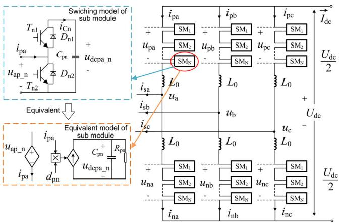  
FIGURE 1 Circuit configuration of MMC. MMC, multilevel converter.

1. When the NLM is applied in the situation of a large number of MMC sub-modules, the switching time of each module is dynamically adjusted according to dc side voltages of submodules, and the relationship of the switching time between each module is not fixed. When modelling the sub-module, the switching function or the duty cycle in the average model is difficult to be obtained. How to describe the modulation process is difficult.

2. If the equivalent model of the sub-module in the MMC based on the controllable voltage source is used to improve the simulation speed, the modulation method should generate the continuous duty cycle to replace the PWM signal. That is, the NLM should be replaced by a continuous duty cycle of average model.

In order to solve the above problems, this paper proposed an equivalent model of the NLM method based on the controllable voltage source and the voltage control loops. Compared with the currently available literature, the contributions of this paper can be summarized as follows: (1) Another view of the NLM modelling is presented in which the voltage control loops automatically generated the modelling variables, and the simulation speed of the MMC is improved; (2) The model can be realized by discrete components in general software and no programming is required, then it is easy to realize the modelling; (3) The model is aimed at the modelling of MMC sub-modules, and the differences between models of MMC sub-modules are considered.

# 2 PROPOSED MODELLINGAPPROACH USING VOLTAGE CONTROLCLOSED LOOP

# 2.1 Configuration of MMC

Figure 1 shows the circuit configuration of the MMC, where, SMi $( i = 1 , 2 , \dots N )$ is the sub-module of the MMC; $u _ { \mathrm { d c p a \_ i } }$ is the dc side voltage of the upper sub-module; $i _ { \mathrm { C i } }$ is the dc side current of the sub-module; $i _ { \mathrm { p a } }$ is the ac side current of the upper

sub-module; $u _ { \mathrm { a p \_ i } }$ is the ac side voltage of the upper sub-module; $u _ { \mathrm { p a } } , u _ { \mathrm { p b } } , u _ { \mathrm { p c } } , u _ { \mathrm { n a } } , u _ { \mathrm { n b } } , u _ { \mathrm { n c } }$ are arm voltages; $i _ { \mathrm { s a } } , ~ i _ { \mathrm { s b } } , ~ i _ { \mathrm { s c } }$ are ac source currents; $i _ { \mathrm { p a } } , i _ { \mathrm { p b } } , i _ { \mathrm { p c } } , i _ { \mathrm { n a } } , i _ { \mathrm { n b } } , i _ { \mathrm { n c } }$ are arm currents; $U _ { \mathrm { d c } }$ is the dc side voltage; $I _ { \mathrm { d c } }$ is the dc side current; $L _ { 0 }$ is the arm inductor; $C _ { \mathrm { p i } }$ is the capacitor of the sub-module; and N is the conducted number of sub-modules.

# 2.2 Mathematical model of MMC

This paper uses the successive approximation method in mathematics to solve the mathematical expression of MMC electrical variables [29–33], and obtains the mathematical expression of MMC electrical variables after two iterations.

The current of the upper arm of phase $a i _ { \mathrm { { p a } } }$ is shown in (1).

$$
\begin{array}{l} i _ {\mathrm {p a}} = - \frac {I _ {\mathrm {d c}}}{3} - \frac {I _ {\mathrm {v m}}}{2} \sin (\omega t + \theta_ {\mathrm {a 1}} - \alpha) - I _ {\mathrm {c i r m}} \cos (2 \omega t + \theta_ {\mathrm {a 2}} - \beta) \\ - \frac {4 U _ {\mathrm {d c}}}{\pi N \left(2 L _ {\mathrm {a c}} + L _ {0}\right)} \sum_ {\substack {k = 6 i \pm 1 \\ i = 1, 2, 3 \dots}} ^ {\infty} \frac {f (k)}{k ^ {2} \omega} \cos (k \omega t + \theta_ {\mathrm {a k}}) \tag{1} \\ \end{array}
$$

where $I _ { \mathrm { v m } }$ is the amplitude of the ac source current; α is the source power angle; $\theta _ { \mathrm { a 1 } }$ is the phase angle of the sinusoidal modulated wave of phase a; $\theta _ { \mathrm { a k } } = k \theta _ { \mathrm { a 1 } } ; L _ { \mathrm { a c } }$ is the source inductance; $k$ is the harmonic order; $U _ { \mathrm { V r e f } }$ is the amplitude of sinusoidal modulated wave of phase $a ; C _ { 0 }$ is the capacitance value of the sub-module.

$$
I _ {\mathrm {c i r m}} = \frac {\sqrt {(A _ {1} \cos \alpha + A _ {2}) ^ {2} + (A _ {1} \sin \alpha) ^ {2}}}{A _ {3}}
$$

$$
\beta = \arctan \frac {A _ {1} \sin \alpha}{A _ {1} \cos \alpha + A _ {2}}
$$

$$
\mathcal {A} _ {1} = \frac {3 f (1) I _ {\mathrm {v m}}}{8 \pi \omega^ {2} L _ {0} C _ {0}}
$$

$$
A _ {2} = - \frac {4 f ^ {2} (1) I _ {\mathrm {d c}}}{3 \pi^ {2} N \omega^ {2} L _ {0} C _ {0}}
$$

$$
A _ {3} = 1 - \frac {N}{1 6 \omega^ {2} L _ {0} C _ {0}} - \frac {8 f ^ {2} (1)}{3 \pi^ {2} N \omega^ {2} L _ {0} C _ {0}}
$$

$$
m = \min  \left[ r o u n d \left(U _ {\mathrm {V r e f}} / U _ {\mathrm {d c p a} _ {\mathrm {i}}}\right), N / 2 \right]
$$

$$
\delta_ {i} = \arcsin [ (i - 0. 5) U _ {\mathrm {d c p a} _ {-} i} / U _ {\mathrm {V r e f}} ], f (k) = \sum_ {i = 1} ^ {m} \cos (k \delta_ {i}).
$$

The current of the lower arm of phase $a i _ { \mathrm { n a } }$ is shown in (2).

$$
\begin{array}{l} i _ {\mathrm {n a}} = - \frac {I _ {\mathrm {d c}}}{3} + \frac {I _ {\mathrm {v m}}}{2} \sin (\omega t + \theta_ {\mathrm {a 1}} - \alpha) - I _ {\mathrm {c i r m}} \cos (2 \omega t + \theta_ {\mathrm {a 2}} - \beta) \\ + \frac {4 U _ {\mathrm {d c}}}{\pi N \left(2 L _ {\mathrm {a c}} + L _ {0}\right)} \sum_ {\substack {k = 6 i \pm 1 \\ i = 1, 2, 3 \dots}} ^ {\infty} \frac {f (k)}{k ^ {2} \omega} \cos \left(k \omega t + \theta_ {\mathrm {a k}}\right) \tag{2} \\ \end{array}
$$

From (1) and (2), the circulating current of phase a is obtained as (3). The sum of the capacitor voltages of upper arm submodules in phase a can be obtained, and it is expressed as (4). The sum of the capacitor voltages of lower arm submodules in phase a can be obtained, and it is expressed as (5).

$$
i _ {\mathrm {c i r a}} = - \frac {I _ {\mathrm {d c}}}{3} - I _ {\mathrm {c i r m}} \cos (2 \omega t + \theta_ {\mathrm {a 2}} - \beta) \tag {3}
$$

$$
\begin{array}{l} u _ {\mathrm {C p a}} = \frac {U _ {\mathrm {d c}}}{N} + \frac {I _ {\mathrm {v m}}}{4 \omega C _ {0}} \cos (\omega t + \theta_ {\mathrm {a 1}} - \alpha) - \frac {I _ {\mathrm {c i r m}}}{4 \omega C _ {0}} \sin (2 \omega t - \beta) \\ +\frac{2U_{\mathrm{dc}}}{\pi N(2L_{\mathrm{ac}} + L_{0})}\sum_{\substack{k = 6i\pm 1\\ i = 1,2,3\dots}}^{\infty}\frac{f\left(k\right)}{k^{3}\omega^{2}}\sin \left(k\omega t + \theta_{\mathrm{ak}}\right) \\ -\frac{4I_{\mathrm{dc}}}{3\pi NC_{0}}\sum_{\substack{k = 2i - 1\\ i = 1,2,3\dots}}^{\infty}\frac{f(k)}{k^{2}\omega}\cos \left(k\omega t + \theta_{\mathrm{ak}}\right) \\ +\frac{I_{\mathrm{vm}}}{\pi NC_{0}}\sum_{\substack{k = 2i + 1\\ i = 1,2,3\dots}}^{\infty}\frac{f\left(k\right)}{k\left(k - 1\right)\omega}\sin \left[(k - 1)\omega t + \theta_{\mathrm{ak}} - \theta_{\mathrm{a1}} + \alpha \right] \\ -\frac{I_{\mathrm{vm}}}{\pi NC_{0}}\sum_{\substack{k = 2i - 1\\ i = 1,2,3\dots}}^{\infty}\frac{f\left(k\right)}{k\left(k + 1\right)\omega}\sin \left[(k + 1)\omega t + \theta_{\mathrm{ak}} + \theta_{\mathrm{a1}} - \alpha \right] \\ -\frac{2I_{\mathrm{cirm}}}{\pi NC_{0}}\sum_{\substack{k = 2i - 1\\ i = 1,2,3\dots}}^{\infty}\frac{f\left(k\right)}{k\left(k + 2\right)\omega}\cos \left[(k + 2)\omega t + \theta_{\mathrm{ak}} + \theta_{\mathrm{a2}} - \beta \right] \\ - \frac {2 I _ {\text {c i r m}}}{\pi N C _ {0}} \sum_ {\substack {k = 2 i - 1 \\ i = 1, 2, 3 \dots}} ^ {\infty} \frac {f (k)}{k (k - 2) \omega} \cos [ (k - 2) \omega t + \theta_ {\mathrm {a k}} - \theta_ {\mathrm {a 2}} + \beta ] \tag{4} \\ \end{array}
$$

$$
\begin{array}{l} u _ {\mathrm {C n a}} = \frac {U _ {\mathrm {d c}}}{N} - \frac {I _ {\mathrm {v m}}}{4 \omega C _ {0}} \cos (\omega t + \theta_ {\mathrm {a 1}} - \alpha) - \frac {I _ {\mathrm {c i r m}}}{4 \omega C _ {0}} \sin (2 \omega t - \beta) \\ -\frac{2U_{\mathrm{dc}}}{\pi N(2L_{ac} + L_{0})}\sum_{\substack{k = 6i\pm 1\\ i = 1,2,3\dots}}^{\infty}\frac{f\left(k\right)}{k^{3}\omega^{2}}\sin \left(k\omega t + \theta_{\mathrm{ak}}\right) \\ +\frac{4I_{\mathrm{dc}}}{3\pi NC_{0}}\sum_{\substack{k = 2i - 1\\ i = 1,2,3\dots}}^{\infty}\frac{f(k)}{k^{2}\omega}\cos \left(k\omega t + \theta_{\mathrm{ak}}\right) \\ \end{array}
$$

$$
\begin{array}{l} +\frac{I_{\mathrm{vm}}}{\pi NC_{0}}\sum_{\substack{k = 2i + 1\\ i = 1,2,3\dots}}^{\infty}\frac{f\left(k\right)}{k\left(k - 1\right)\omega}\sin \left[(k - 1)\omega t + \theta_{\mathrm{ak}} - \theta_{\mathrm{a1}} + \alpha \right] \\ -\frac{I_{\mathrm{vm}}}{\pi NC_{0}}\sum_{\substack{k = 2i - 1\\ i = 1,2,3\dots}}^{\infty}\frac{f\left(k\right)}{k\left(k + 1\right)\omega}\sin \left[(k + 1)\omega t + \theta_{\mathrm{ak}} + \theta_{\mathrm{a1}} - \alpha \right] \\ +\frac{2I_{\mathrm{cirm}}}{\pi NC_{0}}\sum_{\substack{k = 2i - 1\\ i = 1,2,3\dots}}^{\infty}\frac{f\left(k\right)}{k\left(k + 2\right)\omega}\cos \left[(k + 2)\omega t + \theta_{\mathrm{ak}} + \theta_{\mathrm{a2}} - \beta \right] \\ + \frac {2 I _ {\text {c i r m}}}{\pi N C _ {0}} \sum_ {\substack {k = 2 i - 1 \\ i = 1, 2, 3 \dots}} ^ {\infty} \frac {f (k)}{k (k - 2) \omega} \cos [ (k - 2) \omega t + \theta_ {\mathrm {a k}} - \theta_ {\mathrm {a 2}} + \beta ] \tag{5} \\ \end{array}
$$

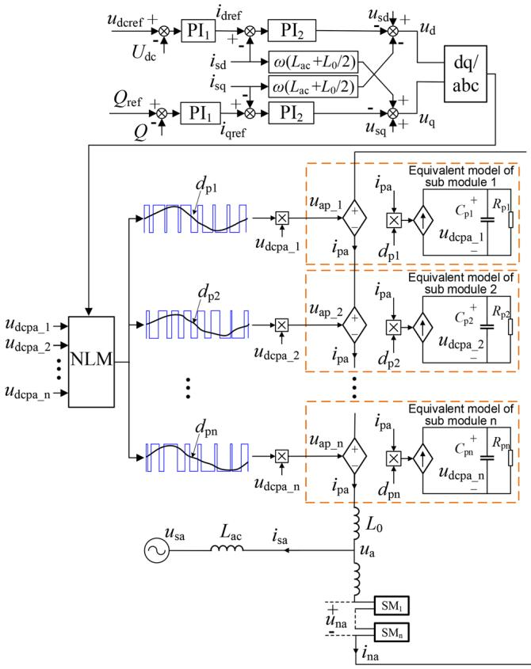  
FIGURE 2 Equivalent circuit of MMC with NLM. MMC, multilevel converter; NLM, nearest level modulation.

The voltages of upper and lower arm sub-modules in phase a can be expressed as (6) and (7).

$$
u _ {\mathrm {p a}} = \left[ \frac {N}{2} - \frac {4}{\pi} \sum_ {k = 2 i - 1} ^ {\infty} \frac {f (k)}{k} \sin (k \omega t + \theta_ {\mathrm {a k}}) \right] u _ {\mathrm {C p a}} \qquad (6)
$$

$$
u _ {\mathrm {n a}} = \left[ \frac {N}{2} + \frac {4}{\pi} \sum_ {k = 2 i - 1} ^ {\infty} \frac {f (i)}{i} \sin (i \omega t + \theta_ {\mathrm {a k}}) \right] u _ {\mathrm {C n a}} \tag {7}
$$

From (1) to (7), the mathematical model of each electrical variable of the MMC is formed.

# 2.3 Proposed modelling approach of NLM

Figure 2 shows the equivalent circuit of the MMC in some papers, the sub-module is equivalent to an ac voltage source on the ac side and a dc current source on the dc side. In (6) and (7), the output voltage of each module includes the dc component, the fundamental component and the harmonic components. It is very complex and inconvenient to realize the ac voltage on the ac side through (6) and (7), so the NLM is used to automatically generate the ac voltage on the ac side. The output of the modulation wave is sent to the NLM through the d-q frame control strategy. The NLM generates PWM waves for each module of the MMC. In the NLM, the modulation wave is modified

according to the dc side voltage value of each module in the MMC, so as to achieve the purpose of voltage balancing of each module. The waveforms of average values in one switch period of PWM generated by the NLM are $d _ { \mathrm { p 1 } }$ to $d _ { \mathrm { p n } } ,$ that is, the waveforms of duty cycles of the average model are generated. And, the waveforms of duty cycles contain not only dc components and fundamental components, but also harmonic components. The NLM can automatically adjust the value of the controllable voltage source on the ac side. In order to realize the voltage balance of the dc side voltage of each module, the controllable voltage source on the ac side includes the dc component, the fundamental component and harmonic components as shown in (6) and (7).

The combination of the average model and the controllable voltage source model will greatly improve the simulation speed, but how to build the model or obtain the equivalent method of the NLM is the key problem. Two issues should be considered: (1) the PWM wave or duty cycle is automatically generated, and components are complex; (2) there are not enough known variables to realize the mathematical model in (6) and (7) which are built based on only the main circuit without the control system or the modulation method.

To solve the above two issues, this paper proposed an equivalent method of the NLM by adding a dc voltage control loop in each MMC module. Figure 3 shows the equivalent method of the NLM. The complex NLM output of the duty cycle is divided into two parts, which are the part to realize the output voltage $u _ { \mathrm { a } }$ of the whole circuit and the part to compensate for the dc side voltage imbalance of each sub-module.

In the proposed model, the ac side output of each submodule is equivalent to two series connected controllable voltage sources, and the dc side is equivalent to a series connected controllable current source and a capacitor. The two controllable voltage sources represent the stable component for the voltage $ { \mathcal { H } _ { \mathrm { 2 } } }$ and the fluctuation component for the dc side voltage balance of the sub-module, respectively. The stable component is generated by the bridge arm modulation wave, which includes the dc component and the fundamental frequency voltage component. The fluctuation component is used to compensate for the dc side voltage imbalance of each sub-module, which includes the second harmonic component, part of the fundamental component and harmonic components. The value of the controllable current source is obtained by multiplying the sub-module duty cycle and the bridge arm current.

This paper takes the first sub-module as an example to illustrate the equivalent model of the NLM. The controllable voltage source $u _ { \mathrm { a p f } _ { - } 1 }$ is the stable component. $d _ { 1 }$ is the input duty cycle of $u _ { \mathrm { a p f } \_ 1 }$ , and $d _ { 1 }$ which can be obtained by dividing the modulated wave by the number of sub-modules $N ,$ is equal in each sub-module. $d _ { 1 }$ contains the dc component and the fundamental component which are used to control the source currents $i _ { \mathrm { d } }$ and $i _ { \mathrm { q } } .$

The controllable voltage source $u _ { \mathrm { a p 0 } \_ 1 }$ is the fluctuation component. It is automatically generated by a dc voltage control loop. The average value $\left( { { u _ { \mathrm { d c r e f } } } _ { - 1 } } \right)$ of the dc voltages of submodules in the same bridge arm at this time is taken as the

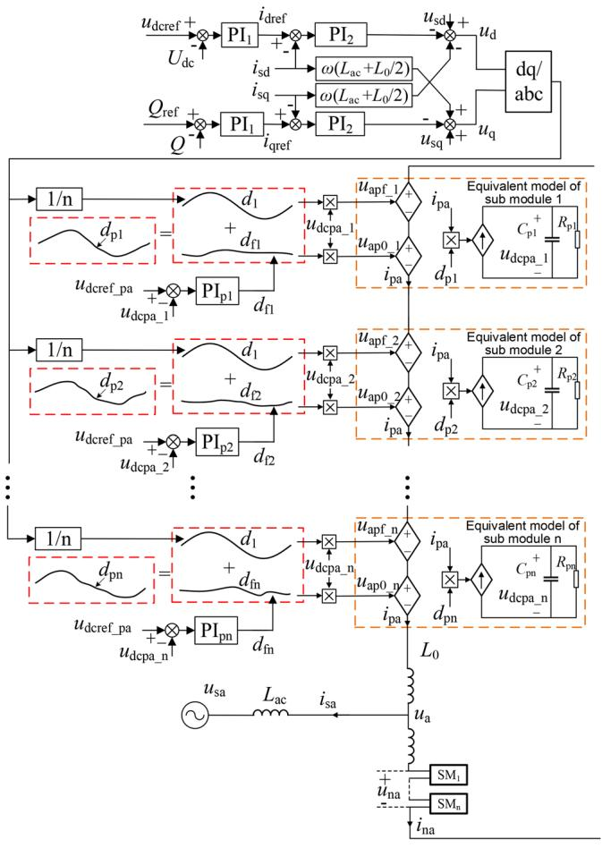  
FIGURE 3 Equivalent circuit of MMC with proposed equivalent method of NLM. MMC, multilevel converter; NLM, nearest level modulation.

reference value of the voltage control loop. The dc side voltage $( u _ { \mathrm { { d c p a } } _ { - } 1 } )$ of the sub-module is the feedback of the closed loop, and the duty cycle $d _ { \mathrm { f 1 } }$ that compensates for the imbalance of the dc side voltage of each module is generated by the proportional integral (PI) regulator. The ac side voltage of the sub-module is obtained by multiplying the duty cycle by the dc voltage of the sub-module. The sum of the two duty cycles $( d _ { 1 }$ and $d _ { \mathrm { f 1 } } )$ ) in Figure 3 is equal to the duty cycle $( d _ { \mathrm { p 1 } } )$ generated by the NLM in Figure 2, that is, $d _ { \mathrm { p } 1 } = d _ { 1 } + d _ { \mathrm { f } 1 }$ . As a result, the NLM is equivalent to the duty cycle being adjusted by the voltage loop automatically.

The value of the duty cycle $d _ { 1 }$ of the sub-module can be obtained from (8):

$$
d _ {1} = \frac {\mu_ {\mathrm {r e f} - \mathrm {p a}}}{U _ {\mathrm {d c}}} \tag {8}
$$

where $u _ { \mathrm { r e f \_ p a } }$ is the bridge arm voltage command value and $U _ { \mathrm { d c } }$ is the total dc side voltage.

The average value of the dc side voltage of the sub-module $u _ { \mathrm { d c r e f \_ p a } }$ can be expressed as (9):

$$
u _ {\mathrm {d c r e f} \_ \mathrm {p a}} = \frac {1}{N} \sum_ {i = 1} ^ {N} u _ {\mathrm {d c p a} \_ \mathrm {i}} \tag {9}
$$

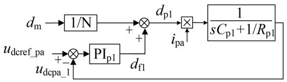  
FIGURE 4 DC side voltage control loop of sub-module.

TABLE 1 Parameters of MMC.   

<table><tr><td>Parameter</td><td>Value</td></tr><tr><td>Source voltage</td><td>10 kV</td></tr><tr><td>DC side voltage</td><td>20 kV</td></tr><tr><td>Transformer ratio</td><td>1 : √3</td></tr><tr><td>Number of sub-modules in bridge arm</td><td>10</td></tr><tr><td>Bridge arm inductance</td><td>20 mH</td></tr><tr><td>Equivalent reactance of transformer</td><td>20 mH</td></tr><tr><td>Capacitance of sub-module</td><td>1000 μF</td></tr></table>

MMC, multilevel converter.

The block diagram of the dc side voltage closed-loop control is shown in Figure 4. After the PI parameters are properly designed, the dc side voltage can be equal to the reference voltage.

# 3 EQUIVALENT MODEL VALIDATION

The proposed equivalent model is validated by comparison with the switching model. And, the simulation time is reduced while ensuring the accuracy at the low-frequency range or with the time step of millisecond level.

# 3.1 Comparison of mathematical model and switching model

This paper compares the value of the MMC mathematical model obtained from Equations (1) to (7) with the simulation value of the switching model to verify the accuracy of this mathematical model. The parameters of the MMC are shown in Table 1, and the comparison between the actual simulation model and the calculated value of the equations is shown in Figure 5. The simulation software of PSIM is used.

After the simulation reaches the steady state, the comparison of the simulation waveforms of the switching model and the mathematical model is proposed. The dc side voltage in each sub-module is shown in Figure 5a; the waveform of the mathematical model basically coincides with that of the switching model. From Figure 5b, the bridge arm voltage waveforms of two models which include the dc component, the fundamental component, the second harmonic component and high order

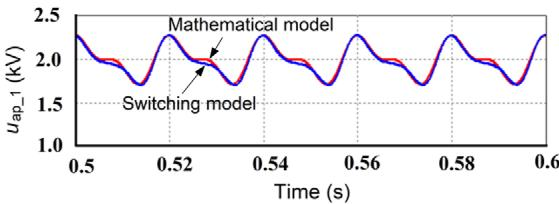  
(a) Dc side voltage of sub module

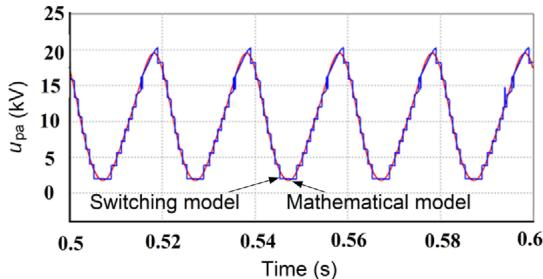

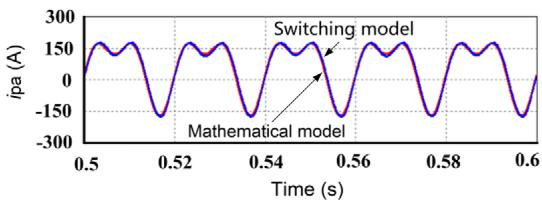  
(b) Bridge arm voltage   
(c) Bridge arm current   
FIGURE 5 Comparison of mathematical model and switching model.

harmonic components are the same. In Figure 5c, the bridge arm current waveforms are also basically the same. Therefore, the MMC mathematical model established in this paper is basically the same as that of the switching model, which proves that the equations derived from (1) to (7) have high accuracy, and they can accurately describe the waveforms of electrical variables in the MMC steady state.

# 3.2 DC side voltage of sub-module without and with voltage control loop

When the dc side voltages of sub-modules are not equal, the dc side voltage balance control of MMC sub-modules is added in the NLM, so that the dc side voltages of the sub-modules are approximately the same. The model established in this paper can realize the function of the NLM. In the simulation, the different dc side resistance values represent the different losses of submodules, and the dc side voltages are different. From Figure 6a, when the dc side voltage balance control of MMC sub-modules is not used, the voltage $\boldsymbol { u } _ { \mathrm { a } }$ and the source current $i _ { \mathrm { s a } }$ are expected sinusoidal values, and the total dc side voltage is about 20 kV. But, the dc side voltages of sub-modules are different. If the model proposed in this paper is used, the dc side voltage balance control of MMC sub-modules can be realized by voltage control loops. In Figure 6b, the dc side voltages of sub-modules are the same with the model proposed in this paper.

The simulation results show that the proposed method of applying voltage control closed loop to be equivalent to the NLM can realize the dc side voltage balance of MMC

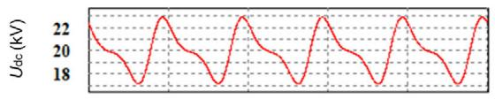

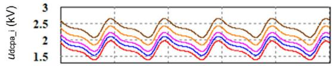

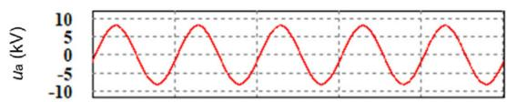

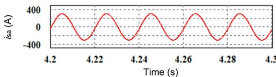  
(a) Without voltage control loop

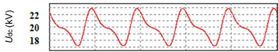

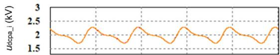

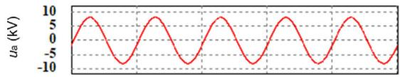

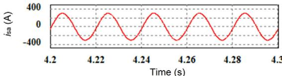  
(b)With voltagecontrol loop   
FIGURE 6 DC side voltage balance of sub-modules without and with voltage control loop.

sub-modules, which can be equivalent to the function of the NLM.

# 3.3 Comparison of proposed model and switching model

In order to verify the correctness and accuracy of the proposed equivalent model of the NLM, a comparison between the proposed model and the switching model is proposed in this paper in Figure 7.

While considering the differences between various submodules, it significantly improves the simulation speed compared to the modelling method based on switch period. Of course, the accuracy is definitely not as high as the modelling method based on switch period. However, if both accuracy and speed are considered comprehensively in some applications that

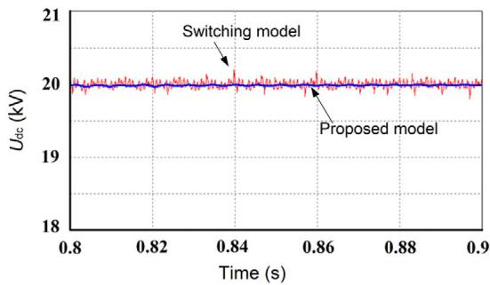

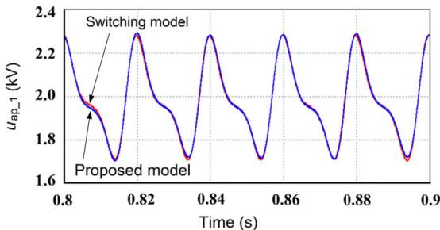  
(a) Dc side voltage   
(b)Dc side voltage of sub module

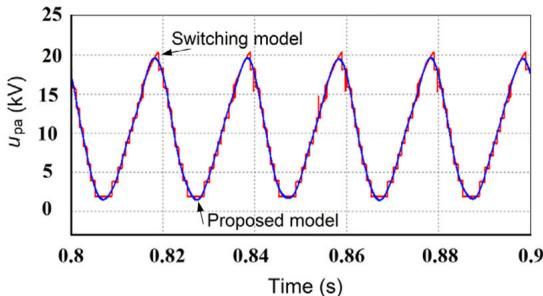

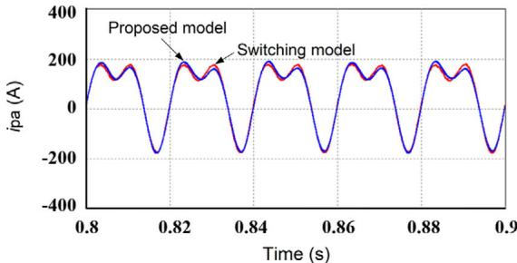  
(c) Bridge arm voltage   
(d) Bridge arm current   
FIGURE 7 Comparison of proposed model and switching model (steady state).

consider millisecond time steps, this method can significantly improve the simulation speed and meet the accuracy requirement of the millisecond level, and the accuracy can also be adjusted according to the value of the PI regulator.

From Figure 7, the waveforms of the dc side voltage, dc side voltages of sub-modules, the bridge arm voltage and the bridge arm current are almost consistent with the switching model at the millisecond level, which shows that the proposed model can well retain the electrical characteristics of the switching model in steady state at the low frequency or the millisecond level. The reason for the small error in the proposed model is that the harmonic component at the low frequency is eliminated by using the average model. By comparing the simulation waveforms of

TABLE 2 Comparison of simulation speed of two models.   

<table><tr><td>Model</td><td>Total time of simulation</td><td>Simulation time step</td><td>Actual time used by simulation</td></tr><tr><td>Switching model</td><td>2 s</td><td>50 μs</td><td>50 min</td></tr><tr><td>Proposed model</td><td>2 s</td><td>50 μs</td><td>3 min 40 s</td></tr></table>

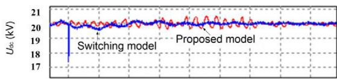

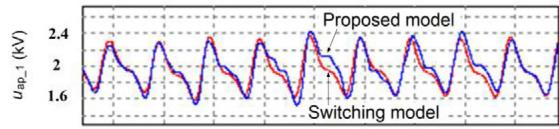

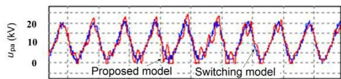

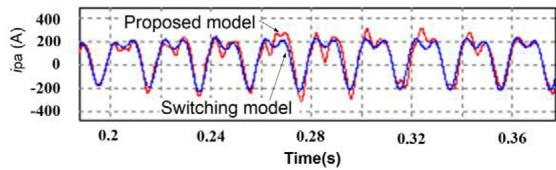  
FIGURE 8 Comparison of proposed model and switching model (dynamic state).

the proposed model and the switching model, it can be seen that the MMC simulation model based on the dc voltage control closed loop for the equivalent NLM is approximately equal to the switching model.

The simulation speed of two models is also compared in this paper, as shown in Table 2. Table 2 shows that the MMC simulation based on the model proposed in this paper is much faster than the switching model in simulation speed. Therefore, the NLM model in MMC based on the dc side voltage closed loop of sub-module can retain the electrical characteristics of electrical variables in the MMC switching model, while the simulation speed has been greatly improved.

A comparison between the proposed model and the switching model at dynamic state is proposed in this paper in Figure 8. At 0.2 s, the DC load changes, after adjustment of the voltage closed loop and the current closed loop, the DC side voltage returns to its previous value. From Figure 8, the proposed model of the NLM improves the simulation speed and has the same effect with the traditional NLM within the low-frequency range or millisecond level. Errors which exist between the waveforms of the proposed model and the waveforms of the switching model reflect the difference of the two models. The proposed model has a time step greater than a few switching periods or millisecond levels.

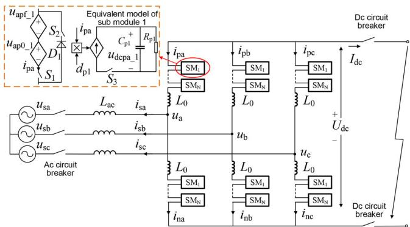  
FIGURE 9 DC side fault of MMC and proposed model. MMC, multilevel converter.

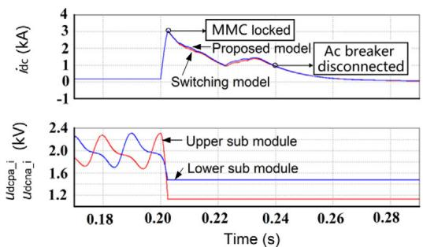  
FIGURE 10 Comparison between proposed model and switching model when ac circuit breaker is disconnected.

# 3.4 Analysis of dynamic characteristics

In order to verify the accuracy of the proposed model in the dynamic process, this paper makes a simulation comparison between the proposed model and the switching model under the dc side fault of the MMC.

For example, when the dc side of the MMC has a fault as shown in Figure 9, the fault current consists of two parts: the current injected into the dc side by the ac power grid through the MMC sub-module; the capacitor discharge currents of submodules. In the first stage of the fault, the ac power grid and the MMC sub-module capacitors inject current to the short-circuit point at the same time; When MMC sub-modules are locked or the end of capacitor discharging is researched, the fault state enters the second stage. At this time, only the ac power source injects the short-circuit current to the short-circuit point through the MMC. During the dc side fault of the MMC, the function of locking sub-modules needs to be added to the proposed model. Switches S , S and $S _ { 3 }$ are added to the proposed model. When the dc side fault occurs, $S _ { 1 }$ and $S _ { 3 }$ are turned off, and $S _ { 2 }$ is turned on at the second stage of the fault state. MMC sub-modules are locked and the power grid generates the short-current through the diode $D _ { 1 }$ .

The simulation comparison of the dc side current and the sub-module voltage between the proposed model and the switching model is proposed in Figure 10. When the MMC operates normally and stably, a short-circuit fault occurs in 0.2 s. It can be seen from Figure 10 that the bridge arm current

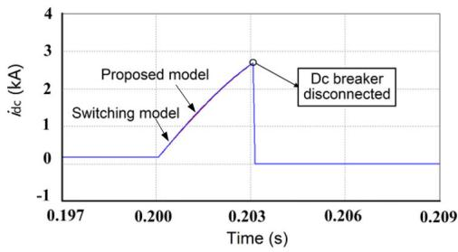  
FIGURE 11 Comparison between proposed model and switching model when dc circuit breaker is disconnected.

reaches twice the rated value after 3.92 ms when the shortcircuit fault occurs. When the sub-module is locked, the circuit breaker on the ac side is disconnected at 0.24 s. From Figure 10, it can be seen that the proposed model based on the bridge arm dc voltage closed loop to be equivalent to the NLM is almost coincident with the simulation result curve of the switch model, and the fault characteristics of the two models are consistent, which proves that the proposed model based on the bridge arm dc voltage closed loop to be equivalent to the NLM can also ensure the accuracy in the dynamic process. In Figure 10, the fault current reaches the peak value after MMC sub-modules are locked, and gradually drops to zero after the ac circuit breaker is disconnected. After sub-modules are locked, their capacitor voltages remain unchanged and will no longer discharge to the short-circuit point.

In Figure 11, the dc circuit breaker is disconnected after the dc side fault occurs. The short-circuit current response characteristic of the proposed model based on the bridge arm dc voltage closed loop to be equivalent to the NLM is completely consistent with those of the switching model, which proves the consistency and rationality of the two models in terms of circuit equivalence.

Through simulation results, the proposed model has the same accuracy as the switching model in steady state and dynamic state at the low-frequency range or with the time step of millisecond level.

# 4 CONCLUSION

In this paper, a model based on the bridge arm dc voltage closed loop to be equivalent to the NLM is proposed. The following conclusions may be drawn from the study.

The closed loop can automatically adjust the ac side voltage of the sub-module, and the complex NLM process is simply described and modelled. The dc side voltages of sub-modules are balanced, and the bridge arm voltage or current is not influenced.

Compared with the existing models for the MMC, the simulation speed of the MMC is improved.

The proposed equivalent model of NLM and the controllable power source model has an acceptable simulation accuracy in applications that pay attention to the simulation accuracy of the low-frequency range instead of the switching frequency range.

# AUTHOR CONTRIBUTION

Guopeng ZHAO: Conceptualization, Data curation, Formal Analysis, Software, Supervision, Validation, Visualization. Xiaoyin LI: Writing–original draft, Writing–review & editing. Dong WANG: Investigation, Methodology.

# ACKNOWLEDGEMENTS

This paper was supported by National Key R&D Program of China (grant number. 2021YFB2601500).

# CONFLICT OF INTEREST STATEMENT

The authors declare no conflict of interest.

# DATA AVAILABILITY STATEMENT

Data sharing is not applicable to this article as no new data were created or analyzed in this study.

# ORCID

Guopeng Zhao https://orcid.org/0000-0002-5799-4371

# REFERENCES

1. Li, D., Ji, Z., Zhao, J., Sun, Y., Wang, S., Ni, X.: Hierarchical voltage balancing method for MMC based on DCSM. IET Power Electron. 15(14), 1583–1595 (2022)   
2. Li, Z.Y., Wang, Z., Wang, Y., Yin, T.Y., Mei, N., Yue, B., Lei, W.J.: Accurate impedance modeling and control strategy for improving the stability of dc system in multiterminal MMC-based dc grid. IEEE Trans. Power Electron. 35(10), 10026–10049 (2020)[CrossRef]   
3. Muthavarapu, A.K., Gopi, A.K., Biswas, J., Barai, M.: A hybrid level shifted carrier-based PWM technique for modular multilevel converters. IET Power Electron. 14(13), 2219–2233 (2021)   
4. Liu, P., Liu, D., Shen, Y., Yang, X., Zhao, J., Wang, Y.: The analysis of steady-state operation characteristic and resonance phenomenon considering all the harmonic components of modular multilevel converter for HVDC. IET Power Electron. 15(10), 919–931 (2022)   
5. Samajdar, D., Bhattacharya, T., Dey, S.: A reduced switching frequency sorting algorithm for modular multilevel converter with circulating current suppression feature. IEEE Trans. Power Electron. 34(11), 10480–10491 (2019)   
6. Meng, X.K., Han, J.T., Pfannschmidt, J., Wang, L.W., Li, W., Zhang, F., Belanger, J.: Combining detailed equivalent model with switchingfunction-based average value model for fast and accurate simulation of MMCs. IEEE Trans. Energy Convers. 35(1), 484–496 (2020)   
7. Xu, Z.G., Li, B.B., Han, L.J., Hu, J.L., Wang, S.B., Zhang, S.G., Xu, D.G.: A complete HSS-based impedance model of MMC considering grid impedance coupling. IEEE Trans. Power Electron. 35(12), 12929–12948 (2020)   
8. Tu, Q.R., Xu, Z., Xu, L.: Reduced switching-frequency modulation and circulating current suppression for modular multilevel converters. IEEE Trans. Power Deliv. 26(3), 2009–2017 (2011)   
9. Zhu, J.H., Hu, J.B., Wang, S.C., Wan, M.H.: Small-signal modeling and analysis of MMC under unbalanced grid conditions based on linear time-periodic (LTP) method. IEEE Trans. Power Deliv. 36(1), 205–214 (2021)   
10. Feng, M.K., Gao, C.X., Xu, J.Z., Zhao, C.Y., Li, G.: Modeling for complex modular power electronic transformers using parallel computing. IEEE Trans. Ind. Electron. 70(3), 2639–2651 (2023). https://doi.org/10.1109/ TIE.2022.3170623   
11. Ashourloo, M., Mirzahosseini, R., Iravani, R.: Enhanced model and realtime simulation architecture for modular multilevel converter. IEEE Trans. Power Deliv. 31(1), 466–476 (2018)

12. Lin, N., Dinavahi, V.: Variable time-stepping modular multilevel converter model for fast and parallel transient simulation of multiterminal dc grid. IEEE Trans. Ind. Electron. 66(9), 6661–6670 (2019)   
13. Peralta, J., Saad, H., Dennetiere, S., Mahseredjian, J., Nguefeu, S.: Detailed and averaged models for a 401-level MMC-HVDC system. IEEE Trans. Power Deliv. 27(3), 1501–1508 (2012)   
14. Saad, H., Peralta, J., Dennetière, S., Mahseredjian, J., Jatskevich, J., Martinez, J.A., Davoudi, A., Saeedifard, M., Sood, V., Wang, X., Cano, J., Mehrizi-Sani, A.: Dynamic averaged and simplified models for MMC-based HVDC transmission systems. IEEE Trans. Power Deliv. 28(3), 1723–1730 (2013)   
15. Xu, J.Z., Gole, A.M., Zhao, C.Y.: The use of averaged-value model of modular multilevel converter in dc grid. IEEE Trans. Power Deliv. 30(2), 519–528 (2015)   
16. Xu, Z.G., Li, B.B., Li, S.Y., Wang, X.F., Xu, D.G.: MMC admittance model simplification based on signal-flow graph. IEEE Trans. Power Electron. 37(5), 5547–5561 (2022)   
17. Ye, H., Gao, F., Pei, W., Kong, L.: Wave function and multiscale modeling of MMC-HVdc system for wide-frequency transient simulation. IEEE Trans. Emerg. Sel. Topics Power Electron. 9(5), 5906–5917 (2021)   
18. Xiang, W., Lin, W.X., An, T., Wen, J.Y., Wu, Y.N.: Equivalent electromagnetic transient simulation model and fast recovery control of overhead VSC-HVDC based on SB-MMC. IEEE Trans. Power Deliv. 32(2), 778–788 (2017)   
19. Stepanov, A., Mahseredjian, J., Karaagac, U., Saad, H.: Adaptive modular multilevel converter model for electromagnetic transient simulations. IEEE Trans. Power Deliv. 36(2), 803–813 (2021)   
20. Wang, W.Y., Ma, K., Cai, X.: Efficient capacitor voltage balancing method for modular multilevel converter under carrier-phase-shift pulsewidth modulation. IEEE Trans. Power Electron. 36(2), 1553–1562 (2021)   
21. Mehrasa, M., Pouresmaeil, E., Akorede, M.F., Zabihi, S., Catalão, J.P.S.: Function-based modulation control for modular multilevel converters under varying loading and parameters conditions. IET Gener. Transm. Distrib. 11(13), 3222–3230 (2017)   
22. Yu, K., Gu, F., Zhang, L., Ruan, W.: Comparative analysis of power loss for MMC rectifiers with NLM and CPS modulation schemes. In: 2020 12th IEEE PES Asia-Pacific Power and Energy Engineering Conference (APPEEC). Nanjing, China, pp. 20–23 (2020)   
23. Chen, X.X., Liu, J.J., Song, S.G., Ouyang, S.D.: Circulating harmonic currents suppression of level-increased NLM based modular multilevel converter with deadbeat control. IEEE Trans. Power Electron. 35(11), 11418–11429 (2020)   
24. Chen, J.N., Jiang, D., Sun, W., Pei, X.J.: Common-mode voltage reduction scheme for MMC with low switching frequency in ac-dc power conversion system. IEEE Trans. Ind. Inform. 18(1), 278–287 (2022)   
25. Jiang, S., Ma, K., Cai, X., Konstantinou, G.: Mission profile emulation for flexible number of submodules in modular multilevel converters with nearest level modulation. IEEE Trans. Power Ind. Electron. 69(12), 11926–11935 (2022)   
26. Hu, P.F., Jiang, D.Z.: A level-increased nearest level modulation method for modular multilevel converters. IEEE Trans. Power Electron. 30(4), 1836– 1842 (2015)   
27. Lin, L., Lin, Y.Z., He, Z., Chen, Y., Hu, J.B., Li, W.H.: Improved nearest-level modulation for a modular multilevel converter with a lower submodule number. IEEE Trans. Power Electron. 31(8), 5369–5377 (2016)   
28. Wang, W.Y., Ma, K., Cai, X.: Flexible nearest level modulation for modular multilevel converter. IEEE Trans. Power Electron. 32(12), 13686–13696 (2021)   
29. Yang, H.Y., Dong, Y.F., Li, W.H., He, X.N.: Average-value model of modular multilevel converters considering capacitor voltage ripple. IEEE Trans. Power Deliv. 32(2), 723–732 (2017)   
30. Wang, C., Xu, J.X., Pan, X.W., Gong, W.N., Xu, S.K., Zhu, Z.: Impedance modeling and analysis of series-connected modular multilevel converter (MMC) and its comparative study with conventional MMC for HVDC applications. IEEE Trans. Power Deliv. 37(4), 3270–3281 (2022). https:// doi.org/10.1109/TPWRD.2021.3125699

31. Song, Q., Liu, W.H., Li, X.Q., Rao, H., Xu, S.K., Li, L.C.: A steady-state analysis method for a modular multilevel converter. IEEE Trans. Power Electron. 28(8), 3702–3713 (2013)   
32. Shu, D.W., Wei, Y.D., Dinavahi, V., Wang, K.Y., Yan, Z., Li, X.Q.: Cosimulation of shifted-erequency/dynamic phasor and electromagnetic transient models of hybrid LCC-MMC dc grids on integrated CPU-GPUs. IEEE Trans. Power Ind. Electron. 67(8), 6517–6530 (2020)   
33. Jamshidifar, A., Jovcic, D.: Small-signal dynamic dq model of modular multilevel converter for system studies. IEEE Trans. Power Deliv. 31(1), 191–199 (2016)

How to cite this article: Zhao, G., Li, X., Wang, D.: Equivalent model of nearest level modulation for fast electromagnetic transient simulation based on DC voltage control loops of sub-modules in modular multilevel converter. IET Gener. Transm. Distrib. 17, 3648–3657 (2023). https://doi.org/10.1049/gtd2.12920