# Realization of rational models for tower-footing grounding systems✩

Antonio C.S. Lima a , , Thiago J.M.A. Parreiras a , Rafael Alípio b , Maria Teresa Correia de Barros c

a Universidade Federal do Rio de Janeiro, P.O. Box. 68504, 21945-970, Rio de Janeiro, RJ, Brazil   
b CEFET-MG, Belo Horizonte, MG, Brazil   
c University of Lisbon, Lisbon, Portugal

# A R T I C L E I N F O

Keywords:

Grounding

Circuit synthesis

Lightning protection

Electromagnetic Transients

# A B S T R A C T

A tower footing grounding system plays an essential role in lightning-related overvoltages. For time-domain analysis, using an Electromagnetic Transient (EMT) program, one typically has to resort to a rational approximation of the harmonic impedance or a frequency-dependent network equivalent (FDNE) for the grounding system. Although one may obtain a rational approximation in several ways, a discussion of the impact of the topology considered for the rational approximation and the effect of the effective length in this realization has not been presented in the literature. Thus, this work focused on these two aspects. First, a comparison of either approach regarding a minimum-order representation. Second, comparing the two possible topologies of the rational approximation order and its relationship with the effective length. The results indicate that an accurate FDNE is slightly more robust if the effective length is respected.

# 1. Introduction

Tower-footing grounding system plays an important role in assessing ground potential rise (GPR) during transients related to lighting phenomena. Typically, the frequency or time domains can be used for such evaluation. For the former, the Method of Moments (MoM) [1,2] is employed, considering either an equivalent impedance matrix [3–6] or using the Partial Element Equivalent Circuit (PEEC) method [7,8] as the Hybrid Electromagnetic Model (HEM) [9], or its modified version (mHEM) [10]. For the latter, there are two main possibilities: The finite-difference Time-Domain (FDTD) can be used to directly derive a ground system immittance [11,12] or one may adapt the grounding impedance calculated using one of the above methods to allow a representation in an Electromagnetic Transient (EMT) program such as ATP, EMTP or PSCAD.

To include a grounding system in an EMT program, one may consider using a frequency-dependent transmission line model [13–16], obtain an equivalent circuit [17–20] or use a rational approximation of the harmonic impedance of the grounding system. Some algorithms such as, Vector Fitting [21–23] or Matrix Pencil Method [24–27] can be utilized to obtain this harmonic impedance.

More recently, in the case of a tower footing grounding system, some works [28,29] have treated the tower footing grounding system as a frequency-dependent network equivalent (FDNE). In this scenario, post-processing passivity enforcement must be carried out to ensure stable time responses [30–34]. However, these works do not discuss whether or not this approach leads to a more robust implementation in terms of numerical stability, realization order, and even if a reduced-order realization is feasible.

The topic of order reduction is vast and has received considerable interest in the technical literature; see, for instance, [35–37]. Traditional methods relying on balanced truncation [38,39] have been shown to fail to provide accurate responses in the high-frequency range, demanding a different approach to achieve minimum order.

The paper is organized as follows. Section 2 briefly describes the formulation of the impedance matrices using mHEM, and the assembly of an equivalent nodal admittance matrix. Section 3.1 presents the determination of the harmonic impedance and its associated rational modeling. Section 3.2 shows the evaluation of an FDNE for the tower footing grounding system and the related rational approximation, together with a discussion of the pole number and the associated

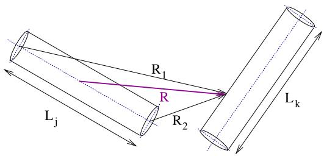  
Fig. 1. Finite length lossless electrodes in a uniform medium.

accuracy. Time responses of the GPR of the counterpoise configuration considering double-peek and fast-front currents are depicted in Section 4. The main conclusions are presented in Section 5.

# 2. Frequency domain modeling

Consider, initially, two arbitrarily oriented lossless electrodes ?? and ?? with radius $a _ { i } , ~ a _ { k } ,$ , and length $L _ { i } , \ L _ { k } ,$ respectively, and immerse in a lossy medium, with a propagation constant $\gamma = \sqrt { j \omega \mu \left( \sigma + j \omega \varepsilon \right) } .$ It is assumed that $L _ { i } ~ > ~ a$ and $L _ { k } \ > \ a$ and both are electrically short, i.e., $\left| \gamma L _ { i } \right| \ll 1$ and $\left| \gamma L _ { k } \right| \ll 1 . \mathrm { ~ A ~ }$ current ?? is injected in electrode ??, as both $L _ { k }$ and $L _ { i }$ are electrically short, it can then be divided into a transverse current $\mathbf { I } _ { T }$ distributed along the electrode, which is injected in the surrounding medium, and a longitudinal $\mathbf { I } _ { L }$ along the electrode. The electrical field at an arbitrary point at the surface of electrode ?? is approximately given by (1) and the electric scalar potential then can approximately be written as (2)

$$
\mathbf {E} \approx \frac {j \omega \mu}{4 \pi} \mathbf {I} _ {L} \exp (- \gamma R) \int_ {L _ {k}} \frac {1}{r} \cos \phi d \xi \tag {1}
$$

$$
\mathbf {V} \approx \frac {\mathbf {I} _ {T}}{4 \pi (\sigma + j \omega \varepsilon)} \frac {\exp (- \gamma R)}{L _ {k}} \int_ {L _ {k}} \frac {1}{r} d \xi \tag {2}
$$

where ?? is the distance between an arbitrary infinitesimal element at the center of electrode ?? to an arbitrary point at the surface of electrode $k ,$ ?? is the angle between the vectors associated with $L _ { i }$ and $L _ { k } ,$ , and ?? is the distance between the middle point at the center of conductor ?? to a point at the surface of conductor ??.

These approximations allow the following expressions (3) for the transverse and longitudinal mutual impedances

$$
Z _ {T _ {i k}} = \frac {\exp (- \gamma R)}{4 \pi (\sigma + j \omega \varepsilon) L _ {i} L _ {k}} \bar {P} _ {i k} \tag {3}
$$

$$
Z _ {L _ {i k}} = \frac {j \omega \mu \cos \phi \exp (- \gamma R)}{4 \pi} \bar {P} _ {i k}
$$

where $\overline { { P } } _ { i k }$ is now given by (4). The distances $R _ { 1 } , R _ { 2 }$ , ?? and the finite length conductors are depicted in Fig. 1.

$$
\bar {P} _ {i k} = \int_ {L _ {k}} \ln \frac {R _ {1} + R _ {2} + L _ {i}}{R _ {1} + R _ {2} - L _ {i}} d \xi \tag {4}
$$

A key aspect is the segmentation of the electrodes. A maximum length of ??/10 was adopted, where ?? is the wavelength of the highest frequency of interest for waves propagating in soil. In this research, the maximum frequency of interest is 10 MHz.

To determine the self-elements in these matrices, it is necessary to evaluate both ?? and ?? at the electrode surface. Conductor losses can easily be included using the well-known expression with Bessel functions. These expressions are well known and can be found in [10, 13].

As elements $\overline { { P } } _ { i k }$ and ?? are frequency independent, they are calculated only once, considerably reducing the computational burden. To further increase numerical performance, geometrical symmetry is used to reduce the number of necessary evaluations as proposed in [40].

As the distance from the electrodes is sufficiently larger than the electrode radius, a simple charge/current image was considered to

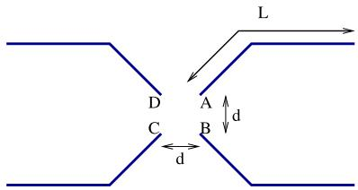  
Fig. 2. Counterpoise configuration.

avoid a more rigorous solution to represent the air–soil interface via a series expansion of plane waves and then obtain a coherent set of reflection and refraction coefficients [41, sec. 7.6]. Furthermore, in [42], it was shown that image methods can provide suitable response for buried conductors if frequencies below 10 MHz are to be considered.

If one considers $\mathbf { Z } _ { T }$ to be the transverse impedance considering all the segmented conductors and their associated images and $\mathbf { Z } _ { L }$ to be the one related to the longitudinal impedances, the expression (5) can be written

$$
\mathbf {Y} _ {n} = \left(\mathbf {m} _ {A} ^ {T} \cdot \mathbf {Z} _ {T} ^ {- 1} \cdot \mathbf {m} _ {A} + \mathbf {m} _ {B} ^ {T} \cdot \mathbf {Z} _ {L} ^ {- 1} \cdot \mathbf {m} _ {B}\right) \tag {5}
$$

where $\mathbf { Y } _ { n }$ is an equivalent nodal admittance matrix for a system of electrodes. The matrices $\mathbf { m } _ { A }$ and $\mathbf { m } _ { B }$ are the incidence matrices obtained through an oriented graph that relates the adjacent nodes and segments.

# 3. Rational approximation

# 3.1. Tower-footing grounding system as harmonic admittance

In time-domain simulations, the harmonic admittance $Y _ { g }$ is considered instead of the harmonic impedance $( Z _ { g } = Y _ { g } ^ { - 1 } )$ since a nodal or modified nodal formulation is used. Thus, for the sake of argument, consider a simple counterpoise configuration as depicted in Fig. 2.

To obtain the harmonic impedance $Z _ { g } ,$ , one must first solve (6) and (7), where ?? is the voltage vector for each node to be calculated and $\mathbf { I _ { n } }$ is a vector of injected current.

$$
\mathbf {Y} _ {n} \cdot \mathbf {V} = \mathbf {I} _ {n} \tag {6}
$$

$$
\mathbf {I} _ {n} = \left[ 1 / 4, 0 \dots , 1 / 4, 0, \dots , 1 / 4, 0, \dots , 1 / 4, 0, \dots \right] ^ {T} \tag {7}
$$

The values $I _ { n } ( i ) \neq 0$ corresponds to the injected current at nodes ?? through $D ,$ as shown in Fig. 2.

The ground potential rise (GPR) will be the voltage at node ?? $( V _ { A } ) .$ . Naturally, in this configuration, $V _ { A } = V _ { B } = V _ { C } = V _ { D }$ . Thus, $Z _ { g }$ can be obtained as (8)

$$
Z _ {\mathrm {g}} = \frac {V _ {A} (\omega)}{1 \mathrm {A}} \tag {8}
$$

and then the rational approximation is carried out for harmonic admittance by (9), which is rather straightforward, i.e.,

$$
Y _ {g} (s) \approx Y _ {f i t} (s) = R _ {0} + \sum_ {k = 1} ^ {N} \frac {R _ {k}}{s - p _ {k}} \tag {9}
$$

where ?? is the order of the approximation, $\boldsymbol { R } _ { k } ,$ and $p _ { k }$ are real or come in pairs of complex conjugates. As mentioned above, the pole relocation algorithm known as vector fitting (VF) is used [21,22,43].

As the order ?? needs to be predefined, one of the goals of this work is to investigate a minimal order realization for a grounding system with suitable accuracy. Initial tests with orders as high as 40 poles indicated that several poles had very small residues, thus contributing little to the frequency response.

In this work, a simple approach was considered to determine the approximation order. An initial estimate of 2 poles and a maximum of

Table 1 Fitting results considering low resistivity and high resistivity soil with distinct electrode lengths.   

<table><tr><td>Length (m)</td><td>ρ (Ω m)</td><td>Order</td><td>erms × 10-5</td></tr><tr><td>30</td><td>100</td><td>11</td><td>3.6925</td></tr><tr><td>60</td><td>100</td><td>11</td><td>6.4058</td></tr><tr><td>90</td><td>1000</td><td>11</td><td>2.7303</td></tr><tr><td>120</td><td>1000</td><td>11</td><td>2.2772</td></tr></table>

20 poles was considered. This order was chosen based on previous experience with the rational approximation model of frequency-dependent soil parameters [44] indicating that a fitting order near 20 poles should suffice. The heuristic adopted here is based on multiple VF runs, varying the rational approximation order. This order is increased until the rms-error $\left( \mathrm { e } _ { r m s } \right)$ obtained through the fitting process reaches a previously defined tolerance, i.e.,

$$
\mathrm {e} _ {r m s} = \sqrt {\frac {\sum_ {m = 1} ^ {N _ {s}} \left| Y _ {g} \left(s _ {m}\right) - Y _ {f i t} \left(s _ {m}\right) \right| ^ {2}}{N _ {s}}} \leq \frac {\min (\left| Y _ {g} (s) \right|)}{1 0 0 0} \tag {10}
$$

where $N _ { s }$ is the number of frequency samples used. A frequency range from 100 Hz to 10 MHz with 250 logarithmically spaced samples were considered. The stop criterion adopted was similar to the one found in the wide-band modeling of overhead transmission lines and underground cables in EMT programs.

Lastly, a final refinement is carried out based on the idea of the dominant pole [45–47]. Thus,

$$
\arctan \left(\frac {r _ {r} ^ {i}}{p _ {r} ^ {i}}\right) \geq \xi \tag {11}
$$

where $p _ { r } ^ { i }$ is the real part of the ??th pole, $r _ { r } ^ { i }$ is the real part of the ??th residue, and $\xi$ is a pre-defined tolerance. Increasing the value of $\xi$ would lead to lower order model. The set of poles/residues that do not meet this criterion are disregarded. Then, the rational model is refitted using this new reduced set. It was found that with this arrangement a reduction of almost half the number of poles was obtained. Future work will compare this approach with other techniques to obtain a minimal order model.

Table 1 presents the results for the rational approximation for lowresistivity soils with shorter electrodes and high-resistivity soils with longer electrodes. For the scenarios, relatively low-order realizations were obtained. In all cases, a final model with 11 poles was utilized, and an accurate approximation was obtained with deviations at least three orders of magnitude below the original data.

Fig. 3 shows the results of the fitting using mHEM, to represent $Y _ { g } ( s )$ for the counterpoise in Fig. 2 with $L = 9 0$ m and for a soil resistivity of 1000 Ω m and $\varepsilon _ { r } = 1 0 .$ .

The above results may lead one to believe that an order as high as 11 should suffice. However, this is not necessarily true for every grounding system configuration. A considerably higher-order realization is found if the effective length $\ell _ { e f f }$ is disregarded [17,18,48], i.e., shorter counterpoise in high resistivity soil. The reason for that is twofold. First, the harmonic admittance ?? (??) presents a higher oscillatory behavior at higher frequencies for higher resistivity soils, see for instance [49–52]. Second, if the counterpoise length is shorter than $\ell ,$ higher oscillations are expected as the current along the counterpoise is forced to be null drastically at the end of the counterpoise. This rapid decrease in the current will cause the oscillation at the tail of the harmonic admittance. To illustrate this, consider the results for a 60 m counterpoise in a 1000 Ω m soil as shown in Fig. 4. This fitting required an order of 28 poles to reach $e _ { r m s } = 1 . 1 0 1 8 \times 1 0 ^ { - 5 }$ .

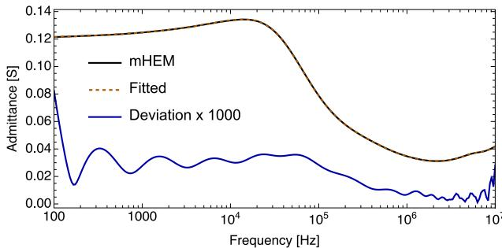  
(a) Admittance magnitude

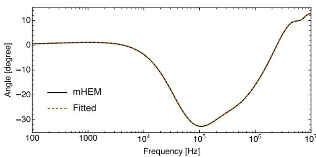  
(b) Admittance phase angle

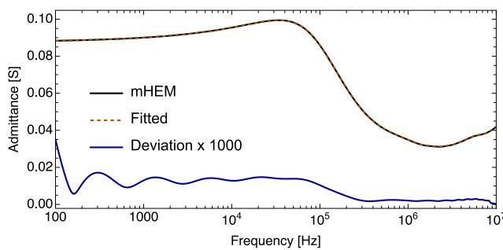  
Fig. 3. Fitting results considering ?? = 90 m and $\rho = 1 0 0 0 \Omega$ m.   
(a) Admittance magnitude

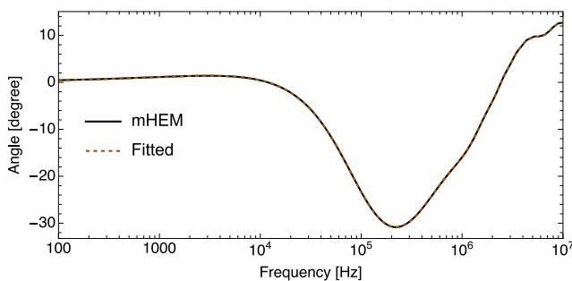  
(b)Admittance phase angle   
Fig. 4. Fitting results considering ?? = 60 m and $\rho = 1 0 0 0 \Omega \mathrm { m }$

# 3.2. Tower-footing grounding system as FDNE

For an FDNE, the procedure is slightly different. Again, consider a simple counterpoise configuration as previously evaluated. After calculating $\mathbf { Y } _ { n }$ and obtaining ${ \bf Z } _ { n } ~ ( { \bf Z } _ { n } = { \bf Y } _ { n } ^ { - 1 } ) $ , one extracts the following reduced impedance matrix, which is shown in (12) and can be understood as the driving point impedance of each leg of the counterpoise.

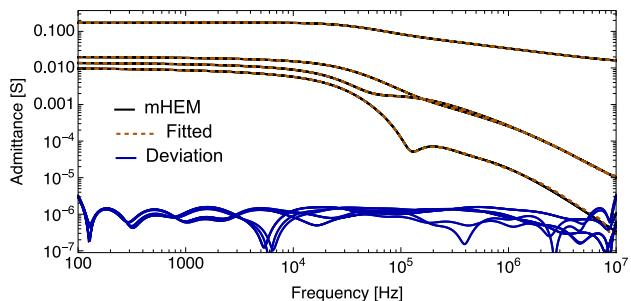  
(a)Admittance Magnitude for L = 30 m and p= 100 Ω.m

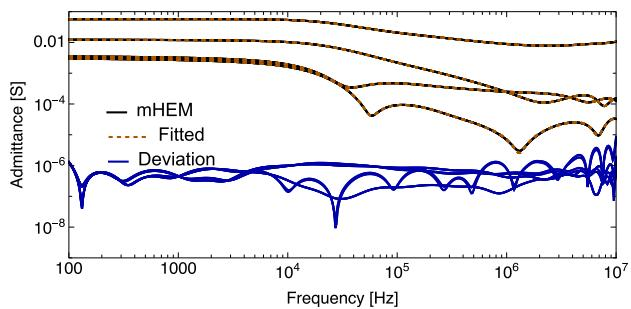  
(c) Admittance Magnitude for L = 12O m and $\rho = 1 0 0 0 \Omega . \mathrm { m }$

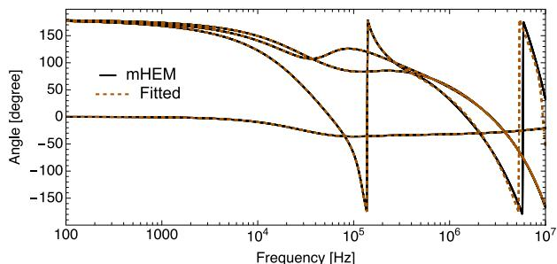  
(b) Admittance phase angles for L = 30 m and $\rho = 1 0 0 \Omega . \mathrm { m }$

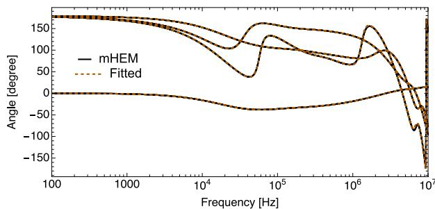  
(d) Admittance phase angle for $L = 1 2 0$ m and $\rho = 1 0 0 0 \Omega . \mathrm { m }$   
Fig. 5. Fitting results considering distinct counterpoise lengths and soil resistivities.

$$
\mathbf {Z} _ {r e d} = \left[ \begin{array}{l l l l} Z _ {A A} & Z _ {A B} & Z _ {A C} & Z _ {A D} \\ Z _ {A B} & Z _ {B B} & Z _ {B C} & Z _ {B D} \\ Z _ {A C} & Z _ {B C} & Z _ {C C} & Z _ {C D} \\ Z _ {A D} & Z _ {B D} & Z _ {C D} & Z _ {D D} \end{array} \right] \tag {12}
$$

The next step is to obtain the reduced admittance matrix ${ { \mathbf { Y } } _ { r e d } } \ ( { { \mathbf { Y } } _ { r e d } } =$ ${ \mathbf { Z } } _ { r e d } ^ { - 1 } ) ,$ , which will be used as FDNE, through a rational approximation, such as in (13),

$$
\mathbf {Y} _ {r e d} \approx \mathbf {Y} _ {f i t} = \mathbf {G} _ {0} + \sum_ {n = 1} ^ {N} \frac {\mathbf {R} _ {n}}{s + p _ {n}} \tag {13}
$$

where $\mathbf { G } _ { 0 }$ is a conductance matrix related to the low-frequency resistance matrix $( { \bf R } _ { L F }$ and ${ \bf G } _ { 0 } = { \bf R } _ { L F } ^ { - 1 } )$ , ???? are the residues matrices and $p _ { n }$ the poles.

To ensure simulations with stable time-domain responses, it is necessary to assess whether there are passivity violations and enforce the passivity. The former can be evaluated using a Hamiltonian matrix, obtained from the rational approximation, and the latter is achieved through perturbation of the residues matrices as proposed in [30].

The procedure to determine the maximum order was similar to the one used for the scalar model. Only the eigenvalues of $\mathbf { Y } _ { n } ( s )$ are used to verify the model accuracy, such as in (14),

$$
\mathrm {e} _ {r m s} \leq \frac {\min \left(\left| \lambda_ {\operatorname* {m i n}} (s) \right|\right)}{1 0 0 0} \tag {14}
$$

where $\lambda _ { m i n } ( s )$ is the eigenvalue with the smallest amplitude of the admittance matrix $\mathbf { Y } _ { n } ( s )$ .

Table 2 presents the results for several scenarios considering shorter electrodes in low-resistivity soil and longer electrodes in high-resistivity soils.

The rational model’s fitting order increases when compared with the scalar model. For shorter electrodes, the order increases by around 50%, while longer electrodes presented an increase of over 80%. This is because the mutual elements are not monotonic, presenting some oscillations for frequencies above 10 kHz. The FDNE approach seems more robust since the order is less affected by $\ell _ { e f f } ,$ , as it happens in the scalar case (treating the tower-footing grounding system as a harmonic admittance). Fig. 5 depicts the fitting results for the self and mutual

Table 2 Fitting results considering low resistivity and high resistivity soil with distinct electrode lengths for counterpoise treated as FDNE.   

<table><tr><td>Length (m)</td><td>ρ (Ω m)</td><td>Order</td><td>erms × 10-6</td></tr><tr><td>30</td><td>100</td><td>16</td><td>1.0197</td></tr><tr><td>60</td><td>100</td><td>17</td><td>1.3129</td></tr><tr><td>90</td><td>1000</td><td>22</td><td>0.6179</td></tr><tr><td>120</td><td>1000</td><td>20</td><td>0.7739</td></tr></table>

admittances considering the shortest and longest electrodes in Table 2. The self elements presented higher magnitude throughout the whole frequency range. It can be noticed that even for $L = 3 0$ and $\rho = 1 0 0 \Omega$ m that some amplitudes oscillations can be found for frequencies around 100 kHz.

This behavior is even more noticeable for the longest counterpoises, where these oscillations appear for frequencies above 50 kHz. The Hamiltonian matrix test indicated no passivity violations, as it can be observed in Fig. 6, which depicts the behavior of the real part of the eigenvalues (??) of the admittance matrix $( \mathbf { Y } _ { f i t } ) _ { : }$ , i.e., ?? = eig $\left( \mathbf { Y } _ { f i t } \right)$ .

# 3.3. Realization using a unique order

From an implementation point of view, it would be interesting to have a unique order regardless of the tower footing grounding system considered and its realization. Thus, it is investigated whether the highest order, $N = 2 2 ,$ , found in FDNE rational approximation, would also provide suitable responses in the other scenarios considered in this work.

The results of the analysis above are presented in Table $^ { 3 , }$ where it can be observed that, For short counterpoise in low resistivity soils, the scalar approach (fitting the harmonic admittance) seems to provide an improved response compared to the FDNE approach. The FDNE formulation provided slightly more accurate responses for longer counterpoises in high-resistivity soils and presented no numerical issues as passivity violations.

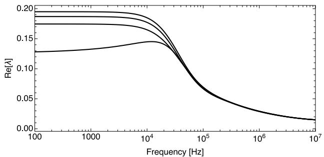  
(a)L= 30 m and $\rho = 1 0 0 \Omega . \mathrm { m }$

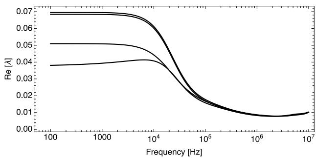  
${ \bf ( b ) } ~ L = 1 2 0 \mathrm { ~ m ~ a n d ~ } \rho = 1 0 0 0 \Omega . \mathrm { m }$   
Fig. 6. Real part of the eigenvalues of fitted FDNE.

Table 3 Fitting results considering 22 poles for all topologies.   

<table><tr><td>Length (m)</td><td>ρ (Ω m)</td><td>erms × 10-6</td><td>Topology</td></tr><tr><td>30</td><td>100</td><td>0.0543</td><td>FDNE</td></tr><tr><td>30</td><td>100</td><td>0.0281</td><td>Scalar</td></tr><tr><td>60</td><td>100</td><td>0.0901</td><td>FDNE</td></tr><tr><td>60</td><td>100</td><td>0.0281</td><td>Scalar</td></tr><tr><td>90</td><td>100</td><td>0.1292</td><td>FDNE</td></tr><tr><td>90</td><td>100</td><td>0.0615</td><td>Scalar</td></tr><tr><td>120</td><td>100</td><td>0.2135</td><td>FDNE</td></tr><tr><td>120</td><td>100</td><td>0.04471</td><td>Scalar</td></tr><tr><td>30</td><td>1000</td><td>1.4360</td><td>FDNE</td></tr><tr><td>30</td><td>1000</td><td>1.0482</td><td>Scalar</td></tr><tr><td>60</td><td>1000</td><td>5.2965</td><td>FDNE</td></tr><tr><td>60</td><td>1000</td><td>3.4647</td><td>Scalar</td></tr><tr><td>90</td><td>1000</td><td>0.6179</td><td>FDNE</td></tr><tr><td>90</td><td>1000</td><td>2.3829</td><td>Scalar</td></tr><tr><td>120</td><td>1000</td><td>0.347</td><td>FDNE</td></tr><tr><td>120</td><td>1000</td><td>1.2551</td><td>Scalar</td></tr></table>

# 4. Time responses

For the evaluation of the time responses, two ‘‘types’’ of the injected currents are considered, both are based on return current strokes measured at Mount San Salvatore. One of these currents has a double peak and is related to the first negative stroke, while the second has a fast front commonly associated with subsequent strokes. Fig. 7 represents these two injected current waveforms.

For the analytical representation of this current, it is considered a series of Heidler functions, such as (15) proposed in [53],

$$
i (t) = \sum_ {k = 1} ^ {K} \frac {I _ {0 _ {k}}}{\eta_ {k}} \left[ \frac {\left(t / \tau_ {1 k}\right) ^ {n _ {k}}}{1 + \left(t / \tau_ {1 k}\right) ^ {n k}} \right] \exp \left(- \frac {t}{\tau_ {2 k}}\right) \tag {15}
$$

$$
\eta_ {k} = \exp \left(- \frac {\tau_ {1 k}}{\tau_ {2 k}} \cdot \left(\frac {n _ {k} t _ {2 k}}{\tau_ {1 k}}\right) ^ {1 / n _ {k}}\right)
$$

where $K , \ I _ { 0 _ { k } } , \ \tau _ { 1 k } , \ \tau _ { 2 k } , \ n _ { k }$ and $\eta _ { k }$ are adjustable parameters of the injected current waveforms.

For the frequency domain analysis using the NLT, 1024 samples, with a maximum observation time of 40 μs, is considered, leading to a

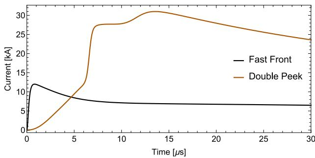  
Fig. 7. Waveform of injected current considered for the transient analysis of a tower-footing grounding system.

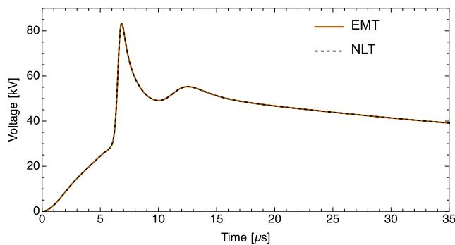  
$( \mathrm { a } ) ~ L = 3 0 \mathrm { ~ m ~ a n d ~ } \rho = 1 0 0 \Omega . \mathrm { m }$

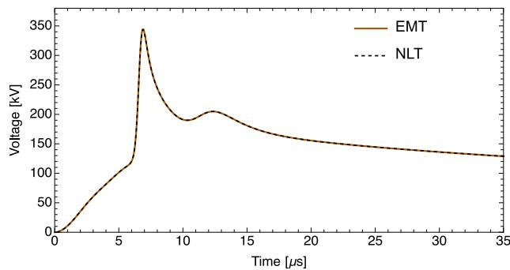  
${ \bf ( b ) } ~ L = 1 2 0 \mathrm { ~ m ~ a n d ~ } \rho = 1 0 0 0 \Omega . \mathrm { m }$   
Fig. 8. Ground potential rise considering the double peek current.

time-step of 39.062 ns. A stand-alone program written in the Wolfram Language in an environment similar to the matEMTP [54] is used for the time-domain analysis. In this case, a time-step of 5 ns with a maximum time of 40 μs is considered. This leads to 8000 samples for the time-domain simulation. The time-step in the EMT-type of the simulation was chosen to lead a Nyquist frequency of 10 MHz which was the largest frequency of interest in the rational approximation.

The counterpoise considered is the one found in Fig. 2 with $L =$ 30 m and $\rho ~ = ~ 1 0 0 ~ \Omega$ m and with $L \ = \ 1 2 0$ m and $\rho ~ = ~ 1 0 0 0 ~ \Omega$ m. The results are presented in Fig. 8 for the double peak current and in Fig. 9 for the fast current wave. The GPR calculated through both methodologies is shown to be almost coincident, regardless of the current excitation. The results obtained using the scalar formulation were identical to those of the FDNE.

A computation burden assessment was made, where it was considered the time to evaluate the 250 samples, obtain the reduced matrix in the FDNE case or the harmonic admittance, the rational approximation evaluation, the passivity verification for the FDNE case and the time spent in the time-step loop to obtain the time responses.

The total computation time was around 25% faster for harmonic admittance and around 45% for FDNE, when comparing these approaches

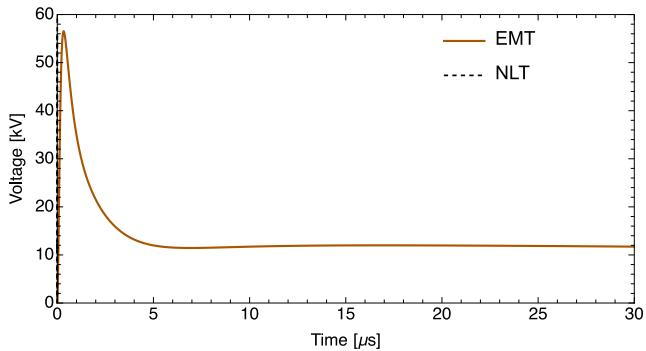  
(a) L = 30 m and ρ= 100 Ω.m

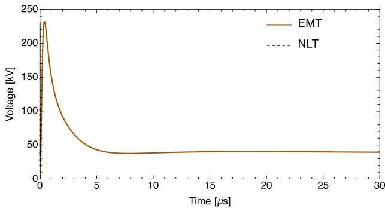  
(b) L = 120 m and ρ= 1000 Ω.m   
Fig. 9. Ground potential rise for fast front current.

with the NLT. All these timings were obtained considering an i9 Intel personal computer with 16 GB of RAM.

# 5. Conclusions

This work compares two approaches for a rational approximation of a tower footing grounding system aiming for a time-domain analysis using an EMT program. It shows that, despite the more straightforward approach, the scalar model representation of the tower footing ground system can only be used with a lower order if the effective length is respected. Suppose a more detailed representation is considered, such as treating the tower footing grounding system as an FDNE based on the driving point impedance of each counterpoise leg. In that case, a higher order is needed for the realization. However, lower-order variations were found. The last approach seems more robust for this kind of analysis. With a rational realization with 22 poles, the harmonic admittance and FDNE can be fitted with acceptable accuracy, regardless of the counterpoise length and soil resistivity.

Future work will deal with the analysis of other criteria for the pole reduction as well as the assessment of the transient propagation of the electromagnetic field on the ground due to lightning-related currents, as it will demand only an increase in the order utilized in the FDNE approach, considering key points along the counterpoise. Probably, it should consider an adaptive segmentation scheme, where a coarse segmentation could be used for conductors away from the region of interest and a fine segmentation could be used for the ones close to the region of interest.

# CRediT authorship contribution statement

Antonio C.S. Lima: Validation, Formal analysis, Project administration, Conceptualization, Writing – original draft, Software, Funding acquisition, Data curation, Writing – review & editing, Visualization. Thiago J.M.A. Parreiras: Writing – review & editing, Methodology, Formal analysis, Investigation, Conceptualization, Writing – original

draft. Rafael Alípio: Writing – original draft, Writing – review & editing, Supervision, Formal analysis. Maria Teresa Correia de Barros: Formal analysis, Supervision, Writing – review & editing, Investigation, Conceptualization.

# Declaration of competing interest

The authors declare the following financial interests/personal relationships which may be considered as potential competing interests: Antonio C S Lima reports financial support was provided in part by the Coordenação de Aperfeiçoamento de Pessoal de Nível Superior - Brasil (CAPES), Finance Code 001. It also was partially supported by INERGE (Instituto Nacional de Energia Elétrica), CNPq (Conselho Nacional de esenvolvimento Científico e Tecnológico), and FAPERJ (Fundação Carlos Chagas Filho de Amparo á Pesquisa do Estado do Rio de Janeiro).

# Data availability

Data will be made available on request.

# References

[1] R.F. Harrington, in: D.G. Dudley (Ed.), Field Computation by Moment Method, IEEE PRESS Series on Electromagnetic Waves, University of Arizona, 1993.   
[2] R.F. Harrington, Time-Harmonic Electromagnetic Fields, in: The IEEE Press Series on Electromagnetic Wave Theory, IEEE Press, Piscatawat, NJ, 2001, Reissue of 1961 edition.   
[3] L. Grcev, F. Dawalibi, An electromagnetic model for transients in grounding systems, IEEE Trans. Power Deliv. 5 (4) (1990) 1773–1781, http://dx.doi.org/ 10.1109/61.103673.   
[4] L.D. Grcev, Computer analysis of transient voltages in large grounding systems, IEEE Trans. Power Deliv. 11 (2) (1996) 815–823.   
[5] L.D. Grcev, M. Heimbach, Frequency dependent and transient characteristics of substation grounding systems, IEEE Trans. Power Deliv. 12 (1) (1997) 172–178, http://dx.doi.org/10.1109/61.568238.   
[6] M. Heimbach, L. Grcev, Grounding system analysis in transients programs applying electromagnetic field approach, IEEE Trans. Power Deliv. 12 (1) (1997) 186–193, http://dx.doi.org/10.1109/61.568240.   
[7] A. Ruehli, Partial element equivalent circuit (PEEC) method and its application in the frequency and time domain, in: Electromagnetic Compatibility, 1996. Symposium Record. IEEE 1996 International Symposium on, IEEE, 1996, pp. 128–133.   
[8] P. Yutthagowith, A. Ametani, N. Nagaoka, Y. Baba, Application of the partial element equivalent circuit method to analysis of transient potential rises in grounding systems, IEEE Trans. Electromagn. Compat. 53 (3) (2011) 726–736.   
[9] S. Visacro, A. Soares, HEM: A model for simulation of lightning-related engineering problems, IEEE Trans. Power Deliv. 20 (2) (2005) 1206–1208.   
[10] A.C.S. Lima, R.A.R. Moura, P.H.N. Vieira, M.A.O. Schroeder, M.T. Correia de Barros, A computational improvement in grounding systems transient analysis, IEEE Trans. Electromagn. Compat. 62 (3) (2020) 765–773, http://dx.doi.org/10. 1109/TEMC.2019.2918621.   
[11] Y. Baba, N. Nagaoka, A. Ametani, Modeling of thin wires in a lossy medium for FDTD simulations, IEEE Trans. Electromagn. Compat. 47 (1) (2005) 54–60.   
[12] M. Tsumura, Y. Baba, N. Nagaoka, A. Ametani, FDTD simulation of a horizontal grounding electrode and modeling of its equivalent circuit, IEEE Trans. Electromagn. Compat. 48 (4) (2006) 817–825.   
[13] E.D. Sunde, Earth Conduction Effects in Transmission Systems, Dover Publications Inc., 1949.   
[14] F. Menter, L. Grcev, EMTP-based model for grounding system analysis, IEEE Trans. Power Deliv. 9 (4) (1994) 1838–1849, http://dx.doi.org/10.1109/61. 329517.   
[15] Y. Liu, M. Zitnik, R. Thottappillil, An improved transmission-line model of grounding system, IEEE Trans. Electromagn. Compat. 43 (3) (2001) 348–355, http://dx.doi.org/10.1109/15.942606.   
[16] Y. Liu, N. Theethayi, R. Thottappillil, An engineering model for transient analysis of grounding system under lightning strikes: nonuniform transmissionline approach, IEEE Trans. Power Deliv. 20 (2) (2005) 722–730, http://dx.doi. org/10.1109/TPWRD.2004.843437.   
[17] L. Grcev, Impulse efficiency of ground electrodes, IEEE Trans. Power Deliv. 24 (1) (2009) 441–451, http://dx.doi.org/10.1109/TPWRD.2008.923396.   
[18] L. Grcev, Modeling of grounding electrodes under lightning currents, IEEE Trans. Electromagn. Compat. 51 (3) (2009) 559–571, http://dx.doi.org/10.1109/TEMC. 2009.2025771.

[19] L.D. Grcev, A. Kuhar, V. Arnautovski-Toseva, B. Markovski, Evaluation of high-frequency circuit models for horizontal and vertical grounding electrodes, IEEE Trans. Power Deliv. 33 (6) (2018) 3065–3074, http://dx.doi.org/10.1109/ TPWRD.2018.2840960.   
[20] L. Grcev, B. Markovski, M. Todorovski, General formulas for lightning impulse impedance of horizontal and vertical grounding electrodes, IEEE Trans. Power Deliv. 36 (4) (2021) 2245–2248, http://dx.doi.org/10.1109/TPWRD.2021. 3080137.   
[21] B. Gustavsen, A. Semlyen, Rational approximation of frequency domain responses by vector fitting, IEEE Trans. Power Deliv. 14 (3) (1999) 1052–1061, http: //dx.doi.org/10.1109/61.772353.   
[22] B. Gustavsen, Improving the pole relocating properties of vector fitting, IEEE Trans. Power Deliv. 21 (3) (2006) 1587–1592, http://dx.doi.org/10.1109/ TPWRD.2005.860281.   
[23] D. Deschrijver, M. Mrozowski, T. Dhaene, D. De Zutter, Macromodeling of multiport systems using a fast implementation of the vector fitting method, IEEE Microw. Wirel. Compon. Lett. 18 (6) (2008) 383–385, http://dx.doi.org/ 10.1109/LMWC.2008.922585.   
[24] T.K. Sarkar, O. Pereira, Using the matrix pencil method to estimate the parameters of a sum of complex exponentials, IEEE Antennas Propag. Mag. 37 (1) (1995) 48–55.   
[25] K. Sheshyekani, H.R. Karami, P. Dehkhoda, M. Paolone, F. Rachidi, Application of the matrix pencil method to rational fitting of frequency-domain responses, IEEE Trans. Power Deliv. 27 (4) (2012) 2399–2408.   
[26] K. Sheshyekani, M. Akbari, B. Tabei, R. Kazemi, Wideband modeling of large grounding systems to interface with electromagnetic transient solvers, IEEE Trans. Power Deliv. 29 (4) (2014) 1868–1876, http://dx.doi.org/10.1109/ TPWRD.2014.2310631.   
[27] J. Morales Rodriguez, E. Medina, J. Mahseredjian, A. Ramirez, K. Sheshyekani, I. Kocar, Frequency-domain fitting techniques: A review, IEEE Trans. Power Deliv. 35 (3) (2020) 1102–1110, http://dx.doi.org/10.1109/TPWRD.2019.2932395.   
[28] M.R. Alemi, K. Sheshyekani, Wide-band modeling of tower-footing grounding systems for the evaluation of lightning performance of transmission lines, IEEE Trans. Electromagn. Compat. 57 (6) (2015) 1627–1636, http://dx.doi.org/10. 1109/TEMC.2015.2453512.   
[29] R. Shariatinasab, J. Gholinezhad, K. Sheshyekani, M.R. Alemi, The effect of wide band modeling of tower-footing grounding system on the lightning performance of transmission lines: A probabilistic evaluation, Electr. Power Syst. Res. 141 (2016) 1–10, http://dx.doi.org/10.1016/j.epsr.2016.06.040, [Online]. Available: https://www.sciencedirect.com/science/article/pii/S0378779616302486.   
[30] B. Gustavsen, Fast passivity enforcement for pole-residue models by perturbation of residue matrix eigenvalues, IEEE Trans. Power Deliv. 23 (4) (2008) 2278–2285, http://dx.doi.org/10.1109/TPWRD.2008.919027.   
[31] A. Semlyen, B. Gustavsen, A half-size singularity test matrix for fast and reliable passivity assessment of rational models, IEEE Trans. Power Deliv. 24 (1) (2009) 345–351.   
[32] J. Morales, J. Mahseredjian, K. Sheshyekani, A. Ramirez, E. Medina, I. Kocar, Pole-selective residue perturbation technique for passivity enforcement of FDNEs, IEEE Trans. Power Deliv. 33 (6) (2018) 2746–2754, http://dx.doi.org/10.1109/ TPWRD.2018.2810706.   
[33] E. Medina, A. Ramirez, J. Morales, J. Mahseredjian, Alternative approach to alleviate passivity violations of rational-based fitted functions, IEEE Trans. Power Deliv. 34 (3) (2019) 1161–1170, http://dx.doi.org/10.1109/TPWRD.2019. 2896982.   
[34] J. Becerra, I. Kocar, K. Sheshyekani, J. Mahseredjian, Passivity enforcement of wideband line model through coupled perturbation of residues and poles, Electr. Power Syst. Res. 190 (2021) 106798, http://dx.doi.org/10.1016/j.epsr.2020. 106798, [Online]. Available: https://www.sciencedirect.com/science/article/pii/ S0378779620306015.   
[35] P. Benner, W. Schilders, S. Grivet-Talocia, A. Quarteroni, G. Rozza, L. Miguel Silveira (Eds.), Model Order Reduction: Volume 3 Applications, De Gruyter, 2020.   
[36] P. Benner, W. Schilders, S. Grivet-Talocia, A. Quarteroni, G. Rozza, L. Miguel Silveira, Model Order Reduction: Volume 2: Snapshot-Based Methods and Algorithms, De Gruyter, 2020.

[37] P. Benner, S. Grivet-Talocia, A. Quarteroni, G. Rozza, W. Schilders, L.M. Silveira (Eds.), Model Order Reduction: Volume 1 System- and Data-Driven Methods and Algorithms, De Gruyter, 2021, http://dx.doi.org/10.1515/9783110498967.   
[38] M. Safonov, R. Chiang, A Schur method for balanced-truncation model reduction, IEEE Trans. Autom. Control 34 (7) (1989) 729–733, http://dx.doi.org/10.1109/ 9.29399.   
[39] G. Wang, V. Sreeram, W. Liu, A new frequency-weighted balanced truncation method and an error bound, IEEE Trans. Autom. Control 44 (9) (1999) 1734–1737, http://dx.doi.org/10.1109/9.788542.   
[40] P.H. Vieira, R.A. Moura, M.A.O. Schroeder, A.C. Lima, Symmetry exploitation to reduce impedance evaluations in grounding grids, Int. J. Electr. Power Energy Syst. 123 (2020) 106268, http://dx.doi.org/10.1016/j.ijepes.2020. 106268, [Online]. Available: https://www.sciencedirect.com/science/article/pii/ S0142061519342188.   
[41] J.A. Stratton, Electromagnetic Theory, McGraw-Hill Co., 1941.   
[42] V. Arnautovski-Toseva, L. Grcev, On the image model of a buried horizontal wire, IEEE Trans. Electromagn. Compat. 58 (1) (2016) 278–286, http://dx.doi. org/10.1109/TEMC.2015.2506608.   
[43] D. Deschrijver, B. Gustavsen, T. Dhaene, Advancements in iterative methods for rational approximation in the frequency domain, IEEE Trans. Power Deliv. 22 (3) (2007) 1633–1642, http://dx.doi.org/10.1109/TPWRD.2007.899584.   
[44] J.P.L. Salvador, R. Alipio, A.C.S. Lima, M.T. Correia de Barros, A concise approach of soil models for time-domain analysis, IEEE Trans. Electromagn. Compat. 62 (5) (2020) 1772–1779, http://dx.doi.org/10.1109/TEMC.2019. 2927273.   
[45] S. Gomes, N. Martins, C. Portela, Computing small-signal stability boundaries for large-scale power systems, IEEE Trans. Power Syst. 18 (2) (2003) 747–752, http://dx.doi.org/10.1109/TPWRS.2003.811205.   
[46] N. Martins, C. Portela, S. Gomes, Sequential computation of transfer function dominant poles of s-domain system models, IEEE Trans. Power Syst. 24 (2) (2009) 776–784.   
[47] S. Gomes Jr., C. Guimarães, N. Martins, G. Taranto, Damped nyquist plot for a pole placement design of power system stabilizers, Electr. Power Syst. Res. 158 (2018) 158–169.   
[48] J. He, Y. Gao, R. Zeng, J. Zou, X. Liang, B. Zhang, J. Lee, S. Chang, Effective length of counterpoise wire under lightning current, IEEE Trans. Power Deliv. 20 (2) (2005) 1585–1591, http://dx.doi.org/10.1109/TPWRD.2004.838457.   
[49] W.L.M. de Azevedo, A.R.J. de Araújo, J.S.L. Colqui, J.L.A. D’Annibale, J.P. Filho, Alternative study to reduce backflashovers using tower-footing grounding systems with multiple inclined rods, Electr. Power Syst. Res. 214 (2023) 108893, http: //dx.doi.org/10.1016/j.epsr.2022.108893, [Online]. Available: https://www. sciencedirect.com/science/article/pii/S0378779622009440.   
[50] M. Ghomi, F. Faria da Silva, A.A. Shayegani Akmal, C. Leth Bak, Transient overvoltage analysis in the medium voltage substations based on full-wave modeling of two-layer grounding system, Electr. Power Syst. Res. 211 (2022) 108139, http: //dx.doi.org/10.1016/j.epsr.2022.108139, [Online]. Available: https://www. sciencedirect.com/science/article/pii/S0378779622003613.   
[51] J. Colqui, A. de Araújo, C.M. de Seixas, S. Kurokawa, J. Pissolato Filho, Performance of the recursive methods applied to compute the transient responses on grounding systems, Electr. Power Syst. Res. 196 (2021) 107281, http: //dx.doi.org/10.1016/j.epsr.2021.107281, [Online]. Available: https://www. sciencedirect.com/science/article/pii/S0378779621002625.   
[52] E. Stracqualursi, R. Araneo, A. Andreotti, J.B. Faria, F.H. Silveira, S. Visacro, Effects of macromodeling on the simulation of transient events caused by direct lightning to overhead power lines, Electr. Power Syst. Res. 235 (2024) 110866, http://dx.doi.org/10.1016/j.epsr.2024.110866, [Online]. Available: https://www.sciencedirect.com/science/article/pii/S0378779624007521.   
[53] A. De Conti, S. Visacro, Analytical representation of single and double-peaked lightning current waveforms, IEEE Trans. Electromagn. Compat. 49 (2) (2007) 448–451, http://dx.doi.org/10.1109/TEMC.2007.897153.   
[54] J. Mahseredjian, F. Alvarado, Creating an electromagnetic transients program in MATLAB: Matemtp, IEEE Trans. Power Deliv. 12 (1) (1997) 380–388, http: //dx.doi.org/10.1109/61.568262.