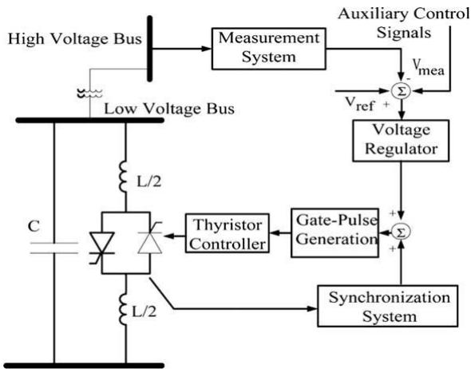
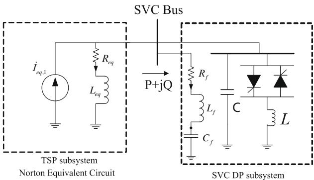
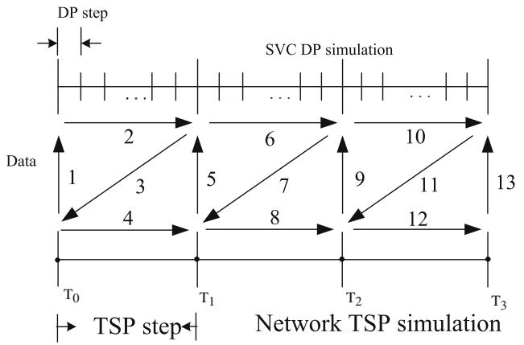
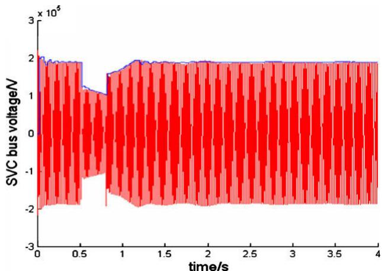
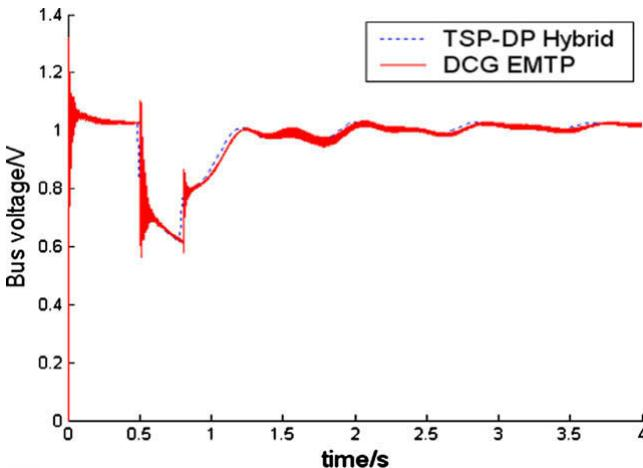
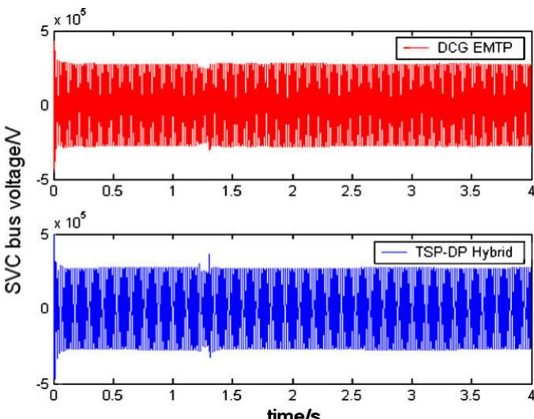
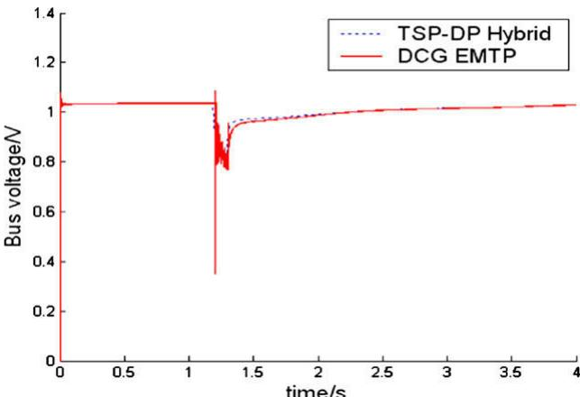

# Hybrid simulation of power systems with SVC dynamic phasor model

E Zhijun a , D.Z. Fang a,*, K.W. Chan b , S.Q. Yuan a,b

a Key Laboratory of Power System Simulation and Control of Ministry of Education of China, Tianjin University, 300072 Tianjin, China

b Department of Electrical Engineering, The Hong Kong Polytechnic University, Hong Kong, China

# a r t i c l e i n f o

Article history:

Received 16 October 2007

Received in revised form 23 January 2009

Accepted 28 January 2009

Keywords:

Dynamic phasors

Transient stability

Electromagnetic transients

Hybrid simulation

Static var compensator

# a b s t r a c t

A novel hybrid method for simulation of power systems equipped with static var compensators (SVC) is suggested in this paper, where dynamic phasor theory is applied for SVC, and traditional electromechanical transient models are used for ac subsystem. A detailed single-phase dynamic phasor-based SVC model is derived first, and an interface algorithm between the SVC dynamic phasor model and the ac subsystem is proposed next. Test results on the 9-bus and the New England 39-bus test power systems show clearly that the single-phase SVC dynamic phasor model has very good accuracy as compared with its electromagnetic transient model. The proposed hybrid-model simulation method provides a new approach for dynamic simulation of large-scale power systems including SVCs.

- 2009 Elsevier Ltd. All rights reserved.

# 1. Introduction

With the rapid development of modern power systems, flexible ac transmission systems (FACTS), a new kind of power electronic devices such as static var compensator (SVC), have been widely applied in the operation and control of power systems. There are extensively studied mathematical models available for simulating the voltage and current waveform relationships during the valveto-valve switching and discrete control of FACTS devices using electromagnetic transient program (EMTP) [1]. However, the EMTP is not suitable for large-scale power system dynamic behavior analysis for its tiny time step and overall CPU time cost. On the other hand, transient stability program (TSP) [2,3] can simulate the transient behavior of large-scale power systems for some disturbance, but cannot provide voltage/current waveform responses of highly nonlinear components such as high voltage direct current (HVDC) links and FACTS.

To incorporate the advantages of both TSP and EMTP, hybrid simulation methods have been developed in [1,4–6]. In hybrid simulations, power systems are split into TSP and EMTP simulation subsystems through interface buses. The EMTP subsystems usually consist of nonlinear components such as HVDC and/or FACTS devices, while the rest system is considered as the TSP subsystem. The hybrid methods interactively execute programs of EMTP for HVDC links and/or FACTS devices, and of TSP for the rest of the power system, alternatively. Usually, TSP simulation utilizes rela-

tively larger integration step size (e.g. 0.02 or 0.01 s for a 50-Hz ac system) using single-phase network model, and EMTP simulation adopts much smaller integration step size (e.g. 50 ls) using 3-phase circuit model. Hence, the hybrid simulation is faster than the traditional EMTP simulation of entire networks. Meanwhile it preserves the advantages of EMTP in the accurate voltage and current waveform simulation for the target part of system. In addition, hybrid simulation requires less computer memory resources than that the EMTP does. However, the phase discontinuity in TSP equivalent and the effect of dc-offset in EMTP equivalent are the main problems which reduce the accuracy of this type of TSP-EMTP hybrid simulation [7].

Dynamic phasor (DP) model based on the approach of timevarying Fourier coefficient series can catch and approximate waveform response of dynamic nonlinear components of power system described by EMTP models [8–10]. In recent years, DP modeling method has been successfully applied in the simulation and analysis of power systems with nonlinear devices. A number of DP models of nonlinear components, such as HVDC [11–12], static synchronous compensator (STATCOM) [12], thyristor-controlled series capacitor (TCSC) [13], and unified power-flow controller (UPFC) [14], have been studied in the hybrid simulation framework and have achieved satisfactory results.

A hybrid simulator which combines a new single-phase equivalent DP model of static var compensator (SVC) into the conventional TSP computation is presented in this paper. In the hybrid simulator, the SVC has been represented by the SVC DP subsystem. The improvement is that the DP subsystems are simulated using a new single-phase circuit model with larger integration step

# Nomenclature

xðsÞ; yðsÞ time-domain waveform   
$X _ { k } ( t )$ kth dynamic phasor of xðsÞ   
$\frac { d X _ { k } } { d t } \left( t \right)$ differential of kth dynamic phasor   
$\langle \frac { d x } { d t } \rangle _ { k } ( t )$ kth dynamic phasor of the differential of $x ( \tau )$   
$C$ capacitor of TCR   
$L$ inductive of TCR   
$\nu$ capacitor voltage of TCR   
i inductor current of TCR   
$i _ { l }$ current of TCR   
s switching function of TCR   
$V _ { k }$ kth dynamic phasor of capacitor voltage   
$I _ { k }$ kth dynamic phasor of inductor current   
$I _ { l k }$ kth dynamic phasor of line current   
$S _ { k }$ kth dynamic phasor of switching function

a firing angle of TCR   
$\sigma$ conduction angle of TCR   
$R _ { f }$ resistor of the filter RLC circuit   
$L _ { f }$ inductor of the filter RLC circuit   
$C _ { f }$ capacitor of the filter RLC circuit   
$V _ { 1 } ( t )$ resistor voltage of filter circuit   
$i ( t )$ resistor current of filter circuit   
$V _ { 2 } ( t )$ capacitor voltage of filter circuit   
$I _ { e q , 1 }$ current source phasor for Norton equivalent circuit   
Yeq $Y _ { e q }$ equivalent admittance of Norton equivalent circuit   
$R _ { e q }$ equivalent resistor of Norton equivalent circuit   
$L _ { e q }$ equivalent inductor of Norton equivalent circuit   
$P$ real power absorbed by SVC   
$Q$ reactive power absorbed by SVC

size than that utilized in EMTP. Therefore the speed of the new hybrid simulator has been greatly improved than traditional EMTP hybrid simulator. The new simulator is tested on the 3-generator 9-bus system and the 10-generater New England test system. The accuracy and effectiveness of the new hybrid simulator is validated by comparing with the benchmark results obtained by the commercial package EMTP development coordination group edition (DCG/EMTP) under the same system conditions.

# 2. Dynamic phasor model of SVC

# 2.1. Basic concept of dynamic phasor

The DP approach, initially called state-space averaging method, is developed based on the theorem of Fourier series with timevarying coefficients. Assume that a time-domain waveform xðsÞ can be represented on the time interval $\tau \in ( t - T , t ]$ in Fourier series as follows:

$$
x (\tau) = \sum_ {k = - \infty} ^ {\infty} X _ {k} (t) e ^ {j k \omega_ {s} \tau} \tag {1}
$$

where, $\omega _ { s } = 2 \pi / T ,$ , and $X _ { k } ( t )$ is called dynamic phasor denoting complex time-varying coefficients of the Fourier series. Thus, the kth dynamic phasor at time t is evaluated by (2).

$$
X _ {k} (t) = \frac {c}{T} \int_ {t - T} ^ {t} x (\tau) e ^ {- j k \omega_ {s} \tau} d \tau = \langle x \rangle_ {k} (t) \tag {2}
$$

where, c ¼ 1 for k ¼ 0 and c ¼ 2 for $k > 0 .$ . The following two properties are used in developing the SVC DP model.

Property 1. Differential of the kth dynamic phasor

$$
\frac {d X _ {k}}{d t} (t) = \left\langle \frac {d x}{d t} \right\rangle_ {k} (t) - j k \omega_ {\mathrm {s}} X _ {k} (t) \tag {3}
$$

# Property 2. Product of two dynamic phasors

The kth dynamic phasor of the product of two time-domain waveform xðsÞ and yðsÞ can be calculated by (4)

$$
\langle x y \rangle_ {k} = \sum_ {i = - \infty} ^ {\infty} \langle x \rangle_ {k - i} \langle y \rangle_ {i} \tag {4}
$$

Contrarily, time-domain waveform $x ( \tau )$ can be computed from its dynamic phasors by (5)

$$
\begin{array}{l} x (\tau) = \operatorname {R e} \left(X _ {k} (t) e ^ {j k \omega_ {0} \tau}\right) = X _ {- k} (t) e ^ {- j k \omega_ {0} \tau} + X _ {- (k - 1)} (t) e ^ {- j (k - 1) \omega_ {0} \tau} + \dots \\ + X _ {k - 1} (t) e ^ {i (k - 1) \omega_ {0} \tau} + X _ {k} (t) e ^ {j k \omega_ {0} \tau} \tag {5} \\ \end{array}
$$

Since xðsÞ is a real function on the time interval, i.e. $\tau \in ( t - T , t ]$ , it is easy to see that $X _ { - k } = X _ { k } ^ { \ast } ,$ , where, the notation  denotes complex conjugate of a complex variable.

# 2.2. Dynamic phasor model of SVC

In a thyristor-based SVC, the thyristor-controlled reactor (TCR) is usually in conjunction with fixed or thyristor-switched capacitors to provide rapid, continuous control of reactive power over the entire selected lagging-to-leading range. In this paper, threephase SVCs are considered as the DP subsystems to interface with an external TSP subsystem as a new implementation of hybrid simulation. The SVC usually consists of three delta-connection singlephase TCRs, a fixed capacitor and a filter circuit. The DP model for each component is described as follows.

# 2.2.1. Dynamic phasor model of TCR

The circuit of single-phase TCR is shown in Fig. 1. If the valves of both thyristor are symmetrically fired in the positive and negative half-cycles of their voltage, only odd-order harmonics current would be produced. In addition, the delta-connection of the three single-phase TCRs can prevent the triple-order harmonics from circuiting among the electric power network. Harmonic analysis shows that seventh and higher order harmonics has less effect on TCR dynamic characteristics [15]. As a result, in this paper only the fundamental and fifth harmonics would be considered in the

  
Fig. 1. A general scheme diagram of SVC control system.

dynamic phasor model of TCR. The voltage and current equations of the single-phase circuit of SVC in Fig. 1 are listed in (6)

$$
\left\{ \begin{array}{l} C \frac {d v}{d t} = i _ {l} - i \\ L \frac {d i}{d t} = s v \end{array} \right. \tag {6}
$$

where, notation s stands for a switch function defined by that $s = 1$ when the one of two thyristors is fully conducted and $s = 0$ when the thyristors are opened. Considering (2) and (3), the DP model of SVC in (6) can be derived

$$
\left\{ \begin{array}{l} C \frac {d V _ {k}}{d t} = - j k \omega_ {s} C V _ {k} + I _ {l k} - I _ {k} \\ L \frac {d l _ {k}}{d t} = - j k \omega_ {s} L I _ {k} + \langle s v \rangle_ {k}, \quad k = 1, 5 \end{array} \right. \tag {7}
$$

where, $\langle s \nu \rangle _ { k }$ is evaluated by (8) if harmonics higher than the 5th order have been ignored.

$$
\langle s v \rangle_ {k} = \sum_ {l \in \{- 5, - 1, 1, 5 \}} S _ {k - l} V _ {l} \tag {8}
$$

Considering that $\boldsymbol { V } _ { k } = \boldsymbol { V } _ { k } ^ { R } + j \boldsymbol { V } _ { k } ^ { I }$ , $I _ { k } = I _ { k } ^ { R } + j I _ { k } ^ { I }$ , $I _ { l k } = I _ { l k } ^ { R } + j I _ { l k } ^ { I }$ $S _ { k } = S _ { k } ^ { R } + j S _ { k } ^ { \bar { I } }$ and (8), the TCR DP model can be represented by $( 9 ) - ( 1 2 ) .$ .

$$
C \frac {d V _ {k} ^ {R}}{d t} - k \omega_ {s} C V _ {k} ^ {I} = I _ {l k} ^ {R} - I _ {k} ^ {R}, \quad k = 1, 5 \tag {9}
$$

$$
C \frac {d V _ {k} ^ {I}}{d t} + k \omega_ {s} C V _ {k} ^ {R} = I _ {l k} ^ {I} - I _ {k} ^ {I}, \quad k = 1, 5 \tag {10}
$$

$$
\begin{array}{l} L \frac {d I _ {k} ^ {R}}{d t} - k \omega_ {s} L I _ {k} ^ {I} = \sum_ {m = k - n} \left[ S _ {m} ^ {R} V _ {n} ^ {R} - S _ {m} ^ {I} V _ {n} ^ {I} \right] + \sum_ {m = n - k} \left[ S _ {m} ^ {R} V _ {n} ^ {R} + S _ {m} ^ {I} V _ {n} ^ {I} \right] \\ + \sum_ {m = k + n} \left[ S _ {m} ^ {R} V _ {n} ^ {R} + S _ {m} ^ {I} V _ {n} ^ {I} \right] \quad k = 1, 5; n = 1, 5 \tag {11} \\ \end{array}
$$

$$
\begin{array}{l} L \frac {d I _ {k} ^ {I}}{d t} + k \omega_ {s} L I _ {k} ^ {R} = \sum_ {m = k - n} \left[ S _ {m} ^ {I} V _ {n} ^ {R} - S _ {m} ^ {R} V _ {n} ^ {I} \right] + \sum_ {m = n - k} \left[ - S _ {m} ^ {I} V _ {n} ^ {R} + S _ {m} ^ {R} V _ {n} ^ {I} \right] \\ + \sum_ {m = k + n} \left[ S _ {m} ^ {I} V _ {n} ^ {R} - S _ {m} ^ {R} V _ {n} ^ {I} \right] \quad k = 1, 5; n = 1, 5 \tag {12} \\ \end{array}
$$

where, the superscript R and I denote the real and imaginary parts of a complex number, respectively.

# 2.2.2. Dynamic phasor model of switch function

The DP model of the switching function which describes the nonlinear characteristics of TCR operations [13] is shown in (13) and (14).

$$
S _ {0} = \frac {1}{T} \int_ {t - T} ^ {t} s (\tau) \cdot d \tau = \frac {\sigma}{\pi} \tag {13}
$$

$$
\begin{array}{l} S _ {m} = \frac {1}{T} \int_ {t - T} ^ {t} s (\tau) \cdot e ^ {- j m \omega_ {s} \tau} d \tau = \frac {j}{m \pi} [ e ^ {- j m (\alpha + \sigma)} - e ^ {- j m \alpha} ] \\ = \frac {1}{m \pi} [ \sin m (\alpha + \sigma) - \sin m \alpha ] + \frac {j}{m \pi} [ \cos m (\alpha + \sigma) - \cos m \alpha ] (m \neq 0) \tag {14} \\ \end{array}
$$

The firing delay angle a and conduction angle r (where $\sigma = 2 ( \pi - \alpha ) )$ are dependent on the closed-loop control of SVC and updated at each TSP integration step.

# 2.2.3. Dynamic phasor model of filter circuits

Usually, an RLC (resistor, inductor and capacitor in series) filter circuit is connected on the SVC bus for preventing high order harmonic currents injecting into the power system. In this paper, the RLC filter circuit is decomposed into an RL circuit and a capacitor in series. Using the differential property, (16) is derived from (15) for

the RL circuit. Separating the real and imaginary parts of each side of (16), the DP model of (17) for the RL circuit is deducted, where $V _ { 1 } ( t )$ and i(t) are for the voltage and current of the RL circuit, respectively.

$$
v _ {1} (t) = L \frac {d i (t)}{d t} + R i (t) \tag {15}
$$

$$
L \frac {d I _ {k}}{d t} = V _ {1, k} - j k \omega_ {s} L I _ {k} - R I _ {k}, \quad k = 1, 5 \tag {16}
$$

$$
\left\{ \begin{array}{l} \frac {d I _ {k} ^ {R}}{d t} = \frac {1}{L} \left(V _ {1, k} ^ {R} - R I _ {k} ^ {R}\right) + k \omega_ {s} I _ {k} ^ {I} \\ \frac {d I _ {k} ^ {I}}{d t} = \frac {1}{L} \left(V _ {1, k} ^ {I} - R I _ {k} ^ {I}\right) - k \omega_ {s} I _ {k} ^ {R}, \quad k = 1, 5 \end{array} \right. \tag {17}
$$

Similarly, the DP model for the capacitor, i.e. (20), can be derived from (18) and (19), where $V _ { 2 } ( t )$ and i(t) are for the voltage and current of the capacitor, respectively

$$
\begin{array}{l} i (t) = C \frac {d v _ {2} (t)}{d t} (18) \\ \frac {d V _ {2 , k}}{d t} = \frac {1}{C} I _ {k} - j k \omega_ {s} V _ {2, k} \quad k = 1, 5 (19) \\ \left\{ \begin{array}{l} \frac {d V _ {2 , k} ^ {R}}{d t} = \frac {1}{C} I _ {k} ^ {R} + k \omega_ {s} V _ {2, k} ^ {I} \\ \frac {d V _ {2 , k} ^ {I}}{d t} = \frac {1}{C} I _ {k} ^ {I} - k \omega_ {s} V _ {2, k} ^ {R}, \quad k = 1, 5 \end{array} \right. (20) \\ \end{array}
$$

# 3. Hybrid simulation of system with SVC DP models

The DP SVC hybrid simulator introduced in this paper takes the advantage of computational efficiency of both the TSP subsystem and the SVC DP subsystem. In order to integrate the TSP and SVC DP subsystems into a single simulation package, the following issues have to be addressed.

# 3.1. Network partitioning

In the SVC DP hybrid simulation, power system is partitioned into one TSP subsystem and some SVC DP subsystems through the SVC buses, whose type is called interface buses. Fig. 2 shows the decomposition in which case only one SVC is installed. In the hybrid simulation, the SVC components are simulated using the single-phase equivalent circuit and the DP model with relatively small integration step size $( { \bf e . g . \ 1 . 0 \times 1 0 ^ { - 3 } } s ) ,$ in contrast to the EMTP simulation using three-phase circuit and the detailed model with much smaller integration step size $( \mathbf { e . g . ~ } 5 . 0 \times 1 0 ^ { - 5 } s ) ;$ the TSP subsystem is simulated using the fundamental frequency singlephase phasor model with common integration step size (e.g.

  
Fig. 2. The system decomposition and equivalent circuit for each subsystem in simulation.

  
Fig. 3. Interface protocol of the SVC DP hybrid simulation.

0.02s). As shown in Fig. 3, the two kinds of simulations exchange the necessary data to accomplish the hybrid simulation at the regular fixed times such as $T _ { 0 } , T _ { 1 } ,$ , . . ..

# 3.2. The SVC DP hybrid simulation approach

Fig. 2 shows the configuration of the single-phase equivalent circuit used in the SVC DP subsystem simulation. At a regular fixed time $T _ { k } ,$ a one-port Norton equivalent circuit (see Fig. 2) of the SVC external subsystem has to be established based on the state of power system at $T _ { k } ,$ which in turn is obtained by TSP subsystem simulation from T to T for the case of k > 0 or by load flow analysis for the case of $k = 0 .$ . The parameters of the Norton equivalent circuit include a current source of fundamental phasor expressed by $\dot { I } _ { e q , 1 } = I _ { e q , 1 } ^ { R } + j I _ { e q , 1 } ^ { I }$ 1 and an equivalent admittance denoted by Yeq $\begin{array} { r } { Y _ { e q } = \frac { 1 } { R _ { e q } + j \omega _ { 1 } L _ { e q } } . } \end{array}$ 1Reqþjx1Leq. eq;  Once the equivalent parameters $I _ { e q , 1 } ^ { R } , ~ I _ { e q , 1 } ^ { I } , ~ R _ { e q }$ and $L _ { e q }$ are obtained, these external subsystem data will be transferred to the SVC DP subsystem simulation corresponding to the arrows 1, 5, 9 and 13 in Fig. 3. Then the SVC DP subsystem integration of twenty steps (with step size $1 . 0 \times 1 0 ^ { - 3 } s )$ are conducted using the DP models (9)–(12) for the TCR, (17) for the RL model of the $R _ { e q } - L _ { e q }$ and $R _ { f } - L _ { f }$ circuits in Fig. 3 and (20) for the capacitor $C _ { f }$ in Fig. 2, respectively. These steps of electromechanical transient integration correspond to the arrows 2, 6 and 10 in Fig. 3. After the above DP subsystem integration, the P and Q (the real and reactive power) absorbed by the SVC at time $\mathrm { T } _ { \mathbf { k } + 1 }$ are evaluated by (21). The data P and Q will be transferred to TSP to start simulation at time $T _ { k }$ corresponding to the arrows 3, 7 and 11 in Fig. 3

$$
\left\{ \begin{array}{l} P = V _ {1} ^ {R} I _ {1} ^ {R} + V _ {1} ^ {I} I _ {1} ^ {I} \\ Q = - V _ {1} ^ {R} I _ {1} ^ {I} + V _ {1} ^ {I} I _ {1} ^ {R} \end{array} \right. \tag {21}
$$

After the SVC DP subsystem simulation has finished, the one step TSP integration at time $T _ { k }$ (with step size 0.02s) is conducted with the SVC. The TSP integration receives the real power P and reactive power Q absorbed at $T _ { k + 1 }$ by the SVC offered by SVC DP subsystem simulation. Take the averages of the P and Q absorbed by the SVC at times $T _ { k }$ and $T _ { k + 1 }$ as the real and reactive powers of the SVC bus, one step of TSP integration from $T _ { k }$ to $T _ { k + 1 }$ is performed which corresponds to the arrows 4, 8 and 12 in Fig. 3. The TSP subsystem simulation is the same as the one that is used in TSP-EMTP hybrid simulation [1,4,6].

The steps in conducting the SVC DP hybrid simulation is summarized as follows:

 Step 1. Power flow calculation; set $t = 0 ;$   
 Step 2. If the network configuration is not changed go to Step 4;   
 Step 3. Construct new node admittance matrix;

 Step 4. Evaluate Norton equivalent circuit parameters;   
 Step 5. Perform 20 steps SVC DP simulation;   
 Step 6. Evaluation of P and Q absorbed by SVC at time t;   
 Step 7. One step integration of TSP; set $t = t + \Delta t ;$   
 Step 8. $\mathrm { I f } ~ t \geqslant t _ { \mathrm { m a x } }$ then stop the simulation, else go to Step 2.

where Dt is for the step size of the TSP integration. When a fault occurs or is cleared, the network configuration will be changed. The procedure of the SVC DP hybrid algorithm is similar to conventional EMTP hybrid simulation algorithms [1,4,6] in many aspects. The major merit of the new hybrid method is that the SVC DP simulation model uses a single-phase equivalent circuit model. In addition, the integration step size used in the DP subsystem simulation is much larger than that used in the EMTP simulation. Therefore the efficiency or the speed of the DP subsystem simulation is higher.

# 4. Case studies

Case studies are performed on the 3-generator 9-bus system [7] and the 10-generater New England test system [7]. In the studies, the generators of the two test systems are represented by the twoaxis model and all loads are modeled by constant impedance. In the studies, the effect of voltage regulation by SVC is also considered. The input and output control signals are the SVC bus voltage and the TCR firing angle a [15], respectively. It should be pointed out that the gate-pulse generator and synchronizing system is not considered in the system simulations since the firing angles a and conduction angle r have already been used in the DP model of switch function.

The integration step size used in the TSP is 0.01s and the one in DP integration is 0.001s. To check the correctness and the accuracy of the SVC DP hybrid simulation scheme, results of the EMTP simulation on the entire system for the same calculation conditions using DCG/EMTP package are used as benchmarks.

# 4.1. Study on the 3-generator and 9-bus system

The case studies are first carried out on the 9-bus system with an SVC installed at Bus 9. The parameters of SVC with voltage control can be found in [7]. The simulations start at time 0.0 s, and then a three-phase short-circuit fault occurs at Bus 7 at 0.5 s and disappears at 0.8 s.

Fig. 4 plots voltage waveform of phase A on the SVC bus obtained by the DCG/EMTP software and the up-envelope of the SVC bus voltage waveform by the SVC DP hybrid simulator. The

  
Fig. 4. Voltage waveform of Phase A on the SVC bus for the 3-generator system.

  
Fig. 5. Comparison of voltage curve of Bus 1 for the 3-generator system.

up-envelope of the voltage waveform is obtained by combining the voltage waveforms of the fundamental and the 5th harmonics.

Fig. 5 plots the generator bus voltage obtained both by the DCG/ EMTP and by the SVC DP hybrid simulator. The curve obtained by the hybrid simulator is totally the fundamental phasor response, and the one obtained by the DCG/EMTP software is the up-envelop of bus voltage waveform of phase A including higher order harmonic responses.

# 4.2. Study on the 10-generator system

The 10-generater New England test system [7] with an SVC installed at Bus 12 is also applied to study the validity of the new DP hybrid simulator. The parameters of SVC are the same as that used in the 9-bus test system. The simulations start at time 0.0 s, and then a three-phase short-circuit fault occurs at bus 1 at 1.2 s and disappears at 1.3 s.

Fig. 6 plots voltage waveforms of phase A on the SVC bus obtained by the DCG/EMTP and by the SVC DP hybrid simulator. The voltage waveform of the SVC bus for the hybrid simulator comprises of the fundamental and the 5th harmonics.

The bus voltages of Generator 10 obtained both by the SVC DP hybrid simulator and by DCG/EMTP are shown in Fig. 7. The voltage curve for the hybrid simulator is the fundamental phasor response calculated by the TSP subsystem simulation, and the one

  
Fig. 6. Voltage waveform of Phase A on the SVC bus on the 10-generator system.

  
Fig. 7. Comparison of voltage curves of Generator 10 of the 10-generator system.

obtained by the DCG/EMTP is the up-envelop of the bus voltage waveform of phase A.

The voltage waveform curves shown in Figs. 4 and 6 show that the system responses obtained by the new SVC DP hybrid simulator match the benchmark curves closely. The voltage curves in Figs. 5 and 7 demonstrate that the system voltage obtained by the hybrid simulator is credible in engineering applications. The comparison of the results with the benchmarks validates that the new SVC DP hybrid simulator can simulate the dynamic voltage/current waveform responses of SVC precisely.

# 5. Conclusions

A new SVC DP hybrid simulator is proposed in this paper. In this simulator, SVC devices are simulated using a new single-phase equivalent DP circuit model and the remaining subsystem is simulated by TSP. The simulation results obtained by the DP simulator are compared with the ones of traditional EMTP simulation. The comparisons validate that the DP hybrid simulator can offer voltage/current waveform responses with satisfied accuracy in fast speed.

# Acknowledgements

The authors gratefully acknowledge the support by the Natural Science Foundation of China under Grant No. 50777046, by National Basic Research Program of China under Grant No. 2004CB217904 and by the Hong Kong Polytechnic University under Project A-PA2L.

# References

[1] Heffernan MD, Turner KS, Arrillaga J, Arnold CP. Computation of ac–dc system disturbance. Part I and II and III. IEEE Trans PAS 1981;PAS-100(11):4341–63.   
[2] He Bin, Zhang Xiubin, Zhao Xingyong. Transient stabilization of structure preserving power systems with excitation control via energy-shaping. Int J Elect Power Energy Syst 2007;29(10):822–30.   
[3] Ai Q, Domijan Jr A. New load models for fast transient stability calculations. Int J Elect Power Energy Syst 2004;26(1):49–57.   
[4] Reeve J, Adapa R. A new approach to dynamic analysis of ac networks incorporating detailed modeling of dc system. Part I and II. IEEE Trans PD 1998;(4):2005–19.   
[5] Sultan M, Reeve J, Adapa R. Combined transient and dynamic analysis of HVDC and FACTS systems. IEEE Trans PD 1998;13(4):1271–7.   
[6] Fang DZ, Liwei Wang, Chung TS. New techniques for enhancing accuracy of EMTP/TSP hybrid simulation. Int J Elect Power Energy Syst 2006;28(10):707–11.   
[7] Su HT, Chan KW, Snider LA. Evaluation study for the integration of electromagnetic transients simulator and transient stability simulator. Elect Power Syst Res 2005;75:67–78.   
[8] Sanders SR, Noworolski JM, Liu XZ, Verghese GC. Generalized averaging method for power conversion circuits. IEEE Trans PE 1991;6(2):251–9.

[9] Venkatasubramanian V. Tools for dynamic analysis of the general large power system using time-varying phasors. Int J Elect Power Energy Syst 1994;16(6):365–76.   
[10] Mahdavi J, Emaadi A, Bellar MD, et al. Analysis of power electronic converters using the generalized state-space averaging approach. IEEE Trans CS 1997;44(8):767–70.   
[11] Zhu Haojun, Cai Zexiang, Liu Haoming, Ni Yixin. Hybrid-model transient stability simulation using dynamic phasors based HVDC system model. Elect Power Syst Res 2006;76(6–7):582–91.   
[12] Zhu Haojun, Cai Zexiang, Liu Haoming, Ni Yixin, Multi-infeed HVDC/AC power system modeling and analysis with dynamic phasor application. In:

Proceedings of IEEE/PES transmission and distribution conference and exhibition: Asia and Pacific; 2005. p. 1–6.   
[13] Mattavelli P, Stankovic AM, Verghese GC. SSR analysis with dynamic phasor model of thyristor-controlled series capacitor. IEEE Trans PS 1999;14(1):200–8.   
[14] Stefanov PC, Stankovic AM. Modeling of UPFC operation under unbalanced conditions with dynamic phasors. IEEE Trans PS 2002;17(2):395–403.   
[15] Mathur RM, Vama RK. Thyristor-based FACTS controller for electrical transmission systems, John Wiley & Sons Ltd., USA; 2002.