# Co-simulation of Electromagnetic Transients and Phasor Models: a Relaxation Approach

F. Plumier, Student Member, IEEE, P. Aristidou, Student Member, IEEE, C. Geuzaine, Member, IEEE, and T. Van Cutsem, Fellow Member, IEEE

Abstract—Co-simulation opens new opportunities to combine mature ElectroMagnetic Transients (EMT) and Phasor-Mode (PM) solvers, and take advantage of their respective high accuracy and execution speed. In this paper, a relaxation approach is presented, iterating between an EMT and a PM solver. This entails interpolating over time the phasors of the PM simulation, extracting phasors from the time evolutions of the EMT simulation, and representing each sub-system by a proper multiport equivalent when simulating the other sub-system. Various equivalents are reviewed and compared in terms of convergence of the PM-EMT iterations. The paper also considers the update with frequency of the Thévenin impedances involved in the EMT simulation, the possibility to compute the EMT solution only once per time step, and the acceleration of convergence through a prediction over time of the boundary variables. Results are presented on a 74-bus, 23-machine test system, split into one EMT and one PM sub-system with several interface buses.

Index Terms—co-simulation, phasor mode simulation, electromagnetic transients, hybrid simulation, hardware-in-the-loop

# I. INTRODUCTION

HE term co-simulation refers to the combination of (at least) two different tools for performing a single multiphysics or multi-model simulation. This paper deals specifically with the co-simulation of EMT and phasor models. The main motivation behind this work is to combine the accuracy of EMT with the computational efficiency of PM simulations. While mature software exist for both models, further investigations and developments are needed for their efficient and accurate coupling.

A number of simulation and/or system reduction techniques have been proposed in the literature. EMT models [1] are the most accurate. They can represent network components at various levels of detail. Moreover, there are a number of mature EMT simulation software (e.g. EMTP-RV, PSCAD, Hypersim, etc.). Nevertheless, they are also the most computationally demanding, compared to simplified models. Dynamic Phasor models (e.g. [2]) can be as accurate as EMT ones and, at the same time, faster to simulate, when the waveforms are quasisinusoidal. However, to the authors’ knowledge, there exists no industry-grade tool relying on this approach. Reduced, equivalent models of a large portion of the system can be used, for instance in the form of a Low Frequency Equivalent,

Frédéric Plumier (f.plumier@alumni.ulg.ac.be), Petros Aristidou (p.aristidou@ieee.org) and Christophe Geuzaine (cgeuzaine@ulg.ac.be) are with the Dept. of Elec. Eng. and Comp. Sc., Univ. of Liège, Belgium.

Thierry Van Cutsem (t.vancutsem@ulg.ac.be) is with the Fund for Scientific Research at Dept. of Elec. Eng. and Comp. Sc., Univ. of Liège, Belgium.

Work supported by the Belgian Science Policy (IAP P7/02) and by Walloon Region of Belgium (WBGreen Grant FEDO).

while performing detailed EMT simulations of the sub-system of greater interest [3]. This approach is faster than full EMT simulation, but with some decrease of accuracy. Even more simplified, the PM solvers, used in stability studies, are usually based on the positive-sequence phasors and assume negligible (or compensated) negative- and zero-sequence components [4]. While this is the fastest category of solvers, EMT phenomena are not considered. The approach reported in this paper combines PM and EMT solvers.

The idea of combining PM and EMT models can be traced back to [5], involving studies of High Voltage Direct Current (HVDC) current-source converters. Still today, PM-EMT hybrid simulations are mainly applied to HVDC systems (e.g. [6], [7]). A comprehensive literature review can be found in [8]. A drawback of many proposed methods is the relatively small size of the EMT sub-system considered, mainly for performance reasons. However, with the computational power available nowadays, larger EMT models can be simulated efficiently. Thus, a larger neighborhood of the device being investigated can be included in the detailed EMT model. Similarly, when a contingency is simulated in the EMT subsystem, a larger number of the impacted components can be represented in detail. In this way, when the boundary between the PM and EMT sub-systems is located further away from the disturbance, the voltages and currents at the interface are closer to the balanced, quasi-sinusoidal evolution assumed in PM simulations. This makes the extraction of boundary voltages and currents from the response of the EMT sub-system easier. On the contrary, if the PM-EMT boundary is too close to the disturbance location, a wide-band multi-port system equivalent has to be used, as discussed in [6] and its references, to represent the PM sub-system in the EMT simulation. Enlarging the EMT sub-system generally means increasing the number of interface buses between PM and EMT sub-systems. One issue tackled in this paper is the proper choice and update of the multi-port equivalent attached to those interface buses. This is an extension of the authors’ previous work reported in [9], [10].

The paper is organized as follows. Section II reviews the main PM-EMT boundary conditions proposed in the literature. Section III details the relaxation process including time interpolation and phasor extraction. Simulation results are presented in Section IV, before concluding in Section V.

# II. A SHORT REVIEW OF BOUNDARY CONDITIONS

Boundary conditions deal with the equivalent model used to replace one sub-system when simulating the other. Figure 1

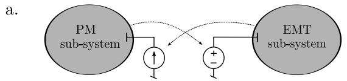

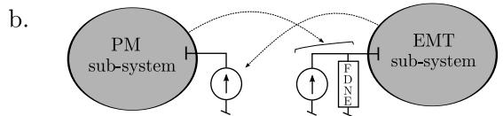

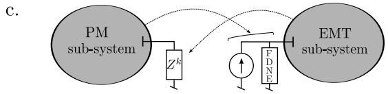

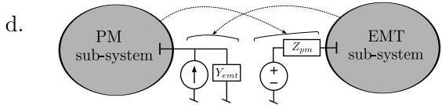  
Figure 1. Boundary conditions. Arrows indicate information transfers from one solver to the other at successive iterations of the relaxation process

summarizes the main approaches found in the literature.

In the simplest scheme, shown in Fig. 1.a, when simulating one sub-system, the other is replaced by an ideal voltage or current source whose value is given by the previous iteration of the relaxation scheme [11]. Another approach, used for instance in [6] and shown in Fig. 1.b, consists of a current source to represent the EMT sub-system, while a Frequency Dependent Network Equivalent (FDNE) admittance in parallel with an ideal current source is used to replace the PM subsystem. This representation is more accurate and valid over a wider frequency range, thus allowing to move the PM-EMT boundary closer to the disturbance location without degrading accuracy [8]. A variant of the latter is shown in Fig. 1.c and used in [12], where the EMT sub-system is represented by an impedance updated at each relaxation iteration.

The last approach, and the one used in this work, makes use of a Norton and a Thévenin equivalent, as shown in Fig. 1.d. It must be noted that the choice between Norton and Thévenin is arbitrary, as for each one there is an equivalent model in the other representation. This approach can be already found in [13], while further investigations have been reported in [7], [9], [10]. Nevertheless, the above references report on results with a single boundary bus, and on small test systems.

The main issue with the current source equivalent (left-hand side in Figs. 1.a and 1.b) is that it does not take into account the variations of current with voltage at the boundary bus. In other words, the sensitivity of the replaced sub-system to voltage is neglected and the co-simulation process needs to wait for the next iteration to get an updated boundary current value. The voltage source representation (right-hand side in Fig. 1.a) has a similar limitation concerning the sensitivity to current variations.

The equivalent impedance representation, shown on the left-hand side in Fig. 1.c, leads to a dynamically updated, diagonal impedance matrix $\begin{array} { r } { Z ^ { k } = d i a g \left( \frac { \breve { \bar { V _ { 1 } } } ^ { k } } { \bar { I _ { 1 } } ^ { k } } , . . . , \frac { \breve { \bar { V _ { n } } } ^ { k } } { \bar { I _ { n } } ^ { k } } \right) } \end{array}$ where I¯n k

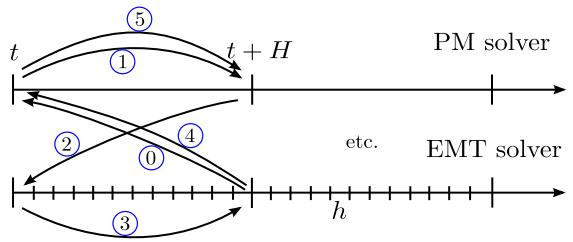  
Figure 2. Protocol of computation combining PM and EMT solvers

V¯1k, . $\bar { V _ { 1 } } ^ { k } , \ldots , \bar { V _ { n } } ^ { k }$ are the voltage phasors at the n boundary buses, and $\bar { I _ { 1 } } ^ { k } , \ldots , \bar { I _ { n } } ^ { k }$ the corresponding currents, all at the kth iteration of the relaxation process. Clearly, the coupling between boundary buses is neglected.

With the Thévenin (or Norton) equivalents, shown in Figs. 1.b, c and d, the coupling between boundary buses is taken into account through an $n \times n$ Thévenin impedance matrix $Z _ { p m }$ . This equivalent makes up a first-order (linear) approximation of the variation of voltages with currents at the boundary buses of the replaced sub-system. With proper updates of $Z _ { p m }$ , this approximation shows good accuracy and fast convergence, as confirmed by the results in Section IV. Furthermore, $Z _ { p m }$ does not need to be updated frequently, but only when a significant change (such as fault inception and clearing) takes place in the system.

# III. THE PROPOSED CO-SIMULATION ALGORITHM

# A. Relaxation process

The overall protocol for the interaction between the PM and the EMT solvers is sketched in Fig. 2. PM simulation is performed with a “large” time-step size H, and EMT with a “small” time-step size h. The focus is on iterations performed when passing from time t to time $t + H$ , i.e. over one step of the PM simulation. Based on some prediction of the interface voltages and currents (step 0), the PM sub-system is computed first (step 1). It is solved once again (step 5) after having simulated the EMT sub-system (step 3). Steps 2 and 4 consist in updating the boundary conditions for resp. the EMT and the PM sub-systems. Steps 2 to 5 are repeated until convergence or for a predefined number of iterations.

Figure 3 shows the main computation steps, the information exchanged by both solvers and the update of the equivalents.

The PM simulation is performed first, relying on the last updated equivalent of the EMT sub-system (or on an equivalent derived from the predicted values, as described in Section III-E). It yields the intermediate values of the boundary bus voltages and currents, $\bar { V } ^ { k + \frac { 1 } { 2 } }$ and $\bar { I } ^ { k + \frac { 1 } { 2 } }$ , which are passed to the EMT simulation.

First, they are used to compute the vector of Thévenin voltage phasors:

$$
\bar {\boldsymbol {E}} _ {p m} = \bar {\boldsymbol {V}} ^ {k + \frac {1}{2}} - \boldsymbol {Z} _ {p m} \bar {\boldsymbol {I}} ^ {k + \frac {1}{2}}, \tag {1}
$$

with:

$$
\boldsymbol {Z} _ {p m} = \boldsymbol {R} _ {p m} + j \omega_ {\text {n o m}} \boldsymbol {L} _ {p m}, \tag {2}
$$

where $Z _ { p m }$ is an estimate of the Thévenin impedance matrix of the PM sub-system, as seen from its boundary buses, $R _ { p m }$

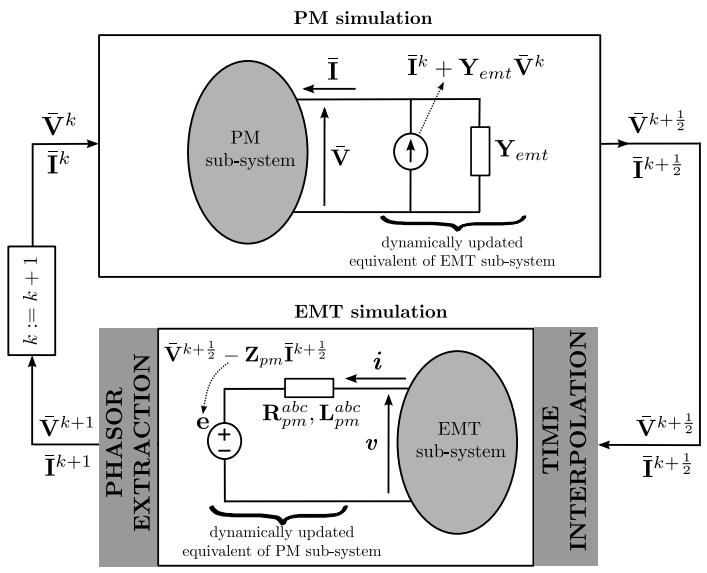  
Figure 3. Main steps and information exchange relaxation process for cosimulation [10]

(resp. $\pmb { L } _ { p m } )$ is the corresponding resistance (resp. inductance) matrix, computed prior to the simulation, and $\omega _ { n o m }$ is the nominal angular frequency.

Next, the components of $\bar { E } _ { p m }$ are interpolated as described in Section III-C, to obtain the vector e of voltages at each discrete time t + mh $( m = 0 , \ldots , \rho )$ . Finally, the Thévenin equivalent is replaced by the differential equations of the corresponding RL circuit:

$$
\boldsymbol {v} = \boldsymbol {e} + \boldsymbol {R} _ {p m} ^ {a b c} \boldsymbol {i} + \boldsymbol {L} _ {p m} ^ {a b c} \frac {d}{d t} \boldsymbol {i}, \tag {3}
$$

where $^ { v , }$ e and i are vectors of dimension 3n relative to the three phases of the n boundary buses, and $R _ { p m } ^ { a b c }$ (resp. $L _ { p m } ^ { a b c } )$ is the 3n × 3n three-phase resistance (resp. inductance) matrix derived from $Z _ { p m }$ (and, hence, accounting for the coupling between boundary buses).

At the end of the EMT simulation, after the phasors have been extracted, the updated boundary voltages and currents $\bar { V } ^ { k + 1 }$ and $\bar { I } ^ { k + 1 }$ are made available. They are in turn used to update the Norton equivalent used by the PM simulation. That equivalent is represented with standard models of current injectors, impedance loads, and branches with pi-equivalents.

Convergence is checked in the PM solver at the level of network equations. Iterations are stopped when the current mismatches at all buses (including the boundary buses) fall below some tolerance. Once convergence has been achieved, the simulation proceeds with the next time interval $\left[ t + H \ t + 2 H \right]$ . Otherwise, an additional relaxation iteration is performed.

# B. Updating equivalent impedances $\mathbf { Z } _ { p m }$ with frequency

PM simulations are usually performed with constant network and machine impedances, computed at nominal frequency. In the EMT simulation, on the other hand, no such approximation is made, since current and voltage waveforms are computed by solving differential equations of the type (3).

Hence, using $Z _ { p m }$ at nominal frequency (see Eq. (2)) to compute $\bar { E } _ { p m }$ and there from obtaining (by the interpolation

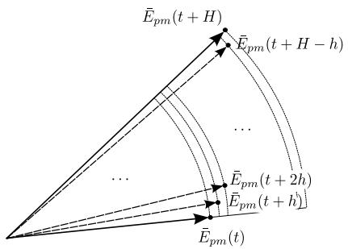  
Figure 4. Interpolation of Thévenin voltage sources

detailed in Section III-C) the voltages e used in Eq. (3) introduces some inconsistency. A more accurate approach, in case of large frequency deviations, consists in updating $Z _ { p m }$ with frequency before computing the Thévenin voltage $E _ { p m } .$ .

Because frequency differs from one boundary bus to another, the following approximation is considered:

$$
\boldsymbol {Z} _ {p m} \simeq \boldsymbol {R} _ {p m} + j \boldsymbol {L} _ {p m} \operatorname {d i a g} \left(\omega_ {1}, \dots , \omega_ {n}\right). \tag {4}
$$

Thus, the i-th column of $\mathbf { L } _ { p m }$ is multiplied by the frequency $\omega _ { i }$ of the current at the i-th boundary bus $( i = 1 , \ldots , n )$ . The latter frequency is evaluated numerically at discrete time $t + H$ as:

$$
\omega_ {i} (t + H) \simeq \omega_ {\text {n o m}} + \frac {\psi_ {i} (t + H) - \psi_ {i} (t)}{H}, \tag {5}
$$

where $\psi _ { i } ( t )$ is the phase angle of the extracted current at the previous discrete time t and $\psi _ { i } ( t { + } H )$ the corresponding phase angle obtained from the last EMT simulation at the current time $t + H .$ .

$Z _ { p m }$ is updated at every co-simulation iteration, and used to compute $\bar { E } _ { p m }$ according to Eq. (1).

# C. Time interpolation

Time interpolation is used to obtain from the phasors provided by PM simulation the corresponding waveforms used by EMT simulation. The phasors of concern are the n Thévenin voltages. A linear interpolation of respectively the magnitude and phase angle of each phasor $\bar { E } _ { p m }$ is considered, as shown in Fig. 4. H is assumed to be a multiple of h, i.e. $H = \rho h$ where $\rho$ is an integer. Note that this choice is for simplicity of presentation, but is not required by the procedure. Thus, at the discrete time instant t + mh $( m = 0 , \ldots , \rho )$ , the interpolated Thévenin voltage magnitude is given by:

$$
E (t + m h) = \left\| \bar {E} _ {p m} (t) \right\| + \frac {m}{\rho} \left(\left\| \bar {E} _ {p m} (t + H) \right\| - \left\| \bar {E} _ {p m} (t) \right\|\right), \tag {6}
$$

where $| | \bigstar | | \bigstar$ denotes the magnitude. Similarly, the interpolated phase angle is given by:

$$
\phi (t + m h) = \angle \bar {E} _ {p m} (t) + \frac {m}{\rho} (\angle \bar {E} _ {p m} (t + H) - \angle \bar {E} _ {p m} (t)) \tag {7}
$$

where $\angle$ denotes the phase angle. Considering phase $^ { a , }$ for instance, the discretized Thévenin voltage is obtained as $( m =$ $0 , \ldots , \rho ) \colon$

$$
e _ {a} (t + m h) = \sqrt {2} E (t + m h) \cos [ \omega_ {\text {n o m}} (t + m h) + \phi (t + m h) ]. \tag {8}
$$

# D. Phasor extraction

Phasor extraction consists of obtaining from the voltage and current waveforms at the boundary buses, provided by EMT simulation and denoted by v and i in Fig. 3, the positivesequence voltage and current phasors, denoted by $\bar { V } ^ { k + 1 }$ and $\bar { \bar { I } } ^ { k + 1 }$ in the same figure. Two methods are used to this purpose. The first one consists in fitting to each waveform separately a shifted quasi-cosine evolution. The second method uses a projection of the three phase variables on a rotating reference frame. The first is the main method used, but it is replaced by the second over some time intervals, as explained hereafter.

For simplicity, the presentation deals with currents, but voltages are treated similarly.

Method 1: Least-square curve fitting: This method consists of fitting to the points obtained by EMT simulation the combination of a variable-amplitude variable-phase cosine with an exponentially decaying component. At time $t + H ,$ , the fitting is performed in the least-square sense using the points collected over an interval $[ t + H - T _ { x } \ t + H ]$ .

The function to fit is taken as:

$$
\begin{array}{l} \sqrt {2} \left[ A _ {0} + \frac {(A _ {1} - A _ {0}) k}{k _ {m a x}} \right] \cos \left[ \frac {k T _ {x} \omega_ {n o m}}{k _ {m a x}} + \phi_ {0} + \frac {(\phi_ {1} - \phi_ {0}) k}{k _ {m a x}} \right] \\ + E \exp \left(- \frac {k T _ {x}}{k _ {\max} \tau}\right), \tag {9} \\ \end{array}
$$

where $k = 0 , \ldots , k _ { m a x }$ is the discrete time $( k _ { m a x } = f _ { s } T _ { x }$ , where $f _ { s }$ is the sampling frequency). The six parameters to identify are:

• $A _ { 0 } ,$ , ϕ0: effective value and phase angle at time $t + H - T _ { x }$   
• $A _ { 1 } , \phi _ { 1 } \colon$ effective value and phase angle at time $t + H$   
• $E , \ \tau \colon$ amplitude of the exponential component at time $t + H - T _ { x }$ , and the corresponding time constant.

The terms of higher frequency present in the EMT simulation outputs are filtered out as “measurement noise” by the leastsquare fitting. Owing to the presence of the cosine component in (9), $T _ { x }$ should be at least equal to one period at fundamental frequency $\omega _ { n o m } / 2 \pi$ .

The two parameters of interest for phasor extraction are $A _ { 1 }$ and $\phi _ { 1 }$ , the amplitude and phase angle of the quasi-cosine component at time $t + H$ (i.e. for $k = k _ { m a x } )$ . Note that, by considering the value of (9) at the end of the EMT simulation interval, the procedure does not introduce any time delay.

Each phase current is processed separately, yielding possibly unbalanced phasors, with effective values $A _ { 1 a } , A _ { 1 b }$ and $A _ { 1 c }$ and phase angles $\phi _ { 1 a } , \phi _ { 1 b }$ and $\phi _ { 1 c } ,$ all relative to time $t + H$ .

The positive, negative and zero-sequence components are straightforwardly obtained from:

$$
\left[ \begin{array}{l} \bar {I} _ {a} ^ {+} \\ \bar {I} _ {a} ^ {-} \\ \bar {I} _ {a} ^ {o} \end{array} \right] = \frac {1}{3} \left[ \begin{array}{c c c} 1 & e ^ {j \frac {2 \pi}{3}} & e ^ {- j \frac {2 \pi}{3}} \\ 1 & e ^ {- j \frac {2 \pi}{3}} & e ^ {j \frac {2 \pi}{3}} \\ 1 & 1 & 1 \end{array} \right] \left[ \begin{array}{l} A _ {1 a} e ^ {j \phi_ {1 a}} \\ A _ {1 b} e ^ {j \phi_ {1 b}} \\ A _ {1 c} e ^ {j \phi_ {1 c}} \end{array} \right].
$$

The least-square fitting is applied to the last $k _ { m a x } + 1$ samples in a time window of width $T _ { x }$ . However, if a large disturbance, such as fault inception or clearing, takes place in this time window, it may not be appropriate to consider the same values of $( A _ { 0 } , A _ { 1 } , \phi _ { 0 } , \phi _ { 1 } , E , \tau )$ before and after the disturbance.

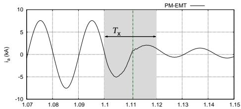

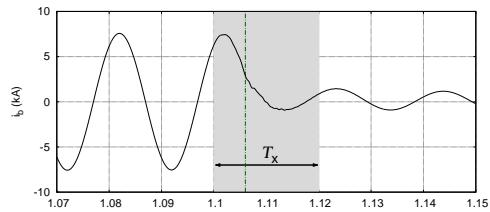

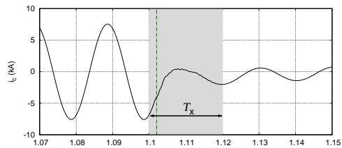  
Figure 5. Extraction problem around the time of a major disturbance

By way of illustration, Fig. 5 shows the phase currents before and after clearing a three-phase fault by opening the individual phase breakers at three successive times, shown with dash-dotted lines. Assuming that phasor extraction is needed at $t = 1 . 1 2 ~ \mathrm { s }$ , with $T _ { x } = 2 0$ ms, the time window of fitting is shown in shaded grey. The three clearing times fall in that window. A proper handling of the wave distortions would require using a different function (9) after fault clearing. This, however, would lead to an insufficient number of samples.

Note that this problem occurs with other extraction methods, such as Fourier analysis, although it has not been documented in the literature, to the authors’ knowledge. It will be less critical if the boundary buses are far enough from the fault location, which is another reason to somewhat extend the EMT sub-system.

The above issue is dealt with by resorting to another extraction technique while the interval $[ t + H - T _ { x } \ t + H ]$ includes a discontinuity. The technique replacing temporarily the least-square fitting could be the one in Ref. [6] (involving the instantaneous power). Instead, the results reported in this paper have been obtained with the method detailed hereafter.

Method 2: Projection on a rotating reference and filtering: The amplitude and phase angle of the positive-sequence component can be extracted from the three-phase, time-varying current waveforms by projecting them on $( x , y )$ reference axes [11]. These are the axes used in the PM simulation to project the rotating vectors associated with quasi-sinusoidal variables, and obtain their corresponding rectangular components. This is illustrated in Fig. 6 where $I _ { x }$ and $I _ { y }$ are the components of phasor ${ \bar { I } } _ { a } ,$ , all three varying with time.

The reference axes are taken as rotating at the angular speed $\omega _ { n o m }$ in the PM simulation. Thus, at time t, the angle between the x axis and a fixed reference is (see Fig. 6):

$$
\theta = \omega_ {n o m} t, \tag {10}
$$

assuming that the x and the reference axes coincide at $t = 0$ .

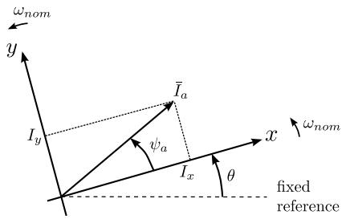  
Figure 6. Reference axes involved in the phasor extraction

The projection is of the Park type [14], and inspired of phase locked loop systems [15]. The vector of projected currents $\dot { \imath } _ { x y }$ is obtained from the vector of three-phase instantaneous currents $i _ { a b c }$ using the linear transformation:

$$
\boldsymbol {i} _ {x y} = \boldsymbol {T} \boldsymbol {i} _ {a b c}, \tag {11}
$$

where:

$$
\boldsymbol {T} = \frac {\sqrt {2}}{3} \left[ \begin{array}{c c c} \cos (\theta) & \cos \left(\theta - \frac {2 \pi}{3}\right) & \cos \left(\theta - \frac {4 \pi}{3}\right) \\ - \sin (\theta) & - \sin \left(\theta - \frac {2 \pi}{3}\right) & - \sin \left(\theta - \frac {4 \pi}{3}\right) \end{array} \right]. \tag {12}
$$

If the three-phase currents were balanced at fundamental frequency only, i.e. if

$$
\boldsymbol {i} _ {a b c} = \left[ \begin{array}{l} i _ {a} \\ i _ {b} \\ i _ {c} \end{array} \right] = \left[ \begin{array}{c} \sqrt {2} I _ {a} \cos (\omega_ {n o m} t + \psi_ {a}) \\ \sqrt {2} I _ {a} \cos (\omega_ {n o m} t + \psi_ {a} - \frac {2 \pi}{3}) \\ \sqrt {2} I _ {a} \cos (\omega_ {n o m} t + \psi_ {a} - \frac {4 \pi}{3}) \end{array} \right], \tag {13}
$$

then, it is easily shown that:

$$
\boldsymbol {i} _ {x y} = \left[ \begin{array}{l} I _ {x} \\ I _ {y} \end{array} \right] = \left[ \begin{array}{l} I _ {a} \cos \psi_ {a} \\ I _ {a} \sin \psi_ {a} \end{array} \right], \tag {14}
$$

which shows that the components of $\dot { \imath } _ { x y }$ are indeed the projections on x and y of a vector rotating at angular speed $\omega _ { n o m }$ , having amplitude $I _ { a }$ and a phase angle $\psi _ { a }$ with respect to the x axis, as shown in Fig. 6. The current phasor to consider in PM simulation is thus obtained from:

$$
I _ {a} = \sqrt {I _ {x} ^ {2} + I _ {y} ^ {2}}, \quad \psi_ {a} = \arctan \frac {I _ {y}}{I _ {x}}. \tag {15}
$$

Note that Eqs. (11)-(12) are applied to the currents $i _ { a b c }$ at the last time t + H of the interval [t t + H] currently simulated by the EMT solver. Hence, this phasor extraction technique does not either introduce a delay associated with the processing of the waveforms at times prior to t + H.

However, Eq. (14) is valid only for balanced, three-phase currents at fundamental frequency. The effects of a fault located in the EMT sub-system are felt at the boundary between PM and EMT sub-systems. Thus, the boundary current waveforms are affected by “noise” stemming from aperiodic, negative- and zero-sequence components, as well as harmonics. Filtering is necessary to eliminate their effects.

Aperiodic (resp. negative-sequence) components present in $i _ { a b c }$ will show their effects on $\dot { \imath } _ { x y }$ as sinusoidal components at nominal (resp. double nominal) frequency. Therefore, the filter must satisfy the following requirements:

• preserve the amplitude of components with frequencies between 0 and 5 Hz. This covers the frequency spectrum of concern in PM simulation;

• filter out the fundamental-frequency, doublefundamental-frequency, and higher frequency components;   
do not affect the phase with respect to the initial signal in the [0 5] Hz frequency range, to avoid introducing delay between the EMT and PM simulations.

To meet these objectives, a low-pass numerical filter processes the sequence of $( I _ { x } , I _ { y } )$ values obtained by applying the transformation (11)-(12) to the values of $i _ { a b c }$ computed by the EMT simulation. Thus, the sampling period of the filter is h. Re-sampling is necessary in case the discrete times of the EMT simulation are not equidistant, which is the case if the time-step size was reduced during the EMT simulation. The time window processed by the filter should not be too narrow, for accuracy reasons [16]. In practice it is set to one period at fundamental frequency.

The Butterworth low-pass filter [16] satisfies the above requirements. For a continuous-time filter of K-th order, the magnitude-squared transfer function takes on the form:

$$
\left| \bar {H} _ {c} (j \omega) \right| ^ {2} = \frac {1}{1 + \left(\omega / \omega_ {c}\right) ^ {2 K}}, \tag {16}
$$

where $\omega _ { c }$ is the cutoff frequency. This filter is characterized by a magnitude response maximally flat in the pass-band. This means that the first 2K − 1 derivatives of function (16) are zero at frequency ω = 0 [16].

The filter is applied twice, once with increasing and once with decreasing times. Doing so almost cancels the phase shift introduced by the filter in the pass-band. In this work, K has been taken equal to two. However, applying the filter twice yields globally a fourth-order filter, which is expected to give sufficient cut-off band attenuation for most systems.

# E. Prediction over time and iterations

To speed up the convergence of the relaxation process, when starting the computations of a new time step $t + H ,$ , each interface variable can be initialized to predicted values obtained from its own history (see step 0 in Fig. 2). For instance, with a first-order (linear) prediction, the predicted value of variables x is given by:

$$
\tilde {\boldsymbol {x}} (t + H) = \boldsymbol {x} (t) + \frac {\boldsymbol {x} (t) - \boldsymbol {x} (t - H)}{H} H = 2 \boldsymbol {x} (t) - \boldsymbol {x} (t - H),
$$

where the slope at time t has been approximated by finite differences. A second-order prediction can also be used, which relies on three points in the past. The predicted states are computed as:

$$
\tilde {x} (t + H) = a (t + H) ^ {2} + b (t + H) + c \tag {17}
$$

where a, b, and c are obtained by solving the linear system:

$$
\left\{ \begin{array}{l l} x (t - 2 H) & = a (t - 2 H) ^ {2} + b (t - 2 H) + c \\ x (t - H) & = a (t - H) ^ {2} + b (t - H) + c \\ x (t) & = a t ^ {2} + b t + c \end{array} \right. \tag {18}
$$

Just after a large disturbance, such as fault inception or clearing, a zero-order prediction is used for a sufficient number of steps (3 to 5) before resorting to a higher-order prediction.

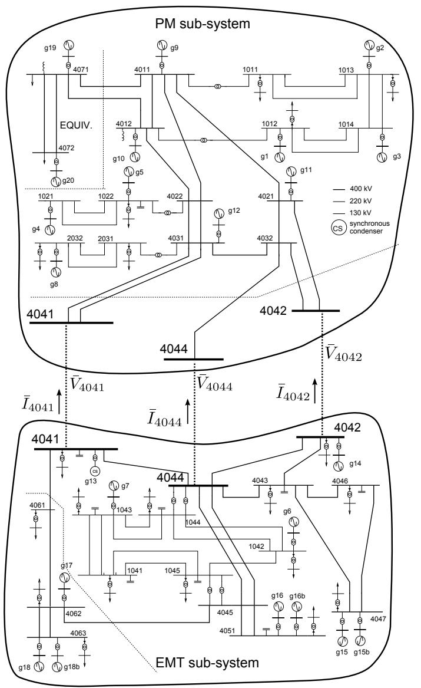  
Figure 7. One-line diagram of the Nordic test system [17]

The interface variables could also be predicted in between the iterations of the same time step, based on the values at the previous iterations. This technique was not contemplated due to the already small number of iterations between EMT and PM simulations taken by the proposed relaxation procedure.

# IV. SIMULATION RESULTS

# A. Test system

This section reports on simulation results obtained with a 74-bus, 102-branch, and 23-machine system. It is based on a variant of the so-called Nordic test system detailed in [17]. The system one-line diagram is shown in Fig. 7 along with the decomposition in PM and EMT sub-systems. The RAMSES software, developed at the University of Liège, has been used for the PM simulation [18]. The EMT sub-system simulator was implemented in MATLAB. The results of the PM-EMT co-simulation were systematically compared to those obtained with EMTP-RV, and RAMSES where appropriate.

The trapezoidal rule was used in both the PM and the MATLAB-based EMT solvers. The step size h was set to

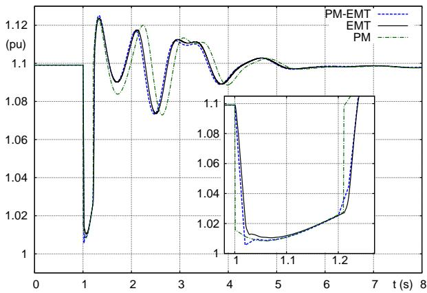  
Figure 8. Case 1a: Voltage magnitude at bus 4044

100 µs, and H to 0.02 s (one cycle at fundamental frequency), giving a ratio $H / h \ : = \ : 2 0 0$ . Moreover, for this system, the ratio of the equation count in the EMT and in the phasor models is $2 2 8 7 / 6 0 9 \ = \ 3 . 7 5$ . Assuming that the effort needed to simulate a set of differential-algebraic equations is comparable in both simulators, the overall speed-up of the PM over the EMT simulation can be roughly estimated as: (Nb of EMT equations/Nb of PM equations) $( H / h ) \simeq 7 7 0$ . In reality detailed EMT models are even more time-consuming due to switching events, detailed control and protection schemes, etc., which yields an even higher speed-up.

For accuracy and/or convergence of the PM solver, it may be required to use a smaller value for H, e.g. one half, or even one fourth of a cycle. In fact, a higher H is more demanding for the convergence of the relaxation procedure. Hence, the choice of one cycle can be considered a “worst case” from the co-simulation viewpoint.

# B. Case 1: Three-phase fault at bus 1042

In this scenario, a three-phase, solid fault is applied at t = 1 s, on one of the two circuits between buses 1044 and 1042, very near the latter, in the EMT sub-system. The fault is cleared by opening all three phases of the line. The nearby machines contribute to imbalance of the system response.

This severe contingency could lead to transient (angle) instability. Thus, two cases have been considered. In Case 1a, the fault is cleared in 10.5 cycles, just before the critical clearing time is reached. In Case 1b, the fault is cleared in 12.5 cycles, which is higher than the critical clearing time.

1) Case 1a: Fault cleared before the critical time: A comparison of the voltage evolutions at the boundary bus 4044, obtained by EMT, PM and PM-EMT simulations, respectively, is provided in Fig. 8. The curves clearly show that the response of the PM-EMT co-simulation is very close to the EMT reference, given by EMTP-RV, while the PM response (computed by RAMSES) shows delayed electromechanical oscillations after t = 2 s. The figure zoom shows that the fault is applied and cleared instantaneously in the PM simulation, owing to the neglected rate of change of armature flux linkages, which leads to representing the network through algebraic equations.   
2) Case 1b: fault cleared after critical time: Due to the delayed fault elimination in this scenario, machine g6 (located

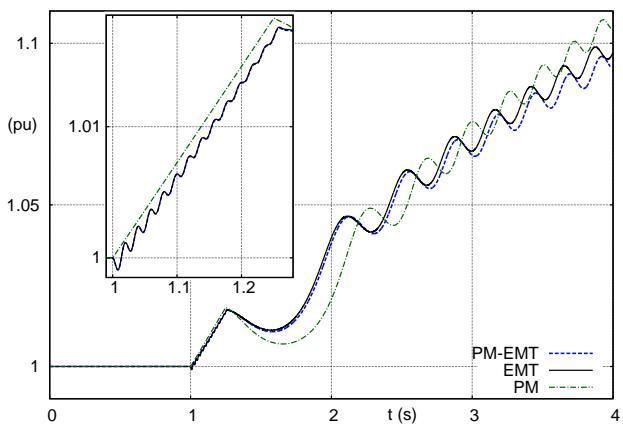

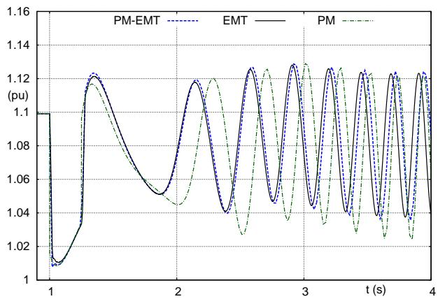  
Figure 9. Case 1b: Rotor speed of generator g6   
Figure 10. Case 1b: Voltage magnitude at bus 4044

next to the fault) loses synchronism and separates with respect to the rest of the system. This marginally unstable scenario is a severe test, since small initial deviations can evolve into large final excursions. Figure 9 shows the evolution of the rotor speed of g6. Note that the simulation has been run, for comparison purposes, until the speed reaches 1.1 pu while the machine would be tripped by protections before that in practice. A zoom on the on-fault period reveals, as expected, an almost linear increase in the PM response, while the PM-EMT and EMT evolutions show oscillations due to additional, fast decaying torque components [4].

Figure 10 shows the corresponding evolution of the voltage magnitude at the boundary bus 4044, given by the three solvers. A good match is observed between PM-EMT and EMT responses, which is not the case for the PM one.

# C. Case 2: Single-phase fault at bus 1042

In this scenario, a single-phase, solid fault is applied at t = 1 s on one of the two circuits between buses 1044 and 1042, very near the latter. The fault is cleared by opening all three phases of the faulted line at $t = 1 . 2 1 \mathrm { ~ s ~ } ( \mathrm { i . e }$ . after 10.5 cycles). This case is of higher interest since it further justifies the use of EMT simulation, and the phase imbalance is more demanding for the PM-EMT coupling.

Figure 11 shows the evolution of the current in the 1044- 1042 circuit parallel to the faulted one (same phase as the fault) before, during and shortly after the fault occurrence. The PM-

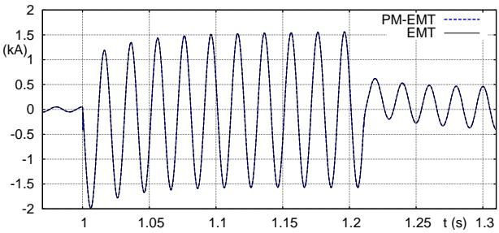

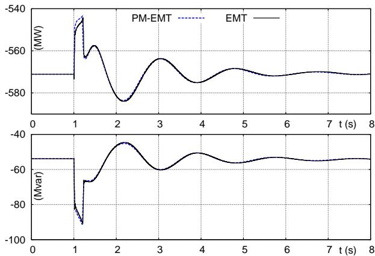  
Figure 11. Case 2: current in one phase of the line parallel to the faulted one   
Figure 12. Case 2: active and reactive powers injected at bus 4044

EMT co-simulation response matches pretty well the EMT benchmark. The active and reactive powers flowing through the boundary bus 4044 are shown in Fig. 12. It can be seen that the electromechanical oscillations are preserved in spite of the simplification of the distant PM sub-system.

# D. Case 3: Tripping of Generator g9

This test is aimed at checking the accuracy of the PM-EMT co-simulation in the presence of large frequency deviations. To this purpose, the disturbance consists of tripping, at t = 1 s, the 1000-MVA generator g9 located in the PM sub-system. Note that most cases of practical interest involve disturbances located in the EMT sub-system represented in greater detail. The reverse is considered here, for checking purposes.

Figure 13 shows the influence of updating the Thévenin equivalent with frequency, as discussed in Section III-B. The plot shows $| | \bar { V } _ { 4 0 4 4 } ^ { k + 1 } - \bar { V } _ { 4 0 4 4 } ^ { k + 1 / 2 } | |$ − V¯ k+1/24044 ||, where the upperscript symbols are those defined in Fig. 3, and k corresponds to the last iteration of the relaxation procedure. The lower values obtained when updating with frequency indicates that the results of the coupled EMT and PM simulations are more consistent.

The evolutions of the rotor speed of machine g13, located near the boundary bus 4041, are shown in Fig. 14, focusing on the time interval until frequency reaches its minimum. In this case, due to PM approximations in the area near the tripped generator g9, the PM-EMT evolution is comparatively less accurate and closer to the PM rather than the EMT solution.

# E. Convergence of the relaxation process

Table I provides the number of iterations of the relaxation procedure, i.e. the number of cycles in Fig. 3 until convergence

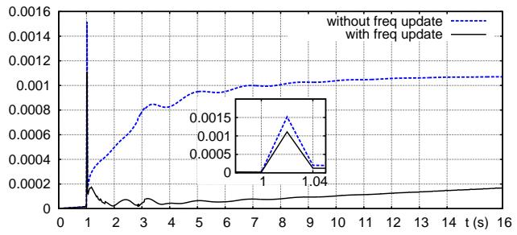  
Figure 13. Case 3: evolution of $| | \bar { V } _ { 4 0 4 4 } ^ { k + 1 } - \bar { V } _ { 4 0 4 4 } ^ { k + 1 / 2 } | |$ V¯ k+1/2 with and without update of the Thévenin equivalent with frequency

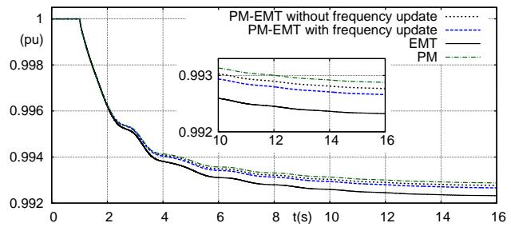  
Figure 14. Case 3: Rotor speed of generator g13

Table I NB. OF RELAXATION ITERATIONS FOR VARIOUS BOUNDARY CONDITIONS. “MED” DESIGNATES THE MEDIAN, AND “MAX” THE MAXIMUM VALUE   

<table><tr><td rowspan="3">Case</td><td colspan="6">Boundary conditions (see Fig. 1)</td></tr><tr><td rowspan="2">(a)</td><td colspan="2">(b)</td><td colspan="2">(c)</td><td>(d)</td></tr><tr><td>Med</td><td>Max</td><td>Med</td><td>Max</td><td>Med</td></tr><tr><td>1-a</td><td>no conv.</td><td>2</td><td>9</td><td>3</td><td>25</td><td>2</td></tr><tr><td>1-b</td><td>no conv.</td><td>3</td><td>9</td><td>4</td><td>25</td><td>3</td></tr><tr><td>2</td><td>no conv.</td><td>3</td><td>4</td><td>2</td><td>4</td><td>2</td></tr><tr><td>3</td><td>no conv.</td><td>2</td><td>13</td><td>3</td><td>6</td><td>2</td></tr></table>

Table II NB. OF RELAXATION ITERATIONS FOR VARIOUS PREDICTIONS   

<table><tr><td rowspan="3">Case</td><td colspan="6">Prediction:</td></tr><tr><td colspan="2">zero-order</td><td colspan="2">first-order</td><td colspan="2">second-order</td></tr><tr><td>Med</td><td>Max</td><td>Med</td><td>Max</td><td>Med</td><td>Max</td></tr><tr><td>1-a</td><td>3</td><td>4</td><td>3</td><td>4</td><td>2</td><td>4</td></tr><tr><td>1-b</td><td>3</td><td>4</td><td>3</td><td>4</td><td>3</td><td>4</td></tr><tr><td>2</td><td>3</td><td>4</td><td>2</td><td>4</td><td>2</td><td>4</td></tr><tr><td>3</td><td>3</td><td>4</td><td>3</td><td>4</td><td>2</td><td>4</td></tr></table>

is reached. For a given simulation, the numbers of iterations were recorded at all time steps; the median and the maximum of all values are shown in the table. A zero-order prediction has been considered in all cases. The results relate to various boundary conditions, identified by the letters in Fig. 1. It was found that the conditions of type (a) did not make the iterations converge (even in steady-state conditions). All other boundary conditions led to convergence, and yielded the same dynamic response [9]. The performances of type (c) vary too much from one case to another; type (d) is consistently the best.

For illustration purposes, Fig. 15 shows the successive values of the active and reactive powers at the boundary bus 4041, in Case 2 and at time $t = 1 . 0 2 \mathrm { ~ s ~ }$ (starting from the solution at $t = 1 . 0 0 \mathrm { ~ s } )$ , i.e. right after the fault inception. With the boundary conditions of type (c), four iterations are needed, while with type (d), three iterations are enough.

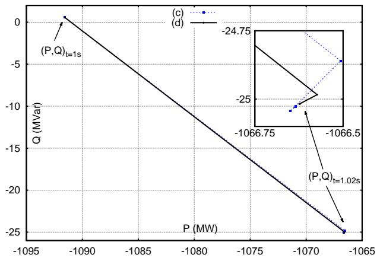  
Figure 15. Case 2: Iterations at t = 1.02 s; boundary conditions (c) and (d)

Table II shows similar results, but when varying the order of the prediction, as explained in Section III-E. The same four cases have been simulated with boundary conditions of type (d). Zero-, first-, and second-order predictions have been considered. It is observed that the second-order prediction consistently gives the least number of iterations, as expected.

# F. Co-simulation with a single iteration

For computational efficiency and in applications such as hardware-in-the-loop simulations, it is of interest to perform a single iteration of the relaxation process, involving thus a single EMT simulation per time step H. Limiting the number of iterations to one obviously introduces some approximation, which is illustrated in Figs. 16 and 17.

Figure 16 relates to Case 1b, with zero-order prediction and boundary conditions of type (b), (c) and (d), respectively. It shows the relative error on the complex power at the boundary bus 4044, namely:

$$
\frac {\sqrt {(P _ {1 i t} - P _ {f c}) ^ {2} + (Q _ {1 i t} - Q _ {f c}) ^ {2}}}{\sqrt {P _ {f c} ^ {2} + Q _ {f c} ^ {2}}},
$$

where $P _ { 1 i t } + j Q _ { 1 i t }$ is the complex power obtained when performing a single iteration, and $P _ { f c } + j Q _ { f c }$ the same power from a fully converged co-simulation. The results further confirm the superiority of boundary conditions of type (d).

Figure 17 shows the same relative error, in all test cases, using boundary conditions of type (d) and second-order prediction. It can be concluded that a single iteration yields very good accuracy.

Finally, Fig. 18, relative to Case 1-a, compares the error caused by imposing a single iteration of co-simulation to the error observed between the fully converged PM-EMT cosimulation and the benchmark. It can be concluded that forcing a single iteration adds comparatively very little error to the one resulting from the phasor approximation.

# V. CONCLUSION

A co-simulation method has been presented, aimed at combining EMT and PM models. The approach is built on the premise that, with modern solvers, the EMT sub-system can

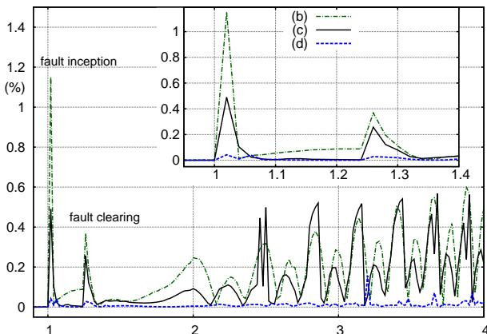  
Figure 16. Case 1-b: Relative error on complex power at bus 4044 when performing a single co-simulation iteration, and using boundary conditions of types (b), (c) and (d)

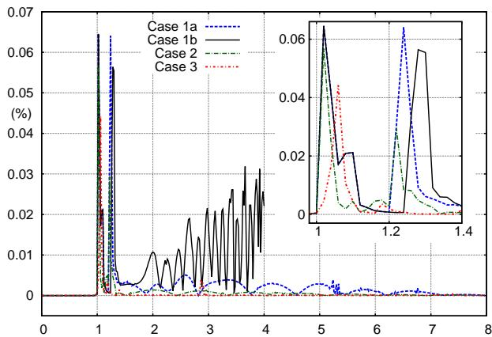  
Figure 17. Relative error on complex power at bus 4044 when performing a single co-simulation iteration, using boundary conditions of type (d)

be enlarged to the extent that, at the interface with the PM sub-system, the three-phase voltages and currents are almost sinusoidal and balanced.

The relaxation process involves time interpolation and phasor extraction. The latter is based on least-square fitting. It does not introduce any delay, while the residuals allow monitoring how closely the EMT response matches the above mentioned ideal conditions.

Dynamically updated Thévenin - Norton equivalents are essential for good convergence. Prediction before proceeding with a new co-simulation time step, and updating the Thévenin equivalent with frequency are also recommended.

Simulation results show that a single co-simulation iteration can be envisaged without significant degradation of accuracy.

So far, the selection of the boundary buses relies on engineering judgment. Efforts towards the automation of this selection is a direction of future research. As far as convergence is concerned, the most demanding situation is likely to be the one with a “small” EMT sub-system surrounding the fault location, in which case the interface variables do not evolve as expected by the PM solver. However, previous tests on such a small EMT sub-system have not shown convergence issues.

Further applications will involve power-electronics components modeled in detail in the EMT sub-system.

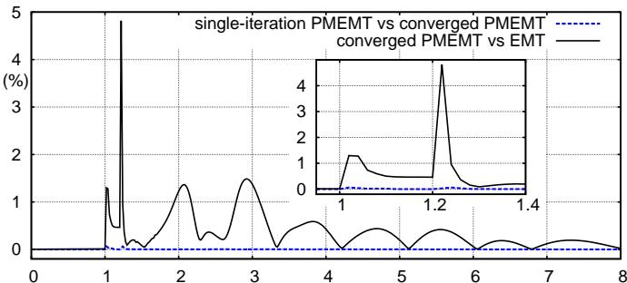  
Figure 18. Case 1-a: Relative error on complex power at bus 4044 when performing a single co-simulation iteration, compared to the error of the fully converged solution with respect to the benchmark (EMTP-RV)

# REFERENCES

[1] H. Dommel, “Digital computer solution of electromagnetic transients in single-and multiphase networks,” IEEE Trans. on Power Apparatus and Systems, vol. PAS-88, no. 4, pp. 388–399, 1969.   
[2] F. Gao and K. Strunz, “Frequency-adaptive power system modeling for multiscale simulation of transients,” IEEE Trans. on Power Systems, vol. 24, no. 2, pp. 561–571, 2009.   
[3] U. Annakkage, N. K. Nair, Y. Liang, A. Gole, V. Dinavahi, B. Gustavsen, T. Noda, H. Ghasemi, A. Monti, M. Matar, R. Iravani, and J. Martinez, “Dynamic system equivalents: A survey of available techniques,” IEEE Trans. on Power Delivery, vol. 27, no. 1, pp. 411–420, 2012.   
[4] P. Kundur, Power System Stability and Control, New York, 1994.   
[5] M. Heffernan, K. Turner, J. Arrillaga, and C. Arnold, “Computation of AC-DC system disturbances - Part I, II and III. interactive coordination of generator and converter transient models,” IEEE Trans. on Power Apparatus and Systems, vol. 100, no. 11, pp. 4341 – 4363, 1981.   
[6] Y. Zhang, A. Gole, W. Wu, B. Zhang, and H. Sun, “Development and analysis of applicability of a hybrid transient simulation platform combining TSA and EMT elements,” IEEE Trans. on Power Systems, vol. 28, no. 1, pp. 357–366, 2013.   
[7] A. van der Meer, M. Gibescu, M. van der Meijden, W. Kling, and J. Ferreira, “Advanced hybrid transient stability and emt simulation for VSC-HVDC systems,” IEEE Trans. on Power Delivery, vol. 30, no. 3, pp. 1057–1066, 2015.   
[8] V. Jalili-Marandi, V. Dinavahi, K. Strunz, J. Martinez, and A. Ramirez, “Interfacing techniques for transient stability and electromagnetic transient programs,” IEEE Transactions on Power Delivery, vol. 24, no. 4, pp. 2385 – 2395, 2009.   
[9] F. Plumier, C. Geuzaine, and T. Van Cutsem, “On the convergence of relaxation schemes to couple phasor-mode and electromagnetic transients simulations,” in Proc. of IEEE PES General Meeting, 2014.   
[10] F. Plumier, P. Aristidou, C. Geuzaine, and T. Van Cutsem, “A relaxation scheme to combine phasor-mode and electromagnetic transients simulations,” in Proceedings of the 18th Power System Computation Conference, Wroclaw, Poland, August 2014.   
[11] F. Plumier, C. Geuzaine, and T. Van Cutsem, “A multirate approach to combine electromagnetic transients and fundamental-frequency simulations,” in Proc. of Int. Conference on Power System Transients, 2013.   
[12] D. Z. Fang, W. Liwei, T. S. Chung, and K. P. Wong, “New techniques for enhancing accuracy of EMTP/TSP hybrid simulation,” Intern. Journal of Electrical Power and Energy Systems, vol. 28, pp. 707 – 711, 2006.   
[13] G. W. Anderson, “Hybrid simulation of AC-DC power systems,” Ph.D. dissertation, University of Canterbury, Christchurch, New Zealand, 1995.   
[14] G. Paap, “Symmetrical components in the time domain and their application to power network calculations,” IEEE Trans. on Power Systems, vol. 15, no. 2, pp. 522 –528, 2000.   
[15] S.-K. Chung, “A phase tracking system for three phase utility interface inverters,” IEEE Trans. on Power Electronics, vol. 15, no. 3, pp. 431– 438, 2000.   
[16] A. V. Oppenheim and R. W. Schafer, Discrete-time signal processing. Prentice-Hall, 1989.   
[17] IEEE PES Task Force, “Test Systems for Voltage Stability Analysis and Security Assessment,” Tech. Rep. PES-TR19, 2015. [Online]. Available: http://resourcecenter.ieee-pes.org   
[18] P. Aristidou, D. Fabozzi, and T. Van Cutsem, “Dynamic simulation of large-scale power systems using a parallel schur-complement-based decomposition method,” IEEE Trans. on Parallel and Distributed Systems, vol. 25, pp. 2561–2570, 2014.