# Influence of a lossy ground on the lightning performance of overhead transmission lines

Rafael Alipio a,* , Alberto De Conti b , Naiara Duarte c , Farhad Rachidi c

a Department of Electrical Engineering, Federal Center of Technological Education of Minas Gerais (CEFET-MG), Av. Amazonas, 7675 - Nova Gameleira, Belo Horizonte, MG 30510-000, Brazil   
b Department of Electrical Engineering, Federal University of Minas Gerais (UFMG), Belo Horizonte, Brazil   
c EMC Laboratory, Swiss Federal Institute of Technology (EPFL), Lausanne, Switzerland

# A R T I C L E I N F O

# Keywords:

Ground-return impedance

Line models

Frequency-dependent soil parameters

Lightning performance of transmission lines

# A B S T R A C T

This paper investigates the impact of incorporating both displacement currents and frequency-dependent soil parameters in the calculation of the ground-return impedance for the determination of the backflashover rate of 138 kV and 230 kV overhead transmission lines due to direct lightning strikes. This is done by considering the Sunde’s formulation for calculating the ground-return impedance, which is incorporated in a time-domain simulator using an alternative implementation of Marti’s transmission line model. The obtained results show that the peak of the lightning overvoltages computed considering Sunde’s formula, along with frequencydependent soil parameters, leads to higher amplitudes in comparison with those simulated using the classical Carson’s formula, which neglects the frequency dependence of soil parameters and assumes conductive currents in the soil much larger than displacement currents. This effect is more pronounced in high-resistivity soils and leads to an increase in the line backflashover rate within 4-6%, 7-12% and 9-15% for 1000 Ωm, 5000 Ωm and 10000 Ωm soils, respectively, considering 138 kV and 230 kV lines, and assuming a typical median first stroke lightning current. Analyses performed with slow and fast first stroke currents confirm the trend of increase of the backflashover rate with the consideration of Sunde’s formula.

# 1. Introduction

Direct lightning strikes to transmission line (TL) structures or shield wires often result in high overvoltages across insulator strings, which can lead to faults and line outages [1]. This mechanism, called backflashover, corresponds to the main cause of interruptions in lines rated 500 kV or below, especially in the case of lines that cross regions characterized by intense lightning activity and that present unfavorable tower-footing grounding impedance conditions [2,3].

To perform backflashover calculations, the widely accepted timedomain electromagnetic transient (EMT) tools are often used [4–6]. However, in EMT-like tools, the ground-return parameters of overhead lines are typically calculated using Carson’s formulation [7], which neglects displacement currents in the soil and ultimately assumes the soil electrical parameters as frequency independent. These approximations are expected to lead to inaccuracies in the simulation of transients in lines located above poorly conducting soils, transients with high-frequency content, or a combination of both [8–12].

In [13], lightning overvoltages were calculated on an overhead line with the use of the finite-difference time-domain (FDTD) method [14]. This method was used for solving telegrapher’s equations considering frequency-dependent soil parameters and displacement currents in the calculation of the ground return impedance. Simulations of the transient response of the line due to the application of an impulse voltage on the shield wire indicated that the consideration of a frequency-dependent soil affects not only the amplitude but also the waveform of the resulting voltages. The most significant changes were observed on the voltages induced on the phase conductors. It was argued that the observed differences in both amplitude and waveform of the simulated voltages could be important for determining the occurrence or not of insulation breakdown in certain conditions.

The present work constitutes an expanded version of the preliminary analysis presented in [13], in which we further investigate the influence of displacement currents and frequency-dependent soil parameters on the line backflashover rate due to direct lightning strikes. Although such features are included both in the calculation of the tower-footing

impedance and in the ground-return impedance of the line, the main goal is to investigate if their influence is relevant for the line modeling in such type of analysis.

It is worth mentioning that this paper takes an important step forward from the previous papers by the authors [11–13]. In these previous papers, the influence of an accurate computation of the ground-return impedance, including displacement currents and frequency-dependent soil parameters, was evaluated only in terms of the resulting overvoltages on the line, but not its outage rate. The outage rate is the main parameter that measures the performance of a transmission line. Furthermore, although there are recent and important contributions to the calculation of the lightning performance of transmission lines, for instance [2,3,15–18], as far as the authors are aware, the present work is the first to assess in detail the importance of a more accurate representation of the lossy ground on the determination of the transmission line outage rate due to lightning by taking into account the frequency-dependent nature of the soil parameters simultaneously in the grounding impedance and in the line parameter calculation.

This paper is organized as follows. In Section 2, the case study is presented along with the modelling details of the transmission line components for lightning performance studies. Results are presented in Section 3 in terms of lightning overvoltages across line insulators, critical currents, and estimated line backflashover rates. Section 4 presents a discussion of the obtained results along with some practical recommendations. Finally, Section 5 presents a summary of the paper.

# 2. Case study and modelling guidelines

To assess the influence of incorporating frequency-dependent soil parameters in the transmission line models used for simulating lightning overvoltages, two typical transmission lines of 138 kV and 230 kV are considered. Fig. 1(a) shows the tower geometry of the 138 kV line, which has one ACSR (aluminum conductor steel reinforced) conductor per phase (LINNET) and one 3/8′ ’ EHS (extra high strength) shield wire.

Similarly, Fig. 1(b) shows the tower geometry of the 230 kV line, which has one ACSR conductor per phase (RAIL) and two $3 / 8 ^ { \prime \prime }$ EHS shield wires. The vertical positions of the line cables (in meters) are indicated in the same figure (values within parenthesis are the midspan heights). The insulator strings are composed of 10 and 14 porcelain discs for the 138 kV and 230 kV lines, respectively, with 146 mm spacing and 255 mm diameter. The associated critical flashover overvoltage (CFO) of such insulator strings is 650 kV and 1050 kV, respectively for the 138 kV and 230 kV lines.

The simulations assumed direct strikes to the top of the central tower of a system composed of five towers. Fig. 2 depicts a simplified representation of the simulated system, in which only the tower struck by lightning plus two adjacent towers are shown. The adjacent towers are included to incorporate the effect of wave reflections on the resulting overvoltages. No differences in the results were observed with the inclusion of more towers. For this reason, long lines were connected to the external towers to emulate the effect of matched line impedances. The simulation time was selected so that the time required for the reflections on the system boundary to reach the struck tower is greater than the observation time.

The normalized waveforms shown in Fig. 3 were used to represent typical lightning currents for first return strokes in simulations. These waveforms are modelled as the sum of Heidler’s functions, as detailed in [18–20], and they correspond to three different typical downward negative first return strokes taking as reference measurements performed at Mount San Salvatore [21], namely: (a) a median current with a virtual front time of td30 = 3.8 μs (calculated as the time between 30% and 90% of its peak value, divided by 0.6); (b) a fast current with a virtual front time of $t d 3 0 = 1 . 9 \mu s ,$ , which corresponds to the 90% value, that is, 90% of the downward negative first return strokes measured at Mount San Salvatore have a td30 value greater than 1.9 μs; (c) a slow current with a virtual front time of $t d 3 0 = 7 . 7 5 \mu s ,$ , which corresponds to the 10% value.

It must be noticed that in studies on the lightning performance of

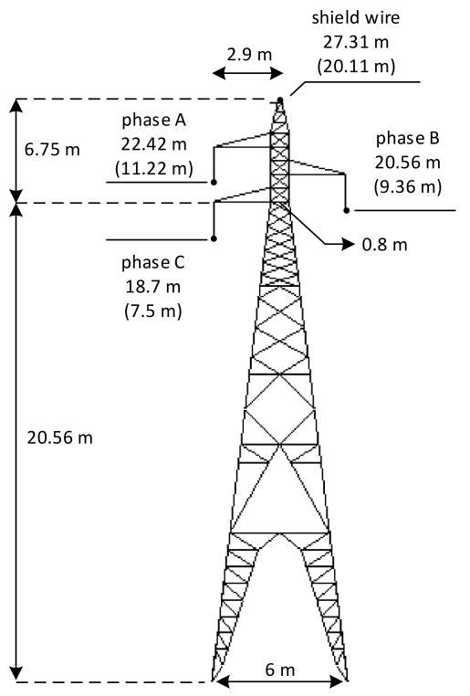  
(a)

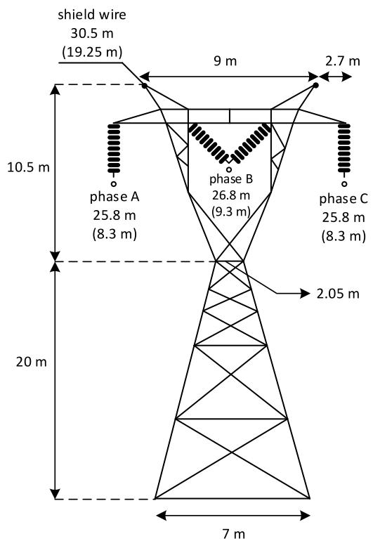  
(b)   
Fig. 1. Tower geometry of the tested (a) 138 kV line, and (b) 230 kV line.

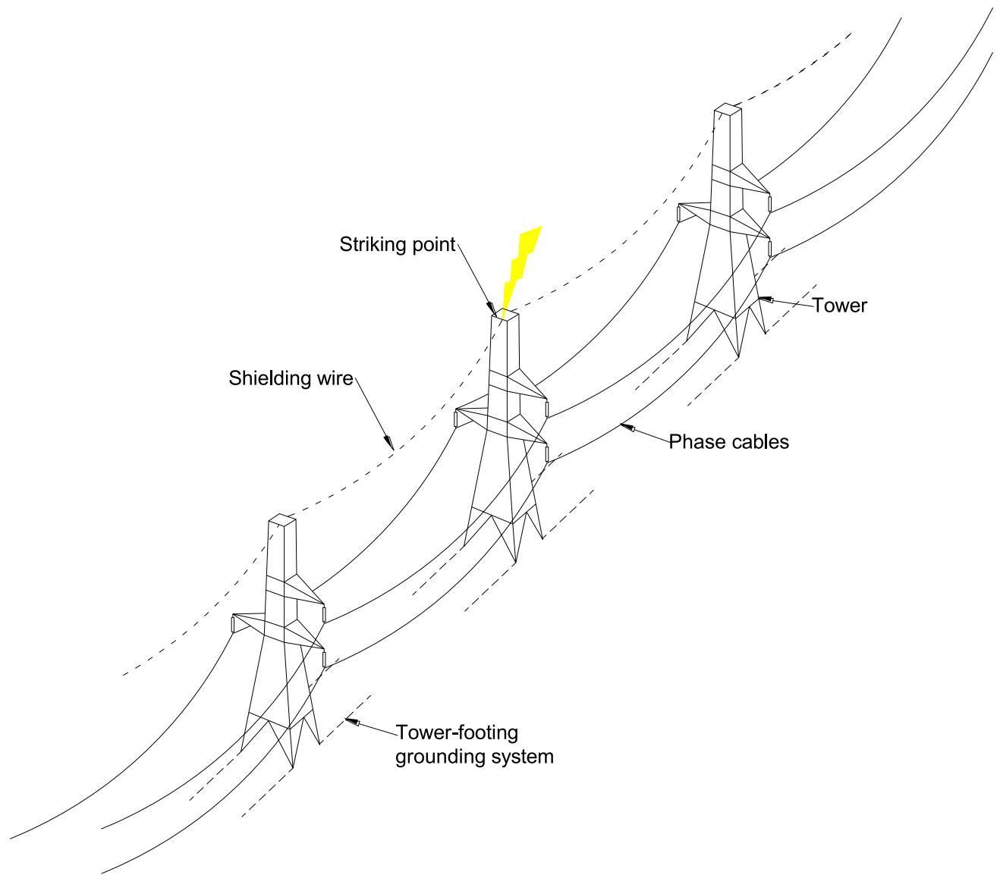  
Fig. 2. Schematic representation of the simulated system corresponding to a direct strike to the top of a tower flanked by adjacent towers (only two represented in the figure).

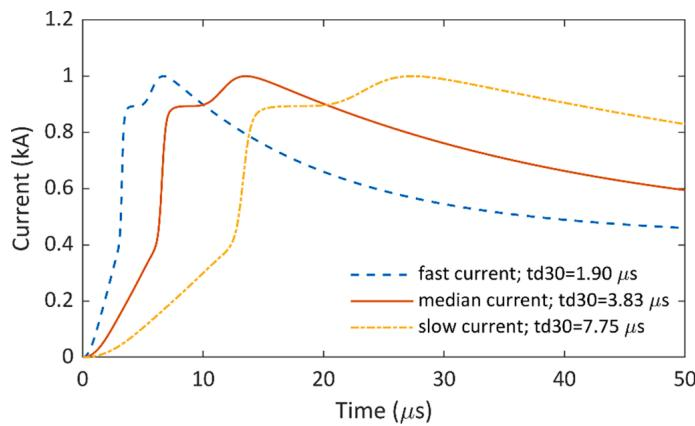  
Fig. 3. Lightning current waveforms representative of first strokes measured at Mount San Salvatore. The three considered values for the risetime (1.9, 3.83 and 7.75 μs) correspond respectively to the percentages (90%, 50%, and 10%) of cases exceeding these values.

TLs, normally only first return stroke currents are considered, since on average they have an amplitude two to three times greater than subsequent strokes [22]. Furthermore, for an accurate assessment of lightning overvoltages across TL insulators, it is important to consider a realistic representation of the lightning current waveform. According to measurements performed on instrumented towers [21,23,24], the first return stroke currents are characterized by a pronounced initial concavity at the front, by the occurrence of multiple peaks (with the second peak usually being the highest), and the maximum steepness occurring close to the first peak. The current waveforms shown in Fig. 3 capture such main characteristics of real lightning currents and thus were chosen for the analyses presented in this work.

In the next sections, the modeling of the TL components for lightning performance studies is detailed. All simulations were performed in the Alternative Transients Program (ATP) [4].

# 2.1. Frequency dependence of electrical parameters of soil

For most soils, the magnetic permeability can be assumed constant and equal to that of vacuum; however, the electrical parameters, resistivity and permittivity, show a strong frequency dependence in the representative frequency range of lightning currents [25]. Several

formulas for modeling the frequency dependence of soil parameters have been proposed in the literature [26]. In this paper, the Alipio-Visacro model is considered, which is based on the measurement of the frequency response of 65 types of soils that presented low-frequency resistivity $( \rho _ { 0 } )$ values ranging from 60 to 18000 Ωm [27]. This model satisfies the principle of causality and is recommended by the CIGRE [25] to be considered in lightning-related studies. It states that the soil resistivity, $\rho _ { g } ( f )$ , and permittivity, $\varepsilon _ { g } ( f )$ , can be calculated at a given frequency f (Hz) by (1) and (2), respectively [25,27].

$$
\rho_ {g} (f) = \rho_ {0} \left(1 + 4. 7 \times 1 0 ^ {- 6} \times \rho_ {0} ^ {0. 7 3} \times f ^ {0. 5 4}\right) ^ {- 1} (\Omega \mathrm {m}) \tag {1}
$$

$$
\varepsilon_ {g} (f) = 9. 5 \varepsilon_ {0} \times 1 0 ^ {4} \times \rho_ {0} ^ {- 0. 2 7} \times f ^ {- 0. 4 6} + 1 2 \varepsilon_ {0} (\mathrm {F} / \mathrm {m}) \tag {2}
$$

where $\rho _ { 0 }$ is the soil DC resistivity and $\varepsilon _ { 0 }$ is the vacuum permittivity.

# 2.2. Transmission line model

Each line span is modeled with the solution of telegrapher’s equations in the time domain using Marti’s transmission line model [28] in ATP. This model is based on the decoupling of the multiconductor transmission line equations corresponding to a system of n overhead conductors into a set of n independent single-phase lines, each associated with a given propagation mode. The conversion from phase-domain quantities to modal-domain quantities is performed with the aid of a real and constant transformation matrix calculated at a user-selected frequency. Strictly speaking, the transformation matrix should be complex and frequency dependent. However, it has been shown that assuming a real and constant transformation matrix in the solution of the telegrapher’s equations leads to an accurate solution of transients on both single-circuit and double-circuit overhead transmission lines in most cases of practical interest [29,30].

In Marti’s model implemented in ATP, the characteristic impedance and the propagation function associated with each mode are fitted as sums of rational functions using Bode’s asymptotic method [28]. These are converted into the time domain as sums of exponential functions to enable the efficient calculation of the convolutions appearing in the solution of the transmission line equations using the method of characteristics. Both parameters (characteristic impedance and propagation function) depend on the per-unit-length series impedance Z and the shunt admittance Y of the line which, in general terms, can be written as (3) and (4), respectively [31].

$$
Z = Z _ {i} + Z _ {e} + Z _ {g} \tag {3}
$$

$$
Y = \left(Y _ {e} ^ {- 1} + Y _ {g} ^ {- 1}\right) ^ {- 1} \tag {4}
$$

where $Z _ { i }$ is the internal impedance of the conductors, calculated considering the skin effect, $Z _ { e }$ is the external impedance associated with the magnetic fields in the air, $Z _ { g }$ is the ground-return impedance associated with the penetration of the magnetic field in the ground, $Y _ { e }$ is the external admittance associated with the electric fields in the $\mathsf { a i r } ,$ and $Y _ { g }$ is the ground admittance associated with the penetration of the electric field in the ground. The calculation of $Z _ { i } , \ Z _ { e }$ and $Y _ { e }$ can be accurately performed for widely-spaced conductors [32], but the calculation of $Z _ { g }$ and of $Y _ { g }$ is model-dependent [31]. In Marti’s model implemented in ATP, each term of $Z _ { g }$ is calculated using a series expansion of Carson’s Eqs. (5) and (6) [7].

$$
Z _ {g i i} = \frac {j \omega \mu_ {0}}{\pi} \int_ {0} ^ {\infty} \frac {e ^ {- 2 h _ {i} \lambda}}{\sqrt {\lambda^ {2} + \gamma_ {g} ^ {2}} + \lambda} d \lambda \tag {5}
$$

$$
Z _ {g i j} = \frac {j \omega \mu_ {0}}{\pi} \int_ {0} ^ {\infty} \frac {e ^ {- (h _ {i} + h _ {j}) \lambda}}{\sqrt {\lambda^ {2} + \gamma_ {g} ^ {2}} + \lambda} \cos (r _ {i j}) d \lambda \tag {6}
$$

where $h _ { i }$ and $h _ { j }$ are the heights of conductors i and $j , r _ { i j }$ is the horizontal separation distance between conductors i and j, $\gamma _ { g } = \sqrt { j \omega \mu _ { 0 } \rho _ { g } ^ { - 1 } } , \mu _ { 0 }$ is the vacuum permittivity, $\rho _ { g }$ is the soil resistivity, assumed constant, and ω is the angular frequency. In ATP, the influence of $Y _ { g }$ is neglected, which is a reasonable assumption for the study of lightning transients on overhead lines in most cases of practical interest [12,33]. It must be noticed that Carson’s equations implicitly assume the dielectric constant of the soil to be unitary [31].

Here, to include the frequency dependence of the soil parameters and displacement currents on the calculation of the transmission line parameters, the ground-return impedance is calculated using Sunde’s equations [34], which are identical with (5) and (6), except that $\gamma _ { g } =$ $\sqrt { j \omega \mu _ { 0 } \{ \left[ \rho _ { g } ( f ) \right] ^ { - 1 } + j \omega \varepsilon _ { g } ( f ) \} }$ , and in which the frequency dependence of the soil parameters $\rho _ { g } ( f )$ and $\varepsilon _ { g } ( f )$ is considered and calculated using (1) and (2). Given the minor influence of $Y _ { g }$ in the frequency range associated with the injected lightning current, this parameter is neglected here as usually done in ATP. The line parameters (3) and (4) considering Sunde’s equations were calculated in Matlab. The transformation matrix was then determined by rotating the eigenvectors of the product YZ calculated at a given frequency to minimize their imaginary part and by retaining only the real part of it [5,35]. The characteristic impedance and propagation function of each mode were both fitted with the vector-fitting technique considering real poles only [36]. Finally, the poles and residues obtained for each case were written in a text file that was interfaced with ATP following the procedure explained in detail in [33].

# 2.3. Tower model

The 138-kV tower is modeled as a cascade of lossless transmission lines whose surge impedances are calculated using the revised Jordan’s formula, which was proposed and extended in [37] to consider vertical multiconductor systems. Using this model, the tower geometry of Fig. 1 (a) was divided into four sections, each one represented by four vertical parallel conductors. The lower portion of the tower was represented as a cascade of three transmission lines of same length (approximately 6.85 m), while its upper part was represented as a single, 6.75-m long, transmission line. The division of the tower into sections was carried out to consider the nonuniform separation between its conductors, which modifies the mutual coupling between them. Assuming the radius of the tower conductors equal to 5 cm, according to the tower datasheet, the following surge impedances were obtained for each section from the bottom to the top of the tower: $Z _ { 1 } = 1 2 1 \Omega , Z _ { 2 } = 1 7 1 \Omega , Z _ { 3 } = 2 2 3 \Omega $ , and $Z _ { 4 } = 2 7 2 \Omega$ .

Regarding the 230-kV line, the well-known expression for waisted towers was used to compute its surge impedance [18]. Considering the tower dimensions shown in Fig. 1(b), a value of $Z _ { T } = 1 5 3 \Omega$ was determined.

# 2.4. Insulation flashover

The integration model, also known as disruptive effect (DE) model, is used to determine whether a flashover will occur across the insulator strings due to lightning overvoltages [38]. This model assumes that each insulation configuration has an associated critical disruptive effect (DE ). If a nonstandard impulse voltage waveform leads to a value of DE that exceeds $D E _ { C } ,$ , a flashover will occur. The general equation for computing the disruptive effect associated to a nonstandard overvoltage $e ( t )$ across a line insulator is given by (7)

$$
D E = \int_ {t _ {0}} ^ {t} [ e (t) - V _ {0} ] ^ {k _ {d}} d t, t \geq t _ {0} \tag {7}
$$

where $t _ { 0 }$ is the time mark when $e ( t )$ exceeds $V _ { 0 } .$ In this paper, the following constants are adopted for the DE model as recommended in [38]: $D E _ { C } = ~ 1 . 1 5 0 6 ( C F O ) ^ { k _ { d } } , ~ k _ { d } = ~ 1 . 3 6 _ { \mathrm { { z } } }$ , and $\begin{array} { r l } { \frac { V _ { 0 } } { C F O } = } & { { } 0 . 7 7 } \end{array}$ . When computing the $D E ,$ , the calculation is cut off when the insulator voltage drops below the threshold $V _ { 0 } ;$ thus, in this paper the evaluated DE is basically associated with the overvoltage wavefront.

The peak value of the lightning current that produces an overvoltage with a DE exceeding the $D E _ { C }$ of the line insulator, i.e., leading to a line flashover, is called critical current $I _ { C } .$ In this paper, the probability of the peak value $I _ { P }$ of a lightning current to exceed the critical current is considered to have a log-normal probability density function and is given by (8) [39]

$$
P \left(I _ {P} > I _ {C}\right) = 0. 5 \operatorname {e r f c} \left(u _ {0}\right) \tag {8}
$$

where erfc(− ) is the complementary error function and $\begin{array} { r } { u _ { 0 } = \frac { \ln ( I _ { C } ) - \ln ( \mu _ { I } ) } { \sqrt { 2 } \sigma _ { l n I } } . } \end{array}$

Considering the median first stroke current shown in ${ \mathrm { F i g . ~ } } 3 ,$ the following parameters are adopted in (8) to compute the probability of lightning currents with peak exceeding the critical one, according to Berger’s data: $\mu _ { I } = 3 0$ kA and $\sigma _ { l n I } = 0 . 6 1 \ [ 2 1 , 2 2 ]$ .

It is known that there is a correlation between the peak value and the front time of first stroke currents: typically, currents with shorter front time are expected to have lower peak values, while currents with longer front time are expected to have higher peak values. In order to roughly account for this effect in the analyzes relative to the currents shown in Fig. 3 with td30 values of 10% and 90%, the concept of conditional probability is adopted. It can be shown that the conditional probability density function of y for a given $x ( x = x _ { o } )$ , assuming that both y and x follow log-normal distributions, is given by [39]

$$
p \left(y \mid x = x _ {o}\right) = \frac {\exp \left[ - \frac {\left(\ln y - b\right) ^ {2}}{2 \sigma^ {2}} \right]}{y \sigma \sqrt {2 \pi}} \tag {9}
$$

where

$$
b = \ln y _ {m} + \rho_ {c} \frac {\sigma_ {l n y}}{\sigma_ {l n x}} \left(\ln x _ {o} - \ln x _ {m}\right) \tag {10}
$$

and

$$
\sigma = \sigma_ {l n y} \sqrt {1 - \rho_ {c} ^ {2}} \tag {11}
$$

In (10) and $( 1 1 ) , \rho _ { c }$ is the correlation coefficient between x and $y .$ . Finally, considering (9)-(11), we have a new log-normal distribution of y with a median value of $y _ { m c } ,$ which is the antilog of b, and a standard deviation given by (11).

Assuming that y is the lightning current peak $( I _ { p } )$ , x is the virtual front time (td30), and $\rho _ { c } = 0 . 4 7$ according to Berger’s measurements [22,39], the following parameters for the probability density functions of the peak current value, respectively for the fast and slow waveforms shown in Fig. 3, are obtained: $\mu _ { I } = 2 0 . 8 \mathrm { k A }$ and $\sigma _ { l n I } = 0 . 5 4 ; \mu _ { I } = 4 3 . 3 \mathrm { k A }$ and $\sigma _ { l n I } = 0 . 5 4$ .

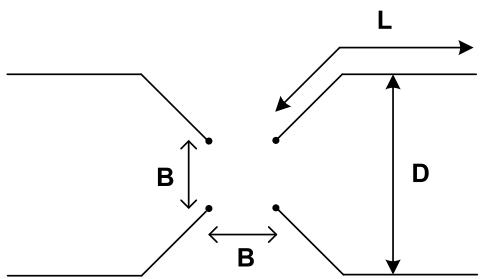  
Fig. 4. Typical tower grounding system.

# 2.5. Tower-footing impedance

The grounding system of the tower is illustrated in Fig. 4 (B is 6 m or 7 m, while D is 20 m or 30 m for the 138-kV and 230-kV lines, respectively). It consists of four counterpoise wires of 7-mm radius with burial depth of 0.5 m. The total length L of the counterpoise wires is selected according to the value of low-frequency soil resistivity ${ \bf \nabla } \rho _ { 0 } ,$ as indicated in Table 1.

As shown in [40], the frequency dependence of soil parameters markedly influences the lightning performance of grounding electrodes and the transmission line performance. Thus, in all simulations of this paper, the frequency-dependent behavior of the tower-footing grounding impedance is included in ATP as described briefly below.

First, the harmonic impedance $Z ( j \omega )$ of the tower-footing grounding is determined using the accurate Hybrid Electromagnetic Model [41], in a frequency range from dc to 10 MHz. In the calculations, the frequency dependence of the soil parameters is taken into account using (1) and (2). After determining the harmonic impedance $Z ( j \omega )$ , a pole-residue model of the associated admittance $Y ( j \omega ) = 1 / \ Z ( j \omega )$ is obtained using the vector fitting technique [36]. Finally, a circuit equivalent is synthesized from the passive pole-residue model corresponding to the grounding admittance, which can be easily implemented in time-domain electromagnetic transient simulators. This approach to include the frequency-dependent behavior of grounding electrodes in time-domain simulators is well established and documented in the literature [17,42].

# 3. Results

# 3.1. Simulated lightning overvoltages

Fig. 5 shows the lightning overvoltages across the lower phase insulator of the 138 kV line and Fig. 6 shows the overvoltage across the external phase insulator of the 230 kV line, both due to a direct strike at the tower top considering the median first stroke current depicted in Fig. 3 (but with amplitude equal to 31 kA), for low-frequency soil resistivities of 200, 1000, 5000 and 10000 Ωm. The lightning overvoltages were determined considering the following two approaches for the calculation of the ground return impedance: (i) $Z _ { g }$ calculated with Carson’s formulation with $\rho = \rho _ { 0 }$ (labeled as “Carson, $\rho = { \rho _ { 0 } } ^ { \prime \prime } ) ;$ ; and (ii) $Z _ { g }$ calculated with Sunde’s formulation (which takes into account the displacement currents in the soil) assuming frequency-dependent soil parameters according to Section 2.1 (labeled as “Sunde, $\rho ( \omega ) , \varepsilon ( \omega ) ^ { \ast } ) .$ . In both cases, the tower-footing grounding impedance was calculated including frequency-dependent soil parameters (see Section 2.5).

It is seen from the results of Figs. 5 and 6 that the two approaches considered for calculating the ground-return impedance yield nearly identical results for the 200-Ωm soil, and very similar results for the 1000 Ωm soil. On the hand, for the higher resistivity soils more significant differences are observed. In particular, the peak value of the voltages computed considering Sunde’s formula and frequencydependent soil parameters reaches higher amplitudes compared with those simulated using the classical Carson’s formula (around 3%-4% and 4%-5%, for 5000 Ωm and 10000 Ωm soils, respectively, considering 138 kV and 230 kV lines). The physical explanation of this result is given below.

In case of a lightning strike to the tower top, the current is divided into three components, two that are injected into the shield wires and one that goes down the tower. The current wave propagating down the tower creates a voltage wave whose effect is transmitted to the

Table 1 Length of the counterpoise wires as a function of low-frequency soil resistivity.   

<table><tr><td>(Ωm)</td><td>200</td><td>1000</td><td>5000</td><td>10000</td></tr><tr><td>L (m)</td><td>15</td><td>50</td><td>120</td><td>150</td></tr></table>

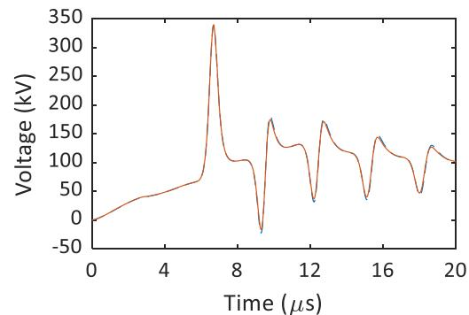

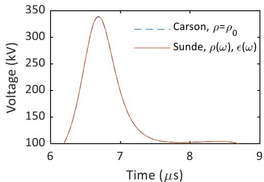  
(a) 200 Ωm

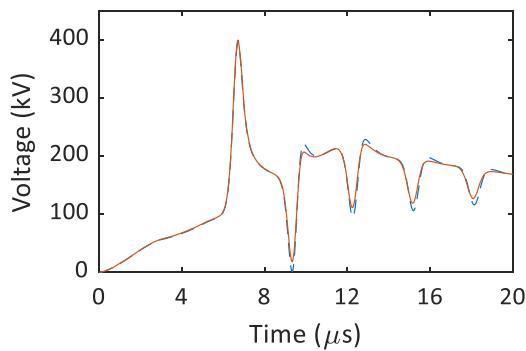

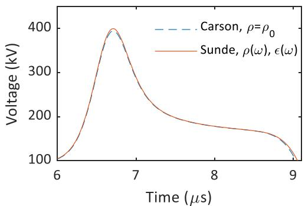  
(b) 1000 Ωm

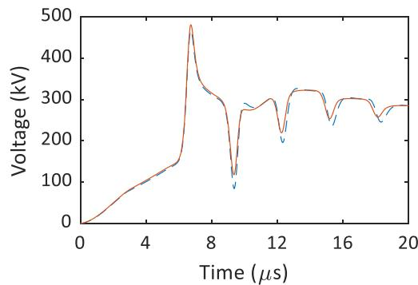

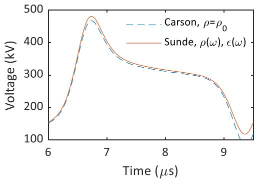  
(c) 5000 Ωm

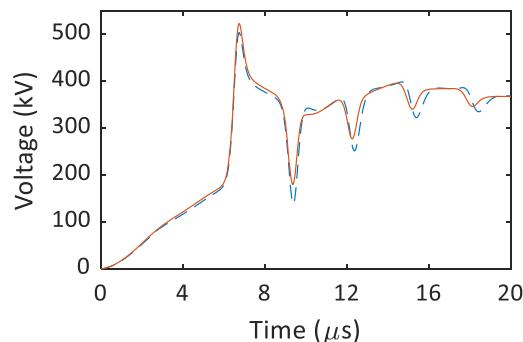

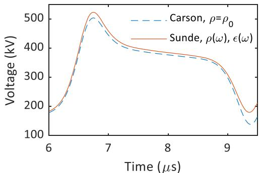  
(d) 10000 Ωm   
Fig. 5. Voltage across the lower phase insulator of the 138 kV line (zoom on the right) considering Carson’s and Sunde’s formulations (the latter with frequencydependent soil parameters), and soil resistivities of (a) 200 Ωm, (b) 1000 Ωm, (c) 5000 Ωm, and (d) 10000 Ωm.

crossarms. Voltages are also induced on the phase conductors due to the current wave flowing on the shield wire. The resulting overvoltage across each line insulator string is the difference between the crossarm voltage and the induced voltage on the phase conductor. As shown in [11], the tower voltage is nearly insensitive to the line model, but markedly influenced by the tower-footing impedance. On the other

hand, the induced voltages at the phase conductors are strongly affected by the transmission line model, especially for poorly conducting soils. According to [13], reduced values of induced voltages, due to the electromagnetic coupling between the shielding wires and phase conductors, are obtained when using Sunde’s formula along with frequency-dependent soil parameters. This explains the higher

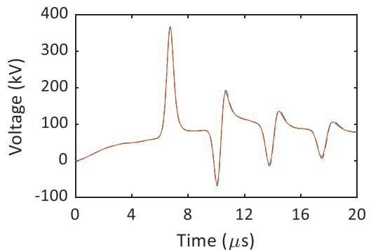

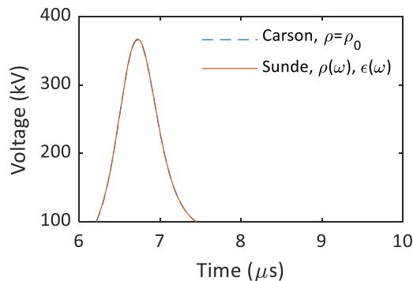  
(a) 200 Ωm

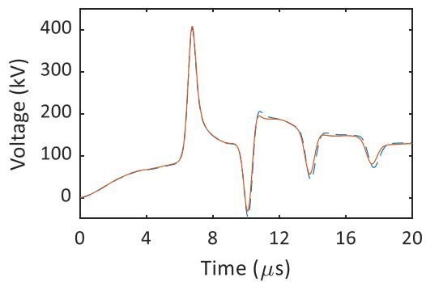

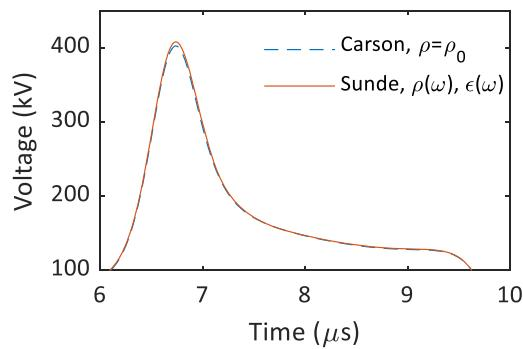  
(b) 1000 Ωm

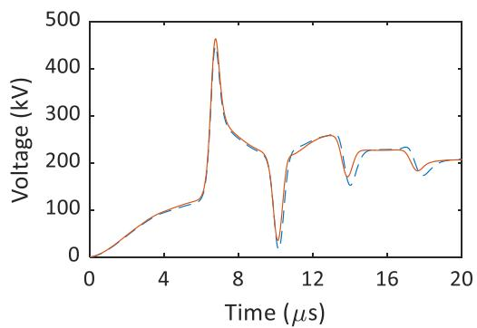

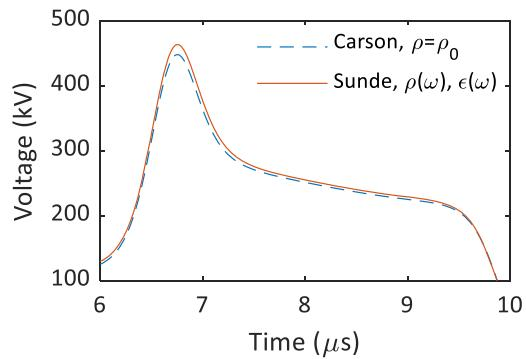  
(c) 5000 Ωm

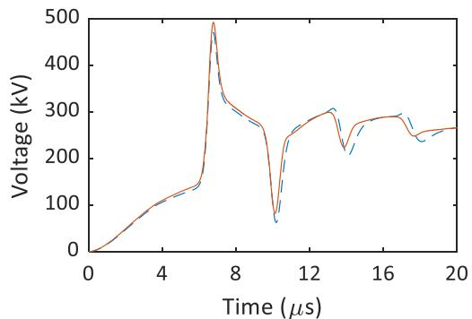

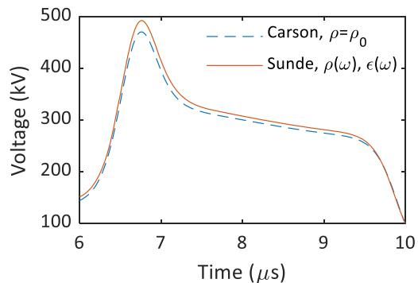  
(d) 10000 Ωm   
Fig. 6. Voltage across the external phase insulator of the 230 kV line (zoom on the right) considering Carson’s and Sunde’s formulations (the latter with frequencydependent soil parameters), and soil resistivities of (a) 200 Ωm, (b) 1000 Ωm, (c) 5000 Ωm, and (d) 10000 Ωm.

estimated overvoltages across the line insulators when using Sunde’s formula for computing the ground return impedance, in comparison with the classical Carson’s formula. It is worth mentioning that both the inclusion of displacement currents and frequency dependence of the electrical parameters of soil are responsible for the differences observed in the simulated voltages [12]. Interestingly, it is shown in [13] that if a

suitable value of soil permittivity is selected, the use of the Sunde’s formulation with constant or frequency-dependent soil parameters leads to similar transient overvoltage results.

Along the wave tail, minor differences between the voltages computed using the two different approaches for the calculation of the ground return impedance are observed. However, such differences are

likely to play a less relevant role in the determination of the occurrence (or not) of insulator string flashovers. As detailed in [1], insulation flashover along the overvoltage tail is expected to occur only in those cases where the tower-footing impedance is very high.

# 3.2. Critical currents

The insulator flashover occurrence depends not only on the peak value of the overvoltage, but also on its waveform. To further assess the influence of different approaches to calculate the ground-return impedance of the overhead lines on the lightning overvoltages, results that are similar to those shown in Figs. 5 and 6 were obtained by varying the current amplitude and determining the disruptive effect associated with each resulting overvoltage across the lower phase insulator string of the 138 kV line and the external insulator string of the 230 kV line. In this section, the three waveforms illustrated in Fig. 3 were considered in all cases; their peak values were varied to determine the critical peak current considering Carson’s and Sunde’s formulations to compute the line ground-return impedance.

The calculated values of $I _ { C } ,$ considering the median first stroke current depicted in Fig. 3, are indicated in Table 2 for both 138 kV and 230 kV lines, along with the probability of such current being exceeded, determined from (8) according to Berger’s data. In this table, Δ indicates the relative increase of this percentage when the line ground-return impedance is computed using Sunde’s formulation, and including frequency-dependent soil parameters, in comparison with Carson’s formulation. The results for the 200-Ωm soil were not included since the observed differences were negligible. Note that for both lines the value of the critical current decreases with increasing resistivity. This is due to the deterioration of the grounding performance with increasing soil resistivity, even with the use of long counterpoises wires, which leads to lower critical currents; that $\mathbf { i } s ,$ smaller current amplitudes can lead to flashovers.

It is seen that using Sunde’s formulation with frequency-dependent soil parameters leads to a slight reduction in the estimated critical currents. Accordingly, the percentage of first-stroke peak currents exceeding $I _ { C }$ (events leading to insulation flashover) is increased, as indicated by the parameter Δ. It is interesting to note that although the absolute difference between the critical currents estimated considering the two approaches for calculating the line ground-return impedance is not significant, the observed relative increase in the probability of such current being exceeded (parameter Δ) when Sunde’s formulation is used instead of Carson’s formulation can reach non-negligible levels, especially for high-resistivity soils and the 230 kV line. The rise in the probability of $I _ { C }$ being exceeded reaches around 7% and 12% for the 5000-Ωm soil and the 138 kV and 230 kV lines, respectively; for the 10000 Ωm soil, this rise reaches around 8% and 15% for the 138 kV and 230 kV lines, respectively. Finally, it is worth mentioning that the difference observed in the case of the 1000 Ωm soil and 230 kV line can be assumed negligible, since the probability of $I _ { C }$ being exceeded, regardless of the approach adopted for calculating the ground-return impedance, is very small according to (8).

Tables 3 and 4 indicate similar results of the computed critical currents, considering, respectively, the fast and slow lightning currents depicted in Fig. 3. Although the same general trend is observed for both

fast and slow currents, $\mathrm { i . e . , }$ an increase in the probability of the critical current being exceeded when Sunde’s formulation combined with frequency-dependent soil parameters is used instead of Carson’s formulation, some specific comments can be made.

Comparing Tables 2 and $^ { 3 , }$ it can be seen that the relative increase in the probability of $I _ { C }$ being exceeded, when Sunde’s formulation is used instead of Carson’s formulation, is greater for the fast first stroke current in comparison with the median one. This is because the fast current has higher frequency content and thus the consideration of the effect of the displacement currents and frequency dependence of soil parameters in the calculation of the ground-return impedance become increasingly important. On the other hand, comparing the results obtained for the slow and median currents (Table 4 and Table 2, respectively), the observed increase in the probability of $I _ { C }$ being exceeded when using Sunde’s formula instead of Carson’s formula are very close, although a smaller increase is observed for the case of the slow current and 10000 Ωm soil.

Finally, it is seen that the fast current leads to lower critical currents, while the slow current leads to higher ones, compared to the results obtained for the median first stroke current. This stems from the fact that reducing the front time of the lightning current, the impact of the negative reflection from the bottom of the tower in reducing the rise rate of the impinging overvoltages across line insulators is diminished. Thus, for the same grounding conditions, the shorter the front time, the lower the peak value of the current that can cause an insulator flashover.

# 3.3. Line backflashover rate

From the determined critical currents, the annual number of outages due to backflashover per 100 km of a transmission line for a given soil resistivity can be estimated by (12) [1]

$$
B F R = 0. 6 \times 0. 1 \times N _ {g} \times W \times P \left(I _ {P} > I _ {C}\right) \tag {12}
$$

where $P ( I _ { P } > I _ { C } )$ is the probability of the lightning peak current being greater than the minimum current that causes insulation flashover, the factor 0.6 is used to disregard the effect of strokes along the span, $N _ { g }$ is the ground flash density (flashes/km2 /year) and W is the attractive width of the line, which is given by (13)

$$
W = b + 2 8 h ^ {0. 6} \tag {13}
$$

where b is the distance between the shield wires (b = 0 if the TL has just one shield wire) and h is the tower height.

Table 5 presents the results of the expected backflashover rates for both 138 kV and 230 kV lines, for low-frequency soil resistivities of 1000, 5000 and 10000 Ωm, assuming the injection of a median firststroke current and considering the two approaches for the calculation of the ground return impedance. Table 5 also indicates the percentage differences between the results obtained considering the approaches based on the use of Carson’s and Sunde’s formulations (parameter Δ).

The estimated backflashover rates (per 100 km per year) range from 1.72 to 11.53 for the 138 kV line and from 0.14 to 1.30 for the 230 kV line considering the calculation of the TL ground-return impedance using Carson’s formulation. Considering Sunde’s formulation and frequency-dependent soil parameters, the same rates range from 1.78 to

Table 2 Estimated critical currents considering either Carson’s or Sunde’s formulations with the inclusion of frequency-dependent soil parameters in the latter – median first stroke current.   

<table><tr><td rowspan="3">(Ωm)</td><td colspan="4">138 kV line</td><td colspan="4">230 kV line</td></tr><tr><td colspan="2">Carson ρ = ρ0</td><td colspan="2">Sunde ρ(ω), ε(ω)</td><td>Δ (%)</td><td colspan="2">Carson ρ = ρ0</td><td>Δ (%)</td></tr><tr><td>IC (kA)</td><td>IP &gt; IC (%)</td><td>IC (kA)</td><td>IP &gt; IC (%)</td><td>IC (kA)</td><td>IP &gt; IC (%)</td><td>IC (kA)</td><td>IP &gt; IC (%)</td></tr><tr><td>1000</td><td>115</td><td>1.41</td><td>114</td><td>1.45</td><td>2.8</td><td>197</td><td>0.10</td><td>195</td></tr><tr><td>5000</td><td>78</td><td>5.89</td><td>76</td><td>6.28</td><td>6.6</td><td>143</td><td>0.52</td><td>140</td></tr><tr><td>10000</td><td>67</td><td>9.44</td><td>65</td><td>10.19</td><td>7.9</td><td>125</td><td>0.96</td><td>121</td></tr></table>

Table 3 Estimated critical currents considering either Carson’s or Sunde’s formulations with the inclusion of frequency-dependent soil parameters in the latter – fast first stroke current.   

<table><tr><td rowspan="3">(Ωm)</td><td colspan="4">138 kV line</td><td colspan="4">230 kV line</td></tr><tr><td colspan="2">Carson ρ = ρ0</td><td colspan="2">Sunde ρ(ω), ε(ω)</td><td>Δ (%)</td><td colspan="2">Carson ρ = ρ0</td><td>Sunde ρ(ω), ε(ω)</td></tr><tr><td>IC (kA)</td><td>IP &gt; IC (%)</td><td>IC (kA)</td><td>IP &gt; IC (%)</td><td>IC (kA)</td><td>IP &gt; IC (%)</td><td>IC (kA)</td><td>IP &gt; IC (%)</td></tr><tr><td>1000</td><td>104</td><td>0.14</td><td>103</td><td>0.15</td><td>7.1</td><td>168</td><td>0.005</td><td>166</td></tr><tr><td>5000</td><td>71</td><td>1.16</td><td>69</td><td>1.31</td><td>12.9</td><td>126</td><td>0.042</td><td>122</td></tr><tr><td>10000</td><td>61</td><td>2.34</td><td>59</td><td>2.70</td><td>15.4</td><td>110</td><td>0.10</td><td>106</td></tr></table>

Table 4 Estimated critical currents considering either Carson’s or Sunde’s formulations with the inclusion of frequency-dependent soil parameters in the latter – slow first stroke current.   

<table><tr><td rowspan="3">(Ωm)</td><td colspan="4">138 kV line</td><td colspan="4">230 kV line</td></tr><tr><td colspan="2">Carson ρ = ρ0</td><td colspan="2">Sunde ρ(ω), ε(ω)</td><td>Δ (%)</td><td colspan="2">Carson ρ = ρ0</td><td>Sunde ρ(ω), ε(ω)</td></tr><tr><td>IC (kA)</td><td>IP &gt; IC (%)</td><td>IC (kA)</td><td>IP &gt; IC (%)</td><td>IC (kA)</td><td>IP &gt; IC (%)</td><td>IC (kA)</td><td>IP &gt; IC (%)</td></tr><tr><td>1000</td><td>125</td><td>2.45</td><td>124</td><td>2.53</td><td>3.3</td><td>220</td><td>0.128</td><td>218</td></tr><tr><td>5000</td><td>82</td><td>11.72</td><td>80</td><td>12.52</td><td>6.8</td><td>153</td><td>0.96</td><td>150</td></tr><tr><td>10000</td><td>69</td><td>19.13</td><td>67</td><td>20.50</td><td>7.2</td><td>131</td><td>1.98</td><td>128</td></tr></table>

Table 5 Estimated line backflashover rate considering either Carson’s or Sunde’s for mulations with the inclusion of frequency-dependent soil parameters in the latter – median first stroke current.   

<table><tr><td rowspan="2">(Ωm)</td><td colspan="2">Outages/100-km/year (138 kV line)</td><td rowspan="2">Δ (%)</td><td colspan="2">Outages/100-km/year (230 kV line)</td><td rowspan="2">Δ (%)</td></tr><tr><td>Carson ρ = ρ0</td><td>Sunde ρ(ω), ε(ω)</td><td>Carson ρ = ρ0</td><td>Sunde ρ(ω), ε(ω)</td></tr><tr><td>1000</td><td>1.72</td><td>1.78</td><td>3.5</td><td>0.14</td><td>0.15</td><td>7.1</td></tr><tr><td>5000</td><td>7.20</td><td>7.68</td><td>6.7</td><td>0.70</td><td>0.79</td><td>12.9</td></tr><tr><td>10000</td><td>11.53</td><td>12.45</td><td>8.0</td><td>1.30</td><td>1.50</td><td>15.4</td></tr></table>

12.45 for the 138 kV line and from 0.15 to 1.50 for the 230 kV line. In general, the backflashover rate rises sharply with increasing soil resistivity. Consistently with the results of Table 2, Sunde’s formula combined with frequency-dependent soil parameters leads to higher backflashover rates compared to those estimated using the classical Carson’s formula. Considering the 138 kV line, the backflashover rate calculated with Sunde’s formula presents a rise of about 4%, 7% and 8% for the 1000, 5000 and 10000-Ωm soils, respectively. For the 230 kV line, the backflashover rate presents a rise of 7%, 13% and 15% for the same soils. This suggests that in case of lines crossing high-resistivity soils, the frequency dependence of the soil parameters should be included in the ground-return impedance calculation in simulations to compute lightning overvoltages.

Similarly, Table 6 and Table 7 present the results of the expected backflashover rates for both 138 kV and 230 kV lines, respectively considering the fast and slow first stroke currents shown in Fig. 3, and assuming the two approaches for the calculation of the ground return impedance. According to the results, for both fast and slow currents there is an increase in the backflashover rate, considering the calculation of the TL ground-return impedance using Sunde’s formulation combined

Table 6 Estimated line backflashover rate considering either Carson’s or Sunde’s formulations with the inclusion of frequency-dependent soil parameters in the latter – fast first stroke current.   

<table><tr><td rowspan="2">(Ωm)</td><td colspan="2">Outages/100-km/year (138 kV line)</td><td rowspan="2">Δ (%)</td><td colspan="2">Outages/100-km/year (230 kV line)</td><td rowspan="2">Δ (%)</td></tr><tr><td>Carson ρ = ρ0</td><td>Sunde ρ(ω), ε(ω)</td><td>Carson ρ = ρ0</td><td>Sunde ρ(ω), ε(ω)</td></tr><tr><td>1000</td><td>0.17</td><td>0.18</td><td>5.9</td><td>negligible</td><td>negligible</td><td>-</td></tr><tr><td>5000</td><td>1.42</td><td>1.60</td><td>12.7</td><td>negligible</td><td>negligible</td><td>-</td></tr><tr><td>10000</td><td>2.87</td><td>3.30</td><td>15.0</td><td>0.14</td><td>0.17</td><td>21.4</td></tr></table>

Table 7 Estimated line backflashover rate considering either Carson’s or Sunde’s formulations with the inclusion of frequency-dependent soil parameters in the latter – slow first stroke current.   

<table><tr><td rowspan="2">(Ωm)</td><td colspan="2">Outages/100-km/year (138 kV line)</td><td rowspan="2">Δ (%)</td><td colspan="2">Outages/100-km/year (230 kV line)</td><td rowspan="2">Δ (%)</td></tr><tr><td>Carson ρ = ρ0</td><td>Sunde ρ(ω), ε(ω)</td><td>Carson ρ = ρ0</td><td>Sunde ρ(ω), ε(ω)</td></tr><tr><td>1000</td><td>2.99</td><td>3.09</td><td>3.3</td><td>0.17</td><td>0.18</td><td>5.9</td></tr><tr><td>5000</td><td>14.33</td><td>15.30</td><td>6.8</td><td>1.31</td><td>1.45</td><td>10.7</td></tr><tr><td>10000</td><td>23.37</td><td>25.05</td><td>7.2</td><td>2.70</td><td>3.05</td><td>13.0</td></tr></table>

with frequency-dependent soil parameters. In line with the results of the previous section, this increase is more significant for the fast current. It is interesting to note that, although greater relative increases in the backflashover rate are observed for the fast current wave, in absolute terms it leads to lower backflashover rates. This is because although the critical current values obtained were lower for the fast current, the probability of such values being exceeded is low when considering the correlation between the peak current value and the front time.

# 4. Discussion

Lightning overvoltages across line insulators due to direct strikes are mainly governed by the tower-footing grounding system. Thus, the accurate representation of grounding in simulating lightning overvoltages is important to obtain reliable transmission line performance estimates. In recent years, it has been extensively shown that the frequency dependence of soil parameters strongly affects the lightning response of grounding electrodes, improving their performance [26,43,44]. Such improvement was shown in [40] to be responsible for 3-4% decrease in the estimated backflashover rates for low resistivity soils, and 43-49% decrease for high resistivity soils, for typical 138 kV and 230 kV lines. The strong impact of the frequency dependence of soil parameters on the response of the grounding electrodes is expected since they are in direct contact with soil.

However, the ground also influences the transmission line models used to simulate transients, albeit indirectly, namely in the calculation of the ground return parameters. The presented results show that the more accurate calculation of the ground effect, namely considering the displacement currents in soil and the frequency dependence of its parameters in the line ground-return impedance, has an influence on the simulation of lightning overvoltages. Since the ground effect on the line models is indirect, the impact is less significant. Nevertheless, according

to the results, the inclusion of the frequency dependence of soil parameters in the line model is responsible for an increase in the estimated transmission line backflashover rate. Thus, unlike the tower-footing impedance, neglecting the frequency dependence of soil parameters in the line model is a non-conservative approach, notably in the case of high-resistivity soils.

It is worth mentioning that the results were obtained for the injection of a median lightning current waveform and two other waveforms, with shorter and longer front times. For all cases, an increase in the backflashover rate was observed when considering the Sunde’s formulation combined with frequency-dependent soil parameters. This increase is more significant for the fast current wave due to its higher frequency content.

The obtained results indicate that in a more detailed analysis of the TL performance, for instance, using a Monte Carlo approach, it is desirable that the line model incorporates the displacement currents along with the frequency dependence of soil parameters.

Finally, it should be stressed that although this effect has only a moderate impact in the transmission line performance, it does increase the line backflashover rate. Thus, to be on the safe side, if accurate estimates of the lightning performance are required, the frequency dependence of soil parameters should be incorporated in the transmission line models, especially if the line crosses several high-resistivity soil sections along its route.

# 5. Summary

In this paper, the influence of considering both displacement currents and frequency-dependent soil parameters in the calculation of the TL ground-return impedance, with emphasis on the simulation of lightning overvoltages, was assessed. Simulations considering 138 kV and 230 kV overhead lines indicated that the inclusion of the phenomena mentioned above increases the line backflashover rate, especially if the line is located above a poorly conducting soil. All investigations were conducted using a time-domain electromagnetic transient simulator and Marti’s transmission line model, which indicates that the implementation of the mentioned effects in the calculation of the ground-return impedance is perfectly feasible in the widely disseminated EMT tools. We hope the results presented in this work will motivate such an implementation broadly in the main time-domain simulators.

# CRediT authorship contribution statement

Rafael Alipio: Conceptualization, Methodology, Software, Validation, Formal analysis, Writing – original draft, Visualization, Funding acquisition. Alberto De Conti: Conceptualization, Methodology, Formal analysis, Writing – review & editing, Funding acquisition. Naiara Duarte: Conceptualization, Methodology, Formal analysis, Writing – review & editing. Farhad Rachidi: Conceptualization, Formal analysis, Writing – review & editing, Supervision.

# Declaration of Competing Interest

The authors declare that they have no known competing financial interests or personal relationships that could have appeared to influence the work reported in this paper

# Data Availability

Data will be made available on request.

# Acknowledgments

This work was supported in part by Conselho Nacional de Desenvolvimento Científico e Tecnologico ´ (CNPq) under Grants 306006/

2019-7, 314849/2021-1 and 406177/2021-0, and in part by Fundaç˜ao de Amparo `a Pesquisa do Estado de Minas Gerais (FAPEMIG) under Grant TEC-PPM-00280-17 and APQ-01081-21.

# References

[1] IEEE Std 1243-1997, “IEEE guide for improving the lightning performance of transmission lines,” New York, 1997.   
[2] S. Visacro, F.H. Silveira, Lightning performance of transmission lines: requirements of tower-footing electrodes consisting of long counterpoise wires, IEEE Trans. Power Deliv. 31 (4) (Aug. 2016) 1524–1532, https://doi.org/10.1109/ TPWRD.2015.2494520.   
[3] Z.G. Datsios, P.N. Mikropoulos, T.E. Tsovilis, Closed-form expressions for the estimation of the minimum backflashover current of overhead transmission lines, IEEE Trans. Power Deliv. 36 (2) (2021) 522–532, https://doi.org/10.1109/ TPWRD.2020.2984423.   
[4] EMTP User Group, Alternative Transients Program (ATP): Rule Book, Leuven EMTP Center, Leuven, Belgium, 1987.   
[5] H.W. Dommel, Electromagnetic Transients Program. Reference Manual (EMTP Theory Book), Bonneville Power Administration, Portland, 1986.   
[6] Manitoba Hydro International Ltd., “PSCAD/EMTDC User’s Manual, ver. 4.6.” Winnipeg, MB, Canada, 2018.   
[7] J.R. Carson, Wave propagation in overhead wires with ground return, Bell Syst. Tech. J. 5 (1926) 539–554.   
[8] F. Rachidi, C.A. Nucci, M. Ianoz, C. Mazzetti, Influence of a lossy ground on lightning-induced voltages on overhead lines, IEEE Trans. Electromagn. Compat. 38 (3) (1996) 250–264, https://doi.org/10.1109/15.536054.   
[9] A.C.S. de Lima, C. Portela, Inclusion of frequency-dependent soil parameters in transmission-line modeling, IEEE Trans. Power Deliv. 22 (1) (Jan. 2007) 492–499, https://doi.org/10.1109/TPWRD.2006.881582.   
[10] C.A. Nucci, F. Rachidi, Interaction of electromagnetic fields with electrical networks generated by lightning, Chapter 12. The Lightning Flash, 2nd ed., IET, London, 2014, pp. 559–610.   
[11] R. Alipio, A. De Conti, A.S. de Miranda, and M.T. Correia de Barros, “Lightning overvoltages including frequency-dependent soil parameters in the transmission line model,” in Proceedings of the International Conference on Power Systems Transients (IPST2019), 2019, pp. 1–6.   
[12] F.A. Diniz, R.S. Alípio, R.A.R. de Moura, Assessment of the influence of ground admittance correction and frequency dependence of electrical parameters of ground of simulation of electromagnetic transients in overhead lines, J. Control. Autom. Electr. Syst. 33 (3) (Jun. 2022) 1066–1080, https://doi.org/10.1007/ s40313-021-00849-z.   
[13] R. Alipio, A. De Conti, and F. Rachidi, “Simulation of high-frequency transients in overhead lines including frequency-dependent soil parameters: a FDTD approach,” in Proceedings of the 35th International Conference on Lightning Protection (ICLP) and XVI International Symposium on Lightning Protection (SIPDA), Sep. 2021, pp. 01–06, doi: 10.1109/ICLPandSIPDA54065.2021.9627374.   
[14] N. Theethayi, Y. Baba, F. Rachidi, R. Thottappillil, On the choice between transmission line equations and full-wave maxwell’s equations for transient analysis of buried wires, IEEE Trans. Electromagn. Compat. 50 (2) (May 2008) 347–357, https://doi.org/10.1109/TEMC.2008.919040.   
[15] R. Shariatinasab, J. Ghayur Safar, J. Gholinezhad, J. He, Analysis of Lightning-Related Stress in Transmission Lines Considering Ionization and Frequency-Dependent Properties of the Soil in Grounding Systems, IEEE Trans. Electromagn. Compat. 62 (6) (Dec. 2020) 2849–2857, https://doi.org/10.1109/ TEMC.2020.2990207.   
[16] W.S. Castro, I.J.S. Lopes, S.L.V. Miss´e, J.A. Vasconcelos, Optimal placement of surge arresters for transmission lines lightning performance improvement, Electr. Power Syst. Res. 202 (Jan. 2022), 107583, https://doi.org/10.1016/j. epsr.2021.107583.   
[17] M.R. Alemi, K. Sheshyekani, Wide-band modeling of tower-footing grounding systems for the evaluation of lightning performance of transmission lines, IEEE Trans. Electromagn. Compat. 57 (6) (Dec. 2015) 1627–1636, https://doi.org/ 10.1109/TEMC.2015.2453512.   
[18] Working Group C4.23, “CIGRE TB 839: procedures for estimating the lightning performance of transmission lines – new aspects,” Paris, 2021.   
[19] A. De Conti, S. Visacro, Analytical representation of single- and double-peaked lightning current waveforms, IEEE Trans. Electromagn. Compat. 49 (2) (May 2007) 448–451, https://doi.org/10.1109/TEMC.2007.897153.   
[20] A.J. Oliveira, M.A.O. Schroeder, R.A.R. Moura, M.T. Correia de Barros, and A.C.S. Lima, “Adjustment of current waveform parameters for first lightning strokes: Representation by Heidler functions,” in Proceedings of the International Symposium on Lightning Protection (XIV SIPDA), Oct. 2017, pp. 121–126, doi: 10.1109/SIPDA.2017.8116910.   
[21] K. Berger, R.B. Anderson, H. Kroninger, Parameters of lightning flashes, Electra (80) (1975) 223–237.   
[22] Working Group C4.407, “CIGRE TB 549: lightning parameters for engineering applications,” CIGRE, Paris, 2013.   
[23] J. Takami, S. Okabe, Observational results of lightning current on transmission towers, IEEE Trans. Power Deliv. 22 (1) (Jan. 2007) 547–556, https://doi.org/ 10.1109/TPWRD.2006.883006.   
[24] F.H. Silveira, S. Visacro, Lightning Parameters of a tropical region for engineering application: statistics of 51 flashes measured at morro do cachimbo and

expressions for peak current distributions, IEEE Trans. Electromagn. Compat. (2019) 1–6, https://doi.org/10.1109/TEMC.2019.2926665.   
[25] Working Group C4.33, Impact of soil-parameter frequency dependence on the response of grounding electrodes and on the lightning performance of electrical systems (WG C4.3), CIGRE, 2019.   
[26] D. Cavka, N. Mora, F. Rachidi, A comparison of frequency-dependent soil models: application to the analysis of grounding systems, IEEE Trans. Electromagn. Compat. 56 (1) (Feb. 2014) 177–187, https://doi.org/10.1109/ TEMC.2013.2271913.   
[27] R. Alipio, S. Visacro, Modeling the frequency dependence of electrical parameters of soil, IEEE Trans. Electromagn. Compat. 56 (5) (Oct. 2014) 1163–1171, https:// doi.org/10.1109/TEMC.2014.2313977.   
[28] J. Marti, Accurate modelling of frequency-dependent transmission lines in electromagnetic transient simulations, IEEE Trans. Power Appar. Syst. 101 (1) (Jan. 1982) 147–157, https://doi.org/10.1109/TPAS.1982.317332. PAS-.   
[29] A. Tavighi, J. R. Martí, and J. A. G. Robles, “Comparison of the fdLine and ULM frequency dependent EMTP line models with a reference laplace solution,” in Proceedings of the International Conference on Power Systems Transients (IPST2015), 2015, pp. 1–8.   
[30] O.E.S. Leal, A. De Conti, Evaluation of the extended modal-domain model in the calculation of lightning-induced voltages on parallel and double-circuit distribution line configurations, Electr. Power Syst. Res. 194 (May 2021), 107100, https://doi.org/10.1016/j.epsr.2021.107100.   
[31] A. Ametani, Y. Miyamoto, Y. Baba, N. Nagaoka, Wave propagation on an overhead multiconductor in a high-frequency region, IEEE Trans. Electromagn. Compat. 56 (6) (Dec. 2014) 1638–1648, https://doi.org/10.1109/TEMC.2014.2314720.   
[32] J.A. Martinez-Velasco, Power System Transients: Parameter Determination, CRC Press, 2010.   
[33] A. De Conti, M.P.S. Emídio, Extension of a modal-domain transmission line model to include frequency-dependent ground parameters, Electr. Power Syst. Res. 138 (2016) 120–130, https://doi.org/10.1016/j.epsr.2016.02.032.   
[34] E.D. Sunde, Earth Conduction Effects in Transmission Systems, Dover Publications, New York, 1968.

[35] A.B. Fernandes, W.L.A. Neves, Phase-domain transmission line models considering frequency-dependent transformation matrices, IEEE Trans. Power Deliv. 19 (2) (Apr. 2004) 708–714, https://doi.org/10.1109/TPWRD.2003.822536.   
[36] B. Gustavsen, A. Semlyen, Rational approximation of frequency domain responses by vector fitting, IEEE Trans. Power Deliv. 14 (3) (Jul. 1999) 1052–1061, https:// doi.org/10.1109/61.772353.   
[37] A. De Conti, S. Visacro, A. Soares, M.A.O. Schroeder, Revision, extension, and validation of jordan’s formula to calculate the surge impedance of vertical conductors, IEEE Trans. Electromagn. Compat. 48 (3) (Aug. 2006) 530–536, https://doi.org/10.1109/TEMC.2006.879345.   
[38] A.R. Hileman, Insulation Coordination for Power Systems, 1 edition, CRC Press, 1999.   
[39] P. Chowdhuri, et al., Parameters of lightning strokes: a review, IEEE Trans. Power Deliv. 20 (1) (Jan. 2005) 346–358, https://doi.org/10.1109/ TPWRD.2004.835039.   
[40] S. Visacro, F.H. Silveira, The Impact of the frequency dependence of soil parameters on the lightning performance of transmission lines, IEEE Trans. Electromagn. Compat. 57 (3) (Jun. 2015) 434–441, https://doi.org/10.1109/ TEMC.2014.2384029.   
[41] S. Visacro, A. Soares, HEM: a model for simulation of lightning-related engineering problems, IEEE Trans. Power Deliv. 20 (2) (Apr. 2005) 1206–1208, https://doi. org/10.1109/TPWRD.2004.839743.   
[42] A. De Conti, R. Alipio, Single-port equivalent circuit representation of grounding systems based on impedance fitting, IEEE Trans. Electromagn. Compat. 61 (5) (Oct. 2019) 1683–1685, https://doi.org/10.1109/TEMC.2018.2870730.   
[43] R. Alipio, S. Visacro, Frequency dependence of soil parameters: effect on the lightning response of grounding electrodes, IEEE Trans. Electromagn. Compat. 55 (1) (Feb. 2013) 132–139, https://doi.org/10.1109/TEMC.2012.2210227.   
[44] M. Akbari, K. Sheshyekani, M.R. Alemi, The effect of frequency dependence of soil electrical parameters on the lightning performance of grounding systems, IEEE Trans. Electromagn. Compat. 55 (4) (Aug. 2013) 739–746, https://doi.org/ 10.1109/TEMC.2012.2222416.