# Accuracy Evaluation of Electromagnetic Transients Simulation Algorithms

Huanfeng Zhao , Student Member, IEEE, Yi Zhang , Fellow, IEEE, and Aniruddha M. Gole, Fellow, IEEE

Abstract—This paper introduces a novel frequency domain technique to globally evaluate the accuracy of electro-magnetic transient simulations. It is shown that simulation accuracy at low frequencies can sometimes be poorer than at high frequency. A modified approach which quantifies accuracy from a driving point as a function of frequency is also introduced that uses the Bilinear Transformation and Norton equivalents, to produce a “simulation accuracy spectrum”. This approach can be applied to large systems without explicitly forming state space equations. It also permits the accuracy analysis of networks with distributed components such as frequency dependent transmission lines. Two examples are used to verify the proposed technique, a small network with a frequency dependent transmission line modeled by the universal line model; and the IEEE 39 bus system connected with an LCC-HVdc system.

Index Terms—Simulation accuracy, bilinear transformation, electromagnetic transients simulation, equivalent admittance, frequency dependent transmission line, controllability, observability.

# I. INTRODUCTION

N MODERN power system analysis, electro-magnetic tran-sient (EMT) simulation tools are widely used to investigate transient phenomena. As shown in Table I, depending on the phenomenon of interest, EMT simulation can cover a wide frequency range, from dc (0 Hz) to several tens of megahertz [1], [2].

For specific studies, higher accuracy is required in certain frequency ranges. For instance, in order to accurately study the effect of lightning surges on transmission lines, the simulation model should be highly accurate in the frequency range from 10k Hz to say, 3 MHz, but could be less accurate at low frequencies.

In reference [3], [4], the numerical accuracy is determined for individual dynamic elements such as capacitors and inductors. The mapping from discrete to continuous frequency domain is used to compare the simulation result with the theoretical

Manuscript received December 17, 2020; revised May 20, 2021; accepted July 3, 2021. Date of publication July 26, 2021; date of current version May 24, 2022. This work was supported by the IRC program of NSERC, Canada and by Mitacs, Canada. Paper no. TPWRD-01852-2020. (Corresponding author: Huanfeng Zhao.)

Huanfeng Zhao and Aniruddha M. Gole are with the Department of Electrical and Computer Engineering, University of Manitoba, Winnipeg, MB R3T 5V6, Canada (e-mail: huanfengzhao@gmail.com; Gole@umanitoba.ca).

Yi Zhang is with RTDS Technologies, Winnipeg, MB R3T 2E1, Canada (e-mail: yzhang@rtds.com).

Color versions of one or more figures in this article are available at https://doi.org/10.1109/TPWRD.2021.3099008.

Digital Object Identifier 10.1109/TPWRD.2021.3099008

TABLE I POWER SYSTEMS PHENOMENA AND FREQUENCY RANGES OF INTEREST [1], [2]   

<table><tr><td>Phenomenon of Interest</td><td>Frequency Range</td></tr><tr><td>Transformer energization, ferro-resonance</td><td>0.1 Hz-1000Hz</td></tr><tr><td>Load Rejection</td><td>0.1 Hz-3000Hz</td></tr><tr><td>Lightning Surges</td><td>10 kHz-3MHz</td></tr><tr><td>Disconnector Switching and faults in GIS</td><td>100 kHz-50MHz</td></tr></table>

result in the frequency domain. However, this technique does not accurately reflect the simulation accuracy of the whole system. Reference [4] investigates the accuracy of simulation of individual elements considering mixed integration methods which are a combination of multiple different integration algorithms. However, all these methods focus on an individual component and, as is shown in this paper, can lead to incorrect conclusions of the accuracy of the network. Reference [5] examines the numerical accuracy based on the truncation error of the integration algorithm. The influence of distributed elements like transmission lines has also hitherto not been considered.

The key contributions from the paper to accuracy analysis of EMT simulations can be thus summarized:

a) The paper exposes a limitation of previous component level accuracy evaluation approaches by showing that it is not always true that simulation error for high frequencies is larger than for lower frequencies.   
b) In order to overcome this limitation, the paper proposes (Section III) a State Space Equation based theoretical method to globally evaluate the simulation accuracy of linear lumped parameter networks.   
c) Subsequently, for the purpose of applying the proposed method to large power networks, a new concept of a “Simulation Accuracy Spectrum” is introduced in Section IV, which plots the accuracy from any driving port as a function of frequency. The accuracy spectrum can be computed without forming the state space equations and therefore can easily be applied larger networks that can include distributed parameters.   
d) The paper, for the first time introduces an approach to analyze the accuracy of networks that have frequency dependent transmission line elements. The Simulation Accuracy Spectrum concept is suitably extended cater to this situation.

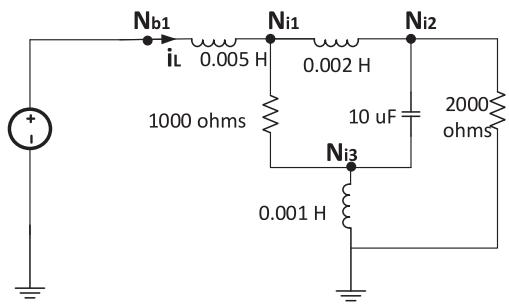  
Fig. 1. Simple RLC circuit.

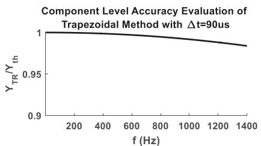  
Fig. 2. Simulation accuracy for an inductor.

# II. PREVIOUS APPROACHES FOR ACCURACY EVALUATION AND THEIR LIMITATIONS

# A. Component Level Accuracy Evaluation

In [3], [4] the authors compare the frequency response of an individual dynamic elements, e.g., inductor, capacitors, etc., to the frequency response of its corresponding discrete time domain representation. The discretized representation is obtained by applying a selected integration method (e.g., trapezoidal rule) with a time-step Δt and then converting the resulting difference equation into the frequency domain using the mapping:

$$
z ^ {- 1} = e ^ {- j \cdot \omega \cdot \Delta t} \tag {1}
$$

Pioneering work by the authors of [3] showed the errors in magnitude and phase as a function of frequency and time-step for individual inductor or capacitor elements for different integration methods. Trapezoidal integration was shown to have a magnitude error but not a phase angle error for the admittance, whereas the Backward Euler method was shown to exhibit both magnitude and phase error which resulted in increased damping. One conclusion of this approach was that the accuracy degraded with frequency. In contrast, this paper will show that when multiple elements are present, additional considerations must be taken when analyzing accuracy and it may happen that in certain cases the accuracy is better at higher frequency than at certain lower frequencies.

# B. Limitation of Component Level Accuracy Evaluation

Consider the RLC circuit in Fig. 1. Following the steps in [3], the simulation accuracy for the 0.005 H inductor connected to node $N _ { b 1 }$ is shown in Fig. 2, for simulation with trapezoidal integration and a time-step of $\Delta t = 9 0 \mu \mathrm { s }$ . The y axis shows the ratio of the simulated inductor admittance and original inductor admittance. Reference [3] also shows that the phase of any

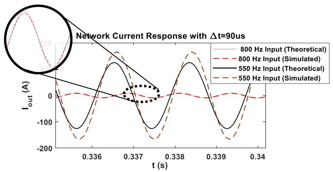  
Fig. 3. Comparison of simulation and theoretical results for RLC circuit.

inductor or capacitor simulated by the trapezoidal method has no numerical error. Therefore, the ensuing conclusion is that the simulation accuracy worsens as the excitation frequency increases. The same applies to the case of a capacitor.

In order to verify the conclusion, the lumped network as shown in Fig. 1 is implemented on an electromagnetic transient (EMT) simulator. A 132.79 V (RMS value) voltage source with zero degree phase is used as an input. Two simulations are conducted, one with a source frequency of 560 Hz and the other with a frequency of 800 Hz. The corresponding current response $i _ { o u t }$ is as in Fig. 3.

It is clearly seen that when the input voltage frequency is 800 Hz, the current response matches the theoretical one well. However, if the frequency is reduced to 550 Hz, the current is 1.33 times larger, and displaced by 15.84 degrees from that obtained from theory. This is contrary to the conclusion of earlier papers which state that accuracy should always degrade as frequency increases for a given time-step.

Therefore, in order to properly determine the simulation accuracy, the circuit must be considered in its entirety, and not element by element.

# III. PROPOSED METHODS FOR ACCURACY EVALUATION OF EMT SIMULATION

# A. Theoretical Foundation for Simulation Accuracy [6]

Let the network equations be represented in state variable (SV) form:

$$
\dot {\mathbf {x}} (t) = \mathbf {A} \cdot \mathbf {x} (t) + \mathbf {B} \cdot \mathbf {u} (t) \tag {2}
$$

The corresponding discrete-time state equation for simulation using a time step Δt is:

$$
\mathbf {x} (n \cdot \Delta t) = \mathbf {G} \cdot \mathbf {x} ((n - 1) \cdot \Delta t) + \mathbf {H} \cdot \mathbf {u} (n \cdot \Delta t) \tag {3}
$$

Matrices G and H depend on the time-step and the selected integration method. For example, for trapezoidal integration they are as in (6) below.

Since all voltages and currents, in the circuit are linear combination of the SVs, the simulation accuracy of any of these can also be determined once the accuracy of SVs is computed.

In the frequency domain, the transfer function relating state variables $\mathbf { X } ( j \omega )$ to the input $\mathbf { U } ( j \omega )$ in the actual (continuous time) system is given by equation (4). In the discrete time domain

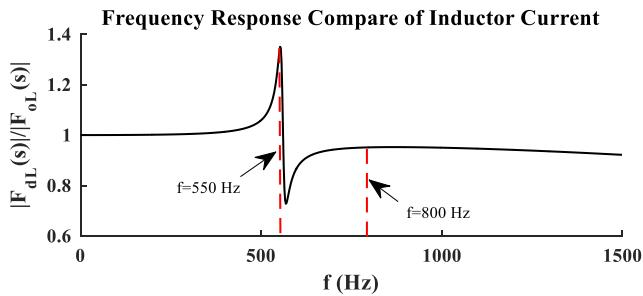  
Fig. 4. Simulation accuracy of inductor current.

(where x andu only assume values at integer multiples of the timestep, i.e., $\mathbf { x } ( n ) \equiv \mathbf { x } ( n \cdot \Delta t ) )$ . The frequency response of state variables X(z) resulting from the excitation $\mathbf { U } ( z )$ is given by equation (5):

For the original continuous system:

$$
\mathbf {X} (j \omega) = \mathbf {F} _ {o} (j \omega) \cdot \mathbf {U} (j w)
$$

$$
w h e r e \mathbf {F} _ {o} (j \omega) = (j \omega \mathbf {I} - \mathbf {A}) ^ {- 1} \cdot \mathbf {B} \tag {4}
$$

For the discrete system:

$$
\mathbf {X} (z) = \mathbf {F _ {d}} (z) \cdot \mathbf {U} (z)
$$

$$
w h e r e \mathbf {F} _ {\mathbf {d}} (z) = (\mathbf {I} - \mathbf {G} z ^ {- 1}) ^ {- 1} \cdot \mathbf {H} \tag {5}
$$

By the mapping function $z ^ { - 1 } = e ^ { - j \omega \Delta t }$ , the frequency response of the discrete system $\mathbf { F } _ { d } ( j \omega )$ can be calculated.

# B. Method 1: Global Evaluation of Simulation Accuracy

When the trapezoidal method is applied, the corresponding G and H matrices in (5) will be:

$$
\mathbf {G} = \left(\mathbf {I} - \frac {\mathbf {A} \cdot \Delta t}{2}\right) ^ {- 1} \left(\mathbf {I} + \frac {\mathbf {A} \cdot \Delta t}{2}\right)
$$

$$
\mathbf {H} = \left(\mathbf {I} - \frac {\mathbf {A} \cdot \Delta t}{2}\right) ^ {- 1} \cdot \mathbf {B} \cdot \Delta t \cdot \frac {1 + z ^ {- 1}}{2} \tag {6}
$$

Subsequently, substituting equation (6) into (5) gives the transfer function from the inputs U to all state variables X. Let us apply this technique to Fig. 1. Here U is a complex scalar as there is only one source and $\mathbf { F _ { d } }$ is a vector of dimension 3. $\operatorname { L e t } F _ { d L }$ be the element of $\mathbf { F _ { d } } ( j \omega )$ relating to state variable iL (inductor current). Thus, $F _ { d L } ( j \omega )$ is the frequency response for the simulated $i _ { L }$ . Let $F _ { o L } ( j \omega )$ be the corresponding theoretical frequency response of $i _ { L }$ for the original system. For a perfect simulation, $| F _ { d L } ( j \omega ) | / | F _ { o L } ( j \omega ) |$ should be unity, Fig. 4, shows a plot of $| F _ { d L } ( j \omega ) | / | F _ { o L } ( j \omega ) |$ as a function of frequency. The figure clearly predicts that at 550 Hz, the simulated current is 1.33 times its theoretical value, precisely as observed in the simulation results in Fig. 3.

# C. Implementation of the Proposed Method

The proposed simulation accuracy quantification method above is in the frequency domain, which implies that all elements are linear. In this paper, the nonlinear elements are considered as components in the external network that generate the transients

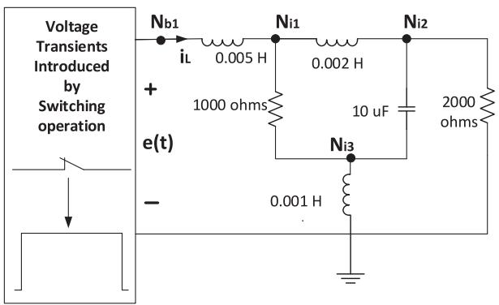

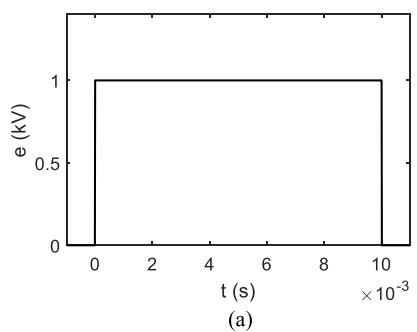  
Fig. 5. Demonstration example.

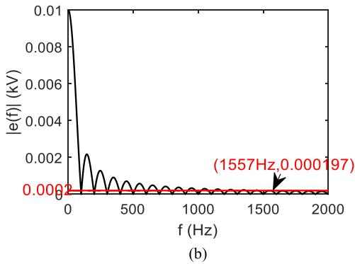  
Fig. 6 (a) Excitation transients in time domain. (b) Excitation transients in frequency domain.

that are applied to the linear part. They are not included in the accuracy analysis, although their presence does determine the range of frequencies of interest [1], [2] over which the accuracy spectrum of the remainder (“internal system”) is evaluated.

In this section, an example with transients excitation introduced by a switching operation is shown below to illustrate the application of the proposed method.

Consider the switching on and off of a dc voltage (7) at the input of the circuit in Fig. 5, as shown in Fig. 6(a). Its frequency spectrum is shown in Fig. 6(b).

$$
v (t) = \left\{ \begin{array}{l l} 1 k V, & \text {w h e n} 0 <   t <   0. 0 1 \\ 0 k V, & \text {w h e n} t <   0 \text {o r} t > 0. 0 1 \end{array} \right. \tag {7}
$$

For other phenomenon, references [1], [2] could be used to determine the corresponding frequency range of interest. It is clear that frequency components above 1557 Hz have a magnitude less than 2% of the lowest order component (dc) and 99.35% of the signal energy is contained in frequencies below

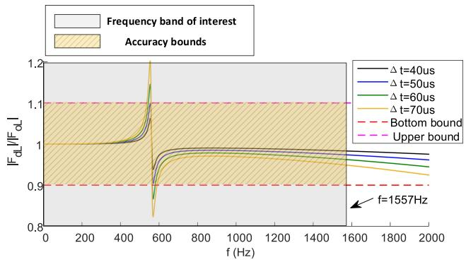  
Fig. 7. Simulation accuracy of inductor current as a function of frequency.

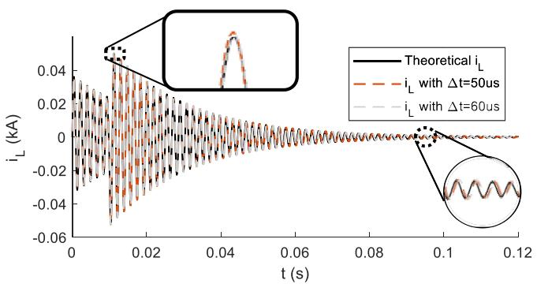  
Fig. 8. Comparison of time domain simulation and theoretical results for inductor current.

this. One could choose the [0 Hz, 1557 Hz] band as the frequency range of interest assuming higher frequencies can be neglected.

As in Section III.B, let $F _ { d L } ( j \omega )$ be the transfer function element relating the simulated inductor current $i _ { L }$ to the input and $F _ { o L } ( j \omega )$ be the corresponding theoretical transfer function. For a 100% accurate simulation, $| F _ { d L } ( j \omega ) | / | F _ { o L } ( j \omega ) |$ should be unity. Hence, the closeness of this ratio to unity can be used as a measure of simulation accuracy.

Fig. 7 shows plots for $| F _ { d L } ( j \omega ) | / | F _ { o L } ( j \omega ) |$ versus frequency for different time-steps obtained using the method in Section III.B. The dotted lines indicate 10% error bands (actual tolerances will be typically be lower). By observing this frequency response for time-steps ranging from 40 μs to $7 0 \mu \mathrm { s } ,$ the simulation accuracy is observed to exceed the 10% accuracy bounds when $\Delta { \mathfrak { t } } > 5 0 \mu { \mathrm { s } }$ for frequencies in the neighborhood of 550 Hz.

An EMT simulation is then implemented to verify the proposed evaluation. Since the circuit is simple, the corresponding theoretical solution can be computed. Fig. 8 shows the simulated time domain responses for $\Delta { \mathrm t } = 5 0 \mu { \mathrm s }$ and $\Delta { \sf t } = 6 0 \mu { \sf s } .$ , overlaid on the theoretical response:

Fig. 9(a) shows the frequency domain spectra (obtained using an FFT) of the time domain current waveforms of Fig. 8 and the theoretical value obtained from an analytical solution. Fig. 9(b) plots the magnitudes differences between the simulated and theoretical currents $( \mathrm { i . e . , } \Delta i _ { L } = | | i _ { o L } | - | i _ { d L } | | )$ . The 10% error bound line is also marked by the red broken line.

Theoretical predictions in Fig. 7 from the proposed method predict that time-steps larger than $5 0 \mu \mathrm { s }$ result in errors exceeding

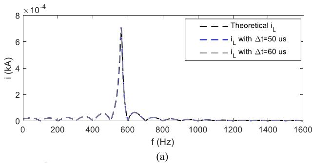

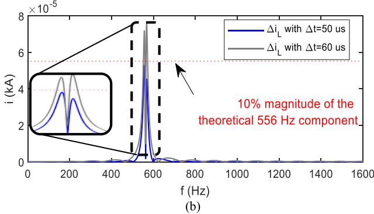  
Fig. 9 (a) Frequency spectrum of inductor current. (b) Current difference in frequency domain.

10% at frequencies in the neighborhood of 550 Hz. The simulation result spectrum from Fig. 9(b), confirms this, because the magnitude error at these frequencies is under the 10% threshold for $\Delta { \mathrm t } = 5 0 ~ \mu { \mathrm s }$ and exceeds it for $\Delta { \sf t } = 6 0 ~ \mu { \sf s }$ .

# D. Challenge for Practical Application

The above analysis method is general and applies to the accuracy analysis of any linear network. However, the above procedure (Method 1) requires the network equations in state variable (SV) form, which are not easily available in an EMT formulation based on Dommel’s approach. Therefore, in most simulations, the state space equations as in (2) are typically never formulated, particularly for large networks, due to the significant effort required [7]. Also, the presence of distributed elements, e.g., transmission lines [8]–[10] precludes writing the standard SV form (2).

In the next section, the method proposed above is adapted for convenient application to large systems. In Section V, a methodology is proposed to include distributed parameter components.

# IV. METHOD 2: SIMULATION ACCURACY CONSIDERING DRIVING PORT ADMITTANCES

When applied to a practical system, the main challenge of Method 1 in Section III B, is that it requires the explicit formulation of the state variable equations to obtain the transfer functions $\mathbf { F } _ { o }$ and $\mathbf { F } _ { d }$ in (4) and (5).

Alternatively, if the internal behavior of a certain (linear) portion of the network is not of interest and only its behavior as seen from its ‘boundary’ ports is of concern, then the accuracy analysis can be simplified. However, if we use the driving point admittance instead of using $\mathbf { F } _ { o }$ and $\mathbf { F } _ { d } ,$ , the accuracy can be

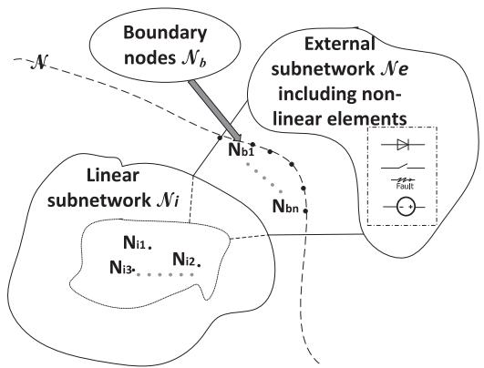  
Fig. 10. Network N showing boundary and internal buses.

quantified directly from the network’s netlist data, which makes it applicable to large systems. This is shown below.

# A. The Equivalent Admittance Matrix From Boundary Ports

In this section, the ac system admittance seen from boundary ports is used to define an accuracy index. Unlike the transfer functions $\mathbf { F } _ { o }$ and $\mathbf { F } _ { d }$ in Section III.B, which relate all SVs to the applied excitations, this transfer function only relates the port current vector to the applied port excitation voltage vector.

A major advantage of this approach is that the transfer function can be easily formed by the well-known network reduction techniques, i.e., without the requirement of state space equations. However, there is a tradeoff. Any mode internal to the network which is not observable from the boundary port is ignored in the accuracy estimation. If it is deemed that certain internal modes are of importance, the set of boundary nodes can be expanded so that the mode is observable.

Consider the network N, consisting of linear subnetworks $\Nu _ { i }$ and $\Nu _ { e }$ as in Fig. 10. $\Nu _ { b }$ represents a multi-phase port with boundary nodes $N _ { b 1 } , N _ { b 2 } \dots N _ { b n } . \mathrm { A }$ ll excitation sources are also included in $\Nu _ { b }$ . All non-boundary nodes, $\mathrm { e . g . , } N _ { i 1 } , N _ { i 2 } , N _ { i 3 }$ of the subnetwork $\Nu _ { i }$ are referred to as internal nodes.

Note for each linear circuit element (e.g., resistor, inductor, capacitor, frequency dependent transmission line, etc.), the frequency domain representation is available as a complex admittance, $( \mathrm { e . g } Y _ { c } ( j \omega ) = j \omega C , Y _ { L } ( j \omega ) = 1 / j \omega L )$ . The overall admittance matrix $Y _ { \mathcal { N } { i } }$ for the network can then be synthesized by applying nodal analysis [11] as (8):

$$
\left( \begin{array}{l} \boldsymbol {I} _ {\boldsymbol {b}} (s) \\ \boldsymbol {I} _ {i} (s) \end{array} \right) = \boldsymbol {Y} _ {\mathcal {N} _ {i}} (s) \cdot \boldsymbol {V} = \left( \begin{array}{c c} \boldsymbol {Y} _ {\boldsymbol {b b}} (s) & \boldsymbol {Y} _ {\boldsymbol {b i}} (s) \\ \boldsymbol {Y} ^ {T} _ {\boldsymbol {b i}} (s) & \boldsymbol {Y} _ {i i} (s) \end{array} \right) \cdot \left( \begin{array}{l} \boldsymbol {V} _ {\boldsymbol {b}} (s) \\ \boldsymbol {V} _ {i} (s) \end{array} \right) \tag {8}
$$

Where $V _ { b }$ and $V _ { i }$ are boundary and internal nodes voltages respectively. $\scriptstyle { I _ { b } }$ denotes the current vector entering the boundary nodes. $\boldsymbol { { I } } _ { i }$ represents internal currents injections. To calculate the equivalent admittance from the boundary, all excitations are at external nodes, i.e., internal injections $\boldsymbol { I } _ { i } = 0$ .

Applying Gaussian elimination gives the corresponding Norton admittance $Y _ { b }$ as seen from the boundary. This is used later in (13) and (14):

$$
\boldsymbol {Y} _ {\boldsymbol {b}} (s) = \boldsymbol {Y} _ {\boldsymbol {b b}} (s) - \boldsymbol {Y} _ {\boldsymbol {b i}} (s) \cdot \boldsymbol {Y} _ {\boldsymbol {i i}} (s) ^ {- 1} \cdot \boldsymbol {Y} ^ {T} _ {\boldsymbol {b i}} (s) \qquad (9)
$$

# B. Application of bi-Linear Transformation

In eqn. (9), the matrices are functions of frequency. If $\textstyle Y _ { b } ( s )$ is a rational function of s, it can be converted to state equations. However, when distributed parameters, e.g., cable or transmission lines are present, $\textstyle Y _ { b } ( s )$ can be realized as a function of s, but not as a rational function. Hence conversion to SVs form is not directly possible.

EMT type simulations typically use the trapezoidal method to discretize the system equations. The corresponding z domain transfer function for the network admittance $\mathbf { \nabla } _ { Y _ { i } } ( z )$ is obtained with a bilinear transformation by replacing s in $\mathbf { \mathit { Y } } _ { \mathit { N i } } ( s )$ with $\begin{array} { r } { s \approx \frac { 2 \cdot ( z - 1 ) } { \Delta t \cdot ( z + 1 ) } \equiv s _ { T R } ( z ) } \end{array}$ . Noting $z = e ^ { j \omega \Delta t }$ , the corresponding frequency response for the simulated system could be calculated by the mapping function below:

$$
s _ {T R} (j \omega , \Delta t) \approx \frac {2 \cdot (z - 1)}{\Delta t \cdot (z + 1)} = \frac {2 \cdot \left(e ^ {j \omega \Delta t} - 1\right)}{\Delta t \cdot \left(e ^ {j \omega \Delta t} + 1\right)} \tag {10}
$$

To obtain each element of ${ \pmb Y } _ { \mathcal { N } i } ( j \omega , \Delta t )$ for the simulated system at frequency jω with time-step $\Delta t$ (without formulation of state equations), we first evaluate the admittance $g _ { i k } ( s )$ for elements connected between nodes i and k, with $s = s _ { T R } ( j \omega , \Delta t )$ and $g _ { i i } ( j \omega , \Delta t )$ for elements connected between node i and ground; and then assemble the matrix ${ \pmb Y } _ { \mathcal { N } i } ( j \omega , \Delta t )$ in (8) using standard admittance matrix formulation methods [11], as in (11):

$$
\boldsymbol {Y} _ {\mathcal {N} i} (j \omega , \Delta t) = \left( \begin{array}{c c} \boldsymbol {Y} _ {\boldsymbol {b b}} (j \omega , \Delta t) & \boldsymbol {Y} _ {\boldsymbol {b i}} (j \omega , \Delta t) \\ \boldsymbol {Y} ^ {T} _ {\boldsymbol {b i}} (j \omega , \Delta t) & \boldsymbol {Y} _ {\boldsymbol {i i}} (j \omega , \Delta t) \end{array} \right) \tag {11}
$$

The driving point admittance matrix at frequency jω applicable to the simulation with time-step $\Delta t ,$ i.e., $Y _ { b T R } ( j \omega , \Delta t )$ as defined by (12), can be obtained by using (9)

$$
\begin{array}{l} \boldsymbol {Y} _ {\boldsymbol {b T R}} (j \omega , \Delta t) = \boldsymbol {Y} _ {\boldsymbol {b b}} (j \omega , \Delta t) - \boldsymbol {Y} _ {\boldsymbol {b i}} (j \omega , \Delta t) \\ \cdot \boldsymbol {Y} _ {i i} (j \omega , \Delta t) ^ {- 1} \cdot \boldsymbol {Y} _ {b i} ^ {T} (j \omega , \Delta t) \tag {12} \\ \end{array}
$$

Thus no explicit symbolic algebra is necessary and $Y _ { b T R } ( j \omega , \Delta t )$ can be determined at each frequency point. Also, the method is directly adaptable to other integration methods by selecting a suitable transformation instead of the bilinear transformation. The proposed procedure does not require the generation of state space equations as all the terms in $Y _ { b T R } ( j \omega , \Delta t )$ can be obtained directly from the netlist. Hence is easier to apply to analyze accuracy of large networks.

Unlike previous methods, distributed parameter transmission lines or cables can be included in the accuracy investigation as will be shown later in Section IV.

# C. Simulation Accuracy Spectrum

Using the proposed Method 2, an index for accuracy can be developed. With the s-domain and discretized admittance matrices $Y _ { b } ( j \omega )$ and $Y _ { b T R } ( j \omega , \Delta t )$ as described in Eqn. (12), the relative error matrix $\Delta Y _ { e b } ( j \omega , \Delta t )$ is formed as in (13):

$$
\Delta Y _ {b} (j \omega , \Delta t) _ {i j} = \frac {\left| Y _ {b} (j \omega) _ {i j} - Y _ {b T R} (j \omega , \Delta t) _ {i j} \right|}{\left| Y _ {b} (j \omega) _ {i j} \right|} \tag {13}
$$

The closer the simulated system is to the real system, the closer are the value of the elements of $\Delta \mathbf { Y _ { b } } ( j \omega , \Delta t )$ to zero. However,

in a large power system, the electrical connection between geographically distant nodes, would approach zero, and so for some i and j values, $Y _ { b } ( j \omega ) _ { i j }$ and $Y _ { b } ( j \omega ) _ { i j } - Y _ { b T R } ( j \omega , \Delta t ) _ { i j }$ would both be close to zero and the ratio (13) becomes numerically non-robust. In order to overcome this limitation, the relative error matrix $\Delta Y _ { e b } ( j \omega , \Delta t )$ is slightly modified as is shown in (14), by making the denominator the largest magnitude of the equivalent admittance, $\operatorname* { m a x } _ { k } ( | Y _ { b } ( j \omega ) _ { i k } | )$ , connected to the k $\mathrm { i ^ { \mathrm { t h } } }$ port, instead of just $Y _ { b } ( j \omega ) _ { i j }$ .

$$
\Delta Y _ {b m} (j \omega , \Delta t) _ {i j} = \frac {\left| Y _ {b} (j \omega) _ {i j} - Y _ {b T R} (j \omega , \Delta t) _ {i j} \right|}{\underset {k} {\max } \left(\left| Y _ {b} (j \omega) _ {i k} \right|\right)} \tag {14}
$$

Finally, an “accuracy spectrum” index is proposed as in (15) which tracks the largest element in matrix $\Delta \mathbf { Y _ { b } } _ { m } ( j \omega , \Delta t )$ at each frequency.

$$
\mathcal {A} (j \omega , \Delta t) = \max  _ {i, j} \Delta Y _ {b m} (j \omega , \Delta t) _ {i j} \tag {15}
$$

# D. Motivation for the Proposed Index

Compared with previous methods [3], [4], the proposed index considers the complete network rather than individual components. It is also more easily applicable to large networks compared to Method 1 described in Section III, as the driving point admittances can be calculated without state space equation formulation.

It is also valuable to notice that the accuracy is measured with respect to a driving point port. Generally speaking, all modes of the circuit are included in the response, except in the case where such modes are not observable from the driving port.

# V. CONSIDERATION OF DISTRIBUTED PARAMETER ELEMENTS

This section discusses the required representation for a distributed transmission line or underground/underwater cable required for accuracy analysis. This has not been considered in earlier accuracy analysis approaches [5], [12].

# A. Transmission Line Formulation

Although not directly representable by a rational transfer function (without approximation), a frequency dependent transmission line is nevertheless a linear system and can be represented in frequency domain as indicated in [13] as shown below. We start from the well known Telegrapher’s Equation (16):

$$
\begin{array}{l} - \frac {d \boldsymbol {V} (\omega , x)}{d x} = \boldsymbol {Z} (\omega) \cdot \boldsymbol {I} (\omega , x) \\ - \frac {d \boldsymbol {I} (\omega , x)}{d x} = \boldsymbol {Y} (\omega) \cdot \boldsymbol {V} (\omega , x) \tag {16} \\ \end{array}
$$

In (16), $V ( \omega , x )$ and $I ( \omega , x )$ are voltage and current in the transmission line at a distance x along the line. $\mathbf Y ( \omega )$ and $\scriptstyle { Z ( \omega ) }$ are per unit length admittance and impedance. Eqn. (16) is exactly representable by a frequency dependent π model as in Fig 11, referred to as an exact Pi model [14]:

Where:

$$
\mathbf {Y} _ {S H} (s) = \mathbf {A} (s) - \mathbf {B} (s), \mathbf {Y} _ {S E} (s) = \mathbf {B} (s)
$$

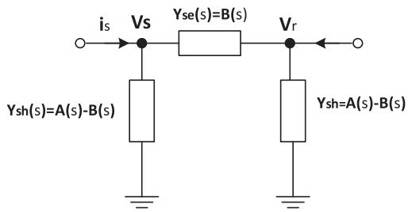  
Fig. 11. Exact PI model of Transmission line.

$$
\begin{array}{l} \boldsymbol {A} (s) = \boldsymbol {Y} _ {C} (s) \cdot \left(\boldsymbol {I} + \boldsymbol {H} (s) ^ {2}\right) \cdot \left(\boldsymbol {I} - \boldsymbol {H} (s) ^ {2}\right) ^ {- 1} \\ \boldsymbol {B} (s) = 2 \cdot \boldsymbol {Y} _ {C} (s) \cdot \boldsymbol {H} (s) \cdot \left(\boldsymbol {I} - \boldsymbol {H} (s) ^ {2}\right) ^ {- 1} \\ \end{array}
$$

And

$$
\boldsymbol {H} (s) = e ^ {- \sqrt {\boldsymbol {Z} (s) \cdot \boldsymbol {Y} (s)} \cdot l}
$$

$$
\boldsymbol {Y} _ {C} (s) = \boldsymbol {Z} (s) ^ {- 1} \sqrt {\boldsymbol {Z} (s) \cdot \boldsymbol {Y} (s)} \tag {17}
$$

Note that the above representation is true for multiphase and multi-circuit lines. For example, for a 3-phase line, $Z ( j \omega )$ and $Y ( j \omega )$ are $3 \times 3$ matrices. Similarly, for a double circuit 3-phase line, the matrices would be of dimension $6 \times 6$ .

# B. Discretized Model in EMT Type Simulation

To implement the frequency dependent model into EMT type simulations of multi-phase and multi-circuit lines, several techniques have been reported in literature. The discussion below assumes the widely used Universal Line Model [10] by Morched, Gustavsen, and Tartibi, although, the proposed method is general and can be used to analyze accuracy of other EMT implementations of transmission lines or cables.

In the Universal Line Model (ULM) [10], $\boldsymbol { Y } _ { \boldsymbol { C } } ( \boldsymbol { s } )$ and $H ( s )$ in Eqn. (17) are approximated respectively by $\pmb { Y } _ { C } { ' } ( s )$ , which is a rational function of frequency and $H ^ { \prime } ( s )$ , which is a product of a rational function and a fixed travel time delay [10], [15]. For a line with Nc conductors (or conducting elements):

$$
\begin{array}{l} Y _ {c} ^ {\prime} (s) _ {m n} = \sum_ {i = 1} ^ {N _ {Y c}} \frac {\left(c _ {Y c _ {i}}\right) _ {m n}}{s - \left(p _ {Y c _ {i}}\right)} \\ H ^ {\prime} (s) _ {m n} = \sum_ {k = 1} ^ {n} \left[ \sum_ {i = 1} ^ {(N _ {H}) _ {k}} \frac {\left(c _ {H _ {i k}}\right) _ {m n}}{s - p _ {H _ {i k}}} \right] \cdot e ^ {- s \tau_ {k}} \\ m \in \{1, \dots N c \}, \quad n \in \{1, \dots N c \}, \tag {18} \\ \end{array}
$$

where $N _ { Y _ { c } }$ and $( N _ { H } ) _ { k }$ are the number of poles for $\boldsymbol { Y } _ { C ^ { \prime } \left( s \right) }$ and the ${ \mathrm { k } } ^ { \mathrm { t h } }$ mode of $H ^ { \prime } ( s )$ , and $( c _ { Y c _ { i } } ) _ { m n }$ and $( c _ { H _ { i k } } ) _ { m n }$ are residues.

With the rational approximations $\pmb { Y } _ { C } { ' } ( s )$ and $H ^ { \prime } ( s )$ , the relationship between current and voltage at the sending end in Fig. 11 can be expressed as:

$$
\mathbf {i} _ {s} = \mathbf {Y} _ {c} ^ {\prime} (s) \cdot \mathbf {v} _ {s} - \mathbf {I} _ {h i s}
$$

$$
w h e r e \quad \mathbf {I} _ {h i s} = \mathbf {H} ^ {\prime} (s) \cdot \left(\mathbf {Y} _ {c} ^ {\prime} \cdot \mathbf {v} _ {r} - \mathbf {i} _ {r}\right) \tag {19}
$$

Note $\mathbf { I } _ { h i s }$ only includes historical information from previous time-steps because each term in the summation for $H ^ { \prime } ( s )$ in (18) has a delay term $e ^ { - s \tau _ { k } }$ . By first converting to the modal domain, a single delay for each mode is extracted leaving a residual portion ${ H _ { r } } ^ { \prime } ( s )$ , which like $\pmb { Y } _ { C } { ' } ( s )$ is just a rational function.

Subsequently, the rational function parts are included in the EMT simulation environment using the trapezoidal rule (or other integration method of choice), with the delay part as an actual transportation lag, i.e., all the delay terms are included in the form of history current sources. Applying the bi-linear transformation to the rational function terms only (not to the delay terms $e ^ { - s \tau _ { k } }$ , as these are implemented as physical delays and not by modelled by the Trapezoidal rule), the simulated model in the frequency domain can be calculated with the help of equation (10) as below:

$$
Y _ {c} ^ {\prime} (j \omega , \Delta t) _ {m n} = \sum_ {i = 1} ^ {N _ {Y c}} \frac {(c _ {Y c _ {i}}) _ {m n}}{s _ {T R} (j \omega , \Delta t) - (p _ {Y c _ {i}})}
$$

$$
H ^ {\prime} (j \omega , \Delta t) _ {m n} = \sum_ {k = 1} ^ {n} \left[ \sum_ {i = 1} ^ {(N _ {H}) _ {k}} \frac {\left(c _ {H _ {i k}}\right) _ {m n}}{s _ {T R} (j \omega , \Delta t) - p _ {H _ {i k}}} \right] \cdot e ^ {- j \omega \tau_ {k}} \tag {20}
$$

Substituting the results into (17) gives the shunt and series admittances $\pmb { Y } _ { S H } ( j \omega , \Delta t )$ and $\pmb { Y } _ { S E } ( j \omega , \Delta t )$ , which could then be used to find $\ Y _ { b } ( j \omega , \Delta t )$ from (8) and (9). Thus the accuracy of networks with transmission lines or cables can also be determined by the procedure as shown in Section IV.C.

# VI. APPLICATION OF THE PROPOSED METHOD

In this sections, two examples are used to demonstrate the proposed accuracy evaluation method (i.e., Method 2). The first considers a system with a frequency dependent transmission line. Due to its distributed parameter property, classical statespace equations (and eigenvalues) do not exist for such networks, and hence, traditional time constant based approaches [16] are not applicable. The second example considers the IEEE 39 bus system connecting to an LCC-HVdc network.

# A. System With a Distributed Parameter Transmission Line

In EMT type simulations, the frequency dependent transmission line is often modeled by the universal line model (ULM), which uses Vector Fitting [17] with passivity enforcement [18] to approximate the admittance matrix $\mathbf { \Delta } Y _ { C }$ and propagation matrix H by rational functions. As passivity enforcement often comes at the expense of some accuracy loss, an important question is how these approximations influence the simulation accuracy. Note the error introduced by approximation and passivity enforcement is usually not predictable as it is the result of a least-squared fitting, it is not possible to quantify the numerical error by traditional truncation error based analysis (in the form of $O ( \Delta t ^ { k } ) )$ .

Alternatively, in this paper, the accuracy is evaluated by comparison with an accurate frequency domain formulation as described in Section IV and V.

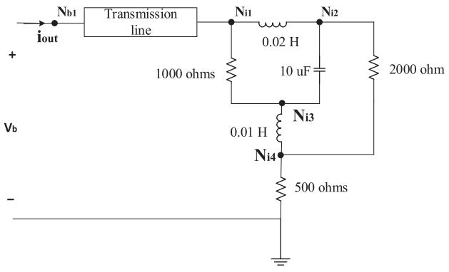

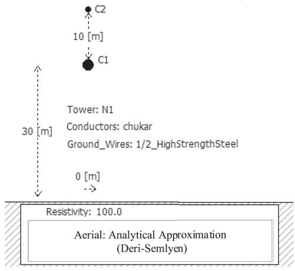  
Fig. 12. Network and transmission line configuration.

TABLE II FREQUENCY DEPENDENT MODEL PARAMETERS   

<table><tr><td>Curve fitting starting frequency</td><td>0.05</td></tr><tr><td>Curve fitting end frequency</td><td>10000</td></tr><tr><td>Maximum fitting error for YC(s)</td><td>a) 0.05 5% b)
2% c) 5%</td></tr><tr><td>Maximum fitting error for H(s)</td><td>a) 0.05% b) 2%
c) 5%</td></tr></table>

1) Validation Example: A simple example as shown in Fig. 12 is presented, in which a 300 km long 230 kV single phase frequency dependent transmission line (modeled using ULM [8]) is terminated in an RLC circuit. The analytical Deri-Semlyen formula is used to calculate the line parameters [15].

Parameters for vector fitting $\boldsymbol { Y } _ { \boldsymbol { C } } ( \boldsymbol { s } )$ and $H ( s )$ are as in Table II as below. Three different fitting errors [17] in the vector fitting procedure, 5% and 2% and 0.05% are considered.

The corresponding theoretically calculated simulation accuracy spectrum for a time-step of $\Delta t = 1 0 \mu \mathrm { s }$ is shown in Fig. 13 for the different fitting accuracies as listed in Table II.

For example, at 230 Hz, a 5% vector fitting error results in an inaccuracy of 3.1%. For smaller vector fitting errors, the accuracy improves, as expected. Suppose the target value for accuracy index is 2%. Then the graph shows that 5% vector fitting error would result in excessive inaccuracy, but the 2% vector fitting error would be adequate.

The above theoretically calculated inaccuracy values can be verified using EMT simulation. The ULM transmission line

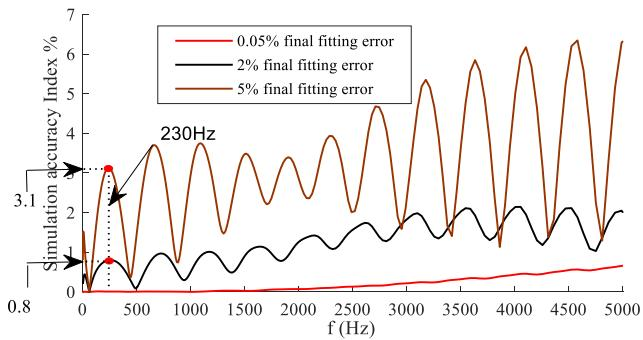

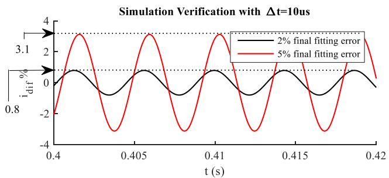  
Fig. 13. Simulation accuracy spectrum with $\Delta t = 1 0 \mu \mathrm { s }$ .   
Fig. 14. Impact of fitting error on simulation $( \Delta t = 1 0 \mu \mathrm { s } )$ .

model in the EMT program is as described earlier in Section V [10]. Fig 9 shows the relative difference current $i _ { d i f f e r e n c e }$ for the 187 Hz excitation between theoretical and simulated values of $i _ { o u t }$ (as shown in in Fig 7).

$$
i _ {\text {d i f f e r e n c e}} = \frac {i _ {\text {o u t , t h e o r y}} - i _ {\text {o u t , s i m u l a t e d}}}{\operatorname* {m a x} \left(\left| i _ {\text {o u t , t h e o r y}} \right|\right)} \tag {21}
$$

The two plots in $\mathrm { F i g . }$ . 14 are for two different vector fitting errors, 5% and 2%. For the 5% vector fitting error, the maximum error is 3.1%, which precisely agrees with the prediction of 3.1% from the theoretically calculated simulation accuracy spectrum in Fig. 13. Similarly, for the, 2% fitting error the peak value of $i _ { d i f f e r e n c e } ~ ( { \mathrm { i . e . , ~ } } i _ { d i f f e r e n c e } )$ is 0.8%, which also precisely matches with the theoretical simulation accuracy spectrum. This is as expected, because $i _ { o u t }$ is the current entering the driving point. Hence by comparison of (21) with (14) and (15), the peak value of $i _ { d i f f e r e n c e }$ is exactly the same as given by the simulation accuracy index at the corresponding frequency, i.e.,

$$
\begin{array}{l} \hat {i} _ {\text {d i f f e r e n c e}} = \max  \left(i _ {\text {d i f f e r e n c e}}\right) \\ = \frac {\operatorname* {m a x} \left(i _ {\text {o u t , t h e o r y}} - i _ {\text {o u t , s i m u l a t e d}}\right)}{\operatorname* {m a x} \left(\left| i _ {\text {o u t , t h e o r y}} \right|\right)} \\ = \frac {\left| \left[ \mathbf {Y} _ {\mathbf {b}} (j \omega) - \mathbf {Y} _ {\mathbf {b T R}} (j \omega , \Delta t) \right] \cdot \hat {V} _ {b} \right|}{\left| \mathbf {Y} _ {\mathbf {b}} (j \omega) \cdot \hat {V} _ {b} \right|} \tag {22} \\ = \Delta \mathbf {Y} _ {\mathbf {b} m} (j \omega , \Delta t) \equiv \boldsymbol {\mathcal {A}} (j \omega , \Delta t) \\ \end{array}
$$

Fig. 15 shows the theoretically calculated simulation accuracy index spectrum for a vector fitting accuracy of 2% and a simulation timestep $\Delta t = 1 0 \mu \mathrm { s }$ . The values of the index for a 230 Hz excitation and a 1400 Hz excitation are also marked.

As before, the relative difference current $i _ { d i f f e r e n c e }$ is shown in Fig. 16. For the 230 Hz excitation, $\hat { i } _ { d i f f e r e n c e } = 0 . 8$ , while at 1400 Hz it is 0.5, again in excellent agreement with the theoretically calculated values in Fig. 15.

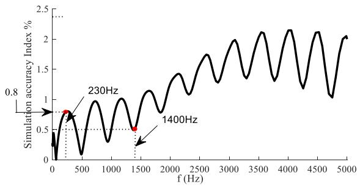  
Fig. 15. Simulation accuracy spectrum with 2% fitting error and $\Delta { \mathrm t } = 1 0 \mu \mathrm s$ .

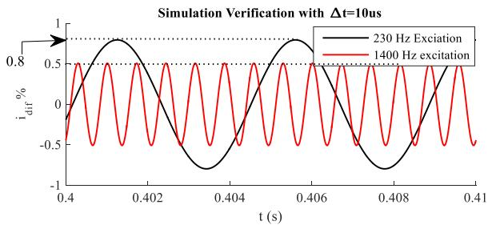  
Fig. 16. EMT simulation verification with different frequency excitation.

# B. Simulation Accuracy of IEEE 39 Bus System Example

Section VI.A shows the capability of the proposed technique to quantify the simulation accuracy of systems that include distributed elements with frequency dependent parameters which has not been hitherto reported. In this section, in order to compare the performance of the proposed method to existing approaches based on eigenvalues [3], the example uses the IEEE-39 bus system [19] with a 12 Pulse LCC-HVdc Converter connected at BUS 26 as in Fig. 12. The transmission lines are modelled as 3-phase coupled Pi sections [20], including zero sequence representation. This treatment allows the determination of explicit eigenvalues which would not be possible if the lines are modeled as distributed elements. The purpose of this analysis was to explore the model’s accuracy over a wide frequency range as the HVdc converter generates multiple frequency harmonics and other transients.

The eigenvalues of the network are shown in Fig. 18. According to the some earlier research [16], the rule of thumb is to select the simulation time step based on the smallest time constant corresponding to largest eigenvalue, i.e., $- 2 . 3 5 4 6 \cdot 1 0 ^ { 5 }$ . This corresponds to a time constant of $\frac { 1 } { 2 . 3 5 4 6 \cdot 1 0 ^ { 5 } } = 4 . 2 \mu s$ . Following this treatment, one tenth of the smallest time constant would give the simulation time step of $0 . 4 2 \mu s$ . However, accuracy spectrum analysis will show that if performance from the driving point is of interest, a much larger time-step is sufficient.

In practice, the frequency range of interest in such 12 Pulse LCC-HVdc system simulations (particularly on real-time simulators) is typically 0 kHz–2 kHz. Fig. 19 shows the accuracy spectrum determined by the proposed approach for different time-steps. The maximum error is observed in the neighborhood of 1500 Hz. If a maximum error of 1.5% or less is required, a time-step of 8 us would suffice. This is much larger than the

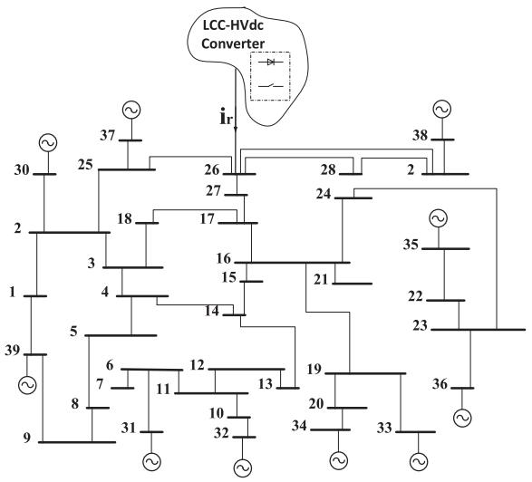  
Fig. 17. Topology of studied system.

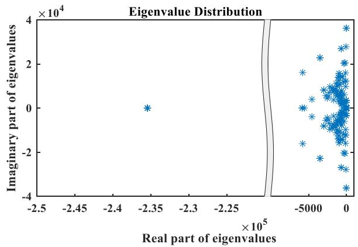  
Fig. 18. Eigenvalue distribution.

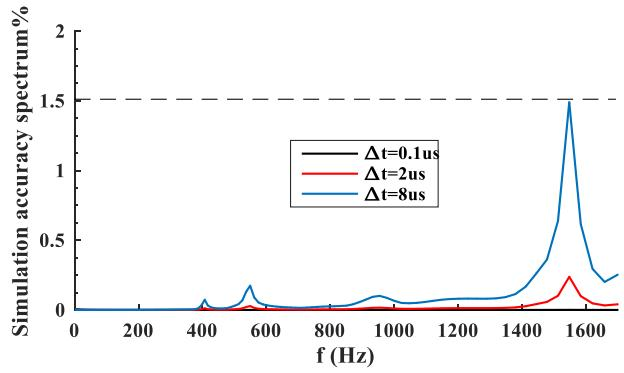  
Fig. 19. Simulation accuracy spectrum.

0.42 $\mu \mathrm { s }$ time-step suggested by using the rule of thumb based on system time constants [16].

In order to verify whether the frequency spectrum is a good measure of accuracy, a comparison was made with EMT simulation for timesteps of $\Delta t = 0 . 1 \mu \mathrm { s }$ and $\Delta t = 8 \mu \mathrm { s . } \mathrm { A t } t = 1 . 3 s$ , a dc fault is applied, and cleared by force retarding the HVdc converter. Normal operation is resumed 75 ms later. The corresponding simulation results for the ‘A’ phase voltage VBUS26 and current $i _ { r }$ (see Fig. 17) at BUS 26 are shown in Fig. 20.

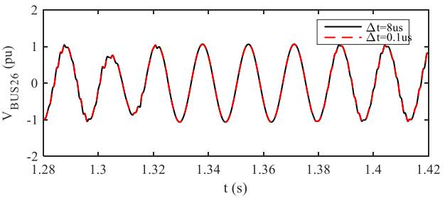

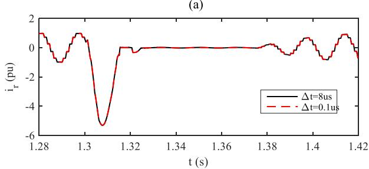  
(b)   
Fig. 20. Simulation validation. (a) Simulation results of BUS 26 phase A voltage. (b) Simulation results of $i _ { r }$ phase A current.

It can be clearly observed that there is no visible difference between the simulation time step of 0. 1μs and 8μs even in the transient period, which confirms that the simulation time step is sufficiently small.

Note the simulation time step predicted by the proposed method is significantly larger than the one from the time constant based method. This is because although faster modes do exist in the internal system (as evinced from the eigenvalue plot), such modes are not observable from the driving ports, and hence are not reflected in the accuracy spectrum.

# VII. CONCLUSION

In this paper, a novel technique is proposed to assess the accuracy of electro-magnetic transient simulations of power networks.

Firstly, a simple lumped circuit example is used to show that individual element based numerical accuracy evaluation can lead to erroneous accuracy estimates for simulation results of the entire circuit. In order to address this issue, the paper proposes a frequency domain method to globally evaluate the accuracy. Analysis shows that the accuracy may vary with frequency and time-step, and it is not always the case that for a given timestep, the accuracy at low frequencies is better than at high frequencies. An example case with a transient initiated by a switching operation is presented to show how the results are applicable in the time domain. For application in larger systems, a Simulation Accuracy Spectrum is introduced which examines the accuracy from the driving point of interest in the network. The approach is also shown to be applicable to analyze the accuracy of distributed element systems such as frequency-dependent transmission lines, which cannot be handled by state-variable based methods. The proposed approaches are successfully validated by EMT simulation examples.

# REFERENCES

[1] C. W. 33.02, Guidelines For Representation of Network Elements When Calculating Transients. St. Joseph, MI, USA: ASABE 1990.   
[2] A. Gole, J. Martinez-Velasco, and A. Keri, “Modeling and analysis of system transients using digital programs,” IEEE PES Special Publication, 133-0, 1999.   
[3] J. R. Marti and J. Lin, “Suppression of numerical oscillations in the EMTP power systems,” IEEE Trans. Power Syst., vol. 4, no. 2, pp. 739–747, May 1989.   
[4] K. Strunz, “Position-dependent control of numerical integration in circuit simulation,” IEEE Trans. Circuits Syst. II: Exp. Briefs, vol. 51, no. 10, pp. 561–565, Oct. 2004.   
[5] J. Tant and J. Driesen, “On the numerical accuracy of electromagnetic transient simulation with power electronics,” IEEE Trans. Power Del., vol. 33, no. 5, pp. 2492–2501, Oct. 2018.   
[6] A. M. Gole, Power Systems Transient Simulation. 1998. [Online]. Available: http://home.cc.umanitoba.ca/∼gole/ECE_7310/notes_ files/lecture2.pdf   
[7] J. Mahseredjian, V. Dinavahi, and J. A. Martinez, “Simulation tools for electromagnetic transients in power systems: Overview and challenges,” IEEE Trans. Power Del., vol. 24, no. 3, pp. 1657–1669, Jul. 2009.   
[8] H. W. Dommel, “Digital computer solution of electromagnetic transients in single-and multiphase networks,” IEEE Trans. Power App. Syst., vol. PAS-88, no. 4, pp. 388–399, Apr. 1969.   
[9] J. R. Marti, “Accurate modelling of frequency-dependent transmission lines in electromagnetic transient simulations,” IEEE Trans. Power App. Syst., vol. PAS-101, no. 1, pp. 147–157, Jan. 1982.   
[10] A. Morched, B. Gustavsen, and M. Tartibi, “A universal model for accurate calculation of electromagnetic transients on overhead lines and underground cables,” IEEE Trans. Power Del., vol. 14, no. 3, pp. 1032–1038, Jul. 1999.   
[11] P. Kundur, Power System Stability and Control. New York, NY, USA: McGraw-Hill, 1994.   
[12] H. W. Dommel, Electromagnetic Transients Program (EMTP) Theory Book. Portland, OR, USA: Bonneville Power Administration, 1986.   
[13] B. Gustavsen, “Passivity enforcement for transmission line models based on the method of characteristics,” IEEE Trans. Power Del., vol. 23, no. 4, pp. 2286–2293, Oct. 2008.   
[14] A. Tavighi, J. R. Martí, V. A. Galván, and J. A. Gutierrez-Robles, “Timewindow-based discrete-time fourier series for electromagnetic transients in power systems,” IEEE Trans. Power Del., vol. 33, no. 5, pp. 2551–2561, Oct. 2018.   
[15] B. Gustavsen and A. Semlyen, “Simulation of transmission line transients using vector fitting and modal decomposition,” IEEE Trans. Power Del., vol. 13, no. 2, pp. 605–614, Apr. 1998.   
[16] N. Watson, J. Arrillaga, and J. Arrillaga, Power Systems Electromagnetic Transients Simulation, Herts, U.K.: The Institution of Engineering and Technology, 2003.   
[17] B. Gustavsen and A. Semlyen, “Rational approximation of frequency domain responses by vector fitting,” IEEE Trans. Power Del., vol. 14, no. 3, pp. 1052–1061, Jul. 1999.   
[18] B. Gustavsen and A. Semlyen, “Enforcing passivity for admittance matrices approximated by rational functions,” IEEE Trans. Power Syst., vol. 16, no. 1, pp. 97–104, Feb. 2001.

[19] I. Hiskens, “IEEE PES task force on benchmark systems for stability controls,” Tech. Rep., 2013.   
[20] C. Muller, User’s Guide on the Use of PSCAD. Manitoba, Canada: Manitoba HVDC Research Centre, 2010.

Huanfeng Zhao (Student Member, IEEE) received the Ph.D. degree in electrical engineering from the University of Manitoba, Winnipeg, MB, Canada, in 2021. He is currently a Postdoctoral Fellow with the University of Manitoba, working on the computation of electromagnetic transients in power systems His research interests include developing stable and accurate techniques for efficient simulation of complex physical systems.

Yi Zhang (Fellow, IEEE) received the Ph.D. degree in electrical engineering from the University of Manitoba, Winnipeg, MB, Canada. In 2000, he joined RTDS Technologies, Inc., Winnipeg, MB, Canada and currently holds the position of the vice President and CTO. He is also an Adjunct Professor with the University of Manitoba. His research interests include real time simulation, HVdc, and voltage stability. He is a Registered Professional Engineer in the province of Manitoba, Canada.

Aniruddha M. Gole (Fellow, IEEE) received the B.Tech. degree in electrical engineering from the Indian Institute of Technology, Bombay, Mumbai, India, in 1978, and the Ph.D. degree from the University of Manitoba, Winnipeg, MB, Canada, in 1982. He is currently a Distinguished Professor and the NSERC Industrial Research Chair of power systems simulation with the University of Manitoba. He is a Registered Professional Engineer in the Province of Manitoba. In 2007, he was the recipient of the IEEE Power Engineering Society Nari Hingorani FACTS

Award. He is a Fellow of the Canadian Academy of Engineering.