# 基于状态空间法的高压直流输电系统电磁暂态简化模型的解析算法

程佩芬 1 李崇涛 1 傅 闯 2 杜正春 1

（1. 西安交通大学电气工程学院 西安 710049

2. 南方电网科学研究院 广州 510080）

摘要 提出一种基于状态空间法的高压直流（HVDC）输电简化模型的解析算法，用于模拟逆变侧交流故障下直流系统的暂态响应。首先利用准稳态模型对 HVDC 系统的整流侧做简化；然后把不同工况下的换流器写成统一的形式，并把简化后的 HVDC 系统模型用一个分时段线性的非齐次微分方程组来描述；最后，通过引入辅助变量，将非齐次方程转化为齐次，从而使计算复杂度大大降低，同时简化后的系统可以用解析算法求解。控制系统用微分-代数方程组描述，用变步长数值积分法求解。在 Matlab 里编写相应程序实现所提简化模型的解析算法，并与 PSCAD 里搭建的双端电磁暂态模型进行比较，以验证所提算法的准确性。

关键词：电网换相换流器高压直流输电 暂态仿真 解析算法 换相失败

中图分类号：TM74

# An Analytic Solution for Simplified Electromagnetic Transient Model of HVDC Transmission System Based on State Space Method

Cheng Peifen1 Li Chongtao1 Fu Chuang2 Du Zhengchun2

（1. School of Electrical Engineering Xi’an Jiaotong University Xi’an 710049 China

2. Electric Power Research Institute China Southern Power Grid Guangzhou 510080 China）

Abstract In this paper, an analytic solution for simplified high voltage direct current (HVDC) system based on state space method is proposed, which is mainly used to simulate the transient response of DC system under AC fault on the inverter side. Firstly, the rectifier side of HVDC system is simplified using quasi-steady model. Secondly, the converter under different conditions is described as a uniformed express, and the simplified HVDC system is described by a piecewise linear inhomogeneous differential equations. Finally, the inhomogeneous differential equations are transformed into homogeneous ones by introducing auxiliary variables, which greatly reduces the computational complexity. Meanwhile, the simplified system can be accurately solved by analytical algorithm. The control system is described with differential-algebraic equations and solved by the variable-step numerical integration method. According to the analytical solution of the simplified model proposed in this paper, the corresponding program is coded in Matlab and compared with the double-terminal HVDC model built in PSCAD to verify the accuracy of the proposed solution.

Keywords ： Line commutated converter-high voltage direct current (LCC-HVDC), transient simulation, analytical solution, commutation failure

# 0 引言

随着现代电力系统中源荷分布不均的情况越来越突出，高压直流输电（High Voltage Direct Current,HVDC）作为一种可以将电能进行大容量、远距离输送的有效途径，在电力系统中得到广泛的应用[1]。其中，电网换相换流器高压直流（Line CommutatedConverter-HVDC, LCC-HVDC）输电由于其耐受电压等级较高、输送容量大等优势在实际电力系统中应用广泛。成熟的机电暂态仿真软件如 PSASP、BPA中，对直流的处理一般采用响应模型，不能详细模拟到换流阀的动态行为[2-3]。为了获取HVDC系统详细的动态响应，直流系统一般需要采用电磁暂态模型[4-5]。

传统的电磁暂态仿真软件，如 EMTP/ATP、PSCAD/EMTDC 等是采用小步长数值积分仿真的方法来计算 HVDC 系统换流器的动态响应。为了准确模拟换流器导通、换相和关断的过程，这类软件的仿真步长都是微妙级，因此暂态仿真计算需要较长的时间。另外，为了获取换流器晶闸管关断时刻，需要采用插值的方法获取换相电流过零点，这可能带来数值振荡问题。为了解决上述问题，文献[6-7]提出了一种高压直流输电系统的解析解法。

由于LCC中晶闸管的半控性，在故障情况下LCC-HVDC 系统中可能会出现复杂的动态行为[8-10]。直流逆变侧换相失败是 HVDC 系统最常见的故障[11-14]。因此，为了研究 LCC-HVDC 系统的换相失败问题，必须对逆变侧的动态行为进行准确描述；另外，馈入式的高压直流输电系统是我国远距离送电的普遍现象，而在馈入式的电网里，受端（逆变侧）系统才是关注的重点。对受端系统进行仿真时，对于整流侧的处理可以适当简化。基于此，本文提出一种

基于状态空间法的HVDC电磁暂态简化模型解析算法。采用该方法在提高计算速度的同时，并不降低对逆变侧动态响应的模拟精度。

在算法的实现上，首先利用准稳态模型，将LCC-HVDC 系统的整流侧简化为一个幅值可变的理想直流电压源和电阻的串联，并不考虑整流侧的直流滤波器；HVDC 系统被分为一次设备模块和直流控制系统模块两个部分进行计算。根据换流阀的工作状态，一次设备模型可以采用线性开关系统来描述，在数学模型上即为一组线性非齐次微分方程组。通过加入整流侧的简化数学模型和引入辅助变量，把方程组进一步转化为线性齐次微分方程组，使计算表达式简化。对于控制系统而言，根据控制逻辑得到其对应的微分-代数方程组，采用变步长数值积分法求解其时域响应。

本文介绍了 LCC-HVDC 简化模型的建立过程及对应解析算法的推导过程，并使用 Matlab 进行编程实现。同时，在 PSCAD 中搭建双端电磁暂态模型作为对照，以验证模型和算法的有效性。

# 1 一次设备部分的数学模型

本文所用算例简化前的系统结构如图 1 所示，包含了换流变压器、换流器、平波电抗器和直流滤波器等器件，直流线路用 T 型等效电路进行模拟。

在电力系统分析中，当主要关心逆变侧的换相失败时，对整流侧的模拟精度可以适当放宽。考虑到逆变侧的换相失败对整流侧换流器变换的影响较小，因此可以忽略整流侧换流器的变换过程，利用准稳态模型对整流侧进行简化。简化后一次设备系统的结构如图 2 所示，框内即为整流侧等效部分。

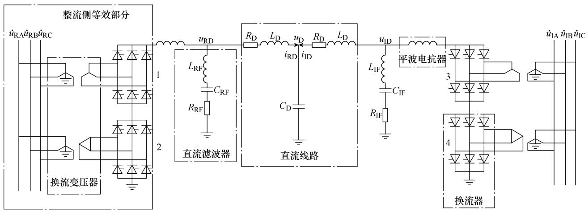  
图 1 双端 HVDC 一次设备系统结构  
Fig.1 Structure diagram of two-terminal HVDC primary equipment system

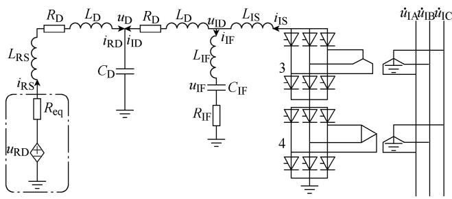  
图 2 等值单端 HVDC 一次设备系统结构  
Fig.2 Equivalent structure diagram of one-terminal HVDC primary equipment system

# 1.1 整流侧的简化数学模型

根据准稳态模型，整流侧的电源、换流变压器和换流器可以等效为理想电压源和等值电阻的串联。准稳态模型可由一组方程描述为[15]

$$
U _ {\mathrm {R D}} = U _ {\mathrm {R D 0}} \cos \alpha - R _ {\mathrm {R} \gamma} B _ {\mathrm {R}} I _ {\mathrm {R D}} \tag {1}
$$

$$
U _ {\mathrm {R D 0}} = \frac {3 \sqrt {3}}{\pi} k _ {\mathrm {R T}} E _ {\mathrm {R m}} B _ {\mathrm {R}} \tag {2}
$$

$$
R _ {\mathrm {R} \gamma} = \frac {3}{\pi} \omega L _ {\mathrm {y}} \tag {3}
$$

$$
R _ {\mathrm {e q}} = R _ {\mathrm {R} \gamma} B _ {\mathrm {R}} \tag {4}
$$

$$
u _ {\mathrm {R D}} = U _ {\mathrm {R D 0}} \cos \alpha \tag {5}
$$

式中， $U _ { \mathrm { R D } }$ 和 $U _ { \mathrm { R D 0 } }$ 分别为 HVDC 系统中考虑和不考虑触发延迟和换相角时，整流侧直流电压的平均值；$R _ { \mathrm { R } \gamma }$ 为等值换相电阻； $R _ { \mathrm { e q } }$ 为整流侧等值电阻； $u _ { \mathrm { R D } }$ 为等值电压源幅值；α 为控制系统输出的触发延迟角； $B _ { \mathrm { R } }$ 为整流侧串联的桥个数； $I _ { \mathrm { R D } }$ 为整流侧的直流电流； $k _ { \mathrm { R T } }$ 为整流侧换流变压器的电压比； $E _ { \mathrm { { R m } } }$ 为整流侧交流母线相电压的峰值；ω为整流侧的角频率； $L _ { \mathrm { y } }$ 为 $\mathrm { Y y }$ 联结换流变压器的等值电感。

在式（5）中，等值电压源受α影响，而α 由控制系统根据直流系统的响应来确定，因此整流侧事实上等值为幅值可变的电压源。而当采用受控电压源等效整流侧时，由于忽略了换流器的变换过程，直流电压的谐波分量不复存在，因此直流侧的滤波器可以不用考虑。而在暂态过程中，直流侧的平波电抗器起到限流作用，因此在该模型中进行了保留。

由式（5）可见，整流侧等效理想电压源的电压幅值 $u _ { \mathrm { R D } }$ 仅与控制系统输出的触发延迟角有关，即$u _ { \mathrm { R D } }$ 仅在控制系统输出变化时其数值发生改变，在每个仿真时段内其保持恒定，因此有

$$
p u _ {\mathrm {R D}} = 0 \tag {6}
$$

式中，p 为微分算子， $p = \mathrm { d } / \mathrm { d } t$ 。

# 1.2 换流器、换流变压器和平波电抗器的数学模型

为简单起见，将换流器、换流变压器和平波电抗器作为一个整体列写方程。Yy和Yd换流变压器都是等值电感换算到换流器侧的理想变压器，换流器为理想开关模型。以换流器 3 处于换相工况（上桥臂A相导通，下桥臂B C→ 换相），换流器 4 处于导通工况（上桥臂A相导通，下桥臂 B相导通）为例，等效电路如图 3 所示。

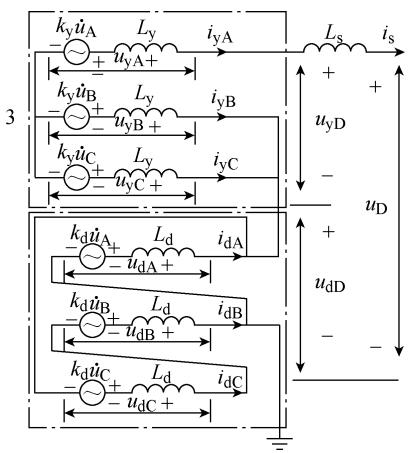  
图 3 A|B C, A|B→ 工况下的等效电路  
Fig.3 Equivalent circuit of A|B C, A|B → operation status

根据文献[6]的推导，可得到图 3 中等效电路的数学表达式

$$
\left[ \begin{array}{l} \boldsymbol {T} _ {\mathrm {c}} p \boldsymbol {x} _ {\mathrm {c}} \\ \boldsymbol {0} \end{array} \right] = \left[ \begin{array}{l l} \boldsymbol {B} _ {1 1} & \boldsymbol {B} _ {1 2} \\ \boldsymbol {B} _ {2 1} & \boldsymbol {B} _ {2 2} \end{array} \right] \left[ \begin{array}{l} \boldsymbol {v} \\ \dot {\boldsymbol {u}} \end{array} \right] + \left[ \begin{array}{l} \boldsymbol {b} _ {1} \\ \boldsymbol {b} _ {2} \end{array} \right] u _ {\mathrm {D}} \tag {7}
$$

式中， $T _ { \mathrm { c } }$ 为系数矩阵， $\pmb { T } _ { \mathrm { c } } { = } \mathrm { d i a g } ( L _ { \mathrm { y } } ~ L _ { \mathrm { y } } ~ L _ { \mathrm { y } } ~ L _ { \mathrm { d } } ~ L _ { \mathrm { d } } ~ L _ { \mathrm { d } } ~ L _ { \mathrm { S } } ) ;$ ；$x _ { \mathrm { c } }$ 为状态变量， $\pmb { x } _ { \mathrm { c } } = \left[ i _ { \mathrm { y A } } ~ i _ { \mathrm { y B } } ~ i _ { \mathrm { y C } } ~ i _ { \mathrm { d A } } ~ i _ { \mathrm { d B } } ~ i _ { \mathrm { d C } } ~ i _ { \mathrm { S } } \right] ^ { \mathrm { T } }$ ；v 为代数变量， $\pmb { \nu } = \left[ u _ { \mathrm { y A } } ~ u _ { \mathrm { y B } } ~ u _ { \mathrm { y C } } ~ u _ { \mathrm { d A } } ~ u _ { \mathrm { d B } } ~ u _ { \mathrm { d C } } ~ u _ { \mathrm { y D } } ~ u _ { \mathrm { d D } } \right] ^ { \mathrm { T } }$ ；u 为由交流系统输入的变量， $\dot { \pmb u } = \left[ \dot { u } _ { \mathrm { A } } ~ \dot { u } _ { \mathrm { B } } ~ \dot { u } _ { \mathrm { C } } \right] ^ { \mathrm { T } } ; ~ u _ { \mathrm { D } }$ 为一次设备数学模型的代数变量； $B _ { 1 1 } \setminus B _ { 1 2 } \setminus B _ { 2 1 } \setminus B _ { 2 2 }$ 、$\pmb { b } _ { 1 }$ 和 ${ \pmb b } _ { 2 }$ 为相应的系数矩阵。

式（7）中消去代数变量v 可得

$$
p \boldsymbol {x} _ {\mathrm {c}} = \boldsymbol {B} _ {\mathrm {c}} \dot {\boldsymbol {u}} + \boldsymbol {b} _ {\mathrm {c}} u _ {\mathrm {D}} \tag {8}
$$

$$
i _ {\mathrm {S}} = \boldsymbol {c} _ {\mathrm {I c}} \boldsymbol {x} _ {\mathrm {c}} \tag {9}
$$

式中， $\pmb { B } _ { \mathrm { c } }$ 为系数矩阵， $\pmb { B } _ { \mathrm { c } } = \pmb { T } _ { \mathrm { c } } ^ { - 1 } ( \pmb { B } _ { 1 2 } - \pmb { B } _ { 1 1 } \pmb { B } _ { 2 1 } ^ { - 1 } \pmb { B } _ { 2 2 } )$ ；$b _ { \mathrm { c } } = T _ { \mathrm { c } } ^ { - 1 } ( b _ { \mathrm { l } } - B _ { \mathrm { l 1 } } B _ { 2 1 } ^ { - 1 } b _ { 2 } ) \ ; \quad c _ { \mathrm { I c } } = e _ { 7 } ^ { \mathrm { T } } \ ; \quad e _ { k }$ 代表第 k 个位置为 1 的单位向量，e 的维数和与之相乘的状态变量组成的向量维数一样， k 的值即为所提取的状态变量在状态变量组成的向量的位置。因此，第 j 个运行工况下逆变侧的状态方程可写为

$$
p \boldsymbol {x} _ {\mathrm {I c}} = \boldsymbol {B} _ {\mathrm {I c}} ^ {j} \dot {\boldsymbol {u}} _ {\mathrm {I}} + \boldsymbol {b} _ {\mathrm {I c}} ^ {j} u _ {\mathrm {I D}} \tag {10}
$$

$$
i _ {\mathrm {I S}} = \boldsymbol {c} _ {\mathrm {I c}} \boldsymbol {x} _ {\mathrm {I c}} \tag {11}
$$

当系统工况改变时，仅仅是电路连接关系改变，而微分方程保持不变，因此，不同工况下的换流器写成一个统一的形式，相应的系数矩阵随着工况的不同而改变。文献[6]详细分析了换流器所有可能出现的工况（稳态运行和故障下）及其对应的电路连接关系式，本文不再详细介绍。

# 1.3 直流线路的数学模型

为简单起见，把整流侧的等值电阻和平波电抗器并入直流线路一起列写方程。根据图 2 中的组成结构，可列写状态方程

$$
\begin{array}{l} \left[ \begin{array}{c} p i _ {\mathrm {R D}} \\ p u _ {\mathrm {D}} \\ p i _ {\mathrm {I D}} \end{array} \right] = \left[ \begin{array}{c c c} - \frac {R _ {\mathrm {D}} + R _ {\mathrm {e q}}}{L _ {\mathrm {D}} + L _ {\mathrm {R S}}} & - \frac {1}{L _ {\mathrm {D}} + L _ {\mathrm {R S}}} & 0 \\ \frac {1}{C _ {\mathrm {D}}} & 0 & \frac {1}{C _ {\mathrm {D}}} \\ 0 & - \frac {1}{L _ {\mathrm {D}}} & - \frac {R _ {\mathrm {D}}}{L _ {\mathrm {D}}} \end{array} \right] \left[ \begin{array}{c} i _ {\mathrm {R D}} \\ u _ {\mathrm {D}} \\ i _ {\mathrm {I D}} \end{array} \right] + \\ \left[ \begin{array}{c} \frac {1}{L _ {\mathrm {D}} + L _ {\mathrm {R S}}} \\ 0 \\ 0 \end{array} \right] u _ {\mathrm {R D}} + \left[ \begin{array}{c} 0 \\ 0 \\ \frac {1}{L _ {\mathrm {D}}} \end{array} \right] u _ {\mathrm {I D}} \tag {12} \\ \end{array}
$$

式（12）可简写为

$$
p \boldsymbol {x} _ {\mathrm {D}} = \boldsymbol {A} _ {\mathrm {D}} \boldsymbol {x} _ {\mathrm {D}} + \boldsymbol {b} _ {\mathrm {R D}} u _ {\mathrm {R D}} + \boldsymbol {b} _ {\mathrm {I D}} u _ {\mathrm {I D}} \tag {13}
$$

式中， $ { \boldsymbol { { x } } } _ { \mathrm { D } } = [ i _ { \mathrm { R D } }  { \boldsymbol { { u } } } _ { \mathrm { D } } i _ { \mathrm { I D } } ] ^ { \mathrm { T } } , i _ { \mathrm { R D } } = c _ { \mathrm { R D } }  { \boldsymbol { { x } } } _ { \mathrm { D } } , i _ { \mathrm { I D } } = c _ { \mathrm { I D } }  { \boldsymbol { { x } } } _ { \mathrm { D } }$ ，$\begin{array} { r } { c _ { \mathrm { { R D } } } = e _ { 2 } ^ { \mathrm { { T } } } \ , \quad c _ { \mathrm { { I D } } } = e _ { 3 } ^ { \mathrm { { T } } } \ ; \quad A _ { \mathrm { { D } } } \ , \quad b _ { \mathrm { { R D } } } } \end{array}$ 和 $ { b _ { \mathrm { I D } } }$ 为相应的系数矩阵。

# 1.4 直流滤波器的数学模型

本文算例选用的是单调谐滤波器，其具体结构在图 1 中已标出。根据其结构，列写逆变侧的单调谐滤波器的状态方程

$$
\left[ \begin{array}{l} p u _ {\mathrm {I F}} \\ p i _ {\mathrm {I F}} \end{array} \right] = \left[ \begin{array}{c c} 0 & \frac {1}{C _ {\mathrm {I F}}} \\ - \frac {1}{L _ {\mathrm {I F}}} & - \frac {R _ {\mathrm {I F}}}{L _ {\mathrm {I F}}} \end{array} \right] \left[ \begin{array}{l} u _ {\mathrm {I F}} \\ i _ {\mathrm {I F}} \end{array} \right] + \left[ \begin{array}{c} 0 \\ \frac {1}{L _ {\mathrm {I F}}} \end{array} \right] u _ {\mathrm {I D}} \tag {14}
$$

式（14）可简写为

$$
p \boldsymbol {x} _ {\mathrm {I F}} = \boldsymbol {A} _ {\mathrm {I F}} \boldsymbol {x} _ {\mathrm {I F}} + \boldsymbol {b} _ {\mathrm {I F}} u _ {\mathrm {I D}} \tag {15}
$$

式中， $\begin{array} { r } { { \pmb x } _ { \mathrm { I F } } = [ u _ { \mathrm { I F } } ~ i _ { \mathrm { I F } } ] ^ { \mathrm { T } } , ~ i _ { \mathrm { I F } } = { \pmb c } _ { \mathrm { I F } } { \pmb x } _ { \mathrm { I F } } , ~ { \pmb c } _ { \mathrm { I F } } = e _ { 2 } ^ { \mathrm { T } } ~ ; ~ A _ { \mathrm { I F } } } \end{array}$ 和 $\pmb { b } _ { \mathrm { I F } }$ 为相应的系数矩阵。

# 1.5 全系统数学模型的形成

由于电流关系满足

$$
i _ {\mathrm {I S}} - i _ {\mathrm {I F}} - i _ {\mathrm {I D}} = 0 \tag {16}
$$

式（16）等号两边求导得

$$
p i _ {\mathrm {I S}} - p i _ {\mathrm {I F}} - p i _ {\mathrm {I D}} = 0 \tag {17}
$$

电流微分满足

$$
p i _ {\mathrm {I S}} = c _ {\mathrm {I c}} p x _ {\mathrm {I c}} = c _ {\mathrm {I c}} B _ {\mathrm {I c}} ^ {j} \dot {u} _ {\mathrm {I}} + c _ {\mathrm {I c}} b _ {\mathrm {I c}} ^ {j} u _ {\mathrm {I D}} \tag {18}
$$

$$
p i _ {\mathrm {I F}} = \boldsymbol {c} _ {\mathrm {I F}} p \boldsymbol {x} _ {\mathrm {I F}} = \boldsymbol {c} _ {\mathrm {I F}} \boldsymbol {A} _ {\mathrm {I F}} \boldsymbol {x} _ {\mathrm {I F}} + \boldsymbol {c} _ {\mathrm {I F}} \boldsymbol {b} _ {\mathrm {I F}} u _ {\mathrm {I D}} \tag {19}
$$

$$
p i _ {\mathrm {I D}} = c _ {\mathrm {I D}} p x _ {\mathrm {D}} = c _ {\mathrm {I D}} A _ {\mathrm {D}} x _ {\mathrm {D}} + c _ {\mathrm {I D}} b _ {\mathrm {R D}} u _ {\mathrm {R D}} + c _ {\mathrm {I D}} b _ {\mathrm {I D}} u _ {\mathrm {I D}} \tag {20}
$$

联立式（17）～式（20）可得

$$
\boldsymbol {k} _ {\mathrm {I c}} ^ {j} \dot {\boldsymbol {u}} _ {\mathrm {I}} - \boldsymbol {k} _ {\mathrm {I F}} \boldsymbol {x} _ {\mathrm {I F}} - \boldsymbol {k} _ {\mathrm {I D}} \boldsymbol {x} _ {\mathrm {D}} + k _ {\mathrm {I}} ^ {j} u _ {\mathrm {I D}} - k _ {\mathrm {R}} u _ {\mathrm {R D}} = 0 \tag {21}
$$

式 中 ， $k _ { \mathrm { I c } } ^ { j } = c _ { \mathrm { I c } } B _ { \mathrm { I c } } ^ { j } ; \quad k _ { \mathrm { I F } } = c _ { \mathrm { I F } } A _ { \mathrm { I F } } ; \quad k _ { \mathrm { I D } } = c _ { \mathrm { I D } } A _ { \mathrm { D } }$ ；$k _ { \mathrm { I } } ^ { j } = { \boldsymbol { c } } _ { \mathrm { I c } } { \boldsymbol { b } } _ { \mathrm { I c } } ^ { i } - { \boldsymbol { c } } _ { \mathrm { I F } } { \boldsymbol { b } } _ { \mathrm { I F } } - { \boldsymbol { c } } _ { \mathrm { I D } } { \boldsymbol { b } } _ { \mathrm { I D } } \ ; \quad k _ { \mathrm { R } } = { \boldsymbol { c } } _ { \mathrm { I D } } { \boldsymbol { b } } _ { \mathrm { R D } }$ 。

联立式（10）、式（13）、式（15）和式（21）可得

$$
\left[ \begin{array}{l} p x _ {\mathrm {D}} \\ p x _ {\mathrm {I F}} \\ p x _ {\mathrm {I c}} \\ 0 \end{array} \right] = \left[ \begin{array}{c c c c} A _ {\mathrm {D}} & & & b _ {\mathrm {I D}} \\ & A _ {\mathrm {I F}} & & b _ {\mathrm {I F}} \\ & & \mathbf {0} & b _ {\mathrm {I c}} ^ {j} \\ - k _ {\mathrm {I D}} & - k _ {\mathrm {I F}} & \mathbf {0} & k _ {\mathrm {I}} ^ {j} \end{array} \right] \left[ \begin{array}{c} x _ {\mathrm {D}} \\ x _ {\mathrm {I F}} \\ x _ {\mathrm {I c}} \\ u _ {\mathrm {I D}} \end{array} \right] + \left[ \begin{array}{c} \mathbf {0} \\ \mathbf {0} \\ B _ {\mathrm {I c}} ^ {j} \\ k _ {\mathrm {I c}} ^ {j} \end{array} \right] \dot {\mathbf {u}} _ {\mathrm {I}} +
$$

$$
\left[ \begin{array}{c} \boldsymbol {b} _ {\mathrm {R D}} \\ \boldsymbol {0} \\ \boldsymbol {0} \\ - k _ {\mathrm {R}} \end{array} \right] u _ {\mathrm {R D}} \tag {22}
$$

式（22）可简写为

$$
\left[ \begin{array}{l} p \bar {x} \\ 0 \end{array} \right] = \left[ \begin{array}{l l} \bar {A} & \bar {b} \\ \bar {c c} & \bar {d} \end{array} \right] \left[ \begin{array}{l} \bar {x} \\ \bar {y} \end{array} \right] + \left[ \begin{array}{l} \bar {E} \\ \bar {f} \end{array} \right] \dot {\boldsymbol {u}} _ {\mathrm {I}} + \left[ \begin{array}{l} \bar {g} \\ \bar {h} \end{array} \right] u _ {\mathrm {R D}} \tag {23}
$$

式中， ${ \overline { { \boldsymbol { x } } } } = \left[ { \boldsymbol { x } } _ { \mathrm { D } } ~ { \boldsymbol { x } } _ { \mathrm { I F } } ~ { \boldsymbol { x } } _ { \mathrm { I c } } \right] ^ { \mathrm { T } } ~ ; ~ { \overline { { \boldsymbol { y } } } } = { \boldsymbol { u } } _ { \mathrm { I D } }$ 。在式（23）中，消去 y 可得

$$
p \bar {x} = \tilde {A} \bar {x} + \tilde {B} \dot {u} _ {\mathrm {I}} + \tilde {c} u _ {\mathrm {R D}} \tag {24}
$$

式中， $\widetilde { A } = \overline { { { A } } } - \overline { { { b } } } \overline { { { c } } } / \overline { { { d } } } ~ ; ~ \widetilde { B } = \overline { { { E } } } - \overline { { { b } } } \overline { { { f } } } / \overline { { { d } } } ~ ; ~ \widetilde { c } = \overline { { { g } } } - \overline { { { b } } } \overline { { { h } } } / \overline { { { d } } }$ 。因此，在第k 个时间间隔内，状态变量 x满足

$$
p \bar {\boldsymbol {x}} = \tilde {\boldsymbol {A}} _ {k} \bar {\boldsymbol {x}} + \tilde {\boldsymbol {B}} _ {k} \dot {\boldsymbol {u}} _ {\mathrm {I}} + \tilde {\boldsymbol {c}} _ {k} u _ {\mathrm {R D}} \tag {25}
$$

# 1.6 进一步简化

通过进一步简化，可以将式（25）描述的非齐

次微分方程组进一步写为齐次微分方程组。由于式（25）的输入 $\dot { \pmb u } _ { \mathrm { I } }$ 为正弦量，引入辅助变量 $\dot { \nu } _ { \mathrm { I } }$ 后得其表达式为

$$
\dot {\boldsymbol {u}} _ {\mathrm {I}} = \left[ \begin{array}{l} U _ {\mathrm {I A}} \cos (\omega t + \theta_ {\mathrm {I A}}) \\ U _ {\mathrm {I B}} \cos (\omega t + \theta_ {\mathrm {I B}}) \\ U _ {\mathrm {I C}} \cos (\omega t + \theta_ {\mathrm {I C}}) \end{array} \right] \quad \dot {\boldsymbol {v}} _ {\mathrm {I}} = \left[ \begin{array}{l} U _ {\mathrm {I A}} \sin (\omega t + \theta_ {\mathrm {I A}}) \\ U _ {\mathrm {I B}} \sin (\omega t + \theta_ {\mathrm {I B}}) \\ U _ {\mathrm {I C}} \sin (\omega t + \theta_ {\mathrm {I C}}) \end{array} \right] \tag {26}
$$

$\dot { \pmb u } _ { \mathrm { I } }$ 和 ${ \dot { \pmb { \nu } } } _ { \mathrm { I } }$ 满足

$$
\left\{ \begin{array}{l} p \dot {\boldsymbol {u}} _ {\mathrm {I}} = - \omega \dot {\boldsymbol {v}} _ {\mathrm {I}} \\ p \dot {\boldsymbol {v}} _ {\mathrm {I}} = \omega \dot {\boldsymbol {u}} _ {\mathrm {I}} \end{array} \right. \tag {27}
$$

联立式（6）、式（25）和式（27）可得

$$
\left[ \begin{array}{l} p \bar {\boldsymbol {x}} \\ p \dot {\boldsymbol {u}} _ {\mathrm {I}} \\ p \dot {\boldsymbol {v}} _ {\mathrm {I}} \\ p u _ {\mathrm {R D}} \end{array} \right] = \left[ \begin{array}{c c c c} \tilde {\boldsymbol {A}} _ {k} & \tilde {\boldsymbol {B}} _ {k} & \mathbf {0} & \tilde {\boldsymbol {c}} _ {k} \\ \mathbf {0} & \mathbf {0} & - \omega I _ {3} & \mathbf {0} \\ \mathbf {0} & \omega I _ {3} & \mathbf {0} & \mathbf {0} \\ \mathbf {0} & \mathbf {0} & \mathbf {0} & \mathbf {0} \end{array} \right] \left[ \begin{array}{l} \bar {\boldsymbol {x}} \\ \dot {\boldsymbol {u}} _ {\mathrm {I}} \\ \dot {\boldsymbol {v}} _ {\mathrm {I}} \\ u _ {\mathrm {R D}} \end{array} \right] \tag {28}
$$

式中， $\pmb { x } = \left[ \overline { { \pmb { x } } } ^ { \mathrm { T } } \ \dot { \pmb { u } } _ { \mathrm { I } } ^ { \mathrm { T } } \ \dot { \pmb { v } } _ { \mathrm { I } } ^ { \mathrm { T } } \ \boldsymbol { u } _ { \mathrm { R D } } \right] ^ { \mathrm { T } }$ ； $I _ { 3 }$ 是维数为 3 的单位矩阵。

式（28）可简写为

$$
p \boldsymbol {x} = \boldsymbol {A} _ {k} \boldsymbol {x} \tag {29}
$$

需要注意的是，当系统的工况变化时，换流器的等效电路也相应变化，状态矩阵 $\boldsymbol { A } _ { k }$ 也随之改变。

# 2 一次设备的解析算法

# 2.1 一次设备状态量的解析表达式

根据第 k 个工况下一次设备系统的数学模型写成的微分方程式（29），其时域响应的解析表达式为

$$
\boldsymbol {x} (t) = \mathrm {e} ^ {\boldsymbol {A} _ {k} \left(t - t _ {k} ^ {\mathrm {S}}\right)} \boldsymbol {x} _ {k} ^ {\mathrm {S}} \quad t \in \left[ t _ {k} ^ {\mathrm {S}}, t _ {k} ^ {\mathrm {E}} \right] \tag {30}
$$

式中， $t _ { k } ^ { \mathrm { S } }$ 和 $t _ { k } ^ { \mathrm { E } }$ 分别为第k 个工况的起始时间和结束时间； $\boldsymbol { A } _ { k }$ 为第 k 个工况的状态矩阵； $\boldsymbol { x } _ { k } ^ { \mathrm { S } }$ 为 $t _ { k } ^ { \mathrm { S } }$ 时刻状态量的值。

因为状态变量 x 不会突变，故第 k+1个工况状态量的起始值等于第k 个工况状态量的末值，即

$$
\boldsymbol {x} _ {k + 1} ^ {\mathrm {S}} = \boldsymbol {x} _ {k} ^ {\mathrm {E}} \tag {31}
$$

# 2.2 工况起始、结束时间的求解

本小节以第 k 个工况为例，对工况起始、结束时间的求解加以说明。显然，第 k 个工况的起始时间等于第k−1个工况的结束时间，即

$$
t _ {k} ^ {\mathrm {S}} = t _ {k - 1} ^ {\mathrm {E}} \tag {32}
$$

第 k 个工况的结束时间要分导通和换相两种情况讨论。当第 k 个工况为导通工况时，导通工况结

束时间示意图如图 4 所示，可见工况的结束时间 $t _ { k } ^ { \mathrm { E } }$ 由控制系统给出的超前触发延迟角 $\beta$ 决定。

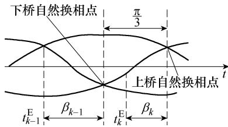  
图 4 导通工况结束时间示意图  
Fig.4 The diagram of the turn-off time of conduction status

$\beta _ { k - 1 }$ 和 $\beta _ { k }$ 分别是 $t _ { k - 1 } ^ { \mathrm { E } }$ 和 $t _ { k } ^ { \mathrm { E } }$ 时控制系统给出的超前触发延迟角，有

$$
t _ {k} ^ {\mathrm {E}} = t _ {k - 1} ^ {\mathrm {E}} + \frac {\beta_ {k - 1} - \beta_ {k} + \frac {\pi}{3}}{\omega} \tag {33}
$$

当第 k 个工况为换相工况时，工况的结束时间为换流阀关断时刻，由换流阀的换相电流过零点决定。换相电流 $i _ { \mathrm { c } } ( t )$ 包含在状态变量 x中，可写成

$$
i _ {\mathrm {c}} (t) = \boldsymbol {a} _ {k} ^ {\mathrm {T}} \boldsymbol {x} (t) \tag {34}
$$

式中， $\pmb { a } _ { k } ^ { \operatorname { T } }$ 为相应的系数向量，表明状态变量 x 中组成换相电流的成分。设 $t _ { k } ^ { \mathrm { E } }$ 为换相工况的结束时刻，则有

$$
i _ {\mathrm {c}} \left(t _ {k} ^ {\mathrm {E}}\right) = a _ {k} ^ {\mathrm {T}} \mathrm {e} ^ {A _ {k} \left(t _ {k} ^ {\mathrm {E}} - t _ {k} ^ {\mathrm {S}}\right)} x \left(t _ {k} ^ {\mathrm {S}}\right) = 0 \tag {35}
$$

式（35）中， $\pmb { a } _ { k } ^ { \operatorname { T } }$ 、 $\boldsymbol { A } _ { k }$ 、 $t _ { k } ^ { \mathrm { S } }$ 和 $\boldsymbol { x } \big ( t _ { k } ^ { \mathrm { S } } \big )$ 均为已知量，因此式（35）是一个一维非线性方程，可用牛顿法精确求解 $t _ { k } ^ { \mathrm { E } }$ 。

# 2.3 熄弧角的求解

熄弧角的值与自然换相点和换流阀的关断时刻有关。由熄弧角的定义可知，换流阀的关断时刻到阀所对应的正向电压恢复时刻，这之间的差值即为熄弧角。前面已经详细说明了换流阀关断时刻的求解过程，用 $t _ { k } ^ { \mathrm { E } }$ 表示；阀所对应的正向电压恢复时刻即为自然换相点，只与逆变侧三相电压有关，用 $t _ { k } ^ { \mathrm { E E } }$ 表示。熄弧角γ可表示为

$$
\gamma = \left(t _ {k} ^ {\mathrm {E E}} - t _ {k} ^ {\mathrm {E}}\right) \omega \tag {36}
$$

# 2.4 初始值的计算

系统仿真开始需要一个初始值，需要计算初始值的包括一次设备的状态变量 $\pmb { x } = \left[ \pmb { x } _ { \mathrm { D } } ^ { \mathrm { T } } \ \pmb { x } _ { \mathrm { I F } } ^ { \mathrm { T } } \ \pmb { x } _ { \mathrm { I c } } ^ { \mathrm { T } } \ \pmb { \dot { u } } _ { \mathrm { I } } ^ { \mathrm { T } } \ \pmb { \dot { v } } _ { \mathrm { I } } ^ { \mathrm { T } } \right] ^ { \mathrm { T } }$ 代数变量 $u _ { \mathrm { { I D } } }$ ，控制系统给出的触发延迟角 α 和超前触发延迟角 $\beta$ ，以及一次设备的状态矩阵 A。其中， $\boldsymbol { x } _ { \mathrm { D } } ^ { \mathrm { T } }$ 为直流线路信息，可以和α、β一起，通过准稳态公式[15]计算得到； $\boldsymbol { x } _ { \mathrm { I F } } ^ { \mathrm { T } }$ 为滤波器信息，假设

其电流初始值为零，其电压初始值和逆变侧直流电压值相同； $\boldsymbol { x } _ { \mathrm { I c } } ^ { \mathrm { T } }$ 为换流器各相电流的大小，和换流器运行状态有关，对应关系可参考文献[7]；状态矩阵A 和换流器所处工况有关。 $\dot { \pmb u } _ { \mathrm { I } } ^ { \mathrm { T } }$ 和 $\dot { \pmb { \nu } } _ { \mathrm { I } } ^ { \mathrm { T } }$ 仅和交流系统有关，当起始时刻给定，其值也就确定。

# 2.5 稳态解计算

系统稳定运行时，交流母线输入的是三相正弦基波分量，此时系统的时域响应即为稳态解。可见，稳态解是具有周期性的，即满足

$$
\boldsymbol {x} (t + T) = \boldsymbol {x} (t) \tag {37}
$$

式中， $T$ 为交流系统的一个周期。假设仿真的起始时刻为 $t _ { 0 }$ ，对应的系统换流器工况为 $\mathbf { A } | \mathbf { B } \to \mathbf { C } , \mathbf { A } | \mathbf { B }$ ，根据 2.4 节初始值计算的描述，计算出求解稳态解时的初始值。

系统稳定时，整流侧和逆变侧的触发延迟角都保持不变，因此，整流侧的等效理想电压源的幅值不变，而且在计算稳态解时可以不考虑控制系统的作用。前面的初始值计算里，已经利用准稳态公式求得了触发延迟角α和超前触发延迟角 $\beta$ 的值，根据 $\beta$ 的值和换相工况求解得到的换相结束时刻划分仿真的时间段，在每个时间段内，求解对应的状态矩阵，并利用式（30）和式（31）求系统的时域响应。当系统的时域响应满足 $\| { \pmb x } ( t + T ) - { \pmb x } ( t ) \| < \varepsilon$ 时，即求得系统的稳态解 ${ \pmb x } ( t ) = { \pmb x } ( t + T )$ 。稳态解 $x ( t )$ 可以作为暂态计算的初值。

# 3 控制系统

本文的控制系统和 CIGRE 标准算例的控制器是一致的，其整流侧采用最小触发延迟角限制的定电流控制，逆变侧采用定电流控制和定熄弧角控制相结合的方式，两侧都配有低压限流环节（Voltage-Dependent Current-Order Limit, VDCOL）。控制系统的仿真计算与一次设备的解析算法不同，采用的是变步长积分的方法。

# 3.1 控制系统的数学模型

整流侧的控制系统框图如图 5 所示，输入是整流侧的直流电流 $i _ { \mathrm { R D } }$ 。根据图 5 的控制逻辑，可列写

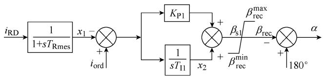  
图 5 整流侧控制系统框图  
Fig.5 Block diagram of rectifier control system

其微分-代数方程组为

$$
\left\{ \begin{array}{l} T _ {\mathrm {R m e s}} p x _ {1} = I _ {\mathrm {R D}} - x _ {1} \\ T _ {\mathrm {I l}} p x _ {2} = I _ {\mathrm {o r d}} - x _ {1} \\ \beta_ {\mathrm {s l}} = K _ {\mathrm {P l}} \left(I _ {\mathrm {o r d}} - x _ {1}\right) + x _ {2} \\ \beta_ {\mathrm {r e c}} = \operatorname * {l i m i t e d} \left\{\beta_ {\mathrm {r e c}} ^ {\max }, \beta_ {\mathrm {s l}}, \beta_ {\mathrm {r e c}} ^ {\min } \right\} \\ \alpha = \pi - \beta_ {\mathrm {r e c}} \end{array} \right. \tag {38}
$$

式中，limited 为分段函数，表达式可写为

$$
\beta_ {\mathrm {r e c}} = \left\{ \begin{array}{l l} \beta_ {\mathrm {r e c}} ^ {\max } & \quad \beta_ {\mathrm {s l}} > \beta_ {\mathrm {r e c}} ^ {\max } \\ \beta_ {\mathrm {s l}} & \quad \beta_ {\mathrm {r e c}} ^ {\min } <   \beta_ {\mathrm {s l}} <   \beta_ {\mathrm {r e c}} ^ {\max } \\ \beta_ {\mathrm {r e c}} ^ {\min } & \quad \beta_ {\mathrm {s l}} <   \beta_ {\mathrm {r e c}} ^ {\min } \end{array} \right.
$$

逆变侧控制框图如图 6 所示，输入为逆变侧直流电流 $i _ { \mathrm { I D } }$ 和熄弧角 $\gamma$ 。逆变侧的控制系统方程为

$$
\left\{ \begin{array}{l} T _ {\text {I m e s}} p x _ {4} = i _ {\mathrm {I D}} - x _ {4} \\ T _ {\mathrm {I} 2} p x _ {5} = i _ {\text {o r d}} - x _ {4} - \Delta I \\ T _ {\mathrm {I} 3} p x _ {6} = \Delta \gamma \\ \Delta \gamma = \max  \left\{\Delta \gamma_ {\max }, \gamma_ {\text {o r d}} + \Delta \gamma_ {\text {c e c}} - \gamma_ {\min } \right\} \\ \beta_ {\mathrm {s} 2} = K _ {\mathrm {P} 2} \left(I _ {\text {o r d}} - x _ {4} - \Delta I\right) + x _ {5} \\ \beta_ {\mathrm {s} 3} = K _ {\mathrm {P} 3} \Delta \gamma + x _ {6} \\ \beta_ {\text {i n v}} = \max  \left\{\beta_ {\text {i n v} 1}, \beta_ {\text {i n v} 2} \right\} \end{array} \right. \tag {39}
$$

式中， $\Delta \gamma _ { \mathrm { c e c } }$ 、 $\beta _ { \mathrm { i n v l } }$ 和 $\beta _ { \mathrm { i n v } 2 }$ 为分段函数，表示为

$$
\Delta \gamma_ {\mathrm {c e c}} = \left\{ \begin{array}{l l} 0 & I _ {\mathrm {o r d}} - x _ {4} \leqslant 0 \\ \frac {\overline {{\gamma}} _ {\mathrm {c}}}{\overline {{x}} _ {\mathrm {c}}} (I _ {\mathrm {o r d}} - x _ {4}) & 0 <   I _ {\mathrm {o r d}} - x _ {4} \leqslant \overline {{x}} _ {\mathrm {c}} \\ \overline {{\gamma}} _ {\mathrm {c}} & \overline {{x}} _ {\mathrm {c}} <   I _ {\mathrm {o r d}} - x _ {4} \end{array} \right.
$$

$$
\beta_ {\text {i n v l}} = \left\{ \begin{array}{l l} \beta_ {\text {i n v l}} ^ {\max } & \quad \beta_ {\text {s 2}} > \beta_ {\text {i n v l}} ^ {\max } \\ \beta_ {\text {s 2}} & \quad \beta_ {\text {i n v l}} ^ {\min } <   \beta_ {\text {s 2}} <   \beta_ {\text {i n v l}} ^ {\max } \\ \beta_ {\text {i n v l}} ^ {\min } & \quad \beta_ {\text {s 2}} <   \beta_ {\text {i n v l}} ^ {\min } \end{array} \right.
$$

$$
\beta_ {\mathrm {i n v} 2} = \left\{ \begin{array}{l l} \beta_ {\mathrm {i n v} 2} ^ {\max } & \beta_ {\mathrm {s} 3} > \beta_ {\mathrm {i n v} 2} ^ {\max } \\ \beta_ {\mathrm {s} 3} & \beta_ {\mathrm {i n v} 2} ^ {\min } <   \beta_ {\mathrm {s} 3} <   \beta_ {\mathrm {i n v} 2} ^ {\max } \\ \beta_ {\mathrm {i n v} 2} ^ {\min } & \beta_ {\mathrm {s} 3} <   \beta_ {\mathrm {i n v} 2} ^ {\min } \end{array} \right.
$$

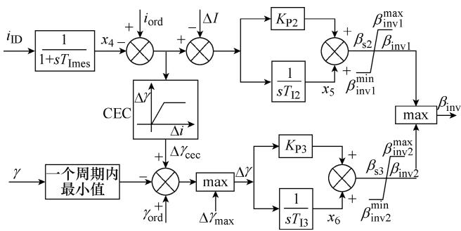  
图 6 逆变侧控制系统框图  
Fig.6 Block diagram of inverter control system

控制系统中的 $i _ { \mathrm { o r d } }$ 由 VDCOL 输出，其作用是当直流电压过低时限制直流电流的大小，输入为直流线路的中点电压值 $u _ { \mathrm { m i d } }$ ，具体控制框图如图 7 所示。

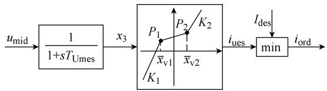  
图 7 VDCOL 控制框图  
Fig.7 Block diagram of VDCOL

另外，控制系统的模拟中有锁相环等环节[6]。VDCOL 和锁相环的方程都可以根据其控制框图列写对应的微分代数方程。由于篇幅所限，本文不再列出。

# 3.2 后退欧拉法

后退欧拉法是一个 L-稳定性的一阶隐式积分方法，具有更快的误差衰减率，同时能有效抑制数值振荡[16]。对于常微分方程 $p { \pmb x } = { \pmb f } ( { \pmb x } , t )$ ， 在 t ～t t+Δ 的积分步长内，后退欧拉法的积分公式有

$$
\boldsymbol {x} (t + \Delta t) = \boldsymbol {x} (t) + \Delta t \cdot \boldsymbol {f} (\boldsymbol {x} (t + \Delta t)) \tag {40}
$$

以式（38）中第 1 式为例，应用式（40）可得

$$
\boldsymbol {x} _ {1} (t + \Delta t) = \boldsymbol {x} _ {1} (t) + \frac {\Delta t}{T _ {\mathrm {R m e s}}} \left[ I _ {\mathrm {R D}} (t + \Delta t) + \boldsymbol {x} _ {1} (t + \Delta t) \right] \tag {41}
$$

化简后可得

$$
\boldsymbol {x} _ {1} (t + \Delta t) = \frac {T _ {\text {R m e s}}}{T _ {\text {R m e s}} - \Delta t} \boldsymbol {x} _ {1} (t) + \frac {\Delta t}{T _ {\text {R m e s}} - \Delta t} \cdot I _ {\text {R D}} (t + \Delta t) \tag {42}
$$

控制系统的其他微分方程也可以进行同样的化简。这样，利用 t 时刻的控制系统的状态量与 t t + Δ时刻的控制系统输入量，积分步长为Δt，则可求解t t + Δ 时刻控制系统的状态量和输出量。

# 3.3 变步长积分法

控制系统的变化相比于一次设备的变化要慢得多，而且一次设备系统不同工况的持续时间也不一样，因此，采用变步长的积分方法计算控制系统的时域响应成为最优的选择。给定控制系统最大的积分步长 $\Delta t _ { \mathrm { m } }$ ，图 8 给出了控制系统每次计算的积分步长选取的示意图。

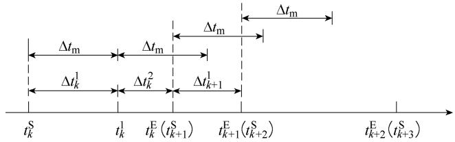  
图 8 控制系统的积分步长  
Fig.8 Sequence diagram of the step-changed method

从图 8 可以看出，当系统工况（如第 k 个工况）的持续时间大于 $\Delta t _ { \mathrm { m } }$ 时，先以 $\Delta t _ { k } ^ { 1 } { = } \Delta t _ { \mathrm { m } }$ 作为积分步长算到 $t _ { k } ^ { 1 }$ ，下一个积分步长取 $\Delta t _ { k } ^ { 2 } = t _ { k } ^ { \mathrm { E } } - t _ { k } ^ { 1 }$ ；当系统工况（如第k+1个工况）的持续时间小于 $\Delta t _ { \mathrm { m } }$ 时，取积分步长 $\Delta t _ { k + 1 } ^ { 1 } = t _ { k + 1 } ^ { \mathrm { S } } - t _ { k + 1 } ^ { \mathrm { E } }$ 。可见，积分步长是不断变化的。

# 3.4 控制系统与一次设备仿真的数据交互

一次设备仿真给控制系统输入整流侧的直流电流 $i _ { \mathrm { R D } }$ 、逆变侧直流电流 $i _ { \mathrm { I D } }$ 、熄弧角 $\gamma$ 和直流线路的中点电压值 $\boldsymbol { u } _ { \mathrm { D } }$ ；控制系统给一次设备返回触发延迟角 α 和超前触发延迟角 $\beta$ 。

以图 8 为例，在 $t _ { k } ^ { \mathrm { S } }$ 时，控制系统给出α 和 $\beta$ 的值；在 $t _ { k } ^ { \mathrm { S } } \sim t _ { k } ^ { 1 }$ 内，一次设备的状态量用式（30）计算得到；在 $t _ { k } ^ { 1 }$ 时，控制系统再次计算给出α和 $\beta$ 的值；在 $t _ { k } ^ { 1 } \sim t _ { k } ^ { \mathrm { E } }$ 内，一次设备的状态量再用式（30）计算得到；如此循环往复，最终得到 HVDC 系统的仿真结果。

# 4 算例与分析

# 4.1 算例说明

本文所用算例系统是在 CIGRE 标准算例[17-19]的基础上，忽略交流母线的上的交流滤波器和交流系统的等值阻抗，同时增加直流滤波器元件。系统的具体参数值可参考文献[7]，此处不再赘述。

为了验证所提简化模型解析算法的准确性和有效性，在 Matlab 里编程实现本文所提解析算法，同时在 PSCAD 里搭建算例系统（见图 1）所对应的模型，把 PSCAD 的仿真结果视为准确值，比较二者的仿真结果。PSACD 的仿真步长为 50μs，仿真时长为 2s。

# 4.2 稳态计算结果

系统稳定运行时，逆变侧换流母线的电压为三相对称的正弦波，线电压的有名值为 $2 2 6 . 5 5 \angle 0 ^ { \circ }$ 。由本文方法计算得到的触发延迟角 $\alpha = 1 . 4 2 ^ { \circ }$ °，超前触发延迟角 $\beta { = } 3 8 . 0 4 ^ { \circ }$ °；PSCAD 仿真计算得到的结果为 $\alpha { = } 9 . 9 2 ^ { \circ }$ °、 $\beta { = } 3 8 . 0 6 ^ { \circ }$ °。对整流侧，本文采用了简化的模型，因此触发延迟角的误差略大，为 $0 . 5 ^ { \circ }$ °。对逆变侧，本文采用了详细模型，与 PSCAD 相比，超前触发延迟角的计算结果误差仅有 0.02°。

对整流侧的模型的简化，并不影响逆变侧的稳态计算结果。图 9 给出了采用本文方法求得的逆变侧直流电压和直流电流的波形。为了进行对比，图中引入了 PSCAD 的计算结果。由图 9 可见，两种

方法得到的结果几乎重合。从数值计算结果可知，逆变侧直流电压和电流的最大误差分别为 1.98V 和0.003A，其误差百分比仅为 0.397% 和 0.151% ，这证明了所提模型和算法的准确性。

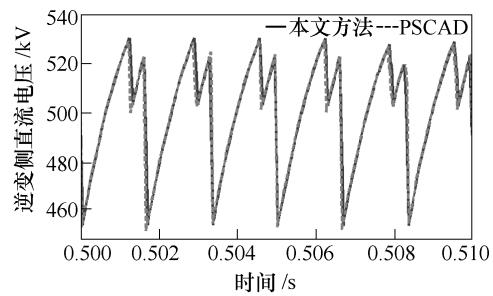

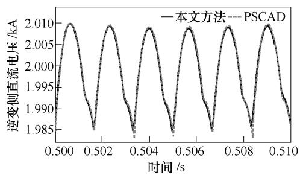  
图 9 稳态运行时逆变侧的直流电压和直流电流  
Fig.9 DC voltage and DC current of the inverter side under steady state operation

# 4.3 故障下的仿真结果

本节对于对称和不对称两种故障条件下的直流逆变侧响应进行仿真计算。对称故障的设置中，逆变侧换流母线在 1s 时电压跌落至 0.9(pu)，0.1s 后电压恢复。不对称故障的设置中，采用文献[7]中的不对称电压来分析，同样在 0.1s 后电压恢复。

本文方法和 PSCAD 求取的系统相关电气量波形分别如图 10 和图 11 所示。对比图中曲线可以看出，无论是对称还是不对称故障，采用本文提出的简化模型及其解析算法的计算结果和 PSCAD 双端电磁暂态模型的仿真结果都比较接近，系统电气量波形几乎重合。

对称故障时，本文方法和 PSCAD 的计算的最大超前触发延迟角分别为 77.57°和 76.39°，误差仅有1.18 °。 逆 变 侧 首 次 换 相 不 成 功 的 时 间 分 别 为1.003 1s 和 1.003 4s，相差为 0.3ms。这里的首次换相不成功时刻，即为熄弧角开始等于零的时刻。

不对称故障时，最大超前触发延迟角分别为75.39°和 75.81°，误差仅有 0.42°。逆变侧首次换相不成功的时间分别为 1.005 2s 和 1.004 7s，相差为 0.5ms。注意到 PSCAD 是用插值计算得到的电流过零点，而本文是用解析方法精确求解的电流过零点时刻。二者之间出现差异是模型和方法共同决定的。

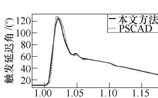

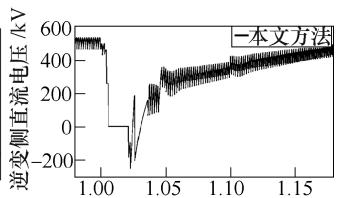

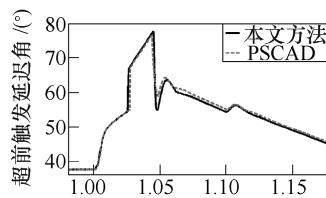

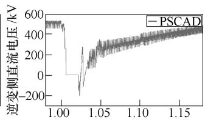

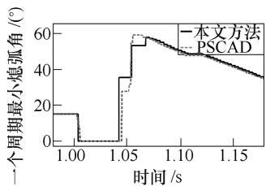

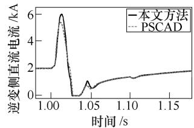  
图 10 逆变侧交流母线对称故障下的波形

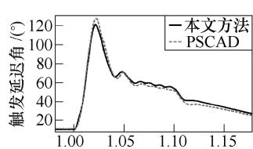  
Fig.10 Waveforms under the symmetric disturbance of AC voltage on the inverter side

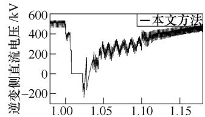

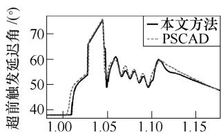

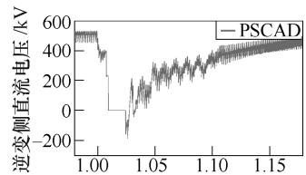

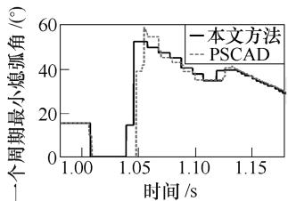

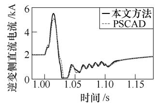  
图 11 逆变侧交流母线不对称故障下的波形  
Fig.11 Waveforms under the symmetric disturbance of AC voltage on the inverter side

虽然本文方法对于整流侧的换流器进行了简化，但采用准稳态模型下，对于整流侧触发延迟角的模拟也是准确的。图 10 和图 11 中也给出了整流侧的触发延迟角，其最大误差在对称故障和不对称故障下分别仅为 3.4°和 6.1°。

# 4.4 简化模型解析算法性能分析

目前主流的电磁暂态仿真软件，如 PSCAD 采用的是数值积分的方法来计算系统的时域响应，和

本文所提的解析算法相比，不仅需要μs 级的积分步长来保证计算的准确性，通过插值法求得的换相电流过零点存在计算精度的问题，而且截断误差与数值稳定性问题不可避免[7]。

本文所提方法不仅保留了解析算法[6-7]的优势，而且进行了模型的进一步简化，使系统的状态变量和状态矩阵的维数减少近半，大大减小了计算的复杂度。而从仿真结果来看，该简化对逆变侧仿真结果影响并不大，适用于电力系统仿真及换相失败判断。

将本文提出的方法在型号为 i5−7400CPU 的台式机上进行了测试，仿真时长选择为 2s。采用 PSCAD仿真时 CPU 计算时间为 13.03s，采用双端直流系统的解析方法[6-7]消耗的时间为 10.43s，而采用本文的方法消耗的时间仅为 4.91s。可见本文的方法在计算效率上具有较大的优势。

# 5 结论

本文对经典的双端 LCC-HVDC 输电系统进行研究，根据其自身的特性，利用准稳态模型对整流侧进行了模型简化，并采用解析方法对简化后的模型进行了暂态响应的仿真实现。

采用简化模型后，根据其电路特性，仍然可以用解析方法进行暂态响应的求解。而由于状态变量的个数大大降低，其计算效率明显提高。仿真时间仅为 PSCAD 仿真时长的 38%。

从理论分析和算例仿真结果可知，简化后的HVDC 模型对系统暂态响应的求解结果与经典双端模型相比差别很小，对换相失败的判断也基本一致，说明了所提模型的可用性以及仿真方法的准确性。

# 参考文献

[1] 周浩. 特高压交直流输电技术[M]. 杭州: 浙江大学出版社, 2014.  
[2] Lopez B L, Davis-Moon L, Sterious W, et al. Quasi-static stability of HVDC systems considering dynamic effects of synchronous machines and excitation voltage control[J]. IEEE Transactions on Power Delivery, 2006, 21(3): 1501-1514.   
[3] 周长春, 徐政. 直流输电准稳态模型有效性的仿真验证[J]. 中国电机工程学报, 2003, 23(12): 33-36.Zhou Changchun, Xu Zheng. Simulation validity testof the HVDC quasi-steady-state model[J]. Pro-ceedings of the CSEE, 2003, 23(12): 33-36.

[4] Hammad A E, Kuhn W. A computation algorithm for assessing voltage stability at AC/DC interconnections[J]. IEEE Transactions on Power Systems, 1986, 1(1): 209-215.   
[5] 毕如玉, 林涛, 陈汝斯, 等. 交直流混合电力系统 的安全 校正 策 略 [J]. 电工技 术学报 , 2016, 31(9): 50-57. Bi Ruyu, Lin Tao, Chen Rusi, et al. The security correction strategy in AC and DC hybrid power system[J]. Transactions of China Electrotechnical Society, 2016, 31(9): 50-57.   
[6] 李崇涛, 林啸, 赵勇, 等. 高压直流输电系统暂态过 程 的 解 析 解 法 (一 ): 数 学 模 型 [J]. 电 网 技 术 ,2017, 41(1): 1-7.Li Chongtao, Lin Xiao, Zhao Yong, et al. Ananalytical solution for transient process of HVDCtransmission system (Part 1)-mathematical model[J].Power System Technology, 2017, 41(1): 1-7.  
[7] 李崇涛, 林啸, 赵勇, 等. 高压直流输电系统暂态过程的解析解法(二): 算法与算例[J]. 电网技术,2017, 41(1): 8-13.Li Chongtao, Lin Xiao, Zhao Yong, et al. Ananalytical solution for transient process of HVDCtransmission system (Part 2), algorithm and example[J].Power System Technology, 2017, 41(1): 8-13.  
[8] 申洪明, 黄少锋, 费彬,等. 基于数学形态学的换相 失败检 测新 方 法 [J]. 电工技 术学报 , 2016, 31(4): 170-177. Shen Hongmin, Huang Shaofeng, Fei Bin, et al. A new method to detect commutation failure based on mathematical morphology[J]. Transactions of China Electrotechnical Society, 2016, 31(4): 170-177.   
[9] 赵畹君. 高压直流输电工程技术[M]. 北京: 中国电力工业出版社, 2004.  
[10] 王增平, 刘席洋, 李林泽,等. 多馈入直流输电系统换相失败边界条件[J]. 电工技术学报, 2017, 32(10):12-19.Wang Zengping, Liu Xiyang, Li Linze, et al.Boundary conditions of commutation failure in multi-infeed HVDC systems[J]. Transactions of ChinaElectrotechnical Society, 2017, 32(10): 12-19.  
[11] Prabha Kundur, 电 力 系 统 稳 定 与 控 制 [M]. 北 京 :中国电力出版社, 2001.  
[12] 王玲, 文俊, 李亚男, 等. 谐波对多馈入直流输电

系 统 换 相 失 败 的 影 响 [J]. 电 工 技 术 学 报 , 2017,32(3): 27-34.  
Wang Ling, Wen Jun, Li Yanan, et al. The harmonic effects on commutation faliure of multi-infeed direct current transmission systems[J]. Transactions of China Electrotechnical Society, 2017, 32(3): 27-34.   
[13] 唐庚, 徐政, 薛英林. LCC-MMC 混合高压直流输电系统[J]. 电工技术学报, 2013, 28(10): 301-310.  
Tang Gen, Xu Zheng, Xue Yinlin, et al. A LCC-MMC hybrid HVDC transmission system[J]. Transactions of China Electrotechnical Society, 2013, 28(10): 301-310.   
[14] 王少辉, 唐飞, 向农. 华东电网多直流同时换相失败仿真分析[J]. 电力系统保护与控制, 2017, 45(12):16-21.  
Wang Shaohui, Tang Fei, Xiang Nong. Commutation failure simulation analysis of East China power grid multiple HVDC lines[J]. Power System Protection & Control, 2017, 45(12): 16-21.   
[15] 王锡凡, 现代电力系统分析[M]. 北京: 科学出版社 , 2003.  
[16] Hairer E, Wanner G. Solving ordinary differential equations II: stiff and differential-algebraic problems[M]. 2nd ed. Berlin, Heidelberg: Springer, 1996.

[17] Atighechi H, Chiniforoosh S, Jatskevich J, et al. Dynamic average-value modeling of CIGRE HVDC benchmark system[J]. IEEE Transactions on Power Delivery, 2014, 29(5): 2046-2054.   
[18] Faruque M O, Zhang Yuyan, Dinavahi V. Detailed modeling of CIGRE HVDC benchmark system using PSCAD/EMTDC and PSB/Simulink[J]. IEEE Transactions on Power Delivery, 2006, 21(1): 378-387.   
[19] 董曼玲, 谢施君, 何俊佳, 等. 采用 ATP/EMTP 的CIGRE HVDC 建模与仿真[J]. 高电压技术, 2010,36(3): 796-804.  
Dong Manling, Xie Shijun, He Junjia, et al. Modeling and simulation of CIGRE HVDC system using ATP/ EMTP[J]. High Voltage Engineering, 2010, 36(3): 796-804.

作者简介

程佩芬 女，1995 年生，硕士，研究方向为直流系统暂态仿真计算。

E-mail: chengpf_ee@163.com（通信作者）

李崇涛 男，1983 年生，副教授，研究方向为电力系统稳定性分析与控制。

E-mail: ctali@163.com

（编辑 张玉荣）