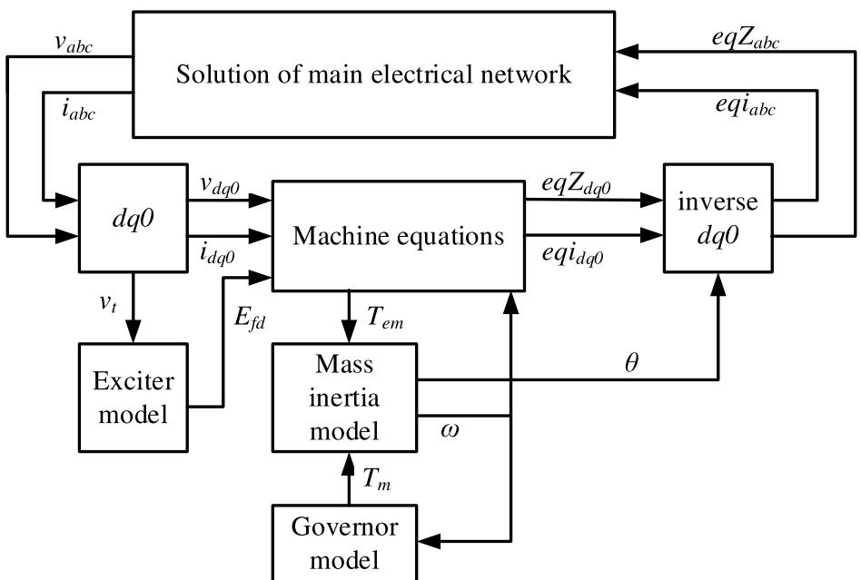
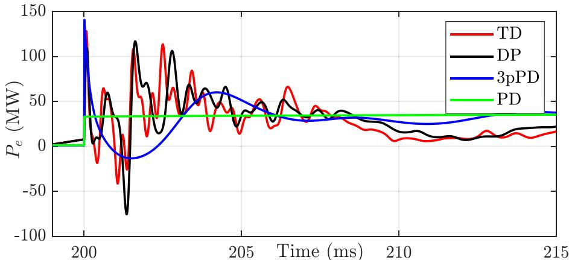
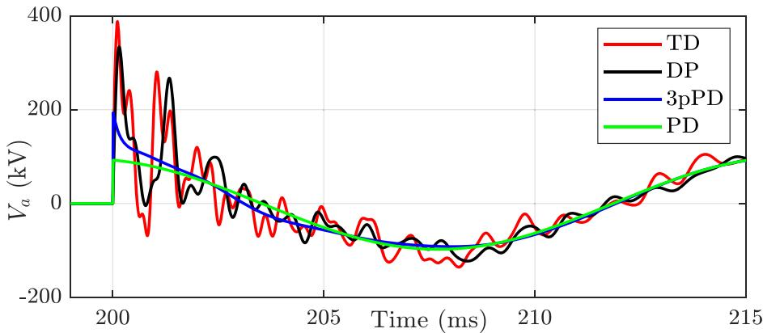
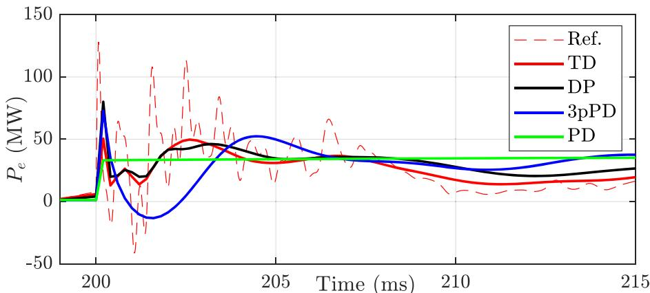
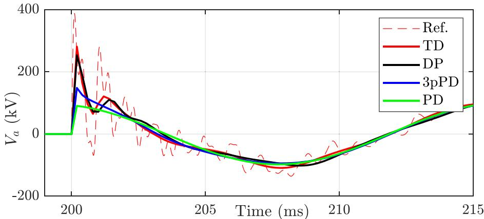
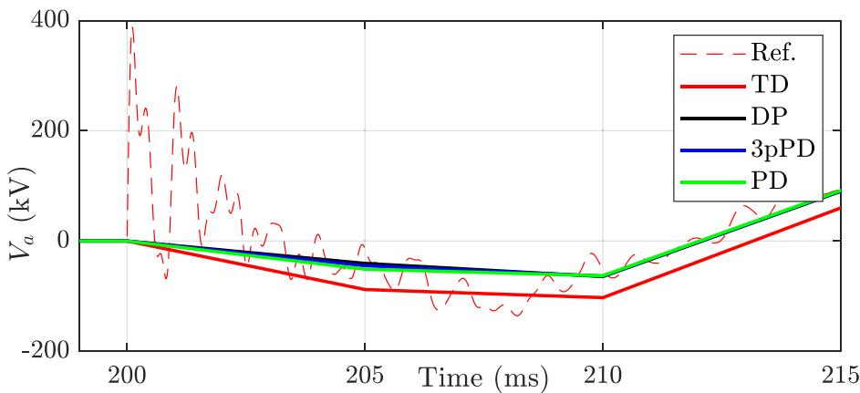
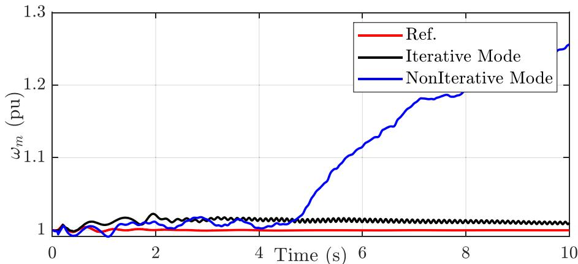
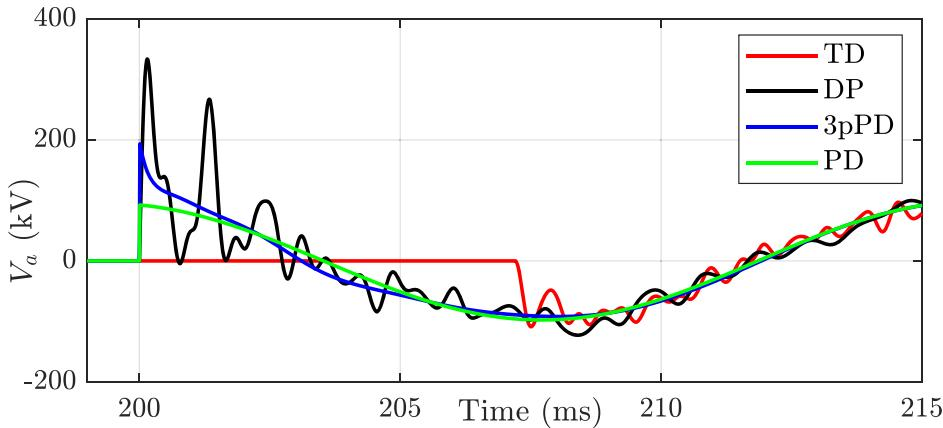
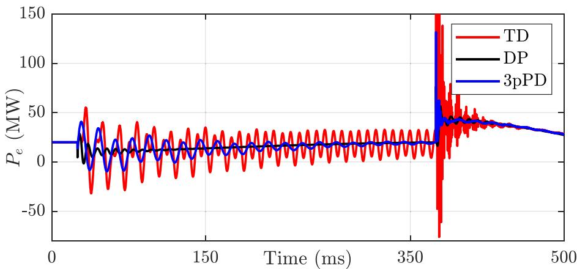
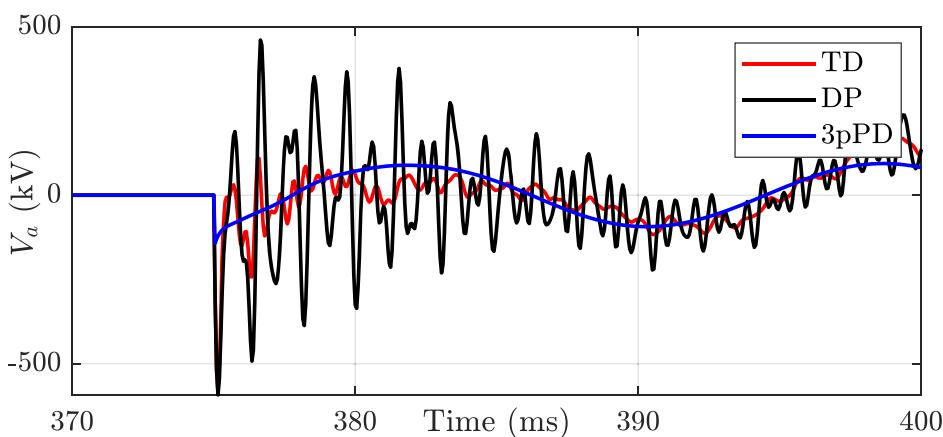

# Evaluation of time-domain and phasor-domain methods for power system transients

Reza Hassani a,* , Jean Mahseredjian a , Tshibain Tshibungu b , Ulas Karaagac c

a Department of Electrical Engineering, Polytechnique de Montr´eal, Montreal, Canada   
b IREQ (Hydro-Quebec), Montreal, Canada   
c Hong Kong Polytechnique, Honk Kong, China

# A R T I C L E I N F O

# Keywords:

Dynamic phasors

Electromagnetic transients

Time-domain

Transient stability

# A B S T R A C T

The computational process of both time-domain and phasor-domain algorithms is evaluated in this work. The following methods are used: circuit-based time-domain (TD), dynamic phasors (DP), three-phase phasor-domain (3pPD), and classic positive sequence phasor-domain (PD). The IEEE-118 benchmark is used to test all solution approaches implemented on the same computational platform. Furthermore, the advantages and differences in modeling methodologies are examined for the IEEE-118 benchmark. The experiments demonstrate important new facts on phasor-domain methods and, more specifically, on dynamic-phasors compared to TD algorithms.

# 1. Introduction

The power system is experiencing radical transitions with significant integration of renewable energy sources. These changes require the development of powerful simulation methods. Different types of simulation methods exist and fulfill various application objectives. Transient simulation methods are divided into two major types: electromagnetic transient (EMT) and transient stability (TS). Circuit-based EMT models can account for both low and extremely high-frequency transients. The TS-type methods are designed for capturing the slower electromechanical transients.

In TS-type algorithms, a critical approximation is to treat the network equations in quasi-steady-state (QSS), ignoring electromagnetic transients and harmonics. The classic PD techniques assume that the three phases are balanced and rely only on the positive sequence model of the network. The classic PD approach used in this paper is named phasor-domain (PD). It is, however, possible to account for unbalanced networks in full three-phase representation. The latter is named 3pPD in this paper.

The dynamic phasors (DP) [1,2] technique is based on a mix of time-domain and phasor-domain modeling. Unlike the PD approach, the DP methodology can simulate electromagnetic transients. In fact, in theory, it contains numerical ability to navigate between EMT-type and

TS-type methods by reducing or increasing numerical integration time-steps. Although, in theory, it may be expanded to include nonlinear components, it is typically used for linear circuits. Several publications are based on DP [2–9]. In [2], DP is used to model unbalanced distribution systems. References [3–5] introduce DP models of modular multilevel converter (MMC). A DP-based model is developed for line-commutated-converters in [6]. In [7], a multiscale induction machine model using the DP method is developed. Also, reference [8] presents an iterative solution for differential equations of DP method to simulate unbalanced distribution networks with nonlinear elements.

Some studies compared the accuracy and computational performance for time-domain (TD) and DP methods[5–8,10–12]. For example, reference [10] compares EMT-type and DP methods and reports that the DP method is ten times faster. Reference [8] uses a test feeder to demonstrate that the DP method with a time-step of 500µs is 17 times faster than an EMT-type solution with 50µs. Reference [5] illustrates that for 400 identical submodules per arm in MMC, the DP model is approximately eight times faster than the detailed equivalent model (EMT-type) with the same simulation time-step.

However, the reported efficiency comparisons are circumstantial and do not account for EMT-type solution method improvements in performance and stability for larger time-steps. The comparisons do not use the same numerical integration time-steps [5]. Also, [5] uses a

simplified model of the detailed MMC which decreases accuracy for faster transients. The test cases are not simulated using the same plat form for all assessed methods [8,12]. Therefore, accuracy is not analyzed thoroughly[10,11].

An important aspect of the DP method is the computational performance. It is supposed to be faster than the EMT approach when larger numerical integration time-steps are used. It is also set to deliver better accuracy for electromechanical transients than the PD approaches. These two paradigms are verified and challenged in this paper for the IEEE-118 test system [13,14]. The emphasis is on synchronous machine (SM) modeling with its control systems in a linear network. This paper contributes new results on DP performance analysis using a practical/realistic benchmark named the IEEE-118 network [13,14]. The proposed methods (TD, DP, 3pPD, and PD) are meticulously programmed in the same computational environment to evaluate accuracy and performance for a span of numerical integration time-steps. Moreover, the DP method is compared to other phasor domain techniques, such as the classic phasor domain solution using the 3-phase network model (3pPD) and the positive network model (PD). An important new conclusion is the fact that the DP method is computationally less efficient for large time-steps than the TD solution. The referenced time-domain method (TD) of EMT-type uses an iterative solver [15] for synchronous generator equations, which allows the TD method, to remain comparatively accurate to simulate power systems when the numerical integration time-step is increased. In fact, iterative solvers are used for all methods tested in this paper to achieve the best accuracy and establish common comparison basis.

This paper is based on fixed time-step comparisons for all methods. It would have been also possible to test variable time-step solvers for both TD [16] and PD [17] approaches, but that should not logically affect the presented conclusions.

Although the DP and 3pDP solutions represent the network in threephases, this paper demonstrates that their accuracies deteriorate for unbalanced conditions.

Section 2 introduces the TD, DP, 3pPD, and PD methods used in this paper emphasizing synchronous machine modeling. Finally, in Section 3, the study case of the IEEE-118 power system is presented for accuracy and performance analysis.

# 2. Simulation methods

An overview of modules involved in the simulation process with emphasis on the synchronous generator model is shown in Fig. 1A similar diagram can be used for the presented TD, DP, 3pPD and PD methods. To establish comparisons on the same basis, the same numerical integration methods are used. The Trapezoidal and Backward Euler numerical integration methods are employed to discretize derivative equations. The Trapezoidal integration method is used as the main numerical solver, and two halved time-steps of Backward Euler integration are used to eliminate numerical oscillations following a discontinuity [18]. All methods are coded in MATLAB to establish the same computational environment for comparison purposes. EMTP [19] is used to validate the implemented TD method.

The solution steps are as follows:

1 Load-flow solution and initialization of all state variables.   
2 Advance time: $t = t + \Delta t$ .   
3 Calculate SM Norton equivalent circuit (all SMs): $e q Z _ { a b c }$ and eqiabc.   
4 Update the Norton equivalent in network equations (NE).   
5 Solve complete system of NE using sparse-matrix solver: $\mathbf { A } \mathbf { x } = \mathbf { b } .$   
6 Update SM equations and SM Norton equivalent.   
7 If any SM Norton equivalent exceeds given convergence tolerance, go to step 4 for next iteration, if not, go to step 8.   
8 $\mathrm { I f } \ t > t _ { \operatorname* { m a x } } ,$ exit.   
9 Predict SM variables and store history terms.   
10 Calculate all history terms.   
11 Go to step 2 until the last simulation time-point.

# 2.1. Time domain method: TD

The time-domain (TD) method used in this paper is similar to [15]. In TD the SM equations and NE are solved in time-domain using the circuit-based approach. Components with differential equations are discretized using the classic companion circuit approach.

The classic SM equations in dq0-domain of 6th order are recalled here for convenience. There is one damper on D-axis and two dampers on q-axis.

  
Fig. 1. Synchronous machine modeling.

$$
\nu_ {d} = - \frac {X ^ {\prime \prime} {} _ {d}}{\omega_ {s}} \frac {d i _ {d}}{d t} + \frac {1}{\omega_ {s}} \frac {d E ^ {\prime \prime} {} _ {q}}{d t} + \frac {\omega_ {r}}{\omega_ {s}} \left(X ^ {\prime \prime} {} _ {q} i _ {q} + E ^ {\prime \prime} {} _ {d}\right) - R _ {a} i _ {d} \tag {1}
$$

$$
\nu_ {q} = - \frac {X ^ {\prime \prime} {} _ {q}}{\omega_ {s}} \frac {d i _ {q}}{d t} - \frac {1}{\omega_ {s}} \frac {d E ^ {\prime \prime} {} _ {d}}{d t} - \frac {\omega_ {r}}{\omega_ {s}} \left(X ^ {\prime \prime} {} _ {d} i _ {d} - E ^ {\prime \prime} {} _ {q}\right) - R _ {a} i _ {q} \tag {2}
$$

$$
v _ {0} = - \frac {\left(X _ {l} + 3 X _ {n}\right)}{\omega_ {s}} \frac {d i _ {0}}{d t} - \left(R _ {a} + 3 R _ {n}\right) i _ {0} \tag {3}
$$

$$
\begin{array}{l} \frac {d E _ {q} ^ {\prime}}{d t} = \frac {1}{T _ {d 0} ^ {\prime}} \left[ E _ {f d} - \frac {X _ {d} - X _ {l}}{X _ {d} ^ {\prime} - X _ {l}} E _ {q} ^ {\prime} + \frac {X _ {d} - X _ {d} ^ {\prime}}{X _ {d} ^ {\prime} - X _ {l}} E _ {q} ^ {\prime \prime} \right. \tag {4} \\ - \frac {\left(X _ {d} - X _ {d} ^ {\prime}\right) \left(X _ {d} ^ {\prime \prime} - X _ {l}\right) i _ {d}}{X _ {d} ^ {\prime} - X _ {l}} \Bigg ] \\ \end{array}
$$

$$
\frac {d E ^ {\prime \prime} {} _ {q}}{d t} = \frac {1}{T ^ {\prime \prime} {} _ {d o}} \left[ - E ^ {\prime \prime} {} _ {q} + E ^ {\prime} {} _ {q} - \left(X ^ {\prime} {} _ {d} - X ^ {\prime \prime} {} _ {d}\right) i _ {d} \right] + \frac {X ^ {\prime \prime} {} _ {d} - X _ {l}}{X ^ {\prime} {} _ {d} - X _ {l}} \frac {d E ^ {\prime}}{d t} \tag {5}
$$

$$
\begin{array}{l} \frac {d E _ {d} ^ {\prime}}{d t} = \frac {1}{T _ {q 0} ^ {\prime}} \left[ - \frac {X _ {q} - X _ {l}}{X _ {q} ^ {\prime} - X _ {l}} E _ {d} ^ {\prime} + \frac {X _ {q} - X _ {q} ^ {\prime}}{X _ {q} ^ {\prime} - X _ {l}} E _ {d} ^ {\prime \prime} \right. \\ \left. + \frac {\left(X _ {q} - X _ {q} ^ {\prime}\right) \left(X ^ {\prime \prime} _ {q} - X _ {l}\right)}{X _ {q} ^ {\prime} - X _ {l}} i _ {q} \right] \\ \end{array}
$$

$$
\frac {d E _ {d} ^ {\prime \prime}}{d t} = \frac {1}{T _ {q o} ^ {\prime \prime}} \left[ - E _ {d} ^ {\prime \prime} + E _ {d} ^ {\prime} + \left(X _ {q} ^ {\prime} - X _ {q} ^ {\prime \prime}\right) i _ {q} \right] + \frac {X _ {q} ^ {\prime \prime} - X _ {l}}{X _ {q} ^ {\prime} - X _ {l}} \frac {d E _ {d} ^ {\prime}}{d t} \tag {7}
$$

$$
\psi_ {d} = - X _ {d} ^ {\prime \prime} i _ {d} + E _ {q} ^ {\prime \prime} \tag {8}
$$

$$
\psi_ {q} = - X _ {q} ^ {\prime \prime} i _ {q} - E _ {d} ^ {\prime \prime} \tag {9}
$$

$$
T _ {e m} = - \left(\psi_ {q} i _ {d} - \psi_ {d} i _ {q}\right) \tag {10}
$$

$$
J \frac {d \omega_ {m}}{d t} = T _ {e m} - T _ {m} - K _ {D} \left(\omega_ {m} - \omega_ {s}\right) \tag {11}
$$

where generator states, $\nu _ { d } ,$ $\nu _ { q } ,$ , $\nu _ { 0 } ,$ id, $i _ { q }$ and $i _ { 0 }$ are stator voltages and currents on dq0-axes. $E _ { d } ^ { ' } , ~ E _ { d } ^ { \prime \prime } , ~ E _ { q } ^ { ' }$ and $E _ { q } ^ { \prime \prime }$ are rotor transient and subtransient voltages on the d and q axes. The d and q-axis fluxes are given by $\psi _ { d }$ and $\psi _ { q } ,$ respectively. $E _ { f d }$ is generator field excitation voltage (exciter model output). $X _ { d } , X _ { d } ^ { ' } , X _ { d } ^ { \prime \prime } , X _ { q } , X _ { q } ^ { ' } , X _ { q } ^ { \prime \prime }$ are synchronous, transient, and sub-transient reactance on the d and $q$ axes. $R _ { a } , R _ { n } ,$ X and $X _ { n }$ are armature resistance, neutral resistance, armature leakage reactance and neutral reactance respectively. $T _ { d 0 } , T _ { d o } ^ { \prime \prime } , T _ { q 0 } ^ { ' }$ and $T _ { q o } ^ { \prime \prime }$ are transient and sub-transient open circuit time constants on the d and q axes. $\omega _ { s } ,$ ωm and ωr are synchronous, mechanical and rotor angular speeds, respectively. $T _ { e m }$ and $T _ { m }$ (output of governor model) are the electrical and mechanical torques, respectively. J and $K _ { D }$ are moment of inertia and viscous friction coefficient, respectively.

The back transformation of $e q Z _ { d q 0 }$ into $e q Z _ { a b c }$ produces a timedependent and unsymmetric resistance matrix. Contrary to [15] this condition is not avoided and requires refactorization of NE with iterations until convergence, to achieve the best accuracy.

# 2.2. Dynamic phasor method: DP

The concept of Dynamic Phasors (see [1,20,21]) is based on the expression of a periodic or nearly periodic signal x with period T. The kth Fourier coefficient of x variable derivative is given by

$$
\left. \frac {d x}{d t} \right| _ {k} = \frac {d \mathrm {X} _ {k}}{d t} + j k \omega_ {s} \mathrm {X} _ {k} \tag {12}
$$

where k is the number of Fourier coefficients, x is dynamic phasor variable and ${ \mathrm { X } } _ { k }$ is the kth Fourier coefficient. In this notation, lowercase

italic letters are used for instantaneous variables, uppercase letters for dynamic phasors coefficients, and bold uppercase letters for classic phasor coefficients.

The DP method employs the EMT-type approach to discretize the derivative term of the network component. Thus, for a given, inductance $L ,$ for example:

$$
\mathrm {I} _ {t} = \frac {1}{Z _ {L}} \mathrm {V} _ {t} + \frac {Z _ {L} ^ {*}}{Z _ {L}} \mathrm {I} _ {t - \Delta t} + \frac {1}{Z _ {L}} \mathrm {V} _ {t - \Delta t} \tag {13}
$$

where $Z _ { L } = ( 2 L / \Delta t ) + j \omega L$ and ω is the solution frequency. In this presentation, the NEs are solved only at fundamental frequency.

The DP model of SM is derived from converting symmetrical component to dq0-axes. The Park’s transform $( x _ { d q 0 } = T ( \theta ) x _ { a b c } )$ gives dq0 components from abc frame. The vector x can be voltage or current, and Park’s transform matrix is:

$$
T (\theta) = \left[ \begin{array}{c c c} \cos (\theta) & \cos \left(\theta - \frac {2 \pi}{3}\right) & \cos \left(\theta + \frac {2 \pi}{3}\right) \\ - \sin (\theta) & - \sin \left(\theta - \frac {2 \pi}{3}\right) & - \sin \left(\theta + \frac {2 \pi}{3}\right) \\ \frac {1}{2} & \frac {1}{2} & \frac {1}{2} \end{array} \right] \tag {14}
$$

The matrix for transformation from symmetrical component to abc frame is:

$$
A = \left[ \begin{array}{c c c} 1 & 1 & 1 \\ e ^ {- j \frac {\pi}{3}} & e ^ {\frac {j \pi}{3}} & 1 \\ e ^ {\frac {j \pi}{3}} & e ^ {- j \frac {\pi}{3}} & 1 \end{array} \right] \tag {15}
$$

Then, by applying the combined matrices of T and $A ^ { - 1 }$ to a symmetrical component of the kth Fourier coefficient gives:

$$
\left[ \begin{array}{l} \mathrm {X} _ {d _ {k}} \\ \mathrm {X} _ {q _ {k}} \\ \mathrm {X} _ {0 _ {k}} \end{array} \right] = \left[ \begin{array}{c c c} j e ^ {- j \delta} & - j e ^ {j \delta} & 0 \\ e ^ {- j \delta} & e ^ {j \delta} & 0 \\ 0 & 0 & 1 \end{array} \right] \left[ \begin{array}{l} \mathrm {X} _ {p _ {k + 1}} \\ \mathrm {X} _ {n _ {k - 1}} \\ \mathrm {X} _ {z _ {k}} \end{array} \right] \tag {16}
$$

Eq. (16) results into: the positive sequence of the kth harmonic causes the $( k \mathrm { ~ + ~ } 1 ) { \mathrm { t h } }$ harmonic component on the D- and q- axes; the negative sequence of the kth harmonic causes the $( k + 1 ) \mathrm { t h }$ harmonic on the D- and q- axes; and the zero sequence of the kth harmonic causes the kth harmonic on the 0-axis.

In an unbalanced system, the second harmonic on the D- and q-axes is caused by the negative sequence of the fundamental frequency, and the second harmonic on the D- and q-axes produces the positive and negative symmetrical components of the third harmonic in the network. Subsequently, on the D- and q-axes, the negative sequence of the third harmonic produces the fourth harmonic. The circle continues for the odd harmonics of symmetrical components and the even harmonics of the Dand q-axes.

Considering only fundamental frequency, the current or voltage in dq0 reference frame of the SM appears as a DC component, double system frequency, and system frequency due to positive, negative, and zero sequence respectively [12,21]. Thus, the Fourier coefficients of the dynamic phasors in this case are $k = \{ 0 , \pm 1 , \pm 2 \}$ . To obtain the DP equation of voltage on D-axis, all time domain variables of Eq. (1) are converted to the DP domain. Hence:

$$
\left. \nu_ {d} \right| _ {k = 0, \pm 2} =
$$

$$
\left. \left[ - \frac {X ^ {\prime \prime} {} _ {d}}{\omega_ {s}} \frac {d i _ {d}}{d t} + \frac {1}{\omega_ {s}} \frac {d E ^ {\prime \prime} {} _ {q}}{d t} + \frac {\omega_ {r}}{\omega_ {s}} \left(X ^ {\prime \prime} {} _ {q} i _ {q} + E ^ {\prime \prime} {} _ {d}\right) - R _ {a} i _ {d} \right] \right| _ {k = 0, \pm 2} \tag {17}
$$

Note that the D-axis or q-axis transformed voltage and currents have only the DC and double system frequency components. Therefore, the other variables $( E _ { d } ^ { \prime } , E _ { d } ^ { \prime \prime } , \omega _ { r } \ldots )$ have only the DC and double system frequency components as well. Using DP properties [20, 21] and separating the DC and double system frequency gives Eqs. (18) and (19).

$$
\mathrm {V} _ {d _ {0}} = - \frac {X ^ {\prime \prime} {} _ {d}}{\omega_ {s}} \frac {d \mathrm {I} _ {d _ {0}}}{d t} + \frac {1}{\omega_ {s}} \frac {d \mathrm {E} ^ {\prime \prime} {} _ {q _ {0}}}{d t} + \frac {\Omega_ {r _ {0}}}{\omega_ {s}} \left(X ^ {\prime \prime} {} _ {q} \mathrm {I} _ {q _ {0}} + \mathrm {E} ^ {\prime \prime} {} _ {d _ {0}}\right) \tag {18}
$$

$$
+ \frac {\Omega_ {r _ {2}}}{\omega_ {s}} ^ {*} \left(X ^ {\prime \prime} _ {q} I _ {q _ {2}} + E ^ {\prime \prime} _ {d _ {2}}\right) + \frac {\Omega_ {r _ {2}}}{\omega_ {s}} \left(X ^ {\prime \prime} _ {q} I _ {q _ {2}} ^ {*} + E ^ {\prime \prime} _ {d _ {2}} ^ {*}\right) - R _ {a} I _ {d _ {0}}
$$

$$
V _ {d _ {2}} = - \frac {X ^ {\prime \prime} {} _ {d}}{\omega_ {s}} \frac {d I _ {d _ {2}}}{d t} - j 2 X ^ {\prime \prime} {} _ {d} I _ {d _ {2}} + \frac {1}{\omega_ {s}} \frac {d E ^ {\prime \prime} {} _ {q 2}}{d t} + j 2 E ^ {\prime \prime} {} _ {q 2} \tag {19}
$$

$$
+ \frac {\Omega_ {r _ {2}}}{\omega_ {s}} \left(X ^ {\prime \prime} _ {q} I _ {q _ {0}} + E ^ {\prime \prime} _ {d _ {0}}\right) + \frac {\Omega_ {r _ {0}}}{\omega_ {s}} \left(X ^ {\prime \prime} _ {q} I _ {q _ {2}} + E ^ {\prime \prime} _ {d _ {2}}\right) - R _ {a} I _ {d _ {2}}
$$

where Ω, the uppercase letter for $\omega ,$ is angular speed for the phasor domain methods.

It is straightforward to obtain the negative double frequency equation $( V _ { d _ { - 2 } } ) .$ . Using the DP property [20, 21], the negative double frequency equation is the conjugation of Eq. (19). The same approach can be used for the other Eqs. (2)–(11), which includes q-axis. The full model of synchronous machine for the DP method can be constructed from the above.

In DP, the NE are solved with both time-domain and frequency domain terms, as in Eq. (12), for example. The output waveforms in the DP method are in phasor-domain. They can be separately converted back to time-domain at the end of simulation process.

# 2.3. Three-phase phasor domain method: 3pPD

The 3pPD method used in this paper, solves NE equations only in phasor-domain. Unlike conventional transient stability simulation methods, the 3pPD can simulate an unbalanced power system. The 3pPD model of the synchronous machine can be derived from the DP model. Eqs. (18) and (19) for the 3pPD are:

$$
\mathbf {V} _ {d _ {0}} = - \frac {X ^ {\prime \prime} {} _ {d}}{\omega_ {s}} \frac {d \mathbf {I} _ {d _ {0}}}{d t} + \frac {1}{\omega_ {s}} \frac {d \mathrm {E} ^ {\prime \prime} {} _ {q _ {0}}}{d t} + \frac {\Omega_ {r _ {0}}}{\omega_ {s}} \left(X ^ {\prime \prime} {} _ {q} \mathbf {I} _ {q _ {0}} + \mathrm {E} ^ {\prime \prime} {} _ {d _ {0}}\right) - R _ {a} \mathbf {I} _ {d _ {0}} \tag {20}
$$

$$
\begin{array}{l} \mathbf {V} _ {d _ {2}} = - j 2 X ^ {\prime \prime} {} _ {d} \mathbf {I} _ {d _ {2}} + j 2 \mathrm {E} ^ {\prime \prime} {} _ {q _ {2}} + \frac {\Omega_ {r _ {2}}}{\omega_ {s}} \left(X ^ {\prime \prime} {} _ {q} \mathbf {I} _ {q _ {0}} + \mathrm {E} ^ {\prime \prime} {} _ {d _ {0}}\right) \tag {21} \\ + \frac {\Omega_ {r _ {0}}}{\omega_ {s}} \left(X _ {q} ^ {\prime \prime} \mathbf {I} _ {q _ {2}} + \mathrm {E} _ {d _ {2}} ^ {\prime \prime}\right) - R _ {a} \mathbf {I} _ {d _ {2}} \\ \end{array}
$$

The 3pPD model does not have a coupling relation between DC and double frequency components of Eqs. (18). Thus, the terms $\begin{array} { r } { \frac { { \Omega _ { r } } _ { 2 } { } ^ { * } } { \omega _ { s } } \left( X ^ { \prime \prime } { } _ { q } \mathrm { I } _ { q _ { 2 } } + \mathrm { E } ^ { \prime \prime } { } _ { d _ { 2 } } \right) \mathrm { a n d } \frac { \Omega _ { r _ { 2 } } } { \omega _ { s } } \left( X ^ { \prime \prime } { } _ { q } \mathrm { I } _ { { q _ { 2 } } } { } ^ { * } + \mathrm { E } ^ { \prime \prime } { } _ { d _ { 2 } } { } ^ { * } \right) } \end{array}$ ′′ ) does not exist in Eq. (20). Also, there is no derivation term in the right-hand side of Eq. (12) for all classic phasor coefficients except the DC components. Therefore, Eq. (17), which presents the double frequency of voltage on the D-axis, does not have any deviation term. The same approach can be used to obtain other equations, which includes q-axis.

The NE of Fig. 1 are solved only at fundamental frequency and the SM Norton equivalent is a function of speed.

# 2.4. Classic positive sequence phasor domain method: PD

Traditional transient stability methods represent the positive sequence of a power system for solving NE in phasor domain. The PD method used in this paper is suitable to simulates electromechanical transients under balanced conditions only. By considering only the positive sequence in Eq. (1), the PD model of SM has only the DC component in dq0-axes. The PD method, unlike the TD, DP, and 3pPD does not model the transient of the rotor on the stator. As a result, $V _ { d }$ can be expressed by (19) with $\begin{array} { r } { \frac { \Omega _ { r _ { 0 } } } { \omega _ { s } } \left( X ^ { \prime \prime } { } _ { q } \mathbf { I } _ { q _ { 0 } } + \mathbf { E } ^ { \prime \prime } { } _ { d _ { 0 } } \right) = 0 } \end{array}$ and $V _ { d _ { 2 } }$ is no more applicable.

In the scheme of SM model for the conventional PD method, the abc frame in Fig. 1 is replaced with positive sequence and the zero component does not exist in the dq0 frame. The NE are solved only at fundamental frequency. The SM Norton equivalent is constant.

# 3. Test system and simulation results

The test study system is the modified IEEE-118 network [13,14]. It contains 118 main buses, 69 synchronous machines, 9 power transmission transformers, 95 PQ loads, 22 capacitor banks, and 177 lines modeled with pi-sections. Loads and generators are connected to the network by a power transformer. The total number of nodes is 1184 for EMT-type model. The generators have exciters, power system stabilizers (PSS) and governors. All loads are of constant impedance type. Complete test case data is available in [13].

All simulation methods, TD, DP, 3pPD and PD are implemented in MATLAB for using the same computational environment. The TD solutions have been verified using EMTP [19] which is also capable of iterations for SM equations. All methods are initialized using a load-flow solution.

# 3.1. Comparison of accuracy

The simulations are performed using different numerical integration time-steps to evaluate accuracy as a function of time-step. Since the conventional PD method does not simulate unbalanced events, a threephase fault is applied to the system in this case study. The fault occurs on bus TwinBrch_138_012 at 0.1 s and is removed after 100 ms. The simulation interval is 1 s. In this analysis fault removal is instantaneous since only TD can model accurately the fault switch for current-zero crossing.

The phasor domain results from DP, 3pPD and PD are converted to time-domain to be comparable to TD results. The comparison is made by presenting the simulated waveforms and calculating errors according to reference results. The reference is the TD method with a time-step of 10 µs.

Fig. 2 presents the electrical power for the generator connected to the faulted bus. Fig. 3 presents the voltage of phase-a of the same bus.

All methods achieve almost the same steady-state solution. The important differences are in the transient period, as shown above. It is apparent that DP gets the closest solution to TD and captures the initial transients. The 3pPD is more accurate than PD. Both 3pPD and PD can capture only the slower transients.

For the time-step of $2 0 0 ~ \mu \mathsf { s } ,$ the transient waveforms are shown in Figs. 4 and 5.

It is evident that there is a significant deterioration in accuracy for all methods when compared to the reference (Ref) TD solution at 10 µs. There is no particular advantage in the DP. Moreover, contrary to commonly available information, the usage of very high time-steps in TD does not cause numerical instabilities. This is due the fully iterative approach used in the TD. It allows TD to remain competitive with DP even at Δt = 5 ms, as further demonstrated in Fig. 6.

The iterations are essential for TD especially for large time-steps. Fig. 7 shows that without iterations, at $\Delta \mathrm { t } = 6$ ms, the generator frequency divergences. Figs. 9, 10.

When the time-step increases, 3pPD maintains better accuracy than PD. In addition, PD does not deliver particular advantageous over 3pPD. At large time-steps, the accuracies of 3pPD and PD methods are comparable to the DP method.

Although the above waveforms clearly demonstrate the differences between the solution methods, it is convenient to quantify error using the 2-norm relative numerical error [22] using the basis of the TD solution with 10 $\mu \mathbf { S } ,$ . Table 1 presents electrical power and bus voltage errors as a function of simulation time-step. The relative error is calculated for the interval ranging from 200 ms to 250 ms. The DP approach is more successful when the time-step is significantly increased, but it is less accurate in the interval where the transient is concentrated.

# 3.2. Computing times

This section aims to assess computing efficiency for all methods

  
Fig. 2. Bus generator electrical power, $\Delta \mathfrak { t } = 1 0 \ \mu s .$

  
Fig. 3. Bus voltage, $\Delta \mathfrak { t } = 5 0 ~ \mu s .$ .

  
Fig. 4. Bus generator electrical power, $\Delta \mathrm { t } = 2 0 0 ~ \mu s .$ .

presented in this paper. All methods have been implemented meticulously to deliver the best numerical performance. The computing times for the studied case of the previous section are presented in Table 2. The TD is on average 2.9 times faster than DP for all simulation time-steps. This is an important result in this paper and is due to the existence of complex numbers in DP solution matrix.

It is noted that contrary to the TD method, the DP method used here can solve only linear NE at fundamental frequency. Its performance is expected to further deteriorate if solved for harmonics.

The DP is slower than 3pPD, with an average ratio of 1.9. This is because 3pPD does not have a derivative part in network equations. In fact, 3pPD is actually less efficient than TD due again to the complex

solution matrix for NE.

The PD method is based only on positive sequence, which makes it more faster, but less accurate than all other methods.

# 3.3. Zero crossing for switching instants

One of the limitations in phasor domain solvers is in modeling ideal switches or breakers. A breaker opens when its current crosses zero. As indicated above, the previous comparisons were made by forcing the fault switch opening at the same time-point (200 ms) in all tested methods. In this section, the TD allows to clear the fault at current zero crossing, as in a practical network. The voltage waveforms are shown in

  
Fig. 5. Bus generator voltage, $\Delta { \sf t } = 2 0 0 \mu s .$

  
Fig. 6. Bus generator electrical power, $\Delta \mathrm { t } = 5$ ms.

  
Fig. 7. Bus generator frequency, $\Delta \mathbf { t } = 6$ ms.

Table 1 Error% of electrical power/voltage.   

<table><tr><td>Δt (μs)</td><td>TD</td><td>DP</td><td>3pPD</td><td>PD</td></tr><tr><td>10</td><td>-</td><td>2.78/1.95</td><td>3.85/3.17</td><td>4.92/3.45</td></tr><tr><td>100</td><td>1.10/0.17</td><td>2.84/2.23</td><td>4.01/3.22</td><td>4.97/3.53</td></tr><tr><td>200</td><td>2.03/0.23</td><td>2.90/2.36</td><td>4.13/3.26</td><td>4.93/3.55</td></tr><tr><td>500</td><td>3.20/0.77</td><td>2.86/2.54</td><td>4.13/3.56</td><td>4.91/3.87</td></tr><tr><td>1000</td><td>2.57/1.97</td><td>2.60/3.54</td><td>3.78/4.44</td><td>4.86/4.85</td></tr><tr><td>2000</td><td>3.05/6.55</td><td>2.64/6.15</td><td>3.48/7.58</td><td>4.77/8.4</td></tr><tr><td>5000</td><td>6.39/24.53</td><td>2.71/27.75</td><td>4.04/28.65</td><td>4.38/28.08</td></tr></table>

Table 2 Simulation timings for 1 S.   

<table><tr><td>Δt (μs)</td><td>TD (s)</td><td>DP (s)</td><td>3pPD (s)</td><td>PD (s)</td></tr><tr><td>10</td><td>698.90</td><td>2114.46</td><td>1115.98</td><td>126.32</td></tr><tr><td>100</td><td>71.87</td><td>222.05</td><td>112.23</td><td>15.26</td></tr><tr><td>200</td><td>36.53</td><td>115.13</td><td>63.97</td><td>8.61</td></tr><tr><td>500</td><td>17.64</td><td>50.01</td><td>25.93</td><td>3.46</td></tr><tr><td>1000</td><td>8.75</td><td>24.12</td><td>13.40</td><td>1.95</td></tr><tr><td>2000</td><td>4.43</td><td>13.57</td><td>7.28</td><td>1.03</td></tr><tr><td>5000</td><td>2.28</td><td>5.76</td><td>3.21</td><td>0.48</td></tr></table>

  
Fig. 8. Bus voltage, $\Delta \mathrm { t } = 1 0 ~ \mu s ,$ , impact of accurate switching time in TD.

  
Fig. 9. Bus generator electrical power, $\Delta \mathrm { t } = 5 0$ µs.

  
Fig. 10. Bus voltage, $\Delta \mathrm { t } = 5 0 ~ \mu s .$

Fig. 8 and Table 3 presents the error for the interval ranging from 200 ms to 250 ms. There is now a major difference and inaccuracy in results with DP, 3pPD and PD.

In this case (network condition), since the breaker opens at a zerocrossing current, the transient oscillations obtained from the TD

Table 3 Error% of voltage during transient.   

<table><tr><td>Δt (μs)</td><td>DP</td><td>3pPD</td><td>PD</td></tr><tr><td>10</td><td>23.75</td><td>20.22</td><td>17.84</td></tr></table>

method are much less than with phasor domain results.

# 3.4. Unbalanced fault

To assess methods for an unbalanced condition, a phase-a-to-b-fault is applied on bus TwinBrch_138_012 at 0.025 s and is removed after 350 ms. In this analysis fault removal is instantaneous since only TD can model accurately the fault switch for current-zero crossing. Since the PD do not simulate unbalanced networks, this simulation is done for the TD, DP, and 3pPD methods.

As discussed in Section 2.2 , the negative sequence causes harmonics

in the system. Considering only fundamental frequency in the system, causes simulation error for the DP method.

# 4. Conclusion

This paper compares time-domain and phasor-domain simulations methods for power systems. Due to its dual (time domain and phasor domain) nature, the presented simulations show that the DP method is more accurate than the pure phasor domain methods (3pPD and PD). However, at larger time-steps, the accuracies of 3pPD and PD methods are comparable to the DP method.

Although the DP method can capture faster transients, it does not deliver the same accuracy as the pure time-domain TD method. Moreover, it is shown that for larger time-steps, the accuracy of the DP method deteriorates, and its computational performance does not surpass the TD method for the same numerical integration time-step. It is also demonstrated that the TD method can maintain sufficient accuracy at very high numerical time-steps if it employs a fully iterative process to solve its synchronous machine equations. It appears that despite its appealing theoretical formulation, the DP method remains, on average, 2.9 times slower than the full TD method. This conclusion is based on comparing codes in the same development environment for the IEEE-118 benchmark. Moreover, the results show that the DP method has more simulation error for simulating unbalanced conditions.

# CRediT authorship contribution statement

Reza Hassani: Conceptualization, Methodology, Software, Writing – original draft. Jean Mahseredjian: Project administration, Investigation, Supervision, Writing – review & editing. Tshibain Tshibungu: Conceptualization, Software. Ulas Karaagac: Validation, Writing – review & editing.

# Declaration of Competing Interest

The authors declare that they have no known competing financial interests or personal relationships that could have appeared to influence the work reported in this paper.

# References

[1] S. Henschel, Analysis of electromagnetic and electromechanical power system transients with dynamic phasors, University of British Colombia, 1999.   
[2] Z. Miao, L. Piyasinghe, J. Khazaei, L. Fan, Dynamic phasor-based modeling of unbalanced radial distribution systems, IEEE Trans. Power Syst. 30 (6) (2015) 3102–3109.

[3] S. Zhu, et al., Reduced-order dynamic model of modular multilevel converter in long time scale and its application in power system low-frequency oscillation analysis, IEEE Trans. Power Deliv. 34 (6) (2019) 2110–2122.   
[4] O.C. ¨ Sakinci, J. Beerten, Generalized dynamic phasor modeling of the MMC for small-signal stability analysis, IEEE Trans. Power Deliv. 34 (3) (2019) 991–1000.   
[5] J. Rupasinghe, S. Filizadeh, L. Wang, A dynamic phasor model of an MMC with extended frequency range for EMT simulations, IEEE J. Emerg. Sel. Top. Power Electron. 7 (1) (2019) 30–40.   
[6] A. Bagheri-Vandaei, S. Filizadeh, Generalised extended-frequency dynamic phasor model of LCC-HVDC systems for electromagnetic transient simulations, IET Gener., Trans. Distrib. 12 (12) (2018) 3061–3069.   
[7] Y. Xia, Y. Chen, H. Ye, K. Strunz, Multiscale induction machine modeling in the dq0 domain including main flux saturation, IEEE Trans. Energy Convers. 34 (2) (2019) 652–664.   
[8] M.A. Elizondo, F.K. Tuffner, K.P. Schneider, Simulation of inrush dynamics for unbalanced distribution systems using dynamic-phasor models, IEEE Trans. Power Syst. 32 (1) (2017) 633–642.   
[9] K. Mudunkotuwa, S. Filizadeh, U. Annakkage, Development of a hybrid simulator by interfacing dynamic phasors with electromagnetic transient simulation, IET Gener., Trans. Distrib. 11 (12) (2017) 2991–3001.   
[10] T. Demiray, G. Andersson, L. Busarello, Evaluation study for the simulation of power system transients using dynamic phasor models, in: 2008 IEEE/PES Transmission and Distribution Conference and Exposition: Latin America, 2008, pp. 1–6, 13-15 Aug. 2008.   
[11] M.A. Hannan, K.W. Chan, Modern power systems transients studies using dynamic phasor models, in: 2004 International Conference on Power System Technology, 2004. PowerCon 2004 2, 2004, pp. 1469–1473, 21-24 Nov. 2004Vol. 2.   
[12] H. Shengli, S. Ruihua, Z. Xiaoxin, Analysis of balanced and unbalanced faults in power systems using dynamic phasors, in: Proceedings. International Conference on Power System Technology 3, 2002, pp. 1550–1557, 13-17 Oct. 2002vol. 3.   
[13] A. Haddadi, A. Rezaei-Zare, L. G´erin-Lajoie, R. Hassani, J. Mahseredjian, A modified IEEE 118-bus test case for geomagnetic disturbance studies-part I: model data, IEEE Trans. Electromagn. Compat. 62 (3) (2020) 955–965.   
[14] A. Haddadi, L. G´erin-Lajoie, A. Rezaei-Zare, R. Hassani, J. Mahseredjian, A modified IEEE 118-bus test case for geomagnetic disturbance studies-part II: simulation results, IEEE Trans. Electromagn. Compat. 62 (3) (2020) 966–975.   
[15] U. Karaagac, J. Mahseredjian, O. Saad, An efficient synchronous machine model for electromagnetic transients, in: 2012 IEEE Power and Energy Society General Meeting, 2012, 22-26 July 2012pp. 1-1.   
[16] W. Nzale, J. Mahseredjian, I. Kocar, X. Fu, C. Dufour, Two variable time-step algorithms for simulation of transients, in: 2019 IEEE Milan PowerTech, 2019, pp. 1–6, 23-27 June 2019.   
[17] Y. Gao, J. Wang, T. Xiao, D.-z. Jiang, A transient stability numerical integration algorithm for variable step sizes based on virtual input, Energies 10 (2017) 1736.   
[18] J.R. Marti, J. Lin, Suppression of numerical oscillations in the EMTP power systems, IEEE Trans. Power Syst. 4 (2) (1989) 739–747.   
[19] J. Mahseredjian, S. Denneti`ere, L. Dub´e, B. Khodabakhchian, L. G´erin-Lajoie, On a new approach for the simulation of transients in power systems, Electric Power Syst. Res. 77 (11) (2007) 1514–1520, 2007/09/01/.   
[20] A.M. Stankovic, T. Aydin, Analysis of asymmetrical faults in power systems using dynamic phasors, IEEE Trans. Power Syst. 15 (3) (2000) 1062–1068.   
[21] A.M. Stankovic, S.R. Sanders, T. Aydin, Dynamic phasors in modeling and analysis of unbalanced polyphase AC machines, IEEE Trans. Energy Convers. 17 (1) (2002) 107–113.   
[22] W. Gautschi, Numerical analysis. 2012.