# Multi-scale Induction Machine Model in the Phase Domain with Constant Inner Impedance

Yue Xia and Kai Strunz

Abstract—An efficient and accurate multi-scale induction machine model for simulating diverse transients in power systems is developed and validated. Voltages, currents, and flux linkages are described through analytic signals that consist of real in-phase and imaginary quadrature components, covering only positive frequencies of the Fourier spectrum. The stator is modeled in the abc phase coordinates of an arbitrary reference frame whose rotating speed is adjusted by a simulation parameter called shift frequency. When the reference frame is stationary at a zero shift frequency, then the model processes instantaneous signals to yield natural waveforms. When the reference frame is set to rotate at the synchronous frequency of the electric network, then the Fourier spectra of the analytic signals are shifted by this synchronous frequency to become dynamic phasors that allow for efficient envelope tracking. The shift frequency can be adapted during simulation. For any rotor position and independent of the variation of the magnetizing inductances with saturation, the induction machine model appears as a Norton current source with constant inner admittance in the abc phase domain to support the integration with simulators that represent the electric network in the abc phase domain. The analysis of test cases covering diverse transients substantiates the claims made in terms of accuracy and efficiency across different time scales.

Index Terms—Dynamic phasor, electromagnetic transients, electromechanical transients, induction machine, modeling, multi-scale, power system simulation, reference frame, shift frequency.

# NOMENCLATURE

Throughout this paper, an underscore is used to mark a quantity existing of real and imaginary parts, the symbol $^ { 6 6 } \sim ^ { 9 9 }$ indicates predicted quantities.

eabcsh, eabcrh

$\underline { { e } } _ { \mathrm { d q 0 r h } }$

$\underline { { e } } _ { \mathrm { o c } }$

$f _ { \mathrm { c } }$

$f _ { \mathrm { r e f } }$

Geq $\underline { { G } } _ { \mathrm { e q } }$

${ i _ { \mathrm { a b c r } } , \ : \underline { { { i } } } _ { \mathrm { a b c r } } }$

$\underset { \sim } { i } { \mathrm { a b c s } } , \ \underline { { i } } _ { \mathrm { a b c s } }$

˜iabcs $\underline { { \dot { \mathbf { \Pi } } } } _ { \mathrm { a b c s } }$

$\underline { { i } } _ { \mathrm { d r } } , \ : \underline { { i } } _ { \mathrm { q r } }$

$\underline { { i } } _ { \mathrm { d s } } , \ : \underline { { i } } _ { \mathrm { q s } }$

j

J

$k$

$L _ { \mathrm { l s } } , L _ { \mathrm { l r } }$

Lms $L _ { \mathrm { m s } }$

Stator and rotor voltage history terms.

Rotor voltage history term in rotor reference frame.

Stator open circuit voltage.

Carrier frequency.

Shift frequency.

Equivalent conductance matrix.

Rotor currents.

Stator currents.

Predicted stator currents.

Direct and quadrature components of rotor currents.

Direct and quadrature components of stator currents.

Short circuit current source injection.

Moment of inertia of machine.

Time-step counter.

Stator and rotor leakage inductances.

Magnetizing inductance of stator windings.

$L _ { \mathrm { r s } } ( \theta _ { \mathrm { r } } ) , L _ { \mathrm { s r } } ( \theta _ { \mathrm { r } } )$ Matrices of mutual inductances between stator and rotor windings.

$\mathbf { L } _ { \mathrm { s s } } , \mathbf { L } _ { \mathrm { r r } }$ Stator and rotor constant inductance matrices.

$p$ Number of poles.

Req $\underline { { R } } _ { \mathrm { e q } }$ Equivalent resistance matrix.

$R _ { \mathrm { s } } , R _ { \mathrm { r } }$ Stator and rotor diagonal constant resistance matrices.

$T _ { \mathrm { m } } , T _ { \mathrm { e } }$ Mechanical and electromagnetic torques.

vabcr, vabcr ${ v _ { \mathrm { a b c r } } } , { \underline { { v } } } _ { \mathrm { a b c r } }$ Rotor voltages.

vabcs, vabcs ${ v _ { \mathrm { a b c s } } } , { \underline { { v } } } _ { \mathrm { a b c s } }$ Stator voltages.

α Ratio of present to previous time-step sizes.

$\lambda _ { \mathrm { { a b c r } } } , \underbrace { \lambda _ { \mathrm { { a b c r } } } }$ Rotor flux linkages.

$\lambda _ { \mathrm { a b c s } } , \underline { { \lambda } } _ { \mathrm { a b c s } }$ Stator flux linkages.

$\theta _ { \mathrm { r } }$ Electrical rotor position.

$\theta _ { \mathrm { r } }$ Predicted electrical rotor position.

$\tau$ Time-step size.

$\omega _ { \mathrm { r } }$ Rotor electrical angular velocity.

# I. INTRODUCTION

A LGORITHMS for the simulation of transients in elec-tric power systems are commonly classified into two .tric power systems are commonly classified into two categories. For the simulation of electromagnetic transients, the algorithms of electromagnetic transients programs (EMTP) process instantaneous signals to track natural waveforms [1]– [3]. For the simulation of electromechanical transients, algorithms that process dynamic phasor signals to track envelope waveforms are popular [4], [5]. If it is of interest to study both electromagnetic and electromechanical transients within the same study, then the concept of frequency-adaptive simulation of transients (FAST) [6]–[10] offers an efficient multiscale simulation. The virtues of dynamic phasors and EMTPtype modeling techniques are combined by representing all ac quantities through analytic signals and by introducing a variable simulation parameter called the shift frequency. When the shift frequency is set equal to the ac carrier frequency of either 50 Hz or 60 Hz, the ac carriers are eliminated and analytic signals are transformed into dynamic phasors. With the shift frequency equal to 0 Hz, the ac carriers are preserved, allowing for the tracking of natural waveforms as in the EMTP. By appropriate selection of the shift frequency, accurate and efficient multi-scale simulation is supported.

The focus of this paper is on the modeling of induction machines for multi-scale simulation. The dq0 transformation has been widely used in the modeling of induction machines. The main motivation of modeling stator quantities in the

rotating dq0 reference frame lies in the elimination of timevarying inductances [11], [12]. However, when the dq0 models are connected to network models represented in the abc phase domain, they do have indirect interfaces [2], [13], [14]. In [15], a phase domain (PD) induction machine model that can be directly interfaced with the network models was proposed for EMTP. In [12], the voltage-behind-reactance (VBR) induction machine model also providing direct machine-network interfacing was introduced. Both the described phase domain and VBR models have rotor-position-dependent equivalent admittance matrices when discretized for EMTP-type solution. A modification of the network nodal admittance matrix is required as the rotor position changes.

In [16], a dimension reduction technique is applied to the phase-domain induction machine model. The size of the equivalent admittance matrix following the discretization for the numerical solution is reduced. The electromagnetic quantities in the difference equations are described through dynamic phasor calculus using shift frequency analysis. Although this allows for larger time-step sizes in representing electromechanical transients compared with the original EMTP-type solution, the admittance matrix is dependent on the rotor position.

In [17] and [18], EMTP-type solutions were developed to keep the equivalent admittance matrices of the induction machine models constant in the abc phase domain. This advantage is combined with the capability to directly integrate with network models in the phase domain without transformation from the dq0 to the abc frame. The work presented here builds on these findings, but is to focus on the multi-scale modeling.

The contributions made in this paper are twofold. At first, a multi-scale induction machine model with a Norton constant admittance in the phase domain is developed. The multi-scale functionality with the shift frequency as a simulation parameter supports the integrative simulation of electromagnetic and electromechanical transients across diverse time scales. Secondly, thanks to the modeling in the phase domain, direct interfacing with a multi-scale power system model in the phase domain is enabled [7] and so complements available synchronous machine models [19]. Furthermore, a test case involving diverse transients is set up to demonstrate the efficiency and accuracy of the proposed model.

In Section II, the key characteristics of analytic signals are reviewed. The development of the multi-scale induction machine model is elaborated upon in Section III. Section IV deals with validation. The application of the model in multimachine power systems is discussed in Section V. Conclusions are drawn in Section VI.

# II. SHIFT FREQUENCY IN SIMULATION

All naturally generated signals are real. The left side of Fig. 1(a) shows the Fourier spectrum of a real bandpass signal $s \left( t \right)$ , which is concentrated around the carrier frequency $f _ { \mathrm { c } }$ of either 50 Hz or 60 Hz in ac power systems. According to Shannon’s sampling theorem, the theoretical maximum time-step size is given by the Nyquist step size $\tau _ { \mathrm { N y } } = 1 / \left( 2 \left( f _ { \mathrm { c } } + \Delta f \right) \right)$ . As recommended in [20], the maximum time-step size should be limited to $\tau _ { \mathrm { m a x } } = 1 / ( 5 \tau _ { \mathrm { N y } } )$ by considering the accuracy

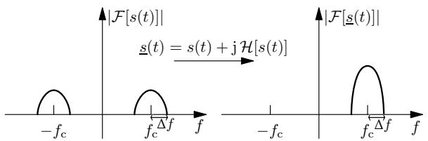

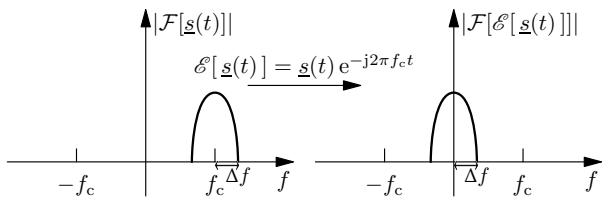  
(a) Application of the Hilbert transform.   
(b) Shifting by the carrier frequency.   
Fig. 1. Analytic signal processing and frequency shifting [6].

of numerical integration. So, generally $\left( f _ { \mathrm { c } } + \Delta f \right) \tau \ll 1$ is necessary to accurately track the disturbed bandpass signal.

Through the application of the Hilbert transform, a quadrature component $\mathcal { H } \left[ s \left( t \right) \right]$ is created for $s \left( t \right)$ . An analytic signal $\underline { { s } } ( t )$ can be obtained by adding the quadrature component as imaginary part [21]:

$$
\underline {{s}} (t) = s (t) + \mathrm {j} \mathcal {H} [ s (t) ]. \tag {1}
$$

The effect of the creation of the analytic signal from an original bandpass signal $s \left( t \right)$ is shown in Fig. 1(a). The Fourier spectrum of $s ( t )$ extends to negative frequencies, this is not the case for the corresponding analytic signal $\underline { { s } } ( t )$ . As shown in [6], the analytic signal $\underline { { s } } \left( t \right)$ can be shifted by the so-called shift frequency fref giving the frequency of the considered reference frame:

$$
\mathcal {S} [ \underline {{s}} (t) ] = \underline {{s}} (t) \mathrm {e} ^ {- \mathrm {j} 2 \pi f _ {\mathrm {r e f}} t}. \tag {2}
$$

If $f _ { \mathrm { r e f } } = 0$ Hz is chosen, then the real part of the analytic signal allows for tracking of natural waveforms as in EMTPtype simulation. In the case of $f _ { \mathrm { r e f } } ~ = ~ 0$ Hz, the carrier is present as shown on the right side of Fig. 1(a), and the condition $\left( f _ { \mathrm { c } } + \Delta f \right) \tau \ll 1$ is to be respected. If the shift frequency is chosen to be equal to the carrier frequency of the ac synchronous power system $f _ { \mathrm { r e f } } ~ = ~ f _ { \mathrm { c } }$ , then the complex envelope $\mathcal { E } \left[ \underline { { s } } \left( t \right) \right]$ is obtained. The complex envelope is equivalent to a dynamic phasor where the carrier oscillation is eliminated. Since $| \mathrm { e } ^ { - \mathrm { j } 2 \bar { \pi } f _ { \mathrm { r e f } } t } | = 1$ , the magnitude is not changed by the shifting. The condition for the time-step size changes from $\left( f _ { \mathrm { c } } + \Delta f \right) \tau \ \ll \ 1$ to $\begin{array} { r l } { \left( f _ { \mathrm { c } } + \Delta f - f _ { \mathrm { r e f } } \right) \tau } & { { } = } \end{array}$ $\Delta f \tau \ \ll \ 1$ . Consequently, a larger time-step size can be selected when tracking the complex envelope rather than the original bandpass signal. Details on the numerical integration with analytic signals are introduced in [6].

# III. MULTI-SCALE INDUCTION MACHINE MODELING

In accordance with [11], a three-phase symmetrical induction machine is assumed with the stator and rotor windings respectively being identical, sinusoidally distributed and separated by 120◦. As in related works [13], [18], magnetic saturation is not considered. In this section, the multi-scale modeling of a three-phase induction machine is described. The developed induction machine model supports the integrative simulation of both electromagnetic and electromechanical

transients. In a first modeling step, multi-scale continuous machine equations in the phase domain are given in Section III-A. Then, these multi-scale machine equations in the phase domain are discretized in Section III-B. In Section III-C, the machine equations are reformulated in the rotor reference frame. The number of mathematical operations required for the machine modeling is so reduced. In Section III-D, the multiscale induction machine model with a current source behind a Norton inner constant admittance (ICA) in the phase domain is developed, and the equivalent circuit of the multi-scale ICA model is given. The mechanical equations of the multiscale ICA model are discretized in Section III-E. Section III-F provides a description of the implementation of the multi-scale ICA model. An extension to include saturation as an option is discussed in Section III-G.

# A. Multi-scale Continuous Machine Equations in Phase Domain

The phase domain voltage equations of a symmetrical induction machine may be written as follows [11]:

$$
\left[ \begin{array}{l} \boldsymbol {v} _ {\mathrm {a b c s}} (t) \\ \boldsymbol {v} _ {\mathrm {a b c r}} (t) \end{array} \right] = \frac {\mathrm {d}}{\mathrm {d} t} \left[ \begin{array}{c} \boldsymbol {\lambda} _ {\mathrm {a b c s}} (t) \\ \boldsymbol {\lambda} _ {\mathrm {a b c r}} (t) \end{array} \right] + \left[ \begin{array}{c c} \boldsymbol {R} _ {\mathrm {s}} & 0 \\ 0 & \boldsymbol {R} _ {\mathrm {r}} \end{array} \right] \left[ \begin{array}{c} \boldsymbol {i} _ {\mathrm {a b c s}} (t) \\ \boldsymbol {i} _ {\mathrm {a b c r}} (t) \end{array} \right], \tag {3}
$$

where in the special case of a squirrel-cage rotor, ${ \pmb v } _ { \mathrm { a b c r } } ( t ) =$ 0 V [22]; currents are by convention positive when flowing from the terminals to the windings; a positive flux linkage relates to the corresponding positive current through the righthand-rule. For a magnetically linear system, the flux linkages may be expressed as:

$$
\left[ \begin{array}{l} \boldsymbol {\lambda} _ {\mathrm {a b c s}} (t) \\ \boldsymbol {\lambda} _ {\mathrm {a b c r}} (t) \end{array} \right] = \left[ \begin{array}{c c} \boldsymbol {L} _ {\mathrm {s s}} & \boldsymbol {L} _ {\mathrm {s r}} \left(\theta_ {\mathrm {r}} (t)\right) \\ \boldsymbol {L} _ {\mathrm {r s}} \left(\theta_ {\mathrm {r}} (t)\right) & \boldsymbol {L} _ {\mathrm {r r}} \end{array} \right] \left[ \begin{array}{l} \boldsymbol {i} _ {\mathrm {a b c s}} (t) \\ \boldsymbol {i} _ {\mathrm {a b c r}} (t) \end{array} \right], \tag {4}
$$

with

$$
\boldsymbol {L} _ {\mathrm {s r}} \left(\theta_ {\mathrm {r}} (t)\right) =
$$

$$
L _ {\mathrm {m s}} \left[ \begin{array}{c c c} \cos \theta_ {\mathrm {r}} (t) & \cos \left(\theta_ {\mathrm {r}} (t) + \frac {2 \pi}{3}\right) & \cos \left(\theta_ {\mathrm {r}} (t) - \frac {2 \pi}{3}\right) \\ \cos \left(\theta_ {\mathrm {r}} (t) - \frac {2 \pi}{3}\right) & \cos \theta_ {\mathrm {r}} (t) & \cos \left(\theta_ {\mathrm {r}} (t) + \frac {2 \pi}{3}\right) \\ \cos \left(\theta_ {\mathrm {r}} (t) + \frac {2 \pi}{3}\right) & \cos \left(\theta_ {\mathrm {r}} (t) - \frac {2 \pi}{3}\right) & \cos \theta_ {\mathrm {r}} (t) \end{array} \right] \tag {5}
$$

$$
\boldsymbol {L} _ {\mathrm {r s}} \left(\theta_ {\mathrm {r}} (t)\right) = \boldsymbol {L} _ {\mathrm {s r}} ^ {\mathrm {T}} \left(\theta_ {\mathrm {r}} (t)\right). \tag {6}
$$

The stator inductance matrix $\mathbf { \delta L } _ { \mathrm { s s } }$ and the rotor inductance matrix $\pmb { L } _ { \mathrm { r r } }$ are given in Appendix A.

The equation of motion is given by:

$$
\frac {\mathrm {d} \omega_ {\mathrm {r}} (t)}{\mathrm {d} t} = \frac {p}{2 J} \left(T _ {\mathrm {e}} (t) - T _ {\mathrm {m}} (t)\right), \tag {7}
$$

$$
\frac {\mathrm {d} \theta_ {\mathrm {r}} (t)}{\mathrm {d} t} = \omega_ {\mathrm {r}} (t). \tag {8}
$$

The expression for the electromagnetic torque may be written in terms of phase quantities as [11]:

$$
T _ {\mathrm {e}} (t) = \frac {p}{2} \left(\boldsymbol {i} _ {\mathrm {a b c s}} (t)\right) ^ {\mathrm {T}} \frac {\partial}{\partial \theta_ {\mathrm {r}}} \left[ \boldsymbol {L} _ {\mathrm {s r}} \left(\theta_ {\mathrm {r}} (t)\right) \right] \boldsymbol {i} _ {\mathrm {a b c r}} (t). \tag {9}
$$

For multi-scale simulation, the machine model is to deal with instantaneous and dynamic phasor signals at the network interface. To handle such flexibility, an arbitrary reference frame for phase quantities is defined in analogy to the arbitrary reference frame used for dq0 quantities [11]. All time-varying quantities are represented by analytic signals to allow for

frequency shifting as reviewed in Section II. The voltage equations (3) in the phase domain become:

$$
\left[ \begin{array}{c} \underline {{\boldsymbol {v}}} _ {\mathrm {a b c s}} (t) \\ \underline {{\boldsymbol {v}}} _ {\mathrm {a b c r}} (t) \end{array} \right] = \frac {\mathrm {d}}{\mathrm {d} t} \left[ \begin{array}{c} \underline {{\boldsymbol {\lambda}}} _ {\mathrm {a b c s}} (t) \\ \underline {{\boldsymbol {\lambda}}} _ {\mathrm {a b c r}} (t) \end{array} \right] + \left[ \begin{array}{c c} \boldsymbol {R} _ {\mathrm {s}} & 0 \\ 0 & \boldsymbol {R} _ {\mathrm {r}} \end{array} \right] \left[ \begin{array}{c} \underline {{\boldsymbol {i}}} _ {\mathrm {a b c s}} (t) \\ \underline {{\boldsymbol {i}}} _ {\mathrm {a b c r}} (t) \end{array} \right]. \tag {10}
$$

Multiplying both sides of the first row of (10) by $\mathrm { e } ^ { - \mathrm { j } \omega _ { \mathrm { r e f } } t }$ , application of the product rule of differentiation, and introduction of the notation of (2) yields:

$$
\mathcal {S} \left[ \underline {{\boldsymbol {v}}} _ {\mathrm {a b c s}} (t) \right] = \left(\mathrm {j} \omega_ {\mathrm {r e f}} + \frac {\mathrm {d}}{\mathrm {d} t}\right) \mathcal {S} \left[ \underline {{\boldsymbol {\lambda}}} _ {\mathrm {a b c s}} (t) \right] + \boldsymbol {R} _ {\mathrm {s}} \mathcal {S} \left[ \underline {{\boldsymbol {i}}} _ {\mathrm {a b c s}} (t) \right]. \tag {11}
$$

While the shift frequency is arbitrary, two settings of the shift frequency are of particular significance, giving special cases of an arbitrary reference frame [11]. If $f _ { \mathrm { r e f } } = 0 ~ \mathrm { H z } .$ , then the representation is made in the stationary reference frame. In this case, (11) is equivalent to the first row of (10); then taking the real part on both sides gives the first equation of (3). Thus, the stationary reference frame is suitable for the tracking of natural waveforms of instantaneous signals as used in the EMTP. For $f _ { \mathrm { r e f } } = f _ { \mathrm { c } } ,$ where $f _ { \mathrm { c } }$ gives the synchronous carrier frequency of either 50 Hz or 60 Hz, the phase domain equations are represented in a synchronously rotating reference frame. The latter is suited for the tracking of envelopes as done when processing dynamic phasors. This is confirmed by inspection of (11). For the stationary case where the envelopes do not change, as it is the case for purely sinusoidal signals of not changing amplitude, (11) relates the complex envelopes E by algebraic equations as known from stationary phasor calculus:

$$
\mathcal {E} \left[ \underline {{\boldsymbol {v}}} _ {\mathrm {a b c s}} (t) \right] = \mathrm {j} \omega_ {\mathrm {c}} \mathcal {E} \left[ \underline {{\boldsymbol {\lambda}}} _ {\mathrm {a b c s}} (t) \right] + \boldsymbol {R} _ {\mathrm {s}} \mathcal {E} \left[ \underline {{\boldsymbol {i}}} _ {\mathrm {a b c s}} (t) \right]. \tag {12}
$$

For consistency of the overall approach, all time-varying electrical quantities in flux linkage equations (4) are also represented through analytic signals:

$$
\left[ \begin{array}{c} \underline {{\boldsymbol {\lambda}}} _ {\mathrm {a b c s}} (t) \\ \underline {{\boldsymbol {\lambda}}} _ {\mathrm {a b c r}} (t) \end{array} \right] = \left[ \begin{array}{c c} \boldsymbol {L} _ {\mathrm {s s}} & \boldsymbol {L} _ {\mathrm {s r}} \left(\theta_ {\mathrm {r}} (t)\right) \\ \boldsymbol {L} _ {\mathrm {r s}} \left(\theta_ {\mathrm {r}} (t)\right) & \boldsymbol {L} _ {\mathrm {r r}} \end{array} \right] \left[ \begin{array}{c} \underline {{\boldsymbol {i}}} _ {\mathrm {a b c s}} (t) \\ \underline {{\boldsymbol {i}}} _ {\mathrm {a b c r}} (t) \end{array} \right]. \tag {13}
$$

B. Formulation of Multi-scale Discretized Machine Equations for Constant Inner Impedance

Application of the trapezoidal integration method to (11) gives a difference equation:

$$
\begin{array}{l} \frac {\mathcal {S} \left[ \underline {{v}} _ {\mathrm {a b c s}} (k) \right] + \mathcal {S} \left[ \underline {{v}} _ {\mathrm {a b c s}} (k - 1) \right]}{2} \\ = \mathrm {j} \omega_ {\text {r e f}} \frac {\mathcal {S} [ \underline {{\boldsymbol {\lambda}}} _ {\text {a b c s}} (k) ] + \mathcal {S} [ \underline {{\boldsymbol {\lambda}}} _ {\text {a b c s}} (k - 1) ]}{2} \tag {14} \\ + \frac {\mathcal {S} [ \underline {{\lambda}} _ {\mathrm {a b c s}} (k) ] - \mathcal {S} [ \underline {{\lambda}} _ {\mathrm {a b c s}} (k - 1) ]}{\tau} \\ + \boldsymbol {R} _ {\mathrm {s}} \frac {\mathcal {S} [ \underline {{\boldsymbol {i}}} _ {\mathrm {a b c s}} (k) ] + \mathcal {S} [ \underline {{\boldsymbol {i}}} _ {\mathrm {a b c s}} (k - 1) ]}{2}. \\ \end{array}
$$

Substitution of analytic signals into (14) as in [6] and rearranging yields:

$$
\underline {{\boldsymbol {v}}} _ {\mathrm {a b c s}} (k) = \boldsymbol {R} _ {\mathrm {s}} \underline {{\boldsymbol {i}}} _ {\mathrm {a b c s}} (k) + \left(\mathrm {j} \omega_ {\mathrm {r e f}} + \frac {2}{\tau}\right) \underline {{\boldsymbol {\lambda}}} _ {\mathrm {a b c s}} (k) + \underline {{\boldsymbol {e}}} _ {\mathrm {a b c s h}} (k), \tag {15}
$$

with

$$
\begin{array}{l} \underline {{\boldsymbol {e}}} _ {\mathrm {a b c s h}} (k) = - \mathrm {e} ^ {\mathrm {j} \omega_ {\mathrm {r e f}} \tau} \underline {{\boldsymbol {v}}} _ {\mathrm {a b c s}} (k - 1) + \boldsymbol {R} _ {\mathrm {s}} \mathrm {e} ^ {\mathrm {j} \omega_ {\mathrm {r e f}} \tau} \underline {{\boldsymbol {i}}} _ {\mathrm {a b c s}} (k - 1) \\ + \left(j \omega_ {\text {r e f}} - \frac {2}{\tau}\right) \mathrm {e} ^ {\mathrm {j} \omega_ {\text {r e f}} \tau} \underline {{\boldsymbol {\lambda}}} _ {\text {a b c s}} (k - 1). \tag {16} \\ \end{array}
$$

By substituting the stator flux linkage of (13) into (15), (15) is rearranged as follows:

$$
\begin{array}{l} \underline {{\boldsymbol {v}}} _ {\mathrm {a b c s}} (k) = \boldsymbol {R} _ {\mathrm {s}} \underline {{\boldsymbol {i}}} _ {\mathrm {a b c s}} (k) + \left(\mathrm {j} \omega_ {\mathrm {r e f}} + \frac {2}{\tau}\right) \boldsymbol {L} _ {\mathrm {s s}} \underline {{\boldsymbol {i}}} _ {\mathrm {a b c s}} (k) \\ + \left(\mathrm {j} \omega_ {\text {r e f}} + \frac {2}{\tau}\right) \boldsymbol {L} _ {\text {s r}} \left(\theta_ {\mathrm {r}} (k)\right) \underline {{\boldsymbol {i}}} _ {\text {a b c r}} (k) + \underline {{\boldsymbol {e}}} _ {\text {a b c s h}} (k). \tag {17} \\ \end{array}
$$

Next, the rotor voltage equation in (10) is considered. This equation can also be discretized using the trapezoidal rule of integration. After discretization and insertion of (13) into the discretized rotor voltage equation, the rotor currents are expressed as follows:

$$
\begin{array}{l} \underline {{\boldsymbol {i}}} _ {\mathrm {a b c r}} (k) = \left(\boldsymbol {R} _ {\mathrm {r}} + \frac {2}{\tau} \boldsymbol {L} _ {\mathrm {r r}}\right) ^ {- 1} \left(- \frac {2}{\tau} \boldsymbol {L} _ {\mathrm {r s}} (\theta_ {\mathrm {r}} (k)) \underline {{\boldsymbol {i}}} _ {\mathrm {a b c s}} (k) \right. \\ \left. + \underline {{v}} _ {\mathrm {a b c r}} (k) + \underline {{e}} _ {\mathrm {a b c r h}} (k)\right), \tag {18} \\ \end{array}
$$

with

$$
\begin{array}{l} \underline {{\boldsymbol {e}}} _ {\mathrm {a b c r h}} (k) = \underline {{\boldsymbol {v}}} _ {\mathrm {a b c r}} (k - 1) - \left(\boldsymbol {R} _ {\mathrm {r}} - \frac {2}{\tau} \boldsymbol {L} _ {\mathrm {r r}}\right) \underline {{\boldsymbol {i}}} _ {\mathrm {a b c r}} (k - 1) \\ + \frac {2}{\tau} \boldsymbol {L} _ {\mathrm {r s}} \left(\theta_ {\mathrm {r}} (k - 1)\right) \underline {{\boldsymbol {i}}} _ {\mathrm {a b c s}} (k - 1). \tag {19} \\ \end{array}
$$

The derivation is detailed in Appendix B.

Insertion of (18) into (17) yields the Thevenin equivalent formulation:

$$
\underline {{\boldsymbol {v}}} _ {\mathrm {a b c s}} (k) = \underline {{\boldsymbol {R}}} _ {\mathrm {e q}} \underline {{\boldsymbol {i}}} _ {\mathrm {a b c s}} (k) + \underline {{\boldsymbol {e}}} _ {\mathrm {o c}} (k), \tag {20}
$$

with

$$
\begin{array}{l} \underline {{\boldsymbol {R}}} _ {\mathrm {e q}} = \boldsymbol {R} _ {\mathrm {s}} + \left(\mathrm {j} \omega_ {\mathrm {r e f}} + \frac {2}{\tau}\right) \boldsymbol {L} _ {\mathrm {s s}} \\ - \frac {2}{\tau} \left(\mathrm {j} \omega_ {\text {r e f}} + \frac {2}{\tau}\right) \boldsymbol {L} _ {\text {s r}} \left(\theta_ {\mathrm {r}} (k)\right) \left(\boldsymbol {R} _ {\mathrm {r}} + \frac {2}{\tau} \boldsymbol {L} _ {\text {r r}}\right) ^ {- 1} \boldsymbol {L} _ {\text {r s}} \left(\theta_ {\mathrm {r}} (k)\right), \tag {21} \\ \end{array}
$$

$$
\begin{array}{l} \underline {{e}} _ {\mathrm {o c}} (k) = \left(j \omega_ {\mathrm {r e f}} + \frac {2}{\tau}\right) L _ {\mathrm {s r}} \left(\theta_ {\mathrm {r}} (k)\right) \left(R _ {\mathrm {r}} + \frac {2}{\tau} L _ {\mathrm {r r}}\right) ^ {- 1} \\ \left(\underline {{e}} _ {\mathrm {a b c r h}} (k) + \underline {{v}} _ {\mathrm {a b c r}} (k)\right) + \underline {{e}} _ {\mathrm {a b c s h}} (k). \tag {22} \\ \end{array}
$$

The equivalent resistance matrix $\underline { { R } } _ { \mathrm { e q } }$ in (21) may seem to be time-variant as the mutual inductance matrices $L _ { \mathrm { s r } } ( \theta _ { \mathrm { r } } ( k ) )$ and ${ \cal L } _ { \mathrm { r s } } ( \theta _ { \mathrm { r } } ( k ) )$ ) depend on the rotor position. Nonetheless, the term $\begin{array} { r } { { \cal L } _ { \mathrm { s r } } ( \theta _ { \mathrm { r } } ( k ) ) \left( R _ { \mathrm { r } } + \frac { 2 } { \tau } { \cal L } _ { \mathrm { r r } } \right) ^ { - 1 } { \cal L } _ { \mathrm { r s } } ( \theta _ { \mathrm { r } } ( k ) ) } \end{array}$ in (21) is constant as shown in the following. The reformulation is to reveal that $\underline { { R } } _ { \mathrm { e q } }$ is independent of the rotor position.

For a symmetrical machine with the assumptions made in the beginning of this section, $R _ { \mathrm { r } }$ and $\pmb { L } _ { \mathrm { r r } }$ are constant and symmetric matrices [11]. Therefore, the matrix $\left( R _ { \mathrm { r } } + { \textstyle \frac { 2 } { \tau } } { { \cal L } _ { \mathrm { r r } } } \right) ^ { - 1 }$ is also symmetric and constant. It can be expressed as follows:

$$
\left(\boldsymbol {R} _ {\mathrm {r}} + \frac {2}{\tau} \boldsymbol {L} _ {\mathrm {r r}}\right) ^ {- 1} = \left[ \begin{array}{l l l} Y _ {\mathrm {a}} & Y _ {\mathrm {b}} & Y _ {\mathrm {b}} \\ Y _ {\mathrm {b}} & Y _ {\mathrm {a}} & Y _ {\mathrm {b}} \\ Y _ {\mathrm {b}} & Y _ {\mathrm {b}} & Y _ {\mathrm {a}} \end{array} \right]. \tag {23}
$$

Insertion of (5), (6) and (23) into the term

$\begin{array} { r } { \pmb { L } _ { \mathrm { s r } } ( \theta _ { \mathrm { r } } ( k ) ) \left( \pmb { R } _ { \mathrm { r } } + \frac { 2 } { \tau } \pmb { L } _ { \mathrm { r r } } \right) ^ { - 1 } \pmb { L } _ { \mathrm { r s } } ( \theta _ { \mathrm { r } } ( k ) ) \mathrm { g i v e s } . } \end{array}$

$$
\begin{array}{l} \boldsymbol {L} _ {\mathrm {s r}} \left(\theta_ {\mathrm {r}} (k)\right) \left(\boldsymbol {R} _ {\mathrm {r}} + \frac {2}{\tau} \boldsymbol {L} _ {\mathrm {r r}}\right) ^ {- 1} \boldsymbol {L} _ {\mathrm {r s}} \left(\theta_ {\mathrm {r}} (k)\right) \\ = \frac {3}{4} L _ {\mathrm {m s}} ^ {2} \left(Y _ {\mathrm {a}} - Y _ {\mathrm {b}}\right) \left[ \begin{array}{r r r} 2 & - 1 & - 1 \\ - 1 & 2 & - 1 \\ - 1 & - 1 & 2 \end{array} \right]. \tag {24} \\ \end{array}
$$

As coefficients $Y _ { \mathrm { a } }$ and $Y _ { \mathrm { b } }$ are constant, the term $\begin{array} { r } { { \cal L } _ { \mathrm { s r } } ( \theta _ { \mathrm { r } } ( k ) ) \left( { \cal R } _ { \mathrm { r } } + \frac { 2 } { \tau } { \cal L } _ { \mathrm { r r } } \right) ^ { - 1 } { \cal L } _ { \mathrm { r s } } ( \theta _ { \mathrm { r } } ( k ) ) } \end{array}$ is constant. Therefore, the equivalent resistance matrix $\underline { { R } } _ { \mathrm { e q } } \ ( 2 1 )$ is constant. The formulation of (24) may also be found in [18].

# C. Formulation of Multi-scale Discretized Machine Equations for Efficient Calculation of Stator Open Circuit Voltage

In Section III-B, stator open circuit voltage $\underline { { e } } _ { \mathrm { o c } }$ in (22) is expressed in terms of phase quantities. The matrices involved are full matrices. In order to improve the model efficiency, the stator open circuit voltage $\underline { { e } } _ { \mathrm { o c } }$ is reformulated such that certain operations are performed as $\mathrm { d } { \bf q } 0$ quantities in the rotor reference frame. Then, certain matrices used in the computation of $\underline { { e } } _ { \mathrm { o c } }$ are diagonal. The number of mathematical operations required for the solution of $\underline { { e } } _ { \mathrm { o c } }$ is so reduced. Such an approach has shown to be effective in EMTP [17], [23].

In the rotor reference frame, the following holds [11]:

$$
\boldsymbol {K} \left(\theta_ {\mathrm {r}} (k)\right) \boldsymbol {L} _ {\mathrm {s r}} \left(\theta_ {\mathrm {r}} (k)\right) \boldsymbol {K} ^ {- 1} (0) = \boldsymbol {L} _ {\mathrm {s r d q}}, \tag {25}
$$

$$
\boldsymbol {K} (0) \boldsymbol {L} _ {\mathrm {r s}} \left(\theta_ {\mathrm {r}} (k)\right) \boldsymbol {K} ^ {- 1} \left(\theta_ {\mathrm {r}} (k)\right) = \boldsymbol {L} _ {\mathrm {r s d q}}, \tag {26}
$$

or

$$
\boldsymbol {L} _ {\mathrm {s r}} \left(\theta_ {\mathrm {r}} (k)\right) = \boldsymbol {K} ^ {- 1} \left(\theta_ {\mathrm {r}} (k)\right) \boldsymbol {L} _ {\mathrm {s r d q}} \boldsymbol {K} (0), \tag {27}
$$

$$
\boldsymbol {L} _ {\mathrm {r s}} \left(\theta_ {\mathrm {r}} (k)\right) = \boldsymbol {K} ^ {- 1} (0) \boldsymbol {L} _ {\mathrm {r s d q}} \boldsymbol {K} \left(\theta_ {\mathrm {r}} (k)\right), \tag {28}
$$

where $L _ { \mathrm { s r d q } }$ and $L _ { \mathrm { r s d q } }$ are constant and given in Appendix A; $\mathbf { { \nabla } } K ( \theta _ { \mathrm { { r } } } ( k ) )$ and $\pmb { K } ( 0 )$ perform transformations of stator quantities and rotor quantities to the rotor reference frame, respectively. The latter are given in Appendix C.

The first term on the right side of (22) is reformulated by inserting (27) for $L _ { \mathrm { s r } } ( \theta _ { \mathrm { r } } ( k ) )$ ):

$$
\begin{array}{l} \underline {{e}} _ {\mathrm {o c}} (k) - \underline {{e}} _ {\mathrm {a b c s h}} (k) \\ = \left(j \omega_ {\text {r e f}} + \frac {2}{\tau}\right) \boldsymbol {K} ^ {- 1} \left(\theta_ {\mathrm {r}} (k)\right) \boldsymbol {L} _ {\text {s r d q}} \boldsymbol {K} (0) \left(\boldsymbol {R} _ {\mathrm {r}} + \frac {2}{\tau} \boldsymbol {L} _ {\text {r r}}\right) ^ {- 1} \\ \left(\underline {{e}} _ {\text {a b c r h}} (k) + \underline {{v}} _ {\text {a b c r}} (k)\right). \tag {29} \\ \end{array}
$$

Inserting (28) for $L _ { \mathrm { r s } } ( \theta _ { \mathrm { r } } ( k ) )$ in (19), transforming phase quantities $\underline { { i } } _ { \mathrm { a b c r } } ( k - 1 ) , \underline { { v } } _ { \mathrm { a b c r } } ( k - 1 ) , \underline { { v } } _ { \mathrm { a b c r } } ( k )$ to $\underline { { { \dot { \imath } } } } _ { \mathrm { d q 0 r } } \left( k - 1 \right)$ , ${ \underline { { \pmb v } } } _ { \mathrm { d q 0 r } } ( k - 1 ) , { \underline { { \pmb v } } } _ { \mathrm { d q 0 r } } ( k )$ , and pre-multiplying by the identity matrix $K ^ { - 1 } ( 0 ) K \dot { ( 0 ) }$ , the term ${ \underline { { e } } } _ { \mathrm { a b c r h } } ( k ) + { \underline { { v } } } _ { \mathrm { a b c r } } ( k )$ can be expressed as follows:

$$
\begin{array}{l} \underline {{\boldsymbol {e}}} _ {\mathrm {a b c r h}} (k) + \underline {{\boldsymbol {v}}} _ {\mathrm {a b c r}} (k) = \boldsymbol {K} ^ {- 1} (0) \underline {{\boldsymbol {v}}} _ {\mathrm {d q 0 r}} (k - 1) \\ - \boldsymbol {K} ^ {- 1} (0) \boldsymbol {K} (0) \left(\boldsymbol {R} _ {\mathrm {r}} - \frac {2}{\tau} \boldsymbol {L} _ {\mathrm {r r}}\right) \boldsymbol {K} ^ {- 1} (0) \underline {{\boldsymbol {i}}} _ {\mathrm {d q 0 r}} (k - 1) \\ + \frac {2}{\tau} \boldsymbol {K} ^ {- 1} (0) \boldsymbol {L} _ {\mathrm {r s d q}} \underline {{\boldsymbol {i}}} _ {\mathrm {d q 0 s}} (k - 1) + \boldsymbol {K} ^ {- 1} (0) \underline {{\boldsymbol {v}}} _ {\mathrm {d q 0 r}} (k). \tag {30} \\ \end{array}
$$

Insertion of (30) into (29) yields:

$$
\begin{array}{l} \underline {{e}} _ {\mathrm {o c}} (k) - \underline {{e}} _ {\mathrm {a b c s h}} (k) = \left(\mathrm {j} \omega_ {\mathrm {r e f}} + \frac {2}{\tau}\right) K ^ {- 1} \left(\theta_ {\mathrm {r}} (k)\right) L _ {\mathrm {s r d q}} Y _ {\mathrm {r r}} \\ \left(\underline {{\boldsymbol {v}}} _ {\mathrm {d q 0 r}} (k - 1) - \boldsymbol {Z} _ {\mathrm {r r}} \underline {{\boldsymbol {i}}} _ {\mathrm {d q 0 r}} (k - 1) \right. \\ \left. \frac {2}{\tau} \boldsymbol {L} _ {\mathrm {r s d q}} \dot {\boldsymbol {i}} _ {\mathrm {d q 0 s}} (k - 1) + \underline {{\boldsymbol {v}}} _ {\mathrm {d q 0 r}} (k)\right), \tag {31} \\ \end{array}
$$

with

$$
\boldsymbol {Y} _ {\mathrm {r r}} = \boldsymbol {K} (0) \left(\boldsymbol {R} _ {\mathrm {r}} + \frac {2}{\tau} \boldsymbol {L} _ {\mathrm {r r}}\right) ^ {- 1} \boldsymbol {K} ^ {- 1} (0), \tag {32}
$$

$$
\boldsymbol {Z} _ {\mathrm {r r}} = \boldsymbol {K} (0) \left(\boldsymbol {R} _ {\mathrm {r}} - \frac {2}{\tau} \boldsymbol {L} _ {\mathrm {r r}}\right) \boldsymbol {K} ^ {- 1} (0). \tag {33}
$$

The matrices $\mathbf { Y } _ { \mathrm { r r } }$ and $Z _ { \mathrm { r r } }$ in (31) are diagonal matrices in the rotor reference frame. Insertion of (23) and (71) into the term $\mathbf { Y } _ { \mathrm { r r } }$ (32) leads to:

$$
\mathbf {Y} _ {\mathrm {r r}} = \operatorname {d i a g} \left[ Y _ {\mathrm {a}} - Y _ {\mathrm {b}}, Y _ {\mathrm {a}} - Y _ {\mathrm {b}}, Y _ {\mathrm {a}} + 2 Y _ {\mathrm {b}} \right]. \tag {34}
$$

Inserting (71) into (33), the term $Z _ { \mathrm { r r } }$ can be expressed as:

$$
\mathbf {Z} _ {\mathrm {r r}} = \operatorname {d i a g} \left[ Z _ {1}, Z _ {1}, Z _ {2} \right], \tag {35}
$$

with

$$
Z _ {1} = R _ {\mathrm {r}} - \frac {2}{\tau} L _ {\mathrm {l r}} - \frac {2}{\tau} L _ {\mathrm {m}}, \tag {36}
$$

$$
Z _ {2} = R _ {\mathrm {r}} - \frac {2}{\tau} L _ {\mathrm {l r}}, \tag {37}
$$

where $R _ { \mathrm { r } }$ is the rotor resistance; $L _ { \mathrm { l r } }$ and $L _ { \mathrm { m } }$ are given in Appendix A.

Equation (31) may be rewritten as follows:

$$
\underline {{\boldsymbol {e}}} _ {\mathrm {o c}} (k) = \left(\mathrm {j} \omega_ {\mathrm {r e f}} + \frac {2}{\tau}\right) \boldsymbol {K} ^ {- 1} \left(\theta_ {\mathrm {r}} (k)\right) \boldsymbol {L} _ {\mathrm {s r d q}} \boldsymbol {Y} _ {\mathrm {r r}} \tag {38}
$$

$$
\left(\underline {{e}} _ {\mathrm {d q 0 r h}} (k) + \underline {{v}} _ {\mathrm {d q 0 r}} (k)\right) + \underline {{e}} _ {\mathrm {a b c s h}} (k),
$$

with

$$
\begin{array}{l} \underline {{\boldsymbol {e}}} _ {\mathrm {d q 0 r h}} (k) = \underline {{\boldsymbol {v}}} _ {\mathrm {d q 0 r}} (k - 1) - \boldsymbol {Z} _ {\mathrm {r r}} \underline {{\boldsymbol {i}}} _ {\mathrm {d q 0 r}} (k - 1) \\ + \frac {2}{\tau} \boldsymbol {L} _ {\mathrm {r s d q}} \underline {{\boldsymbol {i}}} _ {\mathrm {d q 0 s}} (k - 1), \tag {39} \\ \end{array}
$$

and

$$
\begin{array}{l} \underline {{\boldsymbol {i}}} _ {\mathrm {d q 0 r}} (k - 1) = \boldsymbol {Y} _ {\mathrm {r r}} \left(- \frac {2}{\tau} \boldsymbol {L} _ {\mathrm {r s d q}} \underline {{\boldsymbol {i}}} _ {\mathrm {d q 0 s}} (k - 1) + \underline {{\boldsymbol {v}}} _ {\mathrm {d q 0 r}} (k - 1) \right. \\ \left. + \underline {{e}} _ {\mathrm {d q 0 r h}} (k - 1)\right). \tag {40} \\ \end{array}
$$

The calculation of the rotor current $\underline { { \dot { \imath } } } _ { \mathrm { d q 0 r } }$ of (40) is detailed in Appendix D.

A comparative inspection of (38) and (22) reveals the advantage of the reformulation. Equation (22) makes use of $\underline { { e } } _ { \mathrm { a b c r h } } ( k )$ in (19) and $\underline { { \dot { \mathbf { \Pi } } } } _ { \mathrm { a b c r } } ( k )$ in (18). In analogy to that, (38) makes use of $\varrho _ { \mathrm { d q 0 r h } } ( k )$ in (39) and $\underline { { { i } } } _ { \mathrm { d q 0 r } } ( k )$ in (40). But while (19) and (18) are computed in the abc phase domain, (39) and (40) are computed in the dq0 domain of the rotor reference frame. While the matrices $\begin{array} { r } { \left( R _ { \mathrm { r } } - \frac { 2 } { \tau } L _ { \mathrm { r r } } \right) } \end{array}$ and $\left( R _ { \mathrm { r } } + { \textstyle \frac { 2 } { \tau } } { { \cal L } } _ { \mathrm { r r } } \right) ^ { - 1 }$ in (19) and (18) are full, the corresponding $\dot { \boldsymbol { Z } } _ { \mathrm { r r } }$ and $Y _ { \mathrm { r r } } ^ { ' }$ of (39) and (40) are diagonal matrices. As computation with the zeroes can be omitted, a computational speed-up is obtained.

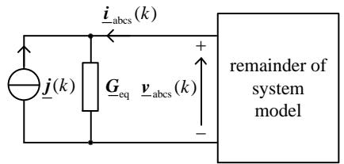  
Fig. 2. Multi-scale ICA model as Norton equivalent.

# D. Formulation of Equivalent Circuit

Equation (20) gives the Thevenin equivalent circuit composed of $\scriptstyle R _ { \mathrm { e q } }$ and $\underline { { \boldsymbol { e } } } _ { \mathrm { o c } } .$ . Alternatively, (20) may be rearranged as a Norton equivalent circuit:

$$
\dot {\underline {{\boldsymbol {i}}}} _ {\mathrm {a b c s}} (k) = \underline {{\boldsymbol {G}}} _ {\mathrm {e q}} \underline {{\boldsymbol {v}}} _ {\mathrm {a b c s}} (k) - \underline {{\boldsymbol {j}}} (k), \tag {41}
$$

with

$$
\underline {{\boldsymbol {G}}} _ {\mathrm {e q}} = \left(\underline {{\boldsymbol {R}}} _ {\mathrm {e q}}\right) ^ {- 1} \tag {42}
$$

and

$$
\underline {{\boldsymbol {j}}} (k) = \underline {{\boldsymbol {G}}} _ {\mathrm {e q}} \underline {{\boldsymbol {e}}} _ {\mathrm {o c}} (k). \tag {43}
$$

A multi-scale induction machine model with a controlled current source behind a Norton inner constant admittance (ICA) is so obtained based on (41). The equivalent circuit in Fig. 2 shows that the proposed multi-scale ICA model has a direct interface with abc phase variables in the stationary reference frame. Thanks to the constant $\underline { { G } } _ { \mathrm { e q } } ,$ changes in rotor position do not alter the matrix describing the overall system.

# E. Formulation of Mechanical Equations

The electromagnetic torque is calculated as follows [11]:

$$
T _ {\mathrm {e}} (k) = \frac {3 p}{4} L _ {\mathrm {m}} \left(\operatorname {R e} \left[ \underline {{i}} _ {\mathrm {d r}} (k) \right] \operatorname {R e} \left[ \underline {{i}} _ {\mathrm {q s}} (k) \right] - \operatorname {R e} \left[ \underline {{i}} _ {\mathrm {d s}} (k) \right] \operatorname {R e} \left[ \underline {{i}} _ {\mathrm {q r}} (k) \right]\right). \tag {44}
$$

The equations of motion in (7) and (8) are discretized as:

$$
\begin{array}{l} \omega_ {\mathrm {r}} (k) = \omega_ {\mathrm {r}} (k - 1) + \frac {p}{2} \frac {\tau}{J} \\ \left(T _ {\mathrm {e}} (k) + T _ {\mathrm {e}} (k - 1) - T _ {\mathrm {m}} (k) - T _ {\mathrm {m}} (k - 1)\right), \tag {45} \\ \end{array}
$$

$$
\theta_ {\mathrm {r}} (k) = \theta_ {\mathrm {r}} (k - 1) + \frac {\tau}{2} (\omega_ {\mathrm {r}} (k) + \omega_ {\mathrm {r}} (k - 1)). \tag {46}
$$

# F. Implementation of Multi-scale ICA Model

To illustrate the implementation of the multi-scale model, it is assumed that the multi-scale model is connected to a network. The voltages $\underline { { \boldsymbol { v } } } _ { \mathrm { a b c s } } ( k )$ are provided by the system model solver covering the network. Fig. 3 describes the algorithm of the multi-scale ICA model. In step 1, the multiscale ICA model receives its terminal voltages $\underline { { \boldsymbol { v } } } _ { \mathrm { a b c s } } ( k )$ as inputs. In step 2, the simulation of the multi-scale ICA model is performed. The electrical and mechanical variables of the multi-scale ICA model at time-step k are calculated. In step 3, the rotor angle is predicted. Then, history terms, the stator voltage source, and the Norton source are calculated. The prediction of the rotor angle is discussed below. Step 4 is performed to provide information on the Norton source $\underline { { \boldsymbol { j } } } ( k { + } 1 )$ to the system model solver. The information exchange between the ICA model and the system model solver is clarified in

Step 1: Get the multi-scale ICA model terminal voltages $\underline { { \boldsymbol { \nu } } } _ { \mathrm { a b c s } } ( k )$ from the system model solver.

Step 2: Perform the multi-scale ICA model simulation.

Step 2.1: Calculate electrical variables of the multi-scale ICA model:

1) Calculate stator current $\underline { { \dot { \iota } } } _ { \mathrm { a b c s } } ( k )$ using (20).

2) Calculate stator current $\underline { { i } } _ { \mathrm { d q 0 s } } ( k ) \colon$

$$
\underline {{i}} _ {\mathrm {d q 0 s}} (k) = K \left(\theta_ {\mathrm {r}} (k)\right) \underline {{i}} _ {\mathrm {a b c s}} (k).
$$

3) Calculate rotor current $\underline { { \dot { \imath } } } _ { \mathrm { d q 0 r } } ( k )$ using (40).   
4) Calculate stator flux $\underline { { \lambda } } _ { \mathrm { a b c s } } ( k )$ using (66).   
5) Calculate electromagnetic torque $T _ { \mathrm { e } } ( k )$ using (44).

Step 2.2: Calculate mechanical variables of the multi-scale ICA model:

1) Calculate rotor speed $\omega _ { \mathrm { r } } ( k )$ using (45).   
2) Update rotor angle using (46).r  ( )k

Step 3: Construct the Norton source $j ( k + 1 )$ for the next time-step k+1.

Step 3.1: Predict rotor angle at time-step k+1:

$$
\tilde {\theta} _ {r} (k + 1) = \tilde {\theta} _ {r} (k) + \alpha \left(\theta_ {r} (k) - \theta_ {r} (k - 1)\right).
$$

Step 3.2: Calculate history terms and stator voltage source:

1) Calculate the stator history term $\underline { { e } } _ { \mathrm { a b c s h } } ( k + 1 )$ using (16).   
2) Calculate the rotor history term $\underline { { \boldsymbol { e } } } _ { \mathrm { d q 0 \mathrm { d h } } } ( k + 1 )$ using (39).   
3) Calculate the stator open circuit voltage $\underline { { e } } _ { \mathrm { o c } } ( k + 1 )$ using (38). )

Step 3.3: Calculate using (43). j( 1)k 

Step 4: Return the Norton source $\underline { { j } } ( k + 1 )$ to the system model solver    .

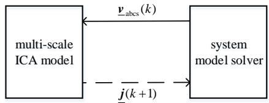  
Fig. 3. Algorithm of the multi-scale ICA model as Norton equivalent.   
Fig. 4. Information exchange between the multi-scale ICA model as Norton equivalent and the system model solver during time-step k.

Fig. 4. Upon completion, the algorithm of Fig. 3 starts with step 1 again.

The multi-scale ICA model performs angle prediction. In step 3.1, the rotor angle is predicted using linear extrapolation:

$$
\tilde {\theta} _ {r} (k + 1) = \theta_ {r} (k) + \alpha \left(\theta_ {r} (k) - \theta_ {r} (k - 1)\right), \tag {47}
$$

with

$$
\alpha = \frac {\tau (k + 1)}{\tau (k)}, \tag {48}
$$

where τ (k) is the time-step size at step $k , \tau ( k { + } 1 )$ is the timestep size at step $k + 1$ . Such a prediction method is suitable for the multi-scale simulation with diverse time-step sizes.

# G. Inclusion of Saturation

Given the assumption of a magentically linear system for (4), the formulations in Sections III-A to III-D do not take into account potential effects of saturation. A saturation curve consisting of unsaturated segment I and saturated segment II is shown in Fig. 5 along with the linear air-gap line [11]. The saturation curve relates the main flux to the magnetizing current. The departure of the saturation curve from the air-gap line is an indication of the degree of saturation. When saturation effects are considered, the magnetizing inductance $L _ { \mathrm { m } }$ varies with the degree of saturation. The equivalent resistance matrix in (21) then also varies with saturation, becoming $\underline { { R } } _ { \mathrm { e q } } ( k )$ . With saturation, the voltage equation in (20) is as follows:

$$
\underline {{\boldsymbol {v}}} _ {\mathrm {a b c s}} (k) = \underline {{\boldsymbol {R}}} _ {\mathrm {e q}} (k) \underline {{\boldsymbol {i}}} _ {\mathrm {a b c s}} (k) + \underline {{\boldsymbol {e}}} _ {\mathrm {o c}} (k). \tag {49}
$$

The resistance matrix $\underline { { R } } _ { \mathrm { e q } } ( k )$ can be decomposed as the sum

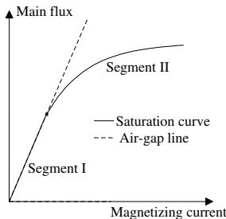  
Fig. 5. Representation of saturation characteristic.

of a constant part $\underline { { R } } _ { \mathrm { e q } }$ and a saturation-segment-dependent part $\Delta \underline { { R } } _ { \mathrm { e q , s a t } } ( k )$ :

$$
\underline {{\boldsymbol {R}}} _ {\mathrm {e q}} (k) = \underline {{\boldsymbol {R}}} _ {\mathrm {e q}} + \Delta \underline {{\boldsymbol {R}}} _ {\mathrm {e q , s a t}} (k), \tag {50}
$$

where the matrices $\underline { { R } } _ { \mathrm { e q } } ( k )$ and $\underline { { R } } _ { \mathrm { e q } }$ are formed using (21) with the saturated value of the magnetizing inductance and the unsaturated value of the magnetizing inductance, respectively; $\Delta \underline { { R } } _ { \mathrm { e q , s a t } } ( k )$ represents the difference between $\underline { { R } } _ { \mathrm { e q } } ( k )$ and $\underline { { R } } _ { \mathrm { e q } } .$ In the absence of saturation, $\Delta \underline { { R } } _ { \mathrm { e q , s a t } } ( k ) = 0 .$ T，

A constant equivalent resistance matrix is formed by inserting (50) into (49) and considering the saturation-segmentdependent term $\Delta \underline { { R } } _ { \mathrm { e q , s a t } } ( k ) \tilde { \underline { { i } } } _ { \mathrm { a b c s } } ( k )$ as a voltage source with $\tilde { \underline { { { i } } } } _ { \mathrm { a b c s } } ( k )$ representing a prediction of $\underline { { \dot { \mathbf { \ i } } } } _ { \mathrm { a b c s } } ( k )$ . At its stator terminal, the resulting machine model is then expressed as follows:

$$
\underline {{\boldsymbol {v}}} _ {\mathrm {a b c s}} (k) = \underline {{\boldsymbol {R}}} _ {\mathrm {e q}} \underline {{\boldsymbol {i}}} _ {\mathrm {a b c s}} (k) + \underline {{\boldsymbol {e}}} _ {\mathrm {o c}} (k) + \Delta \underline {{\boldsymbol {R}}} _ {\mathrm {e q , s a t}} (k) \tilde {\underline {{\boldsymbol {i}}}} _ {\mathrm {a b c s}} (k). \tag {51}
$$

The stator currents $\tilde { \underline { { { i } } } } _ { \mathrm { a b c s } } ( k )$ are predicted at every timestep. At very small time-step sizes, a linear extrapolation $\tilde { \underline { { i } } } _ { \mathrm { a b c s } } ( k ) = \underline { { i } } _ { \mathrm { a b c s } } ( k - 1 ) + \alpha ( \underline { { i } } _ { \mathrm { a b c s } } ( k - 1 ) - \underline { { i } } _ { \mathrm { a b c s } } ( k - 2 ) )$ may be applied. But this linear extrapolation is not appropriate for large time-step sizes. Instead, the phase advance $\bar { \mathrm { e } } ^ { \bar { \mathrm { j } } 2 \pi f _ { \mathrm { c } } \tau }$ of the carrier oscillation over the time-step interval τ can be included so that the extrapolation also applies to low-frequency electromechanical transients simulated at large time-step sizes:

$$
\begin{array}{l} \tilde {\underline {{\boldsymbol {i}}}} _ {\mathrm {a b c s}} (k) = \mathrm {e} ^ {\mathrm {j} 2 \pi f _ {\mathrm {r e f}} \tau (k)} \left(\underline {{\boldsymbol {i}}} _ {\mathrm {a b c s}} (k - 1) \right. \\ \left. + \alpha \left(\underline {{\boldsymbol {i}}} _ {\mathrm {a b c s}} (k - 1) - \mathrm {e} ^ {\mathrm {j} 2 \pi f _ {\mathrm {r e f}} \tau (k - 1)} \underline {{\boldsymbol {i}}} _ {\mathrm {a b c s}} (k - 2)\right)\right), \tag {52} \\ \end{array}
$$

where $f _ { \mathrm { r e f } }$ is being set according to the rules discussed in Section II or in greater detail in [7]. For $f _ { \mathrm { r e f } } = f _ { \mathrm { c } } ,$ the phase advance of the carrier oscillation is accounted for. For $f _ { \mathrm { r e f } } = 0$ $\mathrm { H z , }$ linear extrapolation is obtained as a special case.

Rearranging (51) allows to specify the Norton equivalent equation (41) with a modified Norton source:

$$
\underline {{\boldsymbol {j}}} (k) = \underline {{\boldsymbol {G}}} _ {\mathrm {e q}} \left(\underline {{\boldsymbol {e}}} _ {\mathrm {o c}} (k) + \Delta \underline {{\boldsymbol {R}}} _ {\mathrm {e q , s a t}} (k) \tilde {\underline {{\boldsymbol {i}}}} _ {\mathrm {a b c s}} (k)\right). \tag {53}
$$

The admittance $\underline { { G } } _ { \mathrm { e q } }$ is constant. This is an important property of the induction machine model as it removes the need for modifying the admittance matrix of the entire network at every time-step.

The algorithm in Fig. 3 is modified to account for saturation. The magnetizing inductance is determined based on the saturation curve. The calculations in step 2 and step 3 are performed with the determined magnetizing inductance. In step 2.1, the stator current is calculated with (49). In step 3, the Norton

source is constructed based on (53) instead of (43).

A similar method of forming an inner constant admittance matrix has been proven valuable in [23] for the modeling of the synchronous machine. The variations in the admittance matrix of the synchronous machine model [23] due to the rotor position were eliminated.

# IV. VALIDATION

The following analysis serves the purpose of validating the model in terms of accuracy and evaluating its numerical efficiency. Basis for the validation are the continuous-time machine equations of Sections III-A and III-B. However, closed-form continuous-time solutions are not available in general to serve as a reference. After discretization, nonetheless, differences can be expected among models even though the latter are derived from an identical basis of continuoustime equations. The resulting differences may be attributed to two categories. Firstly, differences can result from different interfaces between the network model and the machine model as the interface may involve a reference frame transform. Secondly, there are differences due to different formulations of the component side of the discrete machine model. When determining the reference solution for validation, it is desirable to eliminate any such errors. Although complete elimination is not possible, errors can be minimized by appropriate selection of the reference model. As such, it was decided to consider a machine model in the rotor reference frame connected to an ideal voltage source at its stator terminal. By representing the ideal voltage source also in the rotor reference frame, the interface errors are avoided for the reference. For the discretization of (10), (11), the trapezoidal method was employed, and the reference model was implemented in Matlab. The trapezoidal method was used for two reasons. Firstly, it is known for its excellent accuracy in electromagnetic transients simulation [1], [20]. Secondly, it is also used in the developed multi-scale model. So, potential solution differences cannot be attributed to the usage of different methods of numerical integration.

For quantifying the accuracy of the proposed model with respect to the reference, the 2-norm cumulative deviation of the solution trajectory is used [24]:

$$
\varepsilon (y) = \frac {\|\widetilde{y} - y\| _ {2}}{\|\widetilde{y}\| _ {2}} \times 100 \%, \tag{54}
$$

where y is the solution trajectory obtained from the proposed model, $\widetilde { y }$ denotes the reference solution, and $\parallel \boldsymbol { y } \parallel _ { 2 }$ denotes e2-norm of $y .$ .

The multi-scale ICA model was integrated with the simulation method FAST [6] mentioned in Section I. Parameters of the particular case are taken from [11] and are given in Appendix E. The scenario of Table I covers a sequence of diverse stages. Following an initial stage of steady state, a three-phase-to-ground fault happens at $t = 0 . 5 \mathrm { ~ s ~ }$ . Such a fault triggers electromagnetic transients. The fault is cleared at $t = 0 . 6$ s, followed by a recovery transient. After further $0 . 2 \ s$ at about $t = 0 . 8 \ \mathrm { s } ,$ the electromagnetic transients have largely damped out, it is sufficient to track the remaining electromechanical transients. Finally, the machine approaches quasi steady state conditions at about t = 1.1 s. Details of how to select the shift frequencies are elaborated upon in [7].

TABLE I SETTING OF SHIFT FREQUENCY $f _ { \mathrm { r e f } }$ AND TIME-STEP SIZE τ IN STUDY OF DIVERSE TRANSIENTS   

<table><tr><td>Time (s)</td><td>Stages</td><td>\( f_{\text{ref}} \) (Hz)</td><td>\( \tau \) (s)</td><td>\( f_{\text{c}} \) (Hz)</td></tr><tr><td>0.0-0.5</td><td>steady state</td><td>60</td><td>20e-3</td><td>60</td></tr><tr><td>0.5-0.6</td><td>fault electromagnetic transient</td><td>0</td><td>50e-6</td><td>60</td></tr><tr><td>0.6-0.8</td><td>recovery electromagnetic transient</td><td>0</td><td>50e-6</td><td>60</td></tr><tr><td>0.8-1.1</td><td>electromechanical transient</td><td>60</td><td>2e-3</td><td>60</td></tr><tr><td>1.1-2.0</td><td>approaching steady state</td><td>60</td><td>20e-3</td><td>60</td></tr></table>

$f _ { \mathrm { c } } \mathrm { : }$ Carrier frequency of the stationary reference frame.

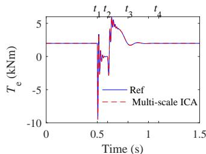

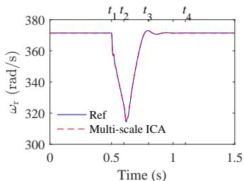  
Fig. 6. Multi-scale simulation results for a three-phase-to-ground fault at the terminals of a 500-hp induction machine; left: electromagnetic torque; right: machine angular speed.

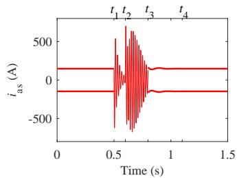

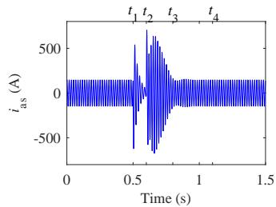  
Fig. 7. Phase a stator current $i _ { \mathrm { a s } } ;$ left: natural and envelope waveforms in the multi-scale simulation, solid light: natural waveform, solid bold: envelope; right: natural waveform of the reference solution.

The induction machine model of the simulator EMTP-RV is also included in the accuracy analysis. As opposed to the reference model where the ideal voltage source at the stator terminals was given in the dq0 domain of the rotor reference frame, an ideal voltage source of EMTP is represented by phase voltages in the stationary reference frame. When connecting to that source, a reference frame transform is necessary as the machine model of EMTP-RV is represented in the rotor reference frame. In the following Subsection IV-A, the scenario is studied, and the diverse transients are considered. Accuracy and efficiency of the ICA model are investigated in Section IV-B and Section IV-C, respectively.

# A. Multi-scale Simulation of ICA Model

Fig. 6 shows the simulation results for the electromagnetic torque $T _ { \mathrm { e } }$ and the rotor angular speed $\omega _ { \mathrm { r } }$ . It is clear that the results obtained with the multi-scale ICA model closely match the reference solution. Fig. 7 depicts the stator current $i _ { \mathrm { a s } }$ and shows how the multi-scale ICA model supports the integrative simulation of both natural and envelope waveforms within one study. Zoomed-in views of the stator current $i _ { \mathrm { a s } }$ during recovery electromagnetic transient and electromechanical transient stages are shown in Fig. 8.

Initially, the machine is under a steady-state condition. Envelope waveforms are represented at the beginning of

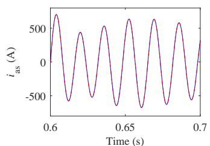

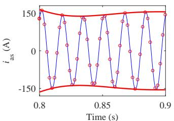  
Fig. 8. Zoomed-in view of stator current $i _ { \mathrm { a s } } ;$ left: during recovery electromagnetic transient stage, solid light: natural waveform of the reference solution, dashed light: natural waveform in the multi-scale simulation; right: during electromechanical transient stage, solid light: natural waveform of the reference solution, solid bold: envelope waveform in the multi-scale simulation, circles: natural waveform in the multi-scale simulation.

TABLE II SIMULATION ACCURACY OF THE MULTI-SCALE ICA MODEL   

<table><tr><td>Time (s)</td><td>Stages</td><td>2-norm deviations of ias (%)</td></tr><tr><td>0.5-0.6</td><td>fault electromagnetic transient</td><td>0.0169</td></tr><tr><td>0.6-0.8</td><td>recovery electromagnetic transient</td><td>0.0076</td></tr><tr><td>0.8-1.1</td><td>electromechanical transient</td><td>0.0364</td></tr><tr><td>1.1-2.0</td><td>approach steady state</td><td>0.0503</td></tr></table>

the simulation. The shift frequency $f _ { \mathrm { r e f } }$ equals the carrier frequency at 60 Hz, and the time-step size τ equals 20 ms. $\mathrm { A t \ } t _ { 1 } = 0 . 5 \ \mathrm { s } ,$ a three-phase-to-ground fault occurs at the machine terminals. The fault triggers electromagnetic transients. Natural waveforms are tracked at $f _ { \mathrm { r e f } } = 0$ Hz and $\tau = 5 0$ µs. The change from the synchronously rotating reference frame with envelope tracking to the stationary reference frame with the tracking of natural waveforms is visible in Fig. 7. At $t _ { 2 } ~ = ~ 0 . 6 ~ \mathrm { ~ s ~ }$ , the fault is successfully cleared. The electromagnetic transients still exist in the system. The simulation parameters remain $f _ { \mathrm { r e f } } = 0$ Hz and $\tau = 5 0 ~ \mu \mathrm { s }$ . Tracking of natural waveforms in the stationary reference frame continues. At about $t _ { 3 } ~ = ~ 0 . 8 ~ \mathrm { s } ,$ the electromagnetic transients have strongly decayed. Remaining electromechanical oscillations are emulated with envelope tracking at $\tau \ = \ 2$ ms in the synchronously rotating reference frame as shown in Fig. 7. As steady-state conditions approach, at about $t _ { 4 } .$ , the time-step size is increased to 20 ms. The envelope is tracked further to represent the quasi steady state.

# B. Accuracy of Multi-scale ICA Model

To investigate the accuracy of the multi-scale ICA model, the 2-norm cumulative deviations of $i _ { \mathrm { a s } }$ from the reference are summarized in Table II. During fault and recovery electromagnetic transient, $\tau = 5 0$ µs is used, the multi-scale ICA model provides accurate results with deviations of 0.0169 % and 0.0076 % deviations. As shown on the left of Fig. 8, no deviation of the simulation results obtained by the multiscale ICA model from the corresponding reference solution is visible.

During stages of electromechanical transients or steady state, much larger time-step sizes are chosen. According to (1), the real parts of the analytic signals represent the time domain instantaneous values. The latter are used to further investigate the accuracies of envelope waveforms processed by the multiscale ICA model. The natural waveforms are shown using

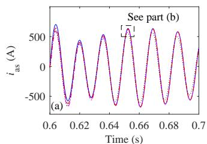

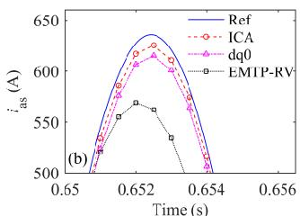  
Fig. 9. Phase a stator current $i _ { \mathrm { a s } }$ during recovery electromagnetic transient using a time-step of 0.5 ms for multi-scale ICA model, multi-scale dq0 model, and EMTP-RV.

circles in Fig. 8. As observed on the right of Fig. 8, the simulation results obtained with the multi-scale ICA model closely match the reference solutions. The deviations during these stages are 0.0364 % and 0.0503 %, respectively.

To further assess the quality, the study performed in Section IV-A is repeated with a larger fixed time-step of 0.5 ms. For comparison, the multi-scale dq0 induction machine model [14] and the induction machine model of EMTP-RV are considered. The time-step size for the multi-scale dq0 model and the model of EMTP-RV is also set to 0.5 ms. Fig. 9(a) shows the stator current $i _ { \mathrm { a s } }$ during the recovery transient. To focus on details, a zoomed-in view of $i _ { \mathrm { a s } }$ is displayed in Fig. 9(b). It is clear that the results obtained with the proposed multi-scale ICA model are more accurate than those obtained with the multi-scale dq0 model and the model of EMTP-RV. The improved accuracy can be attributed to the direct interfacing in the phase domain using (41). Furthermore, as shown in Fig. 9(b), the multi-scale dq0 model is more accurate than the model of EMTP-RV. For a description of the multiscale dq0 model, the interested reader may consult [14].

# C. Efficiency of Multi-scale ICA Model

The computational cost of the multi-scale ICA model and the corresponding single-scale ICA model as appropriate for EMTP-type simulation are compared in terms of floating point operations and trigonometric functions required for a single time-step. In the multi-scale simulation, analytic instead of real signals are used. The counting rules for trigonometric functions are documented in [12]. The flop counting rules for elementary operations are as follows [25]:

real variable operations: consider one floating-point addition, subtraction, multiplication, or division as 1 flop;   
• complex variable operations: consider complex addition or subtraction as 2 flops, complex multiplication as 6 flops, complex division as 11 flops;   
• complex-real variable operations: consider one complexreal addition or subtraction as 1 flop, complex-real multiplication or division as 2 flops.

The elementary operations flops and trigonometric functions required for an EMTP-type model and the multi-scale ICA model are summarized in Table III. For better comparison, the counts are divided among different computations affiliated with the algorithm of Fig. 3. For the multi-scale model, two cases are considered as described in Section III.A: one with a setting of $f _ { \mathrm { r e f } } = 0$ Hz and the other with a setting of $f _ { \mathrm { r e f } } = f _ { \mathrm { c } } .$

TABLE III ELEMENTARY OPERATIONS FLOPS AND ADDITIONAL TRIGONOMETRIC FUNCTIONS COUNTS PER STEP OF NORTON EQUIVALENT   

<table><tr><td></td><td colspan="2">EMTP-type</td><td colspan="2">Multi-scale</td></tr><tr><td>calculation process</td><td>el. flops</td><td>add. trigs</td><td>el. flops fref=0 Hz / fc</td><td>add. trigs</td></tr><tr><td>idq0r(k) (40)</td><td>10</td><td></td><td>20 / 20</td><td></td></tr><tr><td>λabs(c)(66)</td><td>15</td><td></td><td>30 / 30</td><td></td></tr><tr><td>Te(k) (44)</td><td>4</td><td></td><td>4 / 4</td><td></td></tr><tr><td>θr(k+1) (45) or (76)</td><td>2</td><td></td><td>4 / 4</td><td></td></tr><tr><td>K(θr(k+1)) (71)</td><td>8</td><td>2</td><td>8 / 8</td><td>2</td></tr><tr><td>eabsch(k+1) (16)</td><td>12</td><td></td><td>24 / 54</td><td></td></tr><tr><td>edq0rh(k+1) (39)</td><td>10</td><td></td><td>20 / 20</td><td></td></tr><tr><td>ec(k+1) (38)</td><td>18</td><td></td><td>30 / 60</td><td></td></tr><tr><td>j(k+1) (43)</td><td>12</td><td></td><td>24 / 48</td><td></td></tr><tr><td>Total</td><td>91</td><td>2</td><td>164 / 248</td><td>2</td></tr></table>

The counts for the multi-scale model in these two cases are treated separately and separated by the symbol “/” in Table III. When at $f _ { \mathrm { r e f } } ~ = ~ 0$ Hz real instantaneous signals were used instead of analytic signals, the multi-scale ICA model would work as an EMTP-type ICA model. Hence, the counts of the EMTP-type ICA model in Table III are obtained based on this special case of the multi-scale ICA model. Table III shows the number of flops for the Norton equivalent. If the Thevenin equivalent (20) is used, then (43) is not needed and the count is reduced. This approach was adopted in [17].

Based on (47), 4 flops are required for the prediction of rotor angle $\theta _ { \mathrm { r } } \left( k + 1 \right)$ in the multi-scale model in which multiple time-steps are used. In contrast, the EMTP-type model at a constant time-step only requires 2 flops for the prediction of the rotor angle given by (76) of Appendix F. Furthermore, as discussed in [12], the evaluation of a single trigonometric function may cost as much as the evaluation of twenty equivalent flops. As a consequence, $9 1 + 2 \cdot 2 0 = 1 3 1$ flops are required for the EMTP-type ICA model, $1 6 4 + 2 \cdot 2 0 = 2 0 4$ flops are required for the multi-scale model in the case of $f _ { \mathrm { r e f } } = 0$ Hz, 248 + 2 · 20 = 288 flops are required for the multi-scale model for $f _ { \mathrm { r e f } } = f _ { \mathrm { c } }$ .

The EMTP-type ICA model and the multi-scale ICA model process real signals and analytic signals, respectively. In the simulation of electromagnetic transients, a comparative small time-step size, e.g. 50 µs in Section IV.A, is required for the multi-scale ICA model as well as the EMTP-type ICA model. The processing of analytic rather than real signals leads to a factor of (204 flops)/(131 flops)  1.56 in increased computational cost per time-step. For the electromechanical transients in Section IV.A, a time-step of 2 ms was selected for the multi-scale ICA model. However, the time-step for the EMTP-type ICA model was still set to 50 µs. The multi-scale ICA model was more efficient than the EMTP-type model because the number of operations per time-step was reduced by the factor of (2 ms)·(131 flops)/(50 µs)/(288 flops) ≈ 18. During the period of quasi steady state, a larger timestep of 20 ms was chosen for the multi-scale ICA model. The computational cost of the multi-scale ICA model was (20 ms) (131 flops)/(50 µs)/(288 flops) 182 times lower than that of the EMTP-type model. The EMTP-type model still needed to track the 60-Hz sinusoidal waveforms, while

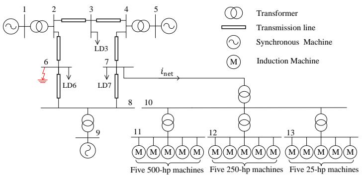  
Fig. 10. One-line diagram of multi-machine power system used for test of practical application.

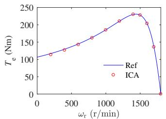  
Fig. 11. Model torque speed curve compared with reference data of 25-hp induction machine.

the multi-scale model followed the envelopes of the voltages and currents.

# V. PRACTICAL APPLICATION

In this section, the proposed multi-scale machine model is applied and validated for a practical power system. The focus of this section is on verification of the capabilities in application. In Section V-A, the setup of the simulation is introduced. In Section V-B, the practical multi-scale simulation run of transients is described. An analysis of the multi-scale simulation is performed in Section V-C.

# A. Setup of Simulation

A one-line diagram of the test system is given in Fig. 10. A distribution network which comprises 15 induction machines is connected to the Western System Coordinated Council (WSCC) 9-bus system at bus 7. The parameters of the lines, transformers and synchronous machines are from [26]. The modeling of line and transformer can be found in [7]. The synchronous machine is represented by the equivalent circuit shown in [11]. The parameters of the machines are from [27], [28] and listed in Appendix E. As part of the setup procedure, the steady-state torque-speed characteristic curve of the newly developed induction machine model was verified to make sure that it closely matches the reference machine data. The reference data of the 25-hp induction machine, including torque-speed characteristics, were compiled from the results reported in [28] and listed in Appendix E. For the verification, shift frequency and time-step size were set to $f _ { \mathrm { r e f } } = 6 0$ Hz and τ = 2 ms, respectively, since those settings are also commonly encountered in the upcoming simulation. The results of the comparison of the torque-speed characteristics are shown in Fig. 11. The close matching of the characteristic curves of the reference data and of the multi-scale ICA model show

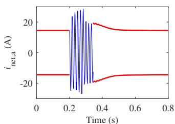

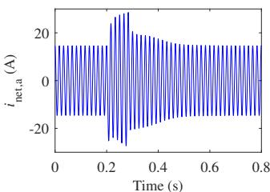  
Fig. 12. Phase a current of $i _ { \mathrm { n e t } } ;$ left: natural and envelope waveforms in the multi-scale simulation, solid light: natural waveform, solid bold: envelope; right: natural waveform of the reference solution in EMTDC.

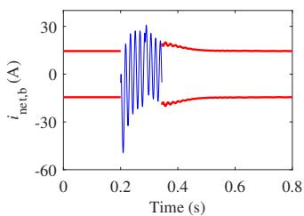

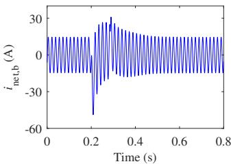  
Fig. 13. Phase b current of $i _ { \mathrm { n e t } } ;$ left: natural and envelope waveforms in the multi-scale simulation, solid light: natural waveform, solid bold: envelope; right: natural waveform of the reference solution in EMTDC.

that the latter is ready for application in practical application. The matching also further substantiates the outcomes of the theoretical validation in Section IV.

Initially, the system is in the steady state and the machines are operating steadily at rated load torques. Phase b is shorted to ground at bus 6 at $t = 0 . 2 \mathrm { ~ s } .$ The fault is cleared after five cycles. As in Section IV-A, multi-scale simulation is also applied in this case study. For the purpose of comparison, the test system is also modeled in PSCAD/EMTDC [2], which is a representative of the family of EMTP-type programs and is most widely used in practice. A fixed time-step size of 50 $\mu \mathrm { s }$ is used for the PSCAD simulation.

# B. Run of Simulation

The currents flowing into the distribution network are shown in Fig. 12 and Fig. 13. Zoomed-in views of phase a current $i _ { \mathrm { n e t , a } }$ and phase b current $i _ { \mathrm { n e t , b } }$ during diverse transients stages are shown in Fig. 14, Fig. 15, and Fig. 16. At the beginning of the simulation, the envelope waveforms are tracked at $f _ { \mathrm { r e f } } ~ = ~ 6 0$ Hz and $\tau \ = \ 2 0$ ms. At $t ~ = ~ 0 . 2 ~ \mathrm { s } ,$ a singlephase-to-ground fault occurs at bus 6. The electromagnetic transients are triggered as a consequence of the occurrence of the fault. Natural waveforms rather than envelopes are tracked at a small time-step size of 50 $\mu \mathrm { s } .$ At about $t ~ = ~ 0 . 3 4 ~ \mathrm { s } ,$ the electromagnetic transients have largely decayed. Envelope tracking resumes at $f _ { \mathrm { r e f } } ~ = ~ 6 0$ Hz and $\tau \ = \ 2$ ms. At about $t = 0 . 6 \ \mathrm { s } ,$ , steady-state conditions are close with nearly undistorted sine waveforms. The envelope is tracked further at a large time-step size of $\tau = 2 0$ ms.

# C. Analysis of Simulation

The proposed multi-scale ICA model shows to accurately simulate diverse transients including the tracking of both natural and envelope waveforms. As observed in Fig. 14, Fig. 15, and Fig. 16, the results obtained with the proposed

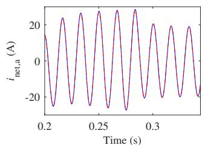

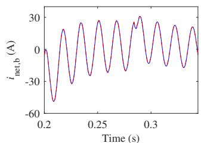  
Fig. 14. Zoomed-in views of $i _ { \mathrm { n e t , a } }$ and $i _ { \mathrm { n e t , b } }$ during the period of electromagnetic transients; solid: natural waveform of the reference solution in EMTDC, dashed: natural waveform in the multi-scale simulation; left: phase a current $i _ { \mathrm { n e t , a } } ;$ right: phase b current $i _ { \mathrm { n e t } }$ ,b .

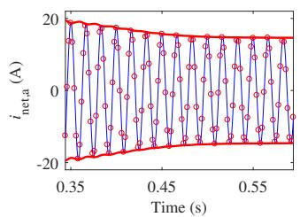

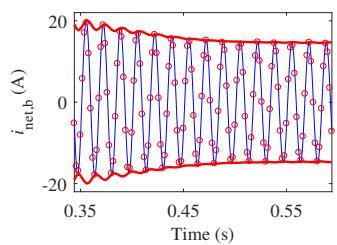  
Fig. 15. Zoomed-in views of $i _ { \mathrm { n e t , a } }$ and $i _ { \mathrm { n e t , b } }$ during the period of electromechanical transients; solid light: natural waveform of the reference solution in EMTDC, circles: natural waveform in the multi-scale simulation, solid bold: envelope waveform in the multi-scale simulation; left: phase a current $i _ { \mathrm { n e t , a } } ;$ right: phase b current $i _ { \mathrm { n e t , b } } .$ .

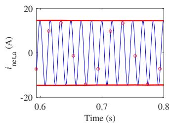

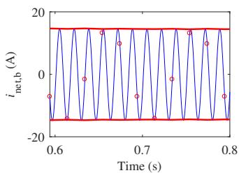  
Fig. 16. Zoomed-in views of $i _ { \mathrm { n e t , a } }$ and $i _ { \mathrm { n e t , b } }$ during the period of quasi steady state; solid light: natural waveform of the reference solution in EMTDC, circles: natural waveform in the multi-scale simulation, solid bold: envelope waveform in the multi-scale simulation; left: phase a current $i _ { \mathrm { n e t , a } } ;$ right: phase b current $i _ { \mathrm { n e t , b } }$ .

model closely match the reference solutions. No difference between the multi-scale simulation and the corresponding PSCAD simulation is visible. Of interest is also a comparison of the computational efficiency. In the multi-scale simulation, the analytic signals are used, the real signals are used for the EMTP-type implementation. When tracking electromagnetic transients, both implementations require a comparatively small time-step size of 50 $\mu \mathbf { S } .$ The processing of analytic rather than real signals has shown to increase the computational cost per time-step by a factor of about 1.3, in accordance with the findings in [7]. For the period of electromechanical transients, a larger time-step size of 2 ms is used in the multiscale simulation. Taking into account that analytic signals are processed, the computational speed is increased by a factor of $( 2 \mathrm { m s } ) / ( 5 0 \mu \mathrm { s } ) / 1 . 3 \approx 3 1$ . When the system approaches steadystate conditions, the time-step size is increased to 20 ms in the multi-scale simulation. The computational speed is then increased by a factor of (20 ms)/(50 µs)/1.3  308.

# VI. CONCLUSION

A multi-scale induction machine model with constant inner admittance in the phase domain was developed, implemented, and validated. The model directly integrates with simulators describing the network in the phase domain without a reference frame transformation. The variations in inner admittance due to the rotor position and saturation are eliminated. There is no need to change the network nodal admittance matrix. The variable electric and magnetic quantities are modeled through analytic signals that support frequency shifting of involved Fourier spectra. Thus, with the shift frequency as a simulation parameter in addition to the time-step size, diverse transients can be tracked efficiently.

The performance has been verified through test cases initially dominated by electromagnetic transients followed by a stage of electromechanical transients. A very high degree of accuracy was confirmed. Both shift frequency and timestep size were adapted to the situation given by the prevailing transients. The modeling methodology is also valid and applicable when it is used at an unchanged reference frame in the phase domain. If the selected reference frame is stationary, it is very suitable for processing instantaneous signals just as done in EMTP. In the synchronously rotating reference frame instead, interfacing is most suitable with simulations processing dynamic phasors. The main scientific contribution, however, pertains to the capability of the ICA model to efficiently track transients across multiple time scales.

# APPENDIX

# A. Coefficients of Multi-scale ICA Model

The stator inductance matrix $\pmb { L } _ { \mathrm { s s } }$ , the rotor inductance matrix $\scriptstyle { L _ { \mathrm { r r } } }$ and the mutual inductance matrix $L _ { \mathrm { s r } } ( \theta _ { \mathrm { r } } )$ are given as follows [11]:

$$
\boldsymbol {L} _ {\mathrm {s s}} = \left[ \begin{array}{c c c} L _ {\mathrm {l s}} + L _ {\mathrm {m s}} & - \frac {1}{2} L _ {\mathrm {m s}} & - \frac {1}{2} L _ {\mathrm {m s}} \\ - \frac {1}{2} L _ {\mathrm {m s}} & L _ {\mathrm {l s}} + L _ {\mathrm {m s}} & - \frac {1}{2} L _ {\mathrm {m s}} \\ - \frac {1}{2} L _ {\mathrm {m s}} & - \frac {1}{2} L _ {\mathrm {m s}} & L _ {\mathrm {l s}} + L _ {\mathrm {m s}} \end{array} \right], \tag {55}
$$

$$
\boldsymbol {L} _ {\mathrm {r r}} = \left[ \begin{array}{c c c} L _ {\mathrm {l r}} + L _ {\mathrm {m s}} & - \frac {1}{2} L _ {\mathrm {m s}} & - \frac {1}{2} L _ {\mathrm {m s}} \\ - \frac {1}{2} L _ {\mathrm {m s}} & L _ {\mathrm {l r}} + L _ {\mathrm {m s}} & - \frac {1}{2} L _ {\mathrm {m s}} \\ - \frac {1}{2} L _ {\mathrm {m s}} & - \frac {1}{2} L _ {\mathrm {m s}} & L _ {\mathrm {l r}} + L _ {\mathrm {m s}} \end{array} \right], \tag {56}
$$

For a magnetically linear system, the flux linkages in the dq0 domain of the rotor reference frame may be expressed as [11]:

$$
\boldsymbol {\lambda} _ {\mathrm {d q 0 s}} (t) = \boldsymbol {L} _ {\mathrm {s s d q}} \boldsymbol {i} _ {\mathrm {d q 0 s}} (t) + \boldsymbol {L} _ {\mathrm {s r d q}} \boldsymbol {i} _ {\mathrm {d q 0 r}} (t), \tag {57}
$$

$$
\lambda_ {\mathrm {d q 0 r}} (t) = \boldsymbol {L} _ {\mathrm {r s d q}} \boldsymbol {i} _ {\mathrm {d q 0 s}} (t) + \boldsymbol {L} _ {\mathrm {r r d q}} \boldsymbol {i} _ {\mathrm {d q 0 r}} (t), \tag {58}
$$

where the coefficient matrices $L _ { \mathrm { s s d q } } , L _ { \mathrm { s r d q } } , L _ { \mathrm { r s d q } }$ and $L _ { \mathrm { r r d q } }$ are constant. They are given as follows:

$$
\boldsymbol {L} _ {\mathrm {s s d q}} = \operatorname {d i a g} \left[ L _ {\mathrm {l s}} + L _ {\mathrm {m}}, L _ {\mathrm {l s}} + L _ {\mathrm {m}}, L _ {\mathrm {l s}} \right], \tag {59}
$$

$$
\boldsymbol {L} _ {\text {r r d q}} = \operatorname {d i a g} \left[ L _ {\mathrm {l r}} + L _ {\mathrm {m}}, L _ {\mathrm {l r}} + L _ {\mathrm {m}}, L _ {\mathrm {l r}} \right], \tag {60}
$$

$$
\boldsymbol {L} _ {\mathrm {s r d q}} = \operatorname {d i a g} \left[ L _ {\mathrm {m}}, L _ {\mathrm {m}}, 0 \right], \tag {61}
$$

$$
\boldsymbol {L} _ {\mathrm {r s d q}} = \boldsymbol {L} _ {\mathrm {s r d q}} ^ {\mathrm {T}}, \tag {62}
$$

with

For the multi-scale simulation, the stator circuit and rotor circuit flux linkage equations in the dq0 domain are represented using analytic signals:

$$
\underline {{\boldsymbol {\lambda}}} _ {\mathrm {d q 0 s}} (t) = \boldsymbol {L} _ {\mathrm {s s d q}} \underline {{\boldsymbol {i}}} _ {\mathrm {d q 0 s}} (t) + \boldsymbol {L} _ {\mathrm {s r d q}} \underline {{\boldsymbol {i}}} _ {\mathrm {d q 0 r}} (t), \tag {64}
$$

$$
\underline {{\boldsymbol {\lambda}}} _ {\mathrm {d q 0 r}} (t) = \boldsymbol {L} _ {\mathrm {r s d q}} \underline {{\dot {\boldsymbol {\imath}}}} _ {\mathrm {d q 0 s}} (t) + \boldsymbol {L} _ {\mathrm {r r d q}} \underline {{\dot {\boldsymbol {\imath}}}} _ {\mathrm {d q 0 r}} (t). \tag {65}
$$

Multiplying both sides of (64) by the inverse rotor reference frame transformation $K ^ { - 1 } \left( \theta _ { \mathrm { r } } ( t ) \right)$ of (71) yields the stator flux linkage $\pmb { \Delta } _ { \mathrm { a b c s } } ( t )$ in the phase domain:

$$
\underline {{\boldsymbol {\lambda}}} _ {\mathrm {a b c s}} (t) = \boldsymbol {K} ^ {- 1} \left(\theta_ {\mathrm {r}} (t)\right) \boldsymbol {L} _ {\mathrm {s s d q}} \underline {{\boldsymbol {i}}} _ {\mathrm {d q 0 s}} (t) + \boldsymbol {K} ^ {- 1} \left(\theta_ {\mathrm {r}} (t)\right) \boldsymbol {L} _ {\mathrm {s r d q}} \underline {{\boldsymbol {i}}} _ {\mathrm {d q 0 r}} (t). \tag {66}
$$

A similar expression applies to the rotor flux linkage $\pmb { \Delta } _ { \mathrm { a b c r } } ( t )$ in the phase domain:

$$
\underline {{\boldsymbol {\lambda}}} _ {\mathrm {a b c r}} (t) = \boldsymbol {K} ^ {- 1} (0) \boldsymbol {L} _ {\mathrm {r s d q}} \underline {{\boldsymbol {i}}} _ {\mathrm {d q 0 s}} (t) + \boldsymbol {K} ^ {- 1} (0) \boldsymbol {L} _ {\mathrm {r r d q}} \underline {{\boldsymbol {i}}} _ {\mathrm {d q 0 r}} (t). \tag {67}
$$

# B. Calculation of Rotor Currents in Phase Domain

The rotor current $\underline { { \dot { \mathbf { \Pi } } } } _ { \mathrm { a b c r } }$ in (10) may be expressed through the stator current $\underline { { i } } _ { \mathrm { a b c s } }$ and rotor voltage $\underline { { \mathbf { \nabla } } } v _ { \mathrm { a b c r } }$ . The process is shown in the following. The rotor flux linkages in (10) are discretized using the trapezoidal rule of integration as:

$$
\begin{array}{l} \frac {\boldsymbol {\lambda} _ {\mathrm {a b c r}} (k) - \boldsymbol {\lambda} _ {\mathrm {a b c r}} (k - 1)}{\tau} = \frac {\boldsymbol {v} _ {\mathrm {a b c r}} (k) + \boldsymbol {v} _ {\mathrm {a b c r}} (k - 1)}{2} \\ - \frac {\mathbf {R} _ {\mathrm {r}} \mathbf {i} _ {\text {a b c r}} (k) + \mathbf {R} _ {\mathrm {r}} \mathbf {i} _ {\text {a b c r}} (k - 1)}{2}. \tag {68} \\ \end{array}
$$

Insertion of the rotor flux linkages (13) into (68) yields:

$$
\underline {{\boldsymbol {L} _ {\mathrm {r s}} (\theta_ {\mathrm {r}} (k)) \underline {{\boldsymbol {i}}} _ {\mathrm {a b c s}} (k) + \boldsymbol {L} _ {\mathrm {r r}} \underline {{\boldsymbol {i}}} _ {\mathrm {a b c r}} (k)}}
$$

$$
\tau
$$

$$
\underline {{\boldsymbol {L} _ {\mathrm {r s}} \left(\theta_ {\mathrm {r}} (k - 1)\right) \underline {{\boldsymbol {i}}} _ {\mathrm {a b c s}} (k - 1) + \boldsymbol {L} _ {\mathrm {r r}} \underline {{\boldsymbol {i}}} _ {\mathrm {a b c r}} (k - 1)}} =
$$

$$
\tau
$$

$$
\frac {\underline {{\boldsymbol {v}}} _ {\mathrm {a b c r}} (k) + \underline {{\boldsymbol {v}}} _ {\mathrm {a b c r}} (k - 1)}{2} - \frac {\boldsymbol {R} _ {\mathrm {r}} \underline {{\boldsymbol {i}}} _ {\mathrm {a b c r}} (k) + \boldsymbol {R} _ {\mathrm {r}} \underline {{\boldsymbol {i}}} _ {\mathrm {a b c r}} (k - 1)}{2}. \tag {69}
$$

By rearranging (69), the rotor currents $\underline { { \dot { \mathbf { \Pi } } } } _ { \mathrm { a b c r } } ( k )$ may be expressed as given in (18).

# C. Rotor Reference Frame Transformation

Let variables $X _ { \mathrm { d q 0 } } = ( X _ { \mathrm { d } } X _ { \mathrm { q } } X _ { 0 } ) ^ { \mathrm { T } }$ be represented in a rotor reference frame rotating at rotor speed $\omega _ { \mathrm { r } }$ and the q-axis leading the d-axis by 90◦. The transform of phase variables $X _ { \mathrm { a b c } } = ( X _ { \mathrm { a } } \ X _ { \mathrm { b } } \ X _ { \mathrm { c } } ) ^ { \mathrm { T } }$ to the rotor reference frame is [11]:

$$
\boldsymbol {X} _ {\mathrm {d q 0}} = \boldsymbol {K} (\theta) \boldsymbol {X} _ {\mathrm {a b c}} \tag {70}
$$

with

$$
\begin{array}{l} \boldsymbol {K} (\theta) = \frac {2}{3} \left[ \begin{array}{c c c} \cos \theta & \cos \left(\theta - \frac {2 \pi}{3}\right) & \cos \left(\theta + \frac {2 \pi}{3}\right) \\ - \sin \theta & - \sin \left(\theta - \frac {2 \pi}{3}\right) & - \sin \left(\theta + \frac {2 \pi}{3}\right) \\ \frac {1}{2} & \frac {1}{2} & \frac {1}{2} \end{array} \right], (71) \\ \frac {\mathrm {d} \theta}{\mathrm {d} t} = \omega_ {\mathrm {r}} - \omega_ {\mathrm {p h}} (72) \\ \end{array}
$$

where $\omega _ { \mathrm { p h } }$ denotes the rotational speed of the circuits to which the abc phase variables are affiliated. It is assumed here that d-axis and a-axis coincide at $t ~ = ~ 0 ~ \mathrm { ~ s ~ }$ . It follows that for rotating abc variables affiliated with the rotor, $\pmb { K } ( 0 )$ is used since $\omega _ { \mathrm { r } } ~ = ~ \omega _ { \mathrm { p h } }$ . For stationary abc variables affiliated with the stator, $\omega _ { \mathrm { p h } } = 0$ and $\theta = \theta _ { \mathrm { r } }$ . Equation (8) is so obtained as special case of (72).

TABLE IV PARAMETERS OF SELECTED INDUCTION MACHINES   

<table><tr><td>Symbol (unit)</td><td colspan="2">Quantity</td><td colspan="2">Values</td></tr><tr><td>\( P_{rated} \)(hp)</td><td>rated power</td><td>25</td><td>250</td><td>500</td></tr><tr><td>\( V_n \)(kV)</td><td>line to line voltage</td><td>0.46</td><td>2.3</td><td>2.3</td></tr><tr><td>\( R_s \)(Ω)</td><td>stator resistance</td><td>0.641</td><td>0.681</td><td>0.262</td></tr><tr><td>\( R_r \)(Ω)</td><td>rotor resistance</td><td>0.332</td><td>0.401</td><td>0.187</td></tr><tr><td>\( X_m \)(Ω)</td><td>magnetizing reactance</td><td>26.30</td><td>85.84</td><td>54.02</td></tr><tr><td>\( X_{ls} \)(Ω)</td><td>stator leakage reactance</td><td>1.106</td><td>2.45</td><td>1.206</td></tr><tr><td>\( X_{lr} \)(Ω)</td><td>rotor leakage reactance</td><td>0.464</td><td>2.45</td><td>1.206</td></tr><tr><td>\( J \)(kg·m2)</td><td>inertia of machine</td><td>0.554</td><td>6.918</td><td>11.062</td></tr><tr><td>p</td><td>number of poles</td><td>4</td><td>4</td><td>4</td></tr></table>

# D. Calculation of Rotor Currents in dq0 Domain

The rotor current $\underline { { \dot { \pmb { i } } } } _ { \mathrm { d q 0 r } }$ in (39) may be expressed through the stator current $\underline { { \dot { \imath } } } _ { \mathrm { a b c s } } .$ . Multiplying both sides of (18) by K(0) leads to:

$$
\begin{array}{l} \underline {{\boldsymbol {i}}} _ {\mathrm {d q 0 r}} (k) = \boldsymbol {K} (0) \left(\boldsymbol {R} _ {\mathrm {r}} + \frac {2}{\tau} \boldsymbol {L} _ {\mathrm {r r}}\right) ^ {- 1} \left(- \frac {2}{\tau} \boldsymbol {L} _ {\mathrm {r s}} (\theta_ {\mathrm {r}} (k)) \underline {{\boldsymbol {i}}} _ {\mathrm {a b c s}} (k) \right. \\ \left. + \underline {{v}} _ {\mathrm {a b c r}} (k) + \underline {{e}} _ {\mathrm {a b c r h}} (k)\right). \tag {73} \\ \end{array}
$$

Inserting (28) and (32) into (73) gives:

$$
\begin{array}{l} \underline {{\boldsymbol {i}}} _ {\mathrm {d q 0 r}} (k) = - \frac {2}{\tau} \boldsymbol {Y} _ {\mathrm {r r}} \boldsymbol {L} _ {\mathrm {r s d q}} \underline {{\boldsymbol {i}}} _ {\mathrm {d q 0 s}} (k) + \boldsymbol {Y} _ {\mathrm {r r}} \underline {{\boldsymbol {v}}} _ {\mathrm {d q 0 r}} (k) \\ + \boldsymbol {K} (0) \left(\boldsymbol {R} _ {\mathrm {r}} + \frac {2}{\tau} \boldsymbol {L} _ {\mathrm {r r}}\right) ^ {- 1} \underline {{\boldsymbol {e}}} _ {\text {a b c r h}} (k). \tag {74} \\ \end{array}
$$

Inserting (32) into (38) and comparing (29) with (38) gives:

$$
\boldsymbol {K} (0) \left(\boldsymbol {R} _ {\mathrm {r}} + \frac {2}{\tau} \boldsymbol {L} _ {\mathrm {r r}}\right) ^ {- 1} \underline {{\boldsymbol {e}}} _ {\mathrm {a b c r h}} (k) = \boldsymbol {Y} _ {\mathrm {r r}} \underline {{\boldsymbol {e}}} _ {\mathrm {d q 0 r h}} (k). \tag {75}
$$

By inserting (75) into (74), the rotor currents $\underline { { { i } } } _ { \mathrm { d q 0 r } } ( k )$ may be expressed as shown in (40).

# E. Induction Machine Parameters

The parameters of the selected induction machines used in Section IV and Section V are given in Table IV. The 250-hp and 500-hp induction machine parameters are taken from [27]. The 25-hp induction machine parameters are taken from [28].

# F. Prediction of the Rotor Angle for the EMTP-type Model

The prediction of the rotor angle in (47) is performed for the multi-scale simulation, where diverse time-step sizes are used. However, the time-step size in the EMTP typically is constant. In the EMTP, the prediction of the rotor angle becomes:

$$
\tilde {\theta} _ {r} (k + 1) = 2 \theta_ {r} (k) - \theta_ {r} (k - 1). \tag {76}
$$

# REFERENCES

[1] H. W. Dommel, “Digital computer solution of electromagnetic transients in single- and multiphase networks,” IEEE Trans. Power App. Syst., vol. PAS-88, no. 4, pp. 388–399, Apr. 1969.   
[2] A. M. Gole, R. Menzies, P. Turanli, and D. Woodford, “Improved interfacing of electrical machine models to electromagnetic transients programs,” IEEE Trans. Power App. Syst., vol. PAS-103, no. 9, pp. 2446–2451, Sep. 1984.   
[3] K. Strunz and E. Carlson, “Nested fast and simultaneous solution for time-domain simulation of integrative power-electric and electronic systems,” IEEE Trans. Power Del., vol. 22, no. 1, pp. 277–287, Jan. 2007.

[4] A. M. Stankovic, B. C. Lesieutre, and T. Aydin, “Modeling and analysis of single-phase induction machines with dynamic phasors,” IEEE Trans. Power Syst., vol. 14, no. 1, pp. 9–14, Feb. 1999.   
[5] M. Ilic and J. Zaborszky, ´ Dynamics and Control of Large Electric Power Systems. New York: Wiley, 2000.   
[6] K. Strunz, R. Shintaku, and F. Gao, “Frequency-adaptive network modeling for integrative simulation of natural and envelope waveforms in power systems and circuits,” IEEE Trans. Circuits Syst. I, vol. 53, no. 12, pp. 2788–2803, Dec. 2006.   
[7] F. Gao and K. Strunz, “Frequency-adaptive power system modeling for multiscale simulation of transients,” IEEE Trans. Power Syst., vol. 24, no. 2, pp. 561–571, May. 2009.   
[8] P. Zhang, J. R. Mart´ı, and H. W. Dommel, “Shifted-frequency analysis for EMTP simulation of power-system dynamics,” IEEE Trans. Circuits Syst. I, vol. 57, no. 9, pp. 2564–2574, Sep. 2010.   
[9] H. Ye and K. Strunz, “Multi-scale and frequency-dependent modeling of electric power transmission lines,” IEEE Trans. Power Del., vol. 33, no. 1, pp. 32–41, Feb. 2018.   
[10] D. Shu, V. Dinavahi, X. Xie, and Q. Jiang, “Shifted frequency modeling of hybrid modular multilevel converters for simulation of MTDC grid,” IEEE Trans. Power Del., vol. 33, no. 3, pp. 1288–1298, Jun. 2018.   
[11] P. C. Krause, O. Wasynczuk, S. D. Sudhoff, and S. Pekarek, Analysis of electric machinery and drive systems. John Wiley & Sons, 2013, vol. 75.   
[12] L. Wang, J. Jatskevich, C. Wang, and P. Li, “A voltage-behind-reactance induction machine model for the EMTP-type solution,” IEEE Trans. Power Syst., vol. 23, no. 3, pp. 1226–1238, Aug. 2008.   
[13] L. Wang, J. Jatskevich, V. Dinavahi, H. W. Dommel, J. A. Martinez, K. Strunz, M. Rioual, G. W. Chang, and R. Iravani, “Methods of interfacing rotating machine models in transient simulation programs,” IEEE Trans. Power Del., vol. 25, no. 2, pp. 891–903, Apr. 2010.   
[14] Y. Xia, Y. Chen, H. Ye, and K. Strunz, “Multi-scale induction machine modeling in the dq0 domain including main flux saturation,” IEEE Trans. Energy Convers., vol. 34, no. 2, pp. 652–664, Jun. 2019.   
[15] J. R. Mart´ı and T. O. Myers, “Phase-domain induction motor model for power system simulators,” in Proc. IEEE Conf. Commun., Power, Comput., vol. 2, May 1995, pp. 276–282.   
[16] P. Zhang, J. R. Mart´ı, and H. W. Dommel, “Induction machine modeling based on shifted frequency analysis,” IEEE Trans. Power Syst., vol. 24, no. 1, pp. 157–164, Feb. 2009.   
[17] D. S. Vilchis-Rodriguez and E. Acha, “Nodal reduced induction machine modeling for EMTP-type simulations,” IEEE Trans. Power Syst., vol. 27, no. 3, pp. 1158–1169, Aug. 2012.   
[18] L. Wang and J. Jatskevich, “Approximate voltage-behind-reactance induction machine model for efficient interface with EMTP network solution,” IEEE Trans. Power Syst., vol. 25, no. 2, pp. 1016–1031, May. 2010.   
[19] Y. Huang, M. Chapariha, F. Therrien, J. Jatskevich, and J. R. Mart´ı, “A constant-parameter voltage-behind-reactance synchronous machine model based on shifted-frequency analysis,” IEEE Trans. Energy Convers., vol. 30, no. 2, pp. 761–771, Jun. 2015.   
[20] K. Strunz, “Position-dependent control of numerical integration in circuit simulation,” IEEE Trans. Circuits Syst. II, Exp. Briefs, vol. 51, no. 10, pp. 561–565, Oct. 2004.   
[21] S. K. Mitra, Digital Signal Processing: A Computer-Based Approach. 2nd ed. New York: McGraw-Hill, 2001.   
[22] P. Kundur, Power System Stability and Control. New York: McGraw-Hill, 1993.   
[23] Y. Xia, Y. Chen, Y. Song, S. Huang, Z. Tan, and K. Strunz, “An efficient phase domain synchronous machine model with constant equivalent admittance matrix,” IEEE Trans. Power Del., vol. 34, no. 3, pp. 929–940, Jun. 2019.   
[24] W. Gautschi, Numerical Analysis: An Introduction. Boston, MA: Birkhauser, 1997.   
[25] C. Van Loan, Computational frameworks for the fast Fourier transform. Siam, 1992, vol. 10.   
[26] P. M. Anderson and A. A. Fouad, Power System Control and Stability. Piscataway, NJ, USA: IEEE Press, 1994.   
[27] J. J. Cathey, R. K. Cavin, and A. K. Ayoub, “Transient load model of an induction machine,” IEEE Trans. Power App. Syst., vol. 92, no. 4, pp. 1399–1406, 1973.   
[28] S. J. Chapman, Electric Machinery Fundamentals. New York: McGraw-Hill, 1998.

Yue Xia received the B.S. and M.S. degrees in electrical engineering from China Agricultural University, Beijing, China, in 2009 and 2011, respectively, and the Ph.D. degree in electrical engineering from the Technische Universitat Berlin, Germany, in¨ 2016. From 2017 to 2019, he held a postdoctoral position at the Department of Electrical Engineering, Tsinghua University.

He is currently an Associate Professor with the College of Information and Electrical Engineering, China Agricultural University. His research interests

include power electronic systems, electrical machines, wind power, and modeling and simulation of power system transients.

Kai Strunz received the Dipl.-Ing. and Dr.- Ing.degrees (summa cum laude) from the Saarland University, Saarbrucken, Germany, in 1996 and ¨ 2001, respectively.

He was with Brunel University, London, U.K., from 1995 to 1997. From 1997 to 2002, he was with the Division Recherche et Developpement of ´ Electricite de France, Paris, France. From 2002 to ´ 2007, he was an Assistant Professor of electrical engineering with the University of Washington, Seattle, WA, USA. Since 2007, he has been Professor for

Sustainable Electric Networks and Sources of Energy (SENSE) at Technische Universitat (TU) Berlin, Berlin, Germany. ¨

Dr. Strunz was the Chairman of the Conference IEEE PES Innovative Smart Grid Technologies, TU Berlin, in 2012. He is a Chairman of the IEEE Power and Energy Society Subcommittee on Distributed Energy Resources and Past Chairman of the Subcommittee on Research in Education. On behalf of the Intergovernmental Panel on Climate Change, he acted as a Review Editor for the Special Report on Renewable Energy Sources and Climate Change Mitigation. He received the IEEE PES Prize Paper Award in 2015 and the Journal of Emerging and Selected Topics in Power Electronics First Prize Paper Award 2015.