# Analyses of the modifications in the π circuits for inclusion of frequency influence in transmission line representation

L. S. Lessa, Student Member, IEEE, A. J. Prado, Member, IEEE, M. L. Bonelli, Non-member, S. Kurokawa, Non-member, J. Pissolato Filho, Member, IEEE, L. F. Bovolato, Non-member

Abstract—In this article, it is represented by state variables phase a transmission line which parameters are considered frequency independently and frequency dependent. It is analyzed what is the reasonable number of π circuits and the number of blocks composed by parallel resistor and inductor in parallel for reduction of numerical oscillations. It is simulated the numerical routine with and without the effect of frequency in the longitudinal parameters. Initially, it is used state variables and π circuits representing the transmission line composing a linear system which is solved by numerical routines based on the trapezoidal rule. The effect of frequency on the line is synthesized by resistors and inductors in parallel and this representation is analyzed in details. It is described transmission lines and the frequency influence in these lines through the state variables.

Index Terms-- Electromagnetic transient, EMTP, mathematical model, simulation, transmission lines, π circuit, numeric method, wave traveling.

# I. INTRODUCTION

OR representation the transmission lines and electric power systems, there are several models that are used, for example, state variables, differential equations. Then, these models are included in routines and used in numerical simulations of electromagnetic transients. Based on these models, simulation programs were created. The main type of these programs is the EMTP ones (Electromagnetic Transient Programs) [1, 2] For undergraduate students who are beginning to develop works in this area, it becomes very complicated to use this type of program [3, 4] when it is considered skin effect, ground effect and frequency influence. It is involve models and numerical routines that are very complex. For the study of these students, this research initiation can be based on basic concepts and simple models of transmission lines for transient simulations [5]. In this paper, it is used the representation of transmission lines as a single

phase circuit modeled by π circuits [6, 7], using state variables model. The used numeric routine combines the method of characteristics with the trapezoidal integration method, resulting in a simplified algorithm, which facilitates the initiation of undergraduate students, being capable for simulating electromagnetic transients in networks and obtaining results with satisfactory precision and accuracy. The state equations, which are the voltages and currents along the line, are analyzed numerically using mathematical matricial software (MatLabTM) because this software type allows extending the limits imposed by the EMTP-type programs for the number of π circuits. The trapezoidal rule and method of characteristics have been applied to the EMTP-type programs. So, the proposed routine is based on the concepts of this type program. The main goal of this routine is to use these concepts in mathematical softwares by undergraduate students. Some authors have compared the modified π circuits to the other frequency dependent transmissions line models [8-14], obtaining good approximations with the proposed numeric routine, In case of this paper, it is investigated the saturation limits of the number of π circuits and the number of RL parallel blocks.

# II. MATHEMATICAL MODEL

The state equations can be described by a linear system as:

$$
x = [ A ] x + [ B ] u \tag {1}
$$

where: x is the vector of state variables, u is input vector, A and B are system matrices.

The equation (1) using the method of Heun that is also known as trapezoidal rule. It is a widely used numerical procedure for solving differential equations and linear systems [15, 16]. Described as trapezoidal rule of integration for discrete parameters, this methodology consists of an improved form of the method of tangent or Euler's method that generally applied to solve differential equations, avoiding difficulties in the analytical solutions.

The trapezoidal integration applied to solve equation (1) is given by the following equation:

$$
x [ k + 1 ] - x [ k ] = \frac {T}{2} (A x [ k + 1 ] + B u [ k + 1 ] + A x [ k ] + B u [ k ]) \tag {2}
$$

Solving the state equation (2), where T is the integration step, it is rearranged as:

$$
x [ k + 1 ] = x [ k ] + \frac {T}{2} (A x [ k + 1 ] + B u [ k + 1 ] + A x [ k ] + B u [ k ]) \tag {3}
$$

Solving the equation (3), it can be rewrite as:

$$
\left[ I - \frac {T}{2} A \right] x [ k + 1 ] = \left[ I + \frac {T}{2} A \right] x [ k ] + \frac {T}{2} B [ u [ k ] + u [ k + 1 ] ] \tag {4}
$$

Making simplifications to equation (4), it is obtained:

$$
x [ k + 1 ] = A ^ {\prime \prime} x [ k ] + B ^ {\prime} [ u [ k ] + u [ k + 1 ] ] \tag {5}
$$

where: $A ^ { \prime } , A ^ { \prime \prime }$ and $B ^ { \prime }$ are constants of the matrix described by the next equations.

The mentioned constants are described by:

$$
A ^ {\prime} = \left[ I - \frac {T}{2} A \right] ^ {- 1}
$$

$$
A ^ {\prime \prime} = A ^ {\prime} \cdot \left[ I + \frac {T}{2} A \right] \tag {6}
$$

$$
B ^ {\prime} = A ^ {\prime} \cdot \frac {T}{2} B
$$

In equation (4), I is a (2n x 2n) order matrix (2nx2n), where n is the number of π circuits, A is the matrix that represents the cascade of π circuits and B is the array of input values of the system. The transmission line represented by a π circuit cascade with frequency independent parameters is shown in Figure 1. This single-phase transmission line representation has length d.

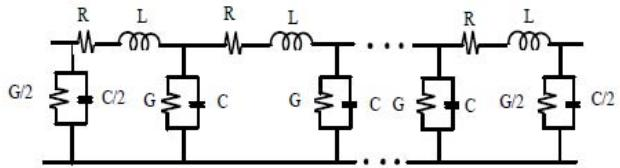  
Figure 1: Line without frequency influence represented by a cascade of π circuits.

Figure 1 shows the parameters R and L that are the line longitudinal resistance and inductance, respectively. The parameters G and C are the line transversal conductance and capacitance, respectively.

$$
R = R ^ {\prime} \frac {d}{n}; L = L ^ {\prime} \frac {d}{n} \tag {7}
$$

$$
G = G ^ {\prime} \frac {d}{n}; C = C ^ {\prime} \frac {d}{n} \tag {8}
$$

It is known that transmission lines, which parameters can be considered independent of frequency, can be modeled through a cascade of π circuits [6, 7] through a single phase representation. Figure 1 shows a single-phase transmission line representation of length d using a cascade of n π circuits.

In equations (7) and (8) $R ^ { \prime } , L ^ { \prime } , G ^ { \prime }$ and $C ^ { \prime }$ are the line parameters of the line per length unit. Using metric units, it is obtain for practical applications, $[ \Omega . k m ^ { - 1 } ] , ~ [ m H . k m ^ { - 1 } ]$ , $[ \mu S . k m ^ { - 1 } ] \mathrm { ~ e ~ } [ n F . k m ^ { - 1 } ]$ , respectively.

# III. DETERMINATION OF THE STATE EQUATIONS FOR A π CIRCUIT

When it is taken into account the effect of frequency, each modified π circuit is show in Figure 2, where the effect of

frequency on the longitudinal line parameters is represented through associations RL parallel.

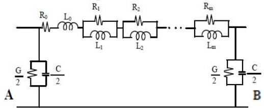  
Figure 2: Inserting the effect of frequency in a π circuit.

For a generic π circuits, it is considered the currents $i _ { k 0 } ( t )$ , $i _ { k l } ( t ) , . . . , i _ { k m } ( t )$ , circulating in the inductors $L _ { 0 } , L _ { I } , L _ { 2 } , . . . , L _ { m } ,$ respectively. The voltages at terminals A and B are respectively $u ( t )$ and $\nu _ { k } ( t )$ . These are the state variables in the modified π circuit. For the π circuit shown in Figure 1, the state variables are only the voltages on the capacitors.

Once known voltages and currents that circulate in the RL blocks, it can be written:

$$
\frac {d i _ {k 0}}{d t} = \frac {i _ {k 0}}{L _ {0}} \left(- \sum_ {j = 1} ^ {m} R _ {j}\right) + \frac {1}{L _ {L 0}} \left(\sum_ {j = 1} ^ {m} R _ {j} i _ {k j}\right) + \frac {1}{L _ {0}} u (t) - \frac {1}{L _ {0}} v _ {k} (t) \tag {9}
$$

$$
\frac {d i _ {k 1}}{d t} = \frac {R _ {1}}{L _ {1}} i _ {k 0} - \frac {R _ {1}}{L _ {1}} i _ {k 1} \tag {10}
$$

$$
\frac {d i _ {k 2}}{d t} = \frac {R _ {2}}{L _ {2}} i _ {k 0} - \frac {R _ {2}}{L _ {2}} i _ {k 2} \tag {11}
$$

$$
\frac {d i _ {k m}}{d t} = \frac {R _ {m}}{L _ {m}} i _ {k 0} - \frac {R _ {m}}{L _ {m}} i _ {k m} \tag {12}
$$

$$
\frac {d v _ {k} (t)}{d t} = \frac {2}{C} i _ {k 0} - \frac {G}{C} v _ {k} (t) \tag {13}
$$

In equations (9) to (13), currents, ik0, $i _ { k l } , . . . , i _ { k m } ,$ notations are simplified from the currents $i _ { k 0 } ( t ) , i _ { k l } ( t ) , . . . , i _ { k m } ( t )$ , respectively. Using equations (3) to (7), it can be described the circuit of Figure 2 using equation (1) as:

$$
A _ {\pi} = \left[ \begin{array}{c c c c c c} - \frac {\sum_ {j = 0} ^ {j = m} R _ {j}}{L _ {0}} & \frac {R _ {1}}{L _ {0}} & \frac {R _ {2}}{L _ {0}} & \dots & \frac {R _ {m}}{L _ {0}} & - \frac {1}{L _ {0}} \\ \frac {R _ {1}}{L _ {0}} & - \frac {R _ {1}}{L _ {0}} & 0 & \dots & 0 & 0 \\ \frac {R _ {2}}{L _ {2}} & 0 & - \frac {R _ {2}}{L _ {2}} & \dots & 0 & 0 \\ \vdots & \vdots & \vdots & \ddots & 0 & 0 \\ \frac {R _ {m}}{L _ {m}} & 0 & 0 & \dots & - \frac {R _ {m}}{L _ {m}} & 0 \\ \frac {2}{C} & 0 & 0 & \dots & 0 & - \frac {G}{C} \end{array} \right] \tag {14}
$$

$$
x _ {k} ^ {T} = \left[ \begin{array}{l l l l l l} i _ {k 0} & i _ {k 1} & i _ {k 2} & \dots & i _ {k m} & v _ {k} (t) \end{array} \right] \tag {15}
$$

$$
\dot {x} _ {k} = \frac {d x _ {k}}{d t} = \left[ \frac {d i _ {k 0}}{d t} \quad \frac {d i _ {k 1}}{d t} \quad \frac {d i _ {k 2}}{d t} \quad \dots \quad \frac {d i _ {k m}}{d t} \quad \frac {d v _ {k} (t)}{d t} \right] ^ {T} \tag {16}
$$

$$
B ^ {T} = \left[ \begin{array}{l l l l l l} \frac {1}{L _ {0}} & 0 & 0 & \dots & 0 & 0 \end{array} \right] \tag {17}
$$

In equations (15) and $( 1 6 ) , x _ { k } ^ { \textit { T } }$ and $B ^ { T }$ correspond to the matched $x _ { k }$ and $B ,$ respectively.

The results show that $A _ { \pi }$ is a square matrix of order (m +2) and the vector x has (m +2) elements.

# IV. DETERMINATION OF THE EQUATIONS OF STATE FOR MORE THAN ONE Π CIRCUIT

Based on the equations and results for one π circuit, it can be extended the analyses to a cascade of π circuits. Thus, the matrix $\it { \Delta } I A J$ will have an order of n(m +2) and the vector $[ x ]$ has dimension n(m +2). These elements can be written as:

$$
[ A ] = \left[ \begin{array}{c c c c} A _ {1 1} & A _ {1 2} & \dots & A _ {1 n} \\ A _ {2 1} & A _ {2 2} & \dots & A _ {2 n} \\ \vdots & \vdots & \ddots & \dots \\ A _ {n 1} & A _ {n 1} & \dots & A _ {n n} \end{array} \right] \tag {18}
$$

The elements $x _ { I } , \ x _ { 2 } , \ \ldots \ , \ x _ { n }$ are describe by equation (15). In equation (18), $\it { \Delta } I A J$ is a tridiagonal matrix which elements are square matrices of order $( \ m + 2 )$ . In this case, a generic element $\mathbf { A } _ { \mathrm { K K } }$ at main diagonal of the matrix $\it { \Delta } I A J$ is written in the form:

$$
A _ {k k} = A _ {\pi} \tag {19}
$$

The $A _ { \pi }$ matrix is defined in equation (14).

An element of any upper subdiagonal in equation (18) is a square matrix of order $( m + 2 )$ which only nonzero element is located in the first column of last row and has the value $( - \bigtriangledown _ { C } )$ . The structure is:

$$
\left[ A _ {i k} \right] = \left[ \begin{array}{c c c c} 0 & 0 & \dots & 0 \\ \vdots & \ddots & \dots & \vdots \\ 0 & \dots & \ddots & \vdots \\ - \frac {1}{C} & 0 & \dots & 0 \end{array} \right] \tag {20}
$$

$$
i = k - 1, \quad 2 \leq k \leq n
$$

The subdiagonal elements in the equation (18) are square matrices of order $( m + 2 )$ . These arrays have a single nonzero element which is in the last column of first row. It is a value of $\left( \mathop { V } _ { L _ { 0 } } \right)$ . The structure is:

$$
\left[ A _ {i k} \right] = \left[ \begin{array}{c c c c} 0 & \dots & 0 & \frac {1}{L _ {0}} \\ \vdots & \ddots & \dots & 0 \\ \vdots & \dots & \ddots & \vdots \\ 0 & 0 & \dots & 0 \end{array} \right] \tag {21}
$$

$$
i = k + 1, \quad 1 \leq k \leq n - 1
$$

Considering a cascade of π circuits, the vector B has dimension of $n ( m + 2 )$ and if it is connected a u(t) source at the beginning of the line, the vector B has a single nonzero

element, which is the first array element and it has the value $\left( \mathop { V } _ { L _ { 0 } } \right)$

# V. TESTING THE MODEL

Checking the effectiveness of the developed model, it is simulated the energizing of a transmission line shown in Figure 3, considering frequency independent line parameters and frequency dependent ones.

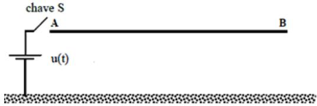  
Figure 3: Single phase line representation with opened terminal.

In Figure 3, S is a key that be closed at time $t ~ = ~ 0$ energizing the line through a voltage source u(t).

In the current procedure, the terminal B is open and the other terminal is powered by a constant voltage source. For frequency dependent line parameters, it is considered that the longitudinal parameters of the line per unit length, can be perfectly summed up by a circuit consisting of four RL parallel blocks connected in series. The structure is completed using a RL series block as shown in Figure 4.

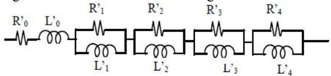  
Figure 4: Circuit that represents the longitudinal parameters of the line.

The values of R and L used to synthesize the effect of frequency on the longitudinal parameters of the line were obtained using the method proposed by [10] and are shown in Table 1. The parameters of the unit transverse line shown in figure 3 are $G ^ { \prime } = 0 , 5 5 6 \mu S / k m \mathrm { ~ e ~ } C ^ { \prime } = I I ,$ , 11nF/km.

TABLE I VALUE OF ELEMENTS USED IN R AND L CALCULATION OF PARAMETER OF THE LINE UNIT.   

<table><tr><td colspan="2">Resistors (Ω/km)</td><td colspan="2">Inductors (mH/km)</td></tr><tr><td>R0</td><td>0,026</td><td>L0</td><td>2,209</td></tr><tr><td>R1</td><td>1,470</td><td>L1</td><td>0,74</td></tr><tr><td>R2</td><td>2,354</td><td>L2</td><td>0,12</td></tr><tr><td>R3</td><td>20,149</td><td>L3</td><td>0,10</td></tr><tr><td>R4</td><td>111,111</td><td>L4</td><td>0,05</td></tr></table>

Since the values of R and L elements of the cascade of π circuits that describe the line are known, it can be obtained the state equations that describe the behavior of currents and voltages along the line. The simulations using the model proposed in this paper were performed in MatLabTM program, using the trapezoidal integration method [17]. Considering the frequency independent line parameters, the circuit of Figure 4 is reduced to the $\mathrm { R } _ { 0 }$ and $\mathrm { L } _ { 0 }$ elements. In this case, the values

are: $R _ { 0 } = 0 . 0 5$ Ω/km and $L _ { 0 } = I$ mH/km.

# VI. OBTAINED RESULTS

In all simulations, it is used the following values: the transmission line has 10 kilometers. It is represented through 200 π circuits. The time step used in the simulations is 50 ns and the simulation period is $6 0 0 \mu \mathrm { s } .$ . Figures 5, 6, 7, 8, 9 and 10 show the relationship between the number of RL parallel blocks and the inclusion of the frequency influence. In Figure 5, the resistance values are obtained using only RL parallel block related to the high frequencies. Because of this, the resistance values for all frequency values are equal. In this case, the value is equal to the $R _ { 4 }$ value.

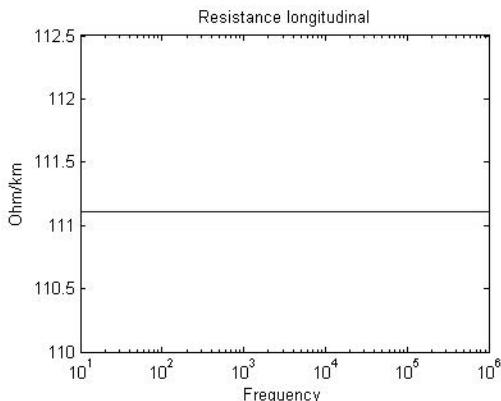  
Figure 5: Synthesis of resistance per unit length using only $R _ { 4 } L _ { 4 }$ parallel block.

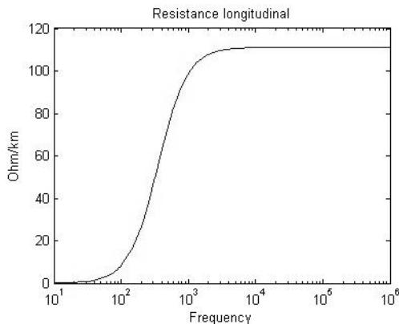  
Figure 6: Synthesis of resistance per unit length using $R _ { I } L _ { I }$ and $R _ { 4 } L _ { 4 }$ parallel blocks.

From the results of Figures 6 and 7, it is observed that the synthesis of the effect of frequency on the resistance can only be considered when inserted in the cascade of π circuits, at least, two RL parallel blocks, because each block is related to a frequency set point. So, the more blocks used, the more frequency set points obtained. It is confirmed through the results shown in Figures 8, 9 and 10 where the inductance values are presented. $\mathrm { S o } ,$ it is concluded that the synthesis of the longitudinal line parameters is improved with the increase of the number of π circuits. In the sequence of this work, the saturation limits of the proposed representation are checked. It is investigated increasing the number of π circuits as well as the number of the RL parallel blocks inserted in each π circuit.

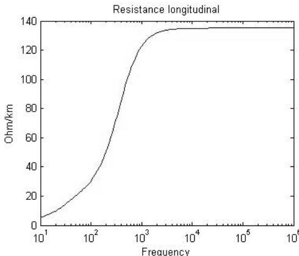  
Figure 7: Synthesis of resistance per unit length using all RL parallel blocks.

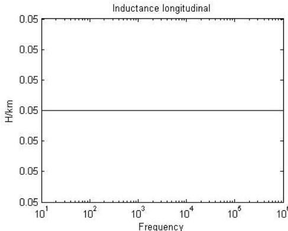  
Figure 8: Synthesis of inductance per unit length using only $R _ { 4 } L _ { 4 }$ parallel block.

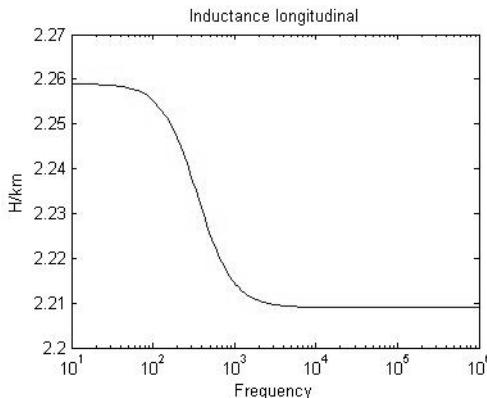  
Figure 9: synthesis of inductance per unit length using $R _ { I } L _ { I }$ and $R _ { 4 } L _ { 4 }$ parallel blocks.

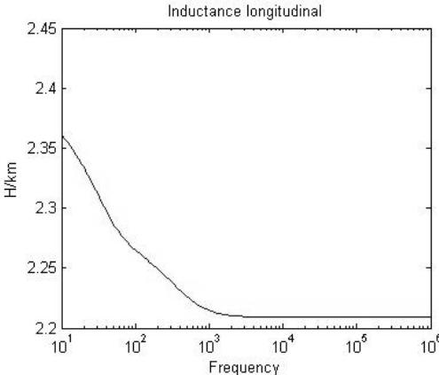  
Figure 10: synthesis of inductance per unit length using all RL parallel blocks.

The result of the simulation made for the voltage input signal u(t) can be seen in figure 11. It is shown the output voltage at the end of the receiving line without the frequency influence.

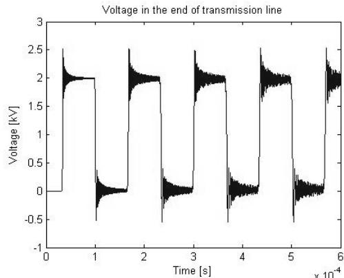  
Figure 11: Energization of the transmission line without the effect of frequency considering 200 π circuits.

Using the routine without the influence of frequency, from the results of figure 11, it is observed that there is a period of time related to the time of signal propagation through the line. Thus, it represents a time delay between input signal and output signal. After the delay, there are oscillations associated with wave reflections on the transmission line terminals that make up the output voltage shown. Using the routine with frequency influence in longitudinal parameters, it is obtained the results of Figure 12. In this figure, comparing to Figure 11, the voltage signal is attenuated because the inclusion of the frequency influence.

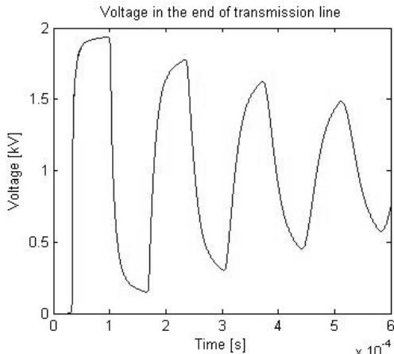  
Figure 12: Voltage at the end of the transmission line with the effect of frequency considering 200 π circuits.

Figures 13 and 14 show the influence of frequency on the current results. Without the frequency influence, the obtained signal current is not attenuated and is highly modified by numeric oscillations (Figure 13). On the other hand, when the routine considers the influence of frequency (Figure 14), it is clear that the current signal could not contain those oscillations shown in Figure 13. So, those oscillations are numeric oscillations and they can be associated to the representation of the longitudinal line parameters which does not consider the frequency influence. So, for the sequence of this work, it should be investigated what is the saturation point

for the number of the π circuits and the number of the RL parallel blocks. It is carried out using the simulation results from several voltage signals that will be used as voltage sources at the initial line terminal.

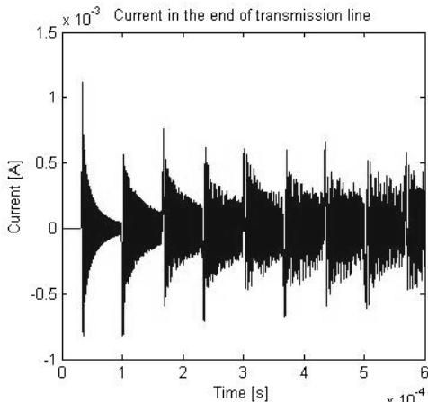  
Figure 13: Current at the end of the transmission line without the effect of frequency.

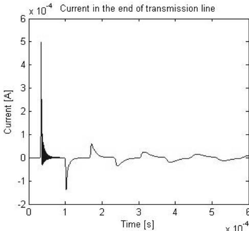  
Figure 14: Current at the end of the transmission line considering effect of frequency.

# VII. CONCLUSIONS

Several simulations are performed considering the mathematical model using state variables for transmission line transients based on the single phase line representation. It is considered the effect of frequency influence insertion, comparing it to the representation without frequency influence. In case of the introduction of frequency influence, it is carried out including RL parallel blocks in the π circuits. The π circuit cascade is the simple model for transmission lines and it can be easily assimilated by undergraduate students. So, these students can use the RL parallel blocks for modifying the π circuit structure for transmission line transient analyses that considers the frequency influence.

In this paper, the number of RL parallel blocks is varied, investigating the effect on the frequency influence modeling. Based on the obtained results, it concludes that the minimum number of RL parallel blocks is two. This number is necessary in order to have set points for the resistance and admittance values between the low and high frequencies. Using only two RL parallel blocks, it should be considered one RL parallel

block related to low frequencies and the other one related to high frequencies. It is concluded that the number of RL parallel blocks can be expanded according to the accuracy of a performed simulation. Increasing the number of π circuits, the accuracy of the obtained results can be also improved. On the other hand, there are saturation limits for the number of the RL parallel blocks and the number of π circuits. These limits are analyzed in future development.

Finally, considering a single phase transmission line representation, it is simulated the line energization. It is applied 200 π circuits. For each π circuit, it is applied 4 RL parallel blocks for a frequency range from 10 Hz to about 10 kHz. These quantities are reasonable and lead to a satisfactory accuracy for the obtained results compared to those results obtained by other authors. The accuracy of the obtained can be considered satisfactory because the used model is simple and it is recommended for undergraduate students’ analyses. Also considering the amount of number of RL parallel blocks and π circuits, the proposed routine has numerical stability in the basic transmission line transient simulations. In future, it is intended to expand the concepts used in this article proposing improvements for the numeric routine and the solution of the used state equations.

# VIII. REFERENCES

[1] Microtran Power System Analysis Corporation, Transients Analysis Program Reference Manual, Vancouver, Canada, 1992.   
[2] H. W. Dommel, EMTP Theory Book, Department of Electrical Engineering, University of British Columbia, Vancouver, 1996.   
[3] Mamis, M. S. (2003). Computing of electromagnetic Transients on Transmissions Lines With Nonlinear Components. IEE Proceedings Generation, Transmission and Distribution, Vol. 150,N0. 2; pp. 200-203.   
[4] Mamis, M. S. and A. Nacaroglu (2003). Transient Voltage and Current Distributions on Transmission Lines. IEE Proceedings Generation, Transmission and Distribution, Vol. 149,N0. 6; pp. 705-712.   
[5] F. N. R. Yamanaka, S. Kurokawa, A. J. Prado, J. Pissolato, L. F. Bovolato, “Analysis of longitudinal and temporal distribution of electromagnetic waves in transmission lines by using state-variable techniques”, Sixty Latin-American Congress: Electricity Generation and Transmission – VI CLAGTEE, Mar Del Plata, 2005.   
[6] H. W. DOMMEL, "Digital computer solution of electromagnetic transients in single and multiphase networks", IEEE Transactions on Power Apparatus and Systems, vol. PAS-88, pp. 388-399, April, 1969.   
[7] R. M. NELMS, STEVEN, R. NEWTON, G. B. SHEBLE, L. L. GRIGSBY. “Using a personal Computer to teach power system Transients”, IEEE Transactions on Power System, Vol. 4, No. 3, August 1989.   
[8] PRADO, A. J.; KUROKAWA, S.; PISSOLATO FILHO, J.; BOVOLATO, L. F.; COSTA, E. C. M.; “Phase-mode transformation matrix application for transmission line and electromagnetic transient analyses” in Electric Power Systems in Transition, Hardcover Edition, ISBN 978-1-61668-985-8, Olivia E. Robinson, Nova Science Publisher, Inc., Hauppauge, NY, 2010, pp. 1-74.   
[9] KUROKAWA, S.; COSTA, E. C. M.; PISSOLATO FILHO, J.; PRADO, A. J.; BOVOLATO, L. F.; “Proposal of a transmission line model based on lumped elements: an analytic solution”, Electric Power Components and Systems, vol. 38, no. 14, pp. 1577-594, December, 2010.

[10] COSTA, E. C. M.; KUROKAWA, S.; PISSOLATO FILHO, J.; PRADO, A. J.; “Efficient procedure to evaluate electromagnetic transients on three-phase transmission lines”, IET Generation, Transmission & Distribution, vol. 04, no. 09, pp. 1069-1081, September, 2010.   
[11] COSTA, E. C. M.; KUROKAWA, S.; PISSOLATO FILHO, J.; PRADO, A. J.; BOVOLATO, L. F.; “A model for bundled conductors considering a non-homogeneous distribution of the current through subconductors”, IEEE Latin America Transactions, vol. 08, no. 03, pp. 221- 228, June, 2010.   
[12] PRADO, A. J., KUROKAWA, S.; PISSOLATO FILHO, J.; BOVOLATO, L. F.; “Voltage and current mode vector analyses of correction procedure application to Clarke’s matrix - symmetrical threephase cases”, Journal of Electromagnetic Analysis and Applications, vol. 2, no. 1, pp. 7-17, January, 2010.   
[13] KUROKAWA, S.; PRADO, A. J.; PISSOLATOFILHO, J.; BOVOLATO, L. F.; DALTIN, R. S.; “Alternative proposal for modal representation of a non-transposed three-phase transmission line with a vertical symmetry plane”, IEEE Latin America Transactions, vol. 7, no. 2, pp. 182-189, June, 2009.   
[14] KUROKAWA, S; YAMANAKA, F. N. R.; PRADO, A. J.; PISSOLATO FILHO, J.; “Inclusion of the frequency effect in the lumped parameters transmission line model: state space formulation”, Electric Power Systems Research, vol. 79, no. 7, pp. 1155-1163, July, 2009.   
[15] Mácias, J. A. R. MACÍAS, A. G. EXPÓSITO, A. B. SOLER, “A Comparison of Techniques for State Space Transient Analysis of Transmission Lines”, IEEE Transactions on Power Delivery, vol. 20, nº 2, pp. 894-903, April, 2005.   
[16] W. E. Boyce e R. C. DiPrima, Equações Diferenciais Elementares e Problemas de Valores de Contorno, Rio de Janeiro: Guanabara Koogan, 1994.   
[17] Tavares, M. C. (1998).Modelo de Linha de Transmissão Polifásico Utilizando Quase-Modos, Doctor Thesis, UNICAMP – The State University of Campinas, Campinas, Brazil.

# IX. BIOGRAPHIES

Leonardo da Silva Lessa is a 3th year undergraduate student of Electrical Engineering at UNESP (State University of São Paulo). Currently, he develops studies of electromagnetic transients in transmission lines with a research group in this area.

Afonso José do Prado - Electrical engineering (1991) at FEIS/UNESP – The University of São Paulo State, Brazil, M.Sc. (1995) at FEIS/UNESP and D.Sc. at UNICAMP – The State University of Campinas – UNICAMP (2002). His main research interests are in electromagnetic transients of transmission lines. Presently he is a Professor at Electrical Engineering Department of the State University of Londrina (DEEL/CTU/UEL).

Marco Leandro Bonelli is a 5th year undergraduate student of Electrical Engineering at UNESP (State University of São Paulo). He attends the last period of the Electrical Engineering Course, developing studies about transmission line models with a research group in this area.

Sérgio Kurokawa has been Assistant Professor at FEIS/UNESP since 1994. He received D.Sc. degree from UNICAMP (2003). His main research interests are electromagnetic transients in power electric systems and long transmission line models used in electromagnetic transient analyses.

José Pissolato Filho was born in Campinas, São Paulo, Brazil, in 1951. He received the PhD. degree in electrical engineering from Université Paul Sabatier, France, 1986. Since 1979, he has been with Department of Energy and Control of UNICAMP. His main research interests are in high voltage engineering, electromagnetic transients and electromagnetic compatibility.

Luiz Fernando Bovolato – M.Sc. in Electrical engineering (1983) at UFRJ - Federal University of Rio de Janeiro, Brazil, Brazil, D.Sc (1993) at USP – State University of São Paulo. His main research interests are in transient analyses and line parameter calculations. Presently, he is a researcher at FEIS/UNESP.