# An Inverter Model Simulating Accurate Harmonics with Low Computational Burden for Electromagnetic Transient Simulations

Shuntaro Horiuchi, Student Member, IEEE, Kenichiro Sano, Member, IEEE and Taku Noda, Senior Member, IEEE,

Abstract—The electromagnetic transient (EMT) simulation of a power system involving power-electronics converters requires a fairly small time-step size to consider switching of the converters, thus leading to a heavy computational burden. To accelerate such simulations, this paper generalizes the time average method (TAM), originally developed for real-time simulations, so that it becomes suitable to off-line EMT simulations. For obtaining accurate current waveforms with a large time step, the TAM and the proposed method represent each leg of an inverter by voltage sources, and its output voltage is modified by interpolation at an instance of switching. The original TAM was intended for the primitive backward Euler method. This paper contributes to generalize it for the trapezoidal integration method which is widely used in off-line simulation programs. In addition, the proposed method uses a simple formula to identify the switching instance for the implementation on off-the-shelf PCs, rather than a hardware counter in an FPGA as used in the TAM. This paper shows that the proposed method enables to extend the time step by a factor of five without deteriorating the accuracy. A case study demonstrates reduction of computational time by a factor of three for the off-line simulation of a single-phase grid-connected inverter with reasonable reproduction of harmonics.

Index Terms—Electromagnetic transient (EMT) simulation, grid-connected inverter, harmonic analysis, voltage interpolation.

# I. INTRODUCTION

THE-widespread use of photovoltaic and wind power generation has increased grid-connected inverters in power systems. Such inverters interact with the power system and sometimes cause power quality issues related to harmonics [1]-[3]. Since the dynamic characteristics of inverters can be dealt with time-domain circuit simulations such as EMTP or EMTDC, they have been used as a major tool to investigate such interactions involving harmonics. The circuit simulation is also referred to as an electromagnetic transient (EMT) simulation to distinguish it from phasor domain simulations or electromagnetic field simulations.

In EMT simulations, the inverter is often modeled by ideal switches replicating switching operations of its power

S. Horiuchi and K. Sano are with the Department of Electrical and Electronic Engineering, Tokyo Institute of Technology, Tokyo 152-8552, Japan (e-mail: horiuchi.s@pel.ee.e.titech.ac.jp; sano@ee.e.titech.ac.jp).

T. Noda is with Energy Innovation Center, Central Research Institute of Electric Power Industry (CRIEPI), 2-6-1 Nagasaka, Yokosuka, Kanagawa 240-0196, Japan (e-mail: takunoda@ieee.org).

A part of this paper was presented at the IEEE Applied Power Electronics Conference and Exposition (APEC), New Orleans, LA, March 15-19, 2020. [22]

devices. The model which is called a switching (SW) model in this paper can accurately simulate the harmonics produced by the switching operation. However, the SW model needs a fairly small simulation time step (around 1/100 of the switching cycle). Even if a single inverter is connected to the power system, all the system has to be calculated with the same small time step. Thus, the simulation takes considerable computation time. One of the technical challenges in applying the EMT simulations to power system analysis is satisfying both adequate simulation accuracy and acceptable computation time.

Linear interpolation methods [4]–[11] and variable/multiple time-step simulations [12]–[14] are typical methods for the SW model to simulate the dynamics of inverters accurately with a relatively large simulation time step. However, the linear interpolation methods require multiple interpolation processes if the system includes multiple inverters. The variable/multiple time-step simulations require a re-formulation of the admittance matrix each time the time step changes. These may increase a computational burden when simulating a large-scale power system with multiple inverters. The averaging method [15] was extended for the modeling of grid-connected inverters so as to achieve fast EMT simulations [16]–[19], which is called a circuit average model. Although the model is able to operate with a large time-step (as large as the switching cycle), it cannot reproduce the harmonics produced by switching operations. This is because the model is based on averaged values over one switching cycle.

The time average method (TAM) [20], [21] was originally developed for real-time simulations in order to reproduce the behavior of inverters including harmonics with a large simulation time step. The method represents each leg of an inverter by voltage sources which apply the PWM voltage waveform to the ac side. At an instance of switching, the voltage is modified by interpolation to reduce the error in the ac current waveform. The original TAM was intended for the primitive backward Euler method of integration and implemented on a field programmable gate array (FPGA).

This paper generalizes the TAM so that it becomes suitable to off-line EMT simulations [22]. The proposed voltage interpolation method is applicable to the trapezoidal method of integration which is widely used in off-line EMT simulation programs. In addition, the proposed method uses a simple formula to identify the switching instance for the implementation on off-the-shelf PCs, rather than hardware counters

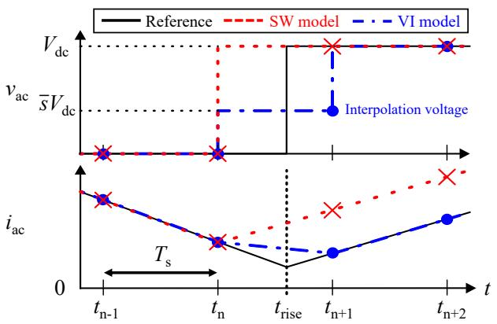  
Fig. 1. AC voltage and current waveforms in the inverter.

implemented on an FPGA as used in the TAM. As a result, the proposed method realizes fast and accurate off-line EMT simulations on general PCs. This paper compares the simulation results of a single-phase grid-connected inverter obtained by the conventional SW model and the proposed method. The comparison verifies that the proposed method enables to extend the time step by a factor of five without deteriorating the accuracy, resulting in reduction of computation time by a factor of three with reasonable reproduction of harmonics.

# II. OVERVIEW OF THE TIME AVERAGE METHOD (TAM)

# A. Error Caused by the SW Model

Fig. 1 shows the waveforms of ac voltage $v_{\mathrm{ac}}$ and ac current $i_{\mathrm{ac}}$ in a half-bridge inverter at a switching event. $T_{\mathrm{s}}$ is a simulation time step, and $t_{n - 1}, t_n, t_{n + 1}, t_{n + 2}$ are calculation points. The reference shows a theoretical waveform when $v_{\mathrm{ac}}$ rises at $t_{\mathrm{rise}}$ . Because digital simulations can hold the values only at the calculation points, the transition is reflected at $t_{n + 1}$ immediately after the switching instant $t_{\mathrm{rise}}$ . Because $v_{\mathrm{ac}}$ is applied to the ac inductor of the inverter, $i_{\mathrm{ac}}$ changes according to the integral of $v_{\mathrm{ac}}$ . The numerical integration by the backward Euler method is explained as calculating the area under the dotted line of $v_{\mathrm{ac}}$ . Even if the SW model outputs the same voltage as the reference at each time step, the dotted line differs from the reference. It means that the integral of $v_{\mathrm{ac}}$ in the SW model differs from that in the reference. The difference causes an error in $i_{\mathrm{ac}}$ [23], then it is accumulated in the following calculation points. Because the error increases with increasing $T_{\mathrm{s}}$ , the SW model has to be used with a small $T_{\mathrm{s}}$ (around 1/100 of the switching cycle) for accurate simulations.

The basic idea of the TAM [20] is depicted in Fig. 1 as the voltage interpolation (VI) model. It modifies the voltage at $t_{n+1}$ from $V_{\mathrm{dc}}$ to $\overline{s} V_{\mathrm{dc}}$ , that is called "interpolation" of the voltage in this paper. Although the dashed line of $v_{\mathrm{ac}}$ differs from the reference, the area under the dashed line is equal to that of the reference. It means that the integral of $v_{\mathrm{ac}}$ in the VI model coincides with that in the reference. As a result, $i_{\mathrm{ac}}$ can be simulated without error even if it is used with a larger $T_{\mathrm{s}}$ . If the inverter's current is simulated accurately, the voltage and current harmonics in the grid side also become accurate.

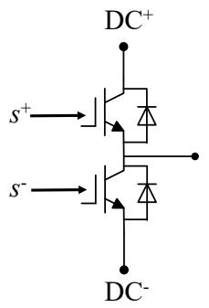  
(a) SW model

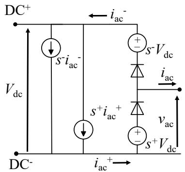  
(b) Equivalent circuit model

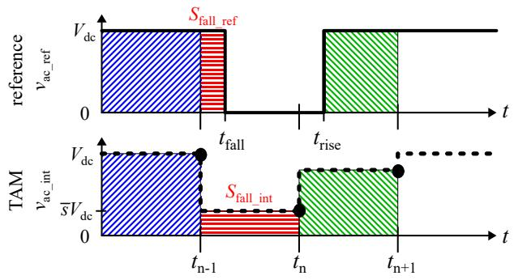  
Fig. 2. Equivalent circuit model of an inverter leg used for the TAM and the voltage interpolation method.   
Fig. 3. AC voltage waveforms in the TAM for the backward Euler integration method.

# B. Equivalent Circuit Model of an Inverter Leg

Fig. 2 shows the equivalent circuit model of an inverter leg for the TAM [21]. It consists of voltage controlled voltage sources $s^{+}V_{\mathrm{dc}}$ , $s^{-}V_{\mathrm{dc}}$ , current controlled current sources $s^{+}i_{\mathrm{ac}}^{+}$ , $s^{-}i_{\mathrm{ac}}^{-}$ , and two ideal diodes. $s^{+}$ and $s^{-}$ correspond to the switching signals for the inverter leg. If a PWM signal (0 or 1) is fed to $s^{+}$ and $s^{-}$ , the model outputs the same voltages and currents as the SW model at each terminal. If an interpolation signal between 0 and 1 is fed to $s^{+}$ and $s^{-}$ , the model outputs intermediate voltage between 0 and $V_{\mathrm{dc}}$ at the ac terminal like the circuit average models. The ideal diodes enable to simulate the appropriate ac voltage $v_{\mathrm{ac}}$ according to the polarity of $i_{\mathrm{ac}}$ during deadtimes and a blocking state.

In the TAM and the voltage interpolation method described later in the section III, 0 or 1 is fed to $s^+$ and $s^-$ between the switching events, and the interpolation signal $0 < \overline{s} < 1$ is fed to $s^+$ and $s^-$ at the calculation point around the switching events.

The equivalent circuit model operates as an inverter leg. Therefore, the method is applicable to any kinds of converters consisting of the inverter legs [21], [24]. For example, half-bridge, full-bridge, three-phase bridge, and boost converters.

# C. Calculation of the Interpolation Value

The TAM originally uses high-speed hardware counters implemented on an FPGA to generate the interpolation value $\overline{s}$ . The modulated switching signal $s$ is over-sampled at intervals

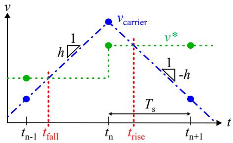  
Fig. 4. Triangular carrier PWM with synchronous sampling: $v^{*}$ is a sampled voltage reference and $v_{\mathrm{carrier}}$ is a triangular carrier waveform.

much smaller than the simulation time step. At the end of each time step, the sampled switching signal is averaged over one simulation time step. Then, it is fed to the equivalent circuit model as an interpolation value $\overline{s}$ .

Fig. 3 shows the relation between the reference voltage $v_{\mathrm{ac\_ref}}$ and the discrete voltage obtained by the TAM. The reference voltage $v_{\mathrm{ac\_ref}}$ falls at $t_{\mathrm{fall}}$ and then it rises at $t_{\mathrm{rise}}$ . The area $S_{\mathrm{fall\_ref}}$ corresponds to the integral of $v_{\mathrm{ac\_ref}}$ from $t_{\mathrm{n - 1}}$ to $t_\mathrm{n}$ . The TAM outputs the averaged value $\overline{s} V_{\mathrm{dc}}$ to the ac voltage $v_{\mathrm{ac\_int}}$ at $t_\mathrm{n}$ . The area $S_{\mathrm{fall\_int}}$ corresponds to the integral of $v_{\mathrm{ac\_int}}$ from $t_{\mathrm{n - 1}}$ to $t_\mathrm{n}$ by the backward Euler method. To simulate the ac current accurately, $S_{\mathrm{fall\_int}}$ has to be equal to $S_{\mathrm{fall\_ref}}$ in each time step. This is true only with the backward Euler integration. Therefore, the TAM has to be used with a solver applying the backward Euler integration method for accurate simulations.

There are two difficulties to apply the TAM to off-line EMT simulations. First, it is not compatible with the solver applying the trapezoidal method, which is applied in many EMT simulation programs. Second, it uses hardware counters for generating the interpolation value, whereas the off-line simulations are executed on general PCs. Thus, the interpolation value should be calculated on the processor independently of the hardware configurations.

# III. PROPOSED VOLTAGE INTERPOLATION METHOD

The proposed method generalizes the TAM in order to be suitable for the off-line EMT simulations. The proposed method has an originality in its calculation algorithm of the interpolation value. It calculates the interpolation value based on a simple formula instead of averaging the switching signal by hardware counters. Because the proposed method does not include the "time averaging" process anymore, the proposed method is called as the voltage interpolation method. Note that it has no relevance of algorithm to the linear interpolation methods [4]–[6].

# A. Derivation of the Switching Time

To calculate the interpolation values, we first derives the switching times of the theoretical waveform $t_{\mathrm{fall}}$ and $t_{\mathrm{rise}}$ . Fig. 4 shows the triangular carrier PWM with synchronous sampling, which is commonly used in digital control. Voltage reference $v^{*}$ is updated either asymmetrically (top and bottom) or symmetrically (only top) being synchronized with the triangular carrier $v_{\mathrm{carrier}}$ . The slope of the carrier $h$ is determined

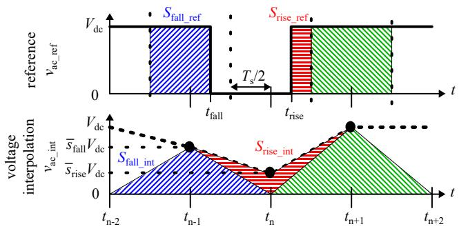  
Fig. 5. AC voltage waveforms in the proposed voltage interpolation method for the trapezoidal integration method.

by amplitude and frequency of the carrier. According to these parameters, $t_{\mathrm{fall}}$ and $t_{\mathrm{rise}}$ are obtained based on the following equations

$$
t _ {\text {f a l l}} = t _ {\mathrm {n} - 1} + \frac {v ^ {*} - v _ {\text {c a r r i e r}}}{h} \tag {1}
$$

$$
t _ {\text {r i s e}} = t _ {\mathrm {n}} - \frac {v ^ {*} - v _ {\text {c a r r i e r}}}{h}, \tag {2}
$$

where $t_{\mathrm{n - 1}}$ and $t_\mathrm{n}$ are the calculation points closest to $t_\mathrm{fall}$ and $t_\mathrm{rise}$ , respectively.

From (1) and (2), the accurate switching times are obtained by the calculation regardless of the simulation time step. The calculation can be implemented by the control system function in the off-line EMT simulation program.

# B. Derivation of the Interpolation Value for the Trapezoidal Integration Method

Fig. 5 shows the relation between the reference voltage $v_{\mathrm{ac\_ref}}$ and the discrete voltage obtained by the voltage interpolation method $v_{\mathrm{ac\_int}}$ for the trapezoidal integration method. The voltage interpolation method outputs the interpolation voltages $\overline{s}_{\mathrm{fall}} V_{\mathrm{dc}}$ and $\overline{s}_{\mathrm{rise}} V_{\mathrm{dc}}$ at $t_{\mathrm{n - 1}}$ and $t_{\mathrm{n}}$ , respectively. The $\overline{s}_{\mathrm{fall}} V_{\mathrm{dc}}$ and $\overline{s}_{\mathrm{rise}} V_{\mathrm{dc}}$ are determined to make the hatched areas in $v_{\mathrm{ac\_int}}$ to be equal to the hatched areas in $v_{\mathrm{ac\_ref}}$ in each calculation point. Then, the numerical integral of $v_{\mathrm{ac\_int}}$ by the trapezoidal method becomes equal to the integral of $v_{\mathrm{ac\_ref}}$ .

The area $S_{\mathrm{fall\_ref}}$ corresponds to the integral of $v_{\mathrm{ac\_ref}}$ from $t_{\mathrm{n - 1}} - T_{\mathrm{s}} / 2$ to $t_{\mathrm{n - 1}} + T_{\mathrm{s}} / 2$ . It is represented by

$$
S _ {\text {f a l l} - \text {r e f}} = V _ {\mathrm {d c}} \left\{\frac {T _ {\mathrm {s}}}{2} + \left(t _ {\text {f a l l}} - t _ {\mathrm {n} - 1}\right) \right\}, \tag {3}
$$

where $t_{\mathrm{fall}}$ is the switching time of the theoretical waveform, and $t_{\mathrm{n - 1}}$ is the closest calculation point to $t_{\mathrm{fall}}$ . In the same way, the area $S_{\mathrm{rise\_ref}}$ is represented by

$$
S _ {\text {r i s e} - \text {r e f}} = V _ {\mathrm {d c}} \left\{\frac {T _ {\mathrm {s}}}{2} - \left(t _ {\text {r i s e}} - t _ {\mathrm {n}}\right) \right\}, \tag {4}
$$

where $t_{\mathrm{rise}}$ is the switching time of the theoretical waveform, and $t_{\mathrm{n}}$ is the closest calculation point to $t_{\mathrm{rise}}$ . On the other hand, $S_{\mathrm{fall\_int}}$ and $S_{\mathrm{rise\_int}}$ , which represent the hatched areas in $v_{\mathrm{ac\_int}}$ are given by the following equations.

$$
S _ {\text {f a l l} \_ \text {i n t}} = \bar {s} _ {\text {f a l l}} V _ {\mathrm {d c}} T _ {\mathrm {s}} \tag {5}
$$

$$
S _ {\text {r i s e} - \text {i n t}} = \bar {s} _ {\text {r i s e}} V _ {\mathrm {d c}} T _ {\mathrm {s}} \tag {6}
$$

The interpolation values $\overline{s}_{\mathrm{fall}}$ at $t_{\mathrm{n - 1}}$ and $\overline{s}_{\mathrm{rise}}$ at $t_\mathrm{n}$ are derived to satisfy $S_{\mathrm{fall\_ref}} = S_{\mathrm{fall\_int}}$ and $S_{\mathrm{rise\_ref}} = S_{\mathrm{rise\_int}}$ from (3)-(6) as follows:

$$
\bar {s} _ {\text {f a l l}} = \frac {1}{2} + \frac {t _ {\text {f a l l}} - t _ {\mathrm {n} - 1}}{T _ {\mathrm {s}}} \tag {7}
$$

$$
\bar {s} _ {\text {r i s e}} = \frac {1}{2} - \frac {t _ {\text {r i s e}} - t _ {\mathrm {n}}}{T _ {\mathrm {s}}} \tag {8}
$$

Substituting (1) for (7), and (2) for (8), the interpolation values $\overline{s}_{\mathrm{fall}}$ and $\overline{s}_{\mathrm{rise}}$ are given by the following equations.

$$
\bar {s} _ {\text {f a l l}} = \frac {1}{2} + \frac {v ^ {*} - v _ {\text {c a r r i e r}}}{h T _ {\mathrm {s}}} \tag {9}
$$

$$
\bar {s} _ {\text {r i s e}} = \frac {1}{2} + \frac {v ^ {*} - v _ {\text {c a r r i e r}}}{h T _ {\mathrm {s}}}, \tag {10}
$$

which are represented by the same formula for both the voltage fall and rise. In the voltage interpolation method, $\overline{s}_{\mathrm{fall}}$ and $\overline{s}_{\mathrm{rise}}$ are calculated in the processor according to the formula shown in (9) and (10). Thus, this method does not require any hardware counters. The obtained interpolation values are handed over to the equivalent circuit model shown in Fig. 2.

# C. Restriction of the Proposed Method

The interpolation voltage was derived under the assumption that the voltage reference $v^{*}$ and the slope of the carrier $h$ are constant during a half switching cycle. Because of this assumption, this method enables to calculate the interpolation voltage at the calculation point before the switching event. This assumption is satisfied in case of the triangular carrier PWM with synchronous sampling, which is commonly used in digital controllers. However, the proposed method cannot be applied to the simulation of the converters with analog controllers which process the continuous signal. This is because the voltage reference $v^{*}$ continuously changes during a half switching cycle. The over modulation condition is not investigated in this paper because we focus on grid-connected converters. This would be a subject for future investigation especially for simulating motor drive applications.

# IV. EVALUATION OF THE SIMULATED INVERTER CURRENT

This section evaluates the accuracy of the simulated inverter current including harmonics. An inverter is modeled using the proposed voltage interpolation method (referred to as the VI model hereafter). The evaluation is carried out on a full-bridge inverter with simple open-loop control because the main purpose is verification of the voltage interpolation method.

# A. Simulation Conditions

Fig. 6 shows the circuit configuration of the full-bridge inverter used for the verification, and Table I shows its circuit parameters. The SW model and the VI model are implemented on each inverter leg as shown in Fig. 2 (a) and (b), respectively, and a full-bridge inverter is built with paralleling the two inverter legs. An ac inductor $L$ and a resistor $R$ are connected to the ac terminal. Switching signals are generated by the triangular carrier PWM, and a sinusoidal waveform of constant

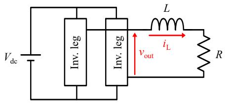  
Fig. 6. Simulation circuit of a full-bridge inverter with open-loop control.

TABLEICIRCUIT PARAMETERS OF THE FULL-BRIDGE INVERTER WITH OPEN-LOOP CONTROL.   

<table><tr><td>Input voltage</td><td>Vdc</td><td>300 V</td></tr><tr><td>Output frequency</td><td>fac</td><td>50 Hz</td></tr><tr><td>AC inductor</td><td>L</td><td>1 mH</td></tr><tr><td>Resistor</td><td>R</td><td>10 Ω</td></tr><tr><td>Switching frequency</td><td>fsw</td><td>20 kHz</td></tr><tr><td>Dead time</td><td>Td</td><td>1 μs</td></tr><tr><td>Modulation index</td><td>M</td><td>0.9</td></tr></table>

amplitude and frequency is given as a voltage reference. Bipolar modulation is adopted to reduce the common mode voltage, which is often used in photovoltaic (PV) generation systems [25], [26]. However, the voltage interpolation method is applicable to not only the bipolar modulation but also the unipolar modulation. The dead time of $T_{\mathrm{d}} = 1 \mu \mathrm{s}$ is inserted to confirm the distortion caused by the dead time. Because the main purpose is verification of the voltage interpolation method, the inverter is operated with simple open-loop control. The inverter is equipped with no current controls and other upper-level controls. Under these conditions, the output current $i_{\mathrm{out}}$ and the output voltage $v_{\mathrm{out}}$ are evaluated in the waveforms and frequency spectra at the steady state. The reference value for comparison was obtained by the SW model with the sufficiently small simulation time step $T_{\mathrm{s}} = 0.1 \mu \mathrm{s}$ . The evaluated output currents were obtained by the SW model and the VI model with $T_{\mathrm{s}} = 5 \mu \mathrm{s}$ . The accuracy of the current waveforms is evaluated by comparing them to the reference value. XTAP [27], which is an EMT simulation program developed by the CRIEPI, was used for the simulations.

# B. Accuracy of the Inverter Current

Fig. 7 shows the simulated waveforms of the output current of the inverter $i_{\mathrm{out}}$ . Fig. 8 shows the frequency spectra of $i_{\mathrm{out}}$ . (a) is the reference value, (b) and (c) are the simulation results by the SW model and the VI model, respectively. The reference value shown in (a) contained not only the third, fifth, and seventh harmonic components caused by the dead time but also the switching frequency components $f_{\mathrm{sw}}$ and $2f_{\mathrm{sw}}$ . Fig. 7 (b) obtained by the SW model shows a waveform that changes steeply in steps. This is because the pulse width of the output voltage can take only integer multiples of the simulation time step, as explained with Fig. 1. As a result, the original sinusoidal waveform is changed to the stepwise waveform, which is an inaccurate result. The number of steps becomes $1/2f_{\mathrm{sw}}T_{\mathrm{s}}$ except the operation in the over-modulation range.

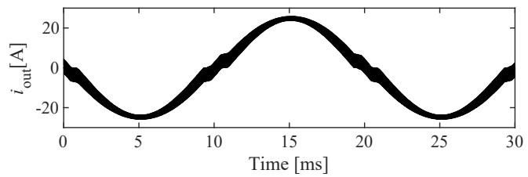  
(a) Reference

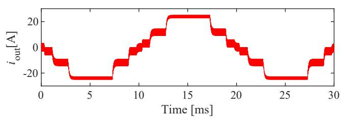  
(b) SW model $(T_{\mathrm{s}} = 5 \mu \mathrm{s})$

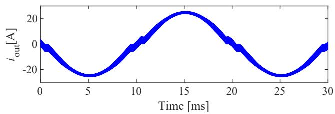  
(c) VI model $(T_{\mathrm{s}} = 5 \mu \mathrm{s})$   
Fig. 7. Simulated waveforms of the output current.

Thus, the larger time step reduces the available voltage steps, resulting in degrading the simulation accuracy. It is limited to only five voltage steps in this simulation condition, and it was obviously observed in Fig. 7 (b). As a result, its frequency spectrum in Fig. 8 (b) contained higher harmonics than the reference value in all harmonic regions. Fig. 7 (c) obtained by the VI model accurately simulates both the current distortion caused by the dead time and switching ripples. Fig. 8 (c) also demonstrates that the VI model simulates the almost same amount of harmonics to the reference value. It contained some amount of error in the switching frequency components $f_{\mathrm{sw}}$ and $2f_{\mathrm{sw}}$ , which were $10\%$ smaller than that of the reference value. These results demonstrate that the voltage interpolation method can simulate the harmonic components in the output current even with a large simulation time step.

We discuss the reason why the error occurred at the switching frequency component $f_{\mathrm{sw}}$ in the VI model. Fig. 9 is an enlarged waveform of the output voltage $v_{\mathrm{out}}$ and the output current $i_{\mathrm{out}}$ . In the SW model, $v_{\mathrm{out}}$ was either $V_{\mathrm{dc}} = 300\mathrm{V}$ or $V_{\mathrm{dc}} = -300\mathrm{V}$ . This resulted in causing the error in $i_{\mathrm{out}}$ . In the VI model, $i_{\mathrm{out}}$ was accurately simulated by interpolating the output voltage $v_{\mathrm{out}}$ at the switching transitions. Nevertheless, the peaks of the ripple in $i_{\mathrm{out}}$ was rounded as compared to the reference value. This is because the number of calculation points in one switching cycle decreases as the simulation time step becomes closer to the switching cycle. Then, the simulated wave had no calculation points around the peaks of the ripple. As a result, the harmonics of the switching

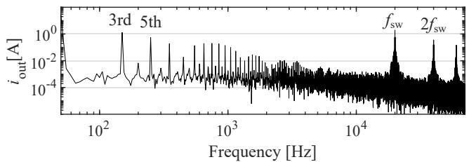  
(a) Reference

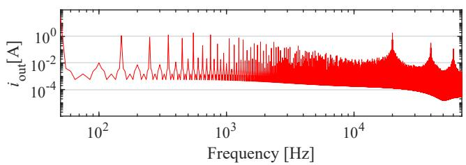  
(b) SW model $(T_{\mathrm{s}} = 5 \mu \mathrm{s})$

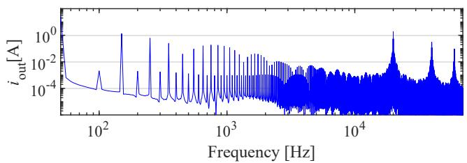  
(c) VI model $(T_{\mathrm{s}} = 5 \mu \mathrm{s})$

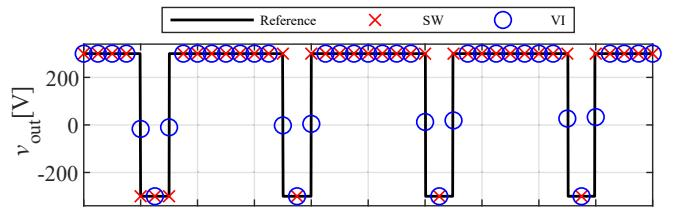  
Fig. 8. Frequency spectra of the output current.

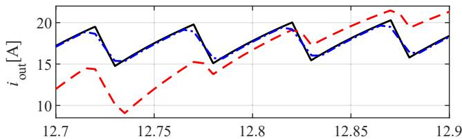  
Reference SW V1   
Time [ms]   
Fig. 9. Enlarged current and voltage waveforms.

frequency component became smaller than the reference value. The error was less than $10\%$ to the reference value in this simulation condition. The error is a factor which determines the upper limit of the simulation time step in the VI model.

# V. MODEL COMPARISON WHEN APPLIED TO A GRID-CONNECTED INVERTER

This section compares computational times and simulation results among the SW model, the VI model, and the circuit average model (CA model). The comparison is carried out by a

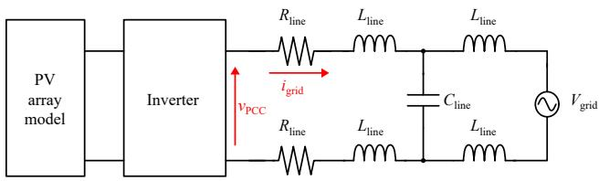  
(a) Overall configuration

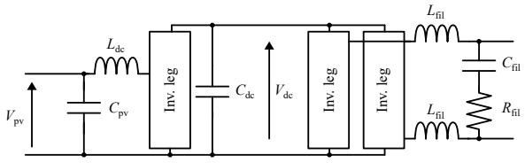  
(b) Circuit configuration of the inverter   
Fig. 10. Simulation circuit of a PV generation system.

grid-connected inverter for PV generation systems considering a practical use case.

# A. Simulation Conditions

Fig. 10 shows the configuration of the PV generation system used for the comparison. Table II shows its circuit parameters. The configuration is based on the standard model of the Institute of Electrical Engineers of Japan (IEEJ) [28] with modifying some of its parameters and controls. Fig. 10 (a) is the overall configuration. A PV array model is connected to the dc side of the inverter. The ac side of the inverter is connected to a single-phase ac grid modeled by $L_{\mathrm{line}}$ , $R_{\mathrm{line}}$ , $C_{\mathrm{line}}$ , and a voltage source $V_{\mathrm{grid}}$ . $C_{\mathrm{line}}$ is connected only in the section $D$ , and the sections $A$ to $C$ are carried out without $C_{\mathrm{line}}$ . Fig. 10 (b) is the circuit configuration of the inverter. It consists of a boost converter, a full-bridge inverter, and switching ripple filters. Switching signals are generated by the triangular carrier PWM with bipolar modulation.

The inverter legs are implemented by the SW model, the VI model, and the CA model. The difference among the three models is only the inverter legs, and the other circuits and control systems have the same configuration among them.

# B. Simulation Time Steps and Errors

For comparing the computational time, it is necessary to set appropriate simulation time steps for each model. Therefore, we first clarify the relation between simulation time steps and errors in simulated waveforms. The mean square error (MSE) is used to quantify the error in a simulated waveform. The MSE is obtained by taking the root mean square of the errors in the $N$ calculation points over one cycle of the ac grid, which is expressed as follows:

$$
\operatorname {M S E} \left(i _ {\text {g r i d}}\right) = \sqrt {\frac {1}{N} \sum_ {n = 1} ^ {N} \left\{i _ {\text {g r i d} - \text {s i m}} (n) - i _ {\text {g r i d} - \text {r e f}} (n) \right\} ^ {2}}, \tag {11}
$$

where $i_{\mathrm{grid\_sim}}(n)$ is the simulated value of $i_{\mathrm{grid}}$ at the $n$ -th calculation point and $i_{\mathrm{grid\_ref}}(n)$ is the reference value at

TABLE II CIRCUIT PARAMETERS OF THE PV GENERATION SYSTEM.   

<table><tr><td>Line voltage</td><td>Vgrid</td><td>200 V</td></tr><tr><td>Line frequency</td><td>fgrid</td><td>50 Hz</td></tr><tr><td>Line inductance</td><td>Lline</td><td>0.1 mH</td></tr><tr><td>Line capacitance</td><td>Cline</td><td>0 μF (in Fig.11-14) 0.211 μF(in Fig.15,16)</td></tr><tr><td>Line resistance</td><td>Rline</td><td>0.05 Ω</td></tr><tr><td>Output voltage of PV array</td><td>Vpv</td><td>235 V</td></tr><tr><td>DC-link voltage</td><td>Vdc</td><td>400 V</td></tr><tr><td>DC filter capacitor</td><td>Cpv</td><td>0.5 mF</td></tr><tr><td>DC inductor</td><td>Ldc</td><td>1 mH</td></tr><tr><td>DC-link capacitor</td><td>Cdc</td><td>5 mF</td></tr><tr><td>AC filter inductor</td><td>Lfil</td><td>0.4 mH</td></tr><tr><td>AC filter capacitor</td><td>Cfil</td><td>5 μF</td></tr><tr><td>AC filter resistance</td><td>Rfil</td><td>12.8 Ω</td></tr><tr><td>Switching frequency</td><td>fsw</td><td>20 kHz</td></tr><tr><td>Dead time</td><td>Td</td><td>1 μs</td></tr></table>

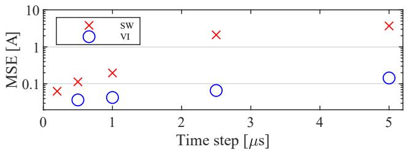  
Fig. 11. Relation of simulation time steps and errors.

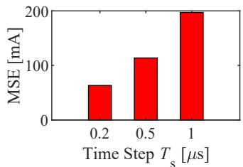  
(a) SW model

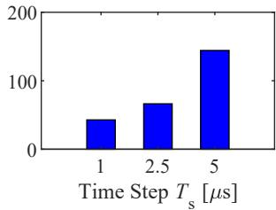  
(b) VI model   
Fig. 12. Comparison of the errors between SW model and VI model.

the same time. The reference value is obtained by the SW model with the sufficiently small simulation time step $T_{\mathrm{s}} = 0.1$ $\mu \mathrm{s}$ . The error of the VI model is not influenced whether its simulation time step is synchronous or asynchronous to the switching cycle. However, the error of the SW model randomly fluctuates if its simulation time step is asynchronous to the switching cycle. This makes the quantitative comparison difficult. Therefore, all the simulated values are obtained with the simulation time steps which are equal to the switching cycle divided by integers in order to prevent the effect in the SW model.

Fig. 11 shows the relation between simulation time steps $T_{\mathrm{s}}$ and the MSEs in the simulated waveforms by the SW model and the VI model. The MSE increases as $T_{\mathrm{s}}$ increases in both models. Compared with the same $T_{\mathrm{s}}$ , the MSE of the SW model is larger than that of the VI model.

Fig. 12 extracts a part of the values shown in Fig. 11 to compare (a) the SW model and (b) the VI model. The MSEs

TABLE III COMPUTATIONAL TIMES OF EACH MODEL.   

<table><tr><td>Models</td><td>Computational time</td></tr><tr><td>SW model (Ts=1 μs)</td><td>86 s</td></tr><tr><td>VI model (Ts=5 μs)</td><td>33 s</td></tr><tr><td>CA model (Ts=25 μs)</td><td>7 s</td></tr></table>

when the VI model is used with $T_{\mathrm{s}} = 1 \mu \mathrm{s}$ , $2.5 \mu \mathrm{s}$ , $5 \mu \mathrm{s}$ are smaller than the MSEs when the SW model is used with $T_{\mathrm{s}} = 0.2 \mu \mathrm{s}$ , $0.5 \mu \mathrm{s}$ , $1 \mu \mathrm{s}$ , respectively. Therefore, even if the VI model is used with a simulation time step which is five times larger than that of the SW model, the VI model can obtain more accurate simulation results. The following comparisons are carried out by setting the simulation time step to $1 \mu \mathrm{s}$ for the SW model and $5 \mu \mathrm{s}$ for the VI model.

Similarly, the simulated waveforms by the CA model are also evaluated by the MSE. The simulation time step of the CA model is generally set to match the sampling period of voltages and currents in order to simulate the influence of a time delay in digital control. The sampling period is $25~\mu \mathrm{s}$ since the values are sampled at both the upper and lower peaks of the $20\mathrm{kHz}$ carrier waves. Thus, the simulation time step of the CA model is set to $25~\mu \mathrm{s}$ . In that case, The MSE of the CA model is $839\mathrm{mA}$ .

# C. Simulated Waveforms without Resonance

In accordance with the previous section, the simulations were performed with $1\mu \mathrm{s}$ $(\mathrm{MSE} = 197\mathrm{mA})$ for the SW model, $5\mu \mathrm{s}$ $(\mathrm{MSE} = 144\mathrm{mA})$ for the VI model, and $25\mu \mathrm{s}$ $(\mathrm{MSE} = 839\mathrm{mA})$ for the CA model. Fig. 13 shows the simulated waveforms of the ac current $i_{\mathrm{grid}}$ and the ac voltage $v_{\mathrm{PCC}}$ at the point of common coupling (PCC). (a) is the reference value, and (b), (c), and (d) are the waveforms obtained by the SW model, the VI model, and the CA model, respectively. All the models simulated the sinusoidal current waveform very well. The switching ripple in the voltage waveform is also reproduced by the SW model and the VI model. Fig. 14 shows the enlarged waveforms. The SW model and the VI model reproduce the ripple of the switching frequency, whereas the CA model cannot deal with this ripple. The envelope of the $v_{\mathrm{PCC}}$ in the VI model seems slightly smaller than the reference. This results from the fewer calculation points by using the large simulation time step, which is not caused by the algorithm of the VI model.

# D. Comparison of the Computational Times

Table III shows the computational times required to execute the EMT simulation of five seconds in each model. The VI model $(T_{\mathrm{s}} = 5\mu \mathrm{s})$ reduced the computational time by a factor of three comparing to the SW model $(T_{\mathrm{s}} = 1\mu \mathrm{s})$ . The CA model reduced the computational time by a factor of twelve, whereas it was not able to deal with the switching ripple.

This result demonstrates that the VI model can reduce the computational time than the SW model with reasonable reproduction of harmonics. The CA model can further reduce

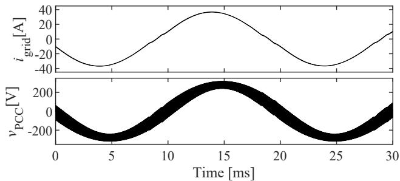  
(a) Reference

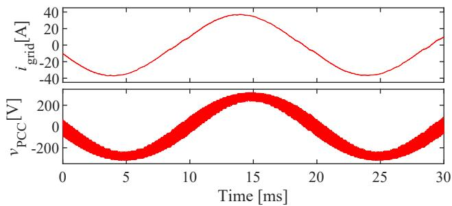  
(b) SW model $(T_{\mathrm{s}} = 1 \mu \mathrm{s})$

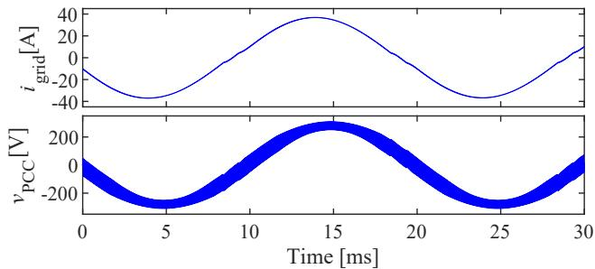  
(c) VI model $(T_{\mathrm{s}} = 5 \mu \mathrm{s})$

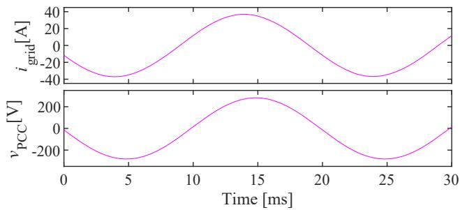  
(d) CA model $(T_{\mathrm{s}} = 25~\mu \mathrm{s})$   
Fig. 13. Simulated waveforms without resonance $(C_{\mathrm{line}} = 0)$

the computational time if the simulation does not have to deal with the harmonics such as switching ripples.

# E. Simulated Waveforms with Resonance

Simulations were carried out with inserting the line capacitance $C_{\mathrm{line}} = 0.211 \mu \mathrm{F}$ as shown in Fig. 10. It corresponds to the parasitic capacitance of the cable to ground, and it causes resonance with the line inductance.

Fig. 15 shows the simulated waveforms of the ac current $i_{\mathrm{grid}}$ and the ac voltage $v_{\mathrm{PCC}}$ at the PCC under the res

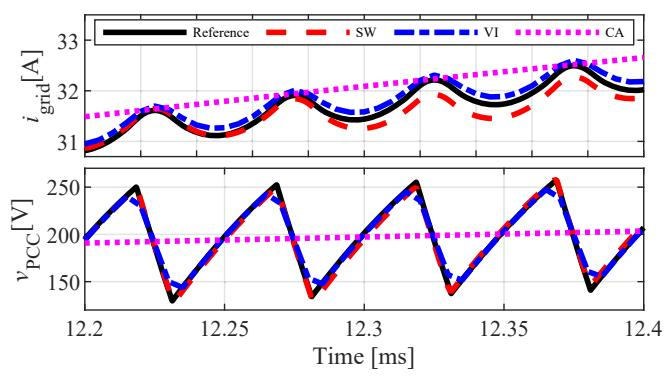  
Fig. 14. Enlarged waveforms without resonance $(C_{\mathrm{line}} = 0)$

onance condition. Fig. 16 shows the enlarged waveforms. The SW model and the VI model reproduced the increase of the harmonic current and the voltage fluctuation due to resonance, whereas the CA model was not able to simulate the phenomenons. It has been reported that such kind of resonance in the high-frequency region causes an overheat of equipment or malfunctions of power line carrier communications. Thus, the resonance caused by inverters is one of the important phenomena to be dealt with in the EMT analysis of power systems. The CA model may overlook the failures caused by the harmonics in the high frequency region although the model enables to enlarge the simulation time step and reduces the computational time.

# VI. CONCLUSION

One of the technical challenges in applying the EMT simulations to power system analysis is satisfying both adequate simulation accuracy and acceptable computational time. The simulation involving power-electronics converters especially requires a fairly small time-step size to consider switching of the converters, thus leading to a heavy computational burden. To solve the trade-off, this paper generalized the time average method (TAM), originally developed for real-time simulations, so that it becomes suitable to off-line EMT simulations. The proposed voltage interpolation method is applicable to the trapezoidal method of integration which is widely used in off-line EMT simulation programs. In addition, the proposed method uses a simple formula to identify the switching instance for the implementation on off-the-shelf PCs, rather than a hardware counter in an FPGA as used in the TAM. The simulation results demonstrated that the proposed method enables to extend the simulation time step by a factor of five without deteriorating the accuracy, resulting in reduction of computational time by a factor of three with reasonable reproduction of harmonics.

# ACKNOWLEDGMENT

The authors gratefully acknowledge the financial support from Hokkaido Electric Power Co., Tohoku Electric Power Co., Tokyo Electric Power Co. Holdings, Chubu Electric Power Co., Hokuriku Electric Power Co., Kansai Electric Power Co. Chugoku Electric Power Co., Shikoku Electric

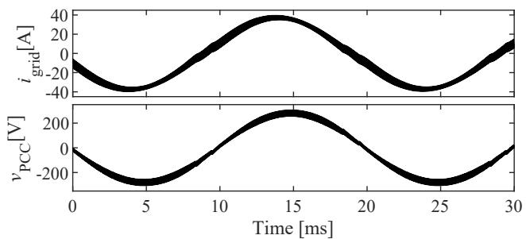

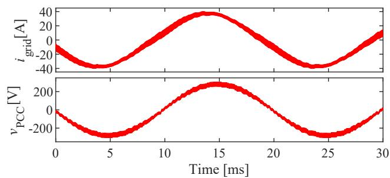  
(a) Reference

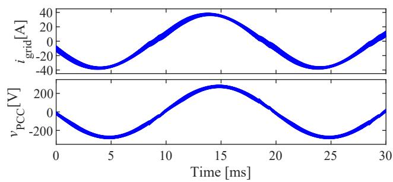  
(b) SW model $(T_{\mathrm{s}} = 1 \mu \mathrm{s})$

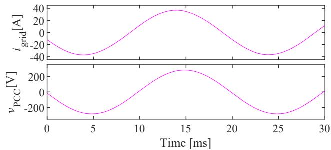  
(c) VI model $(T_{\mathrm{s}} = 5 \mu \mathrm{s})$   
(d) CA model $(T_{\mathrm{s}} = 25 \mu \mathrm{s})$   
Fig. 15. Simulated waveforms with resonance $(C_{\mathrm{line}} = 0.211~\mu \mathrm{F})$

Power Co., Kyushu Electric Power Co., and Okinawa Electric Power Co.

# REFERENCES

[1] J. H. R. Enslin, and P. J. M. Heskes, "Harmonic interaction between a large number of distributed power inverters and the distribution network," IEEE Trans. Power Electronics, vol. 19, no. 6, pp. 1586-1593 Nov. 2004.   
[2] H. Hu, Q. Shi, Z. He, J. He, and S. Gao, "Potential harmonic resonance impacts of PV inverter filters on distribution systems," IEEE Trans. Sustainable Energy, vol. 6, no. 1, pp. 151-161 Jan. 2015.

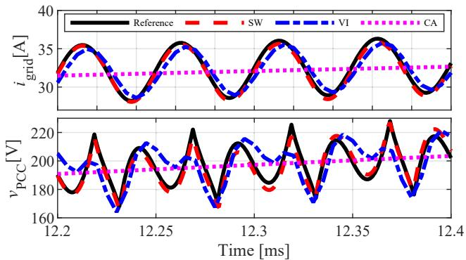  
Fig. 16. Enlarged waveforms with resonance $(C_{\mathrm{line}} = 0.211\mu \mathrm{F})$

[3] C. Yoon, H. Bai, R. N. Beres, X. Wang, C. L. Bak, and F. Blaabjerg, "Harmonic stability assessment for multiparalleled, grid-connected inverters," IEEE Trans. Sustainable Energy, vol. 7, no. 4, pp. 1388-1397 Oct. 2016.   
[4] P. Kuffel, K. Kent, and G. Irwin, "The implementation and effectiveness of linear interpolation within digital simulation," Proc. IPST'95 (Int. conf Power Syst. Transients), pp. 499-504, Lisbon, Portugal Sep. 1995.   
[5] B. De Kelper, L. A. Dessaint, V. Q. Do, and J.-C. Soumagne, "An algorithm for accurate switching representation in fixed-step simulation of power electronics," IEEE Power Engineering Society Winter Meeting, vol. 1, pp. 762-767, Jan. 2000.   
[6] B. De Kelper, L. A. Dessaint, K. Al-Haddad, and H. Nakra, “A comprehensive approach to fixed-step simulation of switched circuits,” IEEE Trans. Power Electronics, vol. 17, no. 2, pp. 216–224 Mar. 2002.   
[7] G. Sybille and H. Le-Huy, “A comparative study on real-time simulation methods for PWM power converters,” 2006 IEEE International Symposium on Industrial Electronics, Montreal, Que., 2006, pp. 2571–2578.   
[8] M. O. Faruque, V. Dinavahi and Wilsun Xu, "Algorithms for the accounting of multiple switching events in digital simulation of power-electronic systems," IEEE Trans. Power Delivery, vol. 20, no. 2, pp. 1157-1167, Apr. 2005   
[9] V.-Q. Do, D. McCallum, P. Giroux and B. D. Kelper, “A backward-forward interpolation technique for a precise modeling of power electronics in HYPERSIM”, Proc. Int. Conf. Power Systems Transients, pp. 337–342, Jun. 2001.   
[10] A.M. Gole et al., "Guidelines for modeling power electronics in electric power engineering applications," IEEE Trans. Power Delivery, vol. 12, no. 1, pp. 505-514, Jan. 1997.   
[11] A. M. Gole, I. T. Fernando, G. D. Irwin, O. B. Nayak, "Modeling of power electronic apparatus: Additional interpolation issues", Int. Conf. on Power Systems Transients (IPST '97), pp. 23-28, Seattle, Jun. 1997.   
[12] A. Semlyen, and F. de Leon, "Computation of electromagnetic transients using dual or multiple time steps," IEEE Trans. Power Systems, vol. 8, no. 3, pp. 1274-1281, Aug. 1993.   
[13] J. J. Sanchez-Gasca, R. D'Aquila, W. W. Price, and J. J. Paserba, "Variable time step, implicit integration for extended-term power system dynamic simulation," Proc. of Power Industry Computer Applications Conf., Salt Lake City, UT, USA, 1995, pp. 183-189.   
[14] W. Nzale, J. Mahseredjian, I. Kocar, X. Fu and C. Dufour, “Two variable time-step algorithms for simulation of transients,” 2019 IEEE Milan PowerTech, Milan, Italy, 2019, pp. 1-6.   
[15] S. R. Sanders, J. M. Noworolski, X. Z. Liu, and G. C. Verghese, "Generalized averaging method for power conversion circuits," IEEE Trans. Power Electronics, vol. 6, no. 2, pp. 251-259, Apr. 1991.   
[16] D. Maksimovic, A. M. Stankovic, V. J. Thottuvelil, and G. C. Verghese, "Modeling and simulation of power electronic converters," Proceedings of the IEEE, vol. 89, no. 6, pp. 898-912, Jun. 2001.   
[17] H. Atighechi et al., "Dynamic average-value modeling of CIGRE HVDC benchmark system," IEEE Trans. Power Delivery, vol. 29, no. 5, pp. 2046-2054, Oct. 2014.   
[18] S. Chiniforoosh et al., “Definitions and applications of dynamic average models for analysis of power systems,” IEEE Trans. Power Delivery, vol. 25, no. 4, pp. 2655-2669, Oct. 2010.   
[19] K. Sano, R. Yonezawa, and T. Noda, "An electromagnetic transient simulation model of grid-connected inverters for dynamic voltage analysis

of distribution systems," Electrical Engineering in Japan, vol. 206, no. 4, pp. 11-21, Mar. 2019.   
[20] K. L. Lian, and P. W. Lehn, "Real-time simulation of voltage source converters based on time average method," IEEE Trans. Power Systems, vol. 20, no. 1, pp. 110-118 Feb. 2005.   
[21] J. Allmeling, and N. Felderer, "Sub-cycle average models with integrated diodes for real-time simulation of power converters," 2017 IEEE SPEC, pp. 1-6 Dec. 2017.   
[22] S. Horiuchi, K. Sano, T. Noda, "A voltage interpolation method in inverter modeling for fast electromagnetic transient simulations," 2020 IEEE Applied Power Electronics Conference and Exposition (APEC), New Orleans, LA, 2020, pp. 2841-2847.   
[23] J. Tant and J. Driesen, "On the numerical accuracy of electromagnetic transient simulation with power electronics," IEEE Trans. Power Delivery, vol. 33, no. 5, pp. 2492-2501, Oct. 2018.   
[24] J. Allmeling, N. Felderer, and M. Luo, “High fidelity real-time simulation of multi-level converters,” 2018 Int. Power Electronics Conf. (IPEC-Niigata 2018, ECCE Asia), Niigata, pp. 2199–2203, 2018.   
[25] L. Ma, F. Tang, F. Zhou, X. Jin, and Y. Tong, "Leakage current analysis of a single-phase transformer-less PV inverter connected to the grid," 2008 IEEE Int. Conf. on Sustainable Energy Technologies, Singapore, pp. 285-289, 2008.   
[26] J.-S. Lai, "Power conditioning circuit topologies," IEEE Industrial Electronics Magazine, vol. 3, no. 2, pp. 24-34, Jun. 2009.   
[27] T. Noda, "XTAP," in Numerical Analysis of Power System Transients and Dynamics, A. Ametani Ed., IET, pp. 169-208 2014.   
[28] Cooperative study group on generic model development for power electronics system simulations, "Generic models for the simulation of power electronics systems: smart-grid, motor-drive and automotive applications," IEEE Technical Report, no. 1382, pp. 1-82, Sep. 2016.

Shuntaro Horiuchi (S'19) received the B.S. degree in electrical and electronic engineering from the Tokyo Institute of Technology, Tokyo, Japan, in 2019, where he is currently working toward the M.S. degree in electrical and electronic engineering. His research interests include inverter modeling for electromagnetic transient simulations.

Kenichiro Sano (S'07, M'10) received the B.S. degree in international development engineering and the M.S. and Ph.D. degrees in electrical and electronic engineering from the Tokyo Institute of Technology, Tokyo, Japan, in 2005, 2007, and 2010, respectively. From 2008 to 2010, he was a JSPS Research Fellow. In 2008, he was a Visiting Scholar at the Virginia Polytechnic Institute and State University, Blacksburg, VA, USA. From 2010 to 2018, he was a Research Scientist at the Central Research Institute of Electric Power Industry, Yokosuka, Japan.

In 2018, he joined the Tokyo Institute of Technology, where he is currently an Assistant Professor with the Department of Electrical and Electronic Engineering. His current research interests include power electronics for utility applications, high-voltage dc transmission systems, and power system quality.

Taku Noda (M'97, SM'08) was born in Osaka, Japan in 1969. He received his B. Eng., M. Eng. and Ph. D. degrees from Doshisha University, Kyoto, Japan in 1992, 1994 and 1997 respectively. In 1997, he joined Central Research Institute of Electric Power Industry (CRIEPI). He is currently Leader of Simulation Frontier Group, Energy Innovation Center in the same institute and also serves as Vice-Chairperson of the IEEE Power & Energy Society Japan Joint Chapter. He held the following positions in his carrier: Visiting Scientist, the University of

Toronto, Toronto, ON, Canada, 2001-2002; Adjunct Professor, Doshisha University, 2005-2008; Editor, the IEEE Transactions on Power Delivery, 2008-2014; and Lecturer, Shibaura Institute of Technology, Tokyo, Japan, 2012-2015. He received the Best Paper Award in 2008 and the Progress Award twice in 2009 and 2016 from the Institute of Electrical Engineers of Japan (IEEJ) and also received the Electrical Science and Engineering Promotion Award in 2016 from its foundation.