# Double-Ended Fault-Locating Method for Parallel Lines Without Measuring Parallel Line Currents

Kanchanrao G. Dase , Senior Member, IEEE, and Connor Doyle

Abstract—This paper introduces a novel double-ended impedance-based fault-locating method for parallel lines, effectively addressing the challenges posed by mutual coupling. Instead of directly measuring the parallel line zero-sequence current, the proposed method estimates it using synchronized currents and voltages from the local end of the faulted line and remote zero-sequence current. The proposed approach addresses field constraints where numerical relays only have this information for fault locating. The proposed phasor-based fault-locating methodology, which uses filtered data, is applicable to various parallel line topologies and can handle any number of parallel lines. Depending on the parallel line configuration, the proposed algorithm may require zero-sequence source impedance values. In case the source impedance values known to the user are inaccurate, error mitigation techniques described in this paper can be applied. This paper demonstrates the accuracy of the proposed fault-locating method through fault simulations in various parallel line configurations modelled in electromagnetic transients program (EMTP) software.

Index Terms—Algorithms, communication channels, distance measurement, error correction, fault location, iterative methods, mutual coupling, power system faults, protective relaying, transmission lines.

# NOMENCLATURE

I Faulted phase loop current.

$I _ { F C }$ Fault current component polarizing quantity.

$I _ { G }$ C Residual or ground current.

$I _ { O F }$ Total zero-sequence fault current.

$I _ { O L }$ Local zero-sequence current in the faulted line.

$I _ { O P }$ Parallel line zero-sequence current.

$I _ { O R }$ Remote zero-sequence current in the faulted line.

$k _ {  { \boldsymbol { O } } }$ R Zero-sequence compensation factor.

$L _ { 1 }$ Line length of the faulted line.

$L _ { P }$ Line length of the parallel healthy line.

$m$ Actual fault location (FL) from the relay terminal.

$m _ { I }$ Estimated FL using iterative approach.

mIaug $m _ { I a v g }$ Estimated FL using iterative approach with averaging.

m $m _ { Q }$ Estimated FL using quadratic approach.

$m _ { Q a v g }$ Estimated FL using quadratic approach with averaging.

Received 22 November 2024; revised 7 April 2025 and 15 July 2025; accepted 29 August 2025. Date of publication 2 September 2025; date of current version 24 November 2025. Paper no. TPWRD-01761-2024. (Corresponding author: Connor Doyle.)

The authors are with the Schweitzer Engineering Laboratories, Inc., Pullman, WA 99163 USA (e-mail: kanchanrao_dase@selinc.com; connor_doyle@ selinc.com).

Color versions of one or more figures in this article are available at https://doi.org/10.1109/TPWRD.2025.3605244.

Digital Object Identifier 10.1109/TPWRD.2025.3605244

$m _ { S L }$ Estimated FL using modified Takagi method meant for single line without zero-sequence mutual coupling.

$m _ { P L }$ Estimated FL using modified Takagi method for parallel lines with zero-sequence mutual coupling.

SIR Source-to-line impedance ratio.

$V$ Faulted phase loop voltage.

$Z _ { \mathit { 1 L } }$ Positive-sequence line impedance.

$Z _ { { \boldsymbol { \theta } } L }$ Zero-sequence line impedance.

$Z _ { { \boldsymbol { \ O L P } } }$ Zero-sequence impedance of parallel line.

$Z _ { O M }$ Zero-sequence mutual coupling impedance.

$Z _ { O R }$ Zero-sequence remote-source impedance of faulted line.

$Z _ { O S }$ Zero-sequence local-source impedance of faulted line.

$Z _ { O R P }$ Zero-sequence remote-source impedance of parallel line.

$Z _ {  { \boldsymbol { O S P } } }$ Zero-sequence local-source impedance of parallel line.

# I. INTRODUCTION

A CCURACY of fault-locating methods in power systemsis essential for timely and successful restoration of the system. Using the modified Takagi fault-locating method for parallel lines and not accounting for the zero-sequence mutual coupling reduces FL accuracy [1], [2]. The greater the mutual coupling from the relay terminal to the FL, the more inaccurate the FL results become. The mutual coupling issue can be avoided through traveling-wave fault-locating methods or methods that utilize voltage and current measurements from both ends of the line [3], [4], [5], [6], [7], [8]. However, numerical relays that do not have access to remote terminal voltages, like the one described in [9] cannot implement such algorithms. In case users cannot deploy such solutions, they must rely on traditional methods that require zero-sequence current of the parallel line to compensate for the mutual coupling fault-locating errors. For such methods, zero-sequence current of the parallel line is either directly measured or estimated [10], [11], [12], [13], [14], [15].

More commonly, the zero-sequence current or phase currents are directly measured from the parallel line and are used to mitigate the mutual coupling effect [10], [11], [12], [13], [14]. However, this requires the local relay to have dedicated connections to accommodate parallel line currents. In case the local line is equipped with dual current transformers, or when the local line is in parallel with more than one power line, having connections to access currents from all the parallel lines is not always feasible. Sometimes the parallel line may not even originate from the same substation as the local line. This is where

estimating the parallel line zero-sequence current can help avoid issues related to direct measurement, provided the estimations are accurate.

References [13] and [14] describe such a fault locating method that estimates the fault location by determining the healthy parallel line current using local voltage and current measurements, along with the remote current measurement of the faulted line. Reference [13] does not offer a closed-loop solution and may not work for bolted faults with zero fault resistance. In contrast, Reference [14] provides a closed-loop solution. However, both methods in [13] and [14] are only applicable to double-circuit parallel lines with common buses at both ends of the line.

Reference [15] also describes a fault-locating method in which the parallel line zero-sequence current is estimated using the local and remote positive-sequence source impedances, local currents and voltages of the faulted line, and line parameters. In [15], the accuracy of the estimated FL relies on the user-provided positive-sequence source impedance values, which may not be accurate for a given fault. This is especially true with changing system conditions or when inverter-based resources are included in the system. It must also be noted that the fault-locating method described in [15] assumes the parallel line to be of the same length as the local line, which may not always be the case.

Reference [16] outlines a fault locating method for parallel lines that relies solely on voltage data from both local and remote terminals. Whereas Reference [17] describes a fault locating algorithm that uses local and remote currents, as well as the parallel line current. However, both methods in [16] and [17] are only applicable to parallel line configurations that originate and terminate at a common bus.

In summary, the connection topology of the parallel lines in the power system network and the zero-sequence mutual coupling among the parallel lines makes fault locating using traditional methods more complex [1], [2].

Various other factors can affect fault locating accuracy, including the accuracy of line parameters, transients during faults, fault resistance along with network non-homogeneity, zero-sequence mutual coupling, etc. This paper aims to develop a fault locating algorithm that addresses the impacts of mutual coupling without requiring parallel line current measurement, is applicable to various parallel line configurations, and operates without relying on remote voltages.

This paper proposes a fault-locating methodology that can be applied to multiple parallel lines of any length and any parallel line configuration. The paper describes two methods for estimating FL: a quadratic form derived from the fault-locating equation and an iterative approach that solves for FL over multiple iterations. Along with the line parameters, the proposed method requires local currents and voltages of the faulted line and synchronized zero-sequence current of the faulted line from the remote end. Depending on the connection configuration of the parallel lines, the proposed algorithm may require source impedances of the zero-sequence network. This paper demonstrates the application of the proposed fault-locating methodology for the following configurations of parallel lines.

- Lines having common buses

- Lines originating from a common bus but terminating on different buses   
- Lines originating from different buses but terminating on a common bus   
- Lines originating and terminating on different buses (isolated grounding)   
- Parallel line being out of service and grounded at both ends of the line   
- Parallel line originating from the same bus as the local line but of a different length than the local line

For each of the above parallel line connection configurations, the paper derives appropriate equations to estimate the parallel line zero-sequence current and then the FL. The user, therefore, needs to know the parallel line configuration before applying the proposed method. The proposed methodology can be extended to any other case having parallel line configuration that is not listed above.

For all the parallel line configurations apart from parallel lines with common buses, the proposed method requires source impedances of the zero-sequence network to be known. It is understood that the user-provided zero-sequence source impedance values may have errors. Therefore, the paper provides ways to mitigate fault-locating errors because of source impedance inaccuracies.

The proposed fault locating method can be extended to hybrid lines, requiring zero-coupling mutual impedance for both overhead and underground sections. It is also applicable for systems with inverter-based resources that have a known and constant zero-sequence impedance or a common coupling transformer that bypasses the source zero-sequence impedance.

The remainder of this paper is structured as follows. Section II introduces the proposed fault location algorithm, with a focus on estimating the zero-sequence current in the healthy parallel line and incorporating it into the fault location equation. An alternative iterative method, also based on estimating the zero-sequence current in the parallel line, is presented as well. Section III provides simulation results for various parallel line configurations to validate the approach. Since the accuracy of the proposed method depends on the known values of zero-sequence source impedances, which may not always be precisely known, Section IV discusses techniques to mitigate errors arising from inaccurate source impedance values. Finally, Section V concludes the paper.

# II. PROPOSED FAULT-LOCATING ALGORITHM

This section describes two approaches to estimate FL. The first one is a quadratic form, which is obtained by substituting the expression of the parallel line zero-sequence current $( I _ { O P } )$ as a function of FL (m) in the fault-locating equation. The other form is an iterative approach where $I _ { O P }$ as a function of m and the OPpresumed FLs are iteratively solved for a set number of iterations to get the estimated FL. Except for a few cases where the iterative form does not converge, the quadratic and iterative forms yield the same results. However, both the approaches require $I _ { O P }$ to be expressed as a function of m. The following subsection

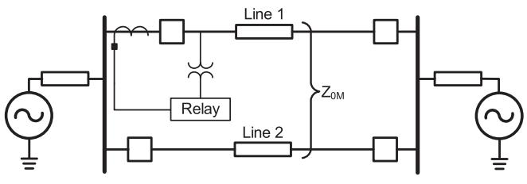

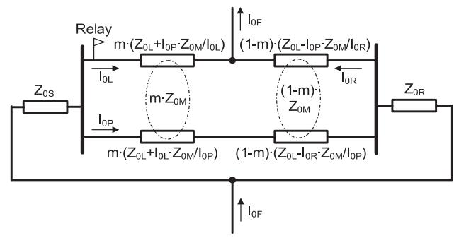  
(a)   
(b)   
Fig. 1. (a) Parallel line configuration with common buses. (b) Zero-sequence network for an unbalanced ground fault in Line 1 of (a) network.

summarizes $I _ { O P }$ as a function of m, zero-sequence currents, OPand zero-sequence impedances for parallel line configurations, described from Figs. 1 through 7.

# A. Estimation of Parallel Line Zero-Sequence Current

In general, the parallel line zero-sequence current $( I _ { O P } )$ can be expressed as shown in (1).

$$
I _ {0 P} = m \cdot p + q \tag {1}
$$

Here, p and q are constants for a given unbalanced ground fault and are a function of zero-sequence network currents and impedances. For each of the parallel configurations from Fig. 1 through 7, the expression for $I _ { O P }$ can be derived in multiple OPways but, for simplicity, only one way is presented here. For the parallel line configurations described in Figs. 1, 2, 3, 6, and 7, the corresponding constants $p$ and q are derived by equating the zero-sequence voltage drop from the start of the local source through Line 1 until the end of the remote source to the zero-sequence voltage drop from the start of the local source through Line 2 until the end of the remote source. For parallel line configurations described in Figs. 4 and 5 , the corresponding constants p and q are derived by equating the zero-sequence voltage drop through the Line 2 path to zero. Table I summarizes the constants p and q for different parallel line configurations.

# B. Estimation of FL (Quadratic Form)

For a forward single-line-to-ground fault, the voltage at the relay terminal can be expressed as shown in (2).

$$
V = m \left(I \cdot Z _ {1 L} + I _ {0 P} \cdot Z _ {0 M}\right) + I _ {F} \cdot R _ {F} \tag {2}
$$

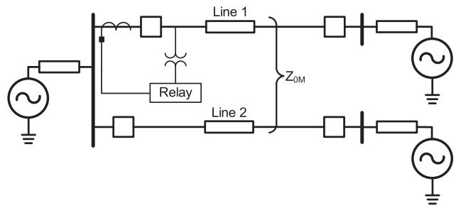

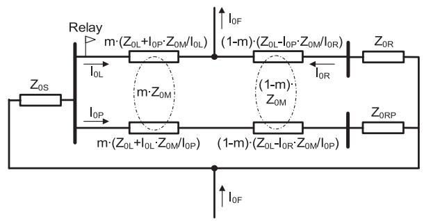

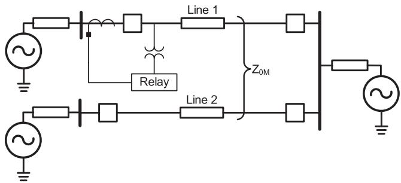  
Fig. 2. (a) Parallel line configuration with lines originating from a common bus but terminating on different buses. (b) Zero-sequence network for an unbalanced ground fault in Line 1 of (a) network.

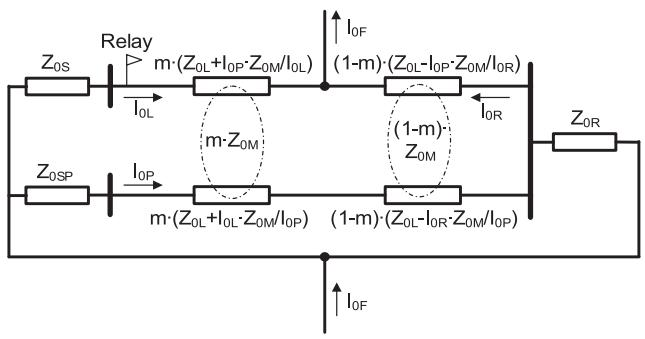  
  
Fig. 3. (a) Parallel line configuration with lines originating from different buses but terminating in a common bus. (b) Zero-sequence network for an unbalanced ground fault in Line 1 of (a) network.

Note, for an A-phase-to-ground (AG) fault, $I = I _ { A } + k _ { \theta } \cdot I _ { G }$ and $V = V _ { A G }$ A. Substituting I from (1) in (2), we get,

$$
V = m ^ {2} \left(p \cdot Z _ {0 M}\right) + m \left(q \cdot Z _ {0 M} + I \cdot Z _ {1 L}\right) + I _ {F} \cdot R _ {F} \tag {3}
$$

Multiplying both sides of (3) by the conjugate of the fault current component $( I _ { F C } )$ , having the same angle as fault current

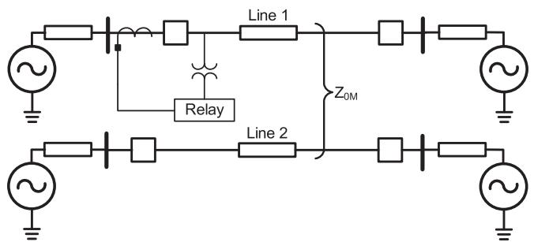  
(a)

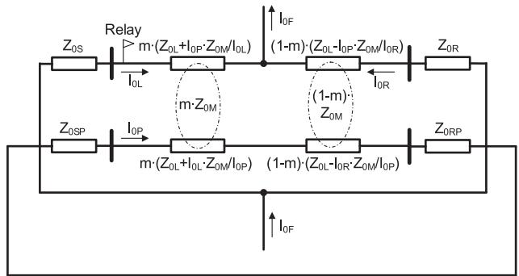  
(b)

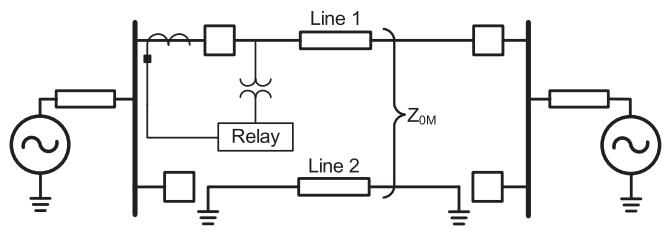  
Fig. 4. (a) Parallel line configuration with lines originating and terminating from different buses (isolated grounding). (b) Zero-sequence network for an unbalanced ground fault in Line 1 of (a) network.

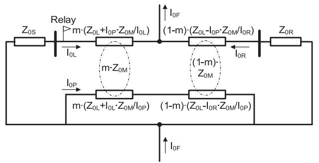  
(a)   
  
Fig. 5. (a) Parallel line configuration with a parallel line out of service and grounded at both ends. (b) Zero-sequence network for an unbalanced ground fault in Line 1 of (a) network.

$( I _ { F } )$ , and taking imaginary parts out of the complex terms, the Ffault resistance term is eliminated. $I _ { F C }$ can be a summation zero- or negative-sequence current from the local and remote terminals.

$$
m ^ {2} \cdot I m a g [ (p \cdot Z _ {0 M}) I _ {F C ^ {*}} ]
$$

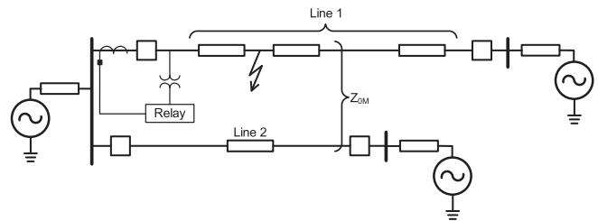  
(@)

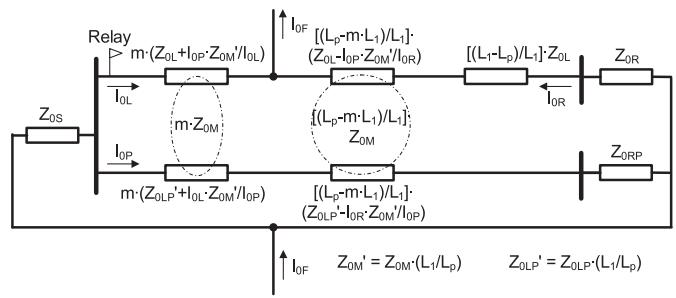  
(b)   
Fig. 6. (a) Parallel line configuration with lines of different lengths originating from a common bus but terminating on different buses. (b) Zero-sequence network for an unbalanced ground fault in Line 1 of (a) network (fault within the parallel line section).

TABLE I CONSTANTS P AND Q FOR PARALLEL LINE CONFIGURATIONS (PLCS) DESCRIBED FROM FIGS. 1 THROUGH 7   

<table><tr><td>PLC</td><td>p</td><td>q</td></tr><tr><td>Fig. 1</td><td>(I0L + I0R)</td><td>(-I0R)</td></tr><tr><td>Fig. 2</td><td>[(I0L + I0R)·(Z0L - Z0M)]/Z0L - Z0M + Z0RP</td><td>(-I0R)·[Z0L - Z0M + Z0R/Z0L - Z0M + Z0RP]</td></tr><tr><td>Fig. 3</td><td>[(I0L + I0R)·(Z0L - Z0M)]/Z0L - Z0M + Z0SP</td><td>[I0L · Z0S - I0R · (Z0L - Z0M)/Z0L - Z0M + Z0SP]</td></tr><tr><td>Fig. 4</td><td>[-(I0L + I0R)·Z0M/Z0L + Z0SP + Z0RP]</td><td>[I0R · Z0M/Z0L + Z0SP + Z0RP]</td></tr><tr><td>Fig. 5</td><td>(I0L + I0R)</td><td>[I0L · Z0S - I0R · (Z0L - Z0M + Z0R)/Z0L - Z0M]</td></tr><tr><td>Fig. 6</td><td>[(I0L + I0R)·(Z0L - Z0M&#x27;)]/Z0LP + Z0RP - Z0M</td><td>(-I0R)·[Z0L - Z0M + Z0R/Z0LP + Z0RP - Z0M]</td></tr><tr><td>Fig. 7</td><td>[(I0L + I0R)·Z0L/(Z0LP + Z0RP - Z0M)]</td><td>[I0L · (-Z0M) - I0R · (Z0L + Z0R)/(Z0LP + Z0RP - Z0M)]</td></tr></table>

$$
+ m \cdot I m a g \left[ \left(q \cdot Z _ {0 M} + I \cdot Z _ {1 L}\right) I _ {F C ^ {*}} \right] - I m a g \left[ V \cdot I _ {F C ^ {*}} \right] = 0 \tag {4}
$$

Equation (4) is a quadratic equation and will yield two FL values. Typically, one of the FL values is found to be negative and can be eliminated. In case both the FL values are within the range of the line length, then an additional check needs to be performed to eliminate one of the FL values. Note that for all the simulation results presented in this paper, there has not been a case where an additional check was required.

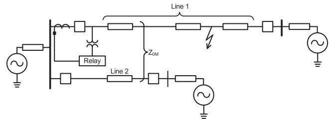  
(a)

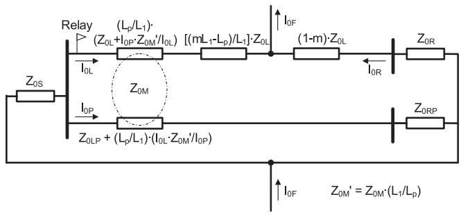  
  
Fig. 7. (a) Parallel line configuration with lines of different lengths originating from a common bus but terminating on different buses. (b) Zero-sequence network for an unbalanced ground fault in Line 1 of (a) network (fault outside the parallel line section).

# C. Estimation of FL (Iterative Form)

As an alternative to the quadratic approach just described, an iterative approach can also be used to estimate FL. This subsection describes how the iterative approach works to estimate FL.

From (1) and Table I, we know $I _ { O P }$ is a function of FL OP(m), zero-sequence currents, and zero-sequence impedances. Therefore, to estimate $I _ { O P }$ using (1), an estimated FL is re-OPquired. The first estimated FL is considered from the modified Takagi method (5) [18], [19]. Note, this equation is meant to estimate faults for single-line configurations and thus ignores the zero-sequence mutual coupling. The value of $m _ { S L }$ from (5) is used to estimate $I _ { O P }$ using (1).

$$
m _ {S L} = \frac {\operatorname {I m} [ V \cdot \operatorname {c o n j} (I _ {F C}) ]}{\operatorname {I m} \{[ I \cdot Z _ {1 L} ] \cdot \operatorname {c o n j} (I _ {F C}) \}} \tag {5}
$$

The first estimated value of $I _ { O P }$ is then used in (6) to estimate OPthe next iterative FL. Note that (6) estimates the FL considering the zero-sequence mutual coupling between the parallel lines.

$$
m _ {P L} = \frac {\operatorname {I m} [ V \cdot \operatorname {c o n j} (I _ {F C}) ]}{\operatorname {I m} \left\{\left[ I \cdot Z _ {1 L} + I _ {0 P} \cdot Z _ {0 M} \right] \cdot \operatorname {c o n j} (I _ {F C}) \right\}} \tag {6}
$$

Henceforth, (6) and (1) are used in conjunction for the set number of iterations before the estimated FL is reported. The flowchart of the proposed algorithm is described in Fig. 8. The proposed algorithm is bound to converge, because if the FL calculation (without zero-sequence mutual coupling) is overestimated, then the zero-sequence parallel line current will be underestimated, which when applied further reduces the overestimation of the previous FL. Similarly, if the FL calculation (without zero-sequence mutual coupling) is underestimated, then

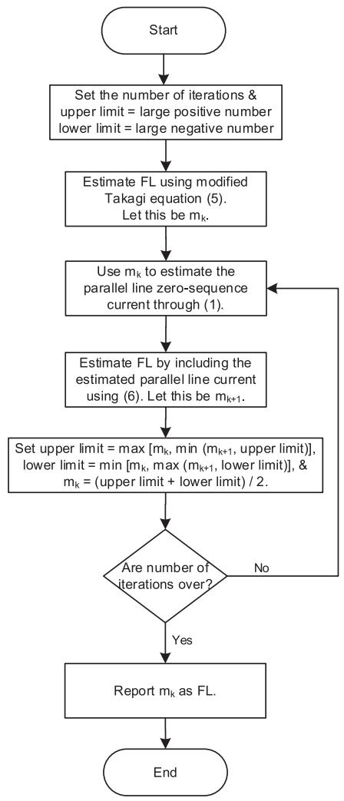  
Fig. 8. Flowchart of the iterative algorithm with averaging.

the zero-sequence parallel line current will be overestimated, which when applied further improves the underestimation of the previous FL. Given this characteristic of convergence, the rate of convergence is improved by adaptively applying upper and lower limits and averaging the estimated value at every iteration. The upper and lower limits which are the boundaries of the estimated fault location are initially set to corresponding positive and negative values greater than line length. This guarantees the upper and lower limits are assigned the values of $m _ { k }$ and $m _ { k + 1 }$ k k+1during the first iteration of the algorithm. This is described in the flowchart in Fig. 8. In some cases, the algorithm may not converge at the weak terminal, especially when the ratio of the weak to the strong zero-sequence source impedance is high (in the order of tens or higher). Such divergence can be avoided by applying the iterative algorithm only at the strong terminal. Note, both the quadratic form, using (4), and the converged iterative form yield the same FL values.

# III. SIMULATION RESULTS

This section demonstrates the accuracy of the proposed faultlocating method. Parallel line configurations described from

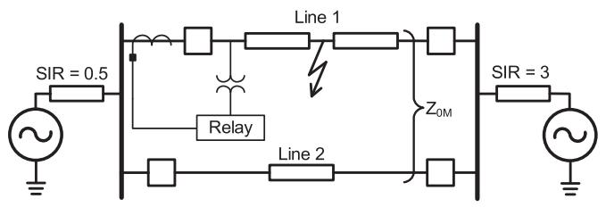  
Fig. 9. Parallel lines with common buses and an AG fault in Line 1.

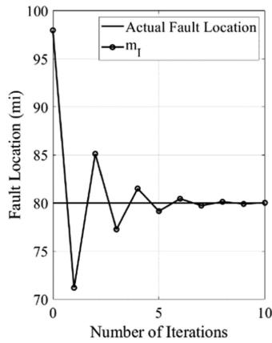

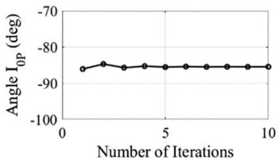

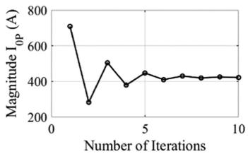  
Fig. 10. Estimated FL (m ) and parallel line zero-sequence current $( I _ { O P } )$ at I OPevery iteration, as per the iterative form of the algorithm, for an AG fault at 80 miles from the relay terminal.   
Figs. 1 through 7 are considered for analysis. Steady-state fault signals are used to analyze the fault-locating errors.

# A. Parallel Lines With Common Buses

Consider a set of two parallel lines having common buses and a length of 100 miles, as shown in Fig. 9. For this network, the steady-state fault signals are generated for an AG fault using the equations provided in [20]. The equations and the proposed algorithm are modelled in MATLAB software. Line capacitances are ignored, and faults are considered with zero resistance. Appropriate p and q coefficients, defined in Table I, are used as per the proposed algorithm.

1) Analyzing the Iterative Form of the Algorithm: To analyze the iterative algorithm, an AG fault is considered in Line 1 at 80 miles from the relay terminal. From the fault signals, the iterative algorithm first calculates the FL without considering mutual coupling using (5) and then calculates $I _ { O P }$ using (1). Henceforth, the FL using (6) and $I _ { O P } \mathrm { u s i n g }$ OP(1) are solved iteratively. Fig. 10 OPshows the plots of the estimated FL and zero-sequence parallel line current at every iteration. As seen, the iterative algorithm (m ) converges and estimates the FL within an accuracy of 0.1 miles in ten iterations.

As described earlier in Fig. 8, the convergence of the iterative form of the algorithm can be accelerated through averaging. Fig. 11 demonstrates this by comparing the iterative algorithm with and without averaging. The iterative algorithm with averaging $( m _ { I A v g } )$ converges faster and estimates the FL within an accuracy of 0.1 miles in four iterations.

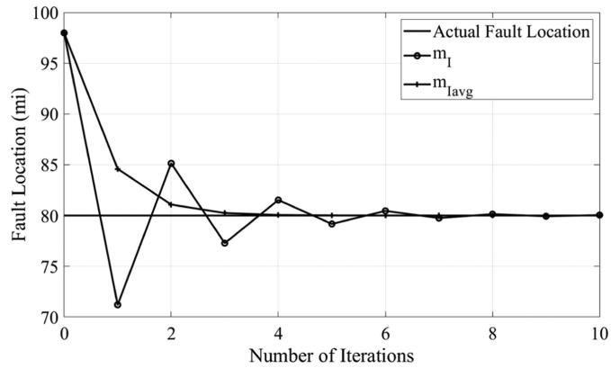  
Fig. 11. Comparing the iterative algorithm with and without averaging for an AG fault at 80 miles from the relay terminal.

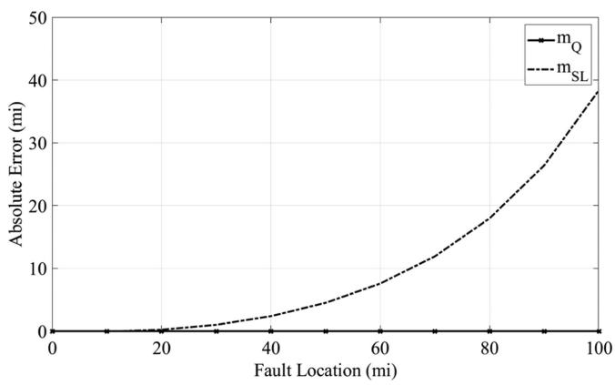  
Fig. 12. Error in the estimated FL using the quadratic approach $( m _ { Q } )$ and the modified Takagi method $( m _ { S L } )$ Q for AG faults over the length of Line 1 in Fig. 9.

2) Analyzing the Quadratic Form of the Algorithm: Compared to the iterative form, the quadratic approach is a closedform solution. Fig. 12 compares the error in the estimated FL using the quadratic approach $( m _ { Q } )$ with the modified Takagi method $( m _ { S L } )$ Qmeant for single-line configurations. Note that SLthe quadratic approach uses (4) and the modified Takagi method uses (5). The estimated FL from the $m _ { Q }$ yields no error for Qall the FLs over the length of the line. Whereas, beyond 20 miles, the error in $m _ { S L }$ increases as the distance between the SLfault and the relay terminal increases. The errors in $m _ { S L }$ are SLsolely because the zero-sequence mutual coupling in (5) was not considered.

# B. Multiple Parallel Lines With Common Buses

For n number of parallel lines, the proposed fault-locating algorithm remains the same, apart from the application of the estimated zero-sequence currents from each of the healthy parallel lines in the voltage equation. Assuming Line $i = I$ is the faulted line and Line $i = ( 2 , . . . , n )$ are the healthy parallel lines, the FL in quadratic form, as derived earlier for two parallel lines, can be expressed as shown in (7). Note that the constants $p _ { i }$ and $q _ { i }$ imust be derived using the zero-sequence network, as for a

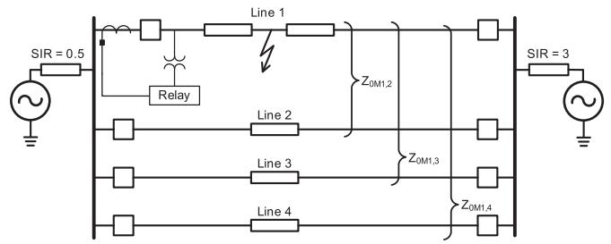  
Fig. 13. Four parallel lines with common buses and an AG fault in Line 1.

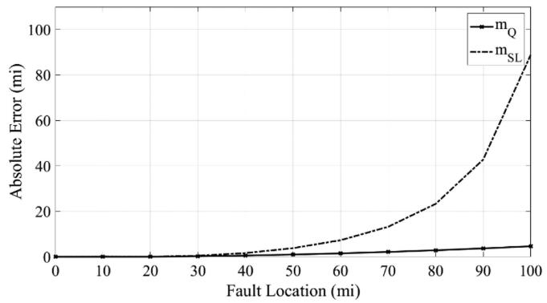  
Fig. 14. Error in the estimated FL using the quadratic approach $( m _ { Q } )$ and the modified Takagi method $( m _ { S L } )$ Q for AG faults in intervals of 10 miles in Line 1 of Fig. 13.

two parallel line network in Section II. A.

$$
\begin{array}{l} m ^ {2} \cdot I m a g \left[ \left(\sum_ {i = 2} ^ {n} p _ {i} \cdot Z _ {0 M _ {1, i}}\right) I _ {F C ^ {*}} \right] \\ + m \cdot I m a g \left\{\left[ \left(\sum_ {i = 2} ^ {n} q _ {i} \cdot Z _ {0 M _ {1, i}}\right) + I \cdot Z _ {1 L} \right] I _ {F C ^ {*}} \right\} \\ - I m a g \left[ V \cdot I _ {F C ^ {*}} \right] = 0 \tag {7} \\ \end{array}
$$

For analysis of the proposed fault-locating method, consider a set of four parallel lines having common buses at both ends, each with a length of 100 miles as shown in Fig. 13. Note that the constants $p _ { i }$ and $q _ { i } ( i = 2 , 3$ , and 4) obtained from solving i ithe zero-sequence network are $I _ { O L } + I _ { O R }$ and $- I _ { O R } ,$ , respectively.

0L 0R 0REMTP ATPDraw was used to model the system in Fig. 13. The lines were modelled as Bergeron line model and were assumed to be transposed. AG faults with zero fault resistance are applied in intervals of 10 miles in Line 1 and the proposed quadratic form of the fault-locating algorithm is tested. Fig. 14 shows the errors in the estimated FL using the quadratic approach $( m _ { Q } )$ 号 and the modified Takagi method $( m _ { S L } )$ Q meant for single-line configurations.

As seen in Fig. 14, there is substantial increasing error in using $m _ { S L }$ beyond 30 miles from the relay terminal. Note, $m _ { Q }$ also SL Qhas some errors solely because the line capacitances were not considered in the quadratic fault-locating (7). Similar to Fig. 12, the errors in $m _ { S L }$ are because the zero-sequence mutual coupling SLand line capacitances in (5) were not considered.

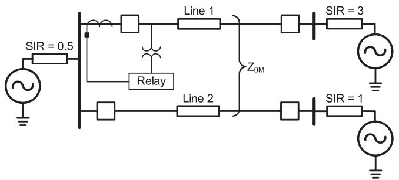  
Fig. 15. Parallel line configuration with lines originating from a common bus but terminating on different buses and an AG fault in Line 1.

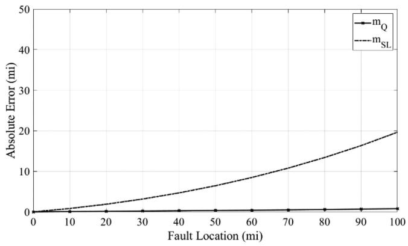  
Fig. 16. Error in the estimated FL using the quadratic approach $( m _ { Q } )$ and the modified Takagi method $( m _ { S L } )$ Q for AG faults in intervals of 10 miles in Line 1 of Fig. 15.

# C. Parallel Lines Originating From a Common Bus but Terminating on Different Buses

This section discusses the simulation results of a parallel line configuration originating from a common bus but terminating on different buses. A set of parallel lines, Line 1 and Line 2 having lengths of 100 miles each, modelled as Bergeron line model and different SIRs are considered as shown in Fig. 15.

As seen in Fig. 16, the error in $m _ { S L }$ increases with an increase SLin the fault distance from the local terminal up to the end of the parallel line. Errors in mSL are because (5) does not account for mutual coupling and line capacitances. Whereas the only errors in $m _ { Q }$ are because of the line capacitances, which were ignored Qin the proposed algorithm equations.

# D. Parallel Lines Originating From Different Buses but Terminating at a Common Bus

The section analyzes simulation results for a parallel line configuration where two lines, each 100 miles long, originate from different buses but end at the same bus as shown in Fig. 17. These lines are modeled using the Bergeron line model with different SIRs.

The results in Fig. 18, show that the error in $m _ { S L }$ increases as SLthe fault distance from the local terminal to the end of the parallel line increases. This error is due to the model not accounting for mutual coupling and line capacitances. In contrast, minor errors

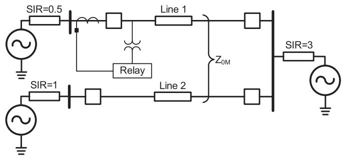  
Fig. 17. Parallel line configuration with lines originating from a common bus but terminating on different buses and an AG fault in Line 1.

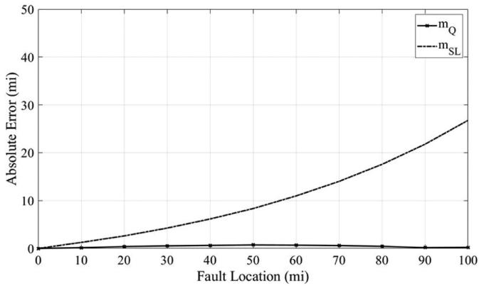  
Fig. 18. Error in the estimated FL using the quadratic approach $( m _ { Q } )$ and the Qmodified Takagi method (m ) for AG faults in intervals of 10 miles in Line 1 of Fig. 17.

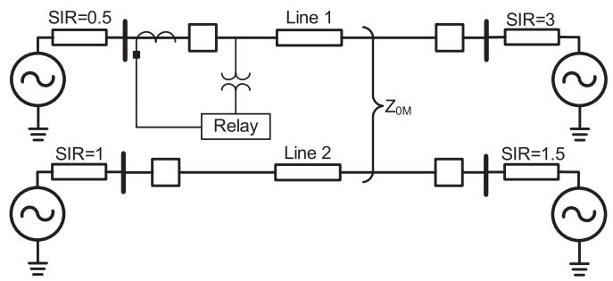  
Fig. 19. Parallel line configuration with lines originating from a common bus but terminating on different buses and an AG fault in Line 1.

in $m _ { Q }$ are solely due to line capacitances, which were ignored Qin the proposed algorithm equations.

# E. Parallel Lines Originating and Terminating From Different Buses

This section examines the simulation outcomes for a parallel line setup where the lines start and end at different buses. Two parallel lines, each 100 miles long, are modeled using the Bergeron line model with various SIRs, as illustrated in Fig. 19.

According to Fig. 20, the error in $m _ { S L }$ increases as the fault SLdistance from the local terminal to the end of the parallel line grows. These errors in $m _ { S L }$ arise because (5) does not consider SLmutual coupling and line capacitances. On the other hand, the

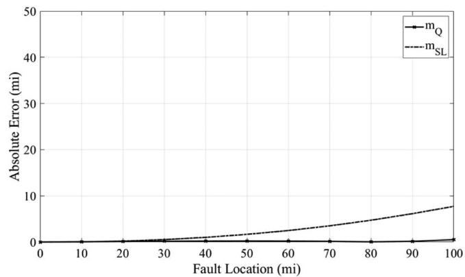

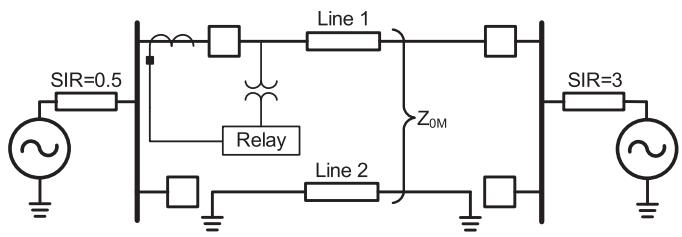  
Fig. 20. Error in the estimated FL using the quadratic approach $( m _ { Q } )$ and the modified Takagi method $( m _ { S L } )$ Q for AG faults in intervals of 10 miles in Line 1 of Fig. 19.   
Fig. 21. Parallel line configuration with lines originating from a common bus but terminating on different buses and an AG fault in Line 1.

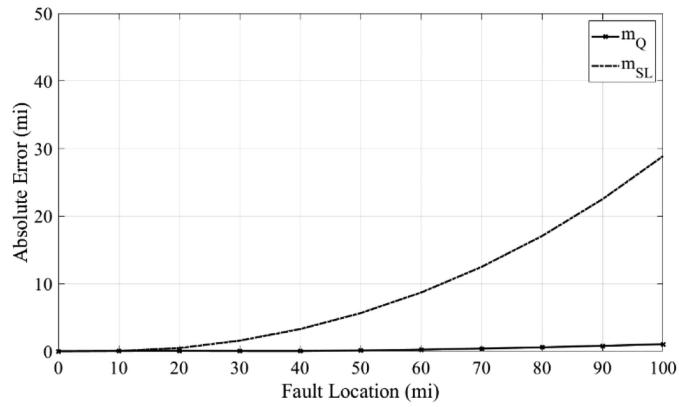  
Fig. 22. Error in the estimated FL using the quadratic approach $( m _ { Q } )$ and the Qmodified Takagi method (m ) for AG faults in intervals of 10 miles in Line 1 of Fig. 21.

minor errors in $m _ { Q }$ are solely due to line capacitances, which were omitted in the proposed algorithm equations.

# F. Parallel Line Configuration With a Parallel Line Out of Service and Grounded at Both Ends

This section reviews the simulation results for a parallel line configuration one of the parallel lines is not in service and grounded at both ends. Two parallel lines, each 100 miles long, are modeled using the Bergeron line model with different SIRs, as shown in Fig. 21.

Fig. 22 illustrates that the error in $m _ { S L }$ increases as the fault SLdistance from the local terminal to the end of the parallel line grows. These errors in $m _ { S L }$ are due to (5) not accounting for

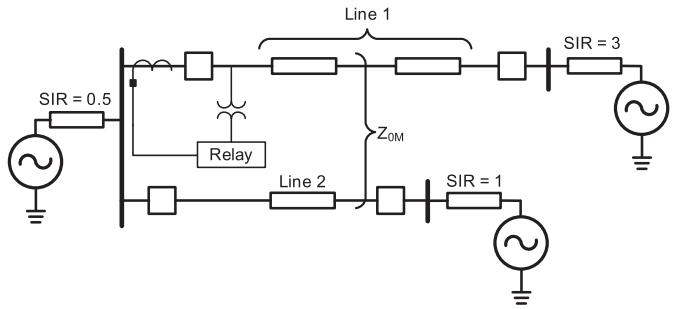  
Fig. 23. Parallel lines of different lengths with a fault in Line 1.

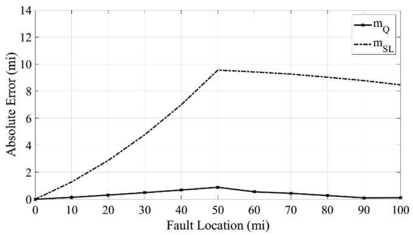  
Fig. 24. Error in the estimated FL using the quadratic approach $( m _ { Q } )$ and the modified Takagi method $( m _ { S L } )$ Q for AG faults in intervals of 10 miles in Line 1 of Fig. 23.

mutual coupling and line capacitances. In contrast, the minor errors in $m _ { Q }$ are solely due to line capacitances, which were not Qincluded in the proposed algorithm equations.

# G. Parallel Lines With Different Lengths Originating From the Same Bus

This section discusses the simulation results of a parallel line configuration with different lengths modelled in EMTP ATPDraw. A set of parallel lines, Line 1 and Line 2 having lengths of 100 and 50 miles respectively, are considered as shown in Fig. 23. Both the parallel lines have a common bus at the local terminal but terminate on different buses at the remote ends. For a ground fault in Line 1, there are two possible values for the constants p and q. One set is used when the fault is within the parallel section (like Fig. 6) and the other when the fault is beyond the parallel section (like in Fig. 7).

For the special line configuration in Fig. 23, the proposed fault-locating algorithm first assumes the FL is within the parallel line section and uses appropriate values of the constants $p$ and q in (4). Only when the estimated FL through (4) indicates the fault is beyond the parallel section are the other set of p and q constants used to solve for the estimated FL. Fig. 24 shows the errors in the fault-locating results using the modified Takagi method $( m _ { S L } )$ and the quadratic form $( m _ { Q } )$ .

SLAs seen in Fig. 24, the error in $m _ { S L }$ Qincreases with an increase SLin the fault distance from the local terminal up to the end of the parallel line section and then remains almost constant. Errors in $m _ { S L }$ are because (5) does not account for mutual coupling and

TABLE II IOP EXPRESSIONS SOLVED FROM ZERO-SEQUENCE NETWORK OF FIG. 2   

<table><tr><td rowspan="2" colspan="2">Parallel line zero-sequence current</td><td colspan="3">Dependencies</td></tr><tr><td>Z0S</td><td>Z0R</td><td>Z0RP</td></tr><tr><td>I0P(1)</td><td>m[(l0L+I0R)(Z0L-Z0M)/Z0L-Z0M+Z0RP] + [(-I0R)(Z0L-Z0M+Z0R)/Z0L-Z0M+Z0RP]</td><td></td><td>✓</td><td>✓</td></tr><tr><td>I0P(2)</td><td>m[(l0L+I0R)(-Z0M)/Z0L+Z0S+Z0RP] + [I0R·Z0M-I0L·Z0S]/Z0L+Z0S+Z0RP]</td><td>✓</td><td></td><td>✓</td></tr><tr><td>I0P(3)</td><td>m[-I0L·Z0L-I0R·Z0L]/Z0M+Z0S + [I0R·(Z0L+Z0R)-I0L·Z0S]/Z0M+Z0S]</td><td>✓</td><td>✓</td><td></td></tr></table>

line capacitances. Whereas the only errors in $m _ { Q }$ are because Qof the line capacitances, which were ignored in the proposed algorithm equations.

# IV. MITIGATING ERROR IN ESTIMATED FL DUE TO SOURCE IMPEDANCE INACCURACIES

Referring to (1) and Table I, the parallel line zero-sequence current is dependent on the zero-sequence source impedances, except for the parallel lines with common buses configuration. Therefore, excluding the common buses configuration, it is understood that inaccuracies in the source impedance values will result in inaccurate parallel line zero-sequence current and, thus, an erroneous FL. This section demonstrates a methodology to mitigate fault-locating errors because of inaccuracies in zerosequence source impedance values using the system of Fig. 2(a) as an example.

# A. Use of Accurate Source Impedances

As described earlier, the parallel line zero-sequence current (I ) can be derived in multiple ways. For the zero-sequence OPnetwork in Fig. 2, $I _ { O P }$ can be derived in three ways, all of OPwhich are summarized in Table II. For each of the expressions, $I _ { O P }$ is dependent on two zero-sequence source impedances OPout of the three. Therefore, the user has a choice to select an appropriate $I _ { O P }$ equation based on the knowledge of at least OPtwo accurate source impedances in the zero-sequence network. The $I _ { O P }$ equation with accurate source impedances limits the OPestimated fault-locating error.

# B. Averaging the Best Fault-Locating Values

The three expressions of $I _ { O P }$ in Table II yield three quadratic OPfault-locating equations, just like (4). If there are no errors in the zero-sequence source impedance values, then the fault-locating values from all three quadratic equations will be the same with no errors. Given this attribute, a simple logic is applied to calculate an average of the two FL values that are closest to each other, eliminating the third one. The average fault-locating value is referred to as $m _ { Q a v g } .$ This approach reduces the fault-locating Qavgerror because of the inaccuracies in the zero-sequence source impedance values.

The averaging logic described above is applied for each of the AG faults simulated over the length of Line 1 in the Fig. 2(a) network. The parallel lines being tested are long lines, each 100

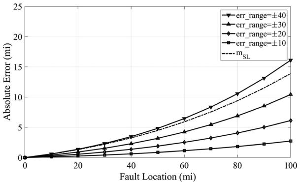  
(a)

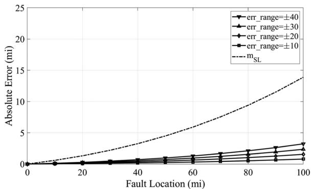  
(b)   
Fig. 25. Error in the estimated FL using the average quadratic approach $( m _ { Q a v g } )$ and the modified Takagi method ( $n _ { S L } )$ for AG faults over the length Qavg SLof Line 1 in Fig. 2(a) considering source impedance errors within err_range. (a) Maximum fault-locating error. (b) Mean fault-locating error.

miles in length. According to IEC 60255, which sets the minimum requirements for evaluating distance protection functions in effectively earthed, three-phase power systems, long lines are defined as 100 km in length with an SIR range of 0.2 to 10, and short lines as 20 km in length with an SIR range of 5 to 50 [21]. For this test, the SIR values used are 0.5 for the local source, 3 for the remote source of the protected line, and 2 for the remote source of the parallel line. All possible erroneous source impedance values in the percentage range of err_range are chosen with one percent resolution. Note, err_range is defined in Fig. 25 for each of the error plots. A significant number of cases with different combinations of errors in the source impedances are tested. For instance, with err_range of ±40 percent, total combinations of $8 0 ^ { 3 }$ test cases are executed where the source impedance errors fall within the range of ±40 percent of its actual value.

Fig. 25 shows the maximum and the mean error in $m _ { Q a v g }$ along with the error in the modified Takagi method $( m _ { S L } )$ Qavg. As SLseen from Fig. 25, even with err_range of ±30 percent in the source impedance values, the maximum and mean errors in $m _ { Q a v g }$ are less than the fault-locating error using $m _ { S L }$ . Consider-Qavg SLing the significant number of combinations of source impedance errors tested, the mean error in $m _ { Q a v g }$ is significantly smaller than the ones using $m _ { S L }$ Qavg. This proves the proposed algorithm SLmitigates fault-locating errors because of the inaccuracies in the user-known zero-sequence source impedance values.

# V. CONCLUSION

The proposed fault-locating methodology, as demonstrated, can be applied to different parallel line configurations, including parallel lines with different lengths or a network with more than two parallel lines. The proposed method is independent of positive- and negative-sequence impedance SIR. Moreover, fault locating in parallel lines with common buses is independent of zero-sequence source impedances as well and, thus, the estimated FL through the proposed method is expected to be accurate. However, fault locating in parallel lines with other configurations requires zero-sequence source impedance values, which may not be accurately known to the user, introducing errors in the estimated FL. The paper addresses this issue by proposing ways to mitigate fault-locating errors because of inaccuracies in the zero-sequence source impedance values. As demonstrated through a power system example, on average the errors in estimated FL can be reduced to a few miles with errors in the source impedance values up to 40 percent. When the zero-sequence SIR values are precisely known, the proposed method’s effectiveness in addressing the mutual-coupling issue remains unaffected. The proposed fault-locating model can be implemented outside the numerical relay. However, from a protective relaying perspective, the proposed method is most suitable in differential relays that have access to phase or zero-sequence currents from the remote terminal of the line. The algorithm can further be improved to accommodate line capacitances using the pi-line model or long-line equations.

# REFERENCES

[1] D. A. Tziouvaras, H. J. Altuve, and F. Calero, “Protecting mutually coupled transmission lines: Challenges and solutions,” in Proc. 67th Annu. Conf. Protective Relay Engineers, 2014, pp. 30–49.   
[2] F. Calero, “Mutual impedance in parallel lines – protective relaying and fault location considerations,” in Proc. 34th Annu. Western Protective Relay Conf., 2015, pp. 1–15.   
[3] S. Marx, B. K. Johnson, A. Guzmán, V. Skendzic, and M. V. Mynam, “Traveling wave fault location in protective relays: Design, testing, and results,” in Proc. 16th Annu. Georgia Tech Fault Disturbance Anal. Conf., Atlanta, GA, May 2013.   
[4] D. A. Tziouvaras, J. Roberts, and G. Benmouyal, “New multi-ended fault location design for two- or three-terminal lines,” in Proc. 7th Int. Conf. Developments Power System Protection, Amsterdam, Netherlands, Apr. 2001, pp. 395–398.   
[5] Z. Y. Xu, X. Q. Yan, L. Ran, and X. Zhang, “Fault locating for inhomogeneous multiple-circuit transmission lines with shared towers,” in Proc. 2012 IEEE Power Energy Soc. Gen. Meeting, San Diego, CA, USA, 2012, pp. 1–8, doi: 10.1109/PESGM.2012.6343952.   
[6] S. V. Unde and S. S. Dambhare, “PMU based fault location for double circuit transmission lines in modal domain,” in Proc. 2016 IEEE Power Energy Soc. Gen. Meeting, Boston, MA, USA, 2016, pp. 1–4, doi: 10.1109/PESGM.2016.7741819.   
[7] G. Chen, D. Cai, and B. Tang, “A new scheme of fault location for parallel double-circuit transmission lines,” in Proc. 2020 Chin. Automat. Congr., Shanghai, China, 2020, pp. 1118–1122, doi: 10.1109/CAC51589.2020.9326766.   
[8] B. Wang, Y. Liu, D. Lu, K. Yue, and Y. Nie, “Unsynchronized parameterfree fault location for two or three terminal double-circuit transmission lines sharing the same tower via unscented Kalman filter,” IEEE Trans. Power Del., vol. 38, no. 3, pp. 1731–1746, Jun. 2023, doi: 10.1109/TP-WRD.2022.3223410.   
[9] Schweitzer Engineering Laboratories, Inc., SEL-411L Advanced Line Differential Protection, Automation, and Control System Relay Instruction Manual, Pullman, WA, USA. [Online]. Available: https://selinc.com/ products/411L/

[10] Y. Hu, D. Novosel, M. M. Saha, and V. Leitloff, “Improving parallel line distance protection with adaptive techniques,” in Proc. 2000 IEEE Power Eng. Soc. Winter Meeting. Conf. Proc., 2000, vol. 3, pp. 1973–1978, doi: 10.1109/PESW.2000.847656.   
[11] M. M. Saha, K. Wikstrom, J. Izykowski, and E. Rosolowski, “New accurate fault location algorithm for parallel lines,” in Proc. 2001 Seventh Int. Conf. Developments Power System Protection, 2001, pp. 407–410, doi: 10.1049/cp:20010186.   
[12] J. Izykowski, E. Rosolowski, and M. M. Saha, “Locating faults in parallel transmission lines under availability of complete measurements at one end,” IEE Gener., Transmiss. Distrib., vol. 151, no. 2, pp. 268–273, 2004.   
[13] N. George and O. D. Naidu, “Locating faults in double-circuit lines using limited measurements from faulted circuit,” in Proc. 9th Int. Conf. Power Energy Syst., Perth, WA, Australia, 2019, pp. 1–6, doi: 10.1109/ICPES47639.2019.9105493.   
[14] E. Rosolowski, J. Izykowski, and M. M. Saha, “Fault location algorithm for use with current differential protective relays of double-circuit line,” in Proc. 2009 IEEE Bucharest PowerTech, Bucharest, Romania, 2009, pp. 1–6, doi: 10.1109/PTC.2009.5281908.   
[15] J. Izykowski, R. Kawecki, E. Rosolowski, and M. M. Saha, “Accurate location of faults in parallel transmission lines under availability of measurements from one circuit only,” in Proc. 14th Power Syst. Computation Conf., Seville, Spain, Jun. 2002, pp. 1–7.   
[16] B. Mahamedi and J. G. Zhu, “Unsynchronized fault location based on the negative-sequence voltage magnitude for double-circuit transmission lines,” IEEE Trans. Power Del., vol. 29, no. 4, pp. 1901–1908, Aug. 2014, doi: 10.1109/TPWRD.2013.2294972.   
[17] C. A. Apostolopoulos and G. N. Korres, “A novel fault-location algorithm for double-circuit transmission lines without utilizing line parameters,” IEEE Trans. Power Del., vol. 26, no. 3, pp. 1467–1478, Jul. 2011, doi: 10.1109/TPWRD.2010.2102777.   
[18] T. Takagi, Y. Yamakoshi, M. Yamaura, R. Kondow, and T. Matsushima, “Development of a new type fault locator using the one-terminal voltage and current data,” IEEE Trans. Power App. Syst., vol. PAS-101, no. 8, pp. 2892–2898, Aug. 1982, doi: 10.1109/TPAS.1982.317615.   
[19] E. O. Schweitzer III, “Evaluation and development of transmission line fault-locating techniques which use sinusoidal steady-state information,” in Proc. 9th Annu. Western Protective Relay Conf., Spokane, WA, USA, Oct. 1982.   
[20] S. Chase, S. Sawai, and A. Kathe, “Analyzing faulted transmission lines: Phase components as an alternative to symmetrical components,” in Proc. 71st Annu. Conf. Protective Relay Engineers, 2018, pp. 1–19, doi: 10.1109/CPRE.2018.8349771.   
[21] Measuring Relays and Protection Equipment – Part 121: Functional Requirements for Distance Protection, IEC 60255-121: Edition 1.0, International Electrotechnical Commission, Geneva, Switzerland, 2014.

Kanchanrao G. Dase (Senior Member, IEEE) received the Bachelor of Engineering degree in electrical engineering from Sardar Patel College of Engineering, University of Mumbai, Mumbai, India, in 2009 And the Master of Science degree in electrical engineering from Michigan Technological University, Houghton, MI, USA, in 2015.

From 2009 to 2014, he was a Manager with Reliance Infrastructure Limited with a substation engineering and commissioning profile. He is currently a Senior Engineer with Schweitzer Engineering Labo-

ratories, Inc., Pullman, WA, USA . His research interests include power system protection, substation automation, and fault locating. He has authored several technical papers relating to power system protection and automation. He currently holds five patents in power system protection.

Connor Doyle received the Bachelor of Engineering degree in electrical engineering from Washington State University, Pullman, WA, USA, in 2022. Since 2022, he has been a Power Engineer in R&D with Schweitzer Engineering Laboratories, Inc.

His research interests include transmission protection, distributed energy resources, and controls of power electronic converters for renewable energy applications.