# 基于频率相关网络等值的电磁-机电暂态解耦混合仿真

张怡1, 吴文传1, 张伯明1, Aniruddha M. Gole2

(1. 电力系统及发电设备控制和仿真国家重点实验室(清华大学电机系), 北京市海淀区 100084;

2.曼尼托巴大学电气与计算机工程系，加拿大温尼伯R3T5V6)

# Frequency Dependent Network Equivalent Based Electromagnetic and Electromechanical Decoupled Hybrid Simulation

ZHANG Yi $^{1}$ , WU Wenchuan $^{1}$ , ZHANG Boming $^{1}$ , Aniruddha M. Gole $^{2}$

(1. State Key Lab of Control and Simulation of Power Systems and Generation Equipments (Dept. of Electrical Engineering,

Tsinghua University), Haidian District, Beijing 100084, China;

2. Department of Electrical and Computer Engineering, University of Manitoba, Winnipeg R3T 5V6, Canada)

ABSTRACT: Neither electromechanical transient stability analysis (TSA) program nor electromagnetic transient (EMT) programs can be used individually for the transient stability studies of the large scale AC/DC systems. This paper presented an electromagnetic and electromechanical hybrid simulation system, based on a frequency dependent network equivalent. Firstly, the framework and the main modules of the proposed hybrid simulation system were introduced. Secondly, the methods to calculate the equivalents of the electromagnetic side and the electromechanical side were introduced. The discussion on the difference between the traditional method and frequency dependent network equivalent (FDNE) and the flowchart of the hybrid simulation were also given. In the last part of the paper, AC system and AC-DC hybrid system are both used as examples to demonstrate the accuracy of the proposed hybrid simulation system's simulation results.

KEY WORDS: decoupled; electromagnetic transient; electromechanical transient; frequency dependent network equivalent; stability

摘要：机电暂态稳定分析程序和电磁暂态程序均不能单独用于大规模交直流系统的仿真研究。开发一套基于频率相关网络等值的电磁-机电暂态解耦混合仿真系统。首先，介绍该

系统的功能框架和软件模块构成。其次，给出电磁暂态侧和机电暂态侧等值电路的求取方法。然后，讨论传统诺顿等值电路与频率相关网络等值的区别，并介绍系统仿真交互时序与仿真流程。最后，采用一个纯交流系统和一个交直流混合系统的算例检验基于频率相关网络等值的混合仿真系统的仿真精度。

关键词：解耦；电磁暂态；机电暂态；频率相关网络等值；稳定

# 0 引言

由于计算量大，电磁暂态(electromagnetic transient，EMT)程序难以用于大规模电力系统的电磁暂态仿真；传统的机电暂态稳定分析(transient stability analysis，TSA)程序不能精确仿真高压直流输电系统(high-voltage direct current, HVDC)的电磁暂态特性和非线性元件引起的波形畸变。因此，迫切需要结合两者特点，开发出计算快速、可以用于多馈入直流输电系统的安全稳定分析的仿真工具，而电磁暂态与机电暂态混合仿真应运而生。

Heffernan在HVDC换流器的交流母线处将系统分为电磁暂态部分和机电暂态部分，首先建立了电磁、机电暂态混合仿真[1]；Reeve把分网位置延伸到交流系统内部，防止接口处的电压波形畸变过于严重，但是却增加了电磁暂态侧系统的计算规模[2]；Morched[3]和Anderson[4]讨论了用频率相关网络等值(frequency dependent network equivalent, FDNE)来表

征机电暂态侧谐波对电磁暂态侧影响的必要性，并采用FDNE来准确反映机电暂态侧对电磁暂态侧的端口电气特性；Wang等人实现了多端口的电磁机电混合仿真[5]；香港理工大学[6]提出一种并行交互时序以加快混合仿真的计算速度；加拿大Lin等人采用矢量拟合法vectorfitting)[7]求取FDNE，有效地模拟了HVDC换流器母线处谐波对电磁暂态侧的影响[8-9]，并在实时数字仿真器(real-time digital simulator，RTDS)上实现了在线混合仿真。

文献[10]提出稳态情况下并行接口时序与网络拓扑改变时刻串行接口时序的方法，并采用节点分裂接口算法解决了网络正序、负序阻抗不相等时与电磁暂态模型接口的问题；而文献[11]则采用基波负序补偿法解决了等值电路正序、负序阻抗不相等的情况。文献[12]实现了基于电网数字实时动态仿真系统的混合仿真，讨论了等值电路的参数求取问题；文献[13-14]分别实现了基于RTDS的电磁-机电暂态仿真平台。文献[15]提出的混合仿真方法考虑了故障时刻接口处频率偏移对系统仿真的影响；文献[16]东南大学提出了一种基于统一潮流控制器(unified power flow controller，UPFC)动态相量模型和交流电力系统机电暂态模型的混合仿真方案；文献[17]提出基于多速率的交直流系统双速率相量——瞬时数据互馈的电磁和机电暂态混合仿真计算方法。

本文在文献[8]的基础上，研究采用FDNE表示机电暂态侧谐波对电磁暂态侧的影响，改进电磁暂态侧等值电流的求取方法，改进FDNE在电磁暂态程序中的时域应用方法，并基于管道(pipe)方式，开发一套电磁-机电暂态解耦混合仿真系统。

# 1 系统总体设计

# 1.1 系统简介

本文中的混合仿真系统由电磁暂态仿真程序、机电暂态仿真程序、管道通信模块和仿真支持模块等4部分构成。系统的基本功能框架如图1所示。

# 1.2 仿真支持模块

仿真支持模块为电磁暂态仿真程序和机电暂态仿真程序提供数据支持，包含2个子模块：

1）数据转换子模块。电磁暂态和机电暂态仿真程序的电力系统模型最初来自于PSS/E32潮流文件(*.raw)、动态模型文件(*.dyr)和序参数文件(*.seq)。数据转换子模块的功能是，一方面调用E-TRAN转换程序将PSS/E32转换成电磁暂态仿真

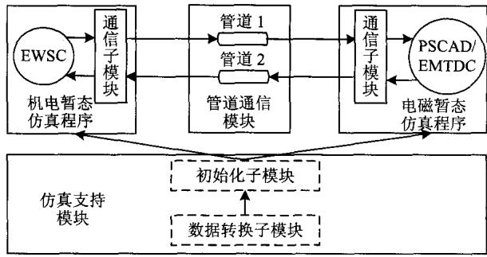  
图1电磁-机电暂态混合仿真系统功能框架  
Fig. 1 Function framework of electromagnetic and electromechanical simulation system

程序可以识别的 PSCAD/EMTDC 文件，另一方面利用数据格式转换程序将 PSS/E32 数据文件转换成机电暂态仿真程序可以识别的数据。

2）初始化子模块。电磁暂态和机电暂态仿真程序都对本侧网络进行等值建模，因此在仿真开始时，初始化子模块根据分网情况分别计算电磁暂态和机电暂态仿真程序所需要的等值电路，并分别传送至电磁暂态和机电暂态仿真程序对其进行潮流和暂态仿真初始化。

# 1.3 电磁暂态仿真程序

本文选择PSCAD/EMTDC作为电磁暂态侧网络的仿真工具。PSCAD/EMTDC不仅可以对包含直流输电系统的大型电力系统进行精确模拟，而且其输入和输出界面非常直观方便。

传统的机电暂态侧等值电路用从接口处看进去的诺顿等值电路来表示，即诺顿等值电流源I并联等值导纳矩阵。在本文中，用FDNE代替传统诺顿等值电路中的等值导纳，如图2所示。FDNE不仅可以模拟机电暂态侧网络的基频响应，还可以还原机电暂态侧网络高频响应。

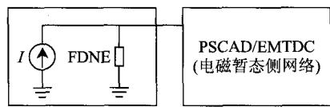  
图2机电暂态侧等值电路在电磁暂态程序的表示方法  
Fig. 2 Equivalent representation of the network on the electromechanical transient side in electromagnetic transient program

图1中的电磁暂态仿真模块会在数据交换时刻计算本侧对机电暂态侧的等值电路，由本身的通信子模块利用管道通信传送至机电暂态侧，更新机电暂态仿真模块中的相应等值电路。

# 1.4 机电暂态仿真程序

本文采用暂态稳定预警与预防控制(early warning and security countermeasure, EWSC)系统的动态仿真程序[18]作为机电暂态侧网络的仿真工具。

传统的电磁暂态侧等值电路可以用ZIP负荷来表示。在本文中，电磁暂态侧的等值电路用恒电流负荷来表示，如图3所示。

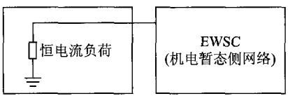  
图3 电磁暂态侧等值电路在机电暂态程序的表示方法  
Fig. 3 Equivalent representation of the network on the electromagnetic transient side in electromechanical transient program

图1中机电暂态仿真模块会在数据交换时刻计算本侧对电磁暂态侧的等值电路，并由通信子模块利用管道通信传送至到电磁暂态侧，更新电磁暂态仿真模块中等值电路。

# 1.5 管道通信模块

管道通信模块是基于管道开发的。管道是一种用于进程间通信的应用程序接口(application programming interface, API)。管道有2个终端：进程1可以在管道的一端写入数据，而进程2可以在管道的另外一端读出数据。

本文通信模块的实现方法如图1所示。通信模块采用2个不同的管道，以实现点对点的数据传送。管道1负责机电暂态侧向电磁暂态侧发送数据，管道2负责电磁暂态侧向机电暂态侧发送数据。本文采用并行交互时序，以提高计算速度。

使用管道的好处在于3个方面：

1）读写它使用的管道实际是对文件的操作，操作管道和操作文件一样。即使在不同的计算机之间也可用管道来通信，不必了解实现网络间通信的具体细节。  
2）文献[8]将机电暂态程序作为一个用户自定义模块嵌入到RTDS仿真平台上。而这种传统嵌入方式将机电暂态程序耦合到电磁暂态程序里，不利于程序的扩展。而管道通信方式将电磁暂态程序和机电暂态程序解耦，这对程序的扩展提供很大的灵活性。  
3）传统的嵌入方式只适用于串行时序交互方式，而这种基于管道的解耦方式还可以适用于并行时序交互方式。在本文提出的解耦系统框架下，其

通信方式也可以方便替换成管道之外的其他方式，如采用基于互联网协议系列(transmission control protocol and internet protocol，TCP/IP)的套接字(socket)通信。

# 2 系统算法实现

# 2.1 FDNE

不同的频率下节点导纳矩阵是不同的，因此呈现出不同的网络频率特性，如图4所示。网络的频率特性由这些节点导纳矩阵决定，网络的频率特性(幅频特性和相频特性)是连续的。但是，图4中有限的、离散的节点导纳矩阵不能表示此连续的频率特性。矢量拟合法可以将有限的、离散的、不同频率下节点导纳矩阵拟合成一个与频率相关的、连续的有理函数矩阵，称之FDNE矩阵。而这个FDNE矩阵能够表示这些不同频率下的节点导纳矩阵，即不同频率下的频率响应。

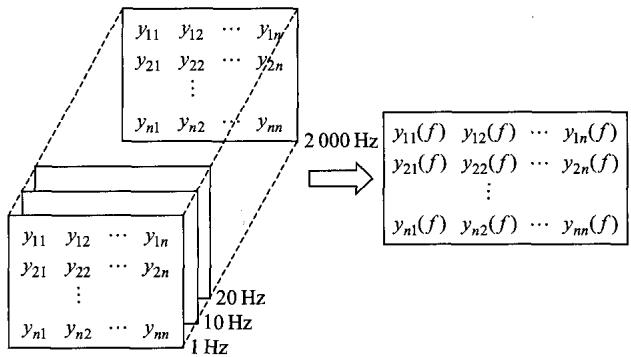  
图4FDNE的基本概念  
Fig. 4 Basic concept of the FDNE

FDNE矩阵 $\pmb{Y}(s)$ 中的每个元素可以表示为一个频域函数 $(s = \mathrm{j}2\pi f, f$ 为频率)，即有

$$
y _ {k m} (s) = \sum_ {i = 1} ^ {n} \frac {c _ {i}}{s - a _ {i}} + d \tag {1}
$$

式中： $k$ 、 $m$ 为 FDNE 矩阵某元素的下标；极点 $a_{i}$ 和留数 $c_{i}$ 或是实数，或分别以复数共轭对出现； $d$ 为实数； $n$ 为极点个数。FDNE 矩阵中不同元素的 $a_{i}$ 、 $c_{i}$ 和 $d$ 不同，可用矢量拟合法求出。本文 FDNE 的求取办法参见文献[19]。

# 2.2 机电暂态侧等值电路的求取方法

考虑FDNE，机电暂态侧电压和电流关系可表示为

$$
\left[ \begin{array}{l l} \mathbf {Y} _ {\mathrm {B B}} (f) & \mathbf {Y} _ {\mathrm {B E}} (f) \\ \mathbf {Y} _ {\mathrm {E B}} (f) & \mathbf {Y} _ {\mathrm {E E}} (f) \end{array} \right] \left[ \begin{array}{l} \mathbf {U} _ {\mathrm {B}} \\ \mathbf {U} _ {\mathrm {E}} \end{array} \right] = \left[ \begin{array}{l} \mathbf {I} _ {\mathrm {B}} \\ \mathbf {I} _ {\mathrm {E}} \end{array} \right] \tag {2}
$$

式中：下标B表示边界母线；下标E表示机电暂态

侧网络中的其他母线。对式(2)进行高斯消去，消去 $U_{\mathrm{E}}$ ，得到收缩到边界后的FDNE矩阵和诺顿等值电流。由于机电暂态网络的注入源离故障点(电磁暂态侧)距离较远，因此诺顿等值电流可只考虑基频分量，故诺顿等值公式为

$$
\left\{ \begin{array}{l} \bar {Y} _ {\mathrm {B B}} (f) = Y _ {\mathrm {B B}} (f) - Y _ {\mathrm {B E}} (f) Y _ {\mathrm {E E}} (f) ^ {- 1} Y _ {\mathrm {E B}} (f) \\ \bar {I} _ {\mathrm {B}} \left(f _ {0}\right) = I _ {\mathrm {B}} \left(f _ {0}\right) - Y _ {\mathrm {B E}} \left(f _ {0}\right) Y _ {\mathrm {E E}} \left(f _ {0}\right) ^ {- 1} I _ {\mathrm {E}} \left(f _ {0}\right) \end{array} \right. \tag {3}
$$

式中 $f_{0}$ 为基频频率。

为了使上述诺顿等值结果可以应用到电磁暂态程序中，需要做2步处理：

1）将诺顿等值电流转化为三相电流源。

$$
\left\{ \begin{array}{l} i _ {\mathrm {a}} = \sqrt {2} \mid \bar {I} _ {\mathrm {B}} \left(f _ {0}\right) \mid \sin \left(\angle \bar {I} _ {\mathrm {B}} \left(f _ {0}\right)\right) \\ i _ {\mathrm {b}} = \sqrt {2} \mid \bar {I} _ {\mathrm {B}} \left(f _ {0}\right) \mid \sin \left(\angle \bar {I} _ {\mathrm {B}} \left(f _ {0}\right) - \frac {2 \pi}{3}\right) \\ i _ {\mathrm {c}} = \sqrt {2} \mid \bar {I} _ {\mathrm {B}} \left(f _ {0}\right) \mid \sin \left(\angle \bar {I} _ {\mathrm {B}} \left(f _ {0}\right) + \frac {2 \pi}{3}\right) \end{array} \right. \tag {4}
$$

2）用隐式梯形法进行差分。

考虑节点注入电流和节点电压，将 $N \times N$ 维FDNE矩阵 $\pmb{Y}(s)$ 转化为状态空间形式。

$$
\left\{ \begin{array}{l} \dot {\boldsymbol {x}} = \boldsymbol {A} \boldsymbol {x} + \boldsymbol {B} \boldsymbol {U} \\ \boldsymbol {I} = \boldsymbol {C} \boldsymbol {x} + \boldsymbol {D} \boldsymbol {U} \end{array} \right. \tag {5}
$$

式中 $\pmb{x}$ 、 $\pmb{I}$ 和 $\pmb{U}$ 的维数都为 $N\times 1$ ， $\pmb{x}$ 为状态变量， $\pmb{I}$ 为节点注入电流，而 $\pmb{U}$ 为节点电压。

用隐式梯形法进行差分，差分时间步长为 $\Delta t$ 可得包含历史电流源和等值导纳的差分方程：

$$
\left\{ \begin{array}{l} \boldsymbol {x} (t + \Delta t) = \boldsymbol {M} \boldsymbol {x} (t) + \boldsymbol {L} (\boldsymbol {U} (t + \Delta t) + \boldsymbol {U} (t)) \\ \boldsymbol {I} (t + \Delta t) = \boldsymbol {I} _ {\text {h i s}} (t + \Delta t) + \boldsymbol {G} _ {\text {e q}} \boldsymbol {U} (t + \Delta t) \end{array} \right. \tag {6}
$$

其中：

$$
\left\{ \begin{array}{l} \boldsymbol {K} _ {1} = (\boldsymbol {E} - \frac {\Delta t}{2} \boldsymbol {A}) ^ {- 1} \\ \boldsymbol {K} _ {2} = \boldsymbol {E} + \frac {\Delta t}{2} \boldsymbol {A} \\ \boldsymbol {M} = \boldsymbol {K} _ {1} \boldsymbol {K} _ {2} \\ \boldsymbol {L} = \frac {\Delta t}{2} \boldsymbol {K} _ {1} \boldsymbol {B} \\ \boldsymbol {I} _ {\text {h i s}} (t + \Delta t) = \boldsymbol {C K} _ {1} (\boldsymbol {K} _ {2} \boldsymbol {x} (t) + \frac {\Delta t}{2} \boldsymbol {B U} (t)) \\ \boldsymbol {G} _ {\mathrm {e q}} = \frac {\Delta t}{2} \boldsymbol {C K} _ {1} \boldsymbol {B} \end{array} \right. \tag {7}
$$

式中 $\pmb{E}$ 为单位矩阵，其维数与矩阵 $\pmb{A}$ 相同。式(6)可以直接应用到电磁暂态仿真程序中。

在文献[8]中，由于其FDNE矩阵中各个元素的

极点及其个数各不相同，其实现方法是将FDNE矩阵中各元素分别运用隐式梯形法进行差分化，将每个元素分别表示成历史电流源并联导纳的形式。而本文中的FDNE矩阵中各元素的极点及其个数都相同，因此可以统一差分，将FDNE矩阵表示成一个统一的整体，其时域实现过程简单，更具灵活性。用一个两端口的FDNE来说明本文FDNE的实现方法，如图5所示。图中 $G_{11}$ 、 $G_{12}$ 和 $G_{22}$ 为矩阵 $\pmb{G}_{\mathrm{eq}}$ 的元素。

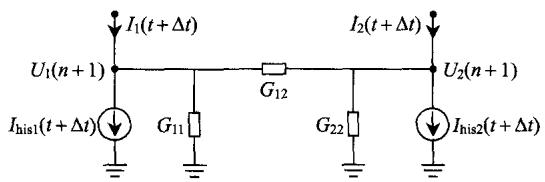  
图5 两端口FDNE的时域表现形式  
Fig. 5 Representation of a two-port FDNE in time domain

# 2.3 电磁暂态侧等值电路的求取方法

电磁侧网络的等值模型是恒电流负荷，以图6来说明求取恒电流负荷的电流值方法[8]。不同的是，本文采取 $dq0$ 变换，可更精确地求取端口的功率，尤其是非对称故障情况下的端口功率。 $U_{\mathrm{T}}$ 和 $\pmb{I}_{\mathrm{T}}$ 是待求的等值电压和等值电流， $\pmb{Y}_0$ 是FDNE在基频下的等值导纳，而 $\pmb{I}_{\mathrm{E}}$ 是机电暂态侧上一步的电流序分量。 $P_{\mathrm{E}}$ 和 $Q_{\mathrm{E}}$ 是电磁暂态侧向机电暂态侧等值电流源 $\pmb{I}_{\mathrm{E}}$ 中注入的有功和无功功率。

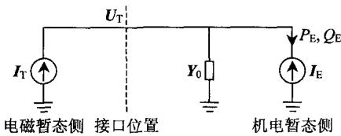  
图6 电磁暂态侧等值电路的求取方法  
Fig. 6 Method of obtaining the equivalent of the electromagnetic transient side

设任意时刻端口电压为 $\pmb{u}_{\mathrm{Eabc}}$ ，机电暂态侧电流源电流的三相瞬时值为 $i_{\mathrm{Eabc}}$ ，通过 $dq0$ 变换可以得到 $dq0$ 坐标下电压、电流分别为 $\pmb{u}_{dq0}$ 和 $\pmb{i}_{dq0}$ 。

$$
\left\{ \begin{array}{l} \boldsymbol {u} _ {d q 0} = \boldsymbol {T} \boldsymbol {u} _ {\text {E a b c}} \\ \boldsymbol {i} _ {d q 0} = \boldsymbol {T} \boldsymbol {i} _ {\text {E a b c}} \end{array} \right. \tag {8}
$$

其中

$$
\boldsymbol {T} = \frac {2}{3} \left[ \begin{array}{c c c} \cos \theta & \cos \left(\theta - \frac {2 \pi}{3}\right) & \cos \left(\theta + \frac {2 \pi}{3}\right) \\ \sin \theta & \sin \left(\theta - \frac {2 \pi}{3}\right) & \sin \left(\theta + \frac {2 \pi}{3}\right) \\ \frac {1}{2} & \frac {1}{2} & \frac {1}{2} \end{array} \right] \tag {9}
$$

则瞬时有功功率 $P_{\mathrm{E}}$ 、无功功率 $Q_{\mathrm{E}}$ 可表示为

$$
\left\{ \begin{array}{l} P _ {\mathrm {E}} = \frac {3}{2} \left(u _ {d} i _ {d} + u _ {q} i _ {q}\right) + 2 u _ {0} i _ {0} \\ Q _ {\mathrm {E}} = \frac {3}{2} \left(u _ {d} i _ {q} - u _ {q} i _ {d}\right) \end{array} \right. \tag {10}
$$

则等值电压 $U_{\mathrm{T}}$ 为

$$
\boldsymbol {U} _ {\mathrm {T}} = \frac {P _ {\mathrm {E}} + \mathrm {j} Q _ {\mathrm {E}}}{I _ {\mathrm {E}}} \tag {11}
$$

则满足功率平衡的注入电流 $I_{\mathrm{T}}$ 为

$$
\boldsymbol {I} _ {\mathrm {T}} = \boldsymbol {Y} _ {0} \boldsymbol {U} _ {\mathrm {T}} + \boldsymbol {I} _ {\mathrm {E}} \tag {12}
$$

这个注入电流 $I_{\mathrm{T}}$ 即为恒电流负荷的等值电流值。

# 2.4 与传统多端口诺顿等值法的比较

传统多端口诺顿等值导纳应用到电磁暂态仿真程序的方法是：首先将其表示成 $RLC$ 元件组合电路的形式，然后对 $RLC$ 元件组合电路进行差分，应用到电磁暂态仿真程序。多端口诺顿等值导纳常用的 $RLC$ 元件组合为图7所示的支路表示。该等值电路的 $RLC$ 元件组合电路的参数可以根据多端口诺顿等值导纳在基频下的值求取。

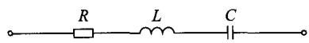  
图7 传统诺顿等值导纳的表示方法  
Fig. 7 Representation of the conventional Norton equivalent admittance

1）关于频率特性。上述RLC等值电路改变了原始网络的频率特性。传统多端口诺顿等值导纳只是本文所提的FDNE在基频下的表现形式。虽然图7中的等值电路对应的基频频率特性与原始网络一致，但是并不能保证其他频率下的频率特性与原始频率特性完全一致；  
2）关于仿真稳定性。多端口诺顿等值可能导致仿真失稳。例如，二端口诺顿等值导纳矩阵中的每个元素都用图7表示，则在其他频率下的诺顿等值导纳矩阵与原始网络是非等效的，这有可能导致对应的等值电导矩阵在某些频率下特征值小于0，从而导致仿真失稳。本文用一个简单算例来说明这个问题，见附录A。

本文中的FDNE能保证等值电路在各个频率段的准确性，并且经过无源校正后的FDNE是无源的，可以保证仿真的稳定性。

# 2.5 仿真时序和仿真流程图

本系统的混合仿真采用并行时序以加快计算

速度。与文献[10,13]中的仿真流程类似，本文的混合仿真流程如图8所示。图中 $\Delta t$ 和 $\Delta T$ 分别代表电磁暂态程序计算步长和机电暂态程序计算步长。

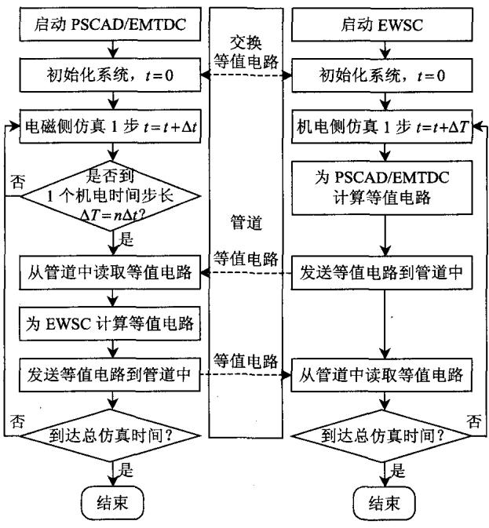  
图8 混合仿真流程图  
Fig. 8 Flowchart of the hybrid simulation

# 3 算例分析

# 3.1 算例系统

为了测试电磁-机电暂态混合仿真的精确性，本文采用2个算例系统：一个为纯交流系统；另一个为交直流系统。交直流系统的简图如图9所示。

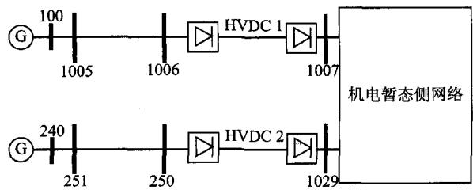  
图9 算例系统简图  
Fig. 9 Diagram of the 118-bus system

纯交流系统则是基于上述交直流系统修改而来。将图9所示的2条直流线路HVDC1和HVDC2分别替换为2条交流线路1006-1007和250-1029，即可得纯交流系统。以下纯交流系统均指按照此修改后的系统。

接口位置选在母线1007和母线1029处。方框部分(机电暂态侧网络)在机电暂态仿真程序中建模，剩余部分在电磁暂态仿真程序中建模。

本文中的发电机、励磁器、调速器和负荷的动态模型均来自于 $\mathrm{PSS / E}^{[20]}$ ，具体如表1所示。而电磁暂态仿真中的直流模型采用CIGRE标准测试模型[21]。

表 1 动态元件模型  
Tab. 1 Dynamic models   

<table><tr><td>元件</td><td>发电机</td><td>励磁器</td><td>调速器</td><td>负荷</td></tr><tr><td>模型</td><td>GENROU</td><td>IEEET1</td><td>IEEEG1</td><td>ZIP</td></tr></table>

下文中，全模型PSCAD/EMTDC仿真方法用符号EMT表示，本文的混合仿真方法用符号EMT+TSA+FDNE表示。

# 3.2 精度比较

# 3.2.1 纯交流系统

在母线1007处发生三相金属短路故障，持续时间为 $100\mathrm{ms}$ 。电磁暂态侧发电机100的转速 $\omega_{100}$ 和机电暂态侧发电机109的转速 $\omega_{109}$ 对比如图10所示。

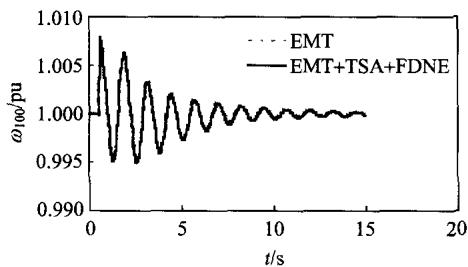  
(a) 电磁侧发电机100的转速

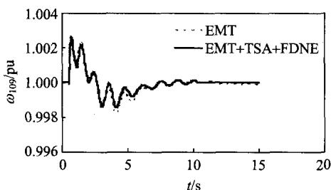  
(b) 机电侧发电机109的转速  
图10 纯交流系统仿真精度对比  
Fig. 10 Accuracy comparison using pure AC system

可见EMT+TSA+FDNE与EMT这2种方法的结果吻合较好，表明混合仿真的精确性。同时，混合仿真不仅能够精确仿真电磁暂态侧网络，同时也可以精确仿真机电暂态侧网络。

# 3.2.2 交直流系统

在母线1007处发生三相金属短路故障，持续时间为 $100\mathrm{ms}$ 。电磁暂态侧HVDC1逆变器直流电压 $U$ 和机电暂态侧发电机109转速的 $\omega_{109}$ 对比如图11所示。两者结果吻合较好，表明了混合仿真

系统的精确性。同时，混合仿真不仅能够精确仿真电磁暂态侧网络直流系统的暂态，同时也可以精确仿真机电暂态侧网络的暂态。这表明混合仿真适用于交直流混合系统仿真。

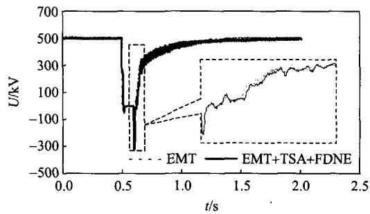  
(a) 电磁侧 HVDC1 逆变侧的直流电压

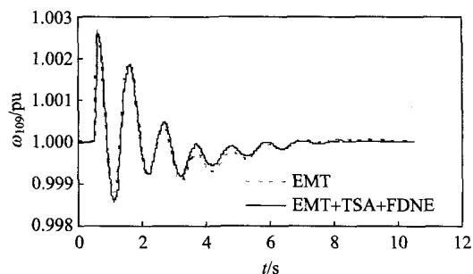  
(b) 机电侧发电机109的转速  
图11 交直流系统精度对比  
Fig. 11 Accuracy comparison using AC/DC system

# 4 结论

本文开发了一套基于FDNE的电磁-机电暂态混合仿真系统。对机电侧网络，采用诺顿电流源并联FDNE的等值电路，其中FDNE能够精确表示机电侧网络的频率响应；对电磁侧网络，采用恒电流负荷的等值电路。仿真算例表明了混合仿真系统的准确性。

由于本文采用的是固定的FDNE，还不能模拟机电暂态侧的故障，因此研究变化的FDNE以适应机电暂态侧的故障是未来的一个研究方向。

# 致谢

感谢加拿大RTDS Technologies公司梁玥峰和Powertech Labs公司林曦等人对本文的贡献。

# 参考文献

[1] Heffernan M D, Turner K S, Arrillaga J. Computation of AC/DC system disturbances: parts I, II, and III[J]. IEEE Transactions on Power Apparatus and Systems, 1981, 100(11): 4341-4363.   
[2] Reeve J, Adapa K. A new approach to dynamic analysis of AC networks incorporating detailed modeling of DC

systems: parts I and II[J]. IEEE Transactions on Power Delivery, 1988, 3(4): 2005-2019.   
[3] Morched A S, Ottevangers J H, Marti L. Multi-port frequency dependent network equivalents for the EMTP[J]. IEEE Transactions on Power Delivery, 1993, 8(3): 2005-2018.   
[4] Anderson G W J, Watson N R, Arnold C P, et al. A new hybrid algorithm for analysis of HVDC and FACTS systems[C]/The 1995 IEEE International Conference Energy on Management and Power Delivery. New York: The Institute of Electrical and Electronics Engineers INC., 1995: 8-16.   
[5] Wang X, Wilson P, Woodford D. Interfacing transient stability program to EMTDC program[C]/The 2002 IEEE International Conference on Power System Technology. Kunming: Chinese Society for Electrical Engineering, 2002: 1264-1269.   
[6] Su H, Chan K W, Snider K W, et al. A parallel implementation of electromagnetic electromechanical hybrid simulation protocol[C]//The 2004 International Conference on Electric Utility Deregulation, Restructuring and Power Technologies. Hong Kong: IEEE Joint Chapter of Power Engineering, Industry Applications, Power Electronics, and Industrial Electronics Societies, 2004: 151-155.   
[7] Gustavsen B, Semlyen A. Rational approximation of frequency domain responses by vector fitting[J]. IEEE Transactions on Power Delivery, 1999, 14(3): 1052-1061.   
[8] Lin X, Gole AM, Yu M. A wide-band multi-port system equivalent for real-time digital power system simulators[J]. IEEE Transactions on Power Systems, 2009, 24(1): 237-249.   
[9] Liang Y, Lin X, Gole A M, et al. Improved coherency-based wide-band equivalents for real-time digital simulators[J]. IEEE Transactions on Power Systems, 2011, 26(3): 1410-1417.   
[10] 岳程燕. 电力系统电磁暂态和机电暂态混合实时仿真的研究[D]. 北京：中国电力科学研究院，2004. Yue Chengyan. Study of power system electromagnetic transiet and electromechanical transient real-time hybrid simulation[D]. Beijing: China Electric Power Research Institute, 2004(in Chinese).  
[11] 刘文焯，侯俊贤，汤涌，等．考虑不对称故障的机电暂态-电磁暂态混合仿真方法[J]. 中国电机工程学报，2010，30(13)：8-17. Liu Wenzhuo，Hou Junxian，Tang Yong，et al. Electromechanical transient/electromagnetic transient hybrid considering asymmetric faults[J]. Proceedings of the CSEE，2010，30(13)：8-17(in Chinese).  
[12] 柳勇军. 电力系统机电暂态和电磁暂态混合仿真技术的

研究[D].北京：清华大学，2005.  
Liu Yongjun. Study of power system electromagnetic transiet and electromechanical transient hybrid simulation[D]. Beijing: Tsinghua University, 2005(in Chinese).   
[13] 张树卿．交直流系统电磁/机电暂态混合实时仿真关键技术的研究[D]. 北京：清华大学，2010. Zhang Shuqing. Research on key techniques of electromagnetic/electromechanical hybrid real-time simulation of AC-DC transmission system[D]. Beijing: Tsinghua University, 2010(in Chinese).   
[14] 贾旭东. 基于 RTDS 的交直流系统实时数字仿真方法研究与实现[D]. 北京：华北电力大学，2009.  
Jia Xudong. Research and implementation of real-time digital simulation method of AC-DC power system based on RTDS[D]. Beijing: North China Electric Power University, 2009(in Chinese).   
[15] Wang L W, Fang D Z, Chung T S. New techniques for enhancing accuracy of EMTP/TSP hybrid simulation algorithm[C]//The 2004 IEEE International Conference on Electric Utility Deregulation Restructuring and Power Technologies. Hong Kong: IEEE Joint Chapter of Power Engineering, Industry Applications, Power Electronics, and Industrial Electronics Societies, 2004: 734-739.   
[16] 王路，李兴源，颜泉，等．交直流混联系统的多速率混合仿真技术研究[J]. 电网技术，2005，29(15)：23-27. Wang Lu, Li Xingyuan, Yan Quan, et al. Study on multi-rate hybrid simulation technology for AC/DC power system[J]. Power System Technology, 2005, 29(15): 23-27(in Chinese).  
[17] 刘浩明，朱浩骏，严正，等．含统一潮流控制器装置的电力系统动态混合仿真接口算法研究[J].中国电机工程学报，2005，25(16)：1-7. Liu Haoming, Zhu Haojun, Yan Zheng, et al. Study on interface algorithm for power system transient stability hybrid-model simulation with UPFC device[J]. Proceedings of the CSEE, 2005, 25(16): 1-7(in Chinese).  
[18] 张怡，吴文传，张伯明，等．暂态稳定预警与预防控制系统的开发和应用[J].电力系统自动化，2010，34(3)：1-5. Zhang Yi，Wu Wenchuan，Zhang Boming，et al.Development and application of early warning and preventive control system for transient stability[J]. Automation of Electric Power Systems，2010，34(3):1-5(in Chinese).   
[19] 张怡，吴文传，张伯明，等．电磁-机电暂态混合仿真中的频率相关网络等值[J]. 中国电机工程学报，2012，32(13)：61-68. Zhang Yi, Wu Wenchuan, Zhang Boming, et al. Frequency dependent network equivalent for electromagnetic and

electromechanical hybrid simulation[J]. Proceedings of the CSEE, 2012, 32(13): 61-68(in Chinese).

[20] Siemens Energy Inc. PSS/E 32 program operation manual[R]. New York, USA: Siemens Energy Inc., 2009.   
[21] Szechtman M, Wess T, Thio C V. A benchmark model for HVDC system studies[C]/The International Conference on AC and DC Power Transmission. London: Power Division of the Institution of Electrical Engineers, 1991: 374-378.

# 附录A 仿真失稳算例

将某39节点系统对应的节点导纳矩阵收缩得到二端口诺顿等值电路，将二端口诺顿等值电路用 $RL$ 元件组合电路表示，得到图A1所示的等值电路。另外，某些情况下，收缩后的二端口诺顿等值电路在互电导的位置上会出现负电阻(图A1所示的支路B1-B2中出现了负电阻)。

计算上述算例系统在各频率下的电导矩阵并求取相应的特征值，发现在 $1\sim 13\mathrm{Hz}$ 频率段，电导矩阵的特征值中出现负值。在B1和B2处，分别加上4和 $5\mathrm{Hz}$ 的电压源，在PSCAD/EMTDC中仿真，端口电流 $I$ （三相电流 $I_{\mathrm{a}}$ 、 $I_{\mathrm{b}}$ 和 $I_{\mathrm{c}}$ 发散，如图A2所示。由此可见，直接将多端口诺顿等值电

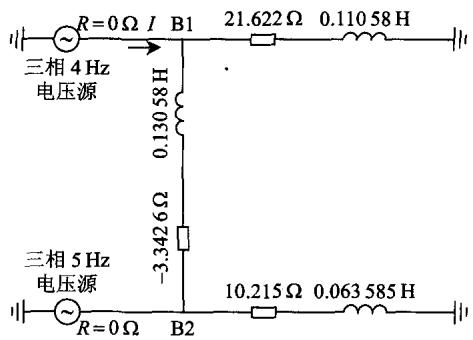  
图A1 算例系统  
Fig. A1 Test system

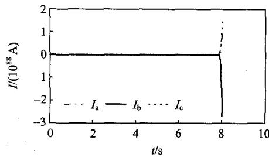  
图A2 电流  
Fig.A2 Current

路表示成RLC电路，然后进行差分应用到电磁暂态仿真中，在某些频率下，会导致仿真发散。

  
张怡

收稿日期：2011-12-10。

作者简介：

张怡(1985)，男，博士研究生，主要从事电力系统机电暂态与电磁暂态混合仿真、暂态稳定及其安全分析方面的研究工作，veriasea@gmail.com;

吴文传(1973)，男，博士，副教授，博士生导师，主要从事电力系统调度自动化和配电自动化方面的研究工作，wuwench@tsinghua.edu.cn;

张伯明(1948)，男，博士，教授，博士生导师，IEEE Fellow，主要从事电力系统分析和调度自动化方面的研究工作，zhangbm@tsinghua.edu.cn;

Aniruddha M. Gole(1955), 男, 博士, 教授, 加拿大工程院院士, IEEE Fellow, 主要从事电力系统电磁暂态仿真、HVDC稳定性分析等方面的研究工作, gole@ee.umanitoba.ca。

(责任编辑 谷子)