# Benchmark High-Fidelity EMT Models for Power Grid with PV Plants

Phani R V Marthi

Energy Science & Technology Directorate

Oak Ridge National Laboratory

Knoxville, USA

marthip@ornl.gov

Jongchan Choi

Energy Science & Technology Directorate

Oak Ridge National Laboratory

Knoxville, USA

choij1@ornl.gov

Suman Debnath

Energy Science & Technology Directorate

Oak Ridge National Laboratory

Knoxville, USA

debnaths@ornl.gov

Abstract—In recent times electromagnetic transient (EMT) modeling tools have been identified as one of the most important requirements in replicating, analyzing, and investigating the dynamics of the power grid with photovoltaic (PV) plants. However, there are no benchmark models for power grid with PVs to investigate emerging challenges with higher penetration of PVs (like trips and momentary cessations during faults from a region faraway). To this end, in this paper, benchmark highfidelity EMT dynamic models of power grid with large-scale PV plants are presented. The models are developed in PSCAD and PSCAD/Fortran. Simulation results for different use cases (events) and scenarios are presented.

Index Terms—PV plant, EMT simulation, PV inverter.

# I. INTRODUCTION

The penetration of large-scale inverter-based resources (IBRs) in the power grid such as photovoltaic (PV) plants has increased tremendously in the past decade. With this development, there is a fundamental shift in the way the electric power grid responds to the events in the system. In the conventional power grid with synchronous generators, when the event happens the entire plant nearby would completely shut down. In the case of a power grid with a higher number of PV plants, the PV plants over a large region observe partial power loss rather than complete shutdown. Examples of such observations during events in CA are reported in numerous events [1]- [4]. One of the key requirements recommended by reliability entities (such as NERC) is to utilize electromagnetic transient (EMT) PV plant models with higher fidelity. These high-fidelity EMT models aid in accurately replicating, investigating, and analyzing the performance of the PV plant during an event. However, there are very limited to no benchmark

Research sponsored by Applied Grid Modeling (AGM) program in U. S. Department of Energy’s Office of Electricity (OE). The views expressed herein do not necessarily represent the views of the U.S. Department of Energy or the United States Government. Phani Marthi, Suman Debnath, and Jongchan Choi are with Oak Ridge National Laboratory, Knoxville, TN 37932, USA (email: marthip@ornl.gov). This manuscript has been authored by UT-Battelle, LLC under Contract No. DE-AC05-00OR22725 with the U.S. Department of Energy. The United States Government retains and the publisher, by accepting the article for publication, acknowledges that the United States Government retains a non-exclusive, paid-up, irrevocable, world-wide license to publish or reproduce the published form of this manuscript, or allow others to do so, for United States Government purposes. The Department of Energy will provide public access to these results of federally sponsored research in accordance with the DOE Public Access Plan(https://www.energy.gov/doe-public-accessplan).

EMT models of power grid with PV plants. A benchmark network for grid integration studies of large-scale PV plants in RSCAD is presented in [5]. In this work, the focus is not on developing a benchmark model of a PV plant instead the focus is on developing a network for grid integration of large-scale PV plants. In [6], a benchmark model for PV systems and smart inverter control in a low-voltage distribution network is presented. None of these works include benchmark EMT models of power grid with multiple PV plants. The research work in [7] is on EMT simulation of large PV plant and power grid for disturbance analysis. In this work, the EMT models developed are benchmarked with the real large-scale PV plant. However, these models are under non-Disclosure Agreement (NDA), limiting the usability by research community that explores algorithms to avoid trips or shutdowns in PV plants.

Therefore, in this paper benchmark EMT model of power grid with multiple PV plants is presented. These benchmark models are openly available and will help researchers in the development and testing of algorithms in operations to detect disturbances in power grid and take reactive or predictive actions in the power grid and/or in the PV plant. The benchmark model is based on integration of high-fidelity EMT dynamic model of PV plants in IEEE-39 bus system. The benchmark models are tested for different test cases in PSCAD. The first test case is the simulation of three PV plants connected to IEEE-39 bus system using benchmark models for different fault conditions in the system. The second test case is the simulation of three PV plants connected to IEEE-39 bus system using benchmark models for different short circuit ratio (SCR) in the system.

# II. HIGH-FIDELITY EMT DYNAMIC MODELS FOR PV PLANTS

The detailed layout of the generic PV plant is shown in Fig. 1. It consists of several components such as feeders (with symmetric lengths or asymmetric lengths), transformers, shunt capacitors, overhead transmission lines, underground transmission lines, PV inverters (different types of configurations), dc-dc converter controllers, dc-ac inverter controllers, multiple numbers of modules, protection algorithms, and PV array configurations. A high-fidelity EMT dynamic model of the generic PV plant is developed based on the information

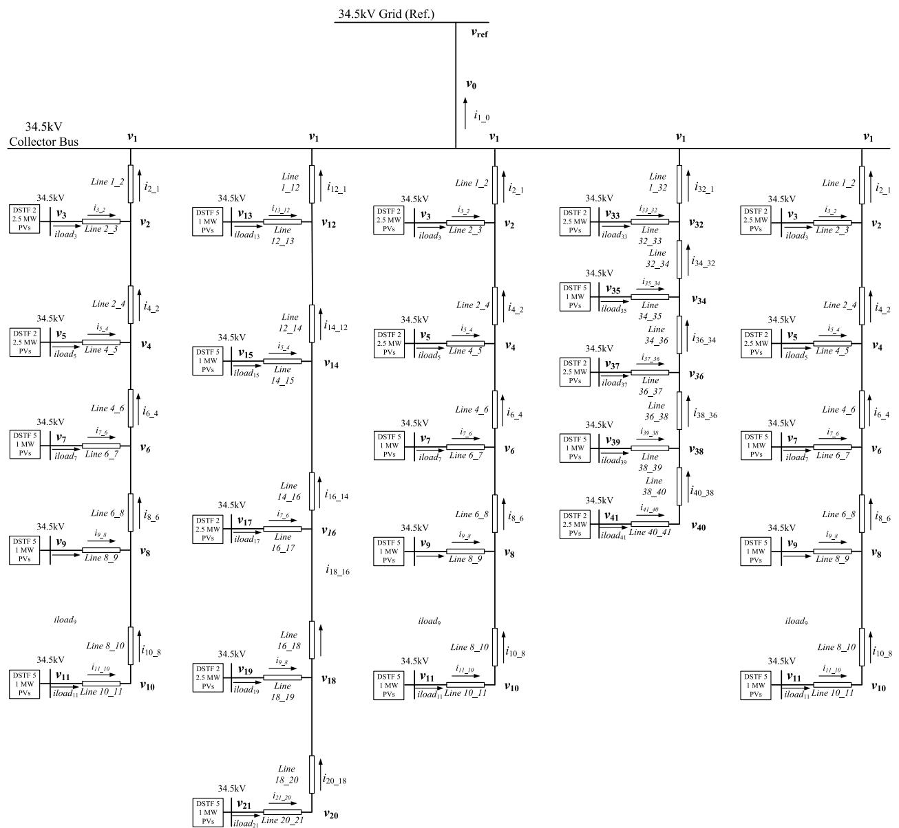  
Fig. 1: Detailed layout of a large-scale PV power plant.

collected on the mentioned components that are typically used within the PV plant. Based on the collected information and data, parameters of the components in the generic PV plant are determined such as transformer impedance, shunts, inductance and capacitance of feeder lines, filters’ inductance and capacitance within a PV system, inverter configuration, dc link capacitance, and PV array voltage-to-current relationship. Data on the control parameters of the inverters were obtained (typically from the vendors) and the data on the power plant controller (PPC) were obtained from the information on the plant. Once this information is collected, the distribution grid and PV system models are developed for the generic PV plants.

# A. Distribution Grid Model Development

In a PV plant, the distribution grid typically comprises several radial feeders connected in parallel to a collector

bus. These feeders can accommodate multiple PV systems. To model the distribution lines/cables within the grid, differential algebraic equations (DAEs) are employed, as outlined in [8]. The DAEs undergo discretization using secondorder trapezoidal integration, resulting in a linear system of equations denoted as A.x = b. The matrix A takes the form of an arrowhead or doubly bordered block-diagonal matrix. During electromagnetic transient (EMT) simulation, the linear equations necessitate a solution at each time-step, involving matrix factorization and matrix-vector operations such as LU decomposition with forward/backward substitution. With larger matrices, the computation time in EMT simulations increases.

To mitigate the computing time, the Kron reduction method is applied to the doubly bordered block-diagonal matrix A. This method reduces the size of the matrix being operated

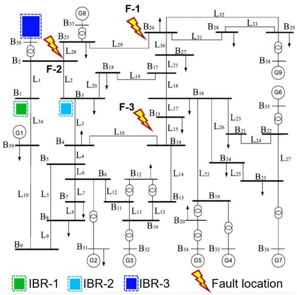  
Fig. 2: Layout of IEEE-39 bus system connected to three IBRs with different configurations

upon from the complete A matrix to the block diagonal submatrices contained within A. Consequently, the Kron reduction method significantly enhances the speed of EMT simulations.

# B. PV System Model Development

In the generic PV plant, two types of PV systems are present, referred to as PV system-1 rated at 1 MW and PV system-2 rated at 2.5 MW. The modeling of PV system-1 and PV system-2 incorporates various components such as transformer configuration, filter configurations, inverter circuit configurations, inverter controllers, and protection configurations in the controllers. A detailed explanation of the controller model is provided in the subsequent Section II-C. For the remaining hardware components in the PV systems, their models are constructed based on differential algebraic equations specific to each system. Simulation algorithms, including DAEs’ clustering and aggregation technique [9], multi-order discretization, and numerical stiffness-based hybrid discretization [8], are employed to further enhance the speed of EMT simulations.

# C. Controllers’ Model Development

Within the plant, there exists a PPC that connects to inverter controllers. Typically, the inverter controllers operate with a control time-step ranging from 50–100 µs, while the PPC employs a control time-step ranging from 100–1, 000 ms. In conventional power plants, the active power delivered by the inverters is determined based on available solar irradiance, while the reactive power is dependent on reference values transmitted from the PPC. The reactive power reference generated by the PPC for each inverter can vary based on the selected control mode, such as reactive power control, power factor control, or voltage control at the plant’s point of interconnection (POI). In the model specific to PV plant-1, a hierarchical control system is developed, incorporating

different control time-steps matching the real codes utilized in the inverter controllers (50–100 µs) and the PPC (100–1, 000 ms). Additionally, the hardware components within the PV plant are simulated using a different time-step. Furthermore, the inverter controllers include various protection features that are listed below alongside the multi-rate implementation

1) alternating current (ac) load side over-current protection,   
2) ac phase over-voltage protection, and   
3) direct current (dc) link over-voltage protection

# III. IEEE-39 BUS SYSTEM CONNECTED TO MULTIPLE PV PLANTS

# A. IEEE-39 Bus System Model with Three PV Plants

In this study, benchmark EMT model of IEEE 39-bus system with three PV plants is developed. The goal of this development is to replicate dynamics observed in PV plants in the real-world in regions with high-penetration of PV plants locally. The layout of the IEEE-39 bus system along with three different PV plants connected to it is shown in Fig. 2. Each PV plant has a different layout of inverter configurations and distribution grid configurations. PV plant-1 (IBR-1) and PV plant-2 (IBR-2) are rated at 125 MW each and PV plant-3 (IBR-3) is rated at 250 MW (i.e., 2 modules rated at 125 MW). The PV plants include different PV inverters rated at 1 MW and 2.5 MW. IBR-1 has 50 1 MW inverters and 30 2.5 MW inverters. IBR-2 has 25 1 MW inverters and 40 2.5 MW inverters. IBR-3 has total of 59 1 MW inverters and 54 2.5 MW inverters in both the modules. Module 1 contains 45 1 MW inverters and 32 2.5 MW inverters. Module 2 contains 70 1 MW inverters and 22 2.5 MW inverters. Each PV plant model consists of five radial feeders connected in parallel in the distribution grid with different configurations. IBR-1 has asymmetrical feeders (meaning feeders have different lengths) with asymmetrical lines (meaning lines within the feeder have different lengths). IBR-2 has asymmetrical feeders with symmetrical lines. IBR-3 has asymmetrical feeders with asymmetrical lines. The IBR-1, IBR-2, and IBR-3 are integrated into the IEEE-39 bus system at bus 1, bus 3, and bus 30 respectively. For power balance in the original IEEE-39 bus system, the synchronous generator at bus 30 is removed.

Based on the details provided in Section II and Section III, high-fidelity EMT dynamic models of the three PV plants with different configurations are developed and integrated with the IEEE-39 bus system model in PSCAD. The high-fidelity EMT dynamic models are custom-developed using Fortran in PSCAD.

# IV. CASE STUDIES AND SIMULATION RESULTS

The benchmark EMT model of the IEEE-39 bus with three PV plants is evaluated through the following test cases: a) lineto-line faults at different locations in the IEEE-39 bus system; and b) SCR variation in the IEEE-39 bus system.

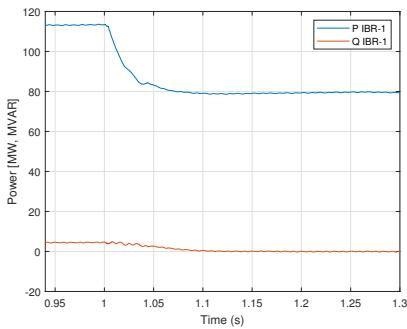

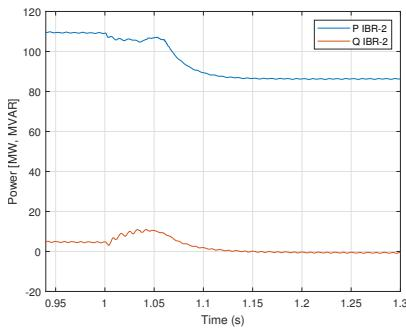  
(b)

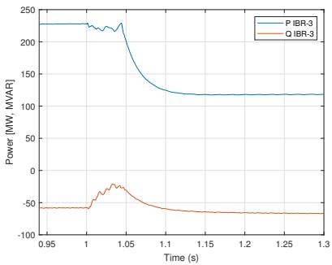

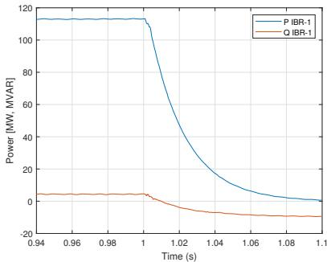  
Fig. 3: Simulation results (P and Q) three IBRs connected to IEEE-39 bus system at F-1 (a) IBR-1; (b) IBR-2; and (c) IBR-3

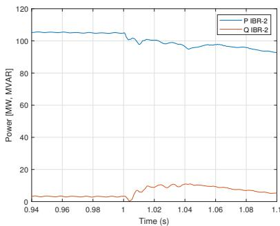  
(b)

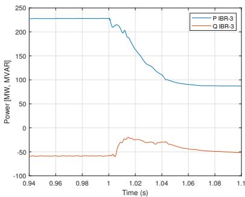  
(c)

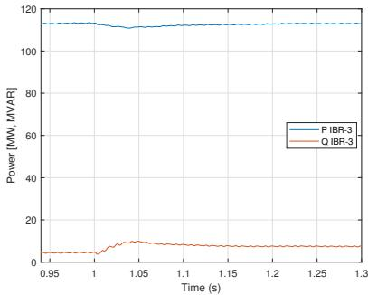  
Fig. 4: Simulation results (P and Q) three IBRs connected to IEEE-39 bus system at F-2 (a) IBR-1; (b) IBR-2; and (c) IBR-3

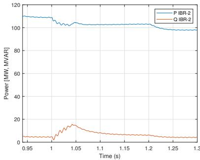  
(b)

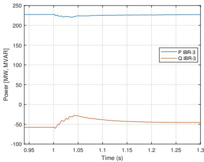

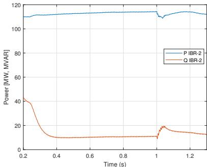  
Fig. 5: Simulation results (P and Q) three IBRs connected to IEEE-39 bus system at F-3 (a) IBR-1; (b) IBR-2; and (c) IBR-3

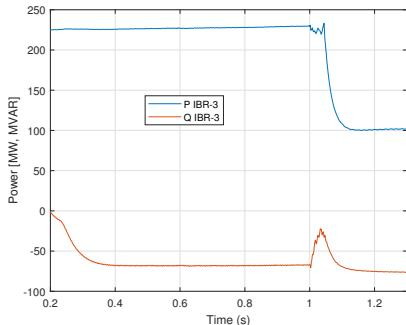  
(b)   
Fig. 6: Simulation results (P and Q) three IBRs connected to IEEE-39 bus system with lower SCR at F-1 (a) IBR-2; and (c) IBR-3

A. Line-to-line Faults at Different Locations in the IEEE-39 Bus System

In this test case, the performance of the three PV plants is tested for different faults that happened in the IEEE-39 bus

system at different fault locations. The different fault locations are fault location-1 (F-1 at $\mathrm { L _ { 2 9 } ) }$ , fault location-2 (F-2 at $\mathrm { L _ { 2 8 } ) }$ , and fault location-3 (F-3 at $\mathrm { L _ { 1 6 } } )$ as shown in Fig. 2. The IBR-

1 is operated at ∼115 MW, IBR-2 is operated at ∼110 MW, and IBR-3 is operated at ∼230 MW prior to the event in the IEEE-39 bus system. The event in the IEEE-39 bus system is line-to-line similar to that of the Angeles Forest event that occurred in Angeles Forest in CA in 2018 [3]. The fault at all locations is initiated at $\mathrm { t } = 0 . 9 9 3 2 \mathrm { s }$ . The performance of each of the PV plants during the event in the IEEE-39 bus system for different faults is shown in Figs. 3 - 5. From the figures, it is observed that PV plants are stable prior to the fault. The key observation made from Figs. 3 - 5 is that the partial power loss in the PV plant is mostly based on the vicinity of the fault to the PV plant. In the case of F-1, partial power loss of active power is observed in all three PV plants.The performance of the PV plants in this case is exactly the behavior observed in the real-world scenario when an event happens. In the case of real-world events as in [4], multiple PV plants in the vicinity of the event might partially shut down rather than shutting down completely. In the case of F-2, partial power loss of active power is observed in IBR-2 and IBR-3, and complete loss of active power in IBR-1. As the location of the fault is very close to IBR-1 and the length of the line is short, there is complete loss of power generation from IBR-1 is observed. In the case of F-3, minimal partial power loss of active power is observed in all three PV plants. Minimal power reduction is observed as the location of the fault is pretty far away from all the PV plants.

# B. Simulation Results for Different SCR in the IEEE-39 Bus System

In this case study, the short circuit ratio (SCR) of the IEEE-39 bus system is varied at the locations $\mathrm { B _ { 1 } , B _ { 3 } }$ , and $\mathrm { { B } _ { 3 0 } }$ where IBR-1, IBR-2, and IBR-3 are connected respectively and the performance of the PV plants when connected to weak systems (with lower short circuit strength) is captured in pre-fault and during fault conditions. The SCR in the system is changed based on varying the transmission line lengths between the PV plants and the IEEE-39 bus system. The emulation of lower SCR is done based on the process followed in [10]. The SCR originally at the buses where the IBR-1, IBR-2, and IBR-3 are connected to the IEEE-39 bus system is 25, 27.5, and 15 respectively. To emulate the weaker system scenario, the updated lower SCR at the buses where IBR-1, IBR-2, and IBR-3 are connected to the IEEE-39 bus system is 10, 9, and 8 respectively. A line-to-line fault at fault location-1 is initiated at $\mathrm { { \Delta t } = 1 s }$ . The active power and reactive power response from IBR-2 and IBR-3 are shown in Fig. 6. From the figure, it is observed that the active power output in IBR-$^ { 2 , }$ and IBR-3 is stable in the pre-fault condition. Prior to the fault, IBR-2 is operating at ∼115 MW, and IBR-3 is operating at ∼230 MW. During the fault, in the case of IBR-2, there is not much reduction in the active power during the line-to-line fault period. In IBR-3, there is a considerable amount of active power loss during the line-to-line fault. In comparison to the higher SCR case in Fig. 3c, the partial power loss in the IBR-3 in this case with lower SCR is higher.

# V. CONCLUSION

In this paper, the benchmark EMT model of the IEEE 39- bus system with three PV plants is presented. The benchmark model is tested for scenarios that are based on real-world events that were observed in the power grid. Each PV plant in this scenario is different with different configurations, different ratings, and different inverter layouts connected to the IEEE-39 bus system. The developed IEEE 39-bus system with three PV plants is tested under different test cases (events). In these test cases, the performance of the multiple PV plants for different faults in the IEEE-39 bus and different SCR in the IEEE-39 bus system was captured. From the simulation results, it is observed that the partial power reduction in the PV plants is dependent upon the vicinity of the fault in the system. If the fault is closer to the PV plants then partial power loss was observed in all the PV plants. The benchmark model, tested under faults, indicates partial loss of power generation from multiple PV plants in the IEEE 39-bus system. This observation is similar to the response observed in multiple PV plants when a fault happens in the power grid today in locations with high-penetration of PV plants locally. Therefore, these benchmark models might be useful for researchers in the development and testing of algorithms in operations to detect disturbances in the power grid and take reactive or predictive actions in the power grid and/or in the PV plant.

# ACKNOWLEDGMENT

Authors would like to thank Alireza Ghassemian for overseeing the project developments and providing guidance.

# REFERENCES

[1] NERC, “1,200 MW Fault Induced Solar Photovoltaic Resource Interruption Disturbance Report, ” 2017.   
[2] NERC, “900 MW Fault Induced Solar Photovoltaic Resource Interruption Disturbance Report, ” 2018.   
[3] NERC, “April and May 2018 Fault Induced Solar Photovoltaic Resource Interruption Disturbances Report,’ 2019.   
[4] NERC, “Improvements to Interconnection Requirements for BPS-Connected Inverter-Based Resources”, 2019.   
[5] B. -I. Craciun, T. Kerekes, D. S ˘ era, R. Teodorescu and A. Timbus, ´ ”Benchmark networks for grid integration impact studies of large PV plants,” 2013 IEEE Grenoble Conference, Grenoble, France, 2013, pp. 1-6, doi: 10.1109/PTC.2013.6652114.   
[6] Ibrahim Anwar Ibrahim, M.J. Hossain, “A benchmark model for low voltage distribution networks with PV systems and smart inverter control techniques”, Renewable and Sustainable Energy Reviews, Volume 166, 2022,112571.   
[7] Suman Debnath, Phani Marthi, Jongchan Choi, et.al, “EMT Simulation of Large PV Plant & Power Grid for Disturbance Analysis”, accepted in ISGT-LA 2023.   
[8] J. Choi and S. Debnath, ”Electromagnetic Transient (EMT) Simulation Algorithm for Evaluation of Photovoltaic (PV) Generation Systems,” 2021 IEEE Kansas Power and Energy Conference (KPEC), Manhattan, KS, USA, 2021, pp1-6.   
[9] S. Debnath and J. Choi, “Electromagnetic transient (EMT) Simulation Algorithms for Evaluation of Large-scale Extreme Fast Charging Systems (T & D models),” IEEE Transactions on Power Systems, pp. 1–11, 2022.   
[10] P. R. V. Marthi, S. Debnath and M. L. Crow, ”Synchronverter-based Control of Multi-Port Autonomous Reconfigurable Solar Plants (MARS),” 2020 IEEE Energy Conversion Congress and Exposition (ECCE), Detroit, MI, USA, 2020, pp. 5019-5026.