# 基于多频率相量模型的动态同步相量测量算法

白莎，符玲\*，熊思宇，麦瑞坤

(西南交通大学电气工程学院，四川省成都市610031)

# Dynamic Synchrophasor Estimator Based on Multi-frequency Phasor Model

BAI Sha, FU Ling*, XIONG Siyu, MAI Ruikun

(College of Electrical Engineering, Southwest Jiaotong University, Chengdu 610031, Sichuan Province, China)

ABSTRACT: When the power system was suffered from unbalance and fault, the fundamental frequency would deviate from the nominal frequency, and the measurement accuracy of synchrophasor estimator also would rapidly reduce. Therefore, a dynamic synchrophasor estimator was proposed based on multi-frequency phasor model. The multi-frequency phasor model was employed to reflect the effective information around real frequency, and to establish a phasor model including multi-frequency phasor. The accuracy phasor value could be obtained by estimating rough frequency, looking the matrix table calculated offline, revising the discrete Fourier transform (DFT) value and shifting phasor. Test results of both simulated signals and PSCAD/EMTDC generated signal show that the proposed estimator can provide accurate phasor estimations under dynamic conditions of frequency ramping and power oscillation at the cost of limited increase of computational burden.

KEY WORDS: frequency deviation; synchrophasor estimator; multi-frequency phasor model; discrete Fourier transform (DFT); PSCAD/EMTDC simulation

摘要：电力系统中由于发电出力与负载不平衡导致基波频率偏移，进而造成同步相量测量精度迅速下降。基于此，该文提出基于多频率相量模型的动态同步相量测量算法。首先，算法利用多个不同旋转频率的子相量来描述真实频率附近的有效信息，并以此对动态相量进行建模；其次，通过计算粗估频率、调用离线矩阵、修正离散傅里叶变换结果及相移运算等步骤来获得精确的相量测量值。最后，仿真结果表明，算法虽然增加了有限的运算量，但在频率斜坡变化、功率振荡等动态工况中，能够减小频率偏移带来的不利影响，提供准确的测量结果。

关键词：频率偏移；同步相量测量；多频率相量模型；离散傅里叶变换；PSCAD/EMTDC仿真

# 0 引言

作为广域测量系统的基础和核心，同步相量测量单元(phasor measurement unit，PMU)被广泛安装以获得电网全局动态变化特性[1-4]，其算法的精确性将直接影响到广域测量系统的高级应用性能[5-8]。同时随着电网规模的不断扩大，电力系统中负荷波动、电力故障等都可能引起基波频率大范围偏移和电压、电流幅值振荡，造成同步相量测量算法出现非同步采样，测量精度下降[9-11]。

上述问题使得响应速度快、计算简便的离散傅里叶变换(discrete Fourier transform，DFT)算法，在信号测量时受到很大限制，因此有学者提出泰勒级数法[12-15]和插值法[16-18]来改善DFT的测量结果。泰勒级数法在动态工况下有较好的性能体现，文献[12]提出基于泰勒模型的动态相量测量算法，详尽地讨论了泰勒阶数取值对算法的影响，并在低频振荡仿真中取得良好的测量结果；文献[13-14]在泰勒模型的参数求解上分别利用时域和时频信息对信号进行处理，利用离线矩阵对DFT结果进行修正，减少了相应的运算量，在抗噪和响应时间等方面也取得不错的效果；为了更进一步地优化算法性能，文献[15]综合考虑泰勒模型在时域、频域的数据信息通过自适应切换，其切换条件是通过计算相量估计值，反推各采样点的理论值，并与实测值进行比较，该自适应算法兼顾时域噪声和频域精度，综合性能表现优良。但这类泰勒算法没有考虑信号频率大范围偏移带来的影响，因此应用存在一定局限。插值法则利用DFT后的谱线信息获得高精度的

测量结果，文献[16]采用多点插值法，详细地推导了不同插值点数下的多项式，利用多项式校正DFT的测量结果，其测量结果精度高，在噪声工况中仍有较好的性能表现；文献[17]同样是基于DFT插值的同步相量测量算法，更进一步地研究了不同基波周期长度、数据窗对算法的性能影响；文献[18]则预先对信号的频率进行插值，获得较为准确的频率结果后，将其代入泰勒模型中，扩大了泰勒模型应用范围。虽然插值法在精度方面有一定优势，但算法需要性能优良的窗函数和较多的采样点数配合，因此增加了运算负担。为了拓宽泰勒级数法的应用面，同时优化插值法的运算量，文献[19]建立动态相量建模的虚指数基函数模型，将干扰信号模型加入优化目标实现对特定波形的陷波，能够有效抑制衰减直流分量或间谐波，但当基波频率出现较大偏移时，算法对基波频率的动态跟踪缺乏灵活性。

基于此，考虑电力系统基波频率出现较大偏移的情况下，兼顾算法的测量精度、运算量以及抗噪能力，本文提出基于多频率相量模型的动态同步相量测量算法。算法利用粗估频率的方式动态地调整子相量的旋转频率，实现动态同步相量测量，在增加少量运算量的前提下，提高相量测量精度。

# 1 多频率相量模型的建立

考虑基波频率偏移的动态工况下，建立由多个不同旋转频率的子相量构成的模型，基波相量 $X(t)$ 和电力信号 $x(t)$ 表达式分别为：

$$
\boldsymbol {X} (t) = \sum_ {m = - M} ^ {M} \sqrt {2} \boldsymbol {A} _ {m} \mathrm {e} ^ {\mathrm {j} 2 \pi (\hat {f} _ {0} + m \Delta f) t} \tag {1}
$$

$$
x (t) = \sqrt {2} \operatorname {R e} (X (t)) \tag {2}
$$

式中： $\hat{f}_0$ 表示粗估频率； $\Delta f$ 表示子相量之间的频率间隔； $A_m$ 表示第 $m$ 个子相量的低频带限相量，当 $m = 0$ 时，对应的相量 $\sqrt{2} A_0 \mathrm{e}^{\mathrm{j}2\pi \hat{f}_0 t}$ 为中心子相量； $M$ 表示以中心子相量正负频偏展开的子相量个数； $2M + 1$ 则为子相量的总数； $\operatorname{Re}(\cdot)$ 表示取实部。若以采样频率 $f_s$ ，对连续信号 $x(t)$ 进行离散处理，可得序列 $x(n)$ ：

$$
\begin{array}{l} x (n) = \sqrt {2} \operatorname {R e} (X (n)) = \\ \sum_ {m = - M} ^ {M} A _ {m} \mathrm {e} ^ {\mathrm {j} \left(\hat {\omega} _ {0} + m \Delta \omega\right) n} + \sum_ {m = - M} ^ {M} A _ {m} ^ {*} \mathrm {e} ^ {- \mathrm {j} \left(\hat {\omega} _ {0} + m \Delta \omega\right) n} \tag {3} \\ \end{array}
$$

式中：采样点 $n = tf_{s}$ ；上标“*”表示共轭运算；角

频率为 $\hat{\omega}_0 + m\Delta \omega = 2\pi (\hat{f}_0 + m\Delta f) / f_{\mathrm{s}}$

# 2 模型参数的求解

如图1所示，假设单个周波内的采样点数为 $N$ 以等效窗的几何中心位置 $l_{\mathrm{mid}_p}$ 为参考点，所加数据窗为 $h(n)$ ，经傅里叶变换可得相量 $\hat{\boldsymbol{X}} (l_{\mathrm{mid}_p})$ ：

$$
\begin{array}{l} \hat {X} \left(l _ {\text {m i d} p}\right) = \sum_ {n = \frac {- N + 1}{2}} ^ {\frac {N - 1}{2}} x \left(n + l _ {\text {m i d} p}\right) h (n) e ^ {- j \omega_ {0} \left(n + l _ {\text {m i d} p}\right)} = \\ \sum_ {n = \frac {- N + 1}{2}} ^ {\frac {N - 1}{2}} h (n) \sum_ {m = - M} ^ {M} A _ {m} \mathrm {e} ^ {\mathrm {j} \left(\hat {\omega} _ {0} + m \Delta \omega - \omega_ {0}\right) \left(n + l _ {\text {m i d .} p}\right)} + \sum_ {n = \frac {- N + 1}{2}} ^ {\frac {N - 1}{2}} h (n) \cdot \\ \sum_ {m = - M} ^ {M} A _ {m} ^ {*} \mathrm {e} ^ {- \mathrm {j} \left(\hat {\omega} _ {0} + m \Delta \omega + \omega_ {0}\right) \left(n + l _ {\text {m i d} p}\right)} = C A + D A ^ {*} \tag {4} \\ \end{array}
$$

式中：DFT滤波频率 $\omega_0 = 2\pi f_0 / f_s$ ，其中 $f_{0}$ 为基波频率50或 $60\mathrm{Hz}$ ；相量矩阵 $A = [A_{-M}A_{-M + 1}\dots A_M]$ ；将旋转因子和数据窗整合形成 $H(l_{\mathrm{mid}_p},\omega) = \sum_{n = (-N + 1) / 2}^{(N - 1) / 2}h(n)\mathrm{e}^{-\mathrm{j}\omega (n + l_{\mathrm{mid}_p})}$ ，相量矩阵 $C$ 和 $\pmb{D}$ 是关于函数 $H(l_{\mathrm{mid}_p},\omega)$ 的相量矩阵，分别为：

$$
\boldsymbol {C} = \left[ \begin{array}{c} \boldsymbol {H} \left(l _ {\text {m i d} _ {p}}, \omega_ {0} - \hat {\omega} _ {0} + M \Delta \omega\right) \\ \boldsymbol {H} \left(l _ {\text {m i d} _ {p}}, \omega_ {0} - \hat {\omega} _ {0} + (M - 1) \Delta \omega\right) \\ \vdots \\ \boldsymbol {H} \left(l _ {\text {m i d} _ {p}}, \omega_ {0} - \hat {\omega} _ {0} - M \Delta \omega\right) \end{array} \right] ^ {\mathrm {T}} \tag {5}
$$

$$
\boldsymbol {D} = \left[ \begin{array}{c} \boldsymbol {H} \left(l _ {\text {m i d} _ {p}}, \hat {\omega} _ {0} - \omega_ {0} - M \Delta \omega\right) \\ \boldsymbol {H} \left(l _ {\text {m i d} _ {p}}, \hat {\omega} _ {0} - \omega_ {0} - (M - 1) \Delta \omega\right) \\ \vdots \\ \boldsymbol {H} \left(l _ {\text {m i d} _ {p}}, \omega_ {0} - \hat {\omega} _ {0} + M \Delta \omega\right) \end{array} \right] ^ {\mathrm {T}} \tag {6}
$$

进一步分析相量矩阵 $C$ 和 $D$ ，可知算法不仅利用了粗估频率 $\hat{f}_0$ 的数据信息，主要体现在 $\hat{\omega}_0$ 上；还包括 $\hat{f}_0$ 相邻频点的频域信息，体现在 $m\Delta \omega$ 上。为便于求解模型参数，分离相量矩阵虚部和实部，

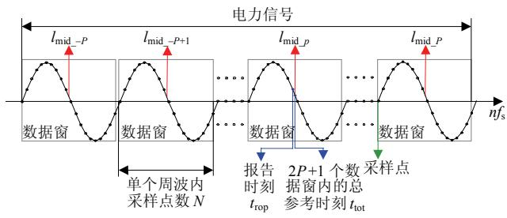  
图1 数据窗与参考时刻关系图  
Fig. 1 Relationship between data window and reference time

即 $\hat{X} = \hat{X}_{\mathrm{R}} + \mathrm{j}\hat{X}_{\mathrm{I}}, C = C_{\mathrm{R}} + \mathrm{j}C_{\mathrm{I}}, D = D_{\mathrm{R}} + \mathrm{j}D_{\mathrm{I}}, A = A_{\mathrm{R}} + \mathrm{j}A_{\mathrm{I}}$ ，可得：

$$
\left[ \begin{array}{l} \hat {\boldsymbol {X}} _ {\mathrm {R}} \\ \hat {\boldsymbol {X}} _ {\mathrm {I}} \end{array} \right] = \left[ \begin{array}{l l} \boldsymbol {C} _ {\mathrm {R}} + \boldsymbol {D} _ {\mathrm {R}} & - \boldsymbol {C} _ {\mathrm {I}} + \boldsymbol {D} _ {\mathrm {I}} \\ \boldsymbol {C} _ {\mathrm {I}} + \boldsymbol {D} _ {\mathrm {I}} & \boldsymbol {C} _ {\mathrm {R}} - \boldsymbol {D} _ {\mathrm {R}} \end{array} \right] \left[ \begin{array}{l} \boldsymbol {A} _ {\mathrm {R}} \\ \boldsymbol {A} _ {\mathrm {I}} \end{array} \right] \tag {7}
$$

假设待求参数 $A$ 对应的时刻为图1中对应的总参考时刻 $t_{\mathrm{tot}}$ ，由于模型中一共有 $2M + 1$ 个未知量，需联立相邻数据窗的DFT结果共同求解，当数据窗的数量与未知量的数量满足 $2P + 1 \geq 2M + 1$ 时才能进行求解。此外，相邻数据窗的DFT结果一方面可以为计算粗估频率提供数据，另一方面可以保存下来用于其他参考时刻对参数 $A$ 的求解。

将式(7)重新简写为式(8)，采用最小二乘拟合可得所求相量矩阵 $A$

$$
\hat {X} = G A \tag {8}
$$

$$
\boldsymbol {A} = \left(\boldsymbol {G} ^ {\mathrm {T}} \boldsymbol {G}\right) ^ {- 1} \boldsymbol {G} ^ {\mathrm {T}} \hat {\boldsymbol {X}} = \boldsymbol {F} \hat {\boldsymbol {X}} \tag {9}
$$

$A$ 矩阵中的各个元素表示为 $A_{m}$ ，对其求和 $\sum_{m = -M}^{M}A_{m}$ 获得最终相量测量值。需要说明的是，矩阵 $\pmb{F}$ 是与 $C,D$ 矩阵相关的，而矩阵 $C,D$ 又与粗估频率 $\hat{f}_0$ 和子相量旋转频率之间的间隔 $\Delta f$ 有关。若粗估频率 $\hat{f}_0$ 保持为整数，且设定固定的 $\Delta f$ ，则矩阵 $\pmb{F}$ 可离线存表，计算时按粗估频率调用即可修正DFT估计值，从而可减少算法在线运算量。

# 3 粗估频率的计算

设 $X_{\mathrm{L1}}$ 和 $X_{\mathrm{L2}}$ 为不同数据窗下DFT测量结果的求和，表示为 $X_{\mathrm{L1}} = \sum_{k = -P}^{-1}\hat{X} (l_{\mathrm{mid\_k}})$ ， $X_{\mathrm{L2}} = \sum_{k = 1}^{P}\hat{X} (l_{\mathrm{mid\_k}})$ 利用该结果提供电力信号大致频率，根据频率定义公式，由相位差 $\Delta \varphi$ 与时间差 $\Delta t$ 的比值可得：

$$
\Delta \varphi = \operatorname {a n g l e} \left(\boldsymbol {X} _ {\mathrm {L} 1} \cdot \boldsymbol {X} _ {\mathrm {L} 2} ^ {*}\right) \tag {10}
$$

$$
\hat {f} _ {0} = \operatorname {r o u n d} \left(f _ {0} + \frac {\Delta \varphi}{2 \pi \Delta t}\right) \tag {11}
$$

式中 $\Delta t = (\sum_{k=1}^{P} t_{\mathrm{mid}_k} - \sum_{k=-P}^{-1} t_{\mathrm{mid}_k}) / P$ ，其中 $t_{\mathrm{mid}_k}$ 为第 $k$ 个数据窗的参考时刻，粗估频率利用四舍五入函数 round() 进行取值。

此外，计算粗估频率主要利用的是DFT结果，而频率发生较大偏移时，DFT结果有一定的测量误差，因此有必要分析粗估频率对最终测量结果的影响。根据标准[20]，设置一幅值振荡工况，信号的基

波频率为 $47.5 \mathrm{~Hz}$ , 振荡频率为 $5 \mathrm{~Hz}$ 。从图 2 可以看出, 当基波频率为 $47.5 \mathrm{~Hz}$ 时, 通过 DFT 测量结果计算的频率值在真实频率上下波动, 取整运算后得到粗估频率。粗估频率存在两种可能取值, 分别为 47 和 $48 \mathrm{~Hz}$ 。测量结果如图 3 所示, 无论粗估频率取值为 47 或 $48 \mathrm{~Hz}$ , 测量结果均能满足测量标准。

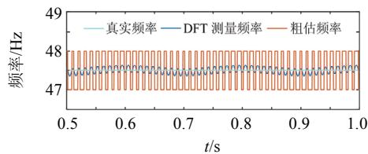  
图2 粗估频率测量误差

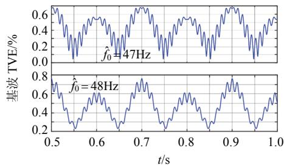  
Fig. 2 Measurement error of rough frequency   
图3 粗估频率对结果的影响  
Fig. 3 The influence of rough frequency

# 4 报告时刻相移运算

在算法的工程应用中，由于数据窗采样时刻 $t_{\mathrm{tot}}$ 与报告时刻 $t_{\mathrm{rep}}$ 不重合，因此需要对 $t_{\mathrm{tot}}$ 时刻所得的相量测量结果通过相移运算进行校正。

$$
\hat {A} = \sum_ {m = - M} ^ {M} A _ {m} \mathrm {e} ^ {\mathrm {i} \delta} \tag {12}
$$

式中 $\delta = 2\pi f\Delta \tau$ ，其中 $\Delta \tau = (t_{\mathrm{rep}} - t_{\mathrm{tot}})f_{\mathrm{s}}$ ， $f$ 为当前时刻的频率。

# 5 运算步骤及运算量分析

本文提出的多频率相量模型(multi-frequency phasor model，MFPM)主要从以下三方面进行：初始化部分参数后，首先经DFT后获得不同数据窗下的估计值 $\hat{X}(l_{\mathrm{mid}_P})$ ；然后计算求和结果 $X_{\mathrm{L1}}$ 和 $X_{\mathrm{L2}}$ ，获得粗估频率 $\hat{f}_0$ ；最后根据粗估频率调用离线矩阵 $F$ 数据，经矩阵运算和相移运算后获得相量矩阵 $\hat{A}$ ，输出测量结果。算法流程如图4所示。

运算量方面，文献[13]提出的动态相量测量算法(dynamic phasor measurement algorithm, DPMA)，同样先利用DFT结果，然后调用离线矩阵进行修

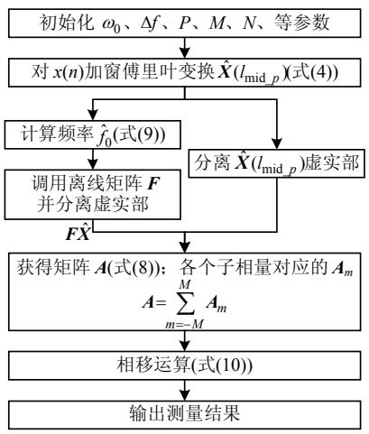  
图4 算法流程框图  
Fig. 4 Flow chart of algorithms MFPM

正，与MFPM算法运算量对比如表1所示。表中， $K$ 为DPMA算法中所用泰勒级数的最高阶数。若DPMA算法的泰勒阶数 $K$ 越高，算法的测量精度越高，结合表1可知，公式(8)中所用的离线矩阵会越大，因此算法的运算量也会越大；同样地，MFPM算法随着子相量个数 $M$ 的增加，利用的数据信息增多，其测量精度越高，其运算负担也会增大。此外，由于MFPM算法考虑了电力信号的频率偏移，故增加计算频率公式(10)的运算量，用于计算各个子相量对应的离线矩阵。

表 1 算法运算量对比  
Tab. 1 Computations of algorithms   

<table><tr><td rowspan="2" colspan="2">公式</td><td colspan="3">算法运算量</td></tr><tr><td>DFT</td><td>DPMA</td><td>MFPM</td></tr><tr><td rowspan="2">式(4)</td><td>加法</td><td>2(N-1)</td><td>2(N-1)</td><td>2(N-1)</td></tr><tr><td>乘法</td><td>2N</td><td>2N</td><td>2N</td></tr><tr><td rowspan="2">式(8)</td><td>加法</td><td>0</td><td>2(K+1)·2P</td><td>2(2M+1)·2P</td></tr><tr><td>乘法</td><td>0</td><td>2(K+1)(2P+1)</td><td>2(2M+1)(2P+1)</td></tr><tr><td rowspan="2">式(10)</td><td>加法</td><td>0</td><td>0</td><td>3M+2P+2</td></tr><tr><td>乘法</td><td>0</td><td>0</td><td>3</td></tr></table>

相比之下，MFPM算法仅会增加少量的运算量，例如当泰勒阶数 $K = 2$ ，子相量总数为3(即 $M = 1$ ），数据窗个数为3(即 $P = 1$ )时，式(8)中两种算法的运算量相等；MFPM算法在式(10)中增加加法7次，乘法3次，可忽略不计。

# 6 仿真结果及分析

为了验证算法性能，选择DPMA算法和文献[21]中所提出的CT-DFT算法与本算法进行幅值误差、相角误差以及总相量误差(total vector error, TVE)三方面对比，其中TVE是表征真实相量与测

量相量之间的误差指标[20]，其表达式为

$$
\mathrm {T V E} (n) = \sqrt {\frac {\left(\hat {X} _ {\mathrm {r}} (n) - X _ {\mathrm {r}} (n)\right) ^ {2} + \left(\hat {X} _ {\mathrm {i}} (n) - X _ {\mathrm {i}} (n)\right) ^ {2}}{\left(X _ {\mathrm {r}} (n)\right) ^ {2} + \left(X _ {\mathrm {i}} (n)\right) ^ {2}}} \tag {13}
$$

式中： $X_{\mathrm{r}}(n)$ 、 $X_{\mathrm{i}}(n)$ 分别为相量真实值在时刻 $n$ 处的实部、虚部； $\hat{X}_{\mathrm{r}}(n)$ 、 $\hat{X}_{\mathrm{i}}(n)$ 分别为相量测量值在时刻 $n$ 处的实部、虚部。

MFPM算法及其对比算法的参数设置为：单个周波内的采样点数为 $N$ 保持为48，采样频率 $f_{\mathrm{s}} = 2400\mathrm{Hz}$ ；兼顾运算量，选择子相量个数为3(即 $M = 1$ ），泰勒阶数为 $K = 2$ ；所加数据窗类型为矩形窗；在选择数据窗数量时，不仅需考虑实际电力信号中噪声影响，还要满足测量标准对响应时间的要求，不同数据窗数量对应的阶跃响应时间如表2所示。

ms

表 2 不同数据窗下的响应时间  
Tab. 2 response time under different windows   

<table><tr><td rowspan="2">阶跃</td><td colspan="4">数据窗数量</td><td rowspan="2">标准</td></tr><tr><td>3</td><td>5</td><td>7</td><td>9</td></tr><tr><td>10%的幅值阶跃</td><td>16.684</td><td>37.551</td><td>52.441</td><td>68.903</td><td>140</td></tr><tr><td>10°的相角阶跃</td><td>28.876</td><td>72.809</td><td>113.469</td><td>152.902</td><td>140</td></tr></table>

从表2可以看出，标准对应的幅值和阶跃响应时间为 $140\mathrm{ms}$ ，故选择数据窗数量为7最为恰当；同时为考虑离线矩阵所占用的内存容量，设置子相量之间旋转频率的间隔为 $\Delta f = 1\mathrm{Hz}$ 。

# 6.1 静态测试

为检验算法在基频固定偏移时对电力信号的适应性和准确性，因此设置信号的静态模型为

$$
x (t) = \cos [ 2 \pi \left(f _ {0} + \Delta f ^ {\prime}\right) t ] \tag {14}
$$

式中 $f_{0}$ 为系统正常运行时的基波频率 $50 \mathrm{~Hz}$ , 设基波频率偏移 $\Delta f^{\prime}$ 的取值从 $-5 \mathrm{~Hz}$ 到 $5 \mathrm{~Hz}$ , 间隔固定为 $1 \mathrm{~Hz}$ , 即基波频率分别为 $45 、 46 、 \cdots 、 55 \mathrm{~Hz}$ , 运行时间为 $2 \mathrm{~s}$ 。

图5为2s内电力信号静态运行的各项误差对比图，DPMA算法基波频率偏移较小时，能够给出较为准确的测量结果，但在频率偏移较大时，表现出了算法的局限性，在45和 $55\mathrm{Hz}$ 时TVE误差在 $8\%$ 左右，不能满足测量要求；相比之下，CT-DFT算法和MFPM算法的性能表现更为平稳和精准，当基波频率偏移较大工况时，也能满足测量要求。进一步分析MFPM算法，当基波频率为 $46\mathrm{Hz}$ 时，假设根据DFT相量结果计算的频率在 $46\mathrm{Hz}$ 左右，粗估频率取整后为 $46\mathrm{Hz}$ ，则3个子相量的旋转频率分别为45、46、 $47\mathrm{Hz}$ ，保证了频率信息分布在真实

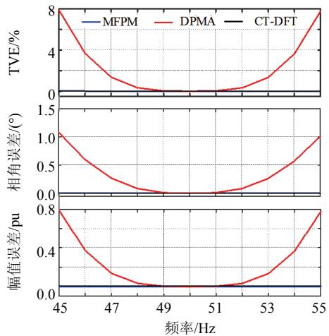  
图5 静态工况下各项误差  
Fig. 5 Measurement error of algorithm under steady state频率周围，因此能提供更为满意的测量结果。

# 6.2 斜坡测试

当信号受到外界的持续扰动时，频率难以保持在某一定值，因此利用一频率线性变化信号来比较算法之间的性能。

$$
x (t) = \cos [ 2 \pi \left(f _ {0} + \Delta f ^ {\prime} + R t\right) t ] \tag {15}
$$

设置基波频率偏移 $\Delta f^{\prime}$ 为 $-5\mathrm{Hz}$ , 算法运行时间为 $0 \sim 10 \mathrm{~s}$ , 频率变化率 $R = 1 \mathrm{~Hz} / \mathrm{s}$ , 即信号在 $0 \sim 10 \mathrm{~s}$ 时间内, 基波频率从 $45 \mathrm{~Hz}$ 到 $55 \mathrm{~Hz}$ 线性变化。图 6 为基波频率线性工况误差对比图。

如图6所示，5s处对应的基波频率为 $50\mathrm{Hz}$ 当基波频率偏离 $50\mathrm{Hz}$ 时，DPMA算法的测量误差随时间的变化而急剧增大。在0和10s时，基波频率分别对应45和 $55\mathrm{Hz}$ ，各项测量误差达到最大值。考虑了频率偏移的CT-DFT算法和MFPM算法各项

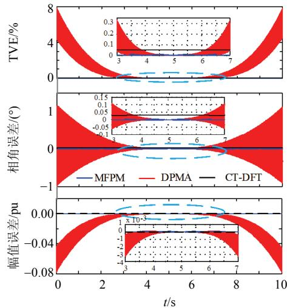  
图6 基波频率线性工况下误差图  
Fig. 6 Measurement error of algorithm response to a linear ramp

误差曲线更为平稳,且 MFPM 算法不仅通过粗估频率弥补了频率偏移给测量带来的影响，还利用了 3 个子相量的数据信息，因此具有更高的测量精度。

# 6.3 振荡测试

电力系统振荡通常会引起联络线过流跳闸、系统与系统和机组与系统之间的失步而解列，严重威胁电力系统的稳定[22]。根据同步相量测量标准[20]，考虑低频振荡的基础上甚至电力系统中更加剧烈的扰动，设置信号模型为

$$
x (t) = \left[ 1 + k _ {x} \cos (\omega t) \right] \cdot \cos \left[ \omega_ {0} t + k _ {a} \cos (\omega t) \right] \tag {16}
$$

当 $k_{x} = 1$ 、 $k_{a} = 0$ 时为幅值振荡；当 $k_{x} = 0$ 、 $k_{a} = 1$ 时为频率振荡；其中 $\omega = 2\pi R$ 为振荡角频率， $R$ 为振荡频率， $R$ 的取值分别为 1、2、3、4、5Hz，运行时间 $0 \sim 2s$ 。

图7为频率振荡工况下的TVE变化图，从图中可以看出，振荡频率越大，测量误差也随之增大，对45、47.5和 $50\mathrm{Hz}$ 的各项误差最大值进行统计，结果如表3所示。

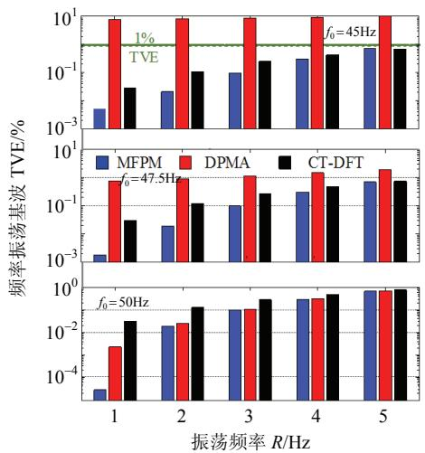  
图7 频率振荡工况下的TVE变化图  
Fig. 7 TVE of algorithm under oscillating with frequency

表 3 频率振荡工况下的算法误差对比表  
Tab. 3 Measurement error of algorithm under oscillating with frequency   

<table><tr><td></td><td>算法</td><td>基波频率 45Hz</td><td>基波频率 47.5Hz</td><td>基波频率 50Hz</td></tr><tr><td rowspan="3">DPMA</td><td>TVE/%</td><td>11.1224</td><td>2.2937</td><td>0.6459</td></tr><tr><td>幅值误差/pu</td><td>0.1111</td><td>0.0229</td><td>0.0032</td></tr><tr><td>相角误差/(°)</td><td>2.5018</td><td>0.9152</td><td>0.3674</td></tr><tr><td rowspan="3">MFPM</td><td>TVE/%</td><td>0.6414</td><td>0.6435</td><td>0.6284</td></tr><tr><td>幅值误差/pu</td><td>0.0036</td><td>0.0021</td><td>0.0018</td></tr><tr><td>相角误差/(°)</td><td>0.3647</td><td>0.3645</td><td>0.3565</td></tr><tr><td rowspan="3">CT-DFT</td><td>TVE/%</td><td>0.6752</td><td>0.7509</td><td>0.7756</td></tr><tr><td>幅值误差/pu</td><td>0.0002</td><td>0.0001</td><td>0.0000</td></tr><tr><td>相角误差/(°)</td><td>0.3868</td><td>0.4302</td><td>0.4444</td></tr></table>

从表3中可以看出，频率偏移越大，对DPMA算法影响越大。在 $45\mathrm{Hz}$ 时，DPMA算法TVE最大误差在 $11\%$ 左右，超出测量标准要求。同样情况下，CT-DFT算法和MFPM算法受频率偏移的影响较小，其中CT-DFT算法最大TVE为 $0.7756\%$ ，MFPM算法最大TVE在 $0.6435\%$ 。由此可以看出，CT-DFT算法和MFPM算法对动态情况下的频率偏移仍能提供良好的测量结果。

图8是幅值振荡工况下的TVE变化图，表4是幅值振荡工况下的测量误差统计结果。幅值振荡工况的各项测量结果变化趋势类似于频率振荡工况，在频率偏移较大情况下，DPMA算法和CT-DFT算法TVE不能满足测量要求，超出标准规定的 $1\%$ 而MFPM算法的各项误差仍能保持较高的测量精度，TVE测量结果保持在 $0.7\%$ 左右满足测量标准。

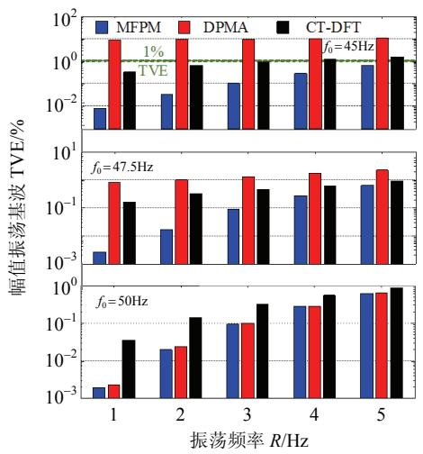  
图8 幅值振荡工况下的TVE变化图  
Fig. 8 TVE of algorithm under oscillating with amplitude

表 4 幅值振荡工况下的算法误差对比表  
Tab. 4 Measurement error of algorithm under oscillating with amplitude   

<table><tr><td></td><td>算法</td><td>基波频率 45Hz</td><td>基波频率 47.5Hz</td><td>基波频率 50Hz</td></tr><tr><td rowspan="3">DPMA</td><td>TVE/%</td><td>10.0214</td><td>1.9688</td><td>0.6969</td></tr><tr><td>幅值误差/pu</td><td>0.1102</td><td>0.0216</td><td>0.0063</td></tr><tr><td>相角误差(°)</td><td>2.8570</td><td>0.9017</td><td>0.0978</td></tr><tr><td rowspan="3">MFPM</td><td>TVE/%</td><td>0.7173</td><td>0.7113</td><td>0.6722</td></tr><tr><td>幅值误差/pu</td><td>0.0065</td><td>0.0064</td><td>0.0061</td></tr><tr><td>相角误差(°)</td><td>0.1099</td><td>0.0546</td><td>0.0946</td></tr><tr><td rowspan="3">CT-DFT</td><td>TVE/%</td><td>1.5262</td><td>0.901</td><td>0.8618</td></tr><tr><td>幅值误差/pu</td><td>0.0092</td><td>0.0081</td><td>0.0078</td></tr><tr><td>相角误差(°)</td><td>0.8722</td><td>0.432</td><td>0.0001</td></tr></table>

结合频率振荡和幅值振荡两种工况下的测量结果，相比DPMA算法和CT-DFT算法，频率偏移较大时，MFPM算法的测量精度更具优势。

# 6.4 噪声测试

由于受周围环境、设备影响，实际电力信号可能混入噪声从而干扰算法精度，因此有必要进行噪声测试，设置含白噪声信号模型为

$$
x (t) = \cos [ 2 \pi \left(f _ {0} + \Delta f ^ {\prime}\right) t ] + \operatorname {n o i s e} (t) \tag {17}
$$

式中：noise(t)是信噪比为60dB的噪声信号；频率偏移设置为 $\Delta f' = -1\mathrm{Hz}$ ；运行时间 $0\sim 1\mathrm{s}$ 。

仿真结果如图9所示，DPMA算法各项误差波动较大，相比之下，CT-DFT算法和MFPM算法更能在噪声工况下提取信号信息，其测量结果较为平稳、精度更高。

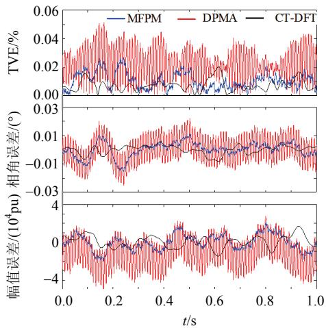  
图9 噪声工况下加频偏的测量误差  
Fig. 9 Measurement error of algorithm when adding white noise under frequency deviation

# 6.5 PSCAD/EMTDC仿真测试

本文利用PSCAD/EMTDC建立输电线路仿真模型，模型主要包括一台发电机、两回输电线路以及模拟无穷大系统的理想电源，具体参数和构成如图10所示。其运行过程是在1.5s时，对发电机转子施加扰动以产生功率振荡，运行总时间为 $0\sim 4s$ 截取 $2\sim 4s$ 功率振荡的部分仿真波形进行分析，如图11所示。

分别利用DPMA、CT-DFT和MFPM3种算法

图10 PSCAD/EMTDC仿真模型  
Fig. 10 A PSCAD/EMTDC model of a power system   
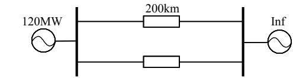  
$R_{0} = 0.3\Omega /\mathrm{km},$ $L_{0} = 3.6371\mathrm{mH / km}$ $G_0 = 10^{-7}\mathrm{S / km}$   
$C_0 = 6.0161\times 10^{-9}\mathrm{F / km};$ $R_{\mathrm{l}} = 0.0347\Omega /\mathrm{km},L_{\mathrm{l}} = 1.3476\mathrm{mH / km},$   
$G_{1} = 10^{-7}\mathrm{S / km},$ $C_1 = 9.6771\times 10^{-9}\mathrm{F / km};$ $R_{2} = 0.3\Omega /\mathrm{km},$ $L_{2} =$   
3.6371mH/km， $G_{2} = 10^{-7}\mathrm{S / km}$ ， $C_2 = 6.0161\times 10^{-9}\mathrm{F / km}$

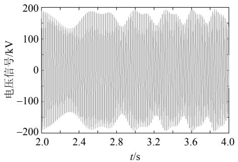  
图11 PSCAD/EMTDC信号  
Fig .11 Voltage signal of PSCAD/EMTDC

对模型产生的功率振荡电压信号进行幅值测量，并在波峰波谷进行对比，结果如图12、13所示，相对于波动较大的DPMA算法和CT-DFT算法，MFPM算法电压信号的幅值响应曲线更加光滑和平稳，并且更加接近电压信号的真实幅值。

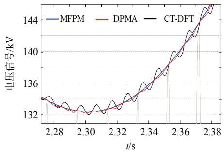  
图12 算法波谷处幅值响应

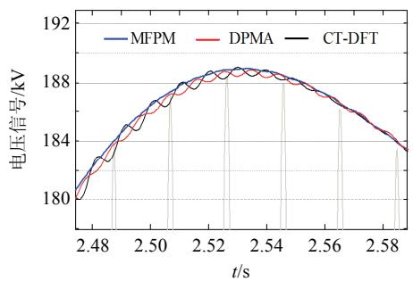  
Fig. 12 Amplitude response of algorithm at peak   
图13 算法波峰处幅值响应  
Fig. 13 Amplitude response of algorithm at trough

# 7 结论

本文考虑基波频率偏移较大的工况，提出基于多频率相量模型的动态同步相量测量算法，该方法利用多个子相量对一个动态相量进行拟合。通过大量仿真结果表明：在基波频率偏移较大的斜坡、振荡和噪声工况下，本文所提算法能够根据多个子相量信息，获得满足测量标准的TVE结果。同时，与文献[13,21]相比，本文所提算法虽然增加了一定

的运算量, 但其 TVE、幅值和相角的测量精度更高, 具有更好的稳定性和准确性。由此可以说明, 本文所提算法具有较好的综合性能, 在应对频率偏移、功率振荡等工况时更具有优势。此外, 本文在仿真上仅利用了 3 个子相量, 还可通过调整子相量和数据窗数量, 实现在精度和响应时间的平衡, 使其满足标准中对保护类的测量要求。

# 参考文献

[1] Phadke A G, Thorp J S. Synchronized phasor measurements and their applications[M]. Berlin, Germany: Springer, 2008.   
[2] Xie Xiaorong, Xin Yaozhong, Xiao Jinyu, et al. WAMS applications in Chinese power systems[J]. IEEE Power and Energy Magazine, 2006, 4(1): 54-63.   
[3] 何江，周京阳，王明俊．广域相量测量技术在智能电网中的应用[J].电网技术，2009，33(15)：16-19. He Jiang, Zhou Jingyang, Wang Mingjun. Application of wide area phasor measurement technology in smart grid[J]. Power System Technology, 2009, 33(15): 16-19(in Chinese).  
[4] 王宾，孙华东，张道农．配电网信息共享与同步相量测量应用技术评述[J].中国电机工程学报，2015，35(S1):1-7. Wang Bin，Sun Huadong，Zhang Daonong.Review on data sharing and synchronized phasor measurement technique with application in distribution systems[J]. Proceedings of the CSEE, 2015, 35(S1): 1-7(in Chinese).   
[5] Mai R K, He Z Y, Fu L, et al. A dynamic synchrophasor estimation algorithm for online application[J]. IEEE Transactions on Power Delivery, 2010, 25(2): 570-578.   
[6] Liu H, Bi T S, Yang Q X. The evaluation of phasor measurement units and their dynamic behavior analysis[J]. IEEE Transactions on Instrumentation and Measurement, 2013, 62(6): 1479-1485.   
[7] 毕天姝，刘灏，杨奇逊．PMU算法动态性能及其测试系统[J].电力系统自动化，2014，38(1)：62-67. Bi Tianshu, Liu Hao, Yang Qixun. Dynamic performance of PMU algorithm and its testing system[J]. Automation of Electric Power Systems, 2014, 38(1): 62-67(in Chinese).   
[8] Mai R K, He Z Y, Fu L, et al. Dynamic phasor and frequency estimator for phasor measurement units[J]. IET Generation, Transmission & Distribution, 2010, 4(1): 73-83.   
[9] 耿池勇，高厚磊，刘炳旭，等．适用于同步相量测量的DFT算法研究[J].电力自动化设备，2004,24(1):84-87. Geng Chiyong, Gao Houlei, Liu Bingxu, et al. study of DFT algorithm in synchronized phasor measurement[J].

Electric Power Automation Equipment, 2004, 24(1): 84-87(in Chinese).   
[10] Macii D, Petri D, Zorat A. Accuracy analysis and enhancement of DFT-based synchrophasor estimators in off-nominal conditions[J]. IEEE Transactions on Instrumentation and Measurement, 2012, 61(10): 2653-2664.   
[11] 刘世明，郭韬，吴聚昆，等．适用于频率偏移情况下同步相量测量的DFT算法研究[J].电网技术，2016,40(5): 1522-1528.  
Liu Shiming, Guo Tao, Wu Jukun, et al. Study of DFT algorithm for synchrophasor measurement under frequency offset[J]. Power System Technology, 2016, 40(5): 1522-1528(in Chinese).   
[12] de la O Serna J A. Dynamic phasor estimates for power system oscillations[J]. IEEE Transactions on Instrumentation and Measurement, 2007, 56(5): 1648-1657.   
[13] 麦瑞坤，何正友，薄志谦，等．动态条件下的同步相量测量算法的研究[J]. 中国电机工程学报，2009，29(10)：52-58.  
Mai Ruikun, He Zhengyou, Bo Zhiqian, et al. Research on synchronized phasor measurement algorithm under dynamic conditions[J]. Proceedings of the CSEE, 2009, 29(10): 52-58(in Chinese).   
[14] 符玲，韩文朕，麦瑞坤，等．基于时频信息的动态同步相量测量算法[J]. 中国电机工程学报，2015，35(23)：6075-6082.  
Fu Ling, Han Wenzhen, Mai Ruikun, et al. Time-frequency information-based dynamic phasor estimator[J]. Proceedings of the CSEE, 2015, 35(23): 6075-6082(in Chinese).   
[15] 徐全，陆超，刘映尚，等．基于泰勒级数和离散傅里叶变换的综合自适应相量算法[J].电力系统自动化，2016，40(19)：37-43.  
Xu Quan, Lu Chao, Liu Yingshang, et al. Comprehensive adaptive phasor algorithm based on Taylor series and discrete Fourier transform[J]. Automation of Electric Power Systems 2016, 40(19): 37-43 (in Chinese).   
[16] Agrez D. Weighted multipoint interpolated DFT to improve amplitude estimation of multifrequency signal[J]. IEEE Transactions on Instrumentation and Measurement, 2002, 51(2): 287-292.   
[17] Belega D, Petri D. Accuracy analysis of the multicycle

synchronphasor estimator provided by the interpolated DFT algorithm[J]. IEEE Transactions on Instrumentation and Measurement, 2013, 62(5): 942-953.   
[18] Belega D, Fontanelli D, Petri D. Dynamic phasor and frequency measurements by an improved Taylor weighted least squares algorithm[J]. IEEE Transactions on Instrumentation and Measurement, 2015, 64(8): 2165-2178.   
[19] 汪芙平，靳夏宁，王赞基．实现动态相量测量的 FIR 数字滤波器最优设计[J]. 中国电机工程学报，2014，34(15)：2388-2395.  
Wang Fuping, Jin Xianing, Wang ZANJI. Optimal design of FIR digital filters for dynamic phasor measurement[J]. Proceedings of the CSEE, 2014, 34(15): 2388-2395(in Chinese).   
[20] IEEE Std. C37. 118. 2011-IEEE standard for Synchrophasor measurements for power systems[Z]. 2011.   
[21] Zhan L W, Liu Y, Liu Y L. A Clarke transformation-based DFT phasor and frequency algorithm for wide frequency range[J]. IEEE Transactions on Smart Grid, 2017, DOI: 10. 1109/TSG. 2016. 2544947.   
[22] 汤涌. 电力系统强迫功率振荡分析[J]. 电网技术, 1995, 19(12): 6-10.  
Tang Yong. The analysis of forced power oscillation in power system[J]. Power System Technology, 1995, 19(12): 6-10(in Chinese).

  
白莎

收稿日期：2017-07-25。

作者简介：

白莎(1993)，女，硕士研究生，研究方向为信号处理及其在电力系统中的应用；

*通讯作者:符玲(1981),女,博士,副教授，研究方向为现代信号处理及信息处理方法理论在电力系统信号分析中的应用、PMU动态算法研究等，lingfu@swjtu.cn;

熊思宇(1991)，男，硕士研究生，研究方向为信号处理及其在电力系统中的应用；

麦瑞坤(1980)，男，博士，副教授，研究方向为信号处理及其在电力系统中的应用，并从事PMU动态算法的研究。

(责任编辑 李泽荣)

# Dynamic Synchrophasor Estimator Based on Multi-frequency Phasor Model

BAI Sha, FU Ling*, XIONG Siyu, MAI Ruikun

(Southwest Jiaotong University)

KEY WORDS: frequency deviation; synchrophasor estimator; multi-frequency phasor model; discrete Fourier transform (DFT); PSCAD/EMTDC simulation

As the unbalance of power supply and load consumption, power systems behave dynamically in practice, such as power oscillation, frequency deviation. Under these dynamic conditions, the voltage/current signals cannot maintain an ideal $50\mathrm{Hz}$ sinusoidal waveform, even the frequency of signal deviates to $5\mathrm{Hz}$ . With the consideration of frequency deviation, the multi-frequency phasor model (MFPM) is proposed to solve the problem.

The low-frequency band-limited signal $A_{m}$ and the rotating modulation vector $\mathrm{e}^{\mathrm{j}(\hat{\omega}_0 + m\Delta \omega)}$ are employed to establish a multi-frequency phasor model. The dynamic phasor $X(t)$ and dynamic signal $x(t)$ can be expressed by the model. Then the discrete form of $x(t)$ can be obtained as:

$$
x (n) = \sum_ {m = - M} ^ {M} A _ {m} \mathrm {e} ^ {\mathrm {j} (\hat {\omega} _ {0} + m \Delta \omega) n} + \sum_ {m = - M} ^ {M} A _ {m} ^ {*} \mathrm {e} ^ {- \mathrm {j} (\hat {\omega} _ {0} + m \Delta \omega) n} \tag {1}
$$

The phasor estimation can be obtained as:

$$
\begin{array}{l} \hat {X} \left(l _ {\text {m i d} p}\right) = \sum_ {n = \frac {- N + 1}{2}} ^ {\frac {N - 1}{2}} x \left(n + l _ {\text {m i d} p}\right) h (n) \mathrm {e} ^ {- \mathrm {j} \omega_ {0} \left(n + l _ {\text {m i d} p}\right)} = \\ \sum_ {n = \frac {- N + 1}{2}} ^ {\frac {N - 1}{2}} h (n) \sum_ {m = - M} ^ {M} A _ {m} \mathrm {e} ^ {\mathrm {j} (\hat {\omega} _ {0} + m \Delta \omega - \omega_ {0}) (n + l _ {\text {m i d} p})} + \sum_ {n = \frac {- N + 1}{2}} ^ {\frac {N - 1}{2}} h (n) \cdot \\ \sum_ {m = - M} ^ {M} A _ {m} ^ {*} \mathrm {e} ^ {- \mathrm {j} \left(\hat {\omega} _ {0} + m \Delta \omega + \omega_ {0}\right) \left(n + l _ {\text {m i d}, p}\right)} = C A + D A ^ {*} \tag {2} \\ \end{array}
$$

According to different $l_{\mathrm{mid}_p}$ in (2), different result of DFT can be calculated. The rough angular frequency $\hat{\omega}_0$ can also be gained by the result of DFT. Therefore, several independent equations are obtained, and the phasor estimation referred to the reference time of the above-defined $A_{m}$ is obtained.

Both the MATLAB signal and PSCAD signal are adopted to verify the performance of MFPM compared

with DPMA and CT-DFT. Taking the MATLAB signal as an example, measurement errors are shown in Tab. 1. Taking the signal of power oscillation of PSCAD as another example, the comparison among MFPM, DPMA and CT-DFT is illustrated in Fig. 1

Tab. 1 Measurement error of algorithm under oscillating with amplitude   

<table><tr><td rowspan="2" colspan="2">Algorithm</td><td colspan="3">Fundamental frequency</td></tr><tr><td>45Hz</td><td>47.5Hz</td><td>50Hz</td></tr><tr><td rowspan="3">DPMA</td><td>TVE/%</td><td>10.0214</td><td>1.9688</td><td>0.6969</td></tr><tr><td>Mag_err/pu</td><td>0.1102</td><td>0.0216</td><td>0.0063</td></tr><tr><td>Ang_err(°)</td><td>2.8570</td><td>0.9017</td><td>0.0978</td></tr><tr><td rowspan="3">MFPM</td><td>TVE/%</td><td>0.7173</td><td>0.7113</td><td>0.6722</td></tr><tr><td>Mag_err/pu</td><td>0.0065</td><td>0.0064</td><td>0.0061</td></tr><tr><td>Ang_err(°)</td><td>0.1099</td><td>0.0546</td><td>0.0946</td></tr><tr><td rowspan="3">CT-DFT</td><td>TVE/%</td><td>1.5262</td><td>0.901</td><td>0.8618</td></tr><tr><td>Mag_err/pu</td><td>0.0092</td><td>0.0081</td><td>0.0078</td></tr><tr><td>Ang_err(°)</td><td>0.8722</td><td>0.432</td><td>0.0001</td></tr></table>

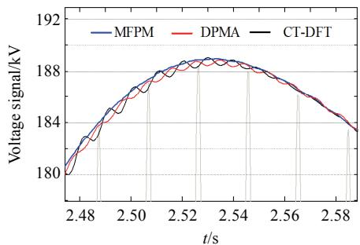  
Fig. 1 Amplitude response of algorithm at trough

The results show that the proposed algorithm provides more accurate phasor estimation under various conditions such as frequency deviation and amplitude oscillation. Especially, the measurement result of proposed algorithm displays more smooth and more close to the amplitude of PSCAD signals.