# 基于机电暂态-电磁暂态混合仿真的电网合环分析计算系统

朱雨晨 1，赵冬梅 1，刘世良 2，李亚楼 3，朱旭凯 3，张 星3，宋 军4

(1.华北电力大学，北京 102206；2.青海电力公司住处通信公司，青海 西宁 810008；

3.中国电力科学研究院，北京 100192； 4. 新疆疆南电力有限责任公司，新疆 喀什 844000）

摘要：为了提高电网的安全运行，开发了基于机电暂态-电磁暂态混合仿真原理的电网合环分析计算系统。利用机电-电磁混合仿真原理，提出了基于最大级数搜索算法的电磁网络自动划分方法，实现了机电暂态模型自动转换为电磁暂态模型的功能，并完成了地理图与厂站图相关联的功能，方便用户操作的同时提高了合环计算结果的准确性。利用开关统计功能，可以得到系统不同时刻的合环情况。通过对新疆喀什地区电网的合环仿真计算，其结果表明该系统能够提高合环操作的准确性，为合环操作提供了重要依据。

关键词：电网合环；机电暂态仿真；电磁暂态仿真；机电暂态-电磁暂态混合仿真；电磁网络自动划分；电磁模型自动转换；单机并行算法

# Loop closing analytical calculation system based on electromagnetic-electromechanical transient simulation for power network

ZHU Yu-chen1 , ZHAO Dong-mei1 , LIU Shi-liang2 , LI Ya-lou3 , ZHU Xu-kai3 , ZHANG Xing3 , SONG Jun4

(1. North China Electric Power University, Beijing 102206, China; 2. Qinghai Information and Communication Company,

Xining 810008, China; 3. China Electric Power Research Institute, Beijing 100192, China;

4. Xinjiang Jiangnan Electricity Co., Ltd, Kashi 844000, China)

Abstract: To improve safe operation of power network, a loop closing analytical calculation system based on electromagneticelectromechanical transient hybrid simulation theory is developed. An automatic electromagnetic network partition solution based on the maximal stair search algorithm is put forward. The system also implements the function of automatic transformation from the electromechanical transient models to electromagnetic models and links the geographic maps and station maps, which not only makes loop closing operation easy but also enhances veracity. Simulation and calculation results show that the system can increase the accuracy of loop closing, providing evidence for loop closing operation.

This work is supported by National High-tech R&D Program of China (863 Program) (No. 2011AA05A105).

Key words: power network loop closing; electromechanical transient simulation; electromagnetic transient simulation; electromagnetic-electromechanical transient hybrid simulation; automatic electromagnetic network partition solution; automatic transformation of electromechanical models; single machine parallel algorithm

中图分类号： TM71 文献标识码：A 文章编号： 1674-3415(2012)23-0073-07

# 0 引言

提高供电可靠性一直是电力系统致力的首要目标。带电合环操作可以减少停电时间，是提高系统供电可靠性的一种重要方法[1-2]。电网正常运行时，不同母线所带的负荷区域之间的联络开关都是打开的。线路故障或者检修时，通过先停电隔离，再转供负荷的方式，可以在一定程度上减少停电时间，提高供电可靠性[3-4]。当前，转供负荷的实现方法是

先将待转供负荷的线路从现有电源断开，再将它投运到另一个电源供电，操作过程中会有短时停电，这样既损失了电量，又造成负荷用户减产，影响正常的生产秩序，甚至可能导致重大的经济损失。此外，在执行合环操作时，由于合环点两侧电压或系统短路阻抗相差较大，使合环稳态电流和冲击电流过大，导致系统过电压、过电流，引起保护误动甚至设备损坏。瞬时合环电流过大还可能造成联络开关和线路过载，甚至发生爆炸，威胁操作人员的人身安全[5]。

目前，对合环操作问题的处理方式可纳为以下四种：一、工作人员根据运行经验判断合环操作可行性[6]，但由于电力系统本身的复杂性，该方法具有较大的局限性；二、调度员根据潮流计算得到合环后稳态电流大小并以此来判断合环操作的可行性[7-8]，但此方法不适用于暂态冲击电流过大导致合环失败的情形；三、利用离线分析工具，对合环操作进行模拟来判断合环条件，常见的软件有PSASP、BPA、PSCAD[9-11]等；四、根据电网实际情况开发专门的合环计算系统[12-14]，这些系统大都采用等值的方法，工作量随着电网规模的增大呈指数递增。

鉴于以上原因，开发了基于机电-电磁暂态混合仿真的电网合环分析计算系统，用于判断电网合环操作的可行性。

# 1 机电暂态-电磁暂态混合仿真原理

# 1.1 机电暂态仿真与电磁暂态仿真

机电暂态仿真主要研究电力系统受到大扰动后的暂态稳定性能[15]；而电磁暂态仿真主要研究系统元件中电场和磁场以及相应的电压和电流的变化情况[16]。电力系统电磁暂态仿真和机电暂态仿真的仿真差异见表 1[17-19]。

表1 机电暂态仿真与电磁暂态仿真对比  
Table 1 Comparison between electromechanical and electromagnetic transient simulation   

<table><tr><td></td><td>机电仿真</td><td>电磁仿真</td></tr><tr><td>仿真步长</td><td>微秒级</td><td>毫秒级</td></tr><tr><td>模型描述</td><td>代数、微分、偏微分方程</td><td>线性相量方程</td></tr><tr><td>仿真条件</td><td>ABC三相瞬时值</td><td>基波相量</td></tr><tr><td>分析问题</td><td>过电压、高次谐波</td><td>工频特性、低频振荡特性</td></tr></table>

# 1.2 机电-电磁混合仿真的必要性

机电暂态仿真往往因为仿真步长较大，无法获得电气量更精细的变化结果，不能分析系统过电压、过电流等情况。当需要详细研究次同步谐振等电力系统复杂问题时，需采用电磁暂态仿真。但电磁暂态仿真模型复杂、计算量大，与之相关的网络常需等值简化，从而降低了计算分析的准确性。

为了解决上述问题，将电磁暂态计算与机电暂态计算进行实时接口，在一次仿真过程中同时实现对大规模电力系统的机电暂态仿真和局部网络的电磁暂态仿真，不但可以了解大系统暂态稳定过程的动态特性，而且有助于了解大系统中某一区域电网

的详细暂态变化过程。

# 1.3 机电-电磁混合仿真接口等值电路

混合仿真时，整个网络分为机电暂态网络和电磁暂态网络。在对电磁暂态网络进行仿真时，接入机电暂态网络的戴维南等值电路，如图1（a）所示；在对机电暂态网络进行仿真时，接入电磁暂态网络的诺顿等值电路，如图 1（b）所示。由于机电暂态网络为三序相量网络，而电磁暂态网络为三相瞬时值网络，因此，还需要进行序-相变换以及瞬时值-相量变换。该等值电路对于有源网络和无源网络都适用。

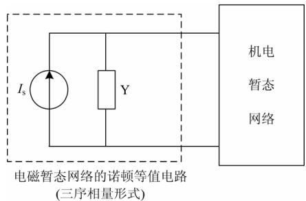  
(a)机电暂态仿真中电磁暂态网络等值电路

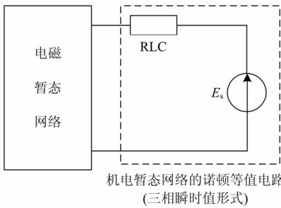  
(b)电磁暂态仿真中机电暂态网络等值电路  
图1 机电-电磁网络接口等值电路  
Fig. 1 Equivalent circuit of interface between electromagnetic transient simulation and electromechanical transient simulation

# 1.4 机电-电磁混合仿真接口时序（图 2）

由于机电暂态网络计算步长大于电磁暂态网络计算的步长，因此两个网络之间的数据交换是以机电暂态步长为单位进行的。以机电暂态网络计算步长为 DTP=0.01 s、电磁暂态网络计算步长为DTE=0.001 s 为例说明：机电暂态网络和电磁暂态网络在每个机电暂态网络积分时段，即t = 0.01 s，0.02 s…时刻交换一次数据，其中初始化时机电暂态网络向电磁暂态网络发送正、负、零序等值阻抗阵及等值电势的初始值；在每一次数据交换时刻机电暂态网络向电磁暂态网络发送边界点的正、负、零序等值电势，电磁暂态网络向机电暂态网络发送边界点的正、负、零序电压和电流。在有故障或操作导致机电暂态网络结构发生变化时，机电暂态网络

还需向电磁暂态网络发送机电暂态网络的正、负、零序等值阻抗阵。交换的数据均为两网在 0.009 s、0.019s…t-DTE 时刻的值。

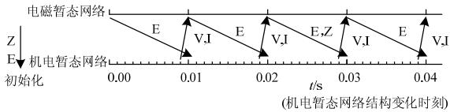  
图 2 机电暂态网络和电磁暂态网络数据接口时序  
Fig. 2 Interface timing of between electromagnetic transient network and electromechanical transient network

上述为机电暂态网络和电磁暂态网络并行计算数据交换时序，在对计算时间要求不严的情况下，也可采用串行计算数据交换时序，这里不作介绍。

# 2 电网合环分析计算系统的设计与实现

考虑到机电-电磁混合仿真的优点以及现有解决方案的不足，比如电磁暂态仿真（如 PSCAD）难以反映潮流转移情况，而机电暂态仿真（如 PSASP）无法分析合环可能出现的过电压、过电流情况，本文介绍了基于机电-电磁暂态混合仿真的合环分析计算系统。

# 2.1 系统架构

输配电网合环仿真计算系统包括合环潮流计算与合环暂态计算两部分，合环潮流计算可得到合环稳态电流，合环暂态计算可得到合环冲击电流。系统架构如图3所示。

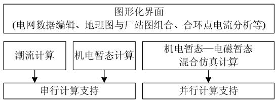  
图 3 系统架构  
Fig. 3 System structure

# 2.2 图形界面

系统能够实现地理图与厂站图相关联功能，即地理图上的每个厂站（如图4 箭头所指厂站）都可与对应的厂站单线图（图 5）关联，当合、解环操作涉及到该厂站时，可以方便切换到厂站单线图，观察到厂站断路器的具体开合情况。

# 2.3 计算功能模块

# 2.3.1 潮流计算模块

潮流计算是根据给定的电网结构、参数以及发电机、负荷等元件的运行条件，确定电力系统各部分稳态运行状态参数的计算。合环计算系统提供多种计算方法（PQ分解法、牛顿法、最佳乘子法、

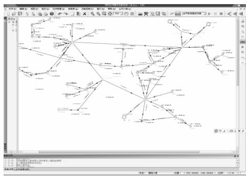  
图 4 地理图  
Fig. 4 Geographic map

PQ 分解转牛顿法）供选择。与常规潮流计算相比，合环潮流计算包含了合环前与合环后两次潮流计算。通过潮流计算用户可以直观地发现合环操作可能带来的潮流转移及其他潮流不合理问题。

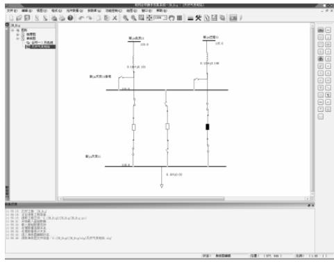  
图5 厂站单线图  
Fig. 5 Station single line map

# 2.3.2 机电暂态仿真模块

合环机电暂态仿真模块主要用来计算合环冲击电流值，分析合环操作对系统稳定性的影响。与常规机电暂态仿真[20]计算相比，合环机电暂态仿真根据用户设定的合环点信息自动形成合环操作动作序列卡，不额外设定故障卡。合环机电暂态计算给出合环操作后系统暂态稳定性结论，计算得到的冲击电流与继电保护整定值相比较，判定合环操作是否可行。

# 2.3.3 机电-电磁暂态混合仿真模块

机电暂态-电磁暂态混合仿真根据设置的合环点信息，将合环点附近区域自动划为电磁暂态网络，其他部分为机电暂态网络，在一次仿真过程中实现对大规模电力系统的机电暂态仿真和局部合环点区域网络的电磁暂态仿真，通过计算得到不同合环相角对应的冲击电流瞬时值以及合环点附近各母线电压、各母线电流和功率的瞬时值，可进一步分析合环操作过电压情况。

系统具备开关统计功能，即对一个周期内的不同合环时刻进行逐个时间点的混合仿真，给出冲击电流值的变化区间，分析合环冲击电流最大（最恶劣）的情况。

# 3 关键技术

# 3.1 基于最大级数搜索算法的电磁暂态网络自动划分

电力系统中的同心松弛是指在大规模的电力系统中，若系统某处的参数发生了变化，如断线、母线功率变化等，则距该处最近的母线或线路受到的影响很大，而在距离较远的区域则影响较小。根据同心松弛原理，合环操作产生的过电压、冲击电流在合环点附近区域最为严重，而对较远区域的影响较小。因此，电磁暂态网络应以合环点为中心进行划分。

通常，进行混合仿真计算之前，需确定机电暂态网络（可一个或多个）和电磁暂态网络（可一个或多个），一般做法是先绘制系统单线图，在单线图上将电网划分为若干个相互独立的子网，然后检查网络分割结果的合理性。若单线图未完全画出，则很容易产生画面上相互独立的电网实际上还存在支路连接的情况，导致分网不成功。网络划分的结果，包括边界点、联络线等数据，存储在数据库中，可以提供给其他计算模块使用。对应一个工程可以有多套网络划分的方案，这些方案是可以在工程中保存的。将这种处理方式应用于合环计算系统会带来许多不便：首先，大规模电网中合环点可能有成百上千个，也就是说，每次进行合环计算都将面临分网工作；其次，已有的分网方案存储后，一旦潮流变化，这些方案将不再适用；此外，若电网数据更新，整个工程变化，原有的存储方案将不复存在。

基于上述考虑，提出基于最大级数搜索算法的电磁暂态网络自动划分方法，该方法根据设定的合环点信息，自动将合环点附近区域电网作为电磁暂态网络，由拓扑程序确定边界点和联络线，保证与机电暂态网络的独立性，其基本原理可解释如下：将合环点两侧母线作为同一母线定义为初始母线，同时定义具有阻抗的支路作为单元级数。此外，用户还可以选择是否将“死岛”合并到电磁暂态网络。

在混合仿真配置页包含了最大搜索级数的选项，例如设置最大搜索级数为 X，则所有距离初始母线不大于X条单元级数的母线与合环点两侧母线一起构成电磁暂态网络母线集合，所有与电磁暂态网络外的母线有联系的支路都划分到机电暂态网络。如图 6 中，设最大搜索级数为 1，那么所有距

离合环线路1 条及以内的网络（粗线标注）都被划为电磁网络，其余则为机电网络部分。

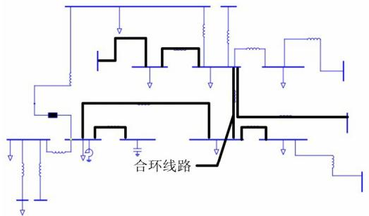  
图6 电磁网络自动划分示意图  
Fig. 6 Automatic electromagnetic network partition schematic diagram

# 3.2 机电暂态模型到电磁暂态模型的自动转换算法

通常，进行混合仿真计算之前、除了确定电磁暂态网络，还需建立电磁暂态仿真程序并进入电磁暂态网络相对应的电磁暂态工程算例：首先设置机电暂态工程路径及作业名称，添加接口元件并选择相应母线；其次建立电磁暂态网络所有元件，录入元件参数；最后根据潮流计算的结果填写相应电磁暂态工程潮流初始值（包括母线电压幅值和相角、发电机功率等）。这是一个繁琐的过程，随着电磁暂态网络规模的增大，相应的工作量也增加。

机电暂态模型到电磁暂态模型的自动转换算法避免了以往建立电磁暂态工程需手工录入大量参数的弊端。自动转换算法涉及的元件分为两类：第一类是简单元件，可定义为机电暂态模型参数与电磁暂态模型参数能够互相转换的元件，这类元件包括线路、变压器、负荷、电容器、电抗器等（这些元件在电网中占绝大多数，对于合环点附近的区域电网几乎是全部）；其他参数不能互相转换的元件定义为第二类，即复杂元件，这类元件包括发电机、FACTS设备、直流输电线路等。在模型自动转换算法中，简单模型可直接转换，复杂模型需按照元件类型与名称建立电磁暂态模型文件库，以备在模型转换过程中进行检索，详细的转换流程如图7所示。

# 3.3 合环混合仿真计算的单机 Windows 并行算法

以往机电暂态-电磁暂态混合并行仿真通常依赖于计算机群，以实现较快的计算性能。现有的Windows系统微机硬件进步速度很快，目前市场上双核及以上微机已经相当普及，为充分利用计算机硬件资源，利用微机 CPU 多核处理能力，同时也为了降低合环计算系统软件的应用成本，电网合环分析计算系统在单机上实现合环混合仿真计算的并行算法（图 8）。

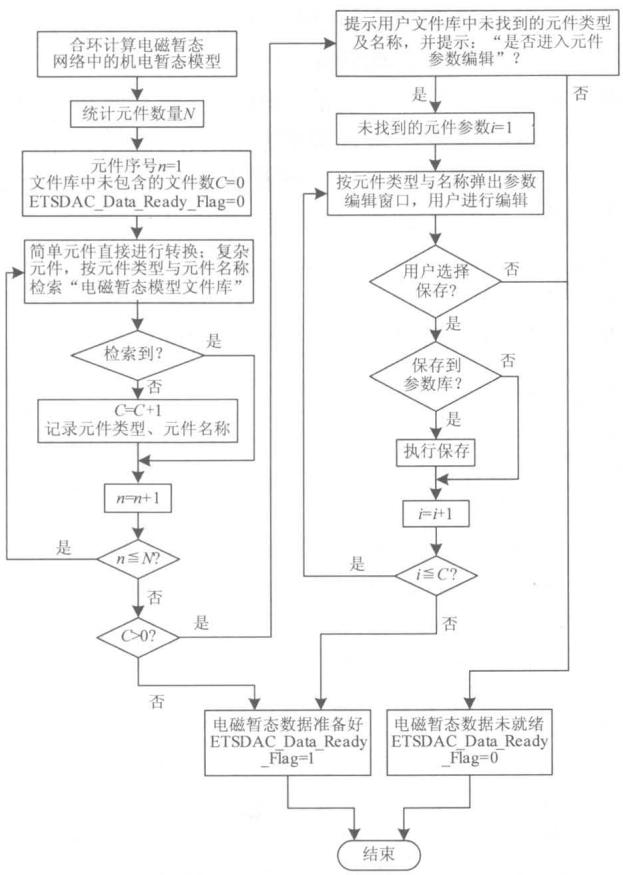  
图 7 模型转换流程

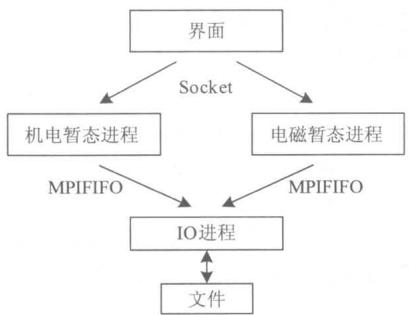  
Fig. 7 Model transformation flow   
图 8 合环混合仿真 Windows 并行计算程序架构  
Fig. 8 System parallel computing program architecture for loop closing hybrid simulation

合环混合仿真算例包含机电暂态子网和电磁暂态子网各一个，Windows 并行计算时有3个进程，分别为机电暂态计算进程、电磁暂态计算进程和IO进程。每个计算进程都与界面建立Socket通信；每个计算进程与IO进程之间建立MPIFIFO通信，用于文件输出。

# 4 算例及结果分析

本文针对新疆喀什电网（图 4）的四个变电站

组成的环形电网（图 4 方框标示，放大图如图 9）进行合环分析。

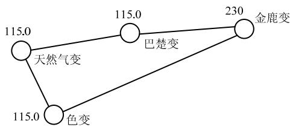  
图 9 合环电网  
Fig. 9 Loop closing network

首先进行潮流计算，包括基本潮流及合（解）环潮流。本例中选择的合环点为天色断，解环点为天巴断。潮流计算结果可直接在单线图上显示，也可通过潮流报表输出或在信息反馈栏的合环数据比较框（图 10）显示。合环数据比较框中所列比较项为用户关心线路的合环前后数据比较，包括线路两侧电压、功率等信息，方便用户比较合环前后潮流，本例中选择的是天色交流线以及天巴交流线作为监测量。

  
图 10 合环前后潮流结果对比  
Fig. 10 Power flow comparison before and after loop closing

接着进行机电暂态仿真及机电-电磁暂态混合仿真。仿真开始后，可以通过实时监测曲线窗口直观观察所关心电气量的变化曲线。机电暂态仿真结果可以通过摘要信息和报表曲线两种方式输出。

机电-电磁暂态混合仿真前需进行机电、电磁网络划分。一般来说，最大支路搜索数选择1即可满足计算精度要求。仿真开始后，用户可以通过实时监测窗口监测所选电气量随时间的变化情况。除了通过摘要信息和报表曲线方式，用户还可以在曲线阅览室查看混合暂态仿真结果（图11）。

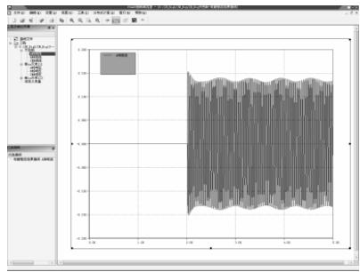  
图11 暂态仿真曲线阅览室  
Fig. 11 Reading room of transient simulation curve

除了上述两种仿真，系统还设有“开关统计”仿真功能，本例中开关统计次数设为 10，即在一个周波内对系统进行10次混合暂态仿真，分析了在不同角度下系统合环的情况。理论上开关统计次数越多，仿真结果更接近实际情况，但仿真时间也会相应增长，开关统计次数的结果查看与混合暂态仿真相同。

本系统提供合环计算报告，包括潮流结果报告、机电暂态报告、混合仿真报告（图12）以及综合报告，用户可以对合环结果以及重要数据一目了然。

潮流结果报告提供了合环前线路两侧的母线电压及相角差，若差值过大，用户可直接判断合环操作不可行。机电暂态报告主要提供合环时刻的最大冲击电流值，将其与最大允许电流值比较，判断合环操作是否可行。此外，机电暂态计算结果报告还提供了合环线路的电流变化趋势图。混合仿真计算结果报告提供了过电压分析结果以及混合暂态计算得到的最大、最小冲击电流值（若不执行开关统计，则最小电流冲击值为空）。结果与允许最大电流值及允许电流超出时间比较，判断合环操作的可行性。此外，混合仿真计算报告还提供了最恶劣合环情况电流变化趋势图（若开关统计次数大于 1，则为最大冲击电流对应的那一次合环）。合环计算综合报告是将潮流计算结果、机电暂态计算结果及混合仿真计算结果报告中用户较关注的数据提炼到一张报告，用户可以直观的看到计算结果。

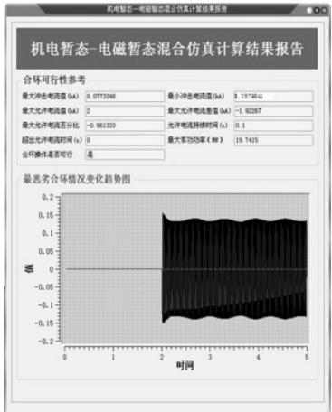  
图12 合环机电-电磁暂态混合仿真计算结果报告  
Fig.12 Calculation results report of loop closing electromagnetic-electromechanical transient simulation

# 5 结论

根据机电-电磁混合仿真原理，设计了电网合环分析计算系统。该系统基于Windows平台开发，通

过基于最大级数搜索算法的电磁暂态网络自动划分及机电暂态模型自动转化为电磁暂态模型功能，为用户提供合环操作方便的同时，也提高了计算结果的准确性。通过潮流计算模块反映潮流转移情况，机电暂态计算可以得到合环稳态电流值与冲击电流值，通过机电-电磁混合仿真分析过电压情况，并通过对不同合环时刻仿真的开关统计功能，得到最恶劣合环情况。此外，本系统同时适用于各种电压等级电磁环网及同电压等级输配电网的合环操作。

# 参考文献

[1] 梁臣，公元. 增加合解环功能的备自投在 110kV 内桥式主接线变电站中的应用[J]. 电力系统保护与控制,2009, 37(12): 118-121.  
LIANG Chen，GONG Yuan．Application of back-up switching equipments with the new function of closing or opening loops in 110 kV inner-bridge-connected substations[J]．Power System Protection and Control, 2009，37(12): 118-121.   
[2] 邹俊雄，周冠波，付轲，等. 10 kV配网合环转电计算模型与试验分析[J]. 电力系统保护与控制，2010, 38(8):144-148.  
ZOU Jun-xiong, ZHOU Guan-bo, FU Ke, et al. Electromagnetic loop closing calculation model and experimental analysis on 10 kV distribution network[J]. Power System Protection and Control, 2010, 38(8): 144-148.   
[3] 王秀云，杨劲松，熊谦敏，等. 一种配电网合环实用潮流算法[J]. 电力系统保护与控制, 2009, 37(6): 23-26.  
WANG Xiu-yun, YANG Jing-song, XIONG Qian-min, et al. A practical algorithm of load flow calculation for loop distribution networks[J]. Power System Protection and Control, 2009, 37(6): 23-26.   
[4] 葛少云，李晓明. 基于戴维南等值的配电网合环冲击电流计算[J]. 电力系统及其自动化学报, 2007, 19(6):124-127.  
GE Shao-yun, LI Xiao-min. Study on surge current due to closing loop in distribution network based on Thevenin's equivalent[J]. Proceedings of the CSU-EPSA, 2007, 19(6): 124-127.   
[5] 冯静. 鹤壁配电网合环电流计算、分析及决策系统研究[D]. 北京：华北电力大学, 2010.  
FENG Jing. Calculation and analysis of the closed loop current of Hebi distribution network and its decision system study[D]. Beijing: North China Electric Power University, 2010.   
[6] 苑捷. 配电网合环操作的研究[J]. 陕西电力, 2007(4):36-39.  
YUAN Jie. Research on loop closing operation in distribution network[J]. Shanxi Electric Power, 2007(4):

36-39.   
[7] 汲亚飞，赵江河. 辐射型配电网合环稳态电流计算方法研究[J]. 电力系统保护与控制, 2009, 37(12): 15-19.  
JI Ya-fei, ZHAO Jiang-he. Calculation of the loop closing steady-state current in radial power distribution network[J]. Power System Protection and Control, 2009, 37(12): 15-19.   
[8] Vempati N, Shoulys R R, Chen M S, et al. Simplified feeder modeling for load flow calculations[J]. IEEE Trans on Power Systems, 1987, 2(1): 168-174.   
[9] 樊一娜. 基于 Pscad/Emtdc 电网合环仿真的研究[J]. 科技广场, 2010(7): 156-158.  
FAN Yi-na. Research on distribution network closingloop smulation based on Pscat/Emtdc[J]. Science Mosaic, 2010(7): 156-158.   
[10] 付轲，蔡泽祥，邱建，等. 10 kV 电网电磁合环操作安全性评估方法[J]. 电力系统及其自动化学报, 2010,22(4): 71-76.  
FU Ke, CAI Ze-xiang, QIU Jian, et al. Safety assessment methods of loop closing operation in 10 kV distribution network[J]. Proceedings of the CSU-EPSA, 2010, 22(4): 71-76.   
[11] 冯静，张建华，刘若溪. 基于PSCAD的配网合环电流分析[J]. 现代电力, 2009, 26(3): 41-44.  
FENG Jing, ZHANG Jian-hua, LIU Ruo-xi. Analysis of closed-loop current in distribution network based on PSCAD[J]. Modern Electric Power, 2009, 26(3): 41-44.   
[12] 宣科，张富刚，李传虎，等. 配电网合环操作决策支持系统的开发与研究[J]. 供用电, 2010, 27(1): 30-32.  
XUAN Ke, ZHANG Fu-gang, LI Chuan-hu, et al. Development and research of the decision-making supporting system for closing loop operation in distribution network[J]. Distribution & Utilization, 2010, 27(1): 30-32.   
[13] 钱兵，程浩忠，杨镜非，等. 电网合环辅助决策软件研究[J]. 电力自动化设备, 2002, 22(3): 8-11.  
QIAN Bing, CHENG Hao-zhong, YANG Jing-fei, et al. Research on object-oriented and visual assistant decision-making software for power system linkage[J]. Electric Power Automation Equipment, 2002, 22(3): 8-11.   
[14] Lei X，Lerch E，Povh D，et al．A large integrated power system software package netomac[C] // Powercon 8， International conference on Power System Technology，

Beijng，China，1998．   
[15] 柳勇军，闵勇，梁旭. 电力系统数字混合仿真技术综述[J]. 电网技术, 2006, 30(13): 38-43.  
LIU Yong-jun, YAN Yong, LIANG Xu. Overview on power system digital hybrid simulation[J]. Power System Technology, 2006, 30(13): 38-43.   
[16] 王忠敏，王江敏，杜冠军，等. 电力系统机电暂态-电磁暂态混合仿真接口技术研究[J]. 华北电力大学学报:自然科学版, 2010，37(6): 34-38.  
WANG Zhong-min, WANG Jiang-min, DU Guan-jun, et al. Study of interfacing technology of electromechanicalelectromagnetic transient hybrid simulator in power System[J]. Journal of North China Electric Power University：Natural Science Edition, 2010, 37(6): 34-38.   
[17] 夏道止. 电力系统分析[M]. 北京：水利电力出版社,1995.  
XIA Dao-zhi. Power system anslysis[M]. Beijing: China Water Power Press, 1995.   
[18] 岳程燕，田芳，周孝信，等. 电力系统电磁暂态-机电暂态混合仿真接口原理[J]. 电网技术, 2006, 30(1):23-27.  
YUE Cheng-yan, TIAN Fang, ZHOU Xiao-xin, et al. Principle of interfaces for hybrid simulation of power system electromagnetic-electromechanical transient process[J]. Power System Technology, 2006, 30(1): 23-27.   
[19] 王成山，李鹏，王立伟. 电力系统电磁暂态仿真算法研究进展[J]. 电力系统自动化, 2009, 33(7): 97-103.  
WANG Cheng-shan, LI Peng, WANG Li-wei. Progresses on algorithm of electromagnetic transient simulation for electric power system[J]. Automation of Electric Power Systems, 2009, 33(7): 97-103.   
[20] 翟培，于庆广，李铸新，等. 电力系统机电暂态实时仿真系统[J]. 电网技术, 2008, 32(9): 42-45.  
ZHAI Pei, YU Qing-guang, LI Zhu-xin, et al. Real-time electromechanical transient simulation system of power system[J]. Power System Technology, 2008, 32(9): 42-45.

收稿日期：2012-03-01； 修回日期：2012-07-05

作者简介：

朱雨晨(1988-),女，硕士研究生，研究方向为电力系统分析、运行与控制；E-mail:zhuyuchen@ncepu.edu.cn

赵冬梅(1965-),女，博士，教授，主要研究方向为电力系统分析、运行与控制。