# Comparison and Selection of Grid-Tied Inverter Models for Accurate and Efficient EMT Simulations

Kenichiro Sano , Member, IEEE, Shuntaro Horiuchi , and Taku Noda , Senior Member, IEEE

Abstract—This article compares five modeling methods of gridtied inverters for the electromagnetic transient simulation of power system, clarifies their differences, and discusses the suitable model for each simulation purpose. The comparison was made under the same conditions between the conventional switching model, and four simplified models—voltage interpolation, average-value, controlled current-injection, and simplified current-injection model. The comparison of the simulated waveforms clarifies the behaviors that can be simulated and cannot be simulated by each simplified model. The comparison of the computing time reveals the significant decrease of the computing time by selecting the proper simplified modeling method. Based on these comparisons, this article discusses the selection of the modeling methods for each simulation purpose to perform simulations accurately and efficiently.

Index Terms—Average-value model, current-injection model, electromagnetic transient (EMT) simulation, grid-tied inverter, voltage interpolation (VI) model.

# I. INTRODUCTION

W ITH the penetration of renewable energy sources,inverter-based power sources are becoming dominant in inverter-based power sources are becoming dominant in power system. To simulate the transient behavior of such power system, the modeling of the grid-tied inverters is important. The phasor domain simulation is a major tool for power system analysis, where all components are modeled in the phasor domain and the symmetrical coordinates. It is suitable to deal with the behavior of a large scale power system with synchronous generators. On the other hand, general grid-tied inverters have a control system based on the instantaneous values of the detected three-phase voltage and current waveforms. Modeling of the inverter in the symmetrical coordinates is not straightforward because characteristics of the inverter cannot be decoupled

Manuscript received June 11, 2021; revised September 5, 2021; accepted September 30, 2021. Date of publication October 6, 2021; date of current version November 30, 2021. This work was supported in part by Hokkaido Electric Power Co., in part by Tohoku Electric Power Co., in part by Tokyo Electric Power Co. Holdings, in part by Chubu Electric Power Co., in part by Hokuriku Electric Power Co., in part by Kansai Electric Power Co., in part by Chugoku Electric Power Co., in part by Shikoku Electric Power Co., in part by Kyushu Electric Power Co., and in part by Okinawa Electric Power Co. Recommended for publication by Associate Editor Y. Yang. (Corresponding author: Kenichiro Sano.)

Kenichiro Sano and Shuntaro Horiuchi are with the Department of Electrical and Electronic Engineering, Tokyo Institute of Technology, Tokyo 152–8552, Japan (e-mail: sano@ee.e.titech.ac.jp; horiuchi.s@pel.ee.e.titech.ac.jp).

Taku Noda is with Grid Innovation Research Laboratory, Central Research Institute of Electric Power Industry, Yokosuka 240–0196, Japan (e-mail: takunoda@ieee.org).

Color versions of one or more figures in this article are available at https://doi.org/10.1109/TPEL.2021.3117633.

Digital Object Identifier 10.1109/TPEL.2021.3117633

between positive, negative, and zero sequence components. In addition, it is not easy to adequately model the behavior of the inverter including harmonics in the phasor domain simulation. Therefore, the circuit simulation by three-phase instantaneous waveforms such as EMTP or EMTDC is often applied to accurately model and analyze the behavior of the inverters. The circuit simulation is also referred to as an electromagnetic transient (EMT) simulation to distinguish it from the phasor domain simulations. Because the EMT simulation deals with three-phase instantaneous values, the control system of the inverter can be modeled in the same way as the actual implementation. The EMT simulation has been applied to various power system analyses as follows [1]. Harmonic analyses of the system with inverters [2], [3]. Stability analysis related to the inverter control [4]–[7]. Fault analyses influenced by the inverter’s transient behavior, the protection method, and fault-ride-through (FRT) operation [8]– [11]. Transient stability and voltage analyses of the system with inverters implementing frequency and voltage support by active and reactive power control, or grid-forming control [12]–[17]. The EMT simulation is used not only for offline simulations but also for real-time simulations [18].

Switching (SW) model is the most straightforward modeling method of the inverter for EMT simulations. It simulates the switching operation of power devices. Because the SW model emulates the detailed circuit operation, it can represent the dynamic behavior in most of the applications. However, the SW model requires to set the simulation time step to be small enough to represent the switching transients. The major problem is its large computing time, especially when it is applied to the analysis of a large-scale power system.

Advanced simulation methods have been proposed to reduce the computing burden. Dynamic phasor [19] enables to use a larger simulation time step, whereas it can deal with dynamic behavior of the inverter. The EMT simulations are combined with the dynamic phasor or the phasor domain simulation [20]– [23] to incorporate the advantages of the both methods. Field programmable gate array (FPGA) [24] or graphics processing units (GPU) [25], [26] is applied to accelerate the computation of the EMT simulations. Multirate simulation [27] divides the target system to multiple subsystems and calculates them with different simulation time steps. Although these algorithms are promising methods, they have to be supported by the solver of the simulation programs. Thus, most of the users cannot use them or have to wait for a while to be implemented in their familiar or commercially available EMT simulation programs.

This article focuses on the modeling methods for existing EMT simulation programs equipped with a conventional algorithm based on the nodal analysis and fixed time-step simulation. In the analysis of the grid-tied inverter, the simulated system is often a large-scale network including multiple inverters. Even if the network becomes large and complex, the nodal analysis can simply formulate the network according to a prescribed procedure, while the computational effort to generate state-space equations becomes excessive in the state-space analysis [28]. In addition, the variable time-step method [29]–[31] cannot effectively reduce the computing burden in the analysis involving many inverters. Even with the existing EMT simulation method based on the nodal analysis and fixed time-step simulation, the computing burden can be reduced by improving the modeling methods of the inverters. A typical method used in the power system analysis is an average-value (AV) modeling [32]–[36]. The modeling method enables to simulate the system with a larger simulation time step by neglecting the switching operation of the inverter. The AV model is based on the state space averaging method [37], [38] used for the analysis of power electronics equipment. The method has been improved to a highly versatile model being applicable during both the switching operation and the gate-blocked state [39].

It is also a common practice in power system analyses that the inverter is modeled by a simple current source to reduce the computing time [40]. Although the simplified current injection (SCI) model has limitations in simulating accuracy, the recently proposed controlled current-injection model (CCI model) has improved the accuracy while keeping almost the same computing burden as the SCI model [41]. The voltage interpolation model (VI model) can accurately represent the harmonics caused by the inverters with lower computing burden than the SW model [42]–[45], whereas the AV and CCI models cannot represent them.

Because there are various modeling methods with different characteristics, users have to select the appropriate model according to the applications by understanding its characteristics. However, it is not straightforward to understand the difference between them and select the appropriate modeling method. This is because the conventional studies verify the simplified (VI, AV, CCI, and SCI) models one-to-one with the most detailed SW model. In other words, there was no paper that directly compares these simplified models with each other. The difference between the SW and AV models was discussed in [32] and [46]; however, the recent studies such as the CCI and VI models have not been reflected yet. There is a similar study on modular multilevel converters (MMCs) [47], but not on grid-tied three-phase bridge inverters.

This article aims to clarify the differences between the gridtied inverter models for the EMT simulation. This article focuses on the five grid-tied inverter models, including the up-to-date CCI and VI models. All the models were built and simulated under the same conditions to clarify the difference. Based on this evidence, this article shows how to select the appropriate model for each application. Sections II and III introduce modeling methods and compares the range of components included in each model. Then, the Section IV confirms the behaviors

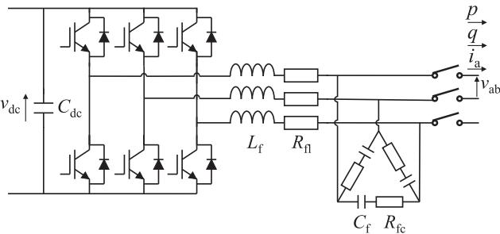  
Fig. 1. Circuit configuration of the grid-tied inverter.

TABLE I COMPARISON OF THE INVERTER MODELS   

<table><tr><td rowspan="2"></td><td colspan="3">Controls</td><td rowspan="2">Modeling of inverter circuit</td></tr><tr><td>(i) Power controls</td><td>(ii) Current control</td><td>(iii) Modulation</td></tr><tr><td>SW model</td><td>✓</td><td>✓</td><td>✓</td><td>switches</td></tr><tr><td>VI model</td><td>✓</td><td>✓</td><td>✓</td><td>voltage sources</td></tr><tr><td>AV model</td><td>✓</td><td>✓</td><td></td><td>voltage sources</td></tr><tr><td>CCI model</td><td>✓</td><td></td><td></td><td>current sources</td></tr><tr><td>SCI model</td><td></td><td></td><td></td><td>current sources</td></tr></table>

(-: included, no mark: excluded)

which each model can or cannot represent by comparing the simulated waveforms under various conditions. The computing time is compared in the Section V. Based on the results, the Section VI discusses the suitable model for each application. Finally, Section VII concludes this article.

# II. CONFIGURATION AND CONTROL OF THE GRID-TIED INVERTER

Fig. 1 shows the circuit configuration of the grid-tied inverter to be simulated. This article deals with a general three-phase bridge inverter. The ac terminal is connected to the ac inductor modeled by the inductance $L _ { \mathrm { f } }$ and the equivalent series resistance $R _ { \mathrm { { f } } }$ . The switching ripple filter consists of the capacitor $C _ { \mathrm { f } }$ and the series resistor $R _ { \mathrm { f c } }$ .

Fig. 2 shows the control block diagram of the grid-tied inverter [48]. It is divided into three parts: (i) power controls; (ii) current control; (iii) modulation. The power controls part in (i) consists of the dc voltage controller, the reactive power controller, and phase locked loop (PLL). This part generates the ac current references $i _ { d } ^ { * } , i _ { q } ^ { * }$ . The current control part in (ii) generates the ac voltage references $v _ { a } ^ { \ast } , v _ { b } ^ { \ast } , v _ { c } ^ { \ast }$ according to the ac current references. The modulation part in (iii) generates the gate signals of the inverter by the pulsewidth modulation (PWM).

# III. MODELING METHODS OF THE INVERTER

Table I summarizes the five models compared in this article. Each model contains different control parts and circuit components. The SW and VI models include all the control parts. The AV model excludes the modulation, and the CCI model further excludes the current control. The SCI model excludes all parts of the controller. The power stage of the inverter consists of voltage sources for the VI and AV models, and current sources for the

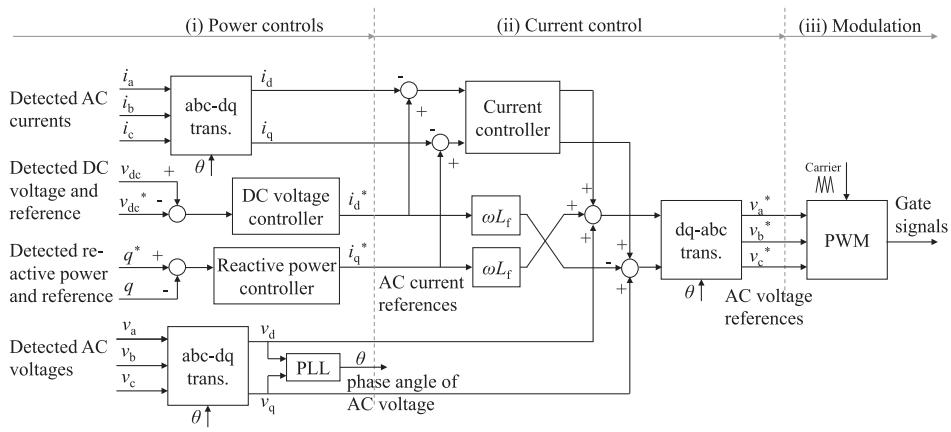  
Fig. 2. Control block diagram of the grid-tied inverter.

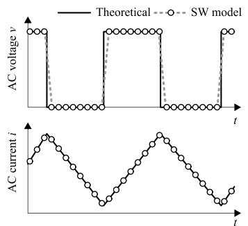

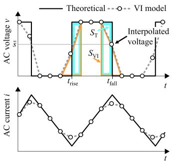  
(b）

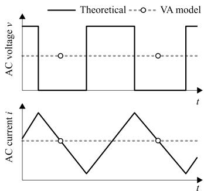  
(c）  
Fig. 3. AC voltage and current waveforms obtained by the SW model, VI model, and AV model.

CCI and SCI models. The following sections explain the details of these models.

# A. Switching Model (SW Model)

The SW model consists of the inverter circuit shown in Fig. 1 and the controller in Fig. 2. Each power device simulates the turn-ON and turn-OFF operations. There are several different methods to represent the power device in EMT simulations: ideal switch, ideal switch with passive components, and variable resistor having an ON resistance and an OFF resistance. Regardless of these modeling methods of the power device, this article treats them as the SW model. The SW model mimics all circuit components and control systems as they are in the actual converter. Therefore, it is the most detailed and complex among the five models, and it can simulate wide range of characteristics of the inverter.

Fig. 3 shows the ac voltage and current waveforms of the inverter obtained by each model. The solid line illustrates the theoretical waveform considering the actual switching operation, and the plots show the simulated result by each model. Fig. 3(a) depicts the result by the SW model. It simulates two-level PWM voltage and switching ripple current in the ac terminal. The simulation time step determines the resolution of the switching time in the SW model. If the SW model is used with a large simulation time step, the resolution of the switching time degrades, resulting in the increase of the error of the ac current.

Therefore, the SW model needs to be used with the simulation time step that is sufficiently smaller than the switching period. This increases the computing burden.

# B. Voltage Interpolation Model (VI Model)

The voltage interpolation model (VI model) was proposed for accurately simulating the harmonics caused by the inverter switching while using a larger simulation time step than the SW model. The method was originally proposed as the time average method [42], or subcycle average method [43], [44] for real-time simulations. Then, it was generalized for the offline EMT simulations [45]. Configuration of the control system is the same as the SW model. The difference exists in the modeling of the inverter circuit.

The VI model in Fig. 3(b) simulates two-level PWM voltage, but it inserts the interpolated voltage at the calculation step just before or after the switching transition $t _ { \mathrm { f a l l } }$ and $t _ { \mathrm { r i s e } }$ . The interpolated voltage is obtained by calculation as follows [45]. Fig. 4 shows the triangular carrier PWM with synchronous sampling, which is commonly used in digital control. The voltage reference $v ^ { * }$ is updated in synchronization with the triangular carrier $v _ { \mathrm { c a r r i e r } }$ . The slope of the carrier h is determined by the amplitude and frequency of the carrier. The accurate switching times $t _ { \mathrm { f a l l } }$ and $t _ { \mathrm { r i s e } }$ are obtained at $t _ { \mathrm { n - 1 } }$ and $t _ { \mathrm { n } } .$ , respectively, by algebraic calculation regardless of the simulation time step $T _ { \mathrm { s } } .$ The areas $S _ { \mathrm { T } }$ and $S _ { \mathrm { V I } }$ in Fig. 3(b) correspond to the integral

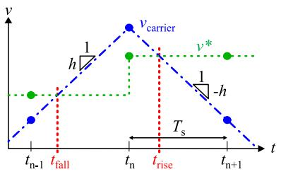  
Fig. 4. Triangular carrier PWM with synchronous sampling. $v ^ { * }$ is a sampled voltage reference and $v _ { \mathrm { c a r r i e r } }$ is a triangular carrier signal.

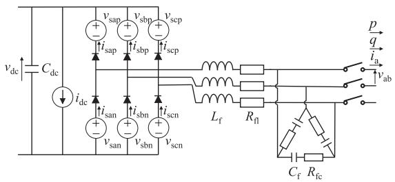  
Fig. 5. Configuration of the VI model.

of the ac voltage by the theoretical value $( t _ { \mathrm { f a l l } }$ and $t _ { \mathrm { r i s e } } )$ and by the VI model, respectively. The interpolated voltage s is given to make $S _ { \mathrm { V I } }$ to be equal to $S _ { \mathrm { T } }$ ¯in each calculation step. In the trapezoidal method of integration, such s is available by the following:

$$
\bar {s} = \frac {1}{2} + \frac {v ^ {*} - v _ {\text {c a r r i e r}}}{h T _ {\mathrm {s}}}. \tag {1}
$$

The method can eliminate the error due to the resolution of the switching time, which is the main reason to limit the simulation time step in the SW model. As a result, the VI model accurately simulates the ac current even with a larger simulation time step.

Fig. 5 shows the configuration of the VI model [43]. It consists of a controlled current source $i _ { \mathrm { d c } }$ , six controlled voltage sources, and six ideal diodes. The $i _ { \mathrm { d c } }$ operates to make the input power on the dc side be equal to the output power on the ac side. The voltage and currents are operated according to the switching functions $\bar { s } _ { \mathrm { a p } } , \bar { s } _ { \mathrm { b p } } , \bar { s } _ { \mathrm { c p } } , \bar { s } _ { \mathrm { a n } } , \bar { s } _ { \mathrm { b n } } , \bar { s } _ { \mathrm { c n } }$ as follows:

$$
v _ {\mathrm {s a p}} = \bar {s} _ {\mathrm {a n}} v _ {\mathrm {d c}}, v _ {\mathrm {s b p}} = \bar {s} _ {\mathrm {b n}} v _ {\mathrm {d c}}, v _ {\mathrm {s c p}} = \bar {s} _ {\mathrm {c n}} v _ {\mathrm {d c}}
$$

$$
v _ {\mathrm {s a n}} = \bar {s} _ {\mathrm {a p}} v _ {\mathrm {d c}}, v _ {\mathrm {s b n}} = \bar {s} _ {\mathrm {b p}} v _ {\mathrm {d c}}, v _ {\mathrm {s c n}} = \bar {s} _ {\mathrm {c p}} v _ {\mathrm {d c}}
$$

$$
\begin{array}{l} i _ {\mathrm {d c}} = \bar {s} _ {\mathrm {a n}} i _ {\mathrm {s a p}} + \bar {s} _ {\mathrm {b n}} i _ {\mathrm {s b p}} + \bar {s} _ {\mathrm {c n}} i _ {\mathrm {s c p}} \\ + \bar {s} _ {\mathrm {a p}} i _ {\mathrm {s a n}} + \bar {s} _ {\mathrm {b p}} i _ {\mathrm {b n}} + \bar {s} _ {\mathrm {c p}} i _ {\mathrm {s c n}}. \tag {2} \\ \end{array}
$$

Fig. 6 shows the operation and current path in the VI model. Each leg normally outputs the two-level voltage in the ac terminal by keeping one of the two control voltage sources $v _ { \mathrm { a p } }$ and $v _ { \mathrm { a n } }$ to 0 and the other to $v _ { \mathrm { d c } }$ . Fig. 6(a) shows the case when the upper arm is the OFF-state and the lower arm is the ON-state $( \bar { s } _ { \mathrm { a p } } = 0$ , $\bar { s } _ { \mathrm { a n } } = 1 )$ . In the actual circuit, the ac terminal current $i _ { \mathrm { s a } }$ = 0flows ¯ = 1to the terminal DC- refers to the terminal in Fig. 6(a). The VI model changes the current path according to the polarity of $i _ { \mathrm { s a } }$ . When $i _ { \mathrm { s a } } > 0 , i _ { \mathrm { s a } }$ flows through the diode of the lower arm. When $i _ { \mathrm { s a } } < 0 , i _ { \mathrm { s a } }$ flows through the diode of the upper arm, the 0voltage source $v _ { \mathrm { s a p } }$ , and the current source $i _ { \mathrm { d c } }$ . Fig. 6(b) shows

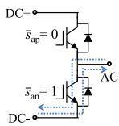

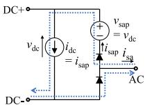

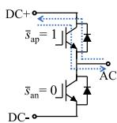  
(a)

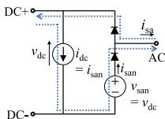

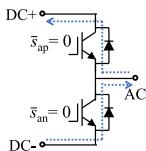

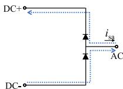  
（c）

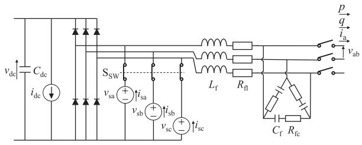  
Fig. 6. Current path of the VI model. The left side shows the actual inverter leg, and the right side shows the VI model.   
Fig. 7. Configuration of the AV model.

the case when the upper arm is ON-state and the lower arm is OFF-state $( \bar { s } _ { \mathrm { a p } } = 1 , \bar { s } _ { \mathrm { a n } } = 0 )$ . It is a symmetric operation as in ¯ = 1 ¯ = 0Fig. 6(a). At the calculation step before and after the switching events, s is given between 0 and 1 to insert the interpolated ¯voltage. The current path is the same as in Fig. 6(a) or (b); however, the voltage and current sources output intermediate values according to (2). Fig. 6(c) shows the case where both the upper and lower arms are in the OFF-state $( \bar { s } _ { \mathrm { a p } } = 0 , \bar { s } _ { \mathrm { a n } } = 0 )$ . ¯ = 0 ¯ = 0Because the current path changes according to the polarity of $i _ { \mathrm { s a } }$ , the model can simulate the operation during the blocking state and dead time.

# C. Average-Value Model (AV Model)

Average-value model (AV model) [32]–[36] has been used for simulating the dynamic characteristics of an inverter with a large simulation time step. The model does not deal with the switching or PWM operation, and the voltage reference given by the controller is directly output in the ac terminal.

Fig. 3(c) illustrates the simulated waveform by the AV model. The AV model directly outputs the voltage reference by controlled voltage source without PWM. This is equivalent to the averaged value of the inverter’s modulated voltage waveform over one carrier cycle. The ac current does not contain switching ripple.

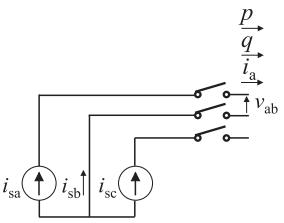  
Fig. 8. Configuration of the SCI model.

Fig. 7 shows the configuration of the AV model equipped with the diode rectifier [39]. It consists of controlled voltage sources $v _ { \mathrm { s a } } , v _ { \mathrm { s b } } , v _ { \mathrm { s c } } ,$ , a controlled current source $i _ { \mathrm { d c } }$ , a diode rectifier, and switches $\mathrm { S } _ { \mathrm { S W } }$ . According to the voltage references $v _ { \mathrm { a } } ^ { \ast } , v _ { \mathrm { b } } ^ { \ast }$ , $v _ { \mathrm { c } } ^ { \ast } ,$ S, the duty ratios $d _ { \mathrm { a } } , d _ { \mathrm { b } } , d _ { \mathrm { c } }$ are given in the range of 0 to 1. Then, the circuit components are operated as follows:

$$
\begin{array}{l} v _ {\mathrm {s a}} = d _ {\mathrm {a}} v _ {\mathrm {d c}} \\ v _ {\mathrm {s b}} = d _ {\mathrm {b}} v _ {\mathrm {d c}} \\ v _ {\mathrm {s c}} = d _ {\mathrm {c}} v _ {\mathrm {d c}} \\ i _ {\mathrm {d c}} = d _ {\mathrm {a}} i _ {\mathrm {s a}} + d _ {\mathrm {b}} i _ {\mathrm {s b}} + d _ {\mathrm {c}} i _ {\mathrm {s c}} \\ \mathrm {S} _ {\mathrm {S W}} = \left\{ \begin{array}{l} \text {c l o s e : S w i t c h i n g s t a t e} \\ \text {o p e n : B l o c k i n g s t a t e} \end{array} \right. \tag {3} \\ \end{array}
$$

where $i _ { \mathrm { s a } } , ~ i _ { \mathrm { s b } }$ , and $i _ { \mathrm { s c } }$ are the currents flowing the controlled voltage sources $v _ { \mathrm { s a } } , v _ { \mathrm { s b } }$ , and $v _ { \mathrm { s c } }$ . The controlled current source $i _ { \mathrm { d c } }$ operates to make the input power of the dc side be equal to the output power on the ac side. $\mathrm { S _ { S W } }$ is closed during the switching operation. Then, $v _ { \mathrm { s a } } , v _ { \mathrm { s b } }$ , and $v _ { \mathrm { s c } }$ are applied to the ac side of the diode bridge, whereas $v _ { \mathrm { d c } }$ is applied to the dc side. Because $d _ { \mathrm { a } } , d _ { \mathrm { b } } ,$ , and $d _ { \mathrm { c } }$ are given in the range from 0 to 1, $v _ { \mathrm { s a } } , v _ { \mathrm { s b } } .$ , and $v _ { \mathrm { s c } }$ take the range from 0 to $v _ { \mathrm { d c } }$ . Therefore, all of the diodes are reverse biased and kept OFF. The blocking state is simulated by the diode rectifier after opening $\mathrm { S } _ { \mathrm { S W } }$ .

# D. Simplified Current-Injection Model (SCI Model)

It is a common practice to model the inverter by a simple current source in the power system analysis. Although the simplified current-injection model (SCI model) has limitations in the simulation accuracy, it is included to the comparison.

Fig. 8 shows the configuration of the SCI model. The controlled current sources $i _ { \mathrm { s a } }$ and $i _ { \mathrm { s c } }$ inject sinusoidal ac currents. The current amplitude is calculated by dividing the output power reference by the rated ac voltage. Active power reference forms a current in phase with the grid voltage, whereas reactive power reference forms a current being orthogonal to the grid voltage. The phase angle of the grid voltage is calculated in advance by the power flow analysis and given to the model as a fixed value. This model includes no control components of the inverter. The SCI model does not have any dc terminal and dc circuit.

# E. Controlled Current-Injection Model (CCI Model)

The controlled current-injection model (CCI model) [41] consists of current sources and power controls to generate the current references for them. It can improve the accuracy while keeping

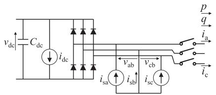  
Fig. 9. Configuration of the CCI model.

almost the same computing burden as the SCI model. Comparing to the AV model, the CCI model eliminates the current controller and the switching ripple filter. The CCI model can operate with a larger simulation time step than the AV model because the model does not have the controls and circuit elements which respond with short time constants.

Fig. 9 shows the configuration of the CCI model. The CCI model consists of controlled current sources $i _ { \mathrm { s a } } , i _ { \mathrm { s c } } , i _ { \mathrm { d c } }$ , and a diode rectifier. They are operated as follows:

$$
\begin{array}{l} i _ {\mathrm {s a}} = \mathrm {S} _ {\mathrm {S W}} \cdot i _ {\mathrm {a}} ^ {*} \\ i _ {\mathrm {s c}} = \mathrm {S} _ {\mathrm {S W}} \cdot i _ {\mathrm {c}} ^ {*} \\ i _ {\mathrm {d c}} = \left(v _ {\mathrm {a b}} i _ {\mathrm {s a}} + v _ {\mathrm {c b}} i _ {\mathrm {s c}}\right) / v _ {\mathrm {d c}} \\ \mathrm {S} _ {\mathrm {S W}} = \left\{ \begin{array}{l} 1: \text {S w i t c h i n g s t a t e} \\ 0: \text {B l o c k i n g s t a t e .} \end{array} \right. \tag {4} \\ \end{array}
$$

The current sources $i _ { \mathrm { s a } } , i _ { \mathrm { s c } }$ are controlled according to the ac current references $i _ { \mathrm { a } } ^ { * } , \ i _ { \mathrm { c } } ^ { * } ,$ , which are generated by dq-abc transformation of the references $i _ { \mathrm { d } } ^ { * } , i _ { \mathrm { q } } ^ { * }$ . Because the sum of the three-phase currents is zero, the two current sources $i _ { \mathrm { s a } }$ and $i _ { \mathrm { s c } }$ determines the remaining current $i _ { \mathrm { s b } }$ . The controlled current source $i _ { \mathrm { d c } }$ operates to make the input power of the dc side be equal to the output power on the ac side. The dc voltage of the inverter is maintained to be higher than the peak value of the ac grid voltage during the grid-tied operation. Thus, no current flows through the diode bridge. This means that the power of the ac side and that of the dc side are exchanged only by the controlled current sources. Even if there is a reverse power flow from the ac side to the dc side (e.g., PWM converter for battery storage), the power does not flow the diode bridge but it is transferred by way of the current sources. On the other hand, when the inverter is blocked, the current sources supply no current. Then, only the diode bridge remains in the circuit, which is the same circuit as the actual inverter in the blocking state.

# IV. COMPARISON OF DYNAMIC BEHAVIOR

This section compares the dynamic behavior of the inverter models. The comparison was conducted using the photovoltaic (PV) generation system shown in Fig. 10. Table II summarizes the circuit parameters. The PV array is connected to the medium-voltage distribution line by a grid-tied inverter and a grid-tied transformer. The distribution line is modeled by an inductance $L _ { \mathrm { l i n e } }$ and a resistance $R _ { \mathrm { l i n e } }$ which are equivalent to the overhead line, and a capacitance $C _ { \mathrm { l i n e } }$ which is equivalent to the line-to-ground capacitance of a branched cable. The simulation results were obtained by changing only the model

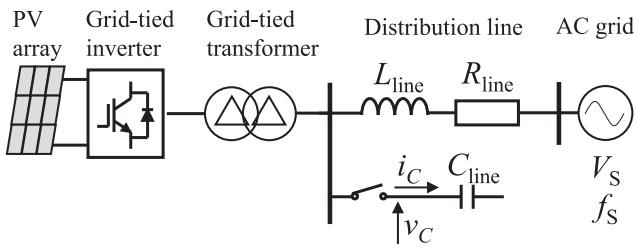  
Fig. 10. System configuration of the PV generation system.

TABLE II CIRCUIT PARAMETERS OF THE PV GENERATION SYSTEM   

<table><tr><td colspan="3">AC grid</td></tr><tr><td>AC voltage</td><td>VS</td><td>6.6 kV</td></tr><tr><td>AC frequency</td><td>fS</td><td>50 Hz</td></tr><tr><td colspan="3">Distribution line</td></tr><tr><td>Inductance of overhead line</td><td>Lline</td><td>9.7 mH</td></tr><tr><td>Resistance of overhead line</td><td>Rline</td><td>2.3 Ω</td></tr><tr><td>Capacitance of cable line</td><td>Cline</td><td>204 nF</td></tr><tr><td colspan="3">Grid-tied transformer (Δ - Δ connection)</td></tr><tr><td>Rated capacity</td><td></td><td>500 kVA</td></tr><tr><td>Rated voltage</td><td></td><td>6.6 kV / 420 V</td></tr><tr><td>Leakage inductance (placed in high voltage side Δ windings)</td><td></td><td>50 mH (6.0 %)</td></tr><tr><td colspan="3">Harmonic filter</td></tr><tr><td>AC inductor</td><td>Lf</td><td>0.11 mH (10 %)</td></tr><tr><td>Equivalent series resistance</td><td>Rfl</td><td>3.5 mΩ (1.0 %)</td></tr><tr><td>Filter capacitor</td><td>Cf</td><td>0.21 mF</td></tr><tr><td>Equivalent series resistance</td><td>Rfc</td><td>80 mΩ</td></tr><tr><td colspan="3">Grid-tied inverter</td></tr><tr><td>Carrier frequency</td><td></td><td>4.5 kHz</td></tr><tr><td>Rated converter capacity</td><td></td><td>500 kVA</td></tr><tr><td>Rated input voltage</td><td></td><td>DC 700 V</td></tr><tr><td>Rated output voltage</td><td></td><td>AC 420 V</td></tr><tr><td>DC capacitor</td><td>Cdc</td><td>41 mF</td></tr><tr><td colspan="3">PV array</td></tr><tr><td>Output power</td><td></td><td>500 kW</td></tr></table>

Percentage values are on a rated voltage and capacity base

of the grid-tied inverter except the SCI model. Because the SCI model does not have a dc terminal and PV array, it was operated according to the power reference. The simulation time step was set to 2 µ for the SW model, 10 µ for the VI model, s s100 µ for the AV model, 600 µ for the CCI model, and the s sSCI model. The modeling and simulation were carried out by the XTAP, which is an EMT simulation program developed by CRIEPI. XTAP is based on the nodal type analysis and fixed time-step simulation like EMTP and EMTDC [49]. It applies the sparse tableau method [50] for the formulation of the simulated circuits, and the two-stage diagonally implicit Runge–Kutta (2S-DIRK) method [51] for the numerical integration algorithm. The accuracy and the numerical stability of 2S-DIRK are almost the same as those of the trapezoidal method, while it can suppress sustained numerical oscillations unlike the trapezoidal method.

# A. Output Power Change

Fig. 11 shows the case when the generated output power was increased from 0 to 1 p.u. Each plot shows the line-to-line rms voltage $V _ { \mathrm { a b } }$ , the rms current $I _ { \mathrm { a } } ,$ , the active power $P ,$ and the reactive power Q. The waveforms of $V _ { \mathrm { a b } } , I _ { \mathrm { a } } , P , Q$ agreed well among the SW, VI, AV, and CCI models. However, the SCI model caused some amount of error in $V _ { \mathrm { a b } }$ and Q. When $P$

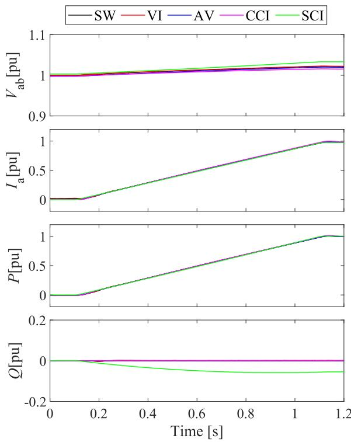  
Fig. 11. Waveforms during output power increase. The voltage $V _ { \mathrm { a b } }$ and current $I _ { \mathrm { a } }$ are shown in the rms values.

increases, the phase angle of the voltage at the inverter advances to the phase of the infinite bus. Because the SW, VI, AV, and CCI models are equipped with a PLL, their ac currents are controlled to follow the change of the voltage phase and keep Q to be constant. On the other hand, the SCI model does not have a PLL. Thus, it holds the phase angle of the ac current even if the voltage phase changes. This makes the phase difference between the voltage and current. Then, it causes the reactive power Q and increases the voltage $V _ { \mathrm { a b } }$ .

# B. Stability of Current Control

Fig. 12 shows the inverter current $i _ { \mathrm { a } }$ when the proportional gain of the current controller was changed. For the SW, VI, and AV models, the gain was increased to 2, 3, and 5 p.u. from the initial value of 1 p.u. to confirm the stability limit of the current control. The CCI and SCI models used the same parameters as the initial setting because they do not include the current controller in the model.

When the gain was 5 p.u., the SW, VI, and AV models simulated the instability of the current control with a highly distorted current waveform. When the gain was 2 p.u., continuous vibration was observed in the SW and VI models. The same vibration was observed in the AV model when the gain was 3 p.u. Although the AV model simulated the instability of the current control, there was a slight difference in the stability limit. The difference results from the exclusion of the modulation in the AV model. The CCI and SCI models were not able to simulate the unstable operation because they do not include the current controller. The CCI and SCI models are designed by

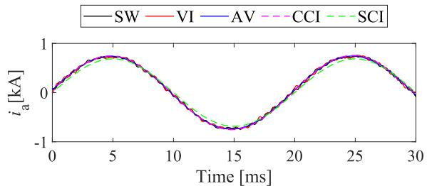  
(a)

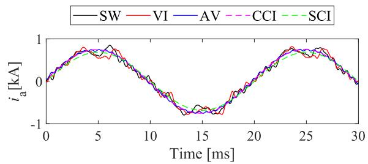  
(b)

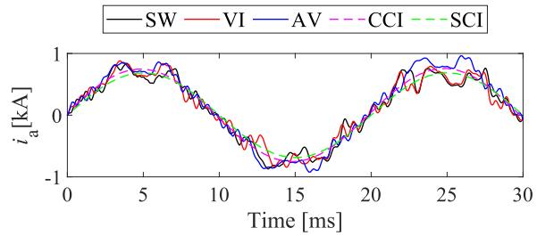  
  
Fig. 12. Waveforms under different current control gains. (a) Gain 2 p.u. (b) Gain 3 p.u. (c) Gain 5 p.u.

assuming the ideal current control. Thus, they cannot be used for the stability assessment of the current control.

# C. Resonance in High-Order Harmonics

Fig. 13 shows the case when a capacitance $C _ { \mathrm { l i n e } }$ is connected to the line. $C _ { \mathrm { l i n e } }$ corresponds to the line-to-ground capacitance of a branched cable. The $C _ { \mathrm { l i n e } }$ and the system impedance form a harmonic resonance point at 4.5 kHz, which is the carrier frequency of the inverter.

Fig. 13(a) indicates the simulated capacitor voltage $v _ { \mathrm { c } }$ and capacitor current $i _ { \mathrm { c } } .$ . Fig. 13(b) is the enlarged waveform. The SW and VI models were able to represent the resonance of switching frequency in $v _ { \mathrm { c } }$ and $i _ { \mathrm { c } } .$ . However, the AV, CCI, and SCI models did not simulate the high-order harmonic resonance because they can not deal with the switching operation of the inverter.

# D. Low-Order Harmonics Caused by the Inverter

This section examines the low-order harmonics caused by the inverter, especially resulting from the dead time of the inverter. The harmonics caused by the system side is discussed separately in the next section.

The SW and VI models can deal with a dead time in their switching leg. The dead time $T _ { \mathrm { d } }$ was set to 25 $\mu \mathrm { s }$ which is five

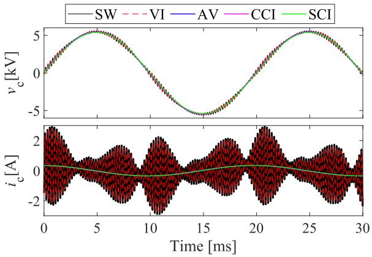  
(a)

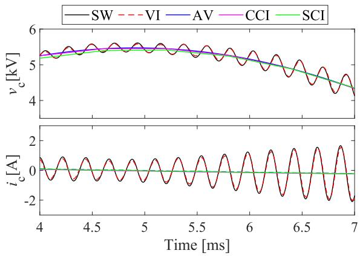  
(b)

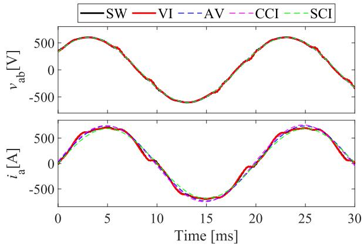  
Fig. 13. Waveforms with the resonance in high order harmonics. (a) Waveforms of 1.5 cycle. (b) Enlarged waveforms.   
Fig. 14. Waveforms with low-order harmonics caused by the inverter.

times larger than the default value to clarify the difference in the comparison. The current control gain was also decreased by a factor of ten to reduce the effect of the current controller to the low-order harmonics. The AV, CCI, and SCI models were used with the default setting because they cannot deal with the dead time and switching operation.

Fig. 14 shows the case when the inverter causes low order harmonics. The SW and VI models simulated the distortion in both $v _ { \mathrm { a k } }$ and $i _ { \mathrm { a } }$ at the timing of reversing the polarity of

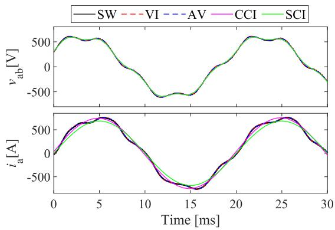  
Fig. 15. Waveforms when interacting with the low-order harmonics in power system.

the current $i _ { \mathrm { a } } .$ The AV, CCI, and SCI models did not simulate the low-order harmonics because they did not deal with the switching operation.

# E. Interaction With the Low-Order Harmonics in System Side

The simulation was performed under the condition that a fifth harmonic voltage with an amplitude of 10 % was superimposed on the fundamental voltage source $V _ { \mathrm { { S } } }$ . For the SW, VI, and AV models, the current control gain was decreased by a factor of ten to reduce the effect of the current controller on the harmonics.

Fig. 15 shows the case when the low order harmonics were superimposed on the system voltage. The SW, VI, and AV models simulate the distortion of $i _ { \mathrm { a } }$ due to the influence of the system voltage distortion. In general, a current-controlled inverter flows some amount of harmonic current when the system voltage contains low-order harmonics [52]. On the other hand, the CCI and SCI models were not influenced by the voltage distortion. This is because these models implement the current controller by ideal current sources.

# F. Voltage Sags at AC Terminal

Fig. 16 shows the case when a three-phase balanced voltage sag (100% decrease) occurred at the ac terminal. p and q denote the instantaneous active and reactive power. The voltage sag occurred at 20 ms and the voltage recovered at 90 ms. The inverter was in a blocking state (all gate inputs are zero) from 30 to 130 ms. The SW, VI, AV, and CCI models simulated the blocking operation and the restart after the voltage recovery. SW, VI, and AV models, in particular, represented the spike current and the resonance during the voltage sag, whereas the CCI model did not represent them. The SCI model did not simulate the blocking operation, and the model flowed a constant current during the voltage sag.

Fig. 17 shows the case when a voltage sag (100% decrease) occurred only at the a-phase. The unbalanced voltage sag occurred from 20 to 90 ms. In this case, the inverter continued its operation without blocking the gate. The SW, VI, AV, and CCI models simulated the increase of $i _ { \mathrm { a } }$ during the voltage sag. The increase occurred because the active power control increased the ac current to maintain the output power. They also simulated the

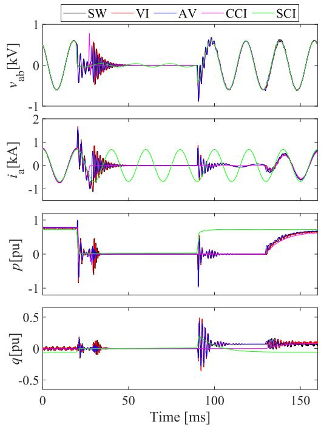  
Fig. 16. Waveforms with a balanced voltage sag at ac terminal.

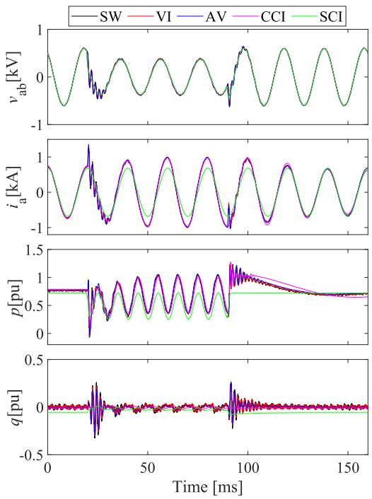  
Fig. 17. Waveforms with an unbalanced voltage sag at ac terminal.

vibration of $p$ resulting from the voltage unbalance. The CCI model represented these behaviors well except the spike current and the resonance, whereas the SCI model did not simulate them.

# G. Short Circuit at DC Terminal

Assuming a dc circuit fault, the dc terminal of the inverter was shorted. The SCI model was excluded from the comparison because it does not have a dc terminal.

TABLE III COMPUTING TIME OF EACH MODEL   

<table><tr><td>Model</td><td>Simulation time step</td><td>Simulation period \( {T}_{\text{sim }} \)</td><td>Computing time \( {T}_{\text{mes }} \)</td><td>\( {T}_{\text{mes }}/{T}_{\text{sim }} \)</td><td>Ratio of \( {T}_{\text{mes }}/{T}_{\text{sim }} \)</td></tr><tr><td>SW model</td><td>\( {2\mu }\mathrm{s} \)</td><td>1 s</td><td>45 s</td><td>45.0</td><td>100 %</td></tr><tr><td>VI model</td><td>10 μs</td><td>5 s</td><td>42 s</td><td>8.4</td><td>19 %</td></tr><tr><td>AV model</td><td>100 μs</td><td>70 s</td><td>48 s</td><td>0.69</td><td>1.5 %</td></tr><tr><td>CCI model</td><td>600 μs</td><td>500 s</td><td>46 s</td><td>0.092</td><td>0.20 %</td></tr><tr><td>SCI model</td><td>600 μs</td><td>800 s</td><td>45 s</td><td>0.056</td><td>0.13 %</td></tr></table>

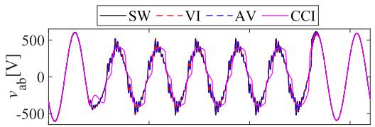

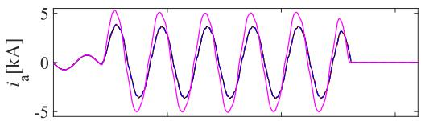

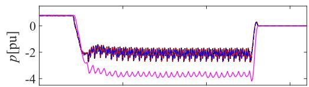

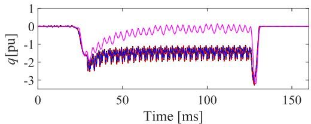  
Fig. 18. Waveforms with a short circuit in the dc terminal.

Fig. 18 shows the case when the dc terminal of the inverter was shorted at 20 ms. The inverter blocked its gate signals at 30 ms. Then, the inverter was disconnected by opening the ac circuit breaker at 130 ms. The SW, VI, and AV models simulated the diode rectifier operation of the inverter during the fault. The fault current flowed from the ac terminal through the inverter until opening the circuit breaker. The CCI model caused error in the current $i _ { \mathrm { a } } .$ the active power $p ,$ and the reactive power $q .$ The error results from the difference of the converter circuit modeling. The CCI model excludes the ac inductor. It reduces the impedance and affects the magnitude of the short-circuit current.

# V. COMPARISON OF COMPUTING TIME

Table III summarizes the computing time required to perform a simulation using each model. To measure the computing time $T _ { \mathrm { m e s } }$ accurately, simulation period $T _ { \mathrm { s i m } }$ (length of the event to be simulated) was adjusted according to the difference of the simulation time step. The comparison is carried out by the computing time per simulation period $T _ { \mathrm { m e s } } / T _ { \mathrm { s i m } } .$ .

Comparing to the SW model, the VI, AV, and CCI models were able to reduce the $T _ { \mathrm { { m e s } } } / T _ { \mathrm { { s i m } } }$ to 19%, 1.5%, and 0.20%, respectively. The reduction is mainly caused by their large simulation time step. $T _ { \mathrm { { m e s } } } / T _ { \mathrm { { s i m } } }$ decreases almost inversely proportional to

the simulation time step. The CCI model requires 60% longer computing time than the SCI model whereas it uses the same simulation time step. The difference results from the power controls included in the CCI model.

# VI. SELECTION OF MODELING METHOD

This section discusses which inverter model can be applied for each simulation purpose based on the results in the previous sections.

# A. Harmonic Analyses

EMT simulations are applied to investigate a high-order harmonic resonance caused by the switching ripple and low-order harmonics caused by the inverter [2], [3]. The SW and VI models can properly simulate both the low-order and the high-order harmonics caused by the inverters as confirmed in the Sections IV-C, IV-D, and IV-E. The VI model is suitable because the computing time is smaller than the SW model. The AV model is also applicable if the focus is not on the harmonics caused by the inverter but on the effect of the power system harmonics to the inverter.

# B. Evaluation of the Inverter Control Stability

EMT simulations are used to evaluate the stability regarding inverter control [4], and to design the controller for system stabilization [5]. It is also applied to evaluate the harmonic stability caused by the interaction between the power system and the inverter [6], [7]. An important factor for these analyses is the dynamics of the current controller in the inverter. The SW, VI, and AV models meet the requirement because they are equipped with the current controller and reflect the dynamics. However, the stability limit deviates slightly in the AV model as discussed in Section IV-B. Thus, it is recommended to select the VI and AV models properly according to the analysis requirements. The VI model is suitable if high accuracy is required, and the AV model is suitable if computing time is more important.

# C. Interaction With System Fault

The EMT simulations are applied to investigate the transient characteristics under the system fault [8], [9], to design the protection method [10], and to assess the compliance with the grid code such as FRT [11]. These analyses at least require to simulate the dynamics of voltage and current under a voltage sag or three-phase imbalance caused by the faults. The SW, VI, AV, and CCI models meet the requirement as confirmed

in Section IV-F. However, the CCI model cannot accurately deal with the spike current and overvoltage caused by the fast voltage changes. If the analysis focuses on these high frequency behaviors, it is preferable to use the SW, VI, and AV models which include the current controller and the ac filter. In addition, SW, VI, and AV models can also simulate the fault in the dc circuit as confirmed in Section IV-G. The AV model is suitable because the computing time is the smallest among them.

# D. Transient Stability and Voltage Analyses

Recent studies adopt EMT simulations for the grid-scale transient stability and voltage analyses although phasor domain simulations have been a major method for such analyses. Inverters are recently expected to support the grid voltage and frequency by the active and reactive power control [12], [13], or grid-forming control [14]–[16]. EMT simulations are suitable for modeling and simulating these inverter controls in detail. There is a report that over-optimistic stability results are obtained by the phasor domain simulation depending on the control characteristics of the grid forming inverter [17]. For such analyses, it is necessary to simulate the dynamics of the active and reactive power output of the inverter. The SW, VI, AV, and CCI models meet the requirement as confirmed in Section IV-A. The CCI model is suitable because the computing time is the smallest among them. Although the EMT simulation requires higher computing burden than the phasor domain simulation, the CCI model reduces the computing time by a factor of 500 from the SW model. Therefore, the proper selection of the modeling method enables to perform the grid-scale simulation within a practical time.

# E. Verification of Circuit Topology and Control Method

This article investigated the simple three-phase inverter circuit shown in Fig. 1. However, the actual grid-tied inverters may have a different circuit configuration such as a multilevel converter. It is necessary to use the SW model in examining the circuit topology itself and the control method for the peculiar circuit. Because the SW model includes all elements in the converter, it can simulate the operation of the actual equipment regardless of the circuit topology.

# VII. CONCLUSION

This article has compared various modeling methods of the grid-tied inverters for power system analyses and clarified the suitable model for each application. We focused on five modeling methods: SW, VI, AV, CCI, and SCI models. First, the article introduced the configuration and operating principle of these models. Then, we have carried out the simulations by these models under various conditions. The simulation results clarified the events that can be simulated and the events that cannot be simulated by each model. We also compared the computing times of the models. It revealed that the computing time varies significantly among the models. Based on these results, we discussed which model is suitable for each simulation purpose to reduce the computing burden while maintaining sufficient accuracy. Moreover, all modeling methods compared in this

article are applicable to the existing EMT simulation algorithm. Thus, the users can improve the accuracy and efficiency of the simulations with their familiar EMT simulation tools.

# REFERENCES

[1] A. Ametani, “Electromagnetic transients program: History and future,” IEEJ Trans. Elect. Electron. Eng., vol. 16, no. 9, pp. 1150–1158, 2021.   
[2] R. O. Anurangi, A. S. Rodrigo, and U. Jayatunga, “Effects of high levels of harmonic penetration in distribution networks with photovoltaic inverters,” in Proc. IEEE Int. Conf. Ind. Inf. Syst., 2017, pp. 1–6.   
[3] N. Okada, K. Sano, Y. Noda, and K. Fukushima, “An analysis of harmonic disturbances in distribution systems caused by grid-connected inverters: Experimental verification of high-order harmonic resonance,” in Proc. Int. Conf. Exhib. Elect. Distrib., Jun. 2019, no. 1513, pp. 1–5.   
[4] Z. Li and M. Shahidehpour, “Small-signal modeling and stability analysis of hybrid AC/DC microgrids,” IEEE Trans. Smart Grid, vol. 10, no. 2, pp. 2080–2095, Mar. 2019.   
[5] Z. Li, C. Zang, P. Zeng, H. Yu, S. Li, and J. Bian, “Control of a grid-forming inverter based on sliding-mode and mixed $H _ { 2 } / H _ { \infty }$ control,” IEEE Trans. Ind. Electron., vol. 64, no. 5, pp. 3862–3872, May 2017.   
[6] X. Wang, F. Blaabjerg, and W. Wu, “Modeling and analysis of harmonic stability in an AC power-electronics-based power system,” IEEE Trans. Power Electron., vol. 29, no. 12, pp. 6421–6432, Dec. 2014.   
[7] L. Xu and L. Fan, “Impedance-based resonance analysis in a VSC-HVDC system,” IEEE Trans. Power Del., vol. 28, no. 4, pp. 2209–2216, Oct. 2013.   
[8] M. A. Zamani, A. Yazdani, and T. S. Sidhu, “A control strategy for enhanced operation of inverter-based microgrids under transient disturbances and network faults,” IEEE Trans. Power Del., vol. 27, no. 4, pp. 1737–1747, Oct. 2012.   
[9] L. Ye, H. B. Sun, X. R. Song, and L. C. Li, “Dynamic modeling of a hybrid wind/solar/hydro microgrid in EMTP/ATP,” Renewable Energy, vol. 39, no. 1, pp. 96–106, 2012.   
[10] Y. Zhang, Y. Li, J. Song, B. Li, and X. Chen, “A new protection scheme for HVDC transmission lines based on the specific frequency current of DC filter,” IEEE Trans. Power Del., vol. 34, no. 2, pp. 420–429, Apr. 2019.   
[11] M. Garcia-Gracia, N. El Halabi, H. Ajami, and M. P. Comech, “Integrated control technique for compliance of solar photovoltaic installation grid codes,” IEEE Trans. Energy Convers., vol. 27, no. 3, pp. 792–798, Sep. 2012.   
[12] Z. Ye, J. J. Hong, and G. Li, “Energy management strategy of islanded microgrid based on power flow control,” in Proc. IEEE PES Innov. Smart Grid Technol., 2012, pp. 1–8.   
[13] N. Veerakumar et al., “Fast active power-frequency support methods by large scale electrolyzers for multi-energy systems,” in Proc. IEEE PES Innov. Smart Grid Technol. Europe, 2020, pp. 151–155.   
[14] M. Ndreko, S. Ruberg, and W. Winter, “Grid forming control scheme for power systems with up to 100% power electronic interfaced generation: A case study on Great Britain test system,” IET Renewable Power Gener., vol. 14, no. 8, pp. 1268–1281, May 2020.   
[15] D. Pattabiraman, R. H. Lasseter, and T. M. Jahns, “Transient stability modeling of droop-controlled grid-forming inverters with fault current limiting,” in Proc. IEEE Power Energy Soc. Gen. Meeting, 2020, pp. 1–5.   
[16] D. Lepour, M. Paolone, G. Denis, C. Cardozo, T. Prevost, and E. Guiu, “Performance assessment of synchronous condensers vs voltage source converters providing grid-forming functions,” in Proc. IEEE Madrid PowerTech, 2021, pp. 1–6.   
[17] W. Du, A. Singhal, F. K. Tuffner, and K. P. Schneider, “Comparison of electromagnetic transient and phasor-based simulation for the stability of grid-forming-inverter-based microgrids,” in Proc. IEEE Power Energy Soc. Innov. Smart Grid Technol. Conf., 2021, pp. 1–5.   
[18] X. Song et al., “Research on performance of real-time simulation based on inverter-dominated power grid,” IEEE Access, vol. 9, pp. 1137–1153, 2021, doi: 10.1109/ACCESS.2020.3016177.   
[19] S. R. Sanders, J. M. Noworolski, X. Z. Liu, and G. C. Verghese, “Generalized averaging method for power conversion circuits,” IEEE Trans. Power Electron., vol. 6, no. 2, pp. 251–259, Apr. 1991.   
[20] A. Hariri and M. O. Faruque, “A hybrid simulation tool for the study of PV integration impacts on distribution networks,” IEEE Trans. Sustain. Energy, vol. 8, no. 2, pp. 648–657, Apr. 2017.   
[21] D. Shu, X. Xie, Q. Jiang, Q. Huang, and C. Zhang, “A novel interfacing technique for distributed hybrid simulations combining EMT and transient stability models,” IEEE Trans. Power Del., vol. 33, no. 1, pp. 130–140, Feb. 2018.

[22] Q. Huang and V. Vittal, “Advanced EMT and phasor-domain hybrid simulation with simulation mode switching capability for transmission and distribution systems,” IEEE Trans. Power Syst., vol. 33, no. 6, pp. 6298–6308, Nov. 2018.   
[23] K. Mudunkotuwa, S. Filizadeh, and U. Annakkage, “Development of a hybrid simulator by interfacing dynamic phasors with electromagnetic transient simulation,” IET Gener., Transmiss. Distrib., vol. 11, no. 12, pp. 2991–3001, Sep. 2017.   
[24] Z. Shen and V. Dinavahi, “Dynamic variable time-stepping schemes for real-time FPGA-based nonlinear electromagnetic transient emulation,” IEEE Trans. Ind. Electron., vol. 64, no. 5, pp. 4006–4016, May 2017.   
[25] Y. Song, Y. Chen, S. Huang, Y. Xu, Z. Yu, and W. Xue, “Efficient GPUbased electromagnetic transient simulation for power systems with threadoriented transformation and automatic code generation,” IEEE Access, vol. 6, pp. 25724–25736, 2018, doi: 10.1109/ACCESS.2018.2833506.   
[26] D. Shu, Y. Wei, V. Dinavahi, K. Wang, Z. Yan, and X. Li, “Cosimulation of shifted-frequency/dynamic phasor and electromagnetic transient models of hybrid LCC-MMC DC grids on integrated CPU-GPUs,” IEEE Trans. Ind. Electron., vol. 67, no. 8, pp. 6517–6530, Aug. 2020.   
[27] D. Shu, X. Xie, Q. Jiang, G. Guo, and K. Wang, “A multirate EMT cosimulation of large AC and MMC-based MTDC systems,” IEEE Trans. Power Syst., vol. 33, no. 2, pp. 1252–1263, Mar. 2018.   
[28] H. Zhao, S. Fan, and A. Gole, “Equivalency of state space models and EMT companion circuit models,” in Proc. Int. Conf. Power Syst. Transients, 2019, pp. 1–5.   
[29] A. Semlyen and F. de Leon, “Computation of electromagnetic transients using dual or multiple time steps,” IEEE Trans. Power Syst., vol. 8, no. 3, pp. 1274–1281, Aug. 1993.   
[30] J. J. Sanchez-Gasca, R. D’Aquila, W. W. Price, and J. J. Paserba, “Variable time step, implicit integration for extended-term power system dynamic simulation,” in Proc. Power Ind. Comput. Appl. Conf., 1995, pp. 183–189.   
[31] W. Nzale, J. Mahseredjian, I. Kocar, X. Fu, and C. Dufour, “Two variable time-step algorithms for simulation of transients,” in Proc. IEEE Milan PowerTech, 2019, pp. 1–6.   
[32] S. Chiniforoosh et al., “Definitions and applications of dynamic average models for analysis of power systems,” IEEE Trans. Power Del., vol. 25, no. 4, pp. 2655–2669, Oct. 2010.   
[33] H. Atighechi et al., “Dynamic average-value modeling of CIGRE HVDC benchmark system,” IEEE Trans. Power Del., vol. 29, no. 5, pp. 2046–2054, Oct. 2014.   
[34] H. Ouquelle, L. A. Dessaint, and S. Casoria, “An average value modelbased design of a deadbeat controller for VSC-HVDC transmission link,” in Proc. IEEE PES Gen. Meeting, 2009, pp. 1–6.   
[35] J. Peralta, H. Saad, S. Dennetiere, and J. Mahseredjian, “Dynamic performance of average-value models for multi-terminal VSC-HVDC systems,” in Proc. IEEE PES Gen. Meeting, 2012, pp. 1–8.   
[36] R. Yonezawa et al., “Development of detailed and averaged models of large-scale PV power generation systems for electromagnetic transient simulations under grid faults,” in Proc. IEEE PES Innov. Smart Grid Technol. Asia, 2016, pp. 98–104.   
[37] R. Middlebrook and S. Cuk, “A general unified approach to modelling switching-converter power stages,” in Proc. IEEE Power Electron. Specialists Conf., 1976, pp. 18–34.   
[38] R. W. Erickson, S. Cuk, and R. D. Middlebrook, “Large-signal modelling and analysis of switching regulators,” in Proc. IEEE Power Electron. Specialists Conf., 1982, pp. 240–250.   
[39] T. Kikuma and N. Okada, “Averaged converter model with rectifier circuit for high-speed transient analysis,” (in Japanese) in Proc. Annu. Conf. Power Energy Soc., IEE Japan, Sep. 2016, no. 257, pp. 1–2.   
[40] F. Milano, “On current and power injection models for angle and voltage stability analysis of power systems,” IEEE Trans. Power Syst., vol. 31, no. 3, pp. 2503–2504, May 2016.   
[41] K. Sano, R. Yonezawa, and T. Noda, “An electromagnetic transient simulation model of grid-connected inverters for dynamic voltage analysis of distribution systems,” Elect. Eng. Jpn., vol. 206, pp. 11–21, Feb. 2019.   
[42] K. L. Lian and P. W. Lehn, “Real-time simulation of voltage source converters based on time average method,” IEEE Trans. Power Syst., vol. 20, no. 1, pp. 110–118, Feb. 2005.   
[43] J. Allmeling and N. Felderer, “Sub-cycle average models with integrated diodes for real-time simulation of power converters,” in Proc. IEEE Southern Power Electron. Conf., 2017, pp. 1–6.   
[44] S. Zhao, N. Felderer, and J. Allmeling, “Real-time simulation of threephase current source inverter using sub-cycle averaging method,” in Proc. IEEE 21st Workshop Control Model. Power Electron., 2020, pp. 1–6.

[45] S. Horiuchi, K. Sano, and T. Noda, “An inverter model simulating accurate harmonics with low computational burden for electromagnetic transient simulations,” IEEE Trans. Power Electron., vol. 36, no. 5, pp. 5389–5397, May 2021.   
[46] D. Maksimovic, A. M. Stankovic, V. J. Thottuvelil, and G. C. Verghese, “Modeling and simulation of power electronic converters,” Proc. IRE, vol. 89, no. 6, pp. 898–912, Jun. 2001.   
[47] H. Saad et al., “Dynamic averaged and simplified models for MMC-based HVDC transmission systems,” IEEE Trans. Power Del., vol. 28, no. 3, pp. 1723–1730, Jul. 2013.   
[48] F. Blaabjerg, R. Teodorescu, M. Liserre, and A. V. Timbus, “Overview of control and grid synchronization for distributed power generation systems,” IEEE Trans. Ind. Electron., vol. 53, no. 5, pp. 1398–1409, Oct. 2006.   
[49] T. Noda, “XTAP,” in Numerical Analysis of Power System Transients and Dynamics. London, U.K.: IET, Jan. 2015, ch. 5, pp. 169–211.   
[50] G. Hachtel, R. Brayton, and F. Gustavson, “The sparse tableau approach to network analysis and design,” IEEE Trans. Circuit Theory, vol. 18, no. 1, pp. 101–113, Jan. 1971.   
[51] T. Noda, K. Takenaka, and T. Inoue, “Numerical integration by the 2- stage diagonally implicit Runge-Kutta method for electromagnetic transient simulations,” IEEE Trans. Power Del., vol. 24, no. 1, pp. 390–399, Jan. 2009.   
[52] CIGRE JWG C4/C6.29 “Power quality aspects of solar power,” Cigre, Paris, France, Cigre Tech. Brochure 672, Dec. 2016.

Kenichiro Sano (Member, IEEE) received the B.S. degree in international development engineering and the M.S. and Ph.D. degrees in electrical and electronic engineering from the Tokyo Institute of Technology, Tokyo, Japan, in 2005, 2007, and 2010, respectively.

From 2008 to 2010, he was a JSPS Research Fellow. In 2008, he was a Visiting Scholar with Virginia Polytechnic Institute and State University, Blacksburg, VA, USA. From 2010 to 2018, he was a Research Scientist with the Central Research Institute of Electric Power Industry, Yokosuka, Japan. In 2018,

he joined the Tokyo Institute of Technology, where he is currently an Assistant Professor with the Department of Electrical and Electronic Engineering. His current research interests include power electronics for utility applications, high-voltage dc transmission systems, and power system quality.

Shuntaro Horiuchi received the M.S. degree in electrical and electronic engineering from the Tokyo Institute of Technology, Tokyo, Japan, in 2021.

Since 2021, he has been working with Electric Power Development Co., Ltd. (J-POWER), Tokyo, Japan. His research interests include inverter modeling for electromagnetic transient simulations.

Taku Noda (Senior Member, IEEE) was born in Osaka, Japan, in 1969. He received the B.Eng., M.Eng., and Ph.D. degrees from Doshisha University, Kyoto, Japan, in 1992, 1994, and 1997, respectively.

In 1997, he joined the Central Research Institute of Electric Power Industry (CRIEPI), Yokosuka, Japan, where he is currently the DX Research Strategist with Grid Innovation Research Lab. He was a Visiting Scientist with the University of Toronto, Toronto, ON, Canada during 2001–2002 and an Adjunct Professor with Doshisha University during 2005–2008. He was

a Lecturer with the Shibaura Institute of Technology, Tokyo, Japan, during 2012–2015.

Dr. Noda serves as the Chairperson of the IEEE Power and Energy Society Japan Joint Chapter. He is an Editor for the IEEE TRANSACTIONS ON POWER DELIVERY during 2008–2014. He was a recipient of the Best Paper Award in 2008 and the Progress Award twice in 2009 and 2016 from the Institute of Electrical Engineers of Japan (IEEJ) and also the Electrical Science and Engineering Promotion Award in 2016 from its foundation.