# Fine-grained hardware resource optimization and design for FPGA-based real-time simulation of large-scale renewable energy generations


Yanfei Li a , Zhiying Wang a,* , Xiaopeng Fu a , Peng Li a , Ligang Zhao b , Xiaoshan Wu b

a Key Laboratory of Smart Grid of Ministry of Education, Tianjin University, Tianjin 300072, China   
b China Southern Power Grid Electric Power Research Institute, Guangzhou 510663, China

# A R T I C L E I N F O

Keywords:

Real-time simulation

Renewable energy generation

Field-programmable gate array

Hardware resource optimization

Automatic hardware description language generation

# A B S T R A C T

Real-time simulation of renewable energy generations (REGs) is essential for the development and testing of centralized scheduling controllers, inverter controllers and edge computing devices. The rapid expansion of renewable energy has brought tremendous computational challenges to the real-time simulation of REGs, particularly control system solutions. This study proposes a fine-grained hardware resource optimization and design method for real-time simulation of REG control system based on field-programmable gate array (FPGA). A hardware resource demand model is built at the arithmetic operation level. The minimum solution time and hardware resource constraints are considered. A detailed hardware design and automatic hardware description language generation method are proposed to rapidly generate the functional hardware modules for the REG control system solution. Real-time simulations of two REG systems integrated with 15 detailed modeling photovoltaic (PV) arrays and 15 wind turbines (WTs) have been conducted on a single FPGA, respectively. The simulation time-step of the PV-REG system is 9 μs and the time-step for the WT-REG system is 10 μs. Compared with the traditional hardware design, the hardware resource utilization has been reduced by 30% approximately. The relative error is less than 0.5% in contrast with the commercial off-line transient simulation software PSCAD/EMTDC.

# 1. Introduction

The large-scale integration of renewable energy generations (REGs) into a regional distribution grid changes the system topology and operation mode [1,2]. The integration of such REGs introduces various renewable energy generators, high-frequency power electronics and controllers, thereby rendering system dynamic characteristics more complex [3,4]. Electromagnetic transient (EMT) simulations are required to capture the fast transients in microseconds and reproduce the transient behavior of REGs with high fidelity [5,6]. Real-time EMT simulations facilitate hardware-in-the-loop tests and rapid system characteristic analysis of physical devices in REG systems, particularly the renewable energy power generation equipment and converter controllers [7,8]. A high-performance real-time simulator is required for evaluating various physical devices in different scenarios [9,10].

The rapid expansion of REGs has resulted in tremendous computational challenges to the real-time EMT simulation. An REG system comprises hundreds of renewable energy power generation equipment, converters and controllers. This yields a simulation system with

hundreds or even thousands of nodes [11]. Real-time EMT simulations for such large-scale systems are time-consuming and computationally demanding. On the other hand, the high-frequency power electronic converters in REG systems require mandatory time-steps typically ranging from a few to dozens of microseconds [12,13]. Under the strict real-time constraint, the accurate solution for large-scale REGs further increases the computational burden on the underlying hardware.

In the real-time EMT simulation of REGs, system elements can be categorized into electrical and control elements [14]. The modeling and solving of these two categories of elements are conducted separately in the electrical and control systems. Considering the strong nonlinear characteristics inherent in renewable energy generation equipment, such as photovoltaic (PV) arrays and wind turbine generators (WTGs), it is preferable to model and simulate them in the more flexible control system [15]. Massive renewable energy generation equipment, grid-tied converter controllers and system-level controllers complicate the control system, and consequently, scale up the simulations [16]. In particular, in the simulation of REGs, the control system outperforms the electrical system at the simulation scale and consumes more hardware resources [17]. The efficient control system solution has become a

<table><tr><td colspan="2">Nomenclature</td><td>tSTa
tLi</td><td>arithmetic unit</td></tr><tr><td>Indices</td><td></td><td></td><td>Start time of the input data for theith floating-point arithmetic operation of theith type of floating-point arithmetic unit</td></tr><tr><td>m,l</td><td>Indices of the type of the floating-point arithmetic units from 1 to NAU</td><td>Tmin</td><td>Total clock cycles consumed by the control system solution</td></tr><tr><td>i</td><td>Index of theithtype of floating-point arithmetic operation from 1 to Nl</td><td>nPD
tLi</td><td>Total amount of theithtype of floating-point arithmetic units occupied at theithclock cycle</td></tr><tr><td>j</td><td>Index of the mthtype of floating-point arithmetic operation from 1 to Nm</td><td>dm,j,li</td><td>Data latency between theithfloating-point arithmetic operation of the mthtype of floating-point arithmetic unit and theithfloating-point arithmetic operation of theithtype of floating-point arithmetic unit</td></tr><tr><td>u,v,w</td><td>Indices of the Floyd-Warshall algorithm matrix ranks from 1 to NFW</td><td></td><td></td></tr><tr><td>t</td><td>Index of the clock cycles from 1 to T</td><td>δPD
tLi,i</td><td>Flag indicating if the input data of theithfloating-point arithmetic operation of theithtype of floating-point arithmetic unit is entered at theithclock cycle</td></tr><tr><td>Variables</td><td></td><td></td><td></td></tr><tr><td>R</td><td>Total ALM and BMB hardware resources consumed by the REG control system solution</td><td>δSTA
tLi,i</td><td>Flag indicating if the data input of theithfloating-point arithmetic operation of theithtype of floating-point arithmetic unit begins at theithclock cycle</td></tr><tr><td>RALM,RBMB</td><td>ALM and BMB hardware resources consumed by the REG control system solution, respectively</td><td></td><td></td></tr><tr><td>γMUX,γFIFO</td><td>ALM hardware resources consumed by the multiplexers and data buffering FIFOs, respectively</td><td>tEND
tLi,i</td><td>End time of the input data for theithfloating-point arithmetic operation of theithtype of floating-point arithmetic unit</td></tr><tr><td>nAU,m,nAU</td><td>Total amount of theithandithtype of floating-point arithmetic units, respectively</td><td></td><td></td></tr><tr><td>γAU,m,AU</td><td>ALM and BMB hardware resources consumed by theithandithtypes of floating-point arithmetic units, respectively</td><td>δEND
tLi,i</td><td>Flag indicating if the data input of theithfloating-point arithmetic operation of theithtype of floating-point arithmetic unit ends at theithclock cycle</td></tr><tr><td>γFIFO</td><td>BMB hardware resources consumed by the data buffering FIFOs</td><td></td><td></td></tr><tr><td>δFIFO</td><td></td><td></td><td></td></tr><tr><td>δm,j,li</td><td>Flag indicating if data buffering is enabled between theithfloating-point arithmetic operation of theithtype of floating-point arithmetic unit and theithfloating-point arithmetic operation of theithtype of floating-point arithmetic unit</td><td>Parameters
NAU</td><td>Total amount of the floating-point arithmetic unit types</td></tr><tr><td></td><td></td><td>NI,Nm</td><td>Total amount of theithandithtype of floating-point arithmetic operations, respectively</td></tr><tr><td></td><td></td><td>AFIFO,BFIFO</td><td>The fixed ALM and BMB hardware resource consumption of a data buffering FIFO, respectively</td></tr><tr><td>DFW</td><td>Distance matrix</td><td></td><td></td></tr><tr><td>RFW</td><td>Routing matrix</td><td></td><td></td></tr><tr><td>duv,duw,dwv</td><td>Elements in row u and column v, row u and column w, row w and column v of the distance matrix DFW, respectively</td><td>in</td><td>Total amount of the inputs for theithtype of floating-point arithmetic unit</td></tr><tr><td>ruv,ruw,rwv</td><td>Elements in row u and column v, row u and column w, row w and column v of the routing matrix RFW, respectively</td><td>FW</td><td>The dimension of the distance matrix DFW and the routing matrix RW</td></tr><tr><td>δAU</td><td>Flag indicating if the result of theithfloating-point arithmetic operation of theithtype of floating-point arithmetic unit is the input of theithfloating-point arithmetic operation of theithtype of floating-point arithmetic unit</td><td>LAT
tLi</td><td>Computation output latency of theithtype of floating-point arithmetic unit</td></tr><tr><td>m,j,li</td><td></td><td></td><td></td></tr><tr><td>STAm,j</td><td>Start time of the input data for theithfloating-point arithmetic operation of theithtype of floating-point arithmetic unit</td><td>ss</td><td>Total amount of the REG control subsystems</td></tr><tr><td></td><td></td><td>M</td><td>A sufficiently large number for linearizing the constraint</td></tr></table>

critical issue for the real-time simulation of REGs.

Processing hardware is another aspect that limits the real-time EMT simulation efficiency of REGs. Existing simulators are typically sup ported by high-performance CPUs or multiprocessors. In [18], the realtime simulation of a grid-connected PV system with six arrays was conducted on a 4-core-CPU-based real-time simulator to verify the inverter controllers in the hardware-in-the-loop test. In [19], the realtime simulation of a wind farm with 30 averaged-value modeled WTGs was realized using a PC-cluster-based real-time simulator. In [20], a PC-cluster-based real-time simulator was used to obtain the detailed transient behaviors of a grid-connected wind farm including 10 WTGs with a time-step of 50 μs. In [21], an offshore wind farm comprising 25 averaged-value and five detailed switching models of WTGs was simulated using a CPU-based real-time simulator. In the CPU-based real-time simulators, the underlying computations are processed in serial. The

simulators provide generic solutions for REGs and other power systems [22,23]. For large-scale REGs, the acceleration of the calculation of control systems is expected to improve the real-time simulation efficiency.

Compared to CPU-based simulation tools, simulators based on fieldprogrammable gate arrays (FPGAs) offer prominent advantages in spatial–temporal parallel computation [24,25]. Owing to the large number of parallel computing units, distributed storage resources and deep pipelined computation capabilities inherent in FPGA, the real-time simulation for complex power systems is feasible [26]. In most existing FPGA-based simulators, the control system is modeled and solved using specific hardware blocks that are manually built according to the input–output relationships between the control elements [27]. Parallel computing for the control system has been primarily implemented based on the experience of the researchers [28]. However, the potential

parallel computing relationships among the underlying mathematical operations have not been fully exploited, resulting in the inefficient utilization of computational resources [29]. In addition, the manual building of hardware blocks is time consuming and difficult, particularly for REG systems with large-scale and complex control systems. The hardware redesign is required for a new target system. Automatic hardware module generation using optimized parallel hardware resources is essential to simplify the design process and improve simulation efficiency.

This study proposes a fine-grained hardware resource optimization and design method for the FPGA-based real-time simulation of largescale REG control systems. According to the control element types and topology connections of the REG control system, the hardware resource demand model is established. The Floyd-Warshall algorithm is used to calculate the shortest solution time as the solution time constraint. The hardware resource constraints including the dependency between arithmetic operations, available arithmetic units and data buffering are also considered. By combining the hardware resource demand model and constraints, the hardware resource optimization model is obtained and solved, formulating the optimized hardware design scheme. The detailed hardware design for the control system and the automatic hardware description language (HDL) generation method are proposed. Real-time simulations of two modified REG test systems integrated with WTGs and PVs are conducted on FPGA, respectively. The simulation results are compared with those of a commercial EMT simulation tool to demonstrate the correctness of the proposed method. Traditional hardware design for the REG test systems is also realized to verify the effectiveness of the proposed hardware design.

The primary contributions of this study are summarized as follows:

1) A fine-grained hardware resource optimization method for the FPGA-based real-time simulation of the REG control system is proposed. A hardware resource optimization model is constructed, and the shortest solution time constraint is considered. The obtained optimization strategy ensures that the hardware resource consumption is reduced and the simulation scale is improved.   
2) A detailed hardware design for FPGA-based real-time simulation of REGs is proposed. It is comprised of global control, data integration, core computation, data storage and buffering and electrical system solving modules. The calculation data and floating-point arithmetic operations of the REG control system are processed in pipelines on the hardware modules, which improves the simulation speed.   
3) An automatic HDL generation method for FPGA-based real-time simulation of the REG control system is proposed. Functional hardware modules described by the hardware language are rapidly generated. The automatic HDL generation method improves the modeling efficiency of REGs.

The remainder of this paper is organized as follows. Section II presents the hardware resource optimization for the FPGA-based real-time simulation of the REG control system. The detailed hardware design and automatic HDL generation method are proposed in Section III. The verification of the proposed method and hardware design is conducted in Section IV. The conclusions are stated in Section V.

# 2. Hardware resource optimization for FPGA-based real-time simulation of REGs

In this section, the hardware resource demand for the target REG control system is analyzed first. Then, the shortest solution time determined by the longest computation path in the control system is calculated. Furthermore, the hardware resource optimization model is built according to the demand model, as well as the solution time and available FPGA resource constraints. After solving the optimization model, the optimization strategy for the hardware design is obtained, which indicates the number of hardware units, start time of each

floating-point arithmetic operation and specified floating-point arithmetic unit for each floating-point arithmetic operation. The hardware resource optimization process for the FPGA-based real-time simulation of REGs is illustrated in Fig. 1.

# 2.1. Hardware resource demand model

In the FPGA-based real-time simulation of REGs, the control system solution is obtained using dedicated hardware resources, that is, the computation and storage units. These are indicated by adaptive logic modules (ALMs) and block memory bits (BMBs) on FPGA. Thus, the numbers of ALMs and BMBs are employed as indicators to quantify the computation and storage resource demands. The ALMs are consumed by first-in-first-out (FIFO), multiplexers and floating-point arithmetic units such as adders and multipliers. The BMBs are consumed by FIFOs and floating-point arithmetic units. The hardware resource demand for the real-time simulation of the REG control system is given by:

$$
\boldsymbol {R} = \left[ \begin{array}{l l} R _ {\mathrm {A L M}} & R _ {\mathrm {B M B}} \end{array} \right] \tag {1}
$$

$$
R _ {\mathrm {A L M}} = \gamma_ {\mathrm {A L M}} ^ {\mathrm {M U X}} + \gamma_ {\mathrm {A L M}} ^ {\mathrm {F I F O}} + \sum_ {i = 1} ^ {N _ {\mathrm {A U}}} n _ {i} ^ {\mathrm {A U}} \gamma_ {i, \mathrm {A L M}} ^ {\mathrm {A U}} \tag {2}
$$

$$
R _ {\mathrm {B M B}} = \gamma_ {\mathrm {B M B}} ^ {\mathrm {F I F O}} + \sum_ {j = 1} ^ {N _ {\mathrm {A U}}} n _ {j} ^ {\mathrm {A U}} \gamma_ {j, \mathrm {B M B}} ^ {\mathrm {A U}} \tag {3}
$$

The mathematical solution of the REG control system can be decomposed into several fundamental floating-point arithmetic operations conducted using the floating-point arithmetic units on FPGA. Considering that the middle calculation data may be used by two disconnected floating-point arithmetic operations, FIFOs are inserted to store the data temporarily. The hardware resource demand for data buffering FIFOs can be expressed by:

$$
\gamma_ {\mathrm {A L M}} ^ {\mathrm {F I F O}} = L _ {\mathrm {F I F O}} \sum_ {m = 1} ^ {N _ {\mathrm {A U}}} \sum_ {l = 1} ^ {N _ {\mathrm {A U}}} \sum_ {j = 1} ^ {N _ {m}} \sum_ {i = 1} ^ {N _ {l}} \delta_ {m, j, l, i} ^ {\mathrm {F I F O}} \tag {4}
$$

$$
\gamma_ {\mathrm {B M B}} ^ {\mathrm {F I F O}} = M _ {\mathrm {F I F O}} \sum_ {m = 1} ^ {N _ {\mathrm {A U}}} \sum_ {l = 1} ^ {N _ {\mathrm {A U}}} \sum_ {j = 1} ^ {N _ {m}} \sum_ {i = 1} ^ {N _ {l}} \delta_ {m, j, l, i} ^ {\mathrm {F I F O}} \tag {5}
$$

Notably, floating-point arithmetic units often process data from other units. A multiplexer is required to combine data from several units in series, and is connected to the input interface of the floating-point arithmetic unit. For an $m ^ { \mathrm { { t h } } }$ type floating-point arithmetic unit with $n _ { m } ^ { i , n }$ inputs that requires n calculation operations, $n _ { m } ^ { i , n }$ multiplexers with n inputs are required. In $\mathrm { F P G A } ,$ an n-input multiplexer comprises n twoinput multiplexers. Accordingly, the ALM resource demand for the multiplexers is proportional to the number of floating-point arithmetic operations conducted in each unit. Thus, the hardware resource demand for all multiplexers is described as:

$$
\gamma_ {\mathrm {A L M}} ^ {\mathrm {M U X}} = L _ {\mathrm {M U X}} \sum_ {m = 1} ^ {N _ {\mathrm {A U}}} n _ {m} ^ {\text {i n}} N _ {m} \tag {6}
$$

# 2.2. Solution time constraint

In the FPGA-based real-time simulator, the solution time during each time step is the product of the driven clock period and number of clock cycles. The driven clock period is determined by the time latency between the registers and clock skew, which is dependent on the complexity of the hardware design. The number of clock cycles is selected as a quantitative indicator of the solution time constraint.

In the real-time simulation, the control systems were sequentially solved according to the input–output relationships between the control elements. For the feedback loops, a time-step delay was inserted to eliminate iteration time uncertainty [30]. The connectivity of the control system can be described by a directed acyclic graph (DAG) [31]. Each floating-point arithmetic operation and its output latency are recognized as a node and the length of the path between the node and the next-connecting node, respectively. In a DAG, the longest path that

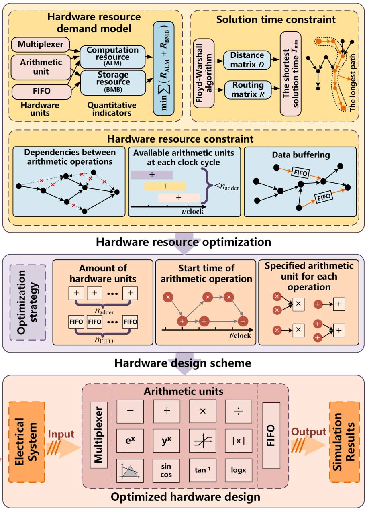  
  
Fig. 1. Hardware resource optimization process for the FPGA-based real-time simulation of REGs.

connects the start and end nodes of the graph always exists. Path length represents the minimum solution time for the entire control system. To determine the longest path and obtain the minimum solution time, the Floyd-Warshall algorithm is adopted [32]. The distance matrix $D _ { \mathrm { F W } }$ representing the longest path length and routing matrix $\pmb { R } _ { \mathrm { F W } }$ storing the longest path information are defined by (7) and (8), respectively. $D _ { \mathrm { F W } }$ and $\pmb { R } _ { \mathrm { F W } }$ are updated by iterating through each node. The longest paths and distances between any two nodes are then obtained. The detailed process is as follows:

$$
\boldsymbol {D} _ {\mathrm {F W}} = \left[ d _ {w} \right] _ {N _ {\mathrm {F W}} \times N _ {\mathrm {F W}}} \tag {7}
$$

$$
\boldsymbol {R} _ {\mathrm {F W}} = \left[ \boldsymbol {r} _ {u v} \right] _ {N _ {\mathrm {F W}} \times N _ {\mathrm {F W}}} \tag {8}
$$

(1) Initialize $D _ { \mathrm { F W } }$ and ${ \pmb R } _ { \mathrm { F W } } { \dagger }$ for any two nodes, u and v.

$$
r _ {u v} = \nu \tag {9}
$$

If node u and node v are directly connected, $d _ { w }$ is set to the length of the path between nodes u and v; if they are not directly connected, $d _ { w }$ is

set to $" - \infty "$

(2) For any two nodes u and $\nu ,$ iterate through all other nodes w; if

$$
d _ {u w} + d _ {w v} \geq d _ {u v} \tag {10}
$$

then

$$
d _ {u v} = d _ {u w} + d _ {w v} \tag {11}
$$

$$
r _ {u v} = r _ {u w} \tag {12}
$$

otherwise, the distance matrix and routing matrix remain unchanged.

(3) By iterating all the pairs of nodes, the maximum value in $D _ { \mathrm { F W } }$ is the length of the longest path, which is also the shortest solution time $T _ { \mathrm { m i n } }$ for the control system.

The shortest solution time is recognized as the solution time constraint and participates in the following resource optimization calculation.

# 2.3. Hardware resource optimization

# 2.3.1. Hardware resource optimization model

In general, in FPGA-based real-time simulators, the solution time and hardware resource consumption are two conflicting items. Considering that the solution time determines the minimum real-time simulation time-step, the hardware resource consumption is compromised to guarantee simulation accuracy. In this study, a hardware resource optimization model is proposed to minimize hardware resource consumption under the shortest solution time constraint. The objective function is established as:

$$
\min  f = w _ {\mathrm {A L M}} R _ {\mathrm {A L M}} + w _ {\mathrm {B M B}} R _ {\mathrm {B M B}} \tag {13}
$$

where $w _ { \mathrm { A L M } }$ and $w _ { \mathrm { B M B } }$ are the weight coefficients for the ALM and BMB resource consumption, respectively, which are determined by the actual hardware resources available on FPGA.

The following constraint conditions for the real-time simulation are considered:

(1) Constraints on dependencies between floating-point arithmetic operations. Each floating-point arithmetic operation waits until the previous floating-point arithmetic operations are completed before starting execution. The dependency constraints are expressed as:

$$
\delta_ {m, j, l, i} ^ {\mathrm {A U}} \cdot \left(t _ {m, j} ^ {\mathrm {S T A}} + t _ {m} ^ {\mathrm {L A T}}\right) \leq t _ {l, i} ^ {\mathrm {S T A}} \quad \forall m, \forall j, \forall l, \forall i \tag {14}
$$

$$
t _ {l, i} ^ {\mathrm {S T A}} \geq 0 \quad \forall l, \forall i \tag {15}
$$

$$
t _ {l, i} ^ {\mathrm {S T A}} + t _ {l} ^ {\mathrm {L A T}} \leq T _ {\min } \quad \forall l, \forall i \tag {16}
$$

(2) Constraints on the number of floating-point arithmetic units. Within each clock cycle of $T _ { \mathrm { m i n } } ,$ , if n floating-point arithmetic operations of the $l ^ { \mathrm { t h } }$ type are performed simultaneously, n floating-point arithmetic units of the $l ^ { \mathrm { t h } }$ type are required. For all clock cycles of $T _ { \mathrm { m i n } } .$ , the required maximum number of floating-point arithmetic units should be limited to $n _ { l } ^ { \mathrm { A U } }$ . The following constraints can be described by:

$$
\max  n _ {t, l} ^ {\mathrm {P D}} \leq n _ {l} ^ {\mathrm {A U}} \quad \forall l, t \in \left[ 0, T _ {\min } \right] \tag {17}
$$

(3) Data buffer constraints. When the output data from a floatingpoint arithmetic operation are not immediately utilized, additional hardware resources are required for data buffering.

$$
d _ {m, j, l, i} = \delta_ {m, j, l, i} ^ {\mathrm {A U}} \cdot \left(t _ {l, i} ^ {\mathrm {S T A}} - t _ {m, j} ^ {\mathrm {S T A}} - t _ {m} ^ {\mathrm {L A T}}\right) \quad \forall m, \forall j, \forall l, \forall i \tag {18}
$$

$$
\delta_ {m, j, l, i} ^ {\text {F I F O}} = \left\{ \begin{array}{l l} 0 & d _ {m, j, l, i} = 0 \\ 1 & d _ {m, j, l, i} \neq 0 \end{array} \quad \forall m, \forall j, \forall l, \forall i \right. \tag {19}
$$

# 2.3.2. Hardware resource optimization solution

The hardware resource optimization model is an integer nonlinear programming problem. To solve this problem, the original hardware resource model must be linearized as follows.

1) Equation (17) is reformulated by (20)-(26)

$$
n _ {t, l} ^ {\mathrm {P D}} = \sum_ {i = 1} ^ {n _ {l}} \delta_ {t, l, i} ^ {\mathrm {P D}} \quad \forall l, \forall i, t \in [ 0, T _ {\min } ] \tag {20}
$$

$$
t _ {l, i} ^ {\mathrm {S T A}} = \sum_ {t = 1} ^ {T _ {\min }} t \cdot \delta_ {t, l, i} ^ {\mathrm {S T A}} \quad \forall l, \forall i \tag {21}
$$

$$
\sum_ {t = 1} ^ {T _ {\min }} \delta_ {t, l, i} ^ {\mathrm {S T A}} = 1 \quad \forall l, \forall i \tag {22}
$$

$$
t _ {l, i} ^ {\text {E N D}} = \sum_ {t = 1} ^ {T _ {\min }} t \cdot \delta_ {t, l, i} ^ {\text {E N D}} \quad \forall l, \forall i \tag {23}
$$

$$
\sum_ {t = 1} ^ {T _ {\min }} \delta_ {t, l, i} ^ {\mathrm {E N D}} = 1 \quad \forall l, \forall i \tag {24}
$$

$$
\delta_ {t, l, i} ^ {\mathrm {P D}} = \delta_ {t - 1, l, i} ^ {\mathrm {P D}} + \delta_ {t, l, i} ^ {\mathrm {S T A}} - \delta_ {t, l, i} ^ {\mathrm {E N D}}, \delta_ {0, l, i} ^ {\mathrm {P D}} = 0 \quad \forall l, \forall i \tag {25}
$$

$$
\sum_ {t = 1} ^ {T _ {\min }} \delta_ {t, l, i} ^ {\mathrm {P D}} = n _ {\mathrm {s s}} \quad \forall l, \forall i \tag {26}
$$

2) Equation (19) is linearized and reformulated using (27)

$$
- \delta_ {m, j, l} ^ {\mathrm {F I O}} \mathrm {M} \leq d _ {m, j, l} = \delta_ {m, j, l} ^ {\mathrm {F I O}} \mathrm {M} \quad \forall m, \forall j, \forall l, \forall i \tag {27}
$$

The hardware design scheme for the control system solution can be obtained by solving the hardware optimization model. It includes the number of required floating-point arithmetic units, multiplexers and FIFOs, the start time of each floating-point arithmetic operation and the specified floating-point arithmetic unit in which the floating-point arithmetic operation is performed.

# 3. Detailed hardware design for the FPGA-based real-time simulation of REGs

This section presents the hardware design architecture for the FPGAbased real-time simulation of REGs. The operating mechanisms of the functional hardware modules are introduced in detail. An automatic HDL generation method is proposed to build the functional modules on FPGA according to the optimization strategy.

# 3.1. Hardware design architecture

The hardware design architecture for the FPGA-based real-time simulation of REGs is shown in Fig. 2. It is comprised of five modules: global control, data integration, core computation, data storage and buffering and electrical system modules. The hardware design for the electrical system module was realized in a previous study [33], and is not the focus of this study. The other modules are as follows.

(1) The global control module comprises a timer and a signal generator. It sends control signals to the data integration module and selects the required data for each clock cycle according to the time schedule of the floating-point arithmetic operations. It also regulates the input and output data of the data storage and buffering module according to the time schedule. In addition, the data exchange between the electrical and control systems is also controlled via this module.   
(2) The data integration module comprises several multiplexers. It merges the intermediate calculation data from the core computation module and data storage and buffering module as well as the data from the electrical system solving module into a single data stream.   
(3) The core computation module comprises several floating-point arithmetic units, such as floating-point adders and multipliers. These units are used to perform all floating-point arithmetic operations required for the control system solution.   
(4) The data storage and buffering module comprises FIFOs. It caches the intermediate data from the floating-point arithmetic units and simulation results from the control system to the electrical system.

# 3.2. Module operating mechanism

To illustrate the operation mechanism of the functional hardware modules, the Park transformation is taken as an example, as shown in Fig. 3(a). The arithmetic operations of the Park transformation include four add operations, five multiplication operations, one sine operation and one cosine operation.

Following hardware resource optimization, the core computation module for the Park transformation comprised one adder, two multipliers, one sine unit and one cosine unit. The latency of each type of

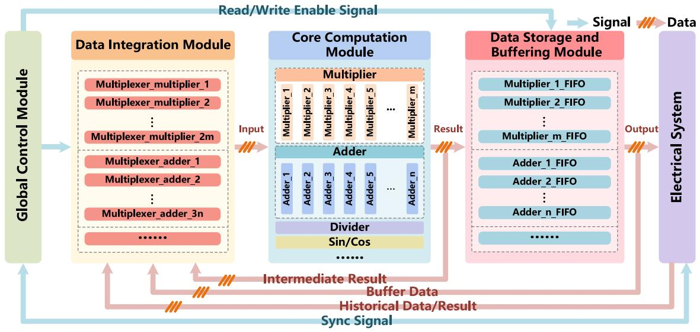  
Fig. 2. Hardware design architecture for the FPGA-based real-time simulation of REGs.

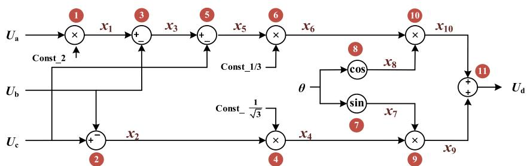  
(a) Park transformation

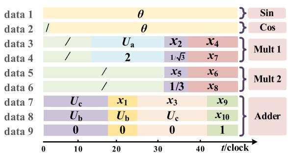  
(b) Data streams of the data integration module

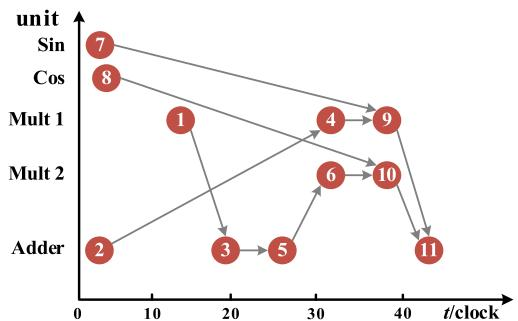  
(c) Processing time schedule   
Fig. 3. Hardware module operation mechanism.

arithmetic unit is 7, 5, 36 and 35 clock cycles. Add operations #2, #3, #5 and #11 are performed on the adder; multiplication operations #1, #4 and #9 are performed on multiplier $\# 1 ;$ multiplication operations #6 and #10 are performed on multiplier #2; and sine operation #7 and cosine operation #8 are performed on the sine and cosine units, respectively, as shown in Fig. 3 (b). The processing schedule for the arithmetic units during each time step is shown in Fig. 3(c). The start time $t ^ { S \mathrm { T A } }$ and end time $t ^ { \mathrm { E N D } }$ of each arithmetic operation are listed in Table 1.

At the beginning of each time-step, the historical data θ and electrical

system data $U _ { \mathrm { a } } , \ U _ { \mathrm { b } }$ and $U _ { \mathrm { c } }$ are sent to the multiplexers in the data integration module simultaneously. The data integration module then outputs nine data streams, which are sent to the specified arithmetic units. The calculation result $U _ { \mathrm { d } }$ of the core computation module is stored in the data storage and buffering modules. Notably, the intermediate calculation data x are cached and sent back to the arithmetic unit; thus, the start time of arithmetic operation #4 is delayed by 24 clock cycles.

# Table 1

Start and end time of each floating-point arithmetic operation.   

<table><tr><td>Number of the operation</td><td>1</td><td>2</td><td>3</td><td>4</td><td>5</td><td>6</td><td>7</td><td>8</td><td>9</td><td>10</td><td>11</td></tr><tr><td>Start time tSTA/clock cycle</td><td>13</td><td>1</td><td>18</td><td>32</td><td>25</td><td>32</td><td>1</td><td>2</td><td>37</td><td>37</td><td>42</td></tr><tr><td>End time tEND/clock cycle</td><td>18</td><td>8</td><td>25</td><td>37</td><td>32</td><td>37</td><td>37</td><td>37</td><td>42</td><td>42</td><td>49</td></tr></table>

# 3.3. Automatic HDL generation

The hardware design architecture and functional modules are uni versal for the real-time simulation of REGs. However, for an actual REG system, the generation of the specific hardware modules described by the hardware language specified by the optimization strategy remains complicated. An automatic HDL generation method is proposed to rapidly generate the functional modules. This method is derived from automatic code generation technology, which is a software engineering practice that aids developers in quickly creating program code architectures or generating repetitive and patterned code [34,35]. The automatic HDL generation approach is divided into three steps: rewriting the optimization strategy into the input file, installing the architecture into the template file and executing the HDL generator with the input and template files.

# 3.3.1. Optimization strategy description

The information for each floating-point arithmetic operation representing the optimization strategy is recorded in the input file. This includes the start time during each time step, specified floating-point arithmetic unit number and information of the input data. A specific label is attached to the information that can be accurately identified by the HDL generator. The input file also records the number of each type of floating-point arithmetic unit. A detailed account of each floating-point arithmetic operation comprises the following six items.

Item 1: floating-point arithmetic operation type.

Item 2: number of units in which the floating-point arithmetic operation is performed.

Item 3: start time of the floating-point arithmetic operation.

Item 4: type of floating-point arithmetic operation that provides input data.

Item 5: number of units on which the arithmetic operation that provides the input data is performed.

Item 6: start time of the floating-point arithmetic operation that provides input data.

# 3.3.2. Nested template structure

In the template file, fundamental hardware blocks, such as the variable definition block, timer, signal generator, multiplexer, various types of arithmetic units and FIFOs are defined and described by the fixed HDL. The hardware blocks are categorized into three types of objects in the template file.

Static objects: These objects are generic hardware blocks for all realtime simulations such as floating-point arithmetic units, timer, signal generator, multiplexer and FIFO. During the automatic generation, these hardware blocks are copied directly by the HDL generator without

modification.

Dynamic objects: These objects are hardware blocks that vary according to the simulation case. For example, the output time of an instantiated signal generator varies for different simulation cases. During automatic generation, the hardware language description of the instantiated signal generator is obtained by determining the output time using Item 3:

Nested objects: These objects are the hardware modules wherein several functional hardware modules or blocks are packaged. There are three layers of nesting in the template file, as shown in Fig. 4. In the first layer, the global control, data integration, core computation and data storage and buffering modules are packaged and nested. In the second layer, the instantiated floating-point arithmetic units, multiplexer and FIFO are nested in the core computation, data integration, data storage and buffering modules, respectively. In the third layer, generic hardware blocks are nested into instantiated blocks.

# 3.3.3. HDL generator

The HDL generator reads the input and template files to automatically generate the hardware language description of the hardware modules for the real-time simulation of the target REG system. First, the generator defines the floating-point arithmetic units and timer in the source HDL file of the global control module based on the static objects specified in the template file. The generator allocates a specified number of units to the core computing module based on the number of floatingpoint arithmetic units of each type indicated in the input file. For each floating-point arithmetic operation, it sets up the signal generator for the data integration module in the global control module, guided by Item 1- Item 3. In addition, the HDL generator assigns an appropriate number of multiplexers and configures their inputs in the source HDL file for the data integration module according to the number of inputs for each type of floating-point arithmetic unit and Items 4- Item 6. It also generates the hardware description for the FIFOs used in the data storage and buffering module based on Items 3- Item 6 as well as its signal generator in the global control module. Finally, a source hardware block that enables data exchange with the electrical system is created using the HDL generator, which is directly from the static objects identified in the template file. Through these steps, the HDL generator completes the description of the hardware blocks for the control system solution module as shown in Fig. 5. The description of the HDL code is listed in Appendix A. The schematic of HDL design is given by Appendix B.

# 4. Case studies

In this section, real-time simulation of a PV generation system and a permanent magnet direct drive wind power generation system [36] are

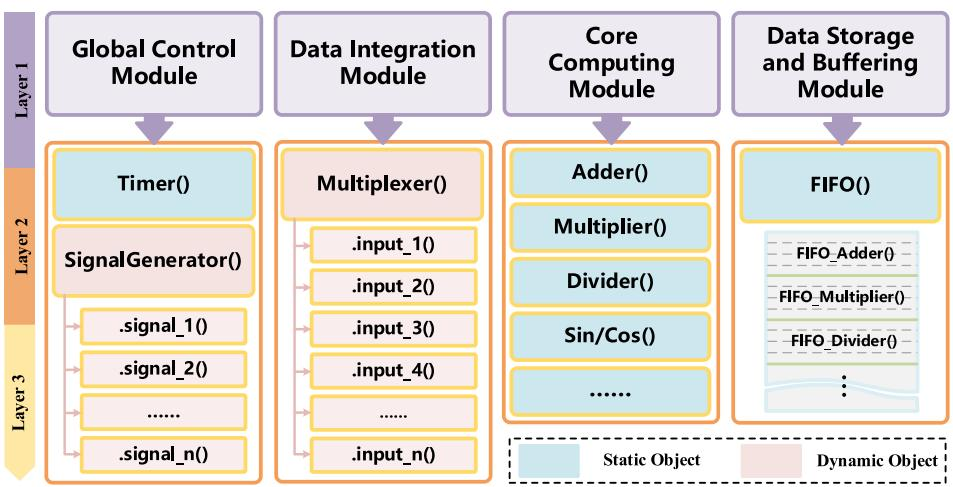  
Fig. 4. Nested template structure.

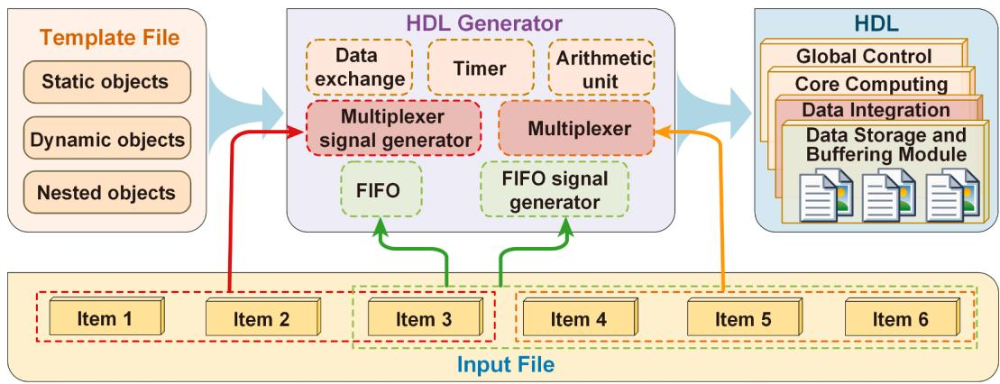  
Fig. 5. Automatic HDL generation process for the FPGA-based real-time simulation of REGs.

conducted on the Intel Stratix® V Edition DSP FPGA EP5SGSMD5K2F40C2 development board. The hardware platform is shown in Fig. 6, which is comprised of a host PC and an FPGA board. The FPGA board is communicated with the host PC via the Peripheral Component Interconnect express (PCIe). To verify the effectiveness of the proposed hardware design, real-time simulations of the two test cases using the traditional hardware design are also realized as a contrast. In the traditional hardware design, the hardware blocks for the control system solution are manually built based on experience [30]. The simulation results are compared with those from PSCAD/EMTDC to validate the correctness of the proposed design.

# 4.1. PV generation system

In this section, a low-voltage PV generation system with 15 detailed modelling PV units is simulated, as shown in Fig. 7. The detailed parameters are presented in Appendix C. Each PV array is connected to the point of common coupling (PCC) via a DC/AC inverter, LC filter and step-up transformer. An outer-loop $U _ { \mathrm { d c } ^ { - } } Q$ control strategy and an innerloop current control strategy are adopted for the inverter controller. The PV array and inverter controller are solved in the control system. The DC/AC inverter is represented by the switching-function model. The PV generation system is decomposed into 15 PV subsystems and a network. The PV subsystems are processed in a pipeline on FPGA. The real-time simulation time-step is 9 μs. The driven clock frequency of the hardware circuit is 160 MHz. A Phase-A grid voltage sag as low as 0.2 p.u. occurs at the PCC of PV unit #4 in 2.70 s and lasts for 0.18 s.

# 4.1.1. Efficiency validation

The PV generation system includes 15 PV units and a network. The dimension of the entire admittance matrix is approximately 400 and the control system includes 2850 nodes. To verify the effectiveness of the proposed hardware design, the real-time simulation using the traditional design is also performed. The hardware resource utilization and time consumption for both hardware designs are presented in Table 2. As can be seen, the ALM consumption of the control system is reduced by 67.7% and the total ALM consumption is reduced by 37.0%. Although the BMB consumption of the control system is increased from 0.2% to 0.3%, it is acceptable. The total solution time is the same for both hardware designs. The proposed resource optimization method is more efficient for the reduction of ALM consumption because minimal data buffering is required for the PV generation control system solution.

# 4.1.2. Accuracy validation

The same test case is simulated using the commercial off-line EMT simulation tool PSCAD/EMTDC with a time-step of 9 μs. The waveforms of the Phase-A voltage and current of PV unit #2 at the PCC are depicted in Fig. 8(a) and 8(b), respectively. The waveforms of the active and reactive power of all PV units are depicted in Fig. 8(c) and 8(d), respectively. The DC-link voltage and relative error of PV unit #2 are shown in Fig. 8(e) and 8(f), respectively. In contrast to PSCAD/EMTDC, the errors of the FPGA-based simulator incorporate the following aspects. (i) The power electronic circuits in FPGA are represented by the switching-function model, which is different from the $R _ { \mathrm { o n } } / R _ { \mathrm { o f f } }$ model in PSCAD/EMTDC. (ii) In FPGA, a time-step delay is inserted for the feedback loops, whereas simultaneous solving is conducted in PSCAD/ EMTDC.

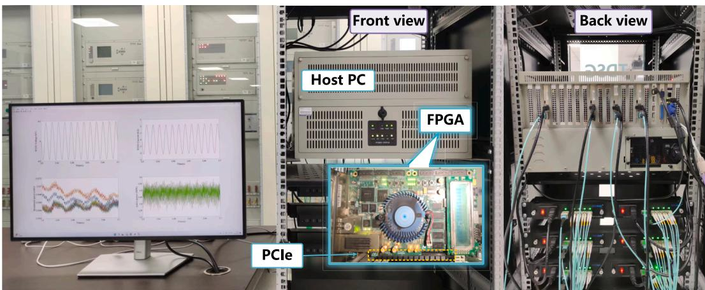  
Fig. 6. Hardware platform for the real-time simulation of REGs.

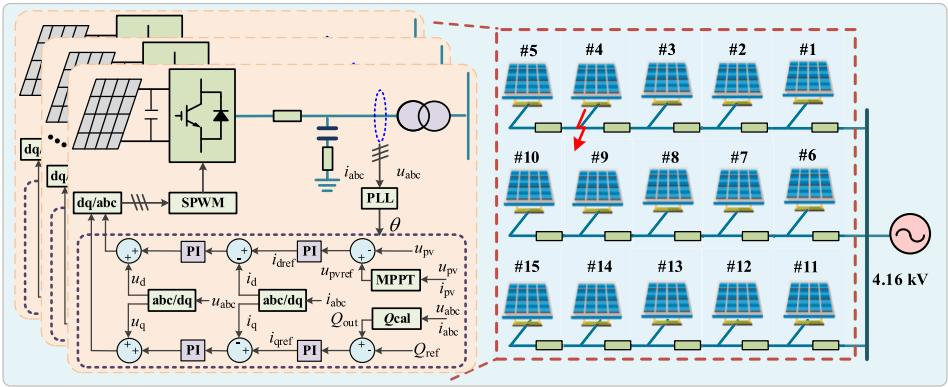  
Fig. 7. Low-voltage PV generation system topology.

Table 2 Hardware resources and time consumed by the PV generation system.   

<table><tr><td>Hardware design</td><td>Total ALM</td><td>Total BMB</td><td>ALM for control system solution</td><td>BMB for control system solution</td><td>ALM for electrical system solution</td><td>BMB for electrical system solution</td><td>Time required (clock cycle)</td><td>Control system solution time</td><td>Electrical system solution time</td><td>Total solution time</td></tr><tr><td>Proposed design</td><td>48.5%</td><td>56.4%</td><td>14.0%</td><td>0.3%</td><td>34.5%</td><td>56.1%</td><td>323</td><td>2.02 μs</td><td>8.91 μs</td><td>8.91 μs</td></tr><tr><td>Traditional design</td><td>77.8%</td><td>56.3%</td><td>43.3%</td><td>0.2%</td><td>34.5%</td><td>56.1%</td><td>325</td><td>2.03 μs</td><td>8.91 μs</td><td>8.91 μs</td></tr></table>

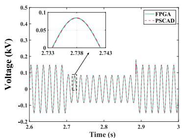  
(a) Phase-A voltage of PV unit #2

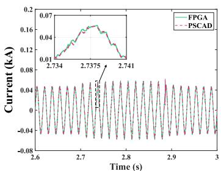  
(b) Phase-A current of PV unit #2

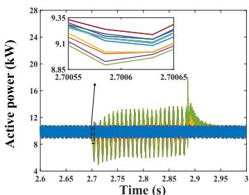  
(c) Active power of the PV units

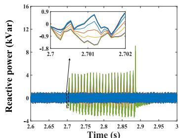  
(d) Reactive power of the PV units

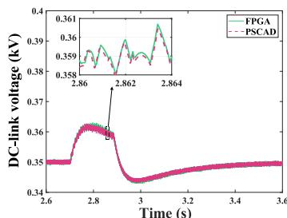  
(e) DC-link voltage of PV unit #2

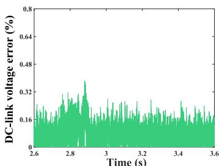  
(f) Relative error of DC-link voltage   
Fig. 8. Simulation results of the PV generation system.

# 4.2. Wind power generation system

In this section, a permanent magnet direct drive wind power generation system with 15 1.5 MW WTGs is simulated, as shown in Fig. 9. The detailed parameters are presented in Appendix D. The aerodynamic system, permanent magnet synchronous generator (PMSG) and back-toback inverter controllers are solved in the control system. The PMSG is represented by a transfer function model and connected to the network via a controlled current source [37]. The back-to-back converter is represented by the switching-function model. The wind power generation system is decomposed into 15 WTG subsystems and a network. The WTG subsystems are processed in a pipeline on FPGA. In this test case, the real-time simulation time-step is set to 10 μs. A Phase-A grid voltage

sag as low as 0.4 p.u. occurs at the PCC of WTG #4 in 1.35 s and lasts for 0.18 s.

# 4.2.1. Efficiency validation

In the test case, the dimension of the electrical system admittance matrix is 601, and the control system includes 6525 nodes. The hardware resource utilization and time consumption for the traditional and proposed designs are listed in Table 3. The traditional design utilizes most of the ALM resources on the FPGA. This necessitates a lower driven clock frequency during the analysis and synthesis processes to satisfy the timing constraints and prevent errors during operation. Thus, the traditional hardware design cannot satisfy the real-time requirements with the time-step of 10 μs. In contrast, the optimized hardware design

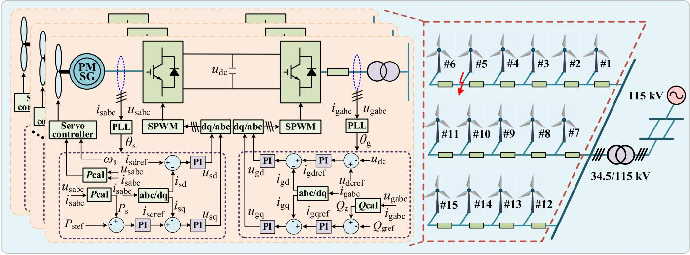  
Fig. 9. Wind power generation system topology.

Table 3 Hardware resources and time consumed by the wind power generation system.   

<table><tr><td>Hardware design</td><td>Total ALM</td><td>Total BMB</td><td>ALM for control system solution</td><td>BMB for control system solution</td><td>ALM for electrical system solution</td><td>BMB for electrical system solution</td><td>f (MHz)</td><td>Time required (clock cycle)</td><td>Control system solution time</td><td>Electrical system solution time</td><td>Total solution time</td></tr><tr><td>Proposed design</td><td>58.2%</td><td>54.7%</td><td>21.4%</td><td>0.5%</td><td>36.8%</td><td>54.2%</td><td>155</td><td>333</td><td>2.15 μs</td><td>9.81 μs</td><td>9.81 μs</td></tr><tr><td>Traditional design</td><td>88.1%</td><td>54.6%</td><td>51.3%</td><td>0.4%</td><td>36.8%</td><td>54.2%</td><td>125</td><td>351</td><td>2.81 μs</td><td>12.16 μs</td><td>12.16 μs</td></tr></table>

with lower ALM resource consumption can operate at a higher clock frequency. This facilitates a shorter solution time when the required clock cycles are similar to those in the traditional design.

# 4.2.2. Accuracy validation

The same case is simulated on PSCAD/EMTDC with a time-step of 10 μs. The waveforms of the Phase-A voltage and current of WTG #1 at the PCC are shown in Fig. 10(a) and 10(b), respectively. The waveforms of the active and reactive power of all WTGs are shown in Fig. 10(c) and 10

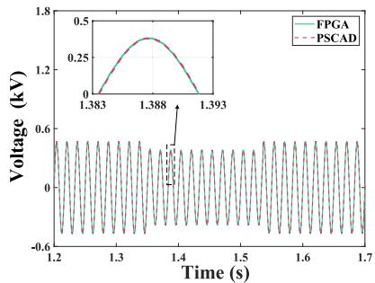  
(a) Phase-A voltage of WTG #1

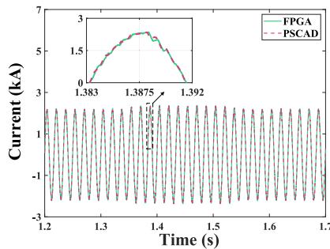  
(b) Phase-A current of WTG #1

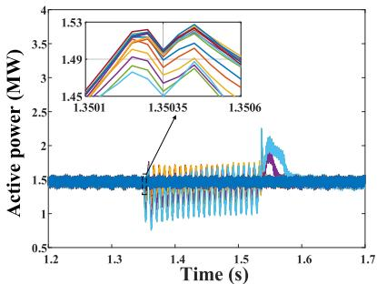  
(c) Active power of WTGs

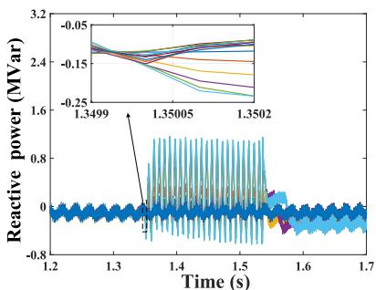  
(d) Reactive power of WTGs

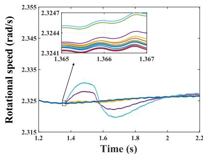  
(e) Generator rotational speed of WTGs

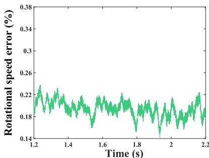  
Relative error of rotational speed   
Fig. 10. Simulation results of the wind power generation system.

(d), respectively. The generator rotational speeds of all the WTGs and the relative error of WTG #1 are shown in Fig. 10(e) and 10(f), respectively. As the WTG and collector network are modeled in detail, simulations of various internal transient processes, including different fault types and locations within a wind power generation system, can be implemented.

# 5. Conclusion

This study proposes a fine-grained hardware resource optimization and design method for the FPGA-based real-time simulation of REG control system. A hardware resource optimization model is constructed, and the shortest solution time constraint is considered. The obtained optimization strategy ensures that the hardware resource consumption is reduced, and the simulation scale can be improved. The hardware design architecture for real-time simulation of REGs enables the pipeline processing of floating-point arithmetic operations in the REG control system. The automatic HDL generation method ensures rapid generation of the functional hardware modules. Further, real-time simulations of PV and wind power generation systems have been performed on a single FPGA. The proposed hardware design reduces the computational resources consumption by 30% while ensuring the simulation accuracy

with the time-step of 10 μs. In the future research, the hardware resource optimization and automatic HDL generation will be implemented on the multi-FPGA simulation platform, in which multiple FPGAs with different chip models and computing power are integrated.

# CRediT authorship contribution statement

Yanfei Li: Writing – original draft, Methodology, Conceptualization. Zhiying Wang: Writing – review & editing, Supervision. Xiaopeng Fu: Funding acquisition, Data curation. Peng Li: Project administration. Ligang Zhao: Validation. Xiaoshan Wu: Visualization.

# Declaration of competing interest

The authors declare that they have no known competing financial interests or personal relationships that could have appeared to influence the work reported in this paper.

# Acknowledgements

This study was supported by the National Natural Science Foundation of China (grant numbers U22B20114, 52207131, and 52377118).

# Appendix A. The description of HDL code

The HDL source code has been open-sourced on GitHub (https://github.com/leo-lee313/FPGA_RTS_opt).

```verilog
module control_system (ES_input, CS_output, exchange_signal); // Control System(CS)
CS_global_control_CS_global_control(/ / control other module by signal
//Input clock
.clk(clk),
//Output, control signal of data integration module
.mux_signal(mux_signal),
//Output write enable signal of data storage and buffering module
.write_signal(write_signal),
//Output read enable signal of data storage and buffering module
.read_signal(read_signal),
//Output control signal of data exchange with Electrical System(ES)
exchange_signal(exchange_signal);
);
// the input of data integration module, merged based on the hardware design scheme
data_integration_input = {core_comput_result, hist_data, buffer_data, ES_input};
CS_data_integration_CS_data_integration(/ / merge data
//Input control signal of data integration module
.mux_signal(mux_signal),
//Input data from ES module, history data and other module
.Input(data_integration_input),
//Output data stream as input of core computation module
.Output(data_integration_output);
);
CS_core_computation CS_core_computation(/ / set of floating-point arithmetic units
//Input Data streams as floating-point arithmetic units
.Input(data_integration_output),
//Output intermediate calculation data
.Output(core_compute_result);
);
CS_data_storage_buffer CS_data_storage_buffer(
//Input intermediate calculation data
.Input(core_compute_result),
//Input write enable signal of data storage and buffering module
.write_signal(write_signal),
//Input read enable signal of data storage and buffering module
.read_signal(read_signal),
//Output buffer data, output data and history data
.Output(data_storage_buffer_output);
);
{ hist_data, buffer_data, CS_output } = data_storage_buffer_output;
endmodule
module CS_global_control (clk, mux_signal, write_signal, read_signal, exchange_signal);
always @ (poesedge clk) begin
timer = timer + 1; //count clock
if timer = t_ex.begin
exchange_signal = 1; // exchange data at fixed times after solution
end
end
for i < n_unit_input begin: //number of input ports for arithmetic units
always @ (poesedge clk) begin
// based on the hardware design scheme, generate signals of the mux
if timer = t_mux[i][j] begin //t_sta
MUX_signal[i] = mux_signal[i] + 1;
j = j + 1;
end
end
end
endgenerate
endmodule
for k < n_fifo begin:
always @ (poesedge clk) begin
// based on the hardware design scheme, generate write enable signal of FIFO
if timer = t_fifo_write[k] begin //t_sta + t-latency
write_signal[k] = 1;
end
// based on the hardware design scheme, generate read enable signal of FIFO
if timer = t_fifo_read[k] begin //t_sta
read_signal[k] = 1;
end
end
endgenerate
endmodule
module CS_data_integration (MUX_signal, Input, Output);
generate
for l < n_mul_input: mul //number of input ports for arithmetic units
mux mux( // the IP core of FPGA : LPM_MAX
.mux信号[k] = 1;
result(Output[i]) ;
end
endgenerate
endmodule
endmodule
module CS_data_storage_buffer (Input, write_signal, read_signal, Output);
generate
for k < n_fifo begin: FIFO // number of FIFO
fifo fio( // the IP core of FPGA : FIFO
.data(Input[k]), 
.rreq(read_signal[k]), 
.rreq(read_signal[k]), 
.q(Output[k]) ) ; 
```

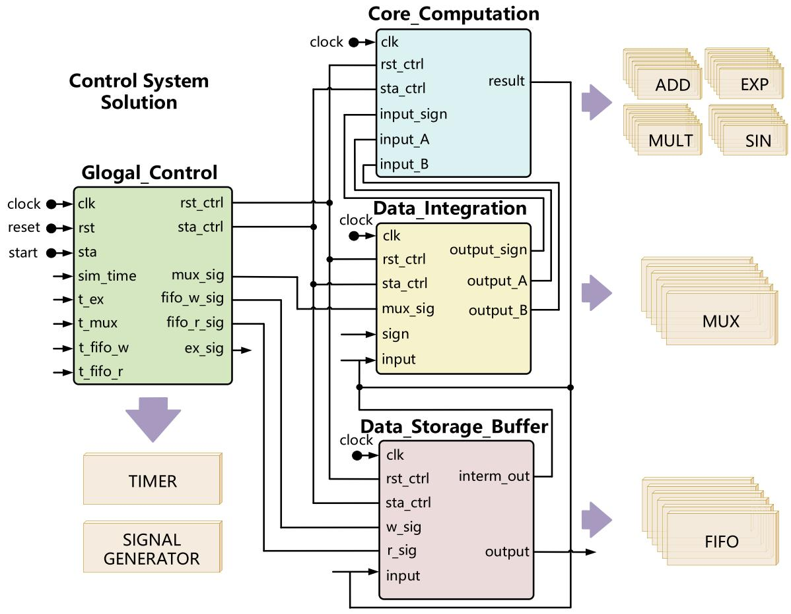  
Appendix B. The schematic of the HDL design

Appendix C. Detailed Parameters of PV   

<table><tr><td>Parameters</td><td>Sref</td><td>Tref</td><td>Iph,ref</td><td>Eg</td><td>A</td><td>CT</td><td>Np</td><td>Ns</td></tr><tr><td>Values</td><td>1000 W/m2</td><td>298 K</td><td>3.35 A</td><td>1.237 eV</td><td>54</td><td>0.065%</td><td>9</td><td>20</td></tr><tr><td>Parameters</td><td>Nominal Power</td><td>T</td><td>Qref</td><td colspan="2">Filter Inductors</td><td>Filter Capacitor</td><td colspan="2">Ratio</td></tr><tr><td>Values</td><td>10 kW</td><td>298.15 K</td><td>0 Var</td><td colspan="2">4 mH</td><td>10 μF</td><td colspan="2">0.18/4.16 kV</td></tr></table>

Appendix D. Detailed Parameters of PMSG-based WTG   

<table><tr><td colspan="6">Transformer</td><td colspan="2">Filter</td></tr><tr><td>Ratio</td><td>Nominal Power</td><td>Leakage impedance</td><td colspan="2">Magnetizing impedance</td><td>Impedance</td><td colspan="2">Capacitive reactance</td></tr><tr><td>0.575 kV / 34.5 kV</td><td>2 MVA</td><td>0.002 + j0.050 Ω</td><td colspan="2">500 + j500 Ω</td><td>0.020 + j0.236 Ω</td><td colspan="2">36.172 Ω</td></tr><tr><td colspan="5">PMSG</td><td colspan="3">Back-to-back converter</td></tr><tr><td>Moment of inertia</td><td>Number of pole pairs</td><td>Diameter of turbine blades</td><td>Stator resistant</td><td>Permanent flux</td><td>Nominal power</td><td>Rated DC bus voltage</td><td>Capacitance of the DC bus capacitor</td></tr><tr><td>105 kg·m2</td><td>120</td><td>34 m</td><td>0.008 Ω</td><td>2.458 Wb</td><td>1.500 MVA</td><td>1500 V</td><td>55 mF</td></tr></table>

# Data availability

Data will be made available on request.

# References

[1] Hassan Q, Hsu CY, Mounich K, et al. Enhancing smart grid integrated renewable distributed generation capacities: Implications for sustainable energy transformation[J]. Sustainable Energy Technol Assess 2024;66:103793.

[2] Xu J, Gao H, Wang R, et al. Real-time operation optimization in active distribution networks based on multi-agent deep reinforcement learning[J]. J Mod Power Syst Clean Energy 2024;12(3):886–99.   
[3] Tian H, Zhao H, Li H, et al. Digital twins of multiple energy networks based on realtime simulation using holomorphic embedding method, Part II: Data-driven simulation[J]. Int J Electr Power Energy Syst 2023;153:109325.   
[4] Li P, Gu W, Long H, et al. High-precision dynamic modeling of two-staged photovoltaic power station clusters[J]. IEEE Trans Power Syst 2019;34(6): 4393–407.   
[5] Konara H, Annakkage UD, Wierckx R. Co-simulation of real-time electromagnetic transient and transient stability simulations using dynamic phasor T-Line model[J]. Electr Pow Syst Res 2023;223:109611.   
[6] Leandro GC, Noda T. A steady-state initialization procedure for generic voltagesource converters in electromagnetic transient simulations[J]. Electr Pow Syst Res 2023;221:109404.   
[7] Mejia-Ruiz GE, Paternina MRA, Ramirez-Gonzalez M, et al. Real-time co-simulation of transmission and distribution networks integrated with distributed energy resources for frequency and voltage support[J]. Appl Energy 2023;347:121046.   
[8] Bai H, Luo H, Liu C, et al. A device-level transient modeling approach for the FPGAbased real-time simulation of power converters[J]. IEEE Trans Power Electron 2019;35(2):1282–92.   
[9] Scheibe C, Kuri A, Feng Y, et al. Interfacing real-time and offline power system simulation tools using UDP or FPGA systems[J]. Electr Pow Syst Res 2022;212: 108490.   
[10] Hadizadeh A, Hashemi M, Labbaf M, et al. A matrix-inversion technique for FPGAbased real-time EMT simulation of power converters[J]. IEEE Trans Ind Electron 2018;66(2):1224–34.   
[11] Xu J, Wang K, Wu P, et al. FPGA-based sub-microsecond-level real-time simulation for microgrids with a network-decoupled algorithm[J]. IEEE Trans Power Delivery 2019;35(2):987–98.   
[12] Ayop R, Tan CW, Mahmud MSA, et al. A simplified and fast computing photovoltaic model for string simulation under partial shading condition[J]. Sustainable Energy Technol Assess 2020;42:100812.   
[13] Wang C, Wang Q, Weng H, et al. A modified algorithm for the L/C-based switch model of power converters in real-time simulation based on FPGA[J]. IEEE Trans Ind Appl 2024.   
[14] Mahseredjian J, Dub´e L, Zou M, et al. Simultaneous solution of control system equations in EMTP[J]. IEEE Trans Power Syst 2006;21(1):117–24.   
[15] Laxminarayan SS, Singh M, Saifee AH, et al. Design, modeling and simulation of variable speed axial flux permanent magnet wind generator[J]. Sustainable Energy Technol Assess 2017;19:114–24.   
[16] Bai H, Liu C, Rathore AK, et al. An FPGA-based IGBT behavioral model with high transient resolution for real-time simulation of power electronic circuits[J]. IEEE Trans Ind Electron 2018;66(8):6581–91.   
[17] Zhang Q, He J, Xu Y, et al. Average-value modeling of direct-driven PMSG-based wind energy conversion systems[J]. IEEE Trans Energy Convers 2021;37(1): 264–73.   
[18] Vavilapalli S, Umashankar S, Sanjeevikumar P, et al. Three-stage control architecture for cascaded H-Bridge inverters in large-scale PV systems - real time simulation validation[J]. Appl Energy 2018;229:1111–27.

[19] Pak LF, Dinavahi V. Real-time simulation of a wind energy system based on the doubly-fed induction generator[J]. IEEE Trans Power Syst 2009;24(3):1301–9.   
[20] Jalili-Marandi V, Pak LF, Dinavahi V. Real-time simulation of grid-connected wind farms using physical aggregation[J]. IEEE Trans Ind Electron 2009;57(9):3010–21.   
[21] Nguyen TT, Vu T, Ortmeyer T, et al. Real-time transient simulation and studies of offshore wind turbines[J]. IEEE Trans Sustainable Energy 2023;14(3):1474–87.   
[22] Duan T, Huang Z, Dinavahi V. RTCE: Real-time co-emulation framework for EMTbased power system and communication network on FPGA-MPSoC hardware architecture[J]. IEEE Trans Smart Grid 2020;12(3):2544–53.   
[23] Ma X, Yang C, Zhang XP, et al. Real-time simulation of power system electromagnetic transients on FPGA using adaptive mixed-precision calculations [J]. IEEE Trans Power Syst 2022;38(4):3683–93.   
[24] Li B, Zhao H, Jiang Y, et al. Real-time simulation for detailed wind turbine model based on heterogeneous computing[J]. Int J Electr Power Energy Syst 2024;155: 109486.   
[25] Li Z, Xu J, Wang K, et al. An FPGA-based hierarchical parallel real-time simulation method for cascaded solid-state transformer[J]. IEEE Trans Ind Electron 2022;70 (4):3847–56.   
[26] Liu C, Ma R, Bai H, et al. A new approach for FPGA-based real-time simulation of power electronic system with no simulation latency in subsystem partitioning[J]. Int J Electr Power Energy Syst 2018;99:650–8.   
[27] Mirzahosseini R, Iravani R. Small time-step FPGA-based real-time simulation of power systems including multiple converters[J]. IEEE Trans Power Delivery 2019; 34(6):2089–99.   
[28] Milton M, Benigni A, Monti A. Real-time multi-FPGA simulation of energy conversion systems[J]. IEEE Trans Energy Convers 2019;34(4):2198–208.   
[29] Rødal GL, Peftitsis D. Real-time FPGA simulation of high-voltage silicon carbide MOSFETs[J]. IEEE Trans Power Electron 2022;38(3):3213–34.   
[30] Wang Z, Wang C, Li P, et al. Extendable multirate real-time simulation of active distribution networks based on field programmable gate arrays[J]. Appl Energy 2018;228:2422–36.   
[31] Song Y, Chen Y, Huang S, et al. Fully GPU-based electromagnetic transient simulation considering large-scale control systems for system-level studies[J]. IET Gener Transm Distrib 2017;11(11):2840–51.   
[32] Aini A, Salehipour A. Speeding up the Floyd-Warshall algorithm for the cycled shortest path problem[J]. Appl Math Lett 2012;25(1):1–5.   
[33] Fu H, Li P, Fu X, et al. Compact real-time simulator with spatial-temporal parallel design for large-scale wind farms[J]. CSEE J Power Energy Syst 2021;9(1):50–65.   
[34] Andersson N, Fritzson P. Overview and industrial application of code generator generators[J]. J Syst Softw 1996;32(3):185–214.   
[35] Budinsky FJ, Finnie MA, Vlissides JM, et al. Automatic code generation from design patterns[J]. IBM Syst J 1996;35(2):151–71.   
[36] Hussein DN, Matar M, Iravani R. A type-4 wind power plant equivalent model for the analysis of electromagnetic transients in power systems[J]. IEEE Trans Power Syst 2012;28(3):3096–104.   
[37] Slootweg JG, De Haan SWH, Polinder H, et al. General model for representing variable speed wind turbines in power system dynamics simulations[J]. IEEE Trans Power Syst 2003;18(1):144–51.